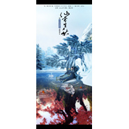

HITA
============================

|  |  |
| :--: | :-- |
| [ HITA](https://i.xiami.com/hita) | **地区**: China 中国大陆 **风格**: 古风 GuFeng Music, 流行 Pop, 中国风 China-Wave **播放数**: 37803583 **粉丝数**: 29102 **评论数**: 706  |

## 档案

音乐人，网络原创音乐团队“墨明棋妙”成员、中国原创音乐基地推荐音乐人、百度古风音乐站推荐音乐人，被誉为“古风御姐”，曲风百变，温柔婉转与大气深情均能驾驭。代表作：《礼仪之邦》《水龙吟》《昔言》。

## 专辑

| 名称 | 语种 | 唱片公司 | 发行时间 | 专辑类别 | 专辑风格 |
| :--: | :-- | :-- | :-- | :-- | :-- |
| [ 若人间是你赠我](./albums/5022425210.md) | 国语 | 独立发行 | 2021年01月11日 | EP, 单曲 | 古风 GuFeng Music |
| [ 天如水](./albums/5020853747.md) | 国语 | 邻游天下 | 2020年06月06日 | EP, 单曲 |  |
| [ 芳山永盛](./albums/5020853273.md) | 国语 | 独立发行 | 2020年06月05日 | EP, 单曲 |  |
| [ 才伤](./albums/5020848316.md) | 国语 | 扭湃哇音乐 | 2020年05月15日 | EP, 单曲 |  |
| [ 生死如寄](./albums/5020691568.md) | 国语 | 西山居世游 | 2020年04月22日 | EP, 单曲 |  |
| [ 少年与梦20200416朱一龙生贺歌](./albums/2108341028.md) | 国语 | 独立发行 | 2020年04月16日 | EP, 单曲 | 国语流行 Mandarin Pop, 流行摇滚 Pop Rock |
| [ 我且寻花去](./albums/2108283950.md) | 国语 | 独立发行 | 2020年04月07日 | EP, 单曲 | 国语流行 Mandarin Pop, 古风 GuFeng Music |
| [ 走天涯](./albums/2106059449.md) | 国语 | 讯飞超脑信息科技 | 2020年01月08日 | EP, 单曲 |  |
| [ 夜雨陈酒](./albums/2105388323.md) | 国语 |  | 2019年10月29日 | EP, 单曲 | 古风 GuFeng Music |
| [ 是我们的奇迹](./albums/2105343700.md) | 国语 | 三咖文化 | 2019年09月30日 | EP, 单曲 |  |
| [ 如常《永远的7日之都》司篁角色歌](./albums/2105329773.md) | 国语 |  | 2019年09月26日 | EP, 单曲 | 流行 Pop |
| [ 同簪](./albums/2105329614.md) | 国语 |  | 2019年06月16日 | EP, 单曲 | 流行 Pop |
| [ 四时歌](./albums/2104867312.md) | 国语 | 腾讯 | 2019年05月19日 | EP, 单曲 | 国语流行 Mandarin Pop, 中国风 China-Wave |
| [ 循光朱一龙生日应援歌](./albums/2105329775.md) | 国语 |  | 2019年04月16日 | EP, 单曲 | 国语流行 Mandarin Pop |
| [ 西洲旧梦《大唐无双》端游新职业“风华”主题曲](./albums/2104724649.md) | 国语 |  | 2019年03月28日 | EP, 单曲 | 古风 GuFeng Music, 中国传统民歌 Chinese Traditional Folk, 中国风 China-Wave |
| [ 又见梁祝](./albums/2104480819.md) | 国语 | HIFIVE | 2019年01月11日 | EP, 单曲 | 国语流行 Mandarin Pop |
| [ 镇断魂《镇魂》巍澜粤语同人](./albums/2104194980.md) | 粤语 |  | 2018年11月09日 | EP, 单曲 | 粤语流行 Cantopop |
| [ 赤伶](./albums/2104058303.md) | 国语 | 独立发行 | 2018年09月27日 | EP, 单曲 | 古风 GuFeng Music |
| [ 未竭《镇魂》巍澜同人](./albums/2103923326.md) | 国语 | 独立发行 | 2018年08月14日 | EP, 单曲 | 国语流行 Mandarin Pop |
| [ 为爱不朽](./albums/2103527408.md) | 国语 | 独立发行 | 2018年02月12日 | EP, 单曲 | 古风 GuFeng Music |
| [ 乔双花](./albums/2103508287.md) | 国语 | 看见文娱 | 2018年01月30日 | EP, 单曲 | 古风 GuFeng Music |
| [ With or Without Me 安能共我记《霍比特人》](./albums/2102859923.md) | 英语 | 独立发行 | 2017年09月19日 | EP, 单曲 | 凯尔特新世纪 Celtic New Age |
| [ 倾城](./albums/2102733084.md) | 国语 | 独立发行 | 2017年04月16日 | EP, 单曲 | 爵士 Jazz, 古风 GuFeng Music |
| [ 木香](./albums/2102689480.md) | 国语 | 独立发行 | 2017年02月01日 | EP, 单曲 | 古风 GuFeng Music |
| [ 云里江南《天下3》官方音乐专辑收录曲](./albums/2102413254.md) | 国语 |  | 2016年10月24日 | EP, 单曲 | 中国风 China-Wave |
| [ 梦回还](./albums/2102405660.md) | 国语 |  | 2016年10月10日 | EP, 单曲 |  |
| [ 戏梦雁丘](./albums/2102403550.md) | 国语 |  | 2016年09月25日 | EP, 单曲 |  |
| [ 洛阳夜雨](./albums/2100384412.md) | 国语 | 独立发行 | 2016年08月29日 | EP, 单曲 | 中国风 China-Wave |
| [ 听路人之沧海桑田](./albums/2100384418.md) | 国语 | 独立发行 | 2016年08月20日 | 原声带, 影视音乐 | 古风 GuFeng Music |
| [ 梦遣看花人](./albums/2100231240.md) | 国语 | 独立发行 | 2015年10月30日 | EP, 单曲 | 中国曲艺 Chinese Quyi, 中国风 China-Wave |
| [ 逍遥调《新寻仙》“情义无双”版本主题歌](./albums/2100228728.md) | 国语 | 独立发行 | 2015年10月27日 | EP, 单曲 | 民族融合新世纪 Ethnic Fusion New Age, 国语流行 Mandarin Pop, 华语唱作人 Chinese Singer-Songwriter |
| [ 缘尽世间](./albums/429620691.md) | 国语 | 独立发行 | 2015年04月13日 | EP, 单曲 | 中国风 China-Wave |
| [ 当爱已成往事](./albums/1729619903.md) | 国语 | 独立发行 | 2015年04月01日 | EP, 单曲 |  |
| [ 独立寒江·曲无忆](./albums/1229620588.md) | 国语 | 独立发行 | 2015年03月24日 | EP, 单曲 | 古风 GuFeng Music |
| [ 海阔山遥](./albums/729619387.md) | 国语 | 独立发行 | 2015年03月11日 | EP, 单曲 |  |
| [ 当我们老去](./albums/2029620508.md) | 国语 | 独立发行 | 2015年02月14日 | EP, 单曲 |  |
| [ 霸者之刃](./albums/229618927.md) | 国语 | 小旭音乐 | 2015年01月25日 | EP, 单曲 |  |
| [ 露草行](./albums/1329620358.md) | 国语 | 独立发行 | 2015年01月21日 | EP, 单曲 | 古风 GuFeng Music |
| [ 问世间](./albums/1729618760.md) | 国语 | 独立发行 | 2015年01月18日 | EP, 单曲 | 古风 GuFeng Music |
| [ 广寒](./albums/1629620428.md) | 国语 | 独立发行 | 2015年01月10日 | EP, 单曲 | 中国风 China-Wave |
| [ 待我长发及腰](./albums/1024857195.md) | 国语 | 独立发行 | 2014年12月22日 | EP, 单曲 | 中国风 China-Wave |
| [ 水龙吟](./albums/437355234.md) | 国语 | 独立发行 | 2014年12月18日 | EP, 单曲 | 民族融合新世纪 Ethnic Fusion New Age |
| [ 守候古剑奇谭陵越、百里屠苏同人](./albums/404957549.md) | 国语 | 独立发行 | 2014年07月09日 | EP, 单曲 | 国语流行 Mandarin Pop, 古风 GuFeng Music |
| [ 献天缘](./albums/299259272.md) | 国语 | 墨明棋妙 | 2014年04月30日 | 原声带, 影视音乐 | 古风 GuFeng Music |
| [ 仙骨生秋记清和真人](./albums/498664773.md) | 国语 | 墨明棋妙 | 2014年04月19日 | EP, 单曲 |  |
| [ 千年调](./albums/2100301816.md) | 国语 | 独立发行 | 2014年02月05日 | 录音室专辑 | 流行摇滚 Pop Rock, 华语唱作人 Chinese Singer-Songwriter |
| [ 少年游(无念白版)](./albums/90373401.md) | 国语 | 墨明棋妙 | 2014年01月04日 | EP, 单曲 | 古风 GuFeng Music |
| [ 笑傲万世](./albums/2090380645.md) | 国语 | 墨明棋妙 | 2013年12月29日 | EP, 单曲 | 古风 GuFeng Music |
| [ 去矣归兮](./albums/388722711.md) | 国语 | 墨名棋妙 | 2013年12月22日 | EP, 单曲 |  |
| [ 京华一梦](./albums/86662701.md) | 国语 | 墨名棋妙 | 2013年12月07日 | EP, 单曲 |  |
| [ 江山孤客记夏夷则](./albums/84852934.md) | 国语 | 墨名棋妙 | 2013年11月08日 | EP, 单曲 | 古风 GuFeng Music |
| [ 亭前豆蔻](./albums/1284758979.md) | 国语 | 墨名棋妙 | 2013年11月08日 | EP, 单曲 |  |
| [ 殊途](./albums/1582407964.md) | 国语 | 独立发行 | 2013年10月19日 | EP, 单曲 | 古风 GuFeng Music |
| [ 寻鹿](./albums/181736456.md) | 国语 | 墨明棋妙 | 2013年09月18日 | EP, 单曲 |  |
| [ 风花雪月](./albums/1681203982.md) | 国语 | 墨明棋妙 | 2013年09月17日 | EP, 单曲 |  |
| [ 乔双花“艺式三国”吴·二部曲](./albums/1478103060.md) | 国语 | 墨明棋妙 | 2013年08月29日 | EP, 单曲 | 中国风 China-Wave |
| [ 古剑奇谭2 桢姬哼唱](./albums/778103443.md) | 国语 | 墨明棋妙 | 2013年08月29日 | EP, 单曲 |  |
| [ 凤楼吟](./albums/1774464620.md) | 国语 | 墨明棋妙 | 2013年07月20日 | EP, 单曲 | 古风 GuFeng Music |
| [ 贪欢](./albums/74028303.md) | 国语 | 墨明棋妙 | 2013年07月13日 | EP, 单曲 | 古风 GuFeng Music |
| [ 画影](./albums/1872044118.md) | 国语 | 墨明棋妙 | 2013年06月22日 | EP, 单曲 |  |
| [ 铜雀赋](./albums/871709915.md) | 国语 | 墨明棋妙 | 2013年06月18日 | EP, 单曲 | 古风 GuFeng Music |
| [ 黄泉月](./albums/1890380671.md) | 国语 | 墨明棋妙 | 2013年06月01日 | EP, 单曲 |  |
| [ 为爱西行](./albums/269625485.md) | 国语 | 墨明棋妙 | 2013年05月24日 | EP, 单曲 |  |
| [ 春色古剑奇谭](./albums/576486.md) | 国语 | 独立发行 | 2012年12月27日 | EP, 单曲 | 古风 GuFeng Music |
| [ 好梦如旧](./albums/1570311995.md) | 国语 | 墨明棋妙 | 2012年09月30日 | EP, 单曲 | 中国风 China-Wave |
| [ 竹春月夜](./albums/399450913.md) | 国语 | 独立发行 | 2012年08月23日 | EP, 单曲 |  |
| [ 九天倾歌·月上灯](./albums/537191.md) | 国语 | 独立发行 | 2012年08月19日 | EP, 单曲 | 古风 GuFeng Music |
| [ 兰芷铃音·记兰生襄铃](./albums/1966013615.md) | 国语 | 独立发行 | 2012年08月08日 | EP, 单曲 | 中国风 China-Wave |
| [ 侠客行](./albums/531868.md) | 国语 | 墨明棋妙 | 2012年07月10日 | EP, 单曲 | 古风 GuFeng Music |
| [ 空山流水](./albums/524813.md) | 国语 | 墨明棋妙 | 2012年06月17日 | EP, 单曲 | 古风 GuFeng Music |
| [ 一言诺](./albums/524142.md) | 国语 | 墨明棋妙 | 2012年06月12日 | EP, 单曲 | 中国风 China-Wave |
| [ 不悔](./albums/531869.md) | 国语 | 墨明棋妙 | 2012年06月02日 | EP, 单曲 | 古风 GuFeng Music |
| [ 梦回兰若](./albums/488729281.md) | 国语 | 独立发行 | 2012年05月18日 | EP, 单曲 | 古风 GuFeng Music |
| [ 色禁](./albums/2092972212.md) | 国语 | 独立发行 | 2012年05月18日 | EP, 单曲 | 古风 GuFeng Music |
| [ 昔时](./albums/290380820.md) | 国语 | 独立发行 | 2012年04月10日 | EP, 单曲 | 古风 GuFeng Music |
| [ 桃叶临渡](./albums/506157.md) | 国语 | 墨明棋妙 | 2012年04月03日 | EP, 单曲 | 古风 GuFeng Music |
| [ 一梦如是·记鸠摩罗什](./albums/507446.md) | 国语 | 独立发行 | 2012年04月03日 | EP, 单曲 | 古风 GuFeng Music |
| [ 松窗棋罢](./albums/502848.md) | 国语 | 墨明棋妙 | 2012年02月07日 | EP, 单曲 | 古风 GuFeng Music |
| [ 天命风流](./albums/1385366152.md) | 国语 | 独立发行 | 2011年08月13日 | EP, 单曲 | 古风 GuFeng Music |
| [ 凤于九天](./albums/1699450990.md) | 国语 | 独立发行 | 2011年06月01日 | EP, 单曲 |  |
| [ 踏月留香记楚留香](./albums/475883.md) | 国语 | 墨明棋妙 | 2010年10月18日 | EP, 单曲 | 中国风 China-Wave |
| [ 百变](./albums/396814.md) | 国语 | SEKI'S FAMILY | 2010年08月19日 | 精选集 | 中国风 China-Wave |
| [ 再逢明月照九州](./albums/361483.md) | 国语 | 墨明棋妙 | 2009年09月09日 | EP, 单曲 | 中国风 China-Wave |
| [ 佳人如梦令](./albums/361529.md) | 国语 | 墨明棋妙 | 2009年09月09日 | EP, 单曲 | 古风 GuFeng Music |
| [ 百变 vol.1  mini special](./albums/339371.md) | 国语 | SEKI'S FAMILY | 2008年12月13日 | 录音室专辑 |  |
| [ 百变 vol.1](./albums/412536.md) | 国语 | SEKI'S FAMILY | 2008年12月13日 | 录音室专辑 |  |
| [ 步步皆殇](./albums/435519.md) | 国语 | 墨明棋妙 | 2008年08月03日 | EP, 单曲 | 古风 GuFeng Music |

## 评论

|  |  |  |
| :-- | :-- | :-- |
|  [虾米用户](https://emumo.xiami.com/u/316502674) 在最后陪着你吧，我的虾米 2020-10-06 15:36 赞(0) 踩(0) | 
虾米啥都好，就是古风歌不全，我恨
 |
|  [虾米用户](https://emumo.xiami.com/u/410014208)  2020-09-28 08:07 赞(0) 踩(0) | 
&amp;ge;﹏&amp;le;好不容易有个可以单曲购买的平台却没有版权真可惜
 |
|  [虾米用户](https://emumo.xiami.com/u/119848350)  2020-05-13 00:25 赞(0) 踩(0) | 
厉害
 |
|  [虾米用户](https://emumo.xiami.com/u/314749065)  2019-11-03 15:46 赞(2) 踩(0) | 
有点怀念五年前自己单纯的模样，不为别的，就希望还能和我的姐姐开开心心的，有好东西一起吃，有好玩的一起玩。无拘无束，无忧无虑的日子真的很开心！南阿弥陀佛观世音菩萨希望我的姐姐在天堂一切安好！
 |
|  [虾米用户](https://emumo.xiami.com/u/404026779)  2019-10-21 10:05 赞(0) 踩(0) | 
，
 |
|  [虾米用户](https://emumo.xiami.com/u/15629063)  2019-09-20 13:18 赞(1) 踩(0) | 
第一次听到你的歌就知道这是属于我的天空之城的声音
 |
|  [虾米用户](https://emumo.xiami.com/u/326384075)  2019-08-15 14:22 赞(1) 踩(0) | 
有点像张碧晨
 |
|  [虾米用户](https://emumo.xiami.com/u/321542034) 如果爱，请深爱。 2019-08-02 23:26 赞(0) 踩(0) | 
很好听
 |
|  [虾米用户](https://emumo.xiami.com/u/282022014) 音樂………………：人類自... 2019-06-09 15:37 赞(3) 踩(0) | 
高雅古風之曲值得推崇！！！         
 |
|  [虾米用户](https://emumo.xiami.com/u/2742824)  2019-04-04 09:17 赞(0) 踩(0) | 
听过很多古风作者的作品，觉得你有很大突破。
 |
|  [虾米用户](https://emumo.xiami.com/u/411483499) 我的个性不需你知晓 2019-02-24 22:00 赞(0) 踩(0) | 
我的名字后两个字是采微   
 |
|  [虾米用户](https://emumo.xiami.com/u/4487129)  2019-02-23 17:25 赞(0) 踩(0) | 
！！！
 |
|  [虾米用户](https://emumo.xiami.com/u/176111066) 北国风光，千里冰封，万里... 2019-02-15 10:52 赞(1) 踩(0) | 
第一次听到就喜欢上了
 |
|  [虾米用户](https://emumo.xiami.com/u/43264663)   2019-01-07 19:06 赞(1) 踩(0) | 
美女～啦啦
 |
|  [虾米用户](https://emumo.xiami.com/u/257462111)  2019-01-01 07:54 赞(1) 踩(0) | 
人美心灵手巧
 |
|  [虾米用户](https://emumo.xiami.com/u/359532336)  不怕念起，唯恐觉迟；既... 2018-12-02 08:20 赞(1) 踩(0) | 
喜欢
 |
|  [虾米用户](https://emumo.xiami.com/u/409444502) 最是人间留不住，朱颜辞镜... 2018-11-27 21:48 赞(0) 踩(0) | 
喜欢古风 
 |
|  [虾米用户](https://emumo.xiami.com/u/4400366) 再也不见 2018-11-24 01:44 赞(0) 踩(0) | 
囍
 |
|  [虾米用户](https://emumo.xiami.com/u/242930835) 愿得一人心，白首不相离！ 2018-11-07 20:28 赞(0) 踩(0) | 
漂亮的才女
 |
|  [虾米用户](https://emumo.xiami.com/u/245834606)  2018-10-19 15:00 赞(0) 踩(0) | 
好喜欢你 
 |
|  [虾米用户](https://emumo.xiami.com/u/309548596) 音乐让我说…… 2018-10-08 16:48 赞(1) 踩(0) | 
88VIP是个啥操作？！ 
 |
|  [虾米用户](https://emumo.xiami.com/u/375510423)  2018-08-24 11:31 赞(0) 踩(0) | 
不错哦
 |
|  [虾米用户](https://emumo.xiami.com/u/43618752)  2018-08-20 13:26 赞(0) 踩(0) | 
随机听到的，昔言，很惊艳，加油
 |
|  [虾米用户](https://emumo.xiami.com/u/376635296) 我还没想好要写什么... 2018-07-01 08:05 赞(0) 踩(0) | 
呵呵力害
 |
|  [虾米用户](https://emumo.xiami.com/u/280195860) 音乐随风来，静静悠悠听 2018-06-14 08:42 赞(1) 踩(0) | 
在如今歌坛 能入我耳的音乐人 不超过五个，HITA 就是其中之一  声音自然，舒心   能静下心来做音乐  值得期待！
 |
|  [虾米用户](https://emumo.xiami.com/u/288266954)  2018-06-12 00:07 赞(0) 踩(0) | 
长像漂亮
 |
|  [虾米用户](https://emumo.xiami.com/u/370466673)  2018-05-22 12:51 赞(0) 踩(0) | 
z n d z d z j b c, x r !
 |
|  [虾米用户](https://emumo.xiami.com/u/333389314) 交流是增进感情的最好方法 2018-05-19 09:39 赞(0) 踩(0) | 
声音好好听...... 
 |
|  [虾米用户](https://emumo.xiami.com/u/37623804) 天上繁星点点 2018-05-13 14:26 赞(0) 踩(0) | 
小姐姐！
 |
|  [虾米用户](https://emumo.xiami.com/u/357674040)  2018-05-09 07:04 赞(0) 踩(0) | 

 |
|  [虾米用户](https://emumo.xiami.com/u/338507029)  2018-04-30 20:58 赞(0) 踩(0) | 
24900收藏 get
 |
|  [虾米用户](https://emumo.xiami.com/u/358377542)  2018-04-15 17:24 赞(0) 踩(0) | 
加油
 |
|  [虾米用户](https://emumo.xiami.com/u/358154285)  2018-04-14 15:42 赞(0) 踩(0) | 
古风味道就如天边彩霞袭来，默默看便无语了，洗耳恭听吧......
 |
|  [虾米用户](https://emumo.xiami.com/u/334276794)  2018-04-06 19:00 赞(1) 踩(0) | 
喜欢 还有我是第666个评论。
 |
|  [虾米用户](https://emumo.xiami.com/u/253827571) 笑看嫣红染半山   逐风... 2018-03-29 12:41 赞(0) 踩(0) | 
我就想问问，凤于九天到底什么时候发布，能不能去掉那些独白
 |
|  [虾米用户](https://emumo.xiami.com/u/181265734) 等风来 2018-03-18 17:06 赞(0) 踩(0) | 
大家加油
 |
|  [虾米用户](https://emumo.xiami.com/u/4400366) 再也不见 2018-03-11 05:28 赞(0) 踩(0) | 
囍
 |
|  [虾米用户](https://emumo.xiami.com/u/336203485) 我還不想被發現 2018-02-28 09:16 赞(1) 踩(0) | 
求敘世！！！！
 |
|  [虾米用户](https://emumo.xiami.com/u/330415514)  2018-02-19 16:03 赞(3) 踩(0) | 
最初听你的歌是从十年前的寻仙听到的，《如梦令》
 |
|  [虾米用户](https://emumo.xiami.com/u/285348850)  2018-02-17 19:27 赞(2) 踩(0) | 
喜欢你的人，更喜欢你的歌，嘻嘻嘻嘻嘻！
 |
|  [虾米用户](https://emumo.xiami.com/u/1665678) 我若青帝。 2018-02-03 20:00 赞(4) 踩(0) | 
喜欢塔姐六年啦。
 |
|  [虾米用户](https://emumo.xiami.com/u/342105603)  2018-01-26 16:17 赞(2) 踩(0) | 
赞赞赞赞赞                          
 |
|  [虾米用户](https://emumo.xiami.com/u/101961324)             ... 2018-01-19 00:32 赞(2) 踩(0) | 
特别喜欢你 
 |
|  [虾米用户](https://emumo.xiami.com/u/344793366) 嗨 2018-01-14 20:05 赞(1) 踩(0) | 
 
 |
|  [虾米用户](https://emumo.xiami.com/u/85008772)  2018-01-11 18:20 赞(1) 踩(0) | 
高中就喜欢你了哟
 |
|  [虾米用户](https://emumo.xiami.com/u/304262778)  2017-12-14 20:37 赞(1) 踩(0) | 
   
 |
|  [虾米用户](https://emumo.xiami.com/u/332626800)  2017-11-30 03:39 赞(2) 踩(0) | 
很暖很甜 有些歌曲风不好
 |
|  [虾米用户](https://emumo.xiami.com/u/12065509) 一个比高数题还难读懂的男... 2017-11-22 19:55 赞(1) 踩(0) | 
听了再逢明月照九州来的，听了排名前面几首，差点弃了。还好又往下翻了翻随便找了首歌听。真是太好听的声音了！为什么会有这么好听的声音~~一听就上瘾*٩(๑&amp;acute;&amp;forall;`๑)ง*
 |
|  [虾米用户](https://emumo.xiami.com/u/321934853) 念及你时，我若微笑，心中... 2017-11-04 16:53 赞(2) 踩(0) | 
天籁！女神！
 |
|  [虾米用户](https://emumo.xiami.com/u/333015077)  2017-11-03 19:16 赞(2) 踩(0) | 
喜欢
 |
|  [虾米用户](https://emumo.xiami.com/u/331933379) 问世间情为何物 2017-10-29 11:14 赞(2) 踩(0) | 
你的歌听起来还不错，继续努力吧！，你要相信你自己一定是最棒，我挺你哟！加油！
 |
|  [虾米用户](https://emumo.xiami.com/u/360124) N久不来虾米了，最近都在... 2017-10-27 23:28 赞(27) 踩(0) | 
很喜欢hita的声音，虽然她的声音并不属于空灵通透的惊艳之音，但是总觉得舒缓的音调中有着莫名得亲切，似乎歌者离我们很近，没有距离感。
 |
|  [虾米用户](https://emumo.xiami.com/u/267978990) 游荡在草原上寻找狼群的孤... 2017-10-15 19:53 赞(2) 踩(0) | 
b站腊肉过来了 
 |
|  [虾米用户](https://emumo.xiami.com/u/278556006)  2017-10-15 15:25 赞(2) 踩(0) | 
狐妖小红娘，我每一看都哭
 |
|  [虾米用户](https://emumo.xiami.com/u/254394737) 知道你们喜欢听歌 2017-10-09 22:29 赞(1) 踩(0) | 
这不是陈倩倩的&amp;lt;婴儿&amp;gt;吗？
 |
|  [虾米用户](https://emumo.xiami.com/u/285342803) 从今天开始爱上音乐 2017-10-09 03:44 赞(4) 踩(0) | 
Hite好多古风歌，都挺不错的，一一听来
 |
| ⇒ |  [虾米用户](https://emumo.xiami.com/u/285342803) 从今天开始爱上音乐 2017-10-09 03:44 赞(0) 踩(0) | 
hita 
 |
|  [虾米用户](https://emumo.xiami.com/u/327008383)  2017-10-07 16:17 赞(2) 踩(0) | 
姐姐，你唱的歌很好听，加油↖(^&amp;omega;^)↗
 |
|  [虾米用户](https://emumo.xiami.com/u/320537074)  2017-09-09 21:48 赞(3) 踩(0) | 
第一次听hita的歌就觉得超好听
 |
|  [虾米用户](https://emumo.xiami.com/u/38813699) 我还没想好要写什么... 2017-09-09 15:44 赞(1) 踩(0) | 
喜欢你的歌，让我工作更有劲
 |
|  [虾米用户](https://emumo.xiami.com/u/218583766) 今古有神奉志士 2017-08-21 22:01 赞(1) 踩(0) | 
天籁之音
 |
|  [虾米用户](https://emumo.xiami.com/u/218583766) 今古有神奉志士 2017-08-21 22:01 赞(1) 踩(0) | 
天籁之音
 |
|  [虾米用户](https://emumo.xiami.com/u/277914084) 青松碎云蹁跹，饮风共醉月... 2017-08-12 02:36 赞(2) 踩(0) | 
唱功非常棒～特喜欢听你的歌奥～就这么简单～喜欢你～爱听～
 |
|  [虾米用户](https://emumo.xiami.com/u/315070973)  2017-08-02 18:31 赞(1) 踩(0) | 
(梦回还)好听，节奏可以
 |
|  [虾米用户](https://emumo.xiami.com/u/281804169)  2017-07-23 12:16 赞(1) 踩(0) | 
古风，路转粉！
 |
|  [虾米用户](https://emumo.xiami.com/u/105282874)  2017-07-21 22:06 赞(1) 踩(0) | 
女神
 |
|  [虾米用户](https://emumo.xiami.com/u/298267568)  2017-06-20 08:25 赞(1) 踩(0) | 
大爱古风歌曲
 |
|  [虾米用户](https://emumo.xiami.com/u/272668969)   2017-06-15 15:38 赞(3) 踩(0) | 
第一次接触到古风就是女神的歌，大爱塔姐～
 |
|  [虾米用户](https://emumo.xiami.com/u/181462018)  2017-05-29 06:55 赞(1) 踩(0) | 
好听 
 |
|  [虾米用户](https://emumo.xiami.com/u/38473826)   2017-05-02 09:16 赞(2) 踩(0) | 
32个赞，好听
 |
|  [虾米用户](https://emumo.xiami.com/u/290405107) 爱笑的自己最美，最高贵 2017-04-21 21:10 赞(2) 踩(0) | 
好听 
 |
|  [虾米用户](https://emumo.xiami.com/u/265760899) 因为个性没有签名 2017-04-12 12:41 赞(1) 踩(0) | 
好听，支持你塔姐
 |
|  [虾米用户](https://emumo.xiami.com/u/272813931)  2017-04-11 15:43 赞(1) 踩(0) | 
第一次认真地听古风歌曲，HITA的白头吟、再逢明月照九州等令人心醉神迷！
 |
|  [虾米用户](https://emumo.xiami.com/u/6166411) 喜歡的城市 ，沒有妳。 2017-04-10 17:39 赞(0) 踩(0) | 
...
 |
|  [虾米用户](https://emumo.xiami.com/u/285869207) 不许百花争艳，笑看寒风乍... 2017-04-04 05:38 赞(1) 踩(0) | 
好听
 |
|  [虾米用户](https://emumo.xiami.com/u/285864430)  2017-04-04 02:55 赞(1) 踩(0) | 
好听
 |
|  [虾米用户](https://emumo.xiami.com/u/282260352)  2017-03-21 20:40 赞(1) 踩(0) | 
好聽
 |
|  [虾米用户](https://emumo.xiami.com/u/268797440)  2017-03-18 21:09 赞(1) 踩(0) | 
不刚怎么说，就俩字，好听
 |
|  [虾米用户](https://emumo.xiami.com/u/281404499)  2017-03-18 19:07 赞(1) 踩(0) | 
很喜欢古风歌曲，感觉带给人的意境很美。
 |
|  [虾米用户](https://emumo.xiami.com/u/280736400) 人山人海，边走边爱，反正... 2017-03-16 18:35 赞(1) 踩(0) | 
好听
 |
|  [虾米用户](https://emumo.xiami.com/u/423315)  2017-03-13 22:59 赞(1) 踩(0) | 
藏海花过来的 这声儿 秒跪
 |
|  [虾米用户](https://emumo.xiami.com/u/260176390)  2017-03-04 06:39 赞(2) 踩(0) | 
网络原创音乐团队&amp;ldquo;墨明棋妙&amp;rdquo;成员，&amp;ldquo;百度偶像&amp;rdquo;官方认证音乐人、中国原创音乐基地推荐音乐人、音乐翻唱网推荐歌手。
 |
|  [虾米用户](https://emumo.xiami.com/u/248987998)  2017-03-01 03:45 赞(2) 踩(0) | 
梦回兰若好听
 |
|  [虾米用户](https://emumo.xiami.com/u/276543980)  2017-02-27 15:37 赞(1) 踩(0) | 
来了
 |
|  [虾米用户](https://emumo.xiami.com/u/55102421)  2017-02-06 16:20 赞(2) 踩(0) | 
她的昔言好好听，可以去听听
 |
|  [虾米用户](https://emumo.xiami.com/u/261834019)  2017-01-26 20:01 赞(1) 踩(0) | 
666666
 |
|  [虾米用户](https://emumo.xiami.com/u/264917075)  2017-01-22 15:18 赞(1) 踩(0) | 
唱什么都好听 
 |
|  [虾米用户](https://emumo.xiami.com/u/169474322)   2017-01-10 23:15 赞(2) 踩(0) | 
特别喜欢好梦如旧
 |
|  [虾米用户](https://emumo.xiami.com/u/32329041)  2016-12-22 22:50 赞(2) 踩(0) | 
最喜欢她的采薇
 |
|  [虾米用户](https://emumo.xiami.com/u/6177361)  2016-12-16 00:32 赞(1) 踩(0) | 
HITA- 步步梦归尘，你唱得最好听，为何没上这首歌?
 |
|  [虾米用户](https://emumo.xiami.com/u/8070377) 爱雾瑞性维欧腐漏 2016-12-04 12:50 赞(2) 踩(0) | 
拒绝撕逼
 |
|  [虾米用户](https://emumo.xiami.com/u/247468429)  2016-11-26 09:25 赞(1) 踩(0) | 
我喜欢
 |
|  [虾米用户](https://emumo.xiami.com/u/33575558) 一丈孤勇心外仙 2016-11-25 10:24 赞(1) 踩(0) | 
表白你
 |
|  [虾米用户](https://emumo.xiami.com/u/160991974)   2016-11-20 13:36 赞(2) 踩(0) | 
请问HITA演唱的《眉间雪》是不是还没录入？
 |
|  [虾米用户](https://emumo.xiami.com/u/51812118) 只会被不相干的人遗忘 2016-11-08 10:08 赞(1) 踩(0) | 
598
 |
|  [虾米用户](https://emumo.xiami.com/u/32416351) 民间习俗曲艺制作人刘笑笑 2016-10-27 20:35 赞(2) 踩(0) | 
喜欢古风歌曲
 |
|  [虾米用户](https://emumo.xiami.com/u/34385285)  2016-10-12 22:41 赞(1) 踩(0) | 
nice
 |
|  [虾米用户](https://emumo.xiami.com/u/7135708)  2016-10-12 20:40 赞(1) 踩(0) | 
超喜欢的古风歌者
 |
|  [虾米用户](https://emumo.xiami.com/u/84993952) 我还没想好要写什么... 2016-10-03 01:24 赞(1) 踩(0) | 
声音不腻
 |
|  [虾米用户](https://emumo.xiami.com/u/221961115)  2016-09-03 17:31 赞(0) 踩(0) | 
塔姐塔姐我爱你~
 |
|  [虾米用户](https://emumo.xiami.com/u/221140801)  2016-09-03 15:03 赞(1) 踩(0) | 
声音真美
 |
|  [虾米用户](https://emumo.xiami.com/u/187617264) 不要试图接近我 2016-08-28 22:26 赞(1) 踩(0) | 
jy
 |
|  [虾米用户](https://emumo.xiami.com/u/216608235)  2016-08-22 21:05 赞(2) 踩(0) | 
偌大一个古风圈，唯爱塔姐一人
 |
|  [虾米用户](https://emumo.xiami.com/u/11052613) 阳光猛烈，万物显形。 2016-07-27 08:30 赞(1) 踩(0) | 
十字迷局
 |
|  [虾米用户](https://emumo.xiami.com/u/105282874)  2016-07-12 07:02 赞(1) 踩(0) | 
塔姐加油！！！
 |
|  [虾米用户](https://emumo.xiami.com/u/73885664)  2016-06-27 14:44 赞(2) 踩(0) | 
喜欢古风歌曲
 |
|  [虾米用户](https://emumo.xiami.com/u/73885664)  2016-06-27 14:44 赞(1) 踩(0) | 
喜欢古风歌曲
 |
|  [虾米用户](https://emumo.xiami.com/u/3307075)   2016-06-06 16:38 赞(1) 踩(0) | 
就是喜欢
 |
|  [虾米用户](https://emumo.xiami.com/u/177120068)  2016-05-23 00:03 赞(20) 踩(0) | 
女神加油↖(^ω^)↗
 |
|  [虾米用户](https://emumo.xiami.com/u/7598146)  2016-05-05 09:29 赞(4) 踩(0) | 
声音好听~~
 |
|  [虾米用户](https://emumo.xiami.com/u/158640624) 。 2016-05-02 09:35 赞(2) 踩(0) | 
被塔姐声音美到腿软，大赞！
 |
|  [虾米用户](https://emumo.xiami.com/u/144043324)  2016-04-23 11:05 赞(0) 踩(0) | 
缺席呢
 |
|  [虾米用户](https://emumo.xiami.com/u/52511505)  2016-03-14 11:59 赞(2) 踩(0) | 
HITA
 |
|  [虾米用户](https://emumo.xiami.com/u/2711900)  2016-03-09 09:52 赞(2) 踩(0) | 
赞，耳目一新！
 |
|  [虾米用户](https://emumo.xiami.com/u/8424657) 海岸线 2016-02-27 13:42 赞(0) 踩(0) | 

 |
|  [虾米用户](https://emumo.xiami.com/u/112554294)  2016-02-11 18:26 赞(1) 踩(0) | 
塔姐
 |
|  [虾米用户](https://emumo.xiami.com/u/55000462) You are my m... 2016-02-05 23:00 赞(4) 踩(0) | 
昔言大爱啊为啥没有
 |
|  [虾米用户](https://emumo.xiami.com/u/96092646)   2016-02-05 11:46 赞(2) 踩(0) | 
很有穿透力
 |
|  [虾米用户](https://emumo.xiami.com/u/37995086)  2016-01-31 23:47 赞(1) 踩(0) | 
都是女神。
 |
|  [虾米用户](https://emumo.xiami.com/u/44161162) 音乐人生 2016-01-11 16:48 赞(0) 踩(0) | 
几句并不复古的歌，低俗了对古典的诠释，哎，可惜
 |
|  [虾米用户](https://emumo.xiami.com/u/61284472) 何婷。爱音乐，爱美食。爱... 2015-11-06 23:52 赞(0) 踩(0) | 
昔言 我怎么搜不到？
 |
|  [虾米用户](https://emumo.xiami.com/u/3245769) 好好生活，天天向上 2015-11-04 22:41 赞(0) 踩(0) | 
塔姐的昔言呢TAT
 |
| ⇒ |  [虾米用户](https://emumo.xiami.com/u/61284472) 何婷。爱音乐，爱美食。爱... 2015-11-06 23:52 赞(0) 踩(0) | 
同问
 |
|  [虾米用户](https://emumo.xiami.com/u/5055127) 把爱国挂在嘴上的人不是汉... 2015-10-26 11:01 赞(2) 踩(0) | 
HITA怎么读？变态？？
 |
|  [虾米用户](https://emumo.xiami.com/u/481474) 我是无脸男 2015-10-23 13:00 赞(0) 踩(0) | 
还是最爱 侠客行 的豪气冲天
 |
|  [虾米用户](https://emumo.xiami.com/u/14474694) peace ♫ 2015-10-11 13:40 赞(3) 踩(0) | 
HITA版本的步步梦归尘好听啊，可惜虾米没有
 |
|  [虾米用户](https://emumo.xiami.com/u/9655206)  2015-10-04 10:48 赞(1) 踩(0) | 
古典
 |
|  [虾米用户](https://emumo.xiami.com/u/53026733)  2015-10-02 23:13 赞(0) 踩(0) | 
太不全了
 |
|  [虾米用户](https://emumo.xiami.com/u/49017327) 爱冷剑怜悲箫 月下狼孤啸... 2015-09-27 13:49 赞(0) 踩(0) | 
中秋佳节，这首歌挺应景
 |
|  [虾米用户](https://emumo.xiami.com/u/49740583)  2015-09-25 21:26 赞(1) 踩(0) | 
嘿嘿HITA来长沙漫展啦( •̀∀•́ )
 |
|  [虾米用户](https://emumo.xiami.com/u/3200106) 随心随意 2015-09-12 12:13 赞(1) 踩(0) | 
好喜欢再逢明月照九州的一种江南小水乡的感觉
 |
|  [虾米用户](https://emumo.xiami.com/u/63018848)  2015-09-10 22:15 赞(3) 踩(0) | 
人在年轻时总会有些莫名的坚持，并以此感动着自己，却时常会在不经意间让真正重要的东西从指间流走
 |
|  [虾米用户](https://emumo.xiami.com/u/34216016) 我还没想好要写什么... 2015-08-02 15:02 赞(1) 踩(0) | 
歌美人美
 |
|  [虾米用户](https://emumo.xiami.com/u/54036729)  2015-07-31 09:44 赞(1) 踩(0) | 
为何搜不到 十字迷局   感觉很好听啊
 |
|  [虾米用户](https://emumo.xiami.com/u/51757866)  2015-07-30 14:04 赞(1) 踩(0) | 
塔姐声音很好听，歌词也很有意境，期待塔姐唱戏腔
 |
|  [虾米用户](https://emumo.xiami.com/u/12855734) 人总是在不断追寻 2015-07-23 10:50 赞(2) 踩(0) | 
喜欢塔塔，么么哒~
 |
|  [虾米用户](https://emumo.xiami.com/u/52721057)  2015-07-21 10:15 赞(0) 踩(0) | 
缺席。
 |
|  [虾米用户](https://emumo.xiami.com/u/52721057)  2015-07-21 10:15 赞(0) 踩(0) | 
缺席。
 |
|  [虾米用户](https://emumo.xiami.com/u/52721057)  2015-07-21 10:15 赞(0) 踩(0) | 
缺席。
 |
|  [虾米用户](https://emumo.xiami.com/u/2563377)  2015-07-01 17:07 赞(0) 踩(0) | 
喜欢听 就这样
 |
|  [虾米用户](https://emumo.xiami.com/u/51571310)  2015-06-22 16:54 赞(0) 踩(0) | 
赞，每一个都很好。。好好听  
 |
|  [虾米用户](https://emumo.xiami.com/u/11193480) sasadplato 2015-06-17 16:25 赞(0) 踩(0) | 
赞！
 |
|  [虾米用户](https://emumo.xiami.com/u/30077) 沐浴在母星的光辉下 2015-06-14 15:34 赞(0) 踩(0) | 
没有莫负华年 。。
 |
|  [虾米用户](https://emumo.xiami.com/u/33752110)  2015-06-04 18:41 赞(1) 踩(0) | 
中国风
 |
|  [虾米用户](https://emumo.xiami.com/u/45068833) 沅有芷兮澧有兰 2015-05-29 19:57 赞(1) 踩(0) | 
最爱采薇
 |
|  [虾米用户](https://emumo.xiami.com/u/1531041) 我还没想好要写什么... 2015-05-26 06:47 赞(0) 踩(0) | 
為什沒沒有那一世啊 
 |
|  [虾米用户](https://emumo.xiami.com/u/18837238) 花开花落。 2015-05-24 09:06 赞(0) 踩(0) | 

 |
|  [虾米用户](https://emumo.xiami.com/u/6177361)  2015-05-14 10:09 赞(1) 踩(0) | 
期待收录您唱的【 步步梦归尘】
 |
|  [虾米用户](https://emumo.xiami.com/u/679931) Zero Projekt 2015-04-29 08:32 赞(0) 踩(0) | 
MIDIFAN里的橘子吗？
 |
|  [虾米用户](https://emumo.xiami.com/u/300905) 人必须经历痛苦，才能成长 2015-04-04 08:55 赞(1) 踩(0) | 
08年的一首《步步皆殇》让我掉进古风这个大坑，女神，我好爱你啊！唱功好好
 |
|  [虾米用户](https://emumo.xiami.com/u/993741) 晚安(´-ωก`) 2015-03-27 20:52 赞(0) 踩(0) | 
如梦令呢？？？？
 |
|  [虾米用户](https://emumo.xiami.com/u/47997249)  2015-03-11 03:32 赞(0) 踩(0) | 
为什么没有凤于九天！！！
 |
|  [虾米用户](https://emumo.xiami.com/u/47681256)  2015-03-01 23:36 赞(0) 踩(0) | 
听你的歌，睡得很好
 |
|  [虾米用户](https://emumo.xiami.com/u/7275285)  2015-02-13 16:52 赞(0) 踩(0) | 
这。。。
 |
|  [虾米用户](https://emumo.xiami.com/u/12695120) 周大福气 2015-01-27 17:46 赞(0) 踩(0) | 
150127   好听～～
 |
|  [虾米用户](https://emumo.xiami.com/u/556288)  2015-01-20 19:38 赞(0) 踩(0) | 
有点意思
 |
|  [虾米用户](https://emumo.xiami.com/u/46127758)  2015-01-17 22:14 赞(0) 踩(0) | 
喜欢古风
 |
|  [虾米用户](https://emumo.xiami.com/u/12244428)  2015-01-14 19:39 赞(1) 踩(0) | 
词都写的很好嗯 喜欢那种淡淡的哀愁的感觉 悲也好哀也罢 如同溪水缓缓从耳边心上流过
 |
|  [虾米用户](https://emumo.xiami.com/u/8833102) 伟❤️375882267 2014-12-25 01:21 赞(0) 踩(0) | 
这里的歌真好听                       圣诞快乐  ！！！
 |
|  [虾米用户](https://emumo.xiami.com/u/16514001) 潛呤一首詞，卻飲千杯觴 2014-12-22 16:16 赞(0) 踩(0) | 
大爱古风,用心唱作.不要学其它的太过于浮夸,用词艳丽无用,唱功夸张不适.支持你.
 |
|  [虾米用户](https://emumo.xiami.com/u/3413598) Crazy for U 2014-11-27 00:19 赞(0) 踩(0) | 
国风要支持，持续关注。加油。
 |
|  [虾米用户](https://emumo.xiami.com/u/2433376)  2014-11-23 12:08 赞(1) 踩(0) | 
很可惜，声音还不够清亮，略显混沌，高音域感觉比较狭窄，没有纵深感。 曲是好曲，词是好词，歌手需要继续努力。
 |
| ⇒ |  [虾米用户](https://emumo.xiami.com/u/3413598) Crazy for U 2014-11-27 00:18 赞(0) 踩(0) | 
的确，可以参考《月中天》的味道。
 |
| ⇒ |  [虾米用户](https://emumo.xiami.com/u/36833657) 万事随缘，但不要放弃努力... 2015-06-12 23:22 赞(0) 踩(0) | 
同意
 |
|  [虾米用户](https://emumo.xiami.com/u/6760432) 这家伙有点懒，什么也没写 2014-11-14 14:36 赞(0) 踩(0) | 
音乐人入驻之后还可以网友上传歌吗？如果不行的话就全靠塔塔了，求更新~~~
 |
|  [虾米用户](https://emumo.xiami.com/u/956198) =￣ω￣=啊 天气真好 2014-11-13 14:07 赞(0) 踩(0) | 
0.0
 |
|  [虾米用户](https://emumo.xiami.com/u/43416595) 等你了解我时便是亲近之时 2014-11-06 23:18 赞(0) 踩(0) | 
嗯哼_(:з」∠)_
 |
|  [虾米用户](https://emumo.xiami.com/u/19084794) 堕落、沉沦 2014-11-05 20:15 赞(0) 踩(0) | 
古风
 |
|  [虾米用户](https://emumo.xiami.com/u/11410464) 简単で静かな小的だ 2014-11-02 03:04 赞(0) 踩(0) | 
竟然在这里也可以看到hita...还记得最早听的夜袭，都是好多年前了..
 |
|  [虾米用户](https://emumo.xiami.com/u/30685689)  2014-11-01 11:10 赞(0) 踩(0) | 
爱上古风。
 |
|  [虾米用户](https://emumo.xiami.com/u/3686646) 时光如梭岁月静好 2014-10-28 14:02 赞(0) 踩(0) | 
唯美古风
 |
|  [虾米用户](https://emumo.xiami.com/u/9072755)  2014-10-26 14:59 赞(0) 踩(0) | 
我居然在这里听到V家的旋律（捂脸）
 |
|  [虾米用户](https://emumo.xiami.com/u/12922324)   2014-10-25 16:30 赞(0) 踩(0) | 
居然没人提韶音若逝
 |
|  [虾米用户](https://emumo.xiami.com/u/13799492)  2014-10-23 23:20 赞(0) 踩(0) | 
它姐么么哒~~
 |
|  [虾米用户](https://emumo.xiami.com/u/18984680)  2014-10-21 17:36 赞(0) 踩(0) | 
喜欢中国风
 |
|  [虾米用户](https://emumo.xiami.com/u/7723378) 自由生长的豆芽~ 2014-10-19 23:12 赞(0) 踩(0) | 
上传眉间雪吧！！！！
 |
|  [虾米用户](https://emumo.xiami.com/u/8128176) 好好活着 2014-10-19 05:03 赞(0) 踩(0) | 
什么时候入驻的，都不知道
 |
|  [虾米用户](https://emumo.xiami.com/u/3914937)  2014-10-15 15:12 赞(0) 踩(0) | 
啊啊啊啊啊啊 啊 ！！大爱啊！！！
 |
|  [虾米用户](https://emumo.xiami.com/u/34259446) 除我之外，你不可有别的神 2014-10-15 00:10 赞(0) 踩(0) | 
求塔姐的子衿
 |
|  [虾米用户](https://emumo.xiami.com/u/2145855) 舍生取义，民贵君轻，任重... 2014-10-11 21:13 赞(0) 踩(0) | 
想听子衿这首歌，快发布吧~
 |
|  [虾米用户](https://emumo.xiami.com/u/11704349) 一世长安 2014-10-04 20:48 赞(1) 踩(0) | 
很多歌都很美~塔的声音很好听~多搬来一些歌曲哦~期待你的新作~
 |
|  [虾米用户](https://emumo.xiami.com/u/2350710) 此有沉迷客 2014-10-03 03:10 赞(0) 踩(0) | 
TA姐求上传叹浮沉QQQAQQQ！！！！
 |
|  [虾米用户](https://emumo.xiami.com/u/4276421) 红尘飞雨悟剑声 2014-09-21 22:47 赞(0) 踩(0) | 

 |
|  [虾米用户](https://emumo.xiami.com/u/5691092) 爱生活 爱音乐 爱影视 2014-09-17 23:26 赞(0) 踩(0) | 
收藏啦
 |
|  [虾米用户](https://emumo.xiami.com/u/6760432) 这家伙有点懒，什么也没写 2014-09-17 15:23 赞(0) 踩(0) | 
塔塔，这里没有凤于九天啊！！求发布~~~
 |
|  [虾米用户](https://emumo.xiami.com/u/35314119)  2014-09-09 18:21 赞(0) 踩(0) | 
HITA、爱妈、董贞三大高手
 |
|  [虾米用户](https://emumo.xiami.com/u/30122150) 月 2014-09-07 18:37 赞(1) 踩(0) | 
喜欢，好听
 |
|  [虾米用户](https://emumo.xiami.com/u/948132) 冰岛 2014-09-03 18:39 赞(2) 踩(0) | 
我觉得绝壁是好梦如旧最好听
 |
|  [虾米用户](https://emumo.xiami.com/u/2358144)  2014-08-27 09:39 赞(1) 踩(0) | 
塔姐有空的话搬一下陆西花·有劫曾约吧？这样陆花的貌似就全了&amp;gt;_&amp;lt;
 |
|  [虾米用户](https://emumo.xiami.com/u/9620713) 从来作春酒，未省不经年。 2014-08-20 15:18 赞(1) 踩(0) | 
两地书搬一下吧？
 |
|  [虾米用户](https://emumo.xiami.com/u/4473674) 一切如梦幻泡影如露亦如电 2014-08-20 12:23 赞(1) 踩(0) | 
唯美女声唱古风一曲。
 |
|  [虾米用户](https://emumo.xiami.com/u/27521755) 随心所欲。 2014-08-11 00:53 赞(0) 踩(0) | 
塔姐！！！
 |
|  [虾米用户](https://emumo.xiami.com/u/38576167) 生盡歡，死無憾。 2014-08-08 11:53 赞(0) 踩(0) | 
塔娘美cry！
 |
|  [虾米用户](https://emumo.xiami.com/u/2340010)  2014-08-07 00:33 赞(0) 踩(0) | 
塔姐！
 |
|  [虾米用户](https://emumo.xiami.com/u/32387681)  2014-08-05 22:48 赞(0) 踩(0) | 
古风  歌手声音不错
 |
|  [虾米用户](https://emumo.xiami.com/u/9048470)  2014-08-04 12:49 赞(0) 踩(0) | 
刚经过虾米，发现塔姐也在这，果断留下了o(≧v≦)o
 |
|  [虾米用户](https://emumo.xiami.com/u/9048470)  2014-08-04 12:36 赞(0) 踩(0) | 
最爱塔姐
 |
|  [虾米用户](https://emumo.xiami.com/u/4104185)   2014-08-01 21:55 赞(0) 踩(0) | 
塔姐大爱～
 |
|  [虾米用户](https://emumo.xiami.com/u/11844716)   2014-08-01 13:56 赞(0) 踩(0) | 
告诉我不是一个人！！凤栖花是腐歌吧？是吧是吧！！
 |
|  [虾米用户](https://emumo.xiami.com/u/9620713) 从来作春酒，未省不经年。 2014-07-30 16:38 赞(1) 踩(0) | 
第一次被人弱，还小激动呢。 这货是怎么？仇视每一个喜欢塔姐的人？
 |
|  [虾米用户](https://emumo.xiami.com/u/12960163) 闷骚过度终身误。 2014-07-28 19:15 赞(0) 踩(0) | 
《画眉》太美。
 |
|  [虾米用户](https://emumo.xiami.com/u/34560977) let it be 2014-07-27 22:40 赞(0) 踩(0) | 
古风
 |
|  [虾米用户](https://emumo.xiami.com/u/10438167) 虾米猜越来越不准了，江湖... 2014-07-27 12:28 赞(1) 踩(0) | 
刚刚听到了《小棋童》的正太音，被萌cry........
 |
|  [虾米用户](https://emumo.xiami.com/u/9620713) 从来作春酒，未省不经年。 2014-07-26 17:03 赞(0) 踩(0) | 
陌上花有吗？
 |
|  [虾米用户](https://emumo.xiami.com/u/6726011)  2014-07-21 00:58 赞(0) 踩(0) | 
刚看见，挺开心的
 |
|  [虾米用户](https://emumo.xiami.com/u/3905120)  2014-07-15 23:16 赞(1) 踩(0) | 
我大塔姐粉丝上万了啊。。。记得刚关注的时候才3、4千。。。
 |
|  [虾米用户](https://emumo.xiami.com/u/39015149)  2014-07-15 14:36 赞(0) 踩(0) | 
- -我喜欢古风
 |
|  [虾米用户](https://emumo.xiami.com/u/3255181) www 2014-07-13 19:54 赞(0) 踩(0) | 
每人都有一个武侠梦
 |
|  [虾米用户](https://emumo.xiami.com/u/35267682)  2014-07-13 15:36 赞(0) 踩(0) | 
塔姐的嗓音听起来很舒服
 |
|  [虾米用户](https://emumo.xiami.com/u/10300191)  2014-07-12 13:33 赞(0) 踩(0) | 
嗷呜~~~
 |
|  [虾米用户](https://emumo.xiami.com/u/11340472) 辣鸡强制收藏 2014-07-11 22:03 赞(0) 踩(0) | 
塔姐~~~~
 |
|  [虾米用户](https://emumo.xiami.com/u/38882494)   2014-07-11 11:22 赞(0) 踩(0) | 
一直都很喜欢HITA
 |
|  [虾米用户](https://emumo.xiami.com/u/5106725) 我还没想好要写什么... 2014-07-10 16:35 赞(0) 踩(0) | 
最爱的古风女声啊！！入驻了，激动~
 |
|  [虾米用户](https://emumo.xiami.com/u/25694940) 我还没想好要写什么... 2014-07-10 14:54 赞(0) 踩(0) | 
。
 |
|  [虾米用户](https://emumo.xiami.com/u/38850785)  2014-07-10 10:11 赞(0) 踩(0) | 
古风
 |
|  [虾米用户](https://emumo.xiami.com/u/393759)  2014-07-10 09:37 赞(540) 踩(0) | 
我刚入驻了虾米音乐人，欢迎大家来我的个人主页，收听我的最新音乐
 |
| ⇒ |  [虾米用户](https://emumo.xiami.com/u/6177361)  2015-05-14 09:50 赞(0) 踩(0) | 
欢迎HITA入驻虾米，您唱的【步步梦归尘】很好听，期待收录。
 |
| ⇒ |  [虾米用户](https://emumo.xiami.com/u/13193173) 我还没想好要写什么... 2015-05-21 21:28 赞(0) 踩(0) | 
好听
 |
| ⇒ |  [虾米用户](https://emumo.xiami.com/u/29801417)  2015-07-20 20:30 赞(0) 踩(0) | 
最爱你啦 
 |
| ⇒ |  [虾米用户](https://emumo.xiami.com/u/7922143) 活着就是为了接触新事物~ 2015-09-24 12:47 赞(0) 踩(0) | 
摩羯姐姐 
 |
| ⇒ |  [虾米用户](https://emumo.xiami.com/u/9298949)   2015-10-10 00:31 赞(0) 踩(0) | 
你的风格我喜欢
 |
| ⇒ |  [虾米用户](https://emumo.xiami.com/u/58797352)  2015-11-04 21:38 赞(0) 踩(0) | 
我喜欢你的声音
 |
| ⇒ |  [虾米用户](https://emumo.xiami.com/u/82165312)   2016-01-23 20:07 赞(0) 踩(0) | 
最爱塔姐的声音啦，每一首都好好听。而且歌美人也美。
 |
| ⇒ |  [虾米用户](https://emumo.xiami.com/u/208394544) 杯中有风尘  入口心作梗... 2016-08-09 22:16 赞(0) 踩(0) | 
？？
 |
| ⇒ |  [虾米用户](https://emumo.xiami.com/u/291137345)  2017-05-17 12:50 赞(0) 踩(0) | 
超好听，赞赞赞！
 |
| ⇒ |  [虾米用户](https://emumo.xiami.com/u/149063408)  2017-05-20 00:02 赞(0) 踩(0) | 
热烈支持
 |
| ⇒ |  [虾米用户](https://emumo.xiami.com/u/302396608)  2017-06-06 20:15 赞(0) 踩(0) | 
女神٩(๑&amp;ograve;&amp;omega;&amp;oacute;๑)۶么么么么哒
 |
| ⇒ |  [虾米用户](https://emumo.xiami.com/u/277914084) 青松碎云蹁跹，饮风共醉月... 2017-08-12 02:41 赞(0) 踩(0) | 
来耶～听歌支持～百听不厌～喜欢你奥～简单的听众～不容置疑～哦呵呵
 |
| ⇒ |  [虾米用户](https://emumo.xiami.com/u/50419555) 悟以往之不谏，知来者之可... 2017-09-23 21:26 赞(0) 踩(0) | 
姐，正因为你这么优秀，我好害怕失去你啊！古风圈走了太多歌手了。不管怎样我会一直支持你的 。如果有一天你累了，不想唱了。只要你偶尔冒个泡，说说话，我就会高兴的睡不着达 
 |
| ⇒ |  [虾米用户](https://emumo.xiami.com/u/304262778)  2017-12-14 20:38 赞(0) 踩(0) | 
好
 |
| ⇒ |  [虾米用户](https://emumo.xiami.com/u/285348850)  2018-02-17 19:28 赞(0) 踩(0) | 
加油加油！＾０＾~
 |
| ⇒ |  [虾米用户](https://emumo.xiami.com/u/19490450)  2018-04-10 20:58 赞(0) 踩(0) | 
转眼已是三年，不知可好
 |
| ⇒ |  [虾米用户](https://emumo.xiami.com/u/19490450)  2018-10-29 22:28 赞(0) 踩(0) | 
<q><b>歧路难说：</b></q>
 |
| ⇒ |  [虾米用户](https://emumo.xiami.com/u/270310754)  2018-11-09 23:02 赞(0) 踩(0) | 
你的眉间雪呢？只有你的有味道，在这里怎么听不了？
 |
| ⇒ |  [虾米用户](https://emumo.xiami.com/u/85136836) 妙音鸟鸣于仙佛世界，出极... 2019-04-07 09:41 赞(0) 踩(0) | 
姐姐，我特别喜欢你的采薇，词写的太好了，一直是我的心头好 
 |
| ⇒ |  [虾米用户](https://emumo.xiami.com/u/305385055)  2019-04-21 00:19 赞(0) 踩(0) | 
乔双花，太好听了！单曲循环，都不知怎么形容了
 |
|  [虾米用户](https://emumo.xiami.com/u/4314742) 暂无签名~ 2014-07-10 08:31 赞(0) 踩(0) | 
塔女神入驻啊~嗷~
 |
|  [虾米用户](https://emumo.xiami.com/u/6346320) 虾米星级筛选功能快回来！ 2014-07-10 08:17 赞(0) 踩(0) | 
欢迎嘿塔~
 |
|  [虾米用户](https://emumo.xiami.com/u/9329588) 什么叫最多12个字符？？ 2014-07-10 02:38 赞(0) 踩(0) | 
塔姐威武    莫要理会一切喷子
 |
|  [虾米用户](https://emumo.xiami.com/u/10438167) 虾米猜越来越不准了，江湖... 2014-07-10 01:19 赞(0) 踩(0) | 
HITA入驻虾米了，好激动～～～～  <a href="http://emumo.xiami.com/u/6760432" target="_blank" rel="nofollow" name_card="6760432">@毛爷爷~</a>
 |
| ⇒ |  [虾米用户](https://emumo.xiami.com/u/6760432) 这家伙有点懒，什么也没写 2014-07-10 08:40 赞(0) 踩(0) | 
塔塔也来了，哈哈，以后虾米更新要快了，噗~
 |
|  [虾米用户](https://emumo.xiami.com/u/3962670) 曲水流觞~ 2014-07-10 00:06 赞(107) 踩(0) | 
最烦听歌的时候挑刺的，或者说那个比这个好之类的了。听歌就好好听，不想听直接走人就是了，在这里还秀优越感，有意思么？
 |
| ⇒ |  [虾米用户](https://emumo.xiami.com/u/6401050) 如果你是我， 2014-07-10 11:02 赞(0) 踩(0) | 
这样会显得自己高端一些···可以让自己显得与众不同···多么的高大上··哈哈哈···
 |
| ⇒ |  [虾米用户](https://emumo.xiami.com/u/3962670) 曲水流觞~ 2014-08-13 23:44 赞(0) 踩(0) | 
<q><b>Lumis说：</b></q>
 |
| ⇒ |  [虾米用户](https://emumo.xiami.com/u/277914084) 青松碎云蹁跹，饮风共醉月... 2017-08-12 02:37 赞(0) 踩(0) | 
奥～精彩～
 |
| ⇒ |  [虾米用户](https://emumo.xiami.com/u/277914084) 青松碎云蹁跹，饮风共醉月... 2017-08-12 02:38 赞(0) 踩(0) | 
不过～人都会发泄发泄吧哈哈
 |
|  [虾米用户](https://emumo.xiami.com/u/9620713) 从来作春酒，未省不经年。 2014-07-09 23:15 赞(0) 踩(0) | 
扯这么多乱七八糟的干吗？ 好听就够了。
 |
|  [虾米用户](https://emumo.xiami.com/u/9622002) 下辈子做块石头我觉得也挺... 2014-07-09 23:06 赞(0) 踩(0) | 
不喜欢就算了还要跑过来吹两句显得自己有多高端惹
 |
|  [虾米用户](https://emumo.xiami.com/u/7365010) 超然 2014-07-09 23:06 赞(1) 踩(0) | 
欢迎HITA入驻虾米音乐~
 |
|  [虾米用户](https://emumo.xiami.com/u/12222652) 再也不能好好的收藏了 2014-07-09 15:41 赞(0) 踩(0) | 
。。。和墨明棋妙给我的感觉天差地别。 我主观是认为现在国人创作的国风歌曲更多的是曲调，而少有词境，往往给我一种有味无韵的感觉。。。 我还是支持墨明棋妙，无声胜有声。
 |
|  [虾米用户](https://emumo.xiami.com/u/34616381) ^-^ 2014-07-08 18:00 赞(0) 踩(0) | 
《花神泪》，就是我要的感觉~
 |
|  [虾米用户](https://emumo.xiami.com/u/10622374) 都喜欢 2014-07-04 21:46 赞(1) 踩(0) | 
O(∩_∩)O哈哈~
 |
|  [虾米用户](https://emumo.xiami.com/u/9038030) 素质。淡定。 2014-06-21 18:54 赞(94) 踩(0) | 
看到有人说听古风入门就应该听方文山，不好意思我笑了他自己都说了是杂糅中国风你还和他把黄霑大大放在一起，一个开创新风专业作词一个词曲俱佳，本来就是不同时代的。还有您把哈辉陈美娥等等北乐南音专业人士当成透明的对吧！你要听纯古典的搁这里来装逼？合着整个古风界谁最有品味？原来是您二老啊!这东西有人喜欢就必有过人之处，何必靠随意踩踏来提升自我素养呢？划不来的。
 |
| ⇒ |  [虾米用户](https://emumo.xiami.com/u/277914084) 青松碎云蹁跹，饮风共醉月... 2017-08-12 02:34 赞(0) 踩(0) | 
嗯！有同感～
 |
| ⇒ |  [虾米用户](https://emumo.xiami.com/u/7604962)  2020-03-25 17:08 赞(0) 踩(0) | 
古风入门还有鲍比达
 |
|  [虾米用户](https://emumo.xiami.com/u/13378032)  2014-06-17 17:57 赞(0) 踩(0) | 
为什么没有在水一方
 |
|  [虾米用户](https://emumo.xiami.com/u/5596673) 讲道理，这么多人关注我干... 2014-06-02 11:51 赞(0) 踩(0) | 
可移步“音频怪物”，强多了！
 |
| ⇒ |  [虾米用户](https://emumo.xiami.com/u/13704947) 豆瓣见：无悲渊。 2014-06-14 10:24 赞(0) 踩(0) | 
别五十步笑百步了，都是差不多的水平。歌词都是生来死去的腻歪，基本都是没有好好学过古文的人，都是学的一些伪古文的段子然后写出来的歌词，看来华丽，却经不起嚼。要真想听些真正古风的歌，入门级就是方文山，再听听上个世纪的黄霑那一辈，这才是真正浸透了中国文化精髓的一辈人。 虽然我嫌弃墨明棋妙嫌弃得体无完肤，但我依然对他们肯捡起中国文化表示敬意，比那些没事就学韩风日风学得四不像的人强多了。 当然确实还是很差，提升空间很大。
 |
| ⇒ |  [虾米用户](https://emumo.xiami.com/u/5596673) 讲道理，这么多人关注我干... 2014-06-15 17:59 赞(0) 踩(0) | 
<q><b>Loveholic说：</b></q>
 |
| ⇒ |  [虾米用户](https://emumo.xiami.com/u/13704947) 豆瓣见：无悲渊。 2014-06-15 20:12 赞(0) 踩(0) | 
<q><b>愁容骑士说：</b></q>
 |
|  [虾米用户](https://emumo.xiami.com/u/5596673) 讲道理，这么多人关注我干... 2014-06-02 11:50 赞(4) 踩(0) | 
古诗词要表达的意境从广度上来说，更为宏大。从深度上来说，也很细腻。如一句：何当共剪西窗烛，共话巴山夜雨时。何等境界!此歌手的歌名简直腻歪，如：步步皆殇。我殇尼玛个B啊！说白了这个殇就是脑残非主流们YY出来的，世界是灰暗的，天空是雾霾的。往深里说就是不懂情绪管理，二十几岁的人了还他娘的青春期。应景点说就是他娘的端午节还不如儿童节重要。
 |
|  [虾米用户](https://emumo.xiami.com/u/5596673) 讲道理，这么多人关注我干... 2014-06-02 11:42 赞(0) 踩(0) | 
哥只看专辑封面就断定此为古典非主流。借古典之衣，行流行之事。
 |
| ⇒ |  [虾米用户](https://emumo.xiami.com/u/2781218) 来者何来 去者何去 2014-06-30 21:06 赞(0) 踩(0) | 
本来就是流行啊
 |
|  [虾米用户](https://emumo.xiami.com/u/7886850) 好きな物を守りたい。 2014-06-02 09:09 赞(0) 踩(0) | 
很抒情
 |
|  [虾米用户](https://emumo.xiami.com/u/13232936) 谁的心让月色照亮无处躲藏 2014-05-30 00:40 赞(0) 踩(0) | 
沉稳的音色
 |
|  [虾米用户](https://emumo.xiami.com/u/13450208)  2014-05-18 23:39 赞(0) 踩(0) | 
声音很好听，很喜欢
 |
|  [虾米用户](https://emumo.xiami.com/u/36415723) 安靜聽一會兒歌～ 2014-05-18 12:40 赞(0) 踩(0) | 
塔塔打算什么时候再出辑？？╭(╯ε╰)╮
 |
|  [虾米用户](https://emumo.xiami.com/u/10376988) 浮生一醉 2014-05-09 19:04 赞(0) 踩(0) | 
细腰芈音 怅然魂销
 |
|  [虾米用户](https://emumo.xiami.com/u/13904295) 长安月下红袖香 2014-05-07 13:18 赞(0) 踩(0) | 
古风
 |
|  [虾米用户](https://emumo.xiami.com/u/10760056)  2014-05-07 02:53 赞(1) 踩(0) | 
源于喜欢！
 |
|  [虾米用户](https://emumo.xiami.com/u/10760056)  2014-05-07 02:52 赞(0) 踩(0) | 
HITA
 |
|  [虾米用户](https://emumo.xiami.com/u/7154570)  2014-05-05 15:56 赞(0) 踩(0) | 
古风
 |
|  [虾米用户](https://emumo.xiami.com/u/977310) 人生开始了新篇章 2014-04-25 20:50 赞(0) 踩(0) | 
比天时声音好~
 |
|  [虾米用户](https://emumo.xiami.com/u/11737604) 音乐无国界 2014-04-24 15:37 赞(0) 踩(0) | 
墨明棋妙
 |
|  [虾米用户](https://emumo.xiami.com/u/11485150)  2014-04-23 21:16 赞(0) 踩(0) | 
兰若词不能更美！
 |
|  [虾米用户](https://emumo.xiami.com/u/12524953)  2014-04-11 02:28 赞(0) 踩(0) | 
不错
 |
|  [虾米用户](https://emumo.xiami.com/u/8067592) I will be... 2014-04-10 23:20 赞(0) 踩(0) | 
最美中国风~
 |
|  [虾米用户](https://emumo.xiami.com/u/92138) ☆ 2014-04-06 20:45 赞(0) 踩(0) | 
动情不煽情，恰到好处的疏离感。
 |
|  [虾米用户](https://emumo.xiami.com/u/34619892) 离人愁，离人别，柳青归家 2014-04-02 16:42 赞(0) 踩(0) | 
HiTa的声音清亮，多变，又可妩媚。
 |
|  [虾米用户](https://emumo.xiami.com/u/13906919)  2014-03-25 21:20 赞(0) 踩(0) | 
啦啦啦
 |
|  [虾米用户](https://emumo.xiami.com/u/525985)  2014-03-22 21:40 赞(0) 踩(0) | 
喜欢塔姐，清亮的声音
 |
|  [虾米用户](https://emumo.xiami.com/u/34234893) 昔我往矣，杨柳依依。 2014-03-18 20:12 赞(0) 踩(0) | 
爱古风、古文、古诗、古意。
 |
|  [虾米用户](https://emumo.xiami.com/u/4759155) 不以物喜，不以己悲。 2014-03-09 17:16 赞(0) 踩(0) | 
塔姐的声音不错，最中意再逢明月照九州。
 |
|  [虾米用户](https://emumo.xiami.com/u/94420) 曾经记录了快一年的心情啊... 2014-02-17 21:39 赞(0) 踩(0) | 
居然有塔姐O_O
 |
|  [虾米用户](https://emumo.xiami.com/u/12218073) 藏般若，莲花寞 2014-02-11 20:47 赞(0) 踩(0) | 
忍不住，古生悠悠
 |
|  [虾米用户](https://emumo.xiami.com/u/32502924)  2014-02-09 12:59 赞(0) 踩(0) | 
好听
 |
|  [虾米用户](https://emumo.xiami.com/u/11221608) 最爱民谣！ 2014-01-25 16:18 赞(0) 踩(0) | 
塔娘的音域很广。但我还是比较喜欢她的低音。
 |
|  [虾米用户](https://emumo.xiami.com/u/15340462) 狂妄自大  肆意妄为 2014-01-15 23:05 赞(0) 踩(0) | 
BGM
 |
|  [虾米用户](https://emumo.xiami.com/u/30442011)  2014-01-15 15:52 赞(0) 踩(0) | 
路过
 |
|  [虾米用户](https://emumo.xiami.com/u/13781328) let success ... 2014-01-09 13:53 赞(0) 踩(0) | 
超爱塔姐
 |
|  [虾米用户](https://emumo.xiami.com/u/1841201)  2013-12-09 17:24 赞(1) 踩(0) | 
中国风，柔美
 |
|  [虾米用户](https://emumo.xiami.com/u/1906317) @iislong 2013-12-07 17:29 赞(2) 踩(0) | 
这好像是第一次听HITA的歌（因为你收藏了这个艺人 许嵩），虾米的推荐原因很无语，难道河图不是一个更好的原因吗？
 |
| ⇒ |  [虾米用户](https://emumo.xiami.com/u/4135931) 拂了一身还满 2014-06-03 19:11 赞(0) 踩(0) | 
赶紧点 我不同意！（好像是有这个选项。。？）
 |
|  [虾米用户](https://emumo.xiami.com/u/491565)  2013-11-23 23:25 赞(0) 踩(0) | 
确实像王菲的声音！赞!
 |
|  [虾米用户](https://emumo.xiami.com/u/23844697)  2013-11-23 11:55 赞(0) 踩(0) | 
这边的音质怎么这么差orz
 |
|  [虾米用户](https://emumo.xiami.com/u/20779056) wscwsc 2013-11-21 17:30 赞(0) 踩(0) | 
讚
 |
|  [虾米用户](https://emumo.xiami.com/u/23844697)  2013-11-21 12:16 赞(0) 踩(0) | 
庭前豆蔻快发布吧 好听死了〒▽〒！
 |
|  [虾米用户](https://emumo.xiami.com/u/12008268)  2013-11-19 19:38 赞(0) 踩(0) | 
咦有的歌木有搬运。。。。
 |
|  [虾米用户](https://emumo.xiami.com/u/16763851)  2013-11-17 18:16 赞(0) 踩(0) | 
很喜欢
 |
|  [虾米用户](https://emumo.xiami.com/u/16763851)  2013-11-17 18:12 赞(0) 踩(0) | 
很喜欢古风的歌曲
 |
|  [虾米用户](https://emumo.xiami.com/u/3769770)  2013-10-26 22:19 赞(0) 踩(0) | 
好聽
 |
|  [虾米用户](https://emumo.xiami.com/u/25284814)  2013-10-24 21:03 赞(0) 踩(0) | 
塔姐的声音好美！
 |
|  [虾米用户](https://emumo.xiami.com/u/1612404) 我有时看不了你们的回复 2013-10-24 15:54 赞(0) 踩(0) | 
亲你自己录的渔妇哼唱有音源可以发布么？有的话请发布，谢谢。
 |
|  [虾米用户](https://emumo.xiami.com/u/1700002) V5_ORZZZZZ 2013-10-09 17:08 赞(0) 踩(0) | 
這麼多粉絲  聽聽看
 |
|  [虾米用户](https://emumo.xiami.com/u/18428680)  2013-10-03 11:32 赞(0) 踩(0) | 
good
 |
|  [虾米用户](https://emumo.xiami.com/u/23270986) 紫叶飞扬 2013-10-03 05:35 赞(0) 踩(0) | 
听歌寻人
 |
|  [虾米用户](https://emumo.xiami.com/u/9457753) 江秋已过，再不相逢 2013-09-28 16:46 赞(0) 踩(0) | 
hita美人~！！！
 |
|  [虾米用户](https://emumo.xiami.com/u/3267107) So it is…… 2013-09-21 09:21 赞(0) 踩(0) | 
中国风
 |
|  [虾米用户](https://emumo.xiami.com/u/22347338)  2013-09-18 22:54 赞(0) 踩(0) | 
塔爷威武，千秋万代，一统江湖，哈哈
 |
|  [虾米用户](https://emumo.xiami.com/u/18659527) 长恨此身非我有。 2013-09-09 10:07 赞(0) 踩(0) | 
采薇那首吸引了我。
 |
|  [虾米用户](https://emumo.xiami.com/u/6103455) 江海寸心 2013-09-07 16:42 赞(0) 踩(0) | 
塔肉龙！现在虾米实在是太赞&amp;gt;&amp;lt;
 |
|  [虾米用户](https://emumo.xiami.com/u/6115941)  2013-09-06 10:07 赞(0) 踩(0) | 
超级喜欢
 |
|  [虾米用户](https://emumo.xiami.com/u/20456096)  2013-08-29 20:17 赞(0) 踩(0) | 
喜欢就是喜欢
 |
|  [虾米用户](https://emumo.xiami.com/u/1802190) 人生如逆旅，我亦是行人。 2013-08-28 12:50 赞(0) 踩(0) | 
这家伙很懒,个人介绍也没写...
 |
|  [虾米用户](https://emumo.xiami.com/u/5057564) 借光。 2013-08-24 23:25 赞(0) 踩(0) | 
超喜欢好吗！！！！！御姐的霸气啊~
 |
|  [虾米用户](https://emumo.xiami.com/u/12343390) 嘉意自若不卖自萌 2013-08-20 08:21 赞(0) 踩(0) | 
百变塔姐！
 |
|  [虾米用户](https://emumo.xiami.com/u/19729616)  2013-08-19 20:36 赞(0) 踩(0) | 
柔美空灵
 |
|  [虾米用户](https://emumo.xiami.com/u/15176237)  2013-08-03 01:12 赞(0) 踩(0) | 
喜欢
 |
|  [虾米用户](https://emumo.xiami.com/u/5494324) Wechat Xinse... 2013-08-01 04:44 赞(0) 踩(0) | 
庆幸有这么NB的在中国 我艹  你是信标
 |
|  [虾米用户](https://emumo.xiami.com/u/517112)  2013-07-31 12:59 赞(1) 踩(0) | 
没有画眉、长生劫和谈浮沉。。。
 |
|  [虾米用户](https://emumo.xiami.com/u/12993027)  2013-07-25 17:13 赞(0) 踩(0) | 
墨明棋妙,HITA,
 |
|  [虾米用户](https://emumo.xiami.com/u/13856809)  2013-07-22 15:49 赞(0) 踩(0) | 
为什么没有那首《他和他》呢
 |
|  [虾米用户](https://emumo.xiami.com/u/10345988) 嬉皮士的现实主义 2013-07-21 17:28 赞(0) 踩(0) | 
大爱塔姐啊啊啊啊！！=3=
 |
|  [虾米用户](https://emumo.xiami.com/u/14455351) 暂无签名~ 2013-07-21 10:22 赞(0) 踩(0) | 
音色优美。
 |
|  [虾米用户](https://emumo.xiami.com/u/17768629) 听一场雨，用一段时光等你 2013-07-21 07:13 赞(0) 踩(0) | 
塔姐~~~
 |
|  [虾米用户](https://emumo.xiami.com/u/16766854)  2013-07-18 02:03 赞(0) 踩(0) | 
有武俠風格的歌
 |
|  [虾米用户](https://emumo.xiami.com/u/16364484) 我等你到三十五岁 2013-06-25 21:05 赞(0) 踩(0) | 
喜欢……喜欢那首《执子之手》
 |
|  [虾米用户](https://emumo.xiami.com/u/1253946)  2013-06-24 00:27 赞(0) 踩(0) | 
。。。
 |
|  [虾米用户](https://emumo.xiami.com/u/54071) (*/ω＼*)(´･ᆺ･... 2013-06-17 02:01 赞(0) 踩(0) | 
=v=
 |
|  [虾米用户](https://emumo.xiami.com/u/12214897) 来世愿生幻想乡 2013-06-16 22:35 赞(0) 踩(0) | 
中国风
 |
|  [虾米用户](https://emumo.xiami.com/u/15946605)  2013-06-09 23:33 赞(0) 踩(0) | 
多变
 |
|  [虾米用户](https://emumo.xiami.com/u/13926555) 请勿回望，请勿善忘 2013-06-06 21:23 赞(0) 踩(0) | 
很棒的女声
 |
|  [虾米用户](https://emumo.xiami.com/u/14248023) 唯我独尊！！ 2013-06-06 15:19 赞(0) 踩(0) | 
古风大爱
 |
|  [虾米用户](https://emumo.xiami.com/u/15861998) 天命风流 2013-06-06 12:53 赞(0) 踩(0) | 
超喜欢
 |
|  [虾米用户](https://emumo.xiami.com/u/3258095) 发现陆地，用力用力 2013-06-05 16:14 赞(0) 踩(0) | 
好像没有梦回兰若哦，什么时候有啊？？
 |
| ⇒ |  [虾米用户](https://emumo.xiami.com/u/1440708)  2013-06-26 17:07 赞(0) 踩(0) | 
同问，坐等~~！！
 |
|  [虾米用户](https://emumo.xiami.com/u/15809485)   2013-06-04 11:13 赞(0) 踩(0) | 
超愛有中國風味的歌~~&amp;gt;&amp;lt;
 |
|  [虾米用户](https://emumo.xiami.com/u/15813673)  2013-06-03 20:51 赞(0) 踩(0) | 
记忆
 |
|  [虾米用户](https://emumo.xiami.com/u/15430128)  2013-06-02 20:05 赞(0) 踩(0) | 
声音很美，一直很喜欢，么么哒
 |
|  [虾米用户](https://emumo.xiami.com/u/2691052) 且看那青山綠水別來無恙。 2013-05-21 21:39 赞(0) 踩(0) | 
一直一直喜歡
 |
|  [虾米用户](https://emumo.xiami.com/u/5904147)  2013-05-21 18:21 赞(1) 踩(0) | 
高中的怀念啊
 |
|  [虾米用户](https://emumo.xiami.com/u/9620713) 从来作春酒，未省不经年。 2013-05-19 15:39 赞(0) 踩(0) | 
塔姐这里好热闹..
 |
|  [虾米用户](https://emumo.xiami.com/u/14243591) 我爱的爱我的 2013-05-18 01:57 赞(0) 踩(0) | 
飘而不渺
 |
|  [虾米用户](https://emumo.xiami.com/u/13431801) 假作真时真亦假。 2013-05-17 23:00 赞(0) 踩(0) | 
嘿塔声音真是好听 唱功也棒~
 |
|  [虾米用户](https://emumo.xiami.com/u/15016085)  2013-05-12 00:12 赞(0) 踩(0) | 
因为声音太美，风格喜欢
 |
|  [虾米用户](https://emumo.xiami.com/u/15016085)  2013-05-12 00:11 赞(0) 踩(0) | 
塔姐永远是我的女神啊
 |
|  [虾米用户](https://emumo.xiami.com/u/14036727)  2013-04-23 15:32 赞(0) 踩(0) | 
离恨天
 |
|  [虾米用户](https://emumo.xiami.com/u/14032018) 新的出發新的我 2013-04-22 08:52 赞(0) 踩(0) | 
大神級別是我想達成的一個夢!!
 |
|  [虾米用户](https://emumo.xiami.com/u/13985189)  2013-04-17 21:34 赞(0) 踩(0) | 
喜欢就是喜欢
 |
|  [虾米用户](https://emumo.xiami.com/u/536453)  2013-04-16 20:03 赞(0) 踩(0) | 
好词啊，时光依旧，尘世依旧啊，几家高楼饮美酒，几家沦落在街头……
 |
|  [虾米用户](https://emumo.xiami.com/u/13781171) 一首曲子 2013-04-16 11:13 赞(0) 踩(0) | 
古风
 |
|  [虾米用户](https://emumo.xiami.com/u/13957690)  2013-04-15 01:01 赞(0) 踩(0) | 
splendid
 |
|  [虾米用户](https://emumo.xiami.com/u/13870681) 小不忍則亂大謀 2013-04-10 01:12 赞(0) 踩(0) | 
在別地聽到HITA,就找過來了~
 |
|  [虾米用户](https://emumo.xiami.com/u/13744226)  2013-04-01 12:53 赞(0) 踩(0) | 
轻快地，慵懒的，沉郁的，都是你
 |
|  [虾米用户](https://emumo.xiami.com/u/12219486)  2013-03-27 06:59 赞(0) 踩(0) | 
歌词
 |
|  [虾米用户](https://emumo.xiami.com/u/2194165)  2013-03-26 00:14 赞(0) 踩(0) | 
每当听佳人如梦令，就会想到初中时暗恋的同桌，一蹙一笑，至今久久不能忘怀
 |
|  [虾米用户](https://emumo.xiami.com/u/9714521)  2013-03-17 15:30 赞(0) 踩(0) | 
曲风
 |
|  [虾米用户](https://emumo.xiami.com/u/1630276)  2013-03-17 02:11 赞(0) 踩(0) | 
好烦呐，喜欢就是喜欢，需要理由嘛，昂¬¬¬
 |
|  [虾米用户](https://emumo.xiami.com/u/13551368) 签名什么的，写不出来啊。 2013-03-16 20:41 赞(0) 踩(0) | 
大爱御姐
 |
|  [虾米用户](https://emumo.xiami.com/u/13414935) Angel 2013-03-16 13:35 赞(0) 踩(0) | 
good
 |
|  [虾米用户](https://emumo.xiami.com/u/10543181) 一条在音乐海洋里自游的鱼 2013-03-12 16:55 赞(0) 踩(0) | 
纯美中国风
 |
|  [虾米用户](https://emumo.xiami.com/u/13437354)  2013-03-12 16:50 赞(0) 踩(0) | 
好听
 |
|  [虾米用户](https://emumo.xiami.com/u/13422126)  2013-03-07 23:40 赞(0) 踩(0) | 
中国风,古风,
 |
|  [虾米用户](https://emumo.xiami.com/u/13347087)  2013-03-03 12:07 赞(0) 踩(0) | 
我是徐必沈。呵呵   支持你
 |
|  [虾米用户](https://emumo.xiami.com/u/13322941)  2013-03-02 10:09 赞(0) 踩(0) | 
喜欢
 |
|  [虾米用户](https://emumo.xiami.com/u/13307704)  2013-03-01 14:02 赞(0) 踩(0) | 
大爱HITA
 |
|  [虾米用户](https://emumo.xiami.com/u/1083253)   2013-02-23 15:41 赞(0) 踩(0) | 
若是挑一首最喜欢的歌曲，恐怕是白头吟了吧。歌词好美、
 |
|  [虾米用户](https://emumo.xiami.com/u/13195730)  2013-02-23 11:42 赞(0) 踩(0) | 
喜欢古风
 |
|  [虾米用户](https://emumo.xiami.com/u/5527333)  2013-02-22 08:39 赞(0) 踩(0) | 
nice song
 |
|  [虾米用户](https://emumo.xiami.com/u/6069861) 乖乖隆地隆 2013-02-19 13:24 赞(0) 踩(0) | 
唯美中国风，花姑娘
 |
|  [虾米用户](https://emumo.xiami.com/u/9178666)  2013-02-16 22:38 赞(0) 踩(0) | 
！~~~~~~~~~~·
 |
|  [虾米用户](https://emumo.xiami.com/u/3821917)  很敏感 2013-02-13 11:02 赞(0) 踩(0) | 
古风
 |
|  [虾米用户](https://emumo.xiami.com/u/13010592)  2013-02-12 08:40 赞(0) 踩(0) | 
支持
 |
|  [虾米用户](https://emumo.xiami.com/u/2004051) 我还没想好要写什么... 2013-02-10 13:20 赞(0) 踩(0) | 
空灵
 |
|  [虾米用户](https://emumo.xiami.com/u/9502268)  2013-02-07 20:59 赞(0) 踩(0) | 
古风
 |
|  [虾米用户](https://emumo.xiami.com/u/12933020)  2013-02-07 16:52 赞(0) 踩(0) | 
喜欢
 |
|  [虾米用户](https://emumo.xiami.com/u/12921755)  2013-02-07 11:37 赞(0) 踩(0) | 
就是喜欢
 |
|  [虾米用户](https://emumo.xiami.com/u/12861851) 墨村脑残粉，猥琐怪阿姨 2013-02-03 21:21 赞(0) 踩(0) | 
很戳我萌点啊~
 |
|  [虾米用户](https://emumo.xiami.com/u/9293865)  2013-02-01 17:05 赞(0) 踩(0) | 
好听
 |
|  [虾米用户](https://emumo.xiami.com/u/12199664) 痴迷自己喜爱的 2013-02-01 11:36 赞(0) 踩(0) | 
中国风
 |
|  [虾米用户](https://emumo.xiami.com/u/12732128)  2013-01-27 21:23 赞(0) 踩(0) | 
喜
 |
|  [虾米用户](https://emumo.xiami.com/u/11815471) 我坚持我的信念 2013-01-24 17:06 赞(0) 踩(0) | 
看某视频配的乐就找来听了
 |
|  [虾米用户](https://emumo.xiami.com/u/5460282)  2013-01-22 22:01 赞(0) 踩(0) | 
声音好好听，外加中国风。。。
 |
|  [虾米用户](https://emumo.xiami.com/u/2854863)  2013-01-22 21:38 赞(0) 踩(0) | 
淡淡的心情
 |
|  [虾米用户](https://emumo.xiami.com/u/12502200) 浪迹天涯 2013-01-19 00:13 赞(0) 踩(0) | 
喜欢
 |
|  [虾米用户](https://emumo.xiami.com/u/12450930) 风华是一指流砂 2013-01-15 20:23 赞(0) 踩(0) | 
典雅
 |
|  [虾米用户](https://emumo.xiami.com/u/7436620)  2013-01-15 00:49 赞(0) 踩(0) | 
不错不错
 |
|  [虾米用户](https://emumo.xiami.com/u/225868)  2013-01-13 18:30 赞(0) 踩(0) | 
每次听到你的那首《佳人如梦》我都会下意识的看手机，但是那个名字再也没有出现过
 |
|  [虾米用户](https://emumo.xiami.com/u/9587513)  2013-01-11 21:40 赞(0) 踩(0) | 
很喜欢她的声音，如梦一曲。
 |
|  [虾米用户](https://emumo.xiami.com/u/1423825)  2013-01-11 13:04 赞(0) 踩(0) | 
被治愈ing
 |
|  [虾米用户](https://emumo.xiami.com/u/4327255)  2013-01-04 22:56 赞(0) 踩(0) | 
喜欢~
 |
|  [虾米用户](https://emumo.xiami.com/u/12195086) 人能常清净，天地悉皆归 2012-12-31 16:34 赞(0) 踩(0) | 
同上
 |
|  [虾米用户](https://emumo.xiami.com/u/9197061)  2012-12-30 17:35 赞(0) 踩(0) | 
试听了一首，感觉挺好啊
 |
|  [虾米用户](https://emumo.xiami.com/u/12089862)  2012-12-25 11:48 赞(0) 踩(0) | 
喜欢~
 |
|  [虾米用户](https://emumo.xiami.com/u/10742567) 岂能尽如人意，但求无愧于... 2012-12-23 10:54 赞(0) 踩(0) | 
ilike
 |
|  [虾米用户](https://emumo.xiami.com/u/12049172)  2012-12-22 18:27 赞(0) 踩(0) | 
古风的好听  大爱啊~
 |
|  [虾米用户](https://emumo.xiami.com/u/9295408)  2012-12-22 14:58 赞(0) 踩(0) | 
已经听了她的很多歌啦~
 |
|  [虾米用户](https://emumo.xiami.com/u/11802897) 鹓鶵 2012-12-18 16:48 赞(0) 踩(0) | 
hita
 |
|  [虾米用户](https://emumo.xiami.com/u/8175775)  2012-12-17 18:23 赞(0) 踩(0) | 
很一般，无病生吟
 |
|  [虾米用户](https://emumo.xiami.com/u/11883607) kidd 2012-12-12 11:27 赞(0) 踩(0) | 
人美聲音好聽 ..我喜歡古風
 |
|  [虾米用户](https://emumo.xiami.com/u/1205493) 单曲循环患者 2012-12-10 15:09 赞(1) 踩(0) | 
这也太一般了
 |
|  [虾米用户](https://emumo.xiami.com/u/11045524)  2012-12-07 02:16 赞(0) 踩(0) | 
漂亮
 |
|  [虾米用户](https://emumo.xiami.com/u/10511912)  2012-12-03 01:49 赞(0) 踩(0) | 
tata V5 87
 |
|  [虾米用户](https://emumo.xiami.com/u/11745719)  2012-12-01 21:42 赞(0) 踩(0) | 
~
 |
|  [虾米用户](https://emumo.xiami.com/u/1597014)  2012-12-01 19:29 赞(0) 踩(0) | 
或许这就是古风，但窦唯搞得那又是什么？迷惑了~~~~
 |
|  [虾米用户](https://emumo.xiami.com/u/6301871)  2012-11-29 23:08 赞(0) 踩(0) | 
声音大爱
 |
|  [虾米用户](https://emumo.xiami.com/u/2495681)  2012-11-29 10:11 赞(0) 踩(0) | 
...天籁
 |
|  [虾米用户](https://emumo.xiami.com/u/3606998)   2012-11-19 09:36 赞(0) 踩(0) | 
好听
 |
|  [虾米用户](https://emumo.xiami.com/u/2295308)  2012-11-12 13:30 赞(0) 踩(0) | 
中国风,古风,HITA,唯美,
 |
|  [虾米用户](https://emumo.xiami.com/u/11156991) 渣歌 2012-11-09 17:22 赞(0) 踩(0) | 
塔姐！！！
 |
|  [虾米用户](https://emumo.xiami.com/u/1985644)   2012-11-09 00:39 赞(0) 踩(0) | 
塔姐
 |
|  [虾米用户](https://emumo.xiami.com/u/9313063)  2012-11-08 21:25 赞(0) 踩(0) | 
听起来很舒服
 |
|  [虾米用户](https://emumo.xiami.com/u/11404999) 2.5次元人类。。。 2012-11-08 19:14 赞(0) 踩(0) | 
喜欢没理由啊。。。大爱。。。
 |
|  [虾米用户](https://emumo.xiami.com/u/11343610) 爱音乐  爱分享 2012-11-05 11:54 赞(0) 踩(0) | 
不错
 |
|  [虾米用户](https://emumo.xiami.com/u/2516667)  2012-11-05 11:02 赞(0) 踩(0) | 
相当喜欢
 |
|  [虾米用户](https://emumo.xiami.com/u/7274000) 今儿，天真好 2012-11-01 13:34 赞(0) 踩(0) | 
古风,HITA,墨明棋妙,中国风,女声,唯美,HITA 古风,
 |
|  [虾米用户](https://emumo.xiami.com/u/9202508) 生活很枯燥，有你在就好 2012-10-30 23:02 赞(0) 踩(0) | 
聲音很好聽哦
 |
|  [虾米用户](https://emumo.xiami.com/u/1035676) 天涯海角，唯望君安。 2012-10-30 17:10 赞(0) 踩(0) | 
古音绕梁
 |
|  [虾米用户](https://emumo.xiami.com/u/11229514)  2012-10-29 20:46 赞(0) 踩(0) | 
hita
 |
|  [虾米用户](https://emumo.xiami.com/u/5871412)  2012-10-29 19:46 赞(0) 踩(0) | 
一指流沙，一段年华……
 |
|  [虾米用户](https://emumo.xiami.com/u/2198269) 是大厨- 2012-10-29 13:23 赞(0) 踩(0) | 
美妞~
 |
|  [虾米用户](https://emumo.xiami.com/u/9554627) Listen。 2012-10-28 13:20 赞(0) 踩(0) | 
塔姐V5
 |
|  [虾米用户](https://emumo.xiami.com/u/11233242) 梦犹在，茶已凉，等汝回望 2012-10-27 22:20 赞(0) 踩(0) | 
就是喜欢
 |
|  [虾米用户](https://emumo.xiami.com/u/6184691)  2012-10-27 01:18 赞(0) 踩(0) | 
一直喜欢这种声音……
 |
|  [虾米用户](https://emumo.xiami.com/u/11206143)  2012-10-26 11:17 赞(0) 踩(0) | 
喜欢就是喜欢
 |
|  [虾米用户](https://emumo.xiami.com/u/11193380)  2012-10-25 14:29 赞(0) 踩(0) | 
ta姐，收藏之
 |
|  [虾米用户](https://emumo.xiami.com/u/8180296)  2012-10-23 18:17 赞(0) 踩(0) | 
音色干净明快
 |
|  [虾米用户](https://emumo.xiami.com/u/11141234)  2012-10-21 12:43 赞(0) 踩(0) | 
爱！！！
 |
|  [虾米用户](https://emumo.xiami.com/u/6227208) 我心中有萌猫，细嗅蔷薇。 2012-10-18 22:52 赞(0) 踩(0) | 
古风...
 |
|  [虾米用户](https://emumo.xiami.com/u/8142781)  2012-10-17 10:31 赞(0) 踩(0) | 
塔姐一定要支持~
 |
|  [虾米用户](https://emumo.xiami.com/u/10123368)  2012-10-17 10:17 赞(0) 踩(0) | 
喜欢的风格
 |
|  [虾米用户](https://emumo.xiami.com/u/6114899)  2012-10-16 13:25 赞(0) 踩(0) | 
爱塔姐~
 |
|  [虾米用户](https://emumo.xiami.com/u/5426865)  2012-10-14 22:23 赞(0) 踩(0) | 
声音像
 |
|  [虾米用户](https://emumo.xiami.com/u/11041572)  2012-10-13 16:58 赞(0) 踩(0) | 
喜欢塔塔的声音，也喜欢她音乐的风格。
 |
|  [虾米用户](https://emumo.xiami.com/u/10994273) sing in law 2012-10-09 22:04 赞(0) 踩(0) | 
优美
 |
|  [虾米用户](https://emumo.xiami.com/u/10894263)  2012-10-06 18:11 赞(0) 踩(0) | 
我爱塔塔~
 |
|  [虾米用户](https://emumo.xiami.com/u/10931566) 月夜疯狂 2012-10-05 09:06 赞(0) 踩(0) | 
不错 很喜欢
 |
|  [虾米用户](https://emumo.xiami.com/u/7432879) green sea 2012-10-02 18:43 赞(0) 踩(0) | 
美……
 |
|  [虾米用户](https://emumo.xiami.com/u/3878663)  2012-09-27 09:05 赞(0) 踩(0) | 
优美的声音
 |
|  [虾米用户](https://emumo.xiami.com/u/1314455)  2012-09-25 11:56 赞(0) 踩(0) | 
中国风
 |
|  [虾米用户](https://emumo.xiami.com/u/10784793)  2012-09-25 10:38 赞(0) 踩(0) | 
就是喜歡
 |
|  [虾米用户](https://emumo.xiami.com/u/10111425)  2012-09-24 13:49 赞(0) 踩(0) | 
美好~
 |
|  [虾米用户](https://emumo.xiami.com/u/8134730)  2012-09-24 00:14 赞(0) 踩(0) | 
尼玛好像王菲啊。。。
 |
|  [虾米用户](https://emumo.xiami.com/u/9012931) 读书不忘经典 2012-09-18 19:49 赞(0) 踩(0) | 
故风味十足
 |
|  [虾米用户](https://emumo.xiami.com/u/10595019)  2012-09-12 21:44 赞(0) 踩(0) | 
喜欢她唱的步步皆殇
 |
|  [虾米用户](https://emumo.xiami.com/u/10552065)  2012-09-09 07:49 赞(0) 踩(0) | 
清雅
 |
|  [虾米用户](https://emumo.xiami.com/u/10552065)  2012-09-09 07:47 赞(0) 踩(0) | 
清雅
 |
|  [虾米用户](https://emumo.xiami.com/u/10544696)  2012-09-08 17:29 赞(0) 踩(0) | 
偶是塔姐NC粉
 |
|  [虾米用户](https://emumo.xiami.com/u/10486872) 戎益军 2012-09-03 21:18 赞(0) 踩(0) | 
喜欢《采薇》
 |
|  [虾米用户](https://emumo.xiami.com/u/10486872) 戎益军 2012-09-03 21:17 赞(0) 踩(0) | 
声音清新，歌词不浮躁，净化心灵
 |
|  [虾米用户](https://emumo.xiami.com/u/5776824)  2012-09-01 23:29 赞(0) 踩(0) | 
中國
 |
|  [虾米用户](https://emumo.xiami.com/u/2002578)  2012-09-01 22:02 赞(0) 踩(0) | 
霜刀冷语笑惆然，半樽醉琼忘春秋。 听《侠客行》感悟写的。
 |
|  [虾米用户](https://emumo.xiami.com/u/10440596)  2012-08-31 12:03 赞(0) 踩(0) | 
一梦如是
 |
|  [虾米用户](https://emumo.xiami.com/u/4010492)  2012-08-30 12:04 赞(0) 踩(0) | 
Hita
 |
|  [虾米用户](https://emumo.xiami.com/u/10412929)  2012-08-29 10:49 赞(0) 踩(0) | 
许多歌曲都很好听
 |
|  [虾米用户](https://emumo.xiami.com/u/6917268)  2012-08-26 00:33 赞(0) 踩(0) | 
人好声音更好，原创万岁
 |
|  [虾米用户](https://emumo.xiami.com/u/6511009) 假面舞会 2012-08-23 15:55 赞(0) 踩(0) | 
听她的侠客行，越听越喜欢
 |
|  [虾米用户](https://emumo.xiami.com/u/9525603)  2012-08-21 15:08 赞(0) 踩(0) | 
静
 |
|  [虾米用户](https://emumo.xiami.com/u/4857421)  2012-08-21 13:44 赞(0) 踩(0) | 
享受
 |
|  [虾米用户](https://emumo.xiami.com/u/10155666)  2012-08-20 12:43 赞(0) 踩(0) | 
多变的声音，甜美，女侠风，清跃....
 |
|  [虾米用户](https://emumo.xiami.com/u/363255)  2012-08-13 21:51 赞(0) 踩(0) | 
很有古风的感觉~~再配上穿越小说，真的是一场视听盛宴
 |
|  [虾米用户](https://emumo.xiami.com/u/9309711)  2012-08-08 15:52 赞(0) 踩(0) | 
天籁啊天籁~
 |
|  [虾米用户](https://emumo.xiami.com/u/10109406)  2012-08-06 09:42 赞(0) 踩(0) | 
古风大爱
 |
|  [虾米用户](https://emumo.xiami.com/u/1679777)  2012-07-28 08:43 赞(0) 踩(0) | 
古风，中国风
 |
|  [虾米用户](https://emumo.xiami.com/u/5901773)  2012-07-27 18:44 赞(0) 踩(0) | 
喜欢这样柔美婉约的好声音
 |
|  [虾米用户](https://emumo.xiami.com/u/8952010)  2012-07-27 02:17 赞(0) 踩(0) | 
塔姐声音好棒！古风歌超喜欢
 |
|  [虾米用户](https://emumo.xiami.com/u/9937957)  2012-07-24 11:59 赞(0) 踩(0) | 
听了她的楼兰新娘    就喜欢上她的声音了
 |
|  [虾米用户](https://emumo.xiami.com/u/9937957)  2012-07-24 11:51 赞(0) 踩(0) | 
怎么才能成为粉丝呢？
 |
|  [虾米用户](https://emumo.xiami.com/u/9935813)  2012-07-24 08:29 赞(0) 踩(0) | 
古风,
 |
|  [虾米用户](https://emumo.xiami.com/u/8320697)  2012-07-22 19:02 赞(0) 踩(0) | 
云翼
 |
|  [虾米用户](https://emumo.xiami.com/u/3264701)  2012-07-19 09:05 赞(0) 踩(0) | 
喜欢喜欢
 |
|  [虾米用户](https://emumo.xiami.com/u/5709977)  2012-07-16 11:35 赞(0) 踩(0) | 
音色还是不错的，唱功再练练就好了
 |
|  [虾米用户](https://emumo.xiami.com/u/3390994)  2012-07-15 21:46 赞(0) 踩(0) | 
xihuan~
 |
|  [虾米用户](https://emumo.xiami.com/u/9819591)  2012-07-15 14:52 赞(0) 踩(0) | 
喜欢
 |
|  [虾米用户](https://emumo.xiami.com/u/566869)  2012-07-10 23:14 赞(0) 踩(0) | 
翻唱
 |
|  [虾米用户](https://emumo.xiami.com/u/5709977)  2012-07-03 14:20 赞(1) 踩(0) | 
这妞的声音高不上去低不下来，是借助词曲么？ 大中音很平啊。
 |
|  [虾米用户](https://emumo.xiami.com/u/9667460)  2012-07-02 19:56 赞(0) 踩(0) | 
喜欢
 |
|  [虾米用户](https://emumo.xiami.com/u/1906959)  2012-07-01 10:41 赞(0) 踩(0) | 
好听
 |
|  [虾米用户](https://emumo.xiami.com/u/9606158)  2012-06-27 13:30 赞(0) 踩(0) | 
美
 |
|  [虾米用户](https://emumo.xiami.com/u/4458626)  2012-06-20 19:37 赞(0) 踩(0) | 
爱古风~
 |
|  [虾米用户](https://emumo.xiami.com/u/7910525) 有音乐的世界不孤单 2012-06-20 17:42 赞(0) 踩(0) | 
爱步步。
 |
|  [虾米用户](https://emumo.xiami.com/u/3462983)  2012-06-13 04:18 赞(0) 踩(0) | 
喜欢中国气息的东西~~~~
 |
|  [虾米用户](https://emumo.xiami.com/u/2456142)  2012-06-09 22:37 赞(0) 踩(0) | 
中国风
 |
|  [虾米用户](https://emumo.xiami.com/u/8093080)  2012-06-09 13:35 赞(0) 踩(0) | 
hita姐！
 |
|  [虾米用户](https://emumo.xiami.com/u/391099)  2012-06-09 00:34 赞(0) 踩(0) | 
中国风
 |
|  [虾米用户](https://emumo.xiami.com/u/8788947)  2012-06-08 11:09 赞(0) 踩(0) | 
唯美歌词~
 |
|  [虾米用户](https://emumo.xiami.com/u/7883248)  2012-06-07 01:21 赞(0) 踩(0) | 
每首都可以听到泪流。。。
 |
|  [虾米用户](https://emumo.xiami.com/u/8084495)  2012-06-06 23:20 赞(0) 踩(0) | 
TA姐的声音尼玛太美了吧~！~！~顶起
 |
| ⇒ |  [虾米用户](https://emumo.xiami.com/u/8871715)  2012-06-19 22:14 赞(0) 踩(0) | 
美么。。。
 |
|  [虾米用户](https://emumo.xiami.com/u/9383678) 渐渐疏远,曾经回忆 2012-06-06 03:35 赞(0) 踩(0) | 
热爱古风
 |
|  [虾米用户](https://emumo.xiami.com/u/4242380) 暂无签名~ 2012-05-31 23:01 赞(0) 踩(0) | 
古风
 |
|  [虾米用户](https://emumo.xiami.com/u/9307333)  2012-05-30 12:18 赞(0) 踩(0) | 
美美的享受
 |
|  [虾米用户](https://emumo.xiami.com/u/6474010) 海角风随，天地春回 2012-05-30 11:16 赞(0) 踩(0) | 
采薇很好听~
 |
|  [虾米用户](https://emumo.xiami.com/u/9180717)  2012-05-26 22:35 赞(0) 踩(0) | 
塔姐！
 |
|  [虾米用户](https://emumo.xiami.com/u/6464426) 攘攘红尘槛内人 2012-05-25 07:52 赞(0) 踩(0) | 
很棒的古风
 |
|  [虾米用户](https://emumo.xiami.com/u/5400774)  2012-05-14 19:38 赞(0) 踩(0) | 
不错
 |
|  [虾米用户](https://emumo.xiami.com/u/9173113)  2012-05-14 16:46 赞(0) 踩(0) | 
古风
 |
|  [虾米用户](https://emumo.xiami.com/u/3417733) 吾爱常青 2012-05-13 22:57 赞(0) 踩(0) | 
惊艳。《本色》
 |
|  [虾米用户](https://emumo.xiami.com/u/9002478)  2012-05-10 06:17 赞(0) 踩(0) | 
古风中最喜欢的女歌手，音色多变，不小家子气，可以柔情似水也可以荡气回肠！
 |
|  [虾米用户](https://emumo.xiami.com/u/9009294)  2012-05-09 21:52 赞(0) 踩(0) | 
余音绕梁，那些忍不住单曲循环的歌。
 |
|  [虾米用户](https://emumo.xiami.com/u/2748674) 我还没想好要写什么... 2012-05-09 16:24 赞(0) 踩(0) | 
曲很美，但觉得唱者唱功不怎样
 |
|  [虾米用户](https://emumo.xiami.com/u/8283129)  2012-05-08 10:40 赞(0) 踩(0) | 
韵动仙域·唱响天籁
 |
|  [虾米用户](https://emumo.xiami.com/u/5716926)  2012-05-06 16:42 赞(0) 踩(0) | 
唯美古风
 |
|  [虾米用户](https://emumo.xiami.com/u/5709977)  2012-05-05 13:43 赞(0) 踩(0) | 
像戏曲的唱腔，好像女声和曲风不是很搭调
 |
|  [虾米用户](https://emumo.xiami.com/u/7851489)  2012-05-04 17:59 赞(0) 踩(0) | 
墨明棋妙
 |
|  [虾米用户](https://emumo.xiami.com/u/4911833)  2012-05-02 20:56 赞(0) 踩(0) | 
歌曲很好听，喜欢中国风
 |
|  [虾米用户](https://emumo.xiami.com/u/8731089) 哈哈哈 2012-05-02 11:15 赞(0) 踩(0) | 
喜欢她
 |
|  [虾米用户](https://emumo.xiami.com/u/6468920)  2012-04-30 20:50 赞(0) 踩(0) | 
声音很好听
 |
|  [虾米用户](https://emumo.xiami.com/u/252834)  2012-04-28 10:32 赞(0) 踩(0) | 
如果是纯音乐或许更好听
 |
|  [虾米用户](https://emumo.xiami.com/u/8421930)  2012-04-25 02:52 赞(0) 踩(0) | 
HITA、女声古风。。。
 |
|  [虾米用户](https://emumo.xiami.com/u/7874215)  2012-04-24 12:03 赞(0) 踩(0) | 
塔姐声音美死啊！
 |
|  [虾米用户](https://emumo.xiami.com/u/7384859)  2012-04-18 21:19 赞(0) 踩(0) | 
喜欢，从酷我追到百度，再追到这里
 |
|  [虾米用户](https://emumo.xiami.com/u/2833127)  2012-04-16 22:41 赞(0) 踩(0) | 
大爱塔姐颇有韵味的声音~爱古风~爱塔姐~
 |
|  [虾米用户](https://emumo.xiami.com/u/1406881) hi，我是卡落翎 2012-04-16 13:41 赞(0) 踩(0) | 
古风
 |
|  [虾米用户](https://emumo.xiami.com/u/8862201)  2012-04-14 18:16 赞(0) 踩(0) | 
1直很喜欢塔姐的声音
 |
|  [虾米用户](https://emumo.xiami.com/u/4372141) 一条只会说666的咸鱼、 2012-04-13 23:00 赞(0) 踩(0) | 
爱古风。。。没有理由~~~
 |
|  [虾米用户](https://emumo.xiami.com/u/1723261)  2012-04-13 12:54 赞(0) 踩(0) | 
古风
 |
|  [虾米用户](https://emumo.xiami.com/u/8813416) Bella 2012-04-11 05:55 赞(0) 踩(0) | 
HITAislove
 |
|  [虾米用户](https://emumo.xiami.com/u/3327590)  2012-04-07 01:05 赞(0) 踩(0) | 
塔塔
 |
|  [虾米用户](https://emumo.xiami.com/u/8623011)  2012-04-06 17:53 赞(0) 踩(0) | 
喜欢没有理由。
 |
|  [虾米用户](https://emumo.xiami.com/u/3888850) 把脸转向阳光，就不会有阴... 2012-04-03 18:25 赞(0) 踩(0) | 
古风
 |
|  [虾米用户](https://emumo.xiami.com/u/4319219) 账户已注销 2012-04-02 20:26 赞(0) 踩(0) | 
喜爱采薇，喜爱古风
 |
|  [虾米用户](https://emumo.xiami.com/u/545141) 不破不立。 2012-03-30 22:30 赞(0) 踩(0) | 
塔姐
 |
|  [虾米用户](https://emumo.xiami.com/u/8626266) 却没能爬出一口井 2012-03-29 07:25 赞(0) 踩(0) | 
渺
 |
|  [虾米用户](https://emumo.xiami.com/u/1403226) 暂无签名~ 2012-03-27 16:16 赞(0) 踩(0) | 
好想 中国风
 |
|  [虾米用户](https://emumo.xiami.com/u/1030263) 躲个猫猫笑破肚 2012-03-26 18:34 赞(0) 踩(0) | 
美女都收……
 |
|  [虾米用户](https://emumo.xiami.com/u/1192848)  2012-03-22 21:03 赞(0) 踩(0) | 
历史的韵味
 |
|  [虾米用户](https://emumo.xiami.com/u/8505551)  2012-03-19 23:02 赞(0) 踩(0) | 
喜欢古风
 |
|  [虾米用户](https://emumo.xiami.com/u/8428052)  2012-03-16 09:26 赞(0) 踩(0) | 
喜欢那伤心的语调，诗意的辞措
 |
|  [虾米用户](https://emumo.xiami.com/u/6848967)  2012-03-10 12:48 赞(0) 踩(0) | 
塔姐无敌~~~·
 |
|  [虾米用户](https://emumo.xiami.com/u/4822630)  2012-03-09 21:01 赞(0) 踩(0) | 
大爱中国风~~~
 |
|  [虾米用户](https://emumo.xiami.com/u/4822630)  2012-03-09 21:00 赞(0) 踩(0) | 
好听~
 |
|  [虾米用户](https://emumo.xiami.com/u/1947116)  2012-03-09 15:35 赞(0) 踩(0) | 
咦 没有梦回兰若么  超好听TT
 |
|  [虾米用户](https://emumo.xiami.com/u/6022854)  2012-03-07 22:10 赞(0) 踩(0) | 
HITA
 |
|  [虾米用户](https://emumo.xiami.com/u/3415542) 我挺好的，希望你也是 2012-02-27 21:14 赞(0) 踩(0) | 
因为是HITA
 |
|  [虾米用户](https://emumo.xiami.com/u/6290885)  2012-02-26 16:44 赞(0) 踩(0) | 
感觉很霸气的声音~
 |
|  [虾米用户](https://emumo.xiami.com/u/8109001)  2012-02-26 14:09 赞(0) 踩(0) | 
...........。。。。。。。。
 |
|  [虾米用户](https://emumo.xiami.com/u/8153314)  2012-02-24 09:54 赞(0) 踩(0) | 
中国风
 |
|  [虾米用户](https://emumo.xiami.com/u/8118660)  2012-02-20 01:45 赞(0) 踩(0) | 
很讚~~歌聲很美~!!
 |
|  [虾米用户](https://emumo.xiami.com/u/5479402) 我喜欢清澈的感觉。 2012-02-17 15:53 赞(0) 踩(0) | 
美女、美声。
 |
|  [虾米用户](https://emumo.xiami.com/u/6303346)  2012-02-12 20:51 赞(0) 踩(0) | 
Like
 |
|  [虾米用户](https://emumo.xiami.com/u/525985)  2012-02-12 19:07 赞(0) 踩(0) | 
塔姐
 |
|  [虾米用户](https://emumo.xiami.com/u/525985)  2012-02-12 19:07 赞(0) 踩(0) | 
塔姐，~~~~(&amp;gt;_&amp;lt;)~~~~ 不用一直蹦跶在5sing了
 |
|  [虾米用户](https://emumo.xiami.com/u/7894674) 多情累美人 2012-02-10 23:58 赞(0) 踩(0) | 
大爱相思局
 |
|  [虾米用户](https://emumo.xiami.com/u/5405789)  2012-02-10 21:51 赞(0) 踩(0) | 
古风
 |
|  [虾米用户](https://emumo.xiami.com/u/7601075)  2012-02-05 22:10 赞(0) 踩(0) | 
古风古韵古美人
 |
|  [虾米用户](https://emumo.xiami.com/u/7921817)  2012-02-05 11:20 赞(0) 踩(0) | 
爱墨村，爱古风
 |
|  [虾米用户](https://emumo.xiami.com/u/7823226)   2012-01-31 15:26 赞(0) 踩(0) | 
因为音频，你懂的~
 |
|  [虾米用户](https://emumo.xiami.com/u/7834530)  2012-01-30 15:55 赞(0) 踩(0) | 
喜欢
 |
|  [虾米用户](https://emumo.xiami.com/u/5096110)  2012-01-26 20:10 赞(0) 踩(0) | 
风格
 |
|  [虾米用户](https://emumo.xiami.com/u/3100296)  2012-01-26 15:44 赞(0) 踩(0) | 
喜欢古风
 |
|  [虾米用户](https://emumo.xiami.com/u/884068)  2012-01-25 13:35 赞(0) 踩(0) | 
塔姐v5
 |
|  [虾米用户](https://emumo.xiami.com/u/7781399)  2012-01-24 14:55 赞(0) 踩(0) | 
歌词很好捏~
 |
|  [虾米用户](https://emumo.xiami.com/u/7775386)  2012-01-23 21:40 赞(0) 踩(0) | 
因为是HITA
 |
|  [虾米用户](https://emumo.xiami.com/u/5432397) 烈酒在怀马在侧 2012-01-22 10:30 赞(0) 踩(0) | 
古风。
 |
|  [虾米用户](https://emumo.xiami.com/u/895125)  2012-01-17 10:09 赞(0) 踩(0) | 
喜欢需要理由么
 |
|  [虾米用户](https://emumo.xiami.com/u/6129229) 暂无签名~ 2012-01-09 14:55 赞(0) 踩(0) | 
赞
 |
|  [虾米用户](https://emumo.xiami.com/u/7458441)  2012-01-07 09:01 赞(0) 踩(0) | 
爱古风！
 |
|  [虾米用户](https://emumo.xiami.com/u/7539931)   2012-01-04 16:39 赞(0) 踩(0) | 
最爱hita大~~
 |
|  [虾米用户](https://emumo.xiami.com/u/7206853)  2012-01-01 18:06 赞(0) 踩(0) | 
喜欢凤栖花，里面融入电影的人物对话剪辑，新颖！
 |
|  [虾米用户](https://emumo.xiami.com/u/7489001)  2011-12-31 19:58 赞(0) 踩(0) | 
。
 |
|  [虾米用户](https://emumo.xiami.com/u/188835)  2011-12-31 17:07 赞(0) 踩(0) | 
竟然在多年之后又看到了\&amp;quot;墨明棋妙\&amp;quot;
 |
|  [虾米用户](https://emumo.xiami.com/u/7349250)  2011-12-29 00:19 赞(0) 踩(0) | 
稀饭
 |
|  [虾米用户](https://emumo.xiami.com/u/7215818) 我讨厌考试┻━┻︵╰(‵... 2011-12-28 20:13 赞(0) 踩(0) | 
美女。。
 |
|  [虾米用户](https://emumo.xiami.com/u/7426067)  2011-12-27 17:26 赞(0) 踩(0) | 
喜欢墨明棋妙的古风，也喜欢HITA有点盛世清音的感觉
 |
|  [虾米用户](https://emumo.xiami.com/u/2177299)  2011-12-25 20:52 赞(0) 踩(0) | 
很好听
 |
|  [虾米用户](https://emumo.xiami.com/u/2956992) 墨染霜華 2011-12-24 12:38 赞(0) 踩(0) | 
古风全收~
 |
|  [虾米用户](https://emumo.xiami.com/u/1241383)  2011-12-17 20:09 赞(0) 踩(0) | 
中国古风！~ ··
 |
|  [虾米用户](https://emumo.xiami.com/u/1000925) 其实我是那谁谁谁。 2011-12-17 00:39 赞(0) 踩(0) | 
睡前突然发现了一堆墨村大大..hita~
 |
|  [虾米用户](https://emumo.xiami.com/u/6987941)  2011-12-11 17:00 赞(0) 踩(0) | 
喜欢就是喜欢
 |
|  [虾米用户](https://emumo.xiami.com/u/6787550)  2011-12-09 17:30 赞(0) 踩(0) | 
觉得她有歌，真的好好听~~
 |
|  [虾米用户](https://emumo.xiami.com/u/6787550)  2011-12-09 17:29 赞(0) 踩(0) | 
觉得她的歌，很有感觉~~
 |
|  [虾米用户](https://emumo.xiami.com/u/7167791)  2011-12-09 15:52 赞(0) 踩(0) | 
莫名其妙的喜欢
 |
|  [虾米用户](https://emumo.xiami.com/u/988338) 平凡之路的指南针 2011-12-08 16:11 赞(0) 踩(0) | 
微微
 |
|  [虾米用户](https://emumo.xiami.com/u/1474856)  2011-12-06 21:48 赞(0) 踩(0) | 
喜欢古风的，因为要看小说。。。
 |
|  [虾米用户](https://emumo.xiami.com/u/7092258)  2011-12-04 17:09 赞(0) 踩(0) | 
姐姐我爱你啊啊
 |
|  [虾米用户](https://emumo.xiami.com/u/5732281)  2011-12-01 21:33 赞(0) 踩(0) | 
一直很喜欢这个治愈的声音
 |
|  [虾米用户](https://emumo.xiami.com/u/7052046)  2011-12-01 20:26 赞(0) 踩(0) | 
爱爱爱
 |
|  [虾米用户](https://emumo.xiami.com/u/1597954)  2011-11-30 18:54 赞(0) 踩(0) | 
古风长存~
 |
|  [虾米用户](https://emumo.xiami.com/u/7025698) 白衣送酒 2011-11-30 10:57 赞(0) 踩(0) | 
古风，不解释。。。。
 |
|  [虾米用户](https://emumo.xiami.com/u/6987805)   2011-11-29 20:12 赞(0) 踩(0) | 
大爱古风~
 |
|  [虾米用户](https://emumo.xiami.com/u/3891683)  2011-11-29 18:55 赞(0) 踩(0) | 
HITA 古风,中国风,唯美,
 |
|  [虾米用户](https://emumo.xiami.com/u/6709541)  2011-11-28 00:03 赞(0) 踩(0) | 
千秋之梦
 |
|  [虾米用户](https://emumo.xiami.com/u/6991100)  2011-11-27 19:56 赞(0) 踩(0) | 
中国风吧
 |
|  [虾米用户](https://emumo.xiami.com/u/6989955)  2011-11-27 19:39 赞(0) 踩(0) | 
好听，节奏很好，喜欢这类型的音乐
 |
|  [虾米用户](https://emumo.xiami.com/u/6860853)  2011-11-26 23:56 赞(0) 踩(0) | 
塔姐威武
 |
|  [虾米用户](https://emumo.xiami.com/u/6244488)  2011-11-20 21:34 赞(0) 踩(0) | 
就是喜欢了
 |
|  [虾米用户](https://emumo.xiami.com/u/6877932)  2011-11-20 15:42 赞(0) 踩(0) | 
喜歡
 |
|  [虾米用户](https://emumo.xiami.com/u/6838998)  2011-11-18 15:19 赞(0) 踩(0) | 
古风
 |
|  [虾米用户](https://emumo.xiami.com/u/4253613)  2011-11-12 21:24 赞(0) 踩(0) | 
大爱
 |
|  [虾米用户](https://emumo.xiami.com/u/6687463)  2011-11-08 20:35 赞(0) 踩(0) | 
古风
 |
|  [虾米用户](https://emumo.xiami.com/u/4767472)  2011-11-08 16:38 赞(0) 踩(0) | 
墨明棋妙
 |
|  [虾米用户](https://emumo.xiami.com/u/3794870)  2011-11-08 14:00 赞(0) 踩(0) | 
少女至御姐的嗓音，塔姐的古风歌带着婉转悠扬的味道
 |
|  [虾米用户](https://emumo.xiami.com/u/6662275)  2011-11-07 10:47 赞(0) 踩(0) | 
大爱HITA！
 |
|  [虾米用户](https://emumo.xiami.com/u/5059672) 一世万花 2011-11-06 02:07 赞(0) 踩(0) | 
大爱古风
 |
|  [虾米用户](https://emumo.xiami.com/u/6265378) 俯仰不愧天地 2011-11-05 23:31 赞(0) 踩(0) | 
确实百变，佩服啊！
 |
|  [虾米用户](https://emumo.xiami.com/u/5410715)  2011-11-02 19:01 赞(0) 踩(0) | 
真好听~
 |
|  [虾米用户](https://emumo.xiami.com/u/5759202)  2011-11-02 07:57 赞(0) 踩(0) | 
御姐音
 |
|  [虾米用户](https://emumo.xiami.com/u/6487186)  2011-11-01 00:30 赞(0) 踩(0) | 
古风
 |
|  [虾米用户](https://emumo.xiami.com/u/2068096) 消失的光年 2011-10-30 20:17 赞(0) 踩(0) | 
墨明棋妙的成员HITA~
 |
|  [虾米用户](https://emumo.xiami.com/u/6519586)  2011-10-30 19:26 赞(0) 踩(0) | 
最喜欢她的声音了
 |
|  [虾米用户](https://emumo.xiami.com/u/6414419) 云村村民临时收容所 2011-10-24 20:25 赞(0) 踩(0) | 
HITA超棒的
 |
|  [虾米用户](https://emumo.xiami.com/u/6389671)  2011-10-23 10:24 赞(0) 踩(0) | 
HITA，古风女声中好听的之一
 |
|  [虾米用户](https://emumo.xiami.com/u/5193528)  2011-10-23 08:59 赞(0) 踩(0) | 
喜欢她的歌。
 |
|  [虾米用户](https://emumo.xiami.com/u/2742352)  2011-10-22 10:23 赞(0) 踩(0) | 
以前能在YY上唱歌,现在都难得一见了
 |
|  [虾米用户](https://emumo.xiami.com/u/122758) 做你害怕的事，你会发现，... 2011-10-21 21:41 赞(0) 踩(0) | 
凤栖花
 |
|  [虾米用户](https://emumo.xiami.com/u/6281441)  2011-10-21 14:21 赞(0) 踩(0) | 
喜欢她的声音
 |
|  [虾米用户](https://emumo.xiami.com/u/6331450)  2011-10-19 20:21 赞(0) 踩(0) | 
好听，喜欢这个声音，大爱古风！
 |
|  [虾米用户](https://emumo.xiami.com/u/6318143)  2011-10-18 21:45 赞(0) 踩(0) | 
音色好~~歌词美~~~
 |
|  [虾米用户](https://emumo.xiami.com/u/6269347)  2011-10-15 20:21 赞(0) 踩(0) | 
墨
 |
|  [虾米用户](https://emumo.xiami.com/u/5394562)  2011-10-13 23:27 赞(0) 踩(0) | 
就是喜欢。
 |
|  [虾米用户](https://emumo.xiami.com/u/2815133)  2011-10-13 13:55 赞(0) 踩(0) | 
一曲束竹令，让我认识了hita
 |
|  [虾米用户](https://emumo.xiami.com/u/3647708) 世事如棋 2011-10-12 15:08 赞(0) 踩(0) | 
HITA大神，唯美耐听
 |
|  [虾米用户](https://emumo.xiami.com/u/4346750) Hazel 2011-10-10 11:07 赞(0) 踩(0) | 
HITA姐。。。就不用多说什么了吧······(ㄒoㄒ)//
 |
|  [虾米用户](https://emumo.xiami.com/u/6106773) 暂无签名~ 2011-10-04 17:36 赞(0) 踩(0) | 
一直喜欢中国风和这些默默创作中国最精粹音乐的人们
 |
|  [虾米用户](https://emumo.xiami.com/u/1996242)  2011-09-30 20:23 赞(0) 踩(0) | 
wo xh
 |
|  [虾米用户](https://emumo.xiami.com/u/5750444)  2011-09-28 14:08 赞(0) 踩(0) | 
\\(^o^)/~
 |
|  [虾米用户](https://emumo.xiami.com/u/5967303)  2011-09-25 11:52 赞(0) 踩(0) | 
爱古风
 |
|  [虾米用户](https://emumo.xiami.com/u/1955254)  2011-09-24 20:37 赞(0) 踩(0) | 
中国风.etc
 |
|  [虾米用户](https://emumo.xiami.com/u/1325955)   2011-09-23 22:03 赞(0) 踩(0) | 
我大爱的古风！。。如此这般！
 |
|  [虾米用户](https://emumo.xiami.com/u/2249492)  2011-09-23 14:35 赞(0) 踩(0) | 
墨明棋妙成员
 |
|  [虾米用户](https://emumo.xiami.com/u/1244784) 江边雪落，唯念相思 2011-09-22 18:56 赞(0) 踩(0) | 
古风
 |
|  [虾米用户](https://emumo.xiami.com/u/5913492)  2011-09-21 15:14 赞(0) 踩(0) | 
喜欢这样的声音，而已。
 |
|  [虾米用户](https://emumo.xiami.com/u/1342130)  2011-09-21 09:31 赞(0) 踩(0) | 
音纯
 |
|  [虾米用户](https://emumo.xiami.com/u/643308)  2011-09-18 16:05 赞(0) 踩(0) | 
古风 美美美
 |
|  [虾米用户](https://emumo.xiami.com/u/5848620)  2011-09-16 21:05 赞(0) 踩(0) | 
超级爱她
 |
|  [虾米用户](https://emumo.xiami.com/u/4490590)  2011-09-16 11:44 赞(0) 踩(0) | 
nothing
 |
|  [虾米用户](https://emumo.xiami.com/u/5799117)  2011-09-13 10:18 赞(0) 踩(0) | 
\&amp;quot;虾米\&amp;quot;不能下歌词啊！真可惜！！
 |
|  [虾米用户](https://emumo.xiami.com/u/5762385)  2011-09-10 16:57 赞(0) 踩(0) | 
古风！大爱百变歌喉！
 |
|  [虾米用户](https://emumo.xiami.com/u/4752267)  2011-09-10 12:18 赞(0) 踩(0) | 
萌古风
 |
|  [虾米用户](https://emumo.xiami.com/u/5752038)  2011-09-08 19:52 赞(0) 踩(0) | 
具备现代感和古韵的双重特色·
 |
|  [虾米用户](https://emumo.xiami.com/u/5749222)  2011-09-08 16:50 赞(0) 踩(0) | 
歌词很古典，旋律听起来很美
 |
|  [虾米用户](https://emumo.xiami.com/u/5733488)  2011-09-07 06:58 赞(0) 踩(0) | 
最爱古风
 |
|  [虾米用户](https://emumo.xiami.com/u/5712440)  2011-09-06 15:44 赞(0) 踩(0) | 
没什么理由，就是喜欢~
 |
|  [虾米用户](https://emumo.xiami.com/u/5396396)  2011-09-04 13:25 赞(0) 踩(0) | 
网络原创音乐团队“墨明棋妙”成员
 |
|  [虾米用户](https://emumo.xiami.com/u/4027615)  2011-09-04 00:29 赞(0) 踩(0) | 
思绪喜欢不由自主地跟着她得声音去追寻
 |
|  [虾米用户](https://emumo.xiami.com/u/3683922)  2011-09-03 12:11 赞(0) 踩(0) | 
hi
 |
|  [虾米用户](https://emumo.xiami.com/u/5662338)  2011-09-01 20:16 赞(0) 踩(0) | 
收着
 |
|  [虾米用户](https://emumo.xiami.com/u/3080279)  2011-08-31 18:58 赞(0) 踩(0) | 
你也是呀
 |
|  [虾米用户](https://emumo.xiami.com/u/5643647)  2011-08-31 03:09 赞(0) 踩(0) | 
喜欢
 |
|  [虾米用户](https://emumo.xiami.com/u/5642098)  2011-08-30 23:28 赞(0) 踩(0) | 
墨明棋妙的歌手！
 |
|  [虾米用户](https://emumo.xiami.com/u/3823565)  2011-08-29 22:41 赞(0) 踩(0) | 
练练中国风
 |
|  [虾米用户](https://emumo.xiami.com/u/5625491)  2011-08-29 20:24 赞(0) 踩(0) | 
墨明棋妙的问题
 |
|  [虾米用户](https://emumo.xiami.com/u/1838421)  2011-08-29 13:26 赞(0) 踩(0) | 
hita姐唱得不要太好
 |
|  [虾米用户](https://emumo.xiami.com/u/3385815) 打马江南，不惊你一草一木 2011-08-28 10:53 赞(0) 踩(0) | 
啊。。。第一首歌10086.。。
 |
|  [虾米用户](https://emumo.xiami.com/u/5545823)  2011-08-27 22:24 赞(0) 踩(0) | 
听了就知道了
 |
|  [虾米用户](https://emumo.xiami.com/u/5458564)  2011-08-23 17:36 赞(0) 踩(0) | 
恩 喜欢美女 够俗嘛？
 |
|  [虾米用户](https://emumo.xiami.com/u/3584719)  2011-08-22 22:59 赞(0) 踩(0) | 
喜欢就是喜欢
 |
|  [虾米用户](https://emumo.xiami.com/u/4157427) wow~~  啦啦啦 2011-08-18 17:09 赞(0) 踩(0) | 
塔姐谁不爱
 |
|  [虾米用户](https://emumo.xiami.com/u/4775092) donnylew 2011-08-16 21:09 赞(0) 踩(0) | 
墨明棋妙
 |
|  [虾米用户](https://emumo.xiami.com/u/2351903) 你可知我从此居无定所。 2011-08-14 10:43 赞(0) 踩(0) | 
我好像上辈子就听过她唱歌、
 |
|  [虾米用户](https://emumo.xiami.com/u/5397375)  2011-08-12 22:22 赞(0) 踩(0) | 
喜欢古风
 |
|  [虾米用户](https://emumo.xiami.com/u/5395485)  2011-08-12 16:37 赞(0) 踩(0) | 
喜欢．HITA不解释
 |
|  [虾米用户](https://emumo.xiami.com/u/2249226)  2011-08-09 16:20 赞(0) 踩(0) | 
我就是喜欢古典
 |
|  [虾米用户](https://emumo.xiami.com/u/3851351)  2011-08-08 12:19 赞(0) 踩(0) | 
大爱古风，大爱墨明棋妙，大爱塔姐~
 |
|  [虾米用户](https://emumo.xiami.com/u/2167024)  2011-08-06 15:25 赞(0) 踩(0) | 
古风nice~词也美~
 |
|  [虾米用户](https://emumo.xiami.com/u/5036266)  2011-07-27 19:18 赞(0) 踩(0) | 
古典 优美
 |
|  [虾米用户](https://emumo.xiami.com/u/2564493)  2011-07-27 15:58 赞(0) 踩(0) | 
古风~
 |
|  [虾米用户](https://emumo.xiami.com/u/5000494)  2011-07-24 17:20 赞(0) 踩(0) | 
嗷嗷~好听
 |
|  [虾米用户](https://emumo.xiami.com/u/1272599) o_OL.pinme 2011-07-13 22:06 赞(0) 踩(0) | 
中国风少见撒
 |
|  [虾米用户](https://emumo.xiami.com/u/1876854)   2011-07-13 14:55 赞(0) 踩(0) | 
古风
 |
|  [虾米用户](https://emumo.xiami.com/u/1969779)  2011-07-06 18:52 赞(0) 踩(0) | 
喜欢~
 |
|  [虾米用户](https://emumo.xiami.com/u/4582542)  2011-07-01 09:56 赞(0) 踩(0) | 
声调优美，感人心扉~
 |
|  [虾米用户](https://emumo.xiami.com/u/4482608)  2011-07-01 09:28 赞(0) 踩(0) | 
古典
 |
|  [虾米用户](https://emumo.xiami.com/u/3749837) 详细情形请问神明 2011-06-25 21:32 赞(0) 踩(0) | 
\'墨明棋妙\' \'中国风\' \'古风\' \'HITA\'
 |
|  [虾米用户](https://emumo.xiami.com/u/4251453) 暂无签名~ 2011-06-22 12:06 赞(0) 踩(0) | 
好看的人儿，好听的声音
 |
|  [虾米用户](https://emumo.xiami.com/u/2900610)  2011-06-15 15:57 赞(0) 踩(0) | 
很不错，加油
 |
|  [虾米用户](https://emumo.xiami.com/u/595411) 我是饱哥哥 2011-06-05 21:13 赞(0) 踩(0) | 
塔姐&amp;gt;,&amp;lt;
 |
|  [虾米用户](https://emumo.xiami.com/u/4065807)  2011-05-26 05:20 赞(0) 踩(0) | 
hita姊真棒
 |
|  [虾米用户](https://emumo.xiami.com/u/3407556)  2011-05-20 22:51 赞(0) 踩(0) | 
声音不错啦
 |
|  [虾米用户](https://emumo.xiami.com/u/2021182)  2011-05-14 18:58 赞(0) 踩(0) | 
嘛~在虾米上也可以看到HITA~~
 |
| ⇒ |  [虾米用户](https://emumo.xiami.com/u/199831) 杂食主义者 2011-05-19 22:17 赞(0) 踩(0) | 
能见到HITA出乎意料
 |
| ⇒ |  [虾米用户](https://emumo.xiami.com/u/2021182)  2011-05-20 12:38 赞(0) 踩(0) | 
<q><b>Miao茶™说：</b></q>
 |
| ⇒ |  [虾米用户](https://emumo.xiami.com/u/199831) 杂食主义者 2011-05-20 20:37 赞(0) 踩(0) | 
<q><b>Evelyn说：</b></q>
 |
|  [虾米用户](https://emumo.xiami.com/u/3925239)  2011-05-13 14:37 赞(0) 踩(0) | 
人美歌美
 |
|  [虾米用户](https://emumo.xiami.com/u/2801999) 经常失踪的酱油瓶 2011-05-11 12:58 赞(0) 踩(0) | 
回忆断章
 |
|  [虾米用户](https://emumo.xiami.com/u/1844222)  2011-04-28 22:48 赞(0) 踩(0) | 
似水的女人
 |
|  [虾米用户](https://emumo.xiami.com/u/1388360)  2011-04-24 23:43 赞(0) 踩(0) | 
轻灵
 |
|  [虾米用户](https://emumo.xiami.com/u/3713316)  2011-04-23 20:01 赞(0) 踩(0) | 
大爱！
 |
|  [虾米用户](https://emumo.xiami.com/u/3709695)  2011-04-23 15:17 赞(0) 踩(0) | 
很好听的声音，很美的词
 |
|  [虾米用户](https://emumo.xiami.com/u/3699803)  2011-04-22 20:17 赞(0) 踩(0) | 
******
 |
|  [虾米用户](https://emumo.xiami.com/u/3678465)  2011-04-21 09:52 赞(0) 踩(0) | 
古风古词，喜欢她的文笔；柔声细语，喜欢她的声音；温柔典雅，喜欢她的气质。。。总之就是喜欢她！O(∩_∩)O~
 |
|  [虾米用户](https://emumo.xiami.com/u/3569036) 生年不滿百  常懷千歲憂 2011-04-12 20:25 赞(0) 踩(0) | 
HITA姐的歌永远都听不腻的 呐~~~
 |
|  [虾米用户](https://emumo.xiami.com/u/3475893)  2011-04-04 20:20 赞(0) 踩(0) | 
like
 |
|  [虾米用户](https://emumo.xiami.com/u/3023241) 暂无签名~ 2011-03-29 20:53 赞(0) 踩(0) | 
喜欢hita的古风
 |
|  [虾米用户](https://emumo.xiami.com/u/3398976)  2011-03-29 09:18 赞(0) 踩(0) | 
一个人两个人,迷惘时笑痴傻,扪心问究竟何时能放下 过去事那些花,绽放过难抹煞,虽已落却是刹那永光华
 |
|  [虾米用户](https://emumo.xiami.com/u/3372536)  2011-03-27 03:41 赞(0) 踩(0) | 
..
 |
|  [虾米用户](https://emumo.xiami.com/u/3362891)  2011-03-26 15:05 赞(0) 踩(0) | 
不错
 |
|  [虾米用户](https://emumo.xiami.com/u/1361004)  2011-03-20 19:41 赞(0) 踩(0) | 
我们的黑塔姐啊
 |
|  [虾米用户](https://emumo.xiami.com/u/199757)  2011-03-08 20:27 赞(0) 踩(0) | 
终于看到优质的中国古典音乐歌手了， ps：《云翼》怎么不是独唱的，背景音乐很赞，录音再好点就完美了
 |
|  [虾米用户](https://emumo.xiami.com/u/2807668)  2011-02-28 10:44 赞(0) 踩(0) | 
因为《步步皆殇》而认识她。很好听~
 |
|  [虾米用户](https://emumo.xiami.com/u/2906749)  2011-02-20 16:34 赞(0) 踩(0) | 
塔姐~~~俺来坐坐，塔姐最美XDDD
 |
|  [虾米用户](https://emumo.xiami.com/u/2906749)  2011-02-20 16:34 赞(0) 踩(0) | 
塔姐百变女王~~
 |
|  [虾米用户](https://emumo.xiami.com/u/2906749)  2011-02-20 16:33 赞(0) 踩(0) | 
最爱塔姐！！！
 |
|  [虾米用户](https://emumo.xiami.com/u/2277721)  2011-02-12 19:50 赞(0) 踩(0) | 
古典，温婉，原创，不可多得的好歌手
 |
|  [虾米用户](https://emumo.xiami.com/u/2642115)  2011-01-27 23:01 赞(0) 踩(0) | 
中国风美妙
 |
|  [虾米用户](https://emumo.xiami.com/u/504928)  2011-01-20 09:50 赞(0) 踩(0) | 
轻灵的塔
 |
|  [虾米用户](https://emumo.xiami.com/u/2444317)  2011-01-11 13:36 赞(0) 踩(0) | 
纯净的古风御姐音
 |
|  [虾米用户](https://emumo.xiami.com/u/2421937)  2011-01-07 20:29 赞(0) 踩(0) | 
少有的高水平古风啊！
 |
|  [虾米用户](https://emumo.xiami.com/u/1338730)  2010-11-06 20:11 赞(0) 踩(0) | 
还是喜欢音频怪物那版本。
 |
|  [虾米用户](https://emumo.xiami.com/u/413547)  2010-10-25 01:24 赞(0) 踩(0) | 
好吧。。。我来支持一下。。。
 |
|  [虾米用户](https://emumo.xiami.com/u/1601190) GetenoughIsn... 2010-10-06 23:39 赞(0) 踩(0) | 
曲是中岛美嘉的桜色舞うころ 词改得可以
 |
|  [虾米用户](https://emumo.xiami.com/u/341441)  2010-09-18 19:59 赞(0) 踩(0) | 
天，这个是谁，怎么头一回见
 |
|  [虾米用户](https://emumo.xiami.com/u/506984)  2010-08-20 15:20 赞(0) 踩(0) | 
很美的聲音
 |
|  [虾米用户](https://emumo.xiami.com/u/882633)  2010-05-18 16:29 赞(0) 踩(0) | 
你唱的也很不错。
 |
|  [虾米用户](https://emumo.xiami.com/u/672327) 眩晕在魅惑之即 2010-03-07 11:36 赞(0) 踩(0) | 
喜欢华胥梦~~
 |
