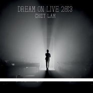

Dream On Live 2013 林一峰游乐会
============================

|  |  |
| :--: | :-- |
| [ Dream On Live 2013 林一峰游乐会](https://emumo.xiami.com/album/1771177845) | **艺人**: [林一峰](../index.md) **语种**: 粤语 **唱片公司**: LYFE **发行时间**: 2013年05月25日 **专辑类别**: 现场专辑 **专辑风格**: 粤语流行 Cantopop **播放数**: 167585 **收藏数**: 351 **评论数**: 35  |

## 简介

十年一峰·一夜倾诉  
林一峰 DREAM ON LIVE游乐会演唱会  
  
林一峰+何秉由舜率领的大乐队  
现场完美演绎时代之歌  
包括：离开是为了回来、The Best is Yet to Come、给最开心的人、错得对、镜子说  
  

十年一峰，一夜见证  
一峰连同由何秉舜率领的大乐队精彩演出  
  
感性理性两个半小时一次完整收录  
几经辛苦，一刀未剪，足版收录
 
  

Celebrating the 10th anniversary of Hong Kong's own son Chet Lam in making music, this two and a half hours of heart and soul is the essence of the indie music veteran's body of work.
 
 

## 曲目

- [镜子说 (Live) Mirror Says](./1771177845/mQFSBy53a1c.md)
- [Speech: 载满了记忆的箱子Speech: Boxes of Memories](./1771177845/mQFSBz88bf4.md)
- [黄沙万里 (Live) Yellow Sand](./1771177845/mQFSB06d32e.md)
- [未完舞曲 (Live) Never Ending Cantata](./1771177845/xL0R0be0bb1.md)
- [向着阳光 / CL411 (Live) Facing the Sun](./1771177845/bCkJJig48c7c.md)
- [Speech: 魔戒之旅Speech: Hobbits](./1771177845/b1pYKt73cd86.md)
- [重回布拉格 (Live) Back to Prague](./1771177845/xL0R0ed37a8.md)
- [心雪 (Live) Heart Snow](./1771177845/mQFSB584930.md)
- [Lost In L.A. (Live) ](./1771177845/mQFSB681395.md)
- [游子意 (Live) Heart of a Traveller](./1771177845/mQFSB764056.md)
- [Speech: 电影主题曲 Speech: Movie Theme Songs](./1771177845/xL0R0i9fe18.md)
- [冷热之间 (Live) Maybe This Time](./1771177845/xL0R0j9f22d.md)
- [错得对 (Live) Right Kind of Wrongs](./1771177845/mQFSBA7b3bb.md)
- [朋友，你变了没有 (Live) Friend, How Have You Changed?](./1771177845/xL0R0le1aa7.md)
- [给最开心的人 (Live) To the Happiest One](./1771177845/8GlQoM1d6ec.md)
- [维多利亚 (Live) Victoria](./1771177845/bf02MG7316ba.md)
- [双子 (Live) Ballad of the Two Brothers](./1771177845/xL0R0o99790.md)
- [无奈 (Live) Sigh](./1771177845/xL0R0p1178c.md)
- [Speech: 简单愿望Speech: Simple Wishes](./1771177845/mQFSBG73d03.md)
- [回到花开的那天 (Live) The First Day Our Flowers Bloomed](./1771177845/mQFSBH73fd9.md)
- [Trust / By My Side (Live) ](./1771177845/xL0R0scc79e.md)
- [Speech: 何秉舜Speech: Hobing](./1771177845/mQFSBJb158b.md)
- [Piano Man (Live) ](./1771177845/8GlQoUef57b.md)
- [悠悠的风 (Live) Gentle Breeze](./1771177845/bqvnL5p3afe6.md)
- [爱你枕边暖 (Live) Love You By the Pillow](./1771177845/xL0R0wcb9f4.md)
- [Light Up Your Dreams (Live) ](./1771177845/xL0R0xcb01f.md)
- [今天应该更高兴 (Live) Grateful Today](./1771177845/mQFSBO59f05.md)
- [Speech: 梦想Speech: Dreams](./1771177845/mQFSBP94c06.md)
- [简单不简单 (Live) Simple, Not Simple](./1771177845/mQFSBQ8ce36.md)
- [雪糕车 (Live) Ice-Cream Van](./1771177845/mQFSBR6f303.md)
- [离开是为了回来 (Live) Leaving Is for Coming Back](./1771177845/mQFSBS7d3a4.md)
- [Encore: 小迪朗 (Live) ](./1771177845/mQFSBT73877.md)
- [突然独身 (Live) Suddenly Single](./1771177845/mQFSBU703d4.md)
- [Speech: Let's Get Wet](./1771177845/JAWPdF22f34.md)
- [19 (Live) ](./1771177845/8GlQpge8c99.md)
- [一支烟的时间 (Live) One Cigarrette's Time](./1771177845/bf02MGR30d05.md)
- [The Best Is Yet to Come (Live) ](./1771177845/8GlQpi18d2d.md)

## 评论

|  |  |  |
| :-- | :-- | :-- |
|  [虾米用户](https://emumo.xiami.com/u/7023) 长期缓慢持续收藏林一峰演... 2019-03-10 22:23 赞(0) 踩(0) | 
六年纪念mark
 |
|  [虾米用户](https://emumo.xiami.com/u/95431622) 广东歌博爱饭，日音圈徘徊... 2018-05-18 00:51 赞(2) 踩(0) | 
安利各位想买一峰的唱片可以去他的个人官网上买哦 还有签名版呢
 |
| ⇒ |  [虾米用户](https://emumo.xiami.com/u/102355020)  2020-04-18 21:15 赞(0) 踩(0) | 
可以分享一下网址吗，谢谢大神
 |
|  [虾米用户](https://emumo.xiami.com/u/5817672)  2014-10-10 18:34 赞(4) 踩(0) | 
香港流行音樂的另一種代表
 |
| ⇒ |  [虾米用户](https://emumo.xiami.com/u/51800191)  2015-11-27 12:47 赞(0) 踩(0) | 
你好
 |
| ⇒ |  [虾米用户](https://emumo.xiami.com/u/51800191)  2015-12-24 16:47 赞(0) 踩(0) | 
是的
 |
| ⇒ |  [虾米用户](https://emumo.xiami.com/u/51800191)  2016-07-26 23:17 赞(0) 踩(0) | 
你好
 |
|  [虾米用户](https://emumo.xiami.com/u/5584131)  2014-07-20 15:19 赞(0) 踩(0) | 
㝝
 |
|  [虾米用户](https://emumo.xiami.com/u/5790709)  2014-05-18 19:45 赞(1) 踩(0) | 
快来上海吧
 |
|  [虾米用户](https://emumo.xiami.com/u/10183109) 我一直假装自己是个学霸… 2014-05-14 22:21 赞(1) 踩(0) | 
先收藏了，这样一个认真的声音。
 |
| ⇒ |  [虾米用户](https://emumo.xiami.com/u/51800191)  2015-08-14 09:46 赞(0) 踩(0) | 
您好
 |
| ⇒ |  [虾米用户](https://emumo.xiami.com/u/51800191)  2015-08-14 09:46 赞(0) 踩(0) | 
您好
 |
|  [虾米用户](https://emumo.xiami.com/u/7368162)  2013-11-14 12:27 赞(0) 踩(0) | 
你到底什么时候来上海！！！！都8年多了都！！
 |
| ⇒ |  [虾米用户](https://emumo.xiami.com/u/51800191)  2015-07-30 23:49 赞(0) 踩(0) | 
您好
 |
|  [虾米用户](https://emumo.xiami.com/u/6946189) 去啊 2013-11-11 11:33 赞(0) 踩(0) | 
平静的调调 在他的音乐里能找到喧闹城市的一份恬静
 |
| ⇒ |  [虾米用户](https://emumo.xiami.com/u/51800191)  2015-08-11 23:11 赞(0) 踩(0) | 
您好朋友
 |
|  [虾米用户](https://emumo.xiami.com/u/65841) NotReally... 2013-07-11 20:30 赞(0) 踩(0) | 
回到三月那晚的現場了~~
 |
|  [虾米用户](https://emumo.xiami.com/u/6724118)  2013-07-10 15:18 赞(0) 踩(0) | 
好特别的声音，喵~
 |
|  [虾米用户](https://emumo.xiami.com/u/3440308)  2013-07-05 09:18 赞(0) 踩(0) | 
是真好听。比比现在的音乐类节目，这才是纯粹的歌曲，自由的音乐，未掺杂任何杂质的灵魂。
 |
|  [虾米用户](https://emumo.xiami.com/u/11549174) 無聲。 2013-07-03 09:09 赞(0) 踩(0) | 
dream a life。
 |
|  [虾米用户](https://emumo.xiami.com/u/1797147) 音乐 电影 书 橡皮章 ... 2013-07-02 21:24 赞(0) 踩(0) | 
就是喜欢
 |
|  [虾米用户](https://emumo.xiami.com/u/7661763)  2013-07-02 02:00 赞(0) 踩(0) | 
爱疯了！ 昨天骑车听着听着差点飞起来~
 |
|  [虾米用户](https://emumo.xiami.com/u/3498915) 生活旅人 2013-07-01 13:31 赞(0) 踩(0) | 
期待已久，终于到手签名版本cd，开心！
 |
|  [虾米用户](https://emumo.xiami.com/u/4270465)  2013-06-29 11:53 赞(0) 踩(0) | 
很喜欢!一定要收藏!
 |
|  [虾米用户](https://emumo.xiami.com/u/1636105)  2013-06-29 10:57 赞(0) 踩(0) | 
我在现场～
 |
|  [虾米用户](https://emumo.xiami.com/u/394431)   2013-06-29 09:35 赞(0) 踩(0) | 
必须买碟！！！
 |
|  [虾米用户](https://emumo.xiami.com/u/702742) 生活持有偏見…… 2013-06-29 00:20 赞(0) 踩(0) | 
怎能不喜歡！~
 |
|  [虾米用户](https://emumo.xiami.com/u/1599765)  2013-06-28 11:48 赞(1) 踩(0) | 
十分的小众，十分的十分。那种字正腔圆的粤语feel，和流畅的编曲，像回到九十年代那个粤语歌曲繁盛的时代。来内地开演唱会嘛~
 |
| ⇒ |  [虾米用户](https://emumo.xiami.com/u/51800191)  2015-08-11 23:11 赞(0) 踩(0) | 
你好
 |
| ⇒ |  [虾米用户](https://emumo.xiami.com/u/51800191)  2015-08-11 23:11 赞(0) 踩(0) | 
你好
 |
|  [虾米用户](https://emumo.xiami.com/u/5443127) COMING SOON 2013-06-27 18:45 赞(0) 踩(0) | 
爱死你了呵 爱死你了呵
 |
|  [虾米用户](https://emumo.xiami.com/u/2655321)  2013-06-27 18:01 赞(0) 踩(0) | 
来内地啊，内地
 |
| ⇒ |  [虾米用户](https://emumo.xiami.com/u/51800191)  2015-08-14 09:48 赞(0) 踩(0) | 
您好哈哈
 |
|  [虾米用户](https://emumo.xiami.com/u/1960733)  2013-06-27 13:37 赞(0) 踩(0) | 
@张图文
 |
|  [虾米用户](https://emumo.xiami.com/u/1751825)  2013-06-15 01:13 赞(0) 踩(0) | 
快快快 好期待
 |
