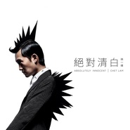

绝对清白
============================

|  |  |
| :--: | :-- |
| [ 绝对清白](https://emumo.xiami.com/album/2102734993) | **艺人**: [林一峰](../index.md) **语种**: 国语 **唱片公司**: LYFE **发行时间**: 2017年05月01日 **专辑类别**: 录音室专辑 **专辑风格**: 独立流行 Indie Pop, 国语流行 Mandarin Pop **播放数**: 1171003 **收藏数**: 757 **评论数**: 92  |

## 简介

个人成长的故事，怎样面对世界种种黑暗后，最后还能保留最清澄的心；这次专辑有两面：一半作品面对世界，一半作品面对自己，组成一幅都市人的成长地图。

## 曲目

- [影子战MVShadow War](./2102734993/xNcX0Pb3791.md)
- [八大行星高峰会议Summit of the 8 Planets](./2102734993/bCmvPiU480f8.md)
- [原谅Forgive](./2102734993/mSrYCr6eb8a.md)
- [地心引力Gravity](./2102734993/mSrYCs5a596.md)
- [星光大道MVStar Avenue](./2102734993/xNcX0Ta539d.md)
- [大城小子MVAnother Boy in the City](./2102734993/bqwPR5O362c0.md)
- [能伤心是种奢侈Feeling Hurt is Luxurious](./2102734993/8HNWp5faee1.md)
- [十七一生MVForever 17](./2102734993/xNcX0Wcfb21.md)
- [青春残酷蜜语Brutal-sweet Youth](./2102734993/8HNWp7f9c38.md)

## 评论

|  |  |  |  |
| :-- | :-- | :-- | :-- |
|  [虾米用户](https://emumo.xiami.com/u/232146940) 用肌肤，掩饰住，真面目。 2019-02-09 21:35 赞(0) 踩(0) | 
很有意思的一张全创作专辑。林一峰干净的声音特别适合少年气的感性民谣（《大城小子》《能伤心是种奢侈》《青春残酷蜜语》），好像邻家哥哥一般的温柔～其他几首pop或者R&amp;B的简陋编曲更显得一峰Vocal瘠弱……《影子战》《地心引力》可以拿给Eason翻唱一下吗?明明词曲优秀的说～
 |
|  [虾米用户](https://emumo.xiami.com/u/42332393) 主人【书音】还未苏醒的作... 2018-09-06 20:28 赞(1) 踩(0) | 
三观超正
 |
|  [虾米用户](https://emumo.xiami.com/u/402619827)  2018-08-29 07:39 赞(2) 踩(0) | 
我爱林一峰我爱林一峰  ，这十年是我没成长你没改变，还是我们一起长大了呢？
 |
|  [虾米用户](https://emumo.xiami.com/u/35141236) 魚缸是我的敵人  2017-07-19 12:59 赞(0) 踩(0) | 
舊曲新唱感情到老呢？
 |
|  [虾米用户](https://emumo.xiami.com/u/388558) time flies 2017-05-23 05:21 赞(1) 踩(0) | 
每个人都是一颗star
 |
|  [虾米用户](https://emumo.xiami.com/u/246017) Dig in 2017-05-13 05:43 赞(1) 踩(0) | 
爭拗世界中的自我贖救
 |
|  [虾米用户](https://emumo.xiami.com/u/190737743)  2017-05-12 13:11 赞(0) 踩(0) | 
好聽，感動
 |
|  [虾米用户](https://emumo.xiami.com/u/1108806)  2017-05-08 14:41 赞(1) 踩(0) | 
终于出专！好听呢～
 |
|  [虾米用户](https://emumo.xiami.com/u/719995) 事出有音 2017-05-07 16:59 赞(1) 踩(0) | 
大突破！
 |
|  [虾米用户](https://emumo.xiami.com/u/3419686)  2017-05-07 00:23 赞(0) 踩(0) | 
还是妹妹的国语专辑靠谱一些 
 |
|  [虾米用户](https://emumo.xiami.com/u/11163254)   2017-05-05 10:18 赞(0) 踩(0) | 
无罪不释放
 |
|  [虾米用户](https://emumo.xiami.com/u/8828119) 一朝黄金梦 终究成黄梁 2017-05-03 22:12 赞(0) 踩(0) | 
啥玩意
 |
|  [虾米用户](https://emumo.xiami.com/u/289739543)  2017-05-03 20:22 赞(0) 踩(0) | 
牌子
 |
|  [虾米用户](https://emumo.xiami.com/u/281055664)  2017-05-03 11:02 赞(0) 踩(0) | 
只有我是以为是林峰 然后点进来的吗。。。。。=   =
 |
| ⇒ |  [虾米用户](https://emumo.xiami.com/u/35429060)   2017-05-03 20:07 赞(0) 踩(0) | 
对，只有你。
 |
| ⇒ |  [虾米用户](https://emumo.xiami.com/u/556632) 我还没想好要写什么... 2017-05-08 17:31 赞(0) 踩(0) | 
只有你。而且&amp;hellip;&amp;hellip;还好意思问出来，好尴尬
 |
| ⇒ |  [虾米用户](https://emumo.xiami.com/u/10086842)  2017-07-03 13:31 赞(0) 踩(0) | 
是的，只有你，你是电，你是光，你是唯一的神话
 |
|  [虾米用户](https://emumo.xiami.com/u/191147027)  2017-05-03 10:40 赞(1) 踩(0) | 
喜欢一峰很多年了，不知道何时能见第三次？
 |
|  [虾米用户](https://emumo.xiami.com/u/83549710) 虾米的页面要是简单点就完... 2017-05-03 09:02 赞(0) 踩(0) | 
风格百变
 |
|  [虾米用户](https://emumo.xiami.com/u/33668476) 夏日已远，繁花将尽 2017-05-03 01:02 赞(2) 踩(0) | 
立志改变的专辑，诚意态度加分，虽然有些作品一时难以接受，但仍不乏抓人的句子和曲调，值得肯定
 |
|  [虾米用户](https://emumo.xiami.com/u/284338722)  2017-05-03 00:12 赞(0) 踩(0) | 
爱似阳光空气
 |
|  [虾米用户](https://emumo.xiami.com/u/41190273) 你！到底，怎么肥四啊？！ 2017-05-02 23:27 赞(8) 踩(0) | 
这张专辑很耐听，也许你初听一遍会觉得没有什么印象曲，但多次循环下来就会觉得这张专辑真尼玛棒！整体性很好，歌词创作的好好，在音乐风格上跟之前也有差别！比较喜欢2、3、7、9 
 |
|  [虾米用户](https://emumo.xiami.com/u/20635625)  2017-05-02 18:22 赞(0) 踩(0) | 
一点都不民谣啊 怎么那么多人刷民谣
 |
| ⇒ |  [虾米用户](https://emumo.xiami.com/u/429170231) 爱似好天气 2020-11-30 10:43 赞(0) 踩(0) | 
一峰有很多其他民谣作品，但也在豆瓣小组说过&amp;ldquo;对不起，「绝对清白」不是民谣&amp;rdquo;
 |
|  [虾米用户](https://emumo.xiami.com/u/33402236)  2017-05-02 16:54 赞(0) 踩(0) | 
还可以
 |
|  [虾米用户](https://emumo.xiami.com/u/268841722)  2017-05-02 15:31 赞(2) 踩(0) | 
原谅我真的不懂欣赏   
 |
|  [虾米用户](https://emumo.xiami.com/u/4732751)   2017-05-02 13:54 赞(2) 踩(0) | 
国语怎么这么好 词都好好这张
 |
|  [虾米用户](https://emumo.xiami.com/u/65835) 如果没人看着我，该有多快... 2017-05-02 13:41 赞(3) 踩(0) | 
亲爱的林一峰，多保重！！！多回家看看林爸林妈！！！
 |
|  [虾米用户](https://emumo.xiami.com/u/251449) 有心 有信心 2017-05-02 13:34 赞(4) 踩(0) | 
好正！跟惯常风格好不同但同样高品质！
 |
|  [虾米用户](https://emumo.xiami.com/u/3420129) 人间值得个屁 2017-05-02 12:22 赞(1) 踩(0) | 
我的妈诶，好听
 |
|  [虾米用户](https://emumo.xiami.com/u/291613982)  2017-05-02 12:15 赞(1) 踩(0) | 
好尴尬
 |
|  [虾米用户](https://emumo.xiami.com/u/291308155)  2017-05-02 10:49 赞(2) 踩(0) | 
能伤心是种奢侈,听得人心酸酸的。
 |
|  [虾米用户](https://emumo.xiami.com/u/8717973) 美不美看小腿 2017-05-02 10:11 赞(0) 踩(0) | 
怎么都是国语。。
 |
| ⇒ |  [虾米用户](https://emumo.xiami.com/u/9327772)   2017-05-02 12:06 赞(0) 踩(0) | 
这张是国语专辑啊
 |
|  [虾米用户](https://emumo.xiami.com/u/3740879) 半缘修道半缘君 2017-05-02 09:34 赞(0) 踩(0) | 
封面小图以为胡歌。。
 |
|  [虾米用户](https://emumo.xiami.com/u/126036498)  2017-05-02 09:12 赞(1) 踩(0) | 
遇见的英文版，林一峰自己唱得很好。
 |
|  [虾米用户](https://emumo.xiami.com/u/11783015) 太完美的东西都与我无关！ 2017-05-02 08:44 赞(0) 踩(0) | 
国语歌诶
 |
|  [虾米用户](https://emumo.xiami.com/u/52447611) 无需要快乐 反正你一早枯... 2017-05-02 08:39 赞(0) 踩(0) | 
小紧张 国语歌
 |
|  [虾米用户](https://emumo.xiami.com/u/11421497) dont act lik... 2017-05-02 07:06 赞(0) 踩(0) | 
好
 |
|  [虾米用户](https://emumo.xiami.com/u/256326619)  2017-05-02 02:20 赞(0) 踩(0) | 
很不错
 |
|  [虾米用户](https://emumo.xiami.com/u/84414466) Can't bring ... 2017-05-02 01:03 赞(0) 踩(0) | 
一峰真的好棒
 |
|  [虾米用户](https://emumo.xiami.com/u/15258532) 我还没想好要写什么... 2017-05-02 00:38 赞(3) 踩(0) | 
虾米能推林一峰首页我很感动 啦啦啦啦啦啦 为你含情 一如既往
 |
| ⇒ |  [虾米用户](https://emumo.xiami.com/u/51800191)  2017-06-05 21:44 赞(0) 踩(0) | 
这张会公开发行吗？
 |
|  [虾米用户](https://emumo.xiami.com/u/27390285) 我还没想好要写什么... 2017-05-01 22:55 赞(0) 踩(0) | 
喜欢的事自然可以坚持，不喜欢的怎么也长久不了，支持一峰，谢谢这些年有意或无意的道出了好多人内心的声音～
 |
|  [虾米用户](https://emumo.xiami.com/u/41063189) 一朵人花 2017-05-01 22:44 赞(3) 踩(0) | 
不错，很整体的一张专辑！
 |
|  [虾米用户](https://emumo.xiami.com/u/19726499) 起风了，唯有努力生存 2017-05-01 22:42 赞(0) 踩(0) | 
一峰无变，变嘅系我嘅心态，所以我整张专只有一首完整听完，年轻回不来，时代太急，太重
 |
|  [虾米用户](https://emumo.xiami.com/u/2527832) 超越生命 解放自由 2017-05-01 22:22 赞(0) 踩(0) | 
原来也是鬼才
 |
|  [虾米用户](https://emumo.xiami.com/u/794813)  2017-05-01 21:53 赞(0) 踩(0) | 
good
 |
|  [虾米用户](https://emumo.xiami.com/u/8418966) 暂无签名~ 2017-05-01 20:14 赞(0) 踩(0) | 
打个卡
 |
|  [虾米用户](https://emumo.xiami.com/u/1506235) 所以 最后 还好 有音乐 2017-05-01 17:21 赞(0) 踩(0) | 
先收藏哈哈哈哈哈
 |
|  [虾米用户](https://emumo.xiami.com/u/74639208) Music is per... 2017-05-01 17:02 赞(1) 踩(0) | 
支持
 |
|  [虾米用户](https://emumo.xiami.com/u/260852781) 等爱的美男子 2017-05-01 17:02 赞(7) 踩(0) | 
什么是&amp;ldquo;眼前的苟且&amp;rdquo;？什么是&amp;ldquo;诗和远方&amp;rdquo;？例如，它们分别是你的淘宝购物车和收藏夹
 |
|  [虾米用户](https://emumo.xiami.com/u/293003699)  2017-05-01 17:01 赞(0) 踩(0) | 
。
 |
|  [虾米用户](https://emumo.xiami.com/u/256758845)   2017-05-01 16:28 赞(0) 踩(0) | 
不就是今天嘛
 |
|  [虾米用户](https://emumo.xiami.com/u/2809654) 听我所爱 2017-05-01 15:59 赞(0) 踩(0) | 
好久不见
 |
|  [虾米用户](https://emumo.xiami.com/u/17719900) 请把我的歌带回你的家 2017-05-01 15:35 赞(2) 踩(0) | 
能听到他的唱片真是幸福
 |
|  [虾米用户](https://emumo.xiami.com/u/2961074) 听两首歌 2017-05-01 14:20 赞(4) 踩(0) | 
越听越有味道的一张碟，林一峰是百变的创作大魔王~
 |
|  [虾米用户](https://emumo.xiami.com/u/16065804)   2017-05-01 14:13 赞(1) 踩(0) | 
不唱小清新，想
 |
|  [虾米用户](https://emumo.xiami.com/u/267047735)  2017-05-01 13:45 赞(0) 踩(0) | 
蹲着吧
 |
|  [虾米用户](https://emumo.xiami.com/u/123260668) 负能量退散！ 2017-05-01 13:31 赞(0) 踩(0) | 
开心
 |
|  [虾米用户](https://emumo.xiami.com/u/6039173)  2017-05-01 12:47 赞(1) 踩(0) | 
加油
 |
|  [虾米用户](https://emumo.xiami.com/u/889975)   2017-05-01 12:42 赞(1) 踩(0) | 
哈哈哈，记得林一峰说自己爱爵士更多，但民谣更爱他
 |
| ⇒ |  [虾米用户](https://emumo.xiami.com/u/8098186) 音乐边界的拓展 2017-05-01 16:00 赞(0) 踩(0) | 
哈哈哈好久不见~
 |
|  [虾米用户](https://emumo.xiami.com/u/19726499) 起风了，唯有努力生存 2017-05-01 11:29 赞(2) 踩(0) | 
个人喜欢他唱粤语，有味道
 |
|  [虾米用户](https://emumo.xiami.com/u/190737743)  2017-05-01 11:20 赞(3) 踩(0) | 
期待一峰來國內辦巡演！
 |
|  [虾米用户](https://emumo.xiami.com/u/5185821)  2017-05-01 10:46 赞(1) 踩(0) | 
臉書上看他經常更新動態 新專輯來了 聽起來
 |
|  [虾米用户](https://emumo.xiami.com/u/82089290) 学会了生活，能享受寂寞。 2017-05-01 10:45 赞(1) 踩(0) | 
封面鸡冠头
 |
|  [虾米用户](https://emumo.xiami.com/u/1467803) 置身于炎夏的乐园 2017-05-01 10:38 赞(1) 踩(0) | 
先占再听！
 |
|  [虾米用户](https://emumo.xiami.com/u/719995) 事出有音 2017-05-01 08:53 赞(2) 踩(0) | 
大城小子写到心坎里，强烈推荐
 |
|  [虾米用户](https://emumo.xiami.com/u/272508752)  2017-05-01 08:52 赞(0) 踩(0) | 
死忠粉，必顶！！
 |
|  [虾米用户](https://emumo.xiami.com/u/242008415)   2017-05-01 08:19 赞(20) 踩(0) | 
不知悔改的恋人，规矩以外的学生。哈哈哈哈
 |
|  [虾米用户](https://emumo.xiami.com/u/54810424)  2017-05-01 07:53 赞(1) 踩(0) | 
为了又是民谣？香港其他的好音乐很多啊
 |
|  [虾米用户](https://emumo.xiami.com/u/77334060) 杂食性播放，其实什么类型... 2017-05-01 07:41 赞(1) 踩(0) | 
一峰啊啊啊
 |
|  [虾米用户](https://emumo.xiami.com/u/6820570) 这是语言的变调，承接醒来... 2017-05-01 07:21 赞(4) 踩(0) | 
香港从来没有乐坛，只有娱乐圈。哈哈哈哈哈哈哈哈
 |
|  [虾米用户](https://emumo.xiami.com/u/7797443) / / 2017-05-01 01:44 赞(1) 踩(0) | 
才子从来不会词穷
 |
|  [虾米用户](https://emumo.xiami.com/u/65835) 如果没人看着我，该有多快... 2017-05-01 00:26 赞(1) 踩(0) | 
等新专寄来
 |
|  [虾米用户](https://emumo.xiami.com/u/1791319) 暂无签名~ 2017-05-01 00:26 赞(3) 踩(0) | 
虾米提示新专辑了，过来听一听
 |
|  [虾米用户](https://emumo.xiami.com/u/32125734) weibo：白菜y少女  2017-05-01 00:13 赞(0) 踩(0) | 

 |
|  [虾米用户](https://emumo.xiami.com/u/779337) 做个没烦恼的小逗逼 2017-05-01 00:02 赞(0) 踩(0) | 
专辑介绍让我有想听歌的冲动，先占个座
 |
|  [虾米用户](https://emumo.xiami.com/u/2961074) 听两首歌 2017-05-01 00:00 赞(0) 踩(0) | 
板凳！
 |
|  [虾米用户](https://emumo.xiami.com/u/9327772)   2017-04-30 21:04 赞(0) 踩(0) | 
坐等~~
 |
|  [虾米用户](https://emumo.xiami.com/u/17806314) 以梦为马 以己为光 2017-04-23 17:31 赞(0) 踩(0) | 
&amp;ang;( ᐛ 」&amp;ang;)_
 |
|  [虾米用户](https://emumo.xiami.com/u/4094791) 无事来听歌。 2017-04-22 07:30 赞(0) 踩(0) | 
一峰好久不见了
 |
|  [虾米用户](https://emumo.xiami.com/u/286201)  2017-04-21 20:42 赞(2) 踩(0) | 
苍天！！！！！！！！！！！！！！！！！！高产狂魔！！！！！！！！
 |
|  [虾米用户](https://emumo.xiami.com/u/206899919) 一室之千灯 2017-04-21 20:04 赞(0) 踩(0) | 

 |
|  [虾米用户](https://emumo.xiami.com/u/1216780) Don't Panic! 2017-04-21 16:58 赞(2) 踩(0) | 
已预购实体CD的人表示已经提前听到啦XD
 |
|  [虾米用户](https://emumo.xiami.com/u/2871) 虾米编辑部唯一官方账号 ... 2017-04-21 15:29 赞(48) 踩(0) | 
林一峰新专辑会在5月1日正式发行，还请耐心等待。
 |
| ⇒ |  [虾米用户](https://emumo.xiami.com/u/266931330)  2017-05-02 06:40 赞(0) 踩(0) | 
金嗄 3 f2bera
 |
|  [虾米用户](https://emumo.xiami.com/u/6736254) 想要得不到 2017-04-21 15:28 赞(1) 踩(0) | 
然而听不了？？
 |
|  [虾米用户](https://emumo.xiami.com/u/1193788) 四无青年 2017-04-21 15:23 赞(14) 踩(0) | 
竟然是真的！！失踪人口竟然出现了！！
 |
|  [虾米用户](https://emumo.xiami.com/u/726513) 广东歌never die 2017-04-21 15:23 赞(0) 踩(0) | 
板凳咯
 |
|  [虾米用户](https://emumo.xiami.com/u/3639942) 我还没想好要写什么... 2017-04-21 15:21 赞(0) 踩(0) | 
竟然是沙发
 |
