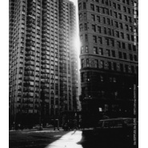

细水如歌like RIPPLES,like LOVE
============================

|  |  |
| :--: | :-- |
| [ 细水如歌like RIPPLES,like LOVE](https://emumo.xiami.com/album/2102867570) | **艺人**: [林一峰](../index.md) **语种**: 粤语 **唱片公司**: LYFE Music **发行时间**: 2017年10月26日 **专辑类别**: 录音室专辑 **专辑风格**: 独立流行 Indie Pop, 粤语流行 Cantopop **播放数**: 280164 **收藏数**: 1317 **评论数**: 102  |

## 简介

《细水如歌》是香港音乐人林一峰的第17张个人专辑，用林一峰的细腻演绎粤语流行曲里最浪漫的一章：陈百强的最作品。  
  
全碟采用全原音乐器，收录三首与纽约室乐团同步录音作品《梦呓》《烟雨凄迷》《眼泪为你流》，以及精致简约的经典《一生何求》，《盼三年》，《凝望》等，用最高质的录音，褪去80/90年代的潮流外壳，重现歌曲里潜藏的温柔细腻本质。  
  
让我们闲时回顾从前，从过去的故事寻找将来的力量。  
  
歌曲介绍：  
《梦呓》- 粤语歌之中浪漫的情书，本来陈百强写给电影「秋天的童话」，但阴错阳差没有用上，后来变成自己专辑里的作品；30多年后，林一峰跑到纽约找了最好的乐手，一起把这一场浪漫用室乐延续，用2017年的科技，重塑最浪漫的、60年代的声音。  
《烟雨凄迷》- 跟《梦呓》一样，一峰跟纽约12人室乐团在纽约同步录音，直接录进母带  
《凝望》- 从80年代的键盘声音，变成60年代的浪漫华尔兹舞曲，一峰在间奏中巧妙地放进了自己的歌曲《冷热之间》，变成一个隔空音乐对话。  
《感情到老》- 能够到老的感情，先天性不需要保鲜；不介意多久没见，不介意谁先找谁，忽然打个电话，见一个面，见面时自然地谈天说地，「像一切从未变」，那就是真正的友谊。一峰把自己的歌曲《19》变奏用口琴加进编曲，以青葱的流行曲方法，直接真挚的演绎。  
  
—————————————————-  
  
一峰的话：  
静默亦似歌  
  
妈妈一生人唯一一个偶像是陈百强，10年前我就做了《一期一会》- 跟W创作社合作的音乐剧场，里面九成歌曲都是陈百强的，我们用熟悉的旋律与文字说一个新的故事；那个时候我自以为对陈百强的歌已经十分理解，还用他音乐里的感情世界重新创作了《樱花诀》，副歌是这样的：  
  
爱你所爱落得丝丝叹息  
却始终不想放开  
信你所信目空诲道善言  
原来从来不想被爱  
  
一转眼，十年过去，我对已经在血液里的陈百强作品又有另一个层次的看法，也是时候再在已有的作品里提炼出新的感觉 - 那种温婉的浪漫，就只有他了；只是，我希望做到的，不是把那些作品变成2017年的现代声音，却是逆着时光，推向再远的时代 - 那个Nat King Cole，Peggy Lee，Ella Fitzgerald的黄金时期60年代，一切乐器与录音都是真实而温暖的，就是那个时代，造就了最浪漫的流行音乐，我们就试着将陈百强的浪漫，通过60年代的感觉再极致化。  
  
情怀令我们往后看，共鸣让我们往前看；陈百强音乐给我们的共鸣，是繁华盛放背后的一丝若有所思，是秋天的童话，是对于恬静美好的永恒向往，是星尘，也是这世界这几年最需要的浪漫。  
  
过去的养份可以给我面对将来的力量；承先才可以启后，知道我们从什么地方来，才可以展望未来，所以我选择了陈百强的作品，来给自己也给大家打打气。  
  
我记得我长大的时候，吹过很大的东洋风，当年的日本偶像热潮直卷香港，大家都仰望日本文化，本土的东西都要让开；但你看看，现在大家最珍惜最回味的是什么？不是当年的日本偶像，而是自己语言的人事与音乐。  
虽然现在这一刻的年轻人不把粤语歌放在第一位，但有很多音乐人仍然在自己的岗位努力，做自己能够做到的，这个传承是为十年二十年之后的粤语流行文化根基。我们不能没有自己的文化根基，不能失去了才来可惜，才开始学习珍惜。  
 

## 曲目

- [梦呓Dream](./2102867570/mSwweb8e4e4.md)
- [凝望Gazing](./2102867570/mSwwec80f31.md)
- [眼泪为你流Tears](./2102867570/bqwUoX73a6ce.md)
- [烟雨凄迷Misty](./2102867570/mSwwee50fb5.md)
- [盼三年Three Years](./2102867570/xNhuSF97837.md)
- [我和你Me and You](./2102867570/xNhuSGc5154.md)
- [感情到老Old Friends](./2102867570/xNhuSHa544a.md)
- [迷失中有着你Lost](./2102867570/mSwwei4bed3.md)
- [一生何求Life](./2102867570/xNhuSJab601.md)

## 评论

|  |  |  |
| :-- | :-- | :-- |
|  [虾米用户](https://emumo.xiami.com/u/319103386)   2020-02-27 03:03 赞(0) 踩(0) | 
缘份永远要避开我 今天我实在愿讲和 自己孤单还要天天唱着情歌
 |
|  [虾米用户](https://emumo.xiami.com/u/56868) 过去的铅笔小丁 2019-04-29 09:56 赞(0) 踩(0) | 
我猜想那三首跟纽约室乐团的合作作品本被设想为本专辑的亮点，可事实证明却成了败笔。林一峰薄弱的声线完全无法驾驭弦乐的厚重，反倒变成了一种奇怪的格格不入。整个听感就像创作者使劲在挠你说：你看我都用上这么高级的弦乐了呢，你怎么不感动呢？可是对不起，我真的没有。
 |
|  [虾米用户](https://emumo.xiami.com/u/31481) 桃花潭水深千尺 2019-02-13 22:14 赞(1) 踩(0) | 
活得太清醒、太孤傲会比较寂寞
 |
|  [虾米用户](https://emumo.xiami.com/u/7023) 长期缓慢持续收藏林一峰演... 2018-12-16 01:24 赞(0) 踩(0) | 
20180912纽约熨斗大厦打卡mark
 |
|  [虾米用户](https://emumo.xiami.com/u/407344868) 做人呢，最紧要喺开心 2018-11-28 19:54 赞(0) 踩(0) | 
一峰真的很有心，这几首听了都很喜欢，和丹尼一样的清亮的嗓音但是唱出的感觉不同，很伤感，给一峰打call！
 |
|  [虾米用户](https://emumo.xiami.com/u/17020124) 来，临走照张合影。 2018-11-18 12:39 赞(0) 踩(0) | 
很喜欢梦里人，但没有翻唱，可是我想了想那大概是林一峰不能唱出的感觉，林一峰还是诠释细水长流的淡然感更有滋味。
 |
|  [虾米用户](https://emumo.xiami.com/u/204178698) Reset 2018-11-01 13:53 赞(0) 踩(0) | 
中国好粉丝
 |
|  [虾米用户](https://emumo.xiami.com/u/35141236) 魚缸是我的敵人  2018-09-12 11:13 赞(0) 踩(0) | 
出走呢？
 |
|  [虾米用户](https://emumo.xiami.com/u/16294964) 我还没想好要写什么... 2018-07-30 22:22 赞(1) 踩(0) | 
其实这就是翻唱，不用纠结于什么唱的没有百强的感觉，每个人对歌曲都有自己的诠释，有的时候我甚至会对原唱不满意，一千个人心里有一千个哈姆雷特，这些翻唱虽然没法超越原版，但是也别有风味。     
 |
|  [虾米用户](https://emumo.xiami.com/u/16294964) 我还没想好要写什么... 2018-07-30 22:03 赞(0) 踩(0) | 
全都是我最爱的百强的歌    
 |
|  [虾米用户](https://emumo.xiami.com/u/2492768)  2018-06-03 04:04 赞(2) 踩(0) | 
林一峰的理解视角独特。是张珍贵的翻唱专辑。
 |
|  [虾米用户](https://emumo.xiami.com/u/5968552) 虾小米，我爱你所以讲不出... 2018-05-13 17:23 赞(1) 踩(0) | 
爱了十一年林生的音乐，十年岁月就淡淡流过了，耳朵表示很值得
 |
|  [虾米用户](https://emumo.xiami.com/u/1946724)  2018-02-10 09:18 赞(0) 踩(0) | 
细水 长流
 |
|  [虾米用户](https://emumo.xiami.com/u/241589)  2018-01-05 17:30 赞(0) 踩(0) | 
感情到老 的前奏好调皮
 |
|  [虾米用户](https://emumo.xiami.com/u/43388915) 我还没想好要写什么... 2017-12-24 10:17 赞(2) 踩(0) | 
一直觉得林一峰的气质很像一个人，原来是陈百强。说不清楚的感觉，第一次听梦呓就在作曲里发现玄机，与其说这是港乐的传承，不如说那种源自母亲心底的秘密通过基因的表达，包括二汶歌曲里的小故事、小心事，也有当年的影子。 
 |
|  [虾米用户](https://emumo.xiami.com/u/12092832) 我还没想好要写什么... 2017-12-19 18:33 赞(2) 踩(0) | 
前几年其实香港唱片界有个反潮流，就是都觉得广东歌市场不行了，所以纷纷试图去做国语唱片。但实际上内地市场是在走另一个反潮流，就是各种网络直播，反而带动了粤语老歌的再次被新一代听众所接触。我觉得林海峰这个唱片的concept很好，算是对广东歌未来的另一种反思。就像去年林海峰出了首&amp;ldquo;广东歌&amp;rdquo;一样。其实国语歌跟普通话是两个体系的东西，一个是香港歌手来做这个没有优势，然后是实际上最抛弃广东歌的听众，是香港本地的九零后，零零后那些人，而不是内地人。对内地来说，新一代只能说缺少一个接触到广东歌的机会或途径，但未必代表他们不认可音乐本身。
 |
| ⇒ |  [虾米用户](https://emumo.xiami.com/u/436967)  2017-12-30 10:12 赞(0) 踩(0) | 
林&amp;ldquo;海&amp;rdquo;峰？
 |
| ⇒ |  [虾米用户](https://emumo.xiami.com/u/241589)  2018-01-05 17:21 赞(0) 踩(0) | 
<q><b>木木龙说：</b></q>
 |
| ⇒ |  [虾米用户](https://emumo.xiami.com/u/8101492) 落日秋山孤柏，寒夜路冷风... 2018-01-31 13:48 赞(0) 踩(0) | 
怎么评论林狗了？难道夺妻之恨、不共戴天？ 
 |
| ⇒ |  [虾米用户](https://emumo.xiami.com/u/17020124) 来，临走照张合影。 2018-11-18 12:37 赞(0) 踩(0) | 
<q><b>美孚新村上春树说：</b></q>
 |
|  [虾米用户](https://emumo.xiami.com/u/81284034) 以微笑之道，還治其人之身... 2017-12-14 00:05 赞(0) 踩(0) | 
封面在哪儿照的
 |
|  [虾米用户](https://emumo.xiami.com/u/48191455)   2017-11-20 15:20 赞(1) 踩(0) | 
一峰真是个有心人~❤一生何求唱有自己的风格 &amp;ldquo;大家想到丹尼，你就会联想到&amp;ldquo;浪漫&amp;rdquo;，我们向前看，向后望，想到的就是陈百强带给我们的&amp;rdquo;浪漫&amp;rdquo;，他影响着我们的人生。&amp;rdquo;
 |
|  [虾米用户](https://emumo.xiami.com/u/286284357)  2017-11-12 22:22 赞(1) 踩(0) | 
怎么购买整张专辑？
 |
| ⇒ |  [虾米用户](https://emumo.xiami.com/u/49229450) 我还没想好要写什么... 2018-04-27 12:10 赞(0) 踩(0) | 
<a href="https://www.lyfemusicshop.com" target="_blank" rel="nofollow noreferrer noopener">https://www.lyfemusicshop.com</a>
 |
|  [虾米用户](https://emumo.xiami.com/u/22808049)  2017-11-05 10:19 赞(2) 踩(0) | 
暖爆
 |
|  [虾米用户](https://emumo.xiami.com/u/16666321) 我还没想好要写什么... 2017-10-30 00:31 赞(1) 踩(0) | 
我喜欢感情深而不专，因为感情贵在区别对待，有比较才有凸显，尽管我有着大把人选，我的时间还是紧着你，你永远是第一优先，在过眼云烟中为你制造小小的仪式感，这比道德框架圈住的关系更加自由灵动。 ​​​
 |
|  [虾米用户](https://emumo.xiami.com/u/54546226)   2017-10-28 18:25 赞(0) 踩(0) | 
20171028
 |
|  [虾米用户](https://emumo.xiami.com/u/44104990) 我还没想好要写什么... 2017-10-28 18:15 赞(2) 踩(0) | 
轻轻的鼻音，柔暖的声线，要爱上
 |
|  [虾米用户](https://emumo.xiami.com/u/605952)  2017-10-28 14:20 赞(4) 踩(0) | 
希望能有更多人认识到陈百强，这个曾经的作曲能力最强的香港流行歌手
 |
|  [虾米用户](https://emumo.xiami.com/u/190891943)   2017-10-28 10:29 赞(1) 踩(0) | 
谢谢你。
 |
|  [虾米用户](https://emumo.xiami.com/u/311781989)  2017-10-28 10:09 赞(2) 踩(0) | 
犹如秋风里的一杯热可可
 |
|  [虾米用户](https://emumo.xiami.com/u/55762463)  2017-10-28 05:09 赞(3) 踩(0) | 
不管怎么样都有人评论人家唱得怎么样怎么样不好，不够资格什么的，人家用自己的风格致敬前辈不是最好的吗？一定要唱到danny那样才最好？搞不懂
 |
|  [虾米用户](https://emumo.xiami.com/u/34890556) 我还没想好要写什么... 2017-10-28 01:09 赞(0) 踩(0) | 
令人心静
 |
|  [虾米用户](https://emumo.xiami.com/u/17948230)  2017-10-28 00:25 赞(2) 踩(0) | 
一峰有一峰的味道
 |
|  [虾米用户](https://emumo.xiami.com/u/36117149)  跑步比开车快 2017-10-27 23:03 赞(0) 踩(0) | 
danny 最中意 有了你
 |
|  [虾米用户](https://emumo.xiami.com/u/181285288) 你选择了生 我选择了死 2017-10-27 22:49 赞(0) 踩(0) | 
有心
 |
|  [虾米用户](https://emumo.xiami.com/u/9627690) 我还没想好要写什么... 2017-10-27 22:42 赞(36) 踩(0) | 
我不介意他有没有「唱出Danny的感觉」，至少他唱出了自己心里的Danny. 且，在我眼中，林一真的是为数不多能唱好Danny的歌手。
 |
|  [虾米用户](https://emumo.xiami.com/u/794813)  2017-10-27 21:41 赞(0) 踩(0) | 
good
 |
|  [虾米用户](https://emumo.xiami.com/u/7232182) 我还没想好要写什么... 2017-10-27 19:42 赞(1) 踩(0) | 
林一峰有林一峰的浪漫。
 |
|  [虾米用户](https://emumo.xiami.com/u/13173319) mmmm hasjmj 2017-10-27 16:06 赞(0) 踩(0) | 

 |
|  [虾米用户](https://emumo.xiami.com/u/295673764) 这家伙很聪明什么也没留下... 2017-10-27 16:06 赞(0) 踩(0) | 

 |
|  [虾米用户](https://emumo.xiami.com/u/321215032)  2017-10-27 15:37 赞(3) 踩(0) | 
为什么VIP下载不了这张专辑的呢？求答。。。
 |
|  [虾米用户](https://emumo.xiami.com/u/13753488) 自始至终，也只有音乐最懂... 2017-10-27 14:07 赞(0) 踩(0) | 
-
 |
|  [虾米用户](https://emumo.xiami.com/u/37358043)  2017-10-27 10:36 赞(1) 踩(0) | 
虾米是死的吗？为什么超级VIP还下载不了
 |
| ⇒ |  [虾米用户](https://emumo.xiami.com/u/78567) тоска, одино 2017-10-27 10:55 赞(0) 踩(0) | 
每个有不一样的下载设置的时候，想一想啦 都是版权方的要求
 |
|  [虾米用户](https://emumo.xiami.com/u/7901472) 听听歌，做做梦，发发呆。 2017-10-27 09:00 赞(1) 踩(0) | 
诗意缱绻
 |
|  [虾米用户](https://emumo.xiami.com/u/244570388)  2017-10-27 07:06 赞(1) 踩(0) | 
我记得一峰说过：好的文化遗产要靠我们好好地传承下去。我想这就是这张专辑的使命，让更多人了解欣赏Danny ，所以选择10.25这个特别日子。我承认，一峰使我更加了解Danny ，特别是一些沧海遗珠，我知道一峰会上来睇的。
 |
|  [虾米用户](https://emumo.xiami.com/u/293142259) 若我還是不回來 就把我靈... 2017-10-27 01:35 赞(3) 踩(0) | 
丹尼，懷念你。
 |
|  [虾米用户](https://emumo.xiami.com/u/210068359) 电影人，摄影师，艺术家，... 2017-10-27 00:33 赞(1) 踩(0) | 
没有《有了你》
 |
|  [虾米用户](https://emumo.xiami.com/u/244570388)  2017-10-27 00:30 赞(1) 踩(0) | 
完美
 |
|  [虾米用户](https://emumo.xiami.com/u/177124136) 布宜諾斯艾利斯黎耀輝&何... 2017-10-26 22:09 赞(4) 踩(0) | 
唱不Danny的那种感觉
 |
|  [虾米用户](https://emumo.xiami.com/u/244570388)  2017-10-26 21:07 赞(4) 踩(0) | 
登录手机付费下载，购买实体cd，去九龙湾睇你的演唱会，实实在在支持好歌手好音乐！感谢一峰！
 |
| ⇒ |  [虾米用户](https://emumo.xiami.com/u/11487315) 我还没想好要写什么... 2017-11-12 16:41 赞(0) 踩(0) | 
PC端不知道怎样下载。。。N久没有用虾米PC端 没有以前好用 唉
 |
|  [虾米用户](https://emumo.xiami.com/u/17675547) 今夜还吹着风，想起你好温... 2017-10-26 19:10 赞(1) 踩(0) | 
怀念Danny 
 |
|  [虾米用户](https://emumo.xiami.com/u/2961074) 听两首歌 2017-10-26 19:07 赞(2) 踩(0) | 
强烈支持！
 |
|  [虾米用户](https://emumo.xiami.com/u/7257521)  2017-10-26 18:00 赞(1) 踩(0) | 
不错不错，慢慢听
 |
|  [虾米用户](https://emumo.xiami.com/u/37094077) Microparticl... 2017-10-26 17:26 赞(2) 踩(0) | 
很特别，很不一样，有味道
 |
|  [虾米用户](https://emumo.xiami.com/u/253372707) siebzehn für... 2017-10-26 17:19 赞(2) 踩(0) | 
陈百强 
 |
|  [虾米用户](https://emumo.xiami.com/u/4242058)  2017-10-26 16:40 赞(1) 踩(0) | 
太赞了
 |
|  [虾米用户](https://emumo.xiami.com/u/50559793) Q音ID:Dicку77... 2017-10-26 16:03 赞(1) 踩(0) | 
終於來了
 |
|  [虾米用户](https://emumo.xiami.com/u/7384697)  2017-10-26 15:11 赞(1) 踩(0) | 
这么快又发一张
 |
|  [虾米用户](https://emumo.xiami.com/u/95831580)   2017-10-26 15:06 赞(1) 踩(0) | 
give a like
 |
|  [虾米用户](https://emumo.xiami.com/u/1159716)   2017-10-26 14:57 赞(2) 踩(0) | 
终于出来了！
 |
|  [虾米用户](https://emumo.xiami.com/u/269036522)   2017-10-26 14:42 赞(4) 踩(0) | 
爱一峰~虾米终于也出了！！！ 实体CD get~现场LIVESHOW get~虾米专辑get~~
 |
|  [虾米用户](https://emumo.xiami.com/u/21216195) 我还没想好要写什么... 2017-10-26 13:35 赞(3) 踩(0) | 
永远不会让我失望的男人。
 |
|  [虾米用户](https://emumo.xiami.com/u/1132317)   2017-10-26 13:21 赞(42) 踩(0) | 
專輯簡介裏有他做這張專輯的初衷。「過去的養份可以給我面對將來的力量;承先才可以啓後，知道我們從什麼地方來，才可以展望未來，所以我選擇了陳百強的作品，來給自己也給大家打打氣。」「做自己能夠做到的，這個傳承是為十年二十年之後的粵語流行文化根基。我們不能沒有自己的文化根基，不能失去了才來可惜，才開始學習珍惜。」
 |
|  [虾米用户](https://emumo.xiami.com/u/304898375)  2017-10-26 12:07 赞(4) 踩(0) | 
感觉很好啊
 |
|  [虾米用户](https://emumo.xiami.com/u/193847854) 如果时光能够倒流，一切也... 2017-10-26 12:06 赞(6) 踩(0) | 
这是在、毁歌
 |
| ⇒ |  [虾米用户](https://emumo.xiami.com/u/293142259) 若我還是不回來 就把我靈... 2017-10-27 01:36 赞(0) 踩(0) | 
有人致敬不好嗎？所以沒人再記得danny你會比較開心？
 |
| ⇒ |  [虾米用户](https://emumo.xiami.com/u/38663771) 我还没想好要写什么... 2017-10-27 17:30 赞(0) 踩(0) | 
<q><b>未知生物说：</b></q>
 |
|  [虾米用户](https://emumo.xiami.com/u/80193308)  2017-10-26 11:46 赞(3) 踩(0) | 
很好听！
 |
|  [虾米用户](https://emumo.xiami.com/u/12104205) duyaoweidao 2017-10-26 11:42 赞(2) 踩(0) | 
差太多了，没感觉到一点好，无病呻吟........
 |
| ⇒ |  [虾米用户](https://emumo.xiami.com/u/7890771)  2017-10-29 22:34 赞(0) 踩(0) | 
不要急着下结论，用心去感受
 |
|  [虾米用户](https://emumo.xiami.com/u/6912017) on the way 2017-10-26 11:24 赞(0) 踩(0) | 
是我喜欢的，偏抒情安静的曲风。伴奏很棒。虽然不那么听得懂，依然好听。偶然打开虾米首页听到，感恩缘分。
 |
|  [虾米用户](https://emumo.xiami.com/u/292980223)  2017-10-26 11:14 赞(2) 踩(0) | 
好开心好开心有得听啦！！
 |
|  [虾米用户](https://emumo.xiami.com/u/11074430) 诗酒趁年华。 2017-10-26 10:42 赞(4) 踩(0) | 
鸡皮疙瘩呀 花诀之后，就再也没出过这么好听的专辑了。
 |
|  [虾米用户](https://emumo.xiami.com/u/985576)  2017-10-26 10:31 赞(2) 踩(0) | 
为啥不能整张买……手机端要逐首买好麻烦
 |
|  [虾米用户](https://emumo.xiami.com/u/701873) Less is More 2017-10-26 09:33 赞(1) 踩(0) | 
「繁華盛放之下的一絲若有所思。」這描述，十分真切。
 |
|  [虾米用户](https://emumo.xiami.com/u/2068693)  2017-10-26 06:59 赞(3) 踩(0) | 
一如黄霑所料，粤语流行曲迟早变成小众的音乐，一如京剧昆曲粤曲般影响力山河日下——这是大势所趋。林一峰也开始翻唱了，唉。 个人感觉演奏真的没话说，水准摆在那里；但演唱者声线没优势，要听发烧级别的歌，低调的黑胶歌手很多听出耳油。 陈百强的歌结合当时流行曲和粤词小调，含蓄有诗意而不老土，其人也是文雅贵公子的感觉。林一峰可能给大家同样文艺青年的人设，但这个但从专辑表演来说，我只有演奏给赞。
 |
| ⇒ |  [虾米用户](https://emumo.xiami.com/u/8101492) 落日秋山孤柏，寒夜路冷风... 2017-10-26 10:04 赞(0) 踩(0) | 
人家又不是出发烧专辑，是致敬专辑，好比《爱陨书》，不能以“发烧”来衡量。
 |
| ⇒ |  [虾米用户](https://emumo.xiami.com/u/86624488)  2017-10-26 22:23 赞(0) 踩(0) | 
同样觉得林一峰的声音是最大的问题。作为歌手，品位和悟性是一方面，但到底来说，表达你气质的，还是那把声音。林一峰的声音，听着像加入美声合唱社团的乖乖学生，少了一份迷人的气质。
 |
|  [虾米用户](https://emumo.xiami.com/u/44025838) Sweet soul w... 2017-10-26 00:49 赞(0) 踩(0) | 
太好啦太好啦
 |
|  [虾米用户](https://emumo.xiami.com/u/16666321) 我还没想好要写什么... 2017-10-26 00:40 赞(2) 踩(0) | 
太好听！
 |
|  [虾米用户](https://emumo.xiami.com/u/6820570) 这是语言的变调，承接醒来... 2017-10-26 00:02 赞(1) 踩(0) | 
wow
 |
|  [虾米用户](https://emumo.xiami.com/u/16666321) 我还没想好要写什么... 2017-10-26 00:01 赞(1) 踩(0) | 
开心
 |
|  [虾米用户](https://emumo.xiami.com/u/47231685) 我还没想好要写什么... 2017-10-26 00:01 赞(1) 踩(0) | 
喜欢
 |
|  [虾米用户](https://emumo.xiami.com/u/1159716)   2017-10-18 18:16 赞(0) 踩(0) | 
什么时候能听到呢 实体也买不到啊
 |
|  [虾米用户](https://emumo.xiami.com/u/1693503)  2017-10-12 07:58 赞(1) 踩(0) | 
建议弄个付费播放吧
 |
|  [虾米用户](https://emumo.xiami.com/u/726513) 广东歌never die 2017-10-10 23:45 赞(0) 踩(0) | 
感谢找人买了碟
 |
|  [虾米用户](https://emumo.xiami.com/u/41183471) 想辭職回家夾band的廢... 2017-10-10 21:31 赞(0) 踩(0) | 
我還是用CD聽吧，歌又沒有了
 |
|  [虾米用户](https://emumo.xiami.com/u/9627690) 我还没想好要写什么... 2017-10-10 21:20 赞(0) 踩(0) | 
现场买了新碟，又一期一会了。
 |
|  [虾米用户](https://emumo.xiami.com/u/269036522)   2017-10-09 16:29 赞(1) 踩(0) | 
看了音乐会 买了正版cd 虾米也出了 太好了
 |
|  [虾米用户](https://emumo.xiami.com/u/901190)  SCC 2017-10-09 15:36 赞(0) 踩(0) | 
歌？
 |
|  [虾米用户](https://emumo.xiami.com/u/170985068)  2017-10-09 15:31 赞(0) 踩(0) | 
一生何求，烟雨凄迷。。。
 |
|  [虾米用户](https://emumo.xiami.com/u/1216780) Don't Panic! 2017-10-09 12:54 赞(0) 踩(0) | 
♫
 |
|  [虾米用户](https://emumo.xiami.com/u/2447046)  loving stra... 2017-10-09 11:08 赞(0) 踩(0) | 

 |
|  [虾米用户](https://emumo.xiami.com/u/2961074) 听两首歌 2017-10-09 11:05 赞(0) 踩(0) | 
怎么不能停
 |
| ⇒ |  [虾米用户](https://emumo.xiami.com/u/18282119) 我就是我，独一无二 2017-10-14 19:43 赞(0) 踩(0) | 
目前只发行实体。
 |
|  [虾米用户](https://emumo.xiami.com/u/82089290) 学会了生活，能享受寂寞。 2017-10-09 11:00 赞(1) 踩(0) | 
发片频率太快了啦
 |
|  [虾米用户](https://emumo.xiami.com/u/134697)  2017-10-09 10:42 赞(0) 踩(0) | 
一片灰
 |
|  [虾米用户](https://emumo.xiami.com/u/1159716)   2017-10-06 19:18 赞(0) 踩(0) | 
什么时候能听啊
 |
| ⇒ |  [虾米用户](https://emumo.xiami.com/u/18282119) 我就是我，独一无二 2017-10-09 10:39 赞(0) 踩(0) | 
网络暂不发行。
 |
