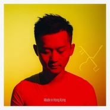

Made in Hong Kong
============================

|  |  |
| :--: | :-- |
| [ Made in Hong Kong](https://emumo.xiami.com/album/251772) | **艺人**: [林一峰](../index.md) **语种**: 粤语 **唱片公司**: LYFE **发行时间**: 2016年11月17日 **专辑类别**: 现场专辑 **专辑风格**: 灵魂乐 Soul, 流行灵魂乐 Pop Soul **播放数**: 32818 **收藏数**: 158 **评论数**: 14  |

## 简介

2015年12月，林一峰跟香港中乐团合作了两场音乐会《林一峰 x 香港中乐团》，当时名字很简单直接，但后来，因为这些录音的味道，加上全新创作和经典重新演绎，把这个庞大的案子叫做：《Made in Hong Kong》一峰希望于这个crossover中做到的是：不需颠覆的创新，新派的传统，沈淀的轻盈，谦厚的信心；我们从大都市流行曲到乡间民谣，远古到未来，创作到重新传译，踏上音乐旅程，从音乐的丝路走到感情的思路。

## 曲目

- [笑踏河山](./251772/mSwcWi8034f.md)
- [SOAK UP THE MOON](./251772/xNhbKJ235aa.md)
- [COLOURS OF THE WIND](./251772/xNhbKLa7ccd.md)
- [TOO LATE LOVE COMES](./251772/xNhbKMad217.md)
- [PUFF THE MAGIC DRAGON](./251772/mSwcWn7583d.md)
- [万花同/梦飞行](./251772/mSwcWo8b509.md)
- [未完舞曲](./251772/mSwcWp58439.md)
- [思路](./251772/mSwcWq795b7.md)
- [忘尽心中情](./251772/8HSa9118e26.md)
- [老榕树](./251772/mSwcWs85de6.md)
- [陈忠汉与赵美凤](./251772/xNhbKTb037e.md)
- [爱你枕边暖](./251772/mSwcWu60146.md)
- [回到花开的那天](./251772/8HSa9re4813.md)
- [万水千山纵横](./251772/U7xYm42abfa.md)

## 评论

|  |  |  |  |
| :-- | :-- | :-- | :-- |
|  [虾米用户](https://emumo.xiami.com/u/39952575) 舍不得虾米音乐 2021-01-03 22:10 赞(0) 踩(0) | 

 |
|  [虾米用户](https://emumo.xiami.com/u/42560187) 归于传统 2019-11-17 19:48 赞(1) 踩(0) | 
完美
 |
|  [虾米用户](https://emumo.xiami.com/u/401328063)  2019-06-06 13:20 赞(1) 踩(0) | 
创意都无限啦
 |
|  [虾米用户](https://emumo.xiami.com/u/2750042) Time will te... 2019-05-10 20:46 赞(1) 踩(0) | 
超棒的合作，依然记得现场听live的那天~
 |
|  [虾米用户](https://emumo.xiami.com/u/407344868) 做人呢，最紧要喺开心 2018-11-28 20:38 赞(3) 踩(0) | 
听了十几年林一峰，从床头歌、驯情记那时就很喜欢。感觉还是一如既往少年的模样 
 |
|  [虾米用户](https://emumo.xiami.com/u/336634945) 我还没想好要写什么... 2018-11-27 19:19 赞(1) 踩(0) | 
一張被嚴重低估的現場錄音！
 |
|  [虾米用户](https://emumo.xiami.com/u/1068989) 我还没想好要写什么... 2018-04-09 21:11 赞(1) 踩(0) | 
非常完美
 |
|  [虾米用户](https://emumo.xiami.com/u/12164333) hey！Moore 2018-03-02 17:12 赞(2) 踩(0) | 
在油管上看到Chet陈忠汉与赵美凤的视频找过来 感觉好像挖到宝
 |
|  [虾米用户](https://emumo.xiami.com/u/79754444)  2018-01-11 12:45 赞(0) 踩(0) | 
好听！！！
 |
|  [虾米用户](https://emumo.xiami.com/u/17116298) ~ 2017-12-27 01:05 赞(0) 踩(0) | 
试听才三千多 
 |
|  [虾米用户](https://emumo.xiami.com/u/17116298) ~ 2017-12-27 01:03 赞(2) 踩(0) | 
听了好久！才发现评论这么少哇(&amp;acute;･_･`)漂亮极了的一个专，重新编曲超惊艳
 |
|  [虾米用户](https://emumo.xiami.com/u/7104108)  2017-12-17 21:08 赞(2) 踩(0) | 
被编曲震惊了 
 |
|  [虾米用户](https://emumo.xiami.com/u/1132317)   2017-10-19 22:15 赞(12) 踩(0) | 
這是一張被低估的現場錄音唱片，好好欣賞，它值得被認真對待。
 |
| ⇒ |  [虾米用户](https://emumo.xiami.com/u/8210097)  2019-07-10 09:17 赞(0) 踩(0) | 
说得对
 |
