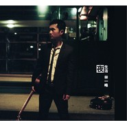

夜生活
============================

|  |  |
| :--: | :-- |
| [ 夜生活](https://emumo.xiami.com/album/2739) | **艺人**: [林一峰](../index.md) **语种**: 粤语 **唱片公司**: LYFE **发行时间**: 2007年08月01日 **专辑类别**: EP, 单曲 **专辑风格**: 粤语流行 Cantopop **播放数**: 161648 **收藏数**: 182 **评论数**: 8  |

## 简介

⊙林一峰《夜生活》自述  
  
《夜生活》是霎时冲动。  
  
制作《思生活》的时候突然想到做一张属于夜晚的EP，全部都是演绎别人的作品，而这些歌都曾经陪我渡过不少失眠夜，于是就趁着录音空档构了这张即兴专辑。  
  
《缱绻星光下》原曲是法国女歌手Elsa的作品《Tout L’temps，Tout L’temps》，因为不懂法语，所以最初接触这首歌时不明白她在说甚么，只觉得像被很多雾包围着，我干脆把这个印象用「依依呀呀」及多重和声表达，结合了广东版，成了大家现在听到的这个版本。  
  
因为林忆莲我才知道 Julia Fordham，《痴缠》原曲就是 Julia Fordham 的 Happy Ever After；虽然 Julia Fordham 后来变成了我其中一个重要的心头好，但这首 Happy Ever After 我还是喜欢中文版，比原曲远航非洲的意境，《痴缠》的枕边细语更让人向往。《夜生活》里的《痴缠》则更纤细，温柔，本身就是很脆弱的。  
  
《Man In The Moon》本来先录了英文版，差点收录在Camping专辑里，最后关头抽起。现在的处理方法是从广东版刘美君的第一身变为第三身旁观者，多了副题Man in the Mood，歌词也作了适度调整，比较戏谑。  
  
梅艳芳的《来来星屑港》改编自日本歌，收录于《绯闻中的女人》大碟，也是我在纽约时兴之所致拿起结他就录了下来，窗外下着雨，歌曲快完结时可听到一些雨点打在窗口冷气机上的「的的」声。  
  
台湾印象乐队的《电话》本来收录在《思生活》里，但我决定要做一张全创作专辑，便忍痛割舍；我还特地到纽约找当地的音乐人录音，在喇叭手 Peter Zummo 于纽约长岛的阁楼录音棚待了一个下午，回曼克顿的渡轮上看见黄昏的自由神像。  
 

## 曲目

- [缱绻星光下](./2739/5Dx57ed7.md)
- [痴缠](./2739/5Dy70e25.md)
- [Man In The Moon](./2739/5Dz843ba.md)
- [来来星屑港](./2739/bvFoe6587.md)
- [电话](./2739/dbIR3aa4d.md)

## 评论

|  |  |  |
| :-- | :-- | :-- |
|  [虾米用户](https://emumo.xiami.com/u/1216780) Don't Panic! 2016-12-15 22:58 赞(0) 踩(0) | 
loop了一整晚这张
 |
|  [虾米用户](https://emumo.xiami.com/u/40124694)  2015-10-20 14:07 赞(0) 踩(0) | 
APE无损资源已更新：<a href="http://www.162wp.com/yinle/2015-10-20/25860.html" target="_blank" rel="nofollow noreferrer noopener">http://www.162wp.com/yinle/2015-10-20/25860.html</a>
 |
|  [虾米用户](https://emumo.xiami.com/u/51838955)  2015-10-09 22:17 赞(0) 踩(0) | 
把别人的变成自己的，整专无瑕疵！很棒！
 |
|  [虾米用户](https://emumo.xiami.com/u/7547789)  2015-07-14 06:27 赞(0) 踩(0) | 
冷嘴唇碰上热烫脸 说不完每句梦呓语 耳朵边 埋藏一丝一丝温暖
 |
|  [虾米用户](https://emumo.xiami.com/u/16050797)   2014-06-05 01:55 赞(0) 踩(0) | 
好棒的文字样，清晰的叙述比推销专辑来的好
 |
|  [虾米用户](https://emumo.xiami.com/u/2533406)  2012-04-11 08:40 赞(0) 踩(0) | 
听
 |
|  [虾米用户](https://emumo.xiami.com/u/2180098) 希望は残っているよ。どん 2011-07-18 11:58 赞(0) 踩(0) | 
虐心
 |
|  [虾米用户](https://emumo.xiami.com/u/1379209) Simple is Be... 2011-03-07 13:37 赞(0) 踩(0) | 
By my side~
 |
