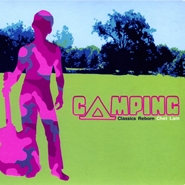

Camping Classics Reborn
============================

|  |  |
| :--: | :-- |
| [ Camping Classics Reborn](https://emumo.xiami.com/album/2743) | **艺人**: [林一峰](../index.md) **语种**: 英语 **唱片公司**: LYFE **发行时间**: 2006年04月03日 **专辑类别**: 录音室专辑 **专辑风格**: 流行 Pop **播放数**: 195221 **收藏数**: 200 **评论数**: 14  |

## 简介

创作歌手林一峰首张英文经典大碟,演绎70-80年代流行歌曲,包括:Diana Ross &amp; The Suprome-You  
Can't Hurry Love,ABBA,Dancoing Queen,Astrud Giberto-The Boy From Lpanema,Madonna-Crazy For  
You,the bangles-Eternal Flame及林一峰亲自创作的 I Don't Want to Say Goodbye,Let's Go Camping...等

## 曲目

- [You Can't Hurry Love (Prologue)](./2743/bLHf1e65d.md)
- [Dancing Queen](./2743/5Eyc7468.md)
- [I Don't Want To Say Goodbye](./2743/5Ez9390f.md)
- [The Boy From Ipanema (Original Version: Astrud Gilberto)](./2743/VFudc3c2.md)
- [When He Sings (New Song By Chet Lam)](./2743/bvGpfd887.md)
- [Crazy For You (Original Version: Madonna)](./2743/5E2729b6.md)
- [Let's Go Camping (New Song By Chet Lam)](./2743/clIf2c08a.md)
- [A Waltz For A Night](./2743/5E4543ca.md)
- [Rent (Original Version: The Pet Shop Boys)](./2743/VFzb74fa.md)
- [You've Got To Learn](./2743/VF09b18c.md)
- [Cool (Original Version:Gwen Stefani)](./2743/clIj272d8.md)
- [Eternal Flame (Original Version:The Bangles)](./2743/clIk29c0a.md)
- [Happy Ending (Epilogue)](./2743/VF311b5b.md)

## 评论

|  |  |  |
| :-- | :-- | :-- |
|  [虾米用户](https://emumo.xiami.com/u/1296817) 我还没想好要写什么... 2020-08-07 18:58 赞(0) 踩(0) | 
选歌的品味也是gay gay的
 |
|  [虾米用户](https://emumo.xiami.com/u/10936044)  2019-06-18 21:32 赞(0) 踩(0) | 
绝对10分，这张专辑每首歌都超好听！
 |
|  [虾米用户](https://emumo.xiami.com/u/2595903) 我还没想好要写什么... 2018-07-01 16:02 赞(0) 踩(0) | 
这张专是标准的出柜专吧。。
 |
|  [虾米用户](https://emumo.xiami.com/u/3045400)  2018-05-11 00:15 赞(0) 踩(0) | 
这张如果有sq就好了
 |
|  [虾米用户](https://emumo.xiami.com/u/286647949)  2017-05-02 07:10 赞(0) 踩(0) | 
  
 |
|  [虾米用户](https://emumo.xiami.com/u/15767865)  2014-06-30 14:50 赞(0) 踩(0) | 
好爱这张专辑~
 |
|  [虾米用户](https://emumo.xiami.com/u/4075493)  2012-01-30 12:31 赞(0) 踩(0) | 
找一首歌。。。。
 |
|  [虾米用户](https://emumo.xiami.com/u/525628)  2011-11-03 14:00 赞(0) 踩(0) | 
还没听，我知道我回喜欢的
 |
| ⇒ |  [虾米用户](https://emumo.xiami.com/u/51800191)  2015-11-27 15:37 赞(0) 踩(0) | 
你好
 |
|  [虾米用户](https://emumo.xiami.com/u/1063050) 人间繁华多笑语，惟我空余... 2011-08-18 20:59 赞(0) 踩(0) | 
嗲~
 |
|  [虾米用户](https://emumo.xiami.com/u/2793798) 天天向上 2011-08-05 13:22 赞(0) 踩(0) | 
低声浅唱
 |
|  [虾米用户](https://emumo.xiami.com/u/1379209) Simple is Be... 2011-03-07 13:47 赞(0) 踩(0) | 
By my side~
 |
|  [虾米用户](https://emumo.xiami.com/u/10019)  2011-02-10 01:05 赞(0) 踩(0) | 
Cover of classics!
 |
|  [虾米用户](https://emumo.xiami.com/u/687883) MusicTheBest 2010-12-30 16:59 赞(1) 踩(0) | 
这个dancing queen的编曲让我想到dust in the wind
 |
