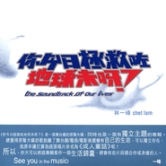

你今日拯救咗地球未呀
============================

|  |  |
| :--: | :-- |
| [ 你今日拯救咗地球未呀](https://emumo.xiami.com/album/2746) | **艺人**: [林一峰](../index.md) **语种**: 粤语 **唱片公司**: LYFE **发行时间**: 2005年07月01日 **专辑类别**: 录音室专辑 **专辑风格**: 粤语流行 Cantopop, 根源唱作人 Singer-Songwriter **播放数**: 340643 **收藏数**: 487 **评论数**: 33  |

## 简介

《你今日拯救咗地球未呀？》是一张舞台剧的原声大碟，同时也是一张有独立主题的专辑。《你今日拯救咗地球未呀？？》乃搞笑感人的成人童话音乐剧场，内容描述徘徊生与死的纯真世界，主演主唱的林一峰特别为本剧撰写多首全新歌曲，并邀得苏玉华担任女主角，以及荷里活电影《史力加》动画总监许诚毅担任美术设计，其他主要演员包括邵美君、梁祖尧、黄雪文、杨诗敏、刘子腾及吴剑菲，更有一群剧场幕后精英助阵，绝对值得捧场。   
  
苏玉华饰演的 Louisa 在生日当日得知自己患绝症，却在此时遇上自称“超人一号”的林一峰。Louisa 在“超人一号”引领下徘徊在生与死的纯真世界，终于发现二人之间的神秘联系……   
  
总觉得原声大碟的歌脱离了舞台剧/电视/电影后还会有自己的生命，可以独立存在，我原本还打算为这张唱片命名为《成人童话》呢！所以，你大可以将这专辑看作一个生活锦囊，总会有些片段适合你或身边的人。   
  
⊙有关原声大碟   
  
没有 W Theatre 的小龙就没会有这些歌；没有《你今日拯救咗地球未呀？》音乐剧场就不会有这张原声大碟。谢谢大家的鼓励、威胁 (哈哈…)、劝告，让我决心把这些歌辑录起来。这里还特别收录了本来为《你》剧而写但最后没有用的“活下来”，及两首来自《驯情记》的歌“陪你失眠”和“纯色”。   
  
⊙有关超人   
  
超人不一定要打怪兽，却一定有一个很强的信念，去捍卫一些自己认为是对的东西；这个世界没有超人也可以如常运作，太多超人反而会像白血球过多般有害；而且，超人都有点病态：Daredevil 一心想着报仇，Spiderman 的背后推动力是来自间接害死叔叔的罪咎感，《你》剧里的超人一号更是因为希望弥补对家人所造成的伤害而返人间，完全因为私心……   
  
超人，很可能都有点心理不平衡；可是，就是因为有这些自以为是的人出现，生活才多了点颜色；超人做了什么并不是最重要的，我们在他们身上得到什么才是。至于我……我当然不是超人，我只是一个说故事的人。   
  
⊙有关“超人角度”   
  
表面上《你》是一个有关超人的故事，但其实大题目是生死，而将两者，甚至乎台上台下连在一起的就是“超人角度”   
  
《你》是一个集众人和努力而成的 Project，包括导演编剧黄智龙的胆色与视野，苏玉华，邵美君等各位演员的专业……而在一切开始之前，“史力加”许诚毅已经将他的“超人角度”画了出来，在此我特意将他的放在这里，循着这轨迹，你可以发展你自己的“超人角度”……   
 

## 曲目

- [静止给时间](./2746/VGgdf734.md)
- [游乐场上的最后胜利给最开心的人](./2746/bvHbf9b96.md)
- [我和我的影子给顽童](./2746/5Fo4e37f.md)
- [数三声给神经紧张的你](./2746/bvHdeb978.md)
- [大笨象给硬颈王](./2746/VGkae36a.md)
- [忘了被拥抱的感觉给强人](./2746/VGl15bb0.md)
- [死U死ME给死亡](./2746/d1LC3c5cb.md)
- [给最开心的人给被遗忘了的人](./2746/cBJP2ed1e.md)
- [时间河MV给离开了的人](./2746/5Fu86a1e.md)
- [活下来给各位超人](./2746/VGpdf2d7.md)
- [陪你失眠给爱情](./2746/VGq1172f.md)
- [纯色给初恋](./2746/d1LH42df8.md)

## 评论

|  |  |  |
| :-- | :-- | :-- |
|  [虾米用户](https://emumo.xiami.com/u/36188564)  2019-11-30 15:59 赞(0) 踩(0) | 
还是喜欢他这种令人上头的甜和敏感
 |
|  [虾米用户](https://emumo.xiami.com/u/113808960) 出走q音 我家不在这星球 2018-01-14 16:03 赞(4) 踩(0) | 
就喜欢这样甜腻的林一峰
 |
|  [虾米用户](https://emumo.xiami.com/u/6945942) 耳朵需要不斷升級 2018-01-09 23:35 赞(4) 踩(0) | 
按时间顺序听到这张，感觉他做这样的时候应该恋爱了吧，又甜又可爱
 |
|  [虾米用户](https://emumo.xiami.com/u/3445008) Wink babe  2014-12-10 19:30 赞(1) 踩(0) | 
<a href="http://emumo.xiami.com/u/5026015" target="_blank" rel="nofollow" name_card="5026015">@围歼轶闻录</a> <a href="http://emumo.xiami.com/u/670973" target="_blank" rel="nofollow" name_card="670973">@邹hey</a> 安安静静听林一峰
 |
| ⇒ |  [虾米用户](https://emumo.xiami.com/u/5026015)  2014-12-10 20:18 赞(0) 踩(0) | 
林一峰就是这个调调
 |
|  [虾米用户](https://emumo.xiami.com/u/21810431) 爱是最大权利 2014-10-19 11:28 赞(1) 踩(0) | 
太喜欢这张专辑了 听第一首就爱上
 |
|  [虾米用户](https://emumo.xiami.com/u/13149909) 愿我是爱得更多的那人。 2014-09-19 20:57 赞(1) 踩(0) | 
个名好得意
 |
|  [虾米用户](https://emumo.xiami.com/u/15980953) 暗恋桃花源1900 2014-08-27 21:49 赞(2) 踩(0) | 
好喜欢静止，有时泪会淌下别太紧张……
 |
|  [虾米用户](https://emumo.xiami.com/u/9672768)  2014-05-20 13:07 赞(1) 踩(0) | 
致我们永不放弃的人生，致我们永不忘记的英雄情结。
 |
|  [虾米用户](https://emumo.xiami.com/u/5443127) COMING SOON 2014-05-07 18:56 赞(1) 踩(0) | 
这张是要打六星的！虽然九年前错过了舞台剧（那时候真的太小啦），现在听着音乐也开始在脑内编演那些故事
 |
|  [虾米用户](https://emumo.xiami.com/u/2044606)  2013-12-30 17:01 赞(1) 踩(0) | 
你就系拯救地球噶小超人哇！
 |
|  [虾米用户](https://emumo.xiami.com/u/8240839) ~~ 2013-05-23 21:36 赞(1) 踩(0) | 
死you死me，哇卡卡卡卡，喷饭~爱死啦~
 |
|  [虾米用户](https://emumo.xiami.com/u/4094791) 无事来听歌。 2013-04-04 14:24 赞(1) 踩(0) | 
这么好玩的名字，爱生活才会写出这般平淡朴实的感悟
 |
| ⇒ |  [虾米用户](https://emumo.xiami.com/u/51800191)  2015-08-27 20:57 赞(0) 踩(0) | 
你好朋友
 |
| ⇒ |  [虾米用户](https://emumo.xiami.com/u/4094791) 无事来听歌。 2015-08-28 23:21 赞(0) 踩(0) | 
<q><b>thinking_123说：</b></q>
 |
| ⇒ |  [虾米用户](https://emumo.xiami.com/u/51800191)  2015-08-28 23:23 赞(0) 踩(0) | 
<q><b>Rice说：</b></q>
 |
| ⇒ |  [虾米用户](https://emumo.xiami.com/u/4094791) 无事来听歌。 2015-08-29 06:17 赞(0) 踩(0) | 
<q><b>thinking_123说：</b></q>
 |
| ⇒ |  [虾米用户](https://emumo.xiami.com/u/51800191)  2015-08-29 08:09 赞(0) 踩(0) | 
<q><b>Rice说：</b></q>
 |
| ⇒ |  [虾米用户](https://emumo.xiami.com/u/4094791) 无事来听歌。 2015-08-29 15:25 赞(0) 踩(0) | 
<q><b>thinking_123说：</b></q>
 |
| ⇒ |  [虾米用户](https://emumo.xiami.com/u/4094791) 无事来听歌。 2015-08-29 15:26 赞(0) 踩(0) | 
<q><b>thinking_123说：</b></q>
 |
| ⇒ |  [虾米用户](https://emumo.xiami.com/u/4094791) 无事来听歌。 2015-08-29 15:26 赞(0) 踩(0) | 
<q><b>thinking_123说：</b></q>
 |
| ⇒ |  [虾米用户](https://emumo.xiami.com/u/51800191)  2015-08-29 16:04 赞(0) 踩(0) | 
<q><b>Rice说：</b></q>
 |
|  [虾米用户](https://emumo.xiami.com/u/7314818) 预备筷子 2012-11-01 22:23 赞(0) 踩(0) | 
令我爱上林一峰的一张.
 |
|  [虾米用户](https://emumo.xiami.com/u/2756640) 免得你带着明眸皓齿装饰我 2012-09-18 17:54 赞(1) 踩(0) | 
给离开了的人。我也做过这样的事。
 |
|  [虾米用户](https://emumo.xiami.com/u/6436398) 十二字如何表達複雜的自我 2012-07-24 09:53 赞(1) 踩(0) | 
林一峰的專輯，最喜歡這個，因為呢個係一套原聲，最完整
 |
|  [虾米用户](https://emumo.xiami.com/u/1615420)  2012-07-16 14:21 赞(1) 踩(0) | 
今天下午这张碟陪我午睡，醒来三点半，放假的时光真写意！
 |
|  [虾米用户](https://emumo.xiami.com/u/525134)  2012-04-08 17:17 赞(0) 踩(0) | 
吾订的专辑哪能还没有到啦？明明是航空邮件。哎，没办法，听听老歌解解馋~虽然到手了也是老歌新碟一张~
 |
|  [虾米用户](https://emumo.xiami.com/u/1911474)  2011-06-11 21:51 赞(1) 踩(0) | 
I do like this signer!
 |
|  [虾米用户](https://emumo.xiami.com/u/3457081) 装淑女的朋克心。 2011-05-17 20:51 赞(1) 踩(0) | 
你今日拯救咗地球未呀？你今日思念我未呀？かわいい~すきだ！
 |
|  [虾米用户](https://emumo.xiami.com/u/3838805)  2011-05-12 03:27 赞(1) 踩(0) | 
好可惜错过这么好的舞台剧 林一峰的一切都值得细细去体会
 |
|  [虾米用户](https://emumo.xiami.com/u/1450794) ･:*+. 2011-05-02 18:14 赞(0) 踩(0) | 
很係鐘意這張專輯、
 |
|  [虾米用户](https://emumo.xiami.com/u/1379209) Simple is Be... 2011-03-07 13:48 赞(0) 踩(0) | 
By my side~
 |
|  [虾米用户](https://emumo.xiami.com/u/985576)  2010-06-12 12:25 赞(0) 踩(0) | 
好好活下来
 |
