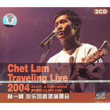

游乐园 香港演唱会
============================

|  |  |
| :--: | :-- |
| [ 游乐园 香港演唱会](https://emumo.xiami.com/album/2748) | **艺人**: [林一峰](../index.md) **语种**: 粤语 **唱片公司**: LYFE **发行时间**: 2004年11月01日 **专辑类别**: 现场专辑 **专辑风格**: 粤语流行 Cantopop **播放数**: 263821 **收藏数**: 173 **评论数**: 10  |

## 简介

十月六日，林一峰在香港伊利沙伯体育馆展开为期两天的“林一峰游乐会”，为新专辑《一个人在途上》宣传。黄耀明、关心妍、At 17、有耳非文、I Love You Boy’z组合等均有捧场。在众多现场送礼物的观众中，黄耀明是引起最大轰动的一位。   
  
林一峰以一首《突然独身》出场，他慨叹这首歌已经唱了两年，并带出一首“找到出口”的新歌《没有夏娃的伊甸园》。在这场新旧作品交汇的音乐会上，既有今年3月林一峰、Pancakes、Ketchup三人合作“321到你”音乐会上演绎过的作品，也有将旧歌重新编排不同版本的歌曲，还有新专辑中的新作。其中《Autumn leaves＋重回布拉格》、轻快爵士版的《The Best Is Yet To Come》、布鲁斯版的《花街70号》等重新演绎版本让观众看到了林一峰民谣以外的另一面。与关心妍合唱《Don’t Know Why》等爵士作品充满脉脉温情。最后神秘嘉宾I Love You Boy’z组合的搞笑演出为林一峰的“纯情”形象增添了幽默色彩。   
  
当晚音乐会上，不少观众都送上自己的礼物，林一峰表示希望歌迷能把钱捐给慈善机构或用于购买唱片支持独立音乐人，在长串感谢名单中包括了黄耀明等前辈，而明哥也即场送上一束鲜花让林一峰非常惊喜。   
  
这是一场多元化的音乐会，将爵士、民谣、搞笑的元素、香港的开心文化等融入其中，感觉林一峰的音乐空间宽阔了，特别是从林一峰演绎爵士的部分可见他有着很深的爵士渊源。现场木吉他演绎的《重回布拉格》、《遇见》等歌曲都很让人感动，但和关心妍合唱的部分好像不大合拍。但这样的音乐会让我们看到非主流的音乐在香港依然有一定的市场，觉得很安慰。

## 曲目

- [Cl411 特约空姐广播(live)](./2748/VGM999c4.md)
- [空中小姐(live)](./2748/5FT75df1.md)
- [Cl411 机长广播(live)](./2748/5FU75721.md)
- [突然独身(live)MV小说"突然独身"主题曲](./2748/5FVaa111.md)
- [离开,是为了回来(live)](./2748/bvHKfd709.md)
- [始终一天(live)原唱：at17](./2748/5FX6ec12.md)
- [没有夏娃的伊甸园(live)An Eden Without Eve](./2748/VGSdecb5.md)
- [暗涌(方树梁合奏)原唱：王菲](./2748/VGTc96d8.md)
- [新浪漫(方树梁合奏)MV](./2748/VGUc46f5.md)
- [谢谢侬(live)MV原唱：陈奕迅](./2748/VGVc4f6f.md)
- [冷热之间(live)MVAll This Time](./2748/5Gc5c0e1.md)
- [离开古城(live)](./2748/bvHR1c711.md)
- [重回布拉格(live)MV](./2748/clJG27597.md)
- [燕尾蝶(live)MV原唱：shine](./2748/VGZcca2b.md)
- [The Best Is Yet To ComeMV](./2748/d1M0427e0.md)
- [一支烟的时间(live)MVA Cigarette Without You](./2748/5Gh4febe.md)
- [State Of Mind(live)](./2748/5Gi5c7f9.md)
- [Piano Man(live)](./2748/5Gj78c02.md)
- [Don't Know Why(live)](./2748/5Gk62729.md)
- [今天应该更高兴(live)MV](./2748/5Gl5c3ba.md)
- [Cl411(live)](./2748/VHga9f4c.md)
- [说说自己的故事(live)Just Another Story](./2748/bvIb1902a.md)
- [遇见(live)MV原唱：孙燕姿](./2748/VHib8d1d.md)
- [I Love You Boyz Live Gag(live)](./2748/VHjaca33.md)
- [A Case Of You(live)](./2748/5Gq78c56.md)
- [The Best Is Yet To Come (全场和唱)](./2748/VHlbcab4.md)
- [Cl411 机长广播Ⅱ(live)](./2748/5Gs91577.md)

## 评论

|  |  |  |
| :-- | :-- | :-- |
|  [虾米用户](https://emumo.xiami.com/u/4472406) 我还没想好要写什么... 2019-08-25 14:41 赞(0) 踩(0) | 
打卡
 |
|  [虾米用户](https://emumo.xiami.com/u/4810018) 好歌献给我 2019-04-06 08:48 赞(0) 踩(0) | 
灵动
 |
|  [虾米用户](https://emumo.xiami.com/u/6820570) 这是语言的变调，承接醒来... 2017-05-02 17:05 赞(2) 踩(0) | 
虾米搜索不知道怎么做的，搜索&amp;ldquo;谢谢侬 林一峰&amp;rdquo;，结果里不会有这一条，只有专门找到这个专辑才能听到。怪怪的
 |
| ⇒ |  [虾米用户](https://emumo.xiami.com/u/1489937)  2020-10-27 09:04 赞(0) 踩(0) | 
现场歌曲后面没有加上“live”,搜索起来很困难
 |
|  [虾米用户](https://emumo.xiami.com/u/2977236) 我说的黑不是黑，你说的蓝... 2015-03-25 11:54 赞(2) 踩(0) | 
喜欢这种香港小清晰+温油调调的
 |
| ⇒ |  [虾米用户](https://emumo.xiami.com/u/51800191)  2015-08-27 20:33 赞(0) 踩(0) | 
您好
 |
|  [虾米用户](https://emumo.xiami.com/u/5441715)  2012-05-31 10:23 赞(1) 踩(0) | 
今天应该更高兴，唱得真好听
 |
| ⇒ |  [虾米用户](https://emumo.xiami.com/u/51800191)  2017-04-07 06:38 赞(0) 踩(0) | 
你好
 |
|  [虾米用户](https://emumo.xiami.com/u/1379209) Simple is Be... 2011-03-07 13:38 赞(1) 踩(0) | 
By my side~
 |
|  [虾米用户](https://emumo.xiami.com/u/2443925)  2011-01-09 21:27 赞(1) 踩(0) | 
林一峰
 |
