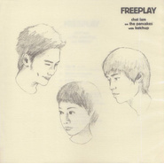

FreeplayChet Lam On The Pancakes With Ketchup
============================

|  |  |
| :--: | :-- |
| [ FreeplayChet Lam On The Pancakes With Ketchup](https://emumo.xiami.com/album/2750) | **艺人**: [林一峰](../index.md) **语种**: 粤语 **唱片公司**: LYFE **发行时间**: 2004年03月01日 **专辑类别**: 录音室专辑 **专辑风格**: 粤语流行 Cantopop, 独立流行 Indie Pop **播放数**: 66769 **收藏数**: 194 **评论数**: 10  |

## 简介

对于时常关注香港独立音乐界的人来说，林一峰应该不是个陌生的名字：以前专职写歌，曾经是著名香港独立乐团3P成员，现今是独立民谣唱作人，2003年更是一鼓作气发行了两张品质优异的个人唱片《林一峰的床头歌》和《Travelogue 1》（《游乐》），一鸣惊人，不禁让乐迷欣喜异常。然而Chet的创作活力似乎是无穷无尽，紧接着又在今年3月带来了全新专辑“ Chet Lam On The Pancakes With Ketchup”，让人大呼过瘾。  
  
这张名字看起来怪怪的唱片，其实有着比较有意思的制作背景。林一峰、The Pancakes、Ketchup这三个生长于八十年代的年轻人，其实都是港岛上现今比较知名的独立音乐唱作人。The Pancakes（主唱Dejay的个人乐团，曾经在《麦兜故事》的原声带里以Miss Chan Chan的身份献歌一首）擅长于创作搞怪有趣的自家Indie Pop（独立流行）音乐，从香港巴士宣传歌到广告曲甚至在西班牙都能听得到；而专修平面设计的Ketchup，也一心要将英伦的吉他音乐在港岛发扬广大。三个志同道合的年轻人为了共同的音乐理想走到了一起，进而开办了"Chet Lam + The Pancakes + Ketchup1,2,3到你！"音乐会。作为2004年香港国际艺术节的演出节目之一，音乐会取得空前成功，不仅加演一场，而且场场爆满，坐无虚席。估计是三人对音乐、对生活的鲜明态度和独立精神感染了在座的每一位观众吧。而借着音乐会的成功，三人继续合作的这张虽然只有短短28分钟多一点的唱片相信也不会令你失望，同样值回票价。  
  
和上两张专辑一样，林一峰的这张专辑继续延续着Acoustic的清新民谣风格，不过Dejay和Ketchup的助阵让音乐元素丰富了不少。开场曲“ABC餐”一如海滩音乐般阳光，加上Dejay特有的可爱唱腔以及三人的和声，其乐融融的欢快气氛早以将每一个人深深感染。“ Hidden Strangers”开头的Unplugged曲风已彰显Indie风范，而全曲似乎专为Dejay度身定做，从头到尾十足The Pancakes式样，怪不得Dejay演绎起来得心应手。“Martin”、“I Know”、“一秒”原本为The Pancakes的旧曲，而“Martin”和“I Know”本为轻松欢快的歌曲，经过Chet与Ketchup的一番深情演绎，自有另一种味道。“ La La La La La La La La La La”虽然只有1分14秒长，却是整张专辑里最可爱的曲子。三人均摆足"Play"姿态，玩转录音间不到尽兴绝不罢休，自由随性让人大呼搞怪又精彩。“ Travelling Cappuccino”是整张专辑里最细腻耐听的歌曲，Chet一边弹着撩人的Bossa Nova，一边动人的开唱，温暖亲切的歌声恍如A boy from Ipanema般可爱。"Stop the alarm on your way,Go with the flow walking straight,It's just another hectic day…"听到这样的歌词直想叫人抛开手边心中烦恼事，穿上花衬衫和短裤直奔海滩晒太阳。“For A Special Friend”，木吉他＋甜美女声，最具民谣气质的歌曲，述说着淡淡的友情。“When You Call My Name”，Downtempo节奏下略带些许忧伤气息的吉他歌曲，Ketchup的真情演绎。“Arcturus”，专辑的最后一曲，搞怪的吉他，搞怪的节奏，搞怪的唱词……看来Chet Lam + The Pancakes + Ketchup誓要将夸张搞怪进行到底，将年轻活力发挥到极限。  
  
听完这张可爱的专辑，那种青春的热力已经不自觉地开始传遍全身，整个人也变得轻松起来。“Chet Lam On The Pancakes With Ketchup”，有趣的组合，有趣的唱片，尽管它不一定能像正餐一样具有多少深奥的意义和大道理，但作为饭后甜点轻松一下却不错。快乐就是这么简单，所以千万不要错过！

## 曲目

- [Abc餐](./2750/dRNK4afa4.md)
- [Hidden Strangers](./2750/dRNL49326.md)
- [Martin](./2750/bLJq1f40d.md)
- [I Know](./2750/dbLZ396ad.md)
- [La La La La La La La La La La](./2750/VH4c8992.md)
- [Travelling Cappuccino](./2750/VH598fce.md)
- [一秒](./2750/bLJu23232.md)
- [For A Special Friend](./2750/5GD55581.md)
- [When You Call My Name](./2750/VH89eba5.md)
- [Arcturus](./2750/VH922c85.md)

## 评论

|  |  |  |
| :-- | :-- | :-- |
|  [虾米用户](https://emumo.xiami.com/u/10936044)  2019-06-19 01:05 赞(1) 踩(0) | 
绝对五星！超好听！
 |
|  [虾米用户](https://emumo.xiami.com/u/829375) 我还没想好要写什么... 2018-10-12 23:37 赞(2) 踩(0) | 
林一峰 x Ketchup x The Pancakes
 |
|  [虾米用户](https://emumo.xiami.com/u/4472406) 我还没想好要写什么... 2018-08-14 18:39 赞(0) 踩(0) | 
最愛之一
 |
|  [虾米用户](https://emumo.xiami.com/u/7841608)  2014-08-28 14:56 赞(0) 踩(0) | 
好听又好玩。
 |
|  [虾米用户](https://emumo.xiami.com/u/1467480)  2014-04-04 15:22 赞(0) 踩(0) | 
为了pancakes~~
 |
|  [虾米用户](https://emumo.xiami.com/u/4282174)  2014-04-02 16:33 赞(0) 踩(0) | 
好听哒w
 |
|  [虾米用户](https://emumo.xiami.com/u/583882)  2013-01-28 22:27 赞(0) 踩(0) | 
整张都爱！！
 |
|  [虾米用户](https://emumo.xiami.com/u/4953679)  2013-01-18 22:45 赞(0) 踩(0) | 
大爱
 |
|  [虾米用户](https://emumo.xiami.com/u/3318531)  2011-03-23 23:52 赞(0) 踩(0) | 
林一峰❸
 |
|  [虾米用户](https://emumo.xiami.com/u/1379209) Simple is Be... 2011-03-07 13:43 赞(0) 踩(0) | 
By my side~
 |
