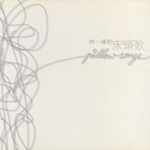

林一峰的床头歌
============================

|  |  |
| :--: | :-- |
| [ 林一峰的床头歌](https://emumo.xiami.com/album/2752) | **艺人**: [林一峰](../index.md) **语种**: 粤语 **唱片公司**: LYFE **发行时间**: 2003年01月24日 **专辑类别**: 录音室专辑 **专辑风格**: 独立流行 Indie Pop, 华语唱作人 Chinese Singer-Songwriter, 粤语流行 Cantopop **播放数**: 1430290 **收藏数**: 971 **评论数**: 44  |

## 简介

简简单单的木吉他奏出爽朗的民谣旋律，清新柔和的男声吟唱再配上简洁的和声，林一峰带来的是被称为独立流行(Indie Pop)的一类非主流流行作品，其实所谓非主流，除了绝对不够媚俗不够甜腻以外，找不出更多不能让大众喜欢它的成分——漂亮的旋律，干净的歌词和乖巧的小男生。这样的低调气质是和香港另一位Indie女歌手“有耳非文”相通的，也许是因为少了电音的成分，林一峰显得更加单纯和自我，就像这张专辑的名字一样，纯粹是躺在床头写给自己的私房歌，那种最个体最简单的表白不需要太多人理解，自己喜欢就好。

## 曲目

- [突然独身MV小说《突然独身》主题曲](./2752/bvIHe326b.md)
- [雪糕车MV](./2752/5GU915de.md)
- [1和2](./2752/bvIJef803.md)
- [秋千](./2752/5GW79bce.md)
- [19](./2752/VHR9de32.md)
- [我和泡面](./2752/dROm44d48.md)
- [青草地、溪水旁](./2752/VHTbc66d.md)
- [我的日记](./2752/5Ha5f49f.md)
- [追忆](./2752/5Hb81790.md)
- [The Best Is Yet To ComeMV](./2752/5Hc53cc7.md)

## 评论

|  |  |  |
| :-- | :-- | :-- |
|  [虾米用户](https://emumo.xiami.com/u/443079545)  2020-05-21 04:20 赞(0) 踩(0) | 
竟然在這邊找到一峰這專輯啊，相信尚有更多更多，那些簡單的快樂-the best is yet to come! 
 |
|  [虾米用户](https://emumo.xiami.com/u/221208) 心在树上，你摘就是 2020-05-21 00:43 赞(0) 踩(0) | 
曾买过的专辑之一。
 |
|  [虾米用户](https://emumo.xiami.com/u/303214020)  2019-02-19 20:05 赞(1) 踩(0) | 
支撑我度过整个成长阶段的一张很重要的专辑
 |
|  [虾米用户](https://emumo.xiami.com/u/155462684) on the way 2016-10-04 13:23 赞(2) 踩(0) | 
这张专辑听完会觉得心里暖暖的 像回到过去那段青春时光里
 |
|  [虾米用户](https://emumo.xiami.com/u/17719900) 请把我的歌带回你的家 2016-03-26 22:50 赞(2) 踩(0) | 
永远都是那么好
 |
|  [虾米用户](https://emumo.xiami.com/u/2630359)  2015-04-12 23:47 赞(2) 踩(0) | 
躺床上看书的时候好适合循环这张 专辑名也好契合 我和泡面简直就是心声！！！
 |
| ⇒ |  [虾米用户](https://emumo.xiami.com/u/51800191)  2016-06-01 23:39 赞(0) 踩(0) | 
你好    
 |
|  [虾米用户](https://emumo.xiami.com/u/42506292) I am good. 2014-11-06 14:51 赞(1) 踩(0) | 
好歌
 |
|  [虾米用户](https://emumo.xiami.com/u/7841608)  2014-08-28 14:45 赞(1) 踩(0) | 
小清新，一听就是GAY
 |
| ⇒ |  [虾米用户](https://emumo.xiami.com/u/6560811) 在下失礼，并语祝吉安。 2015-04-27 11:05 赞(0) 踩(0) | 
  
 |
|  [虾米用户](https://emumo.xiami.com/u/15980953) 暗恋桃花源1900 2014-08-22 22:41 赞(0) 踩(0) | 
喜欢青草地、溪水旁，就是录音好像不是很好！
 |
| ⇒ |  [虾米用户](https://emumo.xiami.com/u/51800191)  2017-08-30 21:08 赞(0) 踩(0) | 
你好
 |
|  [虾米用户](https://emumo.xiami.com/u/4282174)  2014-03-28 05:09 赞(0) 踩(0) | 
哈喜欢
 |
|  [虾米用户](https://emumo.xiami.com/u/1609946) 一即一切 2014-03-09 16:05 赞(0) 踩(0) | 
心 境不二
 |
|  [虾米用户](https://emumo.xiami.com/u/6507607) 请把我的尸体埋在音乐里。 2013-08-26 23:28 赞(1) 踩(0) | 
吉他很动听
 |
|  [虾米用户](https://emumo.xiami.com/u/1332401)   2013-06-27 22:35 赞(0) 踩(0) | 
今晚听回林一峰。现在听着觉得真粗糙，就像streetvoice里简简单单homemade的demo，依然很贴心就是了。
 |
| ⇒ |  [虾米用户](https://emumo.xiami.com/u/43309611)  2017-05-22 17:49 赞(0) 踩(0) | 
街声好音乐太多了
 |
|  [虾米用户](https://emumo.xiami.com/u/719995) 事出有音 2013-06-22 22:40 赞(0) 踩(0) | 
那个时候的他，还是年轻的心境，也不会像现在杂念这么多，也许这就是人生的起伏吧~
 |
|  [虾米用户](https://emumo.xiami.com/u/9559667) 音乐是有生命的花。 2013-05-28 02:54 赞(0) 踩(0) | 
好听咯。舒服咯。
 |
|  [虾米用户](https://emumo.xiami.com/u/9559667) 音乐是有生命的花。 2013-05-28 02:53 赞(0) 踩(0) | 
好听！
 |
|  [虾米用户](https://emumo.xiami.com/u/6969907) 麻公子，拉肚子 2013-04-10 13:06 赞(0) 踩(0) | 
如有机会你愿意...么？单身的时候听到这首歌，还是很有感觉的
 |
|  [虾米用户](https://emumo.xiami.com/u/661017)  2013-04-09 19:06 赞(0) 踩(0) | 
雪糕车好好听
 |
| ⇒ |  [虾米用户](https://emumo.xiami.com/u/51800191)  2016-06-01 23:39 赞(0) 踩(0) | 
你好      
 |
|  [虾米用户](https://emumo.xiami.com/u/366413) 失语症 2013-04-01 22:22 赞(0) 踩(0) | 
晚安。。今晚必须得早点睡。。睡个好气色。。明天肥家就不会挨骂了[星星眼]
 |
|  [虾米用户](https://emumo.xiami.com/u/13168604) 我还没想好要写什么... 2013-03-18 22:21 赞(0) 踩(0) | 
清纯
 |
|  [虾米用户](https://emumo.xiami.com/u/3108929) 没时间观念，喜欢戴表。 2013-01-13 14:17 赞(1) 踩(0) | 
一晃十年
 |
|  [虾米用户](https://emumo.xiami.com/u/1801301) 随响 2012-12-26 22:13 赞(1) 踩(0) | 
简单轻松 还不错 竟然是十年前的专辑了喔~
 |
|  [虾米用户](https://emumo.xiami.com/u/1801301) 随响 2012-12-26 22:12 赞(1) 踩(0) | 
不错  竟然是十年前的专辑耶
 |
|  [虾米用户](https://emumo.xiami.com/u/221298) 諸行無常，諸法無我 2012-12-25 19:18 赞(0) 踩(0) | 
The best is yet to come❤
 |
|  [虾米用户](https://emumo.xiami.com/u/10604840) 活着 die a lon 2012-09-21 10:55 赞(1) 踩(0) | 
一峰有时候真的很简单的
 |
|  [虾米用户](https://emumo.xiami.com/u/3725242) 不听音乐会死 | 微信公... 2011-06-25 22:53 赞(1) 踩(0) | 
林一峰的音乐，总是能让人回到生活本身。舒服的弦律让人在拖地的时候都想轻轻舞动。
 |
|  [虾米用户](https://emumo.xiami.com/u/1771069) 愿你是时光带不走的恋人 2011-06-01 01:25 赞(0) 踩(0) | 
The Best Is Yet To Come
 |
|  [虾米用户](https://emumo.xiami.com/u/1324980)  2011-05-22 16:14 赞(0) 踩(0) | 
干净~！ 好听
 |
|  [虾米用户](https://emumo.xiami.com/u/3921209)  2011-05-21 21:50 赞(0) 踩(0) | 
清新的木吉他粤语歌曲
 |
|  [虾米用户](https://emumo.xiami.com/u/3375021)  2011-05-19 21:05 赞(1) 踩(0) | 
雨后的清新
 |
|  [虾米用户](https://emumo.xiami.com/u/3229407)  2011-05-19 18:17 赞(1) 踩(0) | 
夏天就该听这样的小清新。
 |
|  [虾米用户](https://emumo.xiami.com/u/3914998)  2011-05-13 09:17 赞(0) 踩(0) | 
干净
 |
|  [虾米用户](https://emumo.xiami.com/u/3914998)  2011-05-12 13:31 赞(0) 踩(0) | 
好听。
 |
|  [虾米用户](https://emumo.xiami.com/u/3318531)  2011-03-23 01:43 赞(0) 踩(0) | 
林一峰❶
 |
|  [虾米用户](https://emumo.xiami.com/u/1379209) Simple is Be... 2011-03-07 13:38 赞(0) 踩(0) | 
By my side~
 |
|  [虾米用户](https://emumo.xiami.com/u/1261939) 暂无签名~ 2010-08-03 12:06 赞(0) 踩(0) | 
很早的时候听这张专辑/有吓到/
 |
