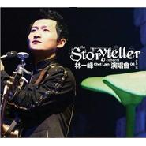

The Storyteller Live 08
============================

|  |  |
| :--: | :-- |
| [ The Storyteller Live 08](https://emumo.xiami.com/album/297283) | **艺人**: [林一峰](../index.md) **语种**: 粤语 **唱片公司**: LYFE **发行时间**: 2008年04月25日 **专辑类别**: 现场专辑 **专辑风格**: 粤语流行 Cantopop **播放数**: 159122 **收藏数**: 104 **评论数**: 8  |

## 简介

## 曲目

- [雪糕车(live)MV](./297283/er98A2eead.md)
- [涂城记(live)MV](./297283/er98B30103.md)
- [刚点起烟车就来(live)MV](./297283/eX7aW3aed6.md)
- [SMSNICQ(live)MV](./297283/b9JJvd9665.md)
- [给传媒(live)](./297283/TMrc5ffd5.md)
- [活下来(live)](./297283/gt1VD47ad6.md)
- [我的故事(live)原唱：陈百强](./297283/eX7ba38e92.md)
- [我和W先生(live)](./297283/TMrf5fd65.md)
- [时间河(live)MV](./297283/er98I33f71.md)
- [2003生命开始(live)](./297283/TMrh8bc1e.md)
- [微凉(live)MV](./297283/TMri5a884.md)
- [没有明天的日子(live)](./297283/TMrj94e08.md)
- [那夜我们在听依然(live)MV](./297283/b9JJ4bd6b8.md)
- [咖啡／伴侣(live)](./297283/b9JJ5149d0.md)
- [与你共枕(live)MV](./297283/b9JJ6dd4ce.md)
- [女扮男生(live)MV原唱：at17](./297283/TMrn5eaef.md)
- [突然独身(live)MV](./297283/TMrod79b2.md)
- [今天应该更高兴(live)MV](./297283/cpHlTee508.md)
- [得到，得不到(live)](./297283/b9JJA9de21.md)
- [随想曲(live)](./297283/er98T333b7.md)
- [大城市，小家庭(live)](./297283/cpHlWe813d.md)
- [青草地，溪水旁(live)](./297283/cpHlXfd7d8.md)
- [鲜花(live)](./297283/cpHlY1e0d1.md)
- [重回布拉格(live)MV](./297283/TMrv59087.md)
- [离开是为了回来(live)MV](./297283/b9JJGbd391.md)
- [第一口酒(live)](./297283/cpHmbff465.md)
- [未完舞曲(live)](./297283/cpHmcf048e.md)
- [一支烟的时间(live)MV](./297283/TMrz5e719.md)
- [专心致志(live)](./297283/fD43G62936.md)
- [爱情有什么道理(live)原唱：张艾嘉](./297283/er99d3192d.md)
- [爱的代价(live)原唱：张艾嘉](./297283/cpHmg1ae51.md)
- [19(live)](./297283/dBCgL265dc.md)
- [《象鼻尾猫》的传说(live)](./297283/b9JJOca311.md)
- [象鼻尾猫(live)](./297283/TMr554b49.md)
- [电子森林(live)](./297283/b9JJQd2b9b.md)
- [The Best is(live) Yet to Come](./297283/er99j2ded8.md)
- [巨人的故事(live)](./297283/b9JJSd5c8d.md)
- [一峰一人一结他(live)](./297283/fD43P40d5f.md)
- [追忆(live)原唱：林子祥](./297283/TMrB780b2.md)
- [遇见(live)MV原唱：孙燕姿](./297283/TMrC7163a.md)

## 评论

|  |  |  |
| :-- | :-- | :-- |
|  [虾米用户](https://emumo.xiami.com/u/13790931)   2015-06-22 21:19 赞(0) 踩(0) | 
这场好多歌
 |
| ⇒ |  [虾米用户](https://emumo.xiami.com/u/51800191)  2015-10-25 21:05 赞(0) 踩(0) | 
是的
 |
| ⇒ |  [虾米用户](https://emumo.xiami.com/u/51800191)  2017-06-09 17:51 赞(0) 踩(0) | 
少一首红河村？
 |
|  [虾米用户](https://emumo.xiami.com/u/1379209) Simple is Be... 2011-03-07 13:55 赞(0) 踩(0) | 
By my side~
 |
|  [虾米用户](https://emumo.xiami.com/u/99651)  2009-03-31 16:23 赞(0) 踩(0) | 
hiahiahiahia
 |
| ⇒ |  [虾米用户](https://emumo.xiami.com/u/1161359)  2010-08-07 21:46 赞(0) 踩(0) | 
你激动个啥
 |
|  [虾米用户](https://emumo.xiami.com/u/99006)  2009-03-31 15:12 赞(0) 踩(0) | 
一峰！
 |
| ⇒ |  [虾米用户](https://emumo.xiami.com/u/51800191)  2015-12-09 00:54 赞(0) 踩(0) | 
你好
 |
