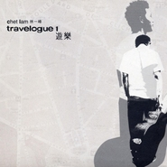

Travelogue1 游乐
============================

|  |  |
| :--: | :-- |
| [ Travelogue1 游乐](https://emumo.xiami.com/album/32292) | **艺人**: [林一峰](../index.md) **语种**: 粤语 **唱片公司**: LYFE **发行时间**: 2003年07月04日 **专辑类别**: 录音室专辑 **专辑风格**: 粤语流行 Cantopop, 华语唱作人 Chinese Singer-Songwriter **播放数**: 143624 **收藏数**: 241 **评论数**: 16  |

## 简介

继《床头歌》之后，林一峰今年的的第二张个人专辑，《Travelogue 2》也将在随后发行。也许这样的创作速度还是快了点，还好时间和音乐品质并没有什么本质的关系。民谣化的手法，概念性的唱片。将旅途中的心情点滴都串联起来，甚至每一首曲目的顺序都显得\"别有用心\"。   
  
林一峰在编排上力求简洁朴素，长笛、钢琴、吉他，少量的弦乐铺排，几乎没有任何节奏的东西加入，这种传统的东方式的音乐构架和他在词作上的典雅清丽颇为贴合。   
  
唱片中间的三段sample的类似应用我们在林忆莲早先的专辑《2001》莲中其实也可以找到，不过林一峰将它们做了混音处理，显得更为个性化。Janis lan大约是影响林一峰最大的人，为了表达对这位与Joan baez同时代的民谣歌手的敬意，翻唱了她的两首作品《the other side of the sun》和《paris in your eyes》，前者早先曾经由林子祥翻唱成中文版的《你在何方》，林一峰这次的改编在感染力上也是不逊于前，美妙的女声和音换成了一把孤独安静的嗓子，依旧直击心扉。   
  
林忆莲的《微凉》几乎是一个唱到极致的作品了，我从没有想过它还有翻唱的可能性，纯粹的模仿没有任何价值，林一峰的这个版本透出了那种古典的纤秾之美，还有一个文弱男子的伤怀心绪，另辟奚径才是翻唱歌曲存在的意义！   
  
古城、机场、车站、大街、vancuver、paris、布拉格，这张唱片其实就是一个音乐游记，记录的未必就是沿途的风光，更多地是以回忆的方式和我们一道陷落在往事之中，带着一种坦诚的不被掩盖的悲伧。   
  
 

## 曲目

- [离开是为了回来MVLeaving Is For Coming Back](./32292/fMO195ce0.md)
- [Buffering 1-Airport](./32292/fMO2baa8e.md)
- [The Other Side Of The Sun](./32292/olg7f2304.md)
- [应该拍下照片MVShould Have Taken A Picture](./32292/jYX611ae5.md)
- [离开古城Leaving Prague](./32292/fMO58689a.md)
- [未完舞曲Never-Ending Sonata](./32292/olgAe44bf.md)
- [Buffering 2-Train Station](./32292/olgBfc359.md)
- [Vancourve Skyline](./32292/fMO8c359d.md)
- [Paris In Your Eyes](./32292/fMO958ff7.md)
- [微凉MVA Glimpse Of Autumn Breeze](./32292/olgE16ce4.md)
- [Buffering 3-Streets](./32292/fMOB7b76f.md)
- [重回布拉格MVBack To Prague](./32292/jYXEd10a7.md)
- [Could We Ever Meet](./32292/jYXFc0efd.md)

## 评论

|  |  |  |
| :-- | :-- | :-- |
|  [虾米用户](https://emumo.xiami.com/u/10936044)  2019-06-16 13:52 赞(0) 踩(0) | 
这张唱片的歌太好听了，一峰太有才了！
 |
|  [虾米用户](https://emumo.xiami.com/u/4185675)  2015-12-03 11:22 赞(1) 踩(0) | 
还年这个时候的chet，用最简单的音符书写最传奇的故事
 |
|  [虾米用户](https://emumo.xiami.com/u/109377)  2015-07-22 22:30 赞(2) 踩(0) | 
清早起来听到这张专都快落下泪来
 |
| ⇒ |  [虾米用户](https://emumo.xiami.com/u/51800191)  2015-08-02 20:16 赞(0) 踩(0) | 
您好可以交流吗
 |
| ⇒ |  [虾米用户](https://emumo.xiami.com/u/51800191)  2016-08-10 10:05 赞(0) 踩(0) | 
是的
 |
|  [虾米用户](https://emumo.xiami.com/u/1259385)  2014-05-25 00:18 赞(1) 踩(0) | 
游记。
 |
|  [虾米用户](https://emumo.xiami.com/u/8240839) ~~ 2014-05-08 22:34 赞(1) 踩(0) | 
再重听一次，发觉未完舞曲好抓耳，再是应该拍下照片，接着重回布拉格，然后离开是为了回来，最后是喜欢翻唱林忆莲的微凉～
 |
|  [虾米用户](https://emumo.xiami.com/u/1412471) 喜欢的人结婚之后听着情歌... 2013-02-10 22:20 赞(1) 踩(0) | 
喜欢这个概念 离开时为了回
 |
|  [虾米用户](https://emumo.xiami.com/u/5799746)  2013-01-31 00:59 赞(1) 踩(0) | 
let\'s travel
 |
|  [虾米用户](https://emumo.xiami.com/u/11862036)  2012-12-25 20:31 赞(1) 踩(0) | 
温暖~
 |
|  [虾米用户](https://emumo.xiami.com/u/394431)   2012-01-30 14:12 赞(1) 踩(0) | 
听得极伤神极苦逼的一张......
 |
| ⇒ |  [虾米用户](https://emumo.xiami.com/u/51800191)  2015-08-27 20:39 赞(0) 踩(0) | 
你好
 |
|  [虾米用户](https://emumo.xiami.com/u/262632)  2011-07-29 17:29 赞(2) 踩(0) | 
离开是为了回来...
 |
|  [虾米用户](https://emumo.xiami.com/u/3838805)  2011-05-12 01:56 赞(2) 踩(0) | 
因为是林一峰
 |
|  [虾米用户](https://emumo.xiami.com/u/3318531)  2011-03-23 18:20 赞(1) 踩(0) | 
林一峰❷
 |
|  [虾米用户](https://emumo.xiami.com/u/1379209) Simple is Be... 2011-03-07 13:43 赞(1) 踩(0) | 
By my side~
 |
