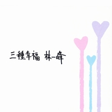

三种幸福
============================

|  |  |
| :--: | :-- |
| [ 三种幸福](https://emumo.xiami.com/album/33085) | **艺人**: [林一峰](../index.md) **语种**: 国语 **唱片公司**: LYFE **发行时间**: 2007年12月07日 **专辑类别**: EP, 单曲 **专辑风格**:  **播放数**: 196277 **收藏数**: 647 **评论数**: 571  |

## 简介

三种幸福  
  
＜起点＞＜馒头＞＜回家路上＞  
  
这是一个有关怎样看待幸福的案子。  
  
＜起点＞  
  
＜起点＞里其中一段是这样的：  
路很遥远，躲不过雨天；  
当雨水打在我们的脸上，快乐不快乐却由我们来选。  
  
这大概就是＜三种幸福＞的中心思想。  
  
＜馒头＞  
  
＜馒头＞的创作动机是：找一个中国人的共同幸福标签。小时候看武侠片，古人宽宽的衣袖里，永远藏著无尽法宝：银两，钞票，掛画（！），圣旨（！！），甚至是馒头（！！！），而那个馒头往往是雪中送炭式的温暖，或是让剧中人放心上路的旁身之物，好像发生甚么都不要紧，有馒头就能暖在心头。  
  
换一个角度说，这也可以是一首带点赖皮的情歌。是原始真诚当然好，若是持穷故弄玄虚，有一个人这样为你尽耍小聪明，也应该高兴了。  
  
＜回家路上＞  
  
＜樱花诀＞的原装版，＜回家路上＞是两个人萍水相逢的缘份。  
过客是幸福的，因为不曾拥有，所以不会有失去的不知所措；  
对於幸福，我只是一个过客；  
我，是一个寻找幸福的过客；  
我是一个幸福的过客；  
回家路上，竟然有两个幸福的过客；  
那就够了。  
  
＜起点＞  
  
那个秋天，我飞到了甦格兰当证婚人，＜起点＞就是我送给两个新郎的礼物。婚礼其实不难，两个人能走在一起才是最难得的事。  
  
从瑞士过境，几个朋友，一所简单精致的小礼堂，窗外有一座红色铁桥，说了半年的事，半小时就完成了，跟著就是两个人一起的下半生，那么简单踏实，却那么匪夷所思。我一早已经清楚明白，教科书里的模范家庭只是其中一种幸福，婚礼也只是一个型式，没有绝对快乐的保证，长期面对每日的锁碎事也不会很浪漫，亲身经历见证一个婚礼还是令人挺激动的；因为，这一点点现实里的快乐证据，让我们还会相信，一切是有可能的。  
  
仅以＜起点＞送给世上敢於牵手上路的所有恋人。  
  
圣诞快乐！祝你过一个幸福的冬季！ 

## 曲目

- [馒头](./33085/opmNf0336.md)
- [回家路上](./33085/9nVY41671.md)
- [起点](./33085/fQULa1d10.md)

## 评论

|  |  |  |
| :-- | :-- | :-- |
|  [虾米用户](https://emumo.xiami.com/u/1628253)  2017-10-30 10:16 赞(0) 踩(0) | 
医院里没有我的家人、监狱里没有我的亲朋、家里有我的爱人。
 |
|  [虾米用户](https://emumo.xiami.com/u/1584343)  2017-10-30 10:16 赞(0) 踩(0) | 
自由 爱 惊喜
 |
|  [虾米用户](https://emumo.xiami.com/u/959358)  2017-10-30 10:14 赞(0) 踩(0) | 
我觉得幸福就是吃饱等饿~~~哈哈哈 什么都不想做个乖乖的小女人，有家、有可爱的宝宝、有一位什么都替我操心的老公。 呵呵~~~
 |
|  [虾米用户](https://emumo.xiami.com/u/830670)  2017-10-30 10:08 赞(0) 踩(0) | 
喜欢   最近翻来覆去听
 |
|  [虾米用户](https://emumo.xiami.com/u/1066235)  2017-10-28 00:34 赞(0) 踩(0) | 
菩提爱子善(西安)2010-06-18 20:24 回复 放下贪念，不再有压力，是幸福一； 放下恩怨，不再有嗔怒，是幸福二； 放下执着，不再有烦恼，是幸福三！ 说的好----
 |
|  [虾米用户](https://emumo.xiami.com/u/1738992)  2017-10-28 00:33 赞(0) 踩(0) | 
幸福是一种感觉 这种感觉有好多 比如 看到妈妈的欣慰 是最大的幸福 现在的幸福感很少 其他方面的幸福。。。只剩下回忆。。。哪天在我生活里注入了新生命。。。我就知道幸福的其他了吧
 |
|  [虾米用户](https://emumo.xiami.com/u/1664496)  2017-10-28 00:20 赞(0) 踩(0) | 
边吃边喝侃大山 大便时候叼支烟 早晨起床有早餐
 |
|  [虾米用户](https://emumo.xiami.com/u/1939211)  2017-07-13 15:12 赞(0) 踩(0) | 
自由、爱情和温饱。这是人生最起码的需求标准。否则无任何幸福可言。
 |
|  [虾米用户](https://emumo.xiami.com/u/5443127) COMING SOON 2015-05-04 17:58 赞(0) 踩(0) | 
请给我一个机会
 |
|  [虾米用户](https://emumo.xiami.com/u/1971011) 愿后会有期微信XXL-S... 2014-07-11 20:20 赞(0) 踩(0) | 
自由，财富，性福
 |
|  [虾米用户](https://emumo.xiami.com/u/5038224) 遥知不是雪，为有暗香来。 2013-11-24 21:31 赞(0) 踩(0) | 
有钱 有权 没烦恼结善缘
 |
|  [虾米用户](https://emumo.xiami.com/u/332829)  2013-10-18 22:23 赞(0) 踩(0) | 
结婚~
 |
|  [虾米用户](https://emumo.xiami.com/u/13149576) 我还没想好要写什么... 2013-10-06 21:28 赞(0) 踩(0) | 
画画 音乐 抽烟
 |
| ⇒ |  [虾米用户](https://emumo.xiami.com/u/51800191)  2015-12-15 02:28 赞(0) 踩(0) | 
你好
 |
|  [虾米用户](https://emumo.xiami.com/u/11903154)  2013-09-09 20:53 赞(2) 踩(0) | 
有我爱的人。有爱我的人。我们都住在一所大房子里面，还有一只大狗狗。。。。。
 |
|  [虾米用户](https://emumo.xiami.com/u/5443127) COMING SOON 2013-07-16 22:05 赞(1) 踩(0) | 
这张最妙了，听到想挠痒痒。
 |
|  [虾米用户](https://emumo.xiami.com/u/4268650) 我还没想好要写什么... 2013-07-07 21:49 赞(1) 踩(0) | 
缘分注定的两人能相遇、相爱、携手终老！我会一直期待着那一天的到来
 |
|  [虾米用户](https://emumo.xiami.com/u/10912877) 下手快了点 2013-06-30 21:12 赞(0) 踩(0) | 
欲望，和实现欲望的能力与意志
 |
|  [虾米用户](https://emumo.xiami.com/u/1927194)  2013-06-02 20:04 赞(0) 踩(0) | 
随心，随性，随缘
 |
|  [虾米用户](https://emumo.xiami.com/u/3574320)  2013-05-21 20:45 赞(0) 踩(0) | 
信仰   自我实现    传承
 |
|  [虾米用户](https://emumo.xiami.com/u/3217248) 我还没想好要写什么... 2013-05-11 21:54 赞(1) 踩(0) | 
吃得香，睡得着，拉得快------齐了
 |
|  [虾米用户](https://emumo.xiami.com/u/11979668)  2013-04-04 20:17 赞(0) 踩(0) | 
躲不过雨天 当雨水打在我们脸上 快乐不快乐由我们来选
 |
|  [虾米用户](https://emumo.xiami.com/u/11047042) 夏子 2013-04-01 20:27 赞(0) 踩(0) | 
吃的饱，睡得好，还能自由就是了
 |
| ⇒ |  [虾米用户](https://emumo.xiami.com/u/51800191)  2016-03-09 01:30 赞(0) 踩(0) | 
哦里你好
 |
|  [虾米用户](https://emumo.xiami.com/u/8586781) 看，太阳！ 2013-02-25 20:51 赞(0) 踩(0) | 
三种幸福：馒头、回家路上和起点，很特别的说法，我很喜欢。
 |
|  [虾米用户](https://emumo.xiami.com/u/10396361)  2013-02-07 20:11 赞(0) 踩(0) | 
哇  太好听了
 |
|  [虾米用户](https://emumo.xiami.com/u/12041349)  2013-02-02 21:30 赞(0) 踩(0) | 
好踏实 好透净
 |
|  [虾米用户](https://emumo.xiami.com/u/5094955)  2013-01-20 20:20 赞(0) 踩(0) | 
三种：找到我爱的人、我爱的人也爱我、执子之手与子偕老
 |
|  [虾米用户](https://emumo.xiami.com/u/126267)   2013-01-15 21:32 赞(0) 踩(0) | 
时刻发现生活如此美好
 |
|  [虾米用户](https://emumo.xiami.com/u/11021465)  2012-12-23 21:26 赞(0) 踩(0) | 
明天是个起点，因为要回家了，从 东北这个大学食堂里米饭最多的地方回到我的故乡，我们常吃面食，今天看到这张专集不能不说，十分有缘。
 |
|  [虾米用户](https://emumo.xiami.com/u/10622702)  2012-12-20 21:19 赞(0) 踩(0) | 
社会祥泰、家庭和睦、有一个最挚爱的人伴我一生
 |
|  [虾米用户](https://emumo.xiami.com/u/10949611)  2012-12-18 21:28 赞(0) 踩(0) | 
有人说人生的幸福有三种，对你来说是哪三种呢。
 |
|  [虾米用户](https://emumo.xiami.com/u/11248162) 音乐无界 2012-11-22 21:16 赞(0) 踩(0) | 
幸福是什么呢？？？
 |
|  [虾米用户](https://emumo.xiami.com/u/9962538)  2012-10-25 20:58 赞(0) 踩(0) | 
三种幸福
 |
|  [虾米用户](https://emumo.xiami.com/u/8075033) C'est la vie... 2012-10-03 21:13 赞(1) 踩(0) | 
得到，享受，失去
 |
| ⇒ |  [虾米用户](https://emumo.xiami.com/u/5708674) rockkfck 2012-10-27 20:07 赞(0) 踩(0) | 
高见解，我喜欢
 |
|  [虾米用户](https://emumo.xiami.com/u/9878068)  2012-07-19 21:55 赞(0) 踩(0) | 
lj
 |
|  [虾米用户](https://emumo.xiami.com/u/728707)  2012-07-17 20:28 赞(8) 踩(0) | 
在夜色中 我有三次受难：流浪、爱情、生存 我有三种幸福：诗歌、王位、太阳
 |
|  [虾米用户](https://emumo.xiami.com/u/9764575) 抱抱，化开你的结(˶‾᷄... 2012-07-15 21:53 赞(0) 踩(0) | 
父母安好，自己快乐，幸福的爱情
 |
|  [虾米用户](https://emumo.xiami.com/u/9154422)  2012-06-24 21:23 赞(0) 踩(0) | 
平安 能吃 能放 最幸福
 |
|  [虾米用户](https://emumo.xiami.com/u/5520861)  2012-06-14 21:00 赞(0) 踩(0) | 
回家的路上 最大的幸福
 |
|  [虾米用户](https://emumo.xiami.com/u/7100721)   2012-06-04 22:00 赞(0) 踩(0) | 
昨天幸福,今天幸福,明天幸福
 |
| ⇒ |  [虾米用户](https://emumo.xiami.com/u/51800191)  2015-12-15 02:28 赞(0) 踩(0) | 
永远幸福
 |
|  [虾米用户](https://emumo.xiami.com/u/9278942)  2012-05-28 20:54 赞(0) 踩(0) | 
微笑始终如1秒笑妙乐
 |
|  [虾米用户](https://emumo.xiami.com/u/1965086) 上苍给了我们一具不堪的肉... 2012-04-07 21:27 赞(0) 踩(0) | 
馒头，回家路上，起点。林一峰，民谣。
 |
|  [虾米用户](https://emumo.xiami.com/u/8074012) 暂无签名~ 2012-04-04 20:28 赞(0) 踩(0) | 
等一会听听看吧
 |
|  [虾米用户](https://emumo.xiami.com/u/6378332) 呵呵呵真蠢 2012-03-21 21:49 赞(0) 踩(0) | 
好治愈 治愈极了
 |
|  [虾米用户](https://emumo.xiami.com/u/603783)  2012-03-13 21:34 赞(0) 踩(0) | 
还记得高中的时候和宋圈听起点…怀念…
 |
|  [虾米用户](https://emumo.xiami.com/u/6274844)  2012-03-12 10:46 赞(0) 踩(0) | 
很温馨，很温暖
 |
|  [虾米用户](https://emumo.xiami.com/u/313442)  2012-03-08 22:01 赞(0) 踩(0) | 
我不知道我的幸福在哪里，每天过的都很惶恐，不安，恐惧，性情泯灭到绝顶！
 |
|  [虾米用户](https://emumo.xiami.com/u/153258)  2012-02-19 22:08 赞(0) 踩(0) | 
三种幸福  三个名字不错
 |
| ⇒ |  [虾米用户](https://emumo.xiami.com/u/8149597)  2012-02-23 22:41 赞(0) 踩(0) | 
同意同意。
 |
|  [虾米用户](https://emumo.xiami.com/u/4281965)  2012-02-19 21:45 赞(0) 踩(0) | 
三种幸福~
 |
|  [虾米用户](https://emumo.xiami.com/u/8100351)  2012-02-18 22:27 赞(0) 踩(0) | 
喜欢
 |
|  [虾米用户](https://emumo.xiami.com/u/2830865)  2012-02-15 21:09 赞(0) 踩(0) | 
我很想知道什么是幸福。好久，人生30年，好像一直不知道什么是幸福
 |
|  [虾米用户](https://emumo.xiami.com/u/2866218)  2012-02-08 20:44 赞(0) 踩(0) | 
知足最幸福！
 |
|  [虾米用户](https://emumo.xiami.com/u/6975371)  2012-02-02 21:13 赞(0) 踩(0) | 
吃得飽,睡得好,身體健康也是幸福
 |
|  [虾米用户](https://emumo.xiami.com/u/2909960)  2012-01-30 21:18 赞(0) 踩(0) | 
有吃的有住的还能从新来过。。。
 |
|  [虾米用户](https://emumo.xiami.com/u/6394028) ♫ / 灵之境 梦之沙 2012-01-27 21:58 赞(0) 踩(0) | 
为自己活 为家人活 为大家活
 |
|  [虾米用户](https://emumo.xiami.com/u/6394028) ♫ / 灵之境 梦之沙 2012-01-27 21:52 赞(0) 踩(0) | 
健康 爱 被爱
 |
| ⇒ |  [虾米用户](https://emumo.xiami.com/u/51800191)  2015-12-15 02:28 赞(0) 踩(0) | 
你好朋友
 |
|  [虾米用户](https://emumo.xiami.com/u/1299617)  2012-01-26 21:16 赞(0) 踩(0) | 
:-)
 |
|  [虾米用户](https://emumo.xiami.com/u/4018804)  2012-01-25 21:55 赞(0) 踩(0) | 
有人爱，有事做，有所期待……
 |
|  [虾米用户](https://emumo.xiami.com/u/6929294)  2012-01-21 21:16 赞(0) 踩(0) | 
膀胱肿胀时有公厕，通宵复习时有样题，放假回家时有余票
 |
|  [虾米用户](https://emumo.xiami.com/u/7735011)  2012-01-19 21:46 赞(0) 踩(0) | 
祝大家都幸福啦~
 |
|  [虾米用户](https://emumo.xiami.com/u/7275704)  2012-01-12 11:06 赞(0) 踩(0) | 
好玩
 |
|  [虾米用户](https://emumo.xiami.com/u/7033826)  2012-01-10 21:59 赞(0) 踩(0) | 
很有趣的歌
 |
|  [虾米用户](https://emumo.xiami.com/u/7075763)  2012-01-02 21:56 赞(0) 踩(0) | 
Love all,Trust a few,Do wrong to none.
 |
|  [虾米用户](https://emumo.xiami.com/u/7201897)  2012-01-02 21:31 赞(0) 踩(0) | 
做自己想做的事、爱自己所爱之人、死前没有遗憾
 |
|  [虾米用户](https://emumo.xiami.com/u/1700554) 用心良苦 2011-12-29 20:51 赞(0) 踩(0) | 
表示馒头正合我意
 |
|  [虾米用户](https://emumo.xiami.com/u/7381961)  2011-12-24 21:57 赞(0) 踩(0) | 
知足常乐
 |
|  [虾米用户](https://emumo.xiami.com/u/6960522)  2011-12-22 20:29 赞(0) 踩(0) | 
还不错
 |
|  [虾米用户](https://emumo.xiami.com/u/6960522)  2011-12-22 20:28 赞(0) 踩(0) | 
你满足了....你就幸福了....
 |
|  [虾米用户](https://emumo.xiami.com/u/1709729) 再见 虾米 2011-12-20 22:40 赞(0) 踩(0) | 
吃饭 睡觉 打豆豆
 |
|  [虾米用户](https://emumo.xiami.com/u/3190933) 你老味.... 2011-12-19 20:01 赞(0) 踩(0) | 
活着就是一种幸福
 |
|  [虾米用户](https://emumo.xiami.com/u/6949871) 万花丛中过片叶不沾身 2011-12-16 09:02 赞(0) 踩(0) | 
活着
 |
|  [虾米用户](https://emumo.xiami.com/u/549182)  2011-12-14 22:08 赞(0) 踩(0) | 
瞬间我就想到了普通青年的幸福，文艺青年的幸福，二B青年的幸福。。。
 |
|  [虾米用户](https://emumo.xiami.com/u/3913515)  2011-12-14 20:02 赞(0) 踩(0) | 
吃到吐，睡到醒，还有。。。。。。
 |
|  [虾米用户](https://emumo.xiami.com/u/299438)  2011-12-10 21:57 赞(0) 踩(0) | 
好幸福的声音
 |
|  [虾米用户](https://emumo.xiami.com/u/4812144) 只有音乐才是我的解药 2011-12-08 21:34 赞(0) 踩(0) | 
ca~~~~无言以对
 |
|  [虾米用户](https://emumo.xiami.com/u/7113664)  2011-12-05 20:50 赞(0) 踩(0) | 
意义
 |
|  [虾米用户](https://emumo.xiami.com/u/7067981)  2011-12-02 20:56 赞(0) 踩(0) | 
喜欢 幸福 的感觉！
 |
|  [虾米用户](https://emumo.xiami.com/u/6926834)  2011-11-23 20:17 赞(0) 踩(0) | 
这个网站真的不错
 |
|  [虾米用户](https://emumo.xiami.com/u/6699801)  2011-11-22 21:41 赞(0) 踩(0) | 
迷茫时导引的明灯，失意时温柔的抚慰，得意时微笑的赞许
 |
|  [虾米用户](https://emumo.xiami.com/u/6876392)  2011-11-20 21:31 赞(0) 踩(0) | 
好网站.以后要长期陪伴我了.
 |
|  [虾米用户](https://emumo.xiami.com/u/4313386) I am ahso. 2011-11-16 22:32 赞(0) 踩(0) | 
挺有意思的。
 |
|  [虾米用户](https://emumo.xiami.com/u/3114567) 夜夜除非，好梦留人睡 2011-11-15 21:25 赞(0) 踩(0) | 
吃好 睡好 大家都好！
 |
|  [虾米用户](https://emumo.xiami.com/u/3578233) 时光因浪费而明亮 2011-11-13 21:26 赞(0) 踩(0) | 
三种幸福，我希望是早上幸福，中午幸福，晚上幸福
 |
|  [虾米用户](https://emumo.xiami.com/u/6748937)  2011-11-12 22:14 赞(0) 踩(0) | 
很有意思的歌詞和挺好聽的^_^
 |
|  [虾米用户](https://emumo.xiami.com/u/813405)   2011-11-08 21:40 赞(0) 踩(0) | 
eat pray love
 |
|  [虾米用户](https://emumo.xiami.com/u/4999454)  2011-11-08 20:58 赞(0) 踩(0) | 
全家人身体健康，和他能幸福的在一起奋斗。有许多朋友在一起的快乐
 |
|  [虾米用户](https://emumo.xiami.com/u/6213101)  2011-11-07 21:27 赞(0) 踩(0) | 
没人烦
 |
|  [虾米用户](https://emumo.xiami.com/u/6654581)  2011-11-06 21:39 赞(0) 踩(0) | 
面包 爱 被爱
 |
|  [虾米用户](https://emumo.xiami.com/u/4405810)  2011-11-06 21:16 赞(0) 踩(0) | 
爱  性   快乐
 |
|  [虾米用户](https://emumo.xiami.com/u/5823941)  2011-11-06 20:57 赞(0) 踩(0) | 
爱 被爱 拥有爱的能力
 |
|  [虾米用户](https://emumo.xiami.com/u/6030214)  2011-11-05 22:45 赞(0) 踩(0) | 
睡觉，运动，生活
 |
|  [虾米用户](https://emumo.xiami.com/u/6594208)  2011-11-03 21:38 赞(0) 踩(0) | 
家人 音乐 朋友
 |
|  [虾米用户](https://emumo.xiami.com/u/6573927)  2011-11-02 20:00 赞(0) 踩(0) | 
三种简单的幸福。有饭吃，有人关心，有关心的人。
 |
|  [虾米用户](https://emumo.xiami.com/u/3407905) 我还没想好要写什么... 2011-10-30 21:35 赞(0) 踩(0) | 
和你爱的人在一起、快乐、健康——我觉得这就是三种幸：&amp;gt;
 |
|  [虾米用户](https://emumo.xiami.com/u/951944) 旺旺 2011-10-30 21:11 赞(0) 踩(0) | 
三种幸福：吃饱，穿暖，有人爱
 |
|  [虾米用户](https://emumo.xiami.com/u/647248)   2011-10-29 19:41 赞(0) 踩(0) | 
小快乐~~
 |
|  [虾米用户](https://emumo.xiami.com/u/2358563)  2011-10-27 21:36 赞(0) 踩(0) | 
出生   结婚  死亡
 |
|  [虾米用户](https://emumo.xiami.com/u/6195942) 你一天天长大，我一天天变... 2011-10-26 21:24 赞(0) 踩(0) | 
原来人生有三种幸福，有人一起上路是一种幸福，路途中有一个馒头的幸福，还有回家的幸福。爱好长好辛苦，常常使人处在那崩溃的边缘。愿所以人一路走好，一路幸福
 |
|  [虾米用户](https://emumo.xiami.com/u/6195942) 你一天天长大，我一天天变... 2011-10-26 21:23 赞(0) 踩(0) | 
或许我希望找到幸福
 |
|  [虾米用户](https://emumo.xiami.com/u/4420782)  2011-10-22 03:34 赞(0) 踩(0) | 
很想知道三种幸福是什么
 |
|  [虾米用户](https://emumo.xiami.com/u/50136)  2011-10-18 21:17 赞(0) 踩(0) | 
开心
 |
|  [虾米用户](https://emumo.xiami.com/u/1335004)  2011-10-16 00:12 赞(0) 踩(0) | 
呵呵
 |
|  [虾米用户](https://emumo.xiami.com/u/6244032)  2011-10-15 12:15 赞(0) 踩(0) | 
看了封面, 還以為是林峰, 哈哈
 |
|  [虾米用户](https://emumo.xiami.com/u/6224896) 歌是情，情是歌 2011-10-13 21:47 赞(0) 踩(0) | 
挺不错的，嘎嘎
 |
| ⇒ |  [虾米用户](https://emumo.xiami.com/u/4029255)  2011-11-01 21:42 赞(0) 踩(0) | 
晕，看到你了。。。
 |
|  [虾米用户](https://emumo.xiami.com/u/5805774)  2011-09-26 21:51 赞(0) 踩(0) | 
不错！！
 |
|  [虾米用户](https://emumo.xiami.com/u/1933028) justin 2011-09-22 22:09 赞(0) 踩(0) | 
歌都挺短的
 |
|  [虾米用户](https://emumo.xiami.com/u/5904746)  2011-09-20 21:48 赞(0) 踩(0) | 
三种幸福：  《活着》 《好死不如赖活着》  《有尊严滴活着》
 |
|  [虾米用户](https://emumo.xiami.com/u/5869193)  2011-09-19 22:36 赞(0) 踩(0) | 
馒头，和我一个名
 |
|  [虾米用户](https://emumo.xiami.com/u/1535613)  2011-09-18 21:39 赞(0) 踩(0) | 
干净、亲切的歌声。
 |
|  [虾米用户](https://emumo.xiami.com/u/3618597)  2011-09-14 22:00 赞(0) 踩(0) | 
知足的同时 我时刻发现生活如此美好
 |
|  [虾米用户](https://emumo.xiami.com/u/5789390)  2011-09-11 21:02 赞(0) 踩(0) | 
亲情、友情、爱情。
 |
|  [虾米用户](https://emumo.xiami.com/u/3496718) idle space 2011-09-10 23:02 赞(0) 踩(0) | 
幸福的感觉很简单
 |
|  [虾米用户](https://emumo.xiami.com/u/3840234) 依旧不懂爱也不懂情，写歌... 2011-09-07 21:33 赞(0) 踩(0) | 
咩咩~~
 |
|  [虾米用户](https://emumo.xiami.com/u/1505804) 平安喜乐 2011-09-06 21:56 赞(0) 踩(0) | 
小孩子肯定也很爱听
 |
|  [虾米用户](https://emumo.xiami.com/u/1614704) 留签名的人都很无聊 2011-09-03 21:53 赞(0) 踩(0) | 
和大家一起开心，和心爱的人一起开心，真诚的赞美
 |
|  [虾米用户](https://emumo.xiami.com/u/5587542)  2011-09-03 21:08 赞(0) 踩(0) | 
0.0
 |
|  [虾米用户](https://emumo.xiami.com/u/5564420)  2011-08-29 20:09 赞(0) 踩(0) | 
和心爱的人一起旅游！
 |
|  [虾米用户](https://emumo.xiami.com/u/5212025)  2011-08-25 21:30 赞(0) 踩(0) | 
吃美食，看好书，有人爱。
 |
|  [虾米用户](https://emumo.xiami.com/u/4860031) 悠哉悠哉 怡然自得 2011-08-24 21:40 赞(0) 踩(0) | 
起点
 |
|  [虾米用户](https://emumo.xiami.com/u/5559997)  2011-08-24 21:28 赞(0) 踩(0) | 
矮矮的屋檐，父母和孩子在温暖的夕阳当中等待着我们回家吃晚餐~~
 |
|  [虾米用户](https://emumo.xiami.com/u/4904118) 我不想当英雄，但。 2011-08-24 03:37 赞(0) 踩(0) | 
我会选着性福和幸福、
 |
|  [虾米用户](https://emumo.xiami.com/u/4157535)  2011-08-22 20:28 赞(0) 踩(0) | 
有自己想要的生活 有爱的人  有坚定的信念
 |
|  [虾米用户](https://emumo.xiami.com/u/5505942)  2011-08-20 22:56 赞(0) 踩(0) | 
有吃有睡有玩吧
 |
|  [虾米用户](https://emumo.xiami.com/u/4210944)  2011-08-19 22:06 赞(0) 踩(0) | 
浓茶，萨克斯，缅桂花
 |
|  [虾米用户](https://emumo.xiami.com/u/4331552) -.- 2011-08-15 20:03 赞(0) 踩(0) | 
尿急时,,路口转角,,有厕所吧,,  幸福的事,,
 |
|  [虾米用户](https://emumo.xiami.com/u/447384)   2011-08-13 21:19 赞(0) 踩(0) | 
很有趣的三首歌～
 |
|  [虾米用户](https://emumo.xiami.com/u/3066506)  2011-08-10 09:21 赞(0) 踩(0) | 
充实，有爱，有希望。
 |
|  [虾米用户](https://emumo.xiami.com/u/5149487)  2011-08-07 22:03 赞(0) 踩(0) | 
一直觉得有爱，有健康，有物质就是幸福了。。。而且突然想起师太的《喜宝》来~~~~~
 |
|  [虾米用户](https://emumo.xiami.com/u/3799021)  2011-08-07 07:41 赞(0) 踩(0) | 
hao
 |
|  [虾米用户](https://emumo.xiami.com/u/4464748)  2011-08-05 21:34 赞(0) 踩(0) | 
爱 自由 健康吧
 |
|  [虾米用户](https://emumo.xiami.com/u/211175)  2011-08-04 21:36 赞(0) 踩(0) | 
我满足所以我幸福。
 |
|  [虾米用户](https://emumo.xiami.com/u/1566601)   2011-08-04 20:39 赞(0) 踩(0) | 
健康，有闲，有爱人
 |
|  [虾米用户](https://emumo.xiami.com/u/636510)  2011-07-30 21:33 赞(0) 踩(0) | 
有钱花，有球赛看，随时都能出去旅行
 |
|  [虾米用户](https://emumo.xiami.com/u/1015382) 爱、慈悲与理解。 2011-07-30 21:07 赞(0) 踩(0) | 
人生没有什么幸福,也没有什么悲哀.
 |
|  [虾米用户](https://emumo.xiami.com/u/354665)  2011-07-15 21:14 赞(0) 踩(0) | 
馒头啊包子还差不多牛肉面也可以
 |
|  [虾米用户](https://emumo.xiami.com/u/1493294)  2011-07-14 21:45 赞(0) 踩(0) | 
嚯 不错哦
 |
|  [虾米用户](https://emumo.xiami.com/u/2424541)  2011-07-14 20:53 赞(0) 踩(0) | 
幸福即普及又特别的词汇，什么时候都是伴着人生开始，传递给另一个人的。总是想从别人身上看到自己的幸福，总是有这样的希望。但对我个人来说，幸福就是和对味的人，一起的经历。不一定时刻都那么幸福，但是经历的多了，就算有点不满足，至少还有记忆是深刻的。 林一峰的歌虽然只是听了第二张专辑，但是三首歌，传递给听者，是有心者才能做到的。虽然有一点淡口味，也没有太多起浮激动的情绪，但是每听一次，都有共感。林一峰的歌是这样小世界舒畅的小情歌。
 |
|  [虾米用户](https://emumo.xiami.com/u/1351775) 会发光的虫子。 2011-07-13 20:57 赞(0) 踩(0) | 
简单。
 |
|  [虾米用户](https://emumo.xiami.com/u/4382410)  2011-07-11 14:52 赞(0) 踩(0) | 
哈哈，以前听的，现在来分享这张专辑，三种幸福，小小平凡真幸福~
 |
|  [虾米用户](https://emumo.xiami.com/u/2429797) 珍惜每一天  天天晒太阳 2011-07-10 20:05 赞(0) 踩(0) | 
我是馒头，搞怪小幸福
 |
|  [虾米用户](https://emumo.xiami.com/u/4264439) love is so s... 2011-07-06 22:12 赞(0) 踩(0) | 
三种幸福~
 |
|  [虾米用户](https://emumo.xiami.com/u/4264439) love is so s... 2011-07-06 22:04 赞(0) 踩(0) | 
好可爱~~
 |
|  [虾米用户](https://emumo.xiami.com/u/1239869)  2011-06-27 20:38 赞(0) 踩(0) | 
vb
 |
|  [虾米用户](https://emumo.xiami.com/u/3635966) 哥不是迷 只是传说 2011-06-23 21:51 赞(0) 踩(0) | 
时时带着平常心，处处享受真幸福。
 |
|  [虾米用户](https://emumo.xiami.com/u/3635966) 哥不是迷 只是传说 2011-06-23 21:51 赞(0) 踩(0) | 
时时带着平常心，处处享受真幸福。
 |
|  [虾米用户](https://emumo.xiami.com/u/863757)  2011-06-19 21:22 赞(0) 踩(0) | 
好看
 |
|  [虾米用户](https://emumo.xiami.com/u/3605814) 是一个废人了 2011-06-18 22:37 赞(0) 踩(0) | 
我要回家~~~~~  我好久都没吃到肉了  我不要馒头！！！  肉肉~~~~~~~~~~~~~~~
 |
|  [虾米用户](https://emumo.xiami.com/u/3635966) 哥不是迷 只是传说 2011-06-15 20:05 赞(0) 踩(0) | 
我是你的馒头，吃了进你肚子里。。。。。
 |
|  [虾米用户](https://emumo.xiami.com/u/3389530)  2011-06-14 20:53 赞(0) 踩(0) | 
清晰
 |
|  [虾米用户](https://emumo.xiami.com/u/3414156)  2011-05-29 22:11 赞(0) 踩(0) | 
啊
 |
|  [虾米用户](https://emumo.xiami.com/u/2508024)  2011-05-28 20:24 赞(0) 踩(0) | 
饿。
 |
|  [虾米用户](https://emumo.xiami.com/u/447541)  2011-05-26 23:09 赞(0) 踩(0) | 
******
 |
|  [虾米用户](https://emumo.xiami.com/u/4051301)  2011-05-24 21:06 赞(0) 踩(0) | 
我就喜欢
 |
|  [虾米用户](https://emumo.xiami.com/u/3142769)  2011-05-23 21:33 赞(0) 踩(0) | 
很舒服
 |
|  [虾米用户](https://emumo.xiami.com/u/2600073)  2011-05-22 20:36 赞(0) 踩(0) | 
hao
 |
|  [虾米用户](https://emumo.xiami.com/u/1460293)  2011-05-18 20:52 赞(0) 踩(0) | 
温暖的曲调！
 |
|  [虾米用户](https://emumo.xiami.com/u/3295904)  2011-05-15 21:29 赞(0) 踩(0) | 
很清晰，很优雅，喜欢~
 |
|  [虾米用户](https://emumo.xiami.com/u/3886503)  2011-05-15 21:14 赞(0) 踩(0) | 
温暖
 |
|  [虾米用户](https://emumo.xiami.com/u/3872064)  2011-05-09 20:02 赞(0) 踩(0) | 
馒头，歌名就很可爱
 |
|  [虾米用户](https://emumo.xiami.com/u/3843770)  2011-05-05 22:21 赞(0) 踩(0) | 
呵   幸福   好东西
 |
|  [虾米用户](https://emumo.xiami.com/u/1590427)  2011-04-29 20:54 赞(0) 踩(0) | 
很好听，喜欢他的感觉
 |
|  [虾米用户](https://emumo.xiami.com/u/3758084)  2011-04-27 21:10 赞(0) 踩(0) | 
。。。。。
 |
|  [虾米用户](https://emumo.xiami.com/u/1938401)  2011-04-25 21:11 赞(0) 踩(0) | 
听别人的歌，流自己的泪。
 |
|  [虾米用户](https://emumo.xiami.com/u/3592199)  2011-04-20 20:28 赞(0) 踩(0) | 
简单的幸福~~
 |
|  [虾米用户](https://emumo.xiami.com/u/2093281) 一个喃喃自语的怪物。 2011-04-16 21:04 赞(0) 踩(0) | 
三种幸福＜起点＞＜馒头＞＜回家路上＞，这是一个有关怎样看待幸福的案子。
 |
|  [虾米用户](https://emumo.xiami.com/u/3395113)   2011-04-15 21:44 赞(0) 踩(0) | 
人生三种幸福.事业的成功.亲密的爱人.健康的宝贝
 |
|  [虾米用户](https://emumo.xiami.com/u/2695132)  2011-04-15 21:43 赞(0) 踩(0) | 
你还在 我还在 世界还在
 |
|  [虾米用户](https://emumo.xiami.com/u/3258) 浮生如梦 2011-04-11 22:24 赞(0) 踩(0) | 
在看面向对象的时候戴着耳机听到它。
 |
|  [虾米用户](https://emumo.xiami.com/u/2260370)  2011-04-08 21:43 赞(0) 踩(0) | 
好听
 |
|  [虾米用户](https://emumo.xiami.com/u/3505170)  2011-04-08 20:42 赞(0) 踩(0) | 
温暖、朴实又好听。
 |
|  [虾米用户](https://emumo.xiami.com/u/1797735) 不忘初心 方得始终 2011-04-03 21:40 赞(0) 踩(0) | 
你还在 我还在 世界还在
 |
|  [虾米用户](https://emumo.xiami.com/u/3366858)  2011-03-31 22:18 赞(0) 踩(0) | 
有事做，有人爱，有期待
 |
|  [虾米用户](https://emumo.xiami.com/u/1809235) 克拉玛依人上克拉玛依网 2011-03-27 20:14 赞(0) 踩(0) | 
撒种不同的温暖的歌曲
 |
|  [虾米用户](https://emumo.xiami.com/u/9971)  2011-03-26 15:55 赞(0) 踩(0) | 
三种幸福~这个专辑很有意思
 |
|  [虾米用户](https://emumo.xiami.com/u/3253066)  2011-03-19 21:03 赞(0) 踩(0) | 
讚啦
 |
|  [虾米用户](https://emumo.xiami.com/u/3161054)  2011-03-12 21:10 赞(0) 踩(0) | 
走着、走着、走着。我的三种幸福
 |
| ⇒ |  [虾米用户](https://emumo.xiami.com/u/2090435)  2011-03-12 21:18 赞(0) 踩(0) | 
爱人，被爱与活着的幸福
 |
|  [虾米用户](https://emumo.xiami.com/u/1379209) Simple is Be... 2011-03-07 13:39 赞(0) 踩(0) | 
By my side~
 |
|  [虾米用户](https://emumo.xiami.com/u/3104651)  2011-03-06 22:56 赞(0) 踩(0) | 
最幸福的就在眼前~
 |
|  [虾米用户](https://emumo.xiami.com/u/699936)  2011-02-25 21:58 赞(0) 踩(0) | 
幸福就你我同样爱着对方……
 |
|  [虾米用户](https://emumo.xiami.com/u/383134)  2011-02-22 03:39 赞(0) 踩(0) | 
千山万水走过以后，我还是你的馒头。
 |
|  [虾米用户](https://emumo.xiami.com/u/2345932)  2011-02-21 06:15 赞(0) 踩(0) | 
感觉不错~~
 |
|  [虾米用户](https://emumo.xiami.com/u/401652) 暂无签名~ 2011-02-18 21:12 赞(0) 踩(0) | 
回家路上，是小小的感伤，大大的满足。
 |
|  [虾米用户](https://emumo.xiami.com/u/1851337) 很久很久以前 2011-01-30 21:52 赞(0) 踩(0) | 
“我是你的馒头，常陪伴你左右。” 但是，你想要吃带肉的夹馍。
 |
| ⇒ |  [虾米用户](https://emumo.xiami.com/u/234724)  2011-02-19 21:39 赞(0) 踩(0) | 
TA是肉，你们二合一就是肉夹馍
 |
|  [虾米用户](https://emumo.xiami.com/u/948382)  2011-01-29 21:09 赞(0) 踩(0) | 
容易满足幸福就一直跟随着你,物质?一个家?奇迹?
 |
|  [虾米用户](https://emumo.xiami.com/u/2245405) musician by ... 2011-01-23 22:03 赞(0) 踩(0) | 
A friend of mine is \&amp;quot;mantou\&amp;quot;
 |
|  [虾米用户](https://emumo.xiami.com/u/2506965) 我还没想好要写什么... 2011-01-15 22:07 赞(0) 踩(0) | 
林峰每次都给人惊喜，他就是那种不是什么大牌歌手，但是我很喜欢这种……怎么说呢，就是不要太大牌，唱得很真的感觉。
 |
|  [虾米用户](https://emumo.xiami.com/u/2442429)  2011-01-11 21:48 赞(0) 踩(0) | 
能否再解释得更细致一点，好象不太明白！
 |
|  [虾米用户](https://emumo.xiami.com/u/1919710)  2010-12-31 21:28 赞(0) 踩(0) | 
好听
 |
|  [虾米用户](https://emumo.xiami.com/u/2281171)  2010-12-24 21:59 赞(0) 踩(0) | 
有家人,有爱人,有希望.
 |
|  [虾米用户](https://emumo.xiami.com/u/1098173) ODI ET AMO 2010-12-24 20:16 赞(0) 踩(0) | 
有人爱，有事做，有钱花。
 |
|  [虾米用户](https://emumo.xiami.com/u/840761)  2010-12-23 22:30 赞(0) 踩(0) | 
回家！
 |
|  [虾米用户](https://emumo.xiami.com/u/2026003)  2010-12-23 20:55 赞(0) 踩(0) | 
有了馒头不用慌^^
 |
|  [虾米用户](https://emumo.xiami.com/u/963776)  2010-12-22 22:24 赞(0) 踩(0) | 
很舒服的感觉，浅浅吟唱
 |
|  [虾米用户](https://emumo.xiami.com/u/2262328)  2010-12-22 21:43 赞(0) 踩(0) | 
我觉得幸福就是有人爱，有事做，有希望
 |
|  [虾米用户](https://emumo.xiami.com/u/2002636)  2010-12-21 22:57 赞(0) 踩(0) | 
我想问个问题怎么加好友呢？ 谁能加我一下呢···？？我刚上···
 |
|  [虾米用户](https://emumo.xiami.com/u/2002636)  2010-12-21 22:55 赞(0) 踩(0) | 
一种幸福来自父母给你的生命！ 其次是你奋斗的过程所收获的经验这是另一种幸福。 最后当你看到你的孩子茁壮成长，父母安康，和妻子相守到老这又是一种幸福！  这是我的理解····这几首歌曲很有味道，不在有多香，而是能让人去想·！
 |
| ⇒ |  [虾米用户](https://emumo.xiami.com/u/1531380)  2011-01-05 21:57 赞(0) 踩(0) | 
深刻赞同你。歌不是特别好听，但是有灵魂，充满纯纯的、淡淡的幸福感，和永远铭刻的回忆感和怀旧感
 |
| ⇒ |  [虾米用户](https://emumo.xiami.com/u/2002636)  2011-01-07 21:22 赞(0) 踩(0) | 
<q><b>Pig妞说：</b></q>
 |
|  [虾米用户](https://emumo.xiami.com/u/2214517)  2010-12-19 21:49 赞(0) 踩(0) | 
能有一个幸福的家     能爱上一个值得爱的人     能实现自己的一个愿望
 |
|  [虾米用户](https://emumo.xiami.com/u/1185664)  2010-12-18 22:49 赞(0) 踩(0) | 
活着。。。 能去爱。。。能背爱。。。。
 |
|  [虾米用户](https://emumo.xiami.com/u/1437206)   2010-12-18 22:26 赞(0) 踩(0) | 
我觉得人生的三种幸福是： 1。冷天有一碗热汤的关怀； 2。伤心时有一个怀抱的温暖； 3。开心时有一圈亲人的分享。
 |
|  [虾米用户](https://emumo.xiami.com/u/1278068) 虾歌好像不更新了。。 2010-12-18 21:46 赞(0) 踩(0) | 
起点。。。只希望活一天多一天。。。。从大学回到高中。。再回到小学。。。。。
 |
|  [虾米用户](https://emumo.xiami.com/u/1040112)  2010-12-18 04:37 赞(0) 踩(0) | 
首先想到的是学生，后来发现是描述外出打工的人
 |
|  [虾米用户](https://emumo.xiami.com/u/1966249)  2010-12-17 22:43 赞(0) 踩(0) | 
没有考试 在家什么都不用想  无穷的小说和音乐
 |
|  [虾米用户](https://emumo.xiami.com/u/2170356)  2010-12-17 21:49 赞(0) 踩(0) | 
正
 |
|  [虾米用户](https://emumo.xiami.com/u/2207845)  2010-12-17 21:01 赞(0) 踩(0) | 
非常想家，然后 回到家得那一刻！！！！！！！！！
 |
|  [虾米用户](https://emumo.xiami.com/u/1842871)  2010-12-15 22:49 赞(0) 踩(0) | 
吃得下，睡得着，笑得出来！
 |
|  [虾米用户](https://emumo.xiami.com/u/2178900)  2010-12-15 22:06 赞(0) 踩(0) | 
起床不用闹钟 考试不用** 结婚不限人数
 |
|  [虾米用户](https://emumo.xiami.com/u/763531)  2010-12-15 21:26 赞(0) 踩(0) | 
吃饱 穿暖 和相爱
 |
|  [虾米用户](https://emumo.xiami.com/u/2185858)  2010-12-14 21:51 赞(0) 踩(0) | 
家齐 业兴 太平
 |
|  [虾米用户](https://emumo.xiami.com/u/2182503)  2010-12-13 21:13 赞(0) 踩(0) | 
当你暗恋了一个人很久的某一天，这个人突然和你表白了。。。
 |
| ⇒ |  [虾米用户](https://emumo.xiami.com/u/1084462) 花開花落無人知曉 2010-12-16 22:00 赞(0) 踩(0) | 
+1
 |
| ⇒ |  [虾米用户](https://emumo.xiami.com/u/1349601) ' 2011-01-10 22:01 赞(0) 踩(0) | 
<q><b>周小森说：</b></q>
 |
|  [虾米用户](https://emumo.xiami.com/u/1757426)  2010-12-12 23:10 赞(0) 踩(0) | 
全家平安健康 有了一个温馨的家（相爱的人和孩子） 努力工作
 |
|  [虾米用户](https://emumo.xiami.com/u/2175848)  2010-12-12 21:22 赞(0) 踩(0) | 
有希望有事做有人爱.
 |
|  [虾米用户](https://emumo.xiami.com/u/96989)  2010-12-12 20:45 赞(0) 踩(0) | 
爱人在一起相爱，工作里有爱好，父母安康。
 |
|  [虾米用户](https://emumo.xiami.com/u/68794)  2010-12-12 20:30 赞(0) 踩(0) | 
o ,睡觉的时候啊~~
 |
|  [虾米用户](https://emumo.xiami.com/u/2140573)  2010-12-12 19:50 赞(0) 踩(0) | 
心中充满爱，时刻都幸福
 |
|  [虾米用户](https://emumo.xiami.com/u/2066337)  2010-12-10 20:38 赞(0) 踩(0) | 
堕落的时候，听听《以父之名》，要看歌词。
 |
|  [虾米用户](https://emumo.xiami.com/u/1920061)  2010-12-08 23:02 赞(0) 踩(0) | 
疲倦的时候有张舒服的床，
 |
|  [虾米用户](https://emumo.xiami.com/u/1242199)  2010-12-08 22:18 赞(0) 踩(0) | 
和家人开开心心，每天都能见面。 有笃信的坚持和信仰。 每天都信心满满，去追求自己的目标。
 |
|  [虾米用户](https://emumo.xiami.com/u/1170993)  2010-12-07 21:46 赞(0) 踩(0) | 
&amp;lt;有爱我的人，有我爱的人&amp;gt;
 |
|  [虾米用户](https://emumo.xiami.com/u/913663)  2010-12-07 13:21 赞(0) 踩(0) | 
1- 腦袋空空 2- 有音樂的陪伴 3- 睡覺時候有夢
 |
|  [虾米用户](https://emumo.xiami.com/u/2024398)  2010-12-06 22:13 赞(0) 踩(0) | 
1寒风凛冽，有自行车后座大的地方坐着，有大衣披着，有家可归。 2睡到自然醒 3想哭就哭想笑就笑不必做戏
 |
|  [虾米用户](https://emumo.xiami.com/u/1075587)  2010-12-06 21:10 赞(0) 踩(0) | 
没有压力就是幸福
 |
|  [虾米用户](https://emumo.xiami.com/u/2124625)  2010-12-06 21:05 赞(0) 踩(0) | 
是啊，，健康活着就是幸福！
 |
|  [虾米用户](https://emumo.xiami.com/u/2057879)  2010-12-06 20:48 赞(0) 踩(0) | 
活着就是幸福
 |
|  [虾米用户](https://emumo.xiami.com/u/1568861)  2010-12-03 20:34 赞(0) 踩(0) | 
像头幸福的猪那样
 |
|  [虾米用户](https://emumo.xiami.com/u/2068832)  2010-12-01 21:28 赞(0) 踩(0) | 
放肆笑，放肆哭~走自己的路～哈
 |
|  [虾米用户](https://emumo.xiami.com/u/2078493)  2010-12-01 20:08 赞(0) 踩(0) | 
冲着标题来的 其实我很想说 吃好 喝好 睡好。。。 歌还没听
 |
| ⇒ |  [虾米用户](https://emumo.xiami.com/u/1436621)  2010-12-05 21:47 赞(0) 踩(0) | 
握手。。。 &amp;gt;&amp;lt;
 |
|  [虾米用户](https://emumo.xiami.com/u/2062067)  2010-11-30 23:37 赞(0) 踩(0) | 
能够一直快乐 肉体与精神同步快乐 一直有新鲜的东西来刺激神经 否则 毋宁死
 |
|  [虾米用户](https://emumo.xiami.com/u/2051833)  2010-11-28 23:03 赞(0) 踩(0) | 
回家路上。。。
 |
|  [虾米用户](https://emumo.xiami.com/u/1433711)  2010-11-27 21:15 赞(0) 踩(0) | 
每个人对幸福的定义都不尽相同 或许你的幸福对令一个人来说就是痛苦 想吃的时候能吃想睡的时候能睡想便便的时候能便便就是最简单的幸福了
 |
|  [虾米用户](https://emumo.xiami.com/u/2030016)   2010-11-26 21:55 赞(0) 踩(0) | 
身体健康，家人平安，顺心而为
 |
|  [虾米用户](https://emumo.xiami.com/u/1994108)  2010-11-24 21:45 赞(0) 踩(0) | 
起点~
 |
|  [虾米用户](https://emumo.xiami.com/u/2006705)  2010-11-24 20:32 赞(0) 踩(0) | 
玩音乐
 |
|  [虾米用户](https://emumo.xiami.com/u/112493)  2010-11-24 20:28 赞(0) 踩(0) | 
我是馒头~···
 |
|  [虾米用户](https://emumo.xiami.com/u/1983181)  2010-11-21 20:33 赞(0) 踩(0) | 
生无喜，死无惧，第三种是什么
 |
|  [虾米用户](https://emumo.xiami.com/u/1546634) 与音乐的君子之交 2010-11-20 21:32 赞(0) 踩(0) | 
幸福是一群人创造的
 |
|  [虾米用户](https://emumo.xiami.com/u/1679684)  2010-11-20 21:16 赞(0) 踩(0) | 
有亲人在身边，做自己想做的事，身边的人都好好的！！！
 |
|  [虾米用户](https://emumo.xiami.com/u/378706)  2010-11-19 20:37 赞(0) 踩(0) | 
幸福,痛苦一直都在...只是大小轻重稍有起伏..
 |
|  [虾米用户](https://emumo.xiami.com/u/1861525)  2010-11-18 22:17 赞(0) 踩(0) | 
可以听到美好在舞蹈
 |
|  [虾米用户](https://emumo.xiami.com/u/1568884)  2010-11-18 21:54 赞(0) 踩(0) | 
安宁，平静，喜悦.
 |
|  [虾米用户](https://emumo.xiami.com/u/1528447)  2010-11-18 20:15 赞(0) 踩(0) | 
健康的活着、自在的活着、幸福的活着
 |
|  [虾米用户](https://emumo.xiami.com/u/1896002)  2010-11-17 20:27 赞(0) 踩(0) | 
自然，精致，宁静
 |
|  [虾米用户](https://emumo.xiami.com/u/79577)  2010-11-15 22:01 赞(0) 踩(0) | 
亲情，爱情，友情
 |
|  [虾米用户](https://emumo.xiami.com/u/521562)   2010-11-14 22:06 赞(0) 踩(0) | 
回家  一碗鸡汤  再见  关乎 什么 呢
 |
|  [虾米用户](https://emumo.xiami.com/u/1487021) 风从海面吹过来！面朝大海 2010-11-14 20:44 赞(0) 踩(0) | 
活着  活着  活着
 |
|  [虾米用户](https://emumo.xiami.com/u/1682899) 掬捧音乐圣泉濯洗蒙尘灵魂 2010-11-09 20:27 赞(0) 踩(0) | 
一种幸福足亦。
 |
|  [虾米用户](https://emumo.xiami.com/u/1811732)  2010-11-09 20:15 赞(0) 踩(0) | 
Ignorance ，without fear， meaningless！
 |
|  [虾米用户](https://emumo.xiami.com/u/1855397)  2010-11-08 21:54 赞(0) 踩(0) | 
三种幸福：亲情，爱情，友情
 |
|  [虾米用户](https://emumo.xiami.com/u/1676729)  2010-11-07 21:42 赞(0) 踩(0) | 
三种幸福；有喜欢自己的人，自己有喜欢的人，自己喜欢的人也喜欢自己
 |
|  [虾米用户](https://emumo.xiami.com/u/1430369)  2010-11-07 21:28 赞(0) 踩(0) | 
回归自然  真实的活  简单的爱 做一个幸福的人  爱自己 爱身边的人 爱这个世界 相信爱 相信永恒.. 要始终保持敬畏之心，对阳光，对美，对痛楚。仿佛我们的活，也只是一棵春天中洁白花树的简单生涯。不管是竭力盛放，还是静默颓败，都如此甘愿和珍重。
 |
|  [虾米用户](https://emumo.xiami.com/u/1430369)  2010-11-07 21:25 赞(0) 踩(0) | 
自由  真实  简单
 |
|  [虾米用户](https://emumo.xiami.com/u/1854562)  2010-11-07 20:55 赞(0) 踩(0) | 
我在乎的人能健康长寿，能和我爱的人相爱到老，我希望那个人是他
 |
|  [虾米用户](https://emumo.xiami.com/u/1698789)  2010-11-06 20:52 赞(0) 踩(0) | 
爱情，健康和自由
 |
|  [虾米用户](https://emumo.xiami.com/u/1833712)  2010-11-06 20:18 赞(0) 踩(0) | 
有关系，性关系，没关系。
 |
|  [虾米用户](https://emumo.xiami.com/u/1831358)  2010-11-04 21:43 赞(0) 踩(0) | 
三种幸福；有喜欢自己的人，自己有喜欢的人，自己喜欢的人也喜欢自己
 |
|  [虾米用户](https://emumo.xiami.com/u/1824986) 我还没想好要写什么... 2010-11-03 21:55 赞(0) 踩(0) | 
听听看,,
 |
|  [虾米用户](https://emumo.xiami.com/u/1640427)  2010-11-03 21:21 赞(0) 踩(0) | 
出生时你哭有人为你而笑 逝去时你笑有人为你而哭 下辈子还能遇到此生爱过的人
 |
| ⇒ |  [虾米用户](https://emumo.xiami.com/u/1430369)  2010-11-07 21:19 赞(0) 踩(0) | 
欣赏  同感！
 |
| ⇒ |  [虾米用户](https://emumo.xiami.com/u/1918517)  2010-11-17 20:28 赞(0) 踩(0) | 
欣赏，稍稍补充下： 出生时你哭有人为你真心的笑 逝去时你笑有人为你发自内心的哭 下辈子还能和此生爱过的人在一起
 |
|  [虾米用户](https://emumo.xiami.com/u/1714171)  2010-11-02 19:11 赞(0) 踩(0) | 
謝謝..
 |
|  [虾米用户](https://emumo.xiami.com/u/1785136)  2010-10-30 21:54 赞(0) 踩(0) | 
在一起
 |
| ⇒ |  [虾米用户](https://emumo.xiami.com/u/494344)  2010-10-31 22:15 赞(0) 踩(0) | 
竟然有荆门的朋友。幸会幸会！ 我是沙弥小小，这是我朋友的号
 |
|  [虾米用户](https://emumo.xiami.com/u/1623112)  2010-10-30 20:39 赞(0) 踩(0) | 
自由的意志 勇敢的泪 平静的心
 |
|  [虾米用户](https://emumo.xiami.com/u/1770450)  2010-10-30 20:19 赞(0) 踩(0) | 
三种幸福，找到真，找到善，找到美
 |
|  [虾米用户](https://emumo.xiami.com/u/1255836)  2010-10-30 20:13 赞(0) 踩(0) | 
有知识，有人爱，有期待
 |
|  [虾米用户](https://emumo.xiami.com/u/1709382)  2010-10-29 21:26 赞(0) 踩(0) | 
三种幸福  喝酒喝个够 睡醒时候有烟抽  凌晨4点睡觉可以睡到自然醒
 |
|  [虾米用户](https://emumo.xiami.com/u/1726624)  2010-10-29 21:11 赞(0) 踩(0) | 
三种幸福。。。吃到撑，睡到自然醒，数钱数到手抽筋 3个最重要的东西。。。孩子，父母，老婆
 |
|  [虾米用户](https://emumo.xiami.com/u/1741562)  2010-10-28 21:15 赞(0) 踩(0) | 
有过一个放肆的青春，身边一直有个人可以执手，最后可以平静地死。 欲望少一点，也许幸福就会多一点。
 |
|  [虾米用户](https://emumo.xiami.com/u/971477)  2010-10-28 20:23 赞(0) 踩(0) | 
父母给的翅膀，找到一个爱自己的人，用不凋零的心
 |
|  [虾米用户](https://emumo.xiami.com/u/856162)  2010-10-26 21:59 赞(0) 踩(0) | 
冬天的清晨睡懒觉、夏天的傍晚看美女、。。。。。。（还有一个我等在）
 |
|  [虾米用户](https://emumo.xiami.com/u/1697607)  2010-10-26 20:52 赞(0) 踩(0) | 
出生，活着，死去。 生命即奇迹，生活即幸福
 |
|  [虾米用户](https://emumo.xiami.com/u/1744289)  2010-10-26 20:13 赞(0) 踩(0) | 
呼吸，感动，自由
 |
|  [虾米用户](https://emumo.xiami.com/u/597999) 我还没想好要写什么... 2010-10-25 21:43 赞(0) 踩(0) | 
爱我所爱，自由自在
 |
|  [虾米用户](https://emumo.xiami.com/u/1022026)  2010-10-25 21:22 赞(0) 踩(0) | 
就喊逢甘露，他乡遇故知，洞房花烛夜，金榜题名时
 |
| ⇒ |  [虾米用户](https://emumo.xiami.com/u/1349601) ' 2011-01-10 22:04 赞(0) 踩(0) | 
久旱逢甘雨
 |
|  [虾米用户](https://emumo.xiami.com/u/1714171)  2010-10-24 20:43 赞(0) 踩(0) | 
呼吸. 感受 .擁抱
 |
| ⇒ |  [虾米用户](https://emumo.xiami.com/u/1744289)  2010-10-26 20:11 赞(0) 踩(0) | 
喜欢你的说法
 |
|  [虾米用户](https://emumo.xiami.com/u/737618)  2010-10-21 21:17 赞(0) 踩(0) | 
升官、发达、死老婆
 |
|  [虾米用户](https://emumo.xiami.com/u/1621448)  2010-10-20 21:20 赞(0) 踩(0) | 
有人陪，有人懂，有人乐。
 |
|  [虾米用户](https://emumo.xiami.com/u/1704209)  2010-10-20 21:18 赞(0) 踩(0) | 
蓝颜知己，密guy
 |
|  [虾米用户](https://emumo.xiami.com/u/1686638)  2010-10-18 21:42 赞(0) 踩(0) | 
父母幸福； 想做一些事情而且还做成了；得到在金钱与社会保守观念之外的自由
 |
|  [虾米用户](https://emumo.xiami.com/u/1689709)  2010-10-18 20:08 赞(0) 踩(0) | 
吃到可口的食物 呼吸新鲜的空气 能看到家人幸福的笑容
 |
| ⇒ |  [虾米用户](https://emumo.xiami.com/u/1430369)  2010-11-07 21:22 赞(0) 踩(0) | 
好简单朴实的幸福..
 |
|  [虾米用户](https://emumo.xiami.com/u/235050) 我就说我是穷逼嘛~ 2010-10-17 20:27 赞(0) 踩(0) | 
有亲人，有爱人，有钱，就可以了~
 |
|  [虾米用户](https://emumo.xiami.com/u/1668228)  2010-10-15 22:27 赞(0) 踩(0) | 
祖国富强民主公正，家人健康快乐，能实现自己的人生价值
 |
|  [虾米用户](https://emumo.xiami.com/u/1564055)  2010-10-14 21:01 赞(0) 踩(0) | 
亲人，朋友，宠物
 |
|  [虾米用户](https://emumo.xiami.com/u/205202)   2010-10-11 21:55 赞(0) 踩(0) | 
吃 睡 梦
 |
|  [虾米用户](https://emumo.xiami.com/u/1639471)  2010-10-10 21:05 赞(0) 踩(0) | 
平安、健康、有高尚乐趣
 |
|  [虾米用户](https://emumo.xiami.com/u/1638089)  2010-10-09 21:36 赞(0) 踩(0) | 
健康的身体，幸福的家庭，满意的工作
 |
| ⇒ |  [虾米用户](https://emumo.xiami.com/u/1004182)  2010-10-20 21:10 赞(0) 踩(0) | 
同意。这样的生活最最幸福
 |
|  [虾米用户](https://emumo.xiami.com/u/1637050)  2010-10-09 21:15 赞(0) 踩(0) | 
有梦想 有能力去实现 有健康
 |
|  [虾米用户](https://emumo.xiami.com/u/721393)  2010-10-09 21:03 赞(0) 踩(0) | 
友情（事业）   爱情   亲情  （家庭）
 |
|  [虾米用户](https://emumo.xiami.com/u/1545865)  2010-10-08 20:30 赞(0) 踩(0) | 
有爱人，被人爱，有目标。。。
 |
| ⇒ |  [虾米用户](https://emumo.xiami.com/u/1643140)  2010-10-17 21:42 赞(0) 踩(0) | 
爱的人和被爱的还得是同一个。。。。不然还是杯具.
 |
| ⇒ |  [虾米用户](https://emumo.xiami.com/u/1545865)  2010-10-18 21:53 赞(0) 踩(0) | 
<q><b>马文才说：</b></q>
 |
|  [虾米用户](https://emumo.xiami.com/u/1128633) 毫无章法 或者颓靡致死· 2010-10-08 20:09 赞(0) 踩(0) | 
有挫折 有希望 有人陪
 |
|  [虾米用户](https://emumo.xiami.com/u/913017)  2010-10-07 21:52 赞(0) 踩(0) | 
黄 赌 毒
 |
|  [虾米用户](https://emumo.xiami.com/u/1556151)  2010-10-07 21:22 赞(0) 踩(0) | 
心中无一物何处惹尘埃啊！懂了也就懂了，不懂说了也是白说。
 |
|  [虾米用户](https://emumo.xiami.com/u/1621711)  2010-10-07 21:15 赞(0) 踩(0) | 
简单，健康，家人都在
 |
|  [虾米用户](https://emumo.xiami.com/u/1610240) 听歌是一件很开心的事 2010-10-07 20:44 赞(0) 踩(0) | 
自由, 身体, 朋友
 |
|  [虾米用户](https://emumo.xiami.com/u/1233281)  2010-10-06 21:45 赞(0) 踩(0) | 
世间无战争---  亲朋无老死---  心中无爱憎---
 |
| ⇒ |  [虾米用户](https://emumo.xiami.com/u/1610240) 听歌是一件很开心的事 2010-10-07 20:43 赞(0) 踩(0) | 
那岂不是白活了？
 |
|  [虾米用户](https://emumo.xiami.com/u/1538207)  2010-10-06 21:07 赞(0) 踩(0) | 
自由、亲情、爱情
 |
|  [虾米用户](https://emumo.xiami.com/u/1616114)  2010-10-06 20:08 赞(0) 踩(0) | 
健康. 愛. 希望.
 |
|  [虾米用户](https://emumo.xiami.com/u/461666)  2010-10-05 20:59 赞(0) 踩(0) | 
有事做，有期望，有人爱。
 |
|  [虾米用户](https://emumo.xiami.com/u/1615812)  2010-10-05 20:04 赞(0) 踩(0) | 
nothing happen...
 |
|  [虾米用户](https://emumo.xiami.com/u/1593471)  2010-10-03 20:47 赞(0) 踩(0) | 
身体健康~事业有成~家庭和睦~~~
 |
|  [虾米用户](https://emumo.xiami.com/u/1364164) 我还没想好要写什么... 2010-10-02 23:07 赞(0) 踩(0) | 
起点还不错，馒头听了就想笑。
 |
|  [虾米用户](https://emumo.xiami.com/u/610370)  2010-10-01 20:58 赞(0) 踩(0) | 
人生终极意义自由选择 理性思维
 |
|  [虾米用户](https://emumo.xiami.com/u/400392) 我的梦，在别处。。。 2010-09-29 21:43 赞(0) 踩(0) | 
生命 自由 爱
 |
| ⇒ |  [虾米用户](https://emumo.xiami.com/u/758747) 胖大海 2010-10-07 20:52 赞(0) 踩(0) | 
挺好，呵呵
 |
|  [虾米用户](https://emumo.xiami.com/u/400392) 我的梦，在别处。。。 2010-09-29 21:43 赞(0) 踩(0) | 
爱情 友情 亲情
 |
| ⇒ |  [虾米用户](https://emumo.xiami.com/u/1409961)  2010-10-01 21:25 赞(0) 踩(0) | 
一样的感觉·
 |
|  [虾米用户](https://emumo.xiami.com/u/1556746)  2010-09-27 21:55 赞(0) 踩(0) | 
回家路上还凑合
 |
|  [虾米用户](https://emumo.xiami.com/u/1556746)  2010-09-27 21:53 赞(0) 踩(0) | 
受不了这样的馒头！有点垃圾
 |
|  [虾米用户](https://emumo.xiami.com/u/1567917)  2010-09-27 20:23 赞(0) 踩(0) | 
笑 哭 空
 |
|  [虾米用户](https://emumo.xiami.com/u/1068861)  2010-09-27 20:02 赞(0) 踩(0) | 
也许光是活着就能幸福吧
 |
|  [虾米用户](https://emumo.xiami.com/u/1515396)  2010-09-25 20:30 赞(0) 踩(0) | 
巴适
 |
|  [虾米用户](https://emumo.xiami.com/u/1450199) 我听故我在 2010-09-24 21:59 赞(0) 踩(0) | 
每天如果都能对自己会心的笑一笑 我会觉得很幸福
 |
|  [虾米用户](https://emumo.xiami.com/u/1557169)  2010-09-24 20:26 赞(0) 踩(0) | 
！！！
 |
|  [虾米用户](https://emumo.xiami.com/u/1522289)  2010-09-23 21:41 赞(0) 踩(0) | 
可以一个人静静的看书听歌.能有一些好朋友.和家人不时的相聚
 |
|  [虾米用户](https://emumo.xiami.com/u/1533849)  2010-09-21 21:35 赞(0) 踩(0) | 
哈哈  不错 不错~~~~
 |
|  [虾米用户](https://emumo.xiami.com/u/1525223)  2010-09-19 20:30 赞(0) 踩(0) | 
在哪里都可以安然入睡
 |
|  [虾米用户](https://emumo.xiami.com/u/1525749)  2010-09-18 20:37 赞(0) 踩(0) | 
简简单单，即是幸福
 |
|  [虾米用户](https://emumo.xiami.com/u/1420331)  2010-09-17 22:00 赞(0) 踩(0) | 
吃，玩，睡
 |
|  [虾米用户](https://emumo.xiami.com/u/1520400)  2010-09-17 21:57 赞(0) 踩(0) | 
生活就是幸福
 |
|  [虾米用户](https://emumo.xiami.com/u/1485863) 暂无签名~ 2010-09-16 21:19 赞(0) 踩(0) | 
幸福在于知足不奢求能力之外的东西。
 |
|  [虾米用户](https://emumo.xiami.com/u/1514199)  2010-09-16 20:19 赞(0) 踩(0) | 
幸福是对生活的一种态度。
 |
|  [虾米用户](https://emumo.xiami.com/u/1502149)  2010-09-15 21:58 赞(0) 踩(0) | 
生活本身就是一种幸福……
 |
|  [虾米用户](https://emumo.xiami.com/u/822562)  2010-09-13 20:27 赞(0) 踩(0) | 
谁说一定要幸福？痛苦也是种人生体验！
 |
| ⇒ |  [虾米用户](https://emumo.xiami.com/u/1101004)  2010-09-15 21:23 赞(0) 踩(0) | 
有多少人想要痛苦   很少吧
 |
| ⇒ |  [虾米用户](https://emumo.xiami.com/u/822562)  2010-09-15 21:41 赞(0) 踩(0) | 
<q><b>咸心说：</b></q>
 |
| ⇒ |  [虾米用户](https://emumo.xiami.com/u/1101004)  2010-09-15 21:42 赞(0) 踩(0) | 
<q><b>思念如风说：</b></q>
 |
|  [虾米用户](https://emumo.xiami.com/u/1491303)  2010-09-12 20:41 赞(0) 踩(0) | 
有老人可以孝敬，有爱人可以呵护，有子女可以关心
 |
| ⇒ |  [虾米用户](https://emumo.xiami.com/u/1525223)  2010-09-19 20:31 赞(0) 踩(0) | 
这是生活哈
 |
|  [虾米用户](https://emumo.xiami.com/u/754996)  2010-09-12 20:37 赞(0) 踩(0) | 
林一峰还是粤语有味道
 |
|  [虾米用户](https://emumo.xiami.com/u/754996)  2010-09-12 20:35 赞(0) 踩(0) | 
music,travel,parents,sunlight, friend,peaceful,lover,,,
 |
| ⇒ |  [虾米用户](https://emumo.xiami.com/u/1525223)  2010-09-19 20:31 赞(0) 踩(0) | 
非常正确，一样也不能缺
 |
|  [虾米用户](https://emumo.xiami.com/u/409772)  2010-09-11 20:40 赞(0) 踩(0) | 
幸福的家庭 和相爱的人在一起 好好的吃
 |
|  [虾米用户](https://emumo.xiami.com/u/1157572)  2010-09-11 20:36 赞(0) 踩(0) | 
幸福就是吃饱喝足，难受时，快乐时，都能有一个人与你分享……
 |
|  [虾米用户](https://emumo.xiami.com/u/179438)  2010-09-10 22:05 赞(0) 踩(0) | 
幸福是每个人矗立心头的十字架
 |
|  [虾米用户](https://emumo.xiami.com/u/1083253)   2010-09-10 20:49 赞(0) 踩(0) | 
I wish I could have a happy heart,now too heavy that I cannot fly high…
 |
|  [虾米用户](https://emumo.xiami.com/u/606670) 哈！某人！ 2010-09-09 22:46 赞(0) 踩(0) | 
能和所有我爱的又爱我的人在一起... 便是我能想到的最幸福的事...^^...
 |
|  [虾米用户](https://emumo.xiami.com/u/1469569) 不如做了再后悔 2010-09-09 21:55 赞(0) 踩(0) | 
妈妈帮你吹头发，想念一个温暖的人，在树荫下悠闲地散步微风拂面。
 |
|  [虾米用户](https://emumo.xiami.com/u/1289933)  2010-09-09 20:30 赞(0) 踩(0) | 
幸福家庭、美好生活、和谐社会
 |
|  [虾米用户](https://emumo.xiami.com/u/1473195)  2010-09-09 20:12 赞(0) 踩(0) | 
若一切安好，幸福必不可逃
 |
|  [虾米用户](https://emumo.xiami.com/u/1451905) 活着就是修行 2010-09-05 21:13 赞(0) 踩(0) | 
健康、音乐、旅行
 |
|  [虾米用户](https://emumo.xiami.com/u/959910) 寻找真实的虚无 2010-09-03 21:42 赞(0) 踩(0) | 
不曾爱过，不曾存在过， 是两大幸福， 最幸福的事情莫过于早早去死。
 |
|  [虾米用户](https://emumo.xiami.com/u/1434340)  2010-09-03 21:23 赞(0) 踩(0) | 
爱情，亲情，友情都有了就TM是终极幸福。但是不困难的
 |
|  [虾米用户](https://emumo.xiami.com/u/1245374)  2010-09-03 00:17 赞(0) 踩(0) | 
夏天穿着拖鞋背心吃西瓜，打苍蝇~
 |
|  [虾米用户](https://emumo.xiami.com/u/675801)  2010-09-02 22:09 赞(0) 踩(0) | 
能有那么一个心爱的人，手牵着手回家，就是幸福的
 |
|  [虾米用户](https://emumo.xiami.com/u/1433080)  2010-09-02 21:38 赞(0) 踩(0) | 
我觉大家都开开心心,就是最大的幸福
 |
|  [虾米用户](https://emumo.xiami.com/u/1413228)  2010-08-31 21:12 赞(0) 踩(0) | 
1、家庭幸福安康 2、爱我的人和我爱的人是同一个人3、有够用的钱
 |
|  [虾米用户](https://emumo.xiami.com/u/1141278)   2010-08-31 20:08 赞(0) 踩(0) | 
有饭吃，有房睡，有家靠...别又何求？
 |
|  [虾米用户](https://emumo.xiami.com/u/1414330)  2010-08-30 21:51 赞(0) 踩(0) | 
世界和平.祖国强大.家人幸福...
 |
|  [虾米用户](https://emumo.xiami.com/u/1351573)  2010-08-30 21:19 赞(0) 踩(0) | 
1.父母安康 2.我深爱的人刚好也深爱着我 3.有钱有时间去想去的地方旅行
 |
|  [虾米用户](https://emumo.xiami.com/u/1282398) "我这个家伙很聪明什么也... 2010-08-30 20:08 赞(0) 踩(0) | 
出生、成長、逝去...
 |
|  [虾米用户](https://emumo.xiami.com/u/1400067)  2010-08-28 20:55 赞(0) 踩(0) | 
睡，吃，睁开眼睛看世界
 |
|  [虾米用户](https://emumo.xiami.com/u/581436)  2010-08-24 18:39 赞(0) 踩(0) | 
闺蜜，灵感，美食~
 |
|  [虾米用户](https://emumo.xiami.com/u/1072699)  2010-08-23 22:05 赞(0) 踩(0) | 
幸福有好多形态吧. 能想出幸福是什么 也能算是一种幸福吧~
 |
|  [虾米用户](https://emumo.xiami.com/u/1344060)  2010-08-23 21:00 赞(0) 踩(0) | 
吃得好，睡得香，排得畅。
 |
|  [虾米用户](https://emumo.xiami.com/u/1368960)  2010-08-23 20:48 赞(0) 踩(0) | 
健康、家庭幸福、知足
 |
|  [虾米用户](https://emumo.xiami.com/u/1363122)  2010-08-22 21:18 赞(0) 踩(0) | 
爱人，知己，快乐
 |
|  [虾米用户](https://emumo.xiami.com/u/1328045)  2010-08-22 20:54 赞(0) 踩(0) | 
家人，朋友，肚饱。
 |
|  [虾米用户](https://emumo.xiami.com/u/1356602)  2010-08-21 21:08 赞(0) 踩(0) | 
爱人，知己，枕边书，O(∩_∩)O~~
 |
|  [虾米用户](https://emumo.xiami.com/u/1347878)  2010-08-20 20:39 赞(0) 踩(0) | 
不知道幸福是什么
 |
|  [虾米用户](https://emumo.xiami.com/u/1215129)  2010-08-19 21:11 赞(0) 踩(0) | 
老友，老伴，老本——人生三宝
 |
|  [虾米用户](https://emumo.xiami.com/u/1330749)  2010-08-19 20:51 赞(0) 踩(0) | 
回家路上
 |
|  [虾米用户](https://emumo.xiami.com/u/1260881)  2010-08-14 21:43 赞(0) 踩(0) | 
一切平安——心平安，人平安，無所求時最幸福。
 |
|  [虾米用户](https://emumo.xiami.com/u/271737)  2010-08-14 21:21 赞(0) 踩(0) | 
健康 平安 猝死
 |
|  [虾米用户](https://emumo.xiami.com/u/1242977) 我还没想好要写什么... 2010-08-12 21:08 赞(0) 踩(0) | 
愛 健康 富有
 |
|  [虾米用户](https://emumo.xiami.com/u/1254781)  2010-08-12 21:02 赞(0) 踩(0) | 
幸福？老范不是说了吗！我饿了你有个包子我没有，你就比我幸福。我冷了你有个大衣我没有，你就不我幸福！我想上茅房了，就一个坑你蹲那了，你就比我幸福！这就是幸福！
 |
|  [虾米用户](https://emumo.xiami.com/u/1234136)  2010-08-12 20:19 赞(0) 踩(0) | 
自由,希望,愛
 |
|  [虾米用户](https://emumo.xiami.com/u/743308)   2010-08-10 21:54 赞(0) 踩(0) | 
吃得下 睡得着 笑得出~
 |
|  [虾米用户](https://emumo.xiami.com/u/1287858)  2010-08-08 20:08 赞(0) 踩(0) | 
爱 健康 自由
 |
|  [虾米用户](https://emumo.xiami.com/u/1233281)  2010-08-07 21:19 赞(0) 踩(0) | 
有自由.有健康.还有梦想！！！
 |
|  [虾米用户](https://emumo.xiami.com/u/874867)  2010-08-02 20:42 赞(0) 踩(0) | 
在想做的时候能做点什么，在能做点什么的时候可以做点什么
 |
|  [虾米用户](https://emumo.xiami.com/u/1174562)   2010-07-30 21:31 赞(0) 踩(0) | 
爱，钱，勇气。。。
 |
|  [虾米用户](https://emumo.xiami.com/u/1247325)  2010-07-30 20:06 赞(0) 踩(0) | 
恩 很好听
 |
|  [虾米用户](https://emumo.xiami.com/u/1116485)  2010-07-28 20:28 赞(0) 踩(0) | 
很好的歌，好听！
 |
| ⇒ |  [虾米用户](https://emumo.xiami.com/u/1254781)  2010-08-12 21:03 赞(0) 踩(0) | 
我什么起这么一个难过的名字？
 |
|  [虾米用户](https://emumo.xiami.com/u/1223503) 아직 살아... 2010-07-28 20:12 赞(0) 踩(0) | 
能够跟自己喜欢的男生永远在一起 还有做自己喜欢做的事 能和家人团圆 还有很多很多..Hehe!
 |
| ⇒ |  [虾米用户](https://emumo.xiami.com/u/1254781)  2010-08-12 21:05 赞(0) 踩(0) | 
支持你，看来你在海外远离家乡肯定对幸福有深刻的理解了
 |
|  [虾米用户](https://emumo.xiami.com/u/1234178)  2010-07-27 20:22 赞(0) 踩(0) | 
钱 自由 身边的人健康~
 |
|  [虾米用户](https://emumo.xiami.com/u/1230060)  2010-07-26 21:10 赞(0) 踩(0) | 
还有朋友
 |
|  [虾米用户](https://emumo.xiami.com/u/1230060)  2010-07-26 21:09 赞(0) 踩(0) | 
健康，自由，有爱
 |
|  [虾米用户](https://emumo.xiami.com/u/1225489)  2010-07-25 21:50 赞(0) 踩(0) | 
有足够的钱，死之前刚好花光光，有个爱的人，而且他也爱我，一起幸福的生活直到上帝召唤，有个健康的身体，有敏感的心去感受一切。OVER。
 |
|  [虾米用户](https://emumo.xiami.com/u/1211839)  2010-07-22 20:52 赞(0) 踩(0) | 
传说中的，猫吃鱼，狗吃肉，奥特曼打小怪兽 哎呀，别打我啊，第一直觉嘛~~
 |
|  [虾米用户](https://emumo.xiami.com/u/1096086)   2010-07-17 22:12 赞(0) 踩(0) | 
和最爱的人一起终老     有个永不背叛自己的朋友    快乐无忧的生活
 |
|  [虾米用户](https://emumo.xiami.com/u/641785) 我还没想好要写什么... 2010-07-17 22:02 赞(0) 踩(0) | 
全家健康，懂自己的爱人，一两知己，足矣
 |
|  [虾米用户](https://emumo.xiami.com/u/1183782)  2010-07-16 21:02 赞(0) 踩(0) | 
娶到自己喜欢的人，喜欢的人又爱自己到不行，然后幸福的生活下去。
 |
|  [虾米用户](https://emumo.xiami.com/u/971493)  2010-07-16 20:51 赞(0) 踩(0) | 
死之前自己快乐，死之后家人快乐，然后以快乐的去死
 |
|  [虾米用户](https://emumo.xiami.com/u/1179161)  2010-07-15 21:48 赞(0) 踩(0) | 
过去，现在，未来。
 |
|  [虾米用户](https://emumo.xiami.com/u/1169033)  2010-07-14 21:20 赞(0) 踩(0) | 
健康，事业，家人
 |
|  [虾米用户](https://emumo.xiami.com/u/1174016)  2010-07-14 20:58 赞(0) 踩(0) | 
家人健康平安   和相爱的人一起到老  一两个贴心朋友
 |
|  [虾米用户](https://emumo.xiami.com/u/1159823) 哑弹也是弹，响不响打出去... 2010-07-13 21:31 赞(0) 踩(0) | 
呵呵
 |
|  [虾米用户](https://emumo.xiami.com/u/1159094)  2010-07-11 22:40 赞(0) 踩(0) | 
身体健康，事业有成，家庭和睦
 |
|  [虾米用户](https://emumo.xiami.com/u/1153960)  2010-07-10 20:09 赞(0) 踩(0) | 
活着，有爱，修行。
 |
|  [虾米用户](https://emumo.xiami.com/u/177978)  2010-07-09 22:40 赞(0) 踩(0) | 
亲情友情爱情
 |
|  [虾米用户](https://emumo.xiami.com/u/1070777)  2010-07-05 20:36 赞(0) 踩(0) | 
家人安康；朋友平安；美食
 |
|  [虾米用户](https://emumo.xiami.com/u/639826)  2010-07-02 21:21 赞(0) 踩(0) | 
馒头;枕头; 有她在心头
 |
| ⇒ |  [虾米用户](https://emumo.xiami.com/u/694690)  2010-07-11 20:15 赞(0) 踩(0) | 
呵呵   说得蛮好的
 |
| ⇒ |  [虾米用户](https://emumo.xiami.com/u/639826)  2010-07-11 23:34 赞(0) 踩(0) | 
<q><b>天亮前说晚安说：</b></q>
 |
|  [虾米用户](https://emumo.xiami.com/u/1115396)  2010-07-01 21:05 赞(0) 踩(0) | 
拥有亲情，爱情，友情。。
 |
|  [虾米用户](https://emumo.xiami.com/u/1101106)  2010-06-28 21:45 赞(0) 踩(0) | 
我看到和我一模一样的 纯属巧合 心砰了一下
 |
|  [虾米用户](https://emumo.xiami.com/u/1101106)  2010-06-28 21:43 赞(0) 踩(0) | 
活着 健康 自由就是幸福
 |
|  [虾米用户](https://emumo.xiami.com/u/1100948)  2010-06-28 21:11 赞(0) 踩(0) | 
被爱、爱人、快乐是三种幸福
 |
|  [虾米用户](https://emumo.xiami.com/u/511299)  2010-06-27 22:00 赞(0) 踩(0) | 
活着、健康、自由
 |
|  [虾米用户](https://emumo.xiami.com/u/780832)  2010-06-27 21:21 赞(0) 踩(0) | 
幸福啊，我觉得是活得轻松自在，有爱的人，有爱自己的人！
 |
|  [虾米用户](https://emumo.xiami.com/u/1080531)  2010-06-27 20:13 赞(0) 踩(0) | 
和恋人一起快乐到永远 生命中美好的事物都可以和她一起度过 两个人一起做任何事情
 |
|  [虾米用户](https://emumo.xiami.com/u/1055741)  2010-06-26 20:33 赞(0) 踩(0) | 
把握已有的幸福 珍惜眼前的幸福 怀念过去的幸福
 |
|  [虾米用户](https://emumo.xiami.com/u/1089211) 隽show人生 2010-06-26 20:13 赞(0) 踩(0) | 
有父母可孝顺 有老婆可疼爱 有孩子可亲近
 |
|  [虾米用户](https://emumo.xiami.com/u/1084290)  2010-06-25 21:54 赞(0) 踩(0) | 
《失而复得》 《死里逃生》 《梦想成真》
 |
|  [虾米用户](https://emumo.xiami.com/u/319114) The best is ... 2010-06-25 21:23 赞(0) 踩(0) | 
我爱的人和爱我的人都健健康康平平安安快快乐乐~~
 |
|  [虾米用户](https://emumo.xiami.com/u/1078190)  2010-06-24 20:46 赞(0) 踩(0) | 
笑的开心； 吃的幸福； 睡的满足； 此刻想的三种幸福···
 |
|  [虾米用户](https://emumo.xiami.com/u/1078030)  2010-06-24 20:08 赞(0) 踩(0) | 
亲情、友情、爱情，永远不变的主题
 |
|  [虾米用户](https://emumo.xiami.com/u/1038459)  2010-06-21 21:13 赞(0) 踩(0) | 
馒头这年头女人多自己能保证、回家路上太短暂，象阵风、而起点里的真诚希望倒象阳光，让人欣喜迎接！
 |
|  [虾米用户](https://emumo.xiami.com/u/1055893)  2010-06-21 20:05 赞(0) 踩(0) | 
也不一定要三种，只要身边的人都是幸福就很好了····
 |
|  [虾米用户](https://emumo.xiami.com/u/997550)  2010-06-20 21:00 赞(0) 踩(0) | 
父母之爱，朋友之爱，爱情。
 |
|  [虾米用户](https://emumo.xiami.com/u/1053740)  2010-06-20 20:59 赞(0) 踩(0) | 
无论爱   或    被爱 庆幸 我们都曾经经历过 要好好生活 这世间  美好的东西太多
 |
|  [虾米用户](https://emumo.xiami.com/u/1041467)  2010-06-18 21:57 赞(0) 踩(0) | 
你愛也愛你的人在你身邊 你不愛卻愛你的人沒有因為沒有得到你爾過得不好 你愛卻不愛你的人與你兩兩相忘 這樣最好
 |
|  [虾米用户](https://emumo.xiami.com/u/1043002)  2010-06-18 21:31 赞(0) 踩(0) | 
放下该放下且放不下的人，有且只有一个爱你你也爱他的人，有一份自己很执着的工作！
 |
|  [虾米用户](https://emumo.xiami.com/u/985738)  2010-06-18 20:24 赞(0) 踩(0) | 
放下贪念，不再有压力，是幸福一； 放下恩怨，不再有嗔怒，是幸福二； 放下执着，不再有烦恼，是幸福三！
 |
|  [虾米用户](https://emumo.xiami.com/u/1026222)  2010-06-17 22:02 赞(0) 踩(0) | 
生活，工作，感情!
 |
|  [虾米用户](https://emumo.xiami.com/u/1037254)  2010-06-17 21:36 赞(0) 踩(0) | 
吃的下，睡的着，笑的出来。
 |
|  [虾米用户](https://emumo.xiami.com/u/10468) 我还没想好要写什么... 2010-06-16 20:47 赞(0) 踩(0) | 
还活着，有爱我的家人，还有爱我的人~
 |
|  [虾米用户](https://emumo.xiami.com/u/390600)  2010-06-15 21:14 赞(0) 踩(0) | 
身边有爱人。呆在自己喜欢的城市，做自己喜欢的事情。
 |
|  [虾米用户](https://emumo.xiami.com/u/1019907)  2010-06-14 22:00 赞(0) 踩(0) | 
有人爱，有事做，有所期待
 |
|  [虾米用户](https://emumo.xiami.com/u/1014212)  2010-06-14 20:45 赞(0) 踩(0) | 
一种是年轻时不想什么是幸福；第二是中年可以欣赏别人的幸福；第三种是我存在，我就是幸福。
 |
|  [虾米用户](https://emumo.xiami.com/u/890638)  2010-06-13 21:54 赞(0) 踩(0) | 
有人爱,有事做,有所期待!
 |
|  [虾米用户](https://emumo.xiami.com/u/1013828)  2010-06-13 21:03 赞(0) 踩(0) | 
幸福就是深夜回来，你知道家里有一个人在等你。内心暖洋洋！！！！！
 |
|  [虾米用户](https://emumo.xiami.com/u/977503)  2010-06-06 21:56 赞(0) 踩(0) | 
知道自己要的是什么，并且为之努力。有温暖的家。我觉得就是幸福！
 |
|  [虾米用户](https://emumo.xiami.com/u/388618) 醉月影舞 2010-06-06 21:01 赞(0) 踩(0) | 
健康的身體，無盡的生命且永遠年輕，花不完的錢．．．．．
 |
|  [虾米用户](https://emumo.xiami.com/u/970233)  2010-06-06 20:18 赞(0) 踩(0) | 
活着看到亲人都幸福，体验到真爱，在最想的时刻死去
 |
|  [虾米用户](https://emumo.xiami.com/u/152108)   2010-06-05 21:49 赞(0) 踩(0) | 
吼吼……馒头馒头……
 |
|  [虾米用户](https://emumo.xiami.com/u/682912)  2010-06-03 20:37 赞(0) 踩(0) | 
有事干   有人爱   有希望
 |
| ⇒ |  [虾米用户](https://emumo.xiami.com/u/972457)  2010-06-05 20:24 赞(0) 踩(0) | 
赞这个
 |
|  [虾米用户](https://emumo.xiami.com/u/945603)  2010-06-02 20:16 赞(0) 踩(0) | 
有点肤浅，但是简单也许在传递一种幸福啊
 |
|  [虾米用户](https://emumo.xiami.com/u/891899)  2010-06-01 21:41 赞(0) 踩(0) | 
我 他们 他
 |
|  [虾米用户](https://emumo.xiami.com/u/571614)  2010-05-31 20:35 赞(0) 踩(0) | 
爱自己的人以及自己爱的人一起，大家一起努力，过着平凡－充实－温馨的生活：）就好像记得买馒带回家里的
 |
|  [虾米用户](https://emumo.xiami.com/u/74900) @那我叫你小春春 2010-05-30 20:04 赞(0) 踩(0) | 
吃饭 睡觉 等发薪~
 |
|  [虾米用户](https://emumo.xiami.com/u/897255)  2010-05-28 20:42 赞(0) 踩(0) | 
吃得下,走得动,睡得着
 |
|  [虾米用户](https://emumo.xiami.com/u/922369)  2010-05-25 21:20 赞(0) 踩(0) | 
有人爱，爱一个人，有一份喜欢的工作
 |
|  [虾米用户](https://emumo.xiami.com/u/916127)  2010-05-24 21:58 赞(0) 踩(0) | 
吃喝 玩 睡觉
 |
|  [虾米用户](https://emumo.xiami.com/u/917184)  2010-05-23 21:21 赞(0) 踩(0) | 
有时间听歌 爸妈在身边 烦ta的时候一说“去”，ta就消失
 |
|  [虾米用户](https://emumo.xiami.com/u/812976)  2010-05-22 21:21 赞(0) 踩(0) | 
仰望天空
 |
|  [虾米用户](https://emumo.xiami.com/u/912563)  2010-05-22 20:06 赞(0) 踩(0) | 
别人认同你   想念爸爸妈妈    和朋友一起玩
 |
|  [虾米用户](https://emumo.xiami.com/u/897120) 回到壳子里 2010-05-18 20:58 赞(0) 踩(0) | 
简单的幸福~真好
 |
|  [虾米用户](https://emumo.xiami.com/u/123115)  2010-05-17 21:56 赞(0) 踩(0) | 
不寂寞 不惋惜  不无奈
 |
|  [虾米用户](https://emumo.xiami.com/u/893450)  2010-05-17 21:54 赞(0) 踩(0) | 
馒头
 |
|  [虾米用户](https://emumo.xiami.com/u/892898)  2010-05-17 20:01 赞(0) 踩(0) | 
吃得香、睡得着、有人爱
 |
|  [虾米用户](https://emumo.xiami.com/u/886384)  2010-05-15 21:45 赞(0) 踩(0) | 
牵初恋女友的手是一种
 |
|  [虾米用户](https://emumo.xiami.com/u/860869)  2010-05-11 21:41 赞(0) 踩(0) | 
幸福，偶不懂啊，，，
 |
|  [虾米用户](https://emumo.xiami.com/u/871584)  2010-05-10 20:22 赞(0) 踩(0) | 
家庭 事业 生活
 |
|  [虾米用户](https://emumo.xiami.com/u/866497)  2010-05-09 20:29 赞(0) 踩(0) | 
乍以为是左小祖咒的俗家弟子
 |
|  [虾米用户](https://emumo.xiami.com/u/854126)  2010-05-03 21:08 赞(0) 踩(0) | 
吃饭 睡觉  上厕所
 |
|  [虾米用户](https://emumo.xiami.com/u/572658) 我离开我自己 2010-05-01 20:31 赞(0) 踩(0) | 
不要把幸福想的太难，其实就是这么简单。 在回家的路上，吃着馒头，这是一个新的起点。
 |
|  [虾米用户](https://emumo.xiami.com/u/799941)  2010-04-30 20:49 赞(0) 踩(0) | 
馒头
 |
|  [虾米用户](https://emumo.xiami.com/u/842955)  2010-04-29 20:17 赞(0) 踩(0) | 
温馨。。。
 |
|  [虾米用户](https://emumo.xiami.com/u/454267)  2010-04-27 20:32 赞(0) 踩(0) | 
此歌曲感觉很无聊，听的让人觉得很贫，总之听不下去。不知道为什么还有这么多的播放率！
 |
|  [虾米用户](https://emumo.xiami.com/u/814160)  2010-04-18 20:57 赞(0) 踩(0) | 
想回家
 |
|  [虾米用户](https://emumo.xiami.com/u/740777)  2010-03-30 21:47 赞(0) 踩(0) | 
MD，听哭了。。
 |
|  [虾米用户](https://emumo.xiami.com/u/389320)  2010-03-28 21:49 赞(0) 踩(0) | 
梦想，亲情，朋友~
 |
|  [虾米用户](https://emumo.xiami.com/u/463086)  2010-03-25 20:18 赞(0) 踩(0) | 
內心的平靜  寡欲 健康
 |
|  [虾米用户](https://emumo.xiami.com/u/727432)  2010-03-15 20:56 赞(0) 踩(0) | 
激情的瞬间，一步步的坚持，最波澜不惊的心态，拥有他们就拥有你想要的幸福。
 |
|  [虾米用户](https://emumo.xiami.com/u/717093)  2010-03-15 20:36 赞(0) 踩(0) | 
温暖、适当的人适当的时机、亲人的健康
 |
|  [虾米用户](https://emumo.xiami.com/u/738352)  2010-03-15 20:13 赞(0) 踩(0) | 
论道，解语，销魂
 |
|  [虾米用户](https://emumo.xiami.com/u/8961) 望一圆一角，念无时无刻。 2010-03-15 20:12 赞(0) 踩(0) | 
也有三境界：物质、精神、灵魂
 |
|  [虾米用户](https://emumo.xiami.com/u/580783)  2010-03-08 21:23 赞(0) 踩(0) | 
好温暖 好温暖 好温暖
 |
|  [虾米用户](https://emumo.xiami.com/u/607468)  2010-03-07 20:20 赞(0) 踩(0) | 
伊始、知足、美满，三种幸福。
 |
|  [虾米用户](https://emumo.xiami.com/u/714780)  2010-03-06 21:45 赞(0) 踩(0) | 
健康  知足 快乐
 |
|  [虾米用户](https://emumo.xiami.com/u/518066)   2010-03-06 20:38 赞(0) 踩(0) | 
第一个幸福，追求自己的梦想；第二个幸福，追求梦想的时候，有亲人在背后支持；第三个幸福，追求梦想的时候，还有深爱你的人在身边陪伴。
 |
|  [虾米用户](https://emumo.xiami.com/u/703116)  2010-02-28 21:40 赞(0) 踩(0) | 
阳光,沙滩,可乐
 |
|  [虾米用户](https://emumo.xiami.com/u/692161)  2010-02-27 21:23 赞(0) 踩(0) | 
亲情 爱情 友情 呗～
 |
| ⇒ |  [虾米用户](https://emumo.xiami.com/u/51775)  2010-06-04 21:24 赞(0) 踩(0) | 
呵呵~对啊
 |
|  [虾米用户](https://emumo.xiami.com/u/653495)  2010-02-26 21:08 赞(0) 踩(0) | 
幸福，我们，人
 |
|  [虾米用户](https://emumo.xiami.com/u/693695)  2010-02-24 21:46 赞(0) 踩(0) | 
亲情爱情友情，昨天今天明天
 |
|  [虾米用户](https://emumo.xiami.com/u/176592) 努力 2010-02-22 21:43 赞(0) 踩(0) | 
不知道什么叫幸福
 |
|  [虾米用户](https://emumo.xiami.com/u/95713)  2010-02-19 20:34 赞(0) 踩(0) | 
幸福在等待……我们在期待……
 |
|  [虾米用户](https://emumo.xiami.com/u/679199)  2010-02-18 21:23 赞(0) 踩(0) | 
幸福是遥不可及的梦
 |
|  [虾米用户](https://emumo.xiami.com/u/142917)  2010-02-18 20:45 赞(0) 踩(0) | 
简单的歌。简单的感情。 温暖的歌词。
 |
|  [虾米用户](https://emumo.xiami.com/u/682858) 幸运的大猫，幸福快乐的生... 2010-02-17 21:56 赞(0) 踩(0) | 
自己和身边亲友爱人身体健康。和爱人感情甜蜜。保持一定的经济条件。
 |
|  [虾米用户](https://emumo.xiami.com/u/504128)   2010-02-09 21:54 赞(0) 踩(0) | 
恩，家庭幸福，不断有追逐的梦想，还有就是有好友相伴。人生于此，还有何所求？O(∩_∩)O哈哈~
 |
|  [虾米用户](https://emumo.xiami.com/u/306307)  2010-02-02 20:17 赞(0) 踩(0) | 
吃好，睡好，不寂寞
 |
|  [虾米用户](https://emumo.xiami.com/u/68062)  2010-01-30 21:40 赞(0) 踩(0) | 
天时，地利，人和 成自己想做的事，拥自己想爱的人，并生活在这样的快乐之中~
 |
|  [虾米用户](https://emumo.xiami.com/u/611095)   2010-01-28 21:01 赞(0) 踩(0) | 
吃好，睡好，心情好，就是我目前最想要的。别嫌我俗，只是太累了想休息休息
 |
|  [虾米用户](https://emumo.xiami.com/u/19894)  2010-01-23 22:44 赞(0) 踩(0) | 
阳光     为朋友鼓掌     和漂亮的洗头妹说一句 她就啥都明白
 |
|  [虾米用户](https://emumo.xiami.com/u/638477)  2010-01-21 20:57 赞(0) 踩(0) | 
幸福就是望不可及，不断追寻的东西
 |
|  [虾米用户](https://emumo.xiami.com/u/492527)  2010-01-16 21:31 赞(0) 踩(0) | 
拥有温暖和干净的生活。
 |
|  [虾米用户](https://emumo.xiami.com/u/626607)  2010-01-14 21:45 赞(0) 踩(0) | 
生活自由
 |
|  [虾米用户](https://emumo.xiami.com/u/621045)  2010-01-10 21:03 赞(0) 踩(0) | 
幸福就是可以赞美上帝！嘿嘿
 |
|  [虾米用户](https://emumo.xiami.com/u/616101) 谢谢虾米陪伴十一年。 2010-01-07 21:30 赞(0) 踩(0) | 
起点。
 |
|  [虾米用户](https://emumo.xiami.com/u/600331)  2010-01-07 21:12 赞(0) 踩(0) | 
幸福就是有满足有追求！
 |
|  [虾米用户](https://emumo.xiami.com/u/592746)  2010-01-06 21:05 赞(0) 踩(0) | 
人生三种幸福——饿了有吃的，困了有睡的，尿急了有厕所。
 |
|  [虾米用户](https://emumo.xiami.com/u/614183)  2010-01-06 20:01 赞(0) 踩(0) | 
幸福就是听听音乐，看看电影，写写文字。
 |
|  [虾米用户](https://emumo.xiami.com/u/71362)  2010-01-05 20:20 赞(0) 踩(0) | 
真实就是幸福啊
 |
|  [虾米用户](https://emumo.xiami.com/u/602023)  2009-12-29 21:01 赞(0) 踩(0) | 
幸福就是踢足球。
 |
|  [虾米用户](https://emumo.xiami.com/u/586942)  2009-12-21 22:02 赞(0) 踩(0) | 
幸福很简单 简简单单的和朋友聚聚 简简单单和爱人说说话 简简单单睡觉 简简单单起床
 |
|  [虾米用户](https://emumo.xiami.com/u/575298)  2009-12-15 20:57 赞(0) 踩(0) | 
幸福就是粗茶淡饭
 |
|  [虾米用户](https://emumo.xiami.com/u/575298)  2009-12-15 20:44 赞(0) 踩(0) | 
幸福就是粗茶淡饭
 |
|  [虾米用户](https://emumo.xiami.com/u/532343) 我还没想好要写什么... 2009-12-14 21:22 赞(0) 踩(0) | 
沉醉在馒头般单纯的爱情里 哈哈
 |
|  [虾米用户](https://emumo.xiami.com/u/532343) 我还没想好要写什么... 2009-12-14 21:21 赞(0) 踩(0) | 
沉醉在馒头般单纯的爱情里 哈哈
 |
|  [虾米用户](https://emumo.xiami.com/u/574845)  2009-12-14 20:34 赞(0) 踩(0) | 
享受
 |
|  [虾米用户](https://emumo.xiami.com/u/543270)  2009-11-30 21:09 赞(0) 踩(0) | 
旋律真的很棒
 |
|  [虾米用户](https://emumo.xiami.com/u/543739)  2009-11-30 20:06 赞(0) 踩(0) | 
很愉快的感觉   然后又蹦了出来
 |
|  [虾米用户](https://emumo.xiami.com/u/541327)  2009-11-29 20:18 赞(0) 踩(0) | 
馒头男。
 |
|  [虾米用户](https://emumo.xiami.com/u/526315)  2009-11-23 20:30 赞(0) 踩(0) | 
旋律让人很幸福
 |
|  [虾米用户](https://emumo.xiami.com/u/154344)  2009-11-22 20:26 赞(0) 踩(0) | 
留个念想
 |
|  [虾米用户](https://emumo.xiami.com/u/120336)  2009-11-16 21:52 赞(0) 踩(0) | 
馒头歌的旋律：像是一个无拘无束的人在乡间的小路上悠闲地走走跳跳，很开心
 |
|  [虾米用户](https://emumo.xiami.com/u/505222) 找乐子 2009-11-13 22:52 赞(0) 踩(0) | 
喜欢上他的声音，从听到这三首歌开始.....
 |
|  [虾米用户](https://emumo.xiami.com/u/504867)   2009-11-13 21:12 赞(0) 踩(0) | 
幸福就是这么简单
 |
|  [虾米用户](https://emumo.xiami.com/u/504867)   2009-11-13 21:12 赞(0) 踩(0) | 
幸福就是这么简单
 |
|  [虾米用户](https://emumo.xiami.com/u/487394)  2009-11-09 20:54 赞(0) 踩(0) | 
挺有意思的，简单质朴的幸福
 |
|  [虾米用户](https://emumo.xiami.com/u/479700)  2009-11-06 20:42 赞(0) 踩(0) | 
烂
 |
|  [虾米用户](https://emumo.xiami.com/u/482580)  2009-11-04 21:21 赞(0) 踩(0) | 
有点像音乐剧的歌曲
 |
|  [虾米用户](https://emumo.xiami.com/u/480469) 暂无签名~ 2009-11-04 20:10 赞(0) 踩(0) | 
至少还有这歌声……
 |
|  [虾米用户](https://emumo.xiami.com/u/475248)  2009-11-03 21:51 赞(0) 踩(0) | 
走的再远，知道会有个人牵挂，关心你是种幸福。 饿的时候，吃到好吃的东西是幸福。 累的时候，有个拥抱是幸福
 |
|  [虾米用户](https://emumo.xiami.com/u/481257) 阳光的心态 2009-11-02 22:15 赞(0) 踩(0) | 
和朋友一起安安静静的看天空
 |
|  [虾米用户](https://emumo.xiami.com/u/474660)  2009-10-30 21:54 赞(0) 踩(0) | 
在风里走在田地里
 |
|  [虾米用户](https://emumo.xiami.com/u/416968)  2009-10-30 20:46 赞(0) 踩(0) | 
和朋友一起散步，谈些无聊的话题。
 |
|  [虾米用户](https://emumo.xiami.com/u/455329)  2009-10-21 21:53 赞(0) 踩(0) | 
安静的幸福
 |
|  [虾米用户](https://emumo.xiami.com/u/427499)  2009-10-20 20:33 赞(0) 踩(0) | 
回家路上
 |
|  [虾米用户](https://emumo.xiami.com/u/440725)  2009-10-14 21:57 赞(0) 踩(0) | 
回家路上
 |
|  [虾米用户](https://emumo.xiami.com/u/438460)  2009-10-13 21:51 赞(0) 踩(0) | 
、很是有节奏感的曲子。我喜欢、HA
 |
|  [虾米用户](https://emumo.xiami.com/u/433673) 我还没想好要写什么... 2009-10-10 21:32 赞(0) 踩(0) | 
很活跃的曲风啊...蛮可爱滴..
 |
|  [虾米用户](https://emumo.xiami.com/u/402974)  2009-10-10 13:18 赞(0) 踩(0) | 
很好听啊啊   O(∩_∩)O~ 不好听么？？？？？
 |
|  [虾米用户](https://emumo.xiami.com/u/166393)  2009-10-04 20:48 赞(0) 踩(0) | 
嘎嘎，先听听，看有幸福的共鸣没……
 |
|  [虾米用户](https://emumo.xiami.com/u/64576)  2009-09-29 20:21 赞(0) 踩(0) | 
很好啊
 |
|  [虾米用户](https://emumo.xiami.com/u/404078)  2009-09-25 20:44 赞(0) 踩(0) | 
幸福就是哭过，爱过，痛过。然后归于土地
 |
|  [虾米用户](https://emumo.xiami.com/u/393853)  2009-09-18 21:58 赞(0) 踩(0) | 
幸福就是想死的时候马上能死
 |
|  [虾米用户](https://emumo.xiami.com/u/249963) 谈恋爱不如追星。 2009-09-15 21:27 赞(0) 踩(0) | 
三种幸福-诗歌，爱情，流浪
 |
|  [虾米用户](https://emumo.xiami.com/u/144110)  2009-09-10 22:02 赞(0) 踩(0) | 
靠·！
 |
|  [虾米用户](https://emumo.xiami.com/u/357554)  2009-09-10 21:55 赞(0) 踩(0) | 
幸福就是 该快乐的时候快乐  伤悲的时候伤悲
 |
|  [虾米用户](https://emumo.xiami.com/u/357880)  2009-08-30 21:51 赞(0) 踩(0) | 
活着经历一切 就是幸福~~
 |
|  [虾米用户](https://emumo.xiami.com/u/357897)  2009-08-30 21:23 赞(0) 踩(0) | 
有点装B
 |
|  [虾米用户](https://emumo.xiami.com/u/353249)  2009-08-28 21:19 赞(0) 踩(0) | 
人生没有所谓的幸福与不幸福，只有一种境况与另一种境况的比较，仅此而已
 |
|  [虾米用户](https://emumo.xiami.com/u/345619)  2009-08-28 20:05 赞(0) 踩(0) | 
健康就是幸福！！！
 |
|  [虾米用户](https://emumo.xiami.com/u/346101)  2009-08-24 21:20 赞(0) 踩(0) | 
古阿拉伯先知说过人间有三种最大的快乐。
 |
|  [虾米用户](https://emumo.xiami.com/u/34993)  2009-08-21 21:40 赞(0) 踩(0) | 
简单的幸福！
 |
|  [虾米用户](https://emumo.xiami.com/u/20040)  2009-08-21 21:09 赞(0) 踩(0) | 
很干净的感觉嘛……
 |
|  [虾米用户](https://emumo.xiami.com/u/20040)  2009-08-21 21:08 赞(0) 踩(0) | 
很干净的感觉嘛……
 |
|  [虾米用户](https://emumo.xiami.com/u/309883)  2009-08-05 20:21 赞(0) 踩(0) | 
不错 很有感触
 |
|  [虾米用户](https://emumo.xiami.com/u/250673) 缘来如此 2009-07-19 20:49 赞(0) 踩(0) | 
很是喜欢轻快的安静
 |
|  [虾米用户](https://emumo.xiami.com/u/244758)  2009-07-17 21:22 赞(0) 踩(0) | 
听着挺舒服~
 |
|  [虾米用户](https://emumo.xiami.com/u/260483)  2009-07-12 21:53 赞(0) 踩(0) | 
这3种概括得很恰当呢 都幸福 呵呵
 |
|  [虾米用户](https://emumo.xiami.com/u/42632) 荡胸生层云，决眦入归鸟。 2009-07-10 20:53 赞(0) 踩(0) | 
最亲切的问候~
 |
|  [虾米用户](https://emumo.xiami.com/u/204174) 生活苦闷-唯有音乐和骑行... 2009-07-03 21:57 赞(0) 踩(0) | 
很舒服,很平淡,也很真
 |
|  [虾米用户](https://emumo.xiami.com/u/133172)  2009-07-02 21:11 赞(0) 踩(0) | 
嘿嘿，适合睡前音乐
 |
|  [虾米用户](https://emumo.xiami.com/u/200072)  2009-06-30 20:40 赞(0) 踩(0) | 
是幸福的味道
 |
|  [虾米用户](https://emumo.xiami.com/u/200072)  2009-06-30 20:39 赞(0) 踩(0) | 
很适合在雨天听的
 |
|  [虾米用户](https://emumo.xiami.com/u/171924)  2009-06-27 22:14 赞(0) 踩(0) | 
好像是洗去了什么  露出了什么的本来的样子  是什么
 |
|  [虾米用户](https://emumo.xiami.com/u/224442)  2009-06-20 20:51 赞(0) 踩(0) | 
喜欢这种清新的音乐，棒，，，，，
 |
|  [虾米用户](https://emumo.xiami.com/u/185761)  2009-06-03 21:38 赞(0) 踩(0) | 
小清新，小幸福
 |
|  [虾米用户](https://emumo.xiami.com/u/189369)  2009-05-31 20:06 赞(0) 踩(0) | 
很喜欢这种风格的音乐.
 |
|  [虾米用户](https://emumo.xiami.com/u/174387)  2009-05-22 20:28 赞(0) 踩(0) | 
听着不错
 |
|  [虾米用户](https://emumo.xiami.com/u/138704)  2009-04-28 20:16 赞(0) 踩(0) | 
清新的风格，单纯的小幸福：）
 |
|  [虾米用户](https://emumo.xiami.com/u/89343)  2009-04-02 21:53 赞(0) 踩(0) | 
推荐回家路上
 |
|  [虾米用户](https://emumo.xiami.com/u/50704)  2009-03-24 22:25 赞(0) 踩(0) | 
(*^__^*) 嘻嘻……，蛮和谐的
 |
|  [虾米用户](https://emumo.xiami.com/u/90887)  2009-03-24 21:54 赞(0) 踩(0) | 
准备听听！
 |
