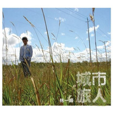

城市旅人
============================

|  |  |
| :--: | :-- |
| [ 城市旅人](https://emumo.xiami.com/album/33399) | **艺人**: [林一峰](../index.md) **语种**: 粤语 **唱片公司**: LYFE **发行时间**: 2008年01月31日 **专辑类别**: 录音室专辑 **专辑风格**: 粤语流行 Cantopop, 城市民谣 Urban Folk, 根源唱作人 Singer-Songwriter **播放数**: 123036 **收藏数**: 192 **评论数**: 6  |

## 简介

经过过往几张以旅人为题的大碟后，林一峰觉得留在自己居住的城市旅行也是个不错的选择。2008年，以香港人地道文化为题，林一峰的新碟《城市旅人》中十二首歌均出自自己的手笔，创作灵感来自旅行看见不同景物或新的事情，新专辑收录了“涂城记”、“红河村”、“象鼻尾猫”、“铜锣湾电车”和“刚点起烟车就来”。   
  
碟内其中一曲“涂城记”就是讲述香港人称“九龙皇帝”已故曾灶财的事迹，原来之前又有人对一峰说过他很像曾灶财，因为他们都是自由自在地创作，随时随地都写不停手。《城市旅人》予歌迷有旅行的感觉，林一峰与歌迷分享在城市中生活的情感。  
  
 

## 曲目

- [涂城记MV](./33399/oqt7e738c.md)
- [红河村MV](./33399/fSb483efa.md)
- [象鼻尾猫](./33399/D1lL497ef.md)
- [铜锣湾电车站 (Buffering)](./33399/wEBE279a0.md)
- [刚点起烟车就来MV](./33399/fSb7604a2.md)
- [塞](./33399/fSb8b608a.md)
- [咖啡/伴侣](./33399/fSb951955.md)
- [SMSNICQMV](./33399/kekCc4efa.md)
- [第一口酒](./33399/fSbB95c15.md)
- [天星小轮 (Buffering)](./33399/wEBK3d655.md)
- [海豚的微笑](./33399/fSbD107e6.md)
- [乾燥](./33399/s22K231c0.md)

## 评论

|  |  |  |
| :-- | :-- | :-- |
|  [虾米用户](https://emumo.xiami.com/u/8601290) 远在远方的风，比远方更远 2012-06-07 15:41 赞(1) 踩(0) | 
喜欢文艺青年的腔调，洒脱，自在，好逍遥。。。
 |
|  [虾米用户](https://emumo.xiami.com/u/4705423)  2011-10-06 08:39 赞(0) 踩(0) | 
用心了
 |
|  [虾米用户](https://emumo.xiami.com/u/3436534)  2011-07-30 10:24 赞(1) 踩(0) | 
大爱...童年纯真的味道..
 |
| ⇒ |  [虾米用户](https://emumo.xiami.com/u/51800191)  2016-12-22 00:22 赞(0) 踩(0) | 
你好
 |
|  [虾米用户](https://emumo.xiami.com/u/1379209) Simple is Be... 2011-03-07 13:45 赞(0) 踩(0) | 
By my side~
 |
|  [虾米用户](https://emumo.xiami.com/u/1388271)  2010-08-27 01:10 赞(2) 踩(0) | 
I love it，香港本土民谣的典范
 |
