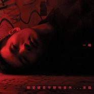

恋爱总是平静地意外....来临
============================

|  |  |
| :--: | :-- |
| [ 恋爱总是平静地意外....来临](https://emumo.xiami.com/album/358039) | **艺人**: [林一峰](../index.md) **语种**: 粤语 **唱片公司**: LYFE **发行时间**: 2010年01月22日 **专辑类别**: 录音室专辑 **专辑风格**: 粤语流行 Cantopop **播放数**: 1129174 **收藏数**: 876 **评论数**: 68  |

## 简介

「…爱情本身就是独立的瞬间感觉，既然是感觉，就不由得你主动选择…」 
 

这是林一峰的一张情歌集，他把这些年来不敢唱的情歌一次奉上，包括「遇见」的英文原版 《By My Side》  
  
及首次发表的多首舞台剧原创歌曲：  
「恋爱总是平静地意外....身亡」主题曲及插曲: 《In Love Again》、《井底蛙看画中花》 
 

「一期一会」漏网好歌《恋爱涟漪》、《盼望的缘份》 
 

 「孪到爆」主题曲《一个》 
 

「驯情记」主题曲《拖》 
 

  
特别推荐 
 

 老狼经典作品「虎口脱险」广东版《一线》 
 

 一峰向张国荣致敬歌曲《追》 
 

一峰分别写给李克勤及梁祖尧作品《卖火柴的男孩那夜》《我们在听依然》 

## 曲目

- [In Love Again](./358039/b1pN0Qx40396.md)
- [恋爱涟漪Medley: 恋爱预告 / 涟漪](./358039/mQ49iu613d5.md)
- [By My Side](./358039/8Ga6L5ecff7.md)
- [井底蛙看画中花](./358039/mQ49iw83fcb.md)
- [盼望的缘份](./358039/8Ga6L7f61f0.md)
- [拖](./358039/JAL5Ai205a9.md)
- [一线](./358039/xLp7WZ99b6d.md)
- [那夜，我们在听依然 (Live) ](./358039/mQ49i07201f.md)
- [追 (Live) ](./358039/8Ga6LBfbc4c.md)
- [一个 (Live) ](./358039/bqvc2bW373c0.md)
- [In Love Again Reprise](./358039/xLp7Xd158d6.md)
- [卖火柴的男孩 (Live) 原唱: 李克勤](./358039/mQ49i44b930.md)

## 评论

|  |  |  |
| :-- | :-- | :-- |
|  [虾米用户](https://emumo.xiami.com/u/237904)  2017-10-30 10:10 赞(0) 踩(0) | 
「…愛情本身就是獨立的瞬間感覺，既然是感覺，就不由得你主動選擇…」
 |
|  [虾米用户](https://emumo.xiami.com/u/27)  “你知道吗？你总是说假... 2017-10-30 10:10 赞(0) 踩(0) | 
「…愛情本身就是獨立的瞬間感覺，既然是感覺，就不由得你主動選擇…」
 |
|  [虾米用户](https://emumo.xiami.com/u/21216195) 我还没想好要写什么... 2017-05-06 15:08 赞(1) 踩(0) | 
林一峰是歌手，更是诗人。光是读他每张专辑，每场音乐会的名字，都有无穷的想象。 就像知道林一峰，喜欢他的歌，对我来说就是一个平静又意外的来临。
 |
| ⇒ |  [虾米用户](https://emumo.xiami.com/u/51800191)  2017-09-11 02:33 赞(0) 踩(0) | 
你好
 |
|  [虾米用户](https://emumo.xiami.com/u/5029176)  2015-12-09 00:23 赞(0) 踩(0) | 
。
 |
|  [虾米用户](https://emumo.xiami.com/u/3283411)  2014-09-05 03:10 赞(0) 踩(0) | 
改编自陈百强的同名歌曲~！但唱得比陈百强的小清新一些！
 |
|  [虾米用户](https://emumo.xiami.com/u/1185857)  2014-06-17 11:56 赞(1) 踩(0) | 
爱情本身就是独立的瞬间感觉，既然是感觉，就不由得你主动选择…
 |
|  [虾米用户](https://emumo.xiami.com/u/1609946) 一即一切 2014-05-06 16:19 赞(0) 踩(0) | 
心 境不二
 |
|  [虾米用户](https://emumo.xiami.com/u/2585835) 听歌就听歌 不要社交 2014-03-25 21:16 赞(1) 踩(0) | 
或许不应再期待 如同专辑名 总是意外地来临
 |
|  [虾米用户](https://emumo.xiami.com/u/15310281) 我还没想好要写什么... 2013-12-28 15:55 赞(0) 踩(0) | 
过山车里安坐 就只等你碰巧经过
 |
|  [虾米用户](https://emumo.xiami.com/u/2817889) 我还没想好要写什么... 2013-10-03 13:17 赞(0) 踩(0) | 
我喜欢这个专辑名。
 |
| ⇒ |  [虾米用户](https://emumo.xiami.com/u/51800191)  2016-08-09 23:56 赞(0) 踩(0) | 
我也是
 |
|  [虾米用户](https://emumo.xiami.com/u/1695968) eating tomat... 2012-04-21 07:18 赞(0) 踩(0) | 
哎.........
 |
|  [虾米用户](https://emumo.xiami.com/u/16229) 十七岁女生的温柔 2012-03-07 15:58 赞(1) 踩(0) | 
恋爱专辑~
 |
|  [虾米用户](https://emumo.xiami.com/u/8284548)  2012-03-05 07:15 赞(0) 踩(0) | 
精彩！
 |
|  [虾米用户](https://emumo.xiami.com/u/7689136)   2012-01-29 19:42 赞(0) 踩(0) | 
like
 |
|  [虾米用户](https://emumo.xiami.com/u/7738189)  2012-01-20 03:26 赞(1) 踩(0) | 
爱情，总是平静意外的来临
 |
|  [虾米用户](https://emumo.xiami.com/u/5818813)  2012-01-04 19:52 赞(0) 踩(0) | 
因为虾米乐评里有人说：“他的歌里有我的人生，他走过的，也是我们曾经历的，因为，我们是同龄人。”我便听起了这陌生的声音。爱情本身就是独立的瞬间感觉，既然是感觉，就不由的你主动选择。。。对于歌声也许也是同样的感觉，喜欢便不由自己主动选择了。
 |
| ⇒ |  [虾米用户](https://emumo.xiami.com/u/51800191)  2016-08-09 23:57 赞(0) 踩(0) | 
night
 |
|  [虾米用户](https://emumo.xiami.com/u/355359)  2011-12-20 09:18 赞(1) 踩(0) | 
一如既往的一峰
 |
|  [虾米用户](https://emumo.xiami.com/u/3048487) nothing 2011-12-14 22:34 赞(0) 踩(0) | 
淡淡的孤独
 |
|  [虾米用户](https://emumo.xiami.com/u/1300872)  2011-11-15 12:44 赞(0) 踩(0) | 
洗了个热水澡。看见镜子里的自己有两个大大的黑眼圈。试着说话，可喉咙还是哑哑的。尽管一切都看起来不那么好，可我的心情就是出奇的好。希望有一日，你能与我一起坐在窗台前，静静听完这张专辑。Let us fall in love, again.
 |
| ⇒ |  [虾米用户](https://emumo.xiami.com/u/51800191)  2015-07-30 23:46 赞(0) 踩(0) | 
您好
 |
| ⇒ |  [虾米用户](https://emumo.xiami.com/u/51800191)  2016-08-09 23:57 赞(0) 踩(0) | 
是的
 |
|  [虾米用户](https://emumo.xiami.com/u/1251638)  2011-10-22 23:40 赞(0) 踩(0) | 
很不错
 |
|  [虾米用户](https://emumo.xiami.com/u/5137423)  2011-09-25 17:39 赞(0) 踩(0) | 
听的第一**一峰的碟就是这张。
 |
|  [虾米用户](https://emumo.xiami.com/u/4721961)  2011-07-03 11:26 赞(1) 踩(0) | 
孤独的感觉
 |
|  [虾米用户](https://emumo.xiami.com/u/859675)  2011-06-04 20:31 赞(1) 踩(0) | 
悠悠的風
 |
|  [虾米用户](https://emumo.xiami.com/u/3513959)  2011-04-18 18:46 赞(0) 踩(0) | 
淡淡的，柔柔的，好好的……
 |
|  [虾米用户](https://emumo.xiami.com/u/532661) 不要停止我的音乐 2011-04-07 18:35 赞(1) 踩(0) | 
如果恋爱某种程度上是一个人的事。。。。那它已经平静地。。。意外离去 从这张碟爱上一峰
 |
|  [虾米用户](https://emumo.xiami.com/u/584094) 天气变凉了，很意外 2011-03-16 12:04 赞(0) 踩(0) | 
恋爱~一直的心悸~~
 |
|  [虾米用户](https://emumo.xiami.com/u/1379209) Simple is Be... 2011-03-07 13:54 赞(0) 踩(0) | 
By my side~
 |
|  [虾米用户](https://emumo.xiami.com/u/2696176)  2011-02-04 21:11 赞(0) 踩(0) | 
有人说，所谓爱情，都是因为寂寞。在那个瞬间。你那时说爱我，是不是只因为你那时在寂寞呢？
 |
|  [虾米用户](https://emumo.xiami.com/u/2691586)  2011-01-31 17:27 赞(0) 踩(0) | 
听了很久也没有来临嘛。不过没有关系不怪你，我喜欢你。
 |
|  [虾米用户](https://emumo.xiami.com/u/2208163)  2011-01-29 12:52 赞(0) 踩(0) | 
淡淡的，唱进心里
 |
|  [虾米用户](https://emumo.xiami.com/u/2420397)  2011-01-09 23:33 赞(0) 踩(0) | 
安静的很有才华
 |
|  [虾米用户](https://emumo.xiami.com/u/583608) 他人即地狱 2010-06-27 23:55 赞(0) 踩(0) | 
by my side ——鸡皮疙瘩！！真的是一身鸡皮疙瘩！！
 |
|  [虾米用户](https://emumo.xiami.com/u/1095659)  2010-06-27 21:54 赞(0) 踩(0) | 
他的声音还是那么能令我感动~
 |
|  [虾米用户](https://emumo.xiami.com/u/373261)  2010-06-24 14:07 赞(0) 踩(0) | 
陈百强的经典啊。。。。。。。谢谢！！
 |
|  [虾米用户](https://emumo.xiami.com/u/54518)  2010-04-11 06:40 赞(0) 踩(0) | 
今天是一峰34岁大寿 祝福峰哥生日快乐啊
 |
|  [虾米用户](https://emumo.xiami.com/u/543468)  2010-02-20 21:12 赞(0) 踩(0) | 
音乐想起的时候，我什么都放下了
 |
|  [虾米用户](https://emumo.xiami.com/u/589448)  2010-02-19 09:40 赞(0) 踩(0) | 
好听，再去看看电影 <a href="http://bbs.htpc1.com/?fromuser=sophie" target="_blank" rel="nofollow noreferrer noopener">http://bbs.htpc1.com/?fromuser=sophie</a> <a href="http://bbs.htpc1.com/?fromuser=sophie" target="_blank" rel="nofollow noreferrer noopener">http://bbs.htpc1.com/?fromuser=sophie</a>
 |
|  [虾米用户](https://emumo.xiami.com/u/11972)  2010-02-18 23:22 赞(0) 踩(0) | 
温暖的林一峰。
 |
|  [虾米用户](https://emumo.xiami.com/u/70409)  2010-02-13 12:54 赞(0) 踩(0) | 
这样的天气 这样的节日 这样的心境 这样的声音.....
 |
|  [虾米用户](https://emumo.xiami.com/u/403233) 願每天燦爛直到不能 2010-02-11 18:34 赞(0) 踩(0) | 
乾淨，清新，窩心
 |
|  [虾米用户](https://emumo.xiami.com/u/576666)  2010-02-09 14:34 赞(0) 踩(0) | 
平静中的涟漪...静静地听，仿佛再次感受恋爱的感受
 |
|  [虾米用户](https://emumo.xiami.com/u/491631)  2010-02-08 22:24 赞(0) 踩(0) | 
太好了，上榜了
 |
|  [虾米用户](https://emumo.xiami.com/u/667659)  2010-02-08 02:37 赞(0) 踩(0) | 
好喜歡他的小品音樂
 |
|  [虾米用户](https://emumo.xiami.com/u/114690) 我还没想好要写什么... 2010-02-07 11:25 赞(0) 踩(0) | 
无言茑......只想静听!
 |
|  [虾米用户](https://emumo.xiami.com/u/5755)  2010-02-06 11:41 赞(0) 踩(0) | 
量产啊。。。
 |
|  [虾米用户](https://emumo.xiami.com/u/107273)  2010-02-06 10:12 赞(0) 踩(0) | 
嗯……
 |
|  [虾米用户](https://emumo.xiami.com/u/441883)  2010-02-04 23:25 赞(0) 踩(0) | 
拖.
 |
|  [虾米用户](https://emumo.xiami.com/u/158193)  2010-02-04 10:24 赞(0) 踩(0) | 
静静的,熨贴着心~~~
 |
|  [虾米用户](https://emumo.xiami.com/u/158193)  2010-02-04 10:23 赞(0) 踩(0) | 
静静的,熨贴着心~~~
 |
|  [虾米用户](https://emumo.xiami.com/u/95514)   2010-02-04 10:20 赞(0) 踩(0) | 
揉揉心
 |
|  [虾米用户](https://emumo.xiami.com/u/115869) 其实，我也是一个演员 2010-02-03 10:33 赞(0) 踩(0) | 
最爱第8～
 |
| ⇒ |  [虾米用户](https://emumo.xiami.com/u/95514)   2010-02-04 10:22 赞(0) 踩(0) | 
我也是
 |
|  [虾米用户](https://emumo.xiami.com/u/539332)  2010-02-02 21:27 赞(0) 踩(0) | 
好极,我们一起来听情歌.
 |
|  [虾米用户](https://emumo.xiami.com/u/246069)  2010-02-02 11:23 赞(0) 踩(0) | 
词写的很赞！
 |
|  [虾米用户](https://emumo.xiami.com/u/248214) 想守总有道理,想走总有借... 2010-02-01 23:18 赞(0) 踩(0) | 
睇杂志、听峰仔。Nice。
 |
|  [虾米用户](https://emumo.xiami.com/u/21293)  2010-02-01 18:36 赞(0) 踩(0) | 
终于有了，哈哈，前两天一直都在听in love again ,喜欢
 |
|  [虾米用户](https://emumo.xiami.com/u/21293)  2010-02-01 18:33 赞(0) 踩(0) | 
终于有了，哈哈，前两天一直都在听in love again ,喜欢
 |
|  [虾米用户](https://emumo.xiami.com/u/100052) 公号vophoenix 2010-02-01 17:14 赞(0) 踩(0) | 
真是量产
 |
|  [虾米用户](https://emumo.xiami.com/u/226571)  2010-02-01 14:51 赞(0) 踩(0) | 
&amp;quot;......既然是感覺，就不由得你主動選擇......&amp;quot; 在意识到不能主动选择的时候恰巧听到这些干净的歌
 |
|  [虾米用户](https://emumo.xiami.com/u/226571)  2010-02-01 14:51 赞(0) 踩(0) | 
&amp;quot;......既然是感覺，就不由得你主動選擇......&amp;quot; 在意识到不能主动选择的时候恰巧听到这些干净的歌
 |
|  [虾米用户](https://emumo.xiami.com/u/2010) 你先看什么，我写给你看鸭... 2010-02-01 13:40 赞(0) 踩(0) | 
终于等到了~激动ING~~
 |
|  [虾米用户](https://emumo.xiami.com/u/73) 等风景都看透 谁陪我看细... 2010-02-01 11:48 赞(0) 踩(0) | 
谢谢！终于发布了 让朋友去香港带都没买到
 |
|  [虾米用户](https://emumo.xiami.com/u/21293)  2010-01-29 13:10 赞(0) 踩(0) | 
期待啊……
 |
|  [虾米用户](https://emumo.xiami.com/u/73) 等风景都看透 谁陪我看细... 2010-01-07 13:40 赞(0) 踩(0) | 
托朋友在香港帶也沒找到。。。
 |
|  [虾米用户](https://emumo.xiami.com/u/201005) 爱你❤️ 2010-01-05 15:41 赞(0) 踩(0) | 
等·····等······等·······························
 |
