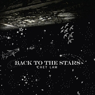

Back to the Stars
============================

|  |  |
| :--: | :-- |
| [ Back to the Stars](https://emumo.xiami.com/album/376634) | **艺人**: [林一峰](../index.md) **语种**: 英语 **唱片公司**: LYFE **发行时间**: 2010年04月10日 **专辑类别**: 录音室专辑 **专辑风格**: 独立流行 Indie Pop **播放数**: 1302535 **收藏数**: 581 **评论数**: 34  |

## 简介

Back to the Stars is Chet's tenth studio album with all original English songs. A journey off the beaten tracks, inspired by the various characters in the Little Prince. BTTS gives a new layer of meanings to love, friendship, life and all. 

## 曲目

- [Chasing Sunsets](./376634/xLq2rPa1387.md)
- [The Last Goodbye](./376634/8Gb1g0e851e.md)
- [Trust](./376634/mQ533r8fd65.md)
- [Ghosts](./376634/mQ533s94db8.md)
- [Thanks for Setting Me Free](./376634/xLq2rTa6a0a.md)
- [Falling Stars](./376634/mQ533u7a9f7.md)
- [Just a Little Longer](./376634/mQ533v8c743.md)
- [After the Pain](./376634/xLq2rWd01cb.md)
- [When He Sings](./376634/bf0sx8r2df2b.md)
- [From Turkey , with Love](./376634/mQ533y7feb8.md)
- [Light Up Your Dreams](./376634/8Gb1g9e4ff5.md)

## 评论

|  |  |  |
| :-- | :-- | :-- |
|  [虾米用户](https://emumo.xiami.com/u/379162683) 我想要记住你们，我想要你... 2020-12-28 12:28 赞(0) 踩(0) | 

 |
|  [虾米用户](https://emumo.xiami.com/u/10936044)  2019-06-18 21:04 赞(1) 踩(0) | 
这张专辑的歌每首都好好听，好想买，但是买不到
 |
|  [虾米用户](https://emumo.xiami.com/u/1864133) 2112 2018-12-04 00:17 赞(2) 踩(0) | 
干净
 |
|  [虾米用户](https://emumo.xiami.com/u/38901051)   2018-10-02 15:55 赞(1) 踩(0) | 
我是第521个点红心的&amp;hearts;️
 |
|  [虾米用户](https://emumo.xiami.com/u/4700356) 我还没想好要写什么... 2018-09-04 22:51 赞(1) 踩(0) | 
封面会动
 |
|  [虾米用户](https://emumo.xiami.com/u/43603960) 我将在绝早的晨光里张帆航... 2017-03-10 23:36 赞(0) 踩(0) | 
喜欢
 |
|  [虾米用户](https://emumo.xiami.com/u/9360941) 早上好呀。 2015-10-23 16:16 赞(0) 踩(0) | 
写稿必备嘻嘻嘻
 |
|  [虾米用户](https://emumo.xiami.com/u/39236292)  2015-10-20 22:00 赞(4) 踩(0) | 
一直非常钟情林一峰这张砖，听了好多年 
 |
|  [虾米用户](https://emumo.xiami.com/u/26381576) 我情愿消灭了一切执念，冰... 2015-08-27 10:05 赞(0) 踩(0) | 
这个的意思是不是小王子
 |
|  [虾米用户](https://emumo.xiami.com/u/4290056) Dream land..... 2015-02-13 23:36 赞(2) 踩(0) | 
纯净的音色必定从纯净的心灵发出。
 |
|  [虾米用户](https://emumo.xiami.com/u/17765602)  2015-01-07 23:35 赞(1) 踩(0) | 
好美
 |
|  [虾米用户](https://emumo.xiami.com/u/4911973)  2014-02-04 21:58 赞(2) 踩(0) | 
现在才发现这张英文专辑如此好听
 |
|  [虾米用户](https://emumo.xiami.com/u/679170) 平安喜乐，普普通通 2013-12-09 20:25 赞(1) 踩(0) | 
在这种温度的夜晚，心里突然觉得满满的暖意。想到心爱的人，迫不及待的想设成铃声。。
 |
|  [虾米用户](https://emumo.xiami.com/u/2794737)  2013-06-23 12:13 赞(0) 踩(0) | 
小王子...
 |
|  [虾米用户](https://emumo.xiami.com/u/11679084)  2013-03-07 09:19 赞(0) 踩(0) | 
永远的小王子
 |
|  [虾米用户](https://emumo.xiami.com/u/4128150) 不能熊它 2013-02-04 23:17 赞(0) 踩(0) | 
小王子主题。温暖得要命。
 |
|  [虾米用户](https://emumo.xiami.com/u/151401) Deja vu 2012-07-26 18:44 赞(0) 踩(0) | 
one of my favor...
 |
|  [虾米用户](https://emumo.xiami.com/u/1500820)  2012-04-27 00:21 赞(0) 踩(0) | 
睡觉有望了。
 |
|  [虾米用户](https://emumo.xiami.com/u/7958067)  2012-03-23 22:24 赞(0) 踩(0) | 
懷念
 |
|  [虾米用户](https://emumo.xiami.com/u/7886985)  2012-03-16 19:34 赞(0) 踩(0) | 
喜欢 他 谈谈的 忧伤
 |
|  [虾米用户](https://emumo.xiami.com/u/121904) une vie merv... 2011-09-05 10:36 赞(0) 踩(0) | 
简单的单词构成淳朴的旋律
 |
|  [虾米用户](https://emumo.xiami.com/u/2959709)  2011-08-28 13:54 赞(0) 踩(0) | 
小王子
 |
|  [虾米用户](https://emumo.xiami.com/u/1882272) 签名是什么 2011-07-07 00:03 赞(0) 踩(0) | 
封面！！！
 |
|  [虾米用户](https://emumo.xiami.com/u/4243256) Ma Vie... 2011-06-10 18:01 赞(0) 踩(0) | 
微风徐徐的午后，躺在花园晒太阳，没了小王子的声音如何小清新？！
 |
|  [虾米用户](https://emumo.xiami.com/u/2713979)  2011-05-13 16:03 赞(0) 踩(0) | 
Are you happy...to be sad? 我的小王子呀
 |
|  [虾米用户](https://emumo.xiami.com/u/3112205)  2011-04-21 14:38 赞(1) 踩(0) | 
当你忧伤的时候，看看日落
 |
|  [虾米用户](https://emumo.xiami.com/u/2728508)  2011-03-22 12:14 赞(0) 踩(0) | 
继续
 |
|  [虾米用户](https://emumo.xiami.com/u/1379209) Simple is Be... 2011-03-07 13:40 赞(0) 踩(0) | 
By my side~
 |
|  [虾米用户](https://emumo.xiami.com/u/602504)  2011-01-08 02:40 赞(0) 踩(0) | 
最爱
 |
|  [虾米用户](https://emumo.xiami.com/u/393287)  2010-09-29 18:38 赞(0) 踩(0) | 
支持！！喜欢！！！
 |
|  [虾米用户](https://emumo.xiami.com/u/1092561)   2010-08-05 11:45 赞(0) 踩(0) | 
还有trust也相当不错
 |
|  [虾米用户](https://emumo.xiami.com/u/831082)  2010-04-25 13:46 赞(0) 踩(0) | 
有下载的 顶 好站！！！！！！
 |
|  [虾米用户](https://emumo.xiami.com/u/89343)  2010-04-13 09:50 赞(0) 踩(0) | 
正在发布了 只是想喜欢一峰的朋友第一时间听到 但是喜欢的话 还是支持下正版 谢谢！
 |
|  [虾米用户](https://emumo.xiami.com/u/100052) 公号vophoenix 2010-04-12 14:18 赞(0) 踩(0) | 
Chasing Sunsets 还是相当可以的
 |
