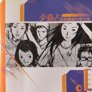

少爷占广播剧音乐全集Complete Original Score for Jim Yan's Radio Drama
============================

|  |  |
| :--: | :-- |
| [ 少爷占广播剧音乐全集Complete Original Score for Jim Yan's Radio Drama](https://emumo.xiami.com/album/435181) | **艺人**: [林一峰](../index.md) **语种**: 粤语 **唱片公司**: 华纳音乐 **发行时间**: 2002年02月01日 **专辑类别**: 原声带, 影视音乐 **专辑风格**: 民谣流行 Folk Pop, 广播剧 Radio Drama **播放数**: 152581 **收藏数**: 269 **评论数**: 15  |

## 简介

商业电台903少爷占音乐广播剧，是年青人最喜爱的广播剧，在广播剧播出期间，剧中多首歌曲及音乐，深受時下年青人所喜爱！所以专诚将专辑录成一张专辑，让喜欢的朋友能够再次重温 

## 曲目

- [好天气 (天朗气清版)Good Weather](./435181/xLtsLBe0015.md)
- [那年, 十九岁When I was 19](./435181/mQ8tXc50023.md)
- [和你在一起Being With You](./435181/mQ8tXd54b95.md)
- [秋千Swing](./435181/8GerAoe31ec.md)
- [我的日记 (女声版)My Diary (Girl Version)](./435181/bCkCk3J47260.md)
- [两个你, 一个我The Two of You and Me](./435181/mQ8tXg803e0.md)
- [雪糕 (未溶版)Ice-cream](./435181/bCkCk3L45342.md)
- [你......在那里?Where Are You?](./435181/8GerAsf626a.md)
- [寄后 (再生版)Parasites](./435181/mQ8tXj84765.md)
- [Precious Moments](./435181/8GerAuefbe1.md)
- [阿烦Miss Trouble](./435181/xLtsLL1103d.md)
- [男朋友Dear Boyfriend](./435181/xLtsLMd635d.md)
- [今天总算有阳光Sun](./435181/bqvgmQH3869e.md)
- [十九19](./435181/8GerAye3163.md)
- [我, 孤单一个Me, Alone](./435181/xLtsLPbcdab.md)
- [十九 (女声版)19 (Girl Version)](./435181/xLtsLQa6cf7.md)
- [我的日记My Diary](./435181/bqvgmQL39394.md)
- [懒到死Lazy Til Death](./435181/bf256vR31beb.md)

## 评论

|  |  |  |  |
| :-- | :-- | :-- | :-- |
|  [虾米用户](https://emumo.xiami.com/u/10096857)  2018-08-08 10:27 赞(0) 踩(0) | 
以前好中意嘅一只CD,可惜已经遗失，点知可以系哩度稳返，正！ X2
 |
|  [虾米用户](https://emumo.xiami.com/u/18330272) 。 2018-02-27 19:49 赞(0) 踩(0) | 
<a href="https://store.cdbaby.com/cd/sounds21" target="_blank" rel="nofollow noreferrer noopener">https://store.cdbaby.com/cd/sounds21</a><a href="https://www.kkbox.com/hk/tc/album/F-zDVS4n0n4jf0F1oKsj009H-index.html" target="_blank" rel="nofollow noreferrer noopener">https://www.kkbox.com/hk/tc/album/F-zDVS4n0n4jf0F1oKsj009H-index.html</a>
 |
|  [虾米用户](https://emumo.xiami.com/u/18330272) 。 2018-02-27 19:48 赞(0) 踩(0) | 
<a href="https://gd4.alicdn.com/imgextra/i4/223274/TB2wfa3fJqUQKJjSZFIXXcOkFXa_" target="_blank" rel="nofollow noreferrer noopener">https://gd4.alicdn.com/imgextra/i4/223274/TB2wfa3fJqUQKJjSZFIXXcOkFXa_</a>!!223274.jpg
 |
|  [虾米用户](https://emumo.xiami.com/u/47290844)  2017-01-05 21:23 赞(1) 踩(0) | 
以前好中意嘅一只CD,可惜已经遗失，点知可以系哩度稳返，正！
 |
|  [虾米用户](https://emumo.xiami.com/u/13543274) 鬼师缉天涯 2015-11-05 16:34 赞(0) 踩(0) | 
超好聽!
 |
|  [虾米用户](https://emumo.xiami.com/u/1127888)  2013-12-08 22:49 赞(1) 踩(0) | 
这张碟我找了好多年啊！终于找到了 T-T
 |
|  [虾米用户](https://emumo.xiami.com/u/3597775)  2012-11-14 21:44 赞(1) 踩(0) | 
just for my memorable teenage.
 |
|  [虾米用户](https://emumo.xiami.com/u/3829747) 希望能一直进步 2012-11-09 20:40 赞(1) 踩(0) | 
难得的冷门碟。
 |
|  [虾米用户](https://emumo.xiami.com/u/3192484)  2012-08-24 23:37 赞(0) 踩(0) | 
終於找到了~讓人感動啊~！！！！
 |
| ⇒ |  [虾米用户](https://emumo.xiami.com/u/9658515) 有生活就有音樂 2016-07-06 07:12 赞(0) 踩(0) | 
我有买到，好好珍藏了
 |
|  [虾米用户](https://emumo.xiami.com/u/156669)  2012-08-07 23:11 赞(0) 踩(0) | 
找了好久啊
 |
|  [虾米用户](https://emumo.xiami.com/u/2322694)   2011-06-11 00:34 赞(1) 踩(0) | 
好怀念，我整个中学一直听这个碟，我要哭了
 |
| ⇒ |  [虾米用户](https://emumo.xiami.com/u/2010697)  2011-10-26 22:00 赞(0) 踩(0) | 
我也是 我还有这个专辑的翻版 要感谢翻版商 居然出咁冷门嘅
 |
| ⇒ |  [虾米用户](https://emumo.xiami.com/u/6443244)  2011-10-26 22:12 赞(0) 踩(0) | 
<q><b>yakushi说：</b></q>
 |
| ⇒ |  [虾米用户](https://emumo.xiami.com/u/7253184)  2012-01-19 09:51 赞(0) 踩(0) | 
<q><b>yakushi说：</b></q>
 |
