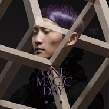

ONE MAGIC DAY
============================

|  |  |
| :--: | :-- |
| [ ONE MAGIC DAY](https://emumo.xiami.com/album/466421) | **艺人**: [林一峰](../index.md) **语种**: 粤语 **唱片公司**: LYFE **发行时间**: 2011年09月15日 **专辑类别**: 录音室专辑 **专辑风格**: 城市民谣 Urban Folk **播放数**: 578522 **收藏数**: 735 **评论数**: 77  |

## 简介

林一峰作品 第十一号  
简简单单的木结他奏出爽朗的民谣旋律， 清新柔和的男声吟唱再配上简洁的和声  
林一峰 全新专辑《ONE MAGIC DAY》，收录电台媒体主打歌：错得对

## 曲目

- [错得对MVRight Kind of Wrongs](./466421/JAQDTg1f7c1.md)
- [很多‧很少Much Too Much](./466421/mQ9NpR8c43a.md)
- [回到花开的那天MVThe First Day Our Flowers Bloomed](./466421/xLuMe2b743c.md)
- [简单不简单Simple, Not Simple](./466421/xLuMe39f3a9.md)
- [千杯少Thousand Glasses Short](./466421/8GfKTe1b39a.md)
- [烟‧花Smoke and Flowers](./466421/xLuMe5cdbdf.md)
- [朋友 你变了没有MVFriend, How Have You Changed?](./466421/mQ9NpW70edc.md)
- [再见小王子Farewell, My Little Prince](./466421/bCkDDMB44ef9.md)
- [It’s Hard to Say Goodbye](./466421/xLuMe8c7aff.md)
- [莫过如此No More, No Less](./466421/xLuMe9cb6c4.md)
- [Victim of Love](./466421/8GfKTkfb489.md)

## 评论

|  |  |  |  |
| :-- | :-- | :-- | :-- |
|  [虾米用户](https://emumo.xiami.com/u/113808960) 出走q音 我家不在这星球 2018-01-14 17:04 赞(0) 踩(0) | 
封面当面真的把我吓到了
 |
|  [虾米用户](https://emumo.xiami.com/u/958218) 暂无签名~ 2017-10-28 00:10 赞(0) 踩(0) | 
我爱的疯子 哈哈
 |
|  [虾米用户](https://emumo.xiami.com/u/49820256)  2015-09-02 09:00 赞(0) 踩(0) | 
魔性的一天
 |
|  [虾米用户](https://emumo.xiami.com/u/5443127) COMING SOON 2014-11-12 20:46 赞(0) 踩(0) | 
Christmas is coming and I'm about to be froze to death in this ruthless city.
 |
|  [虾米用户](https://emumo.xiami.com/u/5161152)   2012-04-30 09:52 赞(0) 踩(0) | 
喜欢那种淡淡的忧伤，歌词十分称我心意。大爱~
 |
| ⇒ |  [虾米用户](https://emumo.xiami.com/u/51800191)  2015-11-23 12:00 赞(0) 踩(0) | 
你好！你好
 |
|  [虾米用户](https://emumo.xiami.com/u/615888)  2012-01-06 16:57 赞(0) 踩(0) | 
我感冒了，快好了，但是天蓝感冒了·~~~~~outch，小白粥配绿青菜，不错过，淡淡的味道才能治疗好你~~~~·
 |
| ⇒ |  [虾米用户](https://emumo.xiami.com/u/51800191)  2015-11-23 12:00 赞(0) 踩(0) | 
你好朋友
 |
|  [虾米用户](https://emumo.xiami.com/u/6475098) 我是冥王星人。 2011-10-31 21:37 赞(0) 踩(0) | 
永远的吟游诗人，简单美丽。
 |
|  [虾米用户](https://emumo.xiami.com/u/3278535) 我愿化成一只飞鱼，简单自... 2011-10-23 15:48 赞(0) 踩(0) | 
一直都很喜欢他的歌，淡淡的，轻轻的，声音也清澈透明，让人听上去很舒服，感觉其他的一切浮躁都是浮云……
 |
|  [虾米用户](https://emumo.xiami.com/u/167086)  2011-10-14 13:56 赞(1) 踩(0) | 
I have a friend who likes him a lot... hehe.. support!
 |
|  [虾米用户](https://emumo.xiami.com/u/6216630)  2011-10-12 10:35 赞(0) 踩(0) | 
木吉他!!!
 |
|  [虾米用户](https://emumo.xiami.com/u/3860428)  2011-10-08 19:33 赞(0) 踩(0) | 
你可以听听 我是必须听的·
 |
|  [虾米用户](https://emumo.xiami.com/u/4364751)  2011-10-06 15:20 赞(0) 踩(0) | 
每个人都会遇到错的人，对的人，一切只要错的对就好了
 |
|  [虾米用户](https://emumo.xiami.com/u/4331500)  2011-10-03 10:58 赞(0) 踩(0) | 
稀饭
 |
|  [虾米用户](https://emumo.xiami.com/u/6056031)  2011-10-01 14:04 赞(1) 踩(0) | 
他是属于让我听完能很安心入睡那一型的。音量每次都必须调到最大。其实，我就是俗人一个...
 |
|  [虾米用户](https://emumo.xiami.com/u/488931)  2011-09-27 10:55 赞(0) 踩(0) | 
听着舒服
 |
|  [虾米用户](https://emumo.xiami.com/u/1164400)  2011-09-26 18:22 赞(0) 踩(0) | 
没有意识到音乐在放
 |
|  [虾米用户](https://emumo.xiami.com/u/908444) 我还没想好要写什么... 2011-09-26 00:46 赞(1) 踩(0) | 
我现在对于中文歌基本上就只听林一峰了。最爱 it\'s hard to say googbye
 |
|  [虾米用户](https://emumo.xiami.com/u/292156) 如果我听歌可眼红 何以待... 2011-09-25 15:40 赞(0) 踩(0) | 
赞飞了！
 |
|  [虾米用户](https://emumo.xiami.com/u/4742268)  2011-09-25 13:18 赞(0) 踩(0) | 
林一峰
 |
|  [虾米用户](https://emumo.xiami.com/u/2990805)  2011-09-24 22:15 赞(1) 踩(0) | 
一直觉得林一峰拥有一把很特别既声音，而且很懂得为自己度身制作歌曲。都说香港只系得娱乐，没有音乐。其实不尽然，只不过好多好音乐既人都红不起，因为佢地唔够商业。佢就系一个例子，好喜欢佢既音乐风格！特别推荐第4首：简单不简单。
 |
|  [虾米用户](https://emumo.xiami.com/u/5950529)  2011-09-24 12:30 赞(0) 踩(0) | 
靓仔
 |
|  [虾米用户](https://emumo.xiami.com/u/5168009)  2011-09-24 10:52 赞(0) 踩(0) | 
听着很舒服的歌手
 |
|  [虾米用户](https://emumo.xiami.com/u/691672) Be strong 2011-09-24 10:22 赞(0) 踩(0) | 
没亮点
 |
|  [虾米用户](https://emumo.xiami.com/u/3671928)  2011-09-24 00:02 赞(0) 踩(0) | 
正點+1
 |
|  [虾米用户](https://emumo.xiami.com/u/2627785) Yvonne is a ... 2011-09-23 22:12 赞(0) 踩(0) | 
林一峰終於出新專輯了T_T我的床頭叔叔！~
 |
|  [虾米用户](https://emumo.xiami.com/u/5934366)  2011-09-23 19:20 赞(0) 踩(0) | 
awesome~
 |
|  [虾米用户](https://emumo.xiami.com/u/2373507)  2011-09-23 17:25 赞(0) 踩(0) | 
正! ❤
 |
|  [虾米用户](https://emumo.xiami.com/u/4025633)  2011-09-23 11:18 赞(0) 踩(0) | 
林一峰
 |
|  [虾米用户](https://emumo.xiami.com/u/1097090)  2011-09-23 00:56 赞(0) 踩(0) | 
寂寞的时候要么林一峰要么陈奕迅。
 |
|  [虾米用户](https://emumo.xiami.com/u/985576)  2011-09-22 18:54 赞(1) 踩(0) | 
其实这专辑有一部分是老歌了。烟·花最早出现于驯情记；回到花开那天在CL411生日会出现过，好像歌词改了，当时叫绿草清风；朋友你变了没有是写给任贤齐的；再见小王子是海豚的微笑，改了歌词。不过烟·花终于出了cd版我很是安慰～
 |
|  [虾米用户](https://emumo.xiami.com/u/5868749) 纵有疾风起，人生不言弃 2011-09-22 10:26 赞(0) 踩(0) | 
清新~！
 |
|  [虾米用户](https://emumo.xiami.com/u/1927595)  2011-09-22 08:05 赞(0) 踩(0) | 
清淡。粤语老歌的味儿
 |
|  [虾米用户](https://emumo.xiami.com/u/5478056)  2011-09-22 00:35 赞(0) 踩(0) | 
慵懒的感觉我喜欢
 |
|  [虾米用户](https://emumo.xiami.com/u/988568)  2011-09-21 15:23 赞(0) 踩(0) | 
他的音乐是品质的保证
 |
|  [虾米用户](https://emumo.xiami.com/u/3849344)   2011-09-21 14:04 赞(0) 踩(0) | 
@林一峰ChetLam 新专辑《ONE MAGIC DAY》不错，喜欢~
 |
|  [虾米用户](https://emumo.xiami.com/u/413021)  2011-09-21 13:52 赞(0) 踩(0) | 
为什么我现在听林一峰都没有最初听他的时候那种感动了？喜欢朋友，你变了没有，it\'s hard to say goodbye
 |
| ⇒ |  [虾米用户](https://emumo.xiami.com/u/1960733)  2011-09-21 19:06 赞(0) 踩(0) | 
同感
 |
| ⇒ |  [虾米用户](https://emumo.xiami.com/u/3609042)  2011-09-21 20:56 赞(0) 踩(0) | 
封面我就接受不了
 |
| ⇒ |  [虾米用户](https://emumo.xiami.com/u/413021)  2011-09-22 00:08 赞(0) 踩(0) | 
<q><b>loy888说：</b></q>
 |
| ⇒ |  [虾米用户](https://emumo.xiami.com/u/413021)  2011-09-22 00:08 赞(0) 踩(0) | 
<q><b>雀西说：</b></q>
 |
|  [虾米用户](https://emumo.xiami.com/u/399433)  2011-09-21 12:03 赞(0) 踩(0) | 
好动人的歌曲们~
 |
|  [虾米用户](https://emumo.xiami.com/u/3016487) 我还没想好要写什么... 2011-09-21 11:19 赞(0) 踩(0) | 
第二首的风格实在很难接受！
 |
|  [虾米用户](https://emumo.xiami.com/u/5841274)  2011-09-21 10:26 赞(0) 踩(0) | 
歌好听，封面不好看。
 |
|  [虾米用户](https://emumo.xiami.com/u/2305412)  2011-09-21 09:36 赞(0) 踩(0) | 
不简单的歌者，可见他对生活的细细体察
 |
|  [虾米用户](https://emumo.xiami.com/u/2437590)  2011-09-21 08:51 赞(0) 踩(0) | 
非常舒服~
 |
|  [虾米用户](https://emumo.xiami.com/u/192646) 一七年尾来访，发现精选集... 2011-09-21 06:52 赞(0) 踩(0) | 
其实这封面看着好压抑。。。＝．＝
 |
|  [虾米用户](https://emumo.xiami.com/u/3386525)  2011-09-21 00:54 赞(0) 踩(0) | 
是夜推介，來下港式民謠風！！哈哈！陪伴訓覺不錯！雖然我依然听着容祖兒的《墻紙》推介：錯得對！
 |
|  [虾米用户](https://emumo.xiami.com/u/3496718) idle space 2011-09-21 00:22 赞(0) 踩(0) | 
林一峰的歌真的很深入内心
 |
|  [虾米用户](https://emumo.xiami.com/u/1160126)  2011-09-21 00:06 赞(0) 踩(0) | 
林一峰 木吉他,
 |
| ⇒ |  [虾米用户](https://emumo.xiami.com/u/51800191)  2015-11-23 12:00 赞(0) 踩(0) | 
是的
 |
|  [虾米用户](https://emumo.xiami.com/u/4386625)   2011-09-20 20:20 赞(0) 踩(0) | 
如题
 |
|  [虾米用户](https://emumo.xiami.com/u/572780)  2011-09-20 17:48 赞(0) 踩(0) | 
赞
 |
|  [虾米用户](https://emumo.xiami.com/u/392999) 我还没想好要写什么... 2011-09-20 16:01 赞(0) 踩(0) | 
收下来，我也希望我能有神奇。
 |
| ⇒ |  [虾米用户](https://emumo.xiami.com/u/51800191)  2015-11-23 12:01 赞(0) 踩(0) | 
是的我也是
 |
|  [虾米用户](https://emumo.xiami.com/u/2518011)  2011-09-20 11:38 赞(0) 踩(0) | 
有人在唱歌，有人在唱人生。
 |
|  [虾米用户](https://emumo.xiami.com/u/2418626) 我还没想好要写什么... 2011-09-20 10:19 赞(0) 踩(0) | 
這封面 .,是找謝霆鋒拍的麼?
 |
|  [虾米用户](https://emumo.xiami.com/u/2956919)  2011-09-20 10:09 赞(0) 踩(0) | 
用心聆听
 |
|  [虾米用户](https://emumo.xiami.com/u/3512875)   2011-09-20 09:24 赞(0) 踩(0) | 
现场听得太棒了！回到花开的那天一峰专门要大家注意歌词
 |
|  [虾米用户](https://emumo.xiami.com/u/1561279)  2011-09-20 09:18 赞(0) 踩(0) | 
嘴巴停不下来了。。。糟糕
 |
|  [虾米用户](https://emumo.xiami.com/u/1277480)  2011-09-20 00:50 赞(0) 踩(0) | 
晚上听着很nice
 |
|  [虾米用户](https://emumo.xiami.com/u/1960733)  2011-09-19 23:15 赞(0) 踩(0) | 
終於出咯
 |
|  [虾米用户](https://emumo.xiami.com/u/2890966)  2011-09-19 20:55 赞(0) 踩(0) | 
好久无听他的声音啦。舒服、亲切。
 |
|  [虾米用户](https://emumo.xiami.com/u/189645) 我还没想好要写什么... 2011-09-19 20:10 赞(0) 踩(0) | 
就看林一峰
 |
|  [虾米用户](https://emumo.xiami.com/u/4378013)  2011-09-19 19:32 赞(0) 踩(0) | 
这样专辑林一峰的网店有卖哦~70块钱还保佑哦亲！！
 |
|  [虾米用户](https://emumo.xiami.com/u/3768608)  2011-09-19 19:08 赞(0) 踩(0) | 
声音干净到~
 |
|  [虾米用户](https://emumo.xiami.com/u/3173609)  2011-09-19 18:53 赞(0) 踩(0) | 
再次听到他干净的声音
 |
|  [虾米用户](https://emumo.xiami.com/u/3173609)  2011-09-19 18:52 赞(0) 踩(0) | 
再次听到他干净的声音
 |
|  [虾米用户](https://emumo.xiami.com/u/1020850)  2011-09-19 18:43 赞(0) 踩(0) | 
支持
 |
|  [虾米用户](https://emumo.xiami.com/u/413021)  2011-09-19 18:28 赞(0) 踩(0) | 
就是爱他
 |
|  [虾米用户](https://emumo.xiami.com/u/3753046) 分享华语不该被遗忘的经典 2011-09-19 17:19 赞(0) 踩(0) | 
灰常好听呀~
 |
|  [虾米用户](https://emumo.xiami.com/u/4236240)  2011-09-19 15:29 赞(0) 踩(0) | 
喜歡回到花開那天。
 |
| ⇒ |  [虾米用户](https://emumo.xiami.com/u/51800191)  2015-11-23 12:01 赞(0) 踩(0) | 
你好
 |
|  [虾米用户](https://emumo.xiami.com/u/846569)  2011-09-19 15:00 赞(0) 踩(0) | 
相当耐听！而且很虐...
 |
|  [虾米用户](https://emumo.xiami.com/u/1674456)  2011-09-19 14:37 赞(0) 踩(0) | 
回到花开那天好听
 |
|  [虾米用户](https://emumo.xiami.com/u/89214)  2011-09-19 13:35 赞(0) 踩(0) | 
淘宝有得卖，十分support
 |
| ⇒ |  [虾米用户](https://emumo.xiami.com/u/51800191)  2015-11-23 12:02 赞(0) 踩(0) | 
嗯！你好 
 |
