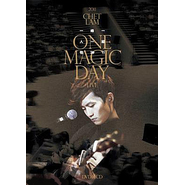

一峰一人一结他2011音乐会 One Magic Day Live
============================

|  |  |
| :--: | :-- |
| [ 一峰一人一结他2011音乐会 One Magic Day Live](https://emumo.xiami.com/album/490310) | **艺人**: [林一峰](../index.md) **语种**: 粤语 **唱片公司**: LYFE **发行时间**: 2012年01月04日 **专辑类别**: 现场专辑 **专辑风格**: 粤语流行 Cantopop **播放数**: 152524 **收藏数**: 297 **评论数**: 33  |

## 简介

一峰一人一结他2011音乐会 2011 Chet Lam One Magic Day Live DVD + CD   
收录音乐会现场演出二十五首精选歌:   
特别推荐: Trust/ 盛女/ 再见小王子/天涯孤客   
  
随DVD附送三首原装MV包括「错得对」「回到花开的那天」「天涯孤客」  
  

DVD曲目
 

01. 离开是为了回来Leaving is for Coming Back
 

02. 突然独身Suddenly Single
 

03. 留下脚印 带走回忆Leaving Footprints, Taking Memories
 

04. Back to the Stars
 

05. Trust
 

06. 一支烟的时间One Cigarette's Time
 

07. 简单不简单Simple, Not Simple
 

08. 五星级的家 5 Star Home
 

09. 梦中天使Daddy Long Legs
 

10. Handsome Smart &amp; Nice
 

11. 盛女Rich Girls
 

12. 19
 

13. 再见小王子Farewell, Little Prince
 

14. 天涯孤客The Lone Traveller
 

15. Moon Over Bourbon Street
 

16. Give Me True Blood
 

17. After the Pain
 

18. 未完舞曲Never Ending Sonata
 

19. In Love Again
 

20. It Might be You
 

21. Choice
 

22. 错得对
 

23. 雪糕车
 

24. One Magic Picture Project
 

25. The Best is Yet to Come
 

  
Bonus Music Videos
 

26. 错得对Right Kind of Wrongs / Directed by LoWing
 

27. 回到花开的那天 Back to the First Day the Flowers Bloomed / Directed by Kit Hung
 

28. 天涯孤客The Lone Traveller / Directed by Kit Hung

## 曲目

- [离开是为了回来(live)MV](./490310/b1pTNQa42940.md)
- [回到花开的那天(live)MV](./490310/mQAWhX54ffc.md)
- [一支烟的时间(live)MV](./490310/xLvUW8cd963.md)
- [Trust(live)](./490310/mQAWhZ591c2.md)
- [19(live)](./490310/bCkEMEE45223.md)
- [Moon Over (live)Bourbon Street](./490310/xLvUWBd640b.md)
- [未完舞曲(live)](./490310/xLvUWCda484.md)
- [In Love Again(live)](./490310/mQAWid723a8.md)
- [错得对(live)MV](./490310/8GgTLo1dcc2.md)
- [雪糕车(live)MV](./490310/bCkEMEJ6de0f.md)
- [The Best is Yet to Come(live)MV](./490310/mQAWig8a3b9.md)
- [盛女(Studio Version)](./490310/xLvUWHcdbb0.md)

## 评论

|  |  |  |  |
| :-- | :-- | :-- | :-- |
|  [虾米用户](https://emumo.xiami.com/u/5433121)  2013-11-30 11:16 赞(0) 踩(0) | 
disc2 呢？！
 |
| ⇒ |  [虾米用户](https://emumo.xiami.com/u/1489937)  2020-10-27 08:55 赞(0) 踩(0) | 
vcd、dvd是25首歌，CD只有12首歌
 |
|  [虾米用户](https://emumo.xiami.com/u/9323372)  2013-02-12 21:49 赞(0) 踩(0) | 
节奏好,歌词写得好,不错的结他.
 |
|  [虾米用户](https://emumo.xiami.com/u/4833350)   2012-12-10 00:23 赞(1) 踩(0) | 
共你竟可这么近同时那么远...仅纪念昨晚的梦
 |
|  [虾米用户](https://emumo.xiami.com/u/5441715)  2012-09-22 21:03 赞(1) 踩(0) | 
超爱这首Moon Over Bourbon Street ，还想听现场，一峰的声音真的是我们的恩泽
 |
|  [虾米用户](https://emumo.xiami.com/u/1299485)  2012-04-20 01:29 赞(0) 踩(0) | 
不错！值得推荐
 |
|  [虾米用户](https://emumo.xiami.com/u/1438878)  2012-04-11 15:30 赞(0) 踩(0) | 
真的很不錯
 |
|  [虾米用户](https://emumo.xiami.com/u/2500816)  2012-03-17 14:33 赞(0) 踩(0) | 
还想听林一峰的现场=_=
 |
|  [虾米用户](https://emumo.xiami.com/u/2628338) 人生是场旅行 2012-03-13 02:06 赞(0) 踩(0) | 
才子配佳音。
 |
|  [虾米用户](https://emumo.xiami.com/u/85865)  2012-03-10 00:55 赞(0) 踩(0) | 
半夜聽。。想起陶子說看我的樣子應該聽小清新。。其實我也是聽的啦－ ＝
 |
|  [虾米用户](https://emumo.xiami.com/u/7093091)  2012-03-05 22:12 赞(0) 踩(0) | 
好听不需要理由~
 |
|  [虾米用户](https://emumo.xiami.com/u/1763197) 竹鸢飞过的天空 2012-02-04 01:08 赞(0) 踩(0) | 
喜欢他的声线 特别的咬字 很感性
 |
|  [虾米用户](https://emumo.xiami.com/u/6343188)  2012-02-03 21:35 赞(0) 踩(0) | 
听了还想听
 |
|  [虾米用户](https://emumo.xiami.com/u/7898378)  2012-02-03 14:37 赞(0) 踩(0) | 
没有听过，想听听。
 |
|  [虾米用户](https://emumo.xiami.com/u/5454628) 我还没想好要写什么... 2012-02-03 10:08 赞(0) 踩(0) | 
果然演唱会超带感
 |
|  [虾米用户](https://emumo.xiami.com/u/3799074)  2012-02-02 23:52 赞(0) 踩(0) | 
独立音乐.
 |
|  [虾米用户](https://emumo.xiami.com/u/4788608) 世界太小，無處可滾。 2012-02-02 23:12 赞(0) 踩(0) | 
破碎了。
 |
|  [虾米用户](https://emumo.xiami.com/u/4302372)  2012-02-02 17:11 赞(0) 踩(0) | 
******
 |
|  [虾米用户](https://emumo.xiami.com/u/532661) 不要停止我的音乐 2012-02-02 16:03 赞(0) 踩(0) | 
d歌甘好听 竟然比到甘低分
 |
|  [虾米用户](https://emumo.xiami.com/u/6836190)  2012-02-02 14:03 赞(0) 踩(0) | 
一峰一人一结他, 就是最林一峰的配搭了
 |
|  [虾米用户](https://emumo.xiami.com/u/991843)   2012-02-02 11:50 赞(0) 踩(0) | 
ddd
 |
|  [虾米用户](https://emumo.xiami.com/u/1943051)  2012-02-02 10:43 赞(0) 踩(0) | 
听他第一首歌是和人合唱的桂花酿。然后就喜欢了。
 |
|  [虾米用户](https://emumo.xiami.com/u/5894238)  2012-02-02 09:33 赞(0) 踩(0) | 
always love Chet Lam
 |
|  [虾米用户](https://emumo.xiami.com/u/991843)   2012-02-02 08:56 赞(0) 踩(0) | 
轻松的节奏。。舒服。。
 |
|  [虾米用户](https://emumo.xiami.com/u/846569)  2012-02-01 23:43 赞(0) 踩(0) | 
噢哦哦哦哦哦  Moon Over Bourbon Street 太好听~
 |
|  [虾米用户](https://emumo.xiami.com/u/52165)  2012-02-01 23:12 赞(0) 踩(0) | 
这些歌能勾出往事 。我记得的。我怕我不记得的。。
 |
|  [虾米用户](https://emumo.xiami.com/u/846212)   2012-02-01 19:53 赞(0) 踩(0) | 
Chet Lam One Magic Day Live
 |
|  [虾米用户](https://emumo.xiami.com/u/829015)  2012-02-01 17:21 赞(0) 踩(0) | 
也许一天，一切都要变，身边一切都会变
 |
| ⇒ |  [虾米用户](https://emumo.xiami.com/u/51800191)  2015-08-27 20:57 赞(0) 踩(0) | 
你我不变呵呵
 |
|  [虾米用户](https://emumo.xiami.com/u/468670)  2012-02-01 13:43 赞(0) 踩(0) | 
不错~~
 |
|  [虾米用户](https://emumo.xiami.com/u/1340135)  2012-02-01 12:12 赞(0) 踩(0) | 
聽下歌。拍下拖。咪再念咁多。
 |
|  [虾米用户](https://emumo.xiami.com/u/7851532)  2012-02-01 11:51 赞(0) 踩(0) | 
000000
 |
|  [虾米用户](https://emumo.xiami.com/u/7318812)  2012-01-31 21:55 赞(0) 踩(0) | 
o
 |
