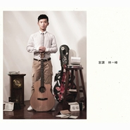

家课Homework
============================

|  |  |
| :--: | :-- |
| [ 家课Homework](https://emumo.xiami.com/album/501787) | **艺人**: [林一峰](../index.md) **语种**: 粤语 **唱片公司**: LYFE **发行时间**: 2012年03月27日 **专辑类别**: 精选集 **专辑风格**: 粤语流行 Cantopop **播放数**: 1311086 **收藏数**: 1180 **评论数**: 152  |

## 简介

林一峰 – 首张新曲+精选《家课 Homework》2CD。  
包括收录全新作品： “向着阳光”、 “清水”、 “思路”…等。  
重新混音:  “青草地 溪水旁 (自游Version)”、 “今天应该更高兴 (Confession Version)”、“花月楼 (樱花抉 2012)”、 “刚点起烟车就来($1500 Version)” …等。  
香港故事，旅行思考，生活艺术，十年思路，三十首歌，三十段思想章节，尽在＜家课＞！

## 曲目

- [雪糕车MVIce-cream Van](./501787/mQB0WK6c571.md)
- [离开是为了回来MVLeaving is for Coming Back](./501787/xLwzLvd3c0d.md)
- [游子意MVA Traveller's Heart](./501787/mQB0WM77af2.md)
- [涂城记MVThe Balled of Kowloon King](./501787/mQB0WN5267d.md)
- [简单不简单Simple, Not Simple](./501787/mQB0WO7b930.md)
- [青草地 溪水旁 (自游Version)MVOn the Lawn, By the Stream](./501787/mQB0WP768ab.md)
- [刚点起烟车就来 ($1500 Version)Choices and Chances](./501787/xLwzL0b9373.md)
- [一支烟的时间MVOne Cigarette's Time](./501787/bqvjtQv3a87e.md)
- [未完舞曲 (Cantata Version)Never Ending Cantata](./501787/mQB0WS74c9c.md)
- [花月楼 (樱花诀 2012)Moon Flower Mansion](./501787/xLwzL311c5a.md)
- [今天应该更高兴 (Confession Version)Today](./501787/8GhyAe1d37a.md)
- [The Best is Yet to ComeMV](./501787/8GhyAfe5286.md)
- [维多利亚MVVictoria](./501787/mQB0WW83a85.md)
- [红河村MVRed River Valley](./501787/mQB0WX4e0a1.md)
- [活下来 (Keep Rolling Version)Live On](./501787/mQB0WY5894d.md)
- [思路Riddles of the Road](./501787/xLwzL9b31a3.md)
- [好天气Good Weather](./501787/xLwzLAa44b8.md)
- [CL411 (Take Flight Version)](./501787/JASxyL24d18.md)
- [Just a Little Longer](./501787/xLwzLCdad3e.md)
- [重回布拉格MVBack yo Prague](./501787/8GhyAnf0c39.md)
- [时间河 (Delta Version)Time's River](./501787/xLwzLEc68dd.md)
- [烟圈和肥皂泡Smoke Rings and Soap Bubbles](./501787/mQB0Xf89336.md)
- [19](./501787/8GhyAqe8dc9.md)
- [给最开心的人To the Happiest One](./501787/mQB0Xh7c05b.md)
- [向着阳光MVFacing the Sun](./501787/xLwzLIbee83.md)
- [In Love Again](./501787/8GhyAtebe93.md)
- [冷热之间MVAll This Time](./501787/8GhyAue4412.md)
- [回到花开的那天MVBack to the First Day Our Flowers Bloomed](./501787/b1pUsFp3eca0.md)
- [一峰一人一结他The Balled of CL](./501787/xLwzLM9e24a.md)
- [清水MVPure Water](./501787/xLwzLNb7540.md)

## 评论

|  |  |  |
| :-- | :-- | :-- |
|  [虾米用户](https://emumo.xiami.com/u/343846685) 多听歌多享受，少虚度少负... 2018-10-09 20:33 赞(0) 踩(0) | 
三大平台都不能听，所以真不懂发生了啥
 |
|  [虾米用户](https://emumo.xiami.com/u/5821359)  2017-10-27 23:09 赞(1) 踩(0) | 
虽然不怎么喜欢听粤语歌曲，但是林一峰的声音很是迷人，清新的曲调，一如既往的自由自在。
 |
|  [虾米用户](https://emumo.xiami.com/u/275656542)  2017-04-25 09:43 赞(2) 踩(0) | 
总听不厌的一张专辑
 |
|  [虾米用户](https://emumo.xiami.com/u/5979482)  2016-02-17 09:41 赞(0) 踩(0) | 
喜欢！
 |
|  [虾米用户](https://emumo.xiami.com/u/5979482)  2016-02-17 09:40 赞(0) 踩(0) | 
喜欢!
 |
|  [虾米用户](https://emumo.xiami.com/u/47200) 音乐，生活的某一部分！ 2014-05-20 10:41 赞(0) 踩(0) | 
收藏下林一峰！
 |
|  [虾米用户](https://emumo.xiami.com/u/6132670)  2013-10-28 11:30 赞(1) 踩(0) | 
听听小清新调节下情绪~
 |
|  [虾米用户](https://emumo.xiami.com/u/2417910)  2013-01-02 15:16 赞(2) 踩(0) | 
听的第一首歌是这张精选里的《清水》，太打动我了，相见恨晚的感觉。
 |
| ⇒ |  [虾米用户](https://emumo.xiami.com/u/2445240) 且歌且行 2013-02-11 02:13 赞(0) 踩(0) | 
那不是《花决》专辑里面么...
 |
| ⇒ |  [虾米用户](https://emumo.xiami.com/u/3498915) 生活旅人 2013-03-05 11:01 赞(0) 踩(0) | 
<q><b>哲说：</b></q>
 |
| ⇒ |  [虾米用户](https://emumo.xiami.com/u/51800191)  2015-08-18 15:20 赞(0) 踩(0) | 
您好
 |
|  [虾米用户](https://emumo.xiami.com/u/7018868) 直觉之花 2012-11-17 22:59 赞(0) 踩(0) | 
就是喜欢撒
 |
|  [虾米用户](https://emumo.xiami.com/u/2929025)  2012-11-10 19:07 赞(0) 踩(0) | 
无左初恋?
 |
|  [虾米用户](https://emumo.xiami.com/u/5771355)  2012-10-26 17:44 赞(1) 踩(0) | 
一张熬过一个下昼的专辑
 |
|  [虾米用户](https://emumo.xiami.com/u/9785947)  2012-07-24 13:49 赞(0) 踩(0) | 
十分喜歡
 |
|  [虾米用户](https://emumo.xiami.com/u/4217872)  2012-06-15 11:24 赞(1) 踩(0) | 
诚意之作
 |
|  [虾米用户](https://emumo.xiami.com/u/3330032)  2012-06-05 13:30 赞(0) 踩(0) | 
想听
 |
|  [虾米用户](https://emumo.xiami.com/u/4163429)  2012-04-29 11:45 赞(0) 踩(0) | 
想听
 |
|  [虾米用户](https://emumo.xiami.com/u/853851)  2012-04-25 12:28 赞(1) 踩(0) | 
不知为嘛，就想 @ 你了亲～～～～～@啊X人 这几天打开微博，好多都是 林夕跟黄耀明，我又想 @ 你了亲，那般如此所谓 爱 啊啊啊啊啊啊啊啊啊啊啊啊啊啊啊啊啊啊啊啊啊啊啊啊啊亲～
 |
|  [虾米用户](https://emumo.xiami.com/u/7890771)  2012-04-25 10:29 赞(1) 踩(0) | 
这么多年喜欢的歌竟然基本都在了，勾起了很多回忆也带来久违的惊喜。
 |
|  [虾米用户](https://emumo.xiami.com/u/7890771)  2012-04-25 10:28 赞(0) 踩(0) | 
这么多年喜欢的歌大都都在了。
 |
|  [虾米用户](https://emumo.xiami.com/u/1319316)  2012-04-25 08:52 赞(0) 踩(0) | 
十年精品，不可错过
 |
|  [虾米用户](https://emumo.xiami.com/u/8882898) 你在那裡~我馬上过來~ 2012-04-25 07:26 赞(0) 踩(0) | 
喜欢~好听~~
 |
|  [虾米用户](https://emumo.xiami.com/u/8855097)  2012-04-25 05:49 赞(0) 踩(0) | 
大爱林一峰
 |
|  [虾米用户](https://emumo.xiami.com/u/8982824)  2012-04-25 02:18 赞(2) 踩(0) | 
温暖港式情歌
 |
|  [虾米用户](https://emumo.xiami.com/u/8159680)  2012-04-25 00:58 赞(0) 踩(0) | 
喜欢！好听！可惜看不到歌词，谢谢虾米网了。
 |
|  [虾米用户](https://emumo.xiami.com/u/8558548)  2012-04-24 18:36 赞(0) 踩(0) | 
喜歡沒道理..
 |
|  [虾米用户](https://emumo.xiami.com/u/3211402)  2012-04-24 17:47 赞(1) 踩(0) | 
新歌加精选 没有一丝距离感 旧曲新歌都随着轻轻的哼唱 唱成若有似无但婉转动人的背景声
 |
|  [虾米用户](https://emumo.xiami.com/u/8545218) 我爱音乐。 2012-04-24 17:33 赞(1) 踩(0) | 
林一峰最新温情专辑，真是精品，真心推荐~！
 |
|  [虾米用户](https://emumo.xiami.com/u/1996116)  2012-04-24 13:30 赞(0) 踩(0) | 
熟悉的回忆感
 |
|  [虾米用户](https://emumo.xiami.com/u/570970)  2012-04-23 23:24 赞(1) 踩(0) | 
林一峰的声音依旧清新
 |
|  [虾米用户](https://emumo.xiami.com/u/8968856)  2012-04-23 19:07 赞(0) 踩(0) | 
1张碟这么多歌好厉害的林1峰
 |
|  [虾米用户](https://emumo.xiami.com/u/7093091)  2012-04-23 17:41 赞(0) 踩(0) | 
nicc music
 |
|  [虾米用户](https://emumo.xiami.com/u/8967654) Up the air. 2012-04-23 16:34 赞(0) 踩(0) | 
喜欢林1峰
 |
|  [虾米用户](https://emumo.xiami.com/u/7663155)  2012-04-23 14:21 赞(0) 踩(0) | 
~
 |
|  [虾米用户](https://emumo.xiami.com/u/3496718) idle space 2012-04-23 09:34 赞(0) 踩(0) | 
雪糕车想起了很多~~
 |
|  [虾米用户](https://emumo.xiami.com/u/4712851)  2012-04-22 22:13 赞(1) 踩(0) | 
淡淡的吉他,轻柔的声音,遥远的记忆
 |
|  [虾米用户](https://emumo.xiami.com/u/6441126) 微博/chiu0806 2012-04-22 10:16 赞(0) 踩(0) | 
小清新,我中意
 |
|  [虾米用户](https://emumo.xiami.com/u/8819856)  2012-04-22 02:58 赞(0) 踩(0) | 
静静的荡漾在乐海中
 |
|  [虾米用户](https://emumo.xiami.com/u/5047230)  2012-04-22 01:13 赞(1) 踩(0) | 
任何时候听林一峰 心情都变好。
 |
|  [虾米用户](https://emumo.xiami.com/u/1668227)  2012-04-21 22:35 赞(1) 踩(0) | 
一峰依然大好
 |
|  [虾米用户](https://emumo.xiami.com/u/1668227)  2012-04-21 22:30 赞(0) 踩(0) | 
一峰依然大好。
 |
|  [虾米用户](https://emumo.xiami.com/u/6136136)  2012-04-21 20:58 赞(0) 踩(0) | 
红绿灯飞机一起跳 你出包我出剪他有 Dub 输赢继续笑
 |
| ⇒ |  [虾米用户](https://emumo.xiami.com/u/51800191)  2015-08-18 15:23 赞(0) 踩(0) | 
您好朋友
 |
|  [虾米用户](https://emumo.xiami.com/u/1212938) 失去是为了得到 2012-04-21 18:21 赞(1) 踩(0) | 
超级好听 超级文艺 超级怀念 歌词尤其好
 |
|  [虾米用户](https://emumo.xiami.com/u/3755802) 看，我那颗行星，他恰好在... 2012-04-21 10:11 赞(1) 踩(0) | 
一峰新歌+精选，淡淡春日暖阳，和风中细听~~~
 |
|  [虾米用户](https://emumo.xiami.com/u/546473)  2012-04-20 19:48 赞(0) 踩(0) | 
－  －为什么虾米每次都要问这种213的问题呢？
 |
| ⇒ |  [虾米用户](https://emumo.xiami.com/u/3625455) 喵星球的普通喵 2012-04-21 09:23 赞(0) 踩(0) | 
虾米问题啊？
 |
|  [虾米用户](https://emumo.xiami.com/u/3625455) 喵星球的普通喵 2012-04-20 18:45 赞(0) 踩(0) | 
声音，你懂得。
 |
|  [虾米用户](https://emumo.xiami.com/u/262632)  2012-04-20 16:24 赞(0) 踩(0) | 
封面有爱！
 |
|  [虾米用户](https://emumo.xiami.com/u/5901789) wechat：chanj... 2012-04-20 15:05 赞(0) 踩(0) | 
好好听
 |
|  [虾米用户](https://emumo.xiami.com/u/2881746)  2012-04-20 14:39 赞(0) 踩(0) | 
就是有那种感觉，不浓不烈，不急不缓，有自己在
 |
|  [虾米用户](https://emumo.xiami.com/u/2881746)  2012-04-20 14:34 赞(0) 踩(0) | 
victoria
 |
|  [虾米用户](https://emumo.xiami.com/u/8911246)  2012-04-20 11:54 赞(0) 踩(0) | 
听听
 |
|  [虾米用户](https://emumo.xiami.com/u/2464438) music随心 2012-04-20 11:22 赞(0) 踩(0) | 
林一峰独特的风格
 |
|  [虾米用户](https://emumo.xiami.com/u/6811702)  2012-04-20 10:16 赞(0) 踩(0) | 
林一峰总是不一样的
 |
|  [虾米用户](https://emumo.xiami.com/u/4192914)  2012-04-20 10:12 赞(0) 踩(0) | 
林生真是我的茶
 |
| ⇒ |  [虾米用户](https://emumo.xiami.com/u/51800191)  2015-08-18 15:23 赞(0) 踩(0) | 
你好哈哈亲吻他
 |
|  [虾米用户](https://emumo.xiami.com/u/8813092)  2012-04-20 06:50 赞(0) 踩(0) | 
随便听的 粤语听不懂正好可以当背景音乐了
 |
|  [虾米用户](https://emumo.xiami.com/u/1299485)  2012-04-20 01:27 赞(0) 踩(0) | 
好听！赞！：）
 |
|  [虾米用户](https://emumo.xiami.com/u/2158446)  2012-04-19 22:59 赞(0) 踩(0) | 
邻家大男孩儿的感觉
 |
|  [虾米用户](https://emumo.xiami.com/u/398710)   2012-04-19 21:44 赞(0) 踩(0) | 
还没听呢，先收着
 |
|  [虾米用户](https://emumo.xiami.com/u/7927769)  2012-04-19 15:28 赞(0) 踩(0) | 
好舒服[微风]
 |
|  [虾米用户](https://emumo.xiami.com/u/5194563)  2012-04-19 12:54 赞(0) 踩(0) | 
试一试，就因是粤语。
 |
|  [虾米用户](https://emumo.xiami.com/u/2666684)  2012-04-19 08:14 赞(0) 踩(0) | 
選的歌都狠對味~
 |
|  [虾米用户](https://emumo.xiami.com/u/6349394)  2012-04-18 23:44 赞(0) 踩(0) | 
好听
 |
|  [虾米用户](https://emumo.xiami.com/u/8022426)  2012-04-18 21:14 赞(0) 踩(0) | 
就现在的心情 。
 |
|  [虾米用户](https://emumo.xiami.com/u/667550) 典型的巨蟹，不典型的A型 2012-04-18 16:00 赞(0) 踩(0) | 
不错的。
 |
|  [虾米用户](https://emumo.xiami.com/u/959976)  2012-04-18 14:47 赞(0) 踩(0) | 
哇，林一峰出合辑了，都是曾经喜欢的歌。
 |
|  [虾米用户](https://emumo.xiami.com/u/8427588)  2012-04-18 10:31 赞(0) 踩(0) | 
很干净的声音~@凤凰浮豆腐
 |
|  [虾米用户](https://emumo.xiami.com/u/2655321)  2012-04-17 20:52 赞(0) 踩(0) | 
在最低落的日子听到最爱的
 |
|  [虾米用户](https://emumo.xiami.com/u/3427467) 喜欢一个倔强的女孩儿 2012-04-17 20:03 赞(0) 踩(0) | 
嗓音不错！！！！惊喜
 |
|  [虾米用户](https://emumo.xiami.com/u/8806948)  2012-04-17 13:44 赞(0) 踩(0) | 
只听了个前奏就决定喜欢他了~~
 |
|  [虾米用户](https://emumo.xiami.com/u/3745622) 暂无签名~ 2012-04-17 09:45 赞(0) 踩(0) | 
要相信，活著就能遇到好事情~
 |
|  [虾米用户](https://emumo.xiami.com/u/1229271)  2012-04-17 08:10 赞(0) 踩(0) | 
很清新的一首粤语专辑
 |
|  [虾米用户](https://emumo.xiami.com/u/1523524)  2012-04-16 22:15 赞(0) 踩(0) | 
一张干净，清新的粤语专辑啊！
 |
|  [虾米用户](https://emumo.xiami.com/u/5808546)  2012-04-16 22:06 赞(0) 踩(0) | 
干净~~舒服的声音~
 |
|  [虾米用户](https://emumo.xiami.com/u/5808546)  2012-04-16 22:06 赞(0) 踩(0) | 
好干净好耐听！！爱死他了~
 |
|  [虾米用户](https://emumo.xiami.com/u/8183241)  2012-04-16 14:44 赞(0) 踩(0) | 
舒服，温暖的声音
 |
|  [虾米用户](https://emumo.xiami.com/u/1463117)  2012-04-16 14:41 赞(0) 踩(0) | 
离开是为了回来
 |
|  [虾米用户](https://emumo.xiami.com/u/7926699)  2012-04-16 14:34 赞(0) 踩(0) | 
收藏吧！http://**/7pBl1
 |
|  [虾米用户](https://emumo.xiami.com/u/7066128)   2012-04-16 09:56 赞(0) 踩(0) | 
爱
 |
|  [虾米用户](https://emumo.xiami.com/u/1870223)  2012-04-15 23:47 赞(0) 踩(0) | 
他不是牛奶，不是咖啡，是在你需要的时候随手可得的一杯温开水。说不清有多喜欢，可你总是会想起他，口渴想他，无聊想他，寂寞想他，因为他就住在你心底的最深处。
 |
| ⇒ |  [虾米用户](https://emumo.xiami.com/u/51800191)  2015-08-18 15:24 赞(0) 踩(0) | 
你好
 |
|  [虾米用户](https://emumo.xiami.com/u/4162452)  2012-04-15 22:45 赞(0) 踩(0) | 
他是懂点吉他喔
 |
|  [虾米用户](https://emumo.xiami.com/u/8186730) 爱死你了~ 2012-04-15 22:03 赞(0) 踩(0) | 
他的吉他很赞
 |
|  [虾米用户](https://emumo.xiami.com/u/641194) 业精于勤 2012-04-15 20:28 赞(0) 踩(0) | 
我是2建。无人能敌，谁与争锋？
 |
|  [虾米用户](https://emumo.xiami.com/u/4719200)  2012-04-15 18:42 赞(0) 踩(0) | 
动人 动听
 |
|  [虾米用户](https://emumo.xiami.com/u/7325463)  2012-04-15 17:22 赞(0) 踩(0) | 
一如既往的舒服温暖的声音
 |
|  [虾米用户](https://emumo.xiami.com/u/105101)  2012-04-15 11:31 赞(0) 踩(0) | 
不矫情
 |
|  [虾米用户](https://emumo.xiami.com/u/105101)  2012-04-15 11:31 赞(0) 踩(0) | 
不矫情
 |
|  [虾米用户](https://emumo.xiami.com/u/8865139)  2012-04-14 21:35 赞(0) 踩(0) | 
林1峰把声好有感觉
 |
|  [虾米用户](https://emumo.xiami.com/u/538044)  2012-04-14 20:23 赞(0) 踩(0) | 
很久不听林一峰。
 |
|  [虾米用户](https://emumo.xiami.com/u/4727463)  2012-04-14 09:21 赞(0) 踩(0) | 
透明的声音。一峰回归
 |
| ⇒ |  [虾米用户](https://emumo.xiami.com/u/51800191)  2015-08-18 15:25 赞(0) 踩(0) | 
yeah
 |
|  [虾米用户](https://emumo.xiami.com/u/8311686)  2012-04-13 22:24 赞(0) 踩(0) | 
大爱
 |
|  [虾米用户](https://emumo.xiami.com/u/2230531)  2012-04-13 15:43 赞(0) 踩(0) | 
小清新啊有木有
 |
| ⇒ |  [虾米用户](https://emumo.xiami.com/u/829433) 暂无签名~ 2012-04-14 10:54 赞(0) 踩(0) | 
不止哦. 很喜欢他的花决那张.
 |
| ⇒ |  [虾米用户](https://emumo.xiami.com/u/2230531)  2012-04-15 20:57 赞(0) 踩(0) | 
<q><b>KiWii说：</b></q>
 |
|  [虾米用户](https://emumo.xiami.com/u/613438)  2012-04-13 13:43 赞(0) 踩(0) | 
一直都喜欢^-^
 |
|  [虾米用户](https://emumo.xiami.com/u/580324)  2012-04-13 07:52 赞(0) 踩(0) | 
上次听他的歌大概是一年之前了=3=  声音温柔也很清新
 |
|  [虾米用户](https://emumo.xiami.com/u/8843067)  2012-04-13 01:22 赞(0) 踩(0) | 
t1ngt1ng1a
 |
|  [虾米用户](https://emumo.xiami.com/u/5811951)  2012-04-12 22:21 赞(0) 踩(0) | 
轻松下
 |
|  [虾米用户](https://emumo.xiami.com/u/4876914) nobody 2012-04-12 22:06 赞(0) 踩(0) | 
林峰嘅声音好清新嘠啵~~~原来
 |
| ⇒ |  [虾米用户](https://emumo.xiami.com/u/3851702) 爱我就给我看你的播放列表 2012-04-13 15:03 赞(0) 踩(0) | 
他是林一峰...
 |
| ⇒ |  [虾米用户](https://emumo.xiami.com/u/4876914) nobody 2012-04-14 19:13 赞(0) 踩(0) | 
<q><b>royhui说：</b></q>
 |
|  [虾米用户](https://emumo.xiami.com/u/5670164)  2012-04-12 18:04 赞(0) 踩(0) | 
这是林一峰的世界。温和、诙谐的南方男人的世界。
 |
|  [虾米用户](https://emumo.xiami.com/u/6812719)  2012-04-12 16:30 赞(0) 踩(0) | 
一直都喜欢的声音。听到就觉得整个人都能安静起来。
 |
|  [虾米用户](https://emumo.xiami.com/u/138163)  2012-04-12 15:21 赞(0) 踩(0) | 
永远的治愈系啊
 |
|  [虾米用户](https://emumo.xiami.com/u/2451787)   2012-04-12 12:43 赞(0) 踩(0) | 
佢把声入边有种电音噶美妙~
 |
|  [虾米用户](https://emumo.xiami.com/u/3498915) 生活旅人 2012-04-12 11:25 赞(0) 踩(0) | 
就是很好听！
 |
|  [虾米用户](https://emumo.xiami.com/u/18786) 不是真的 2012-04-12 10:57 赞(0) 踩(0) | 
大爱的声音～
 |
|  [虾米用户](https://emumo.xiami.com/u/2572478)  2012-04-11 23:46 赞(0) 踩(0) | 
粤语中的文艺范儿
 |
|  [虾米用户](https://emumo.xiami.com/u/1844) 农夫 山泉 有点田 2012-04-11 22:38 赞(0) 踩(0) | 
林生，生快！
 |
|  [虾米用户](https://emumo.xiami.com/u/1366721)  2012-04-11 16:48 赞(0) 踩(0) | 
迷住了/顷刻开心了/每当听到雪糕车靠近/功课也溶掉
 |
|  [虾米用户](https://emumo.xiami.com/u/5883942)  2012-04-11 16:01 赞(0) 踩(0) | 
大爱林一峰～～～喜欢cheer的，喜欢品冠的都可以听听！
 |
|  [虾米用户](https://emumo.xiami.com/u/8412226)  2012-04-11 15:42 赞(0) 踩(0) | 
hao ting
 |
|  [虾米用户](https://emumo.xiami.com/u/2847505) 很久却只过半年 2012-04-11 15:30 赞(0) 踩(0) | 
又听这么温暖的声音 离开是为了回来
 |
|  [虾米用户](https://emumo.xiami.com/u/1438878)  2012-04-11 15:26 赞(0) 踩(0) | 
生日快乐！！！！
 |
|  [虾米用户](https://emumo.xiami.com/u/3490910) 清风徐来 2012-04-11 13:16 赞(0) 踩(0) | 
小个子的欢快
 |
|  [虾米用户](https://emumo.xiami.com/u/6697487)   2012-04-11 12:44 赞(0) 踩(0) | 
#爱音乐♬爱嗓音#
 |
|  [虾米用户](https://emumo.xiami.com/u/574193) 不以物喜不以己悲 2012-04-11 12:21 赞(0) 踩(0) | 
听林一峰的精选集不如听他单独的每张专辑。
 |
| ⇒ |  [虾米用户](https://emumo.xiami.com/u/51800191)  2015-08-18 15:26 赞(0) 踩(0) | 
为何？
 |
| ⇒ |  [虾米用户](https://emumo.xiami.com/u/51800191)  2015-08-18 15:26 赞(0) 踩(0) | 
为何？
 |
|  [虾米用户](https://emumo.xiami.com/u/8310957)  2012-04-11 10:24 赞(0) 踩(0) | 
怎么没有  上一次流泪  啊
 |
|  [虾米用户](https://emumo.xiami.com/u/449) 天凉好个秋 2012-04-11 10:18 赞(0) 踩(0) | 
今日411 当然那要听林一峰！
 |
|  [虾米用户](https://emumo.xiami.com/u/5441715)  2012-04-11 09:26 赞(0) 踩(0) | 
大爱林一峰的音乐
 |
|  [虾米用户](https://emumo.xiami.com/u/5441715)  2012-04-11 09:25 赞(0) 踩(0) | 
听听看，希望一峰有新的突破~
 |
|  [虾米用户](https://emumo.xiami.com/u/991843)   2012-04-11 08:49 赞(0) 踩(0) | 
大爱
 |
|  [虾米用户](https://emumo.xiami.com/u/652547)  2012-04-11 00:39 赞(0) 踩(0) | 
一峰一人一结他
 |
|  [虾米用户](https://emumo.xiami.com/u/1672204) All my dream... 2012-04-10 23:24 赞(0) 踩(0) | 
很多很喜欢的o(*￣▽￣*)o
 |
|  [虾米用户](https://emumo.xiami.com/u/1579515)   2012-04-10 23:19 赞(0) 踩(0) | 
很喜欢....
 |
|  [虾米用户](https://emumo.xiami.com/u/1078665) 我还没想好要写什么... 2012-04-10 22:52 赞(0) 踩(0) | 
一直都喜欢。
 |
|  [虾米用户](https://emumo.xiami.com/u/290444)  2012-04-10 22:42 赞(0) 踩(0) | 
留着以后慢慢听
 |
|  [虾米用户](https://emumo.xiami.com/u/664700) 音楽と喫茶店:) 2012-04-10 22:32 赞(0) 踩(0) | 
新专辑不错的说 有老歌也有新歌
 |
|  [虾米用户](https://emumo.xiami.com/u/153926)  2012-04-10 22:23 赞(0) 踩(0) | 
港产小清新
 |
|  [虾米用户](https://emumo.xiami.com/u/3406035)  2012-04-10 22:01 赞(0) 踩(0) | 
又发片啦
 |
|  [虾米用户](https://emumo.xiami.com/u/407660) 再也瘦不下来了好忧桑。 2012-04-10 21:19 赞(0) 踩(0) | 
声音很温柔
 |
|  [虾米用户](https://emumo.xiami.com/u/6943826)  2012-04-10 20:38 赞(0) 踩(0) | 
舒服的聲音
 |
|  [虾米用户](https://emumo.xiami.com/u/2831397)  2012-04-10 18:12 赞(0) 踩(0) | 
不矫情的声音
 |
| ⇒ |  [虾米用户](https://emumo.xiami.com/u/51800191)  2015-08-18 15:26 赞(0) 踩(0) | 
哈哈
 |
|  [虾米用户](https://emumo.xiami.com/u/925390)  2012-04-10 17:45 赞(0) 踩(0) | 
旧作品真好听····
 |
|  [虾米用户](https://emumo.xiami.com/u/3192410)  2012-04-10 17:36 赞(0) 踩(0) | 
@核桃508~~
 |
|  [虾米用户](https://emumo.xiami.com/u/3430871) 暂无签名~ 2012-04-10 17:19 赞(0) 踩(0) | 
O(∩_∩)O
 |
|  [虾米用户](https://emumo.xiami.com/u/3403561)  2012-04-10 17:13 赞(0) 踩(0) | 
******
 |
|  [虾米用户](https://emumo.xiami.com/u/1258427)  2012-04-10 16:43 赞(0) 踩(0) | 
回忆
 |
|  [虾米用户](https://emumo.xiami.com/u/844054)  2012-04-10 16:02 赞(0) 踩(0) | 
@小刚是平头
 |
|  [虾米用户](https://emumo.xiami.com/u/23628)  2012-04-04 23:57 赞(0) 踩(0) | 
挺喜欢他和妹妹组合的 my little airport~支持
 |
| ⇒ |  [虾米用户](https://emumo.xiami.com/u/3498915) 生活旅人 2012-04-05 02:51 赞(0) 踩(0) | 
mla不是他们～是阿p还有nicale，mla和林一峰只是合作出过专辑～
 |
| ⇒ |  [虾米用户](https://emumo.xiami.com/u/23628)  2012-04-06 03:37 赞(0) 踩(0) | 
<q><b>Pal Tsin说：</b></q>
 |
|  [虾米用户](https://emumo.xiami.com/u/3498915) 生活旅人 2012-03-31 02:12 赞(0) 踩(0) | 
什么时候才能听啊～～着急了好不好！！！！
 |
|  [虾米用户](https://emumo.xiami.com/u/462127)  2012-03-24 18:27 赞(0) 踩(0) | 
好~~~~~想听~~！
 |
