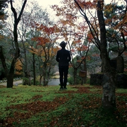

爱郧书I Love You Best 
============================

|  |  |
| :--: | :-- |
| [ 爱郧书I Love You Best ](https://emumo.xiami.com/album/541750) | **艺人**: [林一峰](../index.md) **语种**: 粤语 **唱片公司**: LYFE **发行时间**: 2012年09月11日 **专辑类别**: 录音室专辑 **专辑风格**: 粤语流行 Cantopop **播放数**: 262951 **收藏数**: 593 **评论数**: 53  |

## 简介

林一峰第十二张专辑《爱郧书》，以他的偶像徐小凤的真名“徐郧书”命名，向这位香港乐坛传奇歌手致敬。曾于公开演唱徐小凤名曲的一峰，今回更将15首经典作品经重新编曲并谱上新词，配上简简单单的木结他演奏和和声，把《双城记》、《人似浪花》和《流下眼泪前》演绎出不一样的味道，希望让更多年轻的乐迷进一步认识当代香港粤语乐坛的文化和变千。   
  

波波裙背后的世界 - 有关＜爱郧书＞  
　　＜爱郧书＞是林一峰第十二张个人专辑，是一个由经典香港歌手徐小凤的歌词出发，重索今天城市面貌的案子。林一峰与小凤姐是两类绝对截然不同的歌手，但他们各自演绎的歌里，却有两个共通点：城市人的生存艺术，与及旅途上的漂泊感。  
　　＜爱郧书＞是一个 由歌词出发，用经典的精神重索今天城市面貌的案子。许多听众对小凤姐的第一印象，就是她竖立了影响整个华人流行乐坛的演唱会文化，还有她的波点裙，金光灿烂，顺流逆流，风的季节…… 却很少人会研究她的选曲及歌词；&lt;爱郧书&gt;希望做到的，就是让听众重新认识这些作品，感受到这些歌在香港及粤语歌历史上所代表的意义，与及明 白她们跨越了时代的影响力。  
　　小凤姐的选曲主要可以从歌词分做三个系列：人在异乡的漂泊感（如＜漫天风雨＞＜每日怀念你＞＜人似浪花＞），城市人的生存艺术（如＜风雨同路＞＜星光的背景影＞＜城市足印＞），与及好玩的派对歌曲（如＜喜气洋洋＞＜自己人＞）。  
　　她作品里的飘泊感一直延续到九十年代，让香港人普遍无根的感觉得到明白和安慰。这特点也出现在一峰的歌词创作里：＜重回布拉格＞就是＜每日怀念你＞的释然，＜活下来＞就是＜双城记＞大时代里的自处，＜青草地溪水旁＞／＜错得对＞就是＜随想曲＞里对生活上种种的反思。  
　　两个看似风马牛不相及的名字，就因为飘泊感和生存艺术，在音乐里连在一起。  
　　全碟收录精挑细选的十五首歌曲，其中有些作品里，一峰在不扭曲原本精神的大前提下，作出了一点点文字上的改动，希望更接近这个时代的语言，如主打歌＜双城记＞及＜黄沙万里＞。  
　　＜双城记＞  
　　愿你知生命起伏嘴脸转又转  
　　偶尔用点天真不怕凌乱  
　　历过冲动失望挣扎伤过变内敛  
　　你也有力量 还未耗损  
　　但我知世事每是失去了预算  
　　要接受的一刻哭笑难辨  
　　愿你记住往事就如一切也未变  
　　你会快乐地怀念昨天  
　　爱未变  
　　每一个时代变迁都能套用的＜双城记＞，一峰重写了部分正歌及副歌，原作词人之一向雪怀先生也曾公开表示支持一峰的改动。  
　　＜黄沙万里＞  
　　黄沙万里 执子之手  
　　随心随遇 解释不透  
　　人要离别 只可接受  
　　踏着陌路要放手  
　　黄沙没理 世态炎凉  
　　人踪无定 不拘方向  
　　熬过长夜 天总会亮  
　　风沙不休来和唱  
　　原作者卡龙先生在小凤姐的初发行唱片版本里，曾经为＜黄沙万里＞加上一个副题＜撒哈拉的故事＞，作为对作家三毛的同名作品的回应，主旨是乡愁和家；多年后， 一峰以另一个角度演绎沙漠和家，将重点放在旅途上，路就是家，寻找就是答案，而副题则演变成＜致鍊金术士＞，灵感则来自南美作家Paulo Coelho的作品＜The Alchemist＞。  
　　音乐新方向：＜黄沙万里＞里巧妙地融入了小凤姐两首明曲＜喜气洋洋＞和＜风的季节＞，一峰亦在土耳其首都伊斯坦堡的回教聚会中录下了回教徒的诵经吟唱，配合弹奏结他，划火柴，吹玻璃瓶等敲击作编曲，为中文音乐的新尝试。＜漫天风雨＞里一峰邀请了著名马头琴演奏家哈斯巴根，在北京录下了这个来自蒙古的古乐器，又找来荒井壮一郎敲击花盆鼓，营造出中文歌曲里少有的诡异凄美。＜梦飞行＞中，鬼才林敏聪有关梦与轮回的歌词，充满想象空间，为这全新编曲提供玩味性十分强的基础；荒井壮一郎的战鼓及来自世界各地的敲击乐器，在风琴与结他的底子下再添一分壮阔，这亦是一峰出道以来最疯狂的尝试。  
　　＜爱郧书＞希望做到的，就是让听众重新认识这些作品，感受到这些歌在香港及粤语歌历史上所代表的意义，与及明白她们跨越了时代的影响力。
 
  
Chet's 12th solo album, a tribute album to the legendary Hong Kong singer Paula Tsui   

 

<o:p></o:p>
 

<o:p></o:p>
 

## 曲目

- [不变的伴侣致炼金术士](./541750/mQDmTn759ac.md)
- [黄沙万里](./541750/JAUjuY1f662.md)
- [星光的背影](./541750/mQDmTp4cb1b.md)
- [梦飞行](./541750/mQDmTq57732.md)
- [变色感情](./541750/mQDmTr86e1f.md)
- [情比雨丝](./541750/mQDmTs73771.md)
- [无奈](./541750/b1pWeBx3f55a.md)
- [流下眼泪前](./541750/8Gjk64fcf81.md)
- [每日怀念你](./541750/JAUjvf223e3.md)
- [双城记](./541750/bqvlfMQ37cda.md)
- [漫天风雨](./541750/mQDmTx5fe86.md)
- [老人与海](./541750/mQDmTy82fed.md)
- [人似浪花](./541750/xLylHZb8034.md)
- [现在还算好](./541750/mQDmT06ca56.md)
- [城市足印](./541750/xLylIbcd91f.md)

## 评论

|  |  |  |
| :-- | :-- | :-- |
|  [虾米用户](https://emumo.xiami.com/u/2787415)  2016-10-11 07:36 赞(0) 踩(0) | 
徐小凤
 |
|  [虾米用户](https://emumo.xiami.com/u/2787415)  2016-10-11 07:36 赞(0) 踩(0) | 
徐小凤
 |
|  [虾米用户](https://emumo.xiami.com/u/9229239)  2016-06-22 22:59 赞(1) 踩(0) | 
翻唱歌、 ok
 |
|  [虾米用户](https://emumo.xiami.com/u/2898964)  2015-01-29 18:58 赞(0) 踩(0) | 
我愿像狂潮，歌声的哭与笑
 |
|  [虾米用户](https://emumo.xiami.com/u/6408044) 是个笨蛋。 2015-01-21 17:03 赞(0) 踩(0) | 
居然现在来爱上了这饼，虽然不是每首都能接受
 |
|  [虾米用户](https://emumo.xiami.com/u/8270213) 清净地 2014-05-03 17:01 赞(0) 踩(0) | 
每日怀念你 最爱一首
 |
|  [虾米用户](https://emumo.xiami.com/u/221849) 不聽音樂會死星人 2014-03-05 02:05 赞(3) 踩(0) | 
終於明白這張碟的名字涵義，原來【鄖書】是小鳳姐的真名。或許出於私心，又或個人感覺，總覺得這名字好有氣質。
 |
|  [虾米用户](https://emumo.xiami.com/u/221849) 不聽音樂會死星人 2014-03-05 01:58 赞(0) 踩(0) | 
終於明白這張碟的名字涵義，原來【鄖書】是小鳳姐的真名。或許出於私心，又或個人感覺，總覺得這名字好有氣質。
 |
|  [虾米用户](https://emumo.xiami.com/u/1609946) 一即一切 2014-03-02 06:40 赞(0) 踩(0) | 
心 境不二
 |
|  [虾米用户](https://emumo.xiami.com/u/1989162)  2013-07-15 22:42 赞(0) 踩(0) | 
sigh 无奈
 |
|  [虾米用户](https://emumo.xiami.com/u/8240839) ~~ 2013-05-24 12:30 赞(0) 踩(0) | 
最没创意的一张。
 |
|  [虾米用户](https://emumo.xiami.com/u/8244559)  2013-05-14 10:05 赞(0) 踩(0) | 
******
 |
|  [虾米用户](https://emumo.xiami.com/u/9139891) 与粤迷同在 2013-05-02 17:25 赞(0) 踩(0) | 
賞新
 |
|  [虾米用户](https://emumo.xiami.com/u/111193) 微信号toogo1 2013-03-08 21:39 赞(0) 踩(0) | 
好
 |
|  [虾米用户](https://emumo.xiami.com/u/627562)  2013-03-08 10:19 赞(0) 踩(0) | 
一峰的好作品
 |
|  [虾米用户](https://emumo.xiami.com/u/4488921)  2013-01-16 17:42 赞(0) 踩(0) | 
可能是才轉發歌手微博，所以記下了名字，當順序看到歌手大名時，心血來潮點進去；不懂粵語，但這張真好「聽」。
 |
|  [虾米用户](https://emumo.xiami.com/u/608298)  2013-01-04 23:53 赞(0) 踩(0) | 
我发现我居然没有听这张！！！林一翻唱的徐小凤真的不错啊！双城记这一版风格完全不一样但是意外的顺耳！[今晚的催眠曲找到了]
 |
|  [虾米用户](https://emumo.xiami.com/u/574163) 其实我再去爱惜你又有何用 2012-11-29 13:26 赞(10) 踩(0) | 
妈妈的同事曾经拿着我家的徐小凤CD说，她是我们年轻时的偶像。然后让我帮她放徐小凤的《明月千里寄相思》。然后我的记忆总会切换到二姨家的留声机的指针划过唱片的场景，流出的是徐小凤低沉安谧的声音。多年后，对我来说，她有了一个不可思议的身份，老太太们和一峰的偶像。@林一峰ChetLam
 |
|  [虾米用户](https://emumo.xiami.com/u/3790050) 啦啦啦啦哼哼 2012-11-06 11:06 赞(0) 踩(0) | 
『『『
 |
|  [虾米用户](https://emumo.xiami.com/u/1636105)  2012-11-04 10:32 赞(0) 踩(0) | 
下次演唱会比我去做chorus啦，哥！
 |
|  [虾米用户](https://emumo.xiami.com/u/3447516) oops 2012-10-10 17:09 赞(0) 踩(0) | 
他的专辑真的很适合整张下来听。慢慢悠悠。
 |
|  [虾米用户](https://emumo.xiami.com/u/4016231) 嫁不出去~~ 2012-10-08 21:35 赞(0) 踩(0) | 
有节奏的调调
 |
|  [虾米用户](https://emumo.xiami.com/u/1532206)  2012-10-07 00:06 赞(0) 踩(0) | 
林一峰的必须听
 |
|  [虾米用户](https://emumo.xiami.com/u/6611352)  2012-10-06 20:53 赞(0) 踩(0) | 
听完有种虚～～～～脱感！
 |
|  [虾米用户](https://emumo.xiami.com/u/4151515) 好風憑借力，送我上青雲。 2012-09-26 13:24 赞(0) 踩(0) | 
比较喜欢他的原创作品~~
 |
|  [虾米用户](https://emumo.xiami.com/u/10604840) 活着 die a lon 2012-09-26 08:38 赞(0) 踩(0) | 
一峰继续支持
 |
|  [虾米用户](https://emumo.xiami.com/u/7622021)  2012-09-25 23:29 赞(1) 踩(0) | 
愿我知世事每是失去了预算/要接受的一刻哭笑难辨/就算某日某夜是谁经过了巨变/也要快乐地怀念昨天。【双城记，By林一峰】
 |
|  [虾米用户](https://emumo.xiami.com/u/8853824)  2012-09-23 23:10 赞(0) 踩(0) | 
小凤姐，大爱 没想到 林一峰也喜欢
 |
|  [虾米用户](https://emumo.xiami.com/u/8853824)  2012-09-23 23:09 赞(0) 踩(0) | 
啊啊啊啊啊 林帅出新砖了
 |
|  [虾米用户](https://emumo.xiami.com/u/2723820)  2012-09-23 18:49 赞(1) 踩(0) | 
改得好, 味道完全不一樣, 但又不比原唱者遜色
 |
|  [虾米用户](https://emumo.xiami.com/u/627562)  2012-09-22 07:46 赞(0) 踩(0) | 
小凤姐是香港流行乐的旗帜，一峰是这把旗帜的传承先锋。
 |
|  [虾米用户](https://emumo.xiami.com/u/942248)  2012-09-21 10:44 赞(0) 踩(0) | 
因为专辑的特别意义，收起先，看看究竟唱得怎样。
 |
|  [虾米用户](https://emumo.xiami.com/u/942248)  2012-09-21 10:43 赞(0) 踩(0) | 
因为专辑的特别意义，收起先，看看究竟唱得怎样。
 |
|  [虾米用户](https://emumo.xiami.com/u/2006286)  2012-09-21 00:13 赞(0) 踩(0) | 
平时不喜欢听粤语，我把我的第一次献给你了！
 |
|  [虾米用户](https://emumo.xiami.com/u/3159932) 我还没想好要写什么... 2012-09-20 10:38 赞(0) 踩(0) | 
hk最会唱歌的男生吧~
 |
|  [虾米用户](https://emumo.xiami.com/u/652547)  2012-09-19 22:56 赞(0) 踩(0) | 
每日怀念你
 |
|  [虾米用户](https://emumo.xiami.com/u/5441715)  2012-09-19 20:08 赞(0) 踩(0) | 
星光的背影
 |
|  [虾米用户](https://emumo.xiami.com/u/1375598)  2012-09-19 10:37 赞(0) 踩(0) | 
好好听啊...做作业的时候一直放这张砖...
 |
|  [虾米用户](https://emumo.xiami.com/u/846569)  2012-09-18 20:59 赞(0) 踩(0) | 
他的声线还真适合呢呢喃喃的歌…有好几首都很好听
 |
|  [虾米用户](https://emumo.xiami.com/u/7732042)  2012-09-18 18:19 赞(0) 踩(0) | 
爱郧书
 |
|  [虾米用户](https://emumo.xiami.com/u/4874434)  2012-09-18 08:48 赞(0) 踩(0) | 
人似浪花
 |
|  [虾米用户](https://emumo.xiami.com/u/2786578)  2012-09-17 23:44 赞(0) 踩(0) | 
i like it
 |
|  [虾米用户](https://emumo.xiami.com/u/5786191) 蛋黄顶在头上~ 2012-09-17 23:30 赞(0) 踩(0) | 
爱一峰，爱小凤姐。
 |
|  [虾米用户](https://emumo.xiami.com/u/1691254)   2012-09-17 22:35 赞(0) 踩(0) | 
啊啊~ 感谢分享 =3=
 |
|  [虾米用户](https://emumo.xiami.com/u/4376156) 暂无签名~ 2012-09-17 21:39 赞(0) 踩(0) | 
很喜欢一峰的吉他弹唱   再加上这么些经典的歌  一定要珍藏好
 |
|  [虾米用户](https://emumo.xiami.com/u/2427376)  2012-09-17 20:43 赞(0) 踩(0) | 
重新编曲嘅小凤姐经典作品!!~好嘚!!~[赞]
 |
|  [虾米用户](https://emumo.xiami.com/u/5571326)  2012-09-17 17:05 赞(0) 踩(0) | 
老酒新瓶, 徐小鳳的經典金曲, 用新編曲及演唱, 有點新有點舊的感覺很優, 可以跟爸媽分享的專輯 n_n
 |
|  [虾米用户](https://emumo.xiami.com/u/8054968) 妄想走近 因此生出了遗憾 2012-09-17 11:07 赞(0) 踩(0) | 
林一歌作品12号
 |
|  [虾米用户](https://emumo.xiami.com/u/3430630) 我聽 故我在 2012-09-17 10:48 赞(0) 踩(0) | 
好欣賞林一峰，他太有才華了，支持!!! ^^ 已經在聽，不知有沒有一首是改自我喜歡的「婚紗背後」？
 |
|  [虾米用户](https://emumo.xiami.com/u/1117113) 虾米号竟然也会被盗！ 2012-09-17 09:45 赞(0) 踩(0) | 
喜欢这种改编歌曲
 |
|  [虾米用户](https://emumo.xiami.com/u/211002) 丝不如竹，竹不如肉。 2012-09-15 08:03 赞(0) 踩(0) | 
期待！
 |
|  [虾米用户](https://emumo.xiami.com/u/9561810)   2012-09-13 13:52 赞(0) 踩(0) | 
坐等。。
 |
|  [虾米用户](https://emumo.xiami.com/u/8054968) 妄想走近 因此生出了遗憾 2012-09-12 18:11 赞(0) 踩(0) | 
等高人发布
 |
