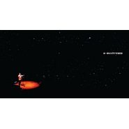

林一峰
============================

|  |  |
| :--: | :-- |
| [ 林一峰](https://i.xiami.com/chetlam) | **地区**: Hong Kong ,PRC 中国香港 **风格**: 国语流行 Mandarin Pop, 粤语流行 Cantopop, 根源唱作人 Singer-Songwriter **播放数**: 22874214 **粉丝数**: 25951 **评论数**: 528  |

## 档案

林一峰（英文名：Chet Lam，1976年4月11日－），英属香港出生，祖籍广东潮州。香港土生土长的创作歌手，是香港歌唱创作二人女子组合at17成员林二汶的哥哥，两人经常合作演出。林未受过正统音乐训练，靠自学而学懂弹吉他、作曲、写词；除了大量替其他歌手创作及制作外，林成立了两间工作室：LYFE及思人创作，推出过十多张粤语、国语跟英语专辑，替自己及其他音乐单位举办音乐演出。文字方面，林已经推出了9本著作，包括2014年集音乐专辑、旅行故事、中英对照食谱于一身的《慢煮快活》。

## 专辑

| 名称 | 语种 | 唱片公司 | 发行时间 | 专辑类别 | 专辑风格 |
| :--: | :-- | :-- | :-- | :-- | :-- |
| [ Travelogue 4 Escape](./albums/2104223831.md) | 粤语 | LYFE | 2018年11月17日 | 录音室专辑 | 粤语流行 Cantopop |
| [ Lake of Illusion](./albums/5022447771.md) | 其他 | LYFE Music | 2018年10月17日 | EP, 单曲 | 流行 Pop |
| [ 出走Runaway](./albums/2104052443.md) | 粤语 | LYFE | 2018年09月24日 | EP, 单曲 | 城市民谣 Urban Folk |
| [ 细水如歌like RIPPLES,like LOVE](./albums/2102867570.md) | 粤语 | LYFE Music | 2017年10月26日 | 录音室专辑 | 独立流行 Indie Pop, 粤语流行 Cantopop |
| [ 绝对清白](./albums/2102734993.md) | 国语 | LYFE | 2017年05月01日 | 录音室专辑 | 独立流行 Indie Pop, 国语流行 Mandarin Pop |
| [ Roadwork](./albums/2103710593.md) | 粤语 | LYFE | 2017年01月15日 | EP, 单曲 | 粤语流行 Cantopop |
| [ Made in Hong Kong](./albums/251772.md) | 粤语 | LYFE | 2016年11月17日 | 现场专辑 | 灵魂乐 Soul, 流行灵魂乐 Pop Soul |
| [ 侯师傅](./albums/2100255056.md) | 国语 | 音乐肖像 | 2016年01月06日 | EP, 单曲 | 城市民谣 Urban Folk |
| [ 陈忠汉与赵美凤](./albums/2100241300.md) | 粤语 | LYFE | 2015年11月18日 | EP, 单曲 |  |
| [ Crossroads](./albums/128470588.md) | 粤语 | LYFE | 2015年07月07日 | 录音室专辑 | 根源唱作人 Singer-Songwriter, 独立流行 Indie Pop, 粤语流行 Cantopop |
| [ Cooking Music《慢煮·快活》中英对照食谱随书附赠CD](./albums/1911983222.md) | 英语 | LYFE | 2014年09月12日 | 录音室专辑 | 根源唱作人 Singer-Songwriter, 阳光流行 Sunshine Pop, 独立流行 Indie Pop |
| [ 爱郧书 续篇](./albums/2093409384.md) | 粤语 | LYFE | 2014年02月21日 | EP, 单曲 | 粤语流行 Cantopop |
| [ 林一峰作品集Chet Lam Playlist](./albums/287872372.md) | 国语 | LYFE | 2013年12月30日 | 录音室专辑 | 国语流行 Mandarin Pop |
| [ Dream On Live 2013 林一峰游乐会](./albums/1771177845.md) | 粤语 | LYFE | 2013年05月25日 | 现场专辑 | 粤语流行 Cantopop |
| [ Oh My Goodness](./albums/963056131.md) | 粤语 | LYFE | 2013年03月11日 | 录音室专辑 | 粤语流行 Cantopop, 独立流行 Indie Pop, 根源唱作人 Singer-Songwriter |
| [ One Magic Christmas](./albums/562656.md) | 英语 | LYFE | 2012年12月11日 | 录音室专辑 | 独立流行 Indie Pop |
| [ Live At the Coliseum](./albums/5021796932.md) | 其他 | LYFE Music | 2012年10月08日 | 录音室专辑 | 流行 Pop |
| [ 爱郧书I Love You Best ](./albums/541750.md) | 粤语 | LYFE | 2012年09月11日 | 录音室专辑 | 粤语流行 Cantopop |
| [ 家课Homework](./albums/501787.md) | 粤语 | LYFE | 2012年03月27日 | 精选集 | 粤语流行 Cantopop |
| [ 一峰一人一结他2011音乐会 One Magic Day Live](./albums/490310.md) | 粤语 | LYFE | 2012年01月04日 | 现场专辑 | 粤语流行 Cantopop |
| [ One Magic Christmas](./albums/483334.md) | 国语 | LYFE | 2011年12月13日 | EP, 单曲 |  |
| [ ONE MAGIC DAY](./albums/466421.md) | 粤语 | LYFE | 2011年09月15日 | 录音室专辑 | 城市民谣 Urban Folk |
| [ 花诀](./albums/430020.md) | 国语 | LYFE | 2011年03月03日 | 录音室专辑 | 中国风 China-Wave |
| [ 一峰不能藏二汶演唱会Chet & Eman Let's Jam 2010](./albums/414539.md) | 粤语 | LYFE | 2010年12月02日 | 现场专辑 | 粤语流行 Cantopop |
| [ 林一歌林二唱 When She SingsEman Lam Sings Chet Lam Songbook](./albums/402941.md) | 粤语 | 东亚唱片 | 2010年09月20日 | 录音室专辑 | 粤语流行 Cantopop |
| [ Back to the Stars](./albums/376634.md) | 英语 | LYFE | 2010年04月10日 | 录音室专辑 | 独立流行 Indie Pop |
| [ 恋爱总是平静地意外....来临](./albums/358039.md) | 粤语 | LYFE | 2010年01月22日 | 录音室专辑 | 粤语流行 Cantopop |
| [ 一峰二汶好天气演唱会Chet & Eman Live at HK Coliseum](./albums/361077.md) | 粤语 | LYFE | 2010年01月07日 | 现场专辑 | 粤语流行 Cantopop |
| [ 好天气Good Weather / 一峰二汶三十年 纪念EP](./albums/361266.md) | 粤语 | LYFE | 2009年12月02日 | EP, 单曲 | 儿童音乐 Children's Music |
| [ 山谷里的音乐](./albums/335397.md) | 国语 | LYFE | 2009年06月24日 | EP, 单曲 |  |
| [ 思路 [My Lonely Planet]](./albums/333457.md) | 国语 | LYFE | 2009年06月19日 | 录音室专辑 | 国语流行 Mandarin Pop, 根源唱作人 Singer-Songwriter |
| [ One Cake One Live林一峰×The Pancakes the HongKong Indie crossover live](./albums/434044.md) | 粤语 | LYFE | 2009年01月20日 | 现场专辑 | 粤语流行 Cantopop |
| [ 林一峰@3G门户星海唱游](./albums/168569.md) | 国语 | LYFE | 2008年04月26日 | 现场专辑 |  |
| [ The Storyteller Live 08](./albums/297283.md) | 粤语 | LYFE | 2008年04月25日 | 现场专辑 | 粤语流行 Cantopop |
| [ 城市旅人](./albums/33399.md) | 粤语 | LYFE | 2008年01月31日 | 录音室专辑 | 粤语流行 Cantopop, 城市民谣 Urban Folk, 根源唱作人 Singer-Songwriter |
| [ 三种幸福](./albums/33085.md) | 国语 | LYFE | 2007年12月07日 | EP, 单曲 |  |
| [ 夜生活](./albums/2739.md) | 粤语 | LYFE | 2007年08月01日 | EP, 单曲 | 粤语流行 Cantopop |
| [ 一期一会Once in a Lifetime](./albums/2740.md) | 粤语 | LYFE | 2007年04月24日 | 录音室专辑 | 粤语流行 Cantopop, 华语唱作人 Chinese Singer-Songwriter |
| [ 思 生活](./albums/2741.md) | 国语 | LYFE | 2007年02月16日 | 录音室专辑 | 国语流行 Mandarin Pop, 根源唱作人 Singer-Songwriter |
| [ Camping In Hong Kong Live](./albums/2742.md) | 英语 | LYFE | 2006年10月01日 | 现场专辑 |  |
| [ Camping Classics Reborn](./albums/2743.md) | 英语 | LYFE | 2006年04月03日 | 录音室专辑 | 流行 Pop |
| [ 一舞倾情 杨千嬅X林一峰拉阔音乐会](./albums/2745.md) | 粤语 | LYFE | 2005年10月04日 | 现场专辑 | 粤语流行 Cantopop |
| [ 这一路走来](./albums/2744.md) | 国语 | LYFE | 2005年09月01日 | 录音室专辑 | 国语流行 Mandarin Pop, 根源唱作人 Singer-Songwriter |
| [ 你今日拯救咗地球未呀](./albums/2746.md) | 粤语 | LYFE | 2005年07月01日 | 录音室专辑 | 粤语流行 Cantopop, 根源唱作人 Singer-Songwriter |
| [ 游乐园 香港演唱会](./albums/2748.md) | 粤语 | LYFE | 2004年11月01日 | 现场专辑 | 粤语流行 Cantopop |
| [ 一个人在途上Travelogue, Too](./albums/32291.md) | 粤语 | LYFE | 2004年10月06日 | 录音室专辑 | 粤语流行 Cantopop |
| [ FreeplayChet Lam On The Pancakes With Ketchup](./albums/2750.md) | 粤语 | LYFE | 2004年03月01日 | 录音室专辑 | 粤语流行 Cantopop, 独立流行 Indie Pop |
| [ 两个陌生男子](./albums/5021815076.md) | 其他 | Note13 Co. Ltd. | 2003年09月01日 | EP, 单曲 | 新世纪音乐 New Age |
| [ Goodnight](./albums/5021804242.md) | 其他 | Note13 Co. Ltd. | 2003年09月01日 | EP, 单曲 | 新世纪音乐 New Age |
| [ Travelogue1 游乐](./albums/32292.md) | 粤语 | LYFE | 2003年07月04日 | 录音室专辑 | 粤语流行 Cantopop, 华语唱作人 Chinese Singer-Songwriter |
| [ 林一峰的床头歌](./albums/2752.md) | 粤语 | LYFE | 2003年01月24日 | 录音室专辑 | 独立流行 Indie Pop, 华语唱作人 Chinese Singer-Songwriter, 粤语流行 Cantopop |
| [ 少爷占广播剧音乐全集Complete Original Score for Jim Yan's Radio Drama](./albums/435181.md) | 粤语 | 华纳音乐 | 2002年02月01日 | 原声带, 影视音乐 | 民谣流行 Folk Pop, 广播剧 Radio Drama |

## 评论

|  |  |  |
| :-- | :-- | :-- |
|  [虾米用户](https://emumo.xiami.com/u/333267866)  2021-01-17 20:56 赞(0) 踩(0) | 
来虾米基本上就是听你的歌，花决这首专辑循环了很多遍，唉
 |
|  [虾米用户](https://emumo.xiami.com/u/261168924) Have a nice ... 2021-01-13 12:55 赞(0) 踩(0) | 
网易没有trust和the best is yet to come 现在虾米也不能买专辑了好难过&amp;hellip;&amp;hellip;感谢一峰，考研期间都是你的声音陪我度过的，我会一直记住这句，最好的尚未来临 
 |
|  [虾米用户](https://emumo.xiami.com/u/14561312) 开口沉默. 2021-01-06 14:51 赞(0) 踩(0) | 
想哭 虾米要关停了&amp;hellip;我爱的一峰和二汶都在这里陪了我很久很久!
 |
|  [虾米用户](https://emumo.xiami.com/u/276944698) 不要自我设限..... 2020-08-15 21:43 赞(1) 踩(0) | 
✔️✔️✔️
 |
|  [虾米用户](https://emumo.xiami.com/u/444433002)  2020-08-06 02:14 赞(1) 踩(0) | 
只为了林一峰，下的虾米音乐。
 |
|  [虾米用户](https://emumo.xiami.com/u/230803304) 三观正又爱国的成都宝藏男... 2020-07-31 10:00 赞(0) 踩(0) | 
谢谢虾小米上传一峰的专辑
 |
|  [虾米用户](https://emumo.xiami.com/u/9713858) CHET LAM 2020-04-21 20:53 赞(17) 踩(0) | 
報到一下，大家好
 |
| ⇒ |  [虾米用户](https://emumo.xiami.com/u/49229450) 我还没想好要写什么... 2020-04-22 07:55 赞(0) 踩(0) | 
早呀！一峰❤️
 |
| ⇒ |  [虾米用户](https://emumo.xiami.com/u/6929142)  2020-05-04 08:47 赞(0) 踩(0) | 
希望能来内地北方城市做巡演
 |
| ⇒ |  [虾米用户](https://emumo.xiami.com/u/6820570) 这是语言的变调，承接醒来... 2020-05-27 17:08 赞(0) 踩(0) | 
哇！你好呀！好久不见！正在听《十七一生》~
 |
|  [虾米用户](https://emumo.xiami.com/u/408069973)  2019-08-24 02:11 赞(0) 踩(0) | 
原来你的歌这么好听  早就听说你了  歌还是刚刚开始认真听
 |
|  [虾米用户](https://emumo.xiami.com/u/10936044)  2019-06-18 21:40 赞(0) 踩(0) | 
一峰太有才了！
 |
|  [虾米用户](https://emumo.xiami.com/u/10170789) ig：gim_x  网易... 2019-05-20 03:39 赞(0) 踩(0) | 
好
 |
|  [虾米用户](https://emumo.xiami.com/u/324270465) 白日放歌须纵酒 2019-04-27 13:54 赞(0) 踩(0) | 
我爱徐小凤，你也爱徐小凤，听着听着，竟然爱上你的歌了
 |
|  [虾米用户](https://emumo.xiami.com/u/339191478)   2019-04-21 07:34 赞(0) 踩(0) | 
;)
 |
|  [虾米用户](https://emumo.xiami.com/u/229269879)  2018-11-28 19:53 赞(0) 踩(0) | 
同样是弹吉他的唱作男歌手，国语听熊天平，粤语听林一峰，完美 ，只可惜小熊生早了，不像一峰有这么长的音乐生涯，唉…
 |
|  [虾米用户](https://emumo.xiami.com/u/266608383)  2018-11-26 13:39 赞(0) 踩(0) | 
******
 |
|  [虾米用户](https://emumo.xiami.com/u/329432353) 与侯斯顿中断了通讯 2018-10-28 11:28 赞(3) 踩(0) | 
阿峰真是个温柔的怪物
 |
|  [虾米用户](https://emumo.xiami.com/u/250709513) 因渴望成为独角的兽 因相... 2018-10-18 23:52 赞(19) 踩(0) | 
喜欢一峰的声音，自然又温暖。睡前听他的歌，梦都会甜些❤️
 |
| ⇒ |  [虾米用户](https://emumo.xiami.com/u/407337976)  2020-05-28 21:22 赞(0) 踩(0) | 
你也喜欢他
 |
|  [虾米用户](https://emumo.xiami.com/u/10811234) Love Mucic 2018-09-13 23:03 赞(2) 踩(0) | 
赞
 |
|  [虾米用户](https://emumo.xiami.com/u/302881898) 爱音乐的善良小孩 2018-08-22 07:28 赞(2) 踩(0) | 
一峰真的太有才
 |
|  [虾米用户](https://emumo.xiami.com/u/302881898) 爱音乐的善良小孩 2018-08-18 23:50 赞(2) 踩(0) | 
好温柔！！！
 |
|  [虾米用户](https://emumo.xiami.com/u/380241290) 我还没想好要写什么... 2018-08-12 20:23 赞(2) 踩(0) | 
喜欢你十几年了，你的专辑和书都有买哦 
 |
|  [虾米用户](https://emumo.xiami.com/u/86388280) 有缘无份人生的悲哀，有份... 2018-05-07 19:12 赞(3) 踩(0) | 
看成林海峯 
 |
|  [虾米用户](https://emumo.xiami.com/u/148610626)  2018-03-19 23:28 赞(3) 踩(0) | 
这年头，有才华，还有音乐理想和情怀的人不多了。很高兴发现你。
 |
|  [虾米用户](https://emumo.xiami.com/u/332046)  2018-02-27 23:51 赞(1) 踩(0) | 
好喜欢 希望能一直好下去
 |
|  [虾米用户](https://emumo.xiami.com/u/251623037) 当我不存在吧 2018-02-15 18:04 赞(2) 踩(0) | 
怎么感觉他的声音有点像张信哲
 |
|  [虾米用户](https://emumo.xiami.com/u/186437644) 任他们多漂亮 未及你矜贵... 2018-01-31 13:31 赞(1) 踩(0) | 
啊！我真的太爱你了！
 |
|  [虾米用户](https://emumo.xiami.com/u/5555764) 阿Ken 2018-01-28 03:56 赞(2) 踩(0) | 
听上二汶才知你是她哥
 |
|  [虾米用户](https://emumo.xiami.com/u/54956783)  2018-01-09 23:23 赞(1) 踩(0) | 
林一峰如果在台湾发展一定能火
 |
|  [虾米用户](https://emumo.xiami.com/u/295037229)  2018-01-09 13:00 赞(1) 踩(0) | 
这个男生真的很不错！
 |
|  [虾米用户](https://emumo.xiami.com/u/229490650) 就像他在游戏中所追求的排... 2017-11-07 23:01 赞(1) 踩(0) | 
兄妹都好棒
 |
|  [虾米用户](https://emumo.xiami.com/u/237996281)   2017-10-31 19:53 赞(1) 踩(0) | 
有意思
 |
|  [虾米用户](https://emumo.xiami.com/u/14182021)  2017-10-28 00:30 赞(0) 踩(0) | 
比亞娛樂全力呈獻《杜麗莎「遇」林一峰》「新距離文化音樂會」，以不同年代的歌曲攜手帶領大家尋回專屬的集體回憶。當杜麗莎遇上林一峰時，造就了今次演唱會，今次二人首度合作，帶領大家重拾新光戲院天空上的一片好天氣。8/5 - 10/5　新光戲院 大劇場
 |
|  [虾米用户](https://emumo.xiami.com/u/16863036)   2017-10-28 00:22 赞(2) 踩(0) | 
我就是喜欢林一峰啊！精选集大卖！
 |
|  [虾米用户](https://emumo.xiami.com/u/4999238)   2017-10-27 23:23 赞(2) 踩(0) | 
一直喜欢着的林一峰   想到他就想到清新和明媚
 |
|  [虾米用户](https://emumo.xiami.com/u/118773526) 一切很美，只因有你！ 2017-10-26 18:00 赞(0) 踩(0) | 
支持你！ 
 |
|  [虾米用户](https://emumo.xiami.com/u/70284738) 我还没想好要写什么... 2017-10-26 16:22 赞(1) 踩(0) | 
每当点起一支烟便想起你
 |
|  [虾米用户](https://emumo.xiami.com/u/2535446)  2017-10-26 11:06 赞(0) 踩(0) | 
支持粤语音乐人。
 |
|  [虾米用户](https://emumo.xiami.com/u/17705421) 不如就让我来介绍一下我们... 2017-09-02 19:11 赞(0) 踩(0) | 
收藏会收到通知咩？
 |
|  [虾米用户](https://emumo.xiami.com/u/32349133) On the day t... 2017-07-12 01:35 赞(1) 踩(0) | 
不敢说你的歌陪我多少年 但每一首都会是珍贵的宝藏
 |
|  [虾米用户](https://emumo.xiami.com/u/218912269) 做人喜欢低调、做事喜欢认... 2017-07-06 02:17 赞(1) 踩(0) | 
民摇天王 
 |
|  [虾米用户](https://emumo.xiami.com/u/133547640)   2017-06-03 22:01 赞(2) 踩(0) | 
泡到一峰
 |
|  [虾米用户](https://emumo.xiami.com/u/29005612) 我还没想好要写什么... 2017-05-30 13:31 赞(1) 踩(0) | 
My favorite favorite favorite singer ever, feel so lucky have seen your live show in Beijing, wish you all best luck
 |
| ⇒ |  [虾米用户](https://emumo.xiami.com/u/282873091)  2017-09-01 21:10 赞(0) 踩(0) | 
I
 |
|  [虾米用户](https://emumo.xiami.com/u/8070377) 爱雾瑞性维欧腐漏 2017-05-21 20:35 赞(2) 踩(0) | 
应该学学他的歌
 |
|  [虾米用户](https://emumo.xiami.com/u/224471158)  2017-05-10 08:51 赞(3) 踩(0) | 
一峰二汶名字取得好
 |
|  [虾米用户](https://emumo.xiami.com/u/264733853)  2017-05-09 11:43 赞(1) 踩(0) | 
产量厉害
 |
|  [虾米用户](https://emumo.xiami.com/u/291338208)  2017-05-07 12:59 赞(0) 踩(0) | 
好！
 |
|  [虾米用户](https://emumo.xiami.com/u/286910133)  2017-05-02 23:22 赞(2) 踩(0) | 
by my side 天啊，超棒的一首歌，小学还是初中第一次听，现在我大学了，还是忘不了
 |
|  [虾米用户](https://emumo.xiami.com/u/141027886) 在下还没想好要写什么… 2017-05-01 22:42 赞(23) 踩(0) | 
林一峰这样才艺俱佳的歌手，为什么就是少人问津！！！！！很气，我给好多盆友推荐过这个人，可是他们都不在意，他们并不知道他们错过了什么
 |
| ⇒ |  [虾米用户](https://emumo.xiami.com/u/260316911) ヾ(´∀｀。ヾ) 2017-05-13 10:35 赞(0) 踩(0) | 
要有适当的机遇才能一炮而红。先练练吧。。。   
 |
| ⇒ |  [虾米用户](https://emumo.xiami.com/u/302881898) 爱音乐的善良小孩 2018-08-22 07:29 赞(0) 踩(0) | 
我已经错过很多年了 
 |
|  [虾米用户](https://emumo.xiami.com/u/3719355)  2017-05-01 17:33 赞(2) 踩(0) | 
The Best Is Yet To Come  忽然觉得自己老了
 |
|  [虾米用户](https://emumo.xiami.com/u/1009164) 我还没想好要写什么... 2017-05-01 16:27 赞(2) 踩(0) | 
造型复古，想到达明一派了！
 |
|  [虾米用户](https://emumo.xiami.com/u/290592741)  2017-04-24 15:49 赞(2) 踩(0) | 
一峰哥真羡慕你能跟黄家强叔叔一起唱歌，如果我也能有这个机会就好了。
 |
|  [虾米用户](https://emumo.xiami.com/u/285420422)   2017-04-21 19:23 赞(1) 踩(0) | 
死就死啦
 |
|  [虾米用户](https://emumo.xiami.com/u/276787311)  2017-03-21 10:14 赞(1) 踩(0) | 
太美丽的声音了，，加油，，林一峰！！！
 |
|  [虾米用户](https://emumo.xiami.com/u/48202631) 我还没想好要写什么... 2017-03-10 17:49 赞(1) 踩(0) | 
( ˙˘˙ )
 |
|  [虾米用户](https://emumo.xiami.com/u/87399534) 来世做一棵树。 2017-02-13 17:33 赞(1) 踩(0) | 
Pretty voice
 |
|  [虾米用户](https://emumo.xiami.com/u/23537273) 祝你愉快 2017-02-11 09:37 赞(1) 踩(0) | 

 |
|  [虾米用户](https://emumo.xiami.com/u/5676624)   2017-02-09 22:36 赞(2) 踩(0) | 
陪我度过无数个无眠的夜晚
 |
|  [虾米用户](https://emumo.xiami.com/u/74639208) Music is per... 2017-01-26 21:43 赞(1) 踩(0) | 
很棒哦
 |
|  [虾米用户](https://emumo.xiami.com/u/260167529) 爱音乐的疯子 2017-01-18 21:20 赞(1) 踩(0) | 
香港民谣第一人 最强创作人
 |
|  [虾米用户](https://emumo.xiami.com/u/4957200)  2017-01-15 01:14 赞(0) 踩(0) | 
真的好喜欢林一峰林二汶[带墨镜笑]
 |
|  [虾米用户](https://emumo.xiami.com/u/3300746)  2017-01-11 09:06 赞(1) 踩(0) | 
我的天，聲音好聽到
 |
|  [虾米用户](https://emumo.xiami.com/u/254820185)  2017-01-01 11:35 赞(1) 踩(0) | 
骚耳膜的歌手 
 |
| ⇒ |  [虾米用户](https://emumo.xiami.com/u/51800191)  2017-03-26 01:57 赞(0) 踩(0) | 
你好 
 |
|  [虾米用户](https://emumo.xiami.com/u/50177198) 我还没想好要写什么... 2016-12-09 02:01 赞(2) 踩(0) | 
继黄耀明后又一个聊骚耳膜的人～
 |
|  [虾米用户](https://emumo.xiami.com/u/42405531) 再见虾米 2016-12-05 07:44 赞(0) 踩(0) | 
我的天 声音好像kent
 |
|  [虾米用户](https://emumo.xiami.com/u/50475895) 诗酒趁年华 2016-11-26 14:32 赞(1) 踩(0) | 
初中时候听《花决》那张，简直惊为天人。现在又重新爱上了
 |
|  [虾米用户](https://emumo.xiami.com/u/16135450)  2016-10-14 14:58 赞(1) 踩(0) | 
4669
 |
|  [虾米用户](https://emumo.xiami.com/u/74791348) 南风熏昼长 2016-06-26 13:08 赞(0) 踩(0) | 
最爱away in a manger
 |
|  [虾米用户](https://emumo.xiami.com/u/6944604) 再见了，虾米！ 2016-06-14 15:49 赞(0) 踩(0) | 
唯一喜欢的民谣歌手
 |
|  [虾米用户](https://emumo.xiami.com/u/1720629) 音乐无偏见。 2016-05-05 17:14 赞(1) 踩(0) | 
林一峰、林二汶才知道是兄妹。
 |
|  [虾米用户](https://emumo.xiami.com/u/10547884) 这家伙很懒 2016-04-29 02:43 赞(0) 踩(0) | 
花决...
 |
|  [虾米用户](https://emumo.xiami.com/u/4957200)  2016-04-24 16:57 赞(0) 踩(0) | 
好听到哭 
 |
|  [虾米用户](https://emumo.xiami.com/u/33009066) 豬小小 2016-04-13 08:04 赞(0) 踩(0) | 
love
 |
|  [虾米用户](https://emumo.xiami.com/u/2492768)  2016-01-11 16:21 赞(13) 踩(0) | 
灵感到了就随性而发，才是唱作人的灵魂和立身的根本。舍去好的小品，也不一定能沉淀出理想中的“大菜”。
 |
| ⇒ |  [虾米用户](https://emumo.xiami.com/u/12730895) 不要离开！ 2016-02-13 19:04 赞(0) 踩(0) | 
赞同。灵感来了是挡不住的。而且大菜也是小品中的一个，只是某次的灵感比较好而已，事后才发现，本来只是一个小品，一不小心成了大菜。
 |
|  [虾米用户](https://emumo.xiami.com/u/49900151)  2016-01-09 19:01 赞(0) 踩(0) | 
粤语流行 Cantopop 香港创意工业工作者，音乐人，作者，旅行者
 |
|  [虾米用户](https://emumo.xiami.com/u/24159763) 你没听过 我没停过 2016-01-09 11:35 赞(0) 踩(0) | 
好听
 |
|  [虾米用户](https://emumo.xiami.com/u/50544351)   2015-12-25 19:25 赞(0) 踩(0) | 
才子加油
 |
|  [虾米用户](https://emumo.xiami.com/u/8070377) 爱雾瑞性维欧腐漏 2015-10-25 19:39 赞(0) 踩(0) | 
三 什么 XDD
 |
| ⇒ |  [虾米用户](https://emumo.xiami.com/u/4795240) 世界尽头与冷酷仙境 2016-11-20 20:43 赞(0) 踩(0) | 
呀！
 |
| ⇒ |  [虾米用户](https://emumo.xiami.com/u/8070377) 爱雾瑞性维欧腐漏 2016-11-20 22:08 赞(0) 踩(0) | 
<q><b>迅子说：</b></q>
 |
| ⇒ |  [虾米用户](https://emumo.xiami.com/u/4795240) 世界尽头与冷酷仙境 2016-11-20 22:15 赞(0) 踩(0) | 
<q><b>　　　夜宵与战争 ☾　说：</b></q>
 |
| ⇒ |  [虾米用户](https://emumo.xiami.com/u/8070377) 爱雾瑞性维欧腐漏 2016-11-20 22:20 赞(0) 踩(0) | 
<q><b>迅子说：</b></q>
 |
|  [虾米用户](https://emumo.xiami.com/u/16084466)  2015-09-22 14:56 赞(0) 踩(0) | 
好屌
 |
|  [虾米用户](https://emumo.xiami.com/u/50544351)   2015-09-21 12:37 赞(0) 踩(0) | 
国语非常棒
 |
|  [虾米用户](https://emumo.xiami.com/u/36522788) 暂无签名~ 2015-09-07 19:41 赞(1) 踩(0) | 
想收集每一张专辑封面
 |
|  [虾米用户](https://emumo.xiami.com/u/26381576) 我情愿消灭了一切执念，冰... 2015-08-27 09:41 赞(2) 踩(0) | 
我要买一个本子写你的歌词
 |
| ⇒ |  [虾米用户](https://emumo.xiami.com/u/49737213) You make it ... 2016-10-31 23:32 赞(0) 踩(0) | 
我也是！
 |
|  [虾米用户](https://emumo.xiami.com/u/1053410)  2015-08-14 14:45 赞(0) 踩(0) | 
听了那首《至死不渝》，觉得声音很好听。
 |
|  [虾米用户](https://emumo.xiami.com/u/28705813) 我与春风皆过客，你携秋水... 2015-08-14 03:35 赞(0) 踩(0) | 
舒服、好听
 |
|  [虾米用户](https://emumo.xiami.com/u/26130836) 无他 2015-08-07 22:04 赞(0) 踩(0) | 
 评论和关注被背景融合了
 |
|  [虾米用户](https://emumo.xiami.com/u/1509816)  2015-07-22 23:38 赞(0) 踩(0) | 
暂存，
 |
|  [虾米用户](https://emumo.xiami.com/u/47019875) 思之极处 2015-07-04 23:38 赞(0) 踩(0) | 
之前用你的歌，做了自己的第一档音乐节目。很喜欢你的曲风
 |
|  [虾米用户](https://emumo.xiami.com/u/26381576) 我情愿消灭了一切执念，冰... 2015-06-24 19:54 赞(0) 踩(0) | 
你会唱戏噶。。
 |
|  [虾米用户](https://emumo.xiami.com/u/11322495) 有一种思念，叫远方。 2015-06-19 16:15 赞(0) 踩(0) | 
干净的嗓音，淡淡的申请。
 |
|  [虾米用户](https://emumo.xiami.com/u/3228764) 气质不优雅，家世不显赫~ 2015-06-04 14:46 赞(3) 踩(0) | 
一峰 二汶，很棒！！！
 |
|  [虾米用户](https://emumo.xiami.com/u/2225365)  2015-05-19 21:30 赞(0) 踩(0) | 
非常喜欢你的歌
 |
|  [虾米用户](https://emumo.xiami.com/u/8653185)  2015-05-18 10:41 赞(0) 踩(0) | 
可以静下心来
 |
|  [虾米用户](https://emumo.xiami.com/u/29480609) 且听风吟 2015-05-02 08:40 赞(0) 踩(0) | 
爱似林一峰 
 |
|  [虾米用户](https://emumo.xiami.com/u/3683968)   2015-04-01 15:23 赞(14) 踩(0) | 
八卦一下 ，他男朋友是谁？
 |
| ⇒ |  [虾米用户](https://emumo.xiami.com/u/110443388) 曾经，藏着的爱情. 2017-10-06 00:06 赞(0) 踩(0) | 
他不是男的？
 |
| ⇒ |  [虾米用户](https://emumo.xiami.com/u/268176746)  2017-10-19 00:16 赞(0) 踩(0) | 
<q><b>f=μMg＊cosθ说：</b></q>
 |
| ⇒ |  [虾米用户](https://emumo.xiami.com/u/268176746)  2017-10-19 00:16 赞(0) 踩(0) | 
还是你知道多一点
 |
| ⇒ |  [虾米用户](https://emumo.xiami.com/u/110443388) 曾经，藏着的爱情. 2017-10-19 06:53 赞(0) 踩(0) | 
<q><b>阿巴查大朵说：</b></q>
 |
| ⇒ |  [虾米用户](https://emumo.xiami.com/u/268176746)  2017-10-20 10:56 赞(0) 踩(0) | 
<q><b>f=μMg＊cosθ说：</b></q>
 |
|  [虾米用户](https://emumo.xiami.com/u/356)  2015-03-30 21:37 赞(0) 踩(0) | 
最爱《回家路上》
 |
|  [虾米用户](https://emumo.xiami.com/u/13704947) 豆瓣见：无悲渊。 2015-03-18 12:33 赞(18) 踩(0) | 
近些年香港艺人的国语简直干翻台湾腔，原谅我说脏话，只是觉得他们的语言天赋和努力真的让人敬佩。
 |
|  [虾米用户](https://emumo.xiami.com/u/950433)  2015-03-15 03:12 赞(0) 踩(0) | 
总在一个人时听他的声音去想淡淡的但忘不却的事情
 |
|  [虾米用户](https://emumo.xiami.com/u/43060703)  2015-03-15 01:49 赞(0) 踩(0) | 
不错
 |
|  [虾米用户](https://emumo.xiami.com/u/17719900) 请把我的歌带回你的家 2015-03-11 02:31 赞(1) 踩(0) | 
真正的男神和偶像
 |
|  [虾米用户](https://emumo.xiami.com/u/3301983) 暂无签名~ 2015-03-08 20:18 赞(0) 踩(0) | 
会让人安静下来的声音
 |
|  [虾米用户](https://emumo.xiami.com/u/10585017) 不找了 2015-03-07 01:46 赞(1) 踩(0) | 
放着你的歌，第一次在椅子上睡得这么舒服。
 |
| ⇒ |  [虾米用户](https://emumo.xiami.com/u/51800191)  2016-07-09 21:54 赞(0) 踩(0) | 
你好呵呵
 |
|  [虾米用户](https://emumo.xiami.com/u/766089) 暂无签名~ 2015-03-04 23:17 赞(0) 踩(0) | 
听了这久的歌才明长什么样。
 |
|  [虾米用户](https://emumo.xiami.com/u/3781923) 别拒绝上帝。 2015-02-13 21:59 赞(2) 踩(0) | 
他是Gay么？
 |
| ⇒ |  [虾米用户](https://emumo.xiami.com/u/51800191)  2016-07-09 21:54 赞(0) 踩(0) | 
是的！  
 |
|  [虾米用户](https://emumo.xiami.com/u/10092497) 听说写签名会有人看... 2015-02-01 17:35 赞(0) 踩(0) | 
林二汶和你什么关系=。=
 |
| ⇒ |  [虾米用户](https://emumo.xiami.com/u/46422867)   2015-02-15 15:12 赞(0) 踩(0) | 
兄妹
 |
| ⇒ |  [虾米用户](https://emumo.xiami.com/u/8403031) 网易：东海龙王四太子_ 2015-05-14 07:40 赞(0) 踩(0) | 
林二汶是他妹妹
 |
|  [虾米用户](https://emumo.xiami.com/u/44837767)  2015-01-24 21:11 赞(0) 踩(0) | 
聲音清澈甜美...
 |
|  [虾米用户](https://emumo.xiami.com/u/8878923)  2015-01-24 17:57 赞(0) 踩(0) | 
细腻
 |
|  [虾米用户](https://emumo.xiami.com/u/13936170)   2015-01-23 14:48 赞(0) 踩(0) | 
感觉他的脑袋好大~~
 |
|  [虾米用户](https://emumo.xiami.com/u/14618717)  2015-01-20 00:13 赞(0) 踩(0) | 
赞
 |
|  [虾米用户](https://emumo.xiami.com/u/42735707)   2015-01-05 01:31 赞(0) 踩(0) | 
很好听，有种时间被放慢的感觉
 |
|  [虾米用户](https://emumo.xiami.com/u/8833102) 伟❤️375882267 2014-12-25 01:20 赞(0) 踩(0) | 
这里的歌真好听                       圣诞快乐  ！！！
 |
|  [虾米用户](https://emumo.xiami.com/u/32014145) 暂无签名~ 2014-12-11 10:18 赞(0) 踩(0) | 
林一峰的作品是慢生活的做品，坐在咖啡馆里，乎拿着咖啡杯喝着咖啡听的，好舒服
 |
|  [虾米用户](https://emumo.xiami.com/u/9555226) music liker 2014-12-10 15:45 赞(0) 踩(0) | 
感觉他的歌和声音一直和旅程挂钩
 |
|  [虾米用户](https://emumo.xiami.com/u/41997868) 爱听杨千嬅、梁静茹。愿我... 2014-12-07 13:45 赞(0) 踩(0) | 
才子
 |
|  [虾米用户](https://emumo.xiami.com/u/14672616)  2014-11-20 17:09 赞(0) 踩(0) | 
莫名其妙地爱你
 |
|  [虾米用户](https://emumo.xiami.com/u/2706428)  2014-10-04 19:00 赞(44) 踩(0) | 
太高产了。。沉淀一下做多几张花诀一样的专辑多好
 |
| ⇒ |  [虾米用户](https://emumo.xiami.com/u/2492768)  2016-01-11 16:19 赞(0) 踩(0) | 
灵感到了就随性而发，才是唱作人的灵魂和立身的根本。舍去好的小品，也不一定能沉淀出理想中的“大菜”。
 |
| ⇒ |  [虾米用户](https://emumo.xiami.com/u/11164870)  2017-01-19 03:03 赞(0) 踩(0) | 
M大。’，歜Z。sm
 |
| ⇒ |  [虾米用户](https://emumo.xiami.com/u/11164870)  2017-01-19 03:04 赞(0) 踩(0) | 
Alon m
 |
| ⇒ |  [虾米用户](https://emumo.xiami.com/u/51800191)  2017-03-26 01:57 赞(0) 踩(0) | 
你好
 |
| ⇒ |  [虾米用户](https://emumo.xiami.com/u/10936044)  2019-06-18 21:39 赞(0) 踩(0) | 
是真的超超超高产
 |
|  [虾米用户](https://emumo.xiami.com/u/17977788)  2014-09-28 12:04 赞(0) 踩(0) | 
很爱很爱他的歌
 |
|  [虾米用户](https://emumo.xiami.com/u/4017151)  2014-09-22 20:44 赞(0) 踩(0) | 
高中晚修听得入迷。
 |
|  [虾米用户](https://emumo.xiami.com/u/860474)   2014-09-22 15:08 赞(0) 踩(0) | 
为什么厨房这么好听的歌没有试听量！！
 |
|  [虾米用户](https://emumo.xiami.com/u/208856) 众生喧哗，独寻幽静。 2014-09-22 14:37 赞(0) 踩(0) | 
华东！
 |
|  [虾米用户](https://emumo.xiami.com/u/13552)  2014-09-16 09:17 赞(0) 踩(0) | 
By My Side, I Don’t Want to Say Goodbye
 |
|  [虾米用户](https://emumo.xiami.com/u/90033) 樂园 2014-09-01 08:03 赞(0) 踩(0) | 
从此以后 对你不再是爱屋及乌
 |
|  [虾米用户](https://emumo.xiami.com/u/278100)   2014-08-16 00:47 赞(0) 踩(0) | 
能让我平静的声音。
 |
|  [虾米用户](https://emumo.xiami.com/u/7354559)  2014-08-06 13:31 赞(0) 踩(0) | 
愛你❤
 |
|  [虾米用户](https://emumo.xiami.com/u/6929142)  2014-07-12 22:31 赞(0) 踩(0) | 
真挚的感动
 |
|  [虾米用户](https://emumo.xiami.com/u/6908646) V 2014-05-27 23:05 赞(0) 踩(0) | 
the best is yet to come ！！唱到心坎里去了！！！！！
 |
|  [虾米用户](https://emumo.xiami.com/u/7460097) 暂无签名~ 2014-05-24 19:39 赞(0) 踩(0) | 
Native and genuine.
 |
|  [虾米用户](https://emumo.xiami.com/u/10183109) 我一直假装自己是个学霸… 2014-05-14 22:13 赞(0) 踩(0) | 
原来是Bibi演唱会上的那个小伙子。收藏了。
 |
|  [虾米用户](https://emumo.xiami.com/u/4135931) 拂了一身还满 2014-05-11 22:37 赞(0) 踩(0) | 
纯美
 |
|  [虾米用户](https://emumo.xiami.com/u/1733757) 暂无签名~ 2014-05-02 19:03 赞(0) 踩(0) | 
乍一听 还以为是黄耀明
 |
|  [虾米用户](https://emumo.xiami.com/u/21216195) 我还没想好要写什么... 2014-04-04 06:51 赞(0) 踩(0) | 
很娘的声音，但是我真的很喜欢。
 |
|  [虾米用户](https://emumo.xiami.com/u/34269714) 低头闻香 2014-03-23 22:52 赞(0) 踩(0) | 
他好会生活
 |
|  [虾米用户](https://emumo.xiami.com/u/33853443)  2014-03-11 11:01 赞(0) 踩(0) | 
清新、舒服的音樂
 |
|  [虾米用户](https://emumo.xiami.com/u/3148318) 夏日紫の树下幽巷有狐狸。 2014-02-27 22:54 赞(0) 踩(0) | 
悠闲、潇洒、轻松
 |
|  [虾米用户](https://emumo.xiami.com/u/2780499) EnjoyTheBeat 2014-02-26 20:20 赞(1) 踩(0) | 
一年两张录音室专辑，相当高产啊
 |
|  [虾米用户](https://emumo.xiami.com/u/9301514) 独立唱作人 2014-02-21 19:07 赞(1) 踩(0) | 
自从知道他是圈里人之后，原本就很喜欢一峰歌曲的阿兴，更加对他有好感了。祝你幸福。
 |
|  [虾米用户](https://emumo.xiami.com/u/22995262) 虾米蒸水蛋 2014-02-11 02:52 赞(0) 踩(0) | 
支持
 |
|  [虾米用户](https://emumo.xiami.com/u/5690312) 这个家伙很聪明，什么也没... 2014-01-27 20:29 赞(0) 踩(0) | 
Good
 |
|  [虾米用户](https://emumo.xiami.com/u/7435194)  2014-01-19 11:59 赞(0) 踩(0) | 
good好听
 |
|  [虾米用户](https://emumo.xiami.com/u/12454033) dont give up 2014-01-17 09:37 赞(0) 踩(0) | 
好喜欢你的歌，《花诀》这张很好~brilliant~
 |
|  [虾米用户](https://emumo.xiami.com/u/31399490)  2014-01-10 12:03 赞(0) 踩(0) | 
----
 |
|  [虾米用户](https://emumo.xiami.com/u/3229152)  2014-01-09 15:19 赞(0) 踩(0) | 
是林一峰本人在这里吗？
 |
|  [虾米用户](https://emumo.xiami.com/u/30635187)  2014-01-05 19:26 赞(0) 踩(0) | 
慰藉人心的歌儿
 |
|  [虾米用户](https://emumo.xiami.com/u/1316319) 你好，自己 2014-01-03 14:24 赞(0) 踩(0) | 
最近太喜欢
 |
|  [虾米用户](https://emumo.xiami.com/u/16209569)  2014-01-01 20:31 赞(0) 踩(0) | 
cool~
 |
|  [虾米用户](https://emumo.xiami.com/u/13317929)  2013-12-31 13:06 赞(0) 踩(0) | 
安静舒适的感觉，曲和词都舒服，难得。
 |
|  [虾米用户](https://emumo.xiami.com/u/5765253)  2013-12-30 13:10 赞(48) 踩(0) | 
国语好得令人感动！
 |
| ⇒ |  [虾米用户](https://emumo.xiami.com/u/7627013) 考古，深度挖掘华语音乐 2013-12-30 16:12 赞(0) 踩(0) | 
这算是什么感叹
 |
| ⇒ |  [虾米用户](https://emumo.xiami.com/u/11164870)  2017-01-19 03:05 赞(0) 踩(0) | 
k
 |
|  [虾米用户](https://emumo.xiami.com/u/2021550)  2013-12-26 10:28 赞(0) 踩(0) | 
暖暖的，听《The Best is yet to come》爱上了。。。暖神。
 |
|  [虾米用户](https://emumo.xiami.com/u/10319812) simple life. 2013-12-16 17:17 赞(0) 踩(0) | 
林一峰
 |
|  [虾米用户](https://emumo.xiami.com/u/5443127) COMING SOON 2013-12-14 10:03 赞(0) 踩(0) | 
欢迎男神君！！
 |
|  [虾米用户](https://emumo.xiami.com/u/8076564) 我还没想好要写什么... 2013-12-14 07:58 赞(0) 踩(0) | 
哇塞一峰你好！！
 |
|  [虾米用户](https://emumo.xiami.com/u/30705) 我还没想好要写什么... 2013-12-13 19:00 赞(0) 踩(0) | 
头像好帅~
 |
|  [虾米用户](https://emumo.xiami.com/u/2528270)  2013-12-13 18:08 赞(0) 踩(0) | 
欢迎！！！
 |
|  [虾米用户](https://emumo.xiami.com/u/9713858) CHET LAM 2013-12-13 17:36 赞(485) 踩(0) | 
我刚入驻了虾米音乐人，欢迎大家来我的个人主页，收听我的最新音乐
 |
| ⇒ |  [虾米用户](https://emumo.xiami.com/u/6408044) 是个笨蛋。 2013-12-13 19:05 赞(0) 踩(0) | 
欢迎林一！❤❤❤
 |
| ⇒ |  [虾米用户](https://emumo.xiami.com/u/8) GELI.org 2013-12-13 19:21 赞(0) 踩(0) | 
欢迎偶像。
 |
| ⇒ |  [虾米用户](https://emumo.xiami.com/u/5968552) 虾小米，我爱你所以讲不出... 2013-12-13 19:25 赞(0) 踩(0) | 
终于的终于林生也来了啊！！！！！！
 |
| ⇒ |  [虾米用户](https://emumo.xiami.com/u/26497452)  2013-12-14 17:43 赞(0) 踩(0) | 
Chetlam 严重欢迎你~ love you
 |
| ⇒ |  [虾米用户](https://emumo.xiami.com/u/2580642)   2014-01-17 16:58 赞(0) 踩(0) | 
感觉整片山川 整片好河都要被你唱酥了。。。
 |
| ⇒ |  [虾米用户](https://emumo.xiami.com/u/36539007)  2014-06-26 10:58 赞(0) 踩(0) | 

 |
| ⇒ |  [虾米用户](https://emumo.xiami.com/u/749937) 我还有什么好写的…… 2015-03-25 12:42 赞(0) 踩(0) | 
本人都来了～
 |
| ⇒ |  [虾米用户](https://emumo.xiami.com/u/11579164)  2015-04-23 18:58 赞(0) 踩(0) | 
我觉得你的音乐很好听
 |
| ⇒ |  [虾米用户](https://emumo.xiami.com/u/555365)  2015-07-08 23:39 赞(0) 踩(0) | 
支持你，加油呦~^_^
 |
| ⇒ |  [虾米用户](https://emumo.xiami.com/u/47019875) 思之极处 2015-10-20 08:31 赞(0) 踩(0) | 
一定要，太爱
 |
| ⇒ |  [虾米用户](https://emumo.xiami.com/u/3422450) 最爱看你们絮叨 2016-06-21 18:25 赞(0) 踩(0) | 
什么时候来内地~~
 |
| ⇒ |  [虾米用户](https://emumo.xiami.com/u/51800191)  2016-07-09 21:54 赞(0) 踩(0) | 
<q><b>思.生活说：</b></q>
 |
| ⇒ |  [虾米用户](https://emumo.xiami.com/u/51800191)  2016-12-24 21:53 赞(0) 踩(0) | 
你好呵呵
 |
| ⇒ |  [虾米用户](https://emumo.xiami.com/u/11164870)  2017-01-19 03:04 赞(0) 踩(0) | 
rszlk I,of z
 |
| ⇒ |  [虾米用户](https://emumo.xiami.com/u/51800191)  2017-03-07 11:22 赞(0) 踩(0) | 
你好
 |
| ⇒ |  [虾米用户](https://emumo.xiami.com/u/6929142)  2017-10-27 23:27 赞(0) 踩(0) | 
自从听了你的《思生活》我就把我的网名，微信名字都改成了思.生活
 |
| ⇒ |  [虾米用户](https://emumo.xiami.com/u/125599404)  2017-11-30 06:03 赞(0) 踩(0) | 
好喜欢你的音乐，谢谢^_^
 |
| ⇒ |  [虾米用户](https://emumo.xiami.com/u/186437644) 任他们多漂亮 未及你矜贵... 2018-01-31 13:31 赞(0) 踩(0) | 
我太爱你了！
 |
| ⇒ |  [虾米用户](https://emumo.xiami.com/u/347595195)  2018-02-15 15:31 赞(0) 踩(0) | 
我爱你
 |
| ⇒ |  [虾米用户](https://emumo.xiami.com/u/251343706)  2018-11-18 09:40 赞(0) 踩(0) | 
希望和kkbox同步更新
 |
| ⇒ |  [虾米用户](https://emumo.xiami.com/u/407337976)  2019-08-05 21:45 赞(0) 踩(0) | 
唱的还行
 |
|  [虾米用户](https://emumo.xiami.com/u/78567) тоска, одино 2013-12-13 17:31 赞(0) 踩(0) | 
欢迎一峰！！！
 |
|  [虾米用户](https://emumo.xiami.com/u/776088) 不愿一个人 2013-12-13 17:29 赞(0) 踩(0) | 
哇塞，欢迎。
 |
|  [虾米用户](https://emumo.xiami.com/u/73) 等风景都看透 谁陪我看细... 2013-12-13 17:26 赞(0) 踩(0) | 
哇！！！！欢迎！！！！！！！！！！
 |
|  [虾米用户](https://emumo.xiami.com/u/593915) 酱油克星 2013-12-13 17:24 赞(0) 踩(0) | 
哇！！！
 |
|  [虾米用户](https://emumo.xiami.com/u/11620116)  2013-12-11 23:13 赞(0) 踩(0) | 
对得错
 |
|  [虾米用户](https://emumo.xiami.com/u/7543284) 意识流闷骚。 2013-11-27 14:18 赞(0) 踩(0) | 
晚了十年也不算太晚
 |
|  [虾米用户](https://emumo.xiami.com/u/3229152)  2013-11-06 10:21 赞(0) 踩(0) | 
正
 |
|  [虾米用户](https://emumo.xiami.com/u/7314818) 预备筷子 2013-10-01 16:45 赞(0) 踩(0) | 
欢迎一峰  ❤
 |
|  [虾米用户](https://emumo.xiami.com/u/14420661) u r btf 2013-09-30 14:35 赞(0) 踩(0) | 
真的狠狠喜欢。今天听了馒头才知道有这么一号人，恨晚！太喜欢了！
 |
|  [虾米用户](https://emumo.xiami.com/u/6684451)  2013-09-30 11:15 赞(0) 踩(0) | 
号称纯爷们的白羊男沉静起来真是别有一番味道，即使忧伤也带来温暖的抚慰。一峰是如此，石进亦是如此。
 |
|  [虾米用户](https://emumo.xiami.com/u/360924)   2013-09-27 09:00 赞(0) 踩(0) | 
喜欢《追忆》
 |
|  [虾米用户](https://emumo.xiami.com/u/21720430)  2013-09-23 20:58 赞(0) 踩(0) | 
温柔的声音！
 |
|  [虾米用户](https://emumo.xiami.com/u/16046071) 暂无签名~ 2013-09-20 22:50 赞(0) 踩(0) | 
有想法的音乐才子
 |
|  [虾米用户](https://emumo.xiami.com/u/6487518) 愿身边种种新变旧 2013-08-16 22:24 赞(0) 踩(0) | 
峰哥一生推
 |
|  [虾米用户](https://emumo.xiami.com/u/1068989) 我还没想好要写什么... 2013-08-07 21:04 赞(0) 踩(0) | 
庆幸当初在现场
 |
|  [虾米用户](https://emumo.xiami.com/u/7689136)   2013-08-05 03:02 赞(0) 踩(0) | 
*
 |
|  [虾米用户](https://emumo.xiami.com/u/11415507) 有一种遇见，不曾谋面，却... 2013-07-01 11:50 赞(0) 踩(0) | 
林一峰
 |
|  [虾米用户](https://emumo.xiami.com/u/9755653)  2013-06-01 00:11 赞(0) 踩(0) | 
治愈系
 |
|  [虾米用户](https://emumo.xiami.com/u/9243359)  2013-05-30 14:03 赞(0) 踩(0) | 
很深沉，有一种魔力。
 |
|  [虾米用户](https://emumo.xiami.com/u/7179761)  2013-05-25 21:35 赞(0) 踩(0) | 
声音很舒服
 |
|  [虾米用户](https://emumo.xiami.com/u/3964569) 把一件事情做到极致 2013-05-21 10:36 赞(0) 踩(0) | 
自学成才
 |
|  [虾米用户](https://emumo.xiami.com/u/13328165)  2013-05-19 09:25 赞(0) 踩(0) | 
对声音上瘾
 |
|  [虾米用户](https://emumo.xiami.com/u/14182021)  2013-04-27 19:25 赞(0) 踩(0) | 
比亞娛樂全力呈獻《杜麗莎「遇」林一峰》「新距離文化音樂會」
 |
|  [虾米用户](https://emumo.xiami.com/u/5547618)  2013-04-15 08:26 赞(0) 踩(0) | 
才華
 |
|  [虾米用户](https://emumo.xiami.com/u/13384331)  2013-04-11 21:19 赞(0) 踩(0) | 
生日快乐
 |
|  [虾米用户](https://emumo.xiami.com/u/4302823)  2013-04-11 19:58 赞(0) 踩(0) | 
生日快乐~
 |
|  [虾米用户](https://emumo.xiami.com/u/8054968) 妄想走近 因此生出了遗憾 2013-04-11 15:48 赞(0) 踩(0) | 
生快，一峰
 |
|  [虾米用户](https://emumo.xiami.com/u/5604492) ‪‪♬✧訂閱號：Morn... 2013-04-11 13:32 赞(0) 踩(0) | 
生日快乐~
 |
|  [虾米用户](https://emumo.xiami.com/u/13917260) hhhhhhh 2013-04-11 13:10 赞(0) 踩(0) | 
很清新的民谣,听着舒服
 |
|  [虾米用户](https://emumo.xiami.com/u/3422450) 最爱看你们絮叨 2013-04-11 11:05 赞(0) 踩(0) | 
生快
 |
|  [虾米用户](https://emumo.xiami.com/u/5964293)  2013-04-11 09:49 赞(0) 踩(0) | 
簡單，有味！
 |
|  [虾米用户](https://emumo.xiami.com/u/532343) 我还没想好要写什么... 2013-04-11 08:02 赞(0) 踩(0) | 
Happy birthday to you~
 |
|  [虾米用户](https://emumo.xiami.com/u/4999655)  2013-04-10 15:01 赞(0) 踩(0) | 
轻柔，治愈系
 |
|  [虾米用户](https://emumo.xiami.com/u/10269040) take Ur time 2013-04-10 13:42 赞(0) 踩(0) | 
吉他
 |
|  [虾米用户](https://emumo.xiami.com/u/10547530) 生于白昼，隐与黑夜。 2013-04-03 14:14 赞(0) 踩(0) | 
反正我是学不会粤语了。听听好了。
 |
|  [虾米用户](https://emumo.xiami.com/u/7062972) 我是蟒蛇我吃人 2013-03-13 13:11 赞(0) 踩(0) | 
...
 |
|  [虾米用户](https://emumo.xiami.com/u/94705) 浮躁的人生 2013-03-12 14:54 赞(0) 踩(0) | 
怎么没有lonely planet《思路》专辑。。。
 |
|  [虾米用户](https://emumo.xiami.com/u/9718897)  2013-03-06 17:05 赞(0) 踩(0) | 
一直很喜欢的一首。堪称小清新至尊。你唱我和 回忆盘旋 早已云淡风轻  只记得空气里曾有甜味。。。
 |
|  [虾米用户](https://emumo.xiami.com/u/146567)   2013-03-01 21:23 赞(0) 踩(0) | 
喜欢这种安静唱歌的调调
 |
|  [虾米用户](https://emumo.xiami.com/u/5658055)  2013-03-01 10:39 赞(0) 踩(0) | 
冷热之间 唱出了我的感受啊！！~~~
 |
|  [虾米用户](https://emumo.xiami.com/u/11404621)  2013-02-18 21:01 赞(0) 踩(0) | 
其实他的纯音乐更好听些
 |
|  [虾米用户](https://emumo.xiami.com/u/8562553)   2013-01-09 23:03 赞(0) 踩(0) | 
桂花酿！！大爱
 |
|  [虾米用户](https://emumo.xiami.com/u/1527935)  2013-01-08 16:32 赞(0) 踩(0) | 
小清新派歌手
 |
|  [虾米用户](https://emumo.xiami.com/u/8576445)  2012-12-27 16:03 赞(0) 踩(0) | 
好安静啊
 |
|  [虾米用户](https://emumo.xiami.com/u/2258422)  2012-12-26 14:55 赞(0) 踩(0) | 
声音很清澈，曲子也好听
 |
|  [虾米用户](https://emumo.xiami.com/u/10597961) 很想努力做点事，不枉此生 2012-12-24 15:56 赞(0) 踩(0) | 
Easy
 |
|  [虾米用户](https://emumo.xiami.com/u/3190533) 蜂蜜厚多士 2012-12-20 12:40 赞(0) 踩(0) | 
白羊男...呀呀呀呀呀！！
 |
|  [虾米用户](https://emumo.xiami.com/u/11373577) 民谣轻音控 2012-12-03 15:27 赞(0) 踩(0) | 
一直都喜欢他安静的声音
 |
|  [虾米用户](https://emumo.xiami.com/u/968668)  2012-11-20 21:52 赞(0) 踩(0) | 
准备听听
 |
|  [虾米用户](https://emumo.xiami.com/u/10665143) 爱音乐 2012-11-19 00:10 赞(0) 踩(0) | 
不错。
 |
|  [虾米用户](https://emumo.xiami.com/u/5824257)   2012-11-13 00:14 赞(0) 踩(0) | 
这个男生的声音让人感动。
 |
|  [虾米用户](https://emumo.xiami.com/u/11454899) 疑似自虐狂~~~~ 2012-11-12 00:41 赞(0) 踩(0) | 
好听的声音
 |
|  [虾米用户](https://emumo.xiami.com/u/4984975)  2012-11-03 22:17 赞(0) 踩(0) | 
他的动物园版本也很好听
 |
|  [虾米用户](https://emumo.xiami.com/u/10491621) 我还没想好要写什么... 2012-10-27 23:58 赞(0) 踩(0) | 
有一段时间，天天听The Best Is Yet To Come
 |
|  [虾米用户](https://emumo.xiami.com/u/1625313) 暂无签名~ 2012-10-27 15:55 赞(0) 踩(0) | 
这个俺可喜欢哩.
 |
|  [虾米用户](https://emumo.xiami.com/u/5936096)   2012-10-17 21:04 赞(0) 踩(0) | 
烟．花雪 无限循环
 |
|  [虾米用户](https://emumo.xiami.com/u/2281351)  2012-10-16 09:32 赞(0) 踩(0) | 
偶然听到，从内心里喜欢
 |
|  [虾米用户](https://emumo.xiami.com/u/9961876)   2012-10-13 17:26 赞(0) 踩(0) | 
不错
 |
|  [虾米用户](https://emumo.xiami.com/u/3833428)  2012-10-12 10:26 赞(0) 踩(0) | 
一峰一峰
 |
|  [虾米用户](https://emumo.xiami.com/u/6567801)  2012-09-11 19:52 赞(0) 踩(0) | 
好听，干净
 |
|  [虾米用户](https://emumo.xiami.com/u/3905531) 尘世美！ 2012-08-31 11:26 赞(0) 踩(0) | 
吉他  纯净
 |
|  [虾米用户](https://emumo.xiami.com/u/2368371)  2012-08-19 00:25 赞(0) 踩(0) | 
：）迷上了 给最开心的你.同样给不开心的你。
 |
|  [虾米用户](https://emumo.xiami.com/u/4090980)  2012-08-18 21:56 赞(0) 踩(0) | 
惊喜啊，惊喜啊
 |
|  [虾米用户](https://emumo.xiami.com/u/9592179)  2012-08-15 17:05 赞(0) 踩(0) | 
淡淡的温暖
 |
|  [虾米用户](https://emumo.xiami.com/u/9) 不来都得死 2012-08-14 17:58 赞(0) 踩(0) | 
欢迎欢迎
 |
|  [虾米用户](https://emumo.xiami.com/u/3609545) 迷失在音乐森林 2012-07-31 11:55 赞(0) 踩(0) | 
有时真的很意外，在香港还有这么好的声音!
 |
|  [虾米用户](https://emumo.xiami.com/u/8054968) 妄想走近 因此生出了遗憾 2012-07-16 22:47 赞(0) 踩(0) | 
欢迎一峰
 |
|  [虾米用户](https://emumo.xiami.com/u/9824259)  2012-07-15 21:04 赞(0) 踩(0) | 
若单论声音，可能林一峰不是我的喜好。但他的音乐够温暖也自我有想法
 |
|  [虾米用户](https://emumo.xiami.com/u/91029) 双耳是盲目的最佳玩伴 2012-07-14 03:35 赞(0) 踩(0) | 
一峰，我爱你！期待《爱郧书》！
 |
|  [虾米用户](https://emumo.xiami.com/u/9764624)  2012-07-11 01:00 赞(0) 踩(0) | 
2003初識一峰的暑假是什麽樣子…已經記不清了。可是04年的我記得，05記得06記得07記得08記得09也記得，全部都是泡在你歌里的夏天。
 |
|  [虾米用户](https://emumo.xiami.com/u/6635972)  2012-07-10 22:19 赞(0) 踩(0) | 
一峰声音真好听……
 |
|  [虾米用户](https://emumo.xiami.com/u/7046344)  2012-07-10 12:07 赞(0) 踩(0) | 
这声音真好听 他唱唱有节奏感的歌肯定也很好听
 |
|  [虾米用户](https://emumo.xiami.com/u/647013)  2012-07-09 17:18 赞(0) 踩(0) | 
沉静的是人。。。
 |
|  [虾米用户](https://emumo.xiami.com/u/78567) тоска, одино 2012-07-07 06:35 赞(0) 踩(0) | 
欢迎一峰！CL411资深会员））
 |
|  [虾米用户](https://emumo.xiami.com/u/2042382)  2012-07-06 22:19 赞(0) 踩(0) | 
一峰！！！！！！！！！是真的一峰！！！
 |
|  [虾米用户](https://emumo.xiami.com/u/409009) 奇奇怪怪 2012-07-06 19:48 赞(0) 踩(0) | 
一峰也来虾米了！！ 欢迎欢迎
 |
|  [虾米用户](https://emumo.xiami.com/u/73) 等风景都看透 谁陪我看细... 2012-07-06 18:32 赞(0) 踩(0) | 
欢迎一峰！！！
 |
|  [虾米用户](https://emumo.xiami.com/u/6589422)  2012-06-30 20:59 赞(0) 踩(0) | 
清新
 |
|  [虾米用户](https://emumo.xiami.com/u/74973)   2012-06-22 18:58 赞(0) 踩(0) | 
舒服的声音
 |
|  [虾米用户](https://emumo.xiami.com/u/9531279) 极简 2012-06-22 11:57 赞(0) 踩(0) | 
TheBestIsYetToCome听得我心好痛
 |
|  [虾米用户](https://emumo.xiami.com/u/4306381)  2012-06-08 16:34 赞(1) 踩(0) | 
香港治愈系..........
 |
|  [虾米用户](https://emumo.xiami.com/u/8601290) 远在远方的风，比远方更远 2012-06-07 15:37 赞(0) 踩(0) | 
喜欢他的粤语歌~
 |
|  [虾米用户](https://emumo.xiami.com/u/3289704) 一蓑烟雨任平生 2012-06-06 18:27 赞(1) 踩(0) | 
在峰姐之前林一峰应该算是最“空谷幽兰”的华语男歌手了吧。
 |
| ⇒ |  [虾米用户](https://emumo.xiami.com/u/5968552) 虾小米，我爱你所以讲不出... 2013-07-15 14:01 赞(0) 踩(0) | 
峰姐之后一峰依然是...峰姐是最...灿如夏花的男歌手...论幽兰还得是林生
 |
|  [虾米用户](https://emumo.xiami.com/u/5489715)  2012-06-01 23:38 赞(0) 踩(0) | 
单纯的声音，独立创作~能不喜欢吗？
 |
|  [虾米用户](https://emumo.xiami.com/u/2263634) 动情着走调 2012-05-30 18:30 赞(1) 踩(0) | 
藏着老粤语歌的影子
 |
|  [虾米用户](https://emumo.xiami.com/u/2591730)  2012-05-28 22:23 赞(1) 踩(0) | 
******
 |
|  [虾米用户](https://emumo.xiami.com/u/5857018)  2012-05-25 06:20 赞(0) 踩(0) | 
浪漫被推翻 浪漫被解散
 |
|  [虾米用户](https://emumo.xiami.com/u/3746193)  2012-05-23 22:34 赞(0) 踩(0) | 
听他的歌，心里很舒服
 |
|  [虾米用户](https://emumo.xiami.com/u/5712206)  2012-05-23 10:22 赞(0) 踩(0) | 
待聽
 |
|  [虾米用户](https://emumo.xiami.com/u/4081235)  2012-05-21 09:53 赞(0) 踩(0) | 
调调很棒~~
 |
|  [虾米用户](https://emumo.xiami.com/u/2309215) 我还没想好要写什么... 2012-05-18 23:42 赞(0) 踩(0) | 
似一个个故事
 |
|  [虾米用户](https://emumo.xiami.com/u/9124968)  2012-05-16 19:54 赞(0) 踩(0) | 
值得1听
 |
|  [虾米用户](https://emumo.xiami.com/u/9124968)  2012-05-16 18:20 赞(0) 踩(0) | 
作品可以带给人新的思考
 |
|  [虾米用户](https://emumo.xiami.com/u/7940790)  2012-05-13 23:27 赞(0) 踩(0) | 
好清新：）你好吗？anda
 |
|  [虾米用户](https://emumo.xiami.com/u/8919467)  2012-05-08 10:20 赞(0) 踩(0) | 
小清新
 |
|  [虾米用户](https://emumo.xiami.com/u/3051233) ...... 2012-04-30 10:05 赞(0) 踩(0) | 
安静
 |
|  [虾米用户](https://emumo.xiami.com/u/3163478)  2012-04-27 13:26 赞(0) 踩(0) | 
吉他前奏
 |
|  [虾米用户](https://emumo.xiami.com/u/8290379)  2012-04-25 17:07 赞(0) 踩(0) | 
心情愉悦
 |
|  [虾米用户](https://emumo.xiami.com/u/8966567)  2012-04-25 10:47 赞(0) 踩(0) | 
洗滌心中的煩惱
 |
|  [虾米用户](https://emumo.xiami.com/u/8347720)  2012-04-24 08:59 赞(0) 踩(0) | 
nice guitar!
 |
|  [虾米用户](https://emumo.xiami.com/u/8961522)  2012-04-23 13:46 赞(0) 踩(0) | 
安静温暖
 |
|  [虾米用户](https://emumo.xiami.com/u/8636576)  2012-04-22 09:44 赞(0) 踩(0) | 
床头
 |
|  [虾米用户](https://emumo.xiami.com/u/8935730)  2012-04-22 07:48 赞(0) 踩(0) | 
感觉不错
 |
|  [虾米用户](https://emumo.xiami.com/u/2790927)  2012-04-18 22:01 赞(0) 踩(0) | 
Happy Birthday~
 |
|  [虾米用户](https://emumo.xiami.com/u/7757825)  2012-04-15 15:27 赞(0) 踩(0) | 
只是偶然聽到的聲音，但是好喜歡
 |
|  [虾米用户](https://emumo.xiami.com/u/1792927)  2012-04-14 18:27 赞(0) 踩(0) | 
补上，生日快乐
 |
|  [虾米用户](https://emumo.xiami.com/u/3253298) 我要瘦我要瘦~ 2012-04-12 16:03 赞(0) 踩(0) | 
喜欢
 |
|  [虾米用户](https://emumo.xiami.com/u/210780) 呀~~~ 2012-04-11 22:54 赞(0) 踩(0) | 
生日快乐~~~
 |
|  [虾米用户](https://emumo.xiami.com/u/660968) 一起去狗带 2012-04-11 22:38 赞(0) 踩(0) | 
生日快乐！
 |
|  [虾米用户](https://emumo.xiami.com/u/2698712)  2012-04-11 22:14 赞(0) 踩(0) | 
昨晚第一次听你的歌.今天就一直循环你的歌.
 |
|  [虾米用户](https://emumo.xiami.com/u/2698712)  2012-04-11 22:14 赞(0) 踩(0) | 
生日乐乐
 |
|  [虾米用户](https://emumo.xiami.com/u/641785) 我还没想好要写什么... 2012-04-11 20:55 赞(0) 踩(0) | 
生快！
 |
|  [虾米用户](https://emumo.xiami.com/u/2934022)  2012-04-11 19:42 赞(0) 踩(0) | 
生快。
 |
|  [虾米用户](https://emumo.xiami.com/u/1844) 农夫 山泉 有点田 2012-04-11 19:05 赞(0) 踩(0) | 
林生，生快！
 |
|  [虾米用户](https://emumo.xiami.com/u/901267)  2012-04-11 18:29 赞(0) 踩(0) | 
还是生日阿..生日快乐
 |
|  [虾米用户](https://emumo.xiami.com/u/8827588)  2012-04-11 17:57 赞(0) 踩(0) | 
舒适的感觉无法拒绝喜欢上
 |
|  [虾米用户](https://emumo.xiami.com/u/89214)  2012-04-11 17:34 赞(0) 踩(0) | 
CL411饮杯！
 |
|  [虾米用户](https://emumo.xiami.com/u/508106)   2012-04-11 17:08 赞(0) 踩(0) | 
happy birthday!
 |
|  [虾米用户](https://emumo.xiami.com/u/4755) 命里有时终须有 命里无时... 2012-04-11 16:12 赞(0) 踩(0) | 
生日快乐啊~~~
 |
|  [虾米用户](https://emumo.xiami.com/u/1178399)  2012-04-11 15:44 赞(0) 踩(0) | 
生日快乐！
 |
|  [虾米用户](https://emumo.xiami.com/u/1438878)  2012-04-11 15:28 赞(0) 踩(0) | 
真的很不錯 ！
 |
|  [虾米用户](https://emumo.xiami.com/u/856666)  2012-04-11 15:08 赞(0) 踩(0) | 
一峰好音乐~
 |
|  [虾米用户](https://emumo.xiami.com/u/323401)  2012-04-11 14:33 赞(0) 踩(0) | 
同天生日
 |
|  [虾米用户](https://emumo.xiami.com/u/4081658)   2012-04-11 13:56 赞(0) 踩(0) | 
生日快乐~~
 |
|  [虾米用户](https://emumo.xiami.com/u/4424848)  2012-04-11 13:29 赞(0) 踩(0) | 
一峰，生日快乐！
 |
|  [虾米用户](https://emumo.xiami.com/u/414391)  2012-04-11 11:07 赞(0) 踩(0) | 
生日快乐！
 |
|  [虾米用户](https://emumo.xiami.com/u/1579515)   2012-04-11 10:21 赞(0) 踩(0) | 
林生，生日快乐！
 |
|  [虾米用户](https://emumo.xiami.com/u/1576842)  2012-04-11 10:07 赞(0) 踩(0) | 
kuai le
 |
|  [虾米用户](https://emumo.xiami.com/u/1703227)  2012-04-11 10:06 赞(0) 踩(0) | 
生日快乐。。
 |
|  [虾米用户](https://emumo.xiami.com/u/463807) 所有真实的人生，皆是相遇 2012-04-11 09:47 赞(0) 踩(0) | 
生日快乐。。
 |
|  [虾米用户](https://emumo.xiami.com/u/2349443)  2012-04-11 09:42 赞(0) 踩(0) | 
happy b day
 |
|  [虾米用户](https://emumo.xiami.com/u/1879135)  2012-04-11 09:26 赞(0) 踩(0) | 
生日快乐~
 |
|  [虾米用户](https://emumo.xiami.com/u/6513356)  2012-04-11 09:22 赞(0) 踩(0) | 
生日快乐
 |
|  [虾米用户](https://emumo.xiami.com/u/3625455) 喵星球的普通喵 2012-04-11 09:18 赞(0) 踩(0) | 
生日快乐～～～～～～～～～～
 |
|  [虾米用户](https://emumo.xiami.com/u/1574198) 我还没想好要写什么... 2012-04-11 09:14 赞(0) 踩(0) | 
真不错
 |
|  [虾米用户](https://emumo.xiami.com/u/812338)  2012-04-11 09:03 赞(0) 踩(0) | 
happy birthday
 |
|  [虾米用户](https://emumo.xiami.com/u/2534816)  2012-04-11 08:48 赞(0) 踩(0) | 
happy birthday~
 |
|  [虾米用户](https://emumo.xiami.com/u/77422)  2012-04-11 08:45 赞(0) 踩(0) | 
生日快乐
 |
|  [虾米用户](https://emumo.xiami.com/u/2608143)  2012-04-11 08:40 赞(0) 踩(0) | 
生日快乐！
 |
|  [虾米用户](https://emumo.xiami.com/u/1320760)  2012-04-11 08:19 赞(0) 踩(0) | 
也许有天一切都会变~~~但是依然喜欢你的歌声！
 |
|  [虾米用户](https://emumo.xiami.com/u/8210910)   2012-04-11 08:12 赞(0) 踩(0) | 
生日快乐
 |
|  [虾米用户](https://emumo.xiami.com/u/297921)  2012-04-11 08:08 赞(0) 踩(0) | 
生日快乐!
 |
|  [虾米用户](https://emumo.xiami.com/u/1363334) 若風吹來 夜涼如水 2012-04-11 02:43 赞(0) 踩(0) | 
生日快樂！
 |
|  [虾米用户](https://emumo.xiami.com/u/8779239)  2012-04-07 20:21 赞(0) 踩(0) | 
最喜欢thebestisyetcome好舒服的民谣唱风
 |
|  [虾米用户](https://emumo.xiami.com/u/8706302)  祝好。 2012-04-02 18:46 赞(1) 踩(0) | 
淡淡的
 |
|  [虾米用户](https://emumo.xiami.com/u/5815475)  2012-03-27 04:33 赞(0) 踩(0) | 
很有才华的歌手，喜欢他写的 【遇见】
 |
|  [虾米用户](https://emumo.xiami.com/u/183649) With Sky Tog... 2012-03-24 01:22 赞(0) 踩(0) | 
好聽的聲音。
 |
|  [虾米用户](https://emumo.xiami.com/u/8191841)  2012-03-23 15:12 赞(0) 踩(0) | 
早已晓知远名，今时今日才自己翻开这个大宝藏。
 |
|  [虾米用户](https://emumo.xiami.com/u/8466288) 一些事，一些情，一些好音... 2012-03-17 15:37 赞(0) 踩(0) | 
港味
 |
|  [虾米用户](https://emumo.xiami.com/u/6274844)  2012-03-12 10:55 赞(0) 踩(0) | 
一听就是我喜欢的风格
 |
|  [虾米用户](https://emumo.xiami.com/u/8284548)  2012-03-06 12:09 赞(0) 踩(0) | 
他的歌聲，結它聲，可以溶化我內心的一切！
 |
|  [虾米用户](https://emumo.xiami.com/u/7359440)  2012-02-23 14:30 赞(0) 踩(0) | 
yo
 |
|  [虾米用户](https://emumo.xiami.com/u/8140476)  2012-02-23 01:05 赞(0) 踩(0) | 
香港的小清新
 |
|  [虾米用户](https://emumo.xiami.com/u/4322256)  2012-02-14 17:51 赞(0) 踩(0) | 
最爱林一峰演绎的春花祭
 |
|  [虾米用户](https://emumo.xiami.com/u/7961792)  2012-02-08 13:26 赞(0) 踩(0) | 
儒雅，细腻，诗人，我不介意他喜欢男生
 |
|  [虾米用户](https://emumo.xiami.com/u/414391)  2012-02-01 12:49 赞(0) 踩(0) | 
声音真的很干净
 |
|  [虾米用户](https://emumo.xiami.com/u/7791702)  2012-01-25 16:14 赞(0) 踩(0) | 
明丽干净的男声，叫人想起竖琴的弦
 |
|  [虾米用户](https://emumo.xiami.com/u/7314818) 预备筷子 2012-01-24 11:53 赞(0) 踩(0) | 
他是林一峰.
 |
|  [虾米用户](https://emumo.xiami.com/u/3343221)  2012-01-13 20:55 赞(0) 踩(0) | 
花
 |
|  [虾米用户](https://emumo.xiami.com/u/4829306)   2012-01-11 22:06 赞(0) 踩(0) | 
没回听到重回布拉格都想哭
 |
|  [虾米用户](https://emumo.xiami.com/u/7464640)  2012-01-09 03:59 赞(0) 踩(0) | 
才华加才情    NO.1  真系爱死林一峰~~~
 |
|  [虾米用户](https://emumo.xiami.com/u/6296342)  2012-01-09 02:40 赞(0) 踩(0) | 
永远正太，但却比谁都勇敢，充满才华，声音清澈温暖而给予人无限力量和勇气！
 |
|  [虾米用户](https://emumo.xiami.com/u/4111307) 最后的晚安 2012-01-07 21:42 赞(0) 踩(0) | 
真不赖……
 |
|  [虾米用户](https://emumo.xiami.com/u/5064925)  2012-01-07 21:33 赞(0) 踩(0) | 
❤
 |
|  [虾米用户](https://emumo.xiami.com/u/6652575) mbz2006 2012-01-07 15:51 赞(0) 踩(0) | 
ok
 |
|  [虾米用户](https://emumo.xiami.com/u/6876698)  2012-01-07 00:20 赞(0) 踩(0) | 
耳朵好欢喜
 |
|  [虾米用户](https://emumo.xiami.com/u/6689411)  2012-01-06 15:08 赞(0) 踩(0) | 
= =林一峰，林二汶，再加一个係咪叫林三？
 |
|  [虾米用户](https://emumo.xiami.com/u/7138500)  2012-01-05 01:19 赞(0) 踩(0) | 
只有一峰能讓廣東話變得優美動聽~~
 |
|  [虾米用户](https://emumo.xiami.com/u/7444404)  2012-01-04 22:02 赞(0) 踩(0) | 
the best is yet to come
 |
|  [虾米用户](https://emumo.xiami.com/u/5545404)  2012-01-04 19:38 赞(0) 踩(0) | 
同志歌手，支持吧，看过很久之前的《天使》
 |
|  [虾米用户](https://emumo.xiami.com/u/884018) 伴我左右 2011-12-31 21:00 赞(0) 踩(0) | 
他说，其中一种幸福是馒头。我就想起大学那时啃馒头的日子，跟花里胡哨的社交隔绝，陪伴在身边的是枯燥的文字和理想的未来。黑白和斑斓。
 |
|  [虾米用户](https://emumo.xiami.com/u/7377665)  2011-12-24 13:35 赞(0) 踩(0) | 
一峰二汶~
 |
|  [虾米用户](https://emumo.xiami.com/u/6836190)  2011-12-13 11:54 赞(0) 踩(0) | 
his folk songs are just deep
 |
|  [虾米用户](https://emumo.xiami.com/u/394889)  2011-11-26 21:12 赞(0) 踩(0) | 
舒服放松的唱歌
 |
|  [虾米用户](https://emumo.xiami.com/u/49575) 像一顆樹一樣成長。 2011-11-20 12:57 赞(0) 踩(0) | 
怎么没有I know
 |
|  [虾米用户](https://emumo.xiami.com/u/1091908) 一切随缘 2011-11-20 11:02 赞(0) 踩(0) | 
民谣
 |
|  [虾米用户](https://emumo.xiami.com/u/6864038)  2011-11-19 20:28 赞(0) 踩(0) | 
清新 民谣 创作型歌手 独立 有思想
 |
|  [虾米用户](https://emumo.xiami.com/u/5883942)  2011-11-18 10:16 赞(0) 踩(0) | 
这些年，最喜欢的男歌手有三：高中时代的品冠，大学初期的小田和正，以及大学末期的林一峰。 温柔深情的男声，纯情治愈。
 |
|  [虾米用户](https://emumo.xiami.com/u/2005110)  2011-11-14 11:28 赞(0) 踩(0) | 
林一峰的歌总能听出惊喜
 |
|  [虾米用户](https://emumo.xiami.com/u/5901789) wechat：chanj... 2011-11-13 17:08 赞(0) 踩(0) | 
最喜欢了
 |
|  [虾米用户](https://emumo.xiami.com/u/3408369)  2011-11-12 10:29 赞(0) 踩(0) | 
kkl
 |
|  [虾米用户](https://emumo.xiami.com/u/5570941)  2011-11-02 22:01 赞(0) 踩(0) | 
the blower\'s daughter
 |
|  [虾米用户](https://emumo.xiami.com/u/1660710)  2011-11-02 08:58 赞(0) 踩(0) | 
最喜欢的华语艺人了~~但是毕业不要真的变成失业了，哈哈
 |
| ⇒ |  [虾米用户](https://emumo.xiami.com/u/230317)  2011-11-22 08:20 赞(0) 踩(0) | 
你想失业吗！！不会的
 |
|  [虾米用户](https://emumo.xiami.com/u/4982027) x 2011-10-25 13:03 赞(0) 踩(0) | 
支持
 |
|  [虾米用户](https://emumo.xiami.com/u/747440) 只可路遇不可寻。 2011-10-22 12:05 赞(0) 踩(0) | 
他的声音好warm好温柔，那些沉迷在他的歌声的晚上，几乎心跳加速。
 |
|  [虾米用户](https://emumo.xiami.com/u/6216630)  2011-10-12 10:35 赞(0) 踩(0) | 
smoothing!
 |
|  [虾米用户](https://emumo.xiami.com/u/644567)  2011-10-09 10:41 赞(0) 踩(0) | 
浅浅吟唱，已经足够。因为情绪总是意外的平静……来临。
 |
|  [虾米用户](https://emumo.xiami.com/u/818144) 暂无签名~ 2011-09-27 01:19 赞(0) 踩(0) | 
林一峰在這邊比香港還要紅，奇妙的感覺
 |
|  [虾米用户](https://emumo.xiami.com/u/849287)   2011-09-25 16:32 赞(0) 踩(0) | 
声音很棒，好舒服！
 |
|  [虾米用户](https://emumo.xiami.com/u/380943)  2011-09-23 22:41 赞(0) 踩(0) | 
太干净了，听起来好舒服~~~
 |
|  [虾米用户](https://emumo.xiami.com/u/1903412)  2011-09-23 11:22 赞(0) 踩(0) | 
又一才子
 |
|  [虾米用户](https://emumo.xiami.com/u/5846481)  2011-09-22 09:27 赞(0) 踩(0) | 
喜欢他的声音，也喜欢歌词！听着很舒服.
 |
|  [虾米用户](https://emumo.xiami.com/u/485787)   2011-09-19 18:28 赞(0) 踩(0) | 
当下比较关注的华语界音乐人
 |
|  [虾米用户](https://emumo.xiami.com/u/4019601) 最愉快的消磨 2011-09-18 16:49 赞(0) 踩(0) | 
崇拜的小众艺人之一！
 |
|  [虾米用户](https://emumo.xiami.com/u/942112)  2011-09-17 22:29 赞(0) 踩(0) | 
假如暂时没有爱人与我共枕，还有chet在耳边，夜色温柔而恬静。  22点后，我一定听林一峰。O(∩_∩)O
 |
|  [虾米用户](https://emumo.xiami.com/u/1114173)  2011-09-17 16:11 赞(0) 踩(0) | 
清新的音调，让人舒服
 |
|  [虾米用户](https://emumo.xiami.com/u/5809665) 一闪一闪小星星 2011-09-13 13:20 赞(0) 踩(0) | 
就是喜欢的调调。
 |
|  [虾米用户](https://emumo.xiami.com/u/5746983)  2011-09-11 11:51 赞(0) 踩(0) | 
：
 |
|  [虾米用户](https://emumo.xiami.com/u/3496718) idle space 2011-09-10 22:58 赞(0) 踩(0) | 
好喜欢林一峰啊
 |
|  [虾米用户](https://emumo.xiami.com/u/5713309)  2011-09-09 12:10 赞(0) 踩(0) | 
喜欢
 |
|  [虾米用户](https://emumo.xiami.com/u/3618274)   2011-09-06 21:43 赞(0) 踩(0) | 
知道的比较晚 听过一个专辑。 最喜欢魔鬼与我同生
 |
|  [虾米用户](https://emumo.xiami.com/u/2599108)  2011-08-30 15:55 赞(0) 踩(0) | 
怎么找不到COOL？
 |
|  [虾米用户](https://emumo.xiami.com/u/4177141)  2011-08-27 22:00 赞(0) 踩(0) | 
喜欢他的歌词
 |
|  [虾米用户](https://emumo.xiami.com/u/324110)  2011-08-26 01:00 赞(0) 踩(0) | 
花诀
 |
|  [虾米用户](https://emumo.xiami.com/u/3496718) idle space 2011-08-24 13:05 赞(0) 踩(0) | 
很吸引人的声音
 |
|  [虾米用户](https://emumo.xiami.com/u/5407839)  2011-08-23 22:17 赞(0) 踩(0) | 
声音纯净，如湛蓝的天空，未曾受过污染
 |
|  [虾米用户](https://emumo.xiami.com/u/1481725)  2011-08-21 20:49 赞(0) 踩(0) | 
开始听
 |
|  [虾米用户](https://emumo.xiami.com/u/4445811)  2011-08-20 22:59 赞(0) 踩(0) | 
nice
 |
|  [虾米用户](https://emumo.xiami.com/u/262632)  2011-08-09 21:06 赞(0) 踩(0) | 
好听！
 |
|  [虾米用户](https://emumo.xiami.com/u/4380064)  2011-08-05 02:36 赞(0) 踩(0) | 
温馨的声音和吉他
 |
|  [虾米用户](https://emumo.xiami.com/u/3115748)  2011-07-31 23:15 赞(0) 踩(0) | 
乾淨。簡單
 |
|  [虾米用户](https://emumo.xiami.com/u/3115748)  2011-07-31 23:13 赞(0) 踩(0) | 
乾淨，簡單
 |
|  [虾米用户](https://emumo.xiami.com/u/5016024)   2011-07-26 15:05 赞(0) 踩(0) | 
很nice~
 |
|  [虾米用户](https://emumo.xiami.com/u/4882185)  2011-07-25 21:00 赞(0) 踩(0) | 
一支烟的时间
 |
|  [虾米用户](https://emumo.xiami.com/u/4981204)  2011-07-22 22:57 赞(0) 踩(0) | 
简单的吉他，喜欢。
 |
|  [虾米用户](https://emumo.xiami.com/u/4932891)  2011-07-20 19:41 赞(0) 踩(0) | 
唱功
 |
|  [虾米用户](https://emumo.xiami.com/u/185796)  2011-07-17 13:22 赞(0) 踩(0) | 
看到他名字总想到林峰-_-!特地过来看看真容.嘻嘻~好听的声音
 |
|  [虾米用户](https://emumo.xiami.com/u/1936049) 假装我未曾来过 或 我不... 2011-07-12 15:16 赞(0) 踩(0) | 
在这个喧嚣城市 累了 就戴上耳机 用心来静静聆听 这一片宁静//  阳光 清新 或浅浅的低吟 总会触动你心//  欢迎来我的电台 <a href="http://www.xiami.com/radio/play/type/4/oid/1936049" target="_blank" rel="nofollow noreferrer noopener">http://www.xiami.com/radio/play/type/4/oid/1936049</a>
 |
|  [虾米用户](https://emumo.xiami.com/u/2641105)  2011-07-09 11:08 赞(0) 踩(0) | 
适合星期六早上听呢
 |
|  [虾米用户](https://emumo.xiami.com/u/2752757)  2011-07-05 15:59 赞(0) 踩(0) | 
听着他的歌就会觉得生活真美好啊……
 |
|  [虾米用户](https://emumo.xiami.com/u/4722495) 暂无签名~ 2011-07-03 12:23 赞(0) 踩(0) | 
温柔的男声
 |
|  [虾米用户](https://emumo.xiami.com/u/4722246)  2011-07-03 12:21 赞(0) 踩(0) | 
很喜欢。
 |
|  [虾米用户](https://emumo.xiami.com/u/4461083)  2011-06-27 16:08 赞(0) 踩(0) | 
声音太好了吧！
 |
|  [虾米用户](https://emumo.xiami.com/u/472219)  2011-06-20 13:36 赞(0) 踩(0) | 
好听的鼻音
 |
|  [虾米用户](https://emumo.xiami.com/u/3985067)  2011-06-20 10:32 赞(0) 踩(0) | 
很好聽很舒服的聲音~ 又有才氣 ^^
 |
|  [虾米用户](https://emumo.xiami.com/u/4340512) 追逐且克制 2011-06-19 03:39 赞(0) 踩(0) | 
...
 |
|  [虾米用户](https://emumo.xiami.com/u/3229407)  2011-06-14 23:45 赞(0) 踩(0) | 
清新。
 |
|  [虾米用户](https://emumo.xiami.com/u/4062479)  2011-06-06 16:19 赞(0) 踩(0) | 
欣赏他，他的吉他述说着，他的音乐让人逃离混凝土森林。~他一个独立制作人，带着一只充满影响力的吉他，流浪，展开音乐之旅~~
 |
|  [虾米用户](https://emumo.xiami.com/u/859675)  2011-06-04 20:31 赞(0) 踩(0) | 
悠悠的風
 |
|  [虾米用户](https://emumo.xiami.com/u/2210374)  2011-05-22 11:19 赞(0) 踩(0) | 
: )
 |
|  [虾米用户](https://emumo.xiami.com/u/4006735) 虾米音乐 2011-05-20 23:27 赞(0) 踩(0) | 
静静的，很舒服
 |
|  [虾米用户](https://emumo.xiami.com/u/1328844)  2011-05-20 22:05 赞(0) 踩(0) | 
声音很灵。泡面很好吃。
 |
|  [虾米用户](https://emumo.xiami.com/u/3948414) 灯下草虫鸣 2011-05-20 15:26 赞(0) 踩(0) | 
显得很清澈干净的声音和曲子
 |
|  [虾米用户](https://emumo.xiami.com/u/3981351)  2011-05-18 23:21 赞(0) 踩(0) | 
无师自通~~神人
 |
|  [虾米用户](https://emumo.xiami.com/u/1790981)  2011-05-17 23:58 赞(0) 踩(0) | 
。。。。。。
 |
|  [虾米用户](https://emumo.xiami.com/u/2786602) 人生如歌，所以到歌里去经... 2011-05-10 19:59 赞(0) 踩(0) | 
Good
 |
|  [虾米用户](https://emumo.xiami.com/u/164971) “不过没关系，哪来那么多... 2011-05-09 09:40 赞(0) 踩(0) | 
我爱他声音~
 |
|  [虾米用户](https://emumo.xiami.com/u/3777116)  2011-05-05 18:04 赞(0) 踩(0) | 
声音好干净啊
 |
|  [虾米用户](https://emumo.xiami.com/u/2999372)  2011-05-04 20:28 赞(0) 踩(0) | 
自然真诚，什么都好。
 |
|  [虾米用户](https://emumo.xiami.com/u/3771908)  2011-04-29 06:55 赞(0) 踩(0) | 
声音好
 |
|  [虾米用户](https://emumo.xiami.com/u/3754400)  2011-04-28 21:37 赞(0) 踩(0) | 
有风格有味道的歌手，听他的歌感觉很安静很舒服
 |
|  [虾米用户](https://emumo.xiami.com/u/3746195)  2011-04-27 08:31 赞(0) 踩(0) | 
独立
 |
|  [虾米用户](https://emumo.xiami.com/u/3173713)  2011-04-23 10:28 赞(0) 踩(0) | 
声音干净，呵呵
 |
|  [虾米用户](https://emumo.xiami.com/u/1703227)  2011-04-20 23:47 赞(0) 踩(0) | 
旅游的歌手
 |
|  [虾米用户](https://emumo.xiami.com/u/3638340) 我还没想好要写什么... 2011-04-18 11:47 赞(0) 踩(0) | 
香港最乾淨的聲音。沒有之一
 |
|  [虾米用户](https://emumo.xiami.com/u/3647101)  2011-04-17 22:57 赞(0) 踩(0) | 
好听
 |
|  [虾米用户](https://emumo.xiami.com/u/3646552)  2011-04-17 22:05 赞(0) 踩(0) | 
最爱林一二～
 |
|  [虾米用户](https://emumo.xiami.com/u/2869686)  2011-04-15 15:12 赞(0) 踩(0) | 
温暖、安心，单纯美好的小幸福
 |
|  [虾米用户](https://emumo.xiami.com/u/1506235) 所以 最后 还好 有音乐 2011-04-12 21:43 赞(0) 踩(0) | 
我同学要去城大了，羡慕~~~一峰的校友啊！
 |
|  [虾米用户](https://emumo.xiami.com/u/1596816) 暂无签名~ 2011-04-11 23:23 赞(0) 踩(0) | 
好喜欢 柴米油盐般的吟唱~
 |
|  [虾米用户](https://emumo.xiami.com/u/3436342)  2011-04-10 14:34 赞(0) 踩(0) | 
那份声音那份纯粹
 |
|  [虾米用户](https://emumo.xiami.com/u/3394449) 鬼，死了以后会是什么？ 2011-04-09 19:39 赞(0) 踩(0) | 
花诀。
 |
|  [虾米用户](https://emumo.xiami.com/u/3035802) 爱吃不吃～ 2011-04-08 23:00 赞(0) 踩(0) | 
小男生
 |
|  [虾米用户](https://emumo.xiami.com/u/3213008)  2011-04-07 12:45 赞(0) 踩(0) | 
因为是一峰~
 |
|  [虾米用户](https://emumo.xiami.com/u/3488301)  2011-04-05 13:04 赞(0) 踩(0) | 
the greatest artist for acoustic guitarist in hong kong.
 |
|  [虾米用户](https://emumo.xiami.com/u/4755) 命里有时终须有 命里无时... 2011-04-04 15:07 赞(0) 踩(0) | 
风肉肉地吹~~
 |
|  [虾米用户](https://emumo.xiami.com/u/2321154)  2011-04-01 13:02 赞(0) 踩(0) | 
好听
 |
|  [虾米用户](https://emumo.xiami.com/u/117918) 進化成更好的人 2011-03-29 21:44 赞(0) 踩(0) | 
超喜欢的
 |
|  [虾米用户](https://emumo.xiami.com/u/117918) 進化成更好的人 2011-03-29 21:40 赞(0) 踩(0) | 
独立
 |
|  [虾米用户](https://emumo.xiami.com/u/3402386)  2011-03-29 16:27 赞(0) 踩(0) | 
听听看，不知道好不好听
 |
|  [虾米用户](https://emumo.xiami.com/u/3387655)  2011-03-28 08:28 赞(0) 踩(0) | 
喜欢，trust，超级pure的感觉
 |
|  [虾米用户](https://emumo.xiami.com/u/2038563)  2011-03-27 12:34 赞(0) 踩(0) | 
怎能让我不遇见 美如丝丝云的音乐
 |
|  [虾米用户](https://emumo.xiami.com/u/2809255)  2011-03-26 11:11 赞(0) 踩(0) | 
舒服的声音
 |
|  [虾米用户](https://emumo.xiami.com/u/3256501)  2011-03-20 14:58 赞(0) 踩(0) | 
一听就喜欢，自然、清澈、真实的声音
 |
|  [虾米用户](https://emumo.xiami.com/u/3278535) 我愿化成一只飞鱼，简单自... 2011-03-20 10:38 赞(0) 踩(0) | 
清新自然，听他的歌就感觉正在品尝一杯绿茶
 |
|  [虾米用户](https://emumo.xiami.com/u/155428)  2011-03-18 15:10 赞(0) 踩(0) | 
林一峰
 |
|  [虾米用户](https://emumo.xiami.com/u/2366698) 现在只听歌不说话 2011-03-18 12:38 赞(0) 踩(0) | 
声音很舒服啊，就是这样，慵懒民谣~
 |
|  [虾米用户](https://emumo.xiami.com/u/2911960)  2011-03-18 00:33 赞(0) 踩(0) | 
声音的温柔冲撞，是可以在闹市里欣赏的一片安静。
 |
|  [虾米用户](https://emumo.xiami.com/u/3243958)  2011-03-17 20:38 赞(0) 踩(0) | 
就是喜欢咩
 |
|  [虾米用户](https://emumo.xiami.com/u/600946) 暂无签名~ 2011-03-15 18:49 赞(0) 踩(0) | 
像泉水般的声音
 |
|  [虾米用户](https://emumo.xiami.com/u/3116692)  2011-03-13 16:43 赞(0) 踩(0) | 
真的很不错啊···喜欢
 |
|  [虾米用户](https://emumo.xiami.com/u/1980183)   2011-03-13 08:39 赞(0) 踩(0) | 
The best is yet to come.
 |
|  [虾米用户](https://emumo.xiami.com/u/3032007)  2011-03-12 20:24 赞(0) 踩(0) | 
柔柔的声音
 |
|  [虾米用户](https://emumo.xiami.com/u/1734780)  2011-03-11 18:43 赞(0) 踩(0) | 
喜欢他的音乐。
 |
|  [虾米用户](https://emumo.xiami.com/u/672488) 偶尔上来听听歌的懒人 2011-03-09 11:01 赞(0) 踩(0) | 
坐等新专
 |
|  [虾米用户](https://emumo.xiami.com/u/2114206)   2011-03-06 14:57 赞(0) 踩(0) | 
随性的人，随性生活
 |
|  [虾米用户](https://emumo.xiami.com/u/2114206)   2011-03-06 14:51 赞(0) 踩(0) | 
活在自己的世界，欢喜悲伤
 |
|  [虾米用户](https://emumo.xiami.com/u/3094473)  2011-03-06 11:21 赞(0) 踩(0) | 
COOL
 |
|  [虾米用户](https://emumo.xiami.com/u/64072)  2011-03-05 16:14 赞(0) 踩(0) | 
因为前度
 |
|  [虾米用户](https://emumo.xiami.com/u/2534816)  2011-02-20 17:57 赞(0) 踩(0) | 
无与伦比的干净。
 |
|  [虾米用户](https://emumo.xiami.com/u/2363415)  2011-02-20 14:16 赞(0) 踩(0) | 
一天的啊。。
 |
|  [虾米用户](https://emumo.xiami.com/u/856666)  2011-02-20 11:43 赞(0) 踩(0) | 
大爱
 |
|  [虾米用户](https://emumo.xiami.com/u/2668479) 伪音乐爱好者。 2011-02-19 16:40 赞(0) 踩(0) | 
第一次听就喜欢，他的歌总是能表达那份无法言语的心情
 |
|  [虾米用户](https://emumo.xiami.com/u/2866724) 一大大二大大三大大四大爷 2011-02-17 20:48 赞(0) 踩(0) | 
很写实 很自然
 |
|  [虾米用户](https://emumo.xiami.com/u/2844906) 我还没想好要写什么... 2011-02-17 14:02 赞(0) 踩(0) | 
因为  前度 这部电影
 |
|  [虾米用户](https://emumo.xiami.com/u/2094700)  2011-02-14 22:10 赞(0) 踩(0) | 
亲爱的一峰哥~
 |
|  [虾米用户](https://emumo.xiami.com/u/2244284) 亮歌 2011-02-11 16:16 赞(0) 踩(0) | 
trust最最最好听，,,,,,,
 |
|  [虾米用户](https://emumo.xiami.com/u/2769284)  2011-02-08 15:28 赞(0) 踩(0) | 
chet.
 |
|  [虾米用户](https://emumo.xiami.com/u/2052333)  2011-02-05 23:41 赞(0) 踩(0) | 
常常有驚喜，也很有心~
 |
|  [虾米用户](https://emumo.xiami.com/u/2691586)  2011-01-31 17:26 赞(0) 踩(0) | 
一把吉他上路唱。
 |
|  [虾米用户](https://emumo.xiami.com/u/2208163)  2011-01-29 13:11 赞(0) 踩(0) | 
喜欢他歌的风格
 |
|  [虾米用户](https://emumo.xiami.com/u/2208163)  2011-01-29 13:11 赞(0) 踩(0) | 
很适合在家看书晒太阳的时候听
 |
|  [虾米用户](https://emumo.xiami.com/u/3011)  2011-01-24 19:05 赞(0) 踩(0) | 
温暖嗓音 旋律 歌词
 |
|  [虾米用户](https://emumo.xiami.com/u/1936466) 我要我的音乐。 2011-01-22 22:06 赞(0) 踩(0) | 
是林一峰，不是林峰
 |
|  [虾米用户](https://emumo.xiami.com/u/1089488) 肉山 2011-01-20 18:27 赞(0) 踩(0) | 
。
 |
|  [虾米用户](https://emumo.xiami.com/u/1120559)  2011-01-19 23:00 赞(0) 踩(0) | 
这感觉不错
 |
|  [虾米用户](https://emumo.xiami.com/u/2499682)  2011-01-15 10:14 赞(0) 踩(0) | 
轻松的民谣！
 |
|  [虾米用户](https://emumo.xiami.com/u/2420397)  2011-01-14 21:46 赞(0) 踩(0) | 
才子
 |
|  [虾米用户](https://emumo.xiami.com/u/2445321)  2011-01-10 01:32 赞(0) 踩(0) | 
真的很美
 |
|  [虾米用户](https://emumo.xiami.com/u/2443925)  2011-01-09 21:28 赞(0) 踩(0) | 
no comment
 |
|  [虾米用户](https://emumo.xiami.com/u/631448)  2011-01-07 12:56 赞(0) 踩(0) | 
喜欢他的浅吟低唱。
 |
|  [虾米用户](https://emumo.xiami.com/u/1659038)  2011-01-07 11:09 赞(0) 踩(0) | 
喜欢他音乐散发出来的感觉
 |
|  [虾米用户](https://emumo.xiami.com/u/1841862) 我不要掉V 2010-11-30 16:35 赞(0) 踩(0) | 
他的歌太冷了
 |
|  [虾米用户](https://emumo.xiami.com/u/1579515)   2010-09-28 22:26 赞(0) 踩(0) | 
超爱Chet Lam的歌曲//安安静静..
 |
|  [虾米用户](https://emumo.xiami.com/u/1534772) 我还没想好要写什么... 2010-09-24 11:46 赞(0) 踩(0) | 
我是第4040颗小虾米
 |
|  [虾米用户](https://emumo.xiami.com/u/969723)  2010-09-06 22:00 赞(0) 踩(0) | 
咯
 |
|  [虾米用户](https://emumo.xiami.com/u/198653)  2010-08-27 17:03 赞(0) 踩(0) | 
支持校友=。=
 |
|  [虾米用户](https://emumo.xiami.com/u/1361046)  2010-08-22 16:16 赞(0) 踩(0) | 
你说，Lizzy，快来，快来，把车停在石桥下边。我们安静的在路边听一峰的歌，那个7月，和你在一起的日子，你总是哼着他的歌。我们说好的，下次去听他Live唱。我记得，一直都记得。
 |
|  [虾米用户](https://emumo.xiami.com/u/472540)  2010-08-14 01:40 赞(0) 踩(0) | 
适合自己一个人静静的听。。。听着听着就会露出微笑
 |
|  [虾米用户](https://emumo.xiami.com/u/1284606) 留，流。生活不断的告诉我... 2010-08-09 04:34 赞(0) 踩(0) | 
慢慢的欣赏
 |
|  [虾米用户](https://emumo.xiami.com/u/1209314) 不吝啬的是感受 2010-07-22 11:12 赞(0) 踩(0) | 
第一次 听到，就觉得，恩。就是他了。好深情啊。
 |
|  [虾米用户](https://emumo.xiami.com/u/992708)  2010-06-19 22:02 赞(0) 踩(0) | 
最爱佢同mla合作嗰只碟.
 |
|  [虾米用户](https://emumo.xiami.com/u/581926) 涉世未深，岂敢阔论高谈，... 2010-06-03 18:12 赞(0) 踩(0) | 
刚刚听了缱绻星光下~好听
 |
|  [虾米用户](https://emumo.xiami.com/u/825310)  2010-05-07 10:21 赞(0) 踩(0) | 
OH, my CHetmania..love ya
 |
|  [虾米用户](https://emumo.xiami.com/u/853975)  2010-05-03 20:05 赞(0) 踩(0) | 
好喜欢！
 |
|  [虾米用户](https://emumo.xiami.com/u/763654)  2010-03-28 20:29 赞(0) 踩(0) | 
厦门出品，香港包装，身世显赫，星光无限
 |
| ⇒ |  [虾米用户](https://emumo.xiami.com/u/992708)  2010-06-19 22:01 赞(0) 踩(0) | 
厦门出品?  <a href="http://zh.wikipedia.org/zh/%E6%9E%97%E4%B8%80%E5%B3%B0" target="_blank" rel="nofollow noreferrer noopener">http://zh.wikipedia.org/zh/%E6%9E%97%E4%B8%80%E5%B3%B0</a>
 |
| ⇒ |  [虾米用户](https://emumo.xiami.com/u/763654)  2010-06-21 10:52 赞(0) 踩(0) | 
<q><b>ens说：</b></q>
 |
| ⇒ |  [虾米用户](https://emumo.xiami.com/u/992708)  2017-10-28 00:34 赞(0) 踩(0) | 
<q><b>木耳朵小蛙※毕业变成失业说：</b></q>
 |
|  [虾米用户](https://emumo.xiami.com/u/250661)  2010-03-16 22:15 赞(0) 踩(0) | 
失恋了，不经意翻出他的碟，突然发现，从来没有人像他一样，写的词那么深入我心
 |
|  [虾米用户](https://emumo.xiami.com/u/327082) 如何是我爱你。 2010-02-05 15:09 赞(0) 踩(0) | 
对林一峰真是又爱又恨。爱他几乎每篇歌词都动人，又恨仿佛每首歌的旋律都平平淡淡。初听是好，但听久了好似每首歌都是一个调调。腻味。但也许这就是峰式情歌的韵味吧。
 |
|  [虾米用户](https://emumo.xiami.com/u/336137)  2009-12-15 09:18 赞(0) 踩(0) | 
无意间听见的。。。。轻轻柔柔，很诗人feel！感觉很好~~
 |
|  [虾米用户](https://emumo.xiami.com/u/244932)  2009-09-13 20:52 赞(0) 踩(0) | 
喜欢的理由，他有温柔的嗓音，他是白羊座。
 |
|  [虾米用户](https://emumo.xiami.com/u/89214)  2009-03-25 19:54 赞(0) 踩(0) | 
嘻嘻 林生~~
 |
