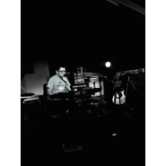

崔磊
============================

|  |  |
| :--: | :-- |
| [ 崔磊](https://i.xiami.com/cuilei) | **地区**: China 中国大陆 **风格**: 民谣流行 Folk Pop, 城市民谣 Urban Folk, 独立流行 Indie Pop, 国语流行 Mandarin Pop, 校园民谣 Campus Folk **播放数**: 1457552 **粉丝数**: 86 **评论数**: 8  |

## 档案

崔磊，沈阳人，音乐制作人，录音吉他手，职业乐手，编曲，缩混，词曲唱作人，北京现代音乐学院讲师 
关于我的歌曲只想记录那曾经流走的岁月和记忆........

## 专辑

| 名称 | 语种 | 唱片公司 | 发行时间 | 专辑类别 | 专辑风格 |
| :--: | :-- | :-- | :-- | :-- | :-- |
| [ 陌生的城市](./albums/2104867023.md) | 国语 | 百纳娱乐 | 2019年05月16日 | EP, 单曲 | 国语流行 Mandarin Pop |
| [ 那是爱情](./albums/2100292048.md) | 国语 | 咚吧嗒文化 | 2016年03月13日 | 录音室专辑 | 民谣流行 Folk Pop, 国语流行 Mandarin Pop |
| [ 这些年](./albums/2100292050.md) | 国语 | 独立发行 | 2016年03月13日 | 录音室专辑 | 民谣流行 Folk Pop, 城市民谣 Urban Folk, 国语流行 Mandarin Pop |
| [ 我猫在被窝里期盼爱情](./albums/1933776245.md) | 国语 | 独立发行 | 2015年06月08日 | EP, 单曲 | 民谣流行 Folk Pop, 城市民谣 Urban Folk, 国语流行 Mandarin Pop |

## 评论

|  |  |  |
| :-- | :-- | :-- |
|  [虾米用户](https://emumo.xiami.com/u/72502) 音乐可以改变人的心情！ 2020-03-23 10:15 赞(0) 踩(0) | 
nice！
 |
|  [虾米用户](https://emumo.xiami.com/u/15477519) 爱  是生命的和弦，而不... 2019-02-28 09:50 赞(0) 踩(0) | 
老师：希望你把《崔磊个人钢琴创作作品集》那张专辑上传 虾米…我很喜欢那张专辑的曲子…
 |
|  [虾米用户](https://emumo.xiami.com/u/51491983) 我还没想好要写什么... 2018-07-14 10:07 赞(0) 踩(0) | 
好听啊
 |
|  [虾米用户](https://emumo.xiami.com/u/15477519) 爱  是生命的和弦，而不... 2017-10-17 07:42 赞(0) 踩(0) | 
很有才华的音乐人…
 |
|  [虾米用户](https://emumo.xiami.com/u/253743779)  2017-07-07 09:33 赞(0) 踩(0) | 
加油
 |
|  [虾米用户](https://emumo.xiami.com/u/8481357)  2017-05-30 16:09 赞(0) 踩(0) | 
加油！
 |
| ⇒ |  [虾米用户](https://emumo.xiami.com/u/37359782)  2017-06-01 16:40 赞(0) 踩(0) | 
OK
 |
|  [虾米用户](https://emumo.xiami.com/u/37359782)  2015-06-08 22:27 赞(4) 踩(0) | 
我刚入驻了虾米音乐人，欢迎大家来我的个人主页，收听我的最新音乐
 |
