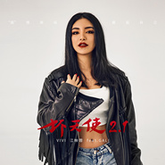

坏天使2.1
============================

|  |  |
| :--: | :-- |
| [ 坏天使2.1](https://emumo.xiami.com/album/2103484214) | **艺人**: [江映蓉](../index.md) **语种**: 国语 **唱片公司**: 传音播乐 **发行时间**: 2018年01月10日 **专辑类别**: EP, 单曲 **专辑风格**: 电子舞曲 EDM / Electronic Dance Music **播放数**: 257342 **收藏数**: 33 **评论数**: 16  |

## 简介

《坏天使2.1》是江映蓉联手国内说唱音乐新生代佼佼者咖喱GALI、海归音乐才女米欣MiXin、国内90后独立音乐人金子Gold Child等音乐人好友，共同创作出的一首极具欧美暗色调又性感到极致的Trapsoulrnb，是江映蓉在舞曲领域的又一次探索和突破之作。  
  
这首歌同名江映蓉第一首歌曲，是《坏天使》的全新升级版，讲述的是女性在爱情离开后的样子，遇情故纵、邂逅自己，想要通过歌曲传递一种又坏又性感的主义。“I'm being bad,How bad you wanna go,I'm being bad,Making you losing control”，用直白的歌词唱出简单的生活态度：哪怕我不完美、哪怕我很坏，我也要享受生活，活出属于我的精彩。  
  
江映蓉在这首歌里性感慵懒的欧美唱腔与GALI清澈又极富韵律感的Rap完美融合，相得益彰。编曲也尽量把控在极简，阴暗，性感和又凶狠的感觉，在中板舒缓的节奏中，也有密集的电子部分，从灰暗到光明，在迷醉、陷入感的同时，又提神，磅礴空旷的电音又充满力量，体会到灵魂、身体、血液更自由，又坏又治愈。  
  
备受瞩目的舞蹈部分则由全球顶级编舞大师Laure Courtellemont亲自操刀，江映蓉将会运用dancehall舞蹈的表达方式展示出一个成熟性感、独立自信的女性形象，这也是国内主流歌手首次对dancehall这种风格舞蹈的演绎。  
  
国内新生代音乐人、完全国际水准的编曲制作，国际最潮流的音乐和舞蹈、再结合东方人的演绎，完美的碰撞！让听众跟随旋律舞动之余，品味更加激动人心的中国原创音乐的力量。 

## 曲目

## 评论

|  |  |  |
| :-- | :-- | :-- |
|  [虾米用户](https://emumo.xiami.com/u/361287195) 暖暖的幸福(^o^)o甜... 2018-12-29 17:18 赞(0) 踩(0) | 
（ ）
 |
|  [虾米用户](https://emumo.xiami.com/u/327453260)  2018-11-10 15:20 赞(0) 踩(0) | 
✨
 |
|  [虾米用户](https://emumo.xiami.com/u/353558337) 我还没想好要写什么... 2018-09-01 11:46 赞(0) 踩(0) | 
国际化的编曲与江映蓉与生俱来的欧美嗓音结合，带来了这首坏天使2.1
 |
|  [虾米用户](https://emumo.xiami.com/u/3139881)  2018-05-26 01:17 赞(0) 踩(0) | 
歌曲很好听，欧美范十足。
 |
|  [虾米用户](https://emumo.xiami.com/u/1749440) 你好！こんにちは！Hi！ 2018-04-02 15:34 赞(0) 踩(0) | 
照片完全认不出来是谁。。。
 |
| ⇒ |  [虾米用户](https://emumo.xiami.com/u/351876155)  2018-05-04 17:21 赞(0) 踩(0) | 
春遊  i   ii噢                   i i iu    u uui      ui   u         u i iiuUI  uu           u  ui。i
 |
|  [虾米用户](https://emumo.xiami.com/u/43564886) 不是说冷门就不是好歌！ 2018-03-24 01:42 赞(2) 踩(0) | 
映蓉不火天理难容
 |
|  [虾米用户](https://emumo.xiami.com/u/38349272) 呛辣温顺，对立共生。 围... 2018-01-17 13:01 赞(1) 踩(0) | 
★★★★☆  如果说『小天后』跟『音乐人』间，她选择了后者，足以见得对音乐的热爱有多纯粹，这种热忱好过太多沽名逐利的虚荣，这是新的起点，时间会给她想要的。
 |
|  [虾米用户](https://emumo.xiami.com/u/323931382)   2018-01-12 14:28 赞(0) 踩(0) | 
期待MV
 |
|  [虾米用户](https://emumo.xiami.com/u/343648332)  2018-01-11 17:07 赞(0) 踩(0) | 
看封面没认出来。。。。。
 |
|  [虾米用户](https://emumo.xiami.com/u/4544) 我继续，你要随意 2018-01-11 16:41 赞(2) 踩(0) | 
看似很时髦，其实啥都没有的空洞
 |
|  [虾米用户](https://emumo.xiami.com/u/1271812) WX:Likejazzm... 2018-01-10 17:10 赞(0) 踩(0) | 
全中国都在跟风嘻哈
 |
|  [虾米用户](https://emumo.xiami.com/u/42810132) Aprés l'amou... 2018-01-10 17:03 赞(0) 踩(0) | 
何厚铧
 |
|  [虾米用户](https://emumo.xiami.com/u/289179403) 疯特 2018-01-10 12:26 赞(0) 踩(0) | 
中文的。
 |
|  [虾米用户](https://emumo.xiami.com/u/30004001) 找到你 2018-01-10 12:14 赞(0) 踩(0) | 
这个和上一首一模一样？
 |
|  [虾米用户](https://emumo.xiami.com/u/3932008) Two sunsets 2018-01-10 10:26 赞(0) 踩(0) | 
好想有一整张专辑！
 |
