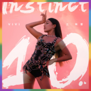

10
============================

|  |  |
| :--: | :-- |
| [ 10](https://emumo.xiami.com/album/2105240866) | **艺人**: [江映蓉](../index.md) **语种**: 国语 **唱片公司**: 乐动时代 **发行时间**: 2019年09月16日 **专辑类别**: EP, 单曲 **专辑风格**:  **播放数**: 332820 **收藏数**: 40 **评论数**: 16  |

## 简介

江映蓉VIVI  
第六张个人音乐作品  
第十年【本能觉醒】意识专辑 《10》/Instinct  
由乐动时代文化诚意发行  
咪咕和创「M+原创音乐孵化计划」重磅推荐  
一切回归自我，一切源自本能  
不强调变与不变，只分享她爱的音乐  
  
2019年，是江映蓉正式出道第十年。  
  
“快乐女声年度全国总冠军”  
“内地唱跳女艺人代表”  
“被埋没的那个女歌手”  
“你怎么还不火啊”  
……  
  
“各种正面的负面的鼓励的批评的声音里，十年，竟然就这么过来了。有时候，我觉得时间很漫长，但出过的五张唱片清楚地提醒着我3000多个日子里的欢笑和泪水；有时候，我觉得时间太快了，可是看到更年轻的面孔出现，甚至被开玩笑说自己是现在某些唱跳小鲜花的“前辈”甚至“前世”时，就还是会意识到：哦，现在真的已经不再是2009年的那个夏天啦。  
  
很多个夏天过去了，可是我还在唱，还是想唱下去。”  
——江映蓉  
  
出道十年的2019年，江映蓉带来成立个人工作室之后第一张专辑，《10》。  
  
“10”是十年，是出道的十周年纪念，也是每个知道“江映蓉”这个名字，听过她的歌，某一时刻在歌声里彼此有过交集和感动的人，一起走过的十年。  
  
“10”也是“1”和“0”共同构成。1就像直来直往的那条路，很诱惑，好像曾经在节目里拿到过冠军后，江映蓉期待着接下来通往梦想的路，能这样一路畅通；然后“0”出现了，原来还是要经过那么多曲折、环绕、崎岖、坎坷的道路，才能多靠近梦想一点点。就算绕了一大圈又回到了原点，那个重新回到原点的小花，也已经收获了很多，同样是一个圆满的过程。  
  
“10”，怎么念都可以，就像坚硬和柔软，其实是一回事，无所谓和无所畏的，也都是江映蓉，而这张专辑的英文名叫做“Instinct”——“本能”，是的，爱，音乐，运动……这些对于小花来说就像呼吸一样自然，完全发自体和内心本能的东西，都在这张专辑里分享给大家，我们应该尊重自然的本能，而不是盲目的欲望。  
  
江映蓉邀请与自己多次合作的著名女性音乐人崔迪担任《10》制作人，两个人从闺蜜到搭档之间的默契关系，让这张专辑确保是从江映蓉本人的想法出发，再和团队共同进行创作和升华，以“浴室音乐”为灵感线索，倡导一种全然放松、摆脱束缚的本能释放体验，无论听觉还是视觉，每首作品都有惊喜。  
  
企划、制作、视觉、舞蹈……每个环节，每个细节，江映蓉全部参与主导，将现阶段觉得最舒服、最适合自己的音乐，通过六首作品带给大家，并远赴法国、意大利拍摄视觉影像，单曲封面分别以紫色、橙色、蓝色、绿色、黄色、红色为主打，彰显江映蓉在音乐中不同个性色彩，最终完整了专辑封面的六色彩虹。  
  
过往的她，诠释过太多节奏感强劲的舞曲作品，尝试过各种热烈大胆的视觉表达，迈入出道第十年的她，对于音乐的触觉更为敏感，想要选择的表达方式也越发多元，她正思考着：在这个越来越快的时代，如果我换一种“慢”方式去唱歌，我们换一种“慢”视角去生活，是不是会有完全不一样的感受？  
  
第一波【变身主打】《我是你的猫》  
  
《我是你的猫》创作灵感，源于“猫奴”江映蓉，某天和自己的“儿子”，猫咪阿甘对视时的突发奇想——会不会，在猫的世界里，我们才是它们的宠物？于是，江映蓉用“交换视角”方式，在音乐中变身一只猫咪！ 整首歌以灵动节奏勾勒出“猫咪”内心世界，江映蓉把猫的不耐烦和小甜蜜诠释得栩栩如生，仿佛以声音扮演在我们耳畔不断扭动着的性感猫咪，跳脱传统EDM模式，在Pop-ish Deep House氛围中结合众多音乐元素，甚至在Bridge部分出现R&amp;B，演唱突出更多真声和气声交换，不再如之前舞曲那样强调力量感，也不刻意制造直白表象性感，带来另一种轻盈、慵懒、松弛的表达口吻，让听歌的人随着性感“猫步”舞动！  
  
第二波【感性主打】《Feeling good》  
  
“慢”、“舒”、“缓”，成为《Feeling good》关键词，不徐不疾散发一种“感性能量”，全新Contemporary Soul &amp;Future R&amp;B，独特的half time半速感，回覆式的旋律，让聆听者仿佛声临其境，和江映蓉徜徉完全放松的空间，“迷人的阳光，懒懒洒满我的窗口，音乐在重复，光着双脚跳起舞步”，沉浸只属于自己的柔软心房。《Feeling good》将女性在“性感”VS“感性”之间的表达方式，进行不动声色又酣畅淋漓的传达，听完整首歌，身心都好像进行了一场精神Spa般的舒压。  
  
第三波【自由主打】《Get Ready》  
  
聆听《Get Ready》，像用耳朵欣赏一部从上世纪80年代穿越而来的声音电影，江映蓉是那个活色生香的女主角，邀请我们跳进五光十色的舞池中央、乡间小路、城市街道、大地天空……所有人，都在她如梦如幻的演绎里肆意摆动身体，释放灵魂的自由！编曲放入诸多精致“时髦”线索——复古、放克风的Bass line，808式Cow bell和Roland鼓机，Talk box对讲机声码器效果，搭配江映蓉在主人声及和声反差感强烈的唱腔，以多重节奏感配合情绪变化，中英文交错的诠释方式，励志但避免盲目口号的表达主题，让整首歌热情而不矫情，热烈而不聒噪，打破时间与年代定义，回归江映蓉和制作团队“只要做好音乐”的初心。  
  
第四波【表白主打】《24/7》  
  
江映蓉第一首正式发表个人创作，打造复古式R&amp;B律动，同时融入当代模拟合成器和管风琴音色，Roland经典的贝斯音色和当代电子嘻哈的鼓机音色，让《24/7》散发出一种历久弥新的优雅之美，歌词像一首画面性十足的诗，讲述对心仪之人各种暧昧而性感的互动，甚至带着大胆“调情”色彩——“I get out of bed, my hair down，Afraid I’ll catch you around”，江映蓉厚实的真声，性感的气声，张弛有致的说唱和吟唱，带我们进入了奇妙空间，在这里，“24/7”变成一句用来表白的暗示，一把打开心门的钥匙，江映蓉在你耳边唱出了让人脸红耳热心跳的情话，但源自本能的爱如此干净而纯粹，正因为这样的爱，我们每时每刻的“活着”，才有了真正的意义。  
  
第五波【自我主打】《我爱我的泥垢》  
  
江映蓉觉得，这首歌最像自己。十年前还未修炼出强大的心脏，面对舆论的伤害只能通过内伤自己来达到平衡，跌跌撞撞一路走来，才终于明白十年前口口声声的爱自己终究只是表面，现在终于学会如何与自己相处，改变只为自己。“小孩子在乎别人的评价，大人在乎自己”，“我爱我的泥垢就是我爱我自己。”  
  
王海涛老师的词抓住了江映蓉健身带来的性感、美丽的一面，也强烈表达对待生活的态度——泥垢，是汗水游走后的产物，但同时它也代表着坚持的果实，辛劳带来的战绩。制作人兼曲作者崔迪老师放弃了最初构想的主流大线条Melody，大胆尝试新的方式，让江映蓉的vocal尝试一次新的表达，强烈的耳边诉说感加上副歌鬼马的演唱方式，再到第二段的Rap增加互动感，没有高音的攀比，只有态度的诠释。  
  
第六波【和解主打】《COMES ＆ GOES》  
  
复杂的 trap hi-hat样式和独特的pad效果，再加上vocal effect的淡入淡出，整首歌营造了一种更为暗色调的R&amp;B曲风。初听到曲作者崔迪的demo时，江映蓉便想起了往事，无论是对于自己，还是对于粉丝，彼此都在相遇的那段日子里付出全部，不留遗憾就够了。人生的“来来往往”都是常态，小花希望当自己在别人生命中短暂停留的时候，带去的是乐观笑容、积极向上、敢于做自己的状态，留下真实的自己。  
  
“这是我成立工作室后的第一张专辑。  
我知道肯定还有各种不完美，但是我们都知道完美只是一个相对的标准，就像现在的我，已经不再会因为别人的否定而轻易地去改变外在和内在了，是音乐和你们的支持让我自信、知足、平和，让我对这张将和你们见面的专辑充满感恩。  
  
江映蓉《10》。  
十年，谢谢你们，让我还是爱唱歌的江映蓉。”  
  
本专辑歌曲之词曲、录音、录像等作品版权均属乐动时代(北京)文化传播有限公司全权所有或被授权使用，未经乐动时代(北京)文化传播有限公司书面许可，请勿翻唱或使用。 

## 曲目

## 评论

|  |  |  |
| :-- | :-- | :-- |
|  [虾米用户](https://emumo.xiami.com/u/18647503) 回忆经典 2020-04-23 03:03 赞(0) 踩(0) | 
江映蓉很全面的歌手
 |
|  [虾米用户](https://emumo.xiami.com/u/13276227) 我还没想好要写什么... 2020-04-09 03:58 赞(0) 踩(0) | 
为数不多有版权的专辑
 |
|  [虾米用户](https://emumo.xiami.com/u/32126406) 身体住了个老灵魂 2020-04-08 03:44 赞(0) 踩(0) | 
编曲就是欧美当代流行风啊厉害哈哈~
 |
|  [虾米用户](https://emumo.xiami.com/u/434600184)  2019-12-24 07:26 赞(0) 踩(0) | 
❤️❤️❤️vivi赞爆
 |
|  [虾米用户](https://emumo.xiami.com/u/430868838) 我还没想好要写什么... 2019-11-21 20:14 赞(0) 踩(0) | 
诚意之作，很好听！
 |
|  [虾米用户](https://emumo.xiami.com/u/37734184) 田馥甄 第5張全新個人專... 2019-10-10 22:15 赞(0) 踩(0) | 
很棒啊
 |
|  [虾米用户](https://emumo.xiami.com/u/327539642)  2019-09-17 16:25 赞(1) 踩(0) | 
很舒服很好听
 |
|  [虾米用户](https://emumo.xiami.com/u/250947572)  2019-09-17 14:08 赞(3) 踩(0) | 
内地为数不多的高级！
 |
|  [虾米用户](https://emumo.xiami.com/u/38349272) 呛辣温顺，对立共生。 围... 2019-09-16 17:48 赞(3) 踩(0) | 
预置2020第4届CMA唱工委音乐盛典年度最佳舞曲专辑\年度最佳舞曲表演。
 |
|  [虾米用户](https://emumo.xiami.com/u/3932008) Two sunsets 2019-09-16 15:28 赞(1) 踩(0) | 
出乎意料地好
 |
|  [虾米用户](https://emumo.xiami.com/u/200343011) 嘿 我真的好想你 2019-09-16 15:12 赞(1) 踩(0) | 
年度最喜欢专辑
 |
|  [虾米用户](https://emumo.xiami.com/u/2893404)  2019-09-16 08:26 赞(3) 踩(0) | 
年度必听
 |
|  [虾米用户](https://emumo.xiami.com/u/31531934) 恋の道に近道はない 2019-09-16 00:44 赞(1) 踩(0) | 
必须大家都来聆听收藏你的分享收藏是给音乐人最大的鼓舞 谢谢大家支持
 |
|  [虾米用户](https://emumo.xiami.com/u/203017284)  2019-09-15 20:32 赞(1) 踩(0) | 

 |
| ⇒ |  [虾米用户](https://emumo.xiami.com/u/200343011) 嘿 我真的好想你 2019-09-16 17:11 赞(0) 踩(0) | 
头像？？
 |
|  [虾米用户](https://emumo.xiami.com/u/353558337) 我还没想好要写什么... 2019-09-13 20:02 赞(3) 踩(0) | 
首首精品，期待全砖发布
 |
