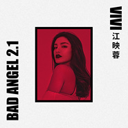

江映蓉
============================

|  |  |
| :--: | :-- |
| [ 江映蓉](https://i.xiami.com/jiangyingrong) | **地区**: China 中国大陆 **风格**: 国语流行 Mandarin Pop **播放数**: 9937637 **粉丝数**: 3559 **评论数**: 144  |

## 档案

姓名：江映蓉 
性别：女 
生日：1988.02.01 
星座：水瓶座 
昵称：唯唯，VIVI，江小花 
籍贯：四川·成都 
粉丝团：萤火虫 
身高：168CM 
院校：北京现代音乐研修学院 欧美流行演唱系 
喜欢的音乐：Hip—Hop Jazz R&B House 
喜欢的歌手：小甜甜布兰妮 克里斯汀娜 玛丽亚凯莉 李玟 碧昂斯 宇多田光 席林迪翁 王力宏 Jennifer Lopez 顺子 王菲 J—Z 艾米娜姆 迈克尔·杰克逊 
爱好：游泳 打篮球 打网球 打高尔夫 
所获荣誉：2007年 伊利全国大学生音乐节前四强 
2007年 伊利全国大学生音乐节最具潜力女歌手 
2008年 在贺岁片命运呼叫转移中演唱插曲《七月》 
2008年 绝对唱响北京赛区八强 
2009年 在中国网络音乐节中获得银奖 
2009年 快乐女声成都赛区25强、全国十强(目前) 
江映蓉是个对音乐很]执着的开朗女孩 
其实她是个很男孩子气的女孩，从小就在部队长大，性格就很大大咧咧，崇尚积极的生活态度。从小就爱和音乐打交道，眼下最需要做好的就是认真的去准备比赛，希望每一次的登台都让自己无憾。就像我说的：只因喜欢，所以歌唱。 
在大学生音乐节上，有一个选手每场都能引起大家的关注，不仅是原于她出色的声音条件和可塑性强的外型，更是原于她复杂多变的个性。她在舞台上总是神采飞扬地表演，拼命地笑着；当有其他选手要被淘汰时，她转眼间就会有180度的情绪大转变，在舞台上泣不成声；而现场形势有所变化时，她又可以破涕为笑。 
她是舞台上最爱哭也是最爱笑的一个选手。评委们都笑称她是“太阳雨”。有人说她有做演员的潜质，有人说她的性格有些神经质，而熟悉她的人则知道她的性格有很大程度上与其家庭背景有关。 
不幸的家庭 艰辛的成长 
儿时的江映蓉，俨然一个无忧无虑的小公主。父亲有钱有地位，小映蓉一直过着异常优越的生活，她的生活中充满了阳光。然而，人生总有许多意外。 
12岁那年，生活跟她开了一个大大的玩笑——父母离异。小映蓉哭喊着跪下来求父亲不要走，父亲无动于衷。经济上，父亲有求必应；生活上，父亲不闻不问；精神上，父爱严重缺失。从此，映蓉开始变得多愁善感起来，经常会莫名地流眼泪。 
慢慢地，周围朋友的关爱使江映蓉走出了那段阴影。这段时间让映蓉懂得了感恩，学会了坚强，学会了以微笑面对不幸。也许是因为自己有过太多痛苦的经历，她只想把自己快乐的东西与朋友分享，她会拼命地把自己的爱给予身边的每个朋友，她太渴望给身边的人能带来快乐了。比赛现场，每次看到其他选手带着失落和遗憾离开舞台，善良的映蓉都会伤心落泪；看到患病朋友的VCR，她会在舞台上失声痛哭；当与其他选手单挑时，江映蓉反而会微笑着面对，还不时地去安慰对方；当自己受到评委的质疑和批评时，她也是微笑着面对。看到朋友失意时，她是如此的脆弱；而面对自己的失落，她却是如此的坚强。 
所有人眼中，江映蓉像个“傻大姐”，没心没肺地笑 ，没心没肺地哭。而5进4那场比赛中，评委谭伊哲一语道破江映蓉略带神经质的性格：“她哭，是为别人的离开而难过；她笑，是因为不愿让人看到自己伤感的东西，所以拼命地笑，来掩盖内心的悲伤。”

## 专辑

| 名称 | 语种 | 唱片公司 | 发行时间 | 专辑类别 | 专辑风格 |
| :--: | :-- | :-- | :-- | :-- | :-- |
| [ 钻石心](./albums/5022598939.md) | 国语 | 众匠文化 | 2021年01月26日 | EP, 单曲 |  |
| [ 当天真遇见爱情 O.S.T](./albums/5022515205.md) | 国语 | 芒果娱乐 | 2021年01月18日 | 原声带, 影视音乐 | 原声 Soundtrack |
| [ 回光](./albums/5021378285.md) | 国语 | 天浩盛世 | 2020年08月27日 | EP, 单曲 |  |
| [ 感谢每一个你](./albums/2420340548.md) | 国语 | 梦织音 | 2020年02月29日 | EP, 单曲 | 国语流行 Mandarin Pop |
| [ 10](./albums/2105240866.md) | 国语 | 乐动时代 | 2019年09月16日 | EP, 单曲 |  |
| [ Never Let You Go](./albums/2104948616.md) | 国语 | 乐享天承 | 2019年06月18日 | EP, 单曲 | 电子乐 Electronica |
| [ 天黑之前](./albums/2104906947.md) | 国语 | 字跳网络 | 2019年05月29日 | EP, 单曲 | 国语流行 Mandarin Pop |
| [ 红](./albums/2104657830.md) | 国语 | New One Studio | 2019年03月08日 | EP, 单曲 | 国语流行 Mandarin Pop |
| [ 重新定义](./albums/2104362570.md) | 国语 | 传音播乐 | 2018年12月10日 | EP, 单曲 | 浩室舞曲 House |
| [ 抱一抱自己](./albums/2103968994.md) | 国语 | 传音播乐 | 2018年09月04日 | EP, 单曲 |  |
| [ 胖子也有行动队](./albums/2103828030.md) | 国语 | 自在天浩 | 2018年07月20日 | EP, 单曲 | 国语流行 Mandarin Pop |
| [ 坏天使2.1](./albums/2103484214.md) | 国语 | 传音播乐 | 2018年01月10日 | EP, 单曲 | 电子舞曲 EDM / Electronic Dance Music |
| [ Bad Angel 2.1](./albums/2103463172.md) | 国语 | 传音播乐 | 2017年12月27日 | EP, 单曲 |  |
| [ Why Not](./albums/2102414079.md) | 国语 | 天娱传媒 | 2017年01月04日 | EP, 单曲 |  |
| [ 爱如传奇](./albums/2100378850.md) | 国语 | 海茗文化 | 2016年08月12日 | EP, 单曲 |  |
| [ 我，不是我](./albums/1236178806.md) | 国语 | 天娱传媒 | 2015年11月04日 | EP, 单曲 | 流行舞曲 Dance-Pop |
| [ Beautiful Light](./albums/1786320678.md) | 国语 | 恒大音乐 | 2013年12月06日 | EP, 单曲 |  |
| [ DV现场](./albums/5020379119.md) | 其他 | 天娱传媒 | 2013年11月08日 | EP, 单曲 |  |
| [ DV](./albums/683727403.md) | 国语 | 天娱传媒 | 2013年11月06日 | EP, 单曲 |  |
| [ Turn Up The Love](./albums/1771523741.md) | 国语 | 天娱传媒 | 2013年06月18日 | EP, 单曲 |  |
| [ 发生秀Fashion Show](./albums/563670212.md) | 国语 | 天娱传媒 | 2013年03月19日 | EP, 单曲 | 国语流行 Mandarin Pop |
| [ 发生秀Fashion Show](./albums/5020393084.md) | 其他 | 天娱传媒 | 2013年03月05日 | EP, 单曲 |  |
| [ 3 2 1 Fight](./albums/522465.md) | 国语 | 天娱传媒 | 2012年06月13日 | EP, 单曲 |  |
| [ 女人帮](./albums/462137.md) | 国语 | 天娱传媒 | 2011年09月16日 | EP, 单曲 | 国语流行 Mandarin Pop |
| [ 坏天使](./albums/400577.md) | 国语 | 天娱传媒 | 2010年09月13日 | 录音室专辑 | 国语流行 Mandarin Pop |
| [ 漂亮](./albums/424253.md) | 国语 | 天娱传媒 | 2010年05月15日 | EP, 单曲 |  |
| [ 一起来挑麦](./albums/442669.md) | 国语 | 天娱传媒 | 2009年09月24日 | EP, 单曲 |  |

## 评论

|  |  |  |
| :-- | :-- | :-- |
|  [虾米用户](https://emumo.xiami.com/u/430626979)  2021-02-01 11:50 赞(0) 踩(0) | 
祝江映蓉姐姐生日快乐
 |
|  [虾米用户](https://emumo.xiami.com/u/3140019) 天马行空 2021-02-01 11:36 赞(0) 踩(0) | 

 |
|  [虾米用户](https://emumo.xiami.com/u/3140019) 天马行空 2021-02-01 11:35 赞(0) 踩(0) | 
生日快乐
 |
|  [虾米用户](https://emumo.xiami.com/u/19491826)  2021-02-01 10:29 赞(0) 踩(0) | 
Happy Birthday to the real person... Don&amp;rsquo;t give up, fighting....
 |
|  [虾米用户](https://emumo.xiami.com/u/8770123)  2020-12-21 17:09 赞(0) 踩(0) | 
我不是欧美风的粉丝但是喜欢你的歌 
 |
|  [虾米用户](https://emumo.xiami.com/u/8770123)  2020-12-21 17:05 赞(0) 踩(0) | 
就是歌太少了   
 |
|  [虾米用户](https://emumo.xiami.com/u/444164681) 我最帅 2020-07-18 19:01 赞(1) 踩(0) | 
空位空位空位空位空位空位
 |
|  [虾米用户](https://emumo.xiami.com/u/32126406) 身体住了个老灵魂 2020-04-08 03:42 赞(2) 踩(0) | 
明明几届超女中最有欧美气质的唱跳女歌手，就是毁在了天娱手里！
 |
|  [虾米用户](https://emumo.xiami.com/u/352922009)  2020-03-29 19:40 赞(0) 踩(0) | 
你是本人吗
 |
|  [虾米用户](https://emumo.xiami.com/u/200343011) 嘿 我真的好想你 2019-09-09 19:21 赞(1) 踩(0) | 
江映蓉也太棒了吧
 |
|  [虾米用户](https://emumo.xiami.com/u/32126406) 身体住了个老灵魂 2019-06-18 00:32 赞(3) 踩(0) | 
她跟袁维娅一样唱英文歌真的很棒！
 |
|  [虾米用户](https://emumo.xiami.com/u/1499382)   2019-05-29 17:09 赞(1) 踩(0) | 
推荐江映蓉的 七月
 |
|  [虾米用户](https://emumo.xiami.com/u/7762529) 岁月流逝只为他们的弥留 2019-05-29 16:03 赞(1) 踩(0) | 
感觉这孩子整容整得厉害啊。
 |
|  [虾米用户](https://emumo.xiami.com/u/289179403) 疯特 2019-04-06 20:12 赞(1) 踩(0) | 
越来越好，老江加油
 |
|  [虾米用户](https://emumo.xiami.com/u/353558337) 我还没想好要写什么... 2019-02-01 10:00 赞(3) 踩(0) | 
生日快乐！
 |
|  [虾米用户](https://emumo.xiami.com/u/248747287) 我还没想好要写什么... 2019-01-09 16:40 赞(6) 踩(0) | 
努力add oil(加油）、香港的朋友會支持妳的！
 |
|  [虾米用户](https://emumo.xiami.com/u/289179403) 疯特 2018-12-31 11:41 赞(0) 踩(0) | 
my queen
 |
|  [虾米用户](https://emumo.xiami.com/u/289179403) 疯特 2018-12-31 11:41 赞(0) 踩(0) | 
love u
 |
|  [虾米用户](https://emumo.xiami.com/u/410600625)  2018-12-15 23:21 赞(1) 踩(0) | 
爱你，小花
 |
|  [虾米用户](https://emumo.xiami.com/u/3140019) 天马行空 2018-11-21 10:25 赞(1) 踩(0) | 
她的声音更Donna summer有相似
 |
|  [虾米用户](https://emumo.xiami.com/u/23565095) 生活在幻觉之中并为这些幻... 2018-11-17 04:06 赞(4) 踩(0) | 
我依然记得我知道江映蓉和天娱签约的那天我陷入了绝望。
 |
|  [虾米用户](https://emumo.xiami.com/u/408455369)  2018-11-12 17:39 赞(3) 踩(0) | 
加油，永远的冠军 
 |
|  [虾米用户](https://emumo.xiami.com/u/3140019) 天马行空 2018-11-04 00:41 赞(3) 踩(0) | 
她没红应该是大环境吧，根本都是保守派为主，韩流都算保守，欧美风跟共产风根本对立
 |
|  [虾米用户](https://emumo.xiami.com/u/49951785) ~ 2018-10-14 15:02 赞(3) 踩(0) | 
天娱根本不懂发掘她的潜力，赶紧解约签新东家吧
 |
|  [虾米用户](https://emumo.xiami.com/u/291048351) 我还没想好要写什么... 2018-05-29 20:52 赞(1) 踩(0) | 
陪伴我少女时代的歌手，快乐女声
 |
|  [虾米用户](https://emumo.xiami.com/u/291048351) 我还没想好要写什么... 2018-05-29 20:51 赞(0) 踩(0) | 
快点出新歌吧！有实力的歌手，别埋没了
 |
|  [虾米用户](https://emumo.xiami.com/u/3140019) 天马行空 2018-05-25 03:30 赞(2) 踩(0) | 
真的好可惜她
 |
|  [虾米用户](https://emumo.xiami.com/u/143243198)  2018-04-04 23:54 赞(0) 踩(0) | 
电梯上的那张真的好美啊
 |
|  [虾米用户](https://emumo.xiami.com/u/58654252)  2018-03-24 00:57 赞(3) 踩(0) | 
加油
 |
|  [虾米用户](https://emumo.xiami.com/u/34979426) 再见了，希望可以再相见 2018-03-06 12:52 赞(3) 踩(0) | 
版权终于回来了 小时候的回忆
 |
|  [虾米用户](https://emumo.xiami.com/u/42810132) Aprés l'amou... 2018-01-10 17:04 赞(0) 踩(0) | 
何厚铧
 |
|  [虾米用户](https://emumo.xiami.com/u/10000610) 有人造屋 有人绣花 有人... 2018-01-05 04:04 赞(15) 踩(0) | 
我倒是一直很吃江映蓉的颜。
 |
|  [虾米用户](https://emumo.xiami.com/u/133219)  2017-10-27 23:35 赞(4) 踩(0) | 
江映蓉获得年度青少年最喜爱的女歌手提名 赶快来投票 颁奖盛典在2015年2月8日 北京中国人民大学举行 <a href="http://edu.qq.com/zt2015/campusstartp/index.htm?plg_auth=1" target="_blank" rel="nofollow noreferrer noopener">http://edu.qq.com/zt2015/campusstartp/index.htm?plg_auth=1</a>
 |
|  [虾米用户](https://emumo.xiami.com/u/49788147) 丝碧德 2017-10-07 00:58 赞(19) 踩(0) | 
其实很棒的一个艺人，如果生在欧美，可能已经是一代唱跳diva了，可惜在大陆这种喜欢抒情垃圾的地方火不了
 |
|  [虾米用户](https://emumo.xiami.com/u/7467413) 你快聽聽聽 在我背後千里... 2017-06-06 09:06 赞(32) 踩(0) | 
天娱毁了她，也埋葬了无数个如她一般的优秀艺人。。。
 |
| ⇒ |  [虾米用户](https://emumo.xiami.com/u/8269111) 有了滑板鞋天黑都不怕 2018-04-04 17:08 赞(0) 踩(0) | 
湖南台做节目很有经验 但是频道气质太快手 包装艺人这些方面都太土了
 |
|  [虾米用户](https://emumo.xiami.com/u/290498023)  2017-04-22 09:12 赞(1) 踩(0) | 
江小花 江老公
 |
|  [虾米用户](https://emumo.xiami.com/u/270792960)  2017-02-04 21:10 赞(1) 踩(0) | 
江映蓉
 |
|  [虾米用户](https://emumo.xiami.com/u/49368596) 给世界一个微笑！ 你离我... 2017-01-05 01:08 赞(0) 踩(0) | 
     
 |
|  [虾米用户](https://emumo.xiami.com/u/97747450) 我还没想好要写什么... 2016-09-26 18:45 赞(1) 踩(0) | 
4273
 |
|  [虾米用户](https://emumo.xiami.com/u/209584959)  2016-08-31 18:28 赞(0) 踩(0) | 
      
 |
|  [虾米用户](https://emumo.xiami.com/u/2152213)  2016-06-01 12:28 赞(0) 踩(0) | 
英文名直接叫VIVO多好，肯定火，一_一
 |
|  [虾米用户](https://emumo.xiami.com/u/44299983)  2016-02-18 22:15 赞(1) 踩(0) | 
中国内地舞曲 也就想到江映蓉了
 |
|  [虾米用户](https://emumo.xiami.com/u/44299983)  2016-01-03 16:04 赞(1) 踩(0) | 
有实力啊 就是缺平台让更多人看到她
 |
|  [虾米用户](https://emumo.xiami.com/u/44299983)  2016-01-03 16:03 赞(3) 踩(0) | 
内地舞曲 有实力的也就江映蓉了吧 很有台风 唱跳都不错 有气场 也带些欧美范 也许是对唱跳歌手的关注少 她一直没大火 真是有实力的歌手
 |
|  [虾米用户](https://emumo.xiami.com/u/4163880)  2016-01-01 00:34 赞(1) 踩(0) | 
其实讲到舞曲，还有安又琪呢。都很可惜。内地舞曲蛋糕不大，都分不了几口。
 |
|  [虾米用户](https://emumo.xiami.com/u/4163880)  2016-01-01 00:32 赞(23) 踩(0) | 
我觉得她比张靓颖洋气……
 |
|  [虾米用户](https://emumo.xiami.com/u/44299983)  2015-12-21 18:41 赞(1) 踩(0) | 
很有实力的歌手  就是缺平台
 |
|  [虾米用户](https://emumo.xiami.com/u/41021670)   2015-09-22 21:37 赞(4) 踩(0) | 
其实我并不是vivi的粉，只是一个同学非常非常喜欢她而已。。但我好希望她红起来呀。。
 |
|  [虾米用户](https://emumo.xiami.com/u/5810689) 美版monster饮料 2015-09-18 17:14 赞(0) 踩(0) | 
如花啊，高难度开衩。
 |
|  [虾米用户](https://emumo.xiami.com/u/3997808) beethoven is... 2015-08-15 18:30 赞(2) 踩(0) | 
野浪骚型歌手。
 |
|  [虾米用户](https://emumo.xiami.com/u/1182761) 松任谷由实的迷弟 2015-07-25 19:33 赞(1) 踩(0) | 
期待一下，前学姐···
 |
|  [虾米用户](https://emumo.xiami.com/u/52815351)  2015-07-25 14:14 赞(1) 踩(0) | 
黄小芸最喜欢江映蓉
 |
|  [虾米用户](https://emumo.xiami.com/u/47862333) 用微笑来面对未知的一些切... 2015-07-20 13:06 赞(1) 踩(0) | 
小花，加油！
 |
|  [虾米用户](https://emumo.xiami.com/u/37716201)   2015-07-15 16:22 赞(1) 踩(0) | 
wait for you江映蓉❤️
 |
|  [虾米用户](https://emumo.xiami.com/u/45704336)  2015-07-15 01:12 赞(0) 踩(0) | 
虾米音乐。。
 |
|  [虾米用户](https://emumo.xiami.com/u/45704336)  2015-07-15 01:10 赞(0) 踩(0) | 
虾米音乐。。。。
 |
|  [虾米用户](https://emumo.xiami.com/u/7669843) 时间很浅，回忆很深。 2015-07-14 21:16 赞(0) 踩(0) | 
她唱的歌还是要听一下的
 |
|  [虾米用户](https://emumo.xiami.com/u/3746453) 谢谢虾米温暖的你们：） 2015-04-16 22:07 赞(4) 踩(0) | 
艺人头像拍的真好，修片师把皮肤修的也很有质感，虽然我不是她的粉，但不得不说美
 |
|  [虾米用户](https://emumo.xiami.com/u/35704619)  2015-03-08 21:40 赞(1) 踩(0) | 
爱她
 |
|  [虾米用户](https://emumo.xiami.com/u/45704336)  2015-03-05 21:03 赞(0) 踩(0) | 
期待新专辑！！！
 |
|  [虾米用户](https://emumo.xiami.com/u/47862333) 用微笑来面对未知的一些切... 2015-03-05 20:50 赞(1) 踩(0) | 
很有实力的歌手！新歌好听，期待更多作品。
 |
|  [虾米用户](https://emumo.xiami.com/u/45704336)  2015-03-05 15:35 赞(0) 踩(0) | 
新歌出来了！！好听！
 |
|  [虾米用户](https://emumo.xiami.com/u/45704336)  2015-02-19 21:09 赞(0) 踩(0) | 
马上就要出新歌了！！！哈哈，我已经准备好了！！
 |
|  [虾米用户](https://emumo.xiami.com/u/32268916)  2015-02-13 00:31 赞(37) 踩(0) | 
超女出身的要说张靓颖走的是国际diva风，那么江映蓉走的就是欧美大妞风，而且一点也不别扭，内地的能走得这么不水土不服的真是凤毛麟角，天娱也抓歌手特色风格很准，可惜就是不肯花钱请欧美的制作人写歌，要不然这妞真是大有潜力啊！！
 |
| ⇒ |  [虾米用户](https://emumo.xiami.com/u/45704336)  2015-02-19 21:08 赞(0) 踩(0) | 
一句话就是公司不给力
 |
|  [虾米用户](https://emumo.xiami.com/u/6819695) 我还没想好要写什么... 2015-02-01 20:03 赞(26) 踩(0) | 
其实她潜力完全不输张靓颖 声音韧性强 把握歌曲的能力也不弱
 |
|  [虾米用户](https://emumo.xiami.com/u/45704336)  2015-01-19 10:47 赞(0) 踩(0) | 
我每次听你的歌我的心情就会好，加油
 |
|  [虾米用户](https://emumo.xiami.com/u/45704336)  2015-01-19 10:47 赞(2) 踩(0) | 
从2009到现在2015，已经是第六个年头了，加油，萤火虫一直在
 |
|  [虾米用户](https://emumo.xiami.com/u/45704336)  2015-01-19 10:46 赞(0) 踩(0) | 
要发歌了，我等你的歌哦！！
 |
|  [虾米用户](https://emumo.xiami.com/u/45704336)  2015-01-06 16:28 赞(2) 踩(0) | 
舞曲歌手本来在华语歌手中就不占优势，但是相信内地舞曲歌手有你的位置
 |
|  [虾米用户](https://emumo.xiami.com/u/9900144)   2015-01-04 21:15 赞(0) 踩(0) | 
加油
 |
|  [虾米用户](https://emumo.xiami.com/u/41856004) 暂无签名~ 2014-12-31 00:31 赞(0) 踩(0) | 
一年都没有新歌？天娱快去死吧
 |
|  [虾米用户](https://emumo.xiami.com/u/6819695) 我还没想好要写什么... 2014-11-28 21:50 赞(0) 踩(0) | 
88年？参加比赛时才21岁？！
 |
| ⇒ |  [虾米用户](https://emumo.xiami.com/u/2523233) 太热 2015-05-24 19:31 赞(0) 踩(0) | 
你数学是体育老师教的啊。。
 |
| ⇒ |  [虾米用户](https://emumo.xiami.com/u/6819695) 我还没想好要写什么... 2015-05-28 22:02 赞(0) 踩(0) | 
<q><b>ROARRRRoyals说：</b></q>
 |
|  [虾米用户](https://emumo.xiami.com/u/44136992)  2014-11-27 08:04 赞(0) 踩(0) | 
喜欢你
 |
|  [虾米用户](https://emumo.xiami.com/u/43468968) 暂无签名~ 2014-11-16 11:40 赞(0) 踩(0) | 
挺你到最后
 |
|  [虾米用户](https://emumo.xiami.com/u/43468968) 暂无签名~ 2014-11-16 11:39 赞(0) 踩(0) | 
别管外界怎么说
 |
|  [虾米用户](https://emumo.xiami.com/u/43468968) 暂无签名~ 2014-11-16 11:39 赞(0) 踩(0) | 
支持你
 |
|  [虾米用户](https://emumo.xiami.com/u/43468968) 暂无签名~ 2014-11-16 11:39 赞(0) 踩(0) | 
加油
 |
|  [虾米用户](https://emumo.xiami.com/u/43468968) 暂无签名~ 2014-11-16 11:39 赞(0) 踩(0) | 
你的舞蹈绝对没话可说
 |
|  [虾米用户](https://emumo.xiami.com/u/43468968) 暂无签名~ 2014-11-16 11:38 赞(0) 踩(0) | 

 |
|  [虾米用户](https://emumo.xiami.com/u/43468968) 暂无签名~ 2014-11-16 11:38 赞(0) 踩(0) | 
到时候你发了新专辑了我会来看看可爱的虾米是怎么给你宣传的
 |
|  [虾米用户](https://emumo.xiami.com/u/43468968) 暂无签名~ 2014-11-16 11:38 赞(0) 踩(0) | 
期待你新专辑
 |
|  [虾米用户](https://emumo.xiami.com/u/43468968) 暂无签名~ 2014-11-16 11:38 赞(0) 踩(0) | 
我不用虾米了
 |
|  [虾米用户](https://emumo.xiami.com/u/43468968) 暂无签名~ 2014-11-16 11:37 赞(0) 踩(0) | 
江映蓉我爱你
 |
|  [虾米用户](https://emumo.xiami.com/u/43468968) 暂无签名~ 2014-11-15 18:45 赞(0) 踩(0) | 
加油
 |
|  [虾米用户](https://emumo.xiami.com/u/43468968) 暂无签名~ 2014-11-09 10:14 赞(0) 踩(0) | 
如果你换了公司发展肯定会更好离开天娱吧
 |
|  [虾米用户](https://emumo.xiami.com/u/43468968) 暂无签名~ 2014-11-09 10:13 赞(0) 踩(0) | 
期待新专辑
 |
|  [虾米用户](https://emumo.xiami.com/u/43468968) 暂无签名~ 2014-11-09 09:44 赞(0) 踩(0) | 
跨年
 |
|  [虾米用户](https://emumo.xiami.com/u/43468968) 暂无签名~ 2014-11-08 20:09 赞(0) 踩(0) | 
离开天娱吧
 |
|  [虾米用户](https://emumo.xiami.com/u/43468968) 暂无签名~ 2014-11-08 20:09 赞(0) 踩(0) | 
爱你
 |
|  [虾米用户](https://emumo.xiami.com/u/4422152)   2014-11-03 14:36 赞(0) 踩(0) | 
我居然才看到跨年晚会的Applause= =忍不住来嘲讽一下
 |
|  [虾米用户](https://emumo.xiami.com/u/1401579)  2014-06-20 21:20 赞(3) 踩(0) | 
舞曲本身是有艳丽浮夸的特质，但这并不代表舞曲歌手比起抱吉他搞创作的歌手来就低人一等， 相反，市场环境决定了做舞曲要更辛苦，更卖力，更不讨好。 华语歌迷一个通病就是不懂得珍惜当下，珍惜眼前。 行行出状元，音乐曲风也一样，我相信几年之后讨论起华语舞曲来，是会有江映蓉的一席之地的。
 |
|  [虾米用户](https://emumo.xiami.com/u/9900144)   2014-06-10 15:20 赞(3) 踩(0) | 
喜欢江映蓉的舞曲 有潜力
 |
|  [虾米用户](https://emumo.xiami.com/u/31149525) 耶诞快乐. 2014-05-25 01:42 赞(0) 踩(0) | 
小赵薇
 |
|  [虾米用户](https://emumo.xiami.com/u/2469195) 我还没想好要写什么... 2014-05-10 01:00 赞(0) 踩(0) | 
实力是有的 就差代表曲
 |
|  [虾米用户](https://emumo.xiami.com/u/11180501)  2014-04-18 12:57 赞(2) 踩(0) | 
离开天娱，这是江映蓉目前最该做的事
 |
|  [虾米用户](https://emumo.xiami.com/u/1382694)  2014-02-21 17:32 赞(0) 踩(0) | 
怎么说呢~声音没有什么辨析度啊太平了
 |
|  [虾米用户](https://emumo.xiami.com/u/7428862)  2013-12-16 20:06 赞(0) 踩(0) | 
也许我不喜欢你的音乐，但是你真的是一个很善良的姑娘
 |
|  [虾米用户](https://emumo.xiami.com/u/2641396)  2013-11-22 22:53 赞(0) 踩(0) | 
其实她声音挺好的
 |
| ⇒ |  [虾米用户](https://emumo.xiami.com/u/5184976) 我恨你 2013-12-02 17:16 赞(0) 踩(0) | 
你还喜欢 江映蓉 啊？  PS.  四川就是出歌姬
 |
|  [虾米用户](https://emumo.xiami.com/u/4490465) OAC 2013-11-11 10:42 赞(0) 踩(0) | 
坏天使那张质量其实挺高的 里面有很多很好听的口水歌
 |
|  [虾米用户](https://emumo.xiami.com/u/1603133)  2013-09-14 20:56 赞(50) 踩(0) | 
要是签给百代华纳啥的 她就不会被这样埋没在天娱的
 |
|  [虾米用户](https://emumo.xiami.com/u/11686411) 呵呵呵 2013-05-29 23:54 赞(0) 踩(0) | 
声音
 |
|  [虾米用户](https://emumo.xiami.com/u/248238) 我胡汉三又回来了 2013-03-27 14:46 赞(0) 踩(0) | 
我觉得是内地少有的歌手。真的很不错。
 |
|  [虾米用户](https://emumo.xiami.com/u/5880322) 发觉自己喜欢的音乐 2013-03-23 17:51 赞(0) 踩(0) | 
其实她的发展潜力还是蛮大的
 |
|  [虾米用户](https://emumo.xiami.com/u/325448)  2013-03-22 20:10 赞(1) 踩(0) | 
再不给发二专她真的要废了 发生秀不错
 |
|  [虾米用户](https://emumo.xiami.com/u/10547530) 生于白昼，隐与黑夜。 2013-03-21 21:39 赞(89) 踩(0) | 
这孩子赶得时候不对——往前错过了芒果台选秀的全盛时期，和她的三位师姐，包括李宇春、周笔畅和张靓颖起步时一个亿的关注度就差了一大截。往后又是海蓝的大热选秀节目——后来居上的吉克隽逸和李莫愁都是太有个人风格的歌手。生存在唱片界这个夹缝中，作为一个半新不旧的歌手很吃亏。因为她已经让人们没有了新鲜感。就算天娱努力捧着，但迄今为止，看得出来，后继乏力。————自然，尚雯婕是个异数。一开始人们当笑话去看她。但她撑过来了，我们就开始用赞叹去看她。因为她有胆量，也有坚持的力量。
 |
| ⇒ |  [虾米用户](https://emumo.xiami.com/u/21158133)  2013-12-07 19:08 赞(0) 踩(0) | 
兩個是沒法比的...江映蓉她雖然得了第一名...可惜也不夠郁可唯，劉惜君受歡迎... 個人風格太缺乏了...至於尚雯婕~雯雯她家都是厲害人物呀~~~ 她是復旦大學畢業的高材生...也會獨立唱作，多國語言，創作能力特強！！ 話說回來~~~這次江映蓉出的這首歌蠻好聽的！！
 |
| ⇒ |  [虾米用户](https://emumo.xiami.com/u/43468968) 暂无签名~ 2014-11-16 11:39 赞(0) 踩(0) | 
谢谢夸奖江映蓉
 |
| ⇒ |  [虾米用户](https://emumo.xiami.com/u/18444251) 左影右书，音乐居其中！ 2018-04-04 20:19 赞(0) 踩(0) | 
歌手红不红根本没有道理的，凭你大富大贵的后裔，红不了的依然不红。同样是超女，郁可唯怎么解释呢？
 |
|  [虾米用户](https://emumo.xiami.com/u/910628) 耳东陈 2013-02-02 09:37 赞(0) 踩(0) | 
迟到的祝福  生日快乐
 |
|  [虾米用户](https://emumo.xiami.com/u/3274373)   2013-01-28 04:12 赞(1) 踩(0) | 
一直为她可惜
 |
|  [虾米用户](https://emumo.xiami.com/u/12212129)  2013-01-01 19:15 赞(0) 踩(0) | 
简单的喜欢、
 |
|  [虾米用户](https://emumo.xiami.com/u/10274708) 暂无签名~ 2012-11-26 15:27 赞(2) 踩(0) | 
一直没有好歌
 |
|  [虾米用户](https://emumo.xiami.com/u/10506245) 天然呆天然傻天然缺 2012-10-26 21:07 赞(0) 踩(0) | 
可爱的傻妞，可惜一直没有很好的歌给她！
 |
|  [虾米用户](https://emumo.xiami.com/u/118518) 有缘再见了 小虾米 2012-08-26 10:57 赞(0) 踩(0) | 
最帅了~~~
 |
|  [虾米用户](https://emumo.xiami.com/u/10122911)  2012-08-07 13:10 赞(0) 踩(0) | 
实力唱将 独特
 |
|  [虾米用户](https://emumo.xiami.com/u/9811429)  2012-07-16 12:56 赞(0) 踩(0) | 
他是哪一届最帅的超女
 |
|  [虾米用户](https://emumo.xiami.com/u/7925733)   2012-02-06 21:18 赞(0) 踩(0) | 
最爱~
 |
|  [虾米用户](https://emumo.xiami.com/u/7925733)   2012-02-06 21:17 赞(0) 踩(0) | 
喜欢你啊~
 |
|  [虾米用户](https://emumo.xiami.com/u/4820500)   2011-12-18 14:35 赞(1) 踩(0) | 
肤色佳
 |
|  [虾米用户](https://emumo.xiami.com/u/7004112)  2011-12-06 01:35 赞(0) 踩(0) | 
入驻虾米，不得不先顶顶我花
 |
|  [虾米用户](https://emumo.xiami.com/u/5956081)  2011-11-14 19:00 赞(0) 踩(0) | 
[女人帮] 不错！
 |
|  [虾米用户](https://emumo.xiami.com/u/6748505)  2011-11-12 21:37 赞(0) 踩(0) | 
给力
 |
|  [虾米用户](https://emumo.xiami.com/u/5994439)  2011-09-26 23:46 赞(0) 踩(0) | 
唱跳俱佳啊，喜欢她在舞台上的掌控力！
 |
|  [虾米用户](https://emumo.xiami.com/u/3006980) SOS 2011-09-25 16:01 赞(0) 踩(0) | 
有才，有实力。要好人捧啊！！
 |
|  [虾米用户](https://emumo.xiami.com/u/5955089)  2011-09-24 15:35 赞(0) 踩(0) | 
歌有一种莫名的动力
 |
|  [虾米用户](https://emumo.xiami.com/u/1740622)  2011-09-23 23:51 赞(0) 踩(0) | 
另一个蔡依林。音乐风格太单调，单子部分太多，声音被制作得做作了。想要红下去，还是要努力
 |
|  [虾米用户](https://emumo.xiami.com/u/1740622)  2011-09-23 23:46 赞(0) 踩(0) | 
另一个蔡依林。
 |
|  [虾米用户](https://emumo.xiami.com/u/3364666)  2011-09-23 09:47 赞(0) 踩(0) | 
不错，很好听
 |
|  [虾米用户](https://emumo.xiami.com/u/3496718) idle space 2011-08-24 12:20 赞(0) 踩(0) | 
虽为新人，但实力不浅
 |
|  [虾米用户](https://emumo.xiami.com/u/4901050)  2011-07-18 21:39 赞(0) 踩(0) | 
喜欢小花在舞台在音乐上表现出的霸气，超喜欢
 |
|  [虾米用户](https://emumo.xiami.com/u/4482776) 热爱一切极限运动. 2011-07-05 13:11 赞(0) 踩(0) | 
爱小花~~
 |
|  [虾米用户](https://emumo.xiami.com/u/2781286)  2011-06-17 09:36 赞(0) 踩(0) | 
贊
 |
|  [虾米用户](https://emumo.xiami.com/u/3932008) Two sunsets 2011-05-20 10:30 赞(0) 踩(0) | 
赞一个 难得的好歌手
 |
|  [虾米用户](https://emumo.xiami.com/u/2794720)   2011-05-13 13:07 赞(0) 踩(0) | 
女王
 |
|  [虾米用户](https://emumo.xiami.com/u/2785553)  2011-04-27 14:54 赞(0) 踩(0) | 
值得关注的。
 |
|  [虾米用户](https://emumo.xiami.com/u/3395113)   2011-04-26 13:04 赞(0) 踩(0) | 
好听
 |
|  [虾米用户](https://emumo.xiami.com/u/426403)  2011-04-10 21:08 赞(0) 踩(0) | 
为啥没有&amp;lt;一起来挑麦&amp;gt;呢?
 |
|  [虾米用户](https://emumo.xiami.com/u/1134950)  2011-02-16 16:49 赞(0) 踩(0) | 
有个性
 |
|  [虾米用户](https://emumo.xiami.com/u/1134950)  2011-02-16 16:49 赞(0) 踩(0) | 
喜欢
 |
|  [虾米用户](https://emumo.xiami.com/u/2732392)  2011-02-07 17:06 赞(0) 踩(0) | 
歌好听。
 |
|  [虾米用户](https://emumo.xiami.com/u/2641130)  2011-01-27 14:44 赞(0) 踩(0) | 
花爷~~
 |
|  [虾米用户](https://emumo.xiami.com/u/2639140)  2011-01-27 14:22 赞(0) 踩(0) | 
好听
 |
|  [虾米用户](https://emumo.xiami.com/u/961588)  2010-12-14 08:32 赞(1) 踩(0) | 
小江很有实力的。歌好不好就要看公司了。。
 |
