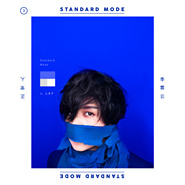

正常人
============================

|  |  |
| :--: | :-- |
| [ 正常人](https://emumo.xiami.com/album/2100185876) | **艺人**: [李霄云](../index.md) **语种**: 国语 **唱片公司**: 独立发行 **发行时间**: 2015年10月10日 **专辑类别**: 录音室专辑 **专辑风格**: 独立流行 Indie Pop, 华语唱作人 Chinese Singer-Songwriter **播放数**: 10151694 **收藏数**: 2975 **评论数**: 1903  |

## 简介

2016-01-09 中山公园音乐堂  
正常人的演唱会&nbsp;  
预售：<a href="http://www.musikid.com/tour/2872" target="_blank" rel="nofollow noreferrer noopener">http://www.musikid.com/tour/2872</a>  
  
一切正常，现场见.  

 

 
 

  
李霄云 独立制作专辑《正常人》&nbsp; 
 

词/Lyrics:李霄云/LXY &nbsp;曲/Music:李霄云/LXY
 

制作人/Producer：Jonas ‘Jelly’ Soendberg &amp;李霄云/LXY &nbsp;联合制作/Co. Producer：Philip Halloun &amp; Hari ‘HVAD’ Kishore &nbsp;录音/Sound Recording：Jonas ‘Jelly’ Soendberg &amp;李霄云/LXY &nbsp;录音棚/Recording Studio:平衡音乐/Balance Music &amp; LXY Studio &nbsp;编曲/Arrangement：Jonas ‘Jelly’ Soendberg &amp;李霄云/LXY &amp; Philip Halloun &nbsp;混音/Mix：Hari ‘HVAD’ Kishore &amp; Jonas ‘Jelly’ Soendberg &amp;李霄云/LXY &nbsp;母带/Master：Hari “HVAD” Kishore &nbsp;混音及母带处理/Mixed And Mastered At:平衡音乐/Balance Music &nbsp;吉他/Guitar:梁晓雪/Kulu &amp;李霄云/LXY &nbsp;键盘/Keyboard：Jonas “Jelly” Soendberg &amp;李霄云/LXY &nbsp;小提琴/Violin：杨莹/Tony &nbsp;大提琴/Cello：赵旭阳/XuYang Zhao
 
&nbsp; &nbsp; &nbsp; &nbsp; &nbsp; &nbsp;&nbsp;

## 曲目

## 评论

|  |  |  |
| :-- | :-- | :-- |
|  [虾米用户](https://emumo.xiami.com/u/232039341)   2021-01-06 00:35 赞(0) 踩(0) | 
难过，要和虾米说再见了…
 |
|  [虾米用户](https://emumo.xiami.com/u/47778968) 你听得到吗？ 2020-12-26 00:57 赞(0) 踩(0) | 
买了你的专辑哦
 |
|  [虾米用户](https://emumo.xiami.com/u/334596954)  2020-02-23 00:57 赞(0) 踩(0) | 
求求李霄云赶紧出歌吧呜呜呜
 |
| ⇒ |  [虾米用户](https://emumo.xiami.com/u/14753663) 暂无签名~ 2020-03-06 05:19 赞(0) 踩(0) | 
出歌了
 |
|  [虾米用户](https://emumo.xiami.com/u/135379) tamtamtam 2019-05-21 10:45 赞(0) 踩(0) | 
新专辑plsssss
 |
|  [虾米用户](https://emumo.xiami.com/u/208363710)  没有人的方向～ 2019-04-01 17:16 赞(1) 踩(0) | 
四月演出加油~注意身体~
 |
|  [虾米用户](https://emumo.xiami.com/u/3749751) 白天是夜晚的仆从 2019-03-27 18:31 赞(0) 踩(0) | 
终于又能听国内了
 |
|  [虾米用户](https://emumo.xiami.com/u/341512789) 我还没想好要写什么... 2019-03-23 10:11 赞(0) 踩(0) | 

 |
|  [虾米用户](https://emumo.xiami.com/u/418424085)  2019-03-13 16:15 赞(0) 踩(0) | 
她经历了什么没人知道，这张的音乐告诉你她那三年并没不好过
 |
|  [虾米用户](https://emumo.xiami.com/u/8848306)  2019-02-27 09:23 赞(0) 踩(0) | 
正常的反面是非正常嘛？
 |
|  [虾米用户](https://emumo.xiami.com/u/199742326)  2019-01-27 22:20 赞(0) 踩(0) | 
姐啥时候发新专啊啊啊等不及辽
 |
| ⇒ |  [虾米用户](https://emumo.xiami.com/u/43637685) 。 2019-01-29 19:32 赞(0) 踩(0) | 
明天
 |
|  [虾米用户](https://emumo.xiami.com/u/49640493) 网易云SAINTDONT... 2019-01-05 11:20 赞(0) 踩(0) | 
_
 |
|  [虾米用户](https://emumo.xiami.com/u/777675) 事物发生研究员 2018-11-21 16:30 赞(0) 踩(0) | 
来打卡。
 |
|  [虾米用户](https://emumo.xiami.com/u/73507884) 做自己 2018-04-14 07:30 赞(0) 踩(0) | 
只为懂的人 口斤至刂
 |
|  [虾米用户](https://emumo.xiami.com/u/255983813)  2018-03-17 11:33 赞(0) 踩(0) | 
初心不忘
 |
|  [虾米用户](https://emumo.xiami.com/u/56100763)  2018-02-25 01:02 赞(0) 踩(0) | 
为了正常人这张用的虾米
 |
|  [虾米用户](https://emumo.xiami.com/u/27441761)  2018-02-24 08:31 赞(0) 踩(0) | 
突然想听李霄云唱歌
 |
|  [虾米用户](https://emumo.xiami.com/u/29612086) 我还没想好要写什么... 2018-02-18 00:09 赞(0) 踩(0) | 
hifi专辑
 |
|  [虾米用户](https://emumo.xiami.com/u/348316890)  2018-02-08 01:20 赞(0) 踩(0) | 

 |
|  [虾米用户](https://emumo.xiami.com/u/289504915)  2017-12-13 23:13 赞(0) 踩(0) | 
霄云，你很棒。懂的人会听到，坚持自己就好
 |
|  [虾米用户](https://emumo.xiami.com/u/6634459)   2017-12-08 23:26 赞(3) 踩(0) | 
我是鲸鱼马戏团现场涨的粉儿
 |
|  [虾米用户](https://emumo.xiami.com/u/58494186) 别小看我 我可是领袖 兜... 2017-11-25 23:23 赞(0) 踩(0) | 
难过的时候 想到我还有你和你的歌 心里 也就不那么难受了
 |
|  [虾米用户](https://emumo.xiami.com/u/135379) tamtamtam 2017-11-04 11:29 赞(0) 踩(0) | 
真的太棒了
 |
|  [虾米用户](https://emumo.xiami.com/u/49557158)  2017-10-30 10:03 赞(13) 踩(0) | 
编曲赞赞赞，李霄云的才华在前两张已经显示了呀，这张表达自我的意识很强烈，也许小众但绝不平庸~
 |
|  [虾米用户](https://emumo.xiami.com/u/73278136)  2017-10-30 10:03 赞(16) 踩(0) | 
喜欢她很久了，从快女开始，喜欢她谦虚的品质，喜欢她懂得感恩的态度，喜欢她不断进步的坚持，也喜欢她坚持自我音乐风格的态度，不随波逐流，不做作，单纯的人格，好像孩子一般善良，不断的挑战自我，更喜欢的是她的歌，看似云淡风轻，却是那么治愈人心，看似平淡无奇，却有自己的性格，看似简单的歌词，却是那么现实，唱出了现实的社会现状，唱出了那种不甘的心情，唱出来每个人渴望的自由，怪不得有那么多云团支持她，不离不弃，希望她越来越好，希望支持她的云团继续支持她，一个不错的歌者，一个敢于对抗现实的优秀歌者，希望你越走越好
 |
|  [虾米用户](https://emumo.xiami.com/u/57817836) Miss Funny 2017-10-29 00:42 赞(1) 踩(0) | 
快点发砖吧，想你了
 |
|  [虾米用户](https://emumo.xiami.com/u/72810602) 突破自我 2017-10-28 00:13 赞(7) 踩(0) | 
怎么感觉迷之好听？虽然不是脍炙人口的旋律但是真的好适合半夜一个人戴着耳机静静地听。专辑的制作也给人很用心的样子，如果不是李霄云喜欢蓝色，我觉得封面用黑白色可能更贴近整张专辑的风格吧。（我也就这么随便一说）
 |
|  [虾米用户](https://emumo.xiami.com/u/43474767) 暂无签名~ 2017-10-27 23:41 赞(6) 踩(0) | 
好棒 已经找不到当初快女的影子了，取而代之的是更加个性的独立风格。而嗓音依旧这么好听，很喜欢。 
 |
|  [虾米用户](https://emumo.xiami.com/u/73153962)   2017-10-27 23:33 赞(7) 踩(0) | 
这样的人就应该做独立音乐人。在公司只会被禁锢。不只会唱歌。真的是心有多大舞台就有多大。永远爱她。 
 |
|  [虾米用户](https://emumo.xiami.com/u/58733996)  2017-10-27 23:33 赞(1) 踩(0) | 
卷毛，爱死你了，太棒了。
 |
|  [虾米用户](https://emumo.xiami.com/u/73066736)  2017-10-27 23:33 赞(12) 踩(0) | 
只想说，应该在专辑开头有个温馨提示:本专辑适合整张连续聆听，阅读。太完整，太真诚的你，霄云。我很惭愧，打着喜欢你的外衣，却大大低估了你的才华，你的光芒。。。
 |
|  [虾米用户](https://emumo.xiami.com/u/11986821)  2017-10-27 23:33 赞(2) 踩(0) | 
然而我来虾米确实是为了李霄云哈哈，谁叫虾米首播呢，作为六年脑残粉当然不能错过 至于其他歌嘛，都在别的播放器里呀～
 |
|  [虾米用户](https://emumo.xiami.com/u/21300006)  2017-10-27 23:33 赞(1) 踩(0) | 
哎呦，编曲好听炸了，编词。。怎么说，有些我听不懂只能代表我境界太低了。。嗯，哈哈哈哈霄云宝贝儿，俺就是你脑残粉啊！！
 |
|  [虾米用户](https://emumo.xiami.com/u/8384826) 再见，虾米，谢谢！ 2017-10-21 17:20 赞(2) 踩(0) | 
音乐圈有好多遗珠，这算一个，默默给社会带来好多好作品用心的音乐，很有个性
 |
|  [虾米用户](https://emumo.xiami.com/u/57823992) 孤独的孩子是上天的恩宠。... 2017-10-16 23:19 赞(0) 踩(0) | 
#亚洲新歌榜# #李霄云新歌逻伯特#  李霄云小姐，你没有让团子们失望哦，相反，很惊喜啊
 |
|  [虾米用户](https://emumo.xiami.com/u/24561696)  2017-10-16 23:19 赞(0) 踩(0) | 
今晚睡前安静地慢慢听，用心感受卷毛的用心
 |
|  [虾米用户](https://emumo.xiami.com/u/12019433) 暂无签名~ 2017-10-16 23:19 赞(1) 踩(0) | 
她其实瘦了很多年了，就是没出现在大家面前而已。大家减肥都能变漂亮的哈哈
 |
|  [虾米用户](https://emumo.xiami.com/u/135379) tamtamtam 2017-09-25 04:18 赞(0) 踩(0) | 
巨好听
 |
|  [虾米用户](https://emumo.xiami.com/u/14298144) 东京求学的阿酱 2017-09-25 02:40 赞(0) 踩(0) | 
啊李霄云你怎么这么迷人
 |
|  [虾米用户](https://emumo.xiami.com/u/189473049)   2017-09-15 22:21 赞(0) 踩(0) | 
什么时候出新砖
 |
|  [虾米用户](https://emumo.xiami.com/u/16496891)   2017-09-08 01:48 赞(0) 踩(0) | 
正常的正常人
 |
|  [虾米用户](https://emumo.xiami.com/u/182488740) best wishes ... 2017-08-13 12:24 赞(2) 踩(0) | 
被各大音乐奖项冷落的这张  明明就是2015最佳专辑之一
 |
|  [虾米用户](https://emumo.xiami.com/u/3713514) 明天我会在哪只鞋子里？ 2017-08-04 08:25 赞(1) 踩(0) | 
两年后过来重温，又一次被惊艳。她的名气连她才华的十分之一都不及。
 |
|  [虾米用户](https://emumo.xiami.com/u/98423670) 不二女生嘻嘻 2017-06-22 09:59 赞(2) 踩(0) | 
明晚要听鲸鱼收官演出听说李霄云也来提前预习下她的歌意外是我的菜。有个性有空气感
 |
|  [虾米用户](https://emumo.xiami.com/u/58733996)  2017-05-24 10:47 赞(1) 踩(0) | 
其实这张专辑不算是很好听，我就听了一万遍就听够了。
 |
| ⇒ |  [虾米用户](https://emumo.xiami.com/u/194112549) 我还没想好要写什么... 2017-06-28 17:54 赞(0) 踩(0) | 
谭维维(&amp;brvbar;3[▓▓]
 |
|  [虾米用户](https://emumo.xiami.com/u/20176376)  2017-03-30 23:22 赞(0) 踩(0) | 
淘宝免费送的会员，来下载几首偶像的歌
 |
|  [虾米用户](https://emumo.xiami.com/u/20176376)  2017-03-30 23:21 赞(0) 踩(0) | 
好听
 |
|  [虾米用户](https://emumo.xiami.com/u/36165303) 喜欢李沧东的薄荷糖 也喜... 2017-03-13 09:52 赞(1) 踩(0) | 
看了一年前的评论 我很遗憾无法做到改变他人对你充满恶意的眼光 但你一定要一直任性下去啊 我也会跟着你一起任性的 indie就是要随心所欲啊
 |
|  [虾米用户](https://emumo.xiami.com/u/36165303) 喜欢李沧东的薄荷糖 也喜... 2017-03-12 14:09 赞(1) 踩(0) | 
今年圣诞节我大概不能陪你了 
 |
|  [虾米用户](https://emumo.xiami.com/u/12510540)  2017-02-05 10:44 赞(0) 踩(0) | 
每一首都很棒。
 |
|  [虾米用户](https://emumo.xiami.com/u/265451699)  2017-01-21 01:46 赞(0) 踩(0) | 
你唱我听
 |
|  [虾米用户](https://emumo.xiami.com/u/36165303) 喜欢李沧东的薄荷糖 也喜... 2017-01-03 16:16 赞(0) 踩(0) | 
一条表白
 |
|  [虾米用户](https://emumo.xiami.com/u/57817836) Miss Funny 2016-12-30 17:52 赞(0) 踩(0) | 

 |
|  [虾米用户](https://emumo.xiami.com/u/42815393) 不是高三狗了 2016-12-26 18:14 赞(0) 踩(0) | 
喜爱
 |
|  [虾米用户](https://emumo.xiami.com/u/57817836) Miss Funny 2016-12-09 21:30 赞(0) 踩(0) | 

 |
|  [虾米用户](https://emumo.xiami.com/u/57789170) 【李霄云】 2016-11-21 22:00 赞(1) 踩(0) | 

 |
|  [虾米用户](https://emumo.xiami.com/u/1219446) Intro 2016-11-16 01:52 赞(1) 踩(0) | 
有一种伍迪艾伦电影的气质
 |
|  [虾米用户](https://emumo.xiami.com/u/57817836) Miss Funny 2016-10-28 21:51 赞(0) 踩(0) | 

 |
|  [虾米用户](https://emumo.xiami.com/u/4334438) 贫穷而倔强 2016-09-12 13:57 赞(0) 踩(0) | 
日常表白
 |
|  [虾米用户](https://emumo.xiami.com/u/73638642) 再见了各位 我永远爱虾米... 2016-08-27 09:45 赞(0) 踩(0) | 
我这个音痴能把你的每首歌都唱会，真是一件意外的事 。
 |
|  [虾米用户](https://emumo.xiami.com/u/73638642) 再见了各位 我永远爱虾米... 2016-08-27 09:42 赞(2) 踩(0) | 
这张专辑我大概听了几十遍吧，嗯…焦虑时听乞丐觉得自己像王者一样，塞着耳机在地铁站，耳边传来你的声音，一天好像都变得快活起来，圣诞节我一定要来见你!!!
 |
|  [虾米用户](https://emumo.xiami.com/u/167244440)  2016-08-22 10:37 赞(0) 踩(0) | 
想到马上就要见到我毛    
 |
|  [虾米用户](https://emumo.xiami.com/u/13960860)  2016-08-13 10:08 赞(0) 踩(0) | 
你一定要买这张专辑
 |
|  [虾米用户](https://emumo.xiami.com/u/57817836) Miss Funny 2016-07-22 22:59 赞(0) 踩(0) | 

 |
|  [虾米用户](https://emumo.xiami.com/u/195226373) 李霄云的迷妹，请关爱 2016-07-17 12:02 赞(0) 踩(0) | 
你细心吟唱，我认真听咛
 |
|  [虾米用户](https://emumo.xiami.com/u/43474850) 慎 2016-06-22 13:31 赞(1) 踩(0) | 
百听不厌
 |
|  [虾米用户](https://emumo.xiami.com/u/185556148) 我还没想好要写什么... 2016-06-22 13:09 赞(1) 踩(0) | 
别的专辑哪个播放器有
 |
|  [虾米用户](https://emumo.xiami.com/u/24708099)   2016-06-09 18:09 赞(3) 踩(0) | 
国语女歌手里让我很惊艳的一个，听她的歌让人觉得很舒服，没有无病呻吟也没有激烈的情绪表达，就像叙事谈天娓娓道来。
 |
|  [虾米用户](https://emumo.xiami.com/u/57817836) Miss Funny 2016-05-25 22:42 赞(0) 踩(0) | 

 |
|  [虾米用户](https://emumo.xiami.com/u/104090922) 努力地笑 2016-05-25 21:40 赞(0) 踩(0) | 
霄云加油~做你喜欢的~
 |
|  [虾米用户](https://emumo.xiami.com/u/104090922) 努力地笑 2016-05-25 21:39 赞(0) 踩(0) | 
大写的喜欢！
 |
|  [虾米用户](https://emumo.xiami.com/u/104090922) 努力地笑 2016-05-25 21:20 赞(1) 踩(0) | 
越听越好听~尤其是现场真的超赞
 |
|  [虾米用户](https://emumo.xiami.com/u/8807103) 无耻 2016-05-25 14:43 赞(1) 踩(0) | 
在泸沽湖呆的那一个月 随时都可以拿出来循环的专辑 也是从超女看过来 后来学了 《你看到的我是蓝色的 》 然后会了《可能》 不咋用微博之后 就没有关注她的动态了 突然有天想起来搜了一下 点开  全身细胞都被惊艳了 就喜欢这么有才有气质还有灵气的人  看好你喔 李霄云
 |
|  [虾米用户](https://emumo.xiami.com/u/88224260) 你美吗 2016-05-15 15:16 赞(0) 踩(0) | 
人也
 |
|  [虾米用户](https://emumo.xiami.com/u/91788244)  2016-04-18 01:05 赞(2) 踩(0) | 
刚出专辑的时候就听了觉得并没有以前的好听 但是慢慢听慢慢听 就听出味道了 从来没有过的奇妙感觉 真的太特别太好听了
 |
|  [虾米用户](https://emumo.xiami.com/u/4334438) 贫穷而倔强 2016-04-15 20:10 赞(0) 踩(0) | 
今天李霄云来了我们学校  
 |
|  [虾米用户](https://emumo.xiami.com/u/4747521) 听音乐就对了。 2016-04-11 12:43 赞(3) 踩(0) | 
诚意之作，没听过的绝对是遗憾。
 |
|  [虾米用户](https://emumo.xiami.com/u/36871850) 唯好音乐和你，不可辜负。 2016-04-06 23:06 赞(2) 踩(0) | 
乐童的众筹后续推进的一张专辑，太棒，太棒，太棒.
 |
|  [虾米用户](https://emumo.xiami.com/u/19985587) 找到你热爱的，就不会计较... 2016-04-06 18:54 赞(1) 踩(0) | 
最纯粹的克莱因蓝
 |
|  [虾米用户](https://emumo.xiami.com/u/43978083) 我还没想好要写什么... 2016-04-04 11:50 赞(0) 踩(0) | 
好的作品不仅仅是好听 
 |
|  [虾米用户](https://emumo.xiami.com/u/73638642) 再见了各位 我永远爱虾米... 2016-03-24 13:42 赞(0) 踩(0) | 
李霄云我超爱你的 
 |
|  [虾米用户](https://emumo.xiami.com/u/73638642) 再见了各位 我永远爱虾米... 2016-03-24 13:39 赞(0) 踩(0) | 
李霄云你真的要早点睡!
 |
|  [虾米用户](https://emumo.xiami.com/u/35152322)  2016-03-14 13:00 赞(0) 踩(0) | 
停不下来
 |
|  [虾米用户](https://emumo.xiami.com/u/35152322)  2016-03-14 13:00 赞(0) 踩(0) | 
停不下来
 |
|  [虾米用户](https://emumo.xiami.com/u/40204308)  2016-02-22 23:38 赞(0) 踩(0) | 
封面蓝很棒啊
 |
|  [虾米用户](https://emumo.xiami.com/u/44590625)  2016-02-19 14:10 赞(0) 踩(0) | 
能帅的把我掰弯
 |
|  [虾米用户](https://emumo.xiami.com/u/57817836) Miss Funny 2016-02-14 22:33 赞(0) 踩(0) | 
好想你
 |
|  [虾米用户](https://emumo.xiami.com/u/57841812)  2016-02-13 12:13 赞(3) 踩(0) | 
越听越好听，确实是颠覆性改变。不知道是不是我想太多，有粉丝吐槽没有情歌，我感觉首首都像写给歌迷的情歌 
 |
| ⇒ |  [虾米用户](https://emumo.xiami.com/u/4334438) 贫穷而倔强 2016-05-05 20:03 赞(0) 踩(0) | 
首首都在向歌迷表白
 |
|  [虾米用户](https://emumo.xiami.com/u/5975975)   2016-02-05 10:13 赞(0) 踩(0) | 
编曲很赞
 |
|  [虾米用户](https://emumo.xiami.com/u/7580844) 勤奋和文雅 2016-02-03 06:01 赞(1) 踩(0) | 
独立发行的吗？？好不容易
 |
|  [虾米用户](https://emumo.xiami.com/u/36253461) 你快乐 所以 我快乐 2016-01-24 21:54 赞(0) 踩(0) | 
棒
 |
|  [虾米用户](https://emumo.xiami.com/u/4334438) 贫穷而倔强 2016-01-23 23:42 赞(0) 踩(0) | 
整体氛围偏阴暗
 |
|  [虾米用户](https://emumo.xiami.com/u/46948601)  2016-01-16 23:08 赞(0) 踩(0) | 
这张专辑好棒啊
 |
|  [虾米用户](https://emumo.xiami.com/u/11217410)  2016-01-16 22:59 赞(2) 踩(0) | 
第一遍听一般 后面循环完全停不下来。。。
 |
|  [虾米用户](https://emumo.xiami.com/u/72936498) 梦想那么大，不努力怎么行... 2016-01-14 16:48 赞(0) 踩(0) | 
冷艳才女 
 |
|  [虾米用户](https://emumo.xiami.com/u/99247454)  2016-01-11 17:30 赞(1) 踩(0) | 
好玩先生，越听越好听，真的！！
 |
|  [虾米用户](https://emumo.xiami.com/u/46309918) Till I Colla... 2016-01-10 20:40 赞(0) 踩(0) | 
现在的我看到的你是蓝色的。
 |
|  [虾米用户](https://emumo.xiami.com/u/57833758) Ku. 2016-01-03 13:48 赞(2) 踩(0) | 
细听，越听越有味道
 |
|  [虾米用户](https://emumo.xiami.com/u/11640497)  2015-12-26 22:08 赞(0) 踩(0) | 
这张真的很棒，很棒
 |
|  [虾米用户](https://emumo.xiami.com/u/5406466)  2015-12-23 21:22 赞(0) 踩(0) | 
越来越喜欢这声音
 |
|  [虾米用户](https://emumo.xiami.com/u/58733996)  2015-12-15 19:36 赞(1) 踩(0) | 
这张专辑，太狠了，洗脑。
 |
|  [虾米用户](https://emumo.xiami.com/u/56233994) 我还没想好要写什么... 2015-12-05 22:40 赞(0) 踩(0) | 
很攻 
 |
|  [虾米用户](https://emumo.xiami.com/u/88402506)  2015-12-03 15:37 赞(3) 踩(0) | 
每首歌第一次听的时候可能会有点不能接受，因为它的确颠覆了以前李霄云在听众中的映像，但多听几遍后越来越喜欢，这才是真正的李霄云，需要更多人聆听的声音。支持！！！[带墨镜笑][带墨镜笑]
 |
|  [虾米用户](https://emumo.xiami.com/u/1183305)  2015-11-17 20:00 赞(0) 踩(0) | 
女版林宥嘉
 |
|  [虾米用户](https://emumo.xiami.com/u/9684518)  2015-11-17 12:05 赞(0) 踩(0) | 
i like.
 |
|  [虾米用户](https://emumo.xiami.com/u/50225088) 当世界只剩白与蓝的交汇，... 2015-11-16 17:00 赞(0) 踩(0) | 
惊艳
 |
|  [虾米用户](https://emumo.xiami.com/u/843367)  2015-11-16 00:53 赞(3) 踩(0) | 
咦豆瓣评分这么低啊才5.6。曲不好听么？词写得不好吗？编曲不好吗？哦大家都说编曲还行。突然对自己的审美观产生了怀疑。
 |
| ⇒ |  [虾米用户](https://emumo.xiami.com/u/11640497)  2015-12-03 22:35 赞(0) 踩(0) | 
不喜欢看豆瓣音乐的评价，觉得太装。自己喜欢就好。
 |
| ⇒ |  [虾米用户](https://emumo.xiami.com/u/4334438) 贫穷而倔强 2016-01-29 22:08 赞(0) 踩(0) | 
人人都不同喜好，况且豆瓣上的人口味特刁
 |
|  [虾米用户](https://emumo.xiami.com/u/52524710)  2015-11-15 14:36 赞(0) 踩(0) | 
棒
 |
|  [虾米用户](https://emumo.xiami.com/u/7938132) 请叫我美受大人 1572... 2015-11-12 08:51 赞(1) 踩(0) | 
我不知道我就喜欢特立独行
 |
|  [虾米用户](https://emumo.xiami.com/u/4334438) 贫穷而倔强 2015-11-08 19:42 赞(7) 踩(0) | 
我觉得这张专辑值得拥有更高的成绩
 |
|  [虾米用户](https://emumo.xiami.com/u/5406466)  2015-11-08 19:33 赞(1) 踩(0) | 
这张真的真的很喜欢
 |
|  [虾米用户](https://emumo.xiami.com/u/476608) 于是我 不再唱歌 2015-11-07 14:51 赞(0) 踩(0) | 
闹歌荒点开来听，听不到一半就关了。实在怪我不懂欣赏啊~ 实话实说，不一定对：好阴沉的编曲和唱腔。。。不过歌迷们喜欢就好了~ 掰
 |
|  [虾米用户](https://emumo.xiami.com/u/47900183) 暂无签名~ 2015-11-05 00:00 赞(16) 踩(0) | 
我不知道为什么想她和窦靖童认识认识就好了……
 |
| ⇒ |  [虾米用户](https://emumo.xiami.com/u/46948601)  2016-01-16 23:09 赞(0) 踩(0) | 
我也正有此意
 |
| ⇒ |  [虾米用户](https://emumo.xiami.com/u/47900183) 暂无签名~ 2016-01-17 09:34 赞(0) 踩(0) | 
<q><b>浪漫的杨梅说：</b></q>
 |
| ⇒ |  [虾米用户](https://emumo.xiami.com/u/4334438) 贫穷而倔强 2016-05-05 20:05 赞(0) 踩(0) | 
同意~
 |
|  [虾米用户](https://emumo.xiami.com/u/15799326) longtime ago 2015-11-04 23:02 赞(2) 踩(0) | 
很喜歡她，有著濃霧一般的魅力。
 |
|  [虾米用户](https://emumo.xiami.com/u/6804816) 暂无签名~ 2015-11-02 16:21 赞(3) 踩(0) | 
很有趣的新砖
 |
|  [虾米用户](https://emumo.xiami.com/u/39811099) 没什么好看的 2015-11-01 22:27 赞(17) 踩(0) | 
第一次听一张专辑听哭，真的好心疼李霄云，从她比赛一直到发第一张单曲一直一直关注着她，可惜天娱浪费了她，乞丐这首歌算是整张专辑听下来最心痛的一首了，从今往后请一直唱下去，我听。
 |
|  [虾米用户](https://emumo.xiami.com/u/57841208) I love you n... 2015-11-01 00:54 赞(0) 踩(0) | 
卷毛
 |
|  [虾米用户](https://emumo.xiami.com/u/868146)  2015-10-31 19:50 赞(0) 踩(0) | 
好像不是很适合她的感觉
 |
| ⇒ |  [虾米用户](https://emumo.xiami.com/u/4334438) 贫穷而倔强 2015-10-31 20:28 赞(0) 踩(0) | 
这一张算是在尝试吧
 |
|  [虾米用户](https://emumo.xiami.com/u/5179538)  2015-10-31 02:15 赞(3) 踩(0) | 
时隔三年的实力蜕变，怪诞诙谐的曲调配上云式温柔嗓音，百听不厌。
 |
|  [虾米用户](https://emumo.xiami.com/u/58733996)  2015-10-30 10:18 赞(3) 踩(0) | 
这张专辑百听不厌，做的真好，支持李霄云。
 |
|  [虾米用户](https://emumo.xiami.com/u/12190136)  2015-10-26 13:27 赞(2) 踩(0) | 
今天换了个耳机听。。完全不一样的感觉。。。震撼的编曲。。好评。。
 |
|  [虾米用户](https://emumo.xiami.com/u/57891998) 被好音乐包裹着就很幸福 2015-10-26 00:48 赞(10) 踩(0) | 
只有李霄云能让我连歌都没听就买十几张！因为一开始就在！因为知道你纯粹的坚持！因为喜欢你玩音乐的态度！喜欢你编曲的想法！因为你让我开始写歌！
 |
| ⇒ |  [虾米用户](https://emumo.xiami.com/u/8634421) 听吾歌 2015-11-12 13:01 赞(0) 踩(0) | 
你一定要坚持~
 |
|  [虾米用户](https://emumo.xiami.com/u/11995743)  2015-10-25 19:59 赞(1) 踩(0) | 
梦幻
 |
|  [虾米用户](https://emumo.xiami.com/u/3562785)  2015-10-25 17:06 赞(6) 踩(0) | 
京东和天猫上有预售了，喜欢这张唱片的没买到可以去瞅瞅~
 |
|  [虾米用户](https://emumo.xiami.com/u/70274036)  2015-10-24 19:45 赞(1) 踩(0) | 
我打1.9分，进京了结果这样，呵呵
 |
|  [虾米用户](https://emumo.xiami.com/u/50162280)  2015-10-24 15:57 赞(0) 踩(0) | 
好听就是任性
 |
|  [虾米用户](https://emumo.xiami.com/u/61943694)  2015-10-23 23:41 赞(0) 踩(0) | 
专辑很好听 
 |
|  [虾米用户](https://emumo.xiami.com/u/64405956)  2015-10-23 17:53 赞(0) 踩(0) | 
有钱就一个富二代
 |
| ⇒ |  [虾米用户](https://emumo.xiami.com/u/58352704) 我还没想好要写什么... 2015-11-08 01:34 赞(0) 踩(0) | 
她快穷到叮当响了，为了这张专辑她把自己六年工作的积蓄全花了你造吗
 |
| ⇒ |  [虾米用户](https://emumo.xiami.com/u/4334438) 贫穷而倔强 2015-11-08 20:00 赞(0) 踩(0) | 
<q><b>datwtj说：</b></q>
 |
|  [虾米用户](https://emumo.xiami.com/u/4334438) 贫穷而倔强 2015-10-23 13:23 赞(1) 踩(0) | 
很期待每一首歌的MV
 |
|  [虾米用户](https://emumo.xiami.com/u/29700105) disconnected... 2015-10-22 12:56 赞(0) 踩(0) | 
可以
 |
|  [虾米用户](https://emumo.xiami.com/u/44362580)   2015-10-21 20:13 赞(0) 踩(0) | 
好听 专辑也好看
 |
|  [虾米用户](https://emumo.xiami.com/u/4334438) 贫穷而倔强 2015-10-21 13:25 赞(0) 踩(0) | 
业界良心
 |
|  [虾米用户](https://emumo.xiami.com/u/1148664)   2015-10-19 23:42 赞(0) 踩(0) | 
是女孩子？
 |
| ⇒ |  [虾米用户](https://emumo.xiami.com/u/4334438) 贫穷而倔强 2015-10-21 13:24 赞(0) 踩(0) | 
其实是云少爷
 |
| ⇒ |  [虾米用户](https://emumo.xiami.com/u/57781048)   2015-10-27 09:55 赞(0) 踩(0) | 
是的 女孩子
 |
|  [虾米用户](https://emumo.xiami.com/u/36672227)  2015-10-19 18:56 赞(0) 踩(0) | 
特立独行！我喜欢这样有个性的歌手！
 |
|  [虾米用户](https://emumo.xiami.com/u/50162280)  2015-10-19 16:33 赞(0) 踩(0) | 
专辑试听量肯定能破千万   歌曲太给力
 |
|  [虾米用户](https://emumo.xiami.com/u/55195342)  2015-10-18 22:37 赞(0) 踩(0) | 

 |
|  [虾米用户](https://emumo.xiami.com/u/4828935)  2015-10-18 22:15 赞(25) 踩(0) | 
这专辑看透一点其实也就是华语音乐市场细化之后唱片公司发起的一次音乐领域的圈地运动。 但是……这张专辑还真的很不错诶！！！！随性的音乐长度，有时碎碎念有时念诗的文青做派，打着独立大旗又非常小心地在流行边缘起舞的精确定位，一切都让这个商品与众不同。 哎呀，真的很喜欢所以就发评论了
 |
| ⇒ |  [虾米用户](https://emumo.xiami.com/u/194112549) 我还没想好要写什么... 2017-06-28 17:52 赞(0) 踩(0) | 
请看一下专辑介绍&amp;hellip;独立发行&amp;hellip;
 |
|  [虾米用户](https://emumo.xiami.com/u/74732084)  2015-10-18 21:49 赞(0) 踩(0) | 
卷毛又出新歌咯
 |
|  [虾米用户](https://emumo.xiami.com/u/74732084)  2015-10-18 21:49 赞(0) 踩(0) | 
卷卷
 |
|  [虾米用户](https://emumo.xiami.com/u/47365062) windy 2015-10-18 13:32 赞(0) 踩(0) | 
哇好棒
 |
|  [虾米用户](https://emumo.xiami.com/u/50732759)   2015-10-18 01:03 赞(0) 踩(0) | 
蓝
 |
|  [虾米用户](https://emumo.xiami.com/u/4745260) 不眠飞行 2015-10-17 11:33 赞(0) 踩(0) | 
不说别的，只封面就得给5星
 |
|  [虾米用户](https://emumo.xiami.com/u/57912574) 爱霄云，爱杨澜，爱音乐，... 2015-10-17 10:41 赞(0) 踩(0) | 
太喜欢这张专辑啦！！！   
 |
|  [虾米用户](https://emumo.xiami.com/u/43474850) 慎 2015-10-17 00:20 赞(1) 踩(0) | 
很惊艳
 |
|  [虾米用户](https://emumo.xiami.com/u/5952197) 自由万岁 2015-10-16 17:52 赞(5) 踩(0) | 
很惊艳，虽然李霄云嗓音偏低，但歌中音域却很广，很丰富，字词句，逻伯特，我唱我，这三首比较惊艳。
 |
|  [虾米用户](https://emumo.xiami.com/u/382846)  2015-10-16 08:31 赞(4) 踩(0) | 
乞丐不错。
 |
|  [虾米用户](https://emumo.xiami.com/u/58733996)  2015-10-16 06:35 赞(3) 踩(0) | 
这张专辑太棒了，百听不厌，真的很厉害，李霄云。
 |
|  [虾米用户](https://emumo.xiami.com/u/4271551) 用心听歌是一种境界。 2015-10-16 00:39 赞(1) 踩(0) | 
我云，你终于出新砖啦？？深夜激动睡不着 
 |
|  [虾米用户](https://emumo.xiami.com/u/4271551) 用心听歌是一种境界。 2015-10-16 00:39 赞(1) 踩(0) | 
我云，你终于出新砖啦？？深夜激动睡不着 
 |
|  [虾米用户](https://emumo.xiami.com/u/4271551) 用心听歌是一种境界。 2015-10-16 00:39 赞(1) 踩(0) | 
我云，你终于出新砖啦？？深夜激动睡不着 
 |
|  [虾米用户](https://emumo.xiami.com/u/3448399)   2015-10-16 00:37 赞(8) 踩(0) | 
光是这封面都值得100分 今年大陆最佳
 |
|  [虾米用户](https://emumo.xiami.com/u/34463308) 故人江海别，几度隔山川 2015-10-15 23:52 赞(7) 踩(0) | 
不得不爱的专辑，不得不爱的李霄云，以音乐吸引你，征服你，让你的耳朵就此沉沦…路转粉ing,霄云，欢迎回归！     
 |
|  [虾米用户](https://emumo.xiami.com/u/74083116) 莫愁前路无知己，天下谁人... 2015-10-15 23:47 赞(6) 踩(0) | 
我有听一整张专辑，是我喜欢的风格，好听的。刷新了当年那个女孩给我的映象。
 |
|  [虾米用户](https://emumo.xiami.com/u/30383006)  2015-10-15 23:02 赞(0) 踩(0) | 
了
 |
|  [虾米用户](https://emumo.xiami.com/u/11765103) 天生放荡不羁爱傻笑 2015-10-15 21:58 赞(1) 踩(0) | 
这不是王菲吗？？？
 |
|  [虾米用户](https://emumo.xiami.com/u/1209623)  2015-10-15 21:32 赞(1) 踩(0) | 
跟王菲好像啊这样看
 |
|  [虾米用户](https://emumo.xiami.com/u/49516841)  2015-10-15 19:22 赞(1) 踩(0) | 
厉害。
 |
|  [虾米用户](https://emumo.xiami.com/u/50756587) 。 2015-10-15 18:37 赞(1) 踩(0) | 
百听不厌。
 |
|  [虾米用户](https://emumo.xiami.com/u/50756587) 。 2015-10-15 18:37 赞(0) 踩(0) | 
百听不厌。
 |
|  [虾米用户](https://emumo.xiami.com/u/40721549) 給我滑回去 2015-10-15 13:10 赞(2) 踩(0) | 
太吊，全是自己包办？
 |
| ⇒ |  [虾米用户](https://emumo.xiami.com/u/59000784)  2015-10-15 16:13 赞(0) 踩(0) | 
en
 |
|  [虾米用户](https://emumo.xiami.com/u/9323864)  2015-10-15 11:45 赞(1) 踩(0) | 
我知道这才是真正的你 做你爱的事情 做你爱的音乐吧 下午就去买！
 |
|  [虾米用户](https://emumo.xiami.com/u/1251466) 单纯的像个傻子。 2015-10-15 10:57 赞(3) 踩(0) | 
像梦话一样的字词句。
 |
|  [虾米用户](https://emumo.xiami.com/u/1473766) 我还没想好要写什么... 2015-10-15 09:44 赞(2) 踩(0) | 
第一瞬间映入眼帘的歌名《口啊口我》.........
 |
|  [虾米用户](https://emumo.xiami.com/u/13359933) 像风筝一样薄薄的身体 2015-10-15 09:10 赞(6) 踩(0) | 
我觉得吧，那么多人觉得好听的话不如去买张她的正版专辑来支持她比什么都强。
 |
| ⇒ |  [虾米用户](https://emumo.xiami.com/u/13359933) 像风筝一样薄薄的身体 2015-10-17 20:07 赞(0) 踩(0) | 
<q><b>说：</b></q>
 |
| ⇒ |  [虾米用户](https://emumo.xiami.com/u/50162280)  2015-10-18 09:45 赞(0) 踩(0) | 
<q><b>说：</b></q>
 |
|  [虾米用户](https://emumo.xiami.com/u/2985012) 讨厌刘紫玲,龚玥,童丽,... 2015-10-15 07:04 赞(3) 踩(0) | 
现在歌手出专辑不容易，基本都是赔钱，独立音乐人自己做音乐更是不易，虽然这张专辑在我听起来感觉并不好听(众口难调，脑残粉勿喷)，但是还要给她点个赞。
 |
|  [虾米用户](https://emumo.xiami.com/u/38578467) 我还没想好要写什么... 2015-10-15 06:12 赞(1) 踩(0) | 
克莱因蓝 请你们好好学学艺术历史。编曲上进行了很多尝试 虽然还不完美 但是其实已经跟大众妥协了好吗 重复的几段 其实这种编曲要是变化更多才好
 |
|  [虾米用户](https://emumo.xiami.com/u/7314441)  2015-10-15 01:28 赞(5) 踩(0) | 
脱离了商业束缚，一张很有自己风格态度的专辑，非常专业的制作
 |
|  [虾米用户](https://emumo.xiami.com/u/31381534) gzy 2015-10-15 00:27 赞(0) 踩(0) | 
编曲很不错，只不过不是我喜欢的音色～不过还是加油！
 |
|  [虾米用户](https://emumo.xiami.com/u/5786191) 蛋黄顶在头上~ 2015-10-14 23:31 赞(1) 踩(0) | 
棒棒哒~走独立真是正确的选择，我去安利了，谁也不要拦着我~~~
 |
| ⇒ |  [虾米用户](https://emumo.xiami.com/u/2523233) 太热 2015-10-15 09:23 赞(0) 踩(0) | 
哈哈、
 |
|  [虾米用户](https://emumo.xiami.com/u/6589960)   2015-10-14 23:28 赞(4) 踩(0) | 
李霄云太给人惊喜了，想当初给她投了十块钱票果然没看走眼。
 |
| ⇒ |  [虾米用户](https://emumo.xiami.com/u/57816318)   2015-10-15 10:24 赞(0) 踩(0) | 

 |
|  [虾米用户](https://emumo.xiami.com/u/58583034)  2015-10-14 23:10 赞(16) 踩(0) | 
第一次听这张专辑，我会替李霄云感到惋惜，这么好的嗓音不唱深情的情歌真是浪费。                                                     第二次会觉得这张专辑太自我，没有情感共鸣，这种自我的专辑平时自己玩玩就好，发表出来注定会没饭吃。             后来转念一想，我之前的这些想法，聪明如李霄云，她会想不到吗？这样一寻思，瞬间觉得自己以太过对这个世界的游戏规则妥协。而她却深知这个规则，但她却选择不妥协，就像她这一整张专辑里都写满了对社会的不妥协，对冷漠，浑噩的拒绝。她唱着她自己，遗世独立。做音乐有千万条路，她却选择了最困难的一条！
 |
|  [虾米用户](https://emumo.xiami.com/u/50162280)  2015-10-14 22:27 赞(0) 踩(0) | 
做为霄云的粉丝更希望她能火起来   但霄云专辑有点小小瑕疵   词缺乏特点   编曲不得不说太棒了颠覆了以往  独立真的很难  很辛苦  专辑无法推广更大    但还是要说  加油  云团一直在    
 |
|  [虾米用户](https://emumo.xiami.com/u/35766831) Snow + dirt ... 2015-10-14 22:22 赞(1) 踩(0) | 
初听不能说有多好听，但确实有种耳目一新的感觉。好玩，喜欢~
 |
|  [虾米用户](https://emumo.xiami.com/u/68242570)  2015-10-14 21:35 赞(0) 踩(0) | 
加油 这条路不易，会一直支持你的
 |
|  [虾米用户](https://emumo.xiami.com/u/15878009) 若你是怪人，而我爱你。 2015-10-14 20:57 赞(0) 踩(0) | 
循环
 |
|  [虾米用户](https://emumo.xiami.com/u/57823124) Michelle Li.... 2015-10-14 19:43 赞(1) 踩(0) | 
等待三年，我从来没觉得卷毛让我失望过，个人喜好不同，感觉也会不同。卷毛说这是全部的她，我就会选择认真地口斤。独立音乐人，卷毛加油~
 |
|  [虾米用户](https://emumo.xiami.com/u/4388348) wu 2015-10-14 19:42 赞(0) 踩(0) | 
很用心，技术够足，那个丹麦人应该帮不少忙吧，如果歌写的有个性且可听性再高点就好了，总体感觉都是编曲在撑着
 |
| ⇒ |  [虾米用户](https://emumo.xiami.com/u/11983940)  2015-10-15 10:14 赞(0) 踩(0) | 
整张专辑编曲都是李霄云
 |
| ⇒ |  [虾米用户](https://emumo.xiami.com/u/4388348) wu 2015-10-15 11:42 赞(0) 踩(0) | 
<q><b>仙云飘渺说：</b></q>
 |
|  [虾米用户](https://emumo.xiami.com/u/49490643) 然并卵 2015-10-14 19:20 赞(1) 踩(0) | 
告诉我一直觉得云卷像王菲的不止我一个
 |
|  [虾米用户](https://emumo.xiami.com/u/4334438) 贫穷而倔强 2015-10-14 18:19 赞(3) 踩(0) | 
在学校一打开电脑一定要整张专辑无限循环
 |
| ⇒ |  [虾米用户](https://emumo.xiami.com/u/36165303) 喜欢李沧东的薄荷糖 也喜... 2015-10-14 19:48 赞(0) 踩(0) | 
同
 |
|  [虾米用户](https://emumo.xiami.com/u/1467803) 置身于炎夏的乐园 2015-10-14 17:19 赞(0) 踩(0) | 
并不是粉 在七九八看完现场 听了这张专的几首歌 别的不说 有点被t气迷到
 |
| ⇒ |  [虾米用户](https://emumo.xiami.com/u/9608062) 我还没想好要写什么... 2016-02-05 19:01 赞(0) 踩(0) | 
<q><b>说：</b></q>
 |
| ⇒ |  [虾米用户](https://emumo.xiami.com/u/73638642) 再见了各位 我永远爱虾米... 2016-02-06 10:42 赞(0) 踩(0) | 
<q><b>猪二二说：</b></q>
 |
|  [虾米用户](https://emumo.xiami.com/u/8886069)  2015-10-14 14:19 赞(0) 踩(0) | 
说真的就封面好看
 |
|  [虾米用户](https://emumo.xiami.com/u/1270619)  2015-10-14 12:51 赞(0) 踩(0) | 
造型确实不错啊
 |
|  [虾米用户](https://emumo.xiami.com/u/41386880)  2015-10-14 10:30 赞(0) 踩(0) | 
加油
 |
|  [虾米用户](https://emumo.xiami.com/u/9325342) ❥ 2015-10-14 09:16 赞(0) 踩(0) | 
她这几年应该挺难的
 |
|  [虾米用户](https://emumo.xiami.com/u/48545606)   2015-10-14 01:25 赞(1) 踩(0) | 
整张专辑的曲风都差不多，带点迷幻，偶尔呢喃，低低吟唱。这样有好处也有坏处，喜欢的人更喜欢，不喜欢的人听一两首就会放弃。
 |
|  [虾米用户](https://emumo.xiami.com/u/34242263) 何处惹尘埃。 2015-10-13 23:56 赞(3) 踩(0) | 
不管这张专辑是成功的还是不成功的，至少让我看到了一个很有个性的你，以后会关注你。
 |
|  [虾米用户](https://emumo.xiami.com/u/50162280)  2015-10-13 23:13 赞(3) 踩(0) | 
刚开始一听  不怎么好听  但是认真听真的越来越好听  李霄云在这张专辑几乎耗尽所有  也许那些觉得不好听的人并没有发现她的才华  希望有更多的人支持她  当然 聪明的 正常的人  都会觉得好听
 |
|  [虾米用户](https://emumo.xiami.com/u/8880433)  2015-10-13 22:02 赞(1) 踩(0) | 
听得揪心……每个人都是TA自己，每个人都是李霄云。想看，你书架上的神明。
 |
|  [虾米用户](https://emumo.xiami.com/u/1324169) 我还没想好要写什么... 2015-10-13 21:01 赞(4) 踩(0) | 
这张必须收……
 |
|  [虾米用户](https://emumo.xiami.com/u/4334438) 贫穷而倔强 2015-10-13 18:57 赞(5) 踩(0) | 
独立音乐的又一巨作
 |
|  [虾米用户](https://emumo.xiami.com/u/51690777) 解忧 2015-10-13 18:33 赞(1) 踩(0) | 
李霄云还不错
 |
|  [虾米用户](https://emumo.xiami.com/u/57865526) 过去的不必都想起 经历的... 2015-10-13 17:13 赞(1) 踩(0) | 
说实话，大部分歌越听越喜欢
 |
|  [虾米用户](https://emumo.xiami.com/u/50225088) 当世界只剩白与蓝的交汇，... 2015-10-13 16:27 赞(0) 踩(0) | 
好听！！很特别的曲风
 |
|  [虾米用户](https://emumo.xiami.com/u/13918394)  2015-10-13 14:50 赞(0) 踩(0) | 
有诚意
 |
|  [虾米用户](https://emumo.xiami.com/u/57814664) 不离不弃，莫失莫忘 2015-10-13 14:22 赞(0) 踩(0) | 
只说一句，这张专辑我喜欢！
 |
|  [虾米用户](https://emumo.xiami.com/u/18603301) 时隔人往往 2015-10-13 13:14 赞(0) 踩(0) | 
棒哦！
 |
|  [虾米用户](https://emumo.xiami.com/u/14253213)  2015-10-13 12:42 赞(4) 踩(0) | 
一直很欣赏她！有股特殊气质的独立女声！不负众望，感动她的坚持！
 |
|  [虾米用户](https://emumo.xiami.com/u/35606686)   2015-10-13 12:41 赞(0) 踩(0) | 

 |
|  [虾米用户](https://emumo.xiami.com/u/15253814) 爱属性吸收 2015-10-13 12:33 赞(0) 踩(0) | 
非常好
 |
|  [虾米用户](https://emumo.xiami.com/u/293540)  2015-10-13 12:22 赞(0) 踩(0) | 
出乎意料的一张专辑。
 |
|  [虾米用户](https://emumo.xiami.com/u/35110522) 我还没想好要写什么... 2015-10-13 11:35 赞(0) 踩(0) | 
跟以前的风格不太一样，最后一首口斤又回归了，其实霄云还是霄云
 |
|  [虾米用户](https://emumo.xiami.com/u/50162280)  2015-10-13 10:22 赞(0) 踩(0) | 
黑粉请走  不喜勿喷  没素质
 |
|  [虾米用户](https://emumo.xiami.com/u/10542237) 情深不寿 2015-10-13 10:20 赞(1) 踩(0) | 
国产独立音乐人越来越难得了呢
 |
|  [虾米用户](https://emumo.xiami.com/u/1154674) lock。 2015-10-13 09:39 赞(0) 踩(0) | 
简直赞！
 |
|  [虾米用户](https://emumo.xiami.com/u/70013570)  2015-10-13 09:25 赞(0) 踩(0) | 
第一次听你的歌。虽然感觉没什么好听的 但是的确 可以一百遍哈哈哈哈哈 
 |
|  [虾米用户](https://emumo.xiami.com/u/51869155) 花好月圆 2015-10-13 05:50 赞(1) 踩(0) | 
如果不喜欢听完就可以走喔 还留评论酸什么酸啊 羡慕喔 你行你上啊
 |
|  [虾米用户](https://emumo.xiami.com/u/69985980) 听说虾米要关停了，好难过... 2015-10-13 03:23 赞(0) 踩(0) | 
hello!亲，人家过来看你了呢，记得回访互粉哦，或者叫你的粉丝去粉人家呢，人家刚注册粉丝好少呀，好可怜
 |
|  [虾米用户](https://emumo.xiami.com/u/69985980) 听说虾米要关停了，好难过... 2015-10-13 03:23 赞(0) 踩(0) | 
hello!亲，人家过来看你了呢，记得回访互粉哦，或者叫你的粉丝去粉人家呢，人家刚注册粉丝好少呀，好可怜
 |
|  [虾米用户](https://emumo.xiami.com/u/199709) 星光撒在酒杯里，喝下去，... 2015-10-13 02:36 赞(0) 踩(0) | 
有想法，但是可惜天资差点灵气。。。。。
 |
| ⇒ |  [虾米用户](https://emumo.xiami.com/u/57865526) 过去的不必都想起 经历的... 2015-10-13 14:45 赞(0) 踩(0) | 
谢谢你的评价，这是她走独立音乐人的第一次尝试，所以可能比较青涩，也有不足，慢慢改进吧 
 |
|  [虾米用户](https://emumo.xiami.com/u/4860400)   2015-10-13 02:02 赞(2) 踩(0) | 
听完intro就决定给五星
 |
|  [虾米用户](https://emumo.xiami.com/u/3562785)  2015-10-12 23:49 赞(0) 踩(0) | 
嗯嗯，不是故意否定而否定的建议都接受~粉丝还没和云卷一样转型呢^^我好喜欢这张的编曲
 |
|  [虾米用户](https://emumo.xiami.com/u/48026124) 每个人都是善意的杀人犯 ... 2015-10-12 23:30 赞(7) 踩(0) | 
听完就一个想法 编曲的力量是强大的 弥补了平庸的旋律和让人搞不懂的歌词 虽然众口难调 但既然是公众人物 把自己的歌搬到公众平台 就是每个人都有资格评论发表自己的看法 我相信李霄云写歌也不是给你们几个忠实粉丝写的 好听的歌 是经得起大众的点评和批判的 而且好不好听不是你们一小撮粉丝能维护的了的 有人喜欢就有人不喜欢 觉得不好听还不让人说了？ 真是逗
 |
| ⇒ |  [虾米用户](https://emumo.xiami.com/u/58733996)  2015-10-13 06:25 赞(0) 踩(0) | 
谢谢你的评论，霄云这是第一次自己制作专辑，还有很多不足的地方，欢迎指点，也欢迎继续关注李霄云。
 |
| ⇒ |  [虾米用户](https://emumo.xiami.com/u/57962894) 大大大大云团一枚 喜欢海... 2015-10-13 09:26 赞(0) 踩(0) | 
对呀 我们这种人就是喜欢霄云的这张专辑 你要是觉得不好听你就听你觉得高大上的去啊 求你听了 既然你觉得不好听你还听你也是蛮有个性的嘛 还有请你尊重别人的劳动成果
 |
| ⇒ |  [虾米用户](https://emumo.xiami.com/u/48026124) 每个人都是善意的杀人犯 ... 2015-10-13 09:28 赞(0) 踩(0) | 
<q><b>独爱卷卷的小孩子说：</b></q>
 |
| ⇒ |  [虾米用户](https://emumo.xiami.com/u/36165303) 喜欢李沧东的薄荷糖 也喜... 2015-10-14 19:18 赞(0) 踩(0) | 
意识流就说搞不懂 太大众又会被说无病呻吟 独立音乐为何indie 就因为不是给全大众听的 无法讨众人喜欢
 |
| ⇒ |  [虾米用户](https://emumo.xiami.com/u/57865526) 过去的不必都想起 经历的... 2017-10-28 00:13 赞(0) 踩(0) | 
别在意，他们是上午在微博看多了一些负面评价才会这样，也是冲动了......还有，谢谢你对霄云新专辑的评价哦！
 |
|  [虾米用户](https://emumo.xiami.com/u/9077266)  2015-10-12 20:01 赞(1) 踩(0) | 
《口斤》居然后面还有Hidden Track（隐藏曲目）:《再言》
 |
| ⇒ |  [虾米用户](https://emumo.xiami.com/u/12189265)   2015-10-12 22:56 赞(0) 踩(0) | 
什么意思
 |
| ⇒ |  [虾米用户](https://emumo.xiami.com/u/3562785)  2015-10-12 23:37 赞(0) 踩(0) | 
<q><b>sugus说：</b></q>
 |
| ⇒ |  [虾米用户](https://emumo.xiami.com/u/12189265)   2015-10-12 23:41 赞(0) 踩(0) | 
<q><b>未知生物说：</b></q>
 |
| ⇒ |  [虾米用户](https://emumo.xiami.com/u/57865526) 过去的不必都想起 经历的... 2015-10-13 14:49 赞(0) 踩(0) | 
<q><b>sugus说：</b></q>
 |
|  [虾米用户](https://emumo.xiami.com/u/52511693) 收皮啦 2015-10-12 18:22 赞(1) 踩(0) | 
挺久没在大众视线里看见她了，当年对她印象很深刻
 |
|  [虾米用户](https://emumo.xiami.com/u/33508695)  2015-10-12 18:10 赞(16) 踩(0) | 
这是一张完完全全表达自己的专辑。如果你不了解她，可能你听不懂，你也会讨厌这种“故弄玄虚”。当你了解她了，就会发现这是一张用眼泪用伤心用才华用努力堆叠重塑后的唱片。有多用心呢，用心到一听就会泪目。唱自己是现在乐坛的难题，也是很少有人在做的，做的基本上都被埋了。然后她一头扎进去，绝不回头，看啊，这就是李霄云。这就是正常人。
 |
| ⇒ |  [虾米用户](https://emumo.xiami.com/u/57865526) 过去的不必都想起 经历的... 2015-10-13 14:50 赞(0) 踩(0) | 
是的是的
 |
|  [虾米用户](https://emumo.xiami.com/u/15362613)  2015-10-12 17:52 赞(2) 踩(0) | 
只想对那些人说:你能你上啊，NO CAN NO BB。不要轻易否定每个人的创作，不是本人谁也体会不到创作的艰辛，不喜可不听不说不评论，慢走不送。
 |
|  [虾米用户](https://emumo.xiami.com/u/72980554)  2015-10-12 17:04 赞(1) 踩(0) | 
很好。
 |
|  [虾米用户](https://emumo.xiami.com/u/920293)  2015-10-12 16:09 赞(4) 踩(0) | 
好难听。。。。。。。 起码要把歌写好才有资格写荒腔走板的歌。没学会走就要飞，拔苗助长吗。
 |
| ⇒ |  [虾米用户](https://emumo.xiami.com/u/57865526) 过去的不必都想起 经历的... 2015-10-13 14:53 赞(0) 踩(0) | 
这是她走独立音乐人后第一次的尝试，所以写词方面可能还有很多不足，但是我觉得曲是编得很棒的哦！不管怎么样，谢谢你的评价！
 |
|  [虾米用户](https://emumo.xiami.com/u/25046462)  2015-10-12 15:45 赞(0) 踩(0) | 
歌词逊色。专辑视觉不错。最后一首歌感觉，就感觉没必要
 |
| ⇒ |  [虾米用户](https://emumo.xiami.com/u/36165303) 喜欢李沧东的薄荷糖 也喜... 2015-10-14 19:19 赞(0) 踩(0) | 
自有用意 懂的人自然懂
 |
|  [虾米用户](https://emumo.xiami.com/u/8653708) 音乐是生命的光。 2015-10-12 15:41 赞(4) 踩(0) | 
听朋友介绍，又发现一个有个性的创作型女生，好爱，我就是喜欢独立音乐人，很有虾米音乐人的独立音乐感觉，大赞！
 |
|  [虾米用户](https://emumo.xiami.com/u/34366948) 我就做梦有人来包容这全部... 2015-10-12 14:37 赞(0) 踩(0) | 
每个人都有自己的表达方式 听不懂吗 我觉得这是最蠢的表达厌恶的方式 因为 那只是因为你不懂而已
 |
|  [虾米用户](https://emumo.xiami.com/u/34366948) 我就做梦有人来包容这全部... 2015-10-12 14:36 赞(3) 踩(0) | 
我是不懂为什么很多人都开始批驳别人固作高深强作文艺。
 |
|  [虾米用户](https://emumo.xiami.com/u/73371894) 我听，故我在。 2015-10-12 14:22 赞(4) 踩(0) | 
很喜欢，有些词直击我心。
 |
|  [虾米用户](https://emumo.xiami.com/u/2186016)  2015-10-12 13:21 赞(2) 踩(0) | 
好像是要搞点儿什么花样出来，但是不好听就没什么用了。
 |
|  [虾米用户](https://emumo.xiami.com/u/2880357)  2015-10-12 12:48 赞(5) 踩(0) | 
故作高雅，玩人声，玩后现代，结果哪个都没玩明白，听来听去我不知道到底在唱什么，说白了就是不想走寻常路，怕流俗，结果玩高雅，又根本没有那种技巧和生活阅历。正常人应该唱不了她的这些歌。
 |
| ⇒ |  [虾米用户](https://emumo.xiami.com/u/58733996)  2015-10-13 06:27 赞(0) 踩(0) | 
关于你的评论我也是醉了，我怀着一颗淡定的心，但是，不要拿你个人的意见指手画脚。
 |
| ⇒ |  [虾米用户](https://emumo.xiami.com/u/2880357)  2015-10-13 06:54 赞(0) 踩(0) | 
<q><b>乌龟的阿基里斯说：</b></q>
 |
| ⇒ |  [虾米用户](https://emumo.xiami.com/u/36165303) 喜欢李沧东的薄荷糖 也喜... 2015-10-14 19:21 赞(0) 踩(0) | 
所以大街上滥飞的歌才讨你喜欢 我知道了。
 |
| ⇒ |  [虾米用户](https://emumo.xiami.com/u/2880357)  2015-10-14 22:40 赞(0) 踩(0) | 
<q><b>一小片糖说：</b></q>
 |
|  [虾米用户](https://emumo.xiami.com/u/35695348)  2015-10-12 10:53 赞(5) 踩(0) | 
刚听了两首，“字词句”“我唱我”惊艳了时光惊艳了我....
 |
|  [虾米用户](https://emumo.xiami.com/u/3475541)  2015-10-12 09:56 赞(1) 踩(0) | 
感觉最后一首最上心···
 |
|  [虾米用户](https://emumo.xiami.com/u/58733996)  2015-10-12 06:07 赞(2) 踩(0) | 
非常喜欢这张专辑，很棒，很新鲜。
 |
|  [虾米用户](https://emumo.xiami.com/u/3604794) 只有音乐最安全。 2015-10-12 00:29 赞(1) 踩(0) | 
我的霄云怎么了…重听1501我永远死亡不能延续的1501
 |
| ⇒ |  [虾米用户](https://emumo.xiami.com/u/57865526) 过去的不必都想起 经历的... 2015-10-13 14:56 赞(0) 踩(0) | 
霄云走独立音乐人，这张专辑只是她的一次实验性尝试，她还是她，没有变 
 |
| ⇒ |  [虾米用户](https://emumo.xiami.com/u/3604794) 只有音乐最安全。 2015-10-14 08:50 赞(0) 踩(0) | 
<q><b>思图晴矢说：</b></q>
 |
|  [虾米用户](https://emumo.xiami.com/u/73301812)  2015-10-12 00:15 赞(0) 踩(0) | 
有突破
 |
|  [虾米用户](https://emumo.xiami.com/u/47595401)  2015-10-11 23:59 赞(2) 踩(0) | 
从《你看到的我是蓝色的》陆陆续续到现在 不用管干嘛 一步步踏踏实实走过来 形成自己的小风格 真是件很棒的事
 |
|  [虾米用户](https://emumo.xiami.com/u/10939247) 不想看他们吹牛逼 2015-10-11 23:34 赞(4) 踩(0) | 
总之挺酷的 自己作曲作词
 |
|  [虾米用户](https://emumo.xiami.com/u/49949499) 我有病啊 2015-10-11 23:20 赞(0) 踩(0) | 
好听
 |
|  [虾米用户](https://emumo.xiami.com/u/49882010) 嗨！一起听歌吧 2015-10-11 23:12 赞(0) 踩(0) | 
随心所欲做自己喜欢的音乐，很特别。嗯，挺好。
 |
|  [虾米用户](https://emumo.xiami.com/u/3549954)  2015-10-11 22:25 赞(2) 踩(0) | 
无才之人拼命卖弄想显示自己有才的拙劣做作之作。
 |
| ⇒ |  [虾米用户](https://emumo.xiami.com/u/58733996)  2015-10-12 06:06 赞(0) 踩(0) | 
我就呵呵了。
 |
| ⇒ |  [虾米用户](https://emumo.xiami.com/u/51869155) 花好月圆 2015-10-13 05:46 赞(0) 踩(0) | 
你牛逼你来 
 |
| ⇒ |  [虾米用户](https://emumo.xiami.com/u/58560250) 。 2015-10-13 18:46 赞(0) 踩(0) | 
你可以不喜欢，但别不尊重。
 |
|  [虾米用户](https://emumo.xiami.com/u/307491) shit world,c... 2015-10-11 22:16 赞(1) 踩(0) | 
歌词曲都很赞，只是声音唱腔不是偶的菜 
 |
|  [虾米用户](https://emumo.xiami.com/u/2120603)   2015-10-11 20:57 赞(3) 踩(0) | 
我现在看到的你还是蓝色的
 |
|  [虾米用户](https://emumo.xiami.com/u/9981468) it will past 2015-10-11 20:46 赞(0) 踩(0) | 
实体碟实体碟！
 |
|  [虾米用户](https://emumo.xiami.com/u/58733996)  2015-10-11 20:14 赞(2) 踩(0) | 
非常好听的 实验歌曲，很喜欢。
 |
|  [虾米用户](https://emumo.xiami.com/u/2928117) 你好 2015-10-11 20:10 赞(1) 踩(0) | 
这张专辑是听感觉 但不会有烂大街的流传度  是jué sè不是jiǎO sè
 |
|  [虾米用户](https://emumo.xiami.com/u/50647337)  2015-10-11 19:56 赞(0) 踩(0) | 
只觉得 言兑 好听
 |
|  [虾米用户](https://emumo.xiami.com/u/32756799)  2015-10-11 19:00 赞(0) 踩(0) | 
好听极了
 |
|  [虾米用户](https://emumo.xiami.com/u/57841208) I love you n... 2015-10-11 18:39 赞(0) 踩(0) | 
静静听，李霄云的惊喜感动和浪漫
 |
|  [虾米用户](https://emumo.xiami.com/u/31942740)  2015-10-11 18:20 赞(0) 踩(0) | 
戴上耳机
 |
|  [虾米用户](https://emumo.xiami.com/u/57886854)  2015-10-11 17:49 赞(0) 踩(0) | 
不能不爱，循环无数遍
 |
|  [虾米用户](https://emumo.xiami.com/u/58001158)  2015-10-11 17:07 赞(0) 踩(0) | 
太好听太好听
 |
|  [虾米用户](https://emumo.xiami.com/u/24259809) 至今为止都渴望死在这路上... 2015-10-11 16:56 赞(0) 踩(0) | 
人帅歌帅 
 |
|  [虾米用户](https://emumo.xiami.com/u/57843666) this is so s... 2015-10-11 16:28 赞(2) 踩(0) | 
喜欢 枪 好玩先生 好玩先生太短了 意犹未尽的感觉 有好多歌都没做3分钟以上……有点可惜
 |
|  [虾米用户](https://emumo.xiami.com/u/57843666) this is so s... 2015-10-11 16:25 赞(0) 踩(0) | 
很棒
 |
|  [虾米用户](https://emumo.xiami.com/u/72950038)  2015-10-11 16:20 赞(0) 踩(0) | 
专輯很好听，编曲很棒，最爱好玩先生
 |
|  [虾米用户](https://emumo.xiami.com/u/15927908)  2015-10-11 16:03 赞(0) 踩(0) | 
好像很喜欢蓝色
 |
|  [虾米用户](https://emumo.xiami.com/u/9066420) 我还没想好要写什么... 2015-10-11 15:34 赞(2) 踩(0) | 
说实话，李霄云的造型每次都是越来越有范儿，帅。比那什么LYC更有态度。
 |
|  [虾米用户](https://emumo.xiami.com/u/8096482)   2015-10-11 15:32 赞(5) 踩(0) | 
好喜欢，我把整张专辑的歌曲都收藏了，虽然我不是她的粉
 |
|  [虾米用户](https://emumo.xiami.com/u/8096482)   2015-10-11 15:26 赞(10) 踩(0) | 
可以说是脱变 环境决定人的变化走向 一直对李霄云的印象就是“快女” 这专辑很惊喜，很喜欢 喜欢听林宥嘉的都会喜欢这张，概念感非常完整 个人态度非常带有冒险精神，去做一个属于自己的《正常人》 单从这张专辑里面的乐理编排格局来说，你比周笔笔还要强一点
 |
|  [虾米用户](https://emumo.xiami.com/u/10128013) 虾米是个粪网站 2015-10-11 15:24 赞(2) 踩(0) | 
长得像王菲唱得像radiohead而且“胃都出血”
 |
|  [虾米用户](https://emumo.xiami.com/u/39924320) 频频 啼啼 散散 烂烂 ... 2015-10-11 15:19 赞(0) 踩(0) | 
这张砖封面真好看
 |
|  [虾米用户](https://emumo.xiami.com/u/3941515)  2015-10-11 15:09 赞(0) 踩(0) | 
求给歌好好起名字。能感觉到词写得很辛苦，可不管是写之前的灵光一闪还是写完后的筋疲力竭，总是拆字很没意思的。
 |
|  [虾米用户](https://emumo.xiami.com/u/5395681)  2015-10-11 14:58 赞(0) 踩(0) | 
好听，最喜欢逻伯特。
 |
|  [虾米用户](https://emumo.xiami.com/u/10883768) 啊 2015-10-11 14:44 赞(0) 踩(0) | 
真心的推荐
 |
|  [虾米用户](https://emumo.xiami.com/u/32714168)  2015-10-11 14:41 赞(0) 踩(0) | 
编曲棒，不流俗，突破大，像以下有人说的，可以把人声去掉单出一张专辑。。。所以，还要说，霄云唱法这三张专辑走过来，变了些，而且唱功似乎有些退步。
 |
|  [虾米用户](https://emumo.xiami.com/u/36165303) 喜欢李沧东的薄荷糖 也喜... 2015-10-11 14:33 赞(1) 踩(0) | 
虽然有点偏意识流 但是你想做的音乐你想唱的歌 我都会支持你 因为这才是real李霄云。
 |
|  [虾米用户](https://emumo.xiami.com/u/46704933) H E L L O  T... 2015-10-11 14:17 赞(0) 踩(0) | 
独立起来的李霄云，不得不赞！！！
 |
|  [虾米用户](https://emumo.xiami.com/u/5450082) 这家伙很聪明 2015-10-11 13:46 赞(0) 踩(0) | 
有时会想，生活是不是像烟灰，手一挥，心里的梦想就会熄灭，还是像那列飞驰的火车，载着童年的喜怒哀乐飞驰而去，还是说想下雨天滑过指尖的雨滴，滴在地上悄无声息  。其实，回顾生活，才发现最美的不过是我们没有还好珍惜的曾经
 |
|  [虾米用户](https://emumo.xiami.com/u/12189265)   2015-10-11 13:23 赞(2) 踩(0) | 
适合整张连续一口气听下来 很过瘾
 |
|  [虾米用户](https://emumo.xiami.com/u/57841894)   2015-10-11 13:14 赞(2) 踩(0) | 
李霄云   你不知道我有多喜欢你和你的歌
 |
|  [虾米用户](https://emumo.xiami.com/u/12353938) 我们在看同一片天空 2015-10-11 13:01 赞(2) 踩(0) | 
看得出来，卷毛这次的用心
 |
|  [虾米用户](https://emumo.xiami.com/u/57865526) 过去的不必都想起 经历的... 2015-10-11 12:29 赞(2) 踩(0) | 
我也觉得音乐编的真的很不错，其实不要歌词会特别有感觉
 |
|  [虾米用户](https://emumo.xiami.com/u/20004733) soojong 2015-10-11 12:23 赞(9) 踩(0) | 
有品质有态度的专辑评论不可以太少
 |
|  [虾米用户](https://emumo.xiami.com/u/49252577)  2015-10-11 12:16 赞(2) 踩(0) | 
终于又看到了你的专辑。喜欢你，不会变。从超女开始，我就在追随着你了。期待你的未来，一定会光芒万丈。
 |
|  [虾米用户](https://emumo.xiami.com/u/794813)  2015-10-11 12:08 赞(0) 踩(0) | 
good
 |
|  [虾米用户](https://emumo.xiami.com/u/46932598) 我还没想好要写什么... 2015-10-11 11:55 赞(0) 踩(0) | 
声音超好听
 |
|  [虾米用户](https://emumo.xiami.com/u/73066736)  2015-10-11 11:19 赞(1) 踩(0) | 
再出一个纯粹的只有曲的专辑，同时再出一本歌词的诗集
 |
|  [虾米用户](https://emumo.xiami.com/u/62042454)  2015-10-11 11:18 赞(1) 踩(0) | 
好玩先生好棒   这节奏好牛
 |
|  [虾米用户](https://emumo.xiami.com/u/9541413) 很幸运，比起回忆，我更爱... 2015-10-11 11:13 赞(3) 踩(0) | 
不妥协，我看到得你，用自己的方式阐述音乐，这样就够了，这才是音乐人的态度，每一首歌都听到是你内心的呐喊，加油，不管别人是否喜欢，我们喜欢就够了，加油，我永远支持的李霄云
 |
|  [虾米用户](https://emumo.xiami.com/u/57793574) 一年倒计时⌛ 2015-10-11 11:13 赞(2) 踩(0) | 
反正就是好听！
 |
|  [虾米用户](https://emumo.xiami.com/u/71561898) 好好做人  2015-10-11 11:01 赞(0) 踩(0) | 
感覺好帥啊⋯⋯
 |
|  [虾米用户](https://emumo.xiami.com/u/18275145)  2015-10-11 10:59 赞(0) 踩(0) | 
喜欢这个节奏
 |
|  [虾米用户](https://emumo.xiami.com/u/18275145)  2015-10-11 10:59 赞(0) 踩(0) | 
喜欢这个节奏
 |
|  [虾米用户](https://emumo.xiami.com/u/50194466) 馥郁香馨、满溢甄情、执手... 2015-10-11 10:32 赞(1) 踩(0) | 
安利我卷的一张专辑，没错是一整张，好赞好赞好赞~她她她，我偶像！
 |
|  [虾米用户](https://emumo.xiami.com/u/53230692)  2015-10-11 10:26 赞(0) 踩(0) | 
感觉好极了
 |
|  [虾米用户](https://emumo.xiami.com/u/43897175)   2015-10-11 10:22 赞(1) 踩(0) | 
去掉人声绝逼秒掉不少实验，电子。
 |
|  [虾米用户](https://emumo.xiami.com/u/53230692)  2015-10-11 10:19 赞(0) 踩(0) | 
喜欢音乐的人应该都会喜欢，感觉很好
 |
|  [虾米用户](https://emumo.xiami.com/u/53230692)  2015-10-11 10:17 赞(1) 踩(0) | 
用心唱的歌。发自心底的歌，喜欢，耳目一新的感觉
 |
|  [虾米用户](https://emumo.xiami.com/u/43897175)   2015-10-11 10:17 赞(3) 踩(0) | 
再发一张没有人声的吧！编曲真的太好了！
 |
|  [虾米用户](https://emumo.xiami.com/u/12062727)  2015-10-11 10:00 赞(1) 踩(0) | 
封面好美～
 |
|  [虾米用户](https://emumo.xiami.com/u/58863166)  2015-10-11 09:57 赞(1) 踩(0) | 
好听，给一个赞
 |
|  [虾米用户](https://emumo.xiami.com/u/2641396)  2015-10-11 09:53 赞(0) 踩(0) | 
实体什么时候发！！！！
 |
| ⇒ |  [虾米用户](https://emumo.xiami.com/u/31942740)  2015-10-11 10:17 赞(0) 踩(0) | 
前段时间已经预售了，以后应该不会再发实体了，具体请看这里：<a href="http://www.musikid.com/project/1503" target="_blank" rel="nofollow noreferrer noopener">http://www.musikid.com/project/1503</a>
 |
|  [虾米用户](https://emumo.xiami.com/u/22347844)  2015-10-11 09:50 赞(1) 踩(0) | 
越听越好听  从今早六点听到现在
 |
|  [虾米用户](https://emumo.xiami.com/u/57794832) of youth you... 2015-10-11 09:40 赞(2) 踩(0) | 
听《好玩先生》不由自主抖腿怎么回事 
 |
|  [虾米用户](https://emumo.xiami.com/u/51298012) 花花花 2015-10-11 09:06 赞(2) 踩(0) | 
专辑封面实在太好看了
 |
|  [虾米用户](https://emumo.xiami.com/u/23027031) 熱愛現場和挺LGBT的混... 2015-10-11 08:52 赞(0) 踩(0) | 
hiiiiii
 |
|  [虾米用户](https://emumo.xiami.com/u/302154) 我还没想好要写什么... 2015-10-11 08:51 赞(0) 踩(0) | 

 |
|  [虾米用户](https://emumo.xiami.com/u/3435443)  2015-10-11 08:37 赞(0) 踩(0) | 
目前一首都不喜欢，但是声音苏，照片池！耳朵怀孕！看着照片爱上宝蓝色！
 |
| ⇒ |  [虾米用户](https://emumo.xiami.com/u/58352704) 我还没想好要写什么... 2015-10-11 12:42 赞(0) 踩(0) | 
简称，长的好我就来听听
 |
|  [虾米用户](https://emumo.xiami.com/u/73105420)  2015-10-11 08:27 赞(0) 踩(0) | 
为什么听歌的时候一直想到陈奕迅，好多歌是eason 的调调，如果他听到会喜欢吧
 |
|  [虾米用户](https://emumo.xiami.com/u/50291325)  2015-10-11 08:17 赞(0) 踩(0) | 
另类小确幸
 |
|  [虾米用户](https://emumo.xiami.com/u/42954792)  2015-10-11 07:55 赞(2) 踩(0) | 
都夸得那么好，怎么听这张专辑都无感，主要是声音不抓人没有共鸣。还是不听了。虽然很想对她感兴趣，终究还是无感。
 |
| ⇒ |  [虾米用户](https://emumo.xiami.com/u/31942740)  2015-10-11 08:06 赞(0) 踩(0) | 
没事，歌手那么多，总能听到你喜欢的
 |
|  [虾米用户](https://emumo.xiami.com/u/3189082) 我还没想好要写什么... 2015-10-11 07:48 赞(2) 踩(0) | 
看在长得好看的份上我就点听听 
 |
| ⇒ |  [虾米用户](https://emumo.xiami.com/u/4334438) 贫穷而倔强 2015-10-11 08:49 赞(0) 踩(0) | 
看在封面美呆的份上我就点来听听 
 |
|  [虾米用户](https://emumo.xiami.com/u/22347844)  2015-10-11 07:44 赞(0) 踩(0) | 
爱你么么哒 
 |
|  [虾米用户](https://emumo.xiami.com/u/1257612)  2015-10-11 07:20 赞(1) 踩(0) | 
不错哦、我们需要这样的歌手、唱自己、不随流、有才华的、给人惊喜的李霄云
 |
|  [虾米用户](https://emumo.xiami.com/u/9080508) 可知道 你的光 耀了我 2015-10-11 07:11 赞(4) 踩(0) | 
编曲制作赞。整张风格愉悦舒服值得一听。 另外喜欢她的歌 对人无感。最后 看到评论说造型像王菲 并不 因为王菲的独特是别人膜拜不了的 也没那个逼格 这个蓝色封面确实很突显 不错。有人说音乐唱腔也很王菲 只是一种飘渺的感觉相似吧。谁又能比得过王菲深入内心讲故事的细腻唱腔呢。 整张不知不觉循环完了 如果路过唱片店 我会买  因为喜欢她写的词 靠近我的心。
 |
|  [虾米用户](https://emumo.xiami.com/u/62042454)  2015-10-11 03:26 赞(0) 踩(0) | 
不喜欢的人在慢慢听   我们听到霄云的努力  才华  就是好听 就是棒  就是支持你 挺你  黑粉请滚远 
 |
|  [虾米用户](https://emumo.xiami.com/u/16312603) The day we f... 2015-10-11 02:31 赞(2) 踩(0) | 
我要嫁给李霄云和陈粒（。
 |
|  [虾米用户](https://emumo.xiami.com/u/45444702)  2015-10-11 02:23 赞(0) 踩(0) | 
任性的你，爱的就是你的任性
 |
|  [虾米用户](https://emumo.xiami.com/u/10763425)  2015-10-11 01:53 赞(0) 踩(0) | 
编曲很赞
 |
|  [虾米用户](https://emumo.xiami.com/u/3419686)  2015-10-11 01:49 赞(1) 踩(0) | 
简直精致至极 不收一张都说不过去
 |
|  [虾米用户](https://emumo.xiami.com/u/41905136)   2015-10-11 01:47 赞(0) 踩(0) | 
问为什么要提王菲的，因为王菲是最早在中国玩儿trip-hop且大获成功的歌手，且这次霄云的造型使她看起来与菲也有些相像，这么说懂了么
 |
|  [虾米用户](https://emumo.xiami.com/u/7664231)  2015-10-11 00:51 赞(0) 踩(0) | 
什么都挺好，只是不怎么好听。
 |
|  [虾米用户](https://emumo.xiami.com/u/55184844) 9rnu 2015-10-11 00:49 赞(0) 踩(0) | 
和王菲有关系吗？又不是只有她一个人有个性，国外大把人这么玩音乐，拜托去多听听几首歌吧，别音乐库里只剩下王菲了
 |
|  [虾米用户](https://emumo.xiami.com/u/4715774) 嘭~嘭~嘭~小心枪子！ 2015-10-11 00:25 赞(0) 踩(0) | 
三年的沉默，六年的等待~~~
 |
|  [虾米用户](https://emumo.xiami.com/u/58649150) 好好读书好好生活 嗯 就... 2015-10-11 00:25 赞(1) 踩(0) | 
三年之后的新歌 六年之前的初见  一直没放弃见你的想法  初中到大学你陪我整个青春  矫情一下 爱你啦啦啦啦啦啦啦啦啦
 |
|  [虾米用户](https://emumo.xiami.com/u/2625979) 暂无签名~ 2015-10-11 00:18 赞(5) 踩(0) | 
选秀节目里走出来的难得的良心好歌手 
 |
|  [虾米用户](https://emumo.xiami.com/u/3562785)  2015-10-11 00:11 赞(4) 踩(0) | 
独立转型之作很无畏也很惊艳…总觉得李霄云遣词造句有自己独特的腔调，通透和晦涩界限模糊，看听歌人的心境，选择独立就一直往前走吧！
 |
|  [虾米用户](https://emumo.xiami.com/u/2066168) 你是不会当树吗？ 2015-10-11 00:08 赞(2) 踩(0) | 
诚信之作，推荐。
 |
| ⇒ |  [虾米用户](https://emumo.xiami.com/u/58611652)  2015-10-11 00:11 赞(0) 踩(0) | 
诚意吧 
 |
|  [虾米用户](https://emumo.xiami.com/u/61959130) 卷毛和岳岳 2015-10-10 23:45 赞(1) 踩(0) | 
麻烦不喜欢的人不要说出来
 |
| ⇒ |  [虾米用户](https://emumo.xiami.com/u/3562785)  2017-10-27 23:33 赞(0) 踩(0) | 
公共平台就是集合各位声音呢，又不是给只喜欢她的人来的，非恶意的不喜欢无视就好了~
 |
| ⇒ |  [虾米用户](https://emumo.xiami.com/u/3562785)  2017-10-27 23:33 赞(0) 踩(0) | 
公共平台就是集合各位声音呢，又不是给只喜欢她的人来的，非恶意的不喜欢无视就好了~
 |
|  [虾米用户](https://emumo.xiami.com/u/3589614)  2015-10-10 23:38 赞(0) 踩(0) | 
另外也别在一直刷抄王菲啦，王菲抄Cranberries的少么 ，一直提抄王菲的是王菲粉啊还是王菲黑啊……
 |
|  [虾米用户](https://emumo.xiami.com/u/41453846)  2015-10-10 23:30 赞(0) 踩(0) | 
惊艳！
 |
|  [虾米用户](https://emumo.xiami.com/u/6084975)  2015-10-10 23:28 赞(6) 踩(0) | 
09年超女我是全程看下来的，当年最爱郁可唯和江映蓉，其实对李并没有太注意，之后就比较少关注。选秀歌手如过江之鲫，太多没留下印象。这张专辑让人醒目，有点音乐剧，有点迷幻。路转粉。
 |
|  [虾米用户](https://emumo.xiami.com/u/58642644) 神经质一枚，周期性发作，... 2015-10-10 23:28 赞(0) 踩(0) | 
反正我很喜欢
 |
|  [虾米用户](https://emumo.xiami.com/u/3589614)  2015-10-10 23:26 赞(2) 踩(0) | 
粉丝别刷评论行么，又不是微博能草热度。你留点有用的东西才能推广给别人。不然路人进来吓死了。
 |
|  [虾米用户](https://emumo.xiami.com/u/54736800)  2015-10-10 23:25 赞(0) 踩(0) | 
   
 |
|  [虾米用户](https://emumo.xiami.com/u/35410419) 我不知会遇见你，却偏偏遇... 2015-10-10 23:19 赞(0) 踩(0) | 
没时间听 先收藏起来
 |
|  [虾米用户](https://emumo.xiami.com/u/26160818)  2015-10-10 23:03 赞(0) 踩(0) | 
biu biu
 |
|  [虾米用户](https://emumo.xiami.com/u/2549054) 我还没想好要写什么... 2015-10-10 22:56 赞(0) 踩(0) | 
垃圾
 |
| ⇒ |  [虾米用户](https://emumo.xiami.com/u/58366168) 李霄云是我女神 2015-10-10 23:09 赞(0) 踩(0) | 
自己不喜欢也请不要这样子贬低别人的努力成果好不好
 |
| ⇒ |  [虾米用户](https://emumo.xiami.com/u/61959130) 卷毛和岳岳 2015-10-10 23:43 赞(0) 踩(0) | 
麻烦打字注意着些，不喜欢可以不用写在这里
 |
| ⇒ |  [虾米用户](https://emumo.xiami.com/u/51869155) 花好月圆 2015-10-13 05:48 赞(0) 踩(0) | 
那你别听喔
 |
|  [虾米用户](https://emumo.xiami.com/u/6050477) 借我一把枪吧 2015-10-10 22:52 赞(6) 踩(0) | 
当年天宇真的是后妈到极致了，现在独立了才发现她的才华。
 |
|  [虾米用户](https://emumo.xiami.com/u/57804026)  2015-10-10 22:51 赞(2) 踩(0) | 
很用心的做每一首歌 口斤那段五分二十秒的空白 好虐
 |
|  [虾米用户](https://emumo.xiami.com/u/58478250) 快乐的人都是记性不好的。 2015-10-10 22:47 赞(1) 踩(0) | 
我们听得到，支持你。
 |
|  [虾米用户](https://emumo.xiami.com/u/47404427)  2015-10-10 22:40 赞(1) 踩(0) | 
李霄云你太浪漫 用心之作
 |
|  [虾米用户](https://emumo.xiami.com/u/1325671)  2015-10-10 22:35 赞(2) 踩(0) | 
路转粉
 |
|  [虾米用户](https://emumo.xiami.com/u/29676710) 呦呦呦 2015-10-10 22:31 赞(1) 踩(0) | 
之前演过音乐剧，感觉对这张影响蛮大的。
 |
|  [虾米用户](https://emumo.xiami.com/u/47346454) 让我死于一场意外 2015-10-10 22:28 赞(0) 踩(0) | 
有自己特色
 |
|  [虾米用户](https://emumo.xiami.com/u/52490814) cool boy 2015-10-10 22:27 赞(1) 踩(0) | 
非常认真的音乐人
 |
|  [虾米用户](https://emumo.xiami.com/u/58916760)  2015-10-10 22:23 赞(4) 踩(0) | 
认真听完整张专辑。每一首歌的感情都很完整是独立的，曲子和编曲着实让人看见了李霄云的才华，想给好多个赞。有几首歌的歌词很多没有理解，希望有机会能听她本人解释一下歌曲的立意。还有不能理解的就是11首歌曲的排序，是时间线还是感情线？最后想说，听完整张唱片，有人想被拥抱吗？安慰的那种。
 |
|  [虾米用户](https://emumo.xiami.com/u/58725406)  2015-10-10 22:22 赞(0) 踩(0) | 
毛毛好棒
 |
|  [虾米用户](https://emumo.xiami.com/u/788176) 好春光 在这艳阳天 2015-10-10 22:07 赞(0) 踩(0) | 
这真的不是王菲么。。
 |
| ⇒ |  [虾米用户](https://emumo.xiami.com/u/37215910) 暂无签名~ 2015-10-10 23:36 赞(0) 踩(0) | 
我也觉得超像！
 |
|  [虾米用户](https://emumo.xiami.com/u/57841894)   2015-10-10 22:05 赞(2) 踩(0) | 
真正的李霄云
 |
|  [虾米用户](https://emumo.xiami.com/u/9387241)   2015-10-10 21:57 赞(0) 踩(0) | 
喜欢 欢喜
 |
|  [虾米用户](https://emumo.xiami.com/u/58297926) 不悔梦归处，只恨太匆匆 2015-10-10 21:53 赞(1) 踩(0) | 
我听的到，我们听得到，你的努力，最爱这首，单曲循环
 |
|  [虾米用户](https://emumo.xiami.com/u/52231487)  2015-10-10 21:46 赞(2) 踩(0) | 
Oh ... why it so f*cking amazing?
 |
|  [虾米用户](https://emumo.xiami.com/u/168718)  2015-10-10 21:45 赞(0) 踩(0) | 
似乎还行。虽然不知道怎么回事...
 |
|  [虾米用户](https://emumo.xiami.com/u/4768008) 我还没想好要写什么... 2015-10-10 21:40 赞(0) 踩(0) | 
竟然不錯誒。
 |
|  [虾米用户](https://emumo.xiami.com/u/24558324)   2015-10-10 21:27 赞(0) 踩(0) | 
霄云喜欢蓝色，和我一样！ 
 |
|  [虾米用户](https://emumo.xiami.com/u/11640497)  2015-10-10 21:16 赞(0) 踩(0) | 
去年有郁可唯的温水，今年有李霄云的正常人
 |
|  [虾米用户](https://emumo.xiami.com/u/5155559)  2015-10-10 21:09 赞(28) 踩(0) | 
路人表示现在循环已经停不下来了，只是在虾米首页多看了你一眼（。）这专辑给好久不听中文歌的人有多大惊喜造吗（。）编曲听得太舒服了，曲风很迷幻，嗓音完美契合，唯一觉得有点不足的就是词了。
 |
|  [虾米用户](https://emumo.xiami.com/u/15444632)   2015-10-10 20:55 赞(0) 踩(0) | 
那届快女我就爱你！
 |
|  [虾米用户](https://emumo.xiami.com/u/58538874)  2015-10-10 20:53 赞(3) 踩(0) | 
曲风确实独特，有听头，其实霄云缺少一首传唱度特别高的歌曲，期待你慢慢绽放！
 |
|  [虾米用户](https://emumo.xiami.com/u/4196276) 下点雨吧 2015-10-10 20:52 赞(0) 踩(0) | 
大爱~
 |
|  [虾米用户](https://emumo.xiami.com/u/21151109) 我还没想好要写什么... 2015-10-10 20:16 赞(4) 踩(0) | 
好久没听中文歌了，突然发现不土了
 |
|  [虾米用户](https://emumo.xiami.com/u/31942740)  2015-10-10 20:09 赞(1) 踩(0) | 
戴上耳机，直击心脏，每首歌的编曲就像电影主题曲，一幕幕的电影在脑海里浮现
 |
|  [虾米用户](https://emumo.xiami.com/u/4330961) 丰富的安静，与音乐为伴。 2015-10-10 19:55 赞(0) 踩(0) | 
Amazing
 |
|  [虾米用户](https://emumo.xiami.com/u/62042454)  2015-10-10 19:53 赞(1) 踩(0) | 
戴上耳机听超棒    编曲牛
 |
|  [虾米用户](https://emumo.xiami.com/u/8226204) ≡ 2015-10-10 19:51 赞(0) 踩(0) | 
可以
 |
|  [虾米用户](https://emumo.xiami.com/u/57823992) 孤独的孩子是上天的恩宠。... 2015-10-10 19:48 赞(0) 踩(0) | 
#李霄云是正常人# 暌违3年，等来的是全新的音乐，所以最美的等待是值得！
 |
|  [虾米用户](https://emumo.xiami.com/u/57823992) 孤独的孩子是上天的恩宠。... 2015-10-10 19:47 赞(0) 踩(0) | 
各有各的风格，全部自己操刀，写，唱录全部自己搞定，所以赞赞赞！
 |
|  [虾米用户](https://emumo.xiami.com/u/8970340) 小石头 2015-10-10 19:44 赞(0) 踩(0) | 
封面我看了好久 以为是刘谦啊...
 |
|  [虾米用户](https://emumo.xiami.com/u/15455799) 暂无签名~ 2015-10-10 19:24 赞(2) 踩(0) | 
封面真是美爆了。其实一开始并不是很喜欢逻伯特，可是整张专辑听下来，逻伯特却成为我最爱的一首，特别惊艳，真的。别喜欢上我，不管了，口斤什么的都很喜欢，好听的歌好多好多 
 |
|  [虾米用户](https://emumo.xiami.com/u/58611652)  2015-10-10 19:08 赞(0) 踩(0) | 
最爱[口斤]
 |
|  [虾米用户](https://emumo.xiami.com/u/50096712) 天气一天暖似一天，日子一... 2015-10-10 19:03 赞(0) 踩(0) | 
等着出实体专辑吧，
 |
|  [虾米用户](https://emumo.xiami.com/u/60465158)  2015-10-10 18:56 赞(0) 踩(0) | 
看到封面以为是王菲
 |
|  [虾米用户](https://emumo.xiami.com/u/43897175)   2015-10-10 18:54 赞(0) 踩(0) | 
好听。
 |
|  [虾米用户](https://emumo.xiami.com/u/172901)  2015-10-10 18:51 赞(0) 踩(0) | 
沉浸在音乐创新的迷恋，故意回避人心的原始冲动和和谐。这样的音乐，不是别人不会做，而是不屑去做
 |
|  [虾米用户](https://emumo.xiami.com/u/72980554)  2015-10-10 18:45 赞(0) 踩(0) | 
完整的李霄云，温暖，感动。
 |
|  [虾米用户](https://emumo.xiami.com/u/49665588) 开熏 2015-10-10 18:41 赞(1) 踩(0) | 
女神
 |
|  [虾米用户](https://emumo.xiami.com/u/50382826)   2015-10-10 18:40 赞(1) 踩(0) | 
在itunes买了 为卷毛给sam买狗粮出一份力
 |
|  [虾米用户](https://emumo.xiami.com/u/59002436)  2015-10-10 18:38 赞(1) 踩(0) | 
惊喜啊，好听
 |
|  [虾米用户](https://emumo.xiami.com/u/12479957) 我们一直都在 2015-10-10 18:32 赞(1) 踩(0) | 
居然没有跳歌，适合夜晚一个人听，够神经质，正中文艺小清新的心头好。
 |
|  [虾米用户](https://emumo.xiami.com/u/48649591)   2015-10-10 18:28 赞(0) 踩(0) | 
终于碰到一张比较有意思的专辑～
 |
|  [虾米用户](https://emumo.xiami.com/u/32655631)   2015-10-10 18:04 赞(0) 踩(0) | 
李霄云越来越棒了
 |
|  [虾米用户](https://emumo.xiami.com/u/24453907) 开始真正的生活……201... 2015-10-10 18:02 赞(2) 踩(0) | 
只看过一届女生，只支持过一位选手，就是李霄云
 |
|  [虾米用户](https://emumo.xiami.com/u/11224976)  2015-10-10 17:36 赞(2) 踩(0) | 
专辑不一定适合每一个人，但是非常有城意，个性，自由的风格
 |
|  [虾米用户](https://emumo.xiami.com/u/57817836) Miss Funny 2015-10-10 17:24 赞(1) 踩(0) | 
z自己不喜欢就算了.还洗别人脑
 |
|  [虾米用户](https://emumo.xiami.com/u/72980554)  2015-10-10 17:22 赞(0) 踩(0) | 
好。
 |
|  [虾米用户](https://emumo.xiami.com/u/57804026)  2015-10-10 17:20 赞(0) 踩(0) | 
正常人，真的很棒 一个完整的李霄云～
 |
|  [虾米用户](https://emumo.xiami.com/u/59077042) 最幸福的是一路有你陪伴！... 2015-10-10 17:06 赞(0) 踩(0) | 
每首歌都是不一样的感觉，合起来就是李霄云。很棒的专辑，1082天的坚持，有多难只有她自己知道。很庆幸我一直都在，听到了真正的李霄云
 |
|  [虾米用户](https://emumo.xiami.com/u/9291582) 太阳以西，国境以南。 2015-10-10 16:59 赞(0) 踩(0) | 
我要去墨尔本了 开心
 |
|  [虾米用户](https://emumo.xiami.com/u/11222673) 下一个永远 2015-10-10 16:44 赞(0) 踩(0) | 
喜欢了六年的歌手，恭喜再发声！
 |
|  [虾米用户](https://emumo.xiami.com/u/899001)  2015-10-10 16:28 赞(3) 踩(0) | 
棒极了 有感觉 很用心 很特别 唱歌一流 创意一流
 |
|  [虾米用户](https://emumo.xiami.com/u/69283762)  2015-10-10 16:14 赞(0) 踩(0) | 
风格独特，有趣
 |
|  [虾米用户](https://emumo.xiami.com/u/44364816)   2015-10-10 16:12 赞(1) 踩(0) | 
像听了一场电影
 |
|  [虾米用户](https://emumo.xiami.com/u/58352704) 我还没想好要写什么... 2015-10-10 16:11 赞(0) 踩(0) | 
枪可以拿走当贴片了
 |
|  [虾米用户](https://emumo.xiami.com/u/57881322) 做一个可以温暖别人的人☀... 2015-10-10 16:09 赞(0) 踩(0) | 
太太太太太好听了！！！！
 |
|  [虾米用户](https://emumo.xiami.com/u/33078454)   2015-10-10 16:09 赞(1) 踩(0) | 
她证明了 是金子总会发光
 |
|  [虾米用户](https://emumo.xiami.com/u/50286641)  2015-10-10 16:09 赞(0) 踩(0) | 
太好听了，支持音乐才女李霄云
 |
|  [虾米用户](https://emumo.xiami.com/u/5578837) 耳朵最诚实 2015-10-10 16:02 赞(2) 踩(0) | 
故弄玄虚
 |
|  [虾米用户](https://emumo.xiami.com/u/38483734)   2015-10-10 16:00 赞(1) 踩(0) | 
虽然这张专辑确实不错，但是为什么用这么多水军好吗？评论里很多都是水军，不信点进去看音乐库和播放记录。比如说热评第一。似乎Ta来虾米只听了李霄云呢。好奇怪的说←_←
 |
| ⇒ |  [虾米用户](https://emumo.xiami.com/u/33078454)   2015-10-10 16:08 赞(0) 踩(0) | 
因为这张被独家了
 |
| ⇒ |  [虾米用户](https://emumo.xiami.com/u/58352704) 我还没想好要写什么... 2015-10-10 16:08 赞(0) 踩(0) | 
李霄云偶像转型音乐人，粉丝还没转过来，哈哈哈
 |
| ⇒ |  [虾米用户](https://emumo.xiami.com/u/69283762)  2015-10-10 16:16 赞(0) 踩(0) | 
不是水军，世界上还有粉丝不是么(*^__^*)
 |
| ⇒ |  [虾米用户](https://emumo.xiami.com/u/57865526) 过去的不必都想起 经历的... 2015-10-10 21:06 赞(0) 踩(0) | 
当然不是请来的，只是很多云团是为了听歌才注册虾米的，比如说我。。我之前根本没听说过虾米音乐。。
 |
| ⇒ |  [虾米用户](https://emumo.xiami.com/u/38483734)   2015-10-11 02:05 赞(0) 踩(0) | 
<q><b>思图晴矢说：</b></q>
 |
| ⇒ |  [虾米用户](https://emumo.xiami.com/u/57865526) 过去的不必都想起 经历的... 2015-10-11 08:00 赞(0) 踩(0) | 
<q><b>KeaneW说：</b></q>
 |
| ⇒ |  [虾米用户](https://emumo.xiami.com/u/58366392)  2017-10-27 23:33 赞(0) 踩(0) | 
其实真不是水军 只是之前大家用的别的音乐播放器 但是李霄云的歌在虾米独家首播 所以才下载了这个播放器 然后可能因为习惯了以前的播放器所以听别的歌还是在以前的播放器
 |
|  [虾米用户](https://emumo.xiami.com/u/72965736) Everything w... 2015-10-10 15:58 赞(0) 踩(0) | 
每首歌都好听 满满的感动 谢谢你给我们听到这么好的音乐...～
 |
|  [虾米用户](https://emumo.xiami.com/u/57825212) 脑洞与现实往往很可能不一... 2015-10-10 15:57 赞(0) 踩(0) | 
#李霄云是正常人#
 |
|  [虾米用户](https://emumo.xiami.com/u/57823992) 孤独的孩子是上天的恩宠。... 2015-10-10 15:42 赞(0) 踩(0) | 
这张专辑，亮点多多，随性的词语，风格迥异的调调，还有各种乐器，这个音乐玩得好！！[带墨镜笑][带墨镜笑]
 |
|  [虾米用户](https://emumo.xiami.com/u/57823992) 孤独的孩子是上天的恩宠。... 2015-10-10 15:40 赞(0) 踩(0) | 
好听啊，各种风格，随心随性！！
 |
|  [虾米用户](https://emumo.xiami.com/u/54518)  2015-10-10 15:26 赞(1) 踩(0) | 
佳
 |
|  [虾米用户](https://emumo.xiami.com/u/9608062) 我还没想好要写什么... 2015-10-10 15:17 赞(0) 踩(0) | 
很优秀的一张专辑
 |
|  [虾米用户](https://emumo.xiami.com/u/72958600)  2015-10-10 15:17 赞(0) 踩(0) | 
有自己的风格，每一首都是那么独特，花了很多心思在里面，给我们不同的感受
 |
|  [虾米用户](https://emumo.xiami.com/u/550969) 雞翅如我 2015-10-10 15:13 赞(1) 踩(0) | 
看封面不是王菲的死忠粉的会以为这是王菲新专，死忠粉应该会认为是窦靖童！不过歌曲好棒！
 |
| ⇒ |  [虾米用户](https://emumo.xiami.com/u/58352704) 我还没想好要写什么... 2015-10-10 16:09 赞(0) 踩(0) | 
谢谢夸奖，
 |
|  [虾米用户](https://emumo.xiami.com/u/45923340) 我还没想好要写什么... 2015-10-10 14:47 赞(0) 踩(0) | 
棒棒棒棒棒棒。。。。。。
 |
|  [虾米用户](https://emumo.xiami.com/u/3562785)  2015-10-10 14:29 赞(0) 踩(0) | 
乞丐 口斤 好棒
 |
|  [虾米用户](https://emumo.xiami.com/u/3562785)  2015-10-10 14:29 赞(0) 踩(0) | 
乞丐 口斤 好棒
 |
|  [虾米用户](https://emumo.xiami.com/u/2820778)  2015-10-10 14:26 赞(4) 踩(0) | 
走上这条路很不容易，但等这么久说不失望是假的。这张完全暴露了作词的短板，而且唱得退步了……除了字词句，逻伯特和不管了，其他的要么听过没印象，要么不怎么好听。。。。
 |
|  [虾米用户](https://emumo.xiami.com/u/11983940)  2015-10-10 14:19 赞(1) 踩(0) | 
玩旋律的天才女生，极致诱惑的魅力女声
 |
|  [虾米用户](https://emumo.xiami.com/u/11983940)  2015-10-10 14:19 赞(0) 踩(0) | 
玩旋律的天才女生，极致诱惑的魅力女声
 |
|  [虾米用户](https://emumo.xiami.com/u/46553448)  2015-10-10 14:18 赞(0) 踩(0) | 
李霄云！加油加油 
 |
|  [虾米用户](https://emumo.xiami.com/u/6485074)  2015-10-10 14:15 赞(0) 踩(0) | 
男的女的？
 |
| ⇒ |  [虾米用户](https://emumo.xiami.com/u/58611652)  2015-10-10 14:20 赞(0) 踩(0) | 
女的，挺好听的女中音
 |
|  [虾米用户](https://emumo.xiami.com/u/5592723)   2015-10-10 14:15 赞(0) 踩(0) | 
编曲很好，词曲唱都很空，故弄玄虚感
 |
|  [虾米用户](https://emumo.xiami.com/u/58616302)  2015-10-10 14:11 赞(1) 踩(0) | 
李霄云！好歌手 。一听就喜欢上了
 |
|  [虾米用户](https://emumo.xiami.com/u/4838142) ʕ •ᴥ•ʔ 2015-10-10 14:05 赞(0) 踩(0) | 
你是真的很喜欢蓝色啊
 |
|  [虾米用户](https://emumo.xiami.com/u/72946786)  2015-10-10 14:00 赞(0) 踩(0) | 
喜欢好玩先生和枪
 |
|  [虾米用户](https://emumo.xiami.com/u/12005787) 还有音乐和啤酒呢。 2015-10-10 13:55 赞(0) 踩(0) | 
觉得她很棒。
 |
|  [虾米用户](https://emumo.xiami.com/u/72945318)  2015-10-10 13:55 赞(0) 踩(0) | 
坚持自己喜欢的 
 |
|  [虾米用户](https://emumo.xiami.com/u/72945318)  2015-10-10 13:54 赞(0) 踩(0) | 
还能说啥呢
 |
|  [虾米用户](https://emumo.xiami.com/u/58459006)  2015-10-10 13:53 赞(0) 踩(0) | 
喜欢
 |
|  [虾米用户](https://emumo.xiami.com/u/57812554)   2015-10-10 13:45 赞(0) 踩(0) | 
独特，坚持
 |
|  [虾米用户](https://emumo.xiami.com/u/58366392)  2015-10-10 13:45 赞(4) 踩(0) | 
没有陪你走过这难熬的一千零八十二天的人当然不会明白这张专辑为什么这么沉闷 但是我懂 我爱这样的你 也心疼这样的你 加油
 |
|  [虾米用户](https://emumo.xiami.com/u/25715210) ♻️ 2015-10-10 13:44 赞(0) 踩(0) | 
封面和编曲都很独特 旋律在强化就更好了⁼̴̶̤̀ω⁼̴̶̤́
 |
|  [虾米用户](https://emumo.xiami.com/u/68929984)  2015-10-10 13:44 赞(0) 踩(0) | 
［口斤］里面‘你听得到吗’的歌声逐渐被广播淹没又戛然而止的编排太棒，这里好戳泪点
 |
|  [虾米用户](https://emumo.xiami.com/u/68929984)  2015-10-10 13:44 赞(4) 踩(0) | 
［口斤］里面‘你听得到吗’的歌声逐渐被广播淹没又戛然而止的编排太棒，这里好戳泪点
 |
|  [虾米用户](https://emumo.xiami.com/u/4122967) 守得云开见月明 2015-10-10 13:41 赞(0) 踩(0) | 
只想说一句, 天了噜
 |
|  [虾米用户](https://emumo.xiami.com/u/57818096) 为李霄云而来 2015-10-10 13:38 赞(1) 踩(0) | 
她回来了❤她坚持下来了❤ 用心
 |
|  [虾米用户](https://emumo.xiami.com/u/31942740)  2015-10-10 13:32 赞(0) 踩(0) | 
非常好听，循环中
 |
|  [虾米用户](https://emumo.xiami.com/u/57919932)  2015-10-10 13:26 赞(0) 踩(0) | 
加油 霄云
 |
|  [虾米用户](https://emumo.xiami.com/u/35288786) 音乐是空气 2015-10-10 13:19 赞(0) 踩(0) | 
来晚了
 |
|  [虾米用户](https://emumo.xiami.com/u/58366168) 李霄云是我女神 2015-10-10 13:19 赞(0) 踩(0) | 
毛毛！
 |
|  [虾米用户](https://emumo.xiami.com/u/11210672)  2015-10-10 13:16 赞(3) 踩(0) | 
某些云团也是醉了，不做云团也不要做云黑，好吗？毕竟曾经爱过
 |
| ⇒ |  [虾米用户](https://emumo.xiami.com/u/58642644) 神经质一枚，周期性发作，... 2015-10-10 22:40 赞(0) 踩(0) | 
是的，我也很看不惯这种，风格不同了，不喜欢就算了，好比个厨子尝试新菜式，不合口味不吃就是了，没必须打厨子，厨子还是那个厨子，只是新的菜式没合你口味罢了
 |
|  [虾米用户](https://emumo.xiami.com/u/5742061) 想要的都拥有，得不到的都... 2015-10-10 13:12 赞(0) 踩(0) | 
最近封面总是都好魔性  不错
 |
|  [虾米用户](https://emumo.xiami.com/u/72352050)  2015-10-10 13:06 赞(3) 踩(0) | 
好难听
 |
| ⇒ |  [虾米用户](https://emumo.xiami.com/u/58352704) 我还没想好要写什么... 2015-10-10 16:11 赞(0) 踩(0) | 
你是粉转黑吗
 |
| ⇒ |  [虾米用户](https://emumo.xiami.com/u/51869155) 花好月圆 2015-10-13 05:49 赞(0) 踩(0) | 
你别听喔 谁逼你了喔 
 |
| ⇒ |  [虾米用户](https://emumo.xiami.com/u/51869155) 花好月圆 2015-10-14 11:18 赞(0) 踩(0) | 
<q><b>思图晴矢说：</b></q>
 |
| ⇒ |  [虾米用户](https://emumo.xiami.com/u/57865526) 过去的不必都想起 经历的... 2017-10-28 00:13 赞(0) 踩(0) | 
<q><b>为和平欢庆说：</b></q>
 |
|  [虾米用户](https://emumo.xiami.com/u/11222970)  2015-10-10 13:04 赞(1) 踩(0) | 
将蓝色进行到底，李霄云的三张专辑，一张比一张蓝，在这个克莱因蓝背景下，李霄云做回了她自己，歌曲风格多变，有趣编曲炫丽，虽然我还是最喜欢她唱情歌，但是为了这个爱音乐的小朋友，我还是无条件支持。
 |
|  [虾米用户](https://emumo.xiami.com/u/24220537)  2015-10-10 13:02 赞(0) 踩(0) | 
太棒了
 |
|  [虾米用户](https://emumo.xiami.com/u/57833148) 你问我全世界是哪里最美，... 2015-10-10 13:01 赞(1) 踩(0) | 
不管评价到底怎么样，“正常人”都是霄云的音乐态度。
 |
|  [虾米用户](https://emumo.xiami.com/u/46861758) 去日苦多 2015-10-10 13:01 赞(0) 踩(0) | 
 
 |
|  [虾米用户](https://emumo.xiami.com/u/1287077)  2015-10-10 12:52 赞(2) 踩(0) | 
整张专辑编曲很666啊，玩儿的态度不错
 |
|  [虾米用户](https://emumo.xiami.com/u/9571732)  2015-10-10 12:51 赞(2) 踩(0) | 
每年都有这样悄然而来的高质量惊喜 真不错
 |
|  [虾米用户](https://emumo.xiami.com/u/72933888)  2015-10-10 12:49 赞(4) 踩(0) | 
看好李霄云未来的路，理念很清楚，本张7分，加油。未来会是口碑很好的歌手，坚持走下去吧。
 |
|  [虾米用户](https://emumo.xiami.com/u/1931233)  2015-10-10 12:48 赞(0) 踩(0) | 
出了，收了，听了
 |
|  [虾米用户](https://emumo.xiami.com/u/58560250) 。 2015-10-10 12:48 赞(1) 踩(0) | 
我沦陷了……你听得到吗～你听得到吗～你听得到吗～你听得到吗～你听得到吗～
 |
|  [虾米用户](https://emumo.xiami.com/u/72930316)  2015-10-10 12:40 赞(1) 踩(0) | 
当年快女最喜欢的选手，李霄云的回归太棒了
 |
|  [虾米用户](https://emumo.xiami.com/u/12046721)  2015-10-10 12:38 赞(0) 踩(0) | 
你的成果，我们的幸福。
 |
|  [虾米用户](https://emumo.xiami.com/u/57816318)   2015-10-10 12:36 赞(0) 踩(0) | 
cool 
 |
|  [虾米用户](https://emumo.xiami.com/u/5621056)   2015-10-10 12:35 赞(1) 踩(0) | 
这张专辑画面感好强，有种在听音乐剧的感觉
 |
|  [虾米用户](https://emumo.xiami.com/u/5621056)   2015-10-10 12:34 赞(0) 踩(0) | 
编曲很赞
 |
|  [虾米用户](https://emumo.xiami.com/u/48657949) 杨千嬅歌迷 2015-10-10 12:34 赞(0) 踩(0) | 
~.~
 |
|  [虾米用户](https://emumo.xiami.com/u/22638001)   2015-10-10 12:32 赞(0) 踩(0) | 
王夫人的新專輯 送
 |
|  [虾米用户](https://emumo.xiami.com/u/47404427)  2015-10-10 12:30 赞(0) 踩(0) | 
那个并没有变过的人还在唱着 …
 |
|  [虾米用户](https://emumo.xiami.com/u/4334438) 贫穷而倔强 2015-10-10 12:29 赞(0) 踩(0) | 
期待已久
 |
|  [虾米用户](https://emumo.xiami.com/u/5633735) 我还没想好要写什么... 2015-10-10 12:29 赞(0) 踩(0) | 
被酷帅的封面吸引过来的，要弯。
 |
|  [虾米用户](https://emumo.xiami.com/u/57833148) 你问我全世界是哪里最美，... 2015-10-10 12:23 赞(0) 踩(0) | 
这是属于我们一起的正常人 
 |
|  [虾米用户](https://emumo.xiami.com/u/12019433) 暂无签名~ 2015-10-10 12:21 赞(0) 踩(0) | 
cool～ 
 |
|  [虾米用户](https://emumo.xiami.com/u/2523233) 太热 2015-10-10 12:20 赞(1) 踩(0) | 
不知道为什么这张专辑听得我特憋得慌特难受，心烦意乱的感觉。。
 |
| ⇒ |  [虾米用户](https://emumo.xiami.com/u/72352050)  2015-10-10 12:50 赞(0) 踩(0) | 
对啊，就逻伯特好听
 |
| ⇒ |  [虾米用户](https://emumo.xiami.com/u/31942740)  2017-10-27 23:33 赞(0) 踩(0) | 
这张专辑基本上唱的都是她在被冷藏，到解约成独立音乐人的心酸路，特别是最后两首歌，作为喜欢她6年的歌迷听了真的很想哭
 |
| ⇒ |  [虾米用户](https://emumo.xiami.com/u/418424085)  2019-03-13 16:13 赞(0) 踩(0) | 
<q><b>苏苏恋卷卷说：</b></q>
 |
|  [虾米用户](https://emumo.xiami.com/u/58580538) 天才在左 2015-10-10 12:18 赞(0) 踩(0) | 
cool期待更好的你
 |
|  [虾米用户](https://emumo.xiami.com/u/8682672)  2015-10-10 11:55 赞(0) 踩(0) | 
拜拜 太棒啦
 |
|  [虾米用户](https://emumo.xiami.com/u/52749675) 既要维持自己，又要参与世... 2015-10-10 11:49 赞(0) 踩(0) | 
我云
 |
|  [虾米用户](https://emumo.xiami.com/u/43927235) I liek muusi... 2015-10-10 11:40 赞(0) 踩(0) | 
Indie electronic
 |
|  [虾米用户](https://emumo.xiami.com/u/58632260)  2015-10-10 11:38 赞(0) 踩(0) | 
 
 |
|  [虾米用户](https://emumo.xiami.com/u/3953299)  2015-10-10 11:31 赞(6) 踩(0) | 
造型不错。可惜独立的代价就是要慢慢找定位和感觉。小众比大众难走很多啊，曲调词看出下了很大的功夫，可是没有传唱度的歌曲不好记住啊。
 |
|  [虾米用户](https://emumo.xiami.com/u/7603700) 我还没想好要写什么... 2015-10-10 11:26 赞(0) 踩(0) | 
  
 |
|  [虾米用户](https://emumo.xiami.com/u/10553953) 哪吒只哭过一次 2015-10-10 11:20 赞(12) 踩(0) | 
十月虽然刚刚才过去10天，但我还是想把这张专辑当做我的十月最佳。你们要不要来认识一个崭新的我爱的不行的李霄云。
 |
|  [虾米用户](https://emumo.xiami.com/u/2987526) no Romeo 2015-10-10 11:20 赞(10) 踩(0) | 
赞   国产的难得好物
 |
|  [虾米用户](https://emumo.xiami.com/u/58366392)  2015-10-10 11:18 赞(0) 踩(0) | 
真的很棒
 |
|  [虾米用户](https://emumo.xiami.com/u/1931233)  2015-10-10 11:13 赞(0) 踩(0) | 
出了，收了，听了
 |
|  [虾米用户](https://emumo.xiami.com/u/43478465)   2015-10-10 11:12 赞(0) 踩(0) | 
好听！！
 |
|  [虾米用户](https://emumo.xiami.com/u/11210672)  2015-10-10 11:08 赞(0) 踩(0) | 
最喜欢（字词句
 |
|  [虾米用户](https://emumo.xiami.com/u/72917440) 一切随缘，努力就好。 2015-10-10 11:07 赞(0) 踩(0) | 
挺有意思
 |
|  [虾米用户](https://emumo.xiami.com/u/72917440) 一切随缘，努力就好。 2015-10-10 11:07 赞(0) 踩(0) | 
有意思 我喜欢
 |
|  [虾米用户](https://emumo.xiami.com/u/57865526) 过去的不必都想起 经历的... 2015-10-10 11:04 赞(0) 踩(0) | 
加油啊！
 |
|  [虾米用户](https://emumo.xiami.com/u/58553296)  2015-10-10 10:59 赞(8) 踩(0) | 
音乐理念很是赞，音商较高，会是越老越有价值的歌手！
 |
|  [虾米用户](https://emumo.xiami.com/u/11227100) 布鲁布鲁布鲁。。。 2015-10-10 10:57 赞(0) 踩(0) | 
  
 |
|  [虾米用户](https://emumo.xiami.com/u/3858294)  2015-10-10 10:56 赞(0) 踩(0) | 
我听得到~
 |
|  [虾米用户](https://emumo.xiami.com/u/11227100) 布鲁布鲁布鲁。。。 2015-10-10 10:54 赞(0) 踩(0) | 
  
 |
|  [虾米用户](https://emumo.xiami.com/u/58568948)   2015-10-10 10:52 赞(0) 踩(0) | 
终于等到你
 |
|  [虾米用户](https://emumo.xiami.com/u/941494) 寒犹近北 2015-10-10 10:50 赞(1) 踩(0) | 
说实话 我不喜欢拆字 不喜欢一直强调主格 这个在出了全专以后非常明显 每首歌都有霄云咬字非常重的【我】 然而 因为喜欢本人 特别喜欢这次的曲调 可以淡化一切词上的不喜欢 #李霄云是正常人#
 |
|  [虾米用户](https://emumo.xiami.com/u/12016437)  2015-10-10 10:50 赞(0) 踩(0) | 
正常人 喜欢你 我听得到
 |
|  [虾米用户](https://emumo.xiami.com/u/8635478) 换个地方思考 2015-10-10 10:49 赞(0) 踩(0) | 
聪明的人都去赚钱了
 |
|  [虾米用户](https://emumo.xiami.com/u/68929984)  2015-10-10 10:47 赞(0) 踩(0) | 
最爱枪和听，当然其他也都喜欢，编曲都相当用心
 |
|  [虾米用户](https://emumo.xiami.com/u/25138841)  2015-10-10 10:47 赞(0) 踩(0) | 
妈蛋 这么帅 分分钟变弯
 |
|  [虾米用户](https://emumo.xiami.com/u/2747990) 我还没想好要写什么... 2015-10-10 10:46 赞(2) 踩(0) | 
调调，编曲都还不错，可惜词还是有点太浅了。
 |
|  [虾米用户](https://emumo.xiami.com/u/9077266)  2015-10-10 10:46 赞(0) 踩(0) | 
期待实体专辑的到来~~~
 |
|  [虾米用户](https://emumo.xiami.com/u/12019040)  2015-10-10 10:46 赞(0) 踩(0) | 
听听看……
 |
|  [虾米用户](https://emumo.xiami.com/u/5956149) 我还没想好要写什么... 2015-10-10 10:44 赞(0) 踩(0) | 
不用试听就可以下载level！
 |
|  [虾米用户](https://emumo.xiami.com/u/38213781) 不太用虾米听歌 2015-10-10 10:42 赞(0) 踩(0) | 
。
 |
|  [虾米用户](https://emumo.xiami.com/u/2747990) 我还没想好要写什么... 2015-10-10 10:42 赞(0) 踩(0) | 
不赖~！
 |
|  [虾米用户](https://emumo.xiami.com/u/24641227)  2015-10-10 10:40 赞(0) 踩(0) | 
我是看封面进来的，我以为是个男生。。。造型太帅！！
 |
|  [虾米用户](https://emumo.xiami.com/u/8682672)  2015-10-10 10:39 赞(0) 踩(0) | 
好多年
 |
|  [虾米用户](https://emumo.xiami.com/u/11866683)  2015-10-10 10:37 赞(0) 踩(0) | 
终于最后等到完整的正常人放出来，所有情绪喷涌而出…
 |
|  [虾米用户](https://emumo.xiami.com/u/57789170) 【李霄云】 2015-10-10 10:37 赞(0) 踩(0) | 
三年沉寂，六年等待，还好，她仍在坚持。动人心弦的《正常人》❤
 |
|  [虾米用户](https://emumo.xiami.com/u/58348888) 遇见李霄云是一种幸福 2015-10-10 10:37 赞(0) 踩(0) | 
#李霄云是正常人#李霄云我们听得到
 |
|  [虾米用户](https://emumo.xiami.com/u/9591718)  2015-10-10 10:36 赞(4) 踩(0) | 
专辑值四星，在华语乐坛值得四星半，半分鼓励分，满分五分
 |
|  [虾米用户](https://emumo.xiami.com/u/58496024)  2015-10-10 10:34 赞(0) 踩(0) | 
好听！整张专辑都在说：你丫才正常人！
 |
|  [虾米用户](https://emumo.xiami.com/u/72912062)  2015-10-10 10:34 赞(2) 踩(0) | 
我觉得听起来是非常不错的。与她前面两张唱片不同的风格，驾驭音乐不错的呀。耳机听很好，有立体、3D的感觉呀！大家可以试试。
 |
|  [虾米用户](https://emumo.xiami.com/u/57804026)  2015-10-10 10:32 赞(0) 踩(0) | 
我听得到！！！
 |
|  [虾米用户](https://emumo.xiami.com/u/57789170) 【李霄云】 2015-10-10 10:31 赞(0) 踩(0) | 
我听到了❤   好听❤
 |
|  [虾米用户](https://emumo.xiami.com/u/72912062)  2015-10-10 10:31 赞(0) 踩(0) | 
挺好的，乞丐啊逻伯特啊还有好玩先生。尝试不一样的风格，都很有自己的特色吧。支持一下！
 |
|  [虾米用户](https://emumo.xiami.com/u/72912062)  2015-10-10 10:31 赞(0) 踩(0) | 
挺好的，乞丐啊逻伯特啊还有好玩先生。尝试不一样的风格，都很有自己的特色吧。支持一下！
 |
|  [虾米用户](https://emumo.xiami.com/u/30602808) 仅供记录 2015-10-10 10:30 赞(2) 踩(0) | 
在那年中秋节参加她第一张专辑的签唱会后，已经很久没有关注她，在这张专辑里却听到了比当初你看到的我是蓝色里面更大的感动，着实惊艳。
 |
|  [虾米用户](https://emumo.xiami.com/u/3562785)  2015-10-10 10:24 赞(3) 踩(0) | 
每首都惊艳，你说为了这张专辑几近失去所有，但我相信它会带给你更多，好姑娘，加油！
 |
|  [虾米用户](https://emumo.xiami.com/u/11983940)  2015-10-10 10:23 赞(0) 踩(0) | 
独一无二
 |
|  [虾米用户](https://emumo.xiami.com/u/2211711)  2015-10-10 10:21 赞(1) 踩(0) | 
惊艳！有腔调！
 |
|  [虾米用户](https://emumo.xiami.com/u/57825212) 脑洞与现实往往很可能不一... 2015-10-10 10:20 赞(1) 踩(0) | 
#李霄云是正常人# 沉淀近三年，终于等到你。呈现不一样的正常人，吟唱不一样的李霄云。诚意之作，用心聆聽。
 |
|  [虾米用户](https://emumo.xiami.com/u/58551664)  2015-10-10 10:18 赞(0) 踩(0) | 
我爱你李霄云
 |
|  [虾米用户](https://emumo.xiami.com/u/46861758) 去日苦多 2015-10-10 10:17 赞(0) 踩(0) | 
 
 |
|  [虾米用户](https://emumo.xiami.com/u/12182076) 你看到的我是向日葵的 2015-10-10 10:17 赞(0) 踩(0) | 
三年等待，不一样的李霄云#李霄云是正常人#
 |
|  [虾米用户](https://emumo.xiami.com/u/57851588) 越努力  越幸运。❤ 2015-10-10 10:15 赞(0) 踩(0) | 
字字戳人 首首惊艳.你听得到吗 你听得到吗 你听得到吗 你听得到吗 你听得到吗 你听得到吗 你听得到吗 你听得到吗 你听得到吗 你听得到吗 你听得到吗 你听得到吗 你听得到吗 你听得到吗！
 |
|  [虾米用户](https://emumo.xiami.com/u/3562785)  2015-10-10 10:13 赞(0) 踩(0) | 
我听得到听得到啊
 |
|  [虾米用户](https://emumo.xiami.com/u/3562785)  2015-10-10 10:13 赞(0) 踩(0) | 
我听得到听得到啊
 |
|  [虾米用户](https://emumo.xiami.com/u/11222769)  2015-10-10 10:12 赞(0) 踩(0) | 
独特
 |
|  [虾米用户](https://emumo.xiami.com/u/59000784)  2015-10-10 10:11 赞(0) 踩(0) | 
cong lai mei you bian guo
 |
|  [虾米用户](https://emumo.xiami.com/u/11997744)  2015-10-10 10:10 赞(2) 踩(0) | 
每首都不流俗，没首都有惊喜
 |
|  [虾米用户](https://emumo.xiami.com/u/59000784)  2015-10-10 10:09 赞(0) 踩(0) | 
e
 |
|  [虾米用户](https://emumo.xiami.com/u/36057872) 网易/BC: Breat... 2015-10-10 10:09 赞(0) 踩(0) | 
~
 |
|  [虾米用户](https://emumo.xiami.com/u/57825212) 脑洞与现实往往很可能不一... 2015-10-10 10:08 赞(0) 踩(0) | 
终于发布了！虽然之前都听过，但这样连起来听感觉就是不一样！加油！
 |
|  [虾米用户](https://emumo.xiami.com/u/72908264)  2015-10-10 10:08 赞(0) 踩(0) | 
这造型....我爱死了
 |
|  [虾米用户](https://emumo.xiami.com/u/12182076) 你看到的我是向日葵的 2015-10-10 10:07 赞(1) 踩(0) | 
好的音乐值得等待！
 |
|  [虾米用户](https://emumo.xiami.com/u/57789170) 【李霄云】 2015-10-10 10:07 赞(0) 踩(0) | 
喜欢❤
 |
|  [虾米用户](https://emumo.xiami.com/u/57834064) … 2015-10-10 10:06 赞(0) 踩(0) | 
全部都出来啦      
 |
|  [虾米用户](https://emumo.xiami.com/u/58473804)  2015-10-10 10:05 赞(0) 踩(0) | 
不管了 先赞后听   
 |
|  [虾米用户](https://emumo.xiami.com/u/11223852)  2015-10-10 10:04 赞(0) 踩(0) | 
11首都出来了  听
 |
|  [虾米用户](https://emumo.xiami.com/u/34193333) 音乐听我的 2015-10-10 10:03 赞(1) 踩(0) | 
兰州人顶起~
 |
|  [虾米用户](https://emumo.xiami.com/u/34193333) 音乐听我的 2015-10-10 10:03 赞(0) 踩(0) | 
每首都好听！喜欢她的声音
 |
|  [虾米用户](https://emumo.xiami.com/u/59000784)  2015-10-10 10:02 赞(0) 踩(0) | 
good
 |
|  [虾米用户](https://emumo.xiami.com/u/7911656)  2015-10-10 10:02 赞(0) 踩(0) | 
啊哈哈哈 出来了！
 |
|  [虾米用户](https://emumo.xiami.com/u/62042454)  2015-10-10 10:02 赞(0) 踩(0) | 
李霄云是正穿人   刷起来吧
 |
|  [虾米用户](https://emumo.xiami.com/u/62042454)  2015-10-10 10:02 赞(0) 踩(0) | 
哈哈哈李霄云是
 |
|  [虾米用户](https://emumo.xiami.com/u/62042454)  2015-10-10 10:01 赞(0) 踩(0) | 
哈哈哈
 |
|  [虾米用户](https://emumo.xiami.com/u/62042454)  2015-10-10 10:01 赞(0) 踩(0) | 
来了
 |
|  [虾米用户](https://emumo.xiami.com/u/2646614)  2015-10-10 10:00 赞(0) 踩(0) | 
终于上线了～ @李霄云
 |
|  [虾米用户](https://emumo.xiami.com/u/57874940)   2015-10-10 10:00 赞(0) 踩(0) | 
啦啦啦 开心
 |
|  [虾米用户](https://emumo.xiami.com/u/8244559)  2015-10-10 09:59 赞(0) 踩(0) | 
******
 |
|  [虾米用户](https://emumo.xiami.com/u/31942740)  2015-10-10 09:56 赞(0) 踩(0) | 
不一样的李霄云，和第一张第二张专辑风格差别很大，独立音乐人，加油
 |
|  [虾米用户](https://emumo.xiami.com/u/59000784)  2015-10-10 09:55 赞(0) 踩(0) | 
good
 |
|  [虾米用户](https://emumo.xiami.com/u/13733612)   2015-10-10 09:54 赞(0) 踩(0) | 
#李霄云是正常人# 哈哈哈能听了
 |
|  [虾米用户](https://emumo.xiami.com/u/57933356) 李霄云小姐 我很欣赏 2015-10-10 09:53 赞(0) 踩(0) | 
没有无线网啊 
 |
|  [虾米用户](https://emumo.xiami.com/u/16827581) hhh 2015-10-10 09:53 赞(0) 踩(0) | 
封面还以为是王菲。。。。。。。。
 |
|  [虾米用户](https://emumo.xiami.com/u/57871448) 不可说不可说… 2015-10-10 09:52 赞(0) 踩(0) | 
可以听了
 |
|  [虾米用户](https://emumo.xiami.com/u/3562785)  2015-10-10 09:52 赞(0) 踩(0) | 
可以听了，大家们
 |
|  [虾米用户](https://emumo.xiami.com/u/57874940)   2015-10-10 09:51 赞(0) 踩(0) | 
怎么回事 怎么不能听啊啊啊 着急
 |
|  [虾米用户](https://emumo.xiami.com/u/57834604) 一个爱李霄云的人 2015-10-10 09:47 赞(0) 踩(0) | 
＃李霄云是正确人＃
 |
|  [虾米用户](https://emumo.xiami.com/u/55509421)  2015-10-10 09:46 赞(0) 踩(0) | 
每一首歌都有自己的个性，这个有故事的专辑，嘻嘻聆听，让耳朵怀孕。
 |
|  [虾米用户](https://emumo.xiami.com/u/13733612)   2015-10-10 09:45 赞(0) 踩(0) | 
期待
 |
|  [虾米用户](https://emumo.xiami.com/u/62042454)  2015-10-10 09:41 赞(0) 踩(0) | 
还没发布
 |
|  [虾米用户](https://emumo.xiami.com/u/57952218)  2015-10-10 09:40 赞(0) 踩(0) | 
怎么听不了…
 |
|  [虾米用户](https://emumo.xiami.com/u/57833758) Ku. 2015-10-10 09:38 赞(0) 踩(0) | 
专辑封面有点迷人
 |
|  [虾米用户](https://emumo.xiami.com/u/62042454)  2015-10-10 09:37 赞(0) 踩(0) | 
真的期待了  好久好久
 |
|  [虾米用户](https://emumo.xiami.com/u/33508695)  2015-10-10 09:36 赞(0) 踩(0) | 
#李霄云是正常人#
 |
|  [虾米用户](https://emumo.xiami.com/u/8913401)  2015-10-10 09:34 赞(0) 踩(0) | 
Here you go!~#李霄云是正常人#
 |
|  [虾米用户](https://emumo.xiami.com/u/57962894) 大大大大云团一枚 喜欢海... 2015-10-10 09:33 赞(0) 踩(0) | 
帅到新高度
 |
|  [虾米用户](https://emumo.xiami.com/u/57527698) 很酷 微博金城武的列举 2015-10-10 09:33 赞(0) 踩(0) | 
帅气
 |
|  [虾米用户](https://emumo.xiami.com/u/9608062) 我还没想好要写什么... 2015-10-10 09:31 赞(0) 踩(0) | 
出了！
 |
|  [虾米用户](https://emumo.xiami.com/u/33508695)  2015-10-10 09:31 赞(0) 踩(0) | 
啊啊啊啊！
 |
|  [虾米用户](https://emumo.xiami.com/u/3562785)  2015-10-10 09:30 赞(0) 踩(0) | 
在吗，有列表了但还暂时不能听~
 |
|  [虾米用户](https://emumo.xiami.com/u/3562785)  2015-10-10 09:28 赞(0) 踩(0) | 
还有三分钟的时间~
 |
|  [虾米用户](https://emumo.xiami.com/u/1642903) 看心情听音乐~ 2015-10-09 19:28 赞(0) 踩(0) | 
新专辑的名字叫《正常人》
 |
|  [虾米用户](https://emumo.xiami.com/u/49557158)  2015-10-09 03:15 赞(0) 踩(0) | 
半夜~想听九分钟的口斤
 |
|  [虾米用户](https://emumo.xiami.com/u/62042454)  2015-10-05 13:27 赞(2) 踩(0) | 
李霄云的歌就是耐人寻味   听她的歌就像吃糖 越吃越甜   好听不烦  总会给人带来惊喜
 |
|  [虾米用户](https://emumo.xiami.com/u/42814860) 暂无签名~ 2015-10-03 16:52 赞(1) 踩(0) | 
封面好看
 |
|  [虾米用户](https://emumo.xiami.com/u/34814453)   2015-10-03 15:31 赞(1) 踩(0) | 
good
 |
|  [虾米用户](https://emumo.xiami.com/u/40800843)  2015-10-03 01:00 赞(0) 踩(0) | 
太难听了！曲风和封面一样颓废！一点没有充分利用霄云纯净的音色 
 |
| ⇒ |  [虾米用户](https://emumo.xiami.com/u/1642903) 看心情听音乐~ 2015-10-09 19:30 赞(0) 踩(0) | 
这是实验音乐 才出了3首歌曲啊~还有好几首呢~期待她的其他作品
 |
|  [虾米用户](https://emumo.xiami.com/u/3562785)  2015-09-30 15:13 赞(1) 踩(0) | 
<a href="http://www.musikid.com/project/1503" target="_blank" rel="nofollow noreferrer noopener">http://www.musikid.com/project/1503</a> 李霄云独立制作的新专辑以众筹形式独立发行，2015年10月10日结束，你买到的每一张都是限量版，打广告啦^^
 |
|  [虾米用户](https://emumo.xiami.com/u/39651674)  2015-09-28 20:45 赞(0) 踩(0) | 
蜕变。
 |
|  [虾米用户](https://emumo.xiami.com/u/12475112)  2015-09-26 21:22 赞(0) 踩(0) | 
中毒
 |
|  [虾米用户](https://emumo.xiami.com/u/13733612)   2015-09-25 14:15 赞(0) 踩(0) | 
好音乐就要分享
 |
|  [虾米用户](https://emumo.xiami.com/u/50162280)  2015-09-25 13:40 赞(0) 踩(0) | 
368万
 |
|  [虾米用户](https://emumo.xiami.com/u/5047840) 看见你的想不到 2015-09-25 10:01 赞(0) 踩(0) | 
专辑该这样做的
 |
|  [虾米用户](https://emumo.xiami.com/u/5047840) 看见你的想不到 2015-09-25 10:00 赞(7) 踩(0) | 
发专辑就该如此，有主题 总分形式，毕竟不是合集，李霄云声音真的是独特的，凭这些在华语乐坛这些新专里面 我就要给满分！
 |
|  [虾米用户](https://emumo.xiami.com/u/58545952) 换个地方说晚安… 2015-09-25 09:32 赞(0) 踩(0) | 
迷幻曲风，很不一样
 |
|  [虾米用户](https://emumo.xiami.com/u/21300006)  2015-09-24 17:25 赞(0) 踩(0) | 
亲爱的云云，你好棒！
 |
|  [虾米用户](https://emumo.xiami.com/u/16123490)  2015-09-24 13:37 赞(0) 踩(0) | 
明显的进步了 曲很惊艳
 |
|  [虾米用户](https://emumo.xiami.com/u/5956149) 我还没想好要写什么... 2015-09-24 11:41 赞(0) 踩(0) | 
完美
 |
|  [虾米用户](https://emumo.xiami.com/u/6512181) 暂无签名~ 2015-09-24 00:49 赞(0) 踩(0) | 
一直喜欢
 |
|  [虾米用户](https://emumo.xiami.com/u/40082519) 小小鸡生小鸡鸡  2015-09-23 23:32 赞(0) 踩(0) | 
感觉这张专辑的标签有点不太对哎..
 |
|  [虾米用户](https://emumo.xiami.com/u/57841208) I love you n... 2015-09-23 20:47 赞(0) 踩(0) | 
字词句的编曲真的很棒 
 |
|  [虾米用户](https://emumo.xiami.com/u/57841208) I love you n... 2015-09-23 20:47 赞(0) 踩(0) | 
霄云加油
 |
|  [虾米用户](https://emumo.xiami.com/u/58148248)  2015-09-23 00:41 赞(5) 踩(0) | 
我卷就是我卷，不是任何人。我们都希望大家关注霄云的音乐而不是封面 谢谢
 |
|  [虾米用户](https://emumo.xiami.com/u/34814453)   2015-09-23 00:26 赞(0) 踩(0) | 
有些『一旦失去』就将永远『不复存在』。
 |
|  [虾米用户](https://emumo.xiami.com/u/7322777) ∮ 2015-09-22 21:50 赞(0) 踩(0) | 
...A...
 |
|  [虾米用户](https://emumo.xiami.com/u/24847689)  2015-09-22 20:37 赞(0) 踩(0) | 
李霄云这是要做天后的节奏吗
 |
|  [虾米用户](https://emumo.xiami.com/u/24847689)  2015-09-22 20:37 赞(2) 踩(0) | 
李霄云这是要做天后的节奏吗
 |
|  [虾米用户](https://emumo.xiami.com/u/9980476) 我还没想好要写什么... 2015-09-22 20:18 赞(0) 踩(0) | 
封面好看
 |
|  [虾米用户](https://emumo.xiami.com/u/57865526) 过去的不必都想起 经历的... 2015-09-22 19:30 赞(0) 踩(0) | 
这首歌好喜欢，一首比一首好
 |
|  [虾米用户](https://emumo.xiami.com/u/9077266)  2015-09-22 18:56 赞(1) 踩(0) | 
很喜欢你~ 已经在乐童众筹买了你的专辑，期待十月份实体专辑到手~
 |
|  [虾米用户](https://emumo.xiami.com/u/9077266)  2015-09-22 18:56 赞(0) 踩(0) | 
很喜欢你~ 已经在乐童众筹label专辑，期待十月份实体专辑到手~
 |
|  [虾米用户](https://emumo.xiami.com/u/17204918)  2015-09-22 16:36 赞(0) 踩(0) | 
《字词句》好听到爆，一直单曲循环。从歌词到编曲，都喜欢的不要不要的，嘤嘤嘤~~~~专辑和纪念版黑胶唱片觉得买的超值！
 |
|  [虾米用户](https://emumo.xiami.com/u/57825212) 脑洞与现实往往很可能不一... 2015-09-22 15:43 赞(0) 踩(0) | 
#李霄云的字词句# 终于有时间静静坐下来好好听。曲很棒，词感觉包含了很多故事，你想说的故事，我们慢慢体会。感觉目前完整发布的三首，声音都不一样，但都好听得舒服，都值得循环播放。
 |
|  [虾米用户](https://emumo.xiami.com/u/49557158)  2015-09-22 15:40 赞(3) 踩(0) | 
不要再说她像谁谁谁了，只需要看看词曲编曲全都是李霄云李霄云李霄云就对了，就不能好好听听歌吗？！
 |
|  [虾米用户](https://emumo.xiami.com/u/58597360) 行到水穷处坐看云起时 2015-09-22 14:22 赞(0) 踩(0) | 
好听，循环起来！
 |
|  [虾米用户](https://emumo.xiami.com/u/190214) Senxi 2015-09-22 14:20 赞(0) 踩(0) | 
封面太好看了吧。
 |
|  [虾米用户](https://emumo.xiami.com/u/31327629)   2015-09-22 13:04 赞(0) 踩(0) | 
妆容像王菲 而且封面设计很像胡思乱想啊！！你确定没有刻意“借鉴”？
 |
| ⇒ |  [虾米用户](https://emumo.xiami.com/u/3562785)  2015-09-22 14:31 赞(0) 踩(0) | 
每首主打出来都会有一个封面，所以第一这不是专辑封面，第二她的歌里面有几首都是拆字的，比如枪，结果是木仓，所以只是贴合歌曲！至于长相嘛本来就有点像，化了妆就更像了点
 |
| ⇒ |  [虾米用户](https://emumo.xiami.com/u/31327629)   2015-09-22 14:41 赞(0) 踩(0) | 
<q><b>dudududadide说：</b></q>
 |
| ⇒ |  [虾米用户](https://emumo.xiami.com/u/31327629)   2015-09-22 14:44 赞(0) 踩(0) | 
<q><b>未知生物说：</b></q>
 |
| ⇒ |  [虾米用户](https://emumo.xiami.com/u/33508695)  2015-09-22 14:51 赞(0) 踩(0) | 
<q><b>阿七。说：</b></q>
 |
| ⇒ |  [虾米用户](https://emumo.xiami.com/u/3562785)  2015-09-22 15:11 赞(0) 踩(0) | 
<q><b>阿七。说：</b></q>
 |
| ⇒ |  [虾米用户](https://emumo.xiami.com/u/33508695)  2017-10-28 00:00 赞(0) 踩(0) | 
并没有，从出道到现在都是王菲李霄云傻傻分不清楚，只是亲你不知道。封面设计只是拆了笔画，王菲的是去了部分，而且谁说在王菲之前没有类似的设计呢，你会说王菲借鉴吗？谢谢亲的关注，希望深入到歌曲本身。谢谢。
 |
| ⇒ |  [虾米用户](https://emumo.xiami.com/u/33508695)  2017-10-28 00:00 赞(0) 踩(0) | 
<q><b>阿七。说：</b></q>
 |
|  [虾米用户](https://emumo.xiami.com/u/58578288)  2015-09-22 12:52 赞(0) 踩(0) | 
已经帅出新高度
 |
|  [虾米用户](https://emumo.xiami.com/u/31942740)  2015-09-22 12:52 赞(0) 踩(0) | 
单曲循环中，好听炸了
 |
|  [虾米用户](https://emumo.xiami.com/u/58578288)  2015-09-22 12:51 赞(0) 踩(0) | 
天了撸，李霄云的编曲简直绝了，好听哭
 |
|  [虾米用户](https://emumo.xiami.com/u/31942740)  2015-09-22 12:51 赞(0) 踩(0) | 
单曲循环中，好听炸了
 |
|  [虾米用户](https://emumo.xiami.com/u/30392136)  2015-09-22 12:48 赞(0) 踩(0) | 
卷卷 新新  歌歌  太太 赞赞了了！
 |
|  [虾米用户](https://emumo.xiami.com/u/7239460)  2015-09-22 12:38 赞(0) 踩(0) | 
业良    
 |
|  [虾米用户](https://emumo.xiami.com/u/58600574)  2015-09-22 12:23 赞(0) 踩(0) | 
真心喜欢这声音！
 |
|  [虾米用户](https://emumo.xiami.com/u/50162280)  2015-09-22 12:11 赞(0) 踩(0) | 
才华  真的 棒
 |
|  [虾米用户](https://emumo.xiami.com/u/57823992) 孤独的孩子是上天的恩宠。... 2015-09-22 11:51 赞(1) 踩(0) | 
好听！！有才！！
 |
|  [虾米用户](https://emumo.xiami.com/u/2793798) 天天向上 2015-09-22 10:57 赞(1) 踩(0) | 
沉积快3年才出新碟，新碟造型要不要那么帅....声音真的好好听~歌词也好赞...希望新公司能更给力！！不要埋没！！
 |
| ⇒ |  [虾米用户](https://emumo.xiami.com/u/3562785)  2015-09-22 11:12 赞(0) 踩(0) | 
没有公司，独立发行，嗯，她很棒吧
 |
|  [虾米用户](https://emumo.xiami.com/u/2793798) 天天向上 2015-09-22 10:51 赞(0) 踩(0) | 
帅出新高度我都不知道说什么好了。。
 |
|  [虾米用户](https://emumo.xiami.com/u/57823992) 孤独的孩子是上天的恩宠。... 2015-09-22 10:25 赞(0) 踩(0) | 
真是有才啊，怎么想到的？3年的沉淀真是不得了。谢谢你，李霄云小姐～～  
 |
|  [虾米用户](https://emumo.xiami.com/u/12016437)  2015-09-22 10:21 赞(0) 踩(0) | 
真的不错
 |
|  [虾米用户](https://emumo.xiami.com/u/57905276) 和静清寂/永日绵长 2015-09-22 10:21 赞(0) 踩(0) | 
宇宙无敌超级好听 讲真
 |
|  [虾米用户](https://emumo.xiami.com/u/7894645)   2015-09-22 10:20 赞(0) 踩(0) | 
从三分多钟的歌里听出了大气！隐忍！太厉害！
 |
|  [虾米用户](https://emumo.xiami.com/u/35434383)  2015-09-22 10:12 赞(0) 踩(0) | 
字词句很好听！
 |
|  [虾米用户](https://emumo.xiami.com/u/31942740)  2015-09-22 10:09 赞(0) 踩(0) | 
字词句，出来三首新歌，这首最赞
 |
|  [虾米用户](https://emumo.xiami.com/u/48932597)  2015-09-20 21:15 赞(0) 踩(0) | 
好听爆了
 |
|  [虾米用户](https://emumo.xiami.com/u/3994992)  2015-09-19 22:30 赞(0) 踩(0) | 
这妆容像王菲
 |
|  [虾米用户](https://emumo.xiami.com/u/43788282)  2015-09-19 12:04 赞(1) 踩(0) | 
感觉李霄云的每首歌都是有故事的 很喜欢 李霄云的才华是真心好 华语乐坛就需要多些这样的女歌手。
 |
|  [虾米用户](https://emumo.xiami.com/u/50162280)  2015-09-18 17:53 赞(0) 踩(0) | 
李霄云加油↖(^ω^)↗   有天空的地方就有云团
 |
|  [虾米用户](https://emumo.xiami.com/u/7782287) Shine in the... 2015-09-18 09:42 赞(0) 踩(0) | 
奏是喜欢她的声音！舒服到极致~
 |
|  [虾米用户](https://emumo.xiami.com/u/260853) 少听音乐多上火 2015-09-17 19:48 赞(1) 踩(0) | 
以为是王菲
 |
|  [虾米用户](https://emumo.xiami.com/u/50162280)  2015-09-17 17:38 赞(0) 踩(0) | 
快更新啊
 |
|  [虾米用户](https://emumo.xiami.com/u/57817836) Miss Funny 2015-09-17 17:28 赞(0) 踩(0) | 
恩唱作人加油
 |
|  [虾米用户](https://emumo.xiami.com/u/52068413)  2015-09-17 16:36 赞(0) 踩(0) | 
就是的，应该与她的音乐近一点。感受她带给我们的突破。在音乐中的想法。       
 |
|  [虾米用户](https://emumo.xiami.com/u/52068413)  2015-09-17 16:14 赞(0) 踩(0) | 
看来逻伯特真心很耐听
 |
|  [虾米用户](https://emumo.xiami.com/u/11168389) 岁月静好，诗意的栖居 2015-09-17 11:08 赞(0) 踩(0) | 
声音好听
 |
|  [虾米用户](https://emumo.xiami.com/u/9) 不来都得死 2015-09-17 10:51 赞(1) 踩(0) | 
很好，有自己的方向了
 |
|  [虾米用户](https://emumo.xiami.com/u/152235) 行走的背景乐 2015-09-16 22:32 赞(0) 踩(0) | 
一看封面以為是王菲...很漂亮  雖然歌沒聽下去...需要個好的製作人修飾下
 |
|  [虾米用户](https://emumo.xiami.com/u/450120) 你喂我吃垃圾 我就在垃圾... 2015-09-16 22:09 赞(0) 踩(0) | 
听完两首了，个人认为她为她保守的唱法撑不起这两首这么特别曲风的歌。
 |
| ⇒ |  [虾米用户](https://emumo.xiami.com/u/52068413)  2015-09-17 16:12 赞(0) 踩(0) | 
逻伯特还是可以的。
 |
|  [虾米用户](https://emumo.xiami.com/u/450120) 你喂我吃垃圾 我就在垃圾... 2015-09-16 22:07 赞(0) 踩(0) | 
造型给个大拇指，然后，再一边听去......
 |
|  [虾米用户](https://emumo.xiami.com/u/5964807) 此生最爱是你。 2015-09-16 16:20 赞(0) 踩(0) | 
还以为王菲
 |
|  [虾米用户](https://emumo.xiami.com/u/2857420) 昨天晚上我梦见你 2015-09-16 11:58 赞(0) 踩(0) | 
帅瞎啦         我的妈啊
 |
|  [虾米用户](https://emumo.xiami.com/u/32756799)  2015-09-16 11:25 赞(0) 踩(0) | 
为你骄傲 
 |
|  [虾米用户](https://emumo.xiami.com/u/23977095) 这个家伙很能吃什么也没留... 2015-09-16 10:17 赞(0) 踩(0) | 
王菲
 |
|  [虾米用户](https://emumo.xiami.com/u/36346632) 听 音乐是有颜色的 2015-09-16 08:42 赞(0) 踩(0) | 
封面。。。。
 |
|  [虾米用户](https://emumo.xiami.com/u/36346632) 听 音乐是有颜色的 2015-09-16 08:42 赞(0) 踩(0) | 
封面。。。。
 |
|  [虾米用户](https://emumo.xiami.com/u/3073049)   2015-09-15 23:53 赞(0) 踩(0) | 
加油啦 一如既往爱你
 |
|  [虾米用户](https://emumo.xiami.com/u/889975)   2015-09-15 20:56 赞(0) 踩(0) | 
还不错吧，但是唱得和这首歌不搭
 |
| ⇒ |  [虾米用户](https://emumo.xiami.com/u/52068413)  2015-09-17 16:13 赞(0) 踩(0) | 
只能说逻伯特不错。我唱我确实无感
 |
|  [虾米用户](https://emumo.xiami.com/u/5846577) 我知道你来了 2015-09-15 18:38 赞(1) 踩(0) | 
王菲？
 |
|  [虾米用户](https://emumo.xiami.com/u/12855648)  2015-09-15 18:20 赞(1) 踩(0) | 
老子以为王菲发专辑了
 |
| ⇒ |  [虾米用户](https://emumo.xiami.com/u/52710576)  2015-09-15 20:41 赞(0) 踩(0) | 
+1
 |
| ⇒ |  [虾米用户](https://emumo.xiami.com/u/52710576)  2015-09-15 20:41 赞(0) 踩(0) | 
+1
 |
| ⇒ |  [虾米用户](https://emumo.xiami.com/u/52710576)  2015-09-15 20:41 赞(0) 踩(0) | 
+1
 |
|  [虾米用户](https://emumo.xiami.com/u/43830679)  2015-09-15 16:31 赞(2) 踩(0) | 
我第一眼看到以为是王菲
 |
|  [虾米用户](https://emumo.xiami.com/u/11398520) 内修。 2015-09-15 15:35 赞(0) 踩(0) | 
一开嗓就…
 |
|  [虾米用户](https://emumo.xiami.com/u/4777528)   2015-09-15 14:52 赞(2) 踩(0) | 
我也以为是王菲呢
 |
|  [虾米用户](https://emumo.xiami.com/u/55357966)   2015-09-15 14:31 赞(1) 踩(0) | 
我咋一看以为王菲
 |
|  [虾米用户](https://emumo.xiami.com/u/7597419) 是谁为爱走钢索* 2015-09-15 14:25 赞(0) 踩(0) | 
....你们喜欢就好
 |
|  [虾米用户](https://emumo.xiami.com/u/57851588) 越努力  越幸运。❤ 2015-09-15 13:57 赞(0) 踩(0) | 
好听。
 |
|  [虾米用户](https://emumo.xiami.com/u/7140198) 我要在这腐烂的世界活下去 2015-09-15 13:41 赞(2) 踩(0) | 
音乐部分是到位的，词可以多一点故事。还是喜欢有共鸣的歌曲。 小李加油
 |
|  [虾米用户](https://emumo.xiami.com/u/5120254) 你的海豚音比玛丽亚凯莉低 2015-09-15 13:31 赞(1) 踩(0) | 
好像王菲
 |
|  [虾米用户](https://emumo.xiami.com/u/8005369)  2015-09-15 13:11 赞(0) 踩(0) | 
期盼霄云有更惊艳的突破 
 |
|  [虾米用户](https://emumo.xiami.com/u/8005369)  2015-09-15 13:11 赞(0) 踩(0) | 
期盼霄云有更惊艳的突破 
 |
|  [虾米用户](https://emumo.xiami.com/u/8005369)  2015-09-15 13:11 赞(0) 踩(0) | 
期盼霄云有更惊艳的突破 
 |
|  [虾米用户](https://emumo.xiami.com/u/1332576)  2015-09-15 12:19 赞(1) 踩(0) | 
这不是王菲吗
 |
|  [虾米用户](https://emumo.xiami.com/u/65125640)  2015-09-15 12:06 赞(0) 踩(0) | 
好难听
 |
| ⇒ |  [虾米用户](https://emumo.xiami.com/u/62042454)  2015-09-15 12:18 赞(0) 踩(0) | 
别听
 |
|  [虾米用户](https://emumo.xiami.com/u/9208575)   2015-09-15 11:19 赞(0) 踩(0) | 
看封面，我想说黄奕出专辑了。。。
 |
|  [虾米用户](https://emumo.xiami.com/u/3011163) 我叫福瑞，来自昆仑山的西... 2015-09-15 11:16 赞(3) 踩(0) | 
難道只有我覺得這造型像王菲嚒⋯
 |
|  [虾米用户](https://emumo.xiami.com/u/33508695)  2015-09-15 11:09 赞(0) 踩(0) | 
人像和封面配色蛮有格调的
 |
|  [虾米用户](https://emumo.xiami.com/u/283701) 矫情，洁癖，奇怪的完美主... 2015-09-15 10:52 赞(0) 踩(0) | 
陈珊妮风
 |
|  [虾米用户](https://emumo.xiami.com/u/62042454)  2015-09-14 10:24 赞(0) 踩(0) | 
逻伯特肯定那奖  太棒了
 |
|  [虾米用户](https://emumo.xiami.com/u/58352704) 我还没想好要写什么... 2015-09-11 16:39 赞(2) 踩(0) | 
长这么帅，声音还温柔的各种疗伤…老婆粉已从四面八方扑来
 |
|  [虾米用户](https://emumo.xiami.com/u/5956149) 我还没想好要写什么... 2015-09-11 08:58 赞(0) 踩(0) | 
omg！！！！！！！！！！！！很有气质的一张！棒棒棒
 |
|  [虾米用户](https://emumo.xiami.com/u/50292070)  2015-09-09 13:33 赞(2) 踩(0) | 
李霄云瘦了
 |
|  [虾米用户](https://emumo.xiami.com/u/3762589) 我还没想好要写什么... 2015-09-09 13:32 赞(2) 踩(0) | 
对比隔壁谭维维这张cover简直太良心了……
 |
|  [虾米用户](https://emumo.xiami.com/u/58148248)  2015-09-09 08:11 赞(2) 踩(0) | 
第一遍不喜欢、听到第三遍的时候、开始单曲循环了！ 
 |
| ⇒ |  [虾米用户](https://emumo.xiami.com/u/52068413)  2015-09-09 10:39 赞(0) 踩(0) | 
逻伯特是目前曝光歌曲最好听的
 |
| ⇒ |  [虾米用户](https://emumo.xiami.com/u/52068413)  2015-09-09 10:40 赞(0) 踩(0) | 
逻伯特是目前曝光歌曲中最好听的
 |
|  [虾米用户](https://emumo.xiami.com/u/58545952) 换个地方说晚安… 2015-09-09 00:29 赞(0) 踩(0) | 
属于独立音乐人的自白…
 |
|  [虾米用户](https://emumo.xiami.com/u/13784356)   2015-09-08 22:51 赞(3) 踩(0) | 
封面以为是王菲
 |
|  [虾米用户](https://emumo.xiami.com/u/58363582)  2015-09-08 21:39 赞(3) 踩(0) | 
曲风优雅，作词朴实，真实反应了歌手本人的写照，通过这首歌，仿佛能到达歌手的心里，完美！
 |
|  [虾米用户](https://emumo.xiami.com/u/58459006)  2015-09-08 19:16 赞(0) 踩(0) | 
果然做自己是最棒的
 |
|  [虾米用户](https://emumo.xiami.com/u/58601322)  2015-09-08 18:18 赞(0) 踩(0) | 
喜欢 
 |
|  [虾米用户](https://emumo.xiami.com/u/57823992) 孤独的孩子是上天的恩宠。... 2015-09-08 16:17 赞(0) 踩(0) | 
#李霄云我唱我# #亚洲新歌榜# 唱出了自己的喜怒哀愁，时移世易，我会忠诚于自己的吧？呼呼
 |
|  [虾米用户](https://emumo.xiami.com/u/57823992) 孤独的孩子是上天的恩宠。... 2015-09-08 16:13 赞(0) 踩(0) | 
#李霄云我唱我# #亚洲新歌榜# 前两句还真是敏感的人才能观察和体会到的啊
 |
|  [虾米用户](https://emumo.xiami.com/u/57823992) 孤独的孩子是上天的恩宠。... 2015-09-08 16:11 赞(0) 踩(0) | 
#李霄云我唱我# #亚洲新歌榜# 那些爱过的某某，多半都会走，只有自己的脾气忠诚于自己～～
 |
|  [虾米用户](https://emumo.xiami.com/u/57823992) 孤独的孩子是上天的恩宠。... 2015-09-08 16:10 赞(0) 踩(0) | 
#李霄云我唱我# #亚洲新歌榜# 吟唱，只是自己对自己的自言自语，只是不想对他人言语的话～～
 |
|  [虾米用户](https://emumo.xiami.com/u/57823992) 孤独的孩子是上天的恩宠。... 2015-09-08 15:52 赞(0) 踩(0) | 
#李霄云我唱我# #亚洲新歌榜# 好歌果然要听第二遍，李霄云我唱我，我们就我听你，哈哈
 |
|  [虾米用户](https://emumo.xiami.com/u/12003517)  2015-09-08 15:17 赞(0) 踩(0) | 
好听 
 |
|  [虾米用户](https://emumo.xiami.com/u/58435048)  2015-09-08 14:58 赞(0) 踩(0) | 
好听
 |
|  [虾米用户](https://emumo.xiami.com/u/11866683)  2015-09-08 14:18 赞(2) 踩(0) | 
就像看到一个人在城市里游走的黑白画面，风拂过云飘走，其他都没变吧不过好像内心不是这样。脸上没有一点表情的时候心里已经绕地球几圈的思考，就是自己和自己的世界，不需要打扰。那迫不及待想让别人知道又怕惹了谁的心情，也许只有我和我自己懂。
 |
|  [虾米用户](https://emumo.xiami.com/u/57818096) 为李霄云而来 2015-09-08 13:58 赞(0) 踩(0) | 
好棒！！！！！
 |
|  [虾米用户](https://emumo.xiami.com/u/7205091) 胡同串子 2015-09-08 13:18 赞(0) 踩(0) | 
感伤时——没有什么比听李霄云更好的了。
 |
|  [虾米用户](https://emumo.xiami.com/u/11986934)  2015-09-08 13:07 赞(0) 踩(0) | 
好听
 |
|  [虾米用户](https://emumo.xiami.com/u/58635772)  2015-09-08 12:56 赞(0) 踩(0) | 
点赞
 |
|  [虾米用户](https://emumo.xiami.com/u/57825212) 脑洞与现实往往很可能不一... 2015-09-08 11:31 赞(0) 踩(0) | 
#李霄云我唱我# #亚洲新歌榜# 被会计折磨地生不如死后，来听新歌疗伤，结果被“吟唱”洗脑……
 |
|  [虾米用户](https://emumo.xiami.com/u/57823992) 孤独的孩子是上天的恩宠。... 2015-09-08 11:28 赞(0) 踩(0) | 
#李霄云我唱我# #亚洲新歌榜# 哎哟，不错哦，我就说嘛，你善于把词语以不同的方式组合出新意境！！
 |
|  [虾米用户](https://emumo.xiami.com/u/57823992) 孤独的孩子是上天的恩宠。... 2015-09-08 11:27 赞(0) 踩(0) | 
#李霄云我唱我# #亚洲新歌榜# 果然是英文才能表达出那种低吟浅唱的感觉啊，solo.
 |
|  [虾米用户](https://emumo.xiami.com/u/11223852)  2015-09-08 11:25 赞(0) 踩(0) | 
#李霄云我唱我# #亚洲新歌榜# 吟唱 我经过的相遇 吟唱 我脱下的记忆 吟唱 我我放过的 泪滴 吟唱 我爱过的某个
 |
|  [虾米用户](https://emumo.xiami.com/u/57823992) 孤独的孩子是上天的恩宠。... 2015-09-08 11:22 赞(0) 踩(0) | 
低吟浅唱的李霄云！！只是不知道爱过的某是谁哦？
 |
|  [虾米用户](https://emumo.xiami.com/u/57823992) 孤独的孩子是上天的恩宠。... 2015-09-08 11:20 赞(0) 踩(0) | 
低吟浅唱毛  
 |
|  [虾米用户](https://emumo.xiami.com/u/58632260)  2015-09-08 11:17 赞(0) 踩(0) | 
分享 李霄云 的专辑《我唱我》<a href="http://www.xiami.com/album/2100185876" target="_blank" rel="nofollow noreferrer noopener">http://www.xiami.com/album/2100185876</a>（分享自@虾米音乐）
 |
|  [虾米用户](https://emumo.xiami.com/u/34563549)  2015-09-08 11:03 赞(2) 踩(0) | 
嗓音很特别，辨析度很高
 |
|  [虾米用户](https://emumo.xiami.com/u/58511302) 来年远，去日苦多。 2015-09-08 11:02 赞(0) 踩(0) | 
独立音乐人 
 |
|  [虾米用户](https://emumo.xiami.com/u/7603700) 我还没想好要写什么... 2015-09-08 10:59 赞(0) 踩(0) | 
又来啦！
 |
|  [虾米用户](https://emumo.xiami.com/u/58545952) 换个地方说晚安… 2015-09-07 11:01 赞(0) 踩(0) | 
第一首歌听着听着真是觉得越来越魔性。。比较好奇第二首主打是啥样的。。。
 |
| ⇒ |  [虾米用户](https://emumo.xiami.com/u/51869155) 花好月圆 2015-09-08 11:16 赞(0) 踩(0) | 
第二首来啦
 |
| ⇒ |  [虾米用户](https://emumo.xiami.com/u/52068413)  2015-09-17 16:16 赞(0) 踩(0) | 
应该是李霄云一贯风格的情歌，类似爸爸给的坚强这种。
 |
|  [虾米用户](https://emumo.xiami.com/u/58545952) 换个地方说晚安… 2015-09-07 10:57 赞(0) 踩(0) | 
等了好几年才出新歌，听上去还不错的样子
 |
|  [虾米用户](https://emumo.xiami.com/u/57864620) 只爱李霄云 2015-09-07 08:25 赞(0) 踩(0) | 
卷卷肯定想尝试各种曲风
 |
|  [虾米用户](https://emumo.xiami.com/u/61570416)  2015-09-06 22:27 赞(0) 踩(0) | 
推荐用echo回声听 听完觉得好的不用赞我
 |
|  [虾米用户](https://emumo.xiami.com/u/61570416)  2015-09-06 22:25 赞(0) 踩(0) | 
好干净的声音
 |
|  [虾米用户](https://emumo.xiami.com/u/10064653) . 2015-09-06 04:32 赞(0) 踩(0) | 
好好聽！好美！不忘初心 我們的卷卷！！ 
 |
|  [虾米用户](https://emumo.xiami.com/u/10064653) . 2015-09-06 04:32 赞(0) 踩(0) | 
好好聽！好美！不忘初心 我們的卷卷！！ 
 |
|  [虾米用户](https://emumo.xiami.com/u/10064653) . 2015-09-06 04:32 赞(0) 踩(0) | 
好好聽！好美！不忘初心 我們的卷卷！！ 
 |
|  [虾米用户](https://emumo.xiami.com/u/634315)  2015-09-05 12:24 赞(0) 踩(0) | 
有点意思~
 |
|  [虾米用户](https://emumo.xiami.com/u/36761852)   2015-09-04 10:02 赞(0) 踩(0) | 
长得真几把帅
 |
|  [虾米用户](https://emumo.xiami.com/u/46960926) 有了你，生命每分每秒都有... 2015-09-03 23:10 赞(2) 踩(0) | 
一直很喜欢她，一种纯净的感觉
 |
|  [虾米用户](https://emumo.xiami.com/u/4330961) 丰富的安静，与音乐为伴。 2015-09-03 21:49 赞(1) 踩(0) | 
必须戴耳机，就酱
 |
|  [虾米用户](https://emumo.xiami.com/u/57817836) Miss Funny 2015-09-03 16:45 赞(0) 踩(0) | 
加油
 |
|  [虾米用户](https://emumo.xiami.com/u/60490420)  2015-09-03 16:24 赞(0) 踩(0) | 
做自己就好 云团会一直在   
 |
|  [虾米用户](https://emumo.xiami.com/u/11223852)  2015-09-03 10:35 赞(0) 踩(0) | 
为了她的坚持努力
 |
|  [虾米用户](https://emumo.xiami.com/u/10474248)  2015-09-02 13:51 赞(0) 踩(0) | 
他唱歌挺好的 但是 我还以为他退出娱乐圈了呢。。。。。。。
 |
| ⇒ |  [虾米用户](https://emumo.xiami.com/u/11986821)  2015-09-02 16:00 赞(0) 踩(0) | 
哈哈哈之前在天娱被埋没了太久，现在终于解约，身为独立音乐人想怎么玩怎么玩了 这张专辑有11首歌，才出来了逻伯特这一首，欢迎亲继续关注 
 |
|  [虾米用户](https://emumo.xiami.com/u/11223852)  2015-09-02 10:28 赞(0) 踩(0) | 
“另一个李霄云“
 |
|  [虾米用户](https://emumo.xiami.com/u/58148248)  2015-09-02 08:36 赞(1) 踩(0) | 
这首歌必须戴耳机！！
 |
|  [虾米用户](https://emumo.xiami.com/u/59996956)  2015-09-01 20:28 赞(0) 踩(0) | 
编曲很棒，声音好听
 |
|  [虾米用户](https://emumo.xiami.com/u/59996956)  2015-09-01 20:27 赞(1) 踩(0) | 
很动感，跟她音乐风格不像，有了一些创新，继续关注。
 |
| ⇒ |  [虾米用户](https://emumo.xiami.com/u/21769891)  2015-09-01 22:42 赞(0) 踩(0) | 
很突破  或许这才是她喜欢的音乐风格
 |
|  [虾米用户](https://emumo.xiami.com/u/57885706) Mia San Mia！ 2015-09-01 18:19 赞(0) 踩(0) | 
真没觉得好听
 |
| ⇒ |  [虾米用户](https://emumo.xiami.com/u/52068413)  2015-09-09 10:39 赞(0) 踩(0) | 
李霄云全新专辑正常人曝光三首，逻伯特、我唱我、别喜欢上我。我依然觉得最好听的还是逻伯特。
 |
|  [虾米用户](https://emumo.xiami.com/u/59556604)  2015-09-01 15:51 赞(0) 踩(0) | 
霄云你是最棒滴！！
 |
|  [虾米用户](https://emumo.xiami.com/u/59556604)  2015-09-01 15:49 赞(0) 踩(0) | 
李霄云加油！！！你是最棒滴！！！！
 |
|  [虾米用户](https://emumo.xiami.com/u/59556604)  2015-09-01 15:49 赞(0) 踩(0) | 
李霄云加油！！！你是最棒滴！！！！
 |
|  [虾米用户](https://emumo.xiami.com/u/50163531) 命运对勇士咆哮:你无法抵... 2015-09-01 12:08 赞(0) 踩(0) | 
终于。。
 |
|  [虾米用户](https://emumo.xiami.com/u/32831360)   2015-09-01 10:30 赞(0) 踩(0) | 
1112
 |
|  [虾米用户](https://emumo.xiami.com/u/20986413)   2015-09-01 01:44 赞(1) 踩(0) | 
难得…
 |
|  [虾米用户](https://emumo.xiami.com/u/8384826) 再见，虾米，谢谢！ 2015-09-01 00:07 赞(1) 踩(0) | 
有质量
 |
|  [虾米用户](https://emumo.xiami.com/u/32831360)   2015-08-31 22:04 赞(0) 踩(0) | 
网易云需要云团
 |
|  [虾米用户](https://emumo.xiami.com/u/58068014) 不爱热闹喜欢两个人 2015-08-31 17:31 赞(0) 踩(0) | 
亲爱的加油加油加油
 |
|  [虾米用户](https://emumo.xiami.com/u/58616302)  2015-08-31 11:00 赞(0) 踩(0) | 
什么鬼？一直单曲循环 舍不得关
 |
|  [虾米用户](https://emumo.xiami.com/u/58616302)  2015-08-31 11:00 赞(0) 踩(0) | 
什么鬼？一直单曲循环 舍不得关
 |
|  [虾米用户](https://emumo.xiami.com/u/12191049) 假装很酷 反正不会回复的 2015-08-31 10:51 赞(0) 踩(0) | 
看封面我怎么觉得像王菲  另外曲风终于前卫起来了
 |
|  [虾米用户](https://emumo.xiami.com/u/11992192)  2015-08-31 10:43 赞(0) 踩(0) | 
喜欢新歌  加油！
 |
|  [虾米用户](https://emumo.xiami.com/u/57804026)  2015-08-31 10:21 赞(0) 踩(0) | 
棒棒的李霄云~
 |
|  [虾米用户](https://emumo.xiami.com/u/57804026)  2015-08-31 10:21 赞(0) 踩(0) | 
李霄云加油
 |
|  [虾米用户](https://emumo.xiami.com/u/57804026)  2015-08-31 10:21 赞(0) 踩(0) | 
很棒的音乐
 |
|  [虾米用户](https://emumo.xiami.com/u/869642)  2015-08-31 10:20 赞(0) 踩(0) | 
不好听
 |
| ⇒ |  [虾米用户](https://emumo.xiami.com/u/72352050)  2015-10-10 12:54 赞(0) 踩(0) | 
本来还有一点点冲动想买这张专辑的，后来觉得真心不能买，除了逻伯特好听，其余都硬是欣赏不来。        
 |
| ⇒ |  [虾米用户](https://emumo.xiami.com/u/869642)  2015-10-10 12:56 赞(0) 踩(0) | 
<q><b>北城以北说：</b></q>
 |
|  [虾米用户](https://emumo.xiami.com/u/59556604)  2015-08-31 09:19 赞(1) 踩(0) | 
李霄云只要你一唱我就会被你的声音征服永远支持你
 |
|  [虾米用户](https://emumo.xiami.com/u/3468603) 专吸脑残粉 2015-08-31 09:19 赞(0) 踩(0) | 
不像王菲？
 |
|  [虾米用户](https://emumo.xiami.com/u/59532778)  2015-08-31 06:56 赞(0) 踩(0) | 
好听到爆
 |
|  [虾米用户](https://emumo.xiami.com/u/17542132) 給我更多旳愛擁抱我吻我 ... 2015-08-31 06:08 赞(0) 踩(0) | 
什麼鬼
 |
|  [虾米用户](https://emumo.xiami.com/u/714582) 夢想家 2015-08-31 04:04 赞(3) 踩(0) | 
封面看着有点像王菲呢
 |
| ⇒ |  [虾米用户](https://emumo.xiami.com/u/4280490) 我还没想好要写什么... 2015-08-31 08:43 赞(0) 踩(0) | 
+1
 |
|  [虾米用户](https://emumo.xiami.com/u/57804026)  2015-08-31 00:29 赞(0) 踩(0) | 
赞！
 |
|  [虾米用户](https://emumo.xiami.com/u/47291657) 暂无签名~ 2015-08-30 22:51 赞(4) 踩(0) | 
猛一看照片還以為是王菲出單曲
 |
|  [虾米用户](https://emumo.xiami.com/u/58436460) 做自己眼中的自己，不管别... 2015-08-30 22:28 赞(0) 踩(0) | 
自由随性  做自己
 |
|  [虾米用户](https://emumo.xiami.com/u/58436460) 做自己眼中的自己，不管别... 2015-08-30 22:27 赞(0) 踩(0) | 
太好听。。。大爱
 |
|  [虾米用户](https://emumo.xiami.com/u/58436460) 做自己眼中的自己，不管别... 2015-08-30 22:27 赞(0) 踩(0) | 
太好听。。。大爱
 |
|  [虾米用户](https://emumo.xiami.com/u/58436460) 做自己眼中的自己，不管别... 2015-08-30 22:26 赞(0) 踩(0) | 

 |
|  [虾米用户](https://emumo.xiami.com/u/58436460) 做自己眼中的自己，不管别... 2015-08-30 22:26 赞(0) 踩(0) | 

 |
|  [虾米用户](https://emumo.xiami.com/u/58436460) 做自己眼中的自己，不管别... 2015-08-30 22:26 赞(0) 踩(0) | 

 |
|  [虾米用户](https://emumo.xiami.com/u/58436460) 做自己眼中的自己，不管别... 2015-08-30 22:26 赞(0) 踩(0) | 
期待接下来的 
 |
|  [虾米用户](https://emumo.xiami.com/u/58436460) 做自己眼中的自己，不管别... 2015-08-30 22:26 赞(0) 踩(0) | 
毛 一如既往的爱你支持你
 |
|  [虾米用户](https://emumo.xiami.com/u/58436460) 做自己眼中的自己，不管别... 2015-08-30 22:26 赞(0) 踩(0) | 
毛 一如既往的爱你支持你
 |
|  [虾米用户](https://emumo.xiami.com/u/58436460) 做自己眼中的自己，不管别... 2015-08-30 22:25 赞(0) 踩(0) | 
新颖的曲风
 |
|  [虾米用户](https://emumo.xiami.com/u/58436460) 做自己眼中的自己，不管别... 2015-08-30 22:25 赞(0) 踩(0) | 
才女
 |
|  [虾米用户](https://emumo.xiami.com/u/58436460) 做自己眼中的自己，不管别... 2015-08-30 22:24 赞(0) 踩(0) | 
爱死了 
 |
|  [虾米用户](https://emumo.xiami.com/u/31390029) 我很帅气的！ 2015-08-30 22:24 赞(0) 踩(0) | 
封面有点像王菲
 |
|  [虾米用户](https://emumo.xiami.com/u/10916883) 迷幻. 2015-08-30 22:14 赞(0) 踩(0) | 
卧槽，还以为王菲呢....
 |
|  [虾米用户](https://emumo.xiami.com/u/57912574) 爱霄云，爱杨澜，爱音乐，... 2015-08-30 21:32 赞(0) 踩(0) | 
太好听了吧，女神你好棒！   
 |
|  [虾米用户](https://emumo.xiami.com/u/57912574) 爱霄云，爱杨澜，爱音乐，... 2015-08-30 21:32 赞(0) 踩(0) | 
太好听了吧，女神你好棒！   
 |
|  [虾米用户](https://emumo.xiami.com/u/1068181)  2015-08-30 19:56 赞(3) 踩(0) | 
偷懒没切换音乐，单曲循环听了五六遍就上瘾了，这种节奏听起来很舒服
 |
|  [虾米用户](https://emumo.xiami.com/u/27983329)  2015-08-30 19:36 赞(4) 踩(0) | 
这封面乍一看以为是王菲，我不是一个人……
 |
| ⇒ |  [虾米用户](https://emumo.xiami.com/u/589764) The 1st cut ... 2015-08-30 20:27 赞(0) 踩(0) | 
绝壁不是
 |
|  [虾米用户](https://emumo.xiami.com/u/2987526) no Romeo 2015-08-30 19:15 赞(5) 踩(0) | 
这算是摆脱掉天娱传媒了吧
 |
| ⇒ |  [虾米用户](https://emumo.xiami.com/u/3562785)  2015-08-30 20:10 赞(0) 踩(0) | 
是哒，这张是她独立制作的~
 |
| ⇒ |  [虾米用户](https://emumo.xiami.com/u/2987526) no Romeo 2015-08-31 12:09 赞(0) 踩(0) | 
<q><b>未知生物说：</b></q>
 |
|  [虾米用户](https://emumo.xiami.com/u/57905276) 和静清寂/永日绵长 2015-08-30 18:51 赞(1) 踩(0) | 
她让爱她的人 会一直爱她 她就是有这样的魔力 她的音乐就是有这样的魔力
 |
|  [虾米用户](https://emumo.xiami.com/u/57905276) 和静清寂/永日绵长 2015-08-30 18:51 赞(2) 踩(0) | 
她让爱她的人 会一直爱她 她就是有这样的魔力 她的音乐就是有这样的魔力
 |
|  [虾米用户](https://emumo.xiami.com/u/25923000)  2015-08-30 18:29 赞(2) 踩(0) | 
封面布局配色都太棒了
 |
|  [虾米用户](https://emumo.xiami.com/u/57783780) 好好生活 2015-08-30 18:09 赞(5) 踩(0) | 
快女李霄云已经逝去，独立音乐人李霄云正向我们走来，带着毫不逊色的光彩。
 |
|  [虾米用户](https://emumo.xiami.com/u/6250774) 我爱虾米！！！ 2015-08-30 17:22 赞(2) 踩(0) | 
跟马桶台解约了吗？
 |
| ⇒ |  [虾米用户](https://emumo.xiami.com/u/47624867) Idol! 2015-08-30 17:33 赞(0) 踩(0) | 
对的
 |
| ⇒ |  [虾米用户](https://emumo.xiami.com/u/6250774) 我爱虾米！！！ 2015-08-30 18:34 赞(0) 踩(0) | 
<q><b>沉茗就咏说：</b></q>
 |
|  [虾米用户](https://emumo.xiami.com/u/3082441) No Fear 2015-08-30 17:13 赞(4) 踩(0) | 
看到王菲点进来~
 |
|  [虾米用户](https://emumo.xiami.com/u/11341970)  2015-08-30 17:09 赞(1) 踩(0) | 
就没人觉得封面像王菲吗。。。
 |
|  [虾米用户](https://emumo.xiami.com/u/58578288)  2015-08-30 17:05 赞(0) 踩(0) | 
好听
 |
|  [虾米用户](https://emumo.xiami.com/u/59373264) 一心一意 2015-08-30 17:02 赞(1) 踩(0) | 
好歌，百听不厌
 |
|  [虾米用户](https://emumo.xiami.com/u/5493286) 。 2015-08-30 16:09 赞(3) 踩(0) | 
抱着尝试的心态点了，本不抱什么希望。一曲听罢，这还是原来的同一个人吗？
 |
| ⇒ |  [虾米用户](https://emumo.xiami.com/u/47624867) Idol! 2015-08-30 17:34 赞(0) 踩(0) | 
成长了好多
 |
|  [虾米用户](https://emumo.xiami.com/u/58848086)  2015-08-30 16:01 赞(0) 踩(0) | 
某卷下次挑战一下爵士 
 |
|  [虾米用户](https://emumo.xiami.com/u/58848086)  2015-08-30 15:57 赞(4) 踩(0) | 
李霄云加油！六年什么鬼！十六年二十六年一样陪你！  
 |
|  [虾米用户](https://emumo.xiami.com/u/58650598)  2015-08-30 15:48 赞(1) 踩(0) | 
很特别的一首歌~逻伯特
 |
|  [虾米用户](https://emumo.xiami.com/u/2307526) 连接比特与像素的造梦师！ 2015-08-30 15:42 赞(2) 踩(0) | 
还是那个快女？
 |
| ⇒ |  [虾米用户](https://emumo.xiami.com/u/33508695)  2015-08-30 15:59 赞(0) 踩(0) | 
就是那个李霄云
 |
| ⇒ |  [虾米用户](https://emumo.xiami.com/u/47624867) Idol! 2015-08-30 17:34 赞(0) 踩(0) | 
对
 |
| ⇒ |  [虾米用户](https://emumo.xiami.com/u/2307526) 连接比特与像素的造梦师！ 2015-08-31 16:07 赞(0) 踩(0) | 
<q><b>dudududadide说：</b></q>
 |
| ⇒ |  [虾米用户](https://emumo.xiami.com/u/2307526) 连接比特与像素的造梦师！ 2015-08-31 16:07 赞(0) 踩(0) | 
<q><b>沉茗就咏说：</b></q>
 |
|  [虾米用户](https://emumo.xiami.com/u/19386723)  2015-08-30 15:28 赞(1) 踩(0) | 
艾玛王菲又出新歌
 |
|  [虾米用户](https://emumo.xiami.com/u/13733612)   2015-08-30 14:18 赞(0) 踩(0) | 
新歌 逻伯特-李霄云
 |
|  [虾米用户](https://emumo.xiami.com/u/868761) 看到更多细节 2015-08-30 14:01 赞(1) 踩(0) | 
封面有点像王菲
 |
|  [虾米用户](https://emumo.xiami.com/u/33508695)  2015-08-30 13:50 赞(0) 踩(0) | 
想对霄云说，霄云，还有云团在，我们还在这里，陪着你。
 |
|  [虾米用户](https://emumo.xiami.com/u/33508695)  2015-08-30 13:49 赞(7) 踩(0) | 
我想我有必要冷静一下，说些什么。或者披着路人皮衣的乐迷根本没有心思和空闲看我写的这一番话。但我还是想说，这是一个把音乐当作生命里最重要的东西，坚强执着甚至极端偏执对音乐要求严苛，不惜放弃所有，只为做到自己心里想做的那个李霄云的歌手。她没有华丽的包装，没有背景，再也没有曾经浩浩荡荡的强大粉丝群，然而，她依然留下来，依然在这里，给我们所有人，带来了完全不一样的自己真正的自己时，给予她的更应该是鼓励，而不是浮于表面的苛责。好的东西自然会被留下，生根发展，而李霄云就是那个最顽强最有生命力的歌者，不附和，只为自己而唱。
 |
|  [虾米用户](https://emumo.xiami.com/u/33508695)  2015-08-30 13:49 赞(3) 踩(0) | 
一切来的太快，到现在我都还没反应过来。她独立了，她出专辑了，她的主打已经在音乐网站上上线了三天，我的意识是懵懂的，根本没有时间和精力让我去消化去理清这些思绪。 直到一刻钟前，看到了一句话“6年了，你还在吗”，瞬间泪如雨下。
 |
|  [虾米用户](https://emumo.xiami.com/u/33508695)  2015-08-30 13:48 赞(4) 踩(0) | 
陪她走了很长很长的路，见证着她从黄毛丫头，到一夜成名的明星，到艺人，再到歌手，再到唱作人，再到如今的独立音乐人、制作人。看着她从09快女人气王的如日中天，到首个也是唯一一个开满3000座北京展览馆的09快女人气歌手，再到被皮包公司雪藏5年郁郁寡欢的举步维艰，再到今天终于独立、付出自己所有只为给六年的等待三年的沉寂一个交待的李霄云。只有陪她走过这段路的人才懂其中的心酸苦楚，还有更多不为我们歌迷所知的难处她的苦闷，如人饮水冷暖自知，歌迷的心疼或许只能留在我们所看得见的表面。
 |
|  [虾米用户](https://emumo.xiami.com/u/2773877)  2015-08-30 13:44 赞(1) 踩(0) | 
感觉有点像Damon Albarn那首啊  也是用清脆的电子音来塑造机器人的感觉
 |
| ⇒ |  [虾米用户](https://emumo.xiami.com/u/33508695)  2015-08-30 13:51 赞(0) 踩(0) | 
希望能多多关注她噢，给她一些中肯的建议和评价，谢谢 
 |
|  [虾米用户](https://emumo.xiami.com/u/11223852)  2015-08-30 13:13 赞(0) 踩(0) | 
独立制作音乐人个人专辑《正常人》
 |
|  [虾米用户](https://emumo.xiami.com/u/11223852)  2015-08-30 12:46 赞(0) 踩(0) | 
独立制作专辑《正常人》 加油
 |
|  [虾米用户](https://emumo.xiami.com/u/3102725) 没有音乐，人类无异于顽石... 2015-08-30 12:16 赞(3) 踩(0) | 
这造型不是在cos王菲么...还有怎么觉得她变脸了...
 |
|  [虾米用户](https://emumo.xiami.com/u/59000784)  2015-08-30 12:14 赞(5) 踩(0) | 
新作品够大胆，在知道可能会有很多人不会接受的前提下，依然坚持自己的想法创作，为你骄傲，欧美一位歌手说过，我不会指望自己的每一次转型都能成功，但是我会尽自己最大的努力做到最好，李霄云为你加油
 |
|  [虾米用户](https://emumo.xiami.com/u/59000784)  2015-08-30 12:09 赞(5) 踩(0) | 
没有人想成为其余人的复制品，李霄云亦是如此，王菲是一位伟大的歌手，李霄云还有很多需要向前辈学习的地方，但是倘若只是抓着封面类似王菲这个巧合不放，而不去静下心来品味李霄云的诚意制作的话，那我真的无话可说
 |
|  [虾米用户](https://emumo.xiami.com/u/59000784)  2015-08-30 12:07 赞(4) 踩(0) | 
自己承包所有编曲作词乐器的工作，凭这一点，为李霄云你点个赞
 |
|  [虾米用户](https://emumo.xiami.com/u/59000784)  2015-08-30 12:05 赞(1) 踩(0) | 
真假音的切换真是够棒，期待后续专辑的其余新歌
 |
|  [虾米用户](https://emumo.xiami.com/u/59000784)  2015-08-30 12:04 赞(1) 踩(0) | 
沉寂了三年，那个熟悉的，那个不熟悉的李霄云终于回来了，依然是令我陶醉的音色，李霄云的声音有一种魔力，这次的新歌运用了大量的乐器，对于我来说，一首歌能不能吸引我，最重要的是演唱者自身的音色和编曲，很幸运的是，李霄云都做到了，每当我听起这首歌，脑子里都会自动配上机械舞，不知道能不能发的出去。
 |
|  [虾米用户](https://emumo.xiami.com/u/28381021) 所有人都跟我没关系 2015-08-30 12:01 赞(1) 踩(0) | 
王菲
 |
|  [虾米用户](https://emumo.xiami.com/u/58630518) 巨蟹 2015-08-30 11:51 赞(0) 踩(0) | 
好听  
 |
|  [虾米用户](https://emumo.xiami.com/u/1430985) 制作人 2015-08-30 11:40 赞(0) 踩(0) | 
闷骚李霄云，顶呱呱
 |
|  [虾米用户](https://emumo.xiami.com/u/59159610)  2015-08-30 11:03 赞(1) 踩(0) | 
声音好听。
 |
|  [虾米用户](https://emumo.xiami.com/u/11223852)  2015-08-30 10:42 赞(0) 踩(0) | 
#李霄云新歌逻伯特#
 |
|  [虾米用户](https://emumo.xiami.com/u/50162280)  2015-08-30 10:20 赞(0) 踩(0) | 
超棒的李霄云   回归之作  不一样的李霄云
 |
|  [虾米用户](https://emumo.xiami.com/u/6276015) 我极少听流行歌曲 2015-08-30 10:05 赞(3) 踩(0) | 
不太喜欢太娘的歌手
 |
| ⇒ |  [虾米用户](https://emumo.xiami.com/u/57817836) Miss Funny 2015-08-30 10:20 赞(0) 踩(0) | 
女的，她是女的啊
 |
| ⇒ |  [虾米用户](https://emumo.xiami.com/u/9536293)   2015-08-30 10:28 赞(0) 踩(0) | 
<q><b>亮晶晶的海棠花说：</b></q>
 |
| ⇒ |  [虾米用户](https://emumo.xiami.com/u/2466688) still me   ∞ 2015-08-30 12:30 赞(0) 踩(0) | 
到此一游~~
 |
| ⇒ |  [虾米用户](https://emumo.xiami.com/u/57783780) 好好生活 2015-08-30 13:15 赞(0) 踩(0) | 
<q><b>亮晶晶的海棠花说：</b></q>
 |
| ⇒ |  [虾米用户](https://emumo.xiami.com/u/6276015) 我极少听流行歌曲 2015-08-30 15:02 赞(0) 踩(0) | 
<q><b>亮晶晶的海棠花说：</b></q>
 |
|  [虾米用户](https://emumo.xiami.com/u/59246316)  2015-08-30 09:48 赞(0) 踩(0) | 
#李霄云新歌逻伯特#
 |
|  [虾米用户](https://emumo.xiami.com/u/59246316)  2015-08-30 09:48 赞(0) 踩(0) | 
#李霄云新歌逻伯特#
 |
|  [虾米用户](https://emumo.xiami.com/u/59246316)  2015-08-30 09:47 赞(0) 踩(0) | 
编曲超赞，贴近现实生活有共鸣。
 |
|  [虾米用户](https://emumo.xiami.com/u/39040991)  2015-08-30 08:35 赞(0) 踩(0) | 
推荐大家，期待后续的其他歌曲
 |
|  [虾米用户](https://emumo.xiami.com/u/39040991)  2015-08-30 08:35 赞(2) 踩(0) | 
之前只是听说过她的你看到的我是蓝色的，没想到李霄云除了文艺清新之外，也可以唱这种迷幻电子类型的歌曲，意外 的惊喜，编曲赞一个，词写得也不差，不过还需努力
 |
|  [虾米用户](https://emumo.xiami.com/u/13598861) fine 2015-08-30 07:28 赞(0) 踩(0) | 
内容已删除
 |
| ⇒ |  [虾米用户](https://emumo.xiami.com/u/43718294) 这个人很屌，什么都没留下 2015-08-30 07:55 赞(0) 踩(0) | 
别打广告
 |
| ⇒ |  [虾米用户](https://emumo.xiami.com/u/43718294) 这个人很屌，什么都没留下 2015-08-30 07:55 赞(0) 踩(0) | 
别打广告
 |
| ⇒ |  [虾米用户](https://emumo.xiami.com/u/13598861) fine 2015-08-30 08:02 赞(0) 踩(0) | 
<q><b>米修米修ne说：</b></q>
 |
|  [虾米用户](https://emumo.xiami.com/u/3844692) 我还没想好要写什么... 2015-08-30 06:49 赞(0) 踩(0) | 
其实我是来看王菲的~
 |
|  [虾米用户](https://emumo.xiami.com/u/6913738)  2015-08-30 05:51 赞(0) 踩(0) | 
王菲+1
 |
|  [虾米用户](https://emumo.xiami.com/u/58426724) 你都如何回忆我，带着笑，... 2015-08-30 00:27 赞(3) 踩(0) | 
真的神烦说封面像谁谁谁，是不是整过什么的！你知道什么？你了解她吗？像谁是天给的！音乐好听才最重要！！
 |
|  [虾米用户](https://emumo.xiami.com/u/58578288)  2015-08-30 00:04 赞(1) 踩(0) | 
诚心的创作，曲编的非常棒
 |
|  [虾米用户](https://emumo.xiami.com/u/5919836)  2015-08-30 00:02 赞(0) 踩(0) | 
王菲＋1
 |
|  [虾米用户](https://emumo.xiami.com/u/782589)  2015-08-29 23:41 赞(0) 踩(0) | 
我咋第一眼看到像年轻时候的王菲啊！！！
 |
|  [虾米用户](https://emumo.xiami.com/u/50194838)  2015-08-29 23:19 赞(6) 踩(0) | 
独立音乐人总是轻易都被埋没了   希望好的歌曲都能被大家知道  等待只是为了更好的破茧成蝶
 |
|  [虾米用户](https://emumo.xiami.com/u/59167218)  2015-08-29 23:09 赞(1) 踩(0) | 
良心制作 喜欢的风格 加油 继续做自己
 |
|  [虾米用户](https://emumo.xiami.com/u/4334438) 贫穷而倔强 2015-08-29 23:07 赞(0) 踩(0) | 
只是单曲吗
 |
| ⇒ |  [虾米用户](https://emumo.xiami.com/u/33508695)  2015-08-29 23:08 赞(0) 踩(0) | 
专辑，这是首波主打，每首歌风格都会很不一样，敬请期待  
 |
|  [虾米用户](https://emumo.xiami.com/u/9331036)  2015-08-29 23:05 赞(0) 踩(0) | 
我的每一首我都喜欢呐
 |
|  [虾米用户](https://emumo.xiami.com/u/58635772)  2015-08-29 23:00 赞(0) 踩(0) | 
我真的就可笑了，不好听别出来叫唤啊，要让你说出来
 |
|  [虾米用户](https://emumo.xiami.com/u/16038076) 三無少女 2015-08-29 22:58 赞(5) 踩(0) | 
觉得封面乍一看像王菲的就我一个人吗…
 |
|  [虾米用户](https://emumo.xiami.com/u/59159610)  2015-08-29 22:53 赞(2) 踩(0) | 
全新力作，不错。
 |
|  [虾米用户](https://emumo.xiami.com/u/11040533) (•̀ᴗ•́)و ̑̑ 2015-08-29 22:51 赞(3) 踩(0) | 
我天。赞。
 |
| ⇒ |  [虾米用户](https://emumo.xiami.com/u/33508695)  2015-08-29 23:09 赞(0) 踩(0) | 
谢谢   
 |
| ⇒ |  [虾米用户](https://emumo.xiami.com/u/39040991)  2015-08-30 08:33 赞(0) 踩(0) | 
xie xie
 |
|  [虾米用户](https://emumo.xiami.com/u/7895752)  2015-08-29 22:42 赞(0) 踩(0) | 
这个歌里面的高频蜂鸣是在是受不了……有点头晕恶心的感觉。
 |
| ⇒ |  [虾米用户](https://emumo.xiami.com/u/44729685)  2015-08-30 00:29 赞(0) 踩(0) | 
传说过了30就听不到蚊音了，可是我才23就听不到了 
 |
| ⇒ |  [虾米用户](https://emumo.xiami.com/u/7895752)  2015-08-30 14:55 赞(0) 踩(0) | 
<q><b>落叶不归根55说：</b></q>
 |
|  [虾米用户](https://emumo.xiami.com/u/58366168) 李霄云是我女神 2015-08-29 22:23 赞(8) 踩(0) | 
( •ิ_• ิ)听一百遍就关掉是骗人的。昨天到现在播了300多次。根本停不下来
 |
|  [虾米用户](https://emumo.xiami.com/u/37194595)  2015-08-29 22:10 赞(0) 踩(0) | 
循环了一天这歌，现在满脑子都是我卷这首歌的旋律，连中午午睡都梦的这首歌 
 |
|  [虾米用户](https://emumo.xiami.com/u/2793798) 天天向上 2015-08-29 21:53 赞(2) 踩(0) | 
声音太好听了~~~~~~~~~~
 |
|  [虾米用户](https://emumo.xiami.com/u/59134486)  2015-08-29 21:37 赞(0) 踩(0) | 
xiami.com
 |
|  [虾米用户](https://emumo.xiami.com/u/57817836) Miss Funny 2015-08-29 21:36 赞(2) 踩(0) | 
我们就是为自己喜欢的歌手和歌打榜，如果有些话对你们有影响，那就不好意思了，热爱大家都懂的，希望大家理解。  
 |
|  [虾米用户](https://emumo.xiami.com/u/12957817) 音乐改变心情，净化心灵 2015-08-29 21:23 赞(0) 踩(0) | 
这封面像我菲
 |
|  [虾米用户](https://emumo.xiami.com/u/7603700) 我还没想好要写什么... 2015-08-29 20:55 赞(1) 踩(0) | 
我好开心  我评论又被甩掉了 这里好多人哦 
 |
|  [虾米用户](https://emumo.xiami.com/u/49647365) 孤身，身处何处有净土；独... 2015-08-29 20:53 赞(0) 踩(0) | 
前奏的dada声，以为要说快板了  
 |
|  [虾米用户](https://emumo.xiami.com/u/4315880)   2015-08-29 20:19 赞(3) 踩(0) | 
还以为是王菲
 |
|  [虾米用户](https://emumo.xiami.com/u/57804026)  2015-08-29 20:01 赞(3) 踩(0) | 
李霄云不一样的风格很棒！这首歌很好听，戴上耳机简直是享受～
 |
|  [虾米用户](https://emumo.xiami.com/u/59095418) 我还没想好要写什么... 2015-08-29 19:56 赞(1) 踩(0) | 
好听！
 |
|  [虾米用户](https://emumo.xiami.com/u/59095418) 我还没想好要写什么... 2015-08-29 19:56 赞(0) 踩(0) | 
好听！
 |
|  [虾米用户](https://emumo.xiami.com/u/57919932)  2015-08-29 19:45 赞(0) 踩(0) | 
棒
 |
|  [虾米用户](https://emumo.xiami.com/u/57919932)  2015-08-29 19:45 赞(0) 踩(0) | 
好听
 |
|  [虾米用户](https://emumo.xiami.com/u/57919932)  2015-08-29 19:45 赞(0) 踩(0) | 
好听
 |
|  [虾米用户](https://emumo.xiami.com/u/57919932)  2015-08-29 19:43 赞(0) 踩(0) | 
好棒的
 |
|  [虾米用户](https://emumo.xiami.com/u/58642644) 神经质一枚，周期性发作，... 2015-08-29 19:30 赞(0) 踩(0) | 
越听越有意思，跟着唱更有意思，哈哈……
 |
|  [虾米用户](https://emumo.xiami.com/u/57891998) 被好音乐包裹着就很幸福 2015-08-29 19:13 赞(0) 踩(0) | 
构造奇特！编曲新颖！和声安排的很妙！霄云进步神速啊！
 |
|  [虾米用户](https://emumo.xiami.com/u/59077042) 最幸福的是一路有你陪伴！... 2015-08-29 19:00 赞(2) 踩(0) | 
李霄云就是坚持做自己，不为取悦大众，只为做出好音乐。用心只作，值得等待
 |
|  [虾米用户](https://emumo.xiami.com/u/59077042) 最幸福的是一路有你陪伴！... 2015-08-29 18:58 赞(1) 踩(0) | 
李霄云的歌感觉就是慢热型的，第一遍听感觉还好，然后越听越想听。是可以陪伴的歌。
 |
|  [虾米用户](https://emumo.xiami.com/u/59073268)  2015-08-29 18:49 赞(0) 踩(0) | 
等待了三年，嘿嘿
 |
|  [虾米用户](https://emumo.xiami.com/u/5380496)  2015-08-29 18:48 赞(1) 踩(0) | 
妈的封面贼像王菲！！！
 |
|  [虾米用户](https://emumo.xiami.com/u/48356065) 喵、 2015-08-29 18:21 赞(1) 踩(0) | 
以为王菲出新歌了......
 |
|  [虾米用户](https://emumo.xiami.com/u/57841812)  2015-08-29 18:14 赞(1) 踩(0) | 
刚开始听感觉一般，但是越听越惊艳。
 |
|  [虾米用户](https://emumo.xiami.com/u/57841812)  2015-08-29 18:14 赞(0) 踩(0) | 
刚开始听感觉一般，但是越听越惊艳。
 |
|  [虾米用户](https://emumo.xiami.com/u/57783780) 好好生活 2015-08-29 18:10 赞(6) 踩(0) | 
你可以说这首歌不好听，每个人喜好不同。你也可以说封面像谁谁谁，娱乐圈撞脸不要太正常。你也可以说她瘦了，打这么久网球不瘦才怪。但你没必要在什么都不知道的情况下随意人身攻击吧 
 |
|  [虾米用户](https://emumo.xiami.com/u/6717745) 大家 有缘再见 2015-08-29 17:57 赞(0) 踩(0) | 
咋一看以为是王菲
 |
|  [虾米用户](https://emumo.xiami.com/u/58632906) 宁愿要胖的精致，不要瘦得... 2015-08-29 17:43 赞(1) 踩(0) | 
循環中 
 |
|  [虾米用户](https://emumo.xiami.com/u/6007379)  2015-08-29 17:35 赞(1) 踩(0) | 
封面这人王菲啊。。。。
 |
|  [虾米用户](https://emumo.xiami.com/u/1561958)  2015-08-29 17:16 赞(0) 踩(0) | 
封面是他么，好吧声音出来了，是她啊
 |
|  [虾米用户](https://emumo.xiami.com/u/45923340) 我还没想好要写什么... 2015-08-29 17:09 赞(0) 踩(0) | 
是不是所有好看的天生的都是整的 真不明白现在有些人为什么就盼不得别人点好 嫉妒心不能太重哦
 |
|  [虾米用户](https://emumo.xiami.com/u/45923340) 我还没想好要写什么... 2015-08-29 17:06 赞(0) 踩(0) | 
跟你有什么关系 
 |
|  [虾米用户](https://emumo.xiami.com/u/49492050) 中国电子音乐独立厂牌 2015-08-29 16:41 赞(0) 踩(0) | 

 |
|  [虾米用户](https://emumo.xiami.com/u/3685324)  2015-08-29 16:36 赞(1) 踩(0) | 
3年沉寂其实有2年是在整容修复期吧=-=
 |
| ⇒ |  [虾米用户](https://emumo.xiami.com/u/45923340) 我还没想好要写什么... 2015-08-29 17:02 赞(0) 踩(0) | 

 |
| ⇒ |  [虾米用户](https://emumo.xiami.com/u/45923340) 我还没想好要写什么... 2015-08-29 17:10 赞(0) 踩(0) | 
看来你也整过 
 |
| ⇒ |  [虾米用户](https://emumo.xiami.com/u/57817836) Miss Funny 2015-08-29 17:23 赞(0) 踩(0) | 
啊哈哈，笑死我了啊哈哈
 |
| ⇒ |  [虾米用户](https://emumo.xiami.com/u/11986821)  2015-08-29 18:59 赞(0) 踩(0) | 
作为粉了她六年的人表示她并没有时间去整容 就算沉寂了三年也还是有活动的好么，只是瘦了而已。要成为一个独立音乐人多难，要靠自己的力量做一张专辑多难，在不了解之前不要妄下定论好么 
 |
|  [虾米用户](https://emumo.xiami.com/u/11857542)  2015-08-29 16:14 赞(0) 踩(0) | 
歌很好听啊，很有魔力～多听几遍，就自动单曲循环了  
 |
|  [虾米用户](https://emumo.xiami.com/u/93132)  2015-08-29 16:10 赞(0) 踩(0) | 
评论好夸张，没觉得有多好。
 |
| ⇒ |  [虾米用户](https://emumo.xiami.com/u/58635772)  2015-08-29 22:52 赞(0) 踩(0) | 
哦，所以呢
 |
|  [虾米用户](https://emumo.xiami.com/u/41128055) Pretty when ... 2015-08-29 15:25 赞(3) 踩(0) | 
原谅我把封面看成了王菲 
 |
| ⇒ |  [虾米用户](https://emumo.xiami.com/u/1389454) 此用户承受着他年龄不该有... 2015-08-29 16:21 赞(0) 踩(0) | 
我也看成王菲了&amp;lt;(=￣_￣|||)&amp;gt;
 |
|  [虾米用户](https://emumo.xiami.com/u/3300536) 喜欢睡觉因为梦里什么都有 2015-08-29 15:20 赞(0) 踩(0) | 
看照片没看出是男是女
 |
|  [虾米用户](https://emumo.xiami.com/u/55096326)  2015-08-29 15:12 赞(0) 踩(0) | 
就说我身上麻了一下而已。
 |
|  [虾米用户](https://emumo.xiami.com/u/3822860)  2015-08-29 14:52 赞(0) 踩(0) | 
没什么，就是喜欢李霄云
 |
|  [虾米用户](https://emumo.xiami.com/u/13122367)  2015-08-29 14:36 赞(7) 踩(0) | 
这首歌的编曲功力很深呀，有欧美的感觉，又不说欧美烂大街的感觉。一句话总结这首歌90%靠的是编曲 。
 |
|  [虾米用户](https://emumo.xiami.com/u/50585310)   2015-08-29 14:18 赞(2) 踩(0) | 
李霄云终于更新歌曲了
 |
|  [虾米用户](https://emumo.xiami.com/u/14337124)  2015-08-29 14:12 赞(2) 踩(0) | 
听完只想说三个字：“什么鬼~~”
 |
|  [虾米用户](https://emumo.xiami.com/u/57958002) 喜欢，爱她，一切都不会改... 2015-08-29 13:52 赞(0) 踩(0) | 
不要管她像谁，喜欢她的音乐就好。她只会对自己的音乐感兴趣，她是个很固执的人，不会学别人也学不来！
 |
|  [虾米用户](https://emumo.xiami.com/u/7230517)  2015-08-29 13:41 赞(0) 踩(0) | 
做你自己，让我们继续为你骄傲，做长久的歌者。加油，霄云。
 |
|  [虾米用户](https://emumo.xiami.com/u/3549174)  2015-08-29 13:18 赞(0) 踩(0) | 
这封面亲妈都不认识了。
 |
|  [虾米用户](https://emumo.xiami.com/u/753025) 签名有违法内容请修改 2015-08-29 13:10 赞(3) 踩(0) | 
原来不止我一个人看成王菲。点进来扭头出去了。。。。
 |
|  [虾米用户](https://emumo.xiami.com/u/58016578) 你不弃，我则不遗余力。 2015-08-29 13:08 赞(3) 踩(0) | 
很特别，我们帅帅的李霄云回来了 
 |
|  [虾米用户](https://emumo.xiami.com/u/58016578) 你不弃，我则不遗余力。 2015-08-29 13:07 赞(6) 踩(0) | 
长的想谁重要吗，那么明显的名字，李霄云就是李霄云，独一无二的李霄云独一无二的声音
 |
|  [虾米用户](https://emumo.xiami.com/u/58016578) 你不弃，我则不遗余力。 2015-08-29 13:07 赞(1) 踩(0) | 
长的想谁重要吗，那么明显的名字，李霄云就是李霄云，独一无二的李霄云独一无二的声音
 |
|  [虾米用户](https://emumo.xiami.com/u/58400428) 资深脑残，爱好刷屏。 2015-08-29 13:04 赞(3) 踩(0) | 
第一遍听可能会觉得 这是什么奇怪的歌曲 可是再听第二遍第三遍 会一直停不下来 真的很棒 不一样的李霄云  给编曲100个赞！
 |
|  [虾米用户](https://emumo.xiami.com/u/58965334)  2015-08-29 12:50 赞(3) 踩(0) | 
好听！
 |
|  [虾米用户](https://emumo.xiami.com/u/15360712) 启迪。未来。 2015-08-29 12:49 赞(0) 踩(0) | 
看见封面像王菲，又唱成这样，马上就。。。不怎么喜欢了。除去其他说这曲子也并不讨好。
 |
| ⇒ |  [虾米用户](https://emumo.xiami.com/u/72352050)  2017-10-27 23:33 赞(0) 踩(0) | 
我听这张专辑觉得好闷，封面怎样我不管。声音很大的硬伤。我是一点都不喜欢。除了那首爸爸给的坚强我个人非常喜欢外。其余的真的无感
 |
|  [虾米用户](https://emumo.xiami.com/u/58916760)  2015-08-29 12:43 赞(3) 踩(0) | 
永远都无法抗拒好听的女中低音，近来华语乐坛少有的好声音，期待其他的作品
 |
|  [虾米用户](https://emumo.xiami.com/u/58916760)  2015-08-29 12:42 赞(0) 踩(0) | 
声线很特别，中低音还有和声的部分处理的非常好，编曲给一百个赞
 |
|  [虾米用户](https://emumo.xiami.com/u/2576758) 沉迷电音 2015-08-29 12:39 赞(0) 踩(0) | 
封面是什么鬼？弄得那么像王菲，真的好吗？
 |
| ⇒ |  [虾米用户](https://emumo.xiami.com/u/72352050)  2015-10-10 13:03 赞(0) 踩(0) | 
像不像王菲不重要，关键是这张专辑的歌真的很难听，就愣是没有一首可以听得下去的。    
 |
|  [虾米用户](https://emumo.xiami.com/u/58578288)  2015-08-29 12:26 赞(0) 踩(0) | 
喜欢，支持一下
 |
|  [虾米用户](https://emumo.xiami.com/u/58578288)  2015-08-29 12:26 赞(0) 踩(0) | 
喜欢，支持一下
 |
|  [虾米用户](https://emumo.xiami.com/u/58332038)  2015-08-29 12:05 赞(0) 踩(0) | 
突然就作死了。毕竟我爱了六年。
 |
|  [虾米用户](https://emumo.xiami.com/u/58332038)  2015-08-29 12:05 赞(0) 踩(0) | 
突然就作死了。毕竟我爱了六年。
 |
|  [虾米用户](https://emumo.xiami.com/u/55346768)  2015-08-29 12:04 赞(0) 踩(0) | 
好难听……
 |
| ⇒ |  [虾米用户](https://emumo.xiami.com/u/58831932)  2015-08-29 13:35 赞(0) 踩(0) | 
的确
 |
|  [虾米用户](https://emumo.xiami.com/u/1008665)  2015-08-29 11:40 赞(6) 踩(0) | 
封面看着是王菲的童鞋请举手！
 |
|  [虾米用户](https://emumo.xiami.com/u/57817836) Miss Funny 2015-08-29 11:36 赞(0) 踩(0) | 
造型惊到了好多人啊哈哈
 |
|  [虾米用户](https://emumo.xiami.com/u/2883144) 打我我给你钱 2015-08-29 11:30 赞(0) 踩(0) | 
我是看成莫文蔚才点进来的。
 |
|  [虾米用户](https://emumo.xiami.com/u/57817836) Miss Funny 2015-08-29 11:25 赞(0) 踩(0) | 
倾听歌
 |
|  [虾米用户](https://emumo.xiami.com/u/5007501) MACHINE 2015-08-29 11:19 赞(0) 踩(0) | 
看了半天确定不是王菲
 |
|  [虾米用户](https://emumo.xiami.com/u/7770268)  2015-08-29 11:18 赞(1) 踩(0) | 
这首歌很不错啊
 |
|  [虾米用户](https://emumo.xiami.com/u/9328851) Stay simple ... 2015-08-29 11:14 赞(0) 踩(0) | 
整容了么。。。
 |
| ⇒ |  [虾米用户](https://emumo.xiami.com/u/33508695)  2015-08-29 11:15 赞(0) 踩(0) | 
全世界都整了她也不会整，谢谢你承认她很好看
 |
| ⇒ |  [虾米用户](https://emumo.xiami.com/u/10969642)  2015-08-29 12:27 赞(0) 踩(0) | 
<q><b>dudududadide说：</b></q>
 |
| ⇒ |  [虾米用户](https://emumo.xiami.com/u/33508695)  2015-08-29 12:39 赞(0) 踩(0) | 
<q><b>偏爱太过分说：</b></q>
 |
| ⇒ |  [虾米用户](https://emumo.xiami.com/u/33508695)  2015-08-29 12:39 赞(0) 踩(0) | 
<q><b>偏爱太过分说：</b></q>
 |
| ⇒ |  [虾米用户](https://emumo.xiami.com/u/58436460) 做自己眼中的自己，不管别... 2015-08-29 13:49 赞(0) 踩(0) | 
她去了也会被劝回来的 太完美
 |
| ⇒ |  [虾米用户](https://emumo.xiami.com/u/45923340) 我还没想好要写什么... 2015-08-29 17:04 赞(0) 踩(0) | 
看来姑娘你是没化过妆
 |
|  [虾米用户](https://emumo.xiami.com/u/2962872) 阳光不升起也不消翳 2015-08-29 11:11 赞(0) 踩(0) | 
神烦此造型
 |
|  [虾米用户](https://emumo.xiami.com/u/58504642)  2015-08-29 11:10 赞(0) 踩(0) | 
加油 都知道你有多难
 |
|  [虾米用户](https://emumo.xiami.com/u/57815126) 不变的云团！ 2015-08-29 11:09 赞(1) 踩(0) | 
沉寂三年的用心制作，机械式地唱着逻伯特而不愿做一个真的Robot
 |
|  [虾米用户](https://emumo.xiami.com/u/1156476) 四体不勤，五谷不分 2015-08-29 10:45 赞(6) 踩(0) | 
只有我觉得乍一看像王菲？
 |
|  [虾米用户](https://emumo.xiami.com/u/58922860)  2015-08-29 10:28 赞(2) 踩(0) | 
李霄云确实还是不错的，当年最喜欢的就是她了。
 |
|  [虾米用户](https://emumo.xiami.com/u/868146)  2015-08-29 10:27 赞(0) 踩(0) | 
支持！喜欢《你看到的我是蓝色的》！
 |
|  [虾米用户](https://emumo.xiami.com/u/7841608)  2015-08-29 10:17 赞(0) 踩(0) | 
编曲很酷
 |
|  [虾米用户](https://emumo.xiami.com/u/2634653)   2015-08-29 09:57 赞(4) 踩(0) | 
还以为是王菲呢。。。
 |
|  [虾米用户](https://emumo.xiami.com/u/57919530)  2015-08-29 09:55 赞(0) 踩(0) | 
给别人 点赞 消不掉了。 其实 我是点着玩的 没这么地想点赞。     
 |
|  [虾米用户](https://emumo.xiami.com/u/58908980)  2015-08-29 09:43 赞(0) 踩(0) | 
单曲循环ing.....
 |
|  [虾米用户](https://emumo.xiami.com/u/2404033) 暂无签名~ 2015-08-29 09:37 赞(1) 踩(0) | 
第一眼王菲。
 |
|  [虾米用户](https://emumo.xiami.com/u/58905684)  2015-08-29 09:33 赞(1) 踩(0) | 
#李霄云新歌逻伯特# 曾经我们彷徨曾经我们无助曾经我们忧伤，而你一次又一次，用无数个彻夜不眠为自己为我们为音乐为梦想留下存在的痕迹，用所有的辗转反侧给所有的不可能带来无限可能。在1501里的畅游，在蓝色里的翱翔，在音符里的跳动，你再一次给了我们激情和惊喜。
 |
|  [虾米用户](https://emumo.xiami.com/u/4280747) 我还没想好要写什么... 2015-08-29 09:19 赞(2) 踩(0) | 
晕  以为是王菲才点进来的＝ ＝。。。。。
 |
| ⇒ |  [虾米用户](https://emumo.xiami.com/u/57864620) 只爱李霄云 2015-08-29 09:56 赞(0) 踩(0) | 
李霄云有什么不好吗
 |
| ⇒ |  [虾米用户](https://emumo.xiami.com/u/57864620) 只爱李霄云 2015-08-29 09:56 赞(0) 踩(0) | 
李霄云有什么不好吗
 |
| ⇒ |  [虾米用户](https://emumo.xiami.com/u/57864620) 只爱李霄云 2015-08-29 09:56 赞(0) 踩(0) | 
李霄云有什么不好吗
 |
|  [虾米用户](https://emumo.xiami.com/u/58435048)  2015-08-29 09:00 赞(1) 踩(0) | 
#李霄云新歌逻伯特# 日久不一定生情，但一定见人心。
 |
|  [虾米用户](https://emumo.xiami.com/u/2880357)  2015-08-29 08:50 赞(9) 踩(0) | 
巧了，前几天我还百度了一下李霄云的消息，怎么沉寂了这么久，如果编曲也是李霄云的话，那我就知道她在干什么了，不是情歌，不错，李霄云是那种气非常足的，她特别适合唱拉长音，在长音里面加颤，加转音，加气音的那种，不太适合这种切分音很多的，听着有粘连感，封面又实在太令我无法接受。
 |
| ⇒ |  [虾米用户](https://emumo.xiami.com/u/58553296)  2015-08-29 09:21 赞(0) 踩(0) | 
是她自己的编曲，特别赞同你的评价，所以很多粉丝希望她能唱大气磅礴的歌曲。偏偏她自己喜欢曲风不适合她的嗓，实属浪费了好嗓。
 |
| ⇒ |  [虾米用户](https://emumo.xiami.com/u/58553296)  2015-08-29 09:21 赞(0) 踩(0) | 
是她自己的编曲，特别赞同你的评价，所以很多粉丝希望她能唱大气磅礴的歌曲。偏偏她自己喜欢曲风不适合她的嗓，实属浪费了好嗓。
 |
| ⇒ |  [虾米用户](https://emumo.xiami.com/u/58553296)  2015-08-29 09:21 赞(0) 踩(0) | 
是她自己的编曲，特别赞同你的评价，所以很多粉丝希望她能唱大气磅礴的歌曲。偏偏她自己喜欢曲风不适合她的嗓，实属浪费了好嗓。
 |
| ⇒ |  [虾米用户](https://emumo.xiami.com/u/57870688) 人需要有扬在脸上的自信、... 2015-08-29 10:03 赞(0) 踩(0) | 
<q><b>ellensusan2说：</b></q>
 |
| ⇒ |  [虾米用户](https://emumo.xiami.com/u/2880357)  2015-08-29 15:44 赞(0) 踩(0) | 
<q><b>ellensusan2说：</b></q>
 |
|  [虾米用户](https://emumo.xiami.com/u/46553723)  2015-08-29 08:45 赞(1) 踩(0) | 
因为是李霄云，所以，可以毫无道理力荐！
 |
|  [虾米用户](https://emumo.xiami.com/u/831290) 好想说不能说 2015-08-29 08:43 赞(1) 踩(0) | 
终于等到你
 |
|  [虾米用户](https://emumo.xiami.com/u/7959595)  2015-08-29 08:05 赞(0) 踩(0) | 
像王菲
 |
|  [虾米用户](https://emumo.xiami.com/u/12019040)  2015-08-29 07:58 赞(3) 踩(0) | 
都说编曲很赞，我依旧为你的声音点赞。
 |
|  [虾米用户](https://emumo.xiami.com/u/21062251) defy-gravity 2015-08-29 07:48 赞(0) 踩(0) | 
眼神魔性
 |
|  [虾米用户](https://emumo.xiami.com/u/57815988)  2015-08-29 07:48 赞(0) 踩(0) | 
逻伯特逻伯特，好喜欢啊！
 |
|  [虾米用户](https://emumo.xiami.com/u/57794832) of youth you... 2015-08-29 07:35 赞(6) 踩(0) | 
听她作品好嘛  别说像谁谁  毕竟她是靠才华吃饭的  没必要zheng
 |
|  [虾米用户](https://emumo.xiami.com/u/22910128) 我把尖叫都 留在了纸杯里 2015-08-29 07:22 赞(2) 踩(0) | 
我居然 看成王菲了  
 |
|  [虾米用户](https://emumo.xiami.com/u/57858626) 开心 2015-08-29 07:13 赞(3) 踩(0) | 
以前好喜欢她！好久没有消息，竟然出新歌啦！这首跟以前的曲风很不一样！支持！
 |
|  [虾米用户](https://emumo.xiami.com/u/41663319) 我还没想好要写什么... 2015-08-29 06:55 赞(4) 踩(0) | 
如果她不是在天娱，或许会发展的更好，当年最喜欢的就是她 
 |
|  [虾米用户](https://emumo.xiami.com/u/57865526) 过去的不必都想起 经历的... 2015-08-29 06:53 赞(0) 踩(0) | 
加油！
 |
|  [虾米用户](https://emumo.xiami.com/u/58863166)  2015-08-29 06:33 赞(0) 踩(0) | 
听多几遍觉得欲罢不能，停不了，超赞 
 |
|  [虾米用户](https://emumo.xiami.com/u/57864620) 只爱李霄云 2015-08-29 06:22 赞(0) 踩(0) | 
小卷棒棒滴
 |
|  [虾米用户](https://emumo.xiami.com/u/57864620) 只爱李霄云 2015-08-29 06:21 赞(0) 踩(0) | 
小卷棒棒滴
 |
|  [虾米用户](https://emumo.xiami.com/u/7603700) 我还没想好要写什么... 2015-08-29 06:09 赞(0) 踩(0) | 
哇哇哇 这里好多人 我昨天的评论都被刷下去了
 |
|  [虾米用户](https://emumo.xiami.com/u/2918539) 不说再见！网易云@翼叔 ... 2015-08-29 04:49 赞(2) 踩(0) | 
独立发行？
 |
| ⇒ |  [虾米用户](https://emumo.xiami.com/u/57783780) 好好生活 2015-08-29 06:38 赞(0) 踩(0) | 
对的，全创作整张专辑，独立音乐人:D
 |
| ⇒ |  [虾米用户](https://emumo.xiami.com/u/57815988)  2015-08-29 07:44 赞(0) 踩(0) | 
是的，被雪藏六年。不到十天前才解约，然后自己发了自己捣鼓了三年的东西，现在是独立音乐人。
 |
|  [虾米用户](https://emumo.xiami.com/u/21300006)  2015-08-29 02:36 赞(6) 踩(0) | 
像王菲咋地吧，我家霄云也是优质偶像吖！～大家可以多多关注！
 |
|  [虾米用户](https://emumo.xiami.com/u/57913784) 大戏文学生一枚，为了拍自... 2015-08-29 02:14 赞(2) 踩(0) | 
封面是李霄云！李霄云！李霄云！李霄云！李霄云！还要说几遍啊。
 |
|  [虾米用户](https://emumo.xiami.com/u/40305130)  2015-08-29 01:46 赞(9) 踩(0) | 
觉得第一眼是王菲的举手
 |
|  [虾米用户](https://emumo.xiami.com/u/21216195) 我还没想好要写什么... 2015-08-29 01:41 赞(2) 踩(0) | 
像王菲。p的？
 |
| ⇒ |  [虾米用户](https://emumo.xiami.com/u/58727078)  2015-08-29 02:26 赞(0) 踩(0) | 
绝对真人无整容无p  我拿我看着她六年的成长保证  整容或p了我直播吃屎    她是李霄云！李霄云！李霄云！
 |
| ⇒ |  [虾米用户](https://emumo.xiami.com/u/57865526) 过去的不必都想起 经历的... 2015-08-29 06:51 赞(0) 踩(0) | 
<q><b>-小呐小太阳说：</b></q>
 |
| ⇒ |  [虾米用户](https://emumo.xiami.com/u/21216195) 我还没想好要写什么... 2015-08-29 11:14 赞(0) 踩(0) | 
<q><b>-小呐小太阳说：</b></q>
 |
| ⇒ |  [虾米用户](https://emumo.xiami.com/u/72352050)  2015-10-10 13:04 赞(0) 踩(0) | 
<q><b>力源岛说：</b></q>
 |
|  [虾米用户](https://emumo.xiami.com/u/57781048)   2015-08-29 01:38 赞(0) 踩(0) | 
好洋气的歌
 |
|  [虾米用户](https://emumo.xiami.com/u/10471420) one last day... 2015-08-29 01:37 赞(0) 踩(0) | 
终于等到你
 |
|  [虾米用户](https://emumo.xiami.com/u/10471420) one last day... 2015-08-29 01:37 赞(0) 踩(0) | 
终于等到你
 |
|  [虾米用户](https://emumo.xiami.com/u/58848086)  2015-08-29 01:31 赞(0) 踩(0) | 
资深团子feel出了前前前前段时间我毛分享的《boris》编曲 喜欢！加油！独立音乐人！继续学习！加油！
 |
|  [虾米用户](https://emumo.xiami.com/u/58848086)  2015-08-29 01:27 赞(0) 踩(0) | 
某卷！我喜欢你的歌词结构！加油！
 |
|  [虾米用户](https://emumo.xiami.com/u/58848086)  2015-08-29 01:23 赞(2) 踩(0) | 
某卷的歌都是第一遍略失望 然后第二遍耳朵就怀孕了 然后就听了一遍一遍一遍一遍一遍。。。。听了四个小时   
 |
|  [虾米用户](https://emumo.xiami.com/u/58848086)  2015-08-29 01:21 赞(2) 踩(0) | 
看了八百多条评论 评论封面像谁有意思吗
 |
|  [虾米用户](https://emumo.xiami.com/u/53682479) elf,精灵，妖精。 2015-08-29 01:19 赞(4) 踩(0) | 
声音真是绝了。独特风格的词。很有想法的人。
 |
|  [虾米用户](https://emumo.xiami.com/u/3080048) 未填写 2015-08-29 01:15 赞(0) 踩(0) | 
还以为是王菲呢
 |
|  [虾米用户](https://emumo.xiami.com/u/53707967) 我想象，未来有多漂亮。 2015-08-29 01:12 赞(0) 踩(0) | 
爱我的人自然爱我.
 |
|  [虾米用户](https://emumo.xiami.com/u/42147049) 微博ID 喝完说呢 2015-08-29 01:07 赞(1) 踩(0) | 
真以为是王菲
 |
|  [虾米用户](https://emumo.xiami.com/u/1600284)  2015-08-29 00:47 赞(4) 踩(0) | 
没仔细看以为是王菲。。。。=  =
 |
|  [虾米用户](https://emumo.xiami.com/u/50251120)  2015-08-29 00:44 赞(1) 踩(0) | 
还以为是王菲
 |
|  [虾米用户](https://emumo.xiami.com/u/36502513) 我还没想好要写什么... 2015-08-29 00:36 赞(2) 踩(0) | 
封面好像王菲 
 |
|  [虾米用户](https://emumo.xiami.com/u/50225088) 当世界只剩白与蓝的交汇，... 2015-08-29 00:35 赞(0) 踩(0) | 
里边居然有蚊音，年纪大的人听不到咯~云团的耳朵要不要辣么灵光 
 |
|  [虾米用户](https://emumo.xiami.com/u/57818096) 为李霄云而来 2015-08-29 00:33 赞(0) 踩(0) | 
好棒！！
 |
|  [虾米用户](https://emumo.xiami.com/u/57818096) 为李霄云而来 2015-08-29 00:33 赞(0) 踩(0) | 
好棒！！
 |
|  [虾米用户](https://emumo.xiami.com/u/57818096) 为李霄云而来 2015-08-29 00:33 赞(0) 踩(0) | 
好棒！
 |
|  [虾米用户](https://emumo.xiami.com/u/11080140)  2015-08-29 00:23 赞(0) 踩(0) | 
看到了不一样的李霄云。
 |
|  [虾米用户](https://emumo.xiami.com/u/43478465)   2015-08-29 00:22 赞(0) 踩(0) | 
期待专辑其他歌
 |
|  [虾米用户](https://emumo.xiami.com/u/3002759)   2015-08-29 00:06 赞(4) 踩(0) | 
天看成王菲了都
 |
|  [虾米用户](https://emumo.xiami.com/u/6409521)  2015-08-28 23:57 赞(0) 踩(0) | 
怎么感觉瘦了
 |
|  [虾米用户](https://emumo.xiami.com/u/12025276)  2015-08-28 23:51 赞(0) 踩(0) | 
还能听出你声音里的磁性
 |
|  [虾米用户](https://emumo.xiami.com/u/12025276)  2015-08-28 23:50 赞(0) 踩(0) | 
独立音乐人 不好走啊  加油吧
 |
|  [虾米用户](https://emumo.xiami.com/u/57823992) 孤独的孩子是上天的恩宠。... 2015-08-28 23:46 赞(1) 踩(0) | 
怎么打分啊？循环根本停不下来  
 |
|  [虾米用户](https://emumo.xiami.com/u/10814140) 為何每天都如此漫長 2015-08-28 23:44 赞(0) 踩(0) | 
做的很棒的音乐，不管是人声还是编曲，都融为一体，就喜欢一种逼格。
 |
|  [虾米用户](https://emumo.xiami.com/u/58426724) 你都如何回忆我，带着笑，... 2015-08-28 23:39 赞(0) 踩(0) | 
好听！感受得到诚意，点个赞！
 |
|  [虾米用户](https://emumo.xiami.com/u/58831932)  2015-08-28 23:38 赞(1) 踩(0) | 
无聊
 |
|  [虾米用户](https://emumo.xiami.com/u/14012668)   2015-08-28 23:35 赞(1) 踩(0) | 
 Michelle 终于出新歌了
 |
|  [虾米用户](https://emumo.xiami.com/u/47346454) 让我死于一场意外 2015-08-28 23:35 赞(4) 踩(0) | 
09年关注到现在 不骄不躁 很好 有才华的年轻人
 |
|  [虾米用户](https://emumo.xiami.com/u/16752329)  2015-08-28 23:28 赞(1) 踩(0) | 
欣赏她的才华和淡定的性格
 |
|  [虾米用户](https://emumo.xiami.com/u/46861758) 去日苦多 2015-08-28 23:25 赞(1) 踩(0) | 
好听好听   
 |
|  [虾米用户](https://emumo.xiami.com/u/5072089) Freedom is a... 2015-08-28 23:23 赞(6) 踩(0) | 
看封面以为王菲出新单....
 |
|  [虾米用户](https://emumo.xiami.com/u/58436460) 做自己眼中的自己，不管别... 2015-08-28 23:21 赞(0) 踩(0) | 
也没那么好听，我也就听了一千多遍而已   
 |
| ⇒ |  [虾米用户](https://emumo.xiami.com/u/72352050)  2015-10-10 13:05 赞(0) 踩(0) | 
是根本就不好听
 |
|  [虾米用户](https://emumo.xiami.com/u/58436460) 做自己眼中的自己，不管别... 2015-08-28 23:20 赞(0) 踩(0) | 

 |
|  [虾米用户](https://emumo.xiami.com/u/7165792) . 2015-08-28 23:17 赞(2) 踩(0) | 
晕...看封面...王菲...看名字...黄霄云...无语...
 |
| ⇒ |  [虾米用户](https://emumo.xiami.com/u/11857542)  2015-08-28 23:29 赞(0) 踩(0) | 
不好意思，李霄云好吗～
 |
|  [虾米用户](https://emumo.xiami.com/u/937678)   2015-08-28 23:11 赞(3) 踩(0) | 
非常看好一位歌手 期待新歌
 |
|  [虾米用户](https://emumo.xiami.com/u/58823254) 我还没想好要写什么... 2015-08-28 23:10 赞(0) 踩(0) | 
喜欢你的声音 等待很久了 很惊艳啊
 |
|  [虾米用户](https://emumo.xiami.com/u/58823254) 我还没想好要写什么... 2015-08-28 23:10 赞(0) 踩(0) | 
好听 非常喜欢
 |
|  [虾米用户](https://emumo.xiami.com/u/702290) 我还没想好要写什么... 2015-08-28 23:09 赞(2) 踩(0) | 
马德第一眼以为是王菲。。。故意的吧 
 |
| ⇒ |  [虾米用户](https://emumo.xiami.com/u/45923340) 我还没想好要写什么... 2015-08-29 17:07 赞(0) 踩(0) | 
王菲现在都老成什么样了 
 |
|  [虾米用户](https://emumo.xiami.com/u/51761535)  2015-08-28 23:04 赞(5) 踩(0) | 
难道只有我一个人第一眼把李霄云看成王菲了么
 |
|  [虾米用户](https://emumo.xiami.com/u/51761535)  2015-08-28 23:04 赞(0) 踩(0) | 
难道只有我一个人第一眼把李霄云看成王菲了么
 |
|  [虾米用户](https://emumo.xiami.com/u/57815988)  2015-08-28 23:04 赞(9) 踩(0) | 
早上好多云粉给我点赞了好开心哈哈哈。刚好刚刚在首页又看到了就又听了两遍，降key的声音好性感，自己和声也很柔和，击打的拍子也能打到位。云粉快来给我点赞吧哈哈哈，还蛮喜欢她的声音的，感觉唱民谣类的不会吃亏
 |
|  [虾米用户](https://emumo.xiami.com/u/776150) 听见 2015-08-28 22:55 赞(1) 踩(0) | 
神奇呀！话说今天早上刚想起李霄云
 |
|  [虾米用户](https://emumo.xiami.com/u/2371159)  2015-08-28 22:54 赞(0) 踩(0) | 
真的。第一眼恍惚看到王菲~
 |
|  [虾米用户](https://emumo.xiami.com/u/776150) 听见 2015-08-28 22:54 赞(0) 踩(0) | 
以为王菲呢
 |
|  [虾米用户](https://emumo.xiami.com/u/32135766)  2015-08-28 22:54 赞(0) 踩(0) | 
我以为王菲又出来了
 |
|  [虾米用户](https://emumo.xiami.com/u/13733612)   2015-08-28 22:49 赞(0) 踩(0) | 
好音乐
 |
|  [虾米用户](https://emumo.xiami.com/u/849435) 双魚 2015-08-28 22:41 赞(0) 踩(0) | 
网络小胖版王菲
 |
|  [虾米用户](https://emumo.xiami.com/u/2518070) 系在心途远眺直径光. 2015-08-28 22:41 赞(0) 踩(0) | 
nm以为是王菲
 |
|  [虾米用户](https://emumo.xiami.com/u/50229301)   2015-08-28 22:36 赞(0) 踩(0) | 
看成王菲…
 |
|  [虾米用户](https://emumo.xiami.com/u/58813174)  2015-08-28 22:35 赞(0) 踩(0) | 
哪里像王菲了
 |
|  [虾米用户](https://emumo.xiami.com/u/57833236) 我是苹果爸爸 2015-08-28 22:25 赞(2) 踩(0) | 
其他歌曲什么时候出
 |
|  [虾米用户](https://emumo.xiami.com/u/25138841)  2015-08-28 22:08 赞(0) 踩(0) | 
为什么这么多人说像王菲...
 |
|  [虾米用户](https://emumo.xiami.com/u/2975506) 和虾米相处的最后一天，第... 2015-08-28 22:06 赞(1) 踩(0) | 
第一眼以为是王菲
 |
|  [虾米用户](https://emumo.xiami.com/u/2975506) 和虾米相处的最后一天，第... 2015-08-28 22:06 赞(0) 踩(0) | 
第一眼以为是王菲
 |
|  [虾米用户](https://emumo.xiami.com/u/6553026)   2015-08-28 22:02 赞(2) 踩(0) | 
看封面以为是王菲
 |
|  [虾米用户](https://emumo.xiami.com/u/58490536) 只有含泪播种的人才能含笑... 2015-08-28 21:59 赞(1) 踩(0) | 
很特别的音乐！很努力的人！
 |
|  [虾米用户](https://emumo.xiami.com/u/58459006)  2015-08-28 21:57 赞(0) 踩(0) | 
哪里像wf 哦 
 |
|  [虾米用户](https://emumo.xiami.com/u/224893) 你这是想红你造吗 2015-08-28 21:55 赞(1) 踩(0) | 
封面小图还以为是王菲→_→
 |
|  [虾米用户](https://emumo.xiami.com/u/12805974) 我还没想好要写什么... 2015-08-28 21:48 赞(4) 踩(0) | 
这封面乍一看还以为是王菲！！！
 |
|  [虾米用户](https://emumo.xiami.com/u/39040991)  2015-08-28 21:45 赞(1) 踩(0) | 
#李霄云新歌逻伯特#
 |
|  [虾米用户](https://emumo.xiami.com/u/11970559) 音乐有生命。 2015-08-28 21:44 赞(5) 踩(0) | 
封面很王菲，幸好歌声有自己的特色。
 |
|  [虾米用户](https://emumo.xiami.com/u/57822238)  2015-08-28 21:44 赞(2) 踩(0) | 
佩服的五体投地，路人都看不下去了
 |
|  [虾米用户](https://emumo.xiami.com/u/57822238)  2015-08-28 21:43 赞(0) 踩(0) | 
服了评论里的键盘侠，你们永远只能做个键盘侠。
 |
|  [虾米用户](https://emumo.xiami.com/u/58601322)  2015-08-28 21:32 赞(1) 踩(0) | 
喜欢。
 |
|  [虾米用户](https://emumo.xiami.com/u/58601322)  2015-08-28 21:32 赞(1) 踩(0) | 
喜欢。
 |
|  [虾米用户](https://emumo.xiami.com/u/24340906)  2015-08-28 21:31 赞(1) 踩(0) | 
好像王菲 整了吗是
 |
| ⇒ |  [虾米用户](https://emumo.xiami.com/u/58641280)   2015-08-28 21:37 赞(0) 踩(0) | 
73:
 |
|  [虾米用户](https://emumo.xiami.com/u/58785124)  2015-08-28 21:31 赞(2) 踩(0) | 
不错哦！感觉进步很大
 |
|  [虾米用户](https://emumo.xiami.com/u/15275403) you can find... 2015-08-28 21:27 赞(0) 踩(0) | 
封面真心以为王菲
 |
|  [虾米用户](https://emumo.xiami.com/u/2464733)  2015-08-28 21:23 赞(0) 踩(0) | 
以为王菲出新歌点进来了
 |
|  [虾米用户](https://emumo.xiami.com/u/10494113) 虚空的虚空，虚空的虚空，... 2015-08-28 21:18 赞(1) 踩(0) | 
旋律编曲很好听
 |
|  [虾米用户](https://emumo.xiami.com/u/3947543) love life ba... 2015-08-28 21:16 赞(1) 踩(0) | 
这不是王菲？…
 |
|  [虾米用户](https://emumo.xiami.com/u/56695718) 回民手艺人;穆斯林;摇滚... 2015-08-28 21:15 赞(0) 踩(0) | 
我看成SHE里面那个短发的了
 |
|  [虾米用户](https://emumo.xiami.com/u/215680) 我还没想好要写什么... 2015-08-28 21:14 赞(1) 踩(0) | 
整得跟王菲似的
 |
|  [虾米用户](https://emumo.xiami.com/u/11217410)  2015-08-28 21:13 赞(1) 踩(0) | 
鼓点很喜欢，节奏感很强
 |
|  [虾米用户](https://emumo.xiami.com/u/12000448)   2015-08-28 21:09 赞(1) 踩(0) | 
今天瞄了一眼以为王菲出新歌了，也没在意点进去。。。今晚看清楚居然不是王菲。。。。。。。。。。
 |
|  [虾米用户](https://emumo.xiami.com/u/11369112) 北京之旅泡汤 2015-08-28 21:08 赞(0) 踩(0) | 
以为王菲
 |
|  [虾米用户](https://emumo.xiami.com/u/58431692) 好好工作，好好生活，好好... 2015-08-28 21:08 赞(2) 踩(0) | 
节奏感强~越听越好听~越听越喜欢~力荐！#亚洲新歌榜##李霄云新歌逻伯特#
 |
|  [虾米用户](https://emumo.xiami.com/u/23027031) 熱愛現場和挺LGBT的混... 2015-08-28 21:08 赞(0) 踩(0) | 
帅哥
 |
|  [虾米用户](https://emumo.xiami.com/u/5739325) 看学长笑得多开心呀 2015-08-28 21:06 赞(0) 踩(0) | 
云哥！鉴定完毕
 |
|  [虾米用户](https://emumo.xiami.com/u/5739325) 看学长笑得多开心呀 2015-08-28 21:06 赞(0) 踩(0) | 
云哥！鉴定完毕
 |
|  [虾米用户](https://emumo.xiami.com/u/58540918) 爱音乐，爱说话，爱闹腾，... 2015-08-28 20:58 赞(0) 踩(0) | 
啦啦啦
 |
|  [虾米用户](https://emumo.xiami.com/u/52978452) just for you... 2015-08-28 20:52 赞(5) 踩(0) | 
妈蛋 乍一看看成王菲了
 |
|  [虾米用户](https://emumo.xiami.com/u/40721549) 給我滑回去 2015-08-28 20:49 赞(1) 踩(0) | 
这个鼓挺特别
 |
|  [虾米用户](https://emumo.xiami.com/u/6995556)   2015-08-28 20:48 赞(0) 踩(0) | 
我以为是王菲！
 |
|  [虾米用户](https://emumo.xiami.com/u/57820510)  2015-08-28 20:45 赞(1) 踩(0) | 
很好听！  
 |
|  [虾米用户](https://emumo.xiami.com/u/10159418) 翻开娱乐版 慈善大表演 2015-08-28 20:44 赞(1) 踩(0) | 
是，封面好像王菲
 |
|  [虾米用户](https://emumo.xiami.com/u/471335) 在路上 2015-08-28 20:34 赞(2) 踩(0) | 
卧槽，一眼看上去以为是王菲，点了进来一看不是。
 |
|  [虾米用户](https://emumo.xiami.com/u/24195194)  2015-08-28 20:32 赞(0) 踩(0) | 
哇靠！第一眼看成王菲！
 |
|  [虾米用户](https://emumo.xiami.com/u/19773770)   2015-08-28 20:29 赞(0) 踩(0) | 
霄云和圭贤好像 
 |
|  [虾米用户](https://emumo.xiami.com/u/11992056) . 2015-08-28 20:22 赞(3) 踩(0) | 
不做随大流的大部分 倔强的做那一小部分 独立但不孤独 独立音乐人---李霄云
 |
|  [虾米用户](https://emumo.xiami.com/u/45385073) 虾米再见朋友们 再 见 ... 2015-08-28 20:20 赞(1) 踩(0) | 
哇
 |
|  [虾米用户](https://emumo.xiami.com/u/58605366)  2015-08-28 20:19 赞(1) 踩(0) | 
曲风不错
 |
|  [虾米用户](https://emumo.xiami.com/u/58759230) 有丰富而坚定的内心，你就... 2015-08-28 20:18 赞(1) 踩(0) | 
嗯，很赞！！
 |
|  [虾米用户](https://emumo.xiami.com/u/58641280)   2015-08-28 20:10 赞(1) 踩(0) | 
三年沉寂 六年等待 只为做回自己
 |
|  [虾米用户](https://emumo.xiami.com/u/40755964) songwriter. 2015-08-28 20:04 赞(1) 踩(0) | 
厉害
 |
|  [虾米用户](https://emumo.xiami.com/u/11222970)  2015-08-28 20:03 赞(1) 踩(0) | 
词写得比较现实，编曲很赞啊，霄云这几年的进步很明显，原创歌曲越来越丰富流畅。
 |
|  [虾米用户](https://emumo.xiami.com/u/11222584)  2015-08-28 19:58 赞(2) 踩(0) | 
#李霄云新歌逻伯特# 三年沉寂，六年等待，只为做回自己！
 |
|  [虾米用户](https://emumo.xiami.com/u/31879703) 追着版权归来 2015-08-28 19:51 赞(2) 踩(0) | 
像王菲
 |
|  [虾米用户](https://emumo.xiami.com/u/31879703) 追着版权归来 2015-08-28 19:51 赞(1) 踩(0) | 
像王菲
 |
|  [虾米用户](https://emumo.xiami.com/u/31879703) 追着版权归来 2015-08-28 19:51 赞(0) 踩(0) | 
像王菲
 |
|  [虾米用户](https://emumo.xiami.com/u/3114058) 我还没想好要写什么... 2015-08-28 19:47 赞(4) 踩(0) | 
我真觉得是王菲进来的，也蛮好听的。
 |
|  [虾米用户](https://emumo.xiami.com/u/5861289)   2015-08-28 19:44 赞(2) 踩(0) | 
其实我是为了跟我头像名字读音一样的歌名进来听的哈哈哈哈哈。还不错啦~
 |
|  [虾米用户](https://emumo.xiami.com/u/58741424)  2015-08-28 19:30 赞(1) 踩(0) | 
歌曲好听，曲风蛮新颖的，很好听新歌
 |
|  [虾米用户](https://emumo.xiami.com/u/840848) 笨笨的笨笨笨死了 2015-08-28 19:24 赞(2) 踩(0) | 
王菲？
 |
|  [虾米用户](https://emumo.xiami.com/u/58725406)  2015-08-28 19:23 赞(1) 踩(0) | 
很好听，跟以前的风格不一样，继续努力
 |
|  [虾米用户](https://emumo.xiami.com/u/58725406)  2015-08-28 19:22 赞(1) 踩(0) | 
是我喜欢的风格，好听
 |
|  [虾米用户](https://emumo.xiami.com/u/33829514) 来点indie风 2015-08-28 19:21 赞(1) 踩(0) | 
不愧是我看上的人！！！新歌好听没话说~ =v=赞赞赞！！！！！！！！！！！！！！！！！！
 |
|  [虾米用户](https://emumo.xiami.com/u/58737786)   2015-08-28 19:19 赞(1) 踩(0) | 
好听又有bigger   
 |
|  [虾米用户](https://emumo.xiami.com/u/481474) 我是无脸男 2015-08-28 19:17 赞(1) 踩(0) | 
我去第一眼我以为看到了王菲
 |
| ⇒ |  [虾米用户](https://emumo.xiami.com/u/33829514) 来点indie风 2015-08-28 19:20 赞(0) 踩(0) | 
觉得看到王菲的+1！！！ 我也是！
 |
|  [虾米用户](https://emumo.xiami.com/u/57783940)  2015-08-28 19:11 赞(0) 踩(0) | 
#李霄云新歌逻伯特#
 |
|  [虾米用户](https://emumo.xiami.com/u/52636862)   2015-08-28 19:10 赞(0) 踩(0) | 

 |
|  [虾米用户](https://emumo.xiami.com/u/35822739) 猫控 2015-08-28 19:09 赞(4) 踩(0) | 
这种中性的声线真是性感得让人想脱……脱胎换骨啊！
 |
|  [虾米用户](https://emumo.xiami.com/u/58733996)  2015-08-28 19:08 赞(1) 踩(0) | 
这么好听的歌曲那就听100遍。
 |
|  [虾米用户](https://emumo.xiami.com/u/58733996)  2015-08-28 19:08 赞(1) 踩(0) | 
这么好听的歌曲那就听100遍。
 |
|  [虾米用户](https://emumo.xiami.com/u/58733996)  2015-08-28 19:08 赞(0) 踩(0) | 
这么好听的歌曲那就听100遍。
 |
|  [虾米用户](https://emumo.xiami.com/u/58733996)  2015-08-28 19:08 赞(0) 踩(0) | 
逻伯特，好好听，喜欢。
 |
|  [虾米用户](https://emumo.xiami.com/u/10930466) 再见了虾米，还有虾米上上... 2015-08-28 19:05 赞(0) 踩(0) | 
王菲的脸，不过王菲长的本来就丑
 |
|  [虾米用户](https://emumo.xiami.com/u/57833758) Ku. 2015-08-28 19:04 赞(1) 踩(0) | 
很棒的编曲，居然还加了蚊音
 |
|  [虾米用户](https://emumo.xiami.com/u/51869155) 花好月圆 2015-08-28 19:02 赞(3) 踩(0) | 
李霄云就是李霄云 不是任何人 你刷王菲或者因为王菲进来说一下酸酸的话的 何必呢
 |
|  [虾米用户](https://emumo.xiami.com/u/58731914)  2015-08-28 19:02 赞(1) 踩(0) | 
李霄云我爱你
 |
|  [虾米用户](https://emumo.xiami.com/u/58725406)  2015-08-28 19:02 赞(1) 踩(0) | 
词美歌更美
 |
|  [虾米用户](https://emumo.xiami.com/u/58494148) 98t 2015-08-28 18:53 赞(2) 踩(0) | 
歌也就这样吧，单曲循环了一天 
 |
|  [虾米用户](https://emumo.xiami.com/u/58727078)  2015-08-28 18:47 赞(2) 踩(0) | 
听第一次还觉得有点失望  听第二遍就觉得还不错   没错  现在已经单曲循环一下午了 不信你试试啊
 |
| ⇒ |  [虾米用户](https://emumo.xiami.com/u/35288786) 音乐是空气 2015-08-28 20:46 赞(0) 踩(0) | 
是比较耐听型，赞同！
 |
|  [虾米用户](https://emumo.xiami.com/u/42532849)   2015-08-28 18:44 赞(2) 踩(0) | 
有进步~~一直喜欢她温温淡淡，又直指人心
 |
|  [虾米用户](https://emumo.xiami.com/u/58725406)  2015-08-28 18:44 赞(2) 踩(0) | 
李霄云的歌好好听
 |
|  [虾米用户](https://emumo.xiami.com/u/25352898)  2015-08-28 18:40 赞(1) 踩(0) | 
请问是本人吗？
 |
| ⇒ |  [虾米用户](https://emumo.xiami.com/u/58611652)  2015-08-28 19:10 赞(0) 踩(0) | 
必须是啊
 |
|  [虾米用户](https://emumo.xiami.com/u/58431692) 好好工作，好好生活，好好... 2015-08-28 18:40 赞(2) 踩(0) | 
很耐听！节奏感强…赞一个…
 |
|  [虾米用户](https://emumo.xiami.com/u/12003517)  2015-08-28 18:39 赞(1) 踩(0) | 
好听
 |
|  [虾米用户](https://emumo.xiami.com/u/12003517)  2015-08-28 18:39 赞(0) 踩(0) | 
好听
 |
|  [虾米用户](https://emumo.xiami.com/u/12003517)  2015-08-28 18:36 赞(0) 踩(0) | 
好听
 |
|  [虾米用户](https://emumo.xiami.com/u/35589717)   2015-08-28 18:32 赞(1) 踩(0) | 
看着像王菲
 |
|  [虾米用户](https://emumo.xiami.com/u/58717060)  2015-08-28 18:28 赞(0) 踩(0) | 
声音有特质，音乐有个性。
 |
|  [虾米用户](https://emumo.xiami.com/u/58717060)  2015-08-28 18:28 赞(1) 踩(0) | 
声音有特质，音乐有个性。
 |
|  [虾米用户](https://emumo.xiami.com/u/58717060)  2015-08-28 18:27 赞(2) 踩(0) | 
是李霄云用心三年独立制作的第一张专辑，完全是她自己的风格。
 |
|  [虾米用户](https://emumo.xiami.com/u/58717060)  2015-08-28 18:22 赞(2) 踩(0) | 
李霄云的声音好听，耐听，越听越有味道~
 |
|  [虾米用户](https://emumo.xiami.com/u/2097329)  2015-08-28 18:18 赞(0) 踩(0) | 
好像王菲
 |
|  [虾米用户](https://emumo.xiami.com/u/8004964) 我还没想好要写什么... 2015-08-28 18:17 赞(0) 踩(0) | 
乍一看还以为是王菲出新专了
 |
|  [虾米用户](https://emumo.xiami.com/u/37125080) Somewhere I ... 2015-08-28 18:12 赞(0) 踩(0) | 
王菲～
 |
|  [虾米用户](https://emumo.xiami.com/u/37125080) Somewhere I ... 2015-08-28 18:12 赞(0) 踩(0) | 
王菲～
 |
|  [虾米用户](https://emumo.xiami.com/u/37125080) Somewhere I ... 2015-08-28 18:12 赞(0) 踩(0) | 
王菲～
 |
|  [虾米用户](https://emumo.xiami.com/u/57919932)  2015-08-28 18:11 赞(2) 踩(0) | 
好听
 |
|  [虾米用户](https://emumo.xiami.com/u/12002365)  2015-08-28 18:05 赞(3) 踩(0) | 
全新出发的李霄云！！全能包办的新专辑！！值得推荐支持独立音乐人李霄云！！
 |
|  [虾米用户](https://emumo.xiami.com/u/4334438) 贫穷而倔强 2015-08-28 18:05 赞(2) 踩(0) | 
终于出新曲了！
 |
|  [虾米用户](https://emumo.xiami.com/u/48169446)  2015-08-28 18:04 赞(2) 踩(0) | 
#亚洲新歌榜# #李霄云新歌逻伯特# 啊啊啊啊，太好听了，可是有点难唱啊，总之大赞啦
 |
|  [虾米用户](https://emumo.xiami.com/u/167052) 我还没想好要写什么... 2015-08-28 17:58 赞(0) 踩(0) | 
今天鬼节～～要不要听这个啊 。
 |
|  [虾米用户](https://emumo.xiami.com/u/45406655)  2015-08-28 17:58 赞(2) 踩(0) | 
一首歌听完了觉得还没有听到副歌部分。。。声音还是很棒
 |
| ⇒ |  [虾米用户](https://emumo.xiami.com/u/33079678)  2015-08-28 18:00 赞(0) 踩(0) | 
为她的坚持鼓掌，很有态度的歌。加油！
 |
|  [虾米用户](https://emumo.xiami.com/u/11857542)  2015-08-28 17:55 赞(2) 踩(0) | 
新歌真的超级好听～
 |
|  [虾米用户](https://emumo.xiami.com/u/11857542)  2015-08-28 17:55 赞(2) 踩(0) | 
新歌真的超级好听～
 |
|  [虾米用户](https://emumo.xiami.com/u/57865526) 过去的不必都想起 经历的... 2015-08-28 17:51 赞(2) 踩(0) | 
我不觉得像王菲啊，这只是封面上看而已，特意做成冷酷的效果。她还是她的~日常的她比这封面上的好看可爱得多~
 |
|  [虾米用户](https://emumo.xiami.com/u/12465332) 我还没想好要写什么... 2015-08-28 17:46 赞(1) 踩(0) | 
中学的时候看她比赛得了第二名半夜打电话通知小伙伴 因为家人不让她看很晚。
 |
|  [虾米用户](https://emumo.xiami.com/u/941494) 寒犹近北 2015-08-28 17:40 赞(2) 踩(0) | 
以为是整容的麻烦看下恋爱世纪的封面好吗 棱角都还在啊只是一张微张嘴一张抿嘴而已，而且她又瘦了 
 |
|  [虾米用户](https://emumo.xiami.com/u/58703100)  2015-08-28 17:36 赞(3) 踩(0) | 
低沉 走心的歌手 霄云加油
 |
|  [虾米用户](https://emumo.xiami.com/u/478527) 好想跟衣服在洗衣机里滚 2015-08-28 17:32 赞(5) 踩(0) | 
以为是王菲的来给我点赞
 |
|  [虾米用户](https://emumo.xiami.com/u/478527) 好想跟衣服在洗衣机里滚 2015-08-28 17:32 赞(0) 踩(0) | 
以为是王菲的来给我点赞
 |
|  [虾米用户](https://emumo.xiami.com/u/689273)  2015-08-28 17:29 赞(0) 踩(0) | 
王菲
 |
|  [虾米用户](https://emumo.xiami.com/u/58673584)  2015-08-28 17:21 赞(6) 踩(0) | 
这么多看成王菲的啊，我第一眼看到的就是李霄云 
 |
|  [虾米用户](https://emumo.xiami.com/u/58673584)  2015-08-28 17:21 赞(5) 踩(0) | 
这么多看成王菲的啊，我第一眼看到的就是李霄云 
 |
| ⇒ |  [虾米用户](https://emumo.xiami.com/u/57958002) 喜欢，爱她，一切都不会改... 2015-08-29 13:52 赞(0) 踩(0) | 
同感
 |
|  [虾米用户](https://emumo.xiami.com/u/58589906)  2015-08-28 17:20 赞(2) 踩(0) | 
太好听了，大家快快顶起来
 |
|  [虾米用户](https://emumo.xiami.com/u/37928586) 我本桀骜少年臣，不信鬼神... 2015-08-28 17:14 赞(2) 踩(0) | 
霄云超棒！
 |
|  [虾米用户](https://emumo.xiami.com/u/46780960)   2015-08-28 17:13 赞(0) 踩(0) | 
让我来破666 
 |
|  [虾米用户](https://emumo.xiami.com/u/43028715)  2015-08-28 17:09 赞(1) 踩(0) | 
看成王菲
 |
|  [虾米用户](https://emumo.xiami.com/u/43028715)  2015-08-28 17:09 赞(1) 踩(0) | 
看成王菲
 |
|  [虾米用户](https://emumo.xiami.com/u/43028715)  2015-08-28 17:09 赞(2) 踩(0) | 
看成王菲
 |
|  [虾米用户](https://emumo.xiami.com/u/12189265)   2015-08-28 17:07 赞(1) 踩(0) | 
喜欢
 |
|  [虾米用户](https://emumo.xiami.com/u/13432313) 我还没想好要写什么... 2015-08-28 17:06 赞(1) 踩(0) | 
乍一看我以为王菲呢
 |
|  [虾米用户](https://emumo.xiami.com/u/49263928) You are the ... 2015-08-28 17:02 赞(9) 踩(0) | 
那季的快乐女声，就喜欢她，因为有才华，朴实真性情。喜欢那首《沉淀》和她的专辑，如今作为独立音乐人出新专了，一定是最能表达自己想法的音乐，期待。
 |
|  [虾米用户](https://emumo.xiami.com/u/41770328)  2015-08-28 17:00 赞(2) 踩(0) | 
#李霄云新歌逻伯特#
 |
|  [虾米用户](https://emumo.xiami.com/u/57817836) Miss Funny 2015-08-28 16:53 赞(4) 踩(0) | 
没办法，我家一化妆就成王Fei样了.那我们下次给她做做工作，要她整得不像些吧.嗯聽歌吧
 |
|  [虾米用户](https://emumo.xiami.com/u/7762) 困惑让人生有趣。 2015-08-28 16:51 赞(0) 踩(0) | 
封面看成王菲
 |
|  [虾米用户](https://emumo.xiami.com/u/8445276)  2015-08-28 16:50 赞(0) 踩(0) | 
封面像少年伏地魔
 |
|  [虾米用户](https://emumo.xiami.com/u/48900750) 想走遍全世界的咖啡小馆，... 2015-08-28 16:48 赞(1) 踩(0) | 
看图片我还以为是王菲额
 |
|  [虾米用户](https://emumo.xiami.com/u/12044164)  2015-08-28 16:47 赞(3) 踩(0) | 
编曲牛逼，不过我还是更期待霄云能唱深情大气的歌。期待接下来其他首歌。
 |
|  [虾米用户](https://emumo.xiami.com/u/1498483)  2015-08-28 16:32 赞(0) 踩(0) | 
原来是唱给罗伯特的歌
 |
|  [虾米用户](https://emumo.xiami.com/u/1498483)  2015-08-28 16:32 赞(0) 踩(0) | 
原来是唱给罗伯特的歌
 |
|  [虾米用户](https://emumo.xiami.com/u/12253744) 他要这尘世中的上帝之国 2015-08-28 16:28 赞(4) 踩(0) | 
不是看到像王菲的封面我是不会点进来的
 |
|  [虾米用户](https://emumo.xiami.com/u/45256515) 我还没想好要写什么... 2015-08-28 16:24 赞(4) 踩(0) | 
妈哒我还以为是王菲
 |
|  [虾米用户](https://emumo.xiami.com/u/47854982) 这白新羽是要嫁给我的 2015-08-28 16:24 赞(10) 踩(0) | 
我觉得李霄云就是李霄云，她也完全没有模仿王菲的必要。所以请各位理智些，她就是她，不要因为一些无谓的事情对她的音乐下定义。
 |
|  [虾米用户](https://emumo.xiami.com/u/10852254) 我还没想好要写什么... 2015-08-28 16:23 赞(0) 踩(0) | 
原来封面看成王菲的不是我一个人啊0.0
 |
|  [虾米用户](https://emumo.xiami.com/u/39387214)  2015-08-28 16:20 赞(0) 踩(0) | 
赞
 |
|  [虾米用户](https://emumo.xiami.com/u/17864349)  2015-08-28 16:16 赞(1) 踩(0) | 
封面干嘛搞得王菲即视感.......没必要
 |
| ⇒ |  [虾米用户](https://emumo.xiami.com/u/58617200)  2015-08-28 16:20 赞(0) 踩(0) | 
因为她一化妆就这样，能怎么办？蒙面？
 |
| ⇒ |  [虾米用户](https://emumo.xiami.com/u/15850663)  2015-08-28 16:58 赞(0) 踩(0) | 
又不是故意的。。简直了。。
 |
| ⇒ |  [虾米用户](https://emumo.xiami.com/u/17864349)  2015-08-31 11:32 赞(0) 踩(0) | 
<q><b>正直的甘蔗说：</b></q>
 |
| ⇒ |  [虾米用户](https://emumo.xiami.com/u/17864349)  2015-08-31 11:33 赞(0) 踩(0) | 
<q><b>假装逃跑的被子说：</b></q>
 |
|  [虾米用户](https://emumo.xiami.com/u/540055)  2015-08-28 16:12 赞(0) 踩(0) | 
大概明白这首歌在唱什么了。robot。。。所以我想停下来静静。
 |
|  [虾米用户](https://emumo.xiami.com/u/49129829) 君子之道 2015-08-28 16:07 赞(0) 踩(0) | 
好像王菲 哼
 |
|  [虾米用户](https://emumo.xiami.com/u/23150220) thrash/新古典 2015-08-28 16:07 赞(1) 踩(0) | 
弄一副王菲即视感的妆容真的好麽？
 |
|  [虾米用户](https://emumo.xiami.com/u/58148248)  2015-08-28 16:03 赞(2) 踩(0) | 
李霄云就是李霄云、不是任何人。
 |
|  [虾米用户](https://emumo.xiami.com/u/57847652)  2015-08-28 16:02 赞(0) 踩(0) | 
很特别的一首歌~那个机械声可以划伤我耳膜哈哈....
 |
|  [虾米用户](https://emumo.xiami.com/u/57847652)  2015-08-28 16:01 赞(0) 踩(0) | 
好特别的一首歌~ 循环听起来~
 |
|  [虾米用户](https://emumo.xiami.com/u/47193259)  2015-08-28 16:01 赞(0) 踩(0) | 
封面王菲吗
 |
|  [虾米用户](https://emumo.xiami.com/u/58593576) 你给我的感动永远都在 2015-08-28 15:56 赞(0) 踩(0) | 
我早上的评论怎么没了？  只能看到这几条评论？ 
 |
|  [虾米用户](https://emumo.xiami.com/u/36664876) 我还没想好要写什么... 2015-08-28 15:53 赞(0) 踩(0) | 
不错
 |
|  [虾米用户](https://emumo.xiami.com/u/58671382) 本命是我自己  2015-08-28 15:47 赞(0) 踩(0) | 
好有特色
 |
|  [虾米用户](https://emumo.xiami.com/u/58593576) 你给我的感动永远都在 2015-08-28 15:44 赞(2) 踩(0) | 
整首歌真的很李霄云，自由自在的感觉真好!
 |
|  [虾米用户](https://emumo.xiami.com/u/8137668)  2015-08-28 15:43 赞(0) 踩(0) | 
我就是觉得……有些诡异的一首歌……
 |
|  [虾米用户](https://emumo.xiami.com/u/19750324)   2015-08-28 15:37 赞(0) 踩(0) | 
王菲。！！！！
 |
|  [虾米用户](https://emumo.xiami.com/u/1836805)  2015-08-28 15:35 赞(0) 踩(0) | 
好像王菲
 |
|  [虾米用户](https://emumo.xiami.com/u/15283274) 我要泡了生活，让她爱上我 2015-08-28 15:27 赞(0) 踩(0) | 
王菲！
 |
|  [虾米用户](https://emumo.xiami.com/u/15283274) 我要泡了生活，让她爱上我 2015-08-28 15:27 赞(0) 踩(0) | 
王菲！
 |
|  [虾米用户](https://emumo.xiami.com/u/50162280)  2015-08-28 15:27 赞(0) 踩(0) | 
棒棒的
 |
|  [虾米用户](https://emumo.xiami.com/u/50162280)  2015-08-28 15:27 赞(0) 踩(0) | 
棒棒的
 |
|  [虾米用户](https://emumo.xiami.com/u/7661727) 这个家伙很机智，什么都没... 2015-08-28 15:25 赞(0) 踩(0) | 
道理我都懂 只是封面真的不是王菲拍的吗
 |
|  [虾米用户](https://emumo.xiami.com/u/43581721)  滑动来解锁 2015-08-28 15:25 赞(2) 踩(0) | 
王菲
 |
|  [虾米用户](https://emumo.xiami.com/u/57952744)   2015-08-28 15:18 赞(1) 踩(0) | 
#李霄云新歌逻伯特# 三年沉寂，六年等待，只为做回自己！
 |
|  [虾米用户](https://emumo.xiami.com/u/2817889) 我还没想好要写什么... 2015-08-28 15:17 赞(1) 踩(0) | 
啊终于出新专啦！
 |
|  [虾米用户](https://emumo.xiami.com/u/57919932)  2015-08-28 15:13 赞(0) 踩(0) | 
好听
 |
|  [虾米用户](https://emumo.xiami.com/u/57783780) 好好生活 2015-08-28 15:12 赞(1) 踩(0) | 
只知道抱着吉他唱歌，就算独立也要唱歌的人，哪有心思去整。瘦是因为我毛网球打得好:p
 |
|  [虾米用户](https://emumo.xiami.com/u/57783780) 好好生活 2015-08-28 15:06 赞(1) 踩(0) | 
听听歌吧，别太在意封面
 |
|  [虾米用户](https://emumo.xiami.com/u/30165411)   2015-08-28 15:05 赞(2) 踩(0) | 
好久没关注，现在瘦多了和快女时期
 |
|  [虾米用户](https://emumo.xiami.com/u/31327629)   2015-08-28 14:59 赞(3) 踩(0) | 
封面真的好像王菲 我怎么记得李霄云以前长得不是这样啊
 |
| ⇒ |  [虾米用户](https://emumo.xiami.com/u/58617200)  2015-08-28 15:00 赞(0) 踩(0) | 
以前李霄云和现在李霄云都长一样，09年就有人说她长得像王菲，不过是妆后。
 |
| ⇒ |  [虾米用户](https://emumo.xiami.com/u/57865526) 过去的不必都想起 经历的... 2015-08-28 17:54 赞(0) 踩(0) | 
这是封面特意弄出的冷酷效果啦，就比如一些时尚杂志那样。日常的她还是差不多，可以去看看她微博，不过的确瘦了很多，因为她很喜欢运动~
 |
|  [虾米用户](https://emumo.xiami.com/u/4909754)  2015-08-28 14:59 赞(1) 踩(0) | 
比赛的时候一首斗牛印象太深
 |
|  [虾米用户](https://emumo.xiami.com/u/1031406)   2015-08-28 14:58 赞(1) 踩(0) | 
我还以为是 王菲呢
 |
|  [虾米用户](https://emumo.xiami.com/u/57821526) 娃娃 2015-08-28 14:56 赞(1) 踩(0) | 
好听呀~喜欢你哦！继续加油！很特别！ 
 |
|  [虾米用户](https://emumo.xiami.com/u/57821526) 娃娃 2015-08-28 14:56 赞(1) 踩(0) | 
好听呀~喜欢你哦！继续加油！很特别！ 
 |
|  [虾米用户](https://emumo.xiami.com/u/48390377)  2015-08-28 14:55 赞(1) 踩(0) | 
封面45度角有点像王菲～
 |
|  [虾米用户](https://emumo.xiami.com/u/57874940)   2015-08-28 14:54 赞(0) 踩(0) | 
完美
 |
|  [虾米用户](https://emumo.xiami.com/u/57874940)   2015-08-28 14:54 赞(0) 踩(0) | 
完美
 |
|  [虾米用户](https://emumo.xiami.com/u/57874940)   2015-08-28 14:54 赞(0) 踩(0) | 
完美
 |
|  [虾米用户](https://emumo.xiami.com/u/13430213) n 55!w I 2015-08-28 14:51 赞(1) 踩(0) | 
装什么王菲 
 |
| ⇒ |  [虾米用户](https://emumo.xiami.com/u/58617200)  2015-08-28 15:01 赞(0) 踩(0) | 
一直都是李霄云好吗，谁愿意做别人第二，说话请尊重人
 |
| ⇒ |  [虾米用户](https://emumo.xiami.com/u/51869155) 花好月圆 2015-08-28 19:03 赞(0) 踩(0) | 
不好意思喔 李霄云从来只是李霄云  不喜欢看可以走喔 何必说些酸人的话
 |
| ⇒ |  [虾米用户](https://emumo.xiami.com/u/13430213) n 55!w I 2015-08-30 14:20 赞(0) 踩(0) | 
<q><b>为和平欢庆说：</b></q>
 |
| ⇒ |  [虾米用户](https://emumo.xiami.com/u/13430213) n 55!w I 2015-08-30 14:22 赞(0) 踩(0) | 
<q><b>正直的甘蔗说：</b></q>
 |
|  [虾米用户](https://emumo.xiami.com/u/12878826) 谢谢陪伴 再见哦！ 2015-08-28 14:49 赞(0) 踩(0) | 
好久不见 帅气
 |
|  [虾米用户](https://emumo.xiami.com/u/14753663) 暂无签名~ 2015-08-28 14:48 赞(1) 踩(0) | 
帅～这声音还是很喜欢的
 |
|  [虾米用户](https://emumo.xiami.com/u/14753663) 暂无签名~ 2015-08-28 14:48 赞(0) 踩(0) | 
帅～这声音还是很喜欢的
 |
|  [虾米用户](https://emumo.xiami.com/u/14753663) 暂无签名~ 2015-08-28 14:48 赞(0) 踩(0) | 
帅～这声音还是很喜欢的
 |
|  [虾米用户](https://emumo.xiami.com/u/57817836) Miss Funny 2015-08-28 14:47 赞(0) 踩(0) | 
好吧好吧
 |
|  [虾米用户](https://emumo.xiami.com/u/9675084)   2015-08-28 14:47 赞(1) 踩(0) | 
封面以为是王菲。。。
 |
|  [虾米用户](https://emumo.xiami.com/u/13568962) 我还没想好要写什么... 2015-08-28 14:45 赞(1) 踩(0) | 
还以为是王菲。。。
 |
|  [虾米用户](https://emumo.xiami.com/u/32201058)  2015-08-28 14:44 赞(1) 踩(0) | 
很独特的风格~
 |
|  [虾米用户](https://emumo.xiami.com/u/13846145) 她的心是一个世界，一盏烛... 2015-08-28 14:39 赞(2) 踩(0) | 
没带眼镜，封面乍一看以为王菲呢
 |
|  [虾米用户](https://emumo.xiami.com/u/2186016)  2015-08-28 14:38 赞(1) 踩(0) | 
还想说李霄云不至于水军吧.听了歌之后我开始质疑...
 |
| ⇒ |  [虾米用户](https://emumo.xiami.com/u/11227100) 布鲁布鲁布鲁。。。 2015-08-28 17:00 赞(0) 踩(0) | 
不好意思，确实不是水军，只是一些真爱粉
 |
| ⇒ |  [虾米用户](https://emumo.xiami.com/u/51869155) 花好月圆 2015-08-28 19:04 赞(0) 踩(0) | 
每个人喜欢的曲风不同 不是水军 只是真爱
 |
|  [虾米用户](https://emumo.xiami.com/u/34328142) (～o～)zZ 2015-08-28 14:36 赞(0) 踩(0) | 
熟悉的声音 我先哭会 
 |
|  [虾米用户](https://emumo.xiami.com/u/36876134)  2015-08-28 14:31 赞(1) 踩(0) | 
#耳机决定好歌系列
 |
| ⇒ |  [虾米用户](https://emumo.xiami.com/u/58617200)  2015-08-28 14:42 赞(0) 踩(0) | 
哈哈对，音量决定好歌系列。
 |
|  [虾米用户](https://emumo.xiami.com/u/52602753) 我最喜欢的就是你了。 2015-08-28 14:28 赞(0) 踩(0) | 
封面帅到了！
 |
|  [虾米用户](https://emumo.xiami.com/u/57825212) 脑洞与现实往往很可能不一... 2015-08-28 14:27 赞(0) 踩(0) | 
#李霄云新歌逻伯特# #亚洲新歌榜# 心累&amp;心塞，试一下打榜，以前都没弄过这玩意………
 |
|  [虾米用户](https://emumo.xiami.com/u/3481019)  2015-08-28 14:22 赞(0) 踩(0) | 
很不错，有才
 |
|  [虾米用户](https://emumo.xiami.com/u/57896026) 啦啦啦 2015-08-28 14:21 赞(0) 踩(0) | 
一般般，也就听了1000来遍吧
 |
|  [虾米用户](https://emumo.xiami.com/u/57896026) 啦啦啦 2015-08-28 14:21 赞(1) 踩(0) | 
一般般，也就听了1000来遍吧
 |
|  [虾米用户](https://emumo.xiami.com/u/553528) 我还没想好要写什么... 2015-08-28 14:13 赞(0) 踩(0) | 
#李霄云新歌逻伯特# #亚洲新歌榜#
 |
|  [虾米用户](https://emumo.xiami.com/u/553528) 我还没想好要写什么... 2015-08-28 14:12 赞(2) 踩(0) | 
献给每一个在城市中生活着的逻伯特。
 |
|  [虾米用户](https://emumo.xiami.com/u/3554500)  2015-08-28 14:07 赞(0) 踩(0) | 
加油
 |
|  [虾米用户](https://emumo.xiami.com/u/58590906)   2015-08-28 14:06 赞(5) 踩(0) | 
刚看评论有同学问，这是雇了多少水军啊，哈哈，想当年云团应该是经常给路人这种彪悍的感觉吧～哪有什么水军，只是我们都等待太久了，就为了这一刻。
 |
|  [虾米用户](https://emumo.xiami.com/u/10314027) 不够聪明够淡定 2015-08-28 14:05 赞(1) 踩(0) | 
整成王菲了？
 |
| ⇒ |  [虾米用户](https://emumo.xiami.com/u/31942740)  2015-08-28 14:09 赞(0) 踩(0) | 
整个毛，一直李霄云，从不是王菲，偶尔有些照片像而已
 |
|  [虾米用户](https://emumo.xiami.com/u/2625037) 伪电气白兰，嗝叽 2015-08-28 14:03 赞(0) 踩(0) | 
声线man
 |
|  [虾米用户](https://emumo.xiami.com/u/37146804)   2015-08-28 14:03 赞(1) 踩(0) | 
冷不丁一看封面以为是王菲
 |
|  [虾米用户](https://emumo.xiami.com/u/21878624)   2015-08-28 14:02 赞(0) 踩(0) | 
棒棒棒
 |
|  [虾米用户](https://emumo.xiami.com/u/58642644) 神经质一枚，周期性发作，... 2015-08-28 14:00 赞(0) 踩(0) | 
歌曲好有趣
 |
|  [虾米用户](https://emumo.xiami.com/u/46066799)   2015-08-28 13:56 赞(3) 踩(0) | 
还以为是王菲，吓我一跳
 |
| ⇒ |  [虾米用户](https://emumo.xiami.com/u/2017712) 暂无签名~ 2015-08-28 14:29 赞(0) 踩(0) | 
我也是
 |
| ⇒ |  [虾米用户](https://emumo.xiami.com/u/2017712) 暂无签名~ 2015-08-28 14:29 赞(0) 踩(0) | 
我也是
 |
|  [虾米用户](https://emumo.xiami.com/u/7978738)  2015-08-28 13:56 赞(0) 踩(0) | 
雇了多少水军啊。。。还是挺好听的
 |
| ⇒ |  [虾米用户](https://emumo.xiami.com/u/31942740)  2015-08-28 14:05 赞(0) 踩(0) | 
(⊙﹏⊙)b,,,,我们这些等了6年等她脱离天娱成为独立音乐人的歌迷被你说成水军，俺要哭了~~~~(&amp;gt;_&amp;lt;)~~~~
 |
| ⇒ |  [虾米用户](https://emumo.xiami.com/u/58617200)  2015-08-28 14:15 赞(0) 踩(0) | 
这样也是雇水军雇来的，那我也只能说她好穷
 |
| ⇒ |  [虾米用户](https://emumo.xiami.com/u/57817836) Miss Funny 2015-08-28 14:20 赞(0) 踩(0) | 
好吧我是从早上起来一直刷到现在没有一分钱的水军，只因热爱
 |
| ⇒ |  [虾米用户](https://emumo.xiami.com/u/57865526) 过去的不必都想起 经历的... 2015-08-28 17:56 赞(0) 踩(0) | 
云团大部分是潜水党。。一到关键时刻就都出来了 
 |
| ⇒ |  [虾米用户](https://emumo.xiami.com/u/51869155) 花好月圆 2015-08-28 19:04 赞(0) 踩(0) | 
不需要水军 只是因为我们等得太久了
 |
|  [虾米用户](https://emumo.xiami.com/u/58642548)  2015-08-28 13:54 赞(0) 踩(0) | 
哇
 |
|  [虾米用户](https://emumo.xiami.com/u/58642548)  2015-08-28 13:54 赞(0) 踩(0) | 
惊艳
 |
|  [虾米用户](https://emumo.xiami.com/u/42338233) :) 2015-08-28 13:50 赞(6) 踩(0) | 
封面一看以为王菲
 |
| ⇒ |  [虾米用户](https://emumo.xiami.com/u/2017712) 暂无签名~ 2015-08-28 14:29 赞(0) 踩(0) | 
我也是……眉眼好像
 |
|  [虾米用户](https://emumo.xiami.com/u/42338233) :) 2015-08-28 13:50 赞(0) 踩(0) | 
封面一看以为王菲
 |
|  [虾米用户](https://emumo.xiami.com/u/4115871) 这家伙很帅什么都没有留下... 2015-08-28 13:48 赞(0) 踩(0) | 
又是个整容鬼出现
 |
| ⇒ |  [虾米用户](https://emumo.xiami.com/u/58617200)  2015-08-28 13:57 赞(0) 踩(0) | 
哪里整了，从来不动刀子，真材实料。妆容角度让你看岔了，这样说别人太不会尊重人了
 |
| ⇒ |  [虾米用户](https://emumo.xiami.com/u/57817836) Miss Funny 2015-08-28 14:21 赞(0) 踩(0) | 
哦，我们陪了她六年，看她一点一点瘦下来.
 |
|  [虾米用户](https://emumo.xiami.com/u/2658164) 沉着 2015-08-28 13:46 赞(0) 踩(0) | 
温峥嵘
 |
|  [虾米用户](https://emumo.xiami.com/u/50043) 都是有原因的 2015-08-28 13:45 赞(0) 踩(0) | 
蛮好听 已转型变流行电音 只是感觉这歌适合叫《不大会》
 |
|  [虾米用户](https://emumo.xiami.com/u/58480168)  2015-08-28 13:44 赞(0) 踩(0) | 
单曲循环
 |
|  [虾米用户](https://emumo.xiami.com/u/58480168)  2015-08-28 13:43 赞(0) 踩(0) | 
好听好听 
 |
|  [虾米用户](https://emumo.xiami.com/u/58504642)  2015-08-28 13:42 赞(0) 踩(0) | 
又美又帅的你  独立音乐人李霄云
 |
|  [虾米用户](https://emumo.xiami.com/u/1077487)  2015-08-28 13:41 赞(4) 踩(0) | 
我以为王菲发新碟了。。妈呀
 |
|  [虾米用户](https://emumo.xiami.com/u/42949457)   2015-08-28 13:35 赞(0) 踩(0) | 
还可以再迷幻一点
 |
|  [虾米用户](https://emumo.xiami.com/u/36344210)  2015-08-28 13:35 赞(1) 踩(0) | 
王菲啊~
 |
|  [虾米用户](https://emumo.xiami.com/u/36344210)  2015-08-28 13:35 赞(0) 踩(0) | 
王菲啊~
 |
|  [虾米用户](https://emumo.xiami.com/u/3216908) 热爱热爱的。 2015-08-28 13:34 赞(0) 踩(0) | 
好像王菲。
 |
|  [虾米用户](https://emumo.xiami.com/u/57783780) 好好生活 2015-08-28 13:31 赞(0) 踩(0) | 
太惊艳！
 |
|  [虾米用户](https://emumo.xiami.com/u/3781923) 别拒绝上帝。 2015-08-28 13:30 赞(0) 踩(0) | 
还以为王菲 点进来一看..
 |
|  [虾米用户](https://emumo.xiami.com/u/58634752) 我是云团我骄傲 2015-08-28 13:27 赞(1) 踩(0) | 
好喜欢，一直循环听
 |
|  [虾米用户](https://emumo.xiami.com/u/58634752) 我是云团我骄傲 2015-08-28 13:26 赞(1) 踩(0) | 
真的很好听
 |
|  [虾米用户](https://emumo.xiami.com/u/11670230)  2015-08-28 13:26 赞(3) 踩(0) | 
戴耳机效果更佳
 |
|  [虾米用户](https://emumo.xiami.com/u/106738)  2015-08-28 13:24 赞(1) 踩(0) | 
唉呀妈呀，王菲脸，吓死
 |
|  [虾米用户](https://emumo.xiami.com/u/57904228)  2015-08-28 13:22 赞(1) 踩(0) | 
李霄云的新歌很好听啊，循环中
 |
|  [虾米用户](https://emumo.xiami.com/u/57904228)  2015-08-28 13:22 赞(1) 踩(0) | 
李霄云的新歌很好听啊，循环中
 |
|  [虾米用户](https://emumo.xiami.com/u/58632260)  2015-08-28 13:22 赞(1) 踩(0) | 
分享 李霄云 的专辑《逻伯特》<a href="http://www.xiami.com/album/2100185876" target="_blank" rel="nofollow noreferrer noopener">http://www.xiami.com/album/2100185876</a>（分享自@虾米音乐）
 |
|  [虾米用户](https://emumo.xiami.com/u/7239460)  2015-08-28 13:21 赞(0) 踩(0) | 
造型好像王菲 
 |
|  [虾米用户](https://emumo.xiami.com/u/11223642)  2015-08-28 13:21 赞(0) 踩(0) | 
好听~~~
 |
|  [虾米用户](https://emumo.xiami.com/u/3562785)  2015-08-28 13:21 赞(1) 踩(0) | 
听了几小时，不腻但是还没学会- -
 |
|  [虾米用户](https://emumo.xiami.com/u/9278682) 就是那个 2015-08-28 13:21 赞(1) 踩(0) | 
王菲出新专辑了
 |
|  [虾米用户](https://emumo.xiami.com/u/9278682) 就是那个 2015-08-28 13:21 赞(0) 踩(0) | 
王菲出新专辑了
 |
|  [虾米用户](https://emumo.xiami.com/u/9278682) 就是那个 2015-08-28 13:21 赞(0) 踩(0) | 
王菲出新专辑了
 |
|  [虾米用户](https://emumo.xiami.com/u/49088754)  2015-08-28 13:20 赞(0) 踩(0) | 
好听哦，真的1不错啊，节奏感很强，好听
 |
|  [虾米用户](https://emumo.xiami.com/u/57897392)  2015-08-28 13:19 赞(0) 踩(0) | 
真的好听，喜欢这种风格，听起来咯
 |
|  [虾米用户](https://emumo.xiami.com/u/58540918) 爱音乐，爱说话，爱闹腾，... 2015-08-28 13:19 赞(0) 踩(0) | 
喜欢喜欢
 |
|  [虾米用户](https://emumo.xiami.com/u/16702211) 四月我爱你 2015-08-28 13:17 赞(0) 踩(0) | 
以为王菲出新专辑了，吓死
 |
| ⇒ |  [虾米用户](https://emumo.xiami.com/u/9905436)  2015-08-28 13:18 赞(0) 踩(0) | 
对诶，好像王菲！
 |
|  [虾米用户](https://emumo.xiami.com/u/8244559)  2015-08-28 13:17 赞(0) 踩(0) | 
******
 |
| ⇒ |  [虾米用户](https://emumo.xiami.com/u/58611652)  2015-08-28 13:19 赞(0) 踩(0) | 
我觉得挺有味道的呀，可能你不太喜欢这种风格吧
 |
| ⇒ |  [虾米用户](https://emumo.xiami.com/u/58611652)  2015-08-28 13:20 赞(0) 踩(0) | 
我觉得挺有味道的呀，可能你不太喜欢这种风格吧
 |
|  [虾米用户](https://emumo.xiami.com/u/58630882) 李霄云的-云团 2015-08-28 13:14 赞(0) 踩(0) | 
新歌真好听啊，哎呀，已经循环好久啦，继续，，，好听啊 
 |
|  [虾米用户](https://emumo.xiami.com/u/58630882) 李霄云的-云团 2015-08-28 13:14 赞(0) 踩(0) | 
新歌真好听啊，哎呀，已经循环好久啦，继续，，，好听啊 
 |
|  [虾米用户](https://emumo.xiami.com/u/12046721)  2015-08-28 13:13 赞(0) 踩(0) | 
叮咚叮咚～
 |
|  [虾米用户](https://emumo.xiami.com/u/11223642)  2015-08-28 13:13 赞(0) 踩(0) | 
好听~~~~
 |
|  [虾米用户](https://emumo.xiami.com/u/12046721)  2015-08-28 13:13 赞(0) 踩(0) | 
会唱了 
 |
|  [虾米用户](https://emumo.xiami.com/u/12046721)  2015-08-28 13:13 赞(0) 踩(0) | 
会唱了 
 |
|  [虾米用户](https://emumo.xiami.com/u/12046721)  2015-08-28 13:13 赞(0) 踩(0) | 
会唱了 
 |
|  [虾米用户](https://emumo.xiami.com/u/55079505)  2015-08-28 13:13 赞(0) 踩(0) | 
房间1501，你看到的我是蓝色的。这两张专辑真的很喜欢。声音好干净。这一次真的等了太久。
 |
|  [虾米用户](https://emumo.xiami.com/u/55079505)  2015-08-28 13:13 赞(0) 踩(0) | 
房间1501，你看到的我是蓝色的。这两张专辑真的很喜欢。声音好干净。这一次真的等了太久。
 |
|  [虾米用户](https://emumo.xiami.com/u/58630112)  2015-08-28 13:11 赞(0) 踩(0) | 
真的很好听呢，听了一早上，好听哦
 |
|  [虾米用户](https://emumo.xiami.com/u/45015627) 民谣与爵士不能舍弃 2015-08-28 13:11 赞(3) 踩(0) | 
看封面开始以为是王菲   
 |
|  [虾米用户](https://emumo.xiami.com/u/50820292) 常常在线 2015-08-28 13:10 赞(0) 踩(0) | 
帅
 |
|  [虾米用户](https://emumo.xiami.com/u/58464142) 达达 2015-08-28 13:08 赞(0) 踩(0) | 
好听呐！特别好听[带墨镜笑]
 |
|  [虾米用户](https://emumo.xiami.com/u/9576825)  2015-08-28 13:05 赞(1) 踩(0) | 
******
 |
|  [虾米用户](https://emumo.xiami.com/u/58627840) 神马都是浮云。。。 2015-08-28 13:04 赞(0) 踩(0) | 
终于等到你。。。
 |
|  [虾米用户](https://emumo.xiami.com/u/57817836) Miss Funny 2015-08-28 13:04 赞(1) 踩(0) | 
我已经很不要脸的会唱了
 |
|  [虾米用户](https://emumo.xiami.com/u/11217410)  2015-08-28 13:02 赞(3) 踩(0) | 
编曲略牛啊
 |
|  [虾米用户](https://emumo.xiami.com/u/11217410)  2015-08-28 13:02 赞(2) 踩(0) | 
编曲略牛啊
 |
|  [虾米用户](https://emumo.xiami.com/u/32101704) Lost in musi... 2015-08-28 13:01 赞(0) 踩(0) | 
愣了，还以为是王菲 
 |
|  [虾米用户](https://emumo.xiami.com/u/32101704) Lost in musi... 2015-08-28 13:01 赞(0) 踩(0) | 
愣了，还以为是王菲 
 |
|  [虾米用户](https://emumo.xiami.com/u/12192836)  2015-08-28 13:00 赞(1) 踩(0) | 
虽然出了新歌，但觉得一点都不好听，我只听了一百遍就关掉了
 |
|  [虾米用户](https://emumo.xiami.com/u/48329336)  2015-08-28 13:00 赞(5) 踩(0) | 
让我想起只愿意做自己范晓萱，抛弃随波逐流的大市场，只做自己
 |
|  [虾米用户](https://emumo.xiami.com/u/13194141) 看到的给我来个联络方式。... 2015-08-28 12:59 赞(0) 踩(0) | 
．．．．．．
 |
|  [虾米用户](https://emumo.xiami.com/u/12192836)  2015-08-28 12:59 赞(0) 踩(0) | 
三年等待，全新风格，不愿做城市里的机器人，你是robot吗？
 |
|  [虾米用户](https://emumo.xiami.com/u/12192836)  2015-08-28 12:59 赞(0) 踩(0) | 
三年等待，全新风格，不愿做城市里的机器人，你是robot吗？
 |
|  [虾米用户](https://emumo.xiami.com/u/41455655) 输家总是说自己尽力了 2015-08-28 12:59 赞(0) 踩(0) | 
多少人看成了王菲 
 |
|  [虾米用户](https://emumo.xiami.com/u/41455655) 输家总是说自己尽力了 2015-08-28 12:59 赞(0) 踩(0) | 
多少人看成了王菲 
 |
|  [虾米用户](https://emumo.xiami.com/u/10335427)  2015-08-28 12:58 赞(0) 踩(0) | 
很有深度的一首歌，让我想起范晓萱，不随波逐流，只做自己
 |
|  [虾米用户](https://emumo.xiami.com/u/57818096) 为李霄云而来 2015-08-28 12:57 赞(1) 踩(0) | 
啊啊啊李霄云王者归来！！！
 |
|  [虾米用户](https://emumo.xiami.com/u/9095331) 锅哩没有茶叶蛋 2015-08-28 12:57 赞(0) 踩(0) | 
虽然我对她的期望值蛮高的，更何况花这么久的时间，但是貌似和我的预期有些差距。
 |
|  [虾米用户](https://emumo.xiami.com/u/14051512) 我还没想好要写什么... 2015-08-28 12:57 赞(0) 踩(0) | 
喜欢她唱歌的味道
 |
|  [虾米用户](https://emumo.xiami.com/u/7603700) 我还没想好要写什么... 2015-08-28 12:55 赞(0) 踩(0) | 
自己独立 创作 一百个赞 
 |
|  [虾米用户](https://emumo.xiami.com/u/7603700) 我还没想好要写什么... 2015-08-28 12:55 赞(0) 踩(0) | 
自己独立 创作 一百个赞 
 |
|  [虾米用户](https://emumo.xiami.com/u/49088754)  2015-08-28 12:54 赞(0) 踩(0) | 
很好听啊，是李霄云的风格啊
 |
|  [虾米用户](https://emumo.xiami.com/u/7603700) 我还没想好要写什么... 2015-08-28 12:52 赞(1) 踩(0) | 
然而她却是自己的范 
 |
|  [虾米用户](https://emumo.xiami.com/u/7603700) 我还没想好要写什么... 2015-08-28 12:52 赞(2) 踩(0) | 
看了照片误认为是王菲 
 |
|  [虾米用户](https://emumo.xiami.com/u/43143766) 暂无签名~ 2015-08-28 12:51 赞(0) 踩(0) | 
加油
 |
|  [虾米用户](https://emumo.xiami.com/u/15405119) 只爱李霄云 2015-08-28 12:49 赞(0) 踩(0) | 
李霄云三年沉寂发声，值得等待
 |
|  [虾米用户](https://emumo.xiami.com/u/39138217)  2015-08-28 12:48 赞(3) 踩(0) | 
还以为王菲出新专辑了
 |
|  [虾米用户](https://emumo.xiami.com/u/57793574) 一年倒计时⌛ 2015-08-28 12:47 赞(0) 踩(0) | 
真的好好听！！！
 |
|  [虾米用户](https://emumo.xiami.com/u/5829887)  2015-08-28 12:45 赞(1) 踩(0) | 
好像王菲 
 |
|  [虾米用户](https://emumo.xiami.com/u/58459006)  2015-08-28 12:44 赞(0) 踩(0) | 
！
 |
|  [虾米用户](https://emumo.xiami.com/u/47334375)  2015-08-28 12:43 赞(1) 踩(0) | 
正常人的第一波主打，不随波逐流的态度。
 |
|  [虾米用户](https://emumo.xiami.com/u/58621108)  2015-08-28 12:41 赞(0) 踩(0) | 
好听炸了不服来辩！
 |
|  [虾米用户](https://emumo.xiami.com/u/52381625)  2015-08-28 12:40 赞(3) 踩(0) | 
打眼一看看成了王菲 
 |
|  [虾米用户](https://emumo.xiami.com/u/52381625)  2015-08-28 12:40 赞(0) 踩(0) | 
打眼一看看成了王菲 
 |
|  [虾米用户](https://emumo.xiami.com/u/8070377) 爱雾瑞性维欧腐漏 2015-08-28 12:40 赞(0) 踩(0) | 
伊顿领衬衫好评 领结打的不太好 习惯性好评
 |
|  [虾米用户](https://emumo.xiami.com/u/52381625)  2015-08-28 12:40 赞(0) 踩(0) | 
打眼一看看成了王菲 
 |
|  [虾米用户](https://emumo.xiami.com/u/47334375)  2015-08-28 12:39 赞(3) 踩(0) | 
温暖如初的女中低音，唱情歌深情动人，唱民谣清新自在，现在的各类音乐，好玩奇妙的她都能驾驭，成为独立音乐人的她玩音乐更加随性活跃。现在终于出新专辑了，必须支持一下。
 |
|  [虾米用户](https://emumo.xiami.com/u/30425593)  2015-08-28 12:38 赞(1) 踩(0) | 
我是来听各种音效的嘻嘻嘻 纯伴奏的话也和Vocal一样带感带感~~
 |
|  [虾米用户](https://emumo.xiami.com/u/5742061) 想要的都拥有，得不到的都... 2015-08-28 12:36 赞(2) 踩(0) | 
设计狗觉得造型和封面都很拽
 |
|  [虾米用户](https://emumo.xiami.com/u/33087450)  2015-08-28 12:36 赞(1) 踩(0) | 
好喜欢你的新曲风
 |
|  [虾米用户](https://emumo.xiami.com/u/5742061) 想要的都拥有，得不到的都... 2015-08-28 12:36 赞(3) 踩(0) | 
设计狗觉得造型和封面都很拽
 |
|  [虾米用户](https://emumo.xiami.com/u/33087450)  2015-08-28 12:36 赞(1) 踩(0) | 
霄云加油
 |
|  [虾米用户](https://emumo.xiami.com/u/33087450)  2015-08-28 12:36 赞(1) 踩(0) | 
霄云加油
 |
|  [虾米用户](https://emumo.xiami.com/u/33087450)  2015-08-28 12:36 赞(1) 踩(0) | 
霄云加油
 |
|  [虾米用户](https://emumo.xiami.com/u/941494) 寒犹近北 2015-08-28 12:36 赞(3) 踩(0) | 
#李霄云新歌逻伯特# 上班时间简单看了歌词 依然是灵性 却有些碎片化 这一点必须承认 同一届的Z会比卷毛在逻辑和起承转合上更加完整 然后听曲……卧槽这种曲风是我大爱！原本以为是常规的木吉他加小清新 这么想反倒落俗套 然而……如果作为主打会不会不够主流 独立音乐人和大热总是矛盾
 |
|  [虾米用户](https://emumo.xiami.com/u/13733612)   2015-08-28 12:36 赞(0) 踩(0) | 
好听
 |
|  [虾米用户](https://emumo.xiami.com/u/12717078)  2015-08-28 12:32 赞(0) 踩(0) | 
新专辑 滋持啊~~~
 |
|  [虾米用户](https://emumo.xiami.com/u/58617200)  2015-08-28 12:32 赞(1) 踩(0) | 
好喜欢封面的感觉啊！！！
 |
|  [虾米用户](https://emumo.xiami.com/u/757994) J-POP命！ 2015-08-28 12:31 赞(0) 踩(0) | 
这是要整成王菲吗~
 |
| ⇒ |  [虾米用户](https://emumo.xiami.com/u/58617200)  2015-08-28 12:33 赞(0) 踩(0) | 
真材实料，从没动过刀子。化妆和角度的原因，本人一点点都不像王菲。你这一句话让多少人失望
 |
| ⇒ |  [虾米用户](https://emumo.xiami.com/u/3562785)  2015-08-28 12:34 赞(0) 踩(0) | 
她本来就长这样呀- 0-
 |
| ⇒ |  [虾米用户](https://emumo.xiami.com/u/58473804)  2015-08-28 12:38 赞(0) 踩(0) | 
并没有整 
 |
| ⇒ |  [虾米用户](https://emumo.xiami.com/u/58473804)  2015-08-28 12:38 赞(0) 踩(0) | 
并没有整 
 |
| ⇒ |  [虾米用户](https://emumo.xiami.com/u/757994) J-POP命！ 2015-08-28 23:22 赞(0) 踩(0) | 
<q><b>正直的甘蔗说：</b></q>
 |
|  [虾米用户](https://emumo.xiami.com/u/2003179) 我不难过，我没有说谎。 2015-08-28 12:30 赞(0) 踩(0) | 
终于肯发新歌了，上一张EP都快把耳朵听烂了。
 |
|  [虾米用户](https://emumo.xiami.com/u/57829624)  2015-08-28 12:26 赞(0) 踩(0) | 
#李霄云是正常人#
 |
|  [虾米用户](https://emumo.xiami.com/u/58615746)  2015-08-28 12:26 赞(8) 踩(0) | 
这明明是个音乐平台，底下一群撕像不像王菲的，虾米要哭了
 |
|  [虾米用户](https://emumo.xiami.com/u/12966527) 我还没想好要写什么... 2015-08-28 12:25 赞(0) 踩(0) | 
咋看王菲
 |
|  [虾米用户](https://emumo.xiami.com/u/625292)   2015-08-28 12:24 赞(0) 踩(0) | 
还以为是王菲~~
 |
|  [虾米用户](https://emumo.xiami.com/u/58425376)  2015-08-28 12:21 赞(0) 踩(0) | 
刚拿起手机听歌，老妈一旁走来，这个好帅啊，当然说的霄云   
 |
|  [虾米用户](https://emumo.xiami.com/u/48218832) 夏日倾情 2015-08-28 12:21 赞(0) 踩(0) | 
你终于出新歌了
 |
|  [虾米用户](https://emumo.xiami.com/u/48218832) 夏日倾情 2015-08-28 12:19 赞(0) 踩(0) | 
你终于出新歌了   
 |
|  [虾米用户](https://emumo.xiami.com/u/18537490)  2015-08-28 12:17 赞(2) 踩(0) | 
很有特质的声音，还是独立制作！！！貌似真不是大众音乐。还是为个性音乐点赞，一种新鲜感。  
 |
|  [虾米用户](https://emumo.xiami.com/u/58613462)  2015-08-28 12:16 赞(0) 踩(0) | 
这谁！！！又帅又美的！！！
 |
|  [虾米用户](https://emumo.xiami.com/u/8982138) 这家伙不懒，什么都没写 2015-08-28 12:15 赞(5) 踩(0) | 
这不是王菲？？
 |
|  [虾米用户](https://emumo.xiami.com/u/9325342) ❥ 2015-08-28 12:15 赞(2) 踩(0) | 
看封面第一眼还以为王Faye………
 |
|  [虾米用户](https://emumo.xiami.com/u/12025276)  2015-08-28 12:15 赞(0) 踩(0) | 
你的音乐态度
 |
|  [虾米用户](https://emumo.xiami.com/u/58611542)  2015-08-28 12:11 赞(0) 踩(0) | 
喜欢这歌
 |
|  [虾米用户](https://emumo.xiami.com/u/58611570)  2015-08-28 12:11 赞(0) 踩(0) | 
我前女友的女神。。。嗯，是挺女神的，声音不错。
 |
|  [虾米用户](https://emumo.xiami.com/u/34002676)  2015-08-28 12:09 赞(0) 踩(0) | 
好听
 |
|  [虾米用户](https://emumo.xiami.com/u/57826142)  2015-08-28 12:06 赞(0) 踩(0) | 
李霄云我以前也喜欢啊，但我不喜欢别人这样说我喜欢的那两人 
 |
| ⇒ |  [虾米用户](https://emumo.xiami.com/u/58611652)  2015-08-28 12:10 赞(0) 踩(0) | 
嗯，不同的感觉，不过李霄云确实有点像菲姐
 |
|  [虾米用户](https://emumo.xiami.com/u/57826142)  2015-08-28 12:05 赞(0) 踩(0) | 
其实也就这张像王菲而已。。。我菲很空灵的感觉好吗。。。
 |
|  [虾米用户](https://emumo.xiami.com/u/57826142)  2015-08-28 12:05 赞(0) 踩(0) | 
其实也就这张像王菲而已。。。我菲很空灵的感觉好吗。。。
 |
|  [虾米用户](https://emumo.xiami.com/u/47994527)  2015-08-28 12:04 赞(0) 踩(0) | 
我也以为是王菲
 |
|  [虾米用户](https://emumo.xiami.com/u/8939226) 我还没想好要写什么... 2015-08-28 12:04 赞(0) 踩(0) | 
我以为王菲 还在想王菲怎么那么帅气
 |
|  [虾米用户](https://emumo.xiami.com/u/8767982) goodbye 2015-08-28 12:04 赞(2) 踩(0) | 
差点看成王菲。
 |
|  [虾米用户](https://emumo.xiami.com/u/8767982) goodbye 2015-08-28 12:04 赞(1) 踩(0) | 
差点看成王菲。
 |
|  [虾米用户](https://emumo.xiami.com/u/32655815) For meeting ... 2015-08-28 12:02 赞(0) 踩(0) | 
好像王菲
 |
|  [虾米用户](https://emumo.xiami.com/u/58351486) 2 2015-08-28 12:01 赞(0) 踩(0) | 
由我由我由我
 |
|  [虾米用户](https://emumo.xiami.com/u/58609720) KCer 2015-08-28 12:01 赞(0) 踩(0) | 
由你由你由你
 |
|  [虾米用户](https://emumo.xiami.com/u/57823604)  2015-08-28 12:00 赞(4) 踩(0) | 
嗯不错，以前看她比赛就觉得她是最有前景的，这种风格在国际市场已经很成熟了
 |
|  [虾米用户](https://emumo.xiami.com/u/5541370)  2015-08-28 11:57 赞(5) 踩(0) | 
把她看成王菲的请点赞
 |
|  [虾米用户](https://emumo.xiami.com/u/2043117) 口味很杂的 2015-08-28 11:56 赞(3) 踩(0) | 
脸盲症没救了，我第一眼把她看成王菲了。
 |
|  [虾米用户](https://emumo.xiami.com/u/57822238)  2015-08-28 11:55 赞(0) 踩(0) | 
她以前来我们学校的时候还是爆炸头，现在怎么这造型了，看来我真老了 
 |
| ⇒ |  [虾米用户](https://emumo.xiami.com/u/57865526) 过去的不必都想起 经历的... 2015-08-28 12:06 赞(0) 踩(0) | 
这只是这次专辑的造型［冷酷］平时的样子还得去她微博看了，她还是她~
 |
| ⇒ |  [虾米用户](https://emumo.xiami.com/u/58400428) 资深脑残，爱好刷屏。 2015-08-28 12:34 赞(0) 踩(0) | 
爆炸头
 |
| ⇒ |  [虾米用户](https://emumo.xiami.com/u/58473804)  2015-08-28 12:39 赞(0) 踩(0) | 
哈哈哈爆炸头是什么鬼 
 |
|  [虾米用户](https://emumo.xiami.com/u/57923520) 我还没想好要写什么... 2015-08-28 11:54 赞(0) 踩(0) | 
很好听 而且越听越好听 你的曲一直是你的强项
 |
|  [虾米用户](https://emumo.xiami.com/u/41782649)  2015-08-28 11:53 赞(2) 踩(0) | 
机械地上满发条、循着时间的指针按部就班开始、停止、反复、继续，我不做Robot，我有我自己的节奏~
 |
|  [虾米用户](https://emumo.xiami.com/u/58351112)  2015-08-28 11:51 赞(1) 踩(0) | 
好高的逼格啊
 |
|  [虾米用户](https://emumo.xiami.com/u/2732493)   2015-08-28 11:51 赞(1) 踩(0) | 
= = 我还说像何韵诗呢封面...真帅啊要弯了。电子元素加的挺合适的，又奇幻又复古的...
 |
|  [虾米用户](https://emumo.xiami.com/u/27697515) 沉湎 在自我里 2015-08-28 11:50 赞(4) 踩(0) | 
封面我还以为是王菲……
 |
|  [虾米用户](https://emumo.xiami.com/u/57927864) 土豆马桶大头铁彤铜板桶饭... 2015-08-28 11:50 赞(0) 踩(0) | 
不知不觉我失去了切歌的能力
 |
|  [虾米用户](https://emumo.xiami.com/u/57927864) 土豆马桶大头铁彤铜板桶饭... 2015-08-28 11:50 赞(0) 踩(0) | 
不知不觉我失去了切歌的能力
 |
|  [虾米用户](https://emumo.xiami.com/u/33214350) keep going. 2015-08-28 11:49 赞(0) 踩(0) | 
只有我被封面的肩上的木偶吓到吗
 |
|  [虾米用户](https://emumo.xiami.com/u/58569844)  2015-08-28 11:49 赞(0) 踩(0) | 
好听好听就是好听，嘻嘻
 |
|  [虾米用户](https://emumo.xiami.com/u/35738069) 只有音乐才是我的解药 2015-08-28 11:49 赞(0) 踩(0) | 
天呐天呐 赶紧下载
 |
|  [虾米用户](https://emumo.xiami.com/u/57871448) 不可说不可说… 2015-08-28 11:48 赞(0) 踩(0) | 
花流量也要听！
 |
|  [虾米用户](https://emumo.xiami.com/u/57821372)  2015-08-28 11:46 赞(0) 踩(0) | 
我喜欢这歌的感觉啊，比什么花花的好多了……
 |
|  [虾米用户](https://emumo.xiami.com/u/57821372)  2015-08-28 11:46 赞(0) 踩(0) | 
我喜欢这歌的感觉啊，比什么花花的好多了……
 |
|  [虾米用户](https://emumo.xiami.com/u/58350882)  2015-08-28 11:45 赞(1) 踩(0) | 
别说造型关注歌好啵
 |
|  [虾米用户](https://emumo.xiami.com/u/1682704) 少散点德行 2015-08-28 11:43 赞(0) 踩(0) | 
封面太像王菲……不知是不是刻意这么处理……做自己就好~
 |
| ⇒ |  [虾米用户](https://emumo.xiami.com/u/11986821)  2015-08-28 11:51 赞(0) 踩(0) | 

 |
|  [虾米用户](https://emumo.xiami.com/u/11990516)  2015-08-28 11:43 赞(0) 踩(0) | 
我毛的歌越来越好听了
 |
|  [虾米用户](https://emumo.xiami.com/u/11990516)  2015-08-28 11:43 赞(0) 踩(0) | 
我毛的歌越来越好听了
 |
|  [虾米用户](https://emumo.xiami.com/u/57817056)  2015-08-28 11:42 赞(5) 踩(0) | 
作为路人都看不下去了，李霄云第一张专辑就搞原创来着，那时候我朋友喜欢她，还送了我她的专辑。自己不了解就不要评价别人啊，不过你们这么眼红，应该就是承认这新歌的高逼格了
 |
|  [虾米用户](https://emumo.xiami.com/u/57919530)  2015-08-28 11:42 赞(1) 踩(0) | 
听了 很多很多遍 。不会唱 不会唱 不会唱。谢谢 
 |
|  [虾米用户](https://emumo.xiami.com/u/12016437)  2015-08-28 11:41 赞(0) 踩(0) | 
真好听 李霄云不错
 |
|  [虾米用户](https://emumo.xiami.com/u/12016437)  2015-08-28 11:41 赞(0) 踩(0) | 
真好听 李霄云不错
 |
|  [虾米用户](https://emumo.xiami.com/u/58601536)   2015-08-28 11:40 赞(1) 踩(0) | 
沉寂三年，李霄云新专辑《正常人》首波主打歌曲——《逻伯特》，机械上线，风格很机械，小心刮伤耳膜。不喜绕道
 |
|  [虾米用户](https://emumo.xiami.com/u/44565562) 缱绻 2015-08-28 11:38 赞(4) 踩(0) | 
乍一看觉得像王菲的举手
 |
| ⇒ |  [虾米用户](https://emumo.xiami.com/u/57821372)  2015-08-28 11:45 赞(0) 踩(0) | 
不，王菲比她干瘪，她比王菲脸长 
 |
| ⇒ |  [虾米用户](https://emumo.xiami.com/u/57821372)  2015-08-28 11:45 赞(0) 踩(0) | 
不，王菲比她干瘪，她比王菲脸长 
 |
| ⇒ |  [虾米用户](https://emumo.xiami.com/u/44565562) 缱绻 2015-08-28 11:47 赞(0) 踩(0) | 
<q><b>喵喵咪说：</b></q>
 |
| ⇒ |  [虾米用户](https://emumo.xiami.com/u/44565562) 缱绻 2015-08-28 11:47 赞(0) 踩(0) | 
<q><b>喵喵咪说：</b></q>
 |
|  [虾米用户](https://emumo.xiami.com/u/58350582) 4 2015-08-28 11:38 赞(0) 踩(0) | 
没根据就不乱讲话好吧
 |
|  [虾米用户](https://emumo.xiami.com/u/11222584)  2015-08-28 11:38 赞(2) 踩(0) | 
自家的简陋录音棚，独立制作人，词曲，亲自操刀！新的突破！
 |
|  [虾米用户](https://emumo.xiami.com/u/58350582) 4 2015-08-28 11:38 赞(0) 踩(0) | 
告诉我抄谁的了
 |
|  [虾米用户](https://emumo.xiami.com/u/32668792) Live your li... 2015-08-28 11:37 赞(0) 踩(0) | 
发新歌了！ 
 |
|  [虾米用户](https://emumo.xiami.com/u/52796207)   2015-08-28 11:37 赞(0) 踩(0) | 
抄袭
 |
|  [虾米用户](https://emumo.xiami.com/u/9632628)   2015-08-28 11:36 赞(0) 踩(0) | 
抄袭王菲造型吗
 |
| ⇒ |  [虾米用户](https://emumo.xiami.com/u/11986821)  2015-08-28 12:02 赞(0) 踩(0) | 
长得像王菲怎么就成抄袭造型了
 |
| ⇒ |  [虾米用户](https://emumo.xiami.com/u/58611652)  2015-08-28 12:14 赞(0) 踩(0) | 
不是吧，这造型应该只是想表达这首歌的感觉加上确实有点像王菲，毕竟又不是一个风格不至于要照着来吧
 |
| ⇒ |  [虾米用户](https://emumo.xiami.com/u/58611652)  2015-08-28 12:14 赞(0) 踩(0) | 
不是吧，这造型应该只是想表达这首歌的感觉加上确实有点像王菲，毕竟又不是一个风格不至于要照着来吧
 |
|  [虾米用户](https://emumo.xiami.com/u/19147402) 释放灵魂 2015-08-28 11:36 赞(0) 踩(0) | 
乍一看以为是王菲
 |
|  [虾米用户](https://emumo.xiami.com/u/19147402) 释放灵魂 2015-08-28 11:36 赞(0) 踩(0) | 
乍一看以为是王菲
 |
|  [虾米用户](https://emumo.xiami.com/u/31942740)  2015-08-28 11:36 赞(0) 踩(0) | 
好音乐不怕晚，你好独立音乐人：李霄云
 |
|  [虾米用户](https://emumo.xiami.com/u/13528207)  2015-08-28 11:35 赞(0) 踩(0) | 
还没听到 占座
 |
|  [虾米用户](https://emumo.xiami.com/u/58350266)  2015-08-28 11:35 赞(0) 踩(0) | 
好棒的编曲
 |
|  [虾米用户](https://emumo.xiami.com/u/58297926) 不悔梦归处，只恨太匆匆 2015-08-28 11:34 赞(0) 踩(0) | 
好动感的节奏，听不够肿么办 
 |
|  [虾米用户](https://emumo.xiami.com/u/58602288)  2015-08-28 11:34 赞(0) 踩(0) | 
啊哈…么么扎…好听…没了哈哈哈哈哈哈激动地不会说话了…
 |
|  [虾米用户](https://emumo.xiami.com/u/58601536)   2015-08-28 11:33 赞(0) 踩(0) | 
风格新颖，机械风格，做自己，不错
 |
|  [虾米用户](https://emumo.xiami.com/u/58601536)   2015-08-28 11:33 赞(0) 踩(0) | 
风格新颖，机械风格，做自己，不错
 |
|  [虾米用户](https://emumo.xiami.com/u/39802823) 难以表述的杂偏好 2015-08-28 11:33 赞(0) 踩(0) | 
编曲真好听XD
 |
|  [虾米用户](https://emumo.xiami.com/u/58349906)  2015-08-28 11:33 赞(0) 踩(0) | 
说实话那些东边扯到西边的情歌听腻了
 |
|  [虾米用户](https://emumo.xiami.com/u/58401228) 11:11 2015-08-28 11:32 赞(0) 踩(0) | 
越听越好听
 |
|  [虾米用户](https://emumo.xiami.com/u/12025276)  2015-08-28 11:32 赞(0) 踩(0) | 
还是喜欢的声音
 |
|  [虾米用户](https://emumo.xiami.com/u/58601322)  2015-08-28 11:31 赞(0) 踩(0) | 
好听 
 |
|  [虾米用户](https://emumo.xiami.com/u/58601322)  2015-08-28 11:31 赞(0) 踩(0) | 
好听 
 |
|  [虾米用户](https://emumo.xiami.com/u/58583034)  2015-08-28 11:31 赞(0) 踩(0) | 
在编曲里放这么折磨耳朵的金属摩擦声真的好吗！  
 |
|  [虾米用户](https://emumo.xiami.com/u/58600574)  2015-08-28 11:30 赞(0) 踩(0) | 
#李霄云新歌逻##亚洲新歌榜#伯特很有个性，喜欢！
 |
|  [虾米用户](https://emumo.xiami.com/u/58600446)  2015-08-28 11:29 赞(0) 踩(0) | 
没什么好听的，我只是听了二百多遍而已                
 |
| ⇒ |  [虾米用户](https://emumo.xiami.com/u/52068413)  2015-09-17 16:37 赞(0) 踩(0) | 
我听了六千遍，觉得真的好棒。李霄云越来越棒了。     
 |
|  [虾米用户](https://emumo.xiami.com/u/57820736)  2015-08-28 11:29 赞(1) 踩(0) | 
不过声音好有特色啊
 |
|  [虾米用户](https://emumo.xiami.com/u/57820736)  2015-08-28 11:29 赞(1) 踩(0) | 
擦，吓尿我，以前看新闻说像王菲我还说一点都不像
 |
|  [虾米用户](https://emumo.xiami.com/u/57820736)  2015-08-28 11:29 赞(0) 踩(0) | 
擦，吓尿我，以前看新闻说像王菲我还说一点都不像
 |
|  [虾米用户](https://emumo.xiami.com/u/34872350)   2015-08-28 11:27 赞(0) 踩(0) | 
一眼看成王菲的抱紧我 
 |
|  [虾米用户](https://emumo.xiami.com/u/34872350)   2015-08-28 11:27 赞(4) 踩(0) | 
一眼看成王菲的抱紧我 
 |
|  [虾米用户](https://emumo.xiami.com/u/34872350)   2015-08-28 11:27 赞(1) 踩(0) | 
一眼看成王菲的抱紧我 
 |
|  [虾米用户](https://emumo.xiami.com/u/457666) 我还没想好要写什么... 2015-08-28 11:26 赞(0) 踩(0) | 
les脸
 |
|  [虾米用户](https://emumo.xiami.com/u/58553296)  2015-08-28 11:25 赞(0) 踩(0) | 
从人到歌都太有风格，更期待她的其它歌曲了，绝对高规格！
 |
|  [虾米用户](https://emumo.xiami.com/u/58430790)  2015-08-28 11:25 赞(0) 踩(0) | 
看到新歌两个字好开心，好久没听到了～
 |
|  [虾米用户](https://emumo.xiami.com/u/58553296)  2015-08-28 11:25 赞(1) 踩(0) | 
从人到歌都太有风格，更期待她的其它歌曲了，绝对高规格！
 |
|  [虾米用户](https://emumo.xiami.com/u/57819676)  2015-08-28 11:24 赞(0) 踩(0) | 
现在好有气质，外形和声音
 |
|  [虾米用户](https://emumo.xiami.com/u/57819676)  2015-08-28 11:24 赞(2) 踩(0) | 
现在好有气质，外形和声音
 |
|  [虾米用户](https://emumo.xiami.com/u/57819676)  2015-08-28 11:24 赞(0) 踩(0) | 
我以前还骂过她胖，粉丝别来骂我
 |
|  [虾米用户](https://emumo.xiami.com/u/57819676)  2015-08-28 11:24 赞(0) 踩(0) | 
我以前还骂过她胖，粉丝别来骂我
 |
| ⇒ |  [虾米用户](https://emumo.xiami.com/u/58473804)  2015-08-28 12:41 赞(0) 踩(0) | 
不骂你 因为你说的是实话 听歌
 |
|  [虾米用户](https://emumo.xiami.com/u/52537774) 终生奋斗理想：把自己的榆... 2015-08-28 11:23 赞(0) 踩(0) | 
李霄云这样我也以为是王菲
 |
|  [虾米用户](https://emumo.xiami.com/u/7371655) Only god can... 2015-08-28 11:21 赞(0) 踩(0) | 
卧槽，以为是王菲
 |
|  [虾米用户](https://emumo.xiami.com/u/57783780) 好好生活 2015-08-28 11:21 赞(0) 踩(0) | 
惊艳太惊艳
 |
|  [虾米用户](https://emumo.xiami.com/u/12191294)  2015-08-28 11:20 赞(0) 踩(0) | 
听了好多遍 哈哈
 |
|  [虾米用户](https://emumo.xiami.com/u/12191294)  2015-08-28 11:20 赞(0) 踩(0) | 
听了好多遍 哈哈
 |
|  [虾米用户](https://emumo.xiami.com/u/57815988)  2015-08-28 11:18 赞(11) 踩(0) | 
这真的是李霄云的原创吗？好赞……真心话
 |
| ⇒ |  [虾米用户](https://emumo.xiami.com/u/11986709)   2015-08-28 11:36 赞(0) 踩(0) | 
独立制作
 |
| ⇒ |  [虾米用户](https://emumo.xiami.com/u/58425376)  2015-08-28 12:24 赞(0) 踩(0) | 
绝对原创，赞赞赞
 |
|  [虾米用户](https://emumo.xiami.com/u/58597360) 行到水穷处坐看云起时 2015-08-28 11:17 赞(0) 踩(0) | 
三年沉寂，六年等侍，只为做回自己
 |
|  [虾米用户](https://emumo.xiami.com/u/57834064) … 2015-08-28 11:17 赞(6) 踩(0) | 
那些说不相信李霄云这么瘦的 只是因为我们这六年一直陪伴她成长 一直关注她 而你们只是从六年前突然看了现在的样子
 |
|  [虾米用户](https://emumo.xiami.com/u/9327511)  2015-08-28 11:17 赞(9) 踩(0) | 
李霄云也变的太美了吧！硬是被封面拽进来了！
 |
|  [虾米用户](https://emumo.xiami.com/u/58559934)  2015-08-28 11:17 赞(0) 踩(0) | 

 |
|  [虾米用户](https://emumo.xiami.com/u/25669307) 最近都要变成话唠了。 2015-08-28 11:15 赞(0) 踩(0) | 
一眼看成王菲
 |
|  [虾米用户](https://emumo.xiami.com/u/25669307) 最近都要变成话唠了。 2015-08-28 11:15 赞(1) 踩(0) | 
一眼看成王菲
 |
|  [虾米用户](https://emumo.xiami.com/u/58434630) 努力让自己变更好 2015-08-28 11:13 赞(0) 踩(0) | 
怎么就一首
 |
|  [虾米用户](https://emumo.xiami.com/u/58434630) 努力让自己变更好 2015-08-28 11:13 赞(0) 踩(0) | 
怎么就一首
 |
|  [虾米用户](https://emumo.xiami.com/u/58434630) 努力让自己变更好 2015-08-28 11:12 赞(0) 踩(0) | 
怎么就一首
 |
|  [虾米用户](https://emumo.xiami.com/u/41190273) 你！到底，怎么肥四啊？！ 2015-08-28 11:12 赞(0) 踩(0) | 
这造型.....差点看成王菲
 |
|  [虾米用户](https://emumo.xiami.com/u/14298144) 东京求学的阿酱 2015-08-28 11:12 赞(0) 踩(0) | 
好像王菲
 |
|  [虾米用户](https://emumo.xiami.com/u/51911824)  2015-08-28 11:12 赞(9) 踩(0) | 
词有点方大同的感觉，唱腔里的温柔很特别，编曲还不错，但是总感觉还欠点力量，副歌的表达该再犀利一点。总之已经很棒 
 |
|  [虾米用户](https://emumo.xiami.com/u/58349906)  2015-08-28 11:12 赞(1) 踩(0) | 
李霄云你用了几瓶发胶
 |
| ⇒ |  [虾米用户](https://emumo.xiami.com/u/57865526) 过去的不必都想起 经历的... 2015-08-28 12:09 赞(0) 踩(0) | 
感觉像盖了一个假发哩
 |
|  [虾米用户](https://emumo.xiami.com/u/51869155) 花好月圆 2015-08-28 11:11 赞(0) 踩(0) | 
三年等待 前奏开始的一刻 一切都值了❤️
 |
|  [虾米用户](https://emumo.xiami.com/u/58459952)  2015-08-28 11:11 赞(0) 踩(0) | 
已经被洗脑了！大家们～燥起来！！
 |
|  [虾米用户](https://emumo.xiami.com/u/58593252)  2015-08-28 11:11 赞(0) 踩(0) | 
#李霄云新歌逻伯特# #亚洲新歌榜# 真没什么，我也就不停的播放，舍不得关掉而已，不信你也来试试？！
 |
|  [虾米用户](https://emumo.xiami.com/u/58349906)  2015-08-28 11:11 赞(0) 踩(0) | 
好吧很多人看成了王菲
 |
|  [虾米用户](https://emumo.xiami.com/u/58593252)  2015-08-28 11:11 赞(0) 踩(0) | 
#李霄云新歌逻伯特# #亚洲新歌榜# 真没什么，我也就不停的播放，舍不得关掉而已，不信你也来试试？！
 |
|  [虾米用户](https://emumo.xiami.com/u/12191294)  2015-08-28 11:11 赞(0) 踩(0) | 
这才是李霄云的风格
 |
|  [虾米用户](https://emumo.xiami.com/u/8682672)  2015-08-28 11:10 赞(0) 踩(0) | 
李霄云 comeback!!!
 |
|  [虾米用户](https://emumo.xiami.com/u/7283459)  2015-08-28 11:09 赞(1) 踩(0) | 
封面第一眼看成王菲，绝对不止我一个人
 |
|  [虾米用户](https://emumo.xiami.com/u/58578702)  2015-08-28 11:09 赞(0) 踩(0) | 
     
 |
|  [虾米用户](https://emumo.xiami.com/u/2610939) 越努力越幸运。 2015-08-28 11:08 赞(0) 踩(0) | 
这角度，乍一眼看成了王菲。
 |
|  [虾米用户](https://emumo.xiami.com/u/52755947) 当懂得争取方可拥有。 2015-08-28 11:08 赞(0) 踩(0) | 
这么久终于成了，大爱。
 |
|  [虾米用户](https://emumo.xiami.com/u/52755947) 当懂得争取方可拥有。 2015-08-28 11:08 赞(0) 踩(0) | 
太想爱你是我压抑不了的念头
 |
|  [虾米用户](https://emumo.xiami.com/u/49088754)  2015-08-28 11:06 赞(0) 踩(0) | 
好听，真正的李霄云 
 |
|  [虾米用户](https://emumo.xiami.com/u/49088754)  2015-08-28 11:06 赞(0) 踩(0) | 
好听，真正的李霄云 
 |
|  [虾米用户](https://emumo.xiami.com/u/52755947) 当懂得争取方可拥有。 2015-08-28 11:05 赞(0) 踩(0) | 
我爱她这个人，爱她的歌。
 |
|  [虾米用户](https://emumo.xiami.com/u/52755947) 当懂得争取方可拥有。 2015-08-28 11:05 赞(1) 踩(0) | 
我爱她这个人，爱她的歌。
 |
|  [虾米用户](https://emumo.xiami.com/u/58593252)  2015-08-28 11:05 赞(0) 踩(0) | 
刮伤了耳膜的音乐，震撼来袭，好听到爆，喜欢她的音乐就这么简单
 |
|  [虾米用户](https://emumo.xiami.com/u/10952712) 耶 2015-08-28 11:05 赞(0) 踩(0) | 
封面好像王菲啊
 |
|  [虾米用户](https://emumo.xiami.com/u/58366392)  2015-08-28 11:04 赞(0) 踩(0) | 
节奏感真的很好 期待更多惊喜
 |
|  [虾米用户](https://emumo.xiami.com/u/58591656)  2015-08-28 11:04 赞(0) 踩(0) | 
好听！
 |
|  [虾米用户](https://emumo.xiami.com/u/52755947) 当懂得争取方可拥有。 2015-08-28 11:03 赞(0) 踩(0) | 
非常优秀，我的偶像，这么久的努力，终于成功了，太棒了
 |
|  [虾米用户](https://emumo.xiami.com/u/43636959) 暂无签名~ 2015-08-28 11:02 赞(0) 踩(0) | 
好喜欢  
 |
|  [虾米用户](https://emumo.xiami.com/u/53731956)   2015-08-28 11:02 赞(0) 踩(0) | 
没什么好听的 我只不过从昨晚听到了现在 
 |
| ⇒ |  [虾米用户](https://emumo.xiami.com/u/52068413)  2015-09-17 16:41 赞(0) 踩(0) | 
总比罗志祥的爱投罗网魏晨我为自己代言。爱投罗网要好，魏晨我为自己代言才是我听这么多歌以来最差的。
 |
| ⇒ |  [虾米用户](https://emumo.xiami.com/u/52068413)  2015-09-17 16:42 赞(0) 踩(0) | 
你只适合听罗志祥的爱投罗网
 |
|  [虾米用户](https://emumo.xiami.com/u/49032627) 一半正常，一半分裂。与其... 2015-08-28 11:02 赞(0) 踩(0) | 
很好听，没有喧哗。
 |
|  [虾米用户](https://emumo.xiami.com/u/25087883) 暂无签名~ 2015-08-28 11:01 赞(0) 踩(0) | 
封面太美啊啊啊  
 |
|  [虾米用户](https://emumo.xiami.com/u/57815686)  2015-08-28 11:00 赞(0) 踩(0) | 
  好喜欢
 |
|  [虾米用户](https://emumo.xiami.com/u/57815686)  2015-08-28 11:00 赞(0) 踩(0) | 
  好喜欢
 |
|  [虾米用户](https://emumo.xiami.com/u/57871404)   2015-08-28 11:00 赞(0) 踩(0) | 
很特别的曲子
 |
|  [虾米用户](https://emumo.xiami.com/u/58349906)  2015-08-28 10:59 赞(0) 踩(0) | 
好吧我现在被洗脑啦robot robot robot
 |
|  [虾米用户](https://emumo.xiami.com/u/57814664) 不离不弃，莫失莫忘 2015-08-28 10:59 赞(0) 踩(0) | 
#李霄云新歌逻伯特#  #亚洲新歌榜#   大家一起听起来！李霄云最新发行专辑第一波主打逻伯特！无限循环！无限播放！我只是才听了几十遍而已。
 |
|  [虾米用户](https://emumo.xiami.com/u/11857542)  2015-08-28 10:59 赞(0) 踩(0) | 
很棒～
 |
|  [虾米用户](https://emumo.xiami.com/u/55474400) 与你相遇 好幸运 2015-08-28 10:58 赞(0) 踩(0) | 
   
 |
|  [虾米用户](https://emumo.xiami.com/u/57814664) 不离不弃，莫失莫忘 2015-08-28 10:58 赞(0) 踩(0) | 
#李霄云新歌逻伯特#  #亚洲新歌榜#   大家一起听起来！李霄云最新发行专辑第一波主打逻伯特！三年的等待都是值得的
 |
|  [虾米用户](https://emumo.xiami.com/u/34550429)  2015-08-28 10:58 赞(0) 踩(0) | 
沉下去，在浮上来，需要的是魄力，李霄云，好样的！
 |
|  [虾米用户](https://emumo.xiami.com/u/57977422) 本命李霄云 2015-08-28 10:58 赞(0) 踩(0) | 
独立音乐人。终于可以做你喜欢的音乐。新歌风格和之前感觉太不一样。个人觉得挺好的。 
 |
|  [虾米用户](https://emumo.xiami.com/u/57814664) 不离不弃，莫失莫忘 2015-08-28 10:58 赞(0) 踩(0) | 
#李霄云新歌逻伯特#  #亚洲新歌榜#   大家一起听起来！李霄云最新发行专辑第一波主打逻伯特！大家一起刷起来！
 |
|  [虾米用户](https://emumo.xiami.com/u/58466602)  2015-08-28 10:57 赞(1) 踩(0) | 
音乐新鲜 音响有趣 李霄云声音迷人 编曲amazing!!![心][心][心] 音乐探索者李霄云加油！！！
 |
|  [虾米用户](https://emumo.xiami.com/u/57833148) 你问我全世界是哪里最美，... 2015-08-28 10:57 赞(0) 踩(0) | 
不一样的风格，但一样的是对音乐的热爱态度。好听到要飞起来啊！
 |
|  [虾米用户](https://emumo.xiami.com/u/57833148) 你问我全世界是哪里最美，... 2015-08-28 10:57 赞(0) 踩(0) | 
不一样的风格，但一样的是对音乐的热爱态度。好听到要飞起来啊！
 |
|  [虾米用户](https://emumo.xiami.com/u/34550429)  2015-08-28 10:55 赞(0) 踩(0) | 
就喜欢这样的声音！有风格，有思想，有内涵！新时代独立女性！
 |
|  [虾米用户](https://emumo.xiami.com/u/16063243)  2015-08-28 10:55 赞(0) 踩(0) | 
❤️❤️❤️❤️
 |
|  [虾米用户](https://emumo.xiami.com/u/6072840)   2015-08-28 10:54 赞(0) 踩(0) | 
曲不错
 |
|  [虾米用户](https://emumo.xiami.com/u/6491765) 我只是个门外汉。 2015-08-28 10:54 赞(0) 踩(0) | 
一直在等待你！
 |
|  [虾米用户](https://emumo.xiami.com/u/33508695)  2015-08-28 10:54 赞(0) 踩(0) | 
三年打磨，前所未见，做回自己，突破想象的 正常人 @李霄云 首波主打独立全创作《逻伯特》单曲循环疯狂享受吧！
 |
|  [虾米用户](https://emumo.xiami.com/u/33508695)  2015-08-28 10:54 赞(0) 踩(0) | 
三年打磨，前所未见，做回自己，突破想象的 正常人 @李霄云 首波主打独立全创作《逻伯特》单曲循环疯狂享受吧！
 |
|  [虾米用户](https://emumo.xiami.com/u/51519513)  2015-08-28 10:54 赞(0) 踩(0) | 
卷毛终于出新歌啦。撒花
 |
|  [虾米用户](https://emumo.xiami.com/u/57807772)  2015-08-28 10:53 赞(0) 踩(0) | 
觉得好听就赞我
 |
|  [虾米用户](https://emumo.xiami.com/u/58590906)   2015-08-28 10:53 赞(0) 踩(0) | 
超好听～～
 |
|  [虾米用户](https://emumo.xiami.com/u/8144647)  2015-08-28 10:52 赞(0) 踩(0) | 
一直超喜欢她啊
 |
|  [虾米用户](https://emumo.xiami.com/u/57807772)  2015-08-28 10:52 赞(0) 踩(0) | 
觉得我好听就赞我
 |
|  [虾米用户](https://emumo.xiami.com/u/51869155) 花好月圆 2015-08-28 10:52 赞(0) 踩(0) | 
拗造型的我呆萌卷❤️❤️
 |
|  [虾米用户](https://emumo.xiami.com/u/3580032)  2015-08-28 10:52 赞(0) 踩(0) | 
曲子很喜欢
 |
|  [虾米用户](https://emumo.xiami.com/u/3580032)  2015-08-28 10:52 赞(0) 踩(0) | 
曲子很喜欢
 |
|  [虾米用户](https://emumo.xiami.com/u/51869155) 花好月圆 2015-08-28 10:51 赞(0) 踩(0) | 
反正我也没听多少遍 也就一直单曲循环了快一个小时
 |
|  [虾米用户](https://emumo.xiami.com/u/11223852)  2015-08-28 10:51 赞(0) 踩(0) | 
#李霄云新歌逻伯特# #亚洲新歌榜#支持你
 |
|  [虾米用户](https://emumo.xiami.com/u/33149944)  2015-08-28 10:50 赞(0) 踩(0) | 
编曲还行
 |
|  [虾米用户](https://emumo.xiami.com/u/30392136)  2015-08-28 10:50 赞(0) 踩(0) | 
三年打磨，李霄云全新归来
 |
|  [虾米用户](https://emumo.xiami.com/u/39040991)  2015-08-28 10:50 赞(0) 踩(0) | 
xih uan
 |
|  [虾米用户](https://emumo.xiami.com/u/57821970) 云团 2015-08-28 10:49 赞(0) 踩(0) | 
太好听！！？
 |
|  [虾米用户](https://emumo.xiami.com/u/12019433) 暂无签名~ 2015-08-28 10:49 赞(1) 踩(0) | 
三年沉寂，六年等待，只为做回自己。首支单曲《逻伯特》机械上线，大多数成为主流，大多数形成秩序，大多数相互模仿，如City Robot般，千人一面。而《逻伯特》唱的是最不愿意成为Robot的那一个
 |
|  [虾米用户](https://emumo.xiami.com/u/48627997) 我是鬼 2015-08-28 10:47 赞(0) 踩(0) | 
奇异的曲风
 |
|  [虾米用户](https://emumo.xiami.com/u/4804085)  2015-08-28 10:47 赞(0) 踩(0) | 
好听！！！
 |
|  [虾米用户](https://emumo.xiami.com/u/58349906)  2015-08-28 10:47 赞(0) 踩(0) | 
我不会打榜
 |
|  [虾米用户](https://emumo.xiami.com/u/3774818)  2015-08-28 10:47 赞(3) 踩(0) | 
这是李霄云？你骗谁？要真是就不应该发专辑而是出一套减肥的教程好吗
 |
| ⇒ |  [虾米用户](https://emumo.xiami.com/u/58349906)  2015-08-28 10:48 赞(0) 踩(0) | 
粉了六年我也是吓倒了
 |
|  [虾米用户](https://emumo.xiami.com/u/25810847) cuz ur my zi... 2015-08-28 10:47 赞(0) 踩(0) | 
有魔性！！！太好听！
 |
|  [虾米用户](https://emumo.xiami.com/u/58349906)  2015-08-28 10:46 赞(0) 踩(0) | 
反正没停过
 |
|  [虾米用户](https://emumo.xiami.com/u/57823992) 孤独的孩子是上天的恩宠。... 2015-08-28 10:46 赞(0) 踩(0) | 
#亚洲新歌榜# #李霄云新歌逻伯特#  调调有洗脑的感觉啊，不由自主都会哼了，怎么办？！！
 |
|  [虾米用户](https://emumo.xiami.com/u/58352704) 我还没想好要写什么... 2015-08-28 10:45 赞(8) 踩(0) | 
听着小爵士般的鼓点配上她温柔的嗓音，奇妙的化学反应，能感到她的倔强，更有一种不愿做沉墨大多数的呐喊，是不是像一个身子单薄的女孩爬上最高的山顶，用全身力气来质问，去呐喊，
 |
|  [虾米用户](https://emumo.xiami.com/u/54727)   2015-08-28 10:44 赞(3) 踩(0) | 
吓到我 以为首页是王菲
 |
|  [虾米用户](https://emumo.xiami.com/u/57823992) 孤独的孩子是上天的恩宠。... 2015-08-28 10:44 赞(0) 踩(0) | 
充满了机械感啊，嘟咚～～
 |
|  [虾米用户](https://emumo.xiami.com/u/25138841)  2015-08-28 10:44 赞(0) 踩(0) | 
好棒棒棒
 |
|  [虾米用户](https://emumo.xiami.com/u/57823992) 孤独的孩子是上天的恩宠。... 2015-08-28 10:43 赞(0) 踩(0) | 
#亚洲新歌榜# #李霄云新歌逻伯特#  现在的生活让我们活在各种束缚中，不断重复的上班下班生活……
 |
|  [虾米用户](https://emumo.xiami.com/u/560540) 勇敢的好姑娘永垂不朽 2015-08-28 10:43 赞(0) 踩(0) | 
第一眼看成王菲是我的错
 |
|  [虾米用户](https://emumo.xiami.com/u/57823992) 孤独的孩子是上天的恩宠。... 2015-08-28 10:41 赞(0) 踩(0) | 
#亚洲新歌榜# #李霄云新歌逻伯特#  很好奇这首歌用了多少种乐器和声音啊？
 |
|  [虾米用户](https://emumo.xiami.com/u/50225088) 当世界只剩白与蓝的交汇，... 2015-08-28 10:41 赞(0) 踩(0) | 
我的耳朵怀孕了！谁负责 
 |
|  [虾米用户](https://emumo.xiami.com/u/10881363) C'est la vie... 2015-08-28 10:41 赞(2) 踩(0) | 
瘦了之后都帅成天后王菲了！！
 |
|  [虾米用户](https://emumo.xiami.com/u/1287077)  2015-08-28 10:41 赞(0) 踩(0) | 
沉淀了这么久，终于出单曲了
 |
|  [虾米用户](https://emumo.xiami.com/u/8513562) 再见。 2015-08-28 10:41 赞(0) 踩(0) | 
简直酷酷帅帅哒~~
 |
|  [虾米用户](https://emumo.xiami.com/u/57823992) 孤独的孩子是上天的恩宠。... 2015-08-28 10:40 赞(0) 踩(0) | 
#亚洲新歌榜# #李霄云新歌逻伯特#  循环播放，终于领会到了一点点歌词的意思～～i 哈
 |
|  [虾米用户](https://emumo.xiami.com/u/50225088) 当世界只剩白与蓝的交汇，... 2015-08-28 10:40 赞(0) 踩(0) | 
单曲中……
 |
|  [虾米用户](https://emumo.xiami.com/u/1642903) 看心情听音乐~ 2015-08-28 10:40 赞(0) 踩(0) | 
#李霄云新歌逻伯特#  编曲很赞 歌词有心意
 |
|  [虾米用户](https://emumo.xiami.com/u/57823992) 孤独的孩子是上天的恩宠。... 2015-08-28 10:37 赞(0) 踩(0) | 
#亚洲新歌榜# #李霄云新歌逻伯特#  真假迷音自由切换，迷幻的感觉，不过好难唱啊……
 |
|  [虾米用户](https://emumo.xiami.com/u/57823992) 孤独的孩子是上天的恩宠。... 2015-08-28 10:35 赞(0) 踩(0) | 
#亚洲新歌榜# #李霄云新歌逻伯特#  运用各种声音来表达内心的情绪，好玩又好听啊～～
 |
|  [虾米用户](https://emumo.xiami.com/u/58433860) 默默期待着什么。2015... 2015-08-28 10:35 赞(0) 踩(0) | 

 |
|  [虾米用户](https://emumo.xiami.com/u/58436290) 李霄云 2015-08-28 10:35 赞(0) 踩(0) | 
编曲太赞
 |
|  [虾米用户](https://emumo.xiami.com/u/58436290) 李霄云 2015-08-28 10:35 赞(0) 踩(0) | 
编曲太赞
 |
|  [虾米用户](https://emumo.xiami.com/u/58586012)  2015-08-28 10:34 赞(0) 踩(0) | 
好听！完全听不够哇~
 |
|  [虾米用户](https://emumo.xiami.com/u/57823992) 孤独的孩子是上天的恩宠。... 2015-08-28 10:34 赞(0) 踩(0) | 
#亚洲新歌榜# #李霄云新歌逻伯特#  越来越多的都市人变成了重复生活和节奏的机器人，逻伯特表达了这种被操控的感觉～～
 |
|  [虾米用户](https://emumo.xiami.com/u/54621856)  2015-08-28 10:34 赞(1) 踩(0) | 
乍一看造型还以为王菲又出新专辑了
 |
|  [虾米用户](https://emumo.xiami.com/u/57843666) this is so s... 2015-08-28 10:33 赞(0) 踩(0) | 
躁起来吧
 |
|  [虾米用户](https://emumo.xiami.com/u/11222769)  2015-08-28 10:33 赞(0) 踩(0) | 
好听，就这么简单
 |
|  [虾米用户](https://emumo.xiami.com/u/57823992) 孤独的孩子是上天的恩宠。... 2015-08-28 10:32 赞(0) 踩(0) | 
#亚洲新歌榜# #李霄云新歌逻伯特# 太好听啦，充满了机械感！！
 |
|  [虾米用户](https://emumo.xiami.com/u/58466602)  2015-08-28 10:32 赞(0) 踩(0) | 
就是喜欢
 |
|  [虾米用户](https://emumo.xiami.com/u/58489354)  2015-08-28 10:31 赞(0) 踩(0) | 
没啥好听的我只是从能听开始就没停！ 
 |
|  [虾米用户](https://emumo.xiami.com/u/58489354)  2015-08-28 10:31 赞(0) 踩(0) | 
没啥好听的我只是从能听开始就没停！ 
 |
|  [虾米用户](https://emumo.xiami.com/u/58580866) 我还没想好要写什么... 2015-08-28 10:31 赞(0) 踩(0) | 

 |
|  [虾米用户](https://emumo.xiami.com/u/11222769)  2015-08-28 10:30 赞(0) 踩(0) | 
好听。四十大妈完全能接受
 |
|  [虾米用户](https://emumo.xiami.com/u/58560250) 。 2015-08-28 10:30 赞(0) 踩(0) | 
节奏～太棒了！好听！❤️
 |
|  [虾米用户](https://emumo.xiami.com/u/58436290) 李霄云 2015-08-28 10:29 赞(0) 踩(0) | 
歌词在哪看啊
 |
| ⇒ |  [虾米用户](https://emumo.xiami.com/u/553528) 我还没想好要写什么... 2015-08-28 10:37 赞(0) 踩(0) | 
点一下播放页的封面
 |
| ⇒ |  [虾米用户](https://emumo.xiami.com/u/58436290) 李霄云 2015-08-28 10:37 赞(0) 踩(0) | 
<q><b>six_xm说：</b></q>
 |
| ⇒ |  [虾米用户](https://emumo.xiami.com/u/58436290) 李霄云 2015-08-28 10:37 赞(0) 踩(0) | 
<q><b>six_xm说：</b></q>
 |
| ⇒ |  [虾米用户](https://emumo.xiami.com/u/11222769)  2015-08-28 11:28 赞(0) 踩(0) | 
右侧啊
 |
| ⇒ |  [虾米用户](https://emumo.xiami.com/u/58436290) 李霄云 2015-08-28 11:29 赞(0) 踩(0) | 
<q><b>房间1501-蓝色009说：</b></q>
 |
|  [虾米用户](https://emumo.xiami.com/u/58436290) 李霄云 2015-08-28 10:29 赞(0) 踩(0) | 
歌词在哪看啊
 |
|  [虾米用户](https://emumo.xiami.com/u/58436290) 李霄云 2015-08-28 10:29 赞(0) 踩(0) | 
歌词在哪看啊
 |
|  [虾米用户](https://emumo.xiami.com/u/58349906)  2015-08-28 10:29 赞(0) 踩(0) | 
今天不睡叫了啊哈哈
 |
|  [虾米用户](https://emumo.xiami.com/u/31942740)  2015-08-28 10:29 赞(0) 踩(0) | 
好听~
 |
|  [虾米用户](https://emumo.xiami.com/u/58298676)  2015-08-28 10:29 赞(0) 踩(0) | 
特别的风格，细细品味中
 |
|  [虾米用户](https://emumo.xiami.com/u/58351686)  2015-08-28 10:28 赞(0) 踩(0) | 
李霄云正常人
 |
|  [虾米用户](https://emumo.xiami.com/u/58436290) 李霄云 2015-08-28 10:28 赞(0) 踩(0) | 
#李霄云是正常人#好听
 |
|  [虾米用户](https://emumo.xiami.com/u/58351686)  2015-08-28 10:27 赞(0) 踩(0) | 
爱你
 |
|  [虾米用户](https://emumo.xiami.com/u/49553042)  2015-08-28 10:27 赞(0) 踩(0) | 
全虾米跟我太适合了。
 |
|  [虾米用户](https://emumo.xiami.com/u/5743971)  2015-08-28 10:26 赞(0) 踩(0) | 
#李霄云新歌逻伯特# #亚洲新歌榜＃
 |
|  [虾米用户](https://emumo.xiami.com/u/57817836) Miss Funny 2015-08-28 10:26 赞(1) 踩(0) | 
李霄云我准备退粉了 -问我什么时候，下辈子啊！！
 |
|  [虾米用户](https://emumo.xiami.com/u/2591408)  2015-08-28 10:26 赞(0) 踩(0) | 
造型弄得那么像王菲
 |
|  [虾米用户](https://emumo.xiami.com/u/50112925) 当自己不知道往哪儿去的时... 2015-08-28 10:24 赞(0) 踩(0) | 
看照片以为是王菲
 |
|  [虾米用户](https://emumo.xiami.com/u/57817836) Miss Funny 2015-08-28 10:24 赞(0) 踩(0) | 
今天不听一百我估计还是不会唱
 |
|  [虾米用户](https://emumo.xiami.com/u/9429623)  2015-08-28 10:23 赞(0) 踩(0) | 
这个正常人不是寻常人
 |
|  [虾米用户](https://emumo.xiami.com/u/58429852)  2015-08-28 10:22 赞(1) 踩(0) | 
好音乐需要分享 这次的曲风颠覆了以前的李霄云
 |
|  [虾米用户](https://emumo.xiami.com/u/58578366)  2015-08-28 10:22 赞(0) 踩(0) | 
好听
 |
|  [虾米用户](https://emumo.xiami.com/u/11983940)  2015-08-28 10:21 赞(0) 踩(0) | 
这节奏，这旋律，这声音，好魔性！！！李霄云果然是独一无二，与众不同的！！！！
 |
|  [虾米用户](https://emumo.xiami.com/u/57817836) Miss Funny 2015-08-28 10:21 赞(3) 踩(0) | 
然而我听了十几遍还是不会唱
 |
| ⇒ |  [虾米用户](https://emumo.xiami.com/u/49553042)  2015-08-28 10:28 赞(0) 踩(0) | 
那就听几十遍
 |
|  [虾米用户](https://emumo.xiami.com/u/1674456)  2015-08-28 10:20 赞(0) 踩(0) | 
等了好久 新专辑终于快发了 买买买
 |
|  [虾米用户](https://emumo.xiami.com/u/57865526) 过去的不必都想起 经历的... 2015-08-28 10:20 赞(4) 踩(0) | 
感觉这首歌的曲风和以前有很大很大不同…是否符合大众口味，是个很大的挑战，可这是卷内心对一些事真实的想法吧。虽然我很少很少听这种曲风的歌，但还是觉得这歌霄云你编的很有特色[心] 得细细品味去了
 |
|  [虾米用户](https://emumo.xiami.com/u/57865526) 过去的不必都想起 经历的... 2015-08-28 10:20 赞(0) 踩(0) | 
感觉这首歌的曲风和以前有很大很大不同…是否符合大众口味，是个很大的挑战，可这是卷内心对一些事真实的想法吧。虽然我很少很少听这种曲风的歌，但还是觉得这歌霄云你编的很有特色[心] 得细细品味去了
 |
|  [虾米用户](https://emumo.xiami.com/u/57817836) Miss Funny 2015-08-28 10:20 赞(0) 踩(0) | 
造起来AA
 |
|  [虾米用户](https://emumo.xiami.com/u/58511780) 李霄云是正常人  逻伯特 2015-08-28 10:19 赞(0) 踩(0) | 
三年沉寂  六年等待  只因你是李霄云一切就都值得
 |
|  [虾米用户](https://emumo.xiami.com/u/57817836) Miss Funny 2015-08-28 10:18 赞(0) 踩(0) | 
李霄云
 |
|  [虾米用户](https://emumo.xiami.com/u/9236928)  2015-08-28 10:18 赞(1) 踩(0) | 
好正！更爱李霄云了！
 |
|  [虾米用户](https://emumo.xiami.com/u/58578566)  2015-08-28 10:18 赞(0) 踩(0) | 
这种风格真特别。。。喜欢。。。
 |
|  [虾米用户](https://emumo.xiami.com/u/58578566)  2015-08-28 10:17 赞(0) 踩(0) | 
更期待后面的歌了。。。
 |
|  [虾米用户](https://emumo.xiami.com/u/552590)  2015-08-28 10:17 赞(0) 踩(0) | 
男的女的？
 |
|  [虾米用户](https://emumo.xiami.com/u/58551664)  2015-08-28 10:17 赞(0) 踩(0) | 
好好听
 |
|  [虾米用户](https://emumo.xiami.com/u/58580716)  2015-08-28 10:16 赞(0) 踩(0) | 
#李霄云新歌逻伯特#说不会话了
 |
|  [虾米用户](https://emumo.xiami.com/u/58580678)  2015-08-28 10:15 赞(0) 踩(0) | 
cool~
 |
|  [虾米用户](https://emumo.xiami.com/u/1261377) 泛滥私情，陷于自伤 2015-08-28 10:15 赞(0) 踩(0) | 
有！
 |
|  [虾米用户](https://emumo.xiami.com/u/58514814)  2015-08-28 10:14 赞(0) 踩(0) | 
好棒的节奏！
 |
|  [虾米用户](https://emumo.xiami.com/u/11223852)  2015-08-28 10:14 赞(0) 踩(0) | 
#李霄云新歌逻伯特# 你的声音有魔性
 |
|  [虾米用户](https://emumo.xiami.com/u/58514814)  2015-08-28 10:14 赞(0) 踩(0) | 
好棒的节奏！
 |
|  [虾米用户](https://emumo.xiami.com/u/9055059) 前卫电子技术死 2015-08-28 10:14 赞(2) 踩(0) | 
。。。我真的以为是王菲。。。
 |
|  [虾米用户](https://emumo.xiami.com/u/5678433) 聽歌御用 2015-08-28 10:14 赞(1) 踩(0) | 
吓我一跳一不小心以为是王菲- -
 |
|  [虾米用户](https://emumo.xiami.com/u/57881322) 做一个可以温暖别人的人☀... 2015-08-28 10:14 赞(1) 踩(0) | 
完美～李霄云沉寂三年再度发声真是势不可挡！各种曲风都能驾驭太棒！
 |
|  [虾米用户](https://emumo.xiami.com/u/55149346)  2015-08-28 10:14 赞(0) 踩(0) | 
不错
 |
|  [虾米用户](https://emumo.xiami.com/u/12019433) 暂无签名~ 2015-08-28 10:13 赞(0) 踩(0) | 
#李霄云新歌逻伯特# 李霄云新歌逻伯特，听了很多遍，我觉得旋律还有点儿魔性呢
 |
|  [虾米用户](https://emumo.xiami.com/u/57919932)  2015-08-28 10:13 赞(0) 踩(0) | 
逻伯特
 |
|  [虾米用户](https://emumo.xiami.com/u/11223852)  2015-08-28 10:13 赞(0) 踩(0) | 
#李霄云新歌逻伯特# 等太久了 李霄云想念你的声音
 |
|  [虾米用户](https://emumo.xiami.com/u/1642903) 看心情听音乐~ 2015-08-28 10:12 赞(0) 踩(0) | 
编曲好厉害！
 |
|  [虾米用户](https://emumo.xiami.com/u/1642903) 看心情听音乐~ 2015-08-28 10:12 赞(0) 踩(0) | 
编曲好厉害！
 |
|  [虾米用户](https://emumo.xiami.com/u/1642903) 看心情听音乐~ 2015-08-28 10:12 赞(0) 踩(0) | 
编曲好厉害！
 |
|  [虾米用户](https://emumo.xiami.com/u/9608062) 我还没想好要写什么... 2015-08-28 10:12 赞(0) 踩(0) | 
她怎么那么棒！！！
 |
|  [虾米用户](https://emumo.xiami.com/u/57919932)  2015-08-28 10:12 赞(0) 踩(0) | 
好听  
 |
|  [虾米用户](https://emumo.xiami.com/u/57919932)  2015-08-28 10:12 赞(0) 踩(0) | 
好听
 |
|  [虾米用户](https://emumo.xiami.com/u/57958002) 喜欢，爱她，一切都不会改... 2015-08-28 10:11 赞(0) 踩(0) | 
#李霄云新歌逻伯特#
 |
|  [虾米用户](https://emumo.xiami.com/u/49830469) 知我者谓我心忧，不知我者... 2015-08-28 10:10 赞(0) 踩(0) | 
瘦了好多。。。
 |
|  [虾米用户](https://emumo.xiami.com/u/49830469) 知我者谓我心忧，不知我者... 2015-08-28 10:10 赞(0) 踩(0) | 
瘦了好多。。。
 |
|  [虾米用户](https://emumo.xiami.com/u/11231475)  2015-08-28 10:10 赞(0) 踩(0) | 
好！！！！！节奏！！！！！！！！
 |
|  [虾米用户](https://emumo.xiami.com/u/6276944)  噗 2015-08-28 10:10 赞(0) 踩(0) | 
妈蛋，封面好像王菲。
 |
|  [虾米用户](https://emumo.xiami.com/u/58578566)  2015-08-28 10:09 赞(0) 踩(0) | 
非常好听。。。三年没有白等。。。
 |
|  [虾米用户](https://emumo.xiami.com/u/58434942) 努力ing。。。ps：微... 2015-08-28 10:09 赞(0) 踩(0) | 
#李霄云新歌逻伯特#
 |
|  [虾米用户](https://emumo.xiami.com/u/52284791)  2015-08-28 10:09 赞(0) 踩(0) | 
太喜欢这个码字~这个节奏~太魔性~都要飞起来啦~   
 |
|  [虾米用户](https://emumo.xiami.com/u/57892674)  2015-08-28 10:08 赞(0) 踩(0) | 
太会唱歌了
 |
|  [虾米用户](https://emumo.xiami.com/u/30464948) 我还没想好要写什么... 2015-08-28 10:08 赞(1) 踩(0) | 
吓我一跳 以为王菲出新专了
 |
|  [虾米用户](https://emumo.xiami.com/u/57892674)  2015-08-28 10:08 赞(0) 踩(0) | 
啧啧啧！我偶像太腻害辣！棒棒哒！
 |
|  [虾米用户](https://emumo.xiami.com/u/57892674)  2015-08-28 10:08 赞(0) 踩(0) | 
啧啧啧！我偶像太腻害辣！棒棒哒！
 |
|  [虾米用户](https://emumo.xiami.com/u/58366168) 李霄云是我女神 2015-08-28 10:08 赞(0) 踩(0) | 
我装作听得懂的样子
 |
|  [虾米用户](https://emumo.xiami.com/u/58360166) ☞♥李霄云♬易烊千玺♥Y... 2015-08-28 10:08 赞(0) 踩(0) | 
棒
 |
|  [虾米用户](https://emumo.xiami.com/u/58360166) ☞♥李霄云♬易烊千玺♥Y... 2015-08-28 10:08 赞(0) 踩(0) | 
棒
 |
|  [虾米用户](https://emumo.xiami.com/u/11231475)  2015-08-28 10:08 赞(0) 踩(0) | 
赞！
 |
|  [虾米用户](https://emumo.xiami.com/u/57847264) 啥啥都浮云，现实就是现实... 2015-08-28 10:08 赞(0) 踩(0) | 
在路上花流量也不能错过，李霄云加油！一直相信你有各种潜在可能！
 |
|  [虾米用户](https://emumo.xiami.com/u/11231475)  2015-08-28 10:08 赞(0) 踩(0) | 
赞！
 |
|  [虾米用户](https://emumo.xiami.com/u/58578288)  2015-08-28 10:07 赞(0) 踩(0) | 
哇塞，简直帅呆了
 |
|  [虾米用户](https://emumo.xiami.com/u/57817836) Miss Funny 2015-08-28 10:06 赞(0) 踩(0) | 
从九点守到现在
 |
|  [虾米用户](https://emumo.xiami.com/u/58578366)  2015-08-28 10:06 赞(0) 踩(0) | 
没听懂。。但是好听！！！
 |
|  [虾米用户](https://emumo.xiami.com/u/58464142) 达达 2015-08-28 10:05 赞(0) 踩(0) | 
好听！！！！#李霄云是正常人# #逻伯特#
 |
|  [虾米用户](https://emumo.xiami.com/u/58377114)  2015-08-28 10:05 赞(0) 踩(0) | 
我天！
 |
|  [虾米用户](https://emumo.xiami.com/u/39040991)  2015-08-28 10:05 赞(0) 踩(0) | 
haoting
 |
|  [虾米用户](https://emumo.xiami.com/u/3914937)  2015-08-28 10:05 赞(0) 踩(0) | 
终于！新歌！
 |
|  [虾米用户](https://emumo.xiami.com/u/58473804)  2015-08-28 10:04 赞(0) 踩(0) | 
起床正好赶上！
 |
|  [虾米用户](https://emumo.xiami.com/u/2827541) 甜瓜不甜 2015-08-28 10:04 赞(0) 踩(0) | 
男的女的？
 |
|  [虾米用户](https://emumo.xiami.com/u/57834064) … 2015-08-28 10:03 赞(0) 踩(0) | 
棒棒棒    好久没听到你的声音了     
 |
|  [虾米用户](https://emumo.xiami.com/u/57814664) 不离不弃，莫失莫忘 2015-08-28 10:03 赞(0) 踩(0) | 
#李霄云是正常人#    首播主打新歌《逻伯特》，强烈的节奏感，超赞的声音，值得期待！
 |
|  [虾米用户](https://emumo.xiami.com/u/58366168) 李霄云是我女神 2015-08-28 10:03 赞(230) 踩(0) | 
没什么好听的。我听了一百遍就关掉了
 |
| ⇒ |  [虾米用户](https://emumo.xiami.com/u/58907796)  2015-08-29 09:41 赞(0) 踩(0) | 
想起那年我还没在折八百上混，错过了一堆又一堆9.9包邮的宝贝……现在，我绝对不会错过你了……( ^_^ )/~~放肆购吧！ <a href="http://sodao.me/B2eam1" target="_blank" rel="nofollow noreferrer noopener">http://sodao.me/B2eam1</a>
 |
| ⇒ |  [虾米用户](https://emumo.xiami.com/u/21769891)  2015-09-01 22:40 赞(0) 踩(0) | 
和声很好听  干的漂亮我一般听101遍就关了
 |
| ⇒ |  [虾米用户](https://emumo.xiami.com/u/21769891)  2015-09-01 22:40 赞(0) 踩(0) | 
和声很好听  干的漂亮我一般听101遍就关了
 |
| ⇒ |  [虾米用户](https://emumo.xiami.com/u/21769891)  2015-09-01 22:40 赞(0) 踩(0) | 
和声很好听  干的漂亮我一般听101遍就关了
 |
| ⇒ |  [虾米用户](https://emumo.xiami.com/u/35000280) 暂无签名~ 2015-10-11 17:52 赞(0) 踩(0) | 
可能是我欣赏不了
 |
| ⇒ |  [虾米用户](https://emumo.xiami.com/u/72553038)  2015-12-17 09:44 赞(0) 踩(0) | 
y
 |
|  [虾米用户](https://emumo.xiami.com/u/58397114) 有天空的地方就有云团，我... 2015-08-28 10:02 赞(0) 踩(0) | 
好好听
 |
|  [虾米用户](https://emumo.xiami.com/u/57958002) 喜欢，爱她，一切都不会改... 2015-08-28 10:02 赞(0) 踩(0) | 
好听
 |
|  [虾米用户](https://emumo.xiami.com/u/57905276) 和静清寂/永日绵长 2015-08-28 10:01 赞(0) 踩(0) | 
好听哭啊啊啊啊
 |
|  [虾米用户](https://emumo.xiami.com/u/57826736)  2015-08-28 10:01 赞(0) 踩(0) | 
新歌好听
 |
|  [虾米用户](https://emumo.xiami.com/u/58356706) 云团一枚 2015-08-28 10:01 赞(0) 踩(0) | 
棒棒的
 |
|  [虾米用户](https://emumo.xiami.com/u/58400428) 资深脑残，爱好刷屏。 2015-08-28 10:01 赞(0) 踩(0) | 
#李霄云是正常人#
 |
|  [虾米用户](https://emumo.xiami.com/u/58347330)  2015-08-28 10:01 赞(0) 踩(0) | 
[带墨镜笑]
 |
|  [虾米用户](https://emumo.xiami.com/u/58366168) 李霄云是我女神 2015-08-28 10:01 赞(0) 踩(0) | 
真准时
 |
|  [虾米用户](https://emumo.xiami.com/u/57817836) Miss Funny 2015-08-28 10:00 赞(0) 踩(0) | 
不是10点吗
 |
|  [虾米用户](https://emumo.xiami.com/u/11857542)  2015-08-28 09:59 赞(0) 踩(0) | 
好棒～
 |
|  [虾米用户](https://emumo.xiami.com/u/47338649)  2015-08-28 09:58 赞(0) 踩(0) | 
啊啊啊啊啊啊啊啊啊啊
 |
|  [虾米用户](https://emumo.xiami.com/u/57834132) 云 2015-08-28 09:58 赞(0) 踩(0) | 
啊啊啊
 |
|  [虾米用户](https://emumo.xiami.com/u/11223852)  2015-08-28 09:53 赞(0) 踩(0) | 
逻伯特 逻伯特
 |
|  [虾米用户](https://emumo.xiami.com/u/57817836) Miss Funny 2015-08-28 09:41 赞(1) 踩(0) | 
还有19分钟
 |
|  [虾米用户](https://emumo.xiami.com/u/32831360)   2015-08-28 09:40 赞(189) 踩(0) | 
不管…我可是看着李霄云长大的你们都得赞我 
 |
|  [虾米用户](https://emumo.xiami.com/u/50162280)  2015-08-28 09:28 赞(0) 踩(0) | 
酷酷的
 |
|  [虾米用户](https://emumo.xiami.com/u/50162280)  2015-08-28 09:28 赞(0) 踩(0) | 
快点吧
 |
|  [虾米用户](https://emumo.xiami.com/u/57814522) 好朋友重度依赖症 2015-08-28 09:18 赞(0) 踩(0) | 
等不及了啊啊啊啊 
 |
|  [虾米用户](https://emumo.xiami.com/u/58400428) 资深脑残，爱好刷屏。 2015-08-28 09:09 赞(0) 踩(0) | 
快出来吧
 |
|  [虾米用户](https://emumo.xiami.com/u/58366168) 李霄云是我女神 2015-08-28 09:04 赞(0) 踩(0) | 
你看我今天这么早起床听新歌
 |
|  [虾米用户](https://emumo.xiami.com/u/58366168) 李霄云是我女神 2015-08-28 09:03 赞(0) 踩(0) | 
平时都睡到下午两三点
 |
|  [虾米用户](https://emumo.xiami.com/u/31760847)  2015-08-28 08:21 赞(0) 踩(0) | 
等首发！
 |
|  [虾米用户](https://emumo.xiami.com/u/58551664)  2015-08-28 08:10 赞(0) 踩(0) | 
我爱你！！！快来吧！！！
 |
|  [虾米用户](https://emumo.xiami.com/u/58551664)  2015-08-28 08:10 赞(0) 踩(0) | 
我爱你！！！快来吧！！！
 |
|  [虾米用户](https://emumo.xiami.com/u/46054108) 我还没想好要写什么... 2015-08-28 00:07 赞(0) 踩(0) | 
还不发！
 |
|  [虾米用户](https://emumo.xiami.com/u/58476582) 就这样下去吗 2015-08-27 23:34 赞(0) 踩(0) | 
我爱你
 |
|  [虾米用户](https://emumo.xiami.com/u/58476582) 就这样下去吗 2015-08-27 23:34 赞(0) 踩(0) | 
我爱你
 |
|  [虾米用户](https://emumo.xiami.com/u/58476582) 就这样下去吗 2015-08-27 23:34 赞(0) 踩(0) | 
我爱你
 |
|  [虾米用户](https://emumo.xiami.com/u/57847264) 啥啥都浮云，现实就是现实... 2015-08-27 23:18 赞(0) 踩(0) | 
我啥都听不到 
 |
|  [虾米用户](https://emumo.xiami.com/u/58148248)  2015-08-27 22:46 赞(0) 踩(0) | 
发生了什么卧槽我只是去约会而已别这样！！！！   
 |
|  [虾米用户](https://emumo.xiami.com/u/58489476) 我是云团，我是祖国奶奶，... 2015-08-27 22:45 赞(0) 踩(0) | 
明天明天快来吧
 |
|  [虾米用户](https://emumo.xiami.com/u/57841372)  2015-08-27 22:34 赞(0) 踩(0) | 
我一直能听到啊
 |
| ⇒ |  [虾米用户](https://emumo.xiami.com/u/58436222) 人不死，情不休。缘分不可... 2015-08-27 22:39 赞(0) 踩(0) | 
能分享给我吗 好想听
 |
| ⇒ |  [虾米用户](https://emumo.xiami.com/u/57841372)  2015-08-28 00:16 赞(0) 踩(0) | 
<q><b>IrisVan阿阿阿Y说：</b></q>
 |
|  [虾米用户](https://emumo.xiami.com/u/57901792) 一直都在 2015-08-27 22:24 赞(0) 踩(0) | 
错过了什么
 |
|  [虾米用户](https://emumo.xiami.com/u/58466602)  2015-08-27 22:17 赞(0) 踩(0) | 
期待！！！！ 李霄云！！！
 |
|  [虾米用户](https://emumo.xiami.com/u/57897192)  2015-08-27 22:07 赞(0) 踩(0) | 
我好像错过什么咯，是可以听，又不可以听了咩？好吧(∩_∩)我等明天10点首发。
 |
|  [虾米用户](https://emumo.xiami.com/u/58473804)  2015-08-27 22:07 赞(1) 踩(0) | 
我好像又错过了什么 评论看得我心痒痒
 |
|  [虾米用户](https://emumo.xiami.com/u/7770268)  2015-08-27 22:01 赞(0) 踩(0) | 
我去……等的人心里好焦急
 |
|  [虾米用户](https://emumo.xiami.com/u/46366860)  2015-08-27 21:44 赞(0) 踩(0) | 
哈哈哈哈哈哈哈哈哈 好听好听好听
 |
|  [虾米用户](https://emumo.xiami.com/u/49557158)  2015-08-27 21:39 赞(0) 踩(0) | 
期待~
 |
|  [虾米用户](https://emumo.xiami.com/u/58156336)  2015-08-27 21:36 赞(0) 踩(0) | 
听不到啦
 |
|  [虾米用户](https://emumo.xiami.com/u/39040991)  2015-08-27 21:32 赞(0) 踩(0) | 
期待启迪啊
 |
|  [虾米用户](https://emumo.xiami.com/u/39040991)  2015-08-27 21:30 赞(0) 踩(0) | 
我给李霄云的这种专辑打了5颗星
 |
|  [虾米用户](https://emumo.xiami.com/u/39040991)  2015-08-27 21:30 赞(0) 踩(0) | 
我给李霄云的这种专辑打了5颗星
 |
|  [虾米用户](https://emumo.xiami.com/u/57802924) 人生信条，要么走开，要么... 2015-08-27 21:29 赞(0) 踩(0) | 
我错过了什么？
 |
|  [虾米用户](https://emumo.xiami.com/u/58457524) 看霄云!不解释! 我是云... 2015-08-27 21:25 赞(0) 踩(0) | 
不管挺没听过～等待明天首发！
 |
|  [虾米用户](https://emumo.xiami.com/u/57817836) Miss Funny 2015-08-27 21:25 赞(0) 踩(0) | 
恍恍惚惚造型啊哈哈
 |
|  [虾米用户](https://emumo.xiami.com/u/58457524) 看霄云!不解释! 我是云... 2015-08-27 21:25 赞(0) 踩(0) | 
等待明天的首发！
 |
|  [虾米用户](https://emumo.xiami.com/u/58457524) 看霄云!不解释! 我是云... 2015-08-27 21:25 赞(0) 踩(0) | 
等待明天的首发！
 |
|  [虾米用户](https://emumo.xiami.com/u/58400428) 资深脑残，爱好刷屏。 2015-08-27 21:23 赞(0) 踩(0) | 
妈蛋明天听！
 |
|  [虾米用户](https://emumo.xiami.com/u/33508695)  2015-08-27 21:21 赞(0) 踩(0) | 
喜欢就是喜欢还要理由吗！
 |
|  [虾米用户](https://emumo.xiami.com/u/33508695)  2015-08-27 21:20 赞(0) 踩(0) | 
#李霄云是正常人# #李霄云# 因为我期待啊！因为李霄云很棒啊！因为这首歌很棒啊！因为李霄云很努力啊！怎么没有一万颗星给我打啊！
 |
|  [虾米用户](https://emumo.xiami.com/u/12032118)  2015-08-27 21:17 赞(0) 踩(0) | 
错过了什么？
 |
|  [虾米用户](https://emumo.xiami.com/u/57817836) Miss Funny 2015-08-27 21:05 赞(0) 踩(0) | 
发生了什么
 |
|  [虾米用户](https://emumo.xiami.com/u/58447952)  2015-08-27 21:01 赞(0) 踩(0) | 
期待~
 |
|  [虾米用户](https://emumo.xiami.com/u/8005369)  2015-08-27 20:54 赞(0) 踩(0) | 
还木有听
 |
|  [虾米用户](https://emumo.xiami.com/u/57865526) 过去的不必都想起 经历的... 2015-08-27 20:53 赞(0) 踩(0) | 
期待明天！
 |
|  [虾米用户](https://emumo.xiami.com/u/11857542)  2015-08-27 20:36 赞(1) 踩(0) | 
大家不要把歌发出来呀～要保护好霄云的版权呀～没听到的团团，就等明天吧～
 |
|  [虾米用户](https://emumo.xiami.com/u/11857542)  2015-08-27 20:36 赞(0) 踩(0) | 
大家不要把歌发出来呀～要保护好霄云的版权呀～没听到的团团，就等明天吧～
 |
|  [虾米用户](https://emumo.xiami.com/u/11857542)  2015-08-27 20:36 赞(0) 踩(0) | 
大家不要把歌发出来呀～要保护好霄云的版权呀～没听到的团团，就等明天吧～
 |
|  [虾米用户](https://emumo.xiami.com/u/58433860) 默默期待着什么。2015... 2015-08-27 20:28 赞(1) 踩(0) | 
终于等到你啊！
 |
|  [虾米用户](https://emumo.xiami.com/u/58433860) 默默期待着什么。2015... 2015-08-27 20:28 赞(1) 踩(0) | 
终于等到你啊！
 |
| ⇒ |  [虾米用户](https://emumo.xiami.com/u/58385862) 没有有有有有有有有风 2015-08-28 09:41 赞(0) 踩(0) | 
姐 
 |
|  [虾米用户](https://emumo.xiami.com/u/58432616)  2015-08-27 20:26 赞(0) 踩(0) | 
期待中...
 |
|  [虾米用户](https://emumo.xiami.com/u/12019433) 暂无签名~ 2015-08-27 20:26 赞(0) 踩(0) | 
明天听！28日首发
 |
|  [虾米用户](https://emumo.xiami.com/u/57819090)  2015-08-27 20:25 赞(0) 踩(0) | 
节奏好喜欢，不一样的风格，喜欢！！！
 |
|  [虾米用户](https://emumo.xiami.com/u/57819090)  2015-08-27 20:25 赞(0) 踩(0) | 
节奏好喜欢，不一样的风格，喜欢！！！
 |
|  [虾米用户](https://emumo.xiami.com/u/57891998) 被好音乐包裹着就很幸福 2015-08-27 20:25 赞(0) 踩(0) | 
进步神速啊！
 |
|  [虾米用户](https://emumo.xiami.com/u/57841894)   2015-08-27 20:25 赞(0) 踩(0) | 
好喜欢  说不会话了  走都不会路了  
 |
|  [虾米用户](https://emumo.xiami.com/u/57841894)   2015-08-27 20:24 赞(0) 踩(0) | 
李霄云啊李霄云   真的太棒太棒了
 |
|  [虾米用户](https://emumo.xiami.com/u/58385264) 请加油 2015-08-27 20:24 赞(0) 踩(0) | 
你们怎么听到的
 |
|  [虾米用户](https://emumo.xiami.com/u/32201058)  2015-08-27 20:24 赞(0) 踩(0) | 
求问怎么才能听到？我这边显示未发布啊
 |
|  [虾米用户](https://emumo.xiami.com/u/58430790)  2015-08-27 20:24 赞(1) 踩(0) | 
好想马上听到，那首intro都好听到爆，好想听到啊～
 |
|  [虾米用户](https://emumo.xiami.com/u/58430316) Don't cry be... 2015-08-27 20:22 赞(0) 踩(0) | 
你们都是怎么听到的？为毛我这边显示未发布...听不了...
 |
|  [虾米用户](https://emumo.xiami.com/u/57793574) 一年倒计时⌛ 2015-08-27 20:22 赞(0) 踩(0) | 
幸好提前下载了！
 |
| ⇒ |  [虾米用户](https://emumo.xiami.com/u/58433894) 爱苏醒爱霄云~这条路 一... 2015-08-27 20:27 赞(0) 踩(0) | 
怎么弄的？
 |
| ⇒ |  [虾米用户](https://emumo.xiami.com/u/57793574) 一年倒计时⌛ 2015-08-27 20:28 赞(0) 踩(0) | 
<q><b>晓xiao小wen雯说：</b></q>
 |
| ⇒ |  [虾米用户](https://emumo.xiami.com/u/58433894) 爱苏醒爱霄云~这条路 一... 2015-08-27 20:30 赞(0) 踩(0) | 
<q><b>洁柔要当一个安静的美男子说：</b></q>
 |
| ⇒ |  [虾米用户](https://emumo.xiami.com/u/33508695)  2015-08-27 20:32 赞(0) 踩(0) | 
<q><b>晓xiao小wen雯说：</b></q>
 |
| ⇒ |  [虾米用户](https://emumo.xiami.com/u/58436466)  2015-08-27 20:32 赞(0) 踩(0) | 
<q><b>洁柔要当一个安静的美男子说：</b></q>
 |
| ⇒ |  [虾米用户](https://emumo.xiami.com/u/57793574) 一年倒计时⌛ 2015-08-27 20:35 赞(0) 踩(0) | 
<q><b>芭蕉smart说：</b></q>
 |
| ⇒ |  [虾米用户](https://emumo.xiami.com/u/57793574) 一年倒计时⌛ 2015-08-27 20:35 赞(0) 踩(0) | 
<q><b>晓xiao小wen雯说：</b></q>
 |
|  [虾米用户](https://emumo.xiami.com/u/58297926) 不悔梦归处，只恨太匆匆 2015-08-27 20:22 赞(0) 踩(0) | 
流弊啊，好听哭
 |
|  [虾米用户](https://emumo.xiami.com/u/58430790)  2015-08-27 20:20 赞(0) 踩(0) | 
等着明天听新歌，卷毛，正常人～
 |
|  [虾米用户](https://emumo.xiami.com/u/57919932)  2015-08-27 20:20 赞(0) 踩(0) | 
现在就能听了
 |
|  [虾米用户](https://emumo.xiami.com/u/58425376)  2015-08-27 20:15 赞(0) 踩(0) | 
#李霄云是正常人##李霄云#这样给我们惊喜真的好么     
 |
|  [虾米用户](https://emumo.xiami.com/u/58425376)  2015-08-27 20:15 赞(1) 踩(0) | 
#李霄云是正常人##李霄云#这样给我们惊喜真的好么     
 |
|  [虾米用户](https://emumo.xiami.com/u/57808058)  2015-08-27 20:14 赞(0) 踩(0) | 
首发提前了 
 |
|  [虾米用户](https://emumo.xiami.com/u/58425376)  2015-08-27 20:14 赞(0) 踩(0) | 
#李霄云#喜欢喜欢这个感觉   
 |
|  [虾米用户](https://emumo.xiami.com/u/58426724) 你都如何回忆我，带着笑，... 2015-08-27 20:13 赞(0) 踩(0) | 
#李霄云是正常人#   你知道我打这个话题的时候有多不愿意嘛？！！但是，你知道你的新歌让我有多惊喜嘛？！！！独立音乐人李霄云，加油！
 |
|  [虾米用户](https://emumo.xiami.com/u/57919530)  2015-08-27 20:12 赞(0) 踩(0) | 
所以 现在 就能听了。为什么呀。不是 说好的 明天首发嚒？ 还是出问题了 还是你太任性了[叹号问好] 
 |
|  [虾米用户](https://emumo.xiami.com/u/15583164) 我还没想好要写什么... 2015-08-27 20:12 赞(0) 踩(0) | 
赞！
 |
|  [虾米用户](https://emumo.xiami.com/u/57881322) 做一个可以温暖别人的人☀... 2015-08-27 20:12 赞(0) 踩(0) | 
听都不会歌了！这个风格真酷～
 |
|  [虾米用户](https://emumo.xiami.com/u/58307730)  2015-08-27 20:11 赞(0) 踩(0) | 
我怎么听不到
 |
|  [虾米用户](https://emumo.xiami.com/u/58307730)  2015-08-27 20:11 赞(0) 踩(0) | 
我怎么听不到
 |
|  [虾米用户](https://emumo.xiami.com/u/58307730)  2015-08-27 20:11 赞(0) 踩(0) | 
我怎么听不到
 |
|  [虾米用户](https://emumo.xiami.com/u/57816318)   2015-08-27 20:10 赞(0) 踩(0) | 
啊啊啊，超酷！ 
 |
|  [虾米用户](https://emumo.xiami.com/u/58427864) 阝东海王木木 2015-08-27 20:10 赞(0) 踩(0) | 
好听好听好好听啊！！！！！
 |
|  [虾米用户](https://emumo.xiami.com/u/57891998) 被好音乐包裹着就很幸福 2015-08-27 20:10 赞(0) 踩(0) | 
好棒的李霄云！编曲简直了！！！太酷了！！！
 |
|  [虾米用户](https://emumo.xiami.com/u/52284791)  2015-08-27 20:10 赞(0) 踩(0) | 
好强的节奏感~my god~真心surprise~ 
 |
|  [虾米用户](https://emumo.xiami.com/u/10370265)  2015-08-27 20:09 赞(0) 踩(0) | 
终于来了！
 |
|  [虾米用户](https://emumo.xiami.com/u/57825212) 脑洞与现实往往很可能不一... 2015-08-27 20:09 赞(0) 踩(0) | 
#李霄云是正常人# #李霄云# 啊啊啊啊啊可以听了啊啊啊啊啊！好听！好惊喜！曲风有不同！更期待新专了！！！
 |
|  [虾米用户](https://emumo.xiami.com/u/58426704) CP@我就给你抱个歉 取... 2015-08-27 20:08 赞(0) 踩(0) | 
#李霄云是正常人#
 |
|  [虾米用户](https://emumo.xiami.com/u/58426724) 你都如何回忆我，带着笑，... 2015-08-27 20:08 赞(0) 踩(0) | 
好意外的曲风~~~我卷总是有这么多惊喜等着我们
 |
|  [虾米用户](https://emumo.xiami.com/u/58426724) 你都如何回忆我，带着笑，... 2015-08-27 20:07 赞(0) 踩(0) | 
火钳刘明
 |
|  [虾米用户](https://emumo.xiami.com/u/57781048)   2015-08-27 20:06 赞(0) 踩(0) | 
很意外的曲风   编曲超酷的
 |
|  [虾米用户](https://emumo.xiami.com/u/57825212) 脑洞与现实往往很可能不一... 2015-08-27 20:06 赞(0) 踩(0) | 
啊啊啊啊可以听了啊啊啊啊啊
 |
| ⇒ |  [虾米用户](https://emumo.xiami.com/u/58352704) 我还没想好要写什么... 2015-08-27 20:31 赞(0) 踩(0) | 
求…
 |
| ⇒ |  [虾米用户](https://emumo.xiami.com/u/33508695)  2015-08-27 20:32 赞(0) 踩(0) | 
<q><b>datwtj说：</b></q>
 |
| ⇒ |  [虾米用户](https://emumo.xiami.com/u/33508695)  2015-08-27 20:32 赞(0) 踩(0) | 
<q><b>datwtj说：</b></q>
 |
| ⇒ |  [虾米用户](https://emumo.xiami.com/u/33508695)  2015-08-27 20:32 赞(0) 踩(0) | 
<q><b>datwtj说：</b></q>
 |
| ⇒ |  [虾米用户](https://emumo.xiami.com/u/58352704) 我还没想好要写什么... 2015-08-27 21:40 赞(0) 踩(0) | 
<q><b>dudududadide说：</b></q>
 |
| ⇒ |  [虾米用户](https://emumo.xiami.com/u/33508695)  2015-08-27 21:42 赞(0) 踩(0) | 
<q><b>datwtj说：</b></q>
 |
| ⇒ |  [虾米用户](https://emumo.xiami.com/u/33508695)  2015-08-27 21:42 赞(0) 踩(0) | 
<q><b>datwtj说：</b></q>
 |
| ⇒ |  [虾米用户](https://emumo.xiami.com/u/58352704) 我还没想好要写什么... 2015-08-27 21:47 赞(0) 踩(0) | 
<q><b>dudududadide说：</b></q>
 |
| ⇒ |  [虾米用户](https://emumo.xiami.com/u/33508695)  2015-08-27 22:12 赞(0) 踩(0) | 
<q><b>datwtj说：</b></q>
 |
| ⇒ |  [虾米用户](https://emumo.xiami.com/u/58352704) 我还没想好要写什么... 2015-08-28 09:37 赞(0) 踩(0) | 
<q><b>dudududadide说：</b></q>
 |
|  [虾米用户](https://emumo.xiami.com/u/57793574) 一年倒计时⌛ 2015-08-27 20:05 赞(0) 踩(0) | 
好听好听！！！
 |
|  [虾米用户](https://emumo.xiami.com/u/35434383)  2015-08-27 20:05 赞(0) 踩(0) | 
好听好听好听
 |
|  [虾米用户](https://emumo.xiami.com/u/58001158)  2015-08-27 20:04 赞(0) 踩(0) | 
太棒了 好听啊 造型好好看
 |
|  [虾米用户](https://emumo.xiami.com/u/33087450)  2015-08-27 20:03 赞(0) 踩(0) | 
虾米啊虾米 你知道你的歌词有多难吗
 |
|  [虾米用户](https://emumo.xiami.com/u/24744351) 唯有热爱，能抵岁月漫长。 2015-08-27 20:00 赞(0) 踩(0) | 
等你啊
 |
|  [虾米用户](https://emumo.xiami.com/u/57858626) 开心 2015-08-27 19:59 赞(0) 踩(0) | 
啊啊啊啊啊啊
 |
|  [虾米用户](https://emumo.xiami.com/u/57841372)  2015-08-27 19:59 赞(0) 踩(0) | 
不错不错！
 |
|  [虾米用户](https://emumo.xiami.com/u/57841372)  2015-08-27 19:59 赞(0) 踩(0) | 
竟然可以听了！
 |
|  [虾米用户](https://emumo.xiami.com/u/58422384)  2015-08-27 19:59 赞(0) 踩(0) | 
不是明天发吗，现在就可以听了，惊喜
 |
|  [虾米用户](https://emumo.xiami.com/u/57818096) 为李霄云而来 2015-08-27 19:56 赞(0) 踩(0) | 
啊啊啊啊啊啊
 |
|  [虾米用户](https://emumo.xiami.com/u/58068014) 不爱热闹喜欢两个人 2015-08-27 19:52 赞(0) 踩(0) | 
帅帅的
 |
|  [虾米用户](https://emumo.xiami.com/u/13733612)   2015-08-27 19:46 赞(0) 踩(0) | 
造型真棒，竟然猜对了首发歌曲惊喜ing，期待新歌！！！
 |
|  [虾米用户](https://emumo.xiami.com/u/57833758) Ku. 2015-08-27 19:39 赞(0) 踩(0) | 
被造型震惊到哈哈哈哈，好看！！期待明天的新歌！
 |
|  [虾米用户](https://emumo.xiami.com/u/57870668)  2015-08-27 19:38 赞(0) 踩(0) | 
惊喜，期待明天的歌
 |
|  [虾米用户](https://emumo.xiami.com/u/11857542)  2015-08-27 19:11 赞(0) 踩(0) | 
霄云这造型，先是把我惊吓到了，后来觉得，挺惊喜的 哈哈～ 
 |
|  [虾米用户](https://emumo.xiami.com/u/11857542)  2015-08-27 19:11 赞(0) 踩(0) | 
霄云这造型，先是把我惊吓到了，后来觉得，挺惊喜的 哈哈～ 
 |
|  [虾米用户](https://emumo.xiami.com/u/11992056) . 2015-08-27 19:06 赞(0) 踩(0) | 
李霄云沉淀三年之后的 温情回归制作 她如今是独立制作人 独立音乐人---李霄云
 |
|  [虾米用户](https://emumo.xiami.com/u/58402338)  2015-08-27 19:00 赞(0) 踩(0) | 
大爱呢
 |
|  [虾米用户](https://emumo.xiami.com/u/7911656)  2015-08-27 19:00 赞(0) 踩(0) | 
小西服 小油头 
 |
|  [虾米用户](https://emumo.xiami.com/u/58400428) 资深脑残，爱好刷屏。 2015-08-27 18:55 赞(0) 踩(0) | 
真好看！
 |
|  [虾米用户](https://emumo.xiami.com/u/12019433) 暂无签名~ 2015-08-27 18:52 赞(0) 踩(0) | 
占座！
 |
|  [虾米用户](https://emumo.xiami.com/u/11986709)   2015-08-27 18:51 赞(1) 踩(0) | 
新造型太惊艳了！
 |
|  [虾米用户](https://emumo.xiami.com/u/33508695)  2015-08-27 18:51 赞(0) 踩(0) | 
大号来一发，适合的永远是最好的，我喜欢 
 |
|  [虾米用户](https://emumo.xiami.com/u/57943288)  2015-08-27 18:46 赞(0) 踩(0) | 
[带墨镜笑][带墨镜笑][带墨镜笑]云团永远支持霄云！
 |
|  [虾米用户](https://emumo.xiami.com/u/58133652) 你来过 我记得 便是永远 2015-08-27 18:46 赞(0) 踩(0) | 
哎哟喂
 |
|  [虾米用户](https://emumo.xiami.com/u/58373524)  2015-08-27 18:45 赞(0) 踩(0) | 
哇哦
 |
|  [虾米用户](https://emumo.xiami.com/u/57814864)   2015-08-27 18:40 赞(0) 踩(0) | 
哇欧～
 |
|  [虾米用户](https://emumo.xiami.com/u/57789170) 【李霄云】 2015-08-27 18:39 赞(0) 踩(0) | 
前排！
 |
|  [虾米用户](https://emumo.xiami.com/u/57826142)  2015-08-27 18:37 赞(0) 踩(0) | 
惊喜，美～～～
 |
|  [虾米用户](https://emumo.xiami.com/u/57825212) 脑洞与现实往往很可能不一... 2015-08-27 18:37 赞(1) 踩(0) | 
留名 哈哈哈哈
 |
|  [虾米用户](https://emumo.xiami.com/u/9608062) 我还没想好要写什么... 2015-08-27 18:35 赞(0) 踩(0) | 
火前留名
 |
|  [虾米用户](https://emumo.xiami.com/u/34814453)   2015-08-27 18:22 赞(113) 踩(0) | 
新造型太帅了！！！
 |
| ⇒ |  [虾米用户](https://emumo.xiami.com/u/52033610)  2015-10-10 18:21 赞(0) 踩(0) | 
ii
 |
