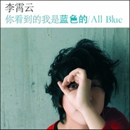

你看到的我是蓝色的
============================

|  |  |
| :--: | :-- |
| [ 你看到的我是蓝色的](https://emumo.xiami.com/album/386018) | **艺人**: [李霄云](../index.md) **语种**: 国语 **唱片公司**: 天娱传媒 **发行时间**: 2010年07月07日 **专辑类别**: 录音室专辑 **专辑风格**: 国语流行 Mandarin Pop, 华语唱作人 Chinese Singer-Songwriter **播放数**: 9973532 **收藏数**: 2020 **评论数**: 267  |

## 简介

心灵歌手 李霄云 Michelle Li  
2010 最新专辑 「你看到的我是蓝色的 All Blue」  
  
一个坚强女生 独自飘洋过海  
越过10万尺天空的距离 只为完成音乐的梦想  
她以无边无尽的低缓嗓音 把最接近心脏的感动穿透云霄之外  
专辑收录多首创作 全程亲身参与制作  
每天平均睡不到2小时 力求专辑忠于原味  
  
华语乐坛比心跳声还动听的女中低音、心灵勇者——李霄云（Michelle Li）2010最新专辑！一个勇敢的女生，独自飘洋过海，越过10万尺天空的距离，只为完成音乐的梦想，以无边无尽的低缓嗓音，把最接近心脏的感动穿透九霄云外；将蓝色的忧郁，释放在寂寞心灵的歌声之中，彻夜未眠，跨越13度音域的自我挑战，以完整录唱方式录音，展现一气呵成的演唱实力！  
  
最新专辑「你看到的我是蓝色的」中收录了霄云多首自己创作曲，希望透过多首她自己的自创曲可以让所有的歌迷听到云式风格，于是公司大胆启用了多首霄云个人的创作曲，而霄云也因此把平时写的许多创作的曲子让公司挑选，她特别解释每一首歌都是在最有感触地时候写下来的，歌曲背后都有难忘的心情故事，每次聆听就会解放了当时的烦恼还有压力，仿佛在郁热的夏天中喝下一口解忧的薄荷凉茶，为你吹走压在胸口的闷气，每首歌曲的编曲不哗众取宠，而力求的是衬托每首歌曲的心灵深度，就像霄云所想要传递的音乐精神—用最平实的音乐给你最贴近心脏的感动！  
  
因此每首歌的编曲都是霄云自己跟编曲老师沟通后编制而成，钢琴、吉他、人声是构成专辑的主要元素，简单不做作，每首歌就像自己的孩子，每天平均睡不到2个小时，因为在录音的过程中还有其他活动通告，但这一切都是值得的，除了参与录音许多歌词也都出自于个人生活写照的创作，有些许淡淡释怀的忧伤、一点点令人心疼的落寞、更有让人想要安抚的坚强，从歌曲中可以看到真正的霄云！ 

## 曲目

## 评论

|  |  |  |  |
| :-- | :-- | :-- | :-- |
|  [虾米用户](https://emumo.xiami.com/u/379162683) 我想要记住你们，我想要你... 2021-01-27 19:55 赞(0) 踩(0) | 

 |
|  [虾米用户](https://emumo.xiami.com/u/328240870)  2020-04-07 13:16 赞(0) 踩(0) | 
好好听听，感觉这是个很干净的嗓音，用心不浮躁，喜欢。
 |
|  [虾米用户](https://emumo.xiami.com/u/15733490)  2020-04-06 20:36 赞(0) 踩(0) | 
习惯
 |
|  [虾米用户](https://emumo.xiami.com/u/87191260) 我还没想好要写什么... 2020-01-29 23:36 赞(1) 踩(0) | 
这是我本世纪的女歌手里，听到过最舒服的歌声
 |
|  [虾米用户](https://emumo.xiami.com/u/191116653)  2019-12-30 15:52 赞(0) 踩(0) | 
忘不掉的
 |
|  [虾米用户](https://emumo.xiami.com/u/327340613)  2019-12-09 15:18 赞(0) 踩(0) | 
清澈的音色，像夏天在窗户边吹着的微风，摆动的树叶
 |
|  [虾米用户](https://emumo.xiami.com/u/432723610)  2019-11-27 13:24 赞(0) 踩(0) | 
优秀！
 |
|  [虾米用户](https://emumo.xiami.com/u/102344730)  2019-11-05 04:39 赞(0) 踩(0) | 
好像过去了很久
 |
|  [虾米用户](https://emumo.xiami.com/u/349134275) 我还没想好要写什么... 2019-10-21 17:48 赞(0) 踩(0) | 
突然在哼这首歌 原来都10年了啊 时间你慢些吧
 |
|  [虾米用户](https://emumo.xiami.com/u/187472834)   2019-09-18 15:49 赞(2) 踩(0) | 
原来那么多年了啊  
 |
|  [虾米用户](https://emumo.xiami.com/u/21114207) baby 我说什么来着？... 2019-08-28 21:30 赞(0) 踩(0) | 
好听
 |
|  [虾米用户](https://emumo.xiami.com/u/21114207) baby 我说什么来着？... 2019-08-28 21:29 赞(0) 踩(0) | 
无意中听到 太好听了
 |
|  [虾米用户](https://emumo.xiami.com/u/22343627)  2019-08-07 20:51 赞(0) 踩(0) | 
回忆一下
 |
|  [虾米用户](https://emumo.xiami.com/u/50423311) R&B、House、氛围... 2019-05-14 23:52 赞(0) 踩(0) | 
超棒
 |
|  [虾米用户](https://emumo.xiami.com/u/418424085)  2019-03-23 21:59 赞(0) 踩(0) | 
爱李霄云的声音
 |
|  [虾米用户](https://emumo.xiami.com/u/418424085)  2019-03-15 12:39 赞(0) 踩(0) | 
未来的李霄云一定会有更多更好听的歌曲
 |
|  [虾米用户](https://emumo.xiami.com/u/40380231) 一直都在流浪，不曾见过海... 2019-03-10 23:26 赞(1) 踩(0) | 
最爱的专辑 
 |
|  [虾米用户](https://emumo.xiami.com/u/154122728)  2019-02-20 22:40 赞(1) 踩(0) | 
当年快乐女声，特别喜欢她，好多美好的回忆！
 |
|  [虾米用户](https://emumo.xiami.com/u/355673041)  2019-02-04 14:21 赞(0) 踩(0) | 
好听就是好听，怎么样都是好听，就是心疼我爱的她
 |
|  [虾米用户](https://emumo.xiami.com/u/406447483) 我还没想好要写什么... 2018-12-12 10:05 赞(0) 踩(0) | 
值得
 |
|  [虾米用户](https://emumo.xiami.com/u/271988992)   2018-08-20 03:33 赞(0) 踩(0) | 
这张专辑算是童年回忆了
 |
|  [虾米用户](https://emumo.xiami.com/u/158284480) 发乎情，止乎礼。 2018-03-24 22:12 赞(0) 踩(0) | 
她回来了
 |
|  [虾米用户](https://emumo.xiami.com/u/259541141) You never wa... 2017-12-01 14:01 赞(0) 踩(0) | 
首首好听 这张专辑陪我度过一段寂寞却快乐的时光 有卷的声音我不孤单
 |
|  [虾米用户](https://emumo.xiami.com/u/516875)  2017-10-27 23:01 赞(0) 踩(0) | 
******
 |
|  [虾米用户](https://emumo.xiami.com/u/1140441)  2017-10-27 23:01 赞(0) 踩(0) | 
真的好稀饭！！！！霄云专辑大卖！！！！
 |
|  [虾米用户](https://emumo.xiami.com/u/72359914) 爱吃 2017-07-25 20:44 赞(0) 踩(0) | 
用心唱歌的超女，郁可唯，李霄云
 |
|  [虾米用户](https://emumo.xiami.com/u/279269256)  2017-03-27 21:00 赞(0) 踩(0) | 
好听，扎心。
 |
|  [虾米用户](https://emumo.xiami.com/u/263755788)  2017-02-18 01:05 赞(0) 踩(0) | 
为什么下架了阿
 |
|  [虾米用户](https://emumo.xiami.com/u/117272528) 呦吼~你好。 2016-08-11 12:50 赞(1) 踩(0) | 
啊啊啊！下架了！（不开心…）
 |
|  [虾米用户](https://emumo.xiami.com/u/7686338) 静静深夜 月涌江流 2016-06-04 19:50 赞(0) 踩(0) | 
习惯...
 |
|  [虾米用户](https://emumo.xiami.com/u/3562785)  2016-06-02 13:10 赞(1) 踩(0) | 
昨天才听了口袋 今天一二都下架了 虾米网易都没地儿了
 |
|  [虾米用户](https://emumo.xiami.com/u/171662554)  2016-05-17 02:22 赞(0) 踩(0) | 
想听老歌，所以辗转到虾米来听～ 
 |
|  [虾米用户](https://emumo.xiami.com/u/81315412)   2016-04-19 08:35 赞(0) 踩(0) | 
整张专辑都很棒
 |
|  [虾米用户](https://emumo.xiami.com/u/3560508)  2016-04-18 21:46 赞(0) 踩(0) | 
这张专辑真不错！
 |
|  [虾米用户](https://emumo.xiami.com/u/3560508)  2016-04-18 21:45 赞(0) 踩(0) | 
现在的我看到的你是蓝色的
 |
|  [虾米用户](https://emumo.xiami.com/u/55208175)  2016-02-17 13:48 赞(1) 踩(0) | 
声音真有辩识力！
 |
|  [虾米用户](https://emumo.xiami.com/u/7603700) 我还没想好要写什么... 2016-01-10 15:06 赞(1) 踩(0) | 
我的循环专辑。
 |
|  [虾米用户](https://emumo.xiami.com/u/49775851) 你好。 2015-12-31 11:19 赞(0) 踩(0) | 
那些年的记忆，年轻的记忆。我爱每一个过去。
 |
|  [虾米用户](https://emumo.xiami.com/u/44624907)   2015-10-15 22:58 赞(2) 踩(0) | 
如今再温习.歌里有多少没体会出的心情又还重要吗.它已经渗入我的记忆.最美好的那段日子
 |
|  [虾米用户](https://emumo.xiami.com/u/44624907)   2015-10-15 22:56 赞(4) 踩(0) | 
高中那年.还没有iPhone4的时候.手机只能哒哒哒按键盘的时候.一首一首地用家里超卡的台式机.把音乐一首一首拖进手机.每晚周围一切安静的时候.就这样一首一首固执地听.一句一句固执地学.不带任何思绪.只有对未来的无畏和期待
 |
|  [虾米用户](https://emumo.xiami.com/u/72926954)   2015-10-11 17:45 赞(1) 踩(0) | 
顶！！
 |
|  [虾米用户](https://emumo.xiami.com/u/33526842) 乐手与人生 2015-09-24 00:26 赞(4) 踩(0) | 
高三毕业的时候听到了这首歌，当时刚刚结束了长达十年的暗恋，我终于放开他了。和闺蜜偷偷溜回学校，坐在操场的旁边一边聊天一边听歌，闺蜜就看着我听着这首歌笑着哭成一个泪人
 |
|  [虾米用户](https://emumo.xiami.com/u/58600574)  2015-09-22 09:34 赞(2) 踩(0) | 
质朴，好听
 |
|  [虾米用户](https://emumo.xiami.com/u/57817836) Miss Funny 2015-09-17 17:29 赞(1) 踩(0) | 
小蓝我的夏天
 |
|  [虾米用户](https://emumo.xiami.com/u/11168389) 岁月静好，诗意的栖居 2015-09-17 11:04 赞(11) 踩(0) | 
真的很喜欢李霄云的声音，非常好听，让心很投入的感觉。可惜这么好的歌手，不能活跃在音乐第一线，经常更新音乐。
 |
|  [虾米用户](https://emumo.xiami.com/u/45377786)  2015-08-31 01:21 赞(1) 踩(0) | 
最爱李霄云的爸爸给的坚强，听哭了
 |
|  [虾米用户](https://emumo.xiami.com/u/25648055)  2015-08-31 00:22 赞(1) 踩(0) | 
超喜欢 你不在的时候
 |
|  [虾米用户](https://emumo.xiami.com/u/37084921) 有时再见可能就再也不见了 2015-08-29 14:39 赞(1) 踩(0) | 
听了新歌回来翻听老歌，实在太有质感的声音，直击内心的声音
 |
|  [虾米用户](https://emumo.xiami.com/u/42989678) 勇敢 2015-08-28 21:51 赞(0) 踩(0) | 
沿着现在找回从前【为啥打从前第一个出现的是葱烧23333】
 |
|  [虾米用户](https://emumo.xiami.com/u/58725406)  2015-08-28 19:33 赞(0) 踩(0) | 
唱出了他的味道
 |
|  [虾米用户](https://emumo.xiami.com/u/25452375) 宅货 2015-08-28 16:33 赞(0) 踩(0) | 
当初第一次听就很喜欢了。
 |
|  [虾米用户](https://emumo.xiami.com/u/7413843) 我还没想好要写什么... 2015-08-28 10:59 赞(0) 踩(0) | 
声音真不错
 |
|  [虾米用户](https://emumo.xiami.com/u/57841436) 不定期抽风刷屏 偶尔吐槽... 2015-08-25 23:57 赞(0) 踩(0) | 
晚安：）
 |
|  [虾米用户](https://emumo.xiami.com/u/49263928) You are the ... 2015-08-10 14:17 赞(5) 踩(0) | 
她那年的快乐女声，最喜欢她。真实，有才。
 |
|  [虾米用户](https://emumo.xiami.com/u/1302067)  2015-06-25 12:30 赞(0) 踩(0) | 
真好听
 |
|  [虾米用户](https://emumo.xiami.com/u/44923179)  2015-05-29 17:58 赞(0) 踩(0) | 
你看到的我是蓝色的这首歌好像有点问题，前面好像是另一首歌
 |
|  [虾米用户](https://emumo.xiami.com/u/39797996) 上善如水 좋은 게 좋은... 2015-04-25 14:32 赞(0) 踩(0) | 
好听
 |
|  [虾米用户](https://emumo.xiami.com/u/48169446)  2015-03-15 18:00 赞(0) 踩(0) | 
霄云，爱你的心，只属于你。
 |
|  [虾米用户](https://emumo.xiami.com/u/9422912) want  a hug 2015-02-26 16:33 赞(0) 踩(0) | 
好久没有听过李霄云的歌，随机播放我的收藏突然放到这首歌，有点意外自己居然当初有收藏这首歌，最初听歌的心情一一浮上心头，直到现在再次聆听还是很感动。
 |
|  [虾米用户](https://emumo.xiami.com/u/2817889) 我还没想好要写什么... 2014-12-27 09:07 赞(1) 踩(0) | 
十首歌喜欢五首，很难得。
 |
| ⇒ |  [虾米用户](https://emumo.xiami.com/u/72352050)  2015-10-10 13:07 赞(0) 踩(0) | 
李霄云最好的一张专辑，不解释
 |
|  [虾米用户](https://emumo.xiami.com/u/40529358) 我还没想好要写什么... 2014-12-25 21:29 赞(0) 踩(0) | 
再也听不回三年前的感觉 那又何妨:)
 |
|  [虾米用户](https://emumo.xiami.com/u/2417727) Hi~ 2014-11-17 10:37 赞(0) 踩(0) | 
现在想想当初暗恋的时候夜夜听着这张专辑辗转真的好笑~
 |
|  [虾米用户](https://emumo.xiami.com/u/1900235)  2014-11-10 18:30 赞(0) 踩(0) | 
好听
 |
|  [虾米用户](https://emumo.xiami.com/u/25395893) 暂无签名~ 2014-11-05 23:47 赞(1) 踩(0) | 
喜欢  听着安静的  温柔的  淡淡的  一点点忧伤 一点点寂寞  一点点无奈
 |
|  [虾米用户](https://emumo.xiami.com/u/1904683)  2014-09-27 00:27 赞(29) 踩(0) | 
改变了超女的印象，她是第一个
 |
|  [虾米用户](https://emumo.xiami.com/u/18940951) 上个月说的话这个月看了就... 2014-08-24 09:40 赞(0) 踩(0) | 
再听 再听 怎么都喜欢
 |
|  [虾米用户](https://emumo.xiami.com/u/36319648) 学识使人坚毅 2014-07-25 14:37 赞(0) 踩(0) | 
第一次听他的歌，你看到的我是蓝色的，你不懂。
 |
|  [虾米用户](https://emumo.xiami.com/u/7481448)  2014-06-03 18:35 赞(0) 踩(0) | 
惊艳
 |
|  [虾米用户](https://emumo.xiami.com/u/10808851)  2014-04-06 23:11 赞(0) 踩(0) | 
好听
 |
|  [虾米用户](https://emumo.xiami.com/u/21167852) 不能吃太胖喔,不然会被杀... 2014-04-05 15:07 赞(0) 踩(0) | 
还好
 |
|  [虾米用户](https://emumo.xiami.com/u/6988443)  2014-03-13 21:26 赞(1) 踩(0) | 
此刻的心情听这种爱恨纠缠的情歌简直憋出内伤
 |
|  [虾米用户](https://emumo.xiami.com/u/6988443)  2014-03-13 21:23 赞(0) 踩(0) | 
除了回忆爸爸那一首之外，其他每一首歌都像是经历了一场痛彻心扉的恋爱
 |
|  [虾米用户](https://emumo.xiami.com/u/1609946) 一即一切 2014-03-08 16:25 赞(0) 踩(0) | 
心 境不二
 |
|  [虾米用户](https://emumo.xiami.com/u/5612995)  2014-02-05 19:10 赞(0) 踩(0) | 
喜欢习惯和灯
 |
|  [虾米用户](https://emumo.xiami.com/u/13739025)   2013-12-21 17:25 赞(1) 踩(0) | 
每次心情不好的时候听着听着就好了
 |
|  [虾米用户](https://emumo.xiami.com/u/7223221) 某只爱吃音乐的吃货 2013-12-18 12:21 赞(0) 踩(0) | 
现在的你看到的我是蓝色的
 |
|  [虾米用户](https://emumo.xiami.com/u/16495431) 開始新生活 2013-12-17 14:44 赞(0) 踩(0) | 
你看到的我是蓝色的
 |
|  [虾米用户](https://emumo.xiami.com/u/11221879) time comes a... 2013-12-04 20:47 赞(0) 踩(0) | 
好无奈
 |
|  [虾米用户](https://emumo.xiami.com/u/8408612)  2013-11-28 20:57 赞(0) 踩(0) | 
最喜欢那首 我为谁而来 未知的问题 抛给曾经的你
 |
|  [虾米用户](https://emumo.xiami.com/u/1422174)  2013-11-26 04:12 赞(0) 踩(0) | 
.
 |
|  [虾米用户](https://emumo.xiami.com/u/19696134)  2013-10-09 23:56 赞(0) 踩(0) | 
去年大约是这个时候喜欢的这首歌，再听都会有那时候的记忆浮现
 |
|  [虾米用户](https://emumo.xiami.com/u/9012652)  2013-09-29 23:02 赞(0) 踩(0) | 
轻轻地，软软的，很舒服。
 |
|  [虾米用户](https://emumo.xiami.com/u/18562484)  2013-09-12 11:19 赞(0) 踩(0) | 
你看到的我是蓝色的
 |
|  [虾米用户](https://emumo.xiami.com/u/12003517)  2013-09-11 17:20 赞(0) 踩(0) | 
每一曲都清新得像一首诗
 |
|  [虾米用户](https://emumo.xiami.com/u/5569418)  2013-07-28 18:20 赞(0) 踩(0) | 
不堪的未来 我正在沉淀
 |
|  [虾米用户](https://emumo.xiami.com/u/7850020) 喜欢的歌，静静的听。 2013-07-17 21:36 赞(0) 踩(0) | 
午后的猫 懒懒的躺在阳光下睡着了。
 |
|  [虾米用户](https://emumo.xiami.com/u/14924704) 你凭什么否定我 2013-05-30 16:19 赞(0) 踩(0) | 
喜欢
 |
|  [虾米用户](https://emumo.xiami.com/u/5044438) 今天白嘟出雙人曲了嗎？ 2013-05-24 16:44 赞(0) 踩(0) | 
不能说首首精品，但是却首首都是不同程度的悦耳。
 |
|  [虾米用户](https://emumo.xiami.com/u/10979904) 瓦解和腐败之后，会有新生 2013-05-20 17:23 赞(0) 踩(0) | 
大爱 从快女开始就蛮喜欢这个女生 她的声音有一种舒服的感觉 很有灵性
 |
|  [虾米用户](https://emumo.xiami.com/u/10017290) 风晓落花梨树一 2013-05-12 14:41 赞(0) 踩(0) | 
百听不厌！
 |
|  [虾米用户](https://emumo.xiami.com/u/14864552)  2013-05-11 14:24 赞(1) 踩(0) | 
现在的你看到的我是蓝色的
 |
|  [虾米用户](https://emumo.xiami.com/u/4175232)  2013-04-11 15:16 赞(0) 踩(0) | 
喜欢
 |
|  [虾米用户](https://emumo.xiami.com/u/2646139) 不气馁有召唤爱自由 2013-04-08 18:28 赞(0) 踩(0) | 
从开始到现在到蓝色的故事集。依然是你。
 |
|  [虾米用户](https://emumo.xiami.com/u/5027852)  2013-04-06 21:11 赞(0) 踩(0) | 
好听，最近迷中音女声。
 |
|  [虾米用户](https://emumo.xiami.com/u/1182761) 松任谷由实的迷弟 2013-03-13 15:18 赞(1) 踩(0) | 
如果不是李霄云自己的坚持，我相信天娱这家公司 是绝对不可能去找台湾的编曲大师 钟兴民 来负责《灯》的编曲的。当然，卷毛显然没有让大家失望，歌剧般的演唱 和这首歌的编曲配合的天衣无缝
 |
| ⇒ |  [虾米用户](https://emumo.xiami.com/u/11427934) 没事儿别找我，我在图书馆... 2013-06-29 17:28 赞(0) 踩(0) | 
小葱头我也喜欢 灯 ！
 |
| ⇒ |  [虾米用户](https://emumo.xiami.com/u/1182761) 松任谷由实的迷弟 2013-06-29 17:56 赞(0) 踩(0) | 
<q><b>托洛茨基说：</b></q>
 |
|  [虾米用户](https://emumo.xiami.com/u/6383900)  2013-02-25 20:22 赞(0) 踩(0) | 
你曾是那抹透彻心扉的蓝。
 |
|  [虾米用户](https://emumo.xiami.com/u/11795508)  2013-02-25 16:11 赞(0) 踩(0) | 
这张的感觉依旧可以听到她的那种独白的感觉
 |
|  [虾米用户](https://emumo.xiami.com/u/12843412)  2013-02-02 20:45 赞(0) 踩(0) | 
不错
 |
|  [虾米用户](https://emumo.xiami.com/u/4275776) 虾米音质检测督查账号 2013-01-31 23:15 赞(0) 踩(0) | 
#音质报告#更新成合格320K啦，大家可放心下载。
 |
|  [虾米用户](https://emumo.xiami.com/u/3389673) 音乐爱好的人 2013-01-26 15:47 赞(0) 踩(0) | 
ok
 |
|  [虾米用户](https://emumo.xiami.com/u/7276371)  2013-01-25 18:29 赞(0) 踩(0) | 
不错
 |
|  [虾米用户](https://emumo.xiami.com/u/9287276)   2013-01-14 20:35 赞(0) 踩(0) | 
治愈系的女中音，文艺青年会喜欢的一张唱片和曲风⋯⋯
 |
|  [虾米用户](https://emumo.xiami.com/u/1148765)  2013-01-14 15:25 赞(0) 踩(0) | 
午后听着真美。
 |
|  [虾米用户](https://emumo.xiami.com/u/12203995)   2013-01-01 06:40 赞(0) 踩(0) | 
很好听。
 |
|  [虾米用户](https://emumo.xiami.com/u/617777)  2012-12-29 16:26 赞(35) 踩(0) | 
这大概是天娱做的最有质量的一张专辑了吧
 |
|  [虾米用户](https://emumo.xiami.com/u/7334067)  2012-12-26 20:27 赞(0) 踩(0) | 
很爱 习惯
 |
|  [虾米用户](https://emumo.xiami.com/u/12064559)  2012-12-23 15:57 赞(0) 踩(0) | 
加油
 |
|  [虾米用户](https://emumo.xiami.com/u/12045743)  2012-12-22 14:54 赞(0) 踩(0) | 
喜欢
 |
|  [虾米用户](https://emumo.xiami.com/u/11223553)  2012-12-20 21:27 赞(0) 踩(0) | 
喜欢她的淡淡吟唱和灵气
 |
|  [虾米用户](https://emumo.xiami.com/u/12019433) 暂无签名~ 2012-12-20 21:00 赞(0) 踩(0) | 
无比好听
 |
|  [虾米用户](https://emumo.xiami.com/u/12019433) 暂无签名~ 2012-12-20 21:00 赞(0) 踩(0) | 
太精彩了
 |
|  [虾米用户](https://emumo.xiami.com/u/11994445) 如槿 2012-12-19 06:40 赞(0) 踩(0) | 
舒服
 |
|  [虾米用户](https://emumo.xiami.com/u/11994445) 如槿 2012-12-19 06:39 赞(0) 踩(0) | 
超喜欢。。
 |
|  [虾米用户](https://emumo.xiami.com/u/11988519)  2012-12-18 18:03 赞(0) 踩(0) | 
陪伴我
 |
|  [虾米用户](https://emumo.xiami.com/u/11223642)  2012-12-18 12:43 赞(0) 踩(0) | 
就是喜欢~~~
 |
|  [虾米用户](https://emumo.xiami.com/u/579401)  2012-11-21 21:53 赞(0) 踩(0) | 
在这样一段时间，突然听到这样歌曲，大喜！
 |
|  [虾米用户](https://emumo.xiami.com/u/10286336)  2012-11-17 11:46 赞(0) 踩(0) | 
你看见的我是蓝色的
 |
|  [虾米用户](https://emumo.xiami.com/u/411753)  2012-11-15 00:16 赞(0) 踩(0) | 
good
 |
|  [虾米用户](https://emumo.xiami.com/u/11300688)  2012-11-01 13:46 赞(0) 踩(0) | 
蓝色的
 |
|  [虾米用户](https://emumo.xiami.com/u/366982)  2012-10-31 13:41 赞(0) 踩(0) | 
在这样的阴天，泡一杯茶，点开这张专辑，让大脑停止转动。#生活有时候需要暂停一下#
 |
|  [虾米用户](https://emumo.xiami.com/u/424091)   2012-10-30 02:36 赞(0) 踩(0) | 
我喜欢的你也是蓝色的~！
 |
|  [虾米用户](https://emumo.xiami.com/u/11222082)  2012-10-27 11:09 赞(0) 踩(0) | 
小清新
 |
|  [虾米用户](https://emumo.xiami.com/u/9301514) 独立唱作人 2012-10-26 20:00 赞(0) 踩(0) | 
霄云老专辑，好多好听与感动。
 |
|  [虾米用户](https://emumo.xiami.com/u/9490604) 我还没想好要写什么... 2012-10-07 22:53 赞(0) 踩(0) | 
好喜欢女低音
 |
|  [虾米用户](https://emumo.xiami.com/u/3227992)  2012-09-29 17:25 赞(0) 踩(0) | 
不管神马时候都还是会动心的声音
 |
|  [虾米用户](https://emumo.xiami.com/u/5644547)  2012-09-26 08:45 赞(0) 踩(0) | 
还是这个充满故事的声音，不管过多久~~~~总是能让人安静下来，想起曾经在它陪伴下熬的那些夜，还有我们在诺村的小家，粉色的墙壁湖绿的地毯 ~@楽小楽爱喝水
 |
|  [虾米用户](https://emumo.xiami.com/u/4034817)   2012-09-25 10:23 赞(0) 踩(0) | 
声音真好~
 |
|  [虾米用户](https://emumo.xiami.com/u/10390232)  2012-08-27 16:51 赞(0) 踩(0) | 
喜欢声音
 |
|  [虾米用户](https://emumo.xiami.com/u/4258287)  2012-07-05 23:02 赞(62) 踩(0) | 
天娱大傻逼啊，居然雪藏这么一个有质量的歌手
 |
| ⇒ |  [虾米用户](https://emumo.xiami.com/u/3562785)  2012-07-13 02:09 赞(0) 踩(0) | 
天娱大傻逼+1
 |
| ⇒ |  [虾米用户](https://emumo.xiami.com/u/23036349)  2018-01-02 08:03 赞(0) 踩(0) | 
+1
 |
|  [虾米用户](https://emumo.xiami.com/u/329789)  2012-07-04 17:32 赞(0) 踩(0) | 
李霄云的这张专辑好好听，你，什么时候，再出专辑呀
 |
|  [虾米用户](https://emumo.xiami.com/u/3554500)  2012-06-28 22:48 赞(0) 踩(0) | 
期待你的第二张专辑~
 |
|  [虾米用户](https://emumo.xiami.com/u/535673)  2012-05-28 02:12 赞(0) 踩(0) | 
今晚新宠~ 这人的音域是不是有点太广了 = =| 女低音万岁~
 |
|  [虾米用户](https://emumo.xiami.com/u/5574081)   2012-05-18 21:11 赞(1) 踩(0) | 
很适合她声音的一首歌啊，最后一届快女里最喜欢的还是李霄云，婴儿肥，很干净，像个唱歌的人的样子。
 |
|  [虾米用户](https://emumo.xiami.com/u/7978701)  2012-04-19 18:11 赞(0) 踩(0) | 
你看到的我是蓝色的
 |
|  [虾米用户](https://emumo.xiami.com/u/3422234)  2012-03-26 17:08 赞(0) 踩(0) | 
平淡中唱出深深的情
 |
|  [虾米用户](https://emumo.xiami.com/u/8020803)  2012-03-17 22:00 赞(0) 踩(0) | 
有些蓝色的感觉，很清淡
 |
|  [虾米用户](https://emumo.xiami.com/u/3921840) I love you n... 2012-03-17 00:40 赞(0) 踩(0) | 
哀伤中有点治愈的感觉
 |
|  [虾米用户](https://emumo.xiami.com/u/8422733)  2012-03-14 13:39 赞(0) 踩(0) | 
歌曲中一丝淡淡的哀愁，说出了那些藏在最深处的思绪……
 |
|  [虾米用户](https://emumo.xiami.com/u/8176877) 極其樂觀的悲觀主義者。 2012-03-09 02:24 赞(0) 踩(0) | 
Blue。
 |
|  [虾米用户](https://emumo.xiami.com/u/5869347)  2012-03-07 21:46 赞(0) 踩(0) | 
质感的声线，很真诚的感觉~~~赞
 |
|  [虾米用户](https://emumo.xiami.com/u/3562785)  2012-02-26 19:01 赞(0) 踩(0) | 
很有质感的声音，才女一枚。我很喜欢那首她写的那首你不在的时候~
 |
|  [虾米用户](https://emumo.xiami.com/u/7411329)  2012-02-12 14:14 赞(0) 踩(0) | 
为数不多的声音很有自己特色的歌手
 |
|  [虾米用户](https://emumo.xiami.com/u/329837) 一加一等于几 2012-02-03 19:44 赞(0) 踩(0) | 
声线不错
 |
|  [虾米用户](https://emumo.xiami.com/u/7815704)  2012-01-27 22:19 赞(0) 踩(0) | 
喜欢……
 |
|  [虾米用户](https://emumo.xiami.com/u/7815704)  2012-01-27 22:18 赞(0) 踩(0) | 
好听……支持……
 |
|  [虾米用户](https://emumo.xiami.com/u/7716271)  2012-01-20 09:05 赞(0) 踩(0) | 
喜欢淡淡沙哑的声音，喜欢那种意境，喜欢。。。
 |
|  [虾米用户](https://emumo.xiami.com/u/4289997)  2012-01-02 21:53 赞(0) 踩(0) | 
第一次被人打动，第一次那么喜欢一个歌手，加油
 |
|  [虾米用户](https://emumo.xiami.com/u/7351166) 没有音乐世界会怎样 2011-12-25 10:01 赞(0) 踩(0) | 
金属音
 |
|  [虾米用户](https://emumo.xiami.com/u/7253385)  2011-12-15 17:22 赞(0) 踩(0) | 
安静的小忧郁
 |
|  [虾米用户](https://emumo.xiami.com/u/7157835)  2011-12-08 20:50 赞(0) 踩(0) | 
很喜欢
 |
|  [虾米用户](https://emumo.xiami.com/u/3554500)  2011-12-07 16:03 赞(0) 踩(0) | 
很有磁性的声音
 |
|  [虾米用户](https://emumo.xiami.com/u/3554500)  2011-12-07 16:03 赞(0) 踩(0) | 
好听~
 |
|  [虾米用户](https://emumo.xiami.com/u/5715569)  2011-12-06 19:33 赞(0) 踩(0) | 
就是喜欢
 |
|  [虾米用户](https://emumo.xiami.com/u/663145)  2011-11-29 18:56 赞(0) 踩(0) | 
我不会想到我夏天也跟神经病一样排了队去了你的签售，虽然只是无心路过，但还是跟你说上了一句话。
 |
|  [虾米用户](https://emumo.xiami.com/u/3264530)  2011-10-23 13:01 赞(0) 踩(0) | 
你给的幸福。
 |
|  [虾米用户](https://emumo.xiami.com/u/6304899) 努力 2011-10-22 09:43 赞(0) 踩(0) | 
好听，顶个
 |
|  [虾米用户](https://emumo.xiami.com/u/3071472)  2011-10-05 12:37 赞(0) 踩(0) | 
温暖的声音
 |
|  [虾米用户](https://emumo.xiami.com/u/5933662)  2011-10-03 01:21 赞(0) 踩(0) | 
非常好
 |
|  [虾米用户](https://emumo.xiami.com/u/6072840)   2011-10-02 10:25 赞(0) 踩(0) | 
不解释
 |
|  [虾米用户](https://emumo.xiami.com/u/4148751)  2011-09-23 11:45 赞(0) 踩(0) | 
从比赛开始就很喜欢的歌者，现在声音不多，希望能有多多的好作品与大家分享，支持~
 |
|  [虾米用户](https://emumo.xiami.com/u/1392736) 感觉鸭梨有点大啊~ 2011-09-22 13:52 赞(0) 踩(0) | 
超喜欢～
 |
|  [虾米用户](https://emumo.xiami.com/u/138974) 活着？ 2011-09-12 10:07 赞(0) 踩(0) | 
好听呗
 |
|  [虾米用户](https://emumo.xiami.com/u/138974) 活着？ 2011-09-12 10:05 赞(0) 踩(0) | 
love it
 |
|  [虾米用户](https://emumo.xiami.com/u/138974) 活着？ 2011-09-03 20:35 赞(0) 踩(0) | 
第二耳好听...卷发很吸引人
 |
|  [虾米用户](https://emumo.xiami.com/u/5644547)  2011-09-01 02:23 赞(0) 踩(0) | 
就是这个声音，什么时候都那么的。。。。。
 |
|  [虾米用户](https://emumo.xiami.com/u/5587232)  2011-08-26 22:10 赞(0) 踩(0) | 
感到困惑的时候，她让我变坚强!
 |
|  [虾米用户](https://emumo.xiami.com/u/5558630)  2011-08-24 19:35 赞(0) 踩(0) | 
可以让烦躁的心安静下来！
 |
|  [虾米用户](https://emumo.xiami.com/u/5558630)  2011-08-24 19:34 赞(0) 踩(0) | 
淡淡的愁，淡淡的伤！
 |
|  [虾米用户](https://emumo.xiami.com/u/989100) Forever indi... 2011-08-19 14:04 赞(0) 踩(0) | 
发现竟然么有藏过着一张
 |
|  [虾米用户](https://emumo.xiami.com/u/5461901)   2011-08-18 20:11 赞(0) 踩(0) | 
惊艳到我的一张~
 |
|  [虾米用户](https://emumo.xiami.com/u/5009628) liu lang ... 2011-08-12 19:31 赞(0) 踩(0) | 
我也是蓝色的。
 |
|  [虾米用户](https://emumo.xiami.com/u/5393946)  2011-08-12 13:53 赞(0) 踩(0) | 
磁性的声音，迷人深邃
 |
|  [虾米用户](https://emumo.xiami.com/u/5208752)  2011-08-11 09:29 赞(0) 踩(0) | 
有一种音乐美叫做李霄云
 |
|  [虾米用户](https://emumo.xiami.com/u/4192227) 我还没想好要写什么... 2011-08-04 12:27 赞(0) 踩(0) | 
第一次听李霄云  实在很棒的一张
 |
|  [虾米用户](https://emumo.xiami.com/u/5095421)  2011-08-02 02:51 赞(0) 踩(0) | 
喜欢 习惯
 |
|  [虾米用户](https://emumo.xiami.com/u/2793798) 天天向上 2011-08-01 17:25 赞(0) 踩(0) | 
灯这首歌曲好棒好棒~~~~~~
 |
|  [虾米用户](https://emumo.xiami.com/u/2793798) 天天向上 2011-08-01 16:52 赞(0) 踩(0) | 
霄云~~~
 |
|  [虾米用户](https://emumo.xiami.com/u/2918826)  2011-07-17 01:33 赞(0) 踩(0) | 
很有诚意的作品，特别喜欢我为谁而来和爸爸给的坚强，真的不太相信这是天娱出品
 |
|  [虾米用户](https://emumo.xiami.com/u/4827048)  2011-07-13 01:38 赞(0) 踩(0) | 
大爱霄云
 |
|  [虾米用户](https://emumo.xiami.com/u/4788311)  2011-07-09 17:30 赞(0) 踩(0) | 
你看到的我是蓝色的
 |
|  [虾米用户](https://emumo.xiami.com/u/1254173) somethingblu 2011-07-08 11:03 赞(0) 踩(0) | 
优美的旋律，深入人心的歌词。。。
 |
|  [虾米用户](https://emumo.xiami.com/u/3554500)  2011-06-30 20:03 赞(0) 踩(0) | 
新专辑什么时候有啊！！！我的路人朋友都替你着急了~
 |
|  [虾米用户](https://emumo.xiami.com/u/3973466)  2011-06-16 11:30 赞(0) 踩(0) | 
好歌啊
 |
|  [虾米用户](https://emumo.xiami.com/u/3973192)  2011-06-13 02:07 赞(0) 踩(0) | 
霄云 喜欢你！
 |
|  [虾米用户](https://emumo.xiami.com/u/893835)  2011-05-28 20:35 赞(0) 踩(0) | 
声音很醇厚
 |
|  [虾米用户](https://emumo.xiami.com/u/4066859)  2011-05-26 10:02 赞(0) 踩(0) | 
好听
 |
|  [虾米用户](https://emumo.xiami.com/u/4066859)  2011-05-26 09:56 赞(0) 踩(0) | 
好听
 |
|  [虾米用户](https://emumo.xiami.com/u/3296385) 我还没想好要写什么... 2011-05-14 19:58 赞(0) 踩(0) | 
好听
 |
|  [虾米用户](https://emumo.xiami.com/u/1227124)  2011-05-12 09:31 赞(0) 踩(0) | 
就是喜欢！
 |
|  [虾米用户](https://emumo.xiami.com/u/1695386)  2011-04-23 23:37 赞(0) 踩(0) | 
听过，你看到的我是蓝色的。
 |
|  [虾米用户](https://emumo.xiami.com/u/2011827)  2011-04-21 20:19 赞(0) 踩(0) | 
云团
 |
|  [虾米用户](https://emumo.xiami.com/u/3568877)  2011-04-15 13:19 赞(0) 踩(0) | 
我很看好
 |
|  [虾米用户](https://emumo.xiami.com/u/614364)  2011-04-04 13:34 赞(0) 踩(0) | 
沉淀 眼前一亮
 |
|  [虾米用户](https://emumo.xiami.com/u/1433564)   2011-04-02 17:56 赞(0) 踩(0) | 
很好听，给人很舒服的感觉
 |
|  [虾米用户](https://emumo.xiami.com/u/2833572) Just listen. 2011-02-27 14:40 赞(0) 踩(0) | 
李霄云 首张个人创作大碟
 |
|  [虾米用户](https://emumo.xiami.com/u/2876623)  2011-02-19 09:17 赞(0) 踩(0) | 
嗯，蓝色的。阿凡达不是蓝色的么？
 |
|  [虾米用户](https://emumo.xiami.com/u/2820778)  2011-02-18 18:05 赞(0) 踩(0) | 
喜欢《爸爸给的坚强》
 |
|  [虾米用户](https://emumo.xiami.com/u/2882156)  2011-02-18 01:06 赞(0) 踩(0) | 
很特别的声音~
 |
|  [虾米用户](https://emumo.xiami.com/u/1642903) 看心情听音乐~ 2011-02-13 21:26 赞(0) 踩(0) | 
如果觉得刚才的视频很长的话，可以先看下这个宣传片~~<a href="http://v.youku.com/v_show/id_XMjM2NzU5NDQw.html" target="_blank" rel="nofollow noreferrer noopener">http://v.youku.com/v_show/id_XMjM2NzU5NDQw.html</a>
 |
|  [虾米用户](https://emumo.xiami.com/u/1642903) 看心情听音乐~ 2011-02-13 21:25 赞(0) 踩(0) | 
李霄云2010北展个人首唱会，李霄云吧影音组出品，高清画质，敬请欣赏~~<a href="http://www.tudou.com/playlist/playindex.do?lid=jWH-FugWQ90" target="_blank" rel="nofollow noreferrer noopener">http://www.tudou.com/playlist/playindex.do?lid=jWH-FugWQ90</a>
 |
|  [虾米用户](https://emumo.xiami.com/u/2452203)  2011-02-12 10:59 赞(0) 踩(0) | 
期待新作，太喜欢她的声音
 |
|  [虾米用户](https://emumo.xiami.com/u/2712138)  2011-02-11 22:39 赞(0) 踩(0) | 
假以时日定会是另一个蔡琴
 |
|  [虾米用户](https://emumo.xiami.com/u/2782859)  2011-02-11 18:37 赞(0) 踩(0) | 
最爱卷
 |
|  [虾米用户](https://emumo.xiami.com/u/549323) 暂无签名~ 2010-12-08 08:48 赞(0) 踩(0) | 
你看到的我是蓝色的在MP3里待了好几个星期Repeat十多次（一般我的P3里的中文歌不会超过20首）温暖的中低音
 |
|  [虾米用户](https://emumo.xiami.com/u/1083253)   2010-10-24 11:27 赞(0) 踩(0) | 
现在的你看到的我是蓝色的……成全你的自由，宁愿我一人孤独……
 |
|  [虾米用户](https://emumo.xiami.com/u/127854) 。 2010-09-21 20:59 赞(0) 踩(0) | 
听的舒服，喜欢。
 |
|  [虾米用户](https://emumo.xiami.com/u/502343) 好好生活 2010-09-14 23:08 赞(0) 踩(0) | 
有点小意外
 |
|  [虾米用户](https://emumo.xiami.com/u/1487794)  2010-09-12 11:36 赞(0) 踩(0) | 
喜欢她的声音，还有浅浅微笑时干净的轮廓。
 |
|  [虾米用户](https://emumo.xiami.com/u/6418) 暂无签名~ 2010-09-05 18:14 赞(0) 踩(0) | 
挖~~李霄云原来唱歌这么好听~~继笔笔之后我又喜欢上一个超女！
 |
|  [虾米用户](https://emumo.xiami.com/u/1134417)  2010-09-04 11:47 赞(0) 踩(0) | 
听起来……很舒服……
 |
|  [虾米用户](https://emumo.xiami.com/u/1035029)  2010-08-23 17:01 赞(0) 踩(0) | 
爸爸。我记起了，太多我的小时候。
 |
|  [虾米用户](https://emumo.xiami.com/u/436300)  2010-08-16 18:42 赞(0) 踩(0) | 
永远的陈医生
 |
|  [虾米用户](https://emumo.xiami.com/u/1258504) 小螃蟹先生 2010-08-03 19:31 赞(0) 踩(0) | 
两个字：好听
 |
|  [虾米用户](https://emumo.xiami.com/u/12127) 瘟疫医生拿起了带锈的小刀... 2010-08-03 13:42 赞(0) 踩(0) | 
标题党。。。。
 |
|  [虾米用户](https://emumo.xiami.com/u/650450)  2010-07-28 19:44 赞(0) 踩(0) | 
嘻嘻  第一首是我最近一直循环的歌  大爱
 |
|  [虾米用户](https://emumo.xiami.com/u/1103236)  2010-07-20 12:14 赞(0) 踩(0) | 
淡淡的，纯纯的，很有特点的声线，很棒的女歌手，很棒的专辑
 |
|  [虾米用户](https://emumo.xiami.com/u/60395) 春种一粒粟 2010-07-18 00:18 赞(0) 踩(0) | 
很不错。她的声线是很独特的。记得当年哪个老师评论她唱阿哲的时候几乎和阿哲是一个key，闭上眼睛，好像一个女版张信哲在唱歌。好特别。好稳定。好听。
 |
|  [虾米用户](https://emumo.xiami.com/u/356)  2010-07-17 15:47 赞(0) 踩(0) | 
小七啊，考虑考虑。哈，抄袭的设计<a href="http://www.douban.com/photos/photo/547576576/" target="_blank" rel="nofollow noreferrer noopener">http://www.douban.com/photos/photo/547576576/</a>
 |
|  [虾米用户](https://emumo.xiami.com/u/284231)  2010-07-17 14:55 赞(0) 踩(0) | 
我说过的，她出专辑我一定买
 |
|  [虾米用户](https://emumo.xiami.com/u/1173735)  2010-07-16 21:47 赞(0) 踩(0) | 
那是一个灵魂的歌手,舒服的声音,当你心情不好的时候,听听这个专辑,你会发现希望还在明天
 |
|  [虾米用户](https://emumo.xiami.com/u/7) 单恋木吉他 2010-07-15 14:25 赞(0) 踩(0) | 
还不错呢，考虑买张cd来听听~~~~~
 |
|  [虾米用户](https://emumo.xiami.com/u/1176588)  2010-07-15 13:07 赞(0) 踩(0) | 
忧郁的歌声，还是很有味道
 |
|  [虾米用户](https://emumo.xiami.com/u/1163151)  2010-07-15 11:37 赞(0) 踩(0) | 
当时虾米在，曾下霄云归啊！第一次上虾歌就遇上了你看到的我是蓝色的，很快便沉醉在李霄云那平淡却略带忧伤的嗓音中，听完后毫不犹豫第一次用我的虾币下载了下来慢慢听。。。
 |
|  [虾米用户](https://emumo.xiami.com/u/1142672)  2010-07-14 22:29 赞(0) 踩(0) | 
霄云的声音 淡淡的 但是 表达了 自己内心的想法
 |
|  [虾米用户](https://emumo.xiami.com/u/1162047)  2010-07-12 16:46 赞(0) 踩(0) | 
怎么办?我迷上了这声音了!
 |
|  [虾米用户](https://emumo.xiami.com/u/1162117)  2010-07-12 14:48 赞(0) 踩(0) | 
好声音，女中音总是能打动人，专辑很不错
 |
|  [虾米用户](https://emumo.xiami.com/u/918241)  2010-07-12 14:42 赞(0) 踩(0) | 
好声音需要好作品。这张专辑都有了。
 |
|  [虾米用户](https://emumo.xiami.com/u/4992)  2010-07-12 13:58 赞(0) 踩(0) | 
喜欢朴素的声音
 |
|  [虾米用户](https://emumo.xiami.com/u/759335)  2010-07-12 12:46 赞(0) 踩(0) | 
超过了预期哦~
 |
|  [虾米用户](https://emumo.xiami.com/u/430491)  2010-07-12 02:31 赞(0) 踩(0) | 
有时候，平淡其实也很好
 |
|  [虾米用户](https://emumo.xiami.com/u/1159103)  2010-07-11 21:38 赞(0) 踩(0) | 
支持霄云 声音很纯净 给人很舒服的感觉 喜欢听她的歌 要加油哦
 |
|  [虾米用户](https://emumo.xiami.com/u/864671)  2010-07-11 20:51 赞(0) 踩(0) | 
好听，，，才女、宵云，加油
 |
|  [虾米用户](https://emumo.xiami.com/u/759649) 丙甲癸 2010-07-11 17:50 赞(0) 踩(0) | 
平淡的声音加上不错的曲子＝轻松中的雍容
 |
|  [虾米用户](https://emumo.xiami.com/u/1156624)  2010-07-11 17:07 赞(0) 踩(0) | 
霄云，和张靓颖是所有超级女生中最棒的！给人心灵的陶醉。
 |
|  [虾米用户](https://emumo.xiami.com/u/621996) 若你安好，便是晴天。 2010-07-11 14:51 赞(0) 踩(0) | 
有点张芸京的感觉
 |
|  [虾米用户](https://emumo.xiami.com/u/890146)  2010-07-11 13:36 赞(0) 踩(0) | 
啥！她是女的？！
 |
|  [虾米用户](https://emumo.xiami.com/u/637242) 心存獠牙，不止抗争 2010-07-10 22:34 赞(0) 踩(0) | 
嗯，宵云宵云，音乐路上，请不要停下
 |
|  [虾米用户](https://emumo.xiami.com/u/22263)  2010-07-10 18:53 赞(0) 踩(0) | 
很不错呢，快女的专辑从来不愿意来来回回听，这张很好，希望李霄云一切顺利，是个有灵魂的歌手，一直喜欢她。
 |
|  [虾米用户](https://emumo.xiami.com/u/516875)  2010-07-09 17:22 赞(0) 踩(0) | 
******
 |
|  [虾米用户](https://emumo.xiami.com/u/100001) 卢瑟 2010-07-09 14:56 赞(0) 踩(0) | 
瞎了 调子拐来拐去听着难受 沉淀还好点
 |
|  [虾米用户](https://emumo.xiami.com/u/1047311)  2010-07-09 13:53 赞(0) 踩(0) | 
霄云  ，支持 ··
 |
|  [虾米用户](https://emumo.xiami.com/u/892358)  2010-07-09 12:08 赞(0) 踩(0) | 
喜欢这淡定的声音，与世无争，独自美丽……
 |
|  [虾米用户](https://emumo.xiami.com/u/1039333)  2010-07-09 09:08 赞(0) 踩(0) | 
谢谢~~~~
 |
|  [虾米用户](https://emumo.xiami.com/u/662705)  2010-07-09 08:57 赞(0) 踩(0) | 
******
 |
|  [虾米用户](https://emumo.xiami.com/u/789411)  2010-07-09 00:38 赞(0) 踩(0) | 
很喜欢我为谁而来
 |
|  [虾米用户](https://emumo.xiami.com/u/363672)  2010-07-08 21:01 赞(0) 踩(0) | 
前几首真难听 简直是对付 后边还好
 |
| ⇒ |  [虾米用户](https://emumo.xiami.com/u/676512) ¤電波星¤ 2010-07-10 19:48 赞(0) 踩(0) | 
觉得前几首比较好听，主观感觉不能乱发表“简直是对付”= =笑而不语
 |
| ⇒ |  [虾米用户](https://emumo.xiami.com/u/363672)  2010-07-11 19:17 赞(0) 踩(0) | 
<q><b>Byebye啦虾米说：</b></q>
 |
|  [虾米用户](https://emumo.xiami.com/u/626512)  2010-07-08 20:48 赞(0) 踩(0) | 
我也很喜欢霄云，声音很好听，唱得很淡定，很有感觉。
 |
|  [虾米用户](https://emumo.xiami.com/u/1053889)  2010-07-08 20:01 赞(0) 踩(0) | 
喜欢！！
 |
|  [虾米用户](https://emumo.xiami.com/u/1144526)  2010-07-08 18:41 赞(0) 踩(0) | 
赞！加油！支持你霄云！
 |
|  [虾米用户](https://emumo.xiami.com/u/1124260)  2010-07-08 17:51 赞(0) 踩(0) | 
很期待 之前有几首歌就很让人喜欢 不知道重新编曲后有没有更完美
 |
|  [虾米用户](https://emumo.xiami.com/u/11475)  2010-07-08 16:05 赞(0) 踩(0) | 
这名字。。。。 应该和我没什么关系吧。 - -！
 |
|  [虾米用户](https://emumo.xiami.com/u/478717)  2010-07-08 13:28 赞(0) 踩(0) | 
蛮好的。轻松唱歌，努力生活。
 |
|  [虾米用户](https://emumo.xiami.com/u/30077) 沐浴在母星的光辉下 2010-07-07 22:18 赞(0) 踩(0) | 
哪首歌是低音呢？
 |
|  [虾米用户](https://emumo.xiami.com/u/650450)  2010-07-07 21:21 赞(0) 踩(0) | 
嘻嘻 好听  卷  支持你
 |
|  [虾米用户](https://emumo.xiami.com/u/708575)  2010-07-07 20:33 赞(0) 踩(0) | 
她的低音很迷人，无论是现场还是录音后，丝毫没有被处理，那样认真的好声音，最适合一个人窝在沙发里静静的听，或许这就是离心灵最近的旋律
 |
|  [虾米用户](https://emumo.xiami.com/u/454312)  2010-07-07 17:07 赞(0) 踩(0) | 
这个低音，太带劲了。
 |
|  [虾米用户](https://emumo.xiami.com/u/447565) 兴奋郁闷互转模式中 2010-07-07 14:42 赞(1) 踩(0) | 
你看到的我是蓝色的 很好听~~~
 |
|  [虾米用户](https://emumo.xiami.com/u/1122330)  2010-07-06 19:50 赞(0) 踩(0) | 
我为谁而来。
 |
|  [虾米用户](https://emumo.xiami.com/u/1062351)   2010-06-22 01:16 赞(0) 踩(0) | 
蓝色、沉淀。。。。已经迷上两首了~~~~~期待ing
 |
|  [虾米用户](https://emumo.xiami.com/u/650450)  2010-06-21 17:59 赞(1) 踩(0) | 
期待期待
 |
