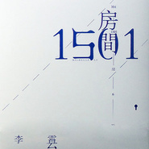

李霄云
============================

|  |  |
| :--: | :-- |
| [ 李霄云](https://i.xiami.com/lixiaoyun) | **播放数**: 23684668 **粉丝数**: 16561 **评论数**: 919 **地区**: China 中国大陆 **风格**: 华语唱作人 Chinese Singer-Songwriter  |

## 档案

音 
乐 
人

## 专辑

| 名称 | 语种 | 唱片公司 | 发行时间 | 专辑类别 | 专辑风格 |
| :--: | :-- | :-- | :-- | :-- | :-- |
| [ AM](./albums/2420392196.md) | 国语 | 独立发行 | 2020年03月06日 | EP, 单曲 | 国语流行 Mandarin Pop |
| [ 正常人](./albums/2100185876.md) | 国语 | 独立发行 | 2015年10月10日 | 录音室专辑 | 独立流行 Indie Pop, 华语唱作人 Chinese Singer-Songwriter |
| [ 恋爱世纪 舞台剧原声音乐](./albums/178788602.md) | 国语 | 通力唱片 | 2013年09月05日 | EP, 单曲 | 原声 Soundtrack, 国语流行 Mandarin Pop, 华语唱作人 Chinese Singer-Songwriter |
| [ 房间1501](./albums/550592.md) | 国语 | 天娱传媒 | 2012年10月22日 | EP, 单曲 | 国语流行 Mandarin Pop, 华语唱作人 Chinese Singer-Songwriter |
| [ 你看到的我是蓝色的](./albums/386018.md) | 国语 | 天娱传媒 | 2010年07月07日 | 录音室专辑 | 国语流行 Mandarin Pop, 华语唱作人 Chinese Singer-Songwriter |

## 评论

|  |  |  |  |
| :-- | :-- | :-- | :-- |
|  [虾米用户](https://emumo.xiami.com/u/379162683) 我想要记住你们，我想要你... 2021-01-27 19:55 赞(0) 踩(0) | 
˙Ⱉ˙ฅ
 |
|  [虾米用户](https://emumo.xiami.com/u/446573310) 我还没想好要写什么... 2021-01-08 22:56 赞(0) 踩(0) | 
想看你的演唱会
 |
|  [虾米用户](https://emumo.xiami.com/u/2796166) 最爱莫文蔚..... 2020-04-08 00:35 赞(1) 踩(0) | 
加油~~~~
 |
|  [虾米用户](https://emumo.xiami.com/u/16553053)   2020-02-08 08:22 赞(5) 踩(0) | 
论声音，李霄云比刘若英更温润，有底色，有一种绅士贵族的气质。记得沈凌形容过她的声音是蓝丝绒。我觉得如果形容为一种乐器，像钢琴，可以安静隐忍，也可以清丽明亮，但绝不锐利。听着有种安全感。
 |
|  [虾米用户](https://emumo.xiami.com/u/40380231) 一直都在流浪，不曾见过海... 2020-02-07 17:05 赞(1) 踩(0) | 
如果你也喜欢李霄云，那么我们可以成为好朋友。
 |
|  [虾米用户](https://emumo.xiami.com/u/434601887)  2019-12-24 18:18 赞(3) 踩(0) | 
为了听李霄云的歌曲。专门下的这个app
 |
|  [虾米用户](https://emumo.xiami.com/u/284037030)  2019-12-23 23:16 赞(0) 踩(0) | 
偶然听到你的歌，很棒。小姐姐加油，坚持
 |
|  [虾米用户](https://emumo.xiami.com/u/253119580) 我不是摩羯座 2019-07-29 14:26 赞(1) 踩(0) | 
想去看你的演唱会
 |
|  [虾米用户](https://emumo.xiami.com/u/335610135)   2019-06-22 14:22 赞(0) 踩(0) | 
喜欢你的音乐
 |
|  [虾米用户](https://emumo.xiami.com/u/242632036)   2019-06-01 13:12 赞(0) 踩(0) | 
没有版权只能来这了，好冷清
 |
|  [虾米用户](https://emumo.xiami.com/u/135379) 我还没想好要写什么... 2019-05-21 10:45 赞(0) 踩(0) | 
天呢好爱你
 |
|  [虾米用户](https://emumo.xiami.com/u/327726528)  2019-05-09 23:06 赞(2) 踩(0) | 
好帅一美人
 |
|  [虾米用户](https://emumo.xiami.com/u/423824751)  2019-05-06 13:52 赞(0) 踩(0) | 
我爱你
 |
|  [虾米用户](https://emumo.xiami.com/u/13462058) 对虾米失望了，全是翻唱，... 2019-04-29 12:15 赞(0) 踩(0) | 
声音是真的好听，陶醉
 |
|  [虾米用户](https://emumo.xiami.com/u/400622891)  2019-04-27 09:02 赞(2) 踩(0) | 
昨晚广州场种草啦！怎么可以又帅又可爱！
 |
|  [虾米用户](https://emumo.xiami.com/u/9902531) 浪漫指南 2019-04-26 23:44 赞(0) 踩(0) | 
霄云今晚现场太迷了 爱 ♡
 |
|  [虾米用户](https://emumo.xiami.com/u/135379) 我还没想好要写什么... 2019-04-24 10:16 赞(0) 踩(0) | 
快出新！！！
 |
|  [虾米用户](https://emumo.xiami.com/u/345527318)  2019-04-05 08:44 赞(0) 踩(0) | 
初心 
 |
|  [虾米用户](https://emumo.xiami.com/u/401170181)  2019-04-03 23:56 赞(1) 踩(0) | 
李霄云的名字拼音字母和我的名字一样诶LXY
 |
|  [虾米用户](https://emumo.xiami.com/u/35681166) 暂无签名~ 2019-03-16 12:03 赞(0) 踩(0) | 
生日快乐呀
 |
|  [虾米用户](https://emumo.xiami.com/u/112056934)  2019-03-16 10:16 赞(0) 踩(0) | 
生日快乐李师傅
 |
|  [虾米用户](https://emumo.xiami.com/u/118026018) secret 2019-03-16 10:02 赞(0) 踩(0) | 
想听你唱更多的歌
 |
|  [虾米用户](https://emumo.xiami.com/u/418424085)  2019-03-15 12:32 赞(0) 踩(0) | 
你那么好   
 |
|  [虾米用户](https://emumo.xiami.com/u/420886600)  2019-03-12 09:35 赞(1) 踩(0) | 
听着让人舒服的声音，像躺在☁️上一样
 |
|  [虾米用户](https://emumo.xiami.com/u/45077764) 单曲循环 2019-02-18 20:57 赞(0) 踩(0) | 
有氧的声音QvQ
 |
|  [虾米用户](https://emumo.xiami.com/u/376316638) 为你而来，独宠李霄云 2019-01-08 12:30 赞(1) 踩(0) | 
等歌ing，边等边抖腿<a href="http://emumo.xiami.com/u/57745260" target="_blank" rel="nofollow" name_card="57745260">@李霄云 </a>
 |
|  [虾米用户](https://emumo.xiami.com/u/99323790) 不想和虾米说再见 2019-01-06 22:01 赞(0) 踩(0) | 
这首歌是11年我同学给我听的，那时候因为一些事反目，可我早已放下成见，到现在也没你的联系方式，你现在过得好吗？
 |
|  [虾米用户](https://emumo.xiami.com/u/94377306)  2018-12-30 04:27 赞(2) 踩(0) | 
从声音到气质都感觉太舒服了
 |
|  [虾米用户](https://emumo.xiami.com/u/411417565) 我还没想好要写什么... 2018-12-29 11:10 赞(0) 踩(0) | 
来晚了 
 |
|  [虾米用户](https://emumo.xiami.com/u/286584406) 喜欢听好歌 2018-12-07 08:15 赞(0) 踩(0) | 
很喜欢你的这一首歌，希望你能做出跟这一样走心的音乐。  
 |
|  [虾米用户](https://emumo.xiami.com/u/348316890)  2018-11-25 20:46 赞(0) 踩(0) | 
今天是11.25李霄云还没发新歌
 |
|  [虾米用户](https://emumo.xiami.com/u/777675) 事物发生研究员 2018-11-21 16:30 赞(0) 踩(0) | 
来打卡
 |
|  [虾米用户](https://emumo.xiami.com/u/307011921)  2018-11-13 17:36 赞(0) 踩(0) | 

 |
|  [虾米用户](https://emumo.xiami.com/u/348316890)  2018-10-07 20:51 赞(4) 踩(0) | 
世园音乐节也太稳了吧！
 |
|  [虾米用户](https://emumo.xiami.com/u/18371733)   2018-10-03 10:45 赞(1) 踩(0) | 
希望你始终能做自己喜欢的音乐
 |
|  [虾米用户](https://emumo.xiami.com/u/376316638) 为你而来，独宠李霄云 2018-09-16 22:01 赞(0) 踩(0) | 
新专
 |
|  [虾米用户](https://emumo.xiami.com/u/376316638) 为你而来，独宠李霄云 2018-09-16 22:01 赞(1) 踩(0) | 
我是网易云职业驻扎者
 |
|  [虾米用户](https://emumo.xiami.com/u/376316638) 为你而来，独宠李霄云 2018-09-16 22:01 赞(0) 踩(0) | 
耶耶耶
 |
|  [虾米用户](https://emumo.xiami.com/u/376316638) 为你而来，独宠李霄云 2018-09-16 22:00 赞(1) 踩(0) | 
三年了
 |
|  [虾米用户](https://emumo.xiami.com/u/84702312) 一颗沉寂的星星 2018-09-12 23:24 赞(0) 踩(0) | 
好听的
 |
|  [虾米用户](https://emumo.xiami.com/u/72461374)  2018-09-09 23:21 赞(0) 踩(0) | 
线上的李霄云都搁哪玩的？&amp;hellip;  
 |
|  [虾米用户](https://emumo.xiami.com/u/11352687)   2018-09-07 11:29 赞(0) 踩(0) | 

 |
|  [虾米用户](https://emumo.xiami.com/u/348316890)  2018-08-31 21:55 赞(0) 踩(0) | 
期待
 |
|  [虾米用户](https://emumo.xiami.com/u/3176590) 我还没想好要写什么... 2018-08-10 19:57 赞(3) 踩(0) | 
现在的你看到的我是蓝色的，对，就是现在
 |
|  [虾米用户](https://emumo.xiami.com/u/8848306)  2018-07-19 10:58 赞(0) 踩(0) | 
期待新歌！期待新的故事，新的表达！
 |
|  [虾米用户](https://emumo.xiami.com/u/5849169)  2018-07-12 15:31 赞(0) 踩(0) | 
又一名雌雄傻傻分不清的歌手
 |
|  [虾米用户](https://emumo.xiami.com/u/251286319) 音乐总能带给我无限动力 2018-07-06 16:34 赞(4) 踩(0) | 
好听到哭，怎么可能只有这点粉丝
 |
|  [虾米用户](https://emumo.xiami.com/u/50720314)  2018-05-08 17:35 赞(0) 踩(0) | 
想你
 |
|  [虾米用户](https://emumo.xiami.com/u/287129892)  2018-05-07 19:19 赞(3) 踩(0) | 
南京林业大学今天爱上你的到来
 |
|  [虾米用户](https://emumo.xiami.com/u/335711904) 路过人间 2018-04-28 20:23 赞(0) 踩(0) | 
今天见到你了，你来到了浙科院！还带来了新歌！超好听的哦~
 |
|  [虾米用户](https://emumo.xiami.com/u/61268764)  2018-04-23 05:51 赞(1) 踩(0) | 
虾米终于可以听了
 |
|  [虾米用户](https://emumo.xiami.com/u/273457551) 以 退 為 進 化 2018-04-18 23:04 赞(0) 踩(0) | 
打卡纪念今天见到了霄云
 |
|  [虾米用户](https://emumo.xiami.com/u/70546434)  2018-04-18 21:18 赞(1) 踩(0) | 
好近！好近！流浪的吉普是蓝色的，今晚月夜也是蓝色的！
 |
|  [虾米用户](https://emumo.xiami.com/u/344672031)  2018-04-15 14:55 赞(0) 踩(0) | 
喜欢～
 |
|  [虾米用户](https://emumo.xiami.com/u/73507884) 做自己 2018-04-11 08:52 赞(2) 踩(0) | 
嗓子有点不同唱支歌就能糊口
 |
|  [虾米用户](https://emumo.xiami.com/u/27722402) 我还没想好要写什么... 2018-04-09 20:39 赞(1) 踩(0) | 
小时候向往一辆车，里面装着各种东西，开着它去旅行。今天我在草坪前看到了那样的一辆车，蓝色的
 |
|  [虾米用户](https://emumo.xiami.com/u/31472591)   2018-04-02 12:20 赞(0) 踩(0) | 
档案的介绍也太简洁明了了吧
 |
|  [虾米用户](https://emumo.xiami.com/u/355484849) 最可爱的美工圈cv圈伪音... 2018-03-27 21:04 赞(0) 踩(0) | 
声音听着很舒服，支持！
 |
|  [虾米用户](https://emumo.xiami.com/u/326541437)  2018-03-03 17:52 赞(0) 踩(0) | 
能不能什么时候再来一次西安，好后悔现在才发现你
 |
|  [虾米用户](https://emumo.xiami.com/u/326541437)  2018-03-03 17:52 赞(0) 踩(0) | 
支持你
 |
|  [虾米用户](https://emumo.xiami.com/u/348316890)  2018-02-23 15:13 赞(0) 踩(0) | 
waiting for you
 |
|  [虾米用户](https://emumo.xiami.com/u/47385472) 我还没想好要写什么... 2018-02-06 20:26 赞(1) 踩(0) | 
终于又能听你的歌了！
 |
|  [虾米用户](https://emumo.xiami.com/u/9546547) 暂无签名~ 2018-01-27 02:07 赞(0) 踩(0) | 
鹿晗吗？
 |
|  [虾米用户](https://emumo.xiami.com/u/44550418) . 2018-01-20 03:16 赞(0) 踩(0) | 
期待18年的演出和您的新作品。
 |
|  [虾米用户](https://emumo.xiami.com/u/23635743) 酸 2018-01-06 17:39 赞(0) 踩(0) | 
居然来西安了？而我居然不知道？！
 |
|  [虾米用户](https://emumo.xiami.com/u/285713741)  2017-12-31 13:25 赞(0) 踩(0) | 
喜欢你 加油＾０＾~
 |
|  [虾米用户](https://emumo.xiami.com/u/58494186) 别小看我 我可是领袖 兜... 2017-11-17 00:32 赞(0) 踩(0) | 
我很喜欢很喜欢听你唱乞丐
 |
|  [虾米用户](https://emumo.xiami.com/u/135379) 我还没想好要写什么... 2017-11-04 11:28 赞(0) 踩(0) | 
还想听你的歌！！
 |
|  [虾米用户](https://emumo.xiami.com/u/57826804) 正常人 2017-10-30 09:56 赞(1) 踩(0) | 
人家括号里都是英文名 我毛怎么是拼音首字母 
 |
|  [虾米用户](https://emumo.xiami.com/u/57826804) 正常人 2017-10-30 09:56 赞(0) 踩(0) | 
人家括号里都是英文名 我毛怎么是拼音首字母 
 |
|  [虾米用户](https://emumo.xiami.com/u/1642903) 看心情听音乐~ 2017-10-28 00:36 赞(0) 踩(0) | 
宣传片下载地址 21.36 MB<a href="http://www.vdisk.cn/down/index/6345486A4858" target="_blank" rel="nofollow noreferrer noopener">http://www.vdisk.cn/down/index/6345486A4858</a>首唱会视频rayfile飞速网 3.7 GB<a href="http://www.rayfile.com/zh-cn/files/20dd4830-20d2-11e0-8864-0015c55db73d/" target="_blank" rel="nofollow noreferrer noopener">http://www.rayfile.com/zh-cn/files/20dd4830-20d2-11e0-8864-0015c55db73d/</a>首唱会字幕 49.11 KB<a href="http://www.vdisk.cn/down/index/6173907A2298" target="_blank" rel="nofollow noreferrer noopener">http://www.vdisk.cn/down/index/6173907A2298</a>所有资源来自李霄云吧影音组，欢迎各位到李霄云百度贴吧欣赏更多高清影音~~
 |
|  [虾米用户](https://emumo.xiami.com/u/36424522) 活在当下 2017-10-28 00:21 赞(0) 踩(0) | 
早就没有五年前的发疯一样的喜欢 喜欢了别人去看别人 手机里都已经没有你的歌 要知道五年前是连你上节目哼的调调都会存下来 今天又再推荐歌单里看到你 感觉像回到以前:)
 |
|  [虾米用户](https://emumo.xiami.com/u/3095447) 分享我的音乐世界 2017-10-27 23:57 赞(3) 踩(0) | 
喜欢霄云的大气沉稳，总给人很温暖的感觉，霄云是个好女孩。只是觉得在国内作为选秀明星要真正大有作为很难，尤其在天娱这种烂公司下。霄云选歌还有写歌其实真的还要再有新的突破，千万别随大流啊
 |
|  [虾米用户](https://emumo.xiami.com/u/48401880)  2017-10-27 23:33 赞(4) 踩(0) | 
我想说，六年，李霄云曾经在我的生活里淡过，想放弃过，心里偷偷骂过。唯独就是没有真正放弃过。她的音乐，真诚，才华，她的一切都是我无法割舍，也再难以接受别人的理由。这张唱片我看到的不止是独立音乐人，更是艺术家。＃李霄云＃
 |
|  [虾米用户](https://emumo.xiami.com/u/57817836) Miss Funny 2017-10-21 16:24 赞(0) 踩(0) | 
想你了
 |
|  [虾米用户](https://emumo.xiami.com/u/3358490) 我只关注和我共同爱好超3... 2017-10-06 23:03 赞(0) 踩(0) | 
什么时候出新专辑
 |
|  [虾米用户](https://emumo.xiami.com/u/665922)   2017-10-06 00:54 赞(2) 踩(0) | 
期待新碟！
 |
|  [虾米用户](https://emumo.xiami.com/u/44550418) . 2017-09-22 01:31 赞(0) 踩(0) | 
 
 |
|  [虾米用户](https://emumo.xiami.com/u/138974) 活着？ 2017-09-07 04:34 赞(0) 踩(0) | 
人都indie没了&amp;hellip;&amp;hellip;
 |
|  [虾米用户](https://emumo.xiami.com/u/16414437)  2017-08-02 17:32 赞(0) 踩(0) | 
云团
 |
|  [虾米用户](https://emumo.xiami.com/u/313311574)  2017-07-23 12:37 赞(0) 踩(0) | 
封面帅气 
 |
|  [虾米用户](https://emumo.xiami.com/u/36165303) 喜欢李沧东的薄荷糖 也喜... 2017-07-15 15:03 赞(1) 踩(0) | 
风里雨里 我们等你!
 |
|  [虾米用户](https://emumo.xiami.com/u/73638642) 再见了各位 我永远爱虾米... 2017-05-29 23:16 赞(0) 踩(0) | 
等着你呢 
 |
|  [虾米用户](https://emumo.xiami.com/u/4334438) 贫穷而倔强 2017-05-17 08:31 赞(2) 踩(0) | 
3.0要来了吗？
 |
|  [虾米用户](https://emumo.xiami.com/u/57817836) Miss Funny 2017-05-07 12:44 赞(0) 踩(0) | 

 |
|  [虾米用户](https://emumo.xiami.com/u/58733996)  2017-04-19 19:52 赞(0) 踩(0) | 
李霄云加油，看好你。
 |
|  [虾米用户](https://emumo.xiami.com/u/1559338) What? 2017-04-14 10:59 赞(0) 踩(0) | 
头像好看！！！！所以是哪位小天使放的~~
 |
|  [虾米用户](https://emumo.xiami.com/u/36165303) 喜欢李沧东的薄荷糖 也喜... 2017-03-15 23:10 赞(0) 踩(0) | 
五十分钟后生日快乐
 |
|  [虾米用户](https://emumo.xiami.com/u/43189733) 什么都不说，听歌儿吧！ 2016-12-06 00:30 赞(0) 踩(0) | 
加油↖(^ω^)↗
 |
|  [虾米用户](https://emumo.xiami.com/u/55986048)  2016-12-02 20:36 赞(0) 踩(0) | 
  
 |
|  [虾米用户](https://emumo.xiami.com/u/45298985) Wechat:dqx19... 2016-12-01 00:16 赞(0) 踩(0) | 
+
 |
|  [虾米用户](https://emumo.xiami.com/u/47377673) 世界不是黑白的，而是灰色... 2016-11-20 13:32 赞(0) 踩(0) | 
不能更喜欢你
 |
|  [虾米用户](https://emumo.xiami.com/u/247033041)  2016-11-18 08:29 赞(1) 踩(0) | 
来支持一把霄云的原创音乐 
 |
|  [虾米用户](https://emumo.xiami.com/u/57789170) 【李霄云】 2016-10-26 14:40 赞(0) 踩(0) | 
真好听
 |
|  [虾米用户](https://emumo.xiami.com/u/13960860)  2016-10-20 18:17 赞(0) 踩(0) | 
霄云 加油~
 |
|  [虾米用户](https://emumo.xiami.com/u/38923344) 这家伙是你爸爸什么也没留... 2016-10-14 08:55 赞(0) 踩(0) | 
一直以为她说男的
 |
|  [虾米用户](https://emumo.xiami.com/u/121161800)   2016-09-20 15:27 赞(0) 踩(0) | 
☁️
 |
|  [虾米用户](https://emumo.xiami.com/u/37706842)   2016-09-11 21:44 赞(0) 踩(0) | 
封面图好想要
 |
|  [虾米用户](https://emumo.xiami.com/u/55045601)   2016-09-04 23:31 赞(0) 踩(0) | 
喜欢你
 |
|  [虾米用户](https://emumo.xiami.com/u/186826388)   2016-09-03 11:58 赞(0) 踩(0) | 
封面图都是谁贴的 
 |
|  [虾米用户](https://emumo.xiami.com/u/206462581) 成千上万个路口，总有一个... 2016-08-14 21:40 赞(0) 踩(0) | 
好爱好爱她用她舒服的声音唱的所有歌 
 |
|  [虾米用户](https://emumo.xiami.com/u/186826388)   2016-08-14 19:35 赞(0) 踩(0) | 
又来了。
 |
|  [虾米用户](https://emumo.xiami.com/u/57817836) Miss Funny 2016-07-22 22:58 赞(0) 踩(0) | 
打卡
 |
|  [虾米用户](https://emumo.xiami.com/u/73568036)  2016-07-02 15:50 赞(0) 踩(0) | 
喜欢李霄云的声音！
 |
|  [虾米用户](https://emumo.xiami.com/u/16954878)  2016-06-22 11:36 赞(1) 踩(0) | 
突然觉得跟窦靖童有点像 两人合作看看呗 嘿嘿
 |
|  [虾米用户](https://emumo.xiami.com/u/8320385) 我还没想好要写什么... 2016-06-20 23:34 赞(0) 踩(0) | 
为什么我几天没来就→_→
 |
|  [虾米用户](https://emumo.xiami.com/u/190963244)  2016-06-17 16:52 赞(0) 踩(0) | 
喜欢
 |
|  [虾米用户](https://emumo.xiami.com/u/10933495) 慢悠悠的过生活 2016-06-15 05:15 赞(0) 踩(0) | 
你看到的我是蓝色的
 |
|  [虾米用户](https://emumo.xiami.com/u/186826388)   2016-06-10 10:32 赞(0) 踩(0) | 
听你的歌就会很开心。
 |
|  [虾米用户](https://emumo.xiami.com/u/171662554)  2016-06-01 22:55 赞(0) 踩(0) | 
人生最高兴的事情前五吧，就是去听你的演唱会～
 |
|  [虾米用户](https://emumo.xiami.com/u/57817836) Miss Funny 2016-05-25 22:42 赞(0) 踩(0) | 
  
 |
|  [虾米用户](https://emumo.xiami.com/u/8807103) 无耻 2016-05-25 15:17 赞(2) 踩(0) | 
已弯
 |
|  [虾米用户](https://emumo.xiami.com/u/8807103) 无耻 2016-05-25 15:16 赞(0) 踩(0) | 
......
 |
|  [虾米用户](https://emumo.xiami.com/u/171662554)  2016-05-17 02:21 赞(0) 踩(0) | 

 |
|  [虾米用户](https://emumo.xiami.com/u/35167460) La vie elle ... 2016-05-15 18:44 赞(0) 踩(0) | 
你超棒
 |
|  [虾米用户](https://emumo.xiami.com/u/73108406) 我的人生没有悲剧 2016-05-14 13:46 赞(0) 踩(0) | 
求封面！
 |
|  [虾米用户](https://emumo.xiami.com/u/73638642) 再见了各位 我永远爱虾米... 2016-05-14 11:02 赞(0) 踩(0) | 

 |
|  [虾米用户](https://emumo.xiami.com/u/102935494)   2016-05-12 21:17 赞(0) 踩(0) | 
我要封面啊啊啊啊啊
 |
|  [虾米用户](https://emumo.xiami.com/u/49497871) 风浪有多大，我就有多坚强 2016-05-10 00:37 赞(0) 踩(0) | 
 喜欢喜欢，听多少次都还是一样的喜欢
 |
|  [虾米用户](https://emumo.xiami.com/u/97747450) 我还没想好要写什么... 2016-05-09 17:40 赞(0) 踩(0) | 
570
 |
|  [虾米用户](https://emumo.xiami.com/u/84308742)  2016-05-06 02:15 赞(0) 踩(0) | 
一开始听到你的声音，后来喜欢听你唱歌，再后来发现在列表找不到你会慌 
 |
|  [虾米用户](https://emumo.xiami.com/u/36341401)   2016-05-03 15:08 赞(2) 踩(0) | 
我要弯了
 |
|  [虾米用户](https://emumo.xiami.com/u/120559834)   2016-04-24 23:29 赞(0) 踩(0) | 
今天看了你！更喜欢你了！
 |
|  [虾米用户](https://emumo.xiami.com/u/4334438) 贫穷而倔强 2016-04-15 20:09 赞(0) 踩(0) | 
今天下午李霄云来了我们学校 
 |
|  [虾米用户](https://emumo.xiami.com/u/31855757) 貌似斯文，其实败类 2016-04-08 20:36 赞(1) 踩(0) | 
回忆中的蓝天 蔚蓝却略带感伤
 |
|  [虾米用户](https://emumo.xiami.com/u/47720054) my days 2016-04-08 20:26 赞(2) 踩(0) | 
她的声音真的太好听了 没法不喜欢
 |
|  [虾米用户](https://emumo.xiami.com/u/2673316)  2016-04-08 01:30 赞(2) 踩(0) | 
习惯谱曲我打82分，剩下的分数以666的形式发给你
 |
|  [虾米用户](https://emumo.xiami.com/u/58578394)   2016-04-07 09:16 赞(0) 踩(0) | 
     
 |
|  [虾米用户](https://emumo.xiami.com/u/43978083) 我还没想好要写什么... 2016-03-27 22:29 赞(0) 踩(0) | 
认真的听歌，蓝色。
 |
|  [虾米用户](https://emumo.xiami.com/u/57817836) Miss Funny 2016-03-26 22:02 赞(1) 踩(0) | 
❤️
 |
|  [虾米用户](https://emumo.xiami.com/u/57817836) Miss Funny 2016-03-26 22:02 赞(1) 踩(0) | 

 |
|  [虾米用户](https://emumo.xiami.com/u/16096828) 甜梦给晚风。 2016-03-25 00:25 赞(1) 踩(0) | 
是我的泪 成全你的自由
 |
|  [虾米用户](https://emumo.xiami.com/u/454506) 我还没想好要写什么... 2016-03-21 02:36 赞(1) 踩(0) | 
好帥喔♡
 |
|  [虾米用户](https://emumo.xiami.com/u/2483503) 我还没想好要写什么... 2016-03-16 19:24 赞(2) 踩(0) | 
为毛我记得是李云宵，- -  听好久了 今天一看才知道我记错了
 |
|  [虾米用户](https://emumo.xiami.com/u/37901418) KEEP IT REAL 2016-03-15 12:09 赞(0) 踩(0) | 

 |
|  [虾米用户](https://emumo.xiami.com/u/37799285)  2016-03-15 09:17 赞(1) 踩(0) | 
你是蓝色的
 |
|  [虾米用户](https://emumo.xiami.com/u/83386600) ╮(•́ω•̀)╭  2016-02-26 22:29 赞(16) 踩(0) | 
还好那一年我看选秀节目，正好看到你，从此视线再没离开
 |
|  [虾米用户](https://emumo.xiami.com/u/6250774) 我爱虾米！！！ 2016-02-26 16:34 赞(1) 踩(0) | 
：）好调皮啊
 |
|  [虾米用户](https://emumo.xiami.com/u/10463080)   2016-02-20 19:18 赞(13) 踩(0) | 
世界青年说被圈粉
 |
|  [虾米用户](https://emumo.xiami.com/u/7729643) shooooooout！ 2016-02-20 02:54 赞(4) 踩(0) | 
这个人！怎么！这么有趣！！！
 |
|  [虾米用户](https://emumo.xiami.com/u/57817836) Miss Funny 2016-02-14 22:34 赞(0) 踩(0) | 
快乐
 |
|  [虾米用户](https://emumo.xiami.com/u/4890258) 和风一样，你离开不声不响 2016-02-12 23:01 赞(0) 踩(0) | 
= =
 |
|  [虾米用户](https://emumo.xiami.com/u/57817836) Miss Funny 2016-02-11 17:23 赞(0) 踩(0) | 
好久不见
 |
|  [虾米用户](https://emumo.xiami.com/u/103623512) 深渊 2016-02-05 19:42 赞(1) 踩(0) | 
加油
 |
|  [虾米用户](https://emumo.xiami.com/u/102835848)  2016-01-30 15:47 赞(0) 踩(0) | 

 |
|  [虾米用户](https://emumo.xiami.com/u/39999575)  2016-01-28 18:35 赞(1) 踩(0) | 
请用好耳机
 |
|  [虾米用户](https://emumo.xiami.com/u/72936498) 梦想那么大，不努力怎么行... 2016-01-25 23:53 赞(0) 踩(0) | 
喜欢
 |
|  [虾米用户](https://emumo.xiami.com/u/14324892) 擦身而过皆不相知 2016-01-24 22:25 赞(0) 踩(0) | 
我可以嫁给你吗？：）
 |
|  [虾米用户](https://emumo.xiami.com/u/14324892) 擦身而过皆不相知 2016-01-24 22:24 赞(0) 踩(0) | 
喜欢你：）
 |
|  [虾米用户](https://emumo.xiami.com/u/2724806) 拥抱你 2016-01-24 01:56 赞(0) 踩(0) | 
喜欢
 |
|  [虾米用户](https://emumo.xiami.com/u/2724806) 拥抱你 2016-01-24 01:56 赞(0) 踩(0) | 
  
 |
|  [虾米用户](https://emumo.xiami.com/u/87079582) 喵呜～(*'▽'*)♪ 2016-01-21 11:40 赞(0) 踩(0) | 
评论还撕逼 
 |
|  [虾米用户](https://emumo.xiami.com/u/14265718) wx:osakarock... 2016-01-06 12:52 赞(0) 踩(0) | 
又帅又美哈哈哈 
 |
|  [虾米用户](https://emumo.xiami.com/u/3496847) 夢醒了，所以心碎了。 2016-01-03 21:04 赞(1) 踩(0) | 
侧面怎么那么王菲即视感0.0
 |
|  [虾米用户](https://emumo.xiami.com/u/787287) 生而为人 2016-01-02 22:00 赞(0) 踩(0) | 
艾玛我对不起你！听蓝色我看专辑以为你是个男的/(ㄒoㄒ)/~~
 |
|  [虾米用户](https://emumo.xiami.com/u/71600918) 人 2015-12-24 01:37 赞(1) 踩(0) | 
好听
 |
|  [虾米用户](https://emumo.xiami.com/u/29993622)   2015-12-15 01:19 赞(0) 踩(0) | 
喜欢
 |
|  [虾米用户](https://emumo.xiami.com/u/3495857) 我只是想来听听歌…… 2015-12-11 18:36 赞(0) 踩(0) | 
一直很喜欢~
 |
|  [虾米用户](https://emumo.xiami.com/u/8833102) 伟❤️375882267 2015-12-10 06:58 赞(0) 踩(0) | 
；2015.12.10
 |
|  [虾米用户](https://emumo.xiami.com/u/39635055) 下一秒会发生什么 2015-11-11 23:46 赞(0) 踩(0) | 
配乐太燥了
 |
|  [虾米用户](https://emumo.xiami.com/u/80560398)  2015-11-06 14:31 赞(0) 踩(0) | 
棒！棒！棒！
 |
|  [虾米用户](https://emumo.xiami.com/u/58733996)  2015-11-06 06:40 赞(3) 踩(0) | 
李霄云的声线，真的很喜欢，新专辑很洗脑，但是，我还是期待她唱更多的情歌，因为这么好的嗓子，天生就是情歌者，新专辑《口斤》太感动，太动人，加油，相信你。
 |
|  [虾米用户](https://emumo.xiami.com/u/57891998) 被好音乐包裹着就很幸福 2015-10-26 00:23 赞(3) 踩(0) | 
只有李霄云的音乐我才会无条件的支持！因为一开始就在！因为知道你纯粹的坚持！因为佩服你的勇气！因为你是让我开始写歌的正常人！     
 |
|  [虾米用户](https://emumo.xiami.com/u/75476318)  2015-10-25 18:10 赞(2) 踩(0) | 
喜欢超喜欢这种调调、文艺范、歌词很有深意赞一千个！喜欢逻伯特和乞丐、好玩先生也不错！   
 |
|  [虾米用户](https://emumo.xiami.com/u/49793333) 默默听歌 2015-10-20 21:09 赞(1) 踩(0) | 
歌词还是缺乏深度，有点浮夸
 |
| ⇒ |  [虾米用户](https://emumo.xiami.com/u/13659836) sometime 2015-10-31 11:14 赞(0) 踩(0) | 
是，曲很好，词欠佳。中文很复杂，初中去了澳洲果然还是很大影响了作词。希望她能找到一个人能好好写词又能表达出她想表达的意思
 |
|  [虾米用户](https://emumo.xiami.com/u/36672227)  2015-10-18 19:13 赞(2) 踩(0) | 
喜欢。转型后的音乐更适合你。做自己！加油哦！
 |
|  [虾米用户](https://emumo.xiami.com/u/7235462)  2015-10-16 19:42 赞(1) 踩(0) | 
你看到兰州的天空也是蓝色的
 |
|  [虾米用户](https://emumo.xiami.com/u/54288720)  2015-10-15 22:55 赞(4) 踩(0) | 
声音更有味道了，实力创作型的唱将,值得大家拥有。
 |
|  [虾米用户](https://emumo.xiami.com/u/36165303) 喜欢李沧东的薄荷糖 也喜... 2015-10-14 23:38 赞(0) 踩(0) | 
下面撕逼的某喷大家自动忽略吧 什么样的人讲什么样的话 不要和他计较 我只觉得他很可怜。 
 |
|  [虾米用户](https://emumo.xiami.com/u/5786191) 蛋黄顶在头上~ 2015-10-14 23:30 赞(0) 踩(0) | 
好，走独立走对了~          发现歌手介绍变得异常的diao~
 |
|  [虾米用户](https://emumo.xiami.com/u/941494) 寒犹近北 2015-10-14 19:15 赞(1) 踩(0) | 
连两万首都没听到的还是别说别人媚俗了吧，明明是自己眼界窄
 |
|  [虾米用户](https://emumo.xiami.com/u/57962894) 大大大大云团一枚 喜欢海... 2015-10-13 16:34 赞(0) 踩(0) | 
  我支持你一辈子
 |
|  [虾米用户](https://emumo.xiami.com/u/50225088) 当世界只剩白与蓝的交汇，... 2015-10-13 16:25 赞(1) 踩(0) | 
治愈系的嗓音，风格大变依旧好听！！
 |
|  [虾米用户](https://emumo.xiami.com/u/69985980) 听说虾米要关停了，好难过... 2015-10-13 03:16 赞(0) 踩(0) | 
过来看亲了呢，记得回访互粉了呢，一定要来看我哦，要不然人家会哭死的呢
 |
|  [虾米用户](https://emumo.xiami.com/u/69985980) 听说虾米要关停了，好难过... 2015-10-13 03:16 赞(0) 踩(0) | 
过来看亲了呢，记得回访互粉了呢，一定要来看我哦，要不然人家会哭死的呢
 |
|  [虾米用户](https://emumo.xiami.com/u/7978992) 天空已蔚蓝 我会抬头看 2015-10-13 01:27 赞(1) 踩(0) | 
噗 评论这么多 搞了半天是撕逼
 |
|  [虾米用户](https://emumo.xiami.com/u/50756587) 。 2015-10-12 20:21 赞(0) 踩(0) | 
新专辑每天听几次才能睡着❤
 |
|  [虾米用户](https://emumo.xiami.com/u/69985980) 听说虾米要关停了，好难过... 2015-10-12 04:10 赞(0) 踩(0) | 
过来看亲呢，记得回访互粉呢
 |
|  [虾米用户](https://emumo.xiami.com/u/11217410)  2015-10-11 16:06 赞(0) 踩(0) | 
太魔性了
 |
|  [虾米用户](https://emumo.xiami.com/u/18240383) 我还没想好要写什么... 2015-10-11 10:45 赞(1) 踩(0) | 
评论还撕逼 笑死
 |
|  [虾米用户](https://emumo.xiami.com/u/201495)  2015-10-11 03:38 赞(0) 踩(0) | 
风格其实算是比较窄众的。
 |
|  [虾米用户](https://emumo.xiami.com/u/37377959) 来自2011 2015-10-11 03:04 赞(0) 踩(0) | 
某个角度感觉长得像王菲
 |
|  [虾米用户](https://emumo.xiami.com/u/73066736)  2015-10-11 02:25 赞(1) 踩(0) | 
大晚上的又来听一遍
 |
|  [虾米用户](https://emumo.xiami.com/u/45171523) Sina：Cz-1999 2015-10-11 02:23 赞(1) 踩(0) | 
想嫁给你 
 |
|  [虾米用户](https://emumo.xiami.com/u/16045115) 不想说再见，虾米！ 2015-10-10 22:35 赞(0) 踩(0) | 

 |
|  [虾米用户](https://emumo.xiami.com/u/37160517) 我不是女神啦 2015-10-10 21:11 赞(1) 踩(0) | 
她新拍的写真好像王菲
 |
|  [虾米用户](https://emumo.xiami.com/u/57393972)  2015-10-10 20:47 赞(0) 踩(0) | 
封面帅 
 |
|  [虾米用户](https://emumo.xiami.com/u/73011782)  2015-10-10 19:43 赞(0) 踩(0) | 
爱霄云，，不解释
 |
|  [虾米用户](https://emumo.xiami.com/u/73011782)  2015-10-10 19:42 赞(1) 踩(0) | 
爱霄云，不解释
 |
|  [虾米用户](https://emumo.xiami.com/u/449354) 我还没想好要写什么... 2015-10-10 19:16 赞(0) 踩(0) | 
内容已删除
 |
| ⇒ |  [虾米用户](https://emumo.xiami.com/u/449354) 我还没想好要写什么... 2015-10-10 22:26 赞(0) 踩(0) | 
<q><b>ElsaLL说：</b></q>
 |
| ⇒ |  [虾米用户](https://emumo.xiami.com/u/449354) 我还没想好要写什么... 2015-10-10 22:30 赞(0) 踩(0) | 
<q><b>ElsaLL说：</b></q>
 |
| ⇒ |  [虾米用户](https://emumo.xiami.com/u/21300006)  2015-10-10 22:32 赞(0) 踩(0) | 
<q><b>我家狗叫雷克斯，黑色的说：</b></q>
 |
| ⇒ |  [虾米用户](https://emumo.xiami.com/u/21300006)  2015-10-10 22:45 赞(0) 踩(0) | 
<q><b>说：</b></q>
 |
| ⇒ |  [虾米用户](https://emumo.xiami.com/u/21300006)  2015-10-10 22:53 赞(0) 踩(0) | 
<q><b>说：</b></q>
 |
| ⇒ |  [虾米用户](https://emumo.xiami.com/u/21300006)  2015-10-10 22:58 赞(0) 踩(0) | 
<q><b>说：</b></q>
 |
| ⇒ |  [虾米用户](https://emumo.xiami.com/u/31942740)  2015-10-11 00:00 赞(0) 踩(0) | 
<q><b>ElsaLL说：</b></q>
 |
| ⇒ |  [虾米用户](https://emumo.xiami.com/u/37057114)   2015-12-31 10:52 赞(0) 踩(0) | 
<q><b>说：</b></q>
 |
| ⇒ |  [虾米用户](https://emumo.xiami.com/u/449354) 我还没想好要写什么... 2015-12-31 10:57 赞(0) 踩(0) | 
<q><b>义西巴桑说：</b></q>
 |
| ⇒ |  [虾米用户](https://emumo.xiami.com/u/21300006)  2017-10-27 23:33 赞(0) 踩(0) | 
上这来把祖宗辈的人都丢完了，还以为自己很叼。。呵呵，孩子你歇歇吧
 |
| ⇒ |  [虾米用户](https://emumo.xiami.com/u/21300006)  2017-10-27 23:33 赞(0) 踩(0) | 
<q><b>说：</b></q>
 |
|  [虾米用户](https://emumo.xiami.com/u/24220537)  2015-10-10 13:29 赞(0) 踩(0) | 
她就是一个喜欢音乐的正常人，每个人欣赏的品位都不一样，喜欢就喜欢，不喜欢也没必要喷，给别人多点的支持不要太多的抱怨
 |
|  [虾米用户](https://emumo.xiami.com/u/37950358) 抗忙~北鼻！！巴扎黑~~ 2015-10-10 12:43 赞(4) 踩(0) | 
没有了卷发的李霄云帅了老娘一脸血。前两天和女朋友聊天，她说李霄云特洋气，比当时那一堆快女都洋气，我说，嗯，是洋气，那头奶奶卷毁了她。女票认同，就是啊，说不定就是因为卷发所以销声匿迹了。呐， 结果人家带着性感的重低音理着顺贴的短发回来了。
 |
| ⇒ |  [虾米用户](https://emumo.xiami.com/u/40256175) 她。 2015-10-13 15:02 赞(0) 踩(0) | 
嗨 萌萌你们两口子好~ 又见面了~
 |
| ⇒ |  [虾米用户](https://emumo.xiami.com/u/37950358) 抗忙~北鼻！！巴扎黑~~ 2015-10-14 00:24 赞(0) 踩(0) | 
<q><b>未育少女说：</b></q>
 |
|  [虾米用户](https://emumo.xiami.com/u/72926954)   2015-10-10 12:14 赞(2) 踩(0) | 
声线是多少人梦寐以求的，保护好嗓子，照顾身体，爱你。
 |
|  [虾米用户](https://emumo.xiami.com/u/72926954)   2015-10-10 12:13 赞(3) 踩(0) | 
声音不错，制作不错，形象还是一如既往的蓝。
 |
|  [虾米用户](https://emumo.xiami.com/u/42846858) Virago 2015-10-10 11:45 赞(3) 踩(0) | 
几年不注意，气质越来越好，眼神一直很特别
 |
|  [虾米用户](https://emumo.xiami.com/u/135379) 我还没想好要写什么... 2015-10-10 11:16 赞(0) 踩(0) | 
新的摄影和包装团队很强大！
 |
|  [虾米用户](https://emumo.xiami.com/u/58465032)  2015-10-10 10:17 赞(1) 踩(0) | 

 |
|  [虾米用户](https://emumo.xiami.com/u/58588902) 活在當下，感恩  2015-10-10 10:08 赞(0) 踩(0) | 
宝宝， 
 |
|  [虾米用户](https://emumo.xiami.com/u/3562785)  2015-10-10 09:51 赞(0) 踩(0) | 
<a href="http://www.xiami.com/mv/K6YYwa?from=Android_share_weibo" target="_blank" rel="nofollow noreferrer noopener">http://www.xiami.com/mv/K6YYwa?from=Android_share_weibo</a>   你不知道的李霄云
 |
|  [虾米用户](https://emumo.xiami.com/u/49557158)  2015-10-09 03:28 赞(4) 踩(0) | 
和天娱解约成为独立音乐人…
 |
|  [虾米用户](https://emumo.xiami.com/u/49557158)  2015-10-09 03:26 赞(1) 踩(0) | 
李霄云是正常人
 |
|  [虾米用户](https://emumo.xiami.com/u/16616864)   2015-10-05 20:19 赞(1) 踩(0) | 
档案:正常人
 |
|  [虾米用户](https://emumo.xiami.com/u/34357899) 我不觉得自己很屌啊你也别... 2015-10-05 17:45 赞(0) 踩(0) | 
李霄云是T吗？
 |
|  [虾米用户](https://emumo.xiami.com/u/49557158)  2015-10-04 14:53 赞(0) 踩(0) | 
有态度有想法…
 |
|  [虾米用户](https://emumo.xiami.com/u/48090365) 救世主的死亡，即为天启！ 2015-10-02 22:26 赞(0) 踩(0) | 
真是、认不出来了
 |
|  [虾米用户](https://emumo.xiami.com/u/53015733) 我最帅 2015-10-02 15:19 赞(0) 踩(0) | 
我醉了这介绍
 |
|  [虾米用户](https://emumo.xiami.com/u/52792175) 不念过往，不寄未来，只愿... 2015-10-01 22:29 赞(0) 踩(0) | 
喜欢
 |
|  [虾米用户](https://emumo.xiami.com/u/34799914) 我还没想好要写什么... 2015-09-30 23:02 赞(1) 踩(0) | 
感觉李霄云比谭维维好，也是唯一欣赏的快女
 |
|  [虾米用户](https://emumo.xiami.com/u/3562785)  2015-09-30 15:15 赞(0) 踩(0) | 
<a href="http://www.musikid.com/project/1503" target="_blank" rel="nofollow noreferrer noopener">http://www.musikid.com/project/1503</a> 李霄云独立制作的新专辑以众筹形式发行，2015年10月10日结束，你买到的每一张都是限量版，打广告啦^^
 |
|  [虾米用户](https://emumo.xiami.com/u/11983940)  2015-09-29 09:24 赞(0) 踩(0) | 
喜欢不需要理由
 |
|  [虾米用户](https://emumo.xiami.com/u/32297083) 一个独立品味的音乐爱好者... 2015-09-28 07:20 赞(1) 踩(0) | 
应该是脱离该死的垃圾天娱了吧
 |
|  [虾米用户](https://emumo.xiami.com/u/7916875) (￣Д￣)ﾉ 2015-09-27 08:47 赞(0) 踩(0) | 
挺喜欢她
 |
|  [虾米用户](https://emumo.xiami.com/u/7514063) 我还没想好要写什么... 2015-09-27 00:48 赞(0) 踩(0) | 
好听
 |
|  [虾米用户](https://emumo.xiami.com/u/47677603) "You complet... 2015-09-26 18:42 赞(1) 踩(0) | 
记得09在选秀节目上看到的 当时觉得声音真好听 真没想到 六年后的今天听到已经变化这么大了 有自己的独立风格 支持！
 |
|  [虾米用户](https://emumo.xiami.com/u/10039451) 暂无签名~ 2015-09-26 00:21 赞(0) 踩(0) | 
真不错。。以前很少关注她，喜欢这么有个性的菇凉~
 |
|  [虾米用户](https://emumo.xiami.com/u/46287668)  2015-09-25 23:00 赞(0) 踩(0) | 
挺好听的呢，继续加油唱自己
 |
|  [虾米用户](https://emumo.xiami.com/u/49557158)  2015-09-25 22:32 赞(0) 踩(0) | 
媚俗这个词用她身上是最为不合适的，一直简简单单的姑娘，如果不了解就去否定一个人和她的音乐，那是极端偏执而已…
 |
|  [虾米用户](https://emumo.xiami.com/u/33508695)  2015-09-25 16:53 赞(2) 踩(0) | 
谢谢所有喜欢霄云和喜欢霄云音乐的每一位朋友，正是你们的喜欢她才能走好每一步，走好未来的每一步。谢谢！ 
 |
|  [虾米用户](https://emumo.xiami.com/u/33508695)  2015-09-25 16:51 赞(28) 踩(0) | 
的确是实验之名，的确是另类外衣，求解释内心如何媚俗？先不说封面，毕竟封面不是这个潜心搞音乐的设计的。直说内容，人家从小热爱音乐，但也从没正统学过，全靠自学成才，做音乐这么多年，听过的唱过的写过的远比没事在这瞎BB的人强太多，说实话，不用脑子说话不找事实乱喷的人根本不配黑她，在给自己讲笑话吗？再说回来。已经上线的三首单曲就算不好听不合你的心意，它也是人家没日没夜捣鼓出来的，录歌录到吐的执着和热爱凭什么让你在这里血口喷人。我们说实在的，喜欢她的确是喜欢到脑残，可是是非非还是懂的，不至于在这里连基本的侮辱都不懂得回击，因为她的音乐最起码还得到尊重，而不是被渣滓践踏。
 |
|  [虾米用户](https://emumo.xiami.com/u/3562785)  2015-09-25 10:22 赞(0) 踩(0) | 
李霄云的新创作是大胆的，但要说《习惯》《沉淀》《我为谁而来》《可能》…其实人也会，这一门心思扎音乐圈里的不多了，多点包容，米歇尔李继续加油！
 |
|  [虾米用户](https://emumo.xiami.com/u/3562785)  2015-09-25 10:18 赞(2) 踩(0) | 
有部电影是讲二战时，一对老夫妻的三个孩子都被送上了战场，片中人物谋划一定要救回来一个，李霄云的创作就是在这个时代里，我一定要保留下的那个孩子。 -----梁翘柏
 |
|  [虾米用户](https://emumo.xiami.com/u/3562785)  2015-09-25 10:06 赞(0) 踩(0) | 
新歌很喜欢^^
 |
|  [虾米用户](https://emumo.xiami.com/u/449354) 我还没想好要写什么... 2015-09-24 18:59 赞(0) 踩(0) | 
以实验之名，披着另类的外衣，仍掩饰不住内心的媚俗。二十年前王菲玩烂的劳什子封面，如今还如获至宝的捧在手心，这就是你们需要的诚实。脑残们少骚扰老子，就以你们只关注一人、就听这么一人的量级，你们的世界就这么大，你们的标配语言是你行你上，没事别比比，你们空洞的语言犹如你们无知的大脑一样苍白无力，脑浆在你们的脑壳里就是一团浆糊，你们意淫致死的心态老子没有教育你们的耐心和义务，你们这种量级还不配和老子讨论音乐，如果你们还要谩骂，老子出口伤人的能力会让你们从此怀疑人生。
 |
| ⇒ |  [虾米用户](https://emumo.xiami.com/u/13646564) 岁月你别催，该来的我不推 2015-09-25 17:29 赞(0) 踩(0) | 
叼的不要不要的 
 |
|  [虾米用户](https://emumo.xiami.com/u/50162280)  2015-09-23 06:59 赞(0) 踩(0) | 
有个性
 |
|  [虾米用户](https://emumo.xiami.com/u/50162280)  2015-09-23 06:59 赞(0) 踩(0) | 
有个性
 |
|  [虾米用户](https://emumo.xiami.com/u/4196276) 下点雨吧 2015-09-23 00:08 赞(0) 踩(0) | 
有意思，有个性~好听
 |
|  [虾米用户](https://emumo.xiami.com/u/10939247) 不想看他们吹牛逼 2015-09-21 16:01 赞(0) 踩(0) | 
支出精品
 |
|  [虾米用户](https://emumo.xiami.com/u/58464142) 达达 2015-09-18 07:07 赞(0) 踩(0) | 
好好听  
 |
|  [虾米用户](https://emumo.xiami.com/u/58464142) 达达 2015-09-18 07:07 赞(0) 踩(0) | 
 
 |
|  [虾米用户](https://emumo.xiami.com/u/8225159) 以前叫抖良 2015-09-17 01:07 赞(1) 踩(0) | 
我看见experimental就点开来听了。。。现在我觉得我这个举动挺experimental的。。。（别喷我，喷我我就耍流氓）
 |
|  [虾米用户](https://emumo.xiami.com/u/13191841)   2015-09-17 00:20 赞(0) 踩(0) | 
真的歌都很好
 |
|  [虾米用户](https://emumo.xiami.com/u/31064279) 昨晚我又梦回曼德雷。 2015-09-15 19:13 赞(0) 踩(0) | 
打算何时演唱会？ 
 |
|  [虾米用户](https://emumo.xiami.com/u/31291690) 一只爱吃豆子的猪-你不可... 2015-09-15 18:49 赞(0) 踩(0) | 
帅呆了
 |
|  [虾米用户](https://emumo.xiami.com/u/62042454)  2015-09-15 12:19 赞(0) 踩(0) | 
最棒  霄云
 |
|  [虾米用户](https://emumo.xiami.com/u/49847566) 放纵如白驹 不肯收缰 2015-09-13 16:59 赞(0) 踩(0) | 
快女到现在的我！
 |
|  [虾米用户](https://emumo.xiami.com/u/33908446) 简单，随性。 2015-09-11 20:00 赞(0) 踩(0) | 
不好
 |
|  [虾米用户](https://emumo.xiami.com/u/57817836) Miss Funny 2015-09-10 16:40 赞(1) 踩(0) | 
我的嘴 贴着 云的嘴
 |
|  [虾米用户](https://emumo.xiami.com/u/58578288)  2015-09-09 22:53 赞(0) 踩(0) | 
一直很喜欢
 |
|  [虾米用户](https://emumo.xiami.com/u/58578288)  2015-09-09 22:53 赞(0) 踩(0) | 
一直很喜欢
 |
|  [虾米用户](https://emumo.xiami.com/u/11223852)  2015-09-09 00:29 赞(0) 踩(0) | 
我喜欢
 |
|  [虾米用户](https://emumo.xiami.com/u/58466602)  2015-09-08 21:28 赞(0) 踩(0) | 
和声真好听！！！！！！！！！
 |
|  [虾米用户](https://emumo.xiami.com/u/15145445)  2015-09-07 13:48 赞(0) 踩(0) | 
（≧∇≦）
 |
|  [虾米用户](https://emumo.xiami.com/u/15145445)  2015-09-07 13:48 赞(0) 踩(0) | 
陪伴
 |
|  [虾米用户](https://emumo.xiami.com/u/12025276)  2015-09-07 12:33 赞(0) 踩(0) | 
你看到的我是蓝色的
 |
|  [虾米用户](https://emumo.xiami.com/u/11984475)  2015-09-07 10:54 赞(0) 踩(0) | 
李
 |
|  [虾米用户](https://emumo.xiami.com/u/41373439) 我还没想好要写什么... 2015-09-07 00:49 赞(0) 踩(0) | 
发送一条来表白的评论。
 |
|  [虾米用户](https://emumo.xiami.com/u/59002436)  2015-09-06 21:24 赞(0) 踩(0) | 
喜欢她的风格：走心、安静而有内江
 |
|  [虾米用户](https://emumo.xiami.com/u/43051970)  2015-09-04 15:21 赞(0) 踩(0) | 
你们这一批加油啊！
 |
|  [虾米用户](https://emumo.xiami.com/u/1997148)  2015-09-02 17:00 赞(1) 踩(0) | 
基本信息中文名：李霄云 外文名：MichelleLI国籍：澳大利亚出生地：甘肃兰州出生日期：1987年3月16日百度了一下正常人的基本资料
 |
|  [虾米用户](https://emumo.xiami.com/u/60145786)  2015-09-02 12:18 赞(0) 踩(0) | 
支持
 |
|  [虾米用户](https://emumo.xiami.com/u/58436466)  2015-09-01 21:47 赞(0) 踩(0) | 
霄云，你真棒！继续加油，不用坐到露天老天爷也能看到你的努力的！新出的歌很好听，期待接下来的。
 |
|  [虾米用户](https://emumo.xiami.com/u/59996956)  2015-09-01 20:27 赞(0) 踩(0) | 
喜欢她的声音。
 |
|  [虾米用户](https://emumo.xiami.com/u/59996956)  2015-09-01 20:27 赞(0) 踩(0) | 
喜欢她的声音。
 |
|  [虾米用户](https://emumo.xiami.com/u/59764092)  2015-08-31 22:14 赞(0) 踩(0) | 
这才是真正的她 李霄云
 |
|  [虾米用户](https://emumo.xiami.com/u/59764092)  2015-08-31 22:14 赞(0) 踩(0) | 
这才是真正的她 李霄云
 |
|  [虾米用户](https://emumo.xiami.com/u/59764092)  2015-08-31 22:14 赞(0) 踩(0) | 
这才是真正的她 李霄云
 |
|  [虾米用户](https://emumo.xiami.com/u/40021072) 只有被音乐拽出来 2015-08-31 14:16 赞(0) 踩(0) | 
超喜欢她
 |
|  [虾米用户](https://emumo.xiami.com/u/58616302)  2015-08-31 11:09 赞(0) 踩(0) | 
好听
 |
|  [虾米用户](https://emumo.xiami.com/u/57821526) 娃娃 2015-08-31 10:59 赞(0) 踩(0) | 
心灵歌者 打动我心
 |
|  [虾米用户](https://emumo.xiami.com/u/11992192)  2015-08-31 10:41 赞(0) 踩(0) | 
喜欢新歌 加油！
 |
|  [虾米用户](https://emumo.xiami.com/u/13370126)  2015-08-31 09:55 赞(0) 踩(0) | 
我正在 #亚洲新歌榜# 为 @李霄云 的新歌 <a href="http://weibo.com/p/10151501_2864137" target="_blank" rel="nofollow noreferrer noopener">http://weibo.com/p/10151501_2864137</a> 打榜！好音乐需要用行动来支持，你也来为喜欢的歌曲加油吧！
 |
|  [虾米用户](https://emumo.xiami.com/u/13370126)  2015-08-31 09:55 赞(0) 踩(0) | 
我正在 #亚洲新歌榜# 为 @李霄云 的新歌 <a href="http://weibo.com/p/10151501_2864137" target="_blank" rel="nofollow noreferrer noopener">http://weibo.com/p/10151501_2864137</a> 打榜！好音乐需要用行动来支持，你也来为喜欢的歌曲加油吧！
 |
|  [虾米用户](https://emumo.xiami.com/u/59064278) 云团 2015-08-31 09:47 赞(0) 踩(0) | 
一直都会听下去！！
 |
|  [虾米用户](https://emumo.xiami.com/u/59064278) 云团 2015-08-31 09:46 赞(0) 踩(0) | 
听你的歌永远都不觉得厌 
 |
|  [虾米用户](https://emumo.xiami.com/u/59556604)  2015-08-31 09:33 赞(0) 踩(0) | 
李霄云就是李霄云只要你唱我就听
 |
|  [虾米用户](https://emumo.xiami.com/u/59556604)  2015-08-31 09:33 赞(0) 踩(0) | 
李霄云就是李霄云只要你唱我就听
 |
|  [虾米用户](https://emumo.xiami.com/u/59556604)  2015-08-31 09:33 赞(0) 踩(0) | 
李霄云就是李霄云只要你唱我就听
 |
|  [虾米用户](https://emumo.xiami.com/u/45377786)  2015-08-31 01:23 赞(0) 踩(0) | 
希望她出更多歌
 |
|  [虾米用户](https://emumo.xiami.com/u/45377786)  2015-08-31 01:23 赞(0) 踩(0) | 
希望她出更多歌
 |
|  [虾米用户](https://emumo.xiami.com/u/655090) 如果云知道 2015-08-30 15:59 赞(1) 踩(0) | 
我喜欢的风格
 |
|  [虾米用户](https://emumo.xiami.com/u/655090) 如果云知道 2015-08-30 15:59 赞(0) 踩(0) | 
我喜欢的风格
 |
|  [虾米用户](https://emumo.xiami.com/u/655090) 如果云知道 2015-08-30 15:59 赞(0) 踩(0) | 
我喜欢的风格
 |
|  [虾米用户](https://emumo.xiami.com/u/3787407) 梦想家 2015-08-30 15:36 赞(2) 踩(0) | 
哈哈哈哈哈简介
 |
|  [虾米用户](https://emumo.xiami.com/u/34890556) 我还没想好要写什么... 2015-08-30 14:49 赞(2) 踩(0) | 
简介正常人也是够了 整个气质生而为独立音乐人 
 |
|  [虾米用户](https://emumo.xiami.com/u/57817836) Miss Funny 2015-08-30 11:08 赞(0) 踩(0) | 
蚊音
 |
|  [虾米用户](https://emumo.xiami.com/u/59159610)  2015-08-30 11:02 赞(0) 踩(0) | 
喜欢就是喜欢，声音好听，之前关注过我为谁而来这首歌。
 |
|  [虾米用户](https://emumo.xiami.com/u/59159610)  2015-08-30 11:02 赞(0) 踩(0) | 
喜欢就是喜欢，声音好听，之前关注过我为谁而来这首歌。
 |
|  [虾米用户](https://emumo.xiami.com/u/11223852)  2015-08-30 10:41 赞(0) 踩(0) | 
李霄云第一张独立制作的专辑 多谢提意见 友好交流
 |
|  [虾米用户](https://emumo.xiami.com/u/37881883) 我还没想好要写什么... 2015-08-30 02:51 赞(1) 踩(0) | 
简介 好！
 |
|  [虾米用户](https://emumo.xiami.com/u/57817836) Miss Funny 2015-08-29 21:40 赞(1) 踩(0) | 
谢谢肯定也谢谢建议
 |
|  [虾米用户](https://emumo.xiami.com/u/57817836) Miss Funny 2015-08-29 21:36 赞(1) 踩(0) | 
我们就是为自己喜欢的歌手和歌打榜，如果有些话对你们有影响，那就不好意思了，热爱大家都懂的，希望大家理解。
 |
|  [虾米用户](https://emumo.xiami.com/u/57783780) 好好生活 2015-08-29 17:55 赞(4) 踩(0) | 
一个曾受万人追捧的大明星要有多热爱音乐，才会在沉寂这么久后，依旧毅然选择解约、独立，也要做自己的音乐？人的长相天生的，改不了，这个角度看就是像谁谁谁，不需要刻意去回避因为她是音乐人不是靠颜的大明星。这么多年了，坚持运动喜欢打球的她瘦了，谢谢肯定。不了解就不要随便下定论。
 |
|  [虾米用户](https://emumo.xiami.com/u/449354) 我还没想好要写什么... 2015-08-29 13:32 赞(1) 踩(0) | 
有人跟我杠，我把所有歌都听了一遍，其实也就是听了一下前奏而已，基本就知道是什么路子。虾米你特么也长点儿心吧，别特么再侮辱实验音乐了好吗？
 |
| ⇒ |  [虾米用户](https://emumo.xiami.com/u/5607713)   2015-08-29 14:49 赞(0) 踩(0) | 
她前段时间才刚跟旧的唱片公司解约开始做独立音乐 所有的风格标签都是最近为了配合新专辑的风格更新的 新专辑的确跟她以前的风格大相径庭 或许不是装逼 而是认真地在做音乐
 |
| ⇒ |  [虾米用户](https://emumo.xiami.com/u/58813174)  2015-08-30 10:48 赞(0) 踩(0) | 
<q><b>说：</b></q>
 |
| ⇒ |  [虾米用户](https://emumo.xiami.com/u/58813174)  2015-08-30 10:52 赞(0) 踩(0) | 
<q><b>说：</b></q>
 |
| ⇒ |  [虾米用户](https://emumo.xiami.com/u/449354) 我还没想好要写什么... 2015-08-30 10:55 赞(0) 踩(0) | 
<q><b>蓝森P出说：</b></q>
 |
| ⇒ |  [虾米用户](https://emumo.xiami.com/u/57833758) Ku. 2015-08-30 11:13 赞(0) 踩(0) | 
她几天前才刚进驻虾米，独立之后新风格的歌目前才刚发布了一首《逻伯特》而已。你说你把她所有的歌都听了一遍然后来找茬说不是实验，也不知道你脑子的回路是太复杂还是过于简单粗暴
 |
| ⇒ |  [虾米用户](https://emumo.xiami.com/u/449354) 我还没想好要写什么... 2015-08-30 11:17 赞(0) 踩(0) | 
<q><b>舒小舒子不是猥琐大舒说：</b></q>
 |
| ⇒ |  [虾米用户](https://emumo.xiami.com/u/57833758) Ku. 2015-08-30 11:32 赞(0) 踩(0) | 
<q><b>我家狗叫雷克斯，黑色的说：</b></q>
 |
|  [虾米用户](https://emumo.xiami.com/u/330413)   2015-08-29 13:30 赞(0) 踩(0) | 
你瘦啦
 |
|  [虾米用户](https://emumo.xiami.com/u/57825212) 脑洞与现实往往很可能不一... 2015-08-29 11:53 赞(1) 踩(0) | 
#李霄云新歌逻伯特# #亚洲新歌榜# 最爱开头那两句。。。好听听听听听。。。独立唱作，三专三唱。2015，强势回归。
 |
|  [虾米用户](https://emumo.xiami.com/u/57825212) 脑洞与现实往往很可能不一... 2015-08-29 11:53 赞(1) 踩(0) | 
#李霄云新歌逻伯特# #亚洲新歌榜# 最爱开头那两句。。。好听听听听听。。。独立唱作，三专三唱。2015，强势回归。
 |
|  [虾米用户](https://emumo.xiami.com/u/58568948)   2015-08-29 11:31 赞(0) 踩(0) | 
世界上本来就不存在相同的事物，观点不同是必然的，喜欢你接受一切看淡一切只做好自己的态度，加油！
 |
|  [虾米用户](https://emumo.xiami.com/u/58568948)   2015-08-29 11:29 赞(0) 踩(0) | 
有节奏感的音乐，她对音乐对未来的态度从节奏中凸显，独立音乐人加油！
 |
|  [虾米用户](https://emumo.xiami.com/u/8489363) Where is Dea... 2015-08-29 10:27 赞(1) 踩(0) | 
妈蛋我男神重出江湖∑(っ°Д°;)っ
 |
|  [虾米用户](https://emumo.xiami.com/u/11223852)  2015-08-29 08:46 赞(0) 踩(0) | 
#李霄云新歌逻伯特# #亚洲新歌榜##李霄云新歌逻伯特# #亚洲新歌榜#
 |
|  [虾米用户](https://emumo.xiami.com/u/32171141) 著名自我剧场表演者 2015-08-29 06:41 赞(1) 踩(0) | 
啥时候变独立音乐人的呀原来已经和天娱解约了?还是喜欢她感觉挺认真做音乐的
 |
|  [虾米用户](https://emumo.xiami.com/u/47346454) 让我死于一场意外 2015-08-28 23:39 赞(1) 踩(0) | 
09年，自己才12岁，晚上守着电视看，喜欢刘惜君李霄云，这么多年了，一直默默关注，感觉他们的歌陪伴我的青春。
 |
|  [虾米用户](https://emumo.xiami.com/u/58281496)  2015-08-28 23:14 赞(1) 踩(0) | 
简介我很喜欢 
 |
|  [虾米用户](https://emumo.xiami.com/u/58823254) 我还没想好要写什么... 2015-08-28 23:08 赞(0) 踩(0) | 
喜欢你好多年 喜欢你的新歌 加油 坚持梦想
 |
|  [虾米用户](https://emumo.xiami.com/u/1571875)  2015-08-28 22:28 赞(4) 踩(0) | 
新专辑封面乍一看就是王菲啊！
 |
|  [虾米用户](https://emumo.xiami.com/u/58807032) 茁壮成长的吃货！ps：不... 2015-08-28 22:18 赞(1) 踩(0) | 
哈哈哈！有风格！
 |
|  [虾米用户](https://emumo.xiami.com/u/58490536) 只有含泪播种的人才能含笑... 2015-08-28 22:02 赞(1) 踩(0) | 
静候温暖一路有你。
 |
|  [虾米用户](https://emumo.xiami.com/u/449354) 我还没想好要写什么... 2015-08-28 21:21 赞(1) 踩(0) | 
风格：实验音乐 Experimental , 独立流行 Indie Pop , 独立电子乐 Indietronica , 独立民谣 Indie Folk诚实点可否？能不能不装逼？？？嗯！？？？？？？？？？？？
 |
| ⇒ |  [虾米用户](https://emumo.xiami.com/u/57815988)  2015-08-29 09:24 赞(0) 踩(0) | 
本来就是这样的一个独立音乐人，你知道那是什么吗？你能停止装逼吗？像你这种只会喷人不会欣赏的，眼睛里看不到好的，键盘侠
 |
| ⇒ |  [虾米用户](https://emumo.xiami.com/u/449354) 我还没想好要写什么... 2015-08-29 13:30 赞(0) 踩(0) | 
<q><b>lo0o0o0u说：</b></q>
 |
| ⇒ |  [虾米用户](https://emumo.xiami.com/u/57833758) Ku. 2015-08-30 11:15 赞(0) 踩(0) | 
<q><b>我家狗叫雷克斯，黑色的说：</b></q>
 |
| ⇒ |  [虾米用户](https://emumo.xiami.com/u/449354) 我还没想好要写什么... 2015-08-30 11:19 赞(0) 踩(0) | 
<q><b>舒小舒子不是猥琐大舒说：</b></q>
 |
| ⇒ |  [虾米用户](https://emumo.xiami.com/u/449354) 我还没想好要写什么... 2015-08-30 11:24 赞(0) 踩(0) | 
<q><b>舒小舒子不是猥琐大舒说：</b></q>
 |
| ⇒ |  [虾米用户](https://emumo.xiami.com/u/58352704) 我还没想好要写什么... 2015-08-30 12:04 赞(0) 踩(0) | 
<q><b>我家狗叫雷克斯，黑色的说：</b></q>
 |
| ⇒ |  [虾米用户](https://emumo.xiami.com/u/58352704) 我还没想好要写什么... 2015-08-30 12:06 赞(0) 踩(0) | 
这就觉的b 格高了？那对您也没什么好说的了，李霄云说音乐只为感情服务，所以我以为音乐本就平等
 |
| ⇒ |  [虾米用户](https://emumo.xiami.com/u/21300006)  2015-09-24 17:10 赞(0) 踩(0) | 
你觉得什么是诚实？嗯？you can you up ，no can no bi bi.
 |
| ⇒ |  [虾米用户](https://emumo.xiami.com/u/21300006)  2015-10-10 16:41 赞(0) 踩(0) | 
<q><b>说：</b></q>
 |
| ⇒ |  [虾米用户](https://emumo.xiami.com/u/21300006)  2015-10-10 21:50 赞(0) 踩(0) | 
<q><b>说：</b></q>
 |
| ⇒ |  [虾米用户](https://emumo.xiami.com/u/449354) 我还没想好要写什么... 2015-10-10 21:55 赞(0) 踩(0) | 
<q><b>ElsaLL说：</b></q>
 |
|  [虾米用户](https://emumo.xiami.com/u/24821254) 这是谁啊 2015-08-28 21:08 赞(1) 踩(0) | 
欢迎来到虾米音乐 你天生就是完美的独立乐者 李霄云 我爱你好多年 :)
 |
|  [虾米用户](https://emumo.xiami.com/u/58771076)  2015-08-28 20:50 赞(1) 踩(0) | 
好好聽 
 |
|  [虾米用户](https://emumo.xiami.com/u/34628428)  2015-08-28 20:38 赞(0) 踩(0) | 
正常人( ･᷄ὢ･᷅ )
 |
|  [虾米用户](https://emumo.xiami.com/u/48303926) 我以为因为音乐你会不一样 2015-08-28 19:26 赞(0) 踩(0) | 
谁给她的气质做了手术？说！我也要做！
 |
|  [虾米用户](https://emumo.xiami.com/u/12002365)  2015-08-28 18:03 赞(0) 踩(0) | 
太棒了！！李霄云，我就是脑残粉！！太棒了！！！好激动~~期待剩下的歌！！
 |
|  [虾米用户](https://emumo.xiami.com/u/18940951) 上个月说的话这个月看了就... 2015-08-28 17:30 赞(2) 踩(0) | 
呜呜呜终于出新曲了让我听一百遍冷静一下！！
 |
|  [虾米用户](https://emumo.xiami.com/u/49263928) You are the ... 2015-08-28 17:05 赞(3) 踩(0) | 
那季的快乐女声，就喜欢她，因为有才华，朴实真性情。喜欢那首《沉淀》和她的专辑，如今作为独立音乐人出新专了，一定是最能表达自己的音乐，期待。
 |
|  [虾米用户](https://emumo.xiami.com/u/58641280)   2015-08-28 14:41 赞(0) 踩(0) | 

 |
|  [虾米用户](https://emumo.xiami.com/u/30339291) 一个哈皮派 2015-08-28 14:22 赞(2) 踩(0) | 
难道没人觉得这几张照片很像王菲吗
 |
| ⇒ |  [虾米用户](https://emumo.xiami.com/u/2710484)  2015-08-28 17:59 赞(0) 踩(0) | 
同觉得！
 |
|  [虾米用户](https://emumo.xiami.com/u/51766599)  2015-08-28 13:43 赞(2) 踩(0) | 
档案是什么鬼
 |
|  [虾米用户](https://emumo.xiami.com/u/54506358)  2015-08-28 13:07 赞(0) 踩(0) | 
平实温暖女声
 |
|  [虾米用户](https://emumo.xiami.com/u/24220537)  2015-08-28 13:07 赞(0) 踩(0) | 
就是喜欢，一直喜欢
 |
|  [虾米用户](https://emumo.xiami.com/u/24220537)  2015-08-28 13:07 赞(0) 踩(0) | 
就是喜欢，一直喜欢
 |
|  [虾米用户](https://emumo.xiami.com/u/8070377) 爱雾瑞性维欧腐漏 2015-08-28 12:45 赞(0) 踩(0) | 
:)
 |
|  [虾米用户](https://emumo.xiami.com/u/58616302)  2015-08-28 12:25 赞(0) 踩(0) | 
喜欢
 |
|  [虾米用户](https://emumo.xiami.com/u/5743971)  2015-08-28 12:05 赞(0) 踩(0) | 
不做机器人
 |
|  [虾米用户](https://emumo.xiami.com/u/58084680) 。。。 2015-08-28 11:55 赞(1) 踩(0) | 
听的我浑身鸡皮疙瘩，太符合我的胃口了！！好期待后面的歌
 |
|  [虾米用户](https://emumo.xiami.com/u/3780075) 快活。 2015-08-28 11:43 赞(0) 踩(0) | 
档案：正常人。。。
 |
|  [虾米用户](https://emumo.xiami.com/u/58603244) 我会努力好好的生活！~ 2015-08-28 11:40 赞(0) 踩(0) | 
喜欢，好听 
 |
|  [虾米用户](https://emumo.xiami.com/u/58349906)  2015-08-28 11:34 赞(0) 踩(0) | 
说用了几瓶发胶啊哈哈
 |
|  [虾米用户](https://emumo.xiami.com/u/57814664) 不离不弃，莫失莫忘 2015-08-28 11:24 赞(0) 踩(0) | 
#李霄云新歌逻伯特#  #亚洲新歌榜#   霄云新歌！李霄云最新发行专辑第一波主打逻伯特！
 |
|  [虾米用户](https://emumo.xiami.com/u/52755947) 当懂得争取方可拥有。 2015-08-28 11:20 赞(0) 踩(0) | 
喜欢没有理由
 |
|  [虾米用户](https://emumo.xiami.com/u/52755947) 当懂得争取方可拥有。 2015-08-28 11:20 赞(0) 踩(0) | 
喜欢没有理由
 |
|  [虾米用户](https://emumo.xiami.com/u/238724) 战斗的独行侠! 2015-08-28 11:18 赞(3) 踩(0) | 
封面确定不是王菲？
 |
|  [虾米用户](https://emumo.xiami.com/u/33149944)  2015-08-28 11:12 赞(1) 踩(0) | 
今天看到就顺便撸 前两张质量很不错啊
 |
|  [虾米用户](https://emumo.xiami.com/u/58519916)  2015-08-28 11:05 赞(0) 踩(0) | 
好听死了 
 |
|  [虾米用户](https://emumo.xiami.com/u/58519916)  2015-08-28 11:05 赞(0) 踩(0) | 
好听死了 
 |
|  [虾米用户](https://emumo.xiami.com/u/57814664) 不离不弃，莫失莫忘 2015-08-28 11:03 赞(0) 踩(0) | 
#李霄云新歌逻伯特#  #亚洲新歌榜#   大家一起听起来！李霄云最新发行专辑第一波主打逻伯特打榜打榜现在打榜最重要！
 |
|  [虾米用户](https://emumo.xiami.com/u/57815686)  2015-08-28 11:02 赞(0) 踩(0) | 
新风格，新音乐，新的你好喜欢
 |
|  [虾米用户](https://emumo.xiami.com/u/58466602)  2015-08-28 10:52 赞(2) 踩(0) | 
音乐新鲜 音响有趣 李霄云声音迷人 编曲amazing
 |
|  [虾米用户](https://emumo.xiami.com/u/57919932)  2015-08-28 10:35 赞(1) 踩(0) | 
好听
 |
|  [虾米用户](https://emumo.xiami.com/u/57817836) Miss Funny 2015-08-28 10:25 赞(0) 踩(0) | 
还是不会唱逻伯特
 |
|  [虾米用户](https://emumo.xiami.com/u/57896026) 啦啦啦 2015-08-28 10:08 赞(1) 踩(0) | 
真棒！
 |
|  [虾米用户](https://emumo.xiami.com/u/25138841)  2015-08-28 10:08 赞(1) 踩(0) | 
终于听到了哇哇哇
 |
|  [虾米用户](https://emumo.xiami.com/u/58578394)   2015-08-28 10:05 赞(0) 踩(0) | 
耳朵怀孕啦  
 |
|  [虾米用户](https://emumo.xiami.com/u/58578288)  2015-08-28 10:05 赞(0) 踩(0) | 
终于出来了
 |
|  [虾米用户](https://emumo.xiami.com/u/58578288)  2015-08-28 10:04 赞(1) 踩(0) | 
特别喜欢李霄云的声音
 |
|  [虾米用户](https://emumo.xiami.com/u/58001158)  2015-08-28 09:59 赞(0) 踩(0) | 
还有一分钟
 |
|  [虾米用户](https://emumo.xiami.com/u/58498044) 我剩下一张没后悔的模样 2015-08-28 09:56 赞(0) 踩(0) | 
紧张
 |
|  [虾米用户](https://emumo.xiami.com/u/58498044) 我剩下一张没后悔的模样 2015-08-28 09:56 赞(0) 踩(0) | 
紧张
 |
|  [虾米用户](https://emumo.xiami.com/u/11223852)  2015-08-28 09:51 赞(0) 踩(0) | 
倒计时
 |
|  [虾米用户](https://emumo.xiami.com/u/11223852)  2015-08-28 09:51 赞(1) 踩(0) | 
啊啊啊啊啊
 |
|  [虾米用户](https://emumo.xiami.com/u/58348912)  2015-08-28 09:50 赞(0) 踩(0) | 
@李霄云还有十分钟
 |
|  [虾米用户](https://emumo.xiami.com/u/58438270)  2015-08-28 09:37 赞(1) 踩(0) | 
等坐
 |
|  [虾米用户](https://emumo.xiami.com/u/58438270)  2015-08-28 09:36 赞(0) 踩(0) | 
等做
 |
|  [虾米用户](https://emumo.xiami.com/u/58438270)  2015-08-28 09:36 赞(0) 踩(0) | 
等做
 |
|  [虾米用户](https://emumo.xiami.com/u/913186)   2015-08-28 08:42 赞(0) 踩(0) | 
十点！
 |
|  [虾米用户](https://emumo.xiami.com/u/31760847)  2015-08-28 08:25 赞(0) 踩(0) | 
坐等
 |
|  [虾米用户](https://emumo.xiami.com/u/58553574) 闭上眼，远方，流浪… 2015-08-28 08:19 赞(0) 踩(0) | 
期待，期待  
 |
|  [虾米用户](https://emumo.xiami.com/u/58529050) 始终坚持路是自己走出来的 2015-08-28 05:53 赞(0) 踩(0) | 
期待
 |
|  [虾米用户](https://emumo.xiami.com/u/57913784) 大戏文学生一枚，为了拍自... 2015-08-28 00:48 赞(0) 踩(0) | 
十点快来呀
 |
|  [虾米用户](https://emumo.xiami.com/u/58511780) 李霄云是正常人  逻伯特 2015-08-28 00:18 赞(0) 踩(0) | 
那么久  只为明天10点那一刻   等再久也是值得的
 |
|  [虾米用户](https://emumo.xiami.com/u/58511780) 李霄云是正常人  逻伯特 2015-08-28 00:17 赞(0) 踩(0) | 
坐等明天10点
 |
|  [虾米用户](https://emumo.xiami.com/u/46874481)  2015-08-27 23:20 赞(0) 踩(0) | 
卷毛我叫不紧张
 |
|  [虾米用户](https://emumo.xiami.com/u/11222970)  2015-08-27 23:04 赞(0) 踩(0) | 
坐等明天听新歌，哈皮，终于等到了。
 |
|  [虾米用户](https://emumo.xiami.com/u/58480168)  2015-08-27 22:20 赞(0) 踩(0) | 
期待明天10点 
 |
|  [虾米用户](https://emumo.xiami.com/u/58480168)  2015-08-27 22:20 赞(1) 踩(0) | 
期待明天10点 
 |
|  [虾米用户](https://emumo.xiami.com/u/58466602)  2015-08-27 22:14 赞(0) 踩(0) | 
我的
 |
|  [虾米用户](https://emumo.xiami.com/u/39173350) ろん厨 2015-08-27 21:49 赞(0) 踩(0) | 
第五百条
 |
|  [虾米用户](https://emumo.xiami.com/u/57802924) 人生信条，要么走开，要么... 2015-08-27 21:29 赞(0) 踩(0) | 

 |
|  [虾米用户](https://emumo.xiami.com/u/58458070) 死忠分一坨！！！ 2015-08-27 21:25 赞(0) 踩(0) | 
等着明天10点！！！！！！
 |
|  [虾米用户](https://emumo.xiami.com/u/58450902)  2015-08-27 21:08 赞(0) 踩(0) | 
李霄云！！我好激动！！明天十点！！！
 |
|  [虾米用户](https://emumo.xiami.com/u/58450902)  2015-08-27 21:08 赞(0) 踩(0) | 
李霄云！！我好激动！！明天十点！！！
 |
|  [虾米用户](https://emumo.xiami.com/u/58448532) ขอดื่มเพื่ออ... 2015-08-27 21:08 赞(0) 踩(0) | 
明天十点我还没下课  
 |
|  [虾米用户](https://emumo.xiami.com/u/58448532) ขอดื่มเพื่ออ... 2015-08-27 21:08 赞(0) 踩(0) | 
明天十点我还没下课  
 |
|  [虾米用户](https://emumo.xiami.com/u/57817836) Miss Funny 2015-08-27 21:05 赞(0) 踩(0) | 
我就粗去了一下
 |
|  [虾米用户](https://emumo.xiami.com/u/58444166) 怅惘和宴如较量，回忆没穿... 2015-08-27 20:53 赞(0) 踩(0) | 
明天十点 我们等你
 |
|  [虾米用户](https://emumo.xiami.com/u/57919932)  2015-08-27 20:32 赞(0) 踩(0) | 
李霄云 正常人
 |
|  [虾米用户](https://emumo.xiami.com/u/58432616)  2015-08-27 20:25 赞(0) 踩(0) | 
明天十点，期待中...
 |
|  [虾米用户](https://emumo.xiami.com/u/58432616)  2015-08-27 20:25 赞(0) 踩(0) | 
每首歌都很好听，呼呼！ 
 |
|  [虾米用户](https://emumo.xiami.com/u/58430316) Don't cry be... 2015-08-27 20:21 赞(0) 踩(0) | 
相约明早 
 |
|  [虾米用户](https://emumo.xiami.com/u/58430632)   2015-08-27 20:18 赞(0) 踩(0) | 
好听炸了 
 |
|  [虾米用户](https://emumo.xiami.com/u/58307730)  2015-08-27 20:16 赞(0) 踩(0) | 
爱你
 |
|  [虾米用户](https://emumo.xiami.com/u/47404427)  2015-08-27 19:42 赞(0) 踩(0) | 
呼唤卷卷
 |
|  [虾米用户](https://emumo.xiami.com/u/58391480)   2015-08-27 18:29 赞(0) 踩(0) | 
好期待   
 |
|  [虾米用户](https://emumo.xiami.com/u/58376586) 2015，我们都要好好的... 2015-08-27 17:41 赞(0) 踩(0) | 
期待
 |
|  [虾米用户](https://emumo.xiami.com/u/58376586) 2015，我们都要好好的... 2015-08-27 17:41 赞(0) 踩(0) | 
期待
 |
|  [虾米用户](https://emumo.xiami.com/u/58373524)  2015-08-27 17:31 赞(0) 踩(0) | 

 |
|  [虾米用户](https://emumo.xiami.com/u/58366168) 李霄云是我女神 2015-08-27 17:22 赞(0) 踩(0) | 
李霄云！为什么是10点发新歌！我还没睡醒！
 |
|  [虾米用户](https://emumo.xiami.com/u/58366168) 李霄云是我女神 2015-08-27 17:22 赞(0) 踩(0) | 
李霄云！为什么是10点发新歌！我还没睡醒！
 |
|  [虾米用户](https://emumo.xiami.com/u/58351440)  2015-08-27 16:18 赞(0) 踩(0) | 
明天新歌
 |
|  [虾米用户](https://emumo.xiami.com/u/58351112)  2015-08-27 16:10 赞(0) 踩(0) | 
Hey 正常人
 |
|  [虾米用户](https://emumo.xiami.com/u/58350882)  2015-08-27 16:09 赞(0) 踩(0) | 
wait
 |
|  [虾米用户](https://emumo.xiami.com/u/58350582) 4 2015-08-27 16:08 赞(0) 踩(0) | 
爱你
 |
|  [虾米用户](https://emumo.xiami.com/u/58350266)  2015-08-27 16:07 赞(0) 踩(0) | 
李霄云是正常人
 |
|  [虾米用户](https://emumo.xiami.com/u/58349906)  2015-08-27 16:06 赞(0) 踩(0) | 
等828
 |
|  [虾米用户](https://emumo.xiami.com/u/39255949) 2858756458 2015-08-27 13:48 赞(0) 踩(0) | 
内心深处的共鸣
 |
|  [虾米用户](https://emumo.xiami.com/u/57829674) 我是在在校学生，是个活泼... 2015-08-27 09:30 赞(1) 踩(0) | 
好喜欢
 |
|  [虾米用户](https://emumo.xiami.com/u/4330961) 丰富的安静，与音乐为伴。 2015-08-27 07:35 赞(0) 踩(0) | 
期待正常人！
 |
|  [虾米用户](https://emumo.xiami.com/u/57864620) 只爱李霄云 2015-08-27 06:07 赞(0) 踩(0) | 
期待哦，卷卷
 |
|  [虾米用户](https://emumo.xiami.com/u/57864620) 只爱李霄云 2015-08-27 06:07 赞(0) 踩(0) | 
期待哦，卷卷
 |
|  [虾米用户](https://emumo.xiami.com/u/57864620) 只爱李霄云 2015-08-27 06:06 赞(0) 踩(0) | 
无论如何我们都会在的
 |
|  [虾米用户](https://emumo.xiami.com/u/57864620) 只爱李霄云 2015-08-27 06:06 赞(1) 踩(0) | 
无论如何我们都会在的
 |
|  [虾米用户](https://emumo.xiami.com/u/57864620) 只爱李霄云 2015-08-27 06:05 赞(1) 踩(0) | 
卷卷，我啥也不懂，看到说让下虾米，我就下了，也不知道咋才能听到你的新歌
 |
|  [虾米用户](https://emumo.xiami.com/u/50225088) 当世界只剩白与蓝的交汇，... 2015-08-27 01:29 赞(0) 踩(0) | 
期待8.28  晚安~
 |
|  [虾米用户](https://emumo.xiami.com/u/50225088) 当世界只剩白与蓝的交汇，... 2015-08-27 01:29 赞(0) 踩(0) | 
期待8.28  晚安~
 |
|  [虾米用户](https://emumo.xiami.com/u/50225088) 当世界只剩白与蓝的交汇，... 2015-08-27 01:29 赞(0) 踩(0) | 
期待8.28  晚安~
 |
|  [虾米用户](https://emumo.xiami.com/u/45072653)  2015-08-27 01:08 赞(0) 踩(0) | 
为了你又重新装的虾米，不要让我失望哦
 |
|  [虾米用户](https://emumo.xiami.com/u/45072653)  2015-08-27 01:08 赞(0) 踩(0) | 
为了你又重新装的虾米，不要让我失望哦
 |
|  [虾米用户](https://emumo.xiami.com/u/58168104)  2015-08-26 23:43 赞(0) 踩(0) | 

 |
|  [虾米用户](https://emumo.xiami.com/u/58096930)  2015-08-26 20:36 赞(0) 踩(0) | 
等28号新歌上线       
 |
|  [虾米用户](https://emumo.xiami.com/u/58084680) 。。。 2015-08-26 20:10 赞(0) 踩(0) | 
等着你的新歌呦！！！
 |
|  [虾米用户](https://emumo.xiami.com/u/57865526) 过去的不必都想起 经历的... 2015-08-26 19:12 赞(0) 踩(0) | 
卷，专门下了虾米，等你的新单曲
 |
|  [虾米用户](https://emumo.xiami.com/u/58020376) All blue is ... 2015-08-26 16:47 赞(0) 踩(0) | 
等待星期五
 |
|  [虾米用户](https://emumo.xiami.com/u/57817836) Miss Funny 2015-08-26 15:20 赞(0) 踩(0) | 
蘑菇还是没有开门呐
 |
|  [虾米用户](https://emumo.xiami.com/u/8863047)   2015-08-26 15:09 赞(0) 踩(0) | 
等了好久 终于要来了。
 |
|  [虾米用户](https://emumo.xiami.com/u/7770268)  2015-08-26 13:15 赞(0) 踩(0) | 
太棒啦
 |
|  [虾米用户](https://emumo.xiami.com/u/7770268)  2015-08-26 13:15 赞(0) 踩(0) | 
二十八号 新歌就来啦
 |
|  [虾米用户](https://emumo.xiami.com/u/11986934)  2015-08-26 12:55 赞(0) 踩(0) | 
偶像
 |
|  [虾米用户](https://emumo.xiami.com/u/11986934)  2015-08-26 12:53 赞(0) 踩(0) | 
期待
 |
|  [虾米用户](https://emumo.xiami.com/u/57813378) 我也是   光诶～。 2015-08-26 12:50 赞(0) 踩(0) | 
好听！
 |
|  [虾米用户](https://emumo.xiami.com/u/57945930)  2015-08-26 12:21 赞(0) 踩(0) | 
蘑菇蘑菇快开门
 |
|  [虾米用户](https://emumo.xiami.com/u/57781048)   2015-08-26 12:14 赞(0) 踩(0) | 
声音很舒服
 |
|  [虾米用户](https://emumo.xiami.com/u/44870859)  2015-08-26 10:14 赞(0) 踩(0) | 
期待新歌
 |
|  [虾米用户](https://emumo.xiami.com/u/30392136)  2015-08-26 10:06 赞(0) 踩(0) | 
期待28号新歌发布
 |
|  [虾米用户](https://emumo.xiami.com/u/57907106)  2015-08-26 09:49 赞(0) 踩(0) | 
跟着你的步伐，下载虾米，登陆并关注你。。期待星期五
 |
|  [虾米用户](https://emumo.xiami.com/u/57904228)  2015-08-26 09:35 赞(0) 踩(0) | 
李霄云很棒的声音，期待新专辑
 |
|  [虾米用户](https://emumo.xiami.com/u/49088754)  2015-08-26 09:29 赞(0) 踩(0) | 
为李霄云而来，动听的女中音
 |
|  [虾米用户](https://emumo.xiami.com/u/57901792) 一直都在 2015-08-26 09:25 赞(0) 踩(0) | 
李霄云的声音很安静，纯粹，喜欢
 |
|  [虾米用户](https://emumo.xiami.com/u/57901792) 一直都在 2015-08-26 09:25 赞(0) 踩(0) | 
李霄云的声音很安静，纯粹，喜欢
 |
|  [虾米用户](https://emumo.xiami.com/u/57901792) 一直都在 2015-08-26 09:25 赞(0) 踩(0) | 
李霄云的声音很安静，纯粹，喜欢
 |
|  [虾米用户](https://emumo.xiami.com/u/57826736)  2015-08-26 09:16 赞(0) 踩(0) | 
28号新歌
 |
|  [虾米用户](https://emumo.xiami.com/u/10370265)  2015-08-26 09:11 赞(0) 踩(0) | 
还有两天～
 |
|  [虾米用户](https://emumo.xiami.com/u/57897392)  2015-08-26 09:06 赞(0) 踩(0) | 
这声音也太动听了，好声音
 |
|  [虾米用户](https://emumo.xiami.com/u/57897392)  2015-08-26 09:06 赞(0) 踩(0) | 
这声音也太动听了，好声音
 |
|  [虾米用户](https://emumo.xiami.com/u/57802924) 人生信条，要么走开，要么... 2015-08-26 08:45 赞(0) 踩(0) | 
←_←
 |
|  [虾米用户](https://emumo.xiami.com/u/12019040)  2015-08-26 07:47 赞(0) 踩(0) | 
我们在虾米 
 |
|  [虾米用户](https://emumo.xiami.com/u/57880138) 不互粉 2015-08-26 07:47 赞(0) 踩(0) | 
最爱的李霄云
 |
|  [虾米用户](https://emumo.xiami.com/u/57870668)  2015-08-26 07:01 赞(0) 踩(0) | 
期待今天的蘑菇开门，期待28号的歌
 |
|  [虾米用户](https://emumo.xiami.com/u/57870668)  2015-08-26 07:00 赞(0) 踩(0) | 
我来了  
 |
|  [虾米用户](https://emumo.xiami.com/u/57864620) 只爱李霄云 2015-08-26 06:12 赞(0) 踩(0) | 
俺卷卷绝对是好样的
 |
|  [虾米用户](https://emumo.xiami.com/u/57864620) 只爱李霄云 2015-08-26 06:12 赞(0) 踩(0) | 
俺卷卷绝对是好样的
 |
|  [虾米用户](https://emumo.xiami.com/u/57864620) 只爱李霄云 2015-08-26 06:12 赞(0) 踩(0) | 
俺卷卷绝对是好样的
 |
|  [虾米用户](https://emumo.xiami.com/u/1642903) 看心情听音乐~ 2015-08-26 03:13 赞(0) 踩(0) | 

 |
|  [虾米用户](https://emumo.xiami.com/u/9608062) 我还没想好要写什么... 2015-08-26 00:57 赞(0) 踩(0) | 
火前留名
 |
|  [虾米用户](https://emumo.xiami.com/u/57833758) Ku. 2015-08-26 00:14 赞(0) 踩(0) | 
低调有才华
 |
|  [虾米用户](https://emumo.xiami.com/u/57841812)  2015-08-26 00:10 赞(0) 踩(0) | 
期待新歌     
 |
|  [虾米用户](https://emumo.xiami.com/u/57841812)  2015-08-26 00:10 赞(0) 踩(0) | 
期待新歌     
 |
|  [虾米用户](https://emumo.xiami.com/u/57833148) 你问我全世界是哪里最美，... 2015-08-26 00:04 赞(0) 踩(0) | 
#李霄云是正常人# #李霄云#
 |
|  [虾米用户](https://emumo.xiami.com/u/57842142) 人丑 颜控 家贫 追星 ... 2015-08-26 00:02 赞(0) 踩(0) | 
你是现在脑子里只有 正常人 三个字了吗 
 |
|  [虾米用户](https://emumo.xiami.com/u/57842142) 人丑 颜控 家贫 追星 ... 2015-08-26 00:02 赞(0) 踩(0) | 
你是现在脑子里只有 正常人 三个字了吗 
 |
|  [虾米用户](https://emumo.xiami.com/u/57841094) 李霄云脑残粉 2015-08-25 23:54 赞(0) 踩(0) | 
全部的等待 全部的你❤️
 |
|  [虾米用户](https://emumo.xiami.com/u/10000297)  2015-08-25 23:52 赞(1) 踩(0) | 
卷毛好想你呀你想不想我们啊    
 |
|  [虾米用户](https://emumo.xiami.com/u/57833148) 你问我全世界是哪里最美，... 2015-08-25 23:44 赞(0) 踩(0) | 
六年前首先因为声音被圈成粉，原来我不是一个人。
 |
|  [虾米用户](https://emumo.xiami.com/u/57826804) 正常人 2015-08-25 23:38 赞(0) 踩(0) | 
天啊……第一次评论就抽了 团长我再也不说你了 
 |
|  [虾米用户](https://emumo.xiami.com/u/8534605)   2015-08-25 23:35 赞(0) 踩(0) | 
很有才华的李霄云，十分期待属于她的独立音乐…
 |
|  [虾米用户](https://emumo.xiami.com/u/57798500) 李霄云，谢谢你闯入我的青... 2015-08-25 23:35 赞(0) 踩(0) | 
期待26号，28号。。。
 |
|  [虾米用户](https://emumo.xiami.com/u/57834604) 一个爱李霄云的人 2015-08-25 23:26 赞(0) 踩(0) | 
28号期待新歌
 |
|  [虾米用户](https://emumo.xiami.com/u/57833758) Ku. 2015-08-25 23:25 赞(1) 踩(0) | 
很舒服的女中音，也很有识别度。喜欢你的创作，最喜欢《可能》
 |
|  [虾米用户](https://emumo.xiami.com/u/34814453)   2015-08-25 23:22 赞(1) 踩(0) | 
坐等828
 |
|  [虾米用户](https://emumo.xiami.com/u/57818096) 为李霄云而来 2015-08-25 23:12 赞(0) 踩(0) | 

 |
|  [虾米用户](https://emumo.xiami.com/u/48169446)  2015-08-25 23:11 赞(0) 踩(0) | 
很有特色的声音啊，只有2个字，好听[带墨镜笑][带墨镜笑]
 |
|  [虾米用户](https://emumo.xiami.com/u/57825610) 你是李霄云 我是云团 2015-08-25 22:54 赞(0) 踩(0) | 
    
 |
|  [虾米用户](https://emumo.xiami.com/u/57825610) 你是李霄云 我是云团 2015-08-25 22:54 赞(0) 踩(0) | 
    
 |
|  [虾米用户](https://emumo.xiami.com/u/57825610) 你是李霄云 我是云团 2015-08-25 22:54 赞(0) 踩(0) | 
李霄云是正常人
 |
|  [虾米用户](https://emumo.xiami.com/u/50700078)   2015-08-25 22:50 赞(0) 踩(0) | 
喜欢卷卷的声音，大爱卷卷，坐等28号正常人。
 |
|  [虾米用户](https://emumo.xiami.com/u/57823992) 孤独的孩子是上天的恩宠。... 2015-08-25 22:50 赞(1) 踩(0) | 
第一次用虾米，偶然发现了这个小站，舒服的女中音，蛮耐听的～～  
 |
|  [虾米用户](https://emumo.xiami.com/u/12016437)  2015-08-25 22:49 赞(0) 踩(0) | 
李霄云  加油  三唱去哪开
 |
|  [虾米用户](https://emumo.xiami.com/u/57822196) 陌上花开 可缓缓归矣 2015-08-25 22:47 赞(0) 踩(0) | 
#李霄云是正常人#
 |
|  [虾米用户](https://emumo.xiami.com/u/57822196) 陌上花开 可缓缓归矣 2015-08-25 22:44 赞(0) 踩(0) | 

 |
|  [虾米用户](https://emumo.xiami.com/u/57822196) 陌上花开 可缓缓归矣 2015-08-25 22:44 赞(0) 踩(0) | 

 |
|  [虾米用户](https://emumo.xiami.com/u/57814664) 不离不弃，莫失莫忘 2015-08-25 22:40 赞(0) 踩(0) | 
#李霄云是正常人#   带上话题，你在虾米开窝了，还回复了：）的表情
 |
|  [虾米用户](https://emumo.xiami.com/u/42891670) 我还没想好要写什么... 2015-08-25 22:32 赞(0) 踩(0) | 
28号
 |
|  [虾米用户](https://emumo.xiami.com/u/57815686)  2015-08-25 22:27 赞(0) 踩(0) | 
28号，王者李霄云回归
 |
|  [虾米用户](https://emumo.xiami.com/u/57815686)  2015-08-25 22:26 赞(0) 踩(0) | 
   期待新专
 |
|  [虾米用户](https://emumo.xiami.com/u/57527698) 很酷 微博金城武的列举 2015-08-25 22:25 赞(0) 踩(0) | 
王者李霄云
 |
|  [虾米用户](https://emumo.xiami.com/u/6072840)   2015-08-25 22:24 赞(0) 踩(0) | 
喜欢。
 |
|  [虾米用户](https://emumo.xiami.com/u/57814522) 好朋友重度依赖症 2015-08-25 22:22 赞(0) 踩(0) | 

 |
|  [虾米用户](https://emumo.xiami.com/u/57802636) 乞丐 2015-08-25 21:53 赞(3) 踩(0) | 
   
 |
|  [虾米用户](https://emumo.xiami.com/u/13733612)   2015-08-25 21:44 赞(1) 踩(0) | 
好音乐，好歌手
 |
|  [虾米用户](https://emumo.xiami.com/u/11223852)  2015-08-25 21:29 赞(0) 踩(0) | 
来了
 |
|  [虾米用户](https://emumo.xiami.com/u/57789170) 【李霄云】 2015-08-25 21:21 赞(0) 踩(0) | 
#李霄云是正常人# 主页封面都换成了正常人的诶~有戏啊
 |
|  [虾米用户](https://emumo.xiami.com/u/57789170) 【李霄云】 2015-08-25 21:19 赞(0) 踩(0) | 
爱你爱你   
 |
|  [虾米用户](https://emumo.xiami.com/u/57789170) 【李霄云】 2015-08-25 21:19 赞(0) 踩(0) | 
爱你爱你   
 |
|  [虾米用户](https://emumo.xiami.com/u/57787852)  2015-08-25 21:17 赞(0) 踩(0) | 
有人说你在这，就又立马下了下了虾米，期待28新歌！
 |
|  [虾米用户](https://emumo.xiami.com/u/57745260) 音乐人。丑画人。流浪人。 2015-08-25 21:02 赞(551) 踩(0) | 
:)
 |
| ⇒ |  [虾米用户](https://emumo.xiami.com/u/9608062) 我还没想好要写什么... 2015-08-25 21:04 赞(0) 踩(0) | 
啊呀！！抓住！！
 |
| ⇒ |  [虾米用户](https://emumo.xiami.com/u/9608062) 我还没想好要写什么... 2015-08-25 21:05 赞(0) 踩(0) | 
这是本尊嘛！
 |
| ⇒ |  [虾米用户](https://emumo.xiami.com/u/57783780) 好好生活 2015-08-25 21:05 赞(0) 踩(0) | 
啊啊啊啊啊！我的卷！是不是28号在这上面发歌呀
 |
| ⇒ |  [虾米用户](https://emumo.xiami.com/u/3562785)  2015-08-25 21:05 赞(0) 踩(0) | 
卷卷~mua
 |
| ⇒ |  [虾米用户](https://emumo.xiami.com/u/11217410)  2015-08-25 21:11 赞(0) 踩(0) | 
抓住！！豆瓣你去了没，记得更新 
 |
| ⇒ |  [虾米用户](https://emumo.xiami.com/u/57786636) ： 宠辱不惊，看庭前花开... 2015-08-25 21:13 赞(0) 踩(0) | 

 |
| ⇒ |  [虾米用户](https://emumo.xiami.com/u/33508695)  2015-08-25 21:13 赞(0) 踩(0) | 
请继续这样默默给力着 
 |
| ⇒ |  [虾米用户](https://emumo.xiami.com/u/57783940)  2015-08-25 21:14 赞(0) 踩(0) | 
<q><b>抽抽家族梦梦说：</b></q>
 |
| ⇒ |  [虾米用户](https://emumo.xiami.com/u/33508695)  2015-08-25 21:19 赞(0) 踩(0) | 
音乐人档案→艺人简介→正常人。。。
 |
| ⇒ |  [虾米用户](https://emumo.xiami.com/u/12019433) 暂无签名~ 2015-08-25 21:21 赞(0) 踩(0) | 
俺来了 
 |
| ⇒ |  [虾米用户](https://emumo.xiami.com/u/57787852)  2015-08-25 21:22 赞(0) 踩(0) | 
就这么一小段音乐就已经无限循环了，太好听了，期待《正常人》。28快来吧
 |
| ⇒ |  [虾米用户](https://emumo.xiami.com/u/57796644)  2015-08-25 21:37 赞(0) 踩(0) | 
到处挖坑 
 |
| ⇒ |  [虾米用户](https://emumo.xiami.com/u/57814664) 不离不弃，莫失莫忘 2015-08-25 22:35 赞(0) 踩(0) | 
你要不要那么蠢萌  ：）
 |
| ⇒ |  [虾米用户](https://emumo.xiami.com/u/12016437)  2015-08-25 22:49 赞(0) 踩(0) | 
霄云  期待三唱
 |
| ⇒ |  [虾米用户](https://emumo.xiami.com/u/57801896)   2015-08-25 23:24 赞(0) 踩(0) | 
加油
 |
| ⇒ |  [虾米用户](https://emumo.xiami.com/u/57834064) … 2015-08-25 23:30 赞(0) 踩(0) | 
捉住   
 |
| ⇒ |  [虾米用户](https://emumo.xiami.com/u/57842142) 人丑 颜控 家贫 追星 ... 2015-08-26 00:00 赞(0) 踩(0) | 
撒浪嘿哟 
 |
| ⇒ |  [虾米用户](https://emumo.xiami.com/u/57824076)   2015-08-26 01:03 赞(0) 踩(0) | 

 |
| ⇒ |  [虾米用户](https://emumo.xiami.com/u/39999575)  2015-08-26 01:16 赞(0) 踩(0) | 
小正常，乖～晚安～
 |
| ⇒ |  [虾米用户](https://emumo.xiami.com/u/57841894)   2015-08-26 05:49 赞(0) 踩(0) | 
自己评论真的好吗
 |
| ⇒ |  [虾米用户](https://emumo.xiami.com/u/35288786) 音乐是空气 2015-08-26 06:35 赞(0) 踩(0) | 
我就是那个把别喜欢上我发上来的孩纸 。您是我的榜样，我会努力做出好音乐的！PS：卷卷加油！
 |
| ⇒ |  [虾米用户](https://emumo.xiami.com/u/57870668)  2015-08-26 07:00 赞(0) 踩(0) | 
嗨，你看得到我吗
 |
| ⇒ |  [虾米用户](https://emumo.xiami.com/u/57886854)  2015-08-26 08:21 赞(0) 踩(0) | 
为了你我才用虾米音乐的  
 |
| ⇒ |  [虾米用户](https://emumo.xiami.com/u/57817836) Miss Funny 2015-08-26 11:26 赞(0) 踩(0) | 
等今天蘑菇开门 
 |
| ⇒ |  [虾米用户](https://emumo.xiami.com/u/57789170) 【李霄云】 2015-08-26 13:21 赞(0) 踩(0) | 
  
 |
| ⇒ |  [虾米用户](https://emumo.xiami.com/u/57789170) 【李霄云】 2015-08-26 13:21 赞(0) 踩(0) | 
  
 |
| ⇒ |  [虾米用户](https://emumo.xiami.com/u/57865526) 过去的不必都想起 经历的... 2015-08-26 19:14 赞(0) 踩(0) | 
卷，今天专门下了虾米，等你的新单曲
 |
| ⇒ |  [虾米用户](https://emumo.xiami.com/u/46233036)  2015-08-27 11:38 赞(0) 踩(0) | 
一天前，太假了哇。。
 |
| ⇒ |  [虾米用户](https://emumo.xiami.com/u/46233036)  2015-08-27 11:38 赞(0) 踩(0) | 
一天前，太假了哇。。
 |
| ⇒ |  [虾米用户](https://emumo.xiami.com/u/58366168) 李霄云是我女神 2015-08-27 17:23 赞(0) 踩(0) | 
( •ิ_• ิ)( •ิ_• ิ)
 |
| ⇒ |  [虾米用户](https://emumo.xiami.com/u/58366168) 李霄云是我女神 2015-08-27 17:23 赞(0) 踩(0) | 
( •ิ_• ิ)( •ิ_• ิ)
 |
| ⇒ |  [虾米用户](https://emumo.xiami.com/u/58356706) 云团一枚 2015-08-27 18:51 赞(0) 踩(0) | 
期待期待
 |
| ⇒ |  [虾米用户](https://emumo.xiami.com/u/58504304)  2015-08-27 23:39 赞(0) 踩(0) | 
哈哈哈好期待
 |
| ⇒ |  [虾米用户](https://emumo.xiami.com/u/58514814)  2015-08-28 00:39 赞(0) 踩(0) | 
等待10点！
 |
| ⇒ |  [虾米用户](https://emumo.xiami.com/u/58514814)  2015-08-28 00:39 赞(0) 踩(0) | 
等待10点！ 
 |
| ⇒ |  [虾米用户](https://emumo.xiami.com/u/58514814)  2015-08-28 00:39 赞(0) 踩(0) | 
等待10点！ 
 |
| ⇒ |  [虾米用户](https://emumo.xiami.com/u/46050846)   2015-08-28 10:29 赞(0) 踩(0) | 
；）
 |
| ⇒ |  [虾米用户](https://emumo.xiami.com/u/4795240) 世界尽头与冷酷仙境 2015-08-28 14:47 赞(0) 踩(0) | 
我也 说 不会话了
 |
| ⇒ |  [虾米用户](https://emumo.xiami.com/u/16579492) 我还没想好要写什么... 2015-08-28 15:35 赞(0) 踩(0) | 
正常人  
 |
| ⇒ |  [虾米用户](https://emumo.xiami.com/u/46932598) 我还没想好要写什么... 2015-08-31 12:27 赞(0) 踩(0) | 
:-D
 |
| ⇒ |  [虾米用户](https://emumo.xiami.com/u/46932598) 我还没想好要写什么... 2015-08-31 12:27 赞(0) 踩(0) | 
:-D
 |
| ⇒ |  [虾米用户](https://emumo.xiami.com/u/43978083) 我还没想好要写什么... 2015-09-02 19:53 赞(0) 踩(0) | 
很很好听 很好很好听。
 |
| ⇒ |  [虾米用户](https://emumo.xiami.com/u/42178368) 你牧羊 傍晚我带你回家 2015-09-10 23:05 赞(0) 踩(0) | 
老公啵啵！我是你的脑残粉2333
 |
| ⇒ |  [虾米用户](https://emumo.xiami.com/u/42178368) 你牧羊 傍晚我带你回家 2015-09-10 23:05 赞(0) 踩(0) | 
老公啵啵！我是你的脑残粉2333
 |
| ⇒ |  [虾米用户](https://emumo.xiami.com/u/42178368) 你牧羊 傍晚我带你回家 2015-09-10 23:05 赞(0) 踩(0) | 
老公啵啵！我是你的脑残粉2333
 |
| ⇒ |  [虾米用户](https://emumo.xiami.com/u/3249237)  2015-09-27 11:20 赞(0) 踩(0) | 
好美…声音。
 |
| ⇒ |  [虾米用户](https://emumo.xiami.com/u/54288720)  2015-10-15 23:00 赞(0) 踩(0) | 
听你的歌,很舒服。
 |
| ⇒ |  [虾米用户](https://emumo.xiami.com/u/3562785)  2015-10-25 18:08 赞(0) 踩(0) | 
316个赞，马克-0-
 |
| ⇒ |  [虾米用户](https://emumo.xiami.com/u/45396876) 嗯 2015-12-09 20:03 赞(0) 踩(0) | 

 |
| ⇒ |  [虾米用户](https://emumo.xiami.com/u/5544229)   2016-02-16 01:10 赞(0) 踩(0) | 

 |
| ⇒ |  [虾米用户](https://emumo.xiami.com/u/73638642) 再见了各位 我永远爱虾米... 2016-02-19 14:32 赞(0) 踩(0) | 
你不知道，我有多喜欢你。 
 |
| ⇒ |  [虾米用户](https://emumo.xiami.com/u/73638642) 再见了各位 我永远爱虾米... 2016-02-19 14:33 赞(0) 踩(0) | 
你做独立音乐，我觉得我离你更近了
 |
| ⇒ |  [虾米用户](https://emumo.xiami.com/u/124303316) [不如我们，由头来过啊。... 2016-03-31 23:13 赞(0) 踩(0) | 

 |
| ⇒ |  [虾米用户](https://emumo.xiami.com/u/104090922) 努力地笑 2016-05-25 20:06 赞(0) 踩(0) | 
嘿嘿:)
 |
| ⇒ |  [虾米用户](https://emumo.xiami.com/u/195226373) 李霄云的迷妹，请关爱 2016-06-29 09:47 赞(0) 踩(0) | 
  
 |
| ⇒ |  [虾米用户](https://emumo.xiami.com/u/260275564) 我还没想好要写什么... 2017-01-08 00:08 赞(0) 踩(0) | 
谢谢你的坚持，永远支持你
 |
| ⇒ |  [虾米用户](https://emumo.xiami.com/u/310073912)  2018-03-20 11:56 赞(0) 踩(0) | 

 |
| ⇒ |  [虾米用户](https://emumo.xiami.com/u/376316638) 为你而来，独宠李霄云 2018-08-03 18:38 赞(0) 踩(0) | 
两年前
 |
| ⇒ |  [虾米用户](https://emumo.xiami.com/u/376316638) 为你而来，独宠李霄云 2018-08-03 19:38 赞(0) 踩(0) | 
很一个好朋友说我好喜欢李霄云啊！她说那你就离她更近一点啊！嗯，我很喜欢 
 |
| ⇒ |  [虾米用户](https://emumo.xiami.com/u/3176590) 我还没想好要写什么... 2018-08-10 19:56 赞(0) 踩(0) | 
突然过来听你八年前的歌。。好怀念。。。
 |
| ⇒ |  [虾米用户](https://emumo.xiami.com/u/332935430)  2018-08-23 09:55 赞(0) 踩(0) | 
妈呀！看见活的老李啦  
 |
| ⇒ |  [虾米用户](https://emumo.xiami.com/u/376316638) 为你而来，独宠李霄云 2018-09-16 22:00 赞(0) 踩(0) | 
老李头啊
 |
| ⇒ |  [虾米用户](https://emumo.xiami.com/u/331086748)  2018-12-31 16:12 赞(0) 踩(0) | 
老李，加油，坚持梦想，兰州人民支持你
 |
| ⇒ |  [虾米用户](https://emumo.xiami.com/u/328669264) 这里是一个宇宙 包裹着好... 2019-01-08 23:13 赞(0) 踩(0) | 
云姐，我喜欢了两年半的男神很喜欢你的歌，你还会来上海海事大学嘛？
 |
| ⇒ |  [虾米用户](https://emumo.xiami.com/u/341512789) 我还没想好要写什么... 2019-03-23 23:57 赞(0) 踩(0) | 
☁️: )))))))
 |
|  [虾米用户](https://emumo.xiami.com/u/866560) 不要变 永远都不要变 2015-08-25 20:29 赞(0) 踩(0) | 
新专辑 欧耶～～
 |
|  [虾米用户](https://emumo.xiami.com/u/49844795) 不可直视的太阳与人心 2015-08-24 08:47 赞(0) 踩(0) | 
新专快上架嘛嘛
 |
|  [虾米用户](https://emumo.xiami.com/u/3562785)  2015-08-22 15:33 赞(0) 踩(0) | 
李霄云 时隔三年 独立制作个人专辑《正常人》即将发行 祥见右^_^<a href="http://www.musikid.com/project/1503" target="_blank" rel="nofollow noreferrer noopener">http://www.musikid.com/project/1503</a>
 |
|  [虾米用户](https://emumo.xiami.com/u/36165303) 喜欢李沧东的薄荷糖 也喜... 2015-08-21 13:13 赞(0) 踩(0) | 
正常人 我在等。六年的喜爱 三年的等待 祝好~
 |
|  [虾米用户](https://emumo.xiami.com/u/34814453)   2015-08-21 02:52 赞(0) 踩(0) | 
加油
 |
|  [虾米用户](https://emumo.xiami.com/u/10940965) 嘿！ 2015-08-21 00:00 赞(2) 踩(0) | 
等你很久了，祝你在独立音乐的道路上越走越好。
 |
|  [虾米用户](https://emumo.xiami.com/u/2523233) 太热 2015-08-20 18:11 赞(2) 踩(0) | 
wow新专辑即将独立发行。大家可以去乐童预购  
 |
|  [虾米用户](https://emumo.xiami.com/u/1928235)  2015-08-19 18:22 赞(0) 踩(0) | 
私游，可能  很好听
 |
|  [虾米用户](https://emumo.xiami.com/u/42814860) 暂无签名~ 2015-07-31 08:19 赞(1) 踩(0) | 
封面图好看
 |
|  [虾米用户](https://emumo.xiami.com/u/52638324)  2015-07-16 13:59 赞(0) 踩(0) | 
觉得有些歌开始中间好听，尾部处理“见好就收”会更有余味。
 |
|  [虾米用户](https://emumo.xiami.com/u/2543291) 氪星girl//银河系漫... 2015-07-13 19:47 赞(0) 踩(0) | 
求再出歌。
 |
|  [虾米用户](https://emumo.xiami.com/u/51881680) 一团糟，糟透了 2015-06-29 19:49 赞(0) 踩(0) | 
喜欢的声音
 |
|  [虾米用户](https://emumo.xiami.com/u/36423294) 我还没想好要写什么... 2015-06-28 00:44 赞(1) 踩(0) | 
想起了好多初中的事情，日记本里满满的他的名字。明天报志愿，大家都要走向不同的路，祝他有个美好的人生
 |
|  [虾米用户](https://emumo.xiami.com/u/45033957) 我还没想好要写什么... 2015-06-26 22:46 赞(0) 踩(0) | 
一直很爱你。✅✅✅
 |
|  [虾米用户](https://emumo.xiami.com/u/5161648) 没错我就是很聪明什么也没... 2015-06-26 20:23 赞(0) 踩(0) | 
天知道我有多喜欢她，安心的力量
 |
|  [虾米用户](https://emumo.xiami.com/u/46932598) 我还没想好要写什么... 2015-06-18 21:10 赞(0) 踩(0) | 
三专啦啦啦
 |
|  [虾米用户](https://emumo.xiami.com/u/19506616)  2015-06-07 21:32 赞(17) 踩(0) | 
应该是目前我喜爱的歌手里唯一一个有缘能从默默无闻开始一直到现在一路关注喜爱的了吧。曾经萌到爆的慵懒卷卷毛已经变成熟直顺的短发，不变的是她无法抗拒的歌声——不论隔多久，不论何时重温，总能安静地被打动的歌就是最好的歌吧
 |
|  [虾米用户](https://emumo.xiami.com/u/49557158)  2015-05-30 23:05 赞(0) 踩(0) | 
等新歌、
 |
|  [虾米用户](https://emumo.xiami.com/u/2817889) 我还没想好要写什么... 2015-05-28 10:24 赞(0) 踩(0) | 
你怎么还不出新专
 |
|  [虾米用户](https://emumo.xiami.com/u/7664231)  2015-05-26 11:26 赞(1) 踩(0) | 
快出歌啊啊啊啊啊啊啊啊啊啊啊啊啊啊啊啊啊啊啊啊
 |
|  [虾米用户](https://emumo.xiami.com/u/49860685) 爱喵星人  爱动漫  爱... 2015-05-24 22:52 赞(0) 踩(0) | 
声音还是我的最爱
 |
|  [虾米用户](https://emumo.xiami.com/u/10471420)  2015-05-16 13:06 赞(0) 踩(0) | 
多年前因为你看到的我是蓝色的知道名字，，，这两天简直迷恋这声线，午睡必听私游 
 |
|  [虾米用户](https://emumo.xiami.com/u/8567790) 我还没想好要写什么... 2015-05-12 10:19 赞(0) 踩(0) | 
很纯净的女中音.
 |
|  [虾米用户](https://emumo.xiami.com/u/47382964)  2015-04-16 14:06 赞(0) 踩(0) | 
求虾米给出独家专辑等不行了！！ 
 |
|  [虾米用户](https://emumo.xiami.com/u/2857420) 昨天晚上我梦见你 2015-04-11 09:53 赞(0) 踩(0) | 
太喜欢她了
 |
|  [虾米用户](https://emumo.xiami.com/u/49088754)  2015-04-10 23:23 赞(0) 踩(0) | 
李霄云！！！好好听啊！！！
 |
|  [虾米用户](https://emumo.xiami.com/u/49001149)  2015-04-08 00:52 赞(0) 踩(0) | 
卷毛啊，虽然我们很焦急的在等三专，但是你也要照顾好自己啊，要好好吃饭喂好山哥不要熬夜好好休息，
 |
|  [虾米用户](https://emumo.xiami.com/u/4330961) 丰富的安静，与音乐为伴。 2015-04-03 11:09 赞(0) 踩(0) | 
三砖快砸过来
 |
|  [虾米用户](https://emumo.xiami.com/u/48497592)  2015-03-25 21:32 赞(0) 踩(0) | 
哎～
 |
|  [虾米用户](https://emumo.xiami.com/u/48241883)  2015-03-17 23:18 赞(0) 踩(0) | 
今天又见霄云，久别重逢，特别开心
 |
|  [虾米用户](https://emumo.xiami.com/u/42814860) 暂无签名~ 2015-03-14 18:13 赞(0) 踩(0) | 
她真的怪可惜的、、、、
 |
|  [虾米用户](https://emumo.xiami.com/u/33075503)  2015-01-16 22:58 赞(0) 踩(0) | 
可能太好听，循环一晚上，感觉好好
 |
|  [虾米用户](https://emumo.xiami.com/u/6842948) 我还没想好要写什么... 2015-01-16 02:03 赞(0) 踩(0) | 
什么时候再出新歌啊啊啊啊 好想云儿
 |
|  [虾米用户](https://emumo.xiami.com/u/832399) 狂野的夜晚，谁能唤你回家 2015-01-12 11:37 赞(0) 踩(0) | 
几年前听《你看到的我是蓝色的》，前一段时间听《你为谁而来》，今天又听到《可能》，李霄云，唱歌蛮好听的，很耐听。
 |
|  [虾米用户](https://emumo.xiami.com/u/34328142) (～o～)zZ 2014-12-25 02:10 赞(0) 踩(0) | 
等三专
 |
|  [虾米用户](https://emumo.xiami.com/u/13552)  2014-10-25 08:54 赞(0) 踩(0) | 
你看到的我是蓝色的、你没理由忘记我、恋爱世纪、失火的天堂
 |
|  [虾米用户](https://emumo.xiami.com/u/12234448) 黄金时代 2014-09-23 21:21 赞(0) 踩(0) | 
高中时有个萌萌的同桌，长得超像李霄云，每次下课都会用小梳子梳她的天然卷
 |
| ⇒ |  [虾米用户](https://emumo.xiami.com/u/3716553) 一片湖，一束光 2015-01-22 23:06 赞(0) 踩(0) | 
好可爱～画面感好强☺️
 |
| ⇒ |  [虾米用户](https://emumo.xiami.com/u/12234448) 黄金时代 2015-01-23 18:25 赞(0) 踩(0) | 
<q><b>六个运气说：</b></q>
 |
| ⇒ |  [虾米用户](https://emumo.xiami.com/u/47046051)   2015-02-07 18:05 赞(0) 踩(0) | 
<q><b>:-）说：</b></q>
 |
|  [虾米用户](https://emumo.xiami.com/u/30893598) _(:з」∠)_ 2014-09-15 20:13 赞(0) 踩(0) | 
喜欢
 |
|  [虾米用户](https://emumo.xiami.com/u/3562785)  2014-09-10 11:46 赞(0) 踩(0) | 
一直一直喜欢的声音...
 |
|  [虾米用户](https://emumo.xiami.com/u/14314609)  2014-09-03 21:08 赞(0) 踩(0) | 
加油加油，希望你能让更多人听到你的声音。
 |
|  [虾米用户](https://emumo.xiami.com/u/12737331) 爱虾米 爱音乐 爱生活 2014-09-03 18:52 赞(0) 踩(0) | 
rdrtdy
 |
|  [虾米用户](https://emumo.xiami.com/u/38889407) 我还没想好要写什么... 2014-08-31 00:57 赞(0) 踩(0) | 
声音很好。很纯粹
 |
|  [虾米用户](https://emumo.xiami.com/u/12957417) 我有个耳朵挑剔的老公 2014-07-22 21:14 赞(0) 踩(0) | 
没有理由的喜欢，就是一种感觉。非常贴合自己。
 |
|  [虾米用户](https://emumo.xiami.com/u/20077965)  2014-07-13 19:20 赞(0) 踩(0) | 
声音很干净，听着舒服～
 |
|  [虾米用户](https://emumo.xiami.com/u/106885) 看穿，但不说破。 2014-07-05 21:54 赞(0) 踩(0) | 
这种深沉的女音~好久没听到过了。
 |
|  [虾米用户](https://emumo.xiami.com/u/38516249)  2014-06-27 21:10 赞(0) 踩(0) | 
一开口，就是质感的声音。
 |
|  [虾米用户](https://emumo.xiami.com/u/866560) 不要变 永远都不要变 2014-06-12 20:33 赞(1) 踩(0) | 
李霄云，几乎第一次听，我就知道我会迷上你的音乐。
 |
|  [虾米用户](https://emumo.xiami.com/u/6740808) 我还没想好要写什么... 2014-06-11 19:30 赞(1) 踩(0) | 
唉…这么好的人这么好的声音 一想到还在天娱 就心疼
 |
|  [虾米用户](https://emumo.xiami.com/u/16009960) biubiubiu 2014-06-09 17:00 赞(0) 踩(0) | 
原来是女人，声音蛮特别，赞一个
 |
|  [虾米用户](https://emumo.xiami.com/u/12875681) 暂无签名~ 2014-05-28 20:11 赞(0) 踩(0) | 
像平静的海洋和天空。能唱进心里。
 |
|  [虾米用户](https://emumo.xiami.com/u/3554500)  2014-05-16 15:49 赞(0) 踩(0) | 
三专什么时候能有？！
 |
|  [虾米用户](https://emumo.xiami.com/u/3554500)  2014-05-16 15:48 赞(0) 踩(0) | 
YO YO
 |
|  [虾米用户](https://emumo.xiami.com/u/18940951) 上个月说的话这个月看了就... 2014-05-10 08:59 赞(0) 踩(0) | 
夷悦的时候听李霄云浮躁的心立刻平静下来 抑郁的时候听李霄云自卑的心逐渐缓和过来真不知道怎么形容 现在只能说三专快来我怀里！！！！
 |
|  [虾米用户](https://emumo.xiami.com/u/3153931)  2014-05-01 10:49 赞(0) 踩(0) | 
低沉
 |
|  [虾米用户](https://emumo.xiami.com/u/9608062) 我还没想好要写什么... 2014-04-18 00:12 赞(0) 踩(0) | 
治疗我心情抑郁的良药啊...
 |
|  [虾米用户](https://emumo.xiami.com/u/3047913)  2014-03-18 22:05 赞(0) 踩(0) | 
云卷卷，生日快乐~~~
 |
|  [虾米用户](https://emumo.xiami.com/u/7959981) 能够收听到很多很多好听的 2014-03-16 17:38 赞(0) 踩(0) | 
喜欢霄云的嗓音，歌听上去都很舒服。
 |
|  [虾米用户](https://emumo.xiami.com/u/4784146)  2014-03-11 21:45 赞(0) 踩(0) | 
云卷什么时候出新专辑啊啊啊啊
 |
|  [虾米用户](https://emumo.xiami.com/u/13233938)  2014-02-28 18:15 赞(0) 踩(0) | 
喜欢 木有理由的热爱
 |
|  [虾米用户](https://emumo.xiami.com/u/11824157) 始终爱陈绮贞，走不出我的... 2014-01-24 18:25 赞(0) 踩(0) | 
朴实无华的她，很温暖
 |
|  [虾米用户](https://emumo.xiami.com/u/4747521) 听音乐就对了。 2014-01-21 22:15 赞(0) 踩(0) | 
赞那！
 |
|  [虾米用户](https://emumo.xiami.com/u/8566838)  2014-01-20 04:18 赞(3) 踩(0) | 
以为自己早就超过了天天翘首等待歌手新专新歌的年龄，yet I am here, listening to her songs, waiting.
 |
|  [虾米用户](https://emumo.xiami.com/u/30693820)  2013-12-28 21:18 赞(0) 踩(0) | 
云团
 |
|  [虾米用户](https://emumo.xiami.com/u/29108317)  2013-12-05 22:18 赞(0) 踩(0) | 
谢谢为我找到风格
 |
|  [虾米用户](https://emumo.xiami.com/u/13688578) 我还没想好要写什么... 2013-12-02 21:30 赞(0) 踩(0) | 
DD
 |
|  [虾米用户](https://emumo.xiami.com/u/9014227)  2013-11-09 02:35 赞(0) 踩(0) | 
很喜欢她的声音。
 |
|  [虾米用户](https://emumo.xiami.com/u/1635982)  2013-09-23 20:24 赞(0) 踩(0) | 
感觉又回到了几年前~@beebee021
 |
| ⇒ |  [虾米用户](https://emumo.xiami.com/u/4208533)  2013-09-23 21:17 赞(0) 踩(0) | 
以后我的实验室生活回忆靠  刘若英了
 |
|  [虾米用户](https://emumo.xiami.com/u/21769891)  2013-09-12 16:22 赞(0) 踩(0) | 
很温暖
 |
|  [虾米用户](https://emumo.xiami.com/u/12174909) 想念在时光里变得单薄 2013-08-20 11:05 赞(0) 踩(0) | 
慵懒治愈的声音，大爱
 |
|  [虾米用户](https://emumo.xiami.com/u/970462)  2013-08-06 02:05 赞(0) 踩(0) | 
声音糯糯的，歌听上去都很舒服。
 |
|  [虾米用户](https://emumo.xiami.com/u/6460016)  2013-07-27 11:39 赞(0) 踩(0) | 
怎么是女的
 |
|  [虾米用户](https://emumo.xiami.com/u/17879903) Top of the w... 2013-07-23 12:43 赞(0) 踩(0) | 
是一种享受！！！哈哈
 |
|  [虾米用户](https://emumo.xiami.com/u/7687551) 现在也只能欣赏唯一的合照... 2013-07-05 22:42 赞(0) 踩(0) | 
蓝色
 |
|  [虾米用户](https://emumo.xiami.com/u/13005987) 每天学习.自由成长。。。 2013-06-14 13:53 赞(0) 踩(0) | 
好听。。。。。。。。。
 |
|  [虾米用户](https://emumo.xiami.com/u/15829658)  2013-06-04 17:12 赞(0) 踩(0) | 
听起来好舒服
 |
|  [虾米用户](https://emumo.xiami.com/u/3932711)  2013-05-12 17:36 赞(142) 踩(0) | 
低音清晰，高音稳定~真是一副好嗓子~
 |
| ⇒ |  [虾米用户](https://emumo.xiami.com/u/10745912) 我还没想好要写什么... 2015-01-14 11:20 赞(0) 踩(0) | 
是啊，低音我唱不来，高音我不稳
 |
|  [虾米用户](https://emumo.xiami.com/u/14924704) 你凭什么否定我 2013-05-12 08:26 赞(0) 踩(0) | 
喜欢
 |
|  [虾米用户](https://emumo.xiami.com/u/7853792) Melody is gi... 2013-04-30 19:36 赞(0) 踩(0) | 
声音一般，歌还行
 |
|  [虾米用户](https://emumo.xiami.com/u/570635) 因寻而听 2013-04-28 20:30 赞(0) 踩(0) | 
治愈系
 |
|  [虾米用户](https://emumo.xiami.com/u/14061118) 嗨，阳光！ 2013-04-25 15:56 赞(0) 踩(0) | 
记忆里的歌
 |
|  [虾米用户](https://emumo.xiami.com/u/4271551) 用心听歌是一种境界。 2013-04-18 00:17 赞(105) 踩(0) | 
喜欢霄云的嗓音、·有点沙哑有点慵懒却很治愈
 |
| ⇒ |  [虾米用户](https://emumo.xiami.com/u/54288720)  2015-10-15 21:55 赞(0) 踩(0) | 
很好听的声音
 |
| ⇒ |  [虾米用户](https://emumo.xiami.com/u/4271551) 用心听歌是一种境界。 2015-10-15 22:01 赞(0) 踩(0) | 
<q><b>飞行鱼说：</b></q>
 |
|  [虾米用户](https://emumo.xiami.com/u/5058570)  2013-04-13 19:44 赞(3) 踩(0) | 
妹子不错啊，完全看不出是参加快乐女声的
 |
|  [虾米用户](https://emumo.xiami.com/u/4279148) A ZA A ZA 2013-04-04 15:19 赞(0) 踩(0) | 
曾高攀你的眼
 |
|  [虾米用户](https://emumo.xiami.com/u/7334516) 音乐是夕阳的影子 2013-03-21 21:17 赞(0) 踩(0) | 
我还和她是校友。。。真是。。
 |
|  [虾米用户](https://emumo.xiami.com/u/1453131) 悉听尊便，世界。 2013-03-20 06:00 赞(2) 踩(0) | 
哇塞。这档案写得。升级版简历似的。“理想中现代女性的美好品质”......- -
 |
|  [虾米用户](https://emumo.xiami.com/u/4270214)  2013-03-19 17:02 赞(0) 踩(0) | 
就是喜欢
 |
|  [虾米用户](https://emumo.xiami.com/u/829006) 遇到了解。 2013-03-17 10:59 赞(0) 踩(0) | 
冥想
 |
|  [虾米用户](https://emumo.xiami.com/u/11508618) CF职业玩家 2013-03-17 01:45 赞(0) 踩(0) | 
Happy birthday to you.Hope have a good birthday.
 |
|  [虾米用户](https://emumo.xiami.com/u/495441) 四季的梦 是云的颜色 2013-03-16 22:07 赞(0) 踩(0) | 
喜欢你的声音喜欢你的调调喜欢你的风格 祝你越来越好喔生日快乐！~
 |
|  [虾米用户](https://emumo.xiami.com/u/3562785)  2013-03-16 22:00 赞(0) 踩(0) | 
生日快乐，我最爱的华语女歌手！双鱼妞，加油！
 |
|  [虾米用户](https://emumo.xiami.com/u/9301514) 独立唱作人 2013-03-16 21:28 赞(0) 踩(0) | 
生日快乐
 |
|  [虾米用户](https://emumo.xiami.com/u/321776) 我还没想好要写什么... 2013-03-16 20:34 赞(0) 踩(0) | 
原来 霄云和我亲爱一天生日 怪不得这么喜欢！ 生日快乐！！
 |
|  [虾米用户](https://emumo.xiami.com/u/5393946)  2013-03-16 19:20 赞(0) 踩(0) | 
生日快乐！！！！！！
 |
|  [虾米用户](https://emumo.xiami.com/u/1148765)  2013-03-16 14:08 赞(0) 踩(0) | 
生日快乐！！~~~
 |
|  [虾米用户](https://emumo.xiami.com/u/11789129)  2013-03-16 14:01 赞(0) 踩(0) | 
生日快乐！！！
 |
|  [虾米用户](https://emumo.xiami.com/u/11221731)  2013-03-16 12:33 赞(0) 踩(0) | 
生日快乐~~~
 |
|  [虾米用户](https://emumo.xiami.com/u/3440308)  2013-03-16 12:06 赞(0) 踩(0) | 
我眼中的你是蓝色的，生日快乐！
 |
|  [虾米用户](https://emumo.xiami.com/u/10296884) 纯净心光 2013-03-16 07:00 赞(0) 踩(0) | 
生日快乐哈~唱出更多真心的好歌哈~
 |
|  [虾米用户](https://emumo.xiami.com/u/10017290) 风晓落花梨树一 2013-03-16 00:24 赞(0) 踩(0) | 
生日快乐！！双鱼姑娘霄云~XD(｡’▽’｡)♡
 |
|  [虾米用户](https://emumo.xiami.com/u/1182761) 松任谷由实的迷弟 2013-03-13 15:09 赞(0) 踩(0) | 
内地新生代里我最爱的优秀流行歌手。期待未来的音乐之路
 |
|  [虾米用户](https://emumo.xiami.com/u/9706306) 我还没想好要写什么... 2013-02-22 20:50 赞(2) 踩(0) | 
很久没有听过这么棒的华语声音。
 |
|  [虾米用户](https://emumo.xiami.com/u/9422884)  2013-02-20 14:50 赞(0) 踩(0) | 
她的歌适合细细品味
 |
|  [虾米用户](https://emumo.xiami.com/u/7372115)   2013-02-12 22:58 赞(20) 踩(0) | 
私游好听
 |
|  [虾米用户](https://emumo.xiami.com/u/5656296) 保持欢喜。 2013-01-31 04:04 赞(0) 踩(0) | 
好爱这个头像。
 |
|  [虾米用户](https://emumo.xiami.com/u/6997770) 我还没想好要写什么... 2013-01-19 17:19 赞(0) 踩(0) | 
m
 |
|  [虾米用户](https://emumo.xiami.com/u/4766422) 优秀3D技工。 2013-01-18 16:19 赞(0) 踩(0) | 
啊~~~哪个换的这个头像。。。！
 |
|  [虾米用户](https://emumo.xiami.com/u/12453307)  2013-01-15 21:47 赞(0) 踩(0) | 
全音域的唱作女生 纯净清澈的嗓音 明媚温暖的笑容 谦逊低调的为人 大气真诚的态度 一种稀有的简单美好
 |
|  [虾米用户](https://emumo.xiami.com/u/9881390)  2013-01-04 20:11 赞(0) 踩(0) | 
我最爱的
 |
|  [虾米用户](https://emumo.xiami.com/u/11221766)  2012-12-31 17:24 赞(0) 踩(0) | 
额...不错
 |
|  [虾米用户](https://emumo.xiami.com/u/12190116)  2012-12-31 11:41 赞(0) 踩(0) | 
冇理由
 |
|  [虾米用户](https://emumo.xiami.com/u/11231475)  2012-12-29 14:20 赞(0) 踩(0) | 
李霄云的声音给人无限的温暖与感动，属于独一无二的天生的歌者！她的创作更是独树一帜，歌词和旋律都触碰到人内心深处最柔软的一角，给人很多的共鸣。
 |
|  [虾米用户](https://emumo.xiami.com/u/9656792)  2012-12-28 14:20 赞(0) 踩(0) | 
一生挚爱
 |
|  [虾米用户](https://emumo.xiami.com/u/12091329)  2012-12-25 13:37 赞(0) 踩(0) | 
歌好听，打动人心！
 |
|  [虾米用户](https://emumo.xiami.com/u/4727514)   2012-12-23 11:48 赞(0) 踩(0) | 
“我知道这不可能，绝不可能，怎么可能呢”
 |
|  [虾米用户](https://emumo.xiami.com/u/12054353)  2012-12-22 22:34 赞(0) 踩(0) | 
梦
 |
|  [虾米用户](https://emumo.xiami.com/u/11997124)  2012-12-21 19:02 赞(0) 踩(0) | 
充满文艺气息的作品“我知道这不可能，绝不可能，怎么可能呢⋯⋯”
 |
|  [虾米用户](https://emumo.xiami.com/u/12032118)  2012-12-21 18:13 赞(0) 踩(0) | 
优质创作才女！人品超赞！
 |
|  [虾米用户](https://emumo.xiami.com/u/12019656)  2012-12-20 21:09 赞(0) 踩(0) | 
很文艺
 |
|  [虾米用户](https://emumo.xiami.com/u/12019433) 暂无签名~ 2012-12-20 20:59 赞(0) 踩(0) | 
反正就是好，哪儿都好
 |
|  [虾米用户](https://emumo.xiami.com/u/12006256)  2012-12-19 22:43 赞(0) 踩(0) | 
值得一听的中国好声音
 |
|  [虾米用户](https://emumo.xiami.com/u/11994445) 如槿 2012-12-19 06:39 赞(0) 踩(0) | 
一听钟情
 |
|  [虾米用户](https://emumo.xiami.com/u/11080140)  2012-12-18 21:01 赞(0) 踩(0) | 
喜欢她的声音，喜欢她唱歌蕴含的感情。
 |
|  [虾米用户](https://emumo.xiami.com/u/11988157)  2012-12-18 17:35 赞(0) 踩(0) | 
她有一种安静的力量 唯美的声音 充满着磁性
 |
|  [虾米用户](https://emumo.xiami.com/u/11223852)  2012-12-18 11:56 赞(0) 踩(0) | 
口袋里的练习曲 私游 不错
 |
|  [虾米用户](https://emumo.xiami.com/u/11789129)  2012-12-06 14:47 赞(0) 踩(0) | 
云团
 |
|  [虾米用户](https://emumo.xiami.com/u/318920) live to play... 2012-12-04 08:57 赞(0) 踩(0) | 
李销魂
 |
|  [虾米用户](https://emumo.xiami.com/u/3474919)  2012-11-26 13:07 赞(0) 踩(0) | 
兰州小妹子儿~~~
 |
|  [虾米用户](https://emumo.xiami.com/u/38642)  2012-11-24 22:59 赞(0) 踩(0) | 
《可能》真好听啊！
 |
|  [虾米用户](https://emumo.xiami.com/u/10013684) 你好，玛丽 2012-11-24 12:47 赞(0) 踩(0) | 
好听好听
 |
|  [虾米用户](https://emumo.xiami.com/u/3554500)  2012-11-21 13:08 赞(3) 踩(0) | 
耳朵被这样的女中音宠坏了~
 |
|  [虾米用户](https://emumo.xiami.com/u/4412959) fresh steame... 2012-11-10 23:39 赞(3) 踩(0) | 
其实 她很优秀 不仅仅声音 整体给人感觉都很好
 |
|  [虾米用户](https://emumo.xiami.com/u/2294859)  2012-11-09 20:42 赞(0) 踩(0) | 
李霄云
 |
|  [虾米用户](https://emumo.xiami.com/u/8933780)  2012-11-08 20:38 赞(0) 踩(0) | 
很好~
 |
|  [虾米用户](https://emumo.xiami.com/u/4804085)  2012-11-01 16:44 赞(0) 踩(0) | 
很温暖的女中音，就像一坛美酒，愈听愈难忘
 |
|  [虾米用户](https://emumo.xiami.com/u/17466) 不以物喜不以己悲 2012-11-01 14:28 赞(0) 踩(0) | 
好听啊
 |
|  [虾米用户](https://emumo.xiami.com/u/2023301)  2012-10-30 10:57 赞(1) 踩(0) | 
毫无偏见的说     每首都好听
 |
| ⇒ |  [虾米用户](https://emumo.xiami.com/u/637736) something be... 2012-11-16 08:07 赞(0) 踩(0) | 
这句话本身就是偏见。
 |
|  [虾米用户](https://emumo.xiami.com/u/9326698) 追梦 2012-10-29 17:25 赞(0) 踩(0) | 
声音好听
 |
|  [虾米用户](https://emumo.xiami.com/u/8489363) Where is Dea... 2012-10-29 12:22 赞(0) 踩(0) | 
声音很清新，安静又忧郁
 |
|  [虾米用户](https://emumo.xiami.com/u/3138824)  2012-10-29 09:46 赞(0) 踩(0) | 
声音很舒服
 |
|  [虾米用户](https://emumo.xiami.com/u/1187592) 音乐治百病。 2012-10-29 05:33 赞(0) 踩(0) | 
love this feel
 |
|  [虾米用户](https://emumo.xiami.com/u/4804738)  2012-10-29 01:16 赞(0) 踩(0) | 
brilliant.
 |
|  [虾米用户](https://emumo.xiami.com/u/6740808) 我还没想好要写什么... 2012-10-28 20:39 赞(3) 踩(0) | 
从不看快女，但她是快女里面我唯一喜欢的，不论是性格还是歌，加油！
 |
|  [虾米用户](https://emumo.xiami.com/u/10552698) 我鐘意既歌同買M巾一樣！ 2012-10-28 15:24 赞(0) 踩(0) | 
Michelle Lee
 |
|  [虾米用户](https://emumo.xiami.com/u/856666)  2012-10-27 22:57 赞(0) 踩(0) | 
声音听着舒服也长得好看。
 |
|  [虾米用户](https://emumo.xiami.com/u/11224152) 青春是糖 甜到哀伤 2012-10-27 20:23 赞(0) 踩(0) | 
很舒服的声音
 |
|  [虾米用户](https://emumo.xiami.com/u/7404928)  2012-10-27 17:42 赞(2) 踩(0) | 
唯一一个一首歌都不落听过的女歌手，她是真正的爱音乐的孩子。 声音真的是太走心了。
 |
|  [虾米用户](https://emumo.xiami.com/u/11226821) 卷迷 2012-10-27 16:08 赞(0) 踩(0) | 
支持#Vee Live李霄云个唱# #房间1501首发#
 |
|  [虾米用户](https://emumo.xiami.com/u/11223642)  2012-10-27 12:52 赞(3) 踩(0) | 
刚把整张专辑全听完了，这样的好声音，清新，舒服~~~非常喜欢~~~
 |
|  [虾米用户](https://emumo.xiami.com/u/2688581)  2012-10-27 11:52 赞(0) 踩(0) | 
没事留个言吧
 |
|  [虾米用户](https://emumo.xiami.com/u/11222584)  2012-10-27 11:30 赞(0) 踩(0) | 
恩，刚听了，新歌不错，整张专辑都挺好，这才叫质量~~声音很喜欢。
 |
|  [虾米用户](https://emumo.xiami.com/u/11222082)  2012-10-27 11:12 赞(0) 踩(0) | 
她的歌都还不错
 |
|  [虾米用户](https://emumo.xiami.com/u/11221931)  2012-10-27 10:42 赞(0) 踩(0) | 
没有原因的喜欢
 |
|  [虾米用户](https://emumo.xiami.com/u/11221580)  2012-10-27 10:17 赞(0) 踩(0) | 
创作喜欢 声音喜欢 歌曲喜欢
 |
|  [虾米用户](https://emumo.xiami.com/u/9301514) 独立唱作人 2012-10-26 20:03 赞(0) 踩(0) | 
喜欢她的作词作曲与唱嗓。
 |
|  [虾米用户](https://emumo.xiami.com/u/3490210) ♥ 女孩與機器人 2012-10-26 16:52 赞(0) 踩(0) | 
李霄云,♥,
 |
|  [虾米用户](https://emumo.xiami.com/u/546391)  2012-10-26 16:33 赞(0) 踩(0) | 
喜欢她的声线，听了不会腻
 |
|  [虾米用户](https://emumo.xiami.com/u/2958216) 春风再美也比不上你的笑 2012-10-22 09:12 赞(0) 踩(0) | 
新砖呢新砖
 |
|  [虾米用户](https://emumo.xiami.com/u/11112523) Love music~~ 2012-10-19 09:27 赞(0) 踩(0) | 
霄云的音乐很让人感动。她的性格也好可爱啊。支持 支持
 |
|  [虾米用户](https://emumo.xiami.com/u/11112523) Love music~~ 2012-10-19 09:25 赞(0) 踩(0) | 
霄云的音乐让我感动。她的性格好可爱 嘻嘻〜 永远支持
 |
|  [虾米用户](https://emumo.xiami.com/u/5423150)  2012-10-19 06:52 赞(0) 踩(0) | 
新一代唱作女声领军人物
 |
|  [虾米用户](https://emumo.xiami.com/u/590283)  2012-10-09 13:14 赞(2) 踩(0) | 
比李行亮强多了，没有酝酿好就没有发专辑的必要，有些事情急不得这个道理李永远不懂
 |
|  [虾米用户](https://emumo.xiami.com/u/10435106) 听靓歌 2012-10-02 01:21 赞(0) 踩(0) | 
不错。
 |
|  [虾米用户](https://emumo.xiami.com/u/10814745) 寻找能打动我的音乐 2012-09-27 04:00 赞(0) 踩(0) | 
一听就迷上的女声
 |
|  [虾米用户](https://emumo.xiami.com/u/10814745) 寻找能打动我的音乐 2012-09-27 04:00 赞(0) 踩(0) | 
一听就迷上的女声
 |
|  [虾米用户](https://emumo.xiami.com/u/7230517)  2012-09-11 20:31 赞(0) 踩(0) | 
动听+人格魅力
 |
|  [虾米用户](https://emumo.xiami.com/u/469924)  2012-09-10 19:25 赞(3) 踩(0) | 
嗓音非常有特点啊！
 |
|  [虾米用户](https://emumo.xiami.com/u/7823837)  2012-09-03 23:49 赞(0) 踩(0) | 
大爱霄云
 |
|  [虾米用户](https://emumo.xiami.com/u/10390232)  2012-08-27 17:06 赞(0) 踩(0) | 
一把靓声~
 |
|  [虾米用户](https://emumo.xiami.com/u/1612946)  2012-08-22 21:18 赞(0) 踩(0) | 
你看到的我，是蓝色的~~~~~~~
 |
|  [虾米用户](https://emumo.xiami.com/u/3562785)  2012-08-21 21:39 赞(0) 踩(0) | 
新唱片什么时候出来，等了很久了
 |
|  [虾米用户](https://emumo.xiami.com/u/1494905)  2012-08-20 23:48 赞(0) 踩(0) | 
其实快女我一直只喜欢你....什么时候出新专呢
 |
|  [虾米用户](https://emumo.xiami.com/u/723643)  2012-08-18 16:10 赞(0) 踩(0) | 
声音很温暖
 |
|  [虾米用户](https://emumo.xiami.com/u/4446332) 写论文中…… 2012-08-09 09:38 赞(0) 踩(0) | 
cixing
 |
|  [虾米用户](https://emumo.xiami.com/u/5960645) 灯光再亮也抱住你。 2012-08-07 04:13 赞(0) 踩(0) | 
二砖二砖~~
 |
|  [虾米用户](https://emumo.xiami.com/u/10064653) . 2012-08-02 20:34 赞(0) 踩(0) | 
期待二砖有消息了！
 |
|  [虾米用户](https://emumo.xiami.com/u/6594834) 我还没想好要写什么... 2012-07-30 21:45 赞(0) 踩(0) | 
从09年开始喜欢卷毛
 |
|  [虾米用户](https://emumo.xiami.com/u/443394)   2012-07-28 11:41 赞(0) 踩(0) | 
能轻易让人的心温暖到融化的声音。
 |
|  [虾米用户](https://emumo.xiami.com/u/9861634)  2012-07-18 15:39 赞(0) 踩(0) | 
不错不错哦
 |
|  [虾米用户](https://emumo.xiami.com/u/5663268)  2012-07-05 08:27 赞(0) 踩(0) | 
温柔的声音，温柔的人
 |
|  [虾米用户](https://emumo.xiami.com/u/5133190)  2012-07-02 16:04 赞(0) 踩(0) | 
二专……快出……
 |
|  [虾米用户](https://emumo.xiami.com/u/6338894)  2012-06-26 12:30 赞(0) 踩(0) | 
声音特别，有磁性
 |
|  [虾米用户](https://emumo.xiami.com/u/7129879)  2012-06-24 23:05 赞(0) 踩(0) | 
好声音 ilike
 |
|  [虾米用户](https://emumo.xiami.com/u/1423149)  2012-06-24 21:26 赞(0) 踩(0) | 
温暖的女声
 |
|  [虾米用户](https://emumo.xiami.com/u/8580052)  2012-06-17 12:25 赞(0) 踩(0) | 
可爱的女孩儿，从容自信
 |
|  [虾米用户](https://emumo.xiami.com/u/9488488)   2012-06-16 17:37 赞(0) 踩(0) | 
人很nice。
 |
|  [虾米用户](https://emumo.xiami.com/u/7294213)  2012-05-23 18:56 赞(0) 踩(0) | 
不加修饰的声音
 |
|  [虾米用户](https://emumo.xiami.com/u/2032877)  2012-05-23 09:44 赞(0) 踩(0) | 
离耳朵好近好近的声音~~~
 |
|  [虾米用户](https://emumo.xiami.com/u/9204562)  2012-05-17 21:15 赞(0) 踩(0) | 
喜欢就是喜欢理由很多也没有
 |
|  [虾米用户](https://emumo.xiami.com/u/6225521)  2012-05-16 23:01 赞(0) 踩(0) | 
磁性女声~
 |
|  [虾米用户](https://emumo.xiami.com/u/8748825) 听歌不追星 2012-05-13 14:35 赞(0) 踩(0) | 
自从听了她的白桦林，我就知道她是个潜力股
 |
|  [虾米用户](https://emumo.xiami.com/u/5077068)  2012-04-30 18:14 赞(0) 踩(0) | 
我有没有说过，我很喜欢李霄云的声音。
 |
|  [虾米用户](https://emumo.xiami.com/u/9001440)  2012-04-26 23:42 赞(0) 踩(0) | 
唱法很特别
 |
|  [虾米用户](https://emumo.xiami.com/u/8682672)  2012-04-03 23:00 赞(0) 踩(0) | 
很喜欢不错
 |
|  [虾米用户](https://emumo.xiami.com/u/5732559)  2012-04-01 22:25 赞(0) 踩(0) | 
只听过她的这首歌
 |
|  [虾米用户](https://emumo.xiami.com/u/1510095) 暂无签名~ 2012-03-31 00:19 赞(3) 踩(0) | 
wow 好久没有遇到 这么有感觉的 歌手了 加油！
 |
|  [虾米用户](https://emumo.xiami.com/u/7988093)  2012-03-25 16:08 赞(0) 踩(0) | 
唱歌动人的歌手
 |
|  [虾米用户](https://emumo.xiami.com/u/8464157)  2012-03-17 12:43 赞(0) 踩(0) | 
爱。
 |
|  [虾米用户](https://emumo.xiami.com/u/95514)   2012-03-16 15:34 赞(0) 踩(0) | 
生日快乐
 |
|  [虾米用户](https://emumo.xiami.com/u/98272)  2012-03-16 14:46 赞(0) 踩(0) | 
生日快乐！
 |
|  [虾米用户](https://emumo.xiami.com/u/8046223)  2012-02-14 20:12 赞(0) 踩(0) | 
温柔如水而又具有金属质感的声音
 |
|  [虾米用户](https://emumo.xiami.com/u/6634899)  2012-02-07 16:33 赞(0) 踩(0) | 
最爱~
 |
|  [虾米用户](https://emumo.xiami.com/u/7911656)  2012-02-04 22:51 赞(0) 踩(0) | 
好声音
 |
|  [虾米用户](https://emumo.xiami.com/u/3453266) 大虾，小米什么时候出4啊 2012-02-04 21:16 赞(0) 踩(0) | 
帅
 |
|  [虾米用户](https://emumo.xiami.com/u/7869857)  2012-02-01 10:40 赞(0) 踩(0) | 
霄云加油
 |
|  [虾米用户](https://emumo.xiami.com/u/7773592) 逗。 2012-02-01 10:35 赞(0) 踩(0) | 
呵呵、    嗓子好，不解释。
 |
|  [虾米用户](https://emumo.xiami.com/u/7815704)  2012-01-27 22:17 赞(0) 踩(0) | 
嘻嘻……好听……是手机里永不删滴……
 |
|  [虾米用户](https://emumo.xiami.com/u/7253385)  2012-01-26 10:28 赞(0) 踩(0) | 
你懂我的心
 |
|  [虾米用户](https://emumo.xiami.com/u/5717510)   2012-01-08 08:01 赞(0) 踩(0) | 
一个人静静的听…
 |
|  [虾米用户](https://emumo.xiami.com/u/7190448)  2011-12-11 00:25 赞(0) 踩(0) | 
喜欢不需要理由吧
 |
|  [虾米用户](https://emumo.xiami.com/u/2608421)  2011-12-07 09:01 赞(0) 踩(0) | 
很久没有新歌了...
 |
|  [虾米用户](https://emumo.xiami.com/u/6474271)  2011-11-24 13:27 赞(0) 踩(0) | 
好磁性的声音，喜欢。
 |
|  [虾米用户](https://emumo.xiami.com/u/3905022)  2011-11-22 09:59 赞(0) 踩(0) | 
疗伤
 |
|  [虾米用户](https://emumo.xiami.com/u/6810312)  2011-11-16 20:22 赞(0) 踩(0) | 
用灵魂低吟浅唱、、、
 |
|  [虾米用户](https://emumo.xiami.com/u/2086958)  2011-11-05 20:28 赞(0) 踩(0) | 
居然是女的~~
 |
|  [虾米用户](https://emumo.xiami.com/u/6169842) 毒药 2011-10-30 20:12 赞(0) 踩(0) | 
。。。。。
 |
|  [虾米用户](https://emumo.xiami.com/u/6193541)  2011-10-29 11:32 赞(0) 踩(0) | 
听她的歌真心觉得舒服。她的CD永远是我车上永不换下的。。。
 |
|  [虾米用户](https://emumo.xiami.com/u/6400116)  2011-10-23 21:15 赞(0) 踩(0) | 
卷卷，哈哈
 |
|  [虾米用户](https://emumo.xiami.com/u/5715189)  2011-10-23 12:30 赞(0) 踩(0) | 
暖暖的笑。
 |
|  [虾米用户](https://emumo.xiami.com/u/1536015)  2011-10-21 10:37 赞(0) 踩(0) | 
优质偶像，很喜欢歌也更喜欢人！
 |
|  [虾米用户](https://emumo.xiami.com/u/39304)  2011-10-17 22:51 赞(0) 踩(0) | 
大气
 |
|  [虾米用户](https://emumo.xiami.com/u/6250320)  2011-10-14 17:07 赞(0) 踩(0) | 
快点出二辑吧，爱她的声音。。。
 |
|  [虾米用户](https://emumo.xiami.com/u/6250320)  2011-10-14 17:05 赞(0) 踩(0) | 
我也是音控。超爱她的有磁性的声音。
 |
|  [虾米用户](https://emumo.xiami.com/u/3322002)  2011-10-10 21:52 赞(0) 踩(0) | 
喜欢宵云！~~~
 |
|  [虾米用户](https://emumo.xiami.com/u/2958216) 春风再美也比不上你的笑 2011-10-10 09:48 赞(0) 踩(0) | 
喜欢她的声音哪~啥时候出新歌？？
 |
|  [虾米用户](https://emumo.xiami.com/u/4706843)  2011-10-09 16:18 赞(0) 踩(0) | 
喜歡他 很有個性的感覺....
 |
|  [虾米用户](https://emumo.xiami.com/u/5960645) 灯光再亮也抱住你。 2011-10-06 01:26 赞(0) 踩(0) | 
没看李霄云那届的快女，但《你看到的我是蓝色的》让我很欣赏她~嘿嘿，很不错
 |
|  [虾米用户](https://emumo.xiami.com/u/5170614)  2011-10-02 03:37 赞(0) 踩(0) | 
GERHAO
 |
|  [虾米用户](https://emumo.xiami.com/u/5796961)  2011-09-25 12:24 赞(0) 踩(0) | 
难得的年轻的淡定，纯粹的女声呢……
 |
|  [虾米用户](https://emumo.xiami.com/u/5955089)  2011-09-24 15:35 赞(0) 踩(0) | 
歌有一种莫名的动力
 |
|  [虾米用户](https://emumo.xiami.com/u/5826798)  2011-09-22 19:24 赞(0) 踩(0) | 
喜欢没道理
 |
|  [虾米用户](https://emumo.xiami.com/u/650450)  2011-09-22 14:45 赞(0) 踩(0) | 
第二张专辑什么时候出啊
 |
|  [虾米用户](https://emumo.xiami.com/u/1392736) 感觉鸭梨有点大啊~ 2011-09-22 13:51 赞(0) 踩(0) | 
声音有磁性啊～
 |
|  [虾米用户](https://emumo.xiami.com/u/5880718)  2011-09-19 01:52 赞(0) 踩(0) | 
唱歌超赞~！
 |
|  [虾米用户](https://emumo.xiami.com/u/5191120)  2011-09-15 17:45 赞(0) 踩(0) | 
~。~
 |
|  [虾米用户](https://emumo.xiami.com/u/118328)  2011-09-05 21:56 赞(0) 踩(0) | 
清澈的声音，
 |
|  [虾米用户](https://emumo.xiami.com/u/5426283)   2011-08-15 01:53 赞(0) 踩(0) | 
声音很舒服
 |
|  [虾米用户](https://emumo.xiami.com/u/3101475)  2011-08-06 14:54 赞(0) 踩(0) | 
大爱
 |
|  [虾米用户](https://emumo.xiami.com/u/5133190)  2011-08-04 16:31 赞(0) 踩(0) | 
期待2砖~
 |
|  [虾米用户](https://emumo.xiami.com/u/5133190)  2011-08-04 16:30 赞(0) 踩(0) | 
优质偶像~
 |
|  [虾米用户](https://emumo.xiami.com/u/5002699)  2011-07-31 08:37 赞(0) 踩(0) | 
卷是最好的
 |
|  [虾米用户](https://emumo.xiami.com/u/2636676)  2011-07-30 08:21 赞(0) 踩(0) | 
划 hee
 |
|  [虾米用户](https://emumo.xiami.com/u/3319327)  2011-07-22 21:29 赞(0) 踩(0) | 
淡淡的，暖暖的，一直很喜欢~
 |
|  [虾米用户](https://emumo.xiami.com/u/1300078)  2011-07-18 16:37 赞(0) 踩(0) | 
声音真的很棒啊
 |
|  [虾米用户](https://emumo.xiami.com/u/4332600)  2011-07-16 15:17 赞(0) 踩(0) | 
我也是低音~
 |
|  [虾米用户](https://emumo.xiami.com/u/3761798)  2011-07-10 14:31 赞(0) 踩(0) | 
你的认真  轻轻的吟唱  深深的打动着一些人 无不发光  尽管我一直别较关注曾歌
 |
|  [虾米用户](https://emumo.xiami.com/u/4772454)  2011-07-10 11:07 赞(0) 踩(0) | 
喜欢那样云淡风轻的从容~
 |
|  [虾米用户](https://emumo.xiami.com/u/4424031) 暂无签名~ 2011-07-09 15:26 赞(0) 踩(0) | 
喜欢。。。
 |
|  [虾米用户](https://emumo.xiami.com/u/2918826)  2011-07-09 05:15 赞(1) 踩(0) | 
声音很不错。专辑整体感觉很安静，是我喜欢的类型。“我为谁而来”很出彩，没想到是原创，很有三宝作品的味道，比如“暗香”，一种痛得很彻底的感觉
 |
|  [虾米用户](https://emumo.xiami.com/u/2338819)  2011-07-08 09:11 赞(0) 踩(0) | 
真实的 简单的
 |
|  [虾米用户](https://emumo.xiami.com/u/4051095)  2011-07-07 17:39 赞(0) 踩(0) | 
好听
 |
|  [虾米用户](https://emumo.xiami.com/u/4714275)  2011-07-03 08:46 赞(0) 踩(0) | 
没理由的~
 |
|  [虾米用户](https://emumo.xiami.com/u/564476) Normal is bo... 2011-07-01 15:28 赞(0) 踩(0) | 
在已经不打算接受新的歌手，“新”的专辑的时候，邂逅李霄云。喜欢的淡泊，喜欢的坚强，喜欢的声音，不声嘶力竭，却更见厚重。
 |
|  [虾米用户](https://emumo.xiami.com/u/971052)  2011-06-30 15:47 赞(0) 踩(0) | 
声音好听
 |
|  [虾米用户](https://emumo.xiami.com/u/971052)  2011-06-30 15:46 赞(0) 踩(0) | 
声音好听
 |
|  [虾米用户](https://emumo.xiami.com/u/2837431)  2011-06-14 14:51 赞(1) 踩(0) | 
不论是对歌曲的演绎还是她个人的内在气质都给人难能可贵的非常沉静舒服的感觉。
 |
|  [虾米用户](https://emumo.xiami.com/u/4280329) 背着太阳的光。 2011-06-14 14:23 赞(0) 踩(0) | 
比较喜欢的女歌手~创作很棒！
 |
|  [虾米用户](https://emumo.xiami.com/u/3276781)  2011-06-03 20:57 赞(0) 踩(0) | 
喜歡他的聲音...
 |
|  [虾米用户](https://emumo.xiami.com/u/1481985)  2011-06-03 19:41 赞(0) 踩(0) | 
她的歌总能让我找到唱出心情的感觉，不错
 |
|  [虾米用户](https://emumo.xiami.com/u/4162570)  2011-06-03 15:21 赞(0) 踩(0) | 
卷卷李，我爱你
 |
|  [虾米用户](https://emumo.xiami.com/u/3554500)  2011-06-02 19:19 赞(0) 踩(0) | 
李霄云，有潜力哦~
 |
|  [虾米用户](https://emumo.xiami.com/u/2781286)  2011-05-30 16:21 赞(0) 踩(0) | 
庫唷!!
 |
|  [虾米用户](https://emumo.xiami.com/u/4042843)  2011-05-29 13:25 赞(0) 踩(0) | 
嗯嗯~~喜欢！！
 |
|  [虾米用户](https://emumo.xiami.com/u/1596439)  2011-05-27 09:31 赞(0) 踩(0) | 
我最喜欢的一个选秀歌手
 |
|  [虾米用户](https://emumo.xiami.com/u/4044933)  2011-05-24 09:31 赞(0) 踩(0) | 
都是因为有着太多的感触。。
 |
|  [虾米用户](https://emumo.xiami.com/u/3946704)  2011-05-15 13:00 赞(0) 踩(0) | 
很喜欢她的声音，听着很舒服
 |
|  [虾米用户](https://emumo.xiami.com/u/2580548)   2011-05-14 21:49 赞(0) 踩(0) | 
风格都比较相近  不过旋律  嗓音还是让我很喜欢
 |
|  [虾米用户](https://emumo.xiami.com/u/3296385) 我还没想好要写什么... 2011-05-14 21:43 赞(0) 踩(0) | 
有内容，大赞。。。水准A级，现在大陆歌手太有内容嘞。。。强大。。。
 |
|  [虾米用户](https://emumo.xiami.com/u/3938903)  2011-05-14 17:54 赞(0) 踩(0) | 
好声音\'
 |
|  [虾米用户](https://emumo.xiami.com/u/3938903)  2011-05-14 17:53 赞(0) 踩(0) | 
就是喜欢
 |
|  [虾米用户](https://emumo.xiami.com/u/3938121)  2011-05-14 16:46 赞(0) 踩(0) | 
她的聲音聽起來很安靜、很舒服，從快女開始就喜歡她了~
 |
|  [虾米用户](https://emumo.xiami.com/u/3891031)  2011-05-13 13:18 赞(0) 踩(0) | 
就是喜欢
 |
|  [虾米用户](https://emumo.xiami.com/u/822232)   2011-05-09 12:37 赞(0) 踩(0) | 
怎么还不出新专辑
 |
|  [虾米用户](https://emumo.xiami.com/u/2429933)   2011-05-07 19:19 赞(0) 踩(0) | 
我为谁而来。
 |
|  [虾米用户](https://emumo.xiami.com/u/3578938)  2011-05-06 17:40 赞(1) 踩(0) | 
没有为什么，第一眼就喜欢
 |
|  [虾米用户](https://emumo.xiami.com/u/3563750)  2011-05-06 16:43 赞(0) 踩(0) | 
你会用心去唱。
 |
|  [虾米用户](https://emumo.xiami.com/u/3629681)  2011-05-01 20:14 赞(0) 踩(0) | 
真。态度。
 |
|  [虾米用户](https://emumo.xiami.com/u/2785553)  2011-04-27 14:55 赞(0) 踩(0) | 
不错的声音，喜欢 。赫，还是个令人感动的女生
 |
|  [虾米用户](https://emumo.xiami.com/u/3643076)  2011-04-22 20:28 赞(0) 踩(0) | 
喜欢她、淡定、安静
 |
|  [虾米用户](https://emumo.xiami.com/u/3643076)  2011-04-22 20:23 赞(0) 踩(0) | 
喜欢 安静
 |
|  [虾米用户](https://emumo.xiami.com/u/2820778)  2011-04-18 13:59 赞(1) 踩(0) | 
嗓音很特别，温和善良的女生
 |
|  [虾米用户](https://emumo.xiami.com/u/3602436) 我还没想好要写什么... 2011-04-14 14:07 赞(0) 踩(0) | 
好声音
 |
|  [虾米用户](https://emumo.xiami.com/u/2213494)  2011-03-29 23:02 赞(0) 踩(0) | 
喜欢 不解释
 |
|  [虾米用户](https://emumo.xiami.com/u/3375688) 无处不在的你、我、他，才... 2011-03-29 14:17 赞(0) 踩(0) | 
太喜欢她的声音了
 |
|  [虾米用户](https://emumo.xiami.com/u/3081264)  2011-03-26 18:46 赞(0) 踩(0) | 
很安静``美丽的声音``
 |
|  [虾米用户](https://emumo.xiami.com/u/3227751)  2011-03-25 09:14 赞(0) 踩(0) | 
每一句歌里面，感觉都注入了万分的情感！  听她的歌能让人在脑海里形成一个场景...
 |
|  [虾米用户](https://emumo.xiami.com/u/3196499)  2011-03-23 11:48 赞(0) 踩(0) | 
帅帅酷酷的霄云···
 |
|  [虾米用户](https://emumo.xiami.com/u/3299908)  2011-03-21 19:30 赞(0) 踩(0) | 
俊朗，智慧~~
 |
|  [虾米用户](https://emumo.xiami.com/u/2849859)   2011-03-20 00:53 赞(0) 踩(0) | 
喜欢她的声音~
 |
|  [虾米用户](https://emumo.xiami.com/u/667600)  2011-03-16 12:12 赞(0) 踩(0) | 
你看到的我是蓝色的，舒服··
 |
|  [虾米用户](https://emumo.xiami.com/u/2330640)  2011-03-16 12:01 赞(0) 踩(0) | 
聽着挺舒服
 |
|  [虾米用户](https://emumo.xiami.com/u/3166228)  2011-03-12 17:44 赞(0) 踩(0) | 
翻寻
 |
|  [虾米用户](https://emumo.xiami.com/u/2876623)  2011-02-19 09:16 赞(0) 踩(0) | 
当你仰望天空，如果飘过一片云朵，此处省略27个字。
 |
|  [虾米用户](https://emumo.xiami.com/u/2230334) 老不死的地球你好！ 2011-02-16 17:23 赞(0) 踩(0) | 
这个声音，飚情歌很厉害。
 |
|  [虾米用户](https://emumo.xiami.com/u/1642903) 看心情听音乐~ 2011-02-13 21:22 赞(0) 踩(0) | 
李霄云2010首唱会完美整剪辑版，李霄云吧影音组出品~~<a href="http://www.tudou.com/programs/view/Oz3NGGLvbLw/" target="_blank" rel="nofollow noreferrer noopener">http://www.tudou.com/programs/view/Oz3NGGLvbLw/</a>
 |
|  [虾米用户](https://emumo.xiami.com/u/1642903) 看心情听音乐~ 2011-02-13 21:21 赞(0) 踩(0) | 
和喜欢李霄云的朋友欣赏李霄云2010首唱会的高清宣传片，李霄云吧影音组出品~~<a href="http://v.youku.com/v_show/id_XMjM2NzU5NDQw.html" target="_blank" rel="nofollow noreferrer noopener">http://v.youku.com/v_show/id_XMjM2NzU5NDQw.html</a>
 |
|  [虾米用户](https://emumo.xiami.com/u/2789058)  2011-02-10 11:52 赞(0) 踩(0) | 
当时间、眼神、气场、声音都对的时候，喜欢没有理由
 |
|  [虾米用户](https://emumo.xiami.com/u/2731603)  2011-02-09 21:28 赞(0) 踩(0) | 
-
 |
|  [虾米用户](https://emumo.xiami.com/u/2743545)  2011-02-05 21:06 赞(0) 踩(0) | 
听过之后。 想到了很久以前。
 |
|  [虾米用户](https://emumo.xiami.com/u/120551)  2011-02-04 16:35 赞(0) 踩(0) | 
爱
 |
|  [虾米用户](https://emumo.xiami.com/u/2642063)  2011-01-27 16:53 赞(0) 踩(0) | 
你看到的我是蓝色的
 |
|  [虾米用户](https://emumo.xiami.com/u/2624137)  2011-01-26 11:00 赞(0) 踩(0) | 
最接近心脏的女中音，你看到的李霄云是蓝色的
 |
|  [虾米用户](https://emumo.xiami.com/u/2394295)  2011-01-18 00:01 赞(0) 踩(0) | 
溫暖的女中音。
 |
|  [虾米用户](https://emumo.xiami.com/u/2450743)  2011-01-12 19:39 赞(0) 踩(0) | 
声音很对我的胃口
 |
|  [虾米用户](https://emumo.xiami.com/u/2450442)  2011-01-11 16:50 赞(0) 踩(0) | 
最爱这片云
 |
|  [虾米用户](https://emumo.xiami.com/u/1971965)  2011-01-11 15:37 赞(0) 踩(0) | 
因为仙剑的音乐喜欢上的！！
 |
| ⇒ |  [虾米用户](https://emumo.xiami.com/u/1642903) 看心情听音乐~ 2011-02-13 21:19 赞(0) 踩(0) | 
什么仙剑？？和李霄云有关吗？？
 |
|  [虾米用户](https://emumo.xiami.com/u/1642903) 看心情听音乐~ 2011-01-09 14:21 赞(0) 踩(0) | 
喜欢的终究是喜欢的，其实没有理由，只是听她的歌的一刹那，心瞬间安静了而已，然后就沉浸在她营造的音乐世界中，耐心欣赏。即使有瑕疵有不足，人不完人我还是懂得。我不强求，只愿静静欣赏，听着你的歌，感受着你的成长，你给听者的每一分感动，足矣。我始终明白你是个认真踏实地对待音乐的人，够了。
 |
|  [虾米用户](https://emumo.xiami.com/u/1642903) 看心情听音乐~ 2010-12-30 22:27 赞(0) 踩(0) | 
<a href="http://yule.baidu.com/feidian2010/thebestfans/lxy/index.html" target="_blank" rel="nofollow noreferrer noopener">http://yule.baidu.com/feidian2010/thebestfans/lxy/index.html</a>，了解她的很好的网址~~有视频和美图~
 |
|  [虾米用户](https://emumo.xiami.com/u/1642903) 看心情听音乐~ 2010-11-29 15:56 赞(0) 踩(0) | 
每次听霄云的歌，心里都会有莫名的感动，细心听的你会发现她唱的很认真，会发现她很热爱音乐！这是我近期听她的音乐感受~~
 |
|  [虾米用户](https://emumo.xiami.com/u/1642903) 看心情听音乐~ 2010-11-23 21:56 赞(0) 踩(0) | 
如果想了解霄云的音乐或其他，可以到【李霄云百度贴吧】，虾米这也有【李霄云】小组~~有视频和图片
 |
|  [虾米用户](https://emumo.xiami.com/u/1495255) 时间是炸弹 2010-11-22 16:46 赞(0) 踩(0) | 
爱你！O(∩_∩)O↖(^ω^)↗
 |
|  [虾米用户](https://emumo.xiami.com/u/1038548)  2010-09-02 20:32 赞(0) 踩(0) | 
没看快女.所以以前单纯觉得她长得不怎么样.然后这次听了.很好听.而且瘦了更有气质.
 |
|  [虾米用户](https://emumo.xiami.com/u/1368940)  2010-08-23 20:38 赞(0) 踩(0) | 
李霄云在墨尔本大学读的是基础教育专业－－就是小学老师，不是幼教专业。虾米网搞虾米。。。。。
 |
|  [虾米用户](https://emumo.xiami.com/u/1174158)   2010-08-16 23:03 赞(0) 踩(0) | 
她是这些年我听到的中国大陆最棒的女声
 |
| ⇒ |  [虾米用户](https://emumo.xiami.com/u/1495255) 时间是炸弹 2011-07-28 20:46 赞(0) 踩(0) | 
哇喔  深有同感！！！
 |
|  [虾米用户](https://emumo.xiami.com/u/1258959)  2010-08-05 16:13 赞(0) 踩(0) | 
优质偶像，优质声音
 |
|  [虾米用户](https://emumo.xiami.com/u/628122)  2010-08-03 00:03 赞(0) 踩(0) | 
up up ervey day!
 |
|  [虾米用户](https://emumo.xiami.com/u/469851) 这世间，唯有梦想和好姑娘... 2010-07-29 11:35 赞(0) 踩(0) | 
只FUCK，不说话。
 |
|  [虾米用户](https://emumo.xiami.com/u/1228648)  2010-07-27 13:23 赞(0) 踩(0) | 
习惯、被剧终的音符也很好听啊
 |
|  [虾米用户](https://emumo.xiami.com/u/283046)  2010-07-26 11:43 赞(0) 踩(0) | 
en ..很好听的声音。。最近爱上了这种声音，比如张芸京也是。。
 |
|  [虾米用户](https://emumo.xiami.com/u/933790)  2010-07-16 20:37 赞(0) 踩(0) | 
很温和的中音
 |
|  [虾米用户](https://emumo.xiami.com/u/533416)  2010-07-14 00:47 赞(0) 踩(0) | 
一点都听不出来是女声啊
 |
| ⇒ |  [虾米用户](https://emumo.xiami.com/u/676512) ¤電波星¤ 2010-07-19 01:19 赞(0) 踩(0) | 
我倒是一听就觉得是女声呢= =倒觉得一点不像男声
 |
|  [虾米用户](https://emumo.xiami.com/u/610315)  2010-07-10 01:07 赞(0) 踩(0) | 
这张集子很好听呀
 |
|  [虾米用户](https://emumo.xiami.com/u/575344) ShallWeTalk 2010-07-09 23:40 赞(0) 踩(0) | 
人不错，歌不错。要加油哦。
 |
|  [虾米用户](https://emumo.xiami.com/u/1143197)  2010-07-08 13:20 赞(0) 踩(0) | 
我卷是最棒的…………顶起！！！
 |
|  [虾米用户](https://emumo.xiami.com/u/448685) Lucky, unalt... 2010-07-07 18:09 赞(0) 踩(0) | 
..啊 我一直以为她是男的 悲剧了
 |
| ⇒ |  [虾米用户](https://emumo.xiami.com/u/118518) 有缘再见了 小虾米 2010-07-09 14:29 赞(0) 踩(0) | 
跟你想一块去了 = =
 |
| ⇒ |  [虾米用户](https://emumo.xiami.com/u/448685) Lucky, unalt... 2010-07-09 14:46 赞(0) 踩(0) | 
<q><b>Punkcake说：</b></q>
 |
| ⇒ |  [虾米用户](https://emumo.xiami.com/u/448685) Lucky, unalt... 2010-07-15 13:39 赞(0) 踩(0) | 
<q><b>Punkcake说：</b></q>
 |
| ⇒ |  [虾米用户](https://emumo.xiami.com/u/448685) Lucky, unalt... 2017-10-27 23:01 赞(0) 踩(0) | 
<q><b>Punkcake说：</b></q>
 |
| ⇒ |  [虾米用户](https://emumo.xiami.com/u/118518) 有缘再见了 小虾米 2017-10-27 23:01 赞(0) 踩(0) | 
<q><b>小鹿lula说：</b></q>
 |
|  [虾米用户](https://emumo.xiami.com/u/465561)  2010-07-07 14:17 赞(0) 踩(0) | 
朴实温暖的好声音。
 |
|  [虾米用户](https://emumo.xiami.com/u/1075965)  2010-06-26 20:35 赞(0) 踩(0) | 
爱霄云~~不解释~~
 |
|  [虾米用户](https://emumo.xiami.com/u/1079537)  2010-06-25 00:20 赞(0) 踩(0) | 
最爱你
 |
|  [虾米用户](https://emumo.xiami.com/u/670771)  2010-06-15 13:14 赞(0) 踩(0) | 
卷儿～～
 |
|  [虾米用户](https://emumo.xiami.com/u/650450)  2010-06-12 14:36 赞(0) 踩(0) | 
期待新专辑  吼吼
 |
|  [虾米用户](https://emumo.xiami.com/u/377176)  2010-05-03 19:35 赞(0) 踩(0) | 
晕 居然没多少人捧场~   哪我来吼一嗓子 “霄云，的沉淀很好听 期待新歌~”
 |
|  [虾米用户](https://emumo.xiami.com/u/274469)  2010-03-01 13:56 赞(0) 踩(0) | 
霄云霄云~~~~~~^^
 |
