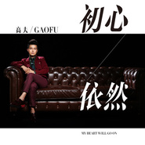

初心依然
============================

|  |  |
| :--: | :-- |
| [ 初心依然](https://emumo.xiami.com/album/2102698801) | **艺人**: [高夫](../index.md) **语种**: 国语 **唱片公司**: 大龙文化 **发行时间**: 2017年02月24日 **专辑类别**: EP, 单曲 **专辑风格**:  **播放数**: 2381 **收藏数**: 1 **评论数**: 0  |

## 简介

高夫第三张专辑同名主打《初心依然》上线 这座城市太迷幻 多少人们都看不穿 是非真假已难辨 到底什么是誓言什么是谎言 我曾经想的好简单 却不知不觉在改变 曾经有过的浪漫 曾经有过的牵绊正慢慢走远 如今我一个人在城市里不停打转 看往事由浓变淡 这么多年一直都没有找到答案 却初心依然... 一颗匠心，只为尽力做好每一首歌。高夫第三专辑同名歌曲《初心依然》，仍然由高夫包办词曲，并联手国内外顶级音乐人联手打造，不为始终，只为初心！

## 曲目

## 评论

|  |  |  |  |
| :-- | :-- | :-- | :-- |
