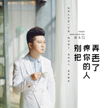

别把疼你的人弄丢了
============================

|  |  |
| :--: | :-- |
| [ 别把疼你的人弄丢了](https://emumo.xiami.com/album/2102776961) | **艺人**: [高夫](../index.md) **语种**: 国语 **唱片公司**: 华羽先生 **发行时间**: 2017年07月04日 **专辑类别**: EP, 单曲 **专辑风格**:  **播放数**: 110851 **收藏数**: 7 **评论数**: 1  |

## 简介

都说前世五百次的回眸才换来今生的擦肩  
我上辈子定是拯救世界的盖世英雄  
才换来你今生的垂青  
我要你好  
我要爱你到老  
争吵也要有浪漫的味道  
生活琐碎、颠簸连连  
你依然是我的星辰大海  
是我独一无二的欢笑  
执子之手 与子偕老  
愿我们彼此珍惜  
别把疼你的人弄丢了 

## 曲目

## 评论

|  |  |  |  |
| :-- | :-- | :-- | :-- |
|  [虾米用户](https://emumo.xiami.com/u/280168064)  2017-08-02 20:40 赞(0) 踩(0) | 
好听
 |
