高夫
============================

|  |  |
| :--: | :-- |
| [ 高夫](https://i.xiami.com/gaufu) | **地区**: China 中国大陆 **风格**: 民谣流行 Folk Pop, 当代民谣 Contemporary Folk, 当代唱作人 Contemporary Singer-Songwriter, 流行摇滚 Pop Rock, 国语流行 Mandarin Pop **播放数**: 8457530 **粉丝数**: 309 **评论数**: 28  |

## 档案

高夫，1983年12月14日出生于陕西潼关，内地男歌手、音乐制作人。代表作品：《大雨还在下》《勇闯天涯》《灌醉》《萌萌在哪里》《干了这杯酒》《别把爱你的人弄丢了》《希望所有的人都快乐》等。 
2008年 由高夫作词、作曲并演唱，与好友赵照、赵雷等众多好友联手打造的首支单曲《大雨还在下》一经发布迅速走红，同年患上神经性耳聋，暂别音乐道路。 
2015年03月 阔别七年，签约北京华羽先生文化传媒有限公司，重新起航。 
2015年04月 与好友赵照、姚雷、许巍御用制作人李延亮、杨坤制作人侯文波、以及贝贝、王传统、韩阳等国内顶级乐手、国内顶级混音师时俊峰、国际顶级混音大师Tony Cousis（英国)、Tom Coyne（美国）合作新专辑。 
2015年06月 继莫文蔚、李健之后，重演好友赵照经典作品《当你老了》。 
2015年07月 再次好友与赵照联手，合唱单曲《在火光中唱歌》 。 
2015年11月 发布电影《那年20岁》插曲《灌醉》、同月发布公益歌曲《我的胸膛留给你》。 
2015年11月 携手国内外顶级音乐人发布专辑主打歌曲之一《勇闯天涯》。 
2016年01月 发行专辑《希望所有的人都快乐》并获《中国音乐联播榜》《华语红歌榜》首期双冠军。 
2016年05月 应邀参加2016中华情第11届刘邦文化节。 
2016年06月 为电影《误入歧途》创作并演唱主题曲《赌徒》。 
2016年07月 为电影《灵魂恋人》创作并演唱主题曲《等你》及片尾曲《突然好想哭》。 
2016年07月 应邀与孙楠、姜育恒、张韶涵等同期参加“中国梦·梦之蓝”巨星演唱会。 
2016年09月 为电影《误入歧途》创作的片尾曲《唱给朋友的歌》。 
2016年10月 担任河南电视台大型真人秀节目《最强校花》特邀评委。录制视讯中国·《高夫音乐坊间记》 
2016年10月 为电影《小明和他的小伙伴们》担任主题曲《宝贝宝贝》音乐制作人。 
2016年10月 第二次举办 爱唱红人馆·高夫专场，同月参加录制“守望天使 为爱童行”关爱自闭症儿童群星慈善演唱会 被授予“爱心歌手”称号。 
2017年02月 应邀与周传雄、金志文、吉克隽逸共同参加“中国音乐联播榜”年度盛典，高夫《大雨还在下》获“中国音乐联播榜”年度十大金曲奖 并现场演唱获奖歌曲《大雨还在下》。 
2017年03月 联合国内外十位知名DJ发布首张舞曲专辑《偶尔也要嗨一下》。 
2017年04月 发行第三张个人专辑《初心依然》。 
2017年05月 应邀录制中央电视台CCTV-3《幸福账单》演唱嘉宾，并现场演唱《萌萌在哪里》《大雨还在下》。 
2017年06月 组建高夫&乐队，开始筹备高夫第四张个人专辑《心中的海》。 
2017年08月 成立高夫工作室，并签约梦想中国优质歌手曹雪（代表作《确定一定以及肯定》）。 
2017年10月 高夫《干了这杯酒》在某短视频平台热传，被网友录制超50+万不同版本的视频，视频播放总量已超3+亿。 
2017年11月 发布第四张个人专辑《心中的海》预热单曲《世界很大也很小》。

## 专辑

| 名称 | 语种 | 唱片公司 | 发行时间 | 专辑类别 | 专辑风格 |
| :--: | :-- | :-- | :-- | :-- | :-- |
| [ 惊雷 （BluesFunk版）](./albums/2108366174.md) | 国语 | 塑星文化 | 2020年04月14日 | EP, 单曲 | 流行 Pop |
| [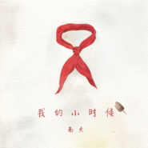 我的小时候](./albums/2105233601.md) | 国语 | 塑星文化 | 2019年09月09日 | EP, 单曲 |  |
| [ 赌徒 (DJ何鹏版)](./albums/2104949903.md) | 国语 | 鲸鱼向海 | 2019年05月27日 | EP, 单曲 |  |
| [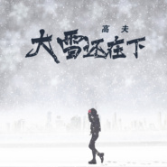 大雪还在下](./albums/2104888953.md) | 国语 | 咚吧嗒文化 | 2019年05月09日 | EP, 单曲 |  |
| [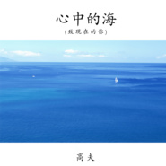 心中的海·致现在的你](./albums/2104893654.md) | 国语 | 咚吧嗒文化 | 2019年05月09日 | EP, 单曲 |  |
| [ 干了这杯酒 (DJ小鱼儿版)](./albums/2104046484.md) | 国语 | 鲸鱼向海 | 2018年09月20日 | EP, 单曲 | 国语流行 Mandarin Pop |
| [ 伤](./albums/2103685820.md) | 国语 | 华羽先生文化 | 2018年04月15日 | EP, 单曲 |  |
| [ 榜样](./albums/2102976854.md) | 国语 | 华羽先生文化 | 2017年12月19日 | EP, 单曲 | 国语流行 Mandarin Pop |
| [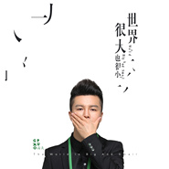 世界很大也很小](./albums/2102929404.md) | 国语 | 华羽先生文化 | 2017年11月14日 | EP, 单曲 |  |
| [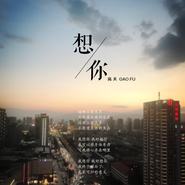 想你](./albums/2102866856.md) | 国语 | 华羽先生文化 | 2017年10月01日 | EP, 单曲 |  |
| [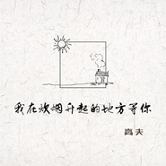 我在炊烟升起的地方等你](./albums/2102803715.md) | 国语 | 华羽先生 | 2017年07月27日 | EP, 单曲 |  |
| [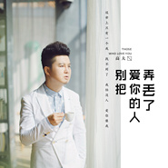 别把爱你的人弄丢了](./albums/2102815874.md) | 国语 | 塑星文化 | 2017年07月05日 | EP, 单曲 |  |
| [ 别把疼你的人弄丢了](./albums/2102776961.md) | 国语 | 华羽先生 | 2017年07月04日 | EP, 单曲 |  |
| [ 爸爸 妈妈 我爱你](./albums/2102772557.md) | 国语 | 华羽先生文化 | 2017年06月27日 | EP, 单曲 |  |
| [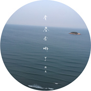 青春去哪了](./albums/2102738134.md) | 国语 | 华羽先生文化 | 2017年04月25日 | EP, 单曲 |  |
| [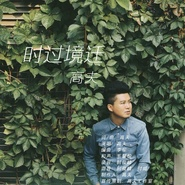 时过境迁](./albums/2102718709.md) | 国语 | 华羽先生 | 2017年03月22日 | EP, 单曲 |  |
| [ 初心依然](./albums/2102698801.md) | 国语 | 大龙文化 | 2017年02月24日 | EP, 单曲 |  |
| [ 萌萌在哪里](./albums/2102680111.md) | 国语 | 腾研国际 | 2017年01月13日 | EP, 单曲 |  |
| [ 干了这杯酒](./albums/2102663105.md) | 国语 | 华羽先生 | 2016年12月12日 | EP, 单曲 |  |
| [ 细思极恐](./albums/2102663100.md) | 国语 | 华羽先生 | 2016年10月26日 | EP, 单曲 |  |
| [ 唱给朋友的歌](./albums/2102663095.md) | 国语 | 华羽先生 | 2016年09月28日 | EP, 单曲 |  |
| [ 马上有人爱](./albums/2102402656.md) | 国语 | 大龙文化 | 2016年09月09日 | EP, 单曲 |  |
| [ 赌徒](./albums/2100376348.md) | 国语 | 华羽先生 | 2016年08月05日 | EP, 单曲 |  |
| [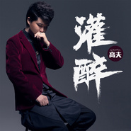 灌醉](./albums/365214.md) | 国语 | 索卡尼娱乐 | 2016年05月26日 | EP, 单曲 |  |
| [ 勇闯天涯](./albums/2100234792.md) | 国语 | 华羽先生文化 | 2016年05月26日 | EP, 单曲 |  |
| [ 勇闯天涯](./albums/2100325480.md) | 国语 | 华羽先生 | 2016年04月30日 | EP, 单曲 |  |
| [ 希望所有的人都快乐](./albums/2100262412.md) | 国语 | 华羽先生 | 2016年01月18日 | EP, 单曲 |  |
| [ 小夫妻情歌](./albums/2100244452.md) | 国语 | 华羽先生 | 2015年12月07日 | EP, 单曲 |  |
| [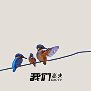 我们](./albums/2102774057.md) | 国语 | 高夫音乐 | 2015年12月07日 | EP, 单曲 |  |
| [ 我的胸膛留给你](./albums/2100199594.md) | 国语 | 华羽先生文化 | 2015年09月15日 | EP, 单曲 |  |
| [ 不接你电话](./albums/2100182436.md) | 国语 | 华羽先生文化 | 2015年08月24日 | EP, 单曲 |  |
| [ 灵魂恋人 电影原声带Soul Lovers Film OST.](./albums/2100380082.md) | 国语 | 华羽先生 | 2015年08月15日 | 原声带, 影视音乐 |  |
| [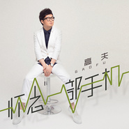 怀念一部手机](./albums/2100174407.md) | 国语 | 华羽先生文化 | 2015年08月03日 | EP, 单曲 |  |
| [ 在火光中唱歌](./albums/236856358.md) | 国语 | 华羽先生文化 | 2015年07月14日 | EP, 单曲 |  |
| [ 大雨还在下](./albums/436356706.md) | 国语 | 华羽先生 | 2015年07月09日 | EP, 单曲 | 流行摇滚 Pop Rock, 国语流行 Mandarin Pop |
| [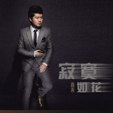 寂寞如花](./albums/2035718683.md) | 国语 | 华羽先生文化 | 2015年06月30日 | EP, 单曲 |  |
| [ 爱情哈巴狗](./albums/1535719900.md) | 国语 | 索卡尼娱乐 | 2009年09月17日 | EP, 单曲 |  |

## 评论

|  |  |  |
| :-- | :-- | :-- |
|  [虾米用户](https://emumo.xiami.com/u/413559921)  2020-01-08 20:15 赞(0) 踩(0) | 
这是我最近听到最好听的歌。继续努力！
 |
|  [虾米用户](https://emumo.xiami.com/u/319688150) 愿经典不被遗忘 2019-12-03 02:04 赞(0) 踩(0) | 

 |
|  [虾米用户](https://emumo.xiami.com/u/319688150) 愿经典不被遗忘 2019-12-03 02:03 赞(0) 踩(0) | 

 |
|  [虾米用户](https://emumo.xiami.com/u/11018219)  2019-08-28 18:12 赞(0) 踩(0) | 
高尔夫和高尔基的大哥.
 |
|  [虾米用户](https://emumo.xiami.com/u/293692544) 你敢给我说话吗？我咬你 2017-11-12 12:19 赞(1) 踩(0) | 
好听
 |
|  [虾米用户](https://emumo.xiami.com/u/293692544) 你敢给我说话吗？我咬你 2017-11-01 23:11 赞(1) 踩(0) | 
好听
 |
|  [虾米用户](https://emumo.xiami.com/u/324846090)  2017-10-03 18:05 赞(2) 踩(0) | 
这首歌不错哦
 |
|  [虾米用户](https://emumo.xiami.com/u/38217346)  2017-09-13 17:12 赞(1) 踩(0) | 
 
 |
|  [虾米用户](https://emumo.xiami.com/u/323946071)  2017-09-08 21:29 赞(1) 踩(0) | 
加油!坚持做自己。挺你。
 |
|  [虾米用户](https://emumo.xiami.com/u/301005254)  2017-09-08 20:58 赞(1) 踩(0) | 

 |
|  [虾米用户](https://emumo.xiami.com/u/66795104)  2017-06-13 20:06 赞(2) 踩(0) | 
加油 
 |
|  [虾米用户](https://emumo.xiami.com/u/269553617) 人就像寒冬里的刺猬，靠得... 2017-05-07 22:35 赞(1) 踩(0) | 
加油！
 |
|  [虾米用户](https://emumo.xiami.com/u/293593200)  2017-05-05 22:45 赞(1) 踩(0) | 
很好听
 |
|  [虾米用户](https://emumo.xiami.com/u/271169707) 找个爱人的啊 2017-05-01 18:07 赞(1) 踩(0) | 
        
 |
|  [虾米用户](https://emumo.xiami.com/u/5389010) 你二十多岁 活在体制内 2017-04-17 22:47 赞(1) 踩(0) | 
加油
 |
|  [虾米用户](https://emumo.xiami.com/u/285777872)   2017-04-03 20:25 赞(1) 踩(0) | 
       
 |
|  [虾米用户](https://emumo.xiami.com/u/279543206)  2017-04-02 16:46 赞(1) 踩(0) | 
好听
 |
|  [虾米用户](https://emumo.xiami.com/u/269553617) 人就像寒冬里的刺猬，靠得... 2017-02-10 00:18 赞(1) 踩(0) | 
大雨还在下
 |
|  [虾米用户](https://emumo.xiami.com/u/51545108)  2016-11-16 17:19 赞(2) 踩(0) | 
感觉他的声音很好听，不错不错，大叔，棒棒哒
 |
|  [虾米用户](https://emumo.xiami.com/u/97747450) 我还没想好要写什么... 2016-07-31 13:40 赞(2) 踩(0) | 
2336
 |
|  [虾米用户](https://emumo.xiami.com/u/1949345) Skong(司空) 2015-10-03 01:39 赞(1) 踩(0) | 
你是上海家化旗下的？我是高夫的忠实用户，火山灰洗面泥棒棒哒~
 |
|  [虾米用户](https://emumo.xiami.com/u/16403912)  2015-08-12 23:22 赞(0) 踩(0) | 

 |
|  [虾米用户](https://emumo.xiami.com/u/13048549) 回应大地的召唤 2015-07-29 10:32 赞(1) 踩(0) | 
看来注定我来做这个沙发，火钳刘明
 |
|  [虾米用户](https://emumo.xiami.com/u/49645207)  2015-07-08 19:44 赞(14) 踩(0) | 
我刚入驻了阿里音乐人，欢迎大家来我的个人主页，收听我的最新音乐
 |
| ⇒ |  [虾米用户](https://emumo.xiami.com/u/275651000)  2017-04-03 00:17 赞(0) 踩(0) | 
呃呃
 |
| ⇒ |  [虾米用户](https://emumo.xiami.com/u/275651000)  2017-04-03 00:17 赞(0) 踩(0) | 
有没有QQ
 |
| ⇒ |  [虾米用户](https://emumo.xiami.com/u/269086587)  2017-04-03 19:54 赞(0) 踩(0) | 
你好
 |
| ⇒ |  [虾米用户](https://emumo.xiami.com/u/354774853)  2018-05-06 17:27 赞(0) 踩(0) | 
（我小的时候）是你唱的吗？
 |
