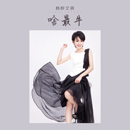

啥最牛
============================

|  |  |
| :--: | :-- |
| [ 啥最牛](https://emumo.xiami.com/album/2108392140) | **艺人**: [杨梓文祺](../index.md) **语种**: 国语 **唱片公司**: 禾信科技 **发行时间**: 2019年05月09日 **专辑类别**: EP, 单曲 **专辑风格**: 国语流行 Mandarin Pop **播放数**: 830 **收藏数**: 0 **评论数**: 0  |

## 简介

杨梓文祺带来《啥最牛》 ；  
我们每天跟着快乐大步向前走  
给力歌 来一首 咱们一起吼  
无论春夏秋冬 书香锦绣  
有个好身体才最牛

## 曲目

## 评论

