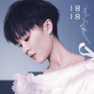

00:00
============================

|  |  |
| :--: | :-- |
| [ 00:00](https://emumo.xiami.com/album/2102654707) | **艺人**: [郁可唯](../index.md) **语种**: 国语 **唱片公司**: 滚石唱片 **发行时间**: 2016年12月27日 **专辑类别**: 录音室专辑 **专辑风格**: 国语流行 Mandarin Pop **播放数**: 13359502 **收藏数**: 23095 **评论数**: 2502  |

## 简介

郁可唯 00:00 专辑  
之 时间的自由意识  
  
爱情&amp;生活  
  
然而我们也许身处其中，也可能罝身事外….  
在时间的流动中，产生出了变化与结果，而结果可能因时间的催化有了改变  
  
郁可唯 00:00 专辑  
10首音乐，自由穿梭在不同故事的情怀里，  
她是冷静与热情兼具的导读者，  
唱出过去、现在、未来故事所发生的一切变化….   
  
00:00一个可任意自由解析的时间符号。所有万物的起始与轮回，都回归00:00。  
00:00是想表达时间的自由意识，生命的每一个流动与静止，都是启程与重生。  
这张专辑名称，象征郁可唯新出发的一个起点，是她从心体悟音乐人生的一段新旅程。  
  
郁可唯蛰伏了两年六个月才推出新专辑。滚石唱片秉持「没有收到好歌就不发片」的信念，郁可唯也接下选歌的重要任务，全心投入收歌工程，细细寻觅每一首她心中的好歌。这两年多有超过600首歌曲映入眼前，听进耳膜，郁可唯和经纪人反复「过滤」，从旋律、从歌词双管齐下考虑歌曲的聆听感与耐听度，精挑细选出专辑10首作品，这张专辑由陈子鸿/陈建骐/郑楠/陈迪，两岸四大制作精英共同打造，让郁可唯重新并发现自己声音的多样性，有了全方位的收获。  
  
一路唱来，出道第一张专辑就入围金曲奖最佳新人提名肯定的郁可唯，歌声始终深获好评。2016全新专辑里，郁可唯不仅展现歌艺，她更是细心参与每一个幕后的音乐制作与企划包装工程，尽情的投入，自在的享受参与音乐每个过程。她说：「这是最贴近郁可唯的一张专辑，因为挑剔，因为尽力，所以无悔，所以满意。」 

## 曲目

- [倒流MVRevert](./2102654707/mSpOGg5ff4b.md)
- [寂寞更生MVSolitude Again](./2102654707/8HLWHne9de3.md)
- [电梯MVLove Passing By](./2102654707/xNaXYAd288c.md)
- [夜落初雪MVFirst Snow](./2102654707/xNaXYBab3ce.md)
- [我听说We Loved](./2102654707/xNaXYCc8da5.md)
- [Oh WhyMV](./2102654707/mSpZkd7aa63.md)
- [没空寂寞No Time For Being Alone](./2102654707/mSpZke8e782.md)
- [21天MV21 Days](./2102654707/mSpZkf5983b.md)
- [琥珀Amber](./2102654707/xNaXYGcefef.md)
- [个人品味My Style](./2102654707/xNaXYHc1b53.md)

## 评论

|  |  |  |
| :-- | :-- | :-- |
|  [虾米用户](https://emumo.xiami.com/u/267859574) 所有浮生里万千的脸孔，让... 2021-01-06 19:23 赞(1) 踩(0) | 
在虾米上买的第一张专辑，也是唯一一张。虾米音乐不是我经常用来听歌的APP，但是它在我手机上来了又去，很怀念高三在课堂间隙听歌的自己，未来一定会更好的
 |
|  [虾米用户](https://emumo.xiami.com/u/23108694)   2020-09-03 01:44 赞(0) 踩(0) | 
我的宝藏郁可唯， 曾记得你进前三的晚上，我哭成了泪人， 现在看来我的眼泪都值得， 你还是那个让我喜欢的郁可唯。
 |
|  [虾米用户](https://emumo.xiami.com/u/64422384) 深海鱼 2020-04-04 01:36 赞(0) 踩(0) | 
在滚石的最后一张，可以听出滚石已经尽最大能力，挖凿优秀芭乐，打磨郁可唯的音乐人格。
 |
|  [虾米用户](https://emumo.xiami.com/u/248023609)  2020-03-16 12:03 赞(0) 踩(0) | 
郁可唯第五张专辑，个人色彩愈发强烈，浓重的郁可唯色给这张专辑带来的别样的风采。
 |
|  [虾米用户](https://emumo.xiami.com/u/325940524)  2019-12-11 09:00 赞(0) 踩(0) | 
听上去很缥缈
 |
|  [虾米用户](https://emumo.xiami.com/u/290418440)  2019-10-22 20:22 赞(0) 踩(0) | 
郁可唯，为数不多的好嗓音，坚持做专辑音乐值得敬佩！
 |
|  [虾米用户](https://emumo.xiami.com/u/319016319)  2019-10-03 01:52 赞(0) 踩(0) | 
曲曲折折 忽上忽下 简单描述 道尽人生！
 |
|  [虾米用户](https://emumo.xiami.com/u/100016824) 朱婧汐的AI 2019-09-27 13:37 赞(0) 踩(0) | 
清流
 |
|  [虾米用户](https://emumo.xiami.com/u/257900913) 原来听歌可以那么温暖 2019-09-14 00:08 赞(0) 踩(0) | 
每一首歌都很好听
 |
|  [虾米用户](https://emumo.xiami.com/u/13627006) 我还没想好要写什么... 2019-09-13 13:49 赞(2) 踩(0) | 
听了电梯，仿佛唱的就是自己
 |
|  [虾米用户](https://emumo.xiami.com/u/335111856)  2019-09-12 20:44 赞(0) 踩(0) | 
确实是郁可唯
 |
|  [虾米用户](https://emumo.xiami.com/u/429523618)  2019-09-07 15:28 赞(0) 踩(0) | 
哦卡额头高兴吗呢！
 |
|  [虾米用户](https://emumo.xiami.com/u/429419398)  2019-09-04 10:33 赞(0) 踩(0) | 
嘉兴学院了啊啊啊啊啊啊啊？哦哦哦好了吧啦
 |
|  [虾米用户](https://emumo.xiami.com/u/429262842)  2019-08-31 10:26 赞(0) 踩(0) | 
哦哦好吧唧一口腔癌胚抗原件
 |
|  [虾米用户](https://emumo.xiami.com/u/133672702) Latex Rubber... 2019-08-28 13:18 赞(0) 踩(0) | 
唱功超一流，已经可以跟巅峰时期的王菲有的一比了！
 |
|  [虾米用户](https://emumo.xiami.com/u/429100024)  2019-08-25 20:37 赞(0) 踩(0) | 
感恩(≧∇≦)努力加油(ง •̀_•́)ง爱你郁可唯梁静茹she
 |
|  [虾米用户](https://emumo.xiami.com/u/429001644)  2019-08-23 18:48 赞(0) 踩(0) | 
都
 |
|  [虾米用户](https://emumo.xiami.com/u/428969286)  2019-08-22 12:47 赞(0) 踩(0) | 
哦哦哦哦哦哦好了吧唧
 |
|  [虾米用户](https://emumo.xiami.com/u/428874663)  2019-08-20 15:42 赞(0) 踩(0) | 
模仿游戏
 |
|  [虾米用户](https://emumo.xiami.com/u/428865718)  2019-08-20 15:39 赞(0) 踩(0) | 
hhh
 |
|  [虾米用户](https://emumo.xiami.com/u/428859842)  2019-08-20 15:32 赞(0) 踩(0) | 
体检的吧
 |
|  [虾米用户](https://emumo.xiami.com/u/428647760)  2019-08-15 16:51 赞(0) 踩(0) | 
好听(ง •̀_•́)ง
 |
|  [虾米用户](https://emumo.xiami.com/u/428644834)  2019-08-15 06:11 赞(0) 踩(0) | 
推荐了剧烈
 |
|  [虾米用户](https://emumo.xiami.com/u/428635174)  2019-08-14 12:28 赞(0) 踩(0) | 
嘣
 |
|  [虾米用户](https://emumo.xiami.com/u/428623356)  2019-08-14 07:49 赞(0) 踩(0) | 
hello
 |
|  [虾米用户](https://emumo.xiami.com/u/428432413)  2019-08-09 19:12 赞(0) 踩(0) | 
老两口克拉酒驾
 |
|  [虾米用户](https://emumo.xiami.com/u/428098868)  2019-08-03 22:05 赞(0) 踩(0) | 
jjcJJJAVA
 |
|  [虾米用户](https://emumo.xiami.com/u/428096076)  2019-08-03 00:48 赞(0) 踩(0) | 
萌(ɔˆ ³(ˆ⌣ˆc)唉怀念
 |
|  [虾米用户](https://emumo.xiami.com/u/428080633)  2019-08-03 00:44 赞(0) 踩(0) | 
马路尔康丁额
 |
|  [虾米用户](https://emumo.xiami.com/u/427962465)  2019-07-31 13:23 赞(0) 踩(0) | 
牛逼好听
 |
|  [虾米用户](https://emumo.xiami.com/u/427898335)  2019-07-29 10:57 赞(0) 踩(0) | 
加油(ง •̀_•́)ง郁可唯葵葵
 |
|  [虾米用户](https://emumo.xiami.com/u/427906042)  2019-07-29 10:03 赞(0) 踩(0) | 
葵葵加油(ง •̀_•́)ง
 |
|  [虾米用户](https://emumo.xiami.com/u/427901203)  2019-07-29 08:59 赞(0) 踩(0) | 
我只爱你哟
 |
|  [虾米用户](https://emumo.xiami.com/u/427901203)  2019-07-29 08:59 赞(0) 踩(0) | 
重庆见哦宝贝(๑˙❥˙๑)
 |
|  [虾米用户](https://emumo.xiami.com/u/427503629)  2019-07-20 08:53 赞(0) 踩(0) | 
茶楼邓丽君
 |
|  [虾米用户](https://emumo.xiami.com/u/427214208)  2019-07-12 16:29 赞(0) 踩(0) | 
额（︶︿︶）=凸
 |
|  [虾米用户](https://emumo.xiami.com/u/427201644)  2019-07-12 15:43 赞(0) 踩(0) | 
妃嫔
 |
|  [虾米用户](https://emumo.xiami.com/u/427185941)  2019-07-12 14:53 赞(0) 踩(0) | 
魔王
 |
|  [虾米用户](https://emumo.xiami.com/u/427216061)  2019-07-12 14:50 赞(0) 踩(0) | 
萌新
 |
|  [虾米用户](https://emumo.xiami.com/u/427166682)  2019-07-11 20:04 赞(0) 踩(0) | 
ko
 |
|  [虾米用户](https://emumo.xiami.com/u/427172570)  2019-07-11 19:57 赞(0) 踩(0) | 
枫树
 |
|  [虾米用户](https://emumo.xiami.com/u/427157329)  2019-07-11 11:44 赞(0) 踩(0) | 
邓总
 |
|  [虾米用户](https://emumo.xiami.com/u/427138219)  2019-07-10 17:13 赞(0) 踩(0) | 
iiuuh
 |
|  [虾米用户](https://emumo.xiami.com/u/427133204)  2019-07-10 16:01 赞(0) 踩(0) | 
德玛西亚啊啊啊
 |
|  [虾米用户](https://emumo.xiami.com/u/427120570)  2019-07-10 15:30 赞(0) 踩(0) | 
妃儿
 |
|  [虾米用户](https://emumo.xiami.com/u/427109346)  2019-07-10 08:38 赞(0) 踩(0) | 
么得啊l了o
 |
|  [虾米用户](https://emumo.xiami.com/u/427035396)  2019-07-08 12:21 赞(0) 踩(0) | 
gun
 |
|  [虾米用户](https://emumo.xiami.com/u/427012296)  2019-07-07 19:17 赞(0) 踩(0) | 
哪些
 |
|  [虾米用户](https://emumo.xiami.com/u/426971637)  2019-07-07 11:27 赞(0) 踩(0) | 
郁可唯
 |
|  [虾米用户](https://emumo.xiami.com/u/426925585)  2019-07-05 23:01 赞(0) 踩(0) | 
哈哈哈好听
 |
|  [虾米用户](https://emumo.xiami.com/u/426164076)  2019-06-17 22:32 赞(0) 踩(0) | 
个人品味
 |
|  [虾米用户](https://emumo.xiami.com/u/426121209)  2019-06-17 01:20 赞(0) 踩(0) | 
家里糖葫芦胜
 |
|  [虾米用户](https://emumo.xiami.com/u/426121209)  2019-06-17 01:20 赞(0) 踩(0) | 
重头
 |
|  [虾米用户](https://emumo.xiami.com/u/426121209)  2019-06-17 01:19 赞(0) 踩(0) | 
不得不承认这张很郁可唯
 |
|  [虾米用户](https://emumo.xiami.com/u/426066267)  2019-06-15 20:02 赞(0) 踩(0) | 
万事邓紫棋记住
 |
|  [虾米用户](https://emumo.xiami.com/u/426066267)  2019-06-15 20:02 赞(0) 踩(0) | 
记住记葛额额
 |
|  [虾米用户](https://emumo.xiami.com/u/426066267)  2019-06-15 20:01 赞(0) 踩(0) | 
牛逼了
 |
|  [虾米用户](https://emumo.xiami.com/u/426048600)  2019-06-15 19:00 赞(0) 踩(0) | 
记水手少女
 |
|  [虾米用户](https://emumo.xiami.com/u/426048600)  2019-06-15 19:00 赞(0) 踩(0) | 
逻辑腊肠
 |
|  [虾米用户](https://emumo.xiami.com/u/426048600)  2019-06-15 18:59 赞(0) 踩(0) | 
童
 |
|  [虾米用户](https://emumo.xiami.com/u/426048600)  2019-06-15 18:59 赞(0) 踩(0) | 
高铁北站记季
 |
|  [虾米用户](https://emumo.xiami.com/u/426048600)  2019-06-15 18:59 赞(0) 踩(0) | 
高铁北站
 |
|  [虾米用户](https://emumo.xiami.com/u/426048600)  2019-06-15 18:59 赞(0) 踩(0) | 
DHL
 |
|  [虾米用户](https://emumo.xiami.com/u/33051404) 青春耗盡剩下了什麼？ 2019-05-29 21:24 赞(0) 踩(0) | 
从来没听过郁可唯的歌，这张专辑水准很高。跟本人一样温温和和，需要大家慢慢品味
 |
|  [虾米用户](https://emumo.xiami.com/u/8444695)  2019-05-19 13:44 赞(0) 踩(0) | 
发现得太晚了&amp;hellip;&amp;hellip;很舒服的一张专辑。好声音确实需要好曲子
 |
|  [虾米用户](https://emumo.xiami.com/u/190587494) 喜欢男生，就这 2019-05-17 23:35 赞(0) 踩(0) | 
最新专辑，华研的塑造让郁可唯像田馥甄，可她是郁可唯，不是谁。
 |
|  [虾米用户](https://emumo.xiami.com/u/419883542)  2019-05-15 00:30 赞(0) 踩(0) | 
很久没有听过哪个歌手的完整专辑了，品质很高
 |
|  [虾米用户](https://emumo.xiami.com/u/116376288) 多听歌就不胡思乱想了 2019-05-11 19:03 赞(0) 踩(0) | 
真的很惊艳，不太听新歌，但听到电梯就被感动。
 |
|  [虾米用户](https://emumo.xiami.com/u/166468424)  2019-05-05 21:07 赞(0) 踩(0) | 
很棒的专辑，好几首都很入耳！
 |
|  [虾米用户](https://emumo.xiami.com/u/251927848)  2019-05-02 15:16 赞(1) 踩(0) | 
这张起码没啥粪曲 新砖首发的除了路过人间没一个能听的就很担心
 |
|  [虾米用户](https://emumo.xiami.com/u/35789405) 听什么留言 2019-04-15 16:30 赞(0) 踩(0) | 
好听
 |
|  [虾米用户](https://emumo.xiami.com/u/322568125) 怀念. 2019-04-01 20:59 赞(1) 踩(0) | 
风格各异，有欢快，有温暖，有个性，有思考，很充实，很美好。
 |
|  [虾米用户](https://emumo.xiami.com/u/420660033)  2019-03-08 01:56 赞(1) 踩(0) | 
三十而立真好听ヾ(Ő∀Ő๑)ﾉ太好惹
 |
|  [虾米用户](https://emumo.xiami.com/u/420660033)  2019-03-08 01:56 赞(1) 踩(0) | 
最棒的郁可唯
 |
|  [虾米用户](https://emumo.xiami.com/u/110236090)   2019-03-06 21:57 赞(1) 踩(0) | 
嗯，不错！
 |
|  [虾米用户](https://emumo.xiami.com/u/310264648)  2019-01-10 09:34 赞(1) 踩(0) | 
像是一个孤独的人 将心事娓娓道来 说给自己听
 |
|  [虾米用户](https://emumo.xiami.com/u/37404174)  2018-11-28 18:39 赞(2) 踩(0) | 
郁可唯在滚石的最后答卷，越来越成熟，风格也越来越收到大众喜爱，希望进入华研以后可以，能真正焕发新的活力，在这个流行时代在一个流行化的公司里，一定可以取得更好的成绩
 |
|  [虾米用户](https://emumo.xiami.com/u/234962392) 愿我们都能被温柔相待 2018-11-11 13:01 赞(1) 踩(0) | 
为什么会唱的这么好听啊啊
 |
|  [虾米用户](https://emumo.xiami.com/u/6818258)  希望你就是我此生最后一... 2018-11-04 10:42 赞(1) 踩(0) | 
非常好听
 |
|  [虾米用户](https://emumo.xiami.com/u/283814142) 认识我你很高兴!! 2018-10-26 17:35 赞(1) 踩(0) | 
因为虾米日推《电梯》，所以来听整张专。对于郁可唯，只知道《时间煮雨》，我的错我的错......她声线真的！太美了！〒▽〒
 |
|  [虾米用户](https://emumo.xiami.com/u/18737138)  2018-10-17 04:21 赞(2) 踩(0) | 
就冲电梯这首歌，就是十分满分的专辑。人活的这么懦弱这么累，我好像喜欢你，但我不敢为了看不到的未来伤害乃至于牺牲自己。我是喜欢你，但我更害怕伤害我自己。所以我宁愿假设一个无害的你，这样默默在心里。有一天，我不喜欢你了，与你于我，都不算一场悲剧。怎么去追爱，怎么让我变得勇敢无畏。这道题目，我再聪明，应该也是无解。这次，我也不知道该不该抓住你，该不该喜欢你。我很害怕，但我只能假装不怂。
 |
|  [虾米用户](https://emumo.xiami.com/u/49091718) 我还没想好要写什么... 2018-08-07 18:41 赞(1) 踩(0) | 
爱电梯这首歌
 |
|  [虾米用户](https://emumo.xiami.com/u/88266612)  晚风吹过.. 2018-07-17 18:00 赞(3) 踩(0) | 
好一个灵魂歌者！
 |
|  [虾米用户](https://emumo.xiami.com/u/14776134)   2018-07-02 13:49 赞(1) 踩(0) | 
从比赛就最喜欢她的声音  歌手里的短暂出现可惜 这至少前三吧
 |
|  [虾米用户](https://emumo.xiami.com/u/262215819)  2018-06-24 11:30 赞(3) 踩(0) | 
专辑终于不要钱了，我也来了
 |
|  [虾米用户](https://emumo.xiami.com/u/5584813)  2018-06-21 13:01 赞(1) 踩(0) | 
封面没有认出来 刚出来还baby肥呢 呵呵 好快啊 谢谢可唯的陪伴。
 |
|  [虾米用户](https://emumo.xiami.com/u/47355043)  2018-06-18 19:16 赞(3) 踩(0) | 
其实滚石给她制作的专辑歌曲都不错，听一下都符合滚石一贯的风格，只是不火，能怎么办？
 |
|  [虾米用户](https://emumo.xiami.com/u/88748304) now or never 2018-06-03 15:35 赞(4) 踩(0) | 
來聽充滿感情的聲音❤
 |
|  [虾米用户](https://emumo.xiami.com/u/1690267)   2018-04-08 19:18 赞(3) 踩(0) | 
值得一听，比想象中好太多
 |
|  [虾米用户](https://emumo.xiami.com/u/3664746)  2018-04-06 20:31 赞(3) 踩(0) | 
既生喜碧，何生英霞..
 |
| ⇒ |  [虾米用户](https://emumo.xiami.com/u/43137226) 唯有好音乐不可辜负。 2018-04-18 14:32 赞(0) 踩(0) | 
而恰巧华研签了喜碧和英霞
 |
|  [虾米用户](https://emumo.xiami.com/u/37898480)  2018-03-04 09:43 赞(2) 踩(0) | 
结束，亦是开始，加油！
 |
|  [虾米用户](https://emumo.xiami.com/u/91176470) 哪里有彩虹告诉我 2018-02-07 13:16 赞(1) 踩(0) | 
Yisa唱功太棒了
 |
|  [虾米用户](https://emumo.xiami.com/u/18340503)  2018-01-06 08:00 赞(1) 踩(0) | 
这专专辑的很多歌初听可能没那么惊艳，但真是越听越好听，非常耐听。尤其是《倒流》、《电梯》、《oh why》、《我听说》、《琥珀》
 |
|  [虾米用户](https://emumo.xiami.com/u/21157616) 如果有些歌始终没唱 2017-12-27 14:54 赞(1) 踩(0) | 
五儿砸生日快乐！
 |
|  [虾米用户](https://emumo.xiami.com/u/111365026)   2017-12-25 20:25 赞(6) 踩(0) | 
可惜宣传太差了，几乎没宣传，感觉这张可以封神了
 |
|  [虾米用户](https://emumo.xiami.com/u/257802972)  2017-12-22 11:32 赞(1) 踩(0) | 
这张专辑听了很多遍，每首歌都有用心听，全都学会了，下次ktv一定要唱个遍
 |
|  [虾米用户](https://emumo.xiami.com/u/22010497)   2017-12-18 22:02 赞(0) 踩(0) | 
加我微信给你 我的手机号 18515661161 叫太阳
 |
|  [虾米用户](https://emumo.xiami.com/u/234962392) 愿我们都能被温柔相待 2017-12-13 20:19 赞(1) 踩(0) | 
这张非常好
 |
|  [虾米用户](https://emumo.xiami.com/u/140033252)  2017-12-08 15:44 赞(1) 踩(0) | 
从心认识郁可唯
 |
|  [虾米用户](https://emumo.xiami.com/u/274545259)  2017-12-06 23:51 赞(1) 踩(0) | 
00:00时间的自由意识，生命的每一个流动与静止，都是启程与重生!
 |
|  [虾米用户](https://emumo.xiami.com/u/327637494)   2017-11-28 12:20 赞(1) 踩(0) | 
我听说，很动人。安静地诉说&amp;hellip;&amp;hellip;
 |
|  [虾米用户](https://emumo.xiami.com/u/99623430) 我还没想好要写什么... 2017-11-21 20:12 赞(2) 踩(0) | 
郁可唯的声音永远治愈了我
 |
|  [虾米用户](https://emumo.xiami.com/u/39985061)   2017-11-20 10:38 赞(1) 踩(0) | 
每首都很值得听
 |
|  [虾米用户](https://emumo.xiami.com/u/100199124) 微微风  涌起旧梦 2017-11-17 02:08 赞(1) 踩(0) | 
用心
 |
|  [虾米用户](https://emumo.xiami.com/u/304916199)  2017-11-11 18:04 赞(2) 踩(0) | 
郁可唯的声音太细腻动听了 天籁之音
 |
|  [虾米用户](https://emumo.xiami.com/u/332576186)  2017-10-31 21:11 赞(0) 踩(0) | 
最喜欢寂寞更生，像精灵一样
 |
|  [虾米用户](https://emumo.xiami.com/u/248004122)  2017-10-30 09:57 赞(12) 踩(0) | 
同样的情歌 却给人不同的感受 几个让 更是唱出内心的旋律 郁可唯的声音总是将人带入其中 让人身临其境 仿佛恋爱的时候总是离不开可唯的声音 总是那么温暖人心 听了七年的声音 越来越归于自然 这就是郁可唯 如果时间倒流 七年前 我还是会喜欢上那个穿着紫色长裙眼里含泪向大家笔芯的你 而且也会像现在这样一直爱一直爱 只想做最安静的一朵郁金香 默默的支持 只要你一直唱 我就一直听  
 |
|  [虾米用户](https://emumo.xiami.com/u/231928672) 天真岁月不忍欺 青春荒唐... 2017-10-30 09:57 赞(2) 踩(0) | 
越听越好听，循环听不下来，中了郁可唯的毒，请继续做有品质的好音乐，期待你
 |
|  [虾米用户](https://emumo.xiami.com/u/231928672) 天真岁月不忍欺 青春荒唐... 2017-10-30 09:54 赞(0) 踩(0) | 
直击人心的好声音-郁可唯
 |
|  [虾米用户](https://emumo.xiami.com/u/103162530) 我要的自由更高级 2017-10-29 12:01 赞(0) 踩(0) | 
每一首都值得循环播放
 |
|  [虾米用户](https://emumo.xiami.com/u/114024112) 这家伙很聪明什么也没留下... 2017-10-28 00:28 赞(0) 踩(0) | 
这张很郁可唯，看到了这几年你的用心对和音乐的态度，感动
 |
|  [虾米用户](https://emumo.xiami.com/u/8929426) 郁可唯首波主动《寂寞更生... 2017-10-28 00:28 赞(4) 踩(0) | 
寂寞更生——惊艳绝伦！ 个人品味——很是惊喜！ Oh why ——我的爱，最郁可唯的一首！ 电梯——别样小清新，越听越爱！ 我听说——很有味道，主歌旋律无意间总会在脑海想起！ 倒流——文艺的话语，兔子 爱的文艺范儿~ 琥珀——催人的小悲伤，容易让人沉醉自迷于过往~ 没空寂寞——爵士兔，随意午后分享曲儿…… 夜落初雪——“仙嗓”最好的诠释，郁可唯最美的中国风！ 21天——郁可唯式情歌典范！ 全专用心之最足以听出，完完全全就是金曲专，希望明年可以在金曲奖上斩获奖项！
 |
| ⇒ |  [虾米用户](https://emumo.xiami.com/u/21157616) 如果有些歌始终没唱 2017-10-29 15:57 赞(0) 踩(0) | 
这张已经过了金曲奖了 
 |
|  [虾米用户](https://emumo.xiami.com/u/253114482)  2017-10-28 00:28 赞(17) 踩(0) | 
寂寞更生旋律抓耳，路人一听就能哼两句~21天，电梯，我听说搭个偶像剧都有流行潜质，琥珀单纯觉得听感不错。前些天作了个梦，感慨了下郁可唯真的是个很会唱的歌手，但是似乎缺乏了一些特质，在娱乐圈这个张扬个性的圈子里，能沉下心来坚持自己喜欢的风格也是幸福又不容易的事吧，反正喜欢她的人会十年如一日支持她。。。
 |
|  [虾米用户](https://emumo.xiami.com/u/192467367) 原来你是我最想留住的幸运... 2017-10-28 00:27 赞(4) 踩(0) | 
终于盼来了五儿子！真心喜欢我唯每种类型的歌 去感受她所想表达的 从而产生共鸣 才会喜欢 她一直是能让我共鸣的一个歌手 蓝短裤是 微加幸福是 失恋事小是 温水也是 希望也能钻进00:00的世界中。我说最爱的每张专辑都有 温水格外有共鸣 好听 安静 倾诉就好。支持我唯！加油！   
 |
|  [虾米用户](https://emumo.xiami.com/u/8418966) 暂无签名~ 2017-10-27 20:43 赞(1) 踩(0) | 
去年首发的那天买下来，听了一遍，没太大感觉。过了一年，刚刚慢慢从夜落初雪听到电梯，慢慢泪流满面，好久没这么哭过了
 |
|  [虾米用户](https://emumo.xiami.com/u/317337622)   2017-10-23 11:20 赞(0) 踩(0) | 
真的惊艳 每一首！百听不厌
 |
|  [虾米用户](https://emumo.xiami.com/u/297502642)  2017-10-19 22:51 赞(0) 踩(0) | 
走自己的路让别人说去吧
 |
|  [虾米用户](https://emumo.xiami.com/u/1470061) 我还没想好要写什么... 2017-10-17 22:34 赞(0) 踩(0) | 
越来越好了
 |
|  [虾米用户](https://emumo.xiami.com/u/75607944)  2017-10-17 10:38 赞(2) 踩(0) | 
每一首都值得回味 可以这很郁可唯 笔芯 
 |
|  [虾米用户](https://emumo.xiami.com/u/257268174)  2017-10-17 10:21 赞(3) 踩(0) | 
五专最佳、也展现了可唯未来的很多可能性、这年头安心做音乐的人少了也难红了、愿好运
 |
|  [虾米用户](https://emumo.xiami.com/u/100417090) 怎么了，你认识我吗？ 2017-10-17 10:21 赞(1) 踩(0) | 
#郁可唯新专辑0000# 电梯，琥珀，我听说三首太能引起共鸣了，一个讲故事的女歌手。个人品味大惊喜！全砖除了没空寂寞的调子不感冒其他所有歌都值得单曲循环！两年半没白等！滚石你他妈记得要宣传啊！别辜负了我葵的千挑万选！
 |
|  [虾米用户](https://emumo.xiami.com/u/213341014) 像风走了一万里，不问归期 2017-10-17 10:21 赞(2) 踩(0) | 
超过600首歌曲的反复细致挑选，对歌词、旋律的耐心雕琢，尽情投入。新专辑《00:00》渗透着时间的自由意识，将钟摆静止在那一时刻，仿佛慢一秒踏进回忆的河流，快一秒迈向期许的未来。 “这是最贴近我的一张专辑，因为挑剔，因为尽力，所以无悔，所以满意。”12月27日，诚意之作，诚邀聆听
 |
|  [虾米用户](https://emumo.xiami.com/u/229084480)   2017-10-17 10:21 赞(1) 踩(0) | 
内容已删除
 |
| ⇒ |  [虾米用户](https://emumo.xiami.com/u/21157616) 如果有些歌始终没唱 2017-10-24 13:06 赞(0) 踩(0) | 
买个vip会员就可以，会员现在免费听了
 |
|  [虾米用户](https://emumo.xiami.com/u/7633847)  2017-10-17 10:11 赞(3) 踩(0) | 
第五张专辑像是郁可唯音乐历程的一个转折点，从词曲到混音，用心了。制作精良，好听！
 |
|  [虾米用户](https://emumo.xiami.com/u/7633847)  2017-10-17 10:11 赞(1) 踩(0) | 
第五张专辑像是郁可唯音乐历程的一个转折点，从词曲到混音，用心了。制作精良，好听！
 |
|  [虾米用户](https://emumo.xiami.com/u/44003541)  2017-10-17 10:11 赞(1) 踩(0) | 
我觉得。。郁可唯可以把里面的歌唱的更好的。。郁可唯翻唱的每一首歌都很好听，不知道是制作的问题还是我耳机不行还是其他什么，自己的歌少了一份感染力我觉得。。。反正今天起床一看见就立刻买了，后来没有听完。。仅仅是我觉得。。
 |
|  [虾米用户](https://emumo.xiami.com/u/257306789)  2017-10-17 10:11 赞(1) 踩(0) | 
感谢小刘赠送这么好听的专辑，郁可唯重新出发加油00:00时间的自由意识，生命的每一个流动与静止，都是启程与重生!
 |
|  [虾米用户](https://emumo.xiami.com/u/41203664)  2017-10-17 10:11 赞(2) 踩(0) | 
可以送路人兑换码！联系下QQ：2226200540。希望可以帮忙宣传一下郁可唯新专辑！
 |
|  [虾米用户](https://emumo.xiami.com/u/255383677)  2017-10-17 10:10 赞(0) 踩(0) | 
郁可唯 
 |
|  [虾米用户](https://emumo.xiami.com/u/118664546) 有一首歌就叫郁可唯 2017-10-17 10:10 赞(0) 踩(0) | 
每一首歌都是郁可唯的心血 每一首歌我都爱
 |
|  [虾米用户](https://emumo.xiami.com/u/103162530) 我要的自由更高级 2017-10-15 11:30 赞(0) 踩(0) | 
一整张专辑每一首都超级好听。怎么做到的？！！  听了这么久还是超级好听！
 |
|  [虾米用户](https://emumo.xiami.com/u/5825275)   2017-10-01 12:50 赞(0) 踩(0) | 
好听 越来越好听
 |
|  [虾米用户](https://emumo.xiami.com/u/164091592)  2017-09-21 02:37 赞(1) 踩(0) | 
我兔么么哒
 |
|  [虾米用户](https://emumo.xiami.com/u/234464551)   2017-09-19 01:20 赞(1) 踩(0) | 
最爱的一张专辑
 |
|  [虾米用户](https://emumo.xiami.com/u/242975436)  2017-09-16 16:23 赞(1) 踩(0) | 
很不错的一张新专辑，希望可以继续。
 |
|  [虾米用户](https://emumo.xiami.com/u/257280578) 查无此人 2017-09-14 20:18 赞(2) 踩(0) | 
好听
 |
|  [虾米用户](https://emumo.xiami.com/u/235291525) 我还没想好要写什么... 2017-09-13 07:27 赞(1) 踩(0) | 
人美歌声美
 |
|  [虾米用户](https://emumo.xiami.com/u/274545259)  2017-09-12 16:12 赞(0) 踩(0) | 
版权分享到QQ了，感谢虾米
 |
|  [虾米用户](https://emumo.xiami.com/u/274545259)  2017-09-12 16:11 赞(0) 踩(0) | 
免费了❓
 |
|  [虾米用户](https://emumo.xiami.com/u/49965587)  2017-09-12 16:10 赞(0) 踩(0) | 
完美&amp;hellip;气息稳&amp;hellip;希望多点轻爵士的歌曲&amp;hellip;
 |
|  [虾米用户](https://emumo.xiami.com/u/301923962)  2017-09-10 14:14 赞(3) 踩(0) | 
幸好郁可唯没进天娱&amp;hellip;&amp;hellip;看看他的姐妹们吧&amp;hellip;&amp;hellip;
 |
| ⇒ |  [虾米用户](https://emumo.xiami.com/u/282216109) 我还没想好要写什么... 2017-09-22 20:02 赞(0) 踩(0) | 
江映蓉，刘惜君 真是可惜了。
 |
| ⇒ |  [虾米用户](https://emumo.xiami.com/u/45295126) 属性 2017-10-06 23:57 赞(0) 踩(0) | 
<q><b>贱兮兮的大老黑说：</b></q>
 |
| ⇒ |  [虾米用户](https://emumo.xiami.com/u/45295126) 属性 2017-10-06 23:57 赞(0) 踩(0) | 
<q><b>贱兮兮的大老黑说：</b></q>
 |
| ⇒ |  [虾米用户](https://emumo.xiami.com/u/249056097) 祝你开心 2017-10-08 19:40 赞(0) 踩(0) | 
只有唱片约在滚石，经济合约还是在天娱啊
 |
|  [虾米用户](https://emumo.xiami.com/u/37947614)  2017-09-08 12:37 赞(1) 踩(0) | 
好听到死
 |
|  [虾米用户](https://emumo.xiami.com/u/32866664)  2017-09-08 08:19 赞(1) 踩(0) | 
挺好听的
 |
|  [虾米用户](https://emumo.xiami.com/u/279933154) 我什么时候学会了自言自语 2017-09-07 21:50 赞(3) 踩(0) | 
一如既往地好听！
 |
|  [虾米用户](https://emumo.xiami.com/u/37117779)  2017-08-27 14:38 赞(1) 踩(0) | 
上乘佳作
 |
|  [虾米用户](https://emumo.xiami.com/u/247158867)  2017-08-24 23:43 赞(3) 踩(0) | 
深夜听歌最好啦
 |
|  [虾米用户](https://emumo.xiami.com/u/125166200)  2017-08-23 21:34 赞(1) 踩(0) | 
喜欢
 |
|  [虾米用户](https://emumo.xiami.com/u/262325543)  2017-08-16 21:15 赞(7) 踩(0) | 
这一张专辑真的很好听。都听好长时间了还是听了有感觉 
 |
|  [虾米用户](https://emumo.xiami.com/u/196380792) 郁可唯的理智粉 2017-08-12 10:29 赞(1) 踩(0) | 
超好听了✨
 |
|  [虾米用户](https://emumo.xiami.com/u/140033252)  2017-08-11 11:55 赞(6) 踩(0) | 
这几天听了小唯的几张专辑，以及她去年在蒙面唱将中的表现，自以为对音乐比较挑剔的我，确实被她的声音及对歌唱的控制彻底征服。应该说小唯还是要感谢她的唱片公司滚石，几张专辑从选曲到制作都是高品质，完美地展现了她的声音魅力。希望小唯在音乐道路上继续加油～^O^
 |
|  [虾米用户](https://emumo.xiami.com/u/277884686)  2017-08-10 19:06 赞(2) 踩(0) | 
vip免费了，非vip单曲付费
 |
|  [虾米用户](https://emumo.xiami.com/u/262325543)  2017-08-08 17:51 赞(2) 踩(0) | 
很好听哦！继续加油！等我出院以后一定会去看你的演唱会的！加油哦
 |
|  [虾米用户](https://emumo.xiami.com/u/73118096)  2017-08-07 00:31 赞(0) 踩(0) | 
电梯
 |
|  [虾米用户](https://emumo.xiami.com/u/6391900) ♯♭♮ 2017-08-05 21:52 赞(4) 踩(0) | 
流行歌能唱成这样已经是好到不能再好的格局了，关键还在后续如何发展。
 |
|  [虾米用户](https://emumo.xiami.com/u/164091592)  2017-08-03 06:52 赞(0) 踩(0) | 
小郁太棒了
 |
|  [虾米用户](https://emumo.xiami.com/u/257332113) 我还没想好要写什么... 2017-08-02 01:04 赞(2) 踩(0) | 
有点特别好听了
 |
|  [虾米用户](https://emumo.xiami.com/u/199447965)  2017-08-01 22:01 赞(0) 踩(0) | 
看封面我以为是王菲。
 |
|  [虾米用户](https://emumo.xiami.com/u/37133078) 暂无签名~ 2017-07-31 18:01 赞(0) 踩(0) | 
终于能下载了
 |
|  [虾米用户](https://emumo.xiami.com/u/60425502) 现实为梦，夜梦为真 2017-07-28 17:13 赞(0) 踩(0) | 
不要钱了 
 |
|  [虾米用户](https://emumo.xiami.com/u/140033252)  2017-07-27 09:11 赞(2) 踩(0) | 
第一次听小郁的专辑，蛮不错
 |
| ⇒ |  [虾米用户](https://emumo.xiami.com/u/140033252)  2017-08-09 14:07 赞(0) 踩(0) | 
怎么会越听越好听
 |
|  [虾米用户](https://emumo.xiami.com/u/26416320)   2017-07-25 23:36 赞(1) 踩(0) | 
从超女开始就喜欢郁可唯 已经好多年了 像一杯暖心的茶
 |
|  [虾米用户](https://emumo.xiami.com/u/232893114)   2017-07-25 19:17 赞(0) 踩(0) | 
用心打磨的五专
 |
|  [虾米用户](https://emumo.xiami.com/u/21157616) 如果有些歌始终没唱 2017-07-24 14:52 赞(1) 踩(0) | 
VIP免费啦，广而告之
 |
|  [虾米用户](https://emumo.xiami.com/u/54604643)   2017-07-23 08:50 赞(0) 踩(0) | 
最好的郁可唯
 |
|  [虾米用户](https://emumo.xiami.com/u/2120603)   2017-07-21 01:46 赞(0) 踩(0) | 
我没有买就可以听了啊
 |
|  [虾米用户](https://emumo.xiami.com/u/197274945) 我不想写个性签名还不行吗 2017-07-20 11:50 赞(0) 踩(0) | 
10年开始喜欢，去过现场，后来渐渐淡了，但还是喜欢她的歌，她还是她我也是我，时光正好
 |
|  [虾米用户](https://emumo.xiami.com/u/88918810)   2017-07-18 23:49 赞(1) 踩(0) | 
怎麼全都免費了啊⋯
 |
| ⇒ |  [虾米用户](https://emumo.xiami.com/u/274545259)  2017-07-20 18:24 赞(0) 踩(0) | 
没有，改成单曲付费了
 |
| ⇒ |  [虾米用户](https://emumo.xiami.com/u/88918810)   2017-07-22 11:36 赞(0) 踩(0) | 
<q><b>00:00说：</b></q>
 |
| ⇒ |  [虾米用户](https://emumo.xiami.com/u/277884686)  2017-08-10 19:05 赞(0) 踩(0) | 
<q><b>小芽衣子说：</b></q>
 |
|  [虾米用户](https://emumo.xiami.com/u/49161138) 不知是悲是喜的一生 2017-07-12 12:09 赞(1) 踩(0) | 
没有一首不好听的
 |
|  [虾米用户](https://emumo.xiami.com/u/36532720) 你好呀…… 秦岚。 2017-07-11 21:58 赞(0) 踩(0) | 
突破自我  诚意之作
 |
|  [虾米用户](https://emumo.xiami.com/u/182488740) best wishes ... 2017-07-11 21:01 赞(1) 踩(0) | 
免费了啊....好心痛
 |
| ⇒ |  [虾米用户](https://emumo.xiami.com/u/274545259)  2017-07-18 16:39 赞(0) 踩(0) | 
没有，可以单曲购买了
 |
|  [虾米用户](https://emumo.xiami.com/u/21157616) 如果有些歌始终没唱 2017-07-10 10:33 赞(0) 踩(0) | 
免费了吗？？？
 |
|  [虾米用户](https://emumo.xiami.com/u/274545259)  2017-07-09 10:23 赞(0) 踩(0) | 
可以买单曲了！！！
 |
|  [虾米用户](https://emumo.xiami.com/u/45723357)   2017-07-08 10:33 赞(0) 踩(0) | 
幸運的的Yisa簽約給了台灣滾石 幕後班底實力不可小覷 唱功了得 氣息、轉音都很順滑 ；滾石兩大女唱將 林凡Faye和郁可唯 雙劍合壁 
 |
| ⇒ |  [虾米用户](https://emumo.xiami.com/u/36253461) 你快乐 所以 我快乐 2017-07-11 07:24 赞(0) 踩(0) | 
林凡已经解约了吧
 |
|  [虾米用户](https://emumo.xiami.com/u/247915176)   2017-07-04 17:47 赞(0) 踩(0) | 
很好听
 |
|  [虾米用户](https://emumo.xiami.com/u/274545259)  2017-06-26 19:28 赞(0) 踩(0) | 
可唯继续加油
 |
|  [虾米用户](https://emumo.xiami.com/u/104224890) Only one 2017-06-26 12:58 赞(0) 踩(0) | 
谁能分享？宝宝需要兑换码。
 |
|  [虾米用户](https://emumo.xiami.com/u/125976224)   2017-06-12 15:39 赞(3) 踩(0) | 
无可挑剔，无懈可击。可唯最棒！
 |
|  [虾米用户](https://emumo.xiami.com/u/274545259)  2017-06-10 12:03 赞(0) 踩(0) | 
郁可唯声线真心美
 |
|  [虾米用户](https://emumo.xiami.com/u/274545259)  2017-06-05 01:32 赞(0) 踩(0) | 
好喜欢
 |
|  [虾米用户](https://emumo.xiami.com/u/281138489)  2017-06-02 12:45 赞(0) 踩(0) | 
好听
 |
|  [虾米用户](https://emumo.xiami.com/u/9266421) 嘿嘿嘿嘿嘿嘿 2017-05-31 22:34 赞(0) 踩(0) | 
最好听的一张
 |
|  [虾米用户](https://emumo.xiami.com/u/300638431)  2017-05-31 00:17 赞(3) 踩(0) | 
金曲奖遗珠专辑
 |
|  [虾米用户](https://emumo.xiami.com/u/300638431)  2017-05-30 23:52 赞(2) 踩(0) | 
郁可唯的专辑版权如果不在虾米独家，很多歌都能火
 |
|  [虾米用户](https://emumo.xiami.com/u/99884832) 我喜欢这样跟着你 无论你... 2017-05-30 19:07 赞(0) 踩(0) | 
我要演唱会
 |
|  [虾米用户](https://emumo.xiami.com/u/280007390)  2017-05-29 16:17 赞(0) 踩(0) | 
个人品味
 |
|  [虾米用户](https://emumo.xiami.com/u/284447705)  2017-05-25 22:54 赞(0) 踩(0) | 
好听
 |
|  [虾米用户](https://emumo.xiami.com/u/40511986) 酉时7点寂寞,卯时强求变... 2017-05-23 06:16 赞(0) 踩(0) | 
比医生的贵这么多？医生两首才5块，百分之300。失恋四小的
 |
| ⇒ |  [虾米用户](https://emumo.xiami.com/u/300638431)  2017-05-30 23:47 赞(0) 踩(0) | 
你怎么算的...这十首歌啊
 |
|  [虾米用户](https://emumo.xiami.com/u/100199124) 微微风  涌起旧梦 2017-05-21 16:29 赞(0) 踩(0) | 
我要演唱会
 |
|  [虾米用户](https://emumo.xiami.com/u/265936830)  2017-05-20 04:28 赞(0) 踩(0) | 
买到的专辑是永久的在这个账号里能听还是一张实物CD
 |
| ⇒ |  [虾米用户](https://emumo.xiami.com/u/274545259)  2017-06-26 19:05 赞(0) 踩(0) | 
是数字专辑，在这个账号里能听，实物专辑可以去星外星天猫店购买
 |
| ⇒ |  [虾米用户](https://emumo.xiami.com/u/265936830)  2017-06-26 21:08 赞(0) 踩(0) | 
<q><b>00:00说：</b></q>
 |
| ⇒ |  [虾米用户](https://emumo.xiami.com/u/49284419) 不忘初心 , 方得始终。 2017-06-30 11:37 赞(0) 踩(0) | 
<q><b>桦哈哈小太阳说：</b></q>
 |
|  [虾米用户](https://emumo.xiami.com/u/100199124) 微微风  涌起旧梦 2017-05-19 22:22 赞(0) 踩(0) | 
希望可唯专辑能放在网易上 让更多人可以听到她用心的音乐
 |
| ⇒ |  [虾米用户](https://emumo.xiami.com/u/277884686)  2017-05-19 23:27 赞(0) 踩(0) | 
可惜不是她能决定的 
 |
|  [虾米用户](https://emumo.xiami.com/u/12093936)   2017-05-18 22:59 赞(0) 踩(0) | 
无论如何你都是最棒的
 |
|  [虾米用户](https://emumo.xiami.com/u/274545259)  2017-05-17 23:31 赞(3) 踩(0) | 
又一次金曲奖遗珠 
 |
| ⇒ |  [虾米用户](https://emumo.xiami.com/u/122261902) 呵呵 2017-06-30 21:11 赞(0) 踩(0) | 
只能说全专中间都快听睡着了
 |
| ⇒ |  [虾米用户](https://emumo.xiami.com/u/36962122)  2017-07-07 03:35 赞(0) 踩(0) | 
<q><b>忘了说：</b></q>
 |
|  [虾米用户](https://emumo.xiami.com/u/33208276) 暂无签名~ 2017-05-17 01:52 赞(3) 踩(0) | 
有点失望&amp;hellip;&amp;hellip;感觉比不上温水，温水质量太高了
 |
|  [虾米用户](https://emumo.xiami.com/u/37120875)   2017-05-17 01:09 赞(0) 踩(0) | 
金曲奖遗珠 
 |
|  [虾米用户](https://emumo.xiami.com/u/21157616) 如果有些歌始终没唱 2017-05-16 20:06 赞(0) 踩(0) | 
继续加油，一直唱下去！
 |
|  [虾米用户](https://emumo.xiami.com/u/274545259)  2017-05-16 00:36 赞(0) 踩(0) | 
郁可唯加油！！！
 |
|  [虾米用户](https://emumo.xiami.com/u/274314872)  2017-05-15 13:28 赞(2) 踩(0) | 
中  不赖  声音真好听
 |
|  [虾米用户](https://emumo.xiami.com/u/115678324) 爱音乐的男生一枚。 2017-05-12 08:00 赞(3) 踩(0) | 
滚石和华研国际是虾米的杀手锏
 |
| ⇒ |  [虾米用户](https://emumo.xiami.com/u/104224890) Only one 2017-05-13 07:00 赞(0) 踩(0) | 
还有相信，寰亚，sm。
 |
|  [虾米用户](https://emumo.xiami.com/u/280248083)  2017-05-10 17:23 赞(2) 踩(0) | 
现在都2017年了，怎么还在卖啊
 |
|  [虾米用户](https://emumo.xiami.com/u/37123539)  2017-05-07 12:05 赞(16) 踩(0) | 
求虾米放过郁可唯吧
 |
|  [虾米用户](https://emumo.xiami.com/u/245291317) 再长的路 纵然距离遥远 ... 2017-05-07 09:41 赞(4) 踩(0) | 
这张专辑从发行听到现在，真的很耐听，整张专辑包括音乐和企划都能感受到郁可唯现阶段的态度和个性，听到的那些语气都会让我想说这就是郁可唯。从出道听到现在，最喜欢这张专辑，其次是温水，我兔的音乐越做越好，很惊喜，珍惜里面每一首歌，喜欢她现在的状态。
 |
|  [虾米用户](https://emumo.xiami.com/u/249966942)  2017-05-04 23:08 赞(2) 踩(0) | 
真的好喜欢这张专辑。每一首歌都代表着我的一段回忆，爱不释手却又不敢轻易听起。这张专辑或许真的是一个神物吧。
 |
|  [虾米用户](https://emumo.xiami.com/u/181897468)   2017-05-03 23:35 赞(0) 踩(0) | 
郁可唯 我的女神
 |
|  [虾米用户](https://emumo.xiami.com/u/274545259)  2017-05-02 22:54 赞(1) 踩(0) | 
郁可唯❤
 |
|  [虾米用户](https://emumo.xiami.com/u/274545259)  2017-05-02 22:14 赞(2) 踩(0) | 
专辑质量太高了
 |
|  [虾米用户](https://emumo.xiami.com/u/50361742)  2017-04-29 15:18 赞(1) 踩(0) | 
大爱郁可唯 这张专辑好听到哭  
 |
|  [虾米用户](https://emumo.xiami.com/u/231928672) 天真岁月不忍欺 青春荒唐... 2017-04-29 08:39 赞(2) 踩(0) | 
可以整张循环的一张专辑 
 |
|  [虾米用户](https://emumo.xiami.com/u/274545259)  2017-04-26 23:26 赞(3) 踩(0) | 
喜欢可唯的第八年❤谢谢你，一直出好作品 唱歌给我们听。会一直陪伴你
 |
|  [虾米用户](https://emumo.xiami.com/u/25187537)  2017-04-26 09:32 赞(3) 踩(0) | 
不管过了多久，再听到你的声音依旧那么温暖安静。喜欢你这些年，能够听到倒流、电梯、21天、寂寞更生这些作品，很幸运。
 |
|  [虾米用户](https://emumo.xiami.com/u/100199124) 微微风  涌起旧梦 2017-04-25 11:20 赞(1) 踩(0) | 
郁可唯爱你一辈子
 |
|  [虾米用户](https://emumo.xiami.com/u/227364640)  2017-04-23 22:37 赞(4) 踩(0) | 
不懂滚石怎么想的把郁可唯的歌独家授权虾米，虾米不算大众平台吧，所以郁可唯的新专没多少人知道，宣传不给力所以才导致郁可唯像温水一样，如果平台好的话郁可唯这张专辑绝对首首金曲，大街小巷都可以听到，像时间煮雨一样
 |
| ⇒ |  [虾米用户](https://emumo.xiami.com/u/39936346) 愿我可。 2017-05-05 22:52 赞(0) 踩(0) | 
<q><b>00:00说：</b></q>
 |
| ⇒ |  [虾米用户](https://emumo.xiami.com/u/104224890) Only one 2017-05-06 14:01 赞(0) 踩(0) | 
<q><b>黑夜一无所有说：</b></q>
 |
| ⇒ |  [虾米用户](https://emumo.xiami.com/u/39936346) 愿我可。 2017-05-06 19:20 赞(0) 踩(0) | 
<q><b>Lucky说：</b></q>
 |
| ⇒ |  [虾米用户](https://emumo.xiami.com/u/104224890) Only one 2017-05-06 22:51 赞(0) 踩(0) | 
<q><b>黑夜一无所有说：</b></q>
 |
| ⇒ |  [虾米用户](https://emumo.xiami.com/u/104224890) Only one 2017-05-07 08:02 赞(0) 踩(0) | 
<q><b>黑夜一无所有说：</b></q>
 |
| ⇒ |  [虾米用户](https://emumo.xiami.com/u/274545259)  2017-05-09 10:05 赞(0) 踩(0) | 
<q><b>黑夜一无所有说：</b></q>
 |
| ⇒ |  [虾米用户](https://emumo.xiami.com/u/229942232) 我还没想好要写什么... 2017-05-12 01:05 赞(0) 踩(0) | 
<q><b>说：</b></q>
 |
| ⇒ |  [虾米用户](https://emumo.xiami.com/u/274545259)  2017-10-28 00:23 赞(0) 踩(0) | 
哎 很无奈，滚石是把整个公司的版权签给了虾米，对可唯真的影响很大，好歌没有好平台，感觉浪费了她的心血
 |
|  [虾米用户](https://emumo.xiami.com/u/290034434)  2017-04-20 10:14 赞(0) 踩(0) | 
没有歌词吗？
 |
| ⇒ |  [虾米用户](https://emumo.xiami.com/u/277884686)  2017-04-20 14:41 赞(0) 踩(0) | 
有呀
 |
|  [虾米用户](https://emumo.xiami.com/u/282766003)  2017-04-19 00:44 赞(0) 踩(0) | 
好听
 |
|  [虾米用户](https://emumo.xiami.com/u/120755248) 一个爱音乐的蓝孩子。 2017-04-18 09:58 赞(0) 踩(0) | 
求分享兑换码
 |
| ⇒ |  [虾米用户](https://emumo.xiami.com/u/274545259)  2017-06-26 19:12 赞(0) 踩(0) | 
私你了
 |
|  [虾米用户](https://emumo.xiami.com/u/197941413)  2017-04-15 08:46 赞(1) 踩(0) | 
关注好多年
 |
|  [虾米用户](https://emumo.xiami.com/u/37120888)   2017-04-12 10:00 赞(1) 踩(0) | 
加油
 |
|  [虾米用户](https://emumo.xiami.com/u/49287522) Taxi and tun... 2017-04-10 20:10 赞(8) 踩(0) | 
后悔当时为了省钱而迟了几个月才听到这么棒的歌
 |
|  [虾米用户](https://emumo.xiami.com/u/287707129)  2017-04-10 17:01 赞(2) 踩(0) | 
因为电梯这首歌曲
 |
|  [虾米用户](https://emumo.xiami.com/u/248349685)  2017-04-09 01:56 赞(2) 踩(0) | 
爱你
 |
|  [虾米用户](https://emumo.xiami.com/u/287136967)  2017-04-08 15:07 赞(1) 踩(0) | 
就是喜欢
 |
|  [虾米用户](https://emumo.xiami.com/u/9276062)  2017-04-07 15:08 赞(2) 踩(0) | 
真的是挺不错的
 |
|  [虾米用户](https://emumo.xiami.com/u/37713461)  2017-04-07 10:59 赞(2) 踩(0) | 
充值虾币怎么那么麻烦，之前不是可以支付宝淘宝的吗？？？
 |
| ⇒ |  [虾米用户](https://emumo.xiami.com/u/277884686)  2017-04-08 00:56 赞(0) 踩(0) | 
可以直接去淘宝虾米官方店买
 |
|  [虾米用户](https://emumo.xiami.com/u/182488740) best wishes ... 2017-04-05 18:27 赞(1) 踩(0) | 
yeah! 我葵新专销量破万
 |
|  [虾米用户](https://emumo.xiami.com/u/37118708)   2017-04-05 17:04 赞(1) 踩(0) | 
买了七张 凑整✌️
 |
|  [虾米用户](https://emumo.xiami.com/u/182488740) best wishes ... 2017-04-05 16:41 赞(0) 踩(0) | 
还有7张
 |
|  [虾米用户](https://emumo.xiami.com/u/280213945)  2017-04-04 15:32 赞(4) 踩(0) | 
因为电梯这首歌开始喜欢上郁可唯
 |
|  [虾米用户](https://emumo.xiami.com/u/283873106) 朝朝暮暮 只盼与你想见 ... 2017-04-02 00:35 赞(2) 踩(0) | 
个人品位真不错
 |
|  [虾米用户](https://emumo.xiami.com/u/283873106) 朝朝暮暮 只盼与你想见 ... 2017-04-02 00:15 赞(0) 踩(0) | 
是18元一张还是18元10张
 |
| ⇒ |  [虾米用户](https://emumo.xiami.com/u/14321260)  2017-04-02 12:10 赞(0) 踩(0) | 
一张啦
 |
|  [虾米用户](https://emumo.xiami.com/u/182488740) best wishes ... 2017-04-01 20:19 赞(1) 踩(0) | 
还有81张销量破万
 |
|  [虾米用户](https://emumo.xiami.com/u/51816882) 1+1+4+4+2+0=... 2017-04-01 15:45 赞(2) 踩(0) | 
认识你这么几年 手机换了几个 听着新歌 也还听着几年前的歌
 |
|  [虾米用户](https://emumo.xiami.com/u/277884686)  2017-04-01 11:52 赞(1) 踩(0) | 
高品质专辑，太赞了!
 |
|  [虾米用户](https://emumo.xiami.com/u/99884832) 我喜欢这样跟着你 无论你... 2017-03-31 23:05 赞(1) 踩(0) | 
第一万张请留给我谢谢
 |
|  [虾米用户](https://emumo.xiami.com/u/277884686)  2017-03-31 22:05 赞(1) 踩(0) | 
00:00太赞了!
 |
|  [虾米用户](https://emumo.xiami.com/u/37118708)   2017-03-31 02:46 赞(1) 踩(0) | 
快破10000了
 |
|  [虾米用户](https://emumo.xiami.com/u/284566098)  2017-03-30 16:47 赞(2) 踩(0) | 
我也只想听一首，只能整张包吗
 |
|  [虾米用户](https://emumo.xiami.com/u/7030783)   2017-03-28 19:59 赞(4) 踩(0) | 
电梯好喜欢
 |
|  [虾米用户](https://emumo.xiami.com/u/281348488)  2017-03-27 19:42 赞(1) 踩(0) | 
好喜欢 
 |
|  [虾米用户](https://emumo.xiami.com/u/249966942)  2017-03-27 19:06 赞(4) 踩(0) | 
很喜欢这张专辑，实体专业也买了，质量高到足够让我下定了收藏的决心。
 |
|  [虾米用户](https://emumo.xiami.com/u/240846921)   2017-03-26 21:23 赞(1) 踩(0) | 
有没有帮买的
 |
|  [虾米用户](https://emumo.xiami.com/u/47279992) 我是甜甜的西瓜 2017-03-25 18:42 赞(1) 踩(0) | 
第8000位购买者，叙述方式很喜欢。
 |
|  [虾米用户](https://emumo.xiami.com/u/37052869) 你是我一首 唱不完的歌 2017-03-25 18:39 赞(1) 踩(0) | 
#郁可唯台北演唱会#
 |
|  [虾米用户](https://emumo.xiami.com/u/222072519) 我在等 世上唯一契合灵魂 2017-03-25 14:57 赞(2) 踩(0) | 
咦哈！14一张这么高品质的专辑 
 |
|  [虾米用户](https://emumo.xiami.com/u/182488740) best wishes ... 2017-03-25 07:34 赞(0) 踩(0) | 
销量快破万了
 |
|  [虾米用户](https://emumo.xiami.com/u/116004796) 音乐迷 2017-03-24 13:53 赞(0) 踩(0) | 
祝可唯今天台北演唱会圆满成功!
 |
|  [虾米用户](https://emumo.xiami.com/u/282650085)  2017-03-23 12:17 赞(0) 踩(0) | 
为了找首歌用尽了各种办法
 |
|  [虾米用户](https://emumo.xiami.com/u/1837672)   2017-03-23 08:27 赞(0) 踩(0) | 
静静聆听 @郁可唯
 |
|  [虾米用户](https://emumo.xiami.com/u/282177972)  2017-03-22 14:26 赞(4) 踩(0) | 
循环听《电梯》，太好听了
 |
|  [虾米用户](https://emumo.xiami.com/u/187346631) EXO WE ARE O... 2017-03-22 09:44 赞(1) 踩(0) | 
有哪位好心人给个兑换码么我只想要一首歌，但是不知道怎么买单曲，谢谢
 |
| ⇒ |  [虾米用户](https://emumo.xiami.com/u/275555781) 我还没想好要写什么... 2017-04-01 21:40 赞(0) 踩(0) | 
可以微信支付吗
 |
| ⇒ |  [虾米用户](https://emumo.xiami.com/u/277884686)  2017-04-02 13:06 赞(0) 踩(0) | 
<q><b>未知生物说：</b></q>
 |
|  [虾米用户](https://emumo.xiami.com/u/187346631) EXO WE ARE O... 2017-03-22 09:30 赞(4) 踩(0) | 
我只想要一首歌，怎么买单曲？
 |
|  [虾米用户](https://emumo.xiami.com/u/7545634)  2017-03-22 07:45 赞(0) 踩(0) | 
买专辑
 |
|  [虾米用户](https://emumo.xiami.com/u/277884686)  2017-03-21 23:22 赞(0) 踩(0) | 
最近虾米会员优惠八折 快买!
 |
| ⇒ |  [虾米用户](https://emumo.xiami.com/u/182488740) best wishes ... 2017-03-22 20:03 赞(0) 踩(0) | 
点击你想听的单曲，点&amp;rdquo;&amp;hellip;&amp;rdquo;然后购买
 |
|  [虾米用户](https://emumo.xiami.com/u/282261190)  2017-03-21 20:41 赞(0) 踩(0) | 
有木有大手支援一波
 |
|  [虾米用户](https://emumo.xiami.com/u/182488740) best wishes ... 2017-03-21 18:53 赞(2) 踩(0) | 
希望专辑大卖
 |
|  [虾米用户](https://emumo.xiami.com/u/182488740) best wishes ... 2017-03-20 20:37 赞(0) 踩(0) | 
我买的时候就没有优惠 
 |
|  [虾米用户](https://emumo.xiami.com/u/277884686)  2017-03-20 17:51 赞(1) 踩(0) | 
喜欢电梯 个人品味 寂寞更生 21天 我听说
 |
|  [虾米用户](https://emumo.xiami.com/u/185649344)  2017-03-20 11:10 赞(2) 踩(0) | 
喜欢电梯 oh why 琥珀
 |
|  [虾米用户](https://emumo.xiami.com/u/266479820)   2017-03-20 09:51 赞(3) 踩(0) | 
从09到现在，真好啊
 |
|  [虾米用户](https://emumo.xiami.com/u/281853838)  2017-03-20 08:10 赞(2) 踩(0) | 
真的不錯
 |
|  [虾米用户](https://emumo.xiami.com/u/1678404)  2017-03-18 22:19 赞(3) 踩(0) | 
前四首就必须循环
 |
|  [虾米用户](https://emumo.xiami.com/u/13993428)  2017-03-18 08:51 赞(1) 踩(0) | 
好听
 |
|  [虾米用户](https://emumo.xiami.com/u/265950148)  2017-03-17 17:07 赞(8) 踩(0) | 
反正我是真正的支持购买了都好好听！！！
 |
|  [虾米用户](https://emumo.xiami.com/u/91371774) 很帅 2017-03-16 16:21 赞(3) 踩(0) | 
这张，真的好听，十八块买不了吃亏买不了上当，不值来打我
 |
|  [虾米用户](https://emumo.xiami.com/u/47626803) 我还没想好要写什么... 2017-03-16 16:14 赞(3) 踩(0) | 
第7607 还不算晚 
 |
|  [虾米用户](https://emumo.xiami.com/u/272294265)  2017-03-15 23:23 赞(6) 踩(0) | 
第一次购买，值得。
 |
|  [虾米用户](https://emumo.xiami.com/u/23163309) 爱生活爱尼克 2017-03-15 15:50 赞(4) 踩(0) | 
真的好听
 |
|  [虾米用户](https://emumo.xiami.com/u/280400295)  2017-03-14 22:15 赞(9) 踩(0) | 
好好听！！大部分都好好听，倒流，电梯，琥珀都超爱，从她超女就爱死了
 |
|  [虾米用户](https://emumo.xiami.com/u/195281906)  2017-03-14 17:22 赞(4) 踩(0) | 
听下来寂寞更生比较特别
 |
|  [虾米用户](https://emumo.xiami.com/u/99884832) 我喜欢这样跟着你 无论你... 2017-03-13 11:44 赞(1) 踩(0) | 
郁可唯的尾音 真是缱绻啊 真是清甜啊 真是动人啊
 |
|  [虾米用户](https://emumo.xiami.com/u/125456122) 恒温 2017-03-12 22:21 赞(1) 踩(0) | 

 |
|  [虾米用户](https://emumo.xiami.com/u/91746952)  2017-03-12 17:38 赞(1) 踩(0) | 
好听
 |
| ⇒ |  [虾米用户](https://emumo.xiami.com/u/285481460)  2017-04-02 21:24 赞(0) 踩(0) | 
5555..只想买一首个人品味。为啥要买整个专辑.....打工仔路过..
 |
|  [虾米用户](https://emumo.xiami.com/u/278064688)  2017-03-12 17:08 赞(4) 踩(0) | 
太好听！买的值！
 |
|  [虾米用户](https://emumo.xiami.com/u/231928672) 天真岁月不忍欺 青春荒唐... 2017-03-12 09:34 赞(1) 踩(0) | 
应该把个人品味&amp;ldquo;MV&amp;rdquo;上线的
 |
| ⇒ |  [虾米用户](https://emumo.xiami.com/u/253324739)  2017-03-12 22:12 赞(0) 踩(0) | 
王者农药跟来的 
 |
|  [虾米用户](https://emumo.xiami.com/u/86762130) sandy一生推 2017-03-12 00:37 赞(1) 踩(0) | 
想起除夕前一天，带着我的铁三角耳机，在跑步机上不停的循环这首歌，凝望着我们的曾经，和想着未来的我们
 |
|  [虾米用户](https://emumo.xiami.com/u/253025632)  2017-03-11 14:37 赞(10) 踩(0) | 
可唯这回真的找到自己了  好一个真实的灵魂歌者
 |
|  [虾米用户](https://emumo.xiami.com/u/263678000)  2017-03-11 14:26 赞(3) 踩(0) | 
满分
 |
|  [虾米用户](https://emumo.xiami.com/u/127866030)  2017-03-11 08:14 赞(3) 踩(0) | 
诚心之作
 |
|  [虾米用户](https://emumo.xiami.com/u/272097082)  2017-03-10 18:01 赞(1) 踩(0) | 
我昨天也看到小郁啦，校园歌友会
 |
| ⇒ |  [虾米用户](https://emumo.xiami.com/u/46254638) 同性恋者 2017-03-10 20:24 赞(0) 踩(0) | 
我也在锦城哈哈哈哈
 |
|  [虾米用户](https://emumo.xiami.com/u/279150240)   2017-03-10 13:12 赞(2) 踩(0) | 
最棒的还是你
 |
|  [虾米用户](https://emumo.xiami.com/u/2591791) To be a bett... 2017-03-09 23:03 赞(9) 踩(0) | 
今天免费听了郁可唯歌友会，赶紧买张专辑支持一下 
 |
|  [虾米用户](https://emumo.xiami.com/u/37182907) 梦在濮间，醒在桑下 2017-03-08 04:14 赞(51) 踩(0) | 
记得当年高晓松说过，所谓辨识度不单是先天的嗓音条件，更广义来说是歌手处理歌曲细节的方式习惯和咬字，个人对这种解读深表赞同。唱腔和音色是可以后天塑造的，郁可唯便是个中高手，毕竟她能把孙燕姿张韶涵等公认的高辨识度歌手模仿得惟妙惟肖，蒙面节目里更是蒙蔽了一大批围观群众。用气声演绎的歌手不少，但郁可唯的咬字、转音及尾音的处理方式别具一格，这便是她独有的辨识度。我从来都知道，有种细腻和雅致，别人学不来。
 |
|  [虾米用户](https://emumo.xiami.com/u/277999625)  2017-03-05 12:48 赞(0) 踩(0) | 
要怎样才能听郁可唯的电梯啊
 |
| ⇒ |  [虾米用户](https://emumo.xiami.com/u/277884686)  2017-03-06 14:24 赞(0) 踩(0) | 
买数字专辑呀
 |
|  [虾米用户](https://emumo.xiami.com/u/231928672) 天真岁月不忍欺 青春荒唐... 2017-03-05 12:45 赞(1) 踩(0) | 
一个人的时候听这张专辑，可以从头哭到尾，每首歌好像都是一个故事，一种状态，一种心情，都是不同阶段的自己
 |
|  [虾米用户](https://emumo.xiami.com/u/79224110)  2017-03-05 11:47 赞(0) 踩(0) | 
还是希望打一首快歌，比如个人品味
 |
|  [虾米用户](https://emumo.xiami.com/u/277455356)  2017-03-03 14:10 赞(0) 踩(0) | 
有一首歌里歌词是在这里碧空见里是什么歌
 |
| ⇒ |  [虾米用户](https://emumo.xiami.com/u/277884686)  2017-03-04 23:02 赞(0) 踩(0) | 
是电梯里面的词吧，在这密闭空间里
 |
| ⇒ |  [虾米用户](https://emumo.xiami.com/u/37712469)  2017-05-31 17:33 赞(0) 踩(0) | 
电梯  歌词是在这密闭空间里
 |
|  [虾米用户](https://emumo.xiami.com/u/207332437)   2017-03-02 14:03 赞(0) 踩(0) | 
很好听
 |
|  [虾米用户](https://emumo.xiami.com/u/99884832) 我喜欢这样跟着你 无论你... 2017-03-01 17:00 赞(0) 踩(0) | 
喜欢琥珀倒流了现在
 |
|  [虾米用户](https://emumo.xiami.com/u/99884832) 我喜欢这样跟着你 无论你... 2017-03-01 16:59 赞(0) 踩(0) | 
啊啊啊啊啊加油
 |
|  [虾米用户](https://emumo.xiami.com/u/245625670)   2017-03-01 14:12 赞(1) 踩(0) | 
倒流越听越有味道
 |
|  [虾米用户](https://emumo.xiami.com/u/276812463)  2017-02-28 18:24 赞(2) 踩(0) | 
我为了可唯下载了虾米音乐!我的女神棒棒的.
 |
|  [虾米用户](https://emumo.xiami.com/u/37198785) 让故事覆水能收 2017-02-28 13:52 赞(0) 踩(0) | 
就是棒
 |
|  [虾米用户](https://emumo.xiami.com/u/182488740) best wishes ... 2017-02-28 11:09 赞(1) 踩(0) | 
喜欢琥珀
 |
|  [虾米用户](https://emumo.xiami.com/u/91940046) 爱虾米爱音乐 2017-02-26 21:47 赞(0) 踩(0) | 
为什么我要充值买冲不了呢？
 |
|  [虾米用户](https://emumo.xiami.com/u/211321956)  2017-02-26 13:30 赞(1) 踩(0) | 
超女里面也就只喜欢李宇春和张靓颖，其他的都不咋地
 |
|  [虾米用户](https://emumo.xiami.com/u/13388600)  2017-02-25 19:04 赞(4) 踩(0) | 
电梯喜欢！旋律非常优美，声音非常好听！为了这首歌买了整张专辑，加油，郁可唯！
 |
| ⇒ |  [虾米用户](https://emumo.xiami.com/u/247540950)  2017-02-26 18:11 赞(0) 踩(0) | 
我也是，倒流和电梯最好听
 |
|  [虾米用户](https://emumo.xiami.com/u/17604590)  2017-02-24 09:56 赞(1) 踩(0) | 
声音还是完美，但是真没几首听了忘不了的歌
 |
|  [虾米用户](https://emumo.xiami.com/u/39296898)  2017-02-24 00:23 赞(1) 踩(0) | 
超女里面为数不多的好歌手！
 |
| ⇒ |  [虾米用户](https://emumo.xiami.com/u/234962392) 愿我们都能被温柔相待 2017-06-03 22:29 赞(0) 踩(0) | 
是快乐女声
 |
| ⇒ |  [虾米用户](https://emumo.xiami.com/u/39296898)  2017-06-03 22:45 赞(0) 踩(0) | 
<q><b>Aom、晴天说：</b></q>
 |
|  [虾米用户](https://emumo.xiami.com/u/48383366)  2017-02-23 13:03 赞(0) 踩(0) | 
会员也不能试听？？？ 
 |
|  [虾米用户](https://emumo.xiami.com/u/19677639) 我还没想好要写什么... 2017-02-23 09:12 赞(0) 踩(0) | 
真心不晓得 为什么春哥被选上冠军   郁可唯比他强百倍好不好  黑幕真多
 |
| ⇒ |  [虾米用户](https://emumo.xiami.com/u/241570436)  2017-02-23 13:51 赞(0) 踩(0) | 
她俩不是一届的&amp;hellip;
 |
| ⇒ |  [虾米用户](https://emumo.xiami.com/u/85013754) 陌上花开，可缓缓归矣 2017-02-27 13:26 赞(0) 踩(0) | 
不是一届的，怕是有毒哦
 |
| ⇒ |  [虾米用户](https://emumo.xiami.com/u/277356972)  2017-03-02 23:11 赞(0) 踩(0) | 
她俩根本不是同一年的超女(-.-) 而且李宇春开创了中性风 不过我很喜欢郁可唯
 |
| ⇒ |  [虾米用户](https://emumo.xiami.com/u/266812079)  2017-03-04 20:24 赞(0) 踩(0) | 
也不是一届的啊
 |
| ⇒ |  [虾米用户](https://emumo.xiami.com/u/79224110)  2017-03-05 11:48 赞(0) 踩(0) | 
<q><b>女壮士说：</b></q>
 |
| ⇒ |  [虾米用户](https://emumo.xiami.com/u/241570436)  2017-03-06 09:08 赞(0) 踩(0) | 
<q><b>I will smile说：</b></q>
 |
| ⇒ |  [虾米用户](https://emumo.xiami.com/u/79224110)  2017-03-06 19:42 赞(0) 踩(0) | 
<q><b>打瞌睡的空空说：</b></q>
 |
|  [虾米用户](https://emumo.xiami.com/u/99884832) 我喜欢这样跟着你 无论你... 2017-02-22 21:57 赞(0) 踩(0) | 
现在反而更喜欢倒流。可能真的喜欢郑楠的风格吧。
 |
|  [虾米用户](https://emumo.xiami.com/u/257096792)  2017-02-22 19:48 赞(4) 踩(0) | 
很少听内地女声音，但她唱歌确实很好听
 |
|  [虾米用户](https://emumo.xiami.com/u/32339266)  2017-02-22 16:29 赞(1) 踩(0) | 
郁可唯的声音一直都是我喜欢的，有着一股90年代的唱腔。
 |
|  [虾米用户](https://emumo.xiami.com/u/55065405)   2017-02-22 14:31 赞(0) 踩(0) | 
好难听
 |
| ⇒ |  [虾米用户](https://emumo.xiami.com/u/271192189)  2017-02-22 15:36 赞(0) 踩(0) | 
你确定？难听在哪，即便整张专辑有一两首歌不喜欢也不至于说难听吧，看你播放记录听郁可唯也挺多的，很多歌也不止听一次，为什么会说难听 
 |
|  [虾米用户](https://emumo.xiami.com/u/253094260)  2017-02-21 15:04 赞(7) 踩(0) | 
喜欢沃土8年了，不单纯的喜欢她的歌，更喜欢这个人，生活的自在，没有浮躁，让人有一种天然的舒服亲近。希望能活的像她，这张专辑最喜欢 个人品味， 这首歌唱的就是她的个人品味，恩 我很喜欢
 |
|  [虾米用户](https://emumo.xiami.com/u/37409484) 0226 2017-02-20 19:14 赞(4) 踩(0) | 
良心专辑声音真的太好听了。。。
 |
|  [虾米用户](https://emumo.xiami.com/u/243789882)   2017-02-19 11:31 赞(9) 踩(0) | 
整专10首听下来感觉整体很不错，曲调和后期都是精品，PS：《寂寞更生》太考验功夫和灵性了，值得单循，加油可唯
 |
|  [虾米用户](https://emumo.xiami.com/u/42902865)  2017-02-18 17:16 赞(0) 踩(0) | 
放了一首最好听的试听。买听过完以后删的还剩5首，可以了
 |
| ⇒ |  [虾米用户](https://emumo.xiami.com/u/274545259)  2017-02-19 09:53 赞(0) 踩(0) | 
五首，很不错了
 |
| ⇒ |  [虾米用户](https://emumo.xiami.com/u/241570436)  2017-02-20 14:05 赞(0) 踩(0) | 
最好听的明明是电梯…电梯有mv，不信的人可以点mv听，现在除了倒流，寂寞更生和电梯都可以用mv听，大家可以尝试一下
 |
| ⇒ |  [虾米用户](https://emumo.xiami.com/u/271192189)  2017-02-20 23:43 赞(0) 踩(0) | 
<q><b>打瞌睡的空空说：</b></q>
 |
|  [虾米用户](https://emumo.xiami.com/u/126261574)   2017-02-18 12:36 赞(3) 踩(0) | 
是被倒流吸引的，后来听寂寞更生觉得，真的很好听惹，郁可唯的声音还是很好听的，很棒
 |
|  [虾米用户](https://emumo.xiami.com/u/52341759)  2017-02-17 08:44 赞(0) 踩(0) | 
我去
 |
|  [虾米用户](https://emumo.xiami.com/u/32339266)  2017-02-17 04:47 赞(4) 踩(0) | 
如此好的一张专辑，风格清晰，概念也很明确，首首旋律流畅抓耳。但注定不会火，那个认真听一整张专辑的年代已经一去不返了。
 |
|  [虾米用户](https://emumo.xiami.com/u/250691701) 大叔的小菇凉 2017-02-16 00:32 赞(1) 踩(0) | 
在电台里偶然听到，很好听！
 |
|  [虾米用户](https://emumo.xiami.com/u/214253800) 你很美，美得我的心缺了一... 2017-02-14 08:39 赞(1) 踩(0) | 
兔子和滚石的合约快到期了吧
 |
| ⇒ |  [虾米用户](https://emumo.xiami.com/u/104224890) Only one 2017-02-17 12:14 赞(0) 踩(0) | 
兔子是什么？
 |
| ⇒ |  [虾米用户](https://emumo.xiami.com/u/274545259)  2017-02-19 09:48 赞(0) 踩(0) | 
<q><b>Lucky说：</b></q>
 |
|  [虾米用户](https://emumo.xiami.com/u/99884832) 我喜欢这样跟着你 无论你... 2017-02-13 21:00 赞(0) 踩(0) | 
爱你
 |
|  [虾米用户](https://emumo.xiami.com/u/124827324)  2017-02-13 16:34 赞(0) 踩(0) | 
不错，，一直喜欢郁可唯，，非常细腻
 |
|  [虾米用户](https://emumo.xiami.com/u/1186915)  2017-02-13 02:01 赞(0) 踩(0) | 
在虾米购买得不安全，随时没有版权又不赔付
 |
| ⇒ |  [虾米用户](https://emumo.xiami.com/u/271402769)  2017-02-13 09:31 赞(0) 踩(0) | 
公司版权在虾米，短时间内不可能没版权
 |
| ⇒ |  [虾米用户](https://emumo.xiami.com/u/122261902) 呵呵 2017-02-13 14:52 赞(0) 踩(0) | 
下载不就得了
 |
|  [虾米用户](https://emumo.xiami.com/u/271192189)  2017-02-13 00:21 赞(0) 踩(0) | 
好想听到这张专的live
 |
|  [虾米用户](https://emumo.xiami.com/u/271192189)  2017-02-13 00:19 赞(0) 踩(0) | 
完美声线
 |
|  [虾米用户](https://emumo.xiami.com/u/271192189)  2017-02-13 00:10 赞(0) 踩(0) | 
值得无限循环的专辑！
 |
|  [虾米用户](https://emumo.xiami.com/u/271192189)  2017-02-13 00:10 赞(0) 踩(0) | 
每首歌都太好听了！
 |
|  [虾米用户](https://emumo.xiami.com/u/47745900) have fun 2017-02-11 18:12 赞(1) 踩(0) | 
啊唯这张专辑的歌都好听 
 |
|  [虾米用户](https://emumo.xiami.com/u/52552183)  2017-02-11 16:03 赞(0) 踩(0) | 
循环了
 |
|  [虾米用户](https://emumo.xiami.com/u/45478460) 爱很烂❤️ 2017-02-11 15:01 赞(0) 踩(0) | 
港版的包装差评 
 |
| ⇒ |  [虾米用户](https://emumo.xiami.com/u/271192189)  2017-02-11 19:43 赞(0) 踩(0) | 
港版？只有内地版和台版啊，台版质量比较好
 |
| ⇒ |  [虾米用户](https://emumo.xiami.com/u/45478460) 爱很烂❤️ 2017-02-12 07:48 赞(0) 踩(0) | 
<q><b>夙念说：</b></q>
 |
| ⇒ |  [虾米用户](https://emumo.xiami.com/u/271192189)  2017-02-12 12:04 赞(0) 踩(0) | 
<q><b>海海ricky说：</b></q>
 |
|  [虾米用户](https://emumo.xiami.com/u/252010759) 夏天是什么味的呢？ 2017-02-10 22:36 赞(0) 踩(0) | 
倒流真的超好听，特别是副歌部分哦
 |
| ⇒ |  [虾米用户](https://emumo.xiami.com/u/271192189)  2017-02-10 23:17 赞(0) 踩(0) | 
电梯 我听说 个人品味我超喜欢
 |
| ⇒ |  [虾米用户](https://emumo.xiami.com/u/252010759) 夏天是什么味的呢？ 2017-02-11 09:40 赞(0) 踩(0) | 
<q><b>夙念说：</b></q>
 |
|  [虾米用户](https://emumo.xiami.com/u/99884832) 我喜欢这样跟着你 无论你... 2017-02-10 22:32 赞(0) 踩(0) | 
棒棒
 |
|  [虾米用户](https://emumo.xiami.com/u/7337263)   2017-02-10 21:39 赞(1) 踩(0) | 
第一首歌怎么听的眼睛都好酸
 |
|  [虾米用户](https://emumo.xiami.com/u/265950148)  2017-02-10 21:28 赞(1) 踩(0) | 
每首歌都好听！！！
 |
|  [虾米用户](https://emumo.xiami.com/u/122698230) exo 2017-02-10 20:57 赞(2) 踩(0) | 
喜欢了八年 从来不后悔 每张专辑都听 一直爱
 |
|  [虾米用户](https://emumo.xiami.com/u/45060853)   2017-02-10 10:04 赞(2) 踩(0) | 
封面是不是有点神似王菲
 |
|  [虾米用户](https://emumo.xiami.com/u/267556116) 你去了哪里？？我等你很久... 2017-02-10 00:27 赞(1) 踩(0) | 
还可以，不买
 |
|  [虾米用户](https://emumo.xiami.com/u/271192189)  2017-02-09 22:02 赞(0) 踩(0) | 
这张专辑真的好听
 |
|  [虾米用户](https://emumo.xiami.com/u/249966942)  2017-02-09 18:32 赞(0) 踩(0) | 
正想专辑更像是个艺术品
 |
|  [虾米用户](https://emumo.xiami.com/u/106238020) 曾经有人讲过：人生好多時... 2017-02-09 12:11 赞(9) 踩(0) | 
忍不住买了数字专辑，这些年来一直都很欣赏
 |
|  [虾米用户](https://emumo.xiami.com/u/99884832) 我喜欢这样跟着你 无论你... 2017-02-08 22:44 赞(0) 踩(0) | 
宝贝加油
 |
|  [虾米用户](https://emumo.xiami.com/u/244665070)  2017-02-08 14:36 赞(0) 踩(0) | 
郁可唯
 |
|  [虾米用户](https://emumo.xiami.com/u/271192189)  2017-02-08 09:45 赞(1) 踩(0) | 
中午12点出电梯MV！期待！
 |
|  [虾米用户](https://emumo.xiami.com/u/24031439)   2017-02-07 14:13 赞(4) 踩(0) | 
买了内地版CD 做工太差
 |
| ⇒ |  [虾米用户](https://emumo.xiami.com/u/271192189)  2017-02-07 16:28 赞(0) 踩(0) | 
台版质量好很多
 |
| ⇒ |  [虾米用户](https://emumo.xiami.com/u/24031439)   2017-02-10 19:32 赞(0) 踩(0) | 
<q><b>夙念说：</b></q>
 |
|  [虾米用户](https://emumo.xiami.com/u/41611319)  2017-02-06 21:45 赞(4) 踩(0) | 
首首都值得循环
 |
|  [虾米用户](https://emumo.xiami.com/u/261554675)  2017-02-06 11:20 赞(2) 踩(0) | 
用心做音乐的歌手
 |
|  [虾米用户](https://emumo.xiami.com/u/271192189)  2017-02-06 11:12 赞(0) 踩(0) | 
郁可唯啊 
 |
|  [虾米用户](https://emumo.xiami.com/u/271192189)  2017-02-06 11:11 赞(2) 踩(0) | 
这专真心好听！
 |
|  [虾米用户](https://emumo.xiami.com/u/271192189)  2017-02-06 11:11 赞(0) 踩(0) | 
最喜欢电梯，我听说，个人品味
 |
|  [虾米用户](https://emumo.xiami.com/u/84198960)   2017-02-06 10:23 赞(2) 踩(0) | 
拖了好久才听完整张..最喜欢的还是｛倒流｝，其次｛so why｝和｛琥珀｝虽然还是觉得没有最初的【蓝短裤】惊艳，但是比之前几张小碟都出色，在国语里还是张质量很高的碟啊
 |
|  [虾米用户](https://emumo.xiami.com/u/177710086) You're the b... 2017-02-05 20:24 赞(9) 踩(0) | 
很少有专辑能整张循环。这张很耐听。
 |
|  [虾米用户](https://emumo.xiami.com/u/177326)   2017-02-05 10:24 赞(0) 踩(0) | 
试听倒流，觉得不错，买了，然后，好吧，据说一张专辑有两三首喜欢已经不错了。就这样子。
 |
|  [虾米用户](https://emumo.xiami.com/u/267461615)  2017-02-04 22:55 赞(1) 踩(0) | 
简直太好听了
 |
|  [虾米用户](https://emumo.xiami.com/u/13879503)  2017-02-04 16:22 赞(0) 踩(0) | 
习惯某的歌手只能在某的音乐网站才能听，而且还可能付费。郁可唯这张专辑没有想象中好听，从伤不起开始她的歌好像越来越不耐听，听过完全就不记得的感觉。。
 |
| ⇒ |  [虾米用户](https://emumo.xiami.com/u/241570436)  2017-02-05 10:46 赞(0) 踩(0) | 
也许你不喜欢这张，但是真心觉得比一专二专强，也就是伤不起及之前
 |
|  [虾米用户](https://emumo.xiami.com/u/116004796) 音乐迷 2017-02-04 12:38 赞(1) 踩(0) | 
专辑质量非常高！
 |
|  [虾米用户](https://emumo.xiami.com/u/103162530) 我要的自由更高级 2017-02-04 10:40 赞(1) 踩(0) | 
真的每一首都特别好听！
 |
|  [虾米用户](https://emumo.xiami.com/u/47095430) 心碎了才可以分给很多人 2017-02-04 01:44 赞(1) 踩(0) | 
最喜欢金玟岐写词的电梯
 |
|  [虾米用户](https://emumo.xiami.com/u/257910777)  2017-02-03 23:29 赞(7) 踩(0) | 
文艺气质最浓的一张专辑，很耐听
 |
|  [虾米用户](https://emumo.xiami.com/u/99984628)   2017-02-03 13:26 赞(1) 踩(0) | 
郁可唯郁可唯郁可唯郁可唯
 |
|  [虾米用户](https://emumo.xiami.com/u/184814262) 也许，大概，可能…… 2017-02-03 10:39 赞(1) 踩(0) | 
希望内地音乐人加油，早日超越港台成为业界标杆。
 |
| ⇒ |  [虾米用户](https://emumo.xiami.com/u/128172262)  2017-02-03 21:47 赞(0) 踩(0) | 
郁可唯现在也是在滚石啊 不是内地公司~感觉台湾业界培养人更能耐住性子
 |
| ⇒ |  [虾米用户](https://emumo.xiami.com/u/184814262) 也许，大概，可能…… 2017-02-04 10:25 赞(0) 踩(0) | 
<q><b>哇咔哇咔说：</b></q>
 |
| ⇒ |  [虾米用户](https://emumo.xiami.com/u/128172262)  2017-02-04 10:55 赞(0) 踩(0) | 
<q><b>可爱小姐说：</b></q>
 |
|  [虾米用户](https://emumo.xiami.com/u/99884832) 我喜欢这样跟着你 无论你... 2017-02-03 10:15 赞(1) 踩(0) | 
大唐荣耀的歌能快出吗！！
 |
|  [虾米用户](https://emumo.xiami.com/u/252161753) ababoxan 2017-02-03 07:50 赞(1) 踩(0) | 
夙念什么时候能出音源啊
 |
|  [虾米用户](https://emumo.xiami.com/u/81152820) Tulip 2017-02-02 17:16 赞(0) 踩(0) | 
wonderful
 |
|  [虾米用户](https://emumo.xiami.com/u/119424962) 放掉对所有的期待才是最安... 2017-02-01 22:26 赞(0) 踩(0) | 
很棒
 |
|  [虾米用户](https://emumo.xiami.com/u/211321956)  2017-02-01 19:46 赞(1) 踩(0) | 
有会员，不用买也能听和下载 
 |
| ⇒ |  [虾米用户](https://emumo.xiami.com/u/270560182)  2017-02-04 00:56 赞(0) 踩(0) | 
骗子…我冲了vip以后不能听
 |
| ⇒ |  [虾米用户](https://emumo.xiami.com/u/225396998) 如果這首歌與我有緣，它就... 2017-02-05 18:17 赞(0) 踩(0) | 
我也有會員但沒法聽
 |
| ⇒ |  [虾米用户](https://emumo.xiami.com/u/21157616) 如果有些歌始终没唱 2017-02-06 16:31 赞(0) 踩(0) | 
<q><b>goddammitben说：</b></q>
 |
|  [虾米用户](https://emumo.xiami.com/u/260954329)  2017-02-01 13:10 赞(0) 踩(0) | 
哇
 |
|  [虾米用户](https://emumo.xiami.com/u/118260156) 我还没想好要写什么... 2017-02-01 10:11 赞(0) 踩(0) | 
没买也能听？
 |
| ⇒ |  [虾米用户](https://emumo.xiami.com/u/10941843)   2017-02-03 08:19 赞(0) 踩(0) | 
能听第一首
 |
|  [虾米用户](https://emumo.xiami.com/u/48642971)   2017-01-31 23:45 赞(0) 踩(0) | 
好吧，我还是买咯！
 |
|  [虾米用户](https://emumo.xiami.com/u/231928672) 天真岁月不忍欺 青春荒唐... 2017-01-31 21:46 赞(1) 踩(0) | 
整张专辑感觉都很好
 |
|  [虾米用户](https://emumo.xiami.com/u/269419462)  2017-01-31 21:23 赞(1) 踩(0) | 
毛线这么好听还要卖
 |
|  [虾米用户](https://emumo.xiami.com/u/118781838)   2017-01-31 14:42 赞(0) 踩(0) | 
自己买了 试听很好 支持 有想要的可以找我分享
 |
| ⇒ |  [虾米用户](https://emumo.xiami.com/u/38813900) 为什么 2017-02-01 01:54 赞(0) 踩(0) | 
给我听一听
 |
| ⇒ |  [虾米用户](https://emumo.xiami.com/u/118781838)   2017-02-01 01:54 赞(0) 踩(0) | 
<q><b>Keep Running说：</b></q>
 |
|  [虾米用户](https://emumo.xiami.com/u/249966942)  2017-01-31 11:37 赞(4) 踩(0) | 
专辑质量太高太高太高，我非常喜欢
 |
|  [虾米用户](https://emumo.xiami.com/u/245419062)  2017-01-30 23:59 赞(0) 踩(0) | 
加油
 |
|  [虾米用户](https://emumo.xiami.com/u/49945136)  2017-01-30 17:25 赞(0) 踩(0) | 
可惜滚石的宣传力度不够
 |
|  [虾米用户](https://emumo.xiami.com/u/196026855)  2017-01-30 11:50 赞(0) 踩(0) | 
郁可维听听吧
 |
|  [虾米用户](https://emumo.xiami.com/u/201601797)  2017-01-29 09:39 赞(2) 踩(0) | 
我郁的嗓音是真的很美啊，尤其夜落初雪，太美了，空灵飘渺
 |
|  [虾米用户](https://emumo.xiami.com/u/11230551)  2017-01-28 22:33 赞(0) 踩(0) | 
很棒
 |
|  [虾米用户](https://emumo.xiami.com/u/99884832) 我喜欢这样跟着你 无论你... 2017-01-28 21:39 赞(0) 踩(0) | 
宝宝
 |
|  [虾米用户](https://emumo.xiami.com/u/1623105)  2017-01-28 13:16 赞(4) 踩(0) | 
被编辑安利进来听了一耳朵，这波不亏啊  
 |
|  [虾米用户](https://emumo.xiami.com/u/267461615)  2017-01-28 11:49 赞(0) 踩(0) | 
新年快乐 
 |
|  [虾米用户](https://emumo.xiami.com/u/267461615)  2017-01-27 17:45 赞(1) 踩(0) | 
真心好听！
 |
| ⇒ |  [虾米用户](https://emumo.xiami.com/u/90721988)  2017-01-28 18:32 赞(0) 踩(0) | 
q
 |
|  [虾米用户](https://emumo.xiami.com/u/21392) 悲欢离合，是对幸福想太多 2017-01-27 10:43 赞(0) 踩(0) | 
有没有看见封面觉得像胡杏儿的？
 |
| ⇒ |  [虾米用户](https://emumo.xiami.com/u/267461615)  2017-01-27 17:44 赞(0) 踩(0) | 
没觉得
 |
|  [虾米用户](https://emumo.xiami.com/u/42946575) 爷青结 2017-01-27 01:38 赞(0) 踩(0) | 
   
 |
|  [虾米用户](https://emumo.xiami.com/u/267461615)  2017-01-27 00:46 赞(0) 踩(0) | 
17年希望可唯越来越好
 |
|  [虾米用户](https://emumo.xiami.com/u/267461615)  2017-01-27 00:12 赞(0) 踩(0) | 
新年快乐！
 |
|  [虾米用户](https://emumo.xiami.com/u/193430310)  2017-01-26 21:54 赞(1) 踩(0) | 
很好听
 |
|  [虾米用户](https://emumo.xiami.com/u/213379377)  2017-01-26 20:00 赞(4) 踩(0) | 
郁可唯唱得真的好听！
 |
|  [虾米用户](https://emumo.xiami.com/u/267461615)  2017-01-26 19:23 赞(1) 踩(0) | 
这张专辑真心好听
 |
|  [虾米用户](https://emumo.xiami.com/u/267461615)  2017-01-26 14:55 赞(1) 踩(0) | 
郁可唯啊啊啊
 |
|  [虾米用户](https://emumo.xiami.com/u/267461615)  2017-01-26 14:55 赞(1) 踩(0) | 
每首都好听啊
 |
|  [虾米用户](https://emumo.xiami.com/u/99884832) 我喜欢这样跟着你 无论你... 2017-01-26 00:44 赞(1) 踩(0) | 
默默说一句 微加幸福也好好听
 |
|  [虾米用户](https://emumo.xiami.com/u/193083377)  2017-01-25 15:59 赞(1) 踩(0) | 
加油，雕刻出真实的自己！
 |
|  [虾米用户](https://emumo.xiami.com/u/2969117) 温暖的手套，冰冷的啤酒，... 2017-01-25 15:29 赞(1) 踩(0) | 
大圣 娶亲 
 |
|  [虾米用户](https://emumo.xiami.com/u/189527393)  2017-01-25 13:34 赞(1) 踩(0) | 
介 意 不 来 
 |
|  [虾米用户](https://emumo.xiami.com/u/267461615)  2017-01-25 12:40 赞(0) 踩(0) | 
声音好听哭
 |
|  [虾米用户](https://emumo.xiami.com/u/51667076) 起风了，唯有努力生存。 2017-01-25 03:30 赞(1) 踩(0) | 
爱这样的你
 |
|  [虾米用户](https://emumo.xiami.com/u/103432656) yisa郁 2017-01-24 23:21 赞(0) 踩(0) | 
开始发行的时候我买了专辑也填了邮寄地址。 专辑没到 我还查不到 怎么办
 |
| ⇒ |  [虾米用户](https://emumo.xiami.com/u/241570436)  2017-01-25 08:15 赞(0) 踩(0) | 
你买的这个？这个是数字专辑，没实体的额
 |
| ⇒ |  [虾米用户](https://emumo.xiami.com/u/267461615)  2017-01-25 12:03 赞(0) 踩(0) | 
这是数字专辑，买了才能听到歌，实体的可以在星外星天猫店买
 |
|  [虾米用户](https://emumo.xiami.com/u/170358496)   2017-01-24 19:27 赞(0) 踩(0) | 
数字 一八一二
 |
|  [虾米用户](https://emumo.xiami.com/u/250733321) 喜欢是放肆，但爱是克制！ 2017-01-24 15:18 赞(0) 踩(0) | 
口 令 虾 米 虾 米 下
 |
|  [虾米用户](https://emumo.xiami.com/u/11886165)  2017-01-24 15:12 赞(0) 踩(0) | 
好听
 |
|  [虾米用户](https://emumo.xiami.com/u/4131849) 网易云：非人類兔子Agy... 2017-01-24 12:27 赞(0) 踩(0) | 
短发啦
 |
|  [虾米用户](https://emumo.xiami.com/u/36253461) 你快乐 所以 我快乐 2017-01-24 11:10 赞(0) 踩(0) | 
超级喜欢 耐听
 |
|  [虾米用户](https://emumo.xiami.com/u/250733321) 喜欢是放肆，但爱是克制！ 2017-01-24 09:47 赞(0) 踩(0) | 
口 令 虾 米 虾 米 上
 |
|  [虾米用户](https://emumo.xiami.com/u/257920062)  2017-01-24 09:36 赞(1) 踩(0) | 
好听到炸裂 
 |
|  [虾米用户](https://emumo.xiami.com/u/52748817)   2017-01-24 09:30 赞(0) 踩(0) | 
beautiful spring中文
 |
|  [虾米用户](https://emumo.xiami.com/u/7951391) 尘土 2017-01-24 04:04 赞(0) 踩(0) | 
❹❷⓿⓿
 |
|  [虾米用户](https://emumo.xiami.com/u/250733321) 喜欢是放肆，但爱是克制！ 2017-01-24 00:33 赞(0) 踩(0) | 
口 令 新 年 新 虾 米
 |
|  [虾米用户](https://emumo.xiami.com/u/121187232)  2017-01-23 23:27 赞(0) 踩(0) | 
数字：零八零八八
 |
|  [虾米用户](https://emumo.xiami.com/u/55044056) 养一盆花，饲一缸鱼，读一... 2017-01-23 20:22 赞(0) 踩(0) | 
我长的不可以 （不改为还）
 |
|  [虾米用户](https://emumo.xiami.com/u/208687905)  2017-01-23 18:46 赞(5) 踩(0) | 
想起来泰妍的11:11
 |
| ⇒ |  [虾米用户](https://emumo.xiami.com/u/231851167)  2017-01-30 21:02 赞(0) 踩(0) | 
走到哪儿都有果达，我太实力服人
 |
| ⇒ |  [虾米用户](https://emumo.xiami.com/u/208687905)  2017-02-01 14:19 赞(0) 踩(0) | 
<q><b>Delicate说：</b></q>
 |
|  [虾米用户](https://emumo.xiami.com/u/99884832) 我喜欢这样跟着你 无论你... 2017-01-23 16:40 赞(0) 踩(0) | 
爱你呀
 |
|  [虾米用户](https://emumo.xiami.com/u/257924712)  2017-01-23 15:53 赞(0) 踩(0) | 
kouling：  麻吉 滴滴【领取时去除表情】
 |
|  [虾米用户](https://emumo.xiami.com/u/37052869) 你是我一首 唱不完的歌 2017-01-23 10:28 赞(0) 踩(0) | 
吼吼听
 |
|  [虾米用户](https://emumo.xiami.com/u/196233231)   2017-01-22 20:45 赞(2) 踩(0) | 
一首专辑有三首以上好歌，我就认为是好的专辑，恰好，这张，值的。
 |
|  [虾米用户](https://emumo.xiami.com/u/249056097) 祝你开心 2017-01-22 16:55 赞(2) 踩(0) | 
大爱，郁可唯格调很高
 |
|  [虾米用户](https://emumo.xiami.com/u/175482972) ！ 2017-01-22 15:28 赞(4) 踩(0) | 
我知道泰妍的11：11
 |
|  [虾米用户](https://emumo.xiami.com/u/253018631)  2017-01-21 19:52 赞(2) 踩(0) | 
操蛋，有Vip不能试听，不能下载，出钱买vip有鸟用。操蛋的虾米音乐，感觉就是骗钱的。
 |
| ⇒ |  [虾米用户](https://emumo.xiami.com/u/231851167)  2017-01-30 21:03 赞(0) 踩(0) | 
姐姐，人家这是付费歌曲，你有个vip有毛用啊
 |
|  [虾米用户](https://emumo.xiami.com/u/122351182)  2017-01-21 12:31 赞(0) 踩(0) | 
642GQZJ
 |
|  [虾米用户](https://emumo.xiami.com/u/116004796) 音乐迷 2017-01-20 13:48 赞(0) 踩(0) | 
天了噜
 |
|  [虾米用户](https://emumo.xiami.com/u/116004796) 音乐迷 2017-01-20 13:21 赞(1) 踩(0) | 
这张专辑好听哭
 |
|  [虾米用户](https://emumo.xiami.com/u/31800879)   2017-01-20 12:02 赞(1) 踩(0) | 
VIP都不能试听，还买个屁啊
 |
|  [虾米用户](https://emumo.xiami.com/u/231928672) 天真岁月不忍欺 青春荒唐... 2017-01-20 11:14 赞(0) 踩(0) | 
我爱郁可唯
 |
|  [虾米用户](https://emumo.xiami.com/u/259856160) trolas 2017-01-20 10:54 赞(0) 踩(0) | 
hcvvh
 |
|  [虾米用户](https://emumo.xiami.com/u/262697708)  2017-01-20 08:32 赞(0) 踩(0) | 
顶
 |
|  [虾米用户](https://emumo.xiami.com/u/184734350)   2017-01-19 23:23 赞(0) 踩(0) | 
打卡
 |
|  [虾米用户](https://emumo.xiami.com/u/254098370)  2017-01-19 22:45 赞(0) 踩(0) | 
单曲循环真的快50遍了
 |
|  [虾米用户](https://emumo.xiami.com/u/139805832)  2017-01-19 16:41 赞(0) 踩(0) | 
坚持自己的想法，郁金香会一直支持你的
 |
|  [虾米用户](https://emumo.xiami.com/u/99984628)   2017-01-19 16:31 赞(0) 踩(0) | 
天后级女歌手
 |
|  [虾米用户](https://emumo.xiami.com/u/99984628)   2017-01-19 16:31 赞(0) 踩(0) | 
天后郁可唯郁可唯
 |
|  [虾米用户](https://emumo.xiami.com/u/80507230)  2017-01-19 15:40 赞(0) 踩(0) | 
好听！
 |
|  [虾米用户](https://emumo.xiami.com/u/166488254)  2017-01-19 14:59 赞(1) 踩(0) | 
全专无粪曲，质量比温水还好 只是不知下专要等多久
 |
|  [虾米用户](https://emumo.xiami.com/u/37120888)   2017-01-19 14:57 赞(0) 踩(0) | 
2013
 |
|  [虾米用户](https://emumo.xiami.com/u/170984150)  2017-01-18 20:32 赞(0) 踩(0) | 
是实体专辑嘛？
 |
| ⇒ |  [虾米用户](https://emumo.xiami.com/u/116004796) 音乐迷 2017-01-19 12:19 赞(0) 踩(0) | 
是数字专辑，实体可以到星外星唱片天猫店买
 |
|  [虾米用户](https://emumo.xiami.com/u/99905688) 造化 2017-01-18 20:08 赞(0) 踩(0) | 
这一张专辑的歌都呢好好听
 |
|  [虾米用户](https://emumo.xiami.com/u/263022631)  2017-01-18 14:20 赞(0) 踩(0) | 

 |
|  [虾米用户](https://emumo.xiami.com/u/262488897)  2017-01-17 20:37 赞(0) 踩(0) | 
郁可唯郁可唯郁可唯     
 |
|  [虾米用户](https://emumo.xiami.com/u/199417947)  2017-01-17 13:16 赞(0) 踩(0) | 
怎么买啊谁帮我买一下吧给他20
 |
| ⇒ |  [虾米用户](https://emumo.xiami.com/u/37052869) 你是我一首 唱不完的歌 2017-01-17 20:06 赞(0) 踩(0) | 
私信你了
 |
|  [虾米用户](https://emumo.xiami.com/u/51667076) 起风了，唯有努力生存。 2017-01-17 12:15 赞(0) 踩(0) | 
多听听她自己风格的音乐
 |
|  [虾米用户](https://emumo.xiami.com/u/115003334)  2017-01-17 11:52 赞(0) 踩(0) | 
2000✧*｡٩(ˊωˋ*)و✧*｡
 |
|  [虾米用户](https://emumo.xiami.com/u/50650590) 人生天地间，若白驹过隙，... 2017-01-17 11:04 赞(0) 踩(0) | 
为什么充值虾币还要先充值Apple ID？
 |
|  [虾米用户](https://emumo.xiami.com/u/255988640) 日暮钟旧，梦里双流。 2017-01-17 09:06 赞(0) 踩(0) | 
虽然也是都会情歌，但感觉更大气了  每一首都越听越有味道呢
 |
|  [虾米用户](https://emumo.xiami.com/u/8451559)  2017-01-17 00:59 赞(1) 踩(0) | 
超赞，声音、编曲、歌词都很棒~
 |
|  [虾米用户](https://emumo.xiami.com/u/99884832) 我喜欢这样跟着你 无论你... 2017-01-16 20:34 赞(0) 踩(0) | 
么么哒么么哒么么哒
 |
|  [虾米用户](https://emumo.xiami.com/u/212060667)  2017-01-16 19:53 赞(5) 踩(0) | 
抄袭泰妍的名字
 |
| ⇒ |  [虾米用户](https://emumo.xiami.com/u/241570436)  2017-01-17 22:45 赞(0) 踩(0) | 
笑哭，你家还抄双十一嘞
 |
|  [虾米用户](https://emumo.xiami.com/u/37120888)   2017-01-16 16:31 赞(0) 踩(0) | 

 |
|  [虾米用户](https://emumo.xiami.com/u/37120875)   2017-01-16 10:19 赞(1) 踩(0) | 
每天必听的一张专辑
 |
|  [虾米用户](https://emumo.xiami.com/u/3206564)  2017-01-15 23:35 赞(0) 踩(0) | 
我日 买了专辑第一首不给听！
 |
| ⇒ |  [虾米用户](https://emumo.xiami.com/u/99884832) 我喜欢这样跟着你 无论你... 2017-01-16 08:24 赞(0) 踩(0) | 
第一首是不付费的，可以听～
 |
| ⇒ |  [虾米用户](https://emumo.xiami.com/u/241570436)  2017-01-16 08:36 赞(0) 踩(0) | 
第一首不给钱就可以听啊…是不是虾米bug了
 |
|  [虾米用户](https://emumo.xiami.com/u/99984628)   2017-01-15 13:34 赞(0) 踩(0) | 
郁可唯郁可唯郁可唯
 |
|  [虾米用户](https://emumo.xiami.com/u/37120888)   2017-01-15 12:06 赞(0) 踩(0) | 
打卡
 |
|  [虾米用户](https://emumo.xiami.com/u/69870710) 研究数据 2017-01-15 11:00 赞(0) 踩(0) | 
 
 |
| ⇒ |  [虾米用户](https://emumo.xiami.com/u/263076763)  2017-01-18 14:51 赞(0) 踩(0) | 
买的是虚拟专辑，不是实物是吗？
 |
| ⇒ |  [虾米用户](https://emumo.xiami.com/u/116004796) 音乐迷 2017-01-18 19:51 赞(0) 踩(0) | 
<q><b>yzx520YZX说：</b></q>
 |
|  [虾米用户](https://emumo.xiami.com/u/119210360)  2017-01-14 21:05 赞(1) 踩(0) | 
111
 |
|  [虾米用户](https://emumo.xiami.com/u/41203664)  2017-01-14 14:05 赞(22) 踩(0) | 
2016年底，郁可唯推出个人全新第五张专辑《00:00》。这张近年来极尽投入的音乐大碟，也是郁可唯从选歌、录唱、包装等各个环节参与全程的心血之作。凭借首张专辑入围金曲奖最佳新人的郁可唯，在这张专辑中更是对每一个细节精益求精，专注音乐展现独特想法。而可唯也表示将汲取更多音乐养份，为成为真正的专辑制作人而不断尝试，带给大家更多好音乐。
 |
|  [虾米用户](https://emumo.xiami.com/u/99984628)   2017-01-13 23:30 赞(1) 踩(0) | 
天后郁可唯
 |
|  [虾米用户](https://emumo.xiami.com/u/86762130) sandy一生推 2017-01-13 21:04 赞(3) 踩(0) | 
虽然《00:00》比《温水》单薄，却不是没有力量的那种～唱功技巧的拿捏相比上张不出彩～却很得当～～不可小看的歌手
 |
|  [虾米用户](https://emumo.xiami.com/u/99884832) 我喜欢这样跟着你 无论你... 2017-01-13 14:23 赞(1) 踩(0) | 
喜欢我的郁可唯
 |
|  [虾米用户](https://emumo.xiami.com/u/260743682)  2017-01-13 13:30 赞(8) 踩(0) | 
太有感情的口气，一不小心就容易让人衍生情绪的好声音。不高亢，却细致入微
 |
|  [虾米用户](https://emumo.xiami.com/u/241570436)  2017-01-13 13:23 赞(8) 踩(0) | 
全专全主打，好适合一个人，一个安静的时间，一直慢慢的品下去，耐听不会腻！
 |
|  [虾米用户](https://emumo.xiami.com/u/193430310)  2017-01-13 00:52 赞(0) 踩(0) | 
为什么又变成9分了
 |
|  [虾米用户](https://emumo.xiami.com/u/9264143) 不能到老了才去做 2017-01-12 22:52 赞(0) 踩(0) | 
我......还是喜欢以前的发烧嗓音，短发很好，乍一看像王菲。
 |
|  [虾米用户](https://emumo.xiami.com/u/261404174)  2017-01-12 21:24 赞(1) 踩(0) | 
电梯
 |
|  [虾米用户](https://emumo.xiami.com/u/231928672) 天真岁月不忍欺 青春荒唐... 2017-01-12 21:05 赞(0) 踩(0) | 
每首都可以循环
 |
|  [虾米用户](https://emumo.xiami.com/u/99984628)   2017-01-12 17:43 赞(0) 踩(0) | 
郁可唯
 |
|  [虾米用户](https://emumo.xiami.com/u/255365526)  2017-01-12 15:38 赞(0) 踩(0) | 
灵魂歌者。郁可唯唱功没得说。   
 |
|  [虾米用户](https://emumo.xiami.com/u/255365526)  2017-01-11 23:04 赞(1) 踩(0) | 
太好听了，听了前几天北京的现场，就赶紧回来买专辑了！
 |
|  [虾米用户](https://emumo.xiami.com/u/51667076) 起风了，唯有努力生存。 2017-01-11 22:20 赞(1) 踩(0) | 
诚意推荐这张专辑
 |
|  [虾米用户](https://emumo.xiami.com/u/261126445)  2017-01-11 18:43 赞(0) 踩(0) | 
虾米为啥不能支付宝或者微信支付   想听还买不了
 |
| ⇒ |  [虾米用户](https://emumo.xiami.com/u/50650590) 人生天地间，若白驹过隙，... 2017-01-17 11:03 赞(0) 踩(0) | 
就是 还要先充值虾币  
 |
|  [虾米用户](https://emumo.xiami.com/u/184734350)   2017-01-11 14:12 赞(0) 踩(0) | 
啦啦啦
 |
|  [虾米用户](https://emumo.xiami.com/u/99984628)   2017-01-11 12:55 赞(1) 踩(0) | 
天后天后天后天后郁可唯
 |
|  [虾米用户](https://emumo.xiami.com/u/99984628)   2017-01-10 23:18 赞(1) 踩(0) | 
郁可唯
 |
|  [虾米用户](https://emumo.xiami.com/u/231928672) 天真岁月不忍欺 青春荒唐... 2017-01-10 21:32 赞(1) 踩(0) | 
首首爱听 首首耐听
 |
|  [虾米用户](https://emumo.xiami.com/u/37120875)   2017-01-10 13:13 赞(1) 踩(0) | 
很用心很耐听的一张专辑
 |
|  [虾米用户](https://emumo.xiami.com/u/40605982)  2017-01-10 11:32 赞(0) 踩(0) | 
大家顶起来
 |
|  [虾米用户](https://emumo.xiami.com/u/99984628)   2017-01-10 10:51 赞(1) 踩(0) | 
天后级女歌手郁可唯
 |
|  [虾米用户](https://emumo.xiami.com/u/52301234)   2017-01-10 10:09 赞(1) 踩(0) | 
声音和歌都好好听
 |
|  [虾米用户](https://emumo.xiami.com/u/99884832) 我喜欢这样跟着你 无论你... 2017-01-10 09:33 赞(1) 踩(0) | 
要永远像个幸福的小孩子
 |
|  [虾米用户](https://emumo.xiami.com/u/110032930)  2017-01-10 07:59 赞(9) 踩(0) | 
她的声音自带环绕立体声，不用音响都感觉好棒
 |
|  [虾米用户](https://emumo.xiami.com/u/184734350)   2017-01-09 23:59 赞(0) 踩(0) | 
棒
 |
|  [虾米用户](https://emumo.xiami.com/u/245625670)   2017-01-09 23:15 赞(0) 踩(0) | 
喜欢郁可唯
 |
|  [虾米用户](https://emumo.xiami.com/u/86603700)  2017-01-09 14:09 赞(0) 踩(0) | 
可唯加油，可唯专辑大卖
 |
|  [虾米用户](https://emumo.xiami.com/u/86603700)  2017-01-09 14:06 赞(1) 踩(0) | 
好棒啊郁可唯加油
 |
|  [虾米用户](https://emumo.xiami.com/u/37052869) 你是我一首 唱不完的歌 2017-01-09 13:31 赞(1) 踩(0) | 
首唱会加油！
 |
|  [虾米用户](https://emumo.xiami.com/u/155690728) Alone 2017-01-08 22:09 赞(4) 踩(0) | 
神专！
 |
|  [虾米用户](https://emumo.xiami.com/u/50161505)  2017-01-08 17:56 赞(3) 踩(0) | 
全主打
 |
|  [虾米用户](https://emumo.xiami.com/u/99984628)   2017-01-08 13:35 赞(1) 踩(0) | 
郁可唯郁可唯郁可唯郁可唯
 |
|  [虾米用户](https://emumo.xiami.com/u/260353963)  2017-01-08 12:17 赞(0) 踩(0) | 
就是喜欢郁可唯
 |
|  [虾米用户](https://emumo.xiami.com/u/260353963)  2017-01-08 12:13 赞(0) 踩(0) | 
只有她 都是喜爱
 |
|  [虾米用户](https://emumo.xiami.com/u/229769049)  2017-01-08 02:29 赞(7) 踩(0) | 
好听。。。感觉郁可唯又进步了
 |
|  [虾米用户](https://emumo.xiami.com/u/229769049)  2017-01-08 02:29 赞(0) 踩(0) | 
好听。。。感觉郁可唯又进步了
 |
|  [虾米用户](https://emumo.xiami.com/u/98855048) 听！ 2017-01-08 00:14 赞(0) 踩(0) | 
不虾米独家会大爆吧这张专辑
 |
|  [虾米用户](https://emumo.xiami.com/u/71876146) 既然生活让你哭，那就学会... 2017-01-07 23:56 赞(1) 踩(0) | 
我错觉了吗？怎么觉得这首歌音色好像田馥甄
 |
| ⇒ |  [虾米用户](https://emumo.xiami.com/u/98855048) 听！ 2017-01-07 23:57 赞(0) 踩(0) | 
哪首歌
 |
|  [虾米用户](https://emumo.xiami.com/u/37052869) 你是我一首 唱不完的歌 2017-01-07 23:51 赞(0) 踩(0) | 
良心之作 
 |
|  [虾米用户](https://emumo.xiami.com/u/37052869) 你是我一首 唱不完的歌 2017-01-07 23:49 赞(0) 踩(0) | 
完美~
 |
|  [虾米用户](https://emumo.xiami.com/u/99984628)   2017-01-07 19:40 赞(0) 踩(0) | 
   爱你
 |
|  [虾米用户](https://emumo.xiami.com/u/15744613)  2017-01-07 10:19 赞(8) 踩(0) | 
质量很高！第一次买郁可唯的专辑
 |
|  [虾米用户](https://emumo.xiami.com/u/37269180)  2017-01-06 23:47 赞(0) 踩(0) | 
贼好听。
 |
|  [虾米用户](https://emumo.xiami.com/u/250901906)  2017-01-06 23:44 赞(1) 踩(0) | 
谢谢你，一直没有放弃，让我们半夜难过的时候听到你的安慰。
 |
|  [虾米用户](https://emumo.xiami.com/u/114024112) 这家伙很聪明什么也没留下... 2017-01-06 23:00 赞(0) 踩(0) | 
琥珀，oh why，电梯，能听哭，细细品味每首歌都很有故事 
 |
|  [虾米用户](https://emumo.xiami.com/u/114024112) 这家伙很聪明什么也没留下... 2017-01-06 22:58 赞(1) 踩(0) | 
你的声音陪伴我7年，走过初中高中，现在大二，一路看到你对音乐的态度，五儿子每首歌都很郁可唯，很耐听！！ 你要越来越好！！支持葵
 |
| ⇒ |  [虾米用户](https://emumo.xiami.com/u/184734350)   2017-01-07 11:27 赞(0) 踩(0) | 
同大二
 |
| ⇒ |  [虾米用户](https://emumo.xiami.com/u/45500231)  2017-01-07 15:07 赞(0) 踩(0) | 
<q><b>自言自语说：</b></q>
 |
|  [虾米用户](https://emumo.xiami.com/u/16494213)  2017-01-06 22:49 赞(0) 踩(0) | 
半红不紫
 |
|  [虾米用户](https://emumo.xiami.com/u/231928672) 天真岁月不忍欺 青春荒唐... 2017-01-06 21:45 赞(0) 踩(0) | 
喜欢     
 |
|  [虾米用户](https://emumo.xiami.com/u/99984628)   2017-01-06 19:20 赞(0) 踩(0) | 
120分   
 |
|  [虾米用户](https://emumo.xiami.com/u/99884832) 我喜欢这样跟着你 无论你... 2017-01-06 18:58 赞(0) 踩(0) | 
加油
 |
|  [虾米用户](https://emumo.xiami.com/u/231851167)  2017-01-06 17:07 赞(0) 踩(0) | 
为什么不用钱还可以下无损
 |
|  [虾米用户](https://emumo.xiami.com/u/244086444)  2017-01-06 15:52 赞(0) 踩(0) | 
喜欢
 |
|  [虾米用户](https://emumo.xiami.com/u/253113869)   2017-01-06 15:42 赞(1) 踩(0) | 
啊啊啊啊啊啊啊，好好听啊啊啊啊啊啊，不想复习了
 |
|  [虾米用户](https://emumo.xiami.com/u/21157616) 如果有些歌始终没唱 2017-01-06 15:11 赞(2) 踩(0) | 
这张很郁可唯！
 |
|  [虾米用户](https://emumo.xiami.com/u/99984628)   2017-01-06 14:32 赞(0) 踩(0) | 
支持支持支持支持支持
 |
|  [虾米用户](https://emumo.xiami.com/u/106726950)   2017-01-06 13:28 赞(0) 踩(0) | 
好好听
 |
|  [虾米用户](https://emumo.xiami.com/u/22010497)   2017-01-06 11:33 赞(1) 踩(0) | 
我买了数字音乐 可惜没有实体 我可以分享给大家 给真爱
 |
|  [虾米用户](https://emumo.xiami.com/u/3070317) 我们可以重新开始吗？我想... 2017-01-06 10:53 赞(3) 踩(0) | 
滚石真是好公司！这张专辑值得购买支持，这样的好声音！
 |
|  [虾米用户](https://emumo.xiami.com/u/99984628)   2017-01-05 22:22 赞(0) 踩(0) | 
一直在支持郁可唯郁可唯郁可唯郁可唯
 |
|  [虾米用户](https://emumo.xiami.com/u/38972962) 这么多年，亲爱的。 2017-01-05 20:34 赞(6) 踩(0) | 
我觉得公司在滚石是最正确的选择，虽然不大火，但总算摸索出了属于郁可唯的风格
 |
|  [虾米用户](https://emumo.xiami.com/u/155690728) Alone 2017-01-05 17:16 赞(2) 踩(0) | 
从去年循环到今年的专辑哈哈哈哈
 |
|  [虾米用户](https://emumo.xiami.com/u/205026668)  2017-01-05 16:26 赞(0) 踩(0) | 
好听
 |
|  [虾米用户](https://emumo.xiami.com/u/99884832) 我喜欢这样跟着你 无论你... 2017-01-05 15:30 赞(1) 踩(0) | 
你会越来越好
 |
|  [虾米用户](https://emumo.xiami.com/u/253258015)  2017-01-05 14:25 赞(1) 踩(0) | 
一直都很喜欢这样的声音~，郁可唯加油~   
 |
|  [虾米用户](https://emumo.xiami.com/u/37851198) 让所有因果倒流那些最美如... 2017-01-05 10:52 赞(0) 踩(0) | 
打卡
 |
|  [虾米用户](https://emumo.xiami.com/u/99884832) 我喜欢这样跟着你 无论你... 2017-01-05 00:32 赞(1) 踩(0) | 
你很好你很好 你会越来越好 好事多磨！
 |
|  [虾米用户](https://emumo.xiami.com/u/99984628)   2017-01-05 00:21 赞(0) 踩(0) | 
天后郁可唯
 |
|  [虾米用户](https://emumo.xiami.com/u/259527857)  2017-01-04 23:59 赞(0) 踩(0) | 
希望还有好好唱歌的人
 |
|  [虾米用户](https://emumo.xiami.com/u/231928672) 天真岁月不忍欺 青春荒唐... 2017-01-04 22:21 赞(0) 踩(0) | 
越听越好听 越来越爱这张专辑了
 |
|  [虾米用户](https://emumo.xiami.com/u/255505988) 人生的路要寄几走 2017-01-04 17:35 赞(0) 踩(0) | 
还行
 |
|  [虾米用户](https://emumo.xiami.com/u/78737550)  2017-01-04 17:07 赞(0) 踩(0) | 
好音乐分享起来
 |
|  [虾米用户](https://emumo.xiami.com/u/78737550)  2017-01-04 17:06 赞(0) 踩(0) | 
好听
 |
|  [虾米用户](https://emumo.xiami.com/u/240445728)  2017-01-04 15:14 赞(1) 踩(0) | 
唱功没得说
 |
|  [虾米用户](https://emumo.xiami.com/u/51551294) 你值得被我融化。 2017-01-04 15:08 赞(0) 踩(0) | 
超级好听
 |
|  [虾米用户](https://emumo.xiami.com/u/258608083)  2017-01-04 11:35 赞(1) 踩(0) | 
好听
 |
|  [虾米用户](https://emumo.xiami.com/u/117851986)  2017-01-04 11:16 赞(12) 踩(0) | 
比温水更有质感的一张专辑，郁可唯的每张专辑都是在进步的，个人的风格也是越发清晰，这张专辑的10首歌可听性都很高，个人最爱电梯，郁可唯的中低音没想到也这么好听。
 |
|  [虾米用户](https://emumo.xiami.com/u/42464265)  2017-01-03 23:56 赞(0) 踩(0) | 
郁可唯 7年如初 
 |
|  [虾米用户](https://emumo.xiami.com/u/259299561)  2017-01-03 23:05 赞(0) 踩(0) | 
支持可唯
 |
|  [虾米用户](https://emumo.xiami.com/u/128733860) 啦啦啦啦啦…… 2017-01-03 18:23 赞(0) 踩(0) | 
00：00，我记得金泰妍有一首歌叫11：11，这是不是抄袭呢，对了泰妍有一首歌叫way，郁可唯有一首歌好像叫oh，way，好巧哦
 |
| ⇒ |  [虾米用户](https://emumo.xiami.com/u/56392318)   2017-01-03 21:03 赞(0) 踩(0) | 
把你给能的 名字一样就抄袭了，叫贤儿的也不止你一个，真的好巧哦，你咋那么闲呢
 |
| ⇒ |  [虾米用户](https://emumo.xiami.com/u/128733860) 啦啦啦啦啦…… 2017-01-03 21:05 赞(0) 踩(0) | 
<q><b>粽子先生说：</b></q>
 |
| ⇒ |  [虾米用户](https://emumo.xiami.com/u/56392318)   2017-01-03 21:08 赞(0) 踩(0) | 
<q><b>怂栗子呀？说：</b></q>
 |
| ⇒ |  [虾米用户](https://emumo.xiami.com/u/128733860) 啦啦啦啦啦…… 2017-01-03 21:16 赞(0) 踩(0) | 
<q><b>粽子先生说：</b></q>
 |
| ⇒ |  [虾米用户](https://emumo.xiami.com/u/241570436)  2017-01-04 00:33 赞(0) 踩(0) | 
<q><b>怂栗子呀？说：</b></q>
 |
| ⇒ |  [虾米用户](https://emumo.xiami.com/u/50534630)   2017-01-05 09:49 赞(0) 踩(0) | 
所以谁抄谁？按你的意思歌名相似就是抄袭？这是我见过的对抄袭最搞笑的理解…
 |
| ⇒ |  [虾米用户](https://emumo.xiami.com/u/37120875)   2017-01-05 10:46 赞(0) 踩(0) | 
哈哈 这智商 笑shi我了
 |
| ⇒ |  [虾米用户](https://emumo.xiami.com/u/241968984) 我还没想好要写什么... 2017-01-05 11:03 赞(0) 踩(0) | 
哈哈哈哈哈哈哈哈哈哈哈哈哈哈哈哈笑死我了
 |
| ⇒ |  [虾米用户](https://emumo.xiami.com/u/188339057) 一蓑烟雨任平生，也无风雨... 2017-01-05 13:34 赞(0) 踩(0) | 
11:11，你确定棒子们没抄袭天猫双11购物节的创意？
 |
| ⇒ |  [虾米用户](https://emumo.xiami.com/u/184734350)   2017-01-06 08:16 赞(0) 踩(0) | 
oh why谢谢，然后我觉得你。。傻的可爱
 |
| ⇒ |  [虾米用户](https://emumo.xiami.com/u/3070317) 我们可以重新开始吗？我想... 2017-01-06 11:04 赞(0) 踩(0) | 
<q><b>说：</b></q>
 |
| ⇒ |  [虾米用户](https://emumo.xiami.com/u/248012203) 这家伙很聪明什么也没留下... 2017-01-06 19:10 赞(0) 踩(0) | 
<q><b>i南昌说：</b></q>
 |
| ⇒ |  [虾米用户](https://emumo.xiami.com/u/68630552) This above a... 2017-01-07 08:27 赞(0) 踩(0) | 
<q><b>李考说：</b></q>
 |
|  [虾米用户](https://emumo.xiami.com/u/36990020)  2017-01-03 18:00 赞(0) 踩(0) | 
虾米就连滚石和华研都要失去了吗？？？？
 |
|  [虾米用户](https://emumo.xiami.com/u/12783163)   2017-01-03 17:16 赞(3) 踩(0) | 
七年啊还是很喜欢她的声音.每张专辑都会听.声音真的太温暖.
 |
|  [虾米用户](https://emumo.xiami.com/u/124112432) 来这只为郁可唯 2017-01-03 13:00 赞(3) 踩(0) | 
听她的歌就是一种享受，毋容置疑
 |
|  [虾米用户](https://emumo.xiami.com/u/184734350)   2017-01-03 11:17 赞(3) 踩(0) | 
希望公司宣传能给力点
 |
|  [虾米用户](https://emumo.xiami.com/u/4248140)  2017-01-02 21:43 赞(2) 踩(0) | 
超好听！
 |
|  [虾米用户](https://emumo.xiami.com/u/37371003) 我喜欢吃屎 2017-01-02 18:39 赞(2) 踩(0) | 
我很喜欢，很耐听...如果能剔除方文山那首就更好了
 |
|  [虾米用户](https://emumo.xiami.com/u/100180334) ＜幸福难不难＞？＜好不容... 2017-01-02 03:27 赞(4) 踩(0) | 
好听！！太好听！！！可以说是可唯在音乐上的一次蜕变！并且是成功的蜕变！整张专辑都非常好听，耐听！郁可唯没让我失望过！每次的专辑都是满满的惊喜！！！
 |
|  [虾米用户](https://emumo.xiami.com/u/254098370)  2017-01-01 19:58 赞(2) 踩(0) | 
虾米的会员有什么用？我是真心问的
 |
| ⇒ |  [虾米用户](https://emumo.xiami.com/u/52844027)   2017-01-01 22:56 赞(0) 踩(0) | 
能下载歌曲一个月300首   然后能下载SQ音质的音乐  好了没了
 |
| ⇒ |  [虾米用户](https://emumo.xiami.com/u/254098370)  2017-01-02 17:07 赞(0) 踩(0) | 
<q><b>我中意你说：</b></q>
 |
| ⇒ |  [虾米用户](https://emumo.xiami.com/u/33398644) 这家伙很聪明什么也没留下... 2017-01-03 06:17 赞(0) 踩(0) | 
<q><b>我中意你说：</b></q>
 |
|  [虾米用户](https://emumo.xiami.com/u/184734350)   2017-01-01 16:44 赞(0) 踩(0) | 
好听好听
 |
|  [虾米用户](https://emumo.xiami.com/u/231928672) 天真岁月不忍欺 青春荒唐... 2017-01-01 11:13 赞(1) 踩(0) | 
这张专辑真的超棒欸，每首都可以拿出来循环
 |
|  [虾米用户](https://emumo.xiami.com/u/113005874) 好好学习，好好考试 2017-01-01 07:41 赞(0) 踩(0) | 
会员都不能试听。
 |
|  [虾米用户](https://emumo.xiami.com/u/52844027)   2017-01-01 02:49 赞(0) 踩(0) | 
整张都好听
 |
|  [虾米用户](https://emumo.xiami.com/u/257666378)  2017-01-01 00:18 赞(0) 踩(0) | 
电梯和21天挺好听的
 |
|  [虾米用户](https://emumo.xiami.com/u/33385349) 臭板儿是个傻逼。 2016-12-31 22:49 赞(0) 踩(0) | 
对于我这种不下载零缓存在线听的，体验真差  
 |
|  [虾米用户](https://emumo.xiami.com/u/33385349) 臭板儿是个傻逼。 2016-12-31 22:45 赞(0) 踩(0) | 
加载得这么慢，每首歌开头都爆音，真垃圾，影响心情。
 |
|  [虾米用户](https://emumo.xiami.com/u/33385349) 臭板儿是个傻逼。 2016-12-31 22:38 赞(2) 踩(0) | 
SQ音质第一次加载时爆音太严重。网易、QQ都没有这个问题。
 |
|  [虾米用户](https://emumo.xiami.com/u/221066058)  2016-12-31 21:56 赞(0) 踩(0) | 
表白郁可唯
 |
|  [虾米用户](https://emumo.xiami.com/u/33385349) 臭板儿是个傻逼。 2016-12-31 18:23 赞(1) 踩(0) | 
虽然苹果都有，但是看到销量不高，还是买了。支持数字专辑，实体专辑卖盘的商人太坑逼，再也不买实体唱片。各种清高的音乐人您就自己自娱自乐去吧，反正我也听不到您的作品。
 |
|  [虾米用户](https://emumo.xiami.com/u/247951651)  2016-12-31 14:18 赞(2) 踩(0) | 
電梯真的，金玟岐的詞，加上郁可唯的音色，忍不住循環了。
 |
|  [虾米用户](https://emumo.xiami.com/u/41487954)  2016-12-31 13:49 赞(3) 踩(0) | 
这真的是一张有故事的人不能听的专辑。
 |
|  [虾米用户](https://emumo.xiami.com/u/38397211)   2016-12-31 11:33 赞(4) 踩(0) | 
越听越有感觉 越听越感动。
 |
|  [虾米用户](https://emumo.xiami.com/u/47745900) have fun 2016-12-31 10:52 赞(1) 踩(0) | 
支持啊唯 
 |
|  [虾米用户](https://emumo.xiami.com/u/140105802)   2016-12-31 10:36 赞(2) 踩(0) | 
我听说 琥珀 21天 电梯 oh why    喜欢抒情歌的你一定会喜欢
 |
| ⇒ |  [虾米用户](https://emumo.xiami.com/u/253085870)  2017-01-12 18:56 赞(0) 踩(0) | 
好听诶
 |
|  [虾米用户](https://emumo.xiami.com/u/258184321)  2016-12-31 01:04 赞(0) 踩(0) | 
這才是鬱可唯該唱的歌啊，謝謝你鬱可唯
 |
|  [虾米用户](https://emumo.xiami.com/u/253111977)  2016-12-30 22:55 赞(0) 踩(0) | 
最爱电梯，希望拍mv
 |
|  [虾米用户](https://emumo.xiami.com/u/251723786)  2016-12-30 21:19 赞(14) 踩(0) | 
时隔两年半，可唯带来全新的专辑。相比《蓝短裤》曲风的多样、《失恋事小》情歌的泛滥、《温水》歌曲的小众，《00：00》制作更加精细、曲风更加统一。拥有陈子鸿、陈迪、陈建骐、郑楠等金牌制作人，全专充满着惊喜与感动。无论是情歌《我听说》《21天》、中国风《夜落初雪》，还是颇具突破的《寂寞更生》《个人品味》，郁可唯的声音与编曲融合得恰到好处，凸现出其扎实的唱功、细腻的情感、舒适的声音。当然，全专最爱的还是具有故事性的、充满无限感动的《电梯》，强推！
 |
| ⇒ |  [虾米用户](https://emumo.xiami.com/u/113795412)  2017-01-08 12:07 赞(0) 踩(0) | 
 
 |
|  [虾米用户](https://emumo.xiami.com/u/36253461) 你快乐 所以 我快乐 2016-12-30 21:02 赞(6) 踩(0) | 
锁定金曲奖
 |
|  [虾米用户](https://emumo.xiami.com/u/99984628)   2016-12-30 19:56 赞(0) 踩(0) | 
永远支持支持支持，郁可唯
 |
|  [虾米用户](https://emumo.xiami.com/u/32345073)  2016-12-30 15:15 赞(24) 踩(0) | 
这是今年我买的唯一专辑，也是少见的没有槽点，很平衡的专辑。2004年之后，唱片业不景气，郁可唯就像是荒茫草原上的一团火，使我对华语音乐不至于伤心失望，靠近足以热血沸腾。谢谢你，郁可唯！   
 |
|  [虾米用户](https://emumo.xiami.com/u/37120888)   2016-12-30 12:11 赞(2) 踩(0) | 
听到路人说电梯好听也是开心der
 |
|  [虾米用户](https://emumo.xiami.com/u/37120888)   2016-12-30 12:11 赞(0) 踩(0) | 
每天循环
 |
|  [虾米用户](https://emumo.xiami.com/u/140105802)   2016-12-30 11:46 赞(2) 踩(0) | 
抚摸人心的好声音，这张诚意之作值得你聆听 
 |
|  [虾米用户](https://emumo.xiami.com/u/140105802)   2016-12-30 11:43 赞(2) 踩(0) | 
每一首歌都很好听，而且越听越好听  悦耳的嗓音    
 |
|  [虾米用户](https://emumo.xiami.com/u/3973704) 改变是最大的不变 2016-12-30 11:43 赞(0) 踩(0) | 
终于可以试听了
 |
|  [虾米用户](https://emumo.xiami.com/u/45500231)  2016-12-30 10:30 赞(0) 踩(0) | 
每一首歌都值得细细评味
 |
|  [虾米用户](https://emumo.xiami.com/u/99984628)   2016-12-30 10:20 赞(0) 踩(0) | 
支持支持支持
 |
|  [虾米用户](https://emumo.xiami.com/u/45500231)  2016-12-30 10:02 赞(1) 踩(0) | 
真的超级爱电梯
 |
|  [虾米用户](https://emumo.xiami.com/u/257280578) 查无此人 2016-12-30 09:38 赞(0) 踩(0) | 
很棒！支持！ 
 |
|  [虾米用户](https://emumo.xiami.com/u/72301288)  2016-12-30 09:06 赞(1) 踩(0) | 
整专都很棒～
 |
|  [虾米用户](https://emumo.xiami.com/u/518995) 77胡了 2016-12-30 09:02 赞(1) 踩(0) | 
很喜欢的音区
 |
|  [虾米用户](https://emumo.xiami.com/u/12093936)   2016-12-30 07:20 赞(0) 踩(0) | 
超级喜欢郁可唯的声音 支持
 |
|  [虾米用户](https://emumo.xiami.com/u/12093936)   2016-12-30 07:20 赞(0) 踩(0) | 
刷评论！
 |
|  [虾米用户](https://emumo.xiami.com/u/257261166)  2016-12-30 01:39 赞(0) 踩(0) | 
好听。一个温暖的女声。
 |
|  [虾米用户](https://emumo.xiami.com/u/52414083)   2016-12-30 01:30 赞(2) 踩(0) | 
电梯真的好听的没办法形容了
 |
|  [虾米用户](https://emumo.xiami.com/u/116004796) 音乐迷 2016-12-30 00:31 赞(0) 踩(0) | 
非常好听的专辑！真心希望可唯越来越好
 |
|  [虾米用户](https://emumo.xiami.com/u/240014175)  2016-12-30 00:30 赞(1) 踩(0) | 
推荐 倒流 21天 电梯 
 |
|  [虾米用户](https://emumo.xiami.com/u/93371566) 我还没想好要写什么... 2016-12-30 00:14 赞(0) 踩(0) | 
很好
 |
|  [虾米用户](https://emumo.xiami.com/u/199417947)  2016-12-29 23:37 赞(0) 踩(0) | 
怎么显示要30？
 |
| ⇒ |  [虾米用户](https://emumo.xiami.com/u/116004796) 音乐迷 2016-12-30 00:09 赞(0) 踩(0) | 
用电脑网页版或者安卓手机。苹果支付18元档位在审核中。现在购买须支付30元，剩余虾币将充入虾米账号中。可用于其他数字专辑的购买。
 |
|  [虾米用户](https://emumo.xiami.com/u/245672600) 我还没想好要写什么... 2016-12-29 23:19 赞(7) 踩(0) | 
7年再遇上1227，我上无人电梯，几零几的男女，在隔壁欣赏个人品味。21天没空寂寞，因为Emoji会帮我，藏进琥珀。Oh why，夜落初雪也不寂寞，更生，因为倒流，能让结尾歌曲返回前奏。
 |
|  [虾米用户](https://emumo.xiami.com/u/253513636)  2016-12-29 23:18 赞(1) 踩(0) | 
喜欢电梯，单曲循环
 |
|  [虾米用户](https://emumo.xiami.com/u/248010389)   2016-12-29 22:47 赞(0) 踩(0) | 
最喜欢电梯 你们呢？
 |
|  [虾米用户](https://emumo.xiami.com/u/244982595)  2016-12-29 22:31 赞(1) 踩(0) | 
听到泪流满面
 |
|  [虾米用户](https://emumo.xiami.com/u/254174435)  2016-12-29 22:26 赞(1) 踩(0) | 
封面不像你
 |
|  [虾米用户](https://emumo.xiami.com/u/116150638) 你能体谅  我有雨天 2016-12-29 22:21 赞(0) 踩(0) | 
封面以为是曾轶可..
 |
|  [虾米用户](https://emumo.xiami.com/u/99984628)   2016-12-29 21:22 赞(0) 踩(0) | 
郁可唯郁可唯郁可唯
 |
|  [虾米用户](https://emumo.xiami.com/u/257245628)  2016-12-29 20:47 赞(2) 踩(0) | 
最喜欢的一专！！！赞
 |
|  [虾米用户](https://emumo.xiami.com/u/99984628)   2016-12-29 19:53 赞(0) 踩(0) | 
新专辑一直在循环播放
 |
|  [虾米用户](https://emumo.xiami.com/u/99984628)   2016-12-29 19:40 赞(0) 踩(0) | 
郁可唯
 |
|  [虾米用户](https://emumo.xiami.com/u/96930558)   2016-12-29 19:04 赞(2) 踩(0) | 
真的很有味道 适合循环播放 果然是郁可唯
 |
|  [虾米用户](https://emumo.xiami.com/u/38448232)  2016-12-29 18:55 赞(0) 踩(0) | 
多良心的声音
 |
|  [虾米用户](https://emumo.xiami.com/u/136581882) 晴时多云偶尔有雨 2016-12-29 18:41 赞(0) 踩(0) | 
耳孕版.感谢壕栗子酱童鞋友情赞助.(˶‾᷄ ⁻̫ ‾᷅˵)
 |
|  [虾米用户](https://emumo.xiami.com/u/136581882) 晴时多云偶尔有雨 2016-12-29 18:36 赞(0) 踩(0) | 
栗子酱童鞋友情赞助
 |
|  [虾米用户](https://emumo.xiami.com/u/184734350)   2016-12-29 18:31 赞(0) 踩(0) | 
可以试听了？
 |
|  [虾米用户](https://emumo.xiami.com/u/30040986)  2016-12-29 18:10 赞(0) 踩(0) | 
超级好听
 |
|  [虾米用户](https://emumo.xiami.com/u/251485880)  2016-12-29 17:37 赞(0) 踩(0) | 

 |
|  [虾米用户](https://emumo.xiami.com/u/52357340)  2016-12-29 17:07 赞(0) 踩(0) | 
赞郁可唯，声音永远辣么好听
 |
|  [虾米用户](https://emumo.xiami.com/u/12395563) 暂无签名~ 2016-12-29 17:06 赞(4) 踩(0) | 
很喜欢郁可唯，一直在默默的努力，支持
 |
|  [虾米用户](https://emumo.xiami.com/u/52357340)  2016-12-29 17:03 赞(0) 踩(0) | 
冬天的一股清流，赞赞赞
 |
|  [虾米用户](https://emumo.xiami.com/u/257797237)  2016-12-29 16:19 赞(0) 踩(0) | 
聲音~甜
 |
|  [虾米用户](https://emumo.xiami.com/u/98855048) 听！ 2016-12-29 15:46 赞(4) 踩(0) | 
可唯真是乐坛的一股清流，不浮躁，不炒作，脚踏实地，太难得了
 |
|  [虾米用户](https://emumo.xiami.com/u/98855048) 听！ 2016-12-29 15:41 赞(1) 踩(0) | 
好好听，真的好好听啊
 |
|  [虾米用户](https://emumo.xiami.com/u/253920959)  2016-12-29 15:06 赞(0) 踩(0) | 
适合
 |
|  [虾米用户](https://emumo.xiami.com/u/37206532) 暂无签名~ 2016-12-29 14:57 赞(1) 踩(0) | 
这是郁可唯该有的样子，继续这样走下去吧！
 |
|  [虾米用户](https://emumo.xiami.com/u/227364640)  2016-12-29 14:51 赞(2) 踩(0) | 
说实话郁可唯的新专虾米独家不是很好，因为我个人不听郁可唯的话我不会下载虾米音乐的，虾米太小众了，应该是全网一起发让大家一起聆听郁可唯，不知道为什么滚石会把版权给虾米，并不是说虾米不好而是用虾米音乐的很少 
 |
| ⇒ |  [虾米用户](https://emumo.xiami.com/u/203864012)  2016-12-30 19:10 赞(0) 踩(0) | 
虾米就靠华研，相音，滚石这些独家版权留住人吧，
 |
|  [虾米用户](https://emumo.xiami.com/u/12060915)  2016-12-29 14:28 赞(4) 踩(0) | 
听完整张，葵真的唱出了自己！风格太明显啦～快慢歌驾驭自如！两年的等待是值得的～
 |
|  [虾米用户](https://emumo.xiami.com/u/7607754)  2016-12-29 13:47 赞(2) 踩(0) | 
整张专辑每一首歌都好听。
 |
|  [虾米用户](https://emumo.xiami.com/u/43137226) 唯有好音乐不可辜负。 2016-12-29 13:25 赞(9) 踩(0) | 
听完了全专，如果说《温水》是转型之作，那么这一张就能说是她自己找到属于她自己的郁式音乐了。全专比一专二专三专高级得不是一点点，虽不及四专的文艺，但是编曲方面没那么腻口，而且快歌也没有很low，总之十八块花得很值得，纯属个人意见，不求苟同，望勿喷。
 |
|  [虾米用户](https://emumo.xiami.com/u/254660738)  2016-12-29 13:15 赞(0) 踩(0) | 
，，，，，
 |
|  [虾米用户](https://emumo.xiami.com/u/118664546) 有一首歌就叫郁可唯 2016-12-29 12:56 赞(1) 踩(0) | 
两年沉淀，厚积薄发。郁可唯的好歌声推荐给大家。
 |
| ⇒ |  [虾米用户](https://emumo.xiami.com/u/32008453) yy 2016-12-29 16:34 赞(0) 踩(0) | 
     
 |
|  [虾米用户](https://emumo.xiami.com/u/118664546) 有一首歌就叫郁可唯 2016-12-29 12:56 赞(0) 踩(0) | 
两年沉淀，厚积薄发。郁可唯的好歌声推荐给大家。
 |
|  [虾米用户](https://emumo.xiami.com/u/118664546) 有一首歌就叫郁可唯 2016-12-29 12:56 赞(0) 踩(0) | 
两年沉淀，厚积薄发。郁可唯的好歌声推荐给大家。
 |
|  [虾米用户](https://emumo.xiami.com/u/118664546) 有一首歌就叫郁可唯 2016-12-29 12:56 赞(0) 踩(0) | 
两年沉淀，厚积薄发。郁可唯的好歌声推荐给大家。
 |
|  [虾米用户](https://emumo.xiami.com/u/236159237)  2016-12-29 12:51 赞(0) 踩(0) | 
封面像王菲
 |
|  [虾米用户](https://emumo.xiami.com/u/184734350)   2016-12-29 12:51 赞(0) 踩(0) | 
我听说
 |
|  [虾米用户](https://emumo.xiami.com/u/875325)  2016-12-29 09:05 赞(0) 踩(0) | 
没有版权吗？滚石请继续强大
 |
| ⇒ |  [虾米用户](https://emumo.xiami.com/u/241570436)  2016-12-29 11:48 赞(0) 踩(0) | 
有版权，就是虾米独家，只是要收费才能听
 |
| ⇒ |  [虾米用户](https://emumo.xiami.com/u/256030518)  2016-12-29 14:02 赞(0) 踩(0) | 
没有免费的午餐，花18块钱就可以了！一汉堡的钱
 |
|  [虾米用户](https://emumo.xiami.com/u/10139452) 我还没想好要写什么... 2016-12-29 08:34 赞(0) 踩(0) | 
很棒很棒 把老虎都变成了黄油 
 |
|  [虾米用户](https://emumo.xiami.com/u/99984628)   2016-12-29 08:30 赞(0) 踩(0) | 
郁可唯
 |
| ⇒ |  [虾米用户](https://emumo.xiami.com/u/88266612)  晚风吹过.. 2017-01-04 23:01 赞(0) 踩(0) | 
怎么觉得某人是来刷存在感呢
 |
|  [虾米用户](https://emumo.xiami.com/u/47194212)  2016-12-29 07:46 赞(7) 踩(0) | 
浮躁乐坛下难得的一股清流
 |
|  [虾米用户](https://emumo.xiami.com/u/193430310)  2016-12-29 02:22 赞(0) 踩(0) | 
为什么又是9.5分？
 |
|  [虾米用户](https://emumo.xiami.com/u/24839733)  2016-12-29 01:40 赞(0) 踩(0) | 
只因爱听郁可唯版的独家记忆，支持她一下吧
 |
| ⇒ |  [虾米用户](https://emumo.xiami.com/u/98855048) 听！ 2016-12-29 10:37 赞(0) 踩(0) | 
谢谢，听完来评价一下
 |
|  [虾米用户](https://emumo.xiami.com/u/98855048) 听！ 2016-12-29 00:25 赞(0) 踩(0) | 
要是版权在网易云会比虾米好一百倍吧，虾米都是一群死忠为了听喜欢的歌手才会用
 |
|  [虾米用户](https://emumo.xiami.com/u/98855048) 听！ 2016-12-29 00:18 赞(3) 踩(0) | 
真的好听，全专无粪曲，本来有大爆的潜质，结果虾米毒家付费 
 |
|  [虾米用户](https://emumo.xiami.com/u/98855048) 听！ 2016-12-29 00:13 赞(1) 踩(0) | 
同意，免费试听 付费下载也行啊
 |
|  [虾米用户](https://emumo.xiami.com/u/15804688)  2016-12-29 00:11 赞(0) 踩(0) | 
Apple Music有哦
 |
|  [虾米用户](https://emumo.xiami.com/u/184734350)   2016-12-28 23:59 赞(0) 踩(0) | 
睡觉前听
 |
|  [虾米用户](https://emumo.xiami.com/u/248004122)  2016-12-28 23:34 赞(1) 踩(0) | 
现在也就希望能多出几首mv在微博上传看了 这样还能多一些传播
 |
|  [虾米用户](https://emumo.xiami.com/u/73775600)   2016-12-28 23:31 赞(0) 踩(0) | 
封面打100分
 |
|  [虾米用户](https://emumo.xiami.com/u/257684804)  2016-12-28 23:19 赞(0) 踩(0) | 
会员还是不可以试听？
 |
|  [虾米用户](https://emumo.xiami.com/u/99984628)   2016-12-28 23:15 赞(0) 踩(0) | 
郁可唯，郁可唯，郁可唯
 |
|  [虾米用户](https://emumo.xiami.com/u/244982595)  2016-12-28 23:01 赞(0) 踩(0) | 
00:00
 |
|  [虾米用户](https://emumo.xiami.com/u/37138905) love and 4ev... 2016-12-28 22:51 赞(0) 踩(0) | 
这首不错 
 |
|  [虾米用户](https://emumo.xiami.com/u/244982595)  2016-12-28 22:51 赞(0) 踩(0) | 
郁可唯声音特耐听
 |
|  [虾米用户](https://emumo.xiami.com/u/193006142)  2016-12-28 22:49 赞(0) 踩(0) | 
敲好听～
 |
|  [虾米用户](https://emumo.xiami.com/u/49523804) 姑娘要好好生活呀 2016-12-28 22:37 赞(0) 踩(0) | 
觉得惊喜，可又总觉得少了点什么，应该可以更好的
 |
|  [虾米用户](https://emumo.xiami.com/u/37979539)  2016-12-28 21:55 赞(0) 踩(0) | 
电梯。优雅的笔芯  
 |
|  [虾米用户](https://emumo.xiami.com/u/114024112) 这家伙很聪明什么也没留下... 2016-12-28 21:45 赞(0) 踩(0) | 
最喜欢琥珀！
 |
|  [虾米用户](https://emumo.xiami.com/u/150982678)  2016-12-28 21:10 赞(3) 踩(0) | 
好听，继续循环
 |
|  [虾米用户](https://emumo.xiami.com/u/43137226) 唯有好音乐不可辜负。 2016-12-28 21:09 赞(14) 踩(0) | 
终于还是花了18块支持09年那个第四名的实力唱将
 |
|  [虾米用户](https://emumo.xiami.com/u/99984628)   2016-12-28 20:17 赞(2) 踩(0) | 
电梯，很情歌
 |
|  [虾米用户](https://emumo.xiami.com/u/78436410)  2016-12-28 19:37 赞(2) 踩(0) | 
啊 真的是被郁可唯吸引到了♡ 话说，以前怎么没发现呢…… 可惜的是只能听一首
 |
| ⇒ |  [虾米用户](https://emumo.xiami.com/u/116004796) 音乐迷 2016-12-28 20:09 赞(0) 踩(0) | 
买全专吧，很好听
 |
| ⇒ |  [虾米用户](https://emumo.xiami.com/u/125528134)  2016-12-28 20:46 赞(0) 踩(0) | 
她其他很多歌很好听，还有各种翻唱，真的太有味道了。
 |
|  [虾米用户](https://emumo.xiami.com/u/37182406)  2016-12-28 18:50 赞(0) 踩(0) | 
太赞
 |
|  [虾米用户](https://emumo.xiami.com/u/99984628)   2016-12-28 18:49 赞(0) 踩(0) | 
好听到爆
 |
|  [虾米用户](https://emumo.xiami.com/u/191532762)  2016-12-28 18:48 赞(2) 踩(0) | 
我爱上了郁可唯，爱上了她的声音
 |
|  [虾米用户](https://emumo.xiami.com/u/202976744) 郁可唯不折不扣死忠粉(大... 2016-12-28 18:06 赞(4) 踩(0) | 
一张好的专辑 的歌 是越听越抓耳 越听越有韵味 越懂得歌曲表达的酸甜苦辣 而郁可唯的00:00 做到了 这张专辑绝对对得起上乘佳作这四个字。
 |
|  [虾米用户](https://emumo.xiami.com/u/43637685) 。 2016-12-28 18:03 赞(2) 踩(0) | 
本来就很少有人用虾米 都是铁粉为了自己喜欢的歌手在用 现在买数字专辑还必须支付30……英霞这张注定要被虾米弄死………
 |
| ⇒ |  [虾米用户](https://emumo.xiami.com/u/43637685) 。 2016-12-28 18:39 赞(0) 踩(0) | 
<q><b>热心的烧麦说：</b></q>
 |
| ⇒ |  [虾米用户](https://emumo.xiami.com/u/47709887) 现充很忙看到私信会回 2016-12-28 20:59 赞(0) 踩(0) | 
<q><b>热心的烧麦说：</b></q>
 |
| ⇒ |  [虾米用户](https://emumo.xiami.com/u/116004796) 音乐迷 2016-12-28 23:28 赞(0) 踩(0) | 
<q><b>August°长安说：</b></q>
 |
| ⇒ |  [虾米用户](https://emumo.xiami.com/u/31753047)   love music 2016-12-28 23:34 赞(0) 踩(0) | 
<q><b>热心的烧麦说：</b></q>
 |
| ⇒ |  [虾米用户](https://emumo.xiami.com/u/116004796) 音乐迷 2016-12-28 23:43 赞(0) 踩(0) | 
<q><b>沉闷的猫爷说：</b></q>
 |
| ⇒ |  [虾米用户](https://emumo.xiami.com/u/116004796) 音乐迷 2016-12-28 23:58 赞(0) 踩(0) | 
<q><b>沉闷的猫爷说：</b></q>
 |
| ⇒ |  [虾米用户](https://emumo.xiami.com/u/241570436)  2016-12-29 06:41 赞(0) 踩(0) | 
<q><b>August°长安说：</b></q>
 |
| ⇒ |  [虾米用户](https://emumo.xiami.com/u/47709887) 现充很忙看到私信会回 2016-12-29 23:12 赞(0) 踩(0) | 
<q><b>打瞌睡的空空说：</b></q>
 |
| ⇒ |  [虾米用户](https://emumo.xiami.com/u/47709887) 现充很忙看到私信会回 2016-12-29 23:13 赞(0) 踩(0) | 
<q><b>热心的烧麦说：</b></q>
 |
| ⇒ |  [虾米用户](https://emumo.xiami.com/u/116004796) 音乐迷 2016-12-30 00:14 赞(0) 踩(0) | 
<q><b>August°长安说：</b></q>
 |
| ⇒ |  [虾米用户](https://emumo.xiami.com/u/47709887) 现充很忙看到私信会回 2016-12-30 00:49 赞(0) 踩(0) | 
<q><b>热心的烧麦说：</b></q>
 |
| ⇒ |  [虾米用户](https://emumo.xiami.com/u/179775930) 你是我心中的一道光 2016-12-30 09:54 赞(0) 踩(0) | 
<q><b>August°长安说：</b></q>
 |
| ⇒ |  [虾米用户](https://emumo.xiami.com/u/116004796) 音乐迷 2017-10-28 00:28 赞(0) 踩(0) | 
滚石近期发片的孙盛希，辛晓琪，八三夭乐团都是免费，郁可唯还没到大红大紫的地步就这么压榨啊，两年多做出来的专辑不容易，真的要被虾米毒家弄死。
 |
| ⇒ |  [虾米用户](https://emumo.xiami.com/u/116004796) 音乐迷 2017-10-28 00:28 赞(0) 踩(0) | 
滚石既然选择虾米独家付费就是放弃传唱了，已经不奢望能红了，只希望能赚点口碑。诅咒虾米早点爆炸，早点把版权分出去。
 |
| ⇒ |  [虾米用户](https://emumo.xiami.com/u/116004796) 音乐迷 2017-10-28 00:28 赞(0) 踩(0) | 
<q><b>August°长安说：</b></q>
 |
|  [虾米用户](https://emumo.xiami.com/u/52844027)   2016-12-28 17:42 赞(2) 踩(0) | 
虽然我没买过这专辑但是听了第一首的倒流 觉得挺好听的
 |
|  [虾米用户](https://emumo.xiami.com/u/155690728) Alone 2016-12-28 17:24 赞(1) 踩(0) | 
这张说不定金曲奖有戏
 |
|  [虾米用户](https://emumo.xiami.com/u/37187642)  2016-12-28 16:50 赞(13) 踩(0) | 
出道那么多年，也许她还算不上大红大紫，但这就是郁可唯不追名逐利的性格，她总是默默的在背后努力，七年之间，5张专辑，无数OST歌曲，相信总有一天，她所有的努力会让她发光发热。00：00这张专辑，每首歌都有不同的故事，都有不同的情怀，她就是要将一个个故事，唱歌你们听，唱给懂她的人听，
 |
|  [虾米用户](https://emumo.xiami.com/u/256030518)  2016-12-28 16:27 赞(0) 踩(0) | 
曲子我要全部抱走～哈哈哈哈哈哈
 |
|  [虾米用户](https://emumo.xiami.com/u/79581400)  2016-12-28 16:24 赞(1) 踩(0) | 
最棒的郁可唯
 |
|  [虾米用户](https://emumo.xiami.com/u/221268414)  2016-12-28 16:10 赞(0) 踩(0) | 
一些人真是吹逼
 |
| ⇒ |  [虾米用户](https://emumo.xiami.com/u/38454727)   2016-12-28 16:31 赞(0) 踩(0) | 
可是您又没听过…怎么知道究竟是怎样
 |
| ⇒ |  [虾米用户](https://emumo.xiami.com/u/241570436)  2016-12-28 16:42 赞(0) 踩(0) | 
没买没听过就知道别人吹牛逼也是厉害
 |
| ⇒ |  [虾米用户](https://emumo.xiami.com/u/155690728) Alone 2016-12-28 17:25 赞(0) 踩(0) | 
请您买了听了在评价吧  没买就主观臆断不太好呢
 |
| ⇒ |  [虾米用户](https://emumo.xiami.com/u/253136277)  2016-12-28 19:48 赞(0) 踩(0) | 
可以提意见、建议等，毕竟言论自由。好好说话都OK。有事没事bbbbbb，b你MMMP
 |
|  [虾米用户](https://emumo.xiami.com/u/49523804) 姑娘要好好生活呀 2016-12-28 16:08 赞(2) 踩(0) | 
琥珀这首歌是真好听啊！
 |
|  [虾米用户](https://emumo.xiami.com/u/23667575) 我最爱的你，yisayu 2016-12-28 15:27 赞(2) 踩(0) | 
失败算彩排不算白费。好爱好爱个人品味。。
 |
|  [虾米用户](https://emumo.xiami.com/u/23667575) 我最爱的你，yisayu 2016-12-28 15:24 赞(0) 踩(0) | 
好爱好爱，倒流，21天，个人品味
 |
|  [虾米用户](https://emumo.xiami.com/u/16871571) #uncondition... 2016-12-28 14:54 赞(2) 踩(0) | 
唯一记住了琥珀
 |
|  [虾米用户](https://emumo.xiami.com/u/15415665) ...(??) 2016-12-28 14:42 赞(2) 踩(0) | 
神砖
 |
|  [虾米用户](https://emumo.xiami.com/u/257568782)  2016-12-28 14:25 赞(0) 踩(0) | 
谁能送我一张啊
 |
|  [虾米用户](https://emumo.xiami.com/u/248025767)  2016-12-28 14:07 赞(1) 踩(0) | 
郁可唯我爱你
 |
|  [虾米用户](https://emumo.xiami.com/u/257253871)  2016-12-28 13:43 赞(0) 踩(0) | 
最爱电梯
 |
|  [虾米用户](https://emumo.xiami.com/u/87332052) All things g... 2016-12-28 13:31 赞(0) 踩(0) | 
好喜欢电梯
 |
|  [虾米用户](https://emumo.xiami.com/u/94044066) close to you... 2016-12-28 13:24 赞(0) 踩(0) | 
我最喜欢电梯
 |
|  [虾米用户](https://emumo.xiami.com/u/213341014) 像风走了一万里，不问归期 2016-12-28 12:58 赞(2) 踩(0) | 
原来的路人甲乙 曾经相爱相厌后相弃 都是命运的蝼蚁 庸碌奔波中试了几次身不由己 所以宁愿假设你 好过真实的叹息 顺手贴一下电梯的歌词，这张专辑的歌词大家感受一下～
 |
|  [虾米用户](https://emumo.xiami.com/u/213341014) 像风走了一万里，不问归期 2016-12-28 12:46 赞(3) 踩(0) | 
里面的oh why真是让我很惊喜，以为是首快歌，越是首吟吟低唱的慢歌，所有的失落无奈的歌声都飘到了心里。就像歌词。 夜里 路灯是孤单的 安静 被吵闹淹没了 空气 在身体里面融化了 距离 是两颗心之间几公分的空白格 抱歉什么 能改变什么
 |
|  [虾米用户](https://emumo.xiami.com/u/257547224)  2016-12-28 12:41 赞(0) 踩(0) | 
好心人能发邮箱吗？746446852
 |
|  [虾米用户](https://emumo.xiami.com/u/213341014) 像风走了一万里，不问归期 2016-12-28 12:40 赞(19) 踩(0) | 
郁可唯的歌像是红酒，不是口水歌，歌的品质很高，越品越有味道，慢慢听，越来越好越来越爱，每首歌都是给你讲故事
 |
|  [虾米用户](https://emumo.xiami.com/u/211323695)   2016-12-28 12:36 赞(1) 踩(0) | 
为什么Apple Pay 买的是30  ？！！！
 |
| ⇒ |  [虾米用户](https://emumo.xiami.com/u/116004796) 音乐迷 2016-12-28 12:41 赞(0) 踩(0) | 
用电脑虾米网页版或者安卓手机买吧
 |
|  [虾米用户](https://emumo.xiami.com/u/99984628)   2016-12-28 12:36 赞(0) 踩(0) | 
一直爱下去
 |
|  [虾米用户](https://emumo.xiami.com/u/56753718) 路过了…就用心点去感受吧... 2016-12-28 11:54 赞(0) 踩(0) | 
也许爱一个歌手没多少理由，爱就是爱。听她的歌，心中总会无限波澜。
 |
|  [虾米用户](https://emumo.xiami.com/u/56753718) 路过了…就用心点去感受吧... 2016-12-28 11:54 赞(2) 踩(0) | 
也许爱一个歌手没多少理由，爱就是爱。听她的歌，心中总会无限波澜。
 |
|  [虾米用户](https://emumo.xiami.com/u/3707881) 等你有版权了我会回来爱你... 2016-12-28 11:01 赞(2) 踩(0) | 
封面以为王菲
 |
|  [虾米用户](https://emumo.xiami.com/u/3632149) 我还没想好要写什么... 2016-12-28 10:44 赞(1) 踩(0) | 
不能试听也太恶心了。。我是想买的。但也要给我听一下啊
 |
| ⇒ |  [虾米用户](https://emumo.xiami.com/u/184734350)   2016-12-28 10:49 赞(0) 踩(0) | 
诶虾米。。买吧真的超好听
 |
| ⇒ |  [虾米用户](https://emumo.xiami.com/u/79374172)  2016-12-28 10:55 赞(0) 踩(0) | 
<q><b>自言自语说：</b></q>
 |
| ⇒ |  [虾米用户](https://emumo.xiami.com/u/116004796) 音乐迷 2016-12-28 12:06 赞(0) 踩(0) | 
<q><b>:D说：</b></q>
 |
| ⇒ |  [虾米用户](https://emumo.xiami.com/u/116004796) 音乐迷 2016-12-28 12:13 赞(0) 踩(0) | 
只能说。。虾米死了。。买吧，真的好听
 |
| ⇒ |  [虾米用户](https://emumo.xiami.com/u/184734350)   2016-12-28 14:52 赞(0) 踩(0) | 
<q><b>:D说：</b></q>
 |
|  [虾米用户](https://emumo.xiami.com/u/27538000)   2016-12-28 10:39 赞(1) 踩(0) | 
我霞好美
 |
|  [虾米用户](https://emumo.xiami.com/u/16201405) 这家伙很聪明什么也没留下... 2016-12-28 10:23 赞(0) 踩(0) | 
可以试听吗？
 |
|  [虾米用户](https://emumo.xiami.com/u/7271618) 书不成字 2016-12-28 10:13 赞(6) 踩(0) | 
各位苹果手机的直接apple music听全专吧 虾米真的是一言难尽…
 |
|  [虾米用户](https://emumo.xiami.com/u/761837)  2016-12-28 10:12 赞(0) 踩(0) | 
专辑封面我以为是袁姗姗
 |
|  [虾米用户](https://emumo.xiami.com/u/5671108)   2016-12-28 10:03 赞(3) 踩(0) | 
最喜欢：电梯/我听说
 |
|  [虾米用户](https://emumo.xiami.com/u/7603700) 我还没想好要写什么... 2016-12-28 09:46 赞(2) 踩(0) | 
可唯，你就这样好好的，你好好听歌，我们好好听你唱歌。
 |
|  [虾米用户](https://emumo.xiami.com/u/23144668) 我需要安靜。我自已和自己... 2016-12-28 09:22 赞(2) 踩(0) | 
只想说现在不仅能免费试听还可以下载
 |
| ⇒ |  [虾米用户](https://emumo.xiami.com/u/1801358)  2016-12-28 11:55 赞(0) 踩(0) | 
是的!!!啊哈哈
 |
| ⇒ |  [虾米用户](https://emumo.xiami.com/u/116004796) 音乐迷 2016-12-28 12:04 赞(0) 踩(0) | 
<q><b>鸢 照说：</b></q>
 |
|  [虾米用户](https://emumo.xiami.com/u/136230576)  2016-12-28 09:04 赞(1) 踩(0) | 
apple music 可以免费听整张
 |
|  [虾米用户](https://emumo.xiami.com/u/79374172)  2016-12-28 08:55 赞(1) 踩(0) | 
谁可以帮买一张的？！
 |
| ⇒ |  [虾米用户](https://emumo.xiami.com/u/116004796) 音乐迷 2016-12-28 09:10 赞(0) 踩(0) | 
网页版虾米可以用支付宝
 |
|  [虾米用户](https://emumo.xiami.com/u/257505959)  2016-12-28 08:42 赞(3) 踩(0) | 
同事推荐，无限循环中～啦啦啦～
 |
|  [虾米用户](https://emumo.xiami.com/u/192467367) 原来你是我最想留住的幸运... 2016-12-28 08:40 赞(9) 踩(0) | 
如果说《倒流》让你买了这张专辑 那么你觉得不会后悔听到后面的歌 因为太美了 每首歌都有着不同的故事 同时展现了可唯不同的音域和唱功 真的是值得购买的专辑 这是我唯一一次买付费专辑
 |
|  [虾米用户](https://emumo.xiami.com/u/175782514) 臨川夢里煙波畫船  可曾... 2016-12-28 08:07 赞(0) 踩(0) | 
滚石！
 |
|  [虾米用户](https://emumo.xiami.com/u/37130635)   2016-12-28 08:00 赞(0) 踩(0) | 
这首歌确实好听
 |
|  [虾米用户](https://emumo.xiami.com/u/254364514)  2016-12-28 07:14 赞(1) 踩(0) | 
羡慕她的执着！
 |
|  [虾米用户](https://emumo.xiami.com/u/198328915)  2016-12-28 06:47 赞(0) 踩(0) | 
为什么只有一首歌
 |
| ⇒ |  [虾米用户](https://emumo.xiami.com/u/241570436)  2016-12-28 07:55 赞(0) 踩(0) | 
因为虾米要付费才能听
 |
|  [虾米用户](https://emumo.xiami.com/u/6734217) oh 2016-12-28 03:19 赞(0) 踩(0) | 
愛
 |
|  [虾米用户](https://emumo.xiami.com/u/37371003) 我喜欢吃屎 2016-12-28 02:13 赞(0) 踩(0) | 
还是差那么一点点，方文山、姚若龙可以走开么？
 |
|  [虾米用户](https://emumo.xiami.com/u/39413)  2016-12-28 02:04 赞(0) 踩(0) | 
求兑换码
 |
|  [虾米用户](https://emumo.xiami.com/u/50718922) 记住听过什么歌 我们这样... 2016-12-28 01:56 赞(1) 踩(0) | 
差点看成我菲。。
 |
|  [虾米用户](https://emumo.xiami.com/u/8926360) 你.. 就.不要.想起我... 2016-12-28 01:39 赞(0) 踩(0) | 
电梯偶遇，电梯抒发情感，电梯里头讲述的故事。听！郁可唯为你娓娓道来。。
 |
|  [虾米用户](https://emumo.xiami.com/u/205119298) 学习使我消瘦 2016-12-28 00:56 赞(2) 踩(0) | 
真的是……泰妍才出了一个11:11,郁可唯就出10:10…真是……现在这找不到好的风格啥的还真方便
 |
| ⇒ |  [虾米用户](https://emumo.xiami.com/u/49523804) 姑娘要好好生活呀 2016-12-28 10:13 赞(0) 踩(0) | 
00:00
 |
|  [虾米用户](https://emumo.xiami.com/u/257481177)  2016-12-28 00:49 赞(1) 踩(0) | 
感谢滚石，真的是我最喜欢的唱片公司，这很郁可唯！
 |
|  [虾米用户](https://emumo.xiami.com/u/34865875) 哟吼，是吗 2016-12-27 23:56 赞(4) 踩(0) | 
目前数字专辑我只买过周杰伦和苏打绿的。我只买好音乐，不买好歌星。 这次试听的两首歌，尤其《寂寞更生》，确实打动了我，不落俗，而且够用心。郁可唯的声音本来就很有表现力，以前的歌曲其实把她的魅力局限了，多点想象力，她会更好，更美…… 加油，支持你，下张专辑还是，听歌不听人，虽然我很喜欢你，哈哈。冬天快乐，大家晚安。
 |
| ⇒ |  [虾米用户](https://emumo.xiami.com/u/57312182)  2016-12-28 01:23 赞(0) 踩(0) | 
林俊杰更好，只能说你没有品味
 |
| ⇒ |  [虾米用户](https://emumo.xiami.com/u/34865875) 哟吼，是吗 2016-12-28 01:36 赞(0) 踩(0) | 
<q><b>噗噗噗噗说：</b></q>
 |
|  [虾米用户](https://emumo.xiami.com/u/213950221)  2016-12-27 23:50 赞(0) 踩(0) | 
因为这张专辑又转粉咯，一眨眼七年了呀~
 |
|  [虾米用户](https://emumo.xiami.com/u/535568) 我还没想好要写什么... 2016-12-27 23:41 赞(0) 踩(0) | 
很好，我只留了《电梯》这一首歌。
 |
|  [虾米用户](https://emumo.xiami.com/u/15415665) ...(??) 2016-12-27 23:37 赞(3) 踩(0) | 
全专循环没毛病。一张比一张好，这次收费影响传唱，希望业内口碑可以爆吧
 |
|  [虾米用户](https://emumo.xiami.com/u/252321349)  2016-12-27 23:24 赞(0) 踩(0) | 
好心人发邮箱吗？545281499
 |
|  [虾米用户](https://emumo.xiami.com/u/184734350)   2016-12-27 23:20 赞(0) 踩(0) | 
打卡打卡，真的好听
 |
|  [虾米用户](https://emumo.xiami.com/u/28150742)  2016-12-27 23:19 赞(0) 踩(0) | 
想不通
 |
|  [虾米用户](https://emumo.xiami.com/u/257258367)  2016-12-27 23:14 赞(0) 踩(0) | 
虽然曲子不是那种听了上句就能唱出下句，但是多听几遍就爱上了。
 |
|  [虾米用户](https://emumo.xiami.com/u/257258367)  2016-12-27 23:12 赞(0) 踩(0) | 
日常打卡，如此好听
 |
|  [虾米用户](https://emumo.xiami.com/u/257470022)  2016-12-27 22:58 赞(0) 踩(0) | 
喜欢喜欢，特别喜欢，迫不及待想听啊。
 |
|  [虾米用户](https://emumo.xiami.com/u/116004796) 音乐迷 2016-12-27 22:55 赞(0) 踩(0) | 
这张真的非常用心，两年没白等
 |
|  [虾米用户](https://emumo.xiami.com/u/12093936)   2016-12-27 22:50 赞(0) 踩(0) | 
好听
 |
|  [虾米用户](https://emumo.xiami.com/u/3714491) 混吃等死中 2016-12-27 22:03 赞(1) 踩(0) | 
我真是醉了 能不能多出点钱好好整整专辑封面 要不是冲着郁可唯的名字 这专辑封面根本不想点进来
 |
|  [虾米用户](https://emumo.xiami.com/u/99984628)   2016-12-27 22:01 赞(3) 踩(0) | 
这张专辑水准太高，歌曲首首主打   
 |
|  [虾米用户](https://emumo.xiami.com/u/49528992) 当你曾经是少年... 2016-12-27 21:34 赞(0) 踩(0) | 
还是倒流最好听
 |
|  [虾米用户](https://emumo.xiami.com/u/37182821) 如果我是半张废纸 让我化... 2016-12-27 21:28 赞(1) 踩(0) | 
一张比一张好 这张真的好棒 特别高级的好听 还是我认识了八年的郁可唯 又因为成长变得很不一样 爱你❤️
 |
|  [虾米用户](https://emumo.xiami.com/u/83787282) 111 2016-12-27 20:45 赞(0) 踩(0) | 
太精彩了
 |
|  [虾米用户](https://emumo.xiami.com/u/234730222) 只是嘀嗒家的崩溃粉 2016-12-27 20:43 赞(0) 踩(0) | 
加油 
 |
|  [虾米用户](https://emumo.xiami.com/u/3848784)  2016-12-27 20:39 赞(6) 踩(0) | 
滚石真的很有眼光，签了这么好的声音。唯一不喜欢的是这张专辑的封面，感觉不像郁可唯，装化的太重
 |
|  [虾米用户](https://emumo.xiami.com/u/250004026)  2016-12-27 20:33 赞(2) 踩(0) | 
必须支持    @郁可唯
 |
|  [虾米用户](https://emumo.xiami.com/u/118664546) 有一首歌就叫郁可唯 2016-12-27 20:31 赞(0) 踩(0) | 
葵好棒
 |
|  [虾米用户](https://emumo.xiami.com/u/10828258)   2016-12-27 20:29 赞(0) 踩(0) | 
幸亏苹果有音源，
 |
|  [虾米用户](https://emumo.xiami.com/u/39361246)   2016-12-27 19:56 赞(2) 踩(0) | 
整张的曲作配不上词啊
 |
| ⇒ |  [虾米用户](https://emumo.xiami.com/u/37716201)   2016-12-27 22:14 赞(0) 踩(0) | 
就是
 |
|  [虾米用户](https://emumo.xiami.com/u/248024496)  2016-12-27 19:54 赞(0) 踩(0) | 
好好听
 |
|  [虾米用户](https://emumo.xiami.com/u/15792234)  2016-12-27 19:53 赞(0) 踩(0) | 
能不能别选虾米。虾米还能再垃圾一点吗？想买都买不了
 |
| ⇒ |  [虾米用户](https://emumo.xiami.com/u/49528992) 当你曾经是少年... 2016-12-27 23:53 赞(0) 踩(0) | 
可以网页版购买啊这样 就可以用支付宝了
 |
|  [虾米用户](https://emumo.xiami.com/u/105103156) 世界的模样取决于你凝视它... 2016-12-27 19:51 赞(0) 踩(0) | 
我的可唯女神！等得我好苦啊！
 |
|  [虾米用户](https://emumo.xiami.com/u/47902661) 虾米体验很不好，很少用虾... 2016-12-27 19:49 赞(0) 踩(0) | 
η
 |
|  [虾米用户](https://emumo.xiami.com/u/244970929)  2016-12-27 19:46 赞(0) 踩(0) | 

 |
|  [虾米用户](https://emumo.xiami.com/u/37298610) 暂无签名~ 2016-12-27 19:13 赞(1) 踩(0) | 
真的太棒！！！
 |
|  [虾米用户](https://emumo.xiami.com/u/212555603) 祝我 2016-12-27 19:09 赞(2) 踩(0) | 
为什么苹果购买要支付30啊
 |
| ⇒ |  [虾米用户](https://emumo.xiami.com/u/2466298)  2016-12-27 19:18 赞(0) 踩(0) | 
同问
 |
| ⇒ |  [虾米用户](https://emumo.xiami.com/u/22730250) 音乐播放器是台时光刻录机 2016-12-27 19:39 赞(0) 踩(0) | 
买了30块钱虾币
 |
| ⇒ |  [虾米用户](https://emumo.xiami.com/u/42291573) 爱你越久越习惯 2016-12-27 21:35 赞(0) 踩(0) | 
Iphone 手机就这样，你用电脑买，或者换安卓手机买，我也是想多买几张都跳出来网内购买30虾米币，后来查了苹果手机就这样
 |
|  [虾米用户](https://emumo.xiami.com/u/11326818) 我还没想好要写什么... 2016-12-27 19:06 赞(2) 踩(0) | 
看成王菲了
 |
|  [虾米用户](https://emumo.xiami.com/u/255912062)  2016-12-27 18:58 赞(1) 踩(0) | 
哈哈一笑郁可唯～
 |
|  [虾米用户](https://emumo.xiami.com/u/38454727)   2016-12-27 18:54 赞(2) 踩(0) | 
这张风格很统一，唱腔舒服 个人感觉比温水更好
 |
|  [虾米用户](https://emumo.xiami.com/u/8323365) PinkFloyd骨粉儿 2016-12-27 18:50 赞(0) 踩(0) | 
零点乐队也有一张专辑叫00:00:00
 |
|  [虾米用户](https://emumo.xiami.com/u/257328312)  2016-12-27 18:26 赞(0) 踩(0) | 
******
 |
| ⇒ |  [虾米用户](https://emumo.xiami.com/u/37716201)   2016-12-27 22:16 赞(0) 踩(0) | 
滚
 |
| ⇒ |  [虾米用户](https://emumo.xiami.com/u/79374172)  2016-12-27 22:19 赞(0) 踩(0) | 
<q><b>郁可唯我们陪你下一个七年说：</b></q>
 |
|  [虾米用户](https://emumo.xiami.com/u/121525698) 努力减肥，努力变美，努力... 2016-12-27 18:02 赞(0) 踩(0) | 
为什么听不了我听说
 |
| ⇒ |  [虾米用户](https://emumo.xiami.com/u/116004796) 音乐迷 2016-12-27 18:08 赞(0) 踩(0) | 
能听啊
 |
|  [虾米用户](https://emumo.xiami.com/u/103709338)   2016-12-27 17:00 赞(0) 踩(0) | 
终于等到你了
 |
|  [虾米用户](https://emumo.xiami.com/u/91944416) 噢。 2016-12-27 16:44 赞(0) 踩(0) | 
特别棒，一直循环
 |
|  [虾米用户](https://emumo.xiami.com/u/95598370)   2016-12-27 16:40 赞(0) 踩(0) | 
郁可唯，无声的支持！ 
 |
|  [虾米用户](https://emumo.xiami.com/u/37123989)  2016-12-27 16:29 赞(0) 踩(0) | 
终于出来了
 |
|  [虾米用户](https://emumo.xiami.com/u/54117184) 惊喜就如梦幻的电影 2016-12-27 16:18 赞(1) 踩(0) | 
本真的郁可唯
 |
|  [虾米用户](https://emumo.xiami.com/u/25229934)  2016-12-27 16:11 赞(0) 踩(0) | 
我在这里买到了，哈哈
 |
|  [虾米用户](https://emumo.xiami.com/u/67686800)   2016-12-27 16:04 赞(0) 踩(0) | 
喜欢
 |
| ⇒ |  [虾米用户](https://emumo.xiami.com/u/198196446)  2016-12-27 16:06 赞(0) 踩(0) | 
请问你是怎么买的
 |
|  [虾米用户](https://emumo.xiami.com/u/257260293)   2016-12-27 15:52 赞(0) 踩(0) | 
好听
 |
| ⇒ |  [虾米用户](https://emumo.xiami.com/u/198196446)  2016-12-27 16:04 赞(0) 踩(0) | 
你用支付宝买的么
 |
|  [虾米用户](https://emumo.xiami.com/u/198196446)  2016-12-27 15:51 赞(0) 踩(0) | 
为什么只能用虾币买啊
 |
| ⇒ |  [虾米用户](https://emumo.xiami.com/u/253095019)  2016-12-27 16:15 赞(0) 踩(0) | 
就用支付宝买的，18
 |
| ⇒ |  [虾米用户](https://emumo.xiami.com/u/198196446)  2016-12-27 16:16 赞(0) 踩(0) | 
<q><b>Lisa菲菲说：</b></q>
 |
| ⇒ |  [虾米用户](https://emumo.xiami.com/u/116004796) 音乐迷 2016-12-27 16:20 赞(0) 踩(0) | 
<q><b>super说：</b></q>
 |
| ⇒ |  [虾米用户](https://emumo.xiami.com/u/198196446)  2016-12-27 16:32 赞(0) 踩(0) | 
<q><b>热心的烧麦说：</b></q>
 |
| ⇒ |  [虾米用户](https://emumo.xiami.com/u/253095019)  2016-12-27 16:45 赞(0) 踩(0) | 
<q><b>super说：</b></q>
 |
| ⇒ |  [虾米用户](https://emumo.xiami.com/u/79374172)  2016-12-27 17:05 赞(0) 踩(0) | 
<q><b>Lisa菲菲说：</b></q>
 |
| ⇒ |  [虾米用户](https://emumo.xiami.com/u/116004796) 音乐迷 2016-12-27 18:07 赞(0) 踩(0) | 
<q><b>super说：</b></q>
 |
| ⇒ |  [虾米用户](https://emumo.xiami.com/u/42291573) 爱你越久越习惯 2016-12-27 21:38 赞(0) 踩(0) | 
你换网页，或者安卓手机买，苹果手机会跳到购买虾米币，不太好
 |
|  [虾米用户](https://emumo.xiami.com/u/39175207) .... 2016-12-27 15:49 赞(0) 踩(0) | 
因为倒流买了这张砖，结果最好听就倒流了。。
 |
| ⇒ |  [虾米用户](https://emumo.xiami.com/u/116004796) 音乐迷 2016-12-27 15:58 赞(0) 踩(0) | 
我感觉倒流是最普通的一首了
 |
| ⇒ |  [虾米用户](https://emumo.xiami.com/u/198196446)  2016-12-27 16:04 赞(0) 踩(0) | 
<q><b>热心的烧麦说：</b></q>
 |
| ⇒ |  [虾米用户](https://emumo.xiami.com/u/116004796) 音乐迷 2016-12-27 16:18 赞(0) 踩(0) | 
<q><b>super说：</b></q>
 |
| ⇒ |  [虾米用户](https://emumo.xiami.com/u/187829411)  2016-12-27 21:54 赞(0) 踩(0) | 
同感啊，这个感觉亏了……
 |
| ⇒ |  [虾米用户](https://emumo.xiami.com/u/49523804) 姑娘要好好生活呀 2016-12-27 22:47 赞(0) 踩(0) | 
<q><b>qcy921说：</b></q>
 |
| ⇒ |  [虾米用户](https://emumo.xiami.com/u/125528134)  2017-10-17 10:09 赞(0) 踩(0) | 
个人感觉倒流是全专最路人的一首歌，寂寞更生，没空寂寞，个人品位，这三首大气洒脱，率性而不拘一格，编曲相当有水平，叫人格外惊喜。oh why，我听说，21天，这三首不落俗套的情歌也很动人。其他也都有可圈可点之处，专辑整体质量算得上是5张之最。
 |
| ⇒ |  [虾米用户](https://emumo.xiami.com/u/253095019)  2017-10-17 15:37 赞(0) 踩(0) | 
<q><b>super说：</b></q>
 |
|  [虾米用户](https://emumo.xiami.com/u/256504641)  2016-12-27 15:42 赞(0) 踩(0) | 
录音一下音。就是我的了
 |
|  [虾米用户](https://emumo.xiami.com/u/116004796) 音乐迷 2016-12-27 15:33 赞(7) 踩(0) | 
金曲奖应该把当年欠郁可唯的那个名额给她了吧
 |
|  [虾米用户](https://emumo.xiami.com/u/125456122) 恒温 2016-12-27 15:33 赞(0) 踩(0) | 
值得循环的一张专辑 
 |
|  [虾米用户](https://emumo.xiami.com/u/246379705)   2016-12-27 15:19 赞(1) 踩(0) | 
为什么是30 不是18？
 |
| ⇒ |  [虾米用户](https://emumo.xiami.com/u/198196446)  2016-12-27 16:06 赞(0) 踩(0) | 
我的也买不了啊
 |
|  [虾米用户](https://emumo.xiami.com/u/117794480) 怀揣一颗感恩之心的虎。 ... 2016-12-27 15:14 赞(0) 踩(0) | 
为什么不可以用支付宝买了，
 |
|  [虾米用户](https://emumo.xiami.com/u/6280279) 爱音乐，爱生活。 2016-12-27 14:56 赞(1) 踩(0) | 
有没有试听？
 |
| ⇒ |  [虾米用户](https://emumo.xiami.com/u/1588558) 我的精选集里混入了一些奇... 2016-12-27 15:11 赞(0) 踩(0) | 
可以点击MV试听单曲
 |
|  [虾米用户](https://emumo.xiami.com/u/41715737) 喜欢简直就是把人变蠢的魔... 2016-12-27 14:54 赞(0) 踩(0) | 
乍一看以为王菲
 |
|  [虾米用户](https://emumo.xiami.com/u/227133238)  2016-12-27 14:43 赞(1) 踩(0) | 
封面看成了王菲。。。。
 |
|  [虾米用户](https://emumo.xiami.com/u/253693947)  2016-12-27 14:38 赞(0) 踩(0) | 
好听好听！必须支持！等有钱了再去买实体专辑！
 |
|  [虾米用户](https://emumo.xiami.com/u/52045735) 我还没想好要写什么 2016-12-27 14:36 赞(7) 踩(0) | 
讲真 新专的每一首歌都值得静下来细细品味
 |
| ⇒ |  [虾米用户](https://emumo.xiami.com/u/198196446)  2016-12-27 15:53 赞(0) 踩(0) | 
你是怎么买的
 |
|  [虾米用户](https://emumo.xiami.com/u/87332052) All things g... 2016-12-27 14:33 赞(1) 踩(0) | 
有一次下载了虾米，又一次听了郁可唯
 |
|  [虾米用户](https://emumo.xiami.com/u/80979408)  2016-12-27 14:29 赞(0) 踩(0) | 
烦人啊，老推推推，真那么好还怕没人买。本来就不好听还都是别人写的，别给我推送了
 |
| ⇒ |  [虾米用户](https://emumo.xiami.com/u/94449770) 想一个人有多想念 那又是... 2016-12-27 17:05 赞(0) 踩(0) | 
那你滚吧
 |
| ⇒ |  [虾米用户](https://emumo.xiami.com/u/80979408)  2016-12-27 18:01 赞(0) 踩(0) | 
<q><b>ruby说：</b></q>
 |
| ⇒ |  [虾米用户](https://emumo.xiami.com/u/94449770) 想一个人有多想念 那又是... 2016-12-27 18:35 赞(0) 踩(0) | 
<q><b>说：</b></q>
 |
| ⇒ |  [虾米用户](https://emumo.xiami.com/u/80979408)  2016-12-27 18:39 赞(0) 踩(0) | 
<q><b>ruby说：</b></q>
 |
| ⇒ |  [虾米用户](https://emumo.xiami.com/u/94449770) 想一个人有多想念 那又是... 2016-12-27 18:40 赞(0) 踩(0) | 
<q><b>矮油卧渠说：</b></q>
 |
| ⇒ |  [虾米用户](https://emumo.xiami.com/u/80979408)  2016-12-27 18:45 赞(0) 踩(0) | 
<q><b>ruby说：</b></q>
 |
| ⇒ |  [虾米用户](https://emumo.xiami.com/u/38454727)   2016-12-27 18:51 赞(0) 踩(0) | 
神逻辑…
 |
| ⇒ |  [虾米用户](https://emumo.xiami.com/u/80979408)  2016-12-27 18:55 赞(0) 踩(0) | 
<q><b>唯你暖我心说：</b></q>
 |
| ⇒ |  [虾米用户](https://emumo.xiami.com/u/253229423)  2016-12-27 21:33 赞(0) 踩(0) | 
<q><b>矮油卧渠说：</b></q>
 |
| ⇒ |  [虾米用户](https://emumo.xiami.com/u/38481840)  2016-12-27 21:52 赞(0) 踩(0) | 
<q><b>矮油卧渠说：</b></q>
 |
| ⇒ |  [虾米用户](https://emumo.xiami.com/u/80979408)  2016-12-27 22:46 赞(0) 踩(0) | 
<q><b>说：</b></q>
 |
| ⇒ |  [虾米用户](https://emumo.xiami.com/u/37716201)   2016-12-27 22:48 赞(0) 踩(0) | 
<q><b>矮油卧渠说：</b></q>
 |
| ⇒ |  [虾米用户](https://emumo.xiami.com/u/116004796) 音乐迷 2016-12-27 22:49 赞(0) 踩(0) | 
<q><b>Winona诺娜说：</b></q>
 |
| ⇒ |  [虾米用户](https://emumo.xiami.com/u/80979408)  2016-12-27 22:50 赞(0) 踩(0) | 
<q><b>郁可唯我们陪你下一个七年说：</b></q>
 |
| ⇒ |  [虾米用户](https://emumo.xiami.com/u/37193670)   2016-12-28 01:57 赞(0) 踩(0) | 
<q><b>热心的烧麦说：</b></q>
 |
| ⇒ |  [虾米用户](https://emumo.xiami.com/u/38454727)   2016-12-28 16:30 赞(0) 踩(0) | 
<q><b>矮油卧渠说：</b></q>
 |
|  [虾米用户](https://emumo.xiami.com/u/37117779)  2016-12-27 14:27 赞(2) 踩(0) | 
高品质的郁可唯
 |
|  [虾米用户](https://emumo.xiami.com/u/38376709)  2016-12-27 14:18 赞(3) 踩(0) | 
喜爱郁可唯的歌曲，灵魂歌者
 |
|  [虾米用户](https://emumo.xiami.com/u/201095016)   2016-12-27 14:16 赞(1) 踩(0) | 
用Apple Music的快去下 不用谢
 |
|  [虾米用户](https://emumo.xiami.com/u/238653105) 抵不过夜里最温柔的月光 2016-12-27 14:01 赞(2) 踩(0) | 
求色号
 |
|  [虾米用户](https://emumo.xiami.com/u/99984628)   2016-12-27 14:00 赞(0) 踩(0) | 
支持支持支持
 |
|  [虾米用户](https://emumo.xiami.com/u/23888477)  2016-12-27 13:58 赞(9) 踩(0) | 
全专循环党抱紧我！！！
 |
| ⇒ |  [虾米用户](https://emumo.xiami.com/u/198196446)  2016-12-27 15:53 赞(0) 踩(0) | 
你怎么买的啊
 |
| ⇒ |  [虾米用户](https://emumo.xiami.com/u/274545259)  2017-06-26 19:35 赞(0) 踩(0) | 
<q><b>super说：</b></q>
 |
|  [虾米用户](https://emumo.xiami.com/u/247951651)  2016-12-27 13:53 赞(4) 踩(0) | 
感觉陈建骐编曲的三首歌郁可唯终于找到了自己最舒服的音区。
 |
| ⇒ |  [虾米用户](https://emumo.xiami.com/u/68630552) This above a... 2016-12-27 16:14 赞(0) 踩(0) | 
哪三首？
 |
|  [虾米用户](https://emumo.xiami.com/u/37117384)   2016-12-27 13:41 赞(1) 踩(0) | 
好听
 |
|  [虾米用户](https://emumo.xiami.com/u/4976776) 生活如此 2016-12-27 13:33 赞(12) 踩(0) | 
她的声音越来越温润，但又更个性了，这种自如的呼吸换气，吐字。这张专辑的曲子也都写得不错，每首都挺不一样的，没雷同感。
 |
|  [虾米用户](https://emumo.xiami.com/u/257331565)  2016-12-27 13:27 赞(14) 踩(0) | 
全专无粪曲，很有个性，歌声空灵悠扬。特别推荐《电梯》《oh way》《我听说》《寂寞更生》《21天》
 |
|  [虾米用户](https://emumo.xiami.com/u/116004796) 音乐迷 2016-12-27 13:24 赞(7) 踩(0) | 
实在太好听了，如果不是虾米独家会大爆吧
 |
|  [虾米用户](https://emumo.xiami.com/u/116004796) 音乐迷 2016-12-27 13:22 赞(3) 踩(0) | 
这张简直神专！
 |
|  [虾米用户](https://emumo.xiami.com/u/13752671)  2016-12-27 13:18 赞(1) 踩(0) | 
告诉你们，不买来收藏绝对遗憾一辈子。^_^
 |
| ⇒ |  [虾米用户](https://emumo.xiami.com/u/52068413)  2016-12-29 07:48 赞(0) 踩(0) | 
虾米音乐都有幕后工作人员信息了。
 |
|  [虾米用户](https://emumo.xiami.com/u/99984628)   2016-12-27 13:17 赞(0) 踩(0) | 
真的是很好听。。支持支持支持
 |
|  [虾米用户](https://emumo.xiami.com/u/56753718) 路过了…就用心点去感受吧... 2016-12-27 13:16 赞(0) 踩(0) | 
爱很简单。
 |
|  [虾米用户](https://emumo.xiami.com/u/56753718) 路过了…就用心点去感受吧... 2016-12-27 13:13 赞(10) 踩(0) | 
没那么爱过一个歌手，以前觉得爱一个人需要很多理由，爱上之后发现，原来爱了就是爱了。后面也不知道会爱多久，只是一下就爱了好多好多年，或者，会是一辈子都爱的一个歌手吧。
 |
|  [虾米用户](https://emumo.xiami.com/u/193418722)   2016-12-27 13:08 赞(1) 踩(0) | 
越听越耐听  
 |
|  [虾米用户](https://emumo.xiami.com/u/257331565)  2016-12-27 12:58 赞(0) 踩(0) | 
清澈空灵，有自己 的态度
 |
|  [虾米用户](https://emumo.xiami.com/u/37116964)   2016-12-27 12:52 赞(2) 踩(0) | 
等了两年！终于等到这张好听到哭的专辑！ 郁可唯的声音真的太好听！每首歌唱的都好喜欢！
 |
|  [虾米用户](https://emumo.xiami.com/u/9167010)  2016-12-27 12:49 赞(2) 踩(0) | 
专门为了新砖下了虾米买了电子版cd，也是很拼的
 |
|  [虾米用户](https://emumo.xiami.com/u/4269987) 灵魂交出来给我 2016-12-27 12:47 赞(2) 踩(0) | 
看图以为是王菲 
 |
|  [虾米用户](https://emumo.xiami.com/u/257269674)  2016-12-27 12:46 赞(0) 踩(0) | 
身在异国他乡无法购买。求兑换码！
 |
| ⇒ |  [虾米用户](https://emumo.xiami.com/u/94449770) 想一个人有多想念 那又是... 2016-12-27 13:40 赞(0) 踩(0) | 
在国外的话apple music可以听呀
 |
|  [虾米用户](https://emumo.xiami.com/u/205608849)  2016-12-27 12:46 赞(0) 踩(0) | 
好好听
 |
|  [虾米用户](https://emumo.xiami.com/u/43637685) 。 2016-12-27 12:42 赞(0) 踩(0) | 
虾米又搞啥幺蛾子 不能支付宝付款了……
 |
| ⇒ |  [虾米用户](https://emumo.xiami.com/u/42291573) 爱你越久越习惯 2016-12-27 21:45 赞(0) 踩(0) | 
用网页电脑版买，或者用安卓手机买
 |
|  [虾米用户](https://emumo.xiami.com/u/224139825) 糙米薏仁 2016-12-27 12:30 赞(0) 踩(0) | 
没有失望 很满意 就是很棒了
 |
|  [虾米用户](https://emumo.xiami.com/u/109966566) 旋转着的木马重播着昨天。 2016-12-27 12:07 赞(0) 踩(0) | 
评论里的一些人真的是会吹牛。
 |
| ⇒ |  [虾米用户](https://emumo.xiami.com/u/94449770) 想一个人有多想念 那又是... 2016-12-27 12:23 赞(0) 踩(0) | 
怎么呢
 |
| ⇒ |  [虾米用户](https://emumo.xiami.com/u/44415517) 寻几处好景破星光，觅几句... 2016-12-27 12:59 赞(0) 踩(0) | 
听都没有听，就说人吹牛，总比你张嘴就黑强
 |
|  [虾米用户](https://emumo.xiami.com/u/12077315)  2016-12-27 12:06 赞(0) 踩(0) | 

 |
|  [虾米用户](https://emumo.xiami.com/u/257269674)  2016-12-27 12:02 赞(0) 踩(0) | 
新用户，请问需要买虾币才能购买吗？要30
 |
| ⇒ |  [虾米用户](https://emumo.xiami.com/u/37115391)   2016-12-27 12:04 赞(0) 踩(0) | 
人民币18元
 |
| ⇒ |  [虾米用户](https://emumo.xiami.com/u/257269674)  2016-12-27 12:06 赞(0) 踩(0) | 
<q><b>yisaxxx说：</b></q>
 |
| ⇒ |  [虾米用户](https://emumo.xiami.com/u/37115391)   2016-12-27 12:08 赞(0) 踩(0) | 
<q><b>OsakaXiaoY说：</b></q>
 |
| ⇒ |  [虾米用户](https://emumo.xiami.com/u/257269674)  2016-12-27 12:08 赞(0) 踩(0) | 
<q><b>yisaxxx说：</b></q>
 |
| ⇒ |  [虾米用户](https://emumo.xiami.com/u/257269674)  2016-12-27 12:09 赞(0) 踩(0) | 
<q><b>yisaxxx说：</b></q>
 |
| ⇒ |  [虾米用户](https://emumo.xiami.com/u/257269674)  2016-12-27 12:10 赞(0) 踩(0) | 
<q><b>说：</b></q>
 |
| ⇒ |  [虾米用户](https://emumo.xiami.com/u/37115391)   2016-12-27 12:13 赞(0) 踩(0) | 
<q><b>OsakaXiaoY说：</b></q>
 |
| ⇒ |  [虾米用户](https://emumo.xiami.com/u/37115391)   2016-12-27 12:14 赞(0) 踩(0) | 
<q><b>OsakaXiaoY说：</b></q>
 |
| ⇒ |  [虾米用户](https://emumo.xiami.com/u/37115391)   2016-12-27 12:16 赞(0) 踩(0) | 
<q><b>OsakaXiaoY说：</b></q>
 |
|  [虾米用户](https://emumo.xiami.com/u/207172485)   2016-12-27 11:59 赞(0) 踩(0) | 
专辑的整体性没听出来，这十首歌倒是适合一首一首当单曲发
 |
| ⇒ |  [虾米用户](https://emumo.xiami.com/u/125528134)  2016-12-27 12:25 赞(0) 踩(0) | 
迷幻电子，爵士，情歌，中国风……把多元音乐巧妙的融合在整体的格调里，若是说没有整体性，难以让人同意。
 |
|  [虾米用户](https://emumo.xiami.com/u/94044066) close to you... 2016-12-27 11:59 赞(2) 踩(0) | 
也许不是最闪耀的那个 但却经得起时间的考验 大浪淘沙后依然用作品累积
 |
|  [虾米用户](https://emumo.xiami.com/u/115003334)  2016-12-27 11:59 赞(0) 踩(0) | 
喜爱无需理由
 |
|  [虾米用户](https://emumo.xiami.com/u/248012410) 原谅不美好…… 2016-12-27 11:54 赞(0) 踩(0) | 
需要慢慢品味……
 |
|  [虾米用户](https://emumo.xiami.com/u/248012410) 原谅不美好…… 2016-12-27 11:54 赞(0) 踩(0) | 
所有的等待都是值得的……
 |
|  [虾米用户](https://emumo.xiami.com/u/103359828)   2016-12-27 11:35 赞(1) 踩(0) | 
很耐听~要多听~慢慢听~
 |
|  [虾米用户](https://emumo.xiami.com/u/257314749)  2016-12-27 11:32 赞(0) 踩(0) | 
好听
 |
|  [虾米用户](https://emumo.xiami.com/u/35944520) 我还没想好要写什么... 2016-12-27 11:32 赞(0) 踩(0) | 
哈哈哈哈怎么感觉是田馥甄的声音
 |
|  [虾米用户](https://emumo.xiami.com/u/21880784) 前路犹艰辛 2016-12-27 11:27 赞(1) 踩(0) | 
终于出了，漫长等待值了
 |
|  [虾米用户](https://emumo.xiami.com/u/24968228)  2016-12-27 11:23 赞(2) 踩(0) | 
试听了一下，感觉全程唱功搭救，歌一般，可能是预期高了的缘故。推荐21天、我听说。
 |
|  [虾米用户](https://emumo.xiami.com/u/111689556)  2016-12-27 11:13 赞(0) 踩(0) | 
支持虾米音乐，大爱!爱音乐!免费音乐听听听听起来!
 |
|  [虾米用户](https://emumo.xiami.com/u/31877199) 我还没想好要写什么... 2016-12-27 11:00 赞(0) 踩(0) | 
谁能告诉我 我为啥花了29
 |
|  [虾米用户](https://emumo.xiami.com/u/126262306) 我还没想好要写什么... 2016-12-27 10:58 赞(0) 踩(0) | 
等了好久
 |
|  [虾米用户](https://emumo.xiami.com/u/257305626)  2016-12-27 10:49 赞(1) 踩(0) | 
太好听了
 |
|  [虾米用户](https://emumo.xiami.com/u/8418966) 暂无签名~ 2016-12-27 10:44 赞(2) 踩(0) | 
呀，一晃神你兔的五儿子就出生了
 |
|  [虾米用户](https://emumo.xiami.com/u/37115391)   2016-12-27 10:34 赞(2) 踩(0) | 
18块钱吃个盒饭的钱啊，买这张专辑绝对不会亏，每首歌都好好听的 
 |
| ⇒ |  [虾米用户](https://emumo.xiami.com/u/52068413)  2016-12-29 07:52 赞(0) 踩(0) | 
最好听的还是个人品味这首歌。没想到虾米居然把幕后工作人员信息给写了。这点做的6
 |
|  [虾米用户](https://emumo.xiami.com/u/81537102) 岂能尽如人意，但求无愧人... 2016-12-27 10:26 赞(0) 踩(0) | 
有分享兑换码的吗，谢谢
 |
| ⇒ |  [虾米用户](https://emumo.xiami.com/u/24968228)  2016-12-27 11:26 赞(0) 踩(0) | 
自己百度一下，伸手党
 |
| ⇒ |  [虾米用户](https://emumo.xiami.com/u/41203664)  2016-12-27 11:34 赞(0) 踩(0) | 
加下qq2226200540
 |
|  [虾米用户](https://emumo.xiami.com/u/257305267)  2016-12-27 10:25 赞(0) 踩(0) | 
可以试听吗？路人粉求兑换码！
 |
|  [虾米用户](https://emumo.xiami.com/u/20182568) 我还没想好要写什么... 2016-12-27 10:18 赞(0) 踩(0) | 
很喜欢可唯的歌哪位大神能帮帮忙给一个兑换码吗
 |
|  [虾米用户](https://emumo.xiami.com/u/20182568) 我还没想好要写什么... 2016-12-27 10:18 赞(0) 踩(0) | 
求一个兑换码谢谢了
 |
|  [虾米用户](https://emumo.xiami.com/u/50830801)  2016-12-27 10:04 赞(0) 踩(0) | 
看造型我以为是王菲呢。从出道到现在，造型上总模仿我菲
 |
| ⇒ |  [虾米用户](https://emumo.xiami.com/u/99984628)   2016-12-27 10:10 赞(0) 踩(0) | 
你是不是见到有奶的就是妈，见到有胡子的就是你爸？滚出去
 |
| ⇒ |  [虾米用户](https://emumo.xiami.com/u/113795412)  2016-12-27 10:28 赞(0) 踩(0) | 
真没有呢
 |
| ⇒ |  [虾米用户](https://emumo.xiami.com/u/13752671)  2016-12-27 11:09 赞(0) 踩(0) | 
要脸吗？不要在这找存在感
 |
| ⇒ |  [虾米用户](https://emumo.xiami.com/u/125528134)  2016-12-27 11:44 赞(0) 踩(0) | 
你去看看从蓝短裤到现在的宣传照，那一张有你菲的痕迹？买你的万元门票去ok，一天到晚以为自己粉了王菲就也成清高的菩萨了，看不起那个看不惯这个，殊不知喜欢王菲歌的人最看不惯你们那副样子，都是人，你菲天天拜佛还不是出来圈大钱，天天清高的也是没谁了。
 |
| ⇒ |  [虾米用户](https://emumo.xiami.com/u/34216067) 暂无签名~ 2016-12-27 11:57 赞(0) 踩(0) | 
别乱说话，这是郁可唯！
 |
| ⇒ |  [虾米用户](https://emumo.xiami.com/u/100349324)  2017-10-17 10:11 赞(0) 踩(0) | 
蛤？哪里模仿你菲了 ps我浴巾兼菲迷
 |
|  [虾米用户](https://emumo.xiami.com/u/184734350)   2016-12-27 10:00 赞(0) 踩(0) | 
我听说
 |
|  [虾米用户](https://emumo.xiami.com/u/3762589) 我还没想好要写什么... 2016-12-27 09:47 赞(0) 踩(0) | 
为了买专辑折腾了半天手机也是很拼
 |
|  [虾米用户](https://emumo.xiami.com/u/99984628)   2016-12-27 09:47 赞(0) 踩(0) | 
女神发片了，支持
 |
|  [虾米用户](https://emumo.xiami.com/u/253036382)  2016-12-27 09:46 赞(3) 踩(0) | 
终于能听全专了 好听爆好吗 这张专辑完美
 |
|  [虾米用户](https://emumo.xiami.com/u/2900335) 暂无签名~ 2016-12-27 09:40 赞(4) 踩(0) | 
上一张专辑的发布刚好是高考放榜的日子 我记得很清楚 窗外下着雨 没开灯的房间里一首首循环下来 不知不觉两年多过去了 此时望向窗外 大概是阳光明媚吧
 |
|  [虾米用户](https://emumo.xiami.com/u/35785879)  2016-12-27 09:39 赞(0) 踩(0) | 
太好听了
 |
|  [虾米用户](https://emumo.xiami.com/u/52264769)   2016-12-27 09:33 赞(1) 踩(0) | 
卧槽好好听
 |
|  [虾米用户](https://emumo.xiami.com/u/125456122) 恒温 2016-12-27 09:33 赞(0) 踩(0) | 
……有谁能贡献兑换码吗？
 |
| ⇒ |  [虾米用户](https://emumo.xiami.com/u/52068413)  2016-12-29 07:53 赞(0) 踩(0) | 
自己花18元去买
 |
|  [虾米用户](https://emumo.xiami.com/u/220080477)   2016-12-27 09:31 赞(0) 踩(0) | 
222222222222222222222222222222 22
 |
|  [虾米用户](https://emumo.xiami.com/u/8244559)  2016-12-27 09:31 赞(0) 踩(0) | 
******
 |
|  [虾米用户](https://emumo.xiami.com/u/37250694) 陪伴是最长情的告白 2016-12-27 09:30 赞(0) 踩(0) | 
新专辑值得购买
 |
|  [虾米用户](https://emumo.xiami.com/u/22269389)   2016-12-27 09:27 赞(0) 踩(0) | 
第一眼看封面还以为是王菲
 |
| ⇒ |  [虾米用户](https://emumo.xiami.com/u/50830801)  2016-12-27 10:04 赞(0) 踩(0) | 
对啊，干嘛总模仿我菲
 |
|  [虾米用户](https://emumo.xiami.com/u/99984628)   2016-12-27 09:25 赞(1) 踩(0) | 
真心觉得这张专辑很棒很棒很棒
 |
|  [虾米用户](https://emumo.xiami.com/u/6470922)  2016-12-27 09:15 赞(1) 踩(0) | 
从09年开始，越来越爱你
 |
|  [虾米用户](https://emumo.xiami.com/u/72301288)  2016-12-27 09:09 赞(0) 踩(0) | 
终于全部的歌出来啦 不说了 我要去听歌了 
 |
|  [虾米用户](https://emumo.xiami.com/u/55671871) 我是大笨蛋 2016-12-27 09:09 赞(0) 踩(0) | 
郁可唯你真棒~
 |
|  [虾米用户](https://emumo.xiami.com/u/52499690) 原来是我在无事生非 2016-12-27 09:07 赞(0) 踩(0) | 
好听
 |
|  [虾米用户](https://emumo.xiami.com/u/230389279) 五月天辽宁忠实粉丝 2016-12-27 09:00 赞(1) 踩(0) | 
标签为什么是滚石唱片？滚石唱片不是都倒闭了吗 现在改名叫相信音乐了
 |
| ⇒ |  [虾米用户](https://emumo.xiami.com/u/2523233) 太热 2016-12-27 09:10 赞(0) 踩(0) | 
……哪有……是相信从滚石分出去的而已。。
 |
| ⇒ |  [虾米用户](https://emumo.xiami.com/u/116004796) 音乐迷 2016-12-27 09:36 赞(0) 踩(0) | 
还活着呢，没倒闭
 |
| ⇒ |  [虾米用户](https://emumo.xiami.com/u/125528134)  2016-12-27 09:58 赞(0) 踩(0) | 
滚石怎么会倒闭……瘦死骆驼比马大
 |
| ⇒ |  [虾米用户](https://emumo.xiami.com/u/230389279) 五月天辽宁忠实粉丝 2016-12-27 10:13 赞(0) 踩(0) | 
<q><b>热心的烧麦说：</b></q>
 |
| ⇒ |  [虾米用户](https://emumo.xiami.com/u/230389279) 五月天辽宁忠实粉丝 2016-12-27 10:13 赞(0) 踩(0) | 
<q><b>ROARRRRoyals说：</b></q>
 |
| ⇒ |  [虾米用户](https://emumo.xiami.com/u/80718312) 八月的花，11月的想回家... 2016-12-27 10:15 赞(0) 踩(0) | 
<q><b>五迷说：</b></q>
 |
| ⇒ |  [虾米用户](https://emumo.xiami.com/u/83805844) 「  我願是荒林 與風勇... 2016-12-27 12:35 赞(0) 踩(0) | 
你还是不要叫五迷了吧……同为五迷感到好丢人 先去了解基本常识吧
 |
|  [虾米用户](https://emumo.xiami.com/u/124149860)   2016-12-27 08:59 赞(0) 踩(0) | 
为什么苹果要30块才能买555
 |
|  [虾米用户](https://emumo.xiami.com/u/38204906)  2016-12-27 08:57 赞(0) 踩(0) | 
唉 听歌听的想哭
 |
|  [虾米用户](https://emumo.xiami.com/u/38657424) 我是郁金香，我爱郁可唯 2016-12-27 08:44 赞(0) 踩(0) | 
好听
 |
|  [虾米用户](https://emumo.xiami.com/u/99984628)   2016-12-27 08:43 赞(4) 踩(0) | 
记得巫启贤说过，很感谢你来参加快乐女声，因为有了你这个舞台有了价值，有了份量，这么多年过去了，你的歌声还是那么感人，好听。郁可唯     
 |
|  [虾米用户](https://emumo.xiami.com/u/12012874)  2016-12-27 08:40 赞(1) 踩(0) | 
整砖质量高到没话说
 |
|  [虾米用户](https://emumo.xiami.com/u/99984628)   2016-12-27 08:38 赞(0) 踩(0) | 
永远支持
 |
|  [虾米用户](https://emumo.xiami.com/u/245419062)  2016-12-27 08:37 赞(0) 踩(0) | 
真。好听
 |
|  [虾米用户](https://emumo.xiami.com/u/194197343) 21天后 新的我~ 被同... 2016-12-27 08:16 赞(1) 踩(0) | 
好棒啊，终于上线
 |
|  [虾米用户](https://emumo.xiami.com/u/81881858)   2016-12-27 08:11 赞(1) 踩(0) | 
有谁能给个兑换码吗
 |
|  [虾米用户](https://emumo.xiami.com/u/61139944)   2016-12-27 08:06 赞(0) 踩(0) | 
谁来贡献一个分享码[带墨镜笑]感谢
 |
|  [虾米用户](https://emumo.xiami.com/u/257275581)  2016-12-27 08:00 赞(0) 踩(0) | 
自己留着火吧…
 |
|  [虾米用户](https://emumo.xiami.com/u/257265548)  2016-12-27 07:50 赞(0) 踩(0) | 
可以安利了
 |
|  [虾米用户](https://emumo.xiami.com/u/125976224)   2016-12-27 07:35 赞(0) 踩(0) | 
最棒的可唯！永远最棒的声音！
 |
|  [虾米用户](https://emumo.xiami.com/u/4977295) Living in th... 2016-12-27 07:32 赞(1) 踩(0) | 
不错呐，专辑
 |
|  [虾米用户](https://emumo.xiami.com/u/37182851) 自言自语 2016-12-27 07:30 赞(1) 踩(0) | 
电梯，个人品味，寂寞更生，倒流21天……好多好听的歌！
 |
|  [虾米用户](https://emumo.xiami.com/u/231928672) 天真岁月不忍欺 青春荒唐... 2016-12-27 07:04 赞(7) 踩(0) | 
戴上耳机，听完所有曲目后，觉得郁可唯真的厉害了，每首歌有棱角有张力，各种风格都有，电子迷幻、爵士、古风抒情等等，但每种风格里都有一个共同点，那就是郁可唯
 |
|  [虾米用户](https://emumo.xiami.com/u/37731744) 悦乐 2016-12-27 06:52 赞(1) 踩(0) | 
好听！！！！！
 |
|  [虾米用户](https://emumo.xiami.com/u/37731744) 悦乐 2016-12-27 06:52 赞(0) 踩(0) | 
因为挑剔，因为尽力，所以无悔，所以满意。
 |
|  [虾米用户](https://emumo.xiami.com/u/253563735)  2016-12-27 06:28 赞(0) 踩(0) | 
喜欢    沉淀是最好的新生方式
 |
|  [虾米用户](https://emumo.xiami.com/u/257270400)  2016-12-27 05:14 赞(0) 踩(0) | 
785656
 |
|  [虾米用户](https://emumo.xiami.com/u/48729073)  2016-12-27 04:08 赞(0) 踩(0) | 
为什么购买以后还不能下载《倒流》的无损？求解释！
 |
| ⇒ |  [虾米用户](https://emumo.xiami.com/u/42291573) 爱你越久越习惯 2016-12-27 07:42 赞(0) 踩(0) | 
购买能听，虾米VIP才能下载无损
 |
| ⇒ |  [虾米用户](https://emumo.xiami.com/u/241570436)  2016-12-27 08:33 赞(0) 踩(0) | 
因为无损要vip，虾米好坑
 |
| ⇒ |  [虾米用户](https://emumo.xiami.com/u/43637685) 。 2016-12-27 08:40 赞(0) 踩(0) | 
可以去支付宝换个虾米vip
 |
| ⇒ |  [虾米用户](https://emumo.xiami.com/u/49523804) 姑娘要好好生活呀 2016-12-27 11:14 赞(0) 踩(0) | 
会员
 |
|  [虾米用户](https://emumo.xiami.com/u/118943482) 努力学习工作，用力玩。 2016-12-27 03:28 赞(0) 踩(0) | 
我怎么买不到？ 
 |
|  [虾米用户](https://emumo.xiami.com/u/37129850)  2016-12-27 02:58 赞(0) 踩(0) | 
啊啊啊~都可以听了
 |
|  [虾米用户](https://emumo.xiami.com/u/257266843)   2016-12-27 02:43 赞(0) 踩(0) | 
这张真的是诚意之作。
 |
|  [虾米用户](https://emumo.xiami.com/u/187482493) 不端不装 有趣有梦 2016-12-27 02:38 赞(0) 踩(0) | 
想问好听吗？之前真的蛮喜欢郁可唯的声音
 |
| ⇒ |  [虾米用户](https://emumo.xiami.com/u/36962122)  2016-12-27 03:56 赞(0) 踩(0) | 
如果之前喜欢她的声音，那这张专辑不会让你失望
 |
| ⇒ |  [虾米用户](https://emumo.xiami.com/u/37712469)  2016-12-27 09:50 赞(0) 踩(0) | 
好听的  推荐你听一下 
 |
|  [虾米用户](https://emumo.xiami.com/u/37120888)   2016-12-27 02:38 赞(0) 踩(0) | 
听到现在 
 |
|  [虾米用户](https://emumo.xiami.com/u/253092031)  2016-12-27 02:27 赞(0) 踩(0) | 
为啥不收谭璇老师的歌好失望
 |
|  [虾米用户](https://emumo.xiami.com/u/253092031)  2016-12-27 02:25 赞(2) 踩(0) | 
快换唱片公司吧！整张专辑制作的太low就郑楠和金还有饶善强老师的歌还可以，全都是郁可唯的唱功在撑场面换个歌手都没人听为啥好歌手遇不到好歌呢？怎么没有收谭璇老师的歌呢？滚石快倒了还是怎么着糊弄事啊！
 |
| ⇒ |  [虾米用户](https://emumo.xiami.com/u/125528134)  2016-12-27 11:46 赞(0) 踩(0) | 
“有的时候不是作品差，而是观众欣赏水平太低”这句话总在你身上再贴切不过。
 |
| ⇒ |  [虾米用户](https://emumo.xiami.com/u/37182907) 梦在濮间，醒在桑下 2017-10-17 10:11 赞(0) 踩(0) | 
你确定谭旋的那些歌能收进专辑？要是有那才 low 爆了！且不说他的曲千篇一律，就是连编曲大多都吵的不能听！金牌制作人陈建骐、陈子鸿会比他差？
 |
| ⇒ |  [虾米用户](https://emumo.xiami.com/u/241570436)  2017-10-17 10:11 赞(0) 踩(0) | 
郁可唯专辑就是这种风格，很用心收了两年半的歌，我听说，oh why，21天 ，琥珀很多都非常用心，好听，如果喜欢谭玄老师，郁可唯在谭玄老师那其实还有很多库存的，今年会放出来的
 |
|  [虾米用户](https://emumo.xiami.com/u/28208899)  2016-12-27 02:10 赞(1) 踩(0) | 
品质太赞了，五专最佳
 |
|  [虾米用户](https://emumo.xiami.com/u/94449770) 想一个人有多想念 那又是... 2016-12-27 02:03 赞(0) 踩(0) | 
好听好听
 |
|  [虾米用户](https://emumo.xiami.com/u/7918552)   2016-12-27 02:01 赞(1) 踩(0) | 
电脑不能购买 真坑爹啊
 |
|  [虾米用户](https://emumo.xiami.com/u/160454102) 事事独立 事事依赖 从心... 2016-12-27 01:56 赞(0) 踩(0) | 
啊啊啊啊急死了 有好心人兑换码么 这怎么购买的啊
 |
|  [虾米用户](https://emumo.xiami.com/u/193430310)  2016-12-27 01:51 赞(0) 踩(0) | 
电梯好听
 |
|  [虾米用户](https://emumo.xiami.com/u/257263391)  2016-12-27 01:47 赞(0) 踩(0) | 
每首歌都好好听，支持
 |
|  [虾米用户](https://emumo.xiami.com/u/12012424) 你是不是想夸我来着☺ 2016-12-27 01:36 赞(0) 踩(0) | 
电梯啊！
 |
|  [虾米用户](https://emumo.xiami.com/u/241570436)  2016-12-27 01:33 赞(0) 踩(0) | 
如果你还在纠结要不要买，值不值得买，相信我，倒流在这专里绝对只是普通的好听，这专词曲简直炸裂   
 |
| ⇒ |  [虾米用户](https://emumo.xiami.com/u/213341014) 像风走了一万里，不问归期 2017-10-17 10:21 赞(0) 踩(0) | 
方文山、姚若龙*2、张鹏鹏*2、金玟岐的词，郑楠、陈建骐、陈子鸿等制作人加持～～这张砖阵容太豪华！！！
 |
|  [虾米用户](https://emumo.xiami.com/u/140105802)   2016-12-27 01:28 赞(0) 踩(0) | 
  太好听
 |
|  [虾米用户](https://emumo.xiami.com/u/13752671)  2016-12-27 01:19 赞(4) 踩(0) | 
郁可唯今年给我们送来了两张专辑，一张ost 一张个人全新专辑 满足
 |
|  [虾米用户](https://emumo.xiami.com/u/257258367)  2016-12-27 01:17 赞(1) 踩(0) | 
电梯这首歌太好听了，走不出去了 
 |
|  [虾米用户](https://emumo.xiami.com/u/37075463)   2016-12-27 01:15 赞(0) 踩(0) | 
太好听了！
 |
|  [虾米用户](https://emumo.xiami.com/u/52844027)   2016-12-27 01:14 赞(1) 踩(0) | 
好听吗  没钱买了〒_〒
 |
| ⇒ |  [虾米用户](https://emumo.xiami.com/u/241570436)  2016-12-27 01:30 赞(0) 踩(0) | 
特别好听，这次真的收的歌都很棒，强推电梯，我听说，oh why
 |
|  [虾米用户](https://emumo.xiami.com/u/2867710)  2016-12-27 01:13 赞(0) 踩(0) | 
等了两年 值了
 |
|  [虾米用户](https://emumo.xiami.com/u/47600593) 前方的月亮好奇妙 2016-12-27 01:11 赞(1) 踩(0) | 
不枉我听到这么晚…每首都好好听 最喜欢电梯
 |
|  [虾米用户](https://emumo.xiami.com/u/257261077)  2016-12-27 01:08 赞(10) 踩(0) | 
花钱买数字专辑！好听到爆好嘛！简直就是王菲和田馥甄的另一种风格！支持正版！滚石终于出了一张很有品质的专辑呢！推荐电梯！超级好听，比起张亚东创作的温水那张，这张来说无疑不是王菲的风格了！空灵的好看！满分100分！希望在湾湾宣传拿明年的金曲奖啊[得意][月亮]花钱买数字专辑！好听到爆好嘛！简直就是王菲和田馥甄的另一种风格！支持正版！滚石终于出了一张很有品质的专辑呢！推荐电梯！超级好听，比起张亚东创作的温水那张，这张来说无疑不是王菲的风格了！空灵的好看！满分100分！希望在湾湾宣传拿明年的金曲奖啊[得意][月亮]
 |
|  [虾米用户](https://emumo.xiami.com/u/257261077)  2016-12-27 01:07 赞(2) 踩(0) | 
花钱买数字专辑！好听到爆好嘛！简直就是王菲和田馥甄的另一种风格！支持正版！滚石终于出了一张很有品质的专辑呢！推荐电梯！超级好听，比起张亚东创作的温水那张，这张来说无疑不是王菲的风格了！空灵的好看！满分100分！希望在湾湾宣传拿明年的金曲奖啊[得意][月亮]
 |
|  [虾米用户](https://emumo.xiami.com/u/213341014) 像风走了一万里，不问归期 2016-12-27 01:06 赞(1) 踩(0) | 
感谢你对音乐的笃定你的认真你的精挑细选，感谢你的声音，爱你～郁可唯
 |
|  [虾米用户](https://emumo.xiami.com/u/41203664)  2016-12-27 01:03 赞(0) 踩(0) | 
可以送路人兑换码！联系下QQ：2226200540
 |
|  [虾米用户](https://emumo.xiami.com/u/193430310)  2016-12-27 01:03 赞(0) 踩(0) | 
为什么9.5分了？
 |
| ⇒ |  [虾米用户](https://emumo.xiami.com/u/193430310)  2016-12-27 01:13 赞(0) 踩(0) | 
是不是听到一半就换歌啦？所以降分了？
 |
| ⇒ |  [虾米用户](https://emumo.xiami.com/u/37052869) 你是我一首 唱不完的歌 2016-12-27 01:36 赞(0) 踩(0) | 
<q><b>王忠孝说：</b></q>
 |
|  [虾米用户](https://emumo.xiami.com/u/213341014) 像风走了一万里，不问归期 2016-12-27 01:02 赞(0) 踩(0) | 
爱你
 |
|  [虾米用户](https://emumo.xiami.com/u/13752671)  2016-12-27 00:57 赞(3) 踩(0) | 
大家去推荐郁可唯上春晚
 |
|  [虾米用户](https://emumo.xiami.com/u/173076524) WX：chenp521 2016-12-27 00:55 赞(0) 踩(0) | 
为什么你那么会唱情歌？！因为你是郁可唯。
 |
|  [虾米用户](https://emumo.xiami.com/u/37181928)  2016-12-27 00:52 赞(0) 踩(0) | 
再听下去今晚不用睡了
 |
|  [虾米用户](https://emumo.xiami.com/u/41203664)  2016-12-27 00:51 赞(0) 踩(0) | 
个人品味！21天！   
 |
|  [虾米用户](https://emumo.xiami.com/u/34216067) 暂无签名~ 2016-12-27 00:51 赞(0) 踩(0) | 
一如既往的唱好自己的作品！郁可唯出道七年每次作品带给歌迷听众都是一个惊喜一次进步！完整听了这次新专辑，她自己独有的气声唱法这次毫不吝啬的展现在这张《00:00》当中。浅吟低唱她有！高亢嘹亮她有！一次集中的演绎带给我们不一样的听觉享受。她一一的进入了每一首歌该有的故事，作为听众我很自然的被带入。这就是会唱歌的郁可唯！
 |
|  [虾米用户](https://emumo.xiami.com/u/257258367)  2016-12-27 00:50 赞(0) 踩(0) | 
电梯太好听了！！月落初雪很有感觉，超值的一张专辑，听两首歌就回本 
 |
|  [虾米用户](https://emumo.xiami.com/u/193430310)  2016-12-27 00:48 赞(0) 踩(0) | 
电梯
 |
|  [虾米用户](https://emumo.xiami.com/u/184734350)   2016-12-27 00:45 赞(0) 踩(0) | 
真的超好听
 |
|  [虾米用户](https://emumo.xiami.com/u/37052869) 你是我一首 唱不完的歌 2016-12-27 00:45 赞(0) 踩(0) | 
#郁可唯# #郁可唯新专辑0000#      
 |
|  [虾米用户](https://emumo.xiami.com/u/248025659)  2016-12-27 00:42 赞(1) 踩(0) | 
怒赞
 |
|  [虾米用户](https://emumo.xiami.com/u/193430310)  2016-12-27 00:42 赞(0) 踩(0) | 
个人品味，
 |
|  [虾米用户](https://emumo.xiami.com/u/15899353) 暂无签名~ 2016-12-27 00:38 赞(2) 踩(0) | 
又是好聽到不想睡 ...
 |
|  [虾米用户](https://emumo.xiami.com/u/248025659)  2016-12-27 00:38 赞(0) 踩(0) | 
不听会后悔
 |
|  [虾米用户](https://emumo.xiami.com/u/37807380) Krystal &Yis... 2016-12-27 00:37 赞(1) 踩(0) | 
好听到无法敷西
 |
|  [虾米用户](https://emumo.xiami.com/u/245672600) 我还没想好要写什么... 2016-12-27 00:36 赞(2) 踩(0) | 
才听到电梯 好美妙
 |
|  [虾米用户](https://emumo.xiami.com/u/237942392) 一个追星狗偶尔刷屏偶尔脑... 2016-12-27 00:36 赞(0) 踩(0) | 
个人品味奇奇怪怪的……金曲加油
 |
| ⇒ |  [虾米用户](https://emumo.xiami.com/u/52068413)  2016-12-29 07:55 赞(0) 踩(0) | 
最喜欢个人品味这首。比主打寂寞更生好听
 |
|  [虾米用户](https://emumo.xiami.com/u/88914484)   2016-12-27 00:36 赞(0) 踩(0) | 
编曲和音赞
 |
|  [虾米用户](https://emumo.xiami.com/u/253094001)  2016-12-27 00:33 赞(0) 踩(0) | 
她不再是那个唱着上口都市情歌的郁可唯，很开心她变得越来越细腻，越来越沉着地唱着她爱唱的歌❤
 |
|  [虾米用户](https://emumo.xiami.com/u/10577684) BritneyBitch 2016-12-27 00:33 赞(0) 踩(0) | 
我唯
 |
|  [虾米用户](https://emumo.xiami.com/u/99884832) 我喜欢这样跟着你 无论你... 2016-12-27 00:33 赞(1) 踩(0) | 
最喜欢电梯，其次琥珀。
 |
| ⇒ |  [虾米用户](https://emumo.xiami.com/u/37807380) Krystal &Yis... 2016-12-27 00:44 赞(0) 踩(0) | 
屁话多我喜欢我听说
 |
|  [虾米用户](https://emumo.xiami.com/u/7011447)  2016-12-27 00:32 赞(0) 踩(0) | 
今晚听着@郁可唯 的新专辑入眠  
 |
|  [虾米用户](https://emumo.xiami.com/u/245854495)  2016-12-27 00:32 赞(0) 踩(0) | 
21天太好听
 |
|  [虾米用户](https://emumo.xiami.com/u/257258283)  2016-12-27 00:30 赞(0) 踩(0) | 
怎么不能听？
 |
|  [虾米用户](https://emumo.xiami.com/u/5725279)   2016-12-27 00:28 赞(0) 踩(0) | 
没白等…❤
 |
|  [虾米用户](https://emumo.xiami.com/u/247974479)  2016-12-27 00:27 赞(0) 踩(0) | 
好听，就是要你的品味！没白等！
 |
|  [虾米用户](https://emumo.xiami.com/u/253110761)  2016-12-27 00:25 赞(0) 踩(0) | 
每一首都好抓耳啊。真的好好听啊。
 |
|  [虾米用户](https://emumo.xiami.com/u/15417569)  2016-12-27 00:20 赞(0) 踩(0) | 
我听说怎么还不能听呢
 |
|  [虾米用户](https://emumo.xiami.com/u/99884832) 我喜欢这样跟着你 无论你... 2016-12-27 00:18 赞(1) 踩(0) | 
感动 很好很好。
 |
|  [虾米用户](https://emumo.xiami.com/u/103359828)   2016-12-27 00:18 赞(0) 踩(0) | 
果然很棒
 |
|  [虾米用户](https://emumo.xiami.com/u/103359828)   2016-12-27 00:17 赞(0) 踩(0) | 
21天
 |
|  [虾米用户](https://emumo.xiami.com/u/87704718) 老子双鱼知道一下 2016-12-27 00:17 赞(0) 踩(0) | 
果然精品
 |
|  [虾米用户](https://emumo.xiami.com/u/21157616) 如果有些歌始终没唱 2016-12-27 00:16 赞(0) 踩(0) | 
炸裂，不好听不是中国人！
 |
|  [虾米用户](https://emumo.xiami.com/u/253111977)  2016-12-27 00:15 赞(0) 踩(0) | 
大爱电梯
 |
|  [虾米用户](https://emumo.xiami.com/u/254110485)  2016-12-27 00:13 赞(0) 踩(0) | 
想要兑换码
 |
| ⇒ |  [虾米用户](https://emumo.xiami.com/u/41203664)  2016-12-27 00:52 赞(0) 踩(0) | 
联系我下
 |
|  [虾米用户](https://emumo.xiami.com/u/100180334) ＜幸福难不难＞？＜好不容... 2016-12-27 00:12 赞(0) 踩(0) | 
太好听了！！！
 |
|  [虾米用户](https://emumo.xiami.com/u/246767360)  2016-12-27 00:12 赞(0) 踩(0) | 
果然，夜落初雪好听
 |
|  [虾米用户](https://emumo.xiami.com/u/37052869) 你是我一首 唱不完的歌 2016-12-27 00:12 赞(1) 踩(0) | 
太好听了！两年没白等
 |
|  [虾米用户](https://emumo.xiami.com/u/43699462)  2016-12-27 00:11 赞(0) 踩(0) | 

 |
|  [虾米用户](https://emumo.xiami.com/u/47600593) 前方的月亮好奇妙 2016-12-27 00:11 赞(0) 踩(0) | 

 |
|  [虾米用户](https://emumo.xiami.com/u/37115391)   2016-12-27 00:10 赞(0) 踩(0) | 
我听说呢
 |
|  [虾米用户](https://emumo.xiami.com/u/52865907) 我还没想好要写什么... 2016-12-27 00:08 赞(0) 踩(0) | 
正好
 |
|  [虾米用户](https://emumo.xiami.com/u/248023504)  2016-12-27 00:07 赞(0) 踩(0) | 
整张专辑很郁可唯#郁可唯##郁可唯新专辑0000#
 |
|  [虾米用户](https://emumo.xiami.com/u/236413587)  2016-12-27 00:07 赞(1) 踩(0) | 
谁能送我兑换码
 |
| ⇒ |  [虾米用户](https://emumo.xiami.com/u/41203664)  2016-12-27 00:52 赞(0) 踩(0) | 
我
 |
|  [虾米用户](https://emumo.xiami.com/u/37052869) 你是我一首 唱不完的歌 2016-12-27 00:06 赞(1) 踩(0) | 
此专无粪曲！ 
 |
|  [虾米用户](https://emumo.xiami.com/u/248249716)  2016-12-27 00:06 赞(0) 踩(0) | 
两年没有白等 wuli葵真的特别特别优秀
 |
|  [虾米用户](https://emumo.xiami.com/u/75706268) 你没有过往，却宁愿独自沧... 2016-12-27 00:06 赞(1) 踩(0) | 
今天也刚好是我的生日，买一张支持我羊的朋友 
 |
|  [虾米用户](https://emumo.xiami.com/u/37118708)   2016-12-27 00:05 赞(1) 踩(0) | 
这张专辑等了你两年，今天想离你的生活远一点，以后也是，安安静静听你唱歌吧，晚安葵，谢谢你总是带来新的惊喜。
 |
|  [虾米用户](https://emumo.xiami.com/u/69870710) 研究数据 2016-12-27 00:05 赞(0) 踩(0) | 
 
 |
|  [虾米用户](https://emumo.xiami.com/u/37114009) 如果时光倒流，我想我还是... 2016-12-27 00:04 赞(0) 踩(0) | 
真心好听!
 |
|  [虾米用户](https://emumo.xiami.com/u/38972962) 这么多年，亲爱的。 2016-12-27 00:04 赞(0) 踩(0) | 
少一首歌啊
 |
| ⇒ |  [虾米用户](https://emumo.xiami.com/u/77771274)   2016-12-27 00:26 赞(0) 踩(0) | 
头像！看来是同道中人？
 |
| ⇒ |  [虾米用户](https://emumo.xiami.com/u/38972962) 这么多年，亲爱的。 2016-12-27 00:30 赞(0) 踩(0) | 
<q><b>Warm_Star说：</b></q>
 |
|  [虾米用户](https://emumo.xiami.com/u/103359828)   2016-12-27 00:04 赞(0) 踩(0) | 
快来~
 |
|  [虾米用户](https://emumo.xiami.com/u/37086919)  2016-12-27 00:03 赞(0) 踩(0) | 
终于等到啦！！！
 |
|  [虾米用户](https://emumo.xiami.com/u/22199411)  2016-12-27 00:02 赞(0) 踩(0) | 
来了
 |
|  [虾米用户](https://emumo.xiami.com/u/237842740)  2016-12-27 00:02 赞(0) 踩(0) | 
啊
 |
|  [虾米用户](https://emumo.xiami.com/u/57185530) 1 2016-12-27 00:01 赞(0) 踩(0) | 
哭，终于等到你。
 |
|  [虾米用户](https://emumo.xiami.com/u/99978224)  2016-12-27 00:01 赞(0) 踩(0) | 
来啦
 |
|  [虾米用户](https://emumo.xiami.com/u/190342884)  2016-12-27 00:01 赞(0) 踩(0) | 
怎么缺一首歌。
 |
|  [虾米用户](https://emumo.xiami.com/u/248028216)  2016-12-27 00:01 赞(0) 踩(0) | 
第一个
 |
|  [虾米用户](https://emumo.xiami.com/u/37115391)   2016-12-27 00:00 赞(0) 踩(0) | 
12点
 |
|  [虾米用户](https://emumo.xiami.com/u/38397211)   2016-12-26 23:59 赞(0) 踩(0) | 
激动\(≧▽≦)/
 |
|  [虾米用户](https://emumo.xiami.com/u/44165613)  2016-12-26 23:59 赞(0) 踩(0) | 
马上来啦
 |
|  [虾米用户](https://emumo.xiami.com/u/38397211)   2016-12-26 23:59 赞(0) 踩(0) | 
期待期待期待 还有1分钟
 |
|  [虾米用户](https://emumo.xiami.com/u/103359828)   2016-12-26 23:59 赞(0) 踩(0) | 
好紧脏！
 |
|  [虾米用户](https://emumo.xiami.com/u/241570436)  2016-12-26 23:59 赞(0) 踩(0) | 
要来了   
 |
|  [虾米用户](https://emumo.xiami.com/u/103359828)   2016-12-26 23:59 赞(0) 踩(0) | 
还有1分钟
 |
|  [虾米用户](https://emumo.xiami.com/u/38577571) 嘻嘻 2016-12-26 23:58 赞(0) 踩(0) | 
只有两分钟❤️等
 |
|  [虾米用户](https://emumo.xiami.com/u/253111977)  2016-12-26 23:53 赞(0) 踩(0) | 
越听越好听
 |
|  [虾米用户](https://emumo.xiami.com/u/80743840)  2016-12-26 23:52 赞(0) 踩(0) | 
满分！！！
 |
|  [虾米用户](https://emumo.xiami.com/u/248012203) 这家伙很聪明什么也没留下... 2016-12-26 23:48 赞(0) 踩(0) | 
等啊等啊等啊
 |
|  [虾米用户](https://emumo.xiami.com/u/37851198) 让所有因果倒流那些最美如... 2016-12-26 23:25 赞(0) 踩(0) | 

 |
|  [虾米用户](https://emumo.xiami.com/u/103709338)   2016-12-26 23:25 赞(0) 踩(0) | 
我一直在！
 |
|  [虾米用户](https://emumo.xiami.com/u/116004796) 音乐迷 2016-12-26 23:00 赞(0) 踩(0) | 
倒计时一小时！激动
 |
|  [虾米用户](https://emumo.xiami.com/u/253104529)  2016-12-26 22:35 赞(1) 踩(0) | 
等！
 |
|  [虾米用户](https://emumo.xiami.com/u/37123539)  2016-12-26 22:34 赞(0) 踩(0) | 
支持郁可唯一辈子的点赞
 |
|  [虾米用户](https://emumo.xiami.com/u/7686338) 静静深夜 月涌江流 2016-12-26 22:02 赞(1) 踩(0) | 
我这一瞅就剩两个小时了
 |
|  [虾米用户](https://emumo.xiami.com/u/37223135) 你啊你啊 2016-12-26 21:17 赞(0) 踩(0) | 
27号，几点呢
 |
| ⇒ |  [虾米用户](https://emumo.xiami.com/u/37113610) 暂无签名~ 2016-12-26 21:18 赞(0) 踩(0) | 
零点
 |
| ⇒ |  [虾米用户](https://emumo.xiami.com/u/37223135) 你啊你啊 2016-12-26 21:19 赞(0) 踩(0) | 
<q><b>yisayu1029说：</b></q>
 |
|  [虾米用户](https://emumo.xiami.com/u/257187069)  2016-12-26 20:35 赞(1) 踩(0) | 
好听  很喜欢可唯  从超女到现在  从没放下过。
 |
|  [虾米用户](https://emumo.xiami.com/u/116004796) 音乐迷 2016-12-26 18:48 赞(0) 踩(0) | 
倒计时5小时！
 |
|  [虾米用户](https://emumo.xiami.com/u/240922492)  2016-12-26 18:19 赞(0) 踩(0) | 
等五儿子
 |
|  [虾米用户](https://emumo.xiami.com/u/240922492)  2016-12-26 18:19 赞(0) 踩(0) | 
等五儿子
 |
|  [虾米用户](https://emumo.xiami.com/u/99984628)   2016-12-26 17:48 赞(0) 踩(0) | 
永远支持郁可唯
 |
|  [虾米用户](https://emumo.xiami.com/u/116004796) 音乐迷 2016-12-26 10:56 赞(1) 踩(0) | 
滚石年底扎堆发片，只有郁可唯的要付费，是不是有点不太公平 
 |
| ⇒ |  [虾米用户](https://emumo.xiami.com/u/43637685) 。 2016-12-26 13:06 赞(0) 踩(0) | 
因为滚石只能靠她赚点钱了 其他的谁能卖出去？…… 
 |
|  [虾米用户](https://emumo.xiami.com/u/116004796) 音乐迷 2016-12-26 10:49 赞(0) 踩(0) | 
音色太美，咬字独特，情感表达满分
 |
|  [虾米用户](https://emumo.xiami.com/u/116004796) 音乐迷 2016-12-26 10:48 赞(3) 踩(0) | 
听了这么多女歌手，可唯的声音是最迷的
 |
|  [虾米用户](https://emumo.xiami.com/u/116004796) 音乐迷 2016-12-26 10:44 赞(1) 踩(0) | 
明天就能听到全专了，有点小激动
 |
|  [虾米用户](https://emumo.xiami.com/u/199669612) 这个家伙很聪明什么也没有 2016-12-26 07:32 赞(0) 踩(0) | 
还有一天，期待⛄⛄
 |
|  [虾米用户](https://emumo.xiami.com/u/99984628)   2016-12-25 17:17 赞(0) 踩(0) | 
郁可唯
 |
|  [虾米用户](https://emumo.xiami.com/u/99984628)   2016-12-24 20:56 赞(1) 踩(0) | 
感觉自己萌萌哒
 |
|  [虾米用户](https://emumo.xiami.com/u/43896371)  2016-12-24 02:29 赞(0) 踩(0) | 
不知道怎么设置 其余8首歌曲上架后 信息自动提示啊？想第一时间听到
 |
| ⇒ |  [虾米用户](https://emumo.xiami.com/u/98855048) 听！ 2016-12-24 17:31 赞(0) 踩(0) | 
不清楚，关注了郁可唯应该有提示的吧
 |
| ⇒ |  [虾米用户](https://emumo.xiami.com/u/43896371)  2016-12-24 17:39 赞(0) 踩(0) | 
<q><b>音乐独行者说：</b></q>
 |
| ⇒ |  [虾米用户](https://emumo.xiami.com/u/98855048) 听！ 2016-12-24 17:49 赞(0) 踩(0) | 
<q><b>追风筝的孩子说：</b></q>
 |
|  [虾米用户](https://emumo.xiami.com/u/98855048) 听！ 2016-12-23 23:16 赞(0) 踩(0) | 
看了歌词，更期待全专了
 |
|  [虾米用户](https://emumo.xiami.com/u/248503342)  2016-12-23 23:06 赞(0) 踩(0) | 
好听，支持
 |
|  [虾米用户](https://emumo.xiami.com/u/12012424) 你是不是想夸我来着☺ 2016-12-23 22:42 赞(0) 踩(0) | 
坐等27号
 |
|  [虾米用户](https://emumo.xiami.com/u/253134833)  2016-12-23 22:19 赞(0) 踩(0) | 
超级好听！
 |
|  [虾米用户](https://emumo.xiami.com/u/166488254)  2016-12-23 16:10 赞(1) 踩(0) | 
个人希望新专既能有像温水里那种惊艳耐听的歌，又能有像失恋事小里那种的好听的成人抒情。 
 |
|  [虾米用户](https://emumo.xiami.com/u/99984628)   2016-12-23 12:34 赞(0) 踩(0) | 
支持支持支持支持支持支持
 |
|  [虾米用户](https://emumo.xiami.com/u/94449770) 想一个人有多想念 那又是... 2016-12-22 18:10 赞(0) 踩(0) | 
封面美
 |
|  [虾米用户](https://emumo.xiami.com/u/116004796) 音乐迷 2016-12-22 13:08 赞(0) 踩(0) | 
预告片出来了！倒计时五天就可以听全专了
 |
|  [虾米用户](https://emumo.xiami.com/u/22010497)   2016-12-22 12:04 赞(2) 踩(0) | 
我买了很多张 支持。谁要 我可以分享 只给真爱
 |
| ⇒ |  [虾米用户](https://emumo.xiami.com/u/116004796) 音乐迷 2016-12-22 13:07 赞(0) 踩(0) | 
是真爱就会自己买
 |
| ⇒ |  [虾米用户](https://emumo.xiami.com/u/22010497)   2016-12-22 13:18 赞(0) 踩(0) | 
<q><b>热心的烧麦说：</b></q>
 |
| ⇒ |  [虾米用户](https://emumo.xiami.com/u/116004796) 音乐迷 2016-12-22 18:45 赞(0) 踩(0) | 
<q><b>东吉猴子说：</b></q>
 |
| ⇒ |  [虾米用户](https://emumo.xiami.com/u/81152820) Tulip 2016-12-23 00:00 赞(0) 踩(0) | 
我要，我买实体专辑，就没买数字专辑 
 |
| ⇒ |  [虾米用户](https://emumo.xiami.com/u/253449106)  2016-12-27 01:48 赞(0) 踩(0) | 
可以给我吗！
 |
| ⇒ |  [虾米用户](https://emumo.xiami.com/u/160454102) 事事独立 事事依赖 从心... 2016-12-27 01:57 赞(0) 踩(0) | 
<q><b>五十度黑主题曲说：</b></q>
 |
| ⇒ |  [虾米用户](https://emumo.xiami.com/u/122330810) 爱TOP！！！爱Bigb... 2016-12-27 02:09 赞(0) 踩(0) | 
可以给我吗？
 |
| ⇒ |  [虾米用户](https://emumo.xiami.com/u/118943482) 努力学习工作，用力玩。 2016-12-27 03:32 赞(0) 踩(0) | 
<q><b>Mengfei_Mons说：</b></q>
 |
|  [虾米用户](https://emumo.xiami.com/u/98855048) 听！ 2016-12-22 00:28 赞(1) 踩(0) | 
终于换封面了，美美美
 |
|  [虾米用户](https://emumo.xiami.com/u/21880784) 前路犹艰辛 2016-12-21 21:43 赞(0) 踩(0) | 
换了封面？
 |
| ⇒ |  [虾米用户](https://emumo.xiami.com/u/98855048) 听！ 2016-12-22 00:27 赞(0) 踩(0) | 
这是正式专辑封面
 |
|  [虾米用户](https://emumo.xiami.com/u/99984628)   2016-12-21 16:18 赞(0) 踩(0) | 
郁可唯郁可唯
 |
|  [虾米用户](https://emumo.xiami.com/u/99984628)   2016-12-21 15:34 赞(0) 踩(0) | 
郁可唯，郁可唯
 |
|  [虾米用户](https://emumo.xiami.com/u/93552684)  2016-12-21 14:17 赞(0) 踩(0) | 
后面八首什么时候可以听和下载!祝福小郁事业和生活都越来越好！
 |
| ⇒ |  [虾米用户](https://emumo.xiami.com/u/98855048) 听！ 2016-12-22 00:26 赞(0) 踩(0) | 
27号
 |
|  [虾米用户](https://emumo.xiami.com/u/106232434)  2016-12-21 13:43 赞(0) 踩(0) | 
什么情况……18块只买了两首歌？
 |
| ⇒ |  [虾米用户](https://emumo.xiami.com/u/93552684)  2016-12-21 14:17 赞(0) 踩(0) | 
还没有正式发行
 |
| ⇒ |  [虾米用户](https://emumo.xiami.com/u/98855048) 听！ 2016-12-22 00:27 赞(0) 踩(0) | 
27号全专都可以听啦
 |
|  [虾米用户](https://emumo.xiami.com/u/36794809)   2016-12-20 22:19 赞(0) 踩(0) | 
怎么其他歌还听不了啊？
 |
| ⇒ |  [虾米用户](https://emumo.xiami.com/u/98855048) 听！ 2016-12-21 10:39 赞(0) 踩(0) | 
27号才正式发行呐
 |
|  [虾米用户](https://emumo.xiami.com/u/255793171)   2016-12-20 22:18 赞(0) 踩(0) | 
好听特别难得的灵魂歌手 
 |
|  [虾米用户](https://emumo.xiami.com/u/155690728) Alone 2016-12-20 18:23 赞(3) 踩(0) | 
大家记得去天猫星外星购买正版专辑，现在正在预购啊！！！
 |
|  [虾米用户](https://emumo.xiami.com/u/37052869) 你是我一首 唱不完的歌 2016-12-20 16:47 赞(1) 踩(0) | 
因为挑剔，因为尽力，所以无悔，所以满意
 |
|  [虾米用户](https://emumo.xiami.com/u/99984628)   2016-12-20 16:03 赞(0) 踩(0) | 
爱你爱你爱你爱你爱你爱你
 |
|  [虾米用户](https://emumo.xiami.com/u/99984628)   2016-12-20 14:37 赞(0) 踩(0) | 
郁可唯，天后天后天后
 |
|  [虾米用户](https://emumo.xiami.com/u/213341014) 像风走了一万里，不问归期 2016-12-20 09:58 赞(6) 踩(0) | 
超过600首歌曲的反复细致挑选，对歌词、旋律的耐心雕琢，参与每一个幕后的音乐制作与企划包装工程，郁可唯尽情的投入，自在的享受和参与音乐的每个过程。新专辑《00:00》渗透着时间的自由意识，将钟摆静止在那一时刻，仿佛慢一秒踏进回忆的河流，快一秒迈向期许的未来。而这也象征着郁可唯全新的起点，是她从心体悟音乐人生的另一段旅程。 “这是最贴近我的一张专辑，因为挑剔，因为尽力，所以无悔，所以满意。”12月27日，诚意之作，诚邀聆听。
 |
|  [虾米用户](https://emumo.xiami.com/u/49523804) 姑娘要好好生活呀 2016-12-20 09:27 赞(0) 踩(0) | 
复制这条信息，打开
 |
|  [虾米用户](https://emumo.xiami.com/u/116004796) 音乐迷 2016-12-19 22:32 赞(2) 踩(0) | 
星外星天猫店可以买实体专了！买起！
 |
|  [虾米用户](https://emumo.xiami.com/u/99984628)   2016-12-19 19:43 赞(0) 踩(0) | 
天后郁可唯
 |
|  [虾米用户](https://emumo.xiami.com/u/194197343) 21天后 新的我~ 被同... 2016-12-19 18:14 赞(0) 踩(0) | 
09年夏天就被你的歌聲所吸引，現在新專來了，好期待接下來幾首歌曲，太棒了，好好聽，不愧是實力唱將！
 |
|  [虾米用户](https://emumo.xiami.com/u/194197343) 21天后 新的我~ 被同... 2016-12-19 18:10 赞(0) 踩(0) | 
倒計時中……
 |
|  [虾米用户](https://emumo.xiami.com/u/21017456)  2016-12-19 10:58 赞(0) 踩(0) | 
非常好听
 |
|  [虾米用户](https://emumo.xiami.com/u/38397211)   2016-12-19 00:00 赞(0) 踩(0) | 
还有8天～期待 
 |
|  [虾米用户](https://emumo.xiami.com/u/104224890) Only one 2016-12-18 23:12 赞(0) 踩(0) | 
谁可以给我兑换码？
 |
|  [虾米用户](https://emumo.xiami.com/u/38454727)   2016-12-18 14:03 赞(1) 踩(0) | 
滚石的宣传宛如一坨翔。。好好的一个歌手 不错的两首歌 却没有打出去
 |
|  [虾米用户](https://emumo.xiami.com/u/209201940)  2016-12-18 13:10 赞(0) 踩(0) | 
11：11
 |
|  [虾米用户](https://emumo.xiami.com/u/99984628)   2016-12-18 10:21 赞(0) 踩(0) | 
郁可唯
 |
|  [虾米用户](https://emumo.xiami.com/u/40755964) songwriter. 2016-12-18 09:44 赞(2) 踩(0) | 
很好听
 |
|  [虾米用户](https://emumo.xiami.com/u/88714100)  2016-12-18 09:31 赞(0) 踩(0) | 
爱
 |
|  [虾米用户](https://emumo.xiami.com/u/9266421) 嘿嘿嘿嘿嘿嘿 2016-12-18 09:00 赞(0) 踩(0) | 
还有9天 
 |
|  [虾米用户](https://emumo.xiami.com/u/40280345)  2016-12-18 03:20 赞(0) 踩(0) | 
为什么我买了却只能听两首歌？
 |
| ⇒ |  [虾米用户](https://emumo.xiami.com/u/9266421) 嘿嘿嘿嘿嘿嘿 2016-12-18 09:00 赞(0) 踩(0) | 
27号全专都能听了噢
 |
| ⇒ |  [虾米用户](https://emumo.xiami.com/u/36253461) 你快乐 所以 我快乐 2016-12-18 12:54 赞(0) 踩(0) | 
27号全专上线噢
 |
| ⇒ |  [虾米用户](https://emumo.xiami.com/u/253085870)  2016-12-22 22:33 赞(0) 踩(0) | 
因为全专1227才发
 |
|  [虾米用户](https://emumo.xiami.com/u/213226068)  2016-12-17 19:38 赞(3) 踩(0) | 
好喜欢好喜欢好喜欢郁可唯!她的声音真的是所有华语女歌手中最好听的!一个认认真真在唱歌的人!
 |
|  [虾米用户](https://emumo.xiami.com/u/48067372)  2016-12-17 19:12 赞(2) 踩(0) | 
看了蒙面唱将后觉得很喜欢她 
 |
|  [虾米用户](https://emumo.xiami.com/u/44233597) 需要音乐取暖 2016-12-17 13:27 赞(0) 踩(0) | 
确定这就是封面吗？？exo幂？？
 |
| ⇒ |  [虾米用户](https://emumo.xiami.com/u/116004796) 音乐迷 2016-12-17 16:58 赞(0) 踩(0) | 
不是的，不是正式专辑封面
 |
|  [虾米用户](https://emumo.xiami.com/u/248006373)   2016-12-17 10:17 赞(0) 踩(0) | 
循环
 |
|  [虾米用户](https://emumo.xiami.com/u/37130635)   2016-12-17 00:34 赞(1) 踩(0) | 
这首歌确实好听
 |
|  [虾米用户](https://emumo.xiami.com/u/98855048) 听！ 2016-12-16 23:00 赞(0) 踩(0) | 
第二波还不出吗？
 |
| ⇒ |  [虾米用户](https://emumo.xiami.com/u/256405215) 树浩你好 2016-12-23 18:40 赞(0) 踩(0) | 
估计等全专发行，再选第二波主打了。没有歌曝光了
 |
|  [虾米用户](https://emumo.xiami.com/u/1531244) 我还没想好要写什么... 2016-12-16 20:59 赞(0) 踩(0) | 
虽然 乍听 并不抓耳，但是蛮耐听。最主要是 郁可唯唱的呀！
 |
| ⇒ |  [虾米用户](https://emumo.xiami.com/u/248025659)  2016-12-17 00:33 赞(0) 踩(0) | 
值得拥有
 |
|  [虾米用户](https://emumo.xiami.com/u/231928672) 天真岁月不忍欺 青春荒唐... 2016-12-16 20:47 赞(0) 踩(0) | 
郁可唯   喜欢这首歌
 |
|  [虾米用户](https://emumo.xiami.com/u/99984628)   2016-12-16 14:47 赞(0) 踩(0) | 
期待
 |
|  [虾米用户](https://emumo.xiami.com/u/140129370)  2016-12-16 13:57 赞(0) 踩(0) | 
可唯加油^_^
 |
|  [虾米用户](https://emumo.xiami.com/u/140129370)  2016-12-16 13:56 赞(1) 踩(0) | 
非常期待这张专辑
 |
|  [虾米用户](https://emumo.xiami.com/u/140129370)  2016-12-16 13:55 赞(0) 踩(0) | 
真的好喜欢
 |
|  [虾米用户](https://emumo.xiami.com/u/140129370)  2016-12-16 13:55 赞(0) 踩(0) | 
听起来~
 |
|  [虾米用户](https://emumo.xiami.com/u/149647910) 生活的最佳状态是冷冷清清... 2016-12-16 11:34 赞(0) 踩(0) | 
❤️
 |
|  [虾米用户](https://emumo.xiami.com/u/103359828)   2016-12-16 10:42 赞(0) 踩(0) | 
倒流
 |
|  [虾米用户](https://emumo.xiami.com/u/98855048) 听！ 2016-12-16 10:29 赞(0) 踩(0) | 
期待期待 相当期待！
 |
|  [虾米用户](https://emumo.xiami.com/u/205596752)  2016-12-16 02:33 赞(1) 踩(0) | 
啥时候才出
 |
|  [虾米用户](https://emumo.xiami.com/u/99984628)   2016-12-15 23:56 赞(0) 踩(0) | 
      
 |
|  [虾米用户](https://emumo.xiami.com/u/213341014) 像风走了一万里，不问归期 2016-12-15 19:55 赞(0) 踩(0) | 
 ～
 |
|  [虾米用户](https://emumo.xiami.com/u/99984628)   2016-12-15 19:44 赞(0) 踩(0) | 
永远支持郁可唯
 |
|  [虾米用户](https://emumo.xiami.com/u/99984628)   2016-12-15 17:31 赞(0) 踩(0) | 
天后
 |
| ⇒ |  [虾米用户](https://emumo.xiami.com/u/99984628)   2016-12-16 12:38 赞(0) 踩(0) | 
爱可唯
 |
|  [虾米用户](https://emumo.xiami.com/u/99984628)   2016-12-15 17:31 赞(0) 踩(0) | 
世上没有绝望的处境，只有对处境绝望的人。
 |
|  [虾米用户](https://emumo.xiami.com/u/99984628)   2016-12-15 17:31 赞(0) 踩(0) | 
郁可唯
 |
|  [虾米用户](https://emumo.xiami.com/u/119923472)  2016-12-15 13:22 赞(1) 踩(0) | 
不错，很有创意，带来的整体感觉很新鲜
 |
|  [虾米用户](https://emumo.xiami.com/u/99823118) 噢。 2016-12-15 13:14 赞(3) 踩(0) | 
每次的专辑都会带来新的惊喜 郁可唯一直都是那个坚持着最初梦想的姑娘 八年依然 《00：00》好听到起飞 我依然喜欢你 
 |
|  [虾米用户](https://emumo.xiami.com/u/99884832) 我喜欢这样跟着你 无论你... 2016-12-15 12:50 赞(2) 踩(0) | 
能在乐评里写一点对这首歌的评价吗？这首歌郁可唯做得很认真，很好听就是了。个别人不同审美来评价长相很重要吗？
 |
|  [虾米用户](https://emumo.xiami.com/u/99984628)   2016-12-15 09:14 赞(0) 踩(0) | 
能够在这个世界上独领风骚的人，必定是专心致志于一事的人。伟大的人从不把精力浪费在自己不擅长的领域中，也不愚蠢地分散自己的专长。其实，这个伟大的秘密一直摆在我的眼前，只是我的眼睛看不到它。
 |
|  [虾米用户](https://emumo.xiami.com/u/205665)  2016-12-15 06:13 赞(0) 踩(0) | 
为什么购买了还是只能听前两首？
 |
| ⇒ |  [虾米用户](https://emumo.xiami.com/u/99823118) 噢。 2016-12-15 13:15 赞(0) 踩(0) | 
因为专辑的歌是一步步发的 会陆续和大家见面 27正式发行
 |
| ⇒ |  [虾米用户](https://emumo.xiami.com/u/241570436)  2016-12-15 13:29 赞(0) 踩(0) | 
因为是预售
 |
|  [虾米用户](https://emumo.xiami.com/u/116004796) 音乐迷 2016-12-15 00:53 赞(0) 踩(0) | 
期待整专，何时放第二波主打啊
 |
|  [虾米用户](https://emumo.xiami.com/u/49523804) 姑娘要好好生活呀 2016-12-14 22:34 赞(3) 踩(0) | 
这首歌是这么多年来，我听过郁可唯态度最明确的一首正能量的歌了，我也从报复社会的小青年，变为三观正的老人~让我们每个人都会有积极的生活态度
 |
|  [虾米用户](https://emumo.xiami.com/u/99884832) 我喜欢这样跟着你 无论你... 2016-12-14 22:07 赞(0) 踩(0) | 
很爱你呀
 |
|  [虾米用户](https://emumo.xiami.com/u/99884832) 我喜欢这样跟着你 无论你... 2016-12-14 22:06 赞(0) 踩(0) | 
就是很棒！！！
 |
|  [虾米用户](https://emumo.xiami.com/u/99884832) 我喜欢这样跟着你 无论你... 2016-12-14 22:06 赞(0) 踩(0) | 
宝宝真的很棒啦
 |
|  [虾米用户](https://emumo.xiami.com/u/286201)  2016-12-14 19:07 赞(0) 踩(0) | 
【封面是在玩变脸游戏COS王俊凯吧~~？】 咦~你以为删了我就不能再发吗？哈哈哈哈哈哈哈哈哈哈哈哈哈哈哈
 |
|  [虾米用户](https://emumo.xiami.com/u/286201)  2016-12-14 19:07 赞(0) 踩(0) | 
【封面是在玩变脸游戏COS王俊凯吧~~？】 咦~你以为删了我就不能再发吗？哈哈哈哈哈哈哈哈哈哈哈哈哈哈哈
 |
| ⇒ |  [虾米用户](https://emumo.xiami.com/u/49523804) 姑娘要好好生活呀 2016-12-14 22:28 赞(0) 踩(0) | 
你厉害了！不过我觉得某种角度上和王源是最像的他们俩，不过这张图是没做好，你不觉很诡异吗，亲也不用这么认真，毕竟照骗是不可信的
 |
| ⇒ |  [虾米用户](https://emumo.xiami.com/u/286201)  2016-12-15 12:44 赞(0) 踩(0) | 
<q><b>狐狸和穿山甲说：</b></q>
 |
| ⇒ |  [虾米用户](https://emumo.xiami.com/u/49523804) 姑娘要好好生活呀 2016-12-16 19:25 赞(0) 踩(0) | 
<q><b>翻天猪说：</b></q>
 |
| ⇒ |  [虾米用户](https://emumo.xiami.com/u/286201)  2016-12-17 00:35 赞(0) 踩(0) | 
<q><b>狐狸和穿山甲说：</b></q>
 |
| ⇒ |  [虾米用户](https://emumo.xiami.com/u/49523804) 姑娘要好好生活呀 2016-12-17 23:32 赞(0) 踩(0) | 
<q><b>狐狸和穿山甲说：</b></q>
 |
|  [虾米用户](https://emumo.xiami.com/u/286201)  2016-12-14 19:07 赞(0) 踩(0) | 
【封面是在玩变脸游戏COS王俊凯吧~~？】 咦~你以为删了我就不能再发吗？哈哈哈哈哈哈哈哈哈哈哈哈哈哈哈
 |
|  [虾米用户](https://emumo.xiami.com/u/231928672) 天真岁月不忍欺 青春荒唐... 2016-12-14 18:23 赞(0) 踩(0) | 
听了倒流 和寂寞更生 之后 越来越期待整张专辑了
 |
|  [虾米用户](https://emumo.xiami.com/u/140105802)   2016-12-14 17:00 赞(0) 踩(0) | 
寂寞更生吼吼听[带墨镜笑] 每次听完都有种说不出的感觉，不由自主地继续循环 
 |
|  [虾米用户](https://emumo.xiami.com/u/116004796) 音乐迷 2016-12-14 15:37 赞(0) 踩(0) | 
    
 |
|  [虾米用户](https://emumo.xiami.com/u/116004796) 音乐迷 2016-12-14 15:37 赞(0) 踩(0) | 
期待第二波主打
 |
|  [虾米用户](https://emumo.xiami.com/u/116004796) 音乐迷 2016-12-14 15:36 赞(0) 踩(0) | 
净化净化
 |
|  [虾米用户](https://emumo.xiami.com/u/116004796) 音乐迷 2016-12-14 15:35 赞(0) 踩(0) | 
下面的猪滚出去好吗？别污染了评论
 |
|  [虾米用户](https://emumo.xiami.com/u/38577571) 嘻嘻 2016-12-14 10:35 赞(1) 踩(0) | 
听完歌再对歌曲本身客观评价是对一个歌者最起码的尊重吧
 |
|  [虾米用户](https://emumo.xiami.com/u/429161)   2016-12-14 10:08 赞(1) 踩(0) | 
09到现在，虽然没关注了，但是音乐会支持你的 
 |
|  [虾米用户](https://emumo.xiami.com/u/248071108)  2016-12-13 22:07 赞(1) 踩(0) | 
寂寞更生真的巨燃啊 我葵明明就很适合这种歌啊！
 |
|  [虾米用户](https://emumo.xiami.com/u/248071108)  2016-12-13 22:07 赞(0) 踩(0) | 
这次前两首都很喜欢！感觉是郁葵自己想要的样子 期待五儿子～
 |
|  [虾米用户](https://emumo.xiami.com/u/254192277)   2016-12-13 21:41 赞(0) 踩(0) | 
天籁
 |
|  [虾米用户](https://emumo.xiami.com/u/50210976)  2016-12-13 21:34 赞(0) 踩(0) | 
封面帅弯我
 |
|  [虾米用户](https://emumo.xiami.com/u/253562373)  2016-12-13 21:20 赞(0) 踩(0) | 
啊～销了我的魂！
 |
|  [虾米用户](https://emumo.xiami.com/u/20250816)  2016-12-13 18:27 赞(9) 踩(0) | 
郁可唯从来没有让人失望过！
 |
|  [虾米用户](https://emumo.xiami.com/u/38916530)  2016-12-13 17:52 赞(0) 踩(0) | 
求分享
 |
|  [虾米用户](https://emumo.xiami.com/u/90513206)  2016-12-13 17:16 赞(1) 踩(0) | 
独家？
 |
| ⇒ |  [虾米用户](https://emumo.xiami.com/u/37052869) 你是我一首 唱不完的歌 2016-12-13 18:27 赞(0) 踩(0) | 
是的
 |
|  [虾米用户](https://emumo.xiami.com/u/100048416)  2016-12-13 11:13 赞(7) 踩(0) | 
全新的突破，能体会到你对音乐不断的追逐和向往，所以没有理由不支持你。
 |
|  [虾米用户](https://emumo.xiami.com/u/99984628)   2016-12-13 10:11 赞(0) 踩(0) | 
天后级女歌手郁可唯
 |
|  [虾米用户](https://emumo.xiami.com/u/51667076) 起风了，唯有努力生存。 2016-12-13 06:51 赞(0) 踩(0) | 
7年来最佳专辑
 |
|  [虾米用户](https://emumo.xiami.com/u/59024720) 孤单大街 2016-12-13 02:10 赞(1) 踩(0) | 
寂寞更生好霸气的赶脚
 |
|  [虾米用户](https://emumo.xiami.com/u/98855048) 听！ 2016-12-13 01:13 赞(1) 踩(0) | 
啊~~~~阿~~~啊~~啊~啊
 |
|  [虾米用户](https://emumo.xiami.com/u/98855048) 听！ 2016-12-13 01:13 赞(1) 踩(0) | 
被洗脑了
 |
|  [虾米用户](https://emumo.xiami.com/u/98855048) 听！ 2016-12-13 01:12 赞(1) 踩(0) | 
英文独白太厉害
 |
|  [虾米用户](https://emumo.xiami.com/u/98855048) 听！ 2016-12-13 01:12 赞(0) 踩(0) | 
心碎终于风化为尘
 |
|  [虾米用户](https://emumo.xiami.com/u/98855048) 听！ 2016-12-13 01:11 赞(0) 踩(0) | 
无所谓坦言永恒，只需要热恋一刻
 |
|  [虾米用户](https://emumo.xiami.com/u/98855048) 听！ 2016-12-13 01:11 赞(0) 踩(0) | 
还没有过完此生，何以言轮回转身
 |
|  [虾米用户](https://emumo.xiami.com/u/98855048) 听！ 2016-12-13 01:09 赞(0) 踩(0) | 
是否一抹吻痕，让你留恋伫立转身
 |
|  [虾米用户](https://emumo.xiami.com/u/98855048) 听！ 2016-12-13 01:08 赞(0) 踩(0) | 
也许它会发生，也许不会发生
 |
|  [虾米用户](https://emumo.xiami.com/u/98855048) 听！ 2016-12-13 01:07 赞(0) 踩(0) | 
眼泪不过汇流成河
 |
|  [虾米用户](https://emumo.xiami.com/u/98855048) 听！ 2016-12-13 01:07 赞(0) 踩(0) | 
等一下日落黄昏，我宁愿无所悔恨
 |
|  [虾米用户](https://emumo.xiami.com/u/98855048) 听！ 2016-12-13 01:06 赞(0) 踩(0) | 
谁何以完整
 |
|  [虾米用户](https://emumo.xiami.com/u/98855048) 听！ 2016-12-13 01:06 赞(0) 踩(0) | 
快一秒满身伤痕，慢一秒寂寞更生
 |
|  [虾米用户](https://emumo.xiami.com/u/98855048) 听！ 2016-12-13 01:05 赞(0) 踩(0) | 
因为如果可能于是写下了哪种剧本，谁都此刻余悸犹存
 |
|  [虾米用户](https://emumo.xiami.com/u/98855048) 听！ 2016-12-13 01:04 赞(0) 踩(0) | 
你可曾想看清，演出哪种身份
 |
|  [虾米用户](https://emumo.xiami.com/u/98855048) 听！ 2016-12-13 01:04 赞(0) 踩(0) | 
时而谈笑风声，时而淡漠疏冷
 |
|  [虾米用户](https://emumo.xiami.com/u/98855048) 听！ 2016-12-13 00:56 赞(0) 踩(0) | 
快一秒满身伤痕，满一秒寂寞更生
 |
|  [虾米用户](https://emumo.xiami.com/u/98855048) 听！ 2016-12-13 00:55 赞(0) 踩(0) | 
也许它会发生，也许不会发生
 |
|  [虾米用户](https://emumo.xiami.com/u/98855048) 听！ 2016-12-13 00:53 赞(0) 踩(0) | 
这首可以循环一个月，太好听了
 |
|  [虾米用户](https://emumo.xiami.com/u/98855048) 听！ 2016-12-13 00:44 赞(0) 踩(0) | 
期待整张
 |
|  [虾米用户](https://emumo.xiami.com/u/98855048) 听！ 2016-12-13 00:43 赞(0) 踩(0) | 
何时放第二波，好期待惹~
 |
|  [虾米用户](https://emumo.xiami.com/u/98855048) 听！ 2016-12-13 00:42 赞(0) 踩(0) | 
路人听了再说话靴靴
 |
|  [虾米用户](https://emumo.xiami.com/u/99984628)   2016-12-12 23:15 赞(0) 踩(0) | 
慢慢才知道，太在乎别人了往往会伤害自己；慢慢才知道，对自己好的人会随着时间的流逝越来越少；慢慢才知道，很多东西是可遇而不可求的，很多东西只能拥有一次；慢慢才知道，真心对一个人好不一定有回报，而你忽略的人往往可能是最重视你的；慢慢才知道，原来现实如此的无奈；慢慢才知道，自己长大了。
 |
|  [虾米用户](https://emumo.xiami.com/u/212757798)   2016-12-12 22:52 赞(0) 踩(0) | 
我预言会有10：10这首歌
 |
|  [虾米用户](https://emumo.xiami.com/u/40456479) 暂无签名~ 2016-12-12 22:43 赞(1) 踩(0) | 
寂寞更生一改往日的风格，大爱
 |
|  [虾米用户](https://emumo.xiami.com/u/201157508)  2016-12-12 21:47 赞(0) 踩(0) | 
郁可唯郁可唯      
 |
|  [虾米用户](https://emumo.xiami.com/u/99984628)   2016-12-12 17:02 赞(1) 踩(0) | 
郁可唯，这才叫歌手
 |
|  [虾米用户](https://emumo.xiami.com/u/140105802)   2016-12-12 16:06 赞(0) 踩(0) | 
太好听
 |
|  [虾米用户](https://emumo.xiami.com/u/111885076)  2016-12-12 15:29 赞(0) 踩(0) | 
已购。怎么还是只有两首歌，后续什么时候上啊？
 |
| ⇒ |  [虾米用户](https://emumo.xiami.com/u/98855048) 听！ 2016-12-12 16:37 赞(0) 踩(0) | 
快了，27号专辑正式发行，可能27号之前会放几首
 |
| ⇒ |  [虾米用户](https://emumo.xiami.com/u/253095419)  2016-12-13 12:58 赞(0) 踩(0) | 
12月27号
 |
| ⇒ |  [虾米用户](https://emumo.xiami.com/u/79224110)  2016-12-13 18:28 赞(0) 踩(0) | 
<q><b>音乐独行者说：</b></q>
 |
| ⇒ |  [虾米用户](https://emumo.xiami.com/u/98855048) 听！ 2016-12-13 18:31 赞(0) 踩(0) | 
<q><b>I will smile说：</b></q>
 |
| ⇒ |  [虾米用户](https://emumo.xiami.com/u/40825167)  2016-12-13 20:34 赞(0) 踩(0) | 
<q><b>I will smile说：</b></q>
 |
| ⇒ |  [虾米用户](https://emumo.xiami.com/u/40825167)  2016-12-13 20:35 赞(0) 踩(0) | 
<q><b>音乐独行者说：</b></q>
 |
|  [虾米用户](https://emumo.xiami.com/u/213341014) 像风走了一万里，不问归期 2016-12-12 14:44 赞(3) 踩(0) | 
最爱的女声~根据郁可唯以往的高质量专辑的水平，十分期待这张专辑。一首歌值回票价 ，嗯。
 |
| ⇒ |  [虾米用户](https://emumo.xiami.com/u/116004796) 音乐迷 2016-12-12 14:49 赞(0) 踩(0) | 
真理，一首歌值回票价，十首歌简直赚翻了
 |
| ⇒ |  [虾米用户](https://emumo.xiami.com/u/5424684)             ... 2016-12-13 00:40 赞(0) 踩(0) | 
<q><b>热心的烧麦说：</b></q>
 |
| ⇒ |  [虾米用户](https://emumo.xiami.com/u/116004796) 音乐迷 2016-12-13 00:50 赞(0) 踩(0) | 
<q><b>小怪兽说：</b></q>
 |
| ⇒ |  [虾米用户](https://emumo.xiami.com/u/5424684)             ... 2016-12-13 00:56 赞(0) 踩(0) | 
<q><b>热心的烧麦说：</b></q>
 |
|  [虾米用户](https://emumo.xiami.com/u/17506988) 【我喜欢你，是我独家的记... 2016-12-12 14:05 赞(0) 踩(0) | 
郁可唯Style~
 |
|  [虾米用户](https://emumo.xiami.com/u/250935488)  2016-12-12 13:49 赞(0) 踩(0) | 
请问一下，付完款了，怎么还是听不了呢
 |
| ⇒ |  [虾米用户](https://emumo.xiami.com/u/116004796) 音乐迷 2016-12-12 14:43 赞(0) 踩(0) | 
不会吧，直接点那首歌就可以听啊
 |
|  [虾米用户](https://emumo.xiami.com/u/28527981)  2016-12-12 09:32 赞(1) 踩(0) | 
看了评论，大多都是90后甚至更小。突然想到是谁最先搞盗版搞免费数字音乐？是70后们，也就是90后的父辈。他们从中挣了大笔，是他们从小培养了灌输了听音乐不花钱的习惯。影响了不正确的三观，现在又跳出来说听音乐不花钱的都是强盗。说的不就是自己的孩子吗？
 |
|  [虾米用户](https://emumo.xiami.com/u/37130635)   2016-12-12 00:55 赞(6) 踩(0) | 
出来这两首歌都很不错，期待剩下的～希望大家支持正版支持好音乐～这钱花的真的值得啊！要有谁真掏不起这十八块钱就来找我，我帮你买～  
 |
| ⇒ |  [虾米用户](https://emumo.xiami.com/u/199669612) 这个家伙很聪明什么也没有 2016-12-12 00:59 赞(0) 踩(0) | 
老哥，稳！
 |
| ⇒ |  [虾米用户](https://emumo.xiami.com/u/250935488)  2016-12-12 13:50 赞(0) 踩(0) | 
亲，请问一下，付完了18，为什么还是听不了寂寞更生呢？
 |
| ⇒ |  [虾米用户](https://emumo.xiami.com/u/274545259)  2017-06-26 19:36 赞(0) 踩(0) | 
<q><b>勾小豆Ummy说：</b></q>
 |
|  [虾米用户](https://emumo.xiami.com/u/98855048) 听！ 2016-12-11 23:17 赞(1) 踩(0) | 
寂寞更生好听炸
 |
|  [虾米用户](https://emumo.xiami.com/u/98855048) 听！ 2016-12-11 23:16 赞(0) 踩(0) | 
就愿意为郁可唯花钱，太值了
 |
|  [虾米用户](https://emumo.xiami.com/u/53791897)   2016-12-11 22:56 赞(0) 踩(0) | 
封面什么鬼
 |
|  [虾米用户](https://emumo.xiami.com/u/37124552)  2016-12-11 21:30 赞(1) 踩(0) | 
寂寞更生循环三天，越听越耐听，曲风独特。
 |
|  [虾米用户](https://emumo.xiami.com/u/45869713)   2016-12-11 21:27 赞(0) 踩(0) | 
性感大长腿
 |
|  [虾米用户](https://emumo.xiami.com/u/220938139)  2016-12-11 20:19 赞(0) 踩(0) | 
她的歌都好听
 |
|  [虾米用户](https://emumo.xiami.com/u/98105182)   2016-12-11 18:11 赞(1) 踩(0) | 
完全没看出来是郁可唯
 |
|  [虾米用户](https://emumo.xiami.com/u/116004796) 音乐迷 2016-12-11 16:50 赞(0) 踩(0) | 
快出全专！期待惹
 |
|  [虾米用户](https://emumo.xiami.com/u/1104064)  2016-12-11 16:41 赞(1) 踩(0) | 
其他不说，至少腿玩年。
 |
|  [虾米用户](https://emumo.xiami.com/u/118215128)  2016-12-11 16:38 赞(1) 踩(0) | 
喷长相的，怎么说呢，我替郁葵解释一下就是，嗯...谁让她爱剪头 就像男孩子了咋了！我们女神攻！
 |
|  [虾米用户](https://emumo.xiami.com/u/140129370)  2016-12-11 14:54 赞(0) 踩(0) | 
好赞
 |
|  [虾米用户](https://emumo.xiami.com/u/140129370)  2016-12-11 14:54 赞(0) 踩(0) | 
爱你~
 |
|  [虾米用户](https://emumo.xiami.com/u/140129370)  2016-12-11 14:53 赞(0) 踩(0) | 
听听听
 |
|  [虾米用户](https://emumo.xiami.com/u/37291011)  2016-12-11 12:38 赞(0) 踩(0) | 
超级好听
 |
|  [虾米用户](https://emumo.xiami.com/u/213341014) 像风走了一万里，不问归期 2016-12-11 12:00 赞(0) 踩(0) | 
让一切归零，回到零点。00:00....
 |
|  [虾米用户](https://emumo.xiami.com/u/99984628)   2016-12-11 10:45 赞(0) 踩(0) | 
郁可唯
 |
|  [虾米用户](https://emumo.xiami.com/u/36253461) 你快乐 所以 我快乐 2016-12-11 10:38 赞(1) 踩(0) | 
不落俗套的音乐 郁可唯一个新的开始
 |
|  [虾米用户](https://emumo.xiami.com/u/253111775)  2016-12-11 10:35 赞(0) 踩(0) | 
旋律很棒，每次听都会有不一样的感受，非常耐听。
 |
|  [虾米用户](https://emumo.xiami.com/u/98855048) 听！ 2016-12-11 09:44 赞(0) 踩(0) | 
郁可唯的专辑值得买
 |
|  [虾米用户](https://emumo.xiami.com/u/79581400)  2016-12-11 09:34 赞(0) 踩(0) | 
我的郁葵啊，越来越爱你呢 
 |
|  [虾米用户](https://emumo.xiami.com/u/12035935)  2016-12-11 09:26 赞(2) 踩(0) | 
很喜欢这张的感觉~
 |
|  [虾米用户](https://emumo.xiami.com/u/246315288)  2016-12-11 09:25 赞(9) 踩(0) | 
喜欢你的歌声，内地目前女声最完美的
 |
|  [虾米用户](https://emumo.xiami.com/u/98855048) 听！ 2016-12-11 09:24 赞(0) 踩(0) | 
太赞！大爱可唯这种feel
 |
|  [虾米用户](https://emumo.xiami.com/u/99884832) 我喜欢这样跟着你 无论你... 2016-12-11 09:22 赞(0) 踩(0) | 
我的唯啊
 |
|  [虾米用户](https://emumo.xiami.com/u/36668750) 你问我怕什么，怕不能遇见... 2016-12-11 08:55 赞(6) 踩(0) | 
第一眼封面以为王俊凯 ，哈哈
 |
|  [虾米用户](https://emumo.xiami.com/u/253561894)  2016-12-11 08:40 赞(0) 踩(0) | 
看到专辑名我笑了
 |
|  [虾米用户](https://emumo.xiami.com/u/184947478) Toujours Bel... 2016-12-11 08:29 赞(3) 踩(0) | 
第一个喜欢的女歌手 七年了还是那么喜欢 
 |
|  [虾米用户](https://emumo.xiami.com/u/131267426)  2016-12-11 08:21 赞(1) 踩(0) | 
虽然我是爱可唯的，但是……这也太乡村摇滚了吧
 |
|  [虾米用户](https://emumo.xiami.com/u/39390169)  2016-12-11 08:04 赞(0) 踩(0) | 
有点柯以敏~
 |
|  [虾米用户](https://emumo.xiami.com/u/166598440)   2016-12-11 03:36 赞(2) 踩(0) | 
11:11 00:00
 |
|  [虾米用户](https://emumo.xiami.com/u/37116037)   2016-12-11 03:32 赞(0) 踩(0) | 
bbbbb棒
 |
|  [虾米用户](https://emumo.xiami.com/u/8926360) 你.. 就.不要.想起我... 2016-12-11 00:56 赞(0) 踩(0) | 
快一秒满身伤痕 慢一秒寂寞更生 阿～～ 谁何以完整 等一下日落黄昏 我宁愿无所悔恨
 |
|  [虾米用户](https://emumo.xiami.com/u/8926360) 你.. 就.不要.想起我... 2016-12-11 00:55 赞(0) 踩(0) | 
谁都此刻余悸犹存
 |
|  [虾米用户](https://emumo.xiami.com/u/8926360) 你.. 就.不要.想起我... 2016-12-11 00:55 赞(0) 踩(0) | 
时而 谈笑风生　时而 淡默疏冷 你可曾想看清    演出哪种身份
 |
|  [虾米用户](https://emumo.xiami.com/u/8926360) 你.. 就.不要.想起我... 2016-12-11 00:53 赞(0) 踩(0) | 
也许  它会发生　也许 不会发生 是否 一抹吻痕　让你留恋伫立转身
 |
|  [虾米用户](https://emumo.xiami.com/u/8926360) 你.. 就.不要.想起我... 2016-12-11 00:52 赞(0) 踩(0) | 
游客买了再说话，别香大妈似的抱怨社会，回家啃大鸡腿睡觉去。。
 |
| ⇒ |  [虾米用户](https://emumo.xiami.com/u/37113610) 暂无签名~ 2016-12-11 23:20 赞(0) 踩(0) | 
活捉ncf
 |
| ⇒ |  [虾米用户](https://emumo.xiami.com/u/8926360) 你.. 就.不要.想起我... 2016-12-12 00:14 赞(0) 踩(0) | 
<q><b>yisayu1029说：</b></q>
 |
|  [虾米用户](https://emumo.xiami.com/u/8926360) 你.. 就.不要.想起我... 2016-12-11 00:50 赞(0) 踩(0) | 
寂寞！！！！！！！生！！！！
 |
|  [虾米用户](https://emumo.xiami.com/u/3707997)  2016-12-11 00:46 赞(1) 踩(0) | 
这脸变得，和tfboys一个样，没有了自己
 |
|  [虾米用户](https://emumo.xiami.com/u/98855048) 听！ 2016-12-11 00:34 赞(0) 踩(0) | 
吼吼听！
 |
|  [虾米用户](https://emumo.xiami.com/u/98855048) 听！ 2016-12-11 00:10 赞(0) 踩(0) | 
寂寞更生好听哭了
 |
|  [虾米用户](https://emumo.xiami.com/u/98855048) 听！ 2016-12-11 00:09 赞(0) 踩(0) | 
终于找到正确的方向了，很舒服的嗓音
 |
|  [虾米用户](https://emumo.xiami.com/u/10972446)  2016-12-10 23:59 赞(0) 踩(0) | 
这脸怎么和华晨宇同款了？
 |
|  [虾米用户](https://emumo.xiami.com/u/286201)  2016-12-10 22:43 赞(0) 踩(0) | 
从来就没有质疑过唯唯的唱功，但是始终不解为什么要把自己的气质脸整成现在这副模样，乍一看过去哦是挺美的，但是我更喜欢她以前的样子，内敛的气质面貌有助于听众更加关注她的歌唱本身而不是虚无的外表。
 |
| ⇒ |  [虾米用户](https://emumo.xiami.com/u/155690728) Alone 2016-12-10 22:48 赞(0) 踩(0) | 
谢谢你肯定她的唱功哦，但是她没整容哈。现在的官方照片什么的都会修图，所以你懂得，你可以去看她蒙面歌王表演的视频，没整的。瘦了。
 |
| ⇒ |  [虾米用户](https://emumo.xiami.com/u/116004796) 音乐迷 2016-12-10 23:35 赞(0) 踩(0) | 
一张照片就能断定别人整容了？ 
 |
| ⇒ |  [虾米用户](https://emumo.xiami.com/u/286201)  2016-12-11 00:11 赞(0) 踩(0) | 
<q><b>热心的烧麦说：</b></q>
 |
| ⇒ |  [虾米用户](https://emumo.xiami.com/u/116004796) 音乐迷 2016-12-11 00:18 赞(0) 踩(0) | 
<q><b>翻天猪说：</b></q>
 |
| ⇒ |  [虾米用户](https://emumo.xiami.com/u/286201)  2016-12-12 19:07 赞(0) 踩(0) | 
<q><b>热心的烧麦说：</b></q>
 |
| ⇒ |  [虾米用户](https://emumo.xiami.com/u/116004796) 音乐迷 2016-12-12 22:48 赞(0) 踩(0) | 
<q><b>翻天猪说：</b></q>
 |
| ⇒ |  [虾米用户](https://emumo.xiami.com/u/286201)  2016-12-13 00:12 赞(0) 踩(0) | 
<q><b>热心的烧麦说：</b></q>
 |
| ⇒ |  [虾米用户](https://emumo.xiami.com/u/116004796) 音乐迷 2016-12-13 00:34 赞(0) 踩(0) | 
<q><b>翻天猪说：</b></q>
 |
| ⇒ |  [虾米用户](https://emumo.xiami.com/u/286201)  2016-12-14 00:41 赞(0) 踩(0) | 
<q><b>热心的烧麦说：</b></q>
 |
| ⇒ |  [虾米用户](https://emumo.xiami.com/u/213341014) 像风走了一万里，不问归期 2016-12-14 03:59 赞(0) 踩(0) | 
<q><b>翻天猪说：</b></q>
 |
| ⇒ |  [虾米用户](https://emumo.xiami.com/u/286201)  2016-12-14 12:19 赞(0) 踩(0) | 
<q><b>周叨叨说：</b></q>
 |
| ⇒ |  [虾米用户](https://emumo.xiami.com/u/213341014) 像风走了一万里，不问归期 2016-12-14 13:00 赞(0) 踩(0) | 
<q><b>翻天猪说：</b></q>
 |
| ⇒ |  [虾米用户](https://emumo.xiami.com/u/116004796) 音乐迷 2017-10-17 09:27 赞(0) 踩(0) | 
<q><b>翻天猪说：</b></q>
 |
|  [虾米用户](https://emumo.xiami.com/u/20697075) 一念放下·万般自在 2016-12-10 21:45 赞(0) 踩(0) | 
五儿子大卖~~~美兔么么么~~~加油~~~
 |
|  [虾米用户](https://emumo.xiami.com/u/20697075) 一念放下·万般自在 2016-12-10 21:44 赞(0) 踩(0) | 
五儿子大卖~~~美兔美兔么么么~~~
 |
|  [虾米用户](https://emumo.xiami.com/u/231215612)   2016-12-10 21:19 赞(0) 踩(0) | 
资兹！
 |
|  [虾米用户](https://emumo.xiami.com/u/88136338) 我还没想好要写什么... 2016-12-10 21:02 赞(1) 踩(0) | 
自己的七年爱豆 终于养肥了的感觉 特别好~
 |
|  [虾米用户](https://emumo.xiami.com/u/103315928)  2016-12-10 20:56 赞(0) 踩(0) | 
我发了压岁钱就买专辑！！！！  
 |
|  [虾米用户](https://emumo.xiami.com/u/99984628)   2016-12-10 20:24 赞(0) 踩(0) | 
永远支持
 |
|  [虾米用户](https://emumo.xiami.com/u/116004796) 音乐迷 2016-12-10 20:02 赞(1) 踩(0) | 
两年多的等待 值了
 |
|  [虾米用户](https://emumo.xiami.com/u/116004796) 音乐迷 2016-12-10 20:00 赞(1) 踩(0) | 
好听炸了
 |
|  [虾米用户](https://emumo.xiami.com/u/100180334) ＜幸福难不难＞？＜好不容... 2016-12-10 19:27 赞(2) 踩(0) | 
郁可唯的每次作品都会带给我大大的惊喜，从不会让我失望！
 |
|  [虾米用户](https://emumo.xiami.com/u/103709338)   2016-12-10 18:46 赞(2) 踩(0) | 
从09一直支持你、不忘初心！ 也是我第一次这么爱以为歌手！fighting！希望将来有一天能为你化一次妆！
 |
| ⇒ |  [虾米用户](https://emumo.xiami.com/u/103709338)   2016-12-10 18:47 赞(0) 踩(0) | 
第一次这么爱一位歌手
 |
|  [虾米用户](https://emumo.xiami.com/u/44415517) 寻几处好景破星光，觅几句... 2016-12-10 18:44 赞(0) 踩(0) | 
1023
 |
|  [虾米用户](https://emumo.xiami.com/u/102468990) 郁金香 2016-12-10 18:17 赞(0) 踩(0) | 
郁可唯是最棒的
 |
|  [虾米用户](https://emumo.xiami.com/u/98855048) 听！ 2016-12-10 18:09 赞(0) 踩(0) | 
神专！
 |
|  [虾米用户](https://emumo.xiami.com/u/98855048) 听！ 2016-12-10 18:09 赞(0) 踩(0) | 
天啦噜
 |
|  [虾米用户](https://emumo.xiami.com/u/98855048) 听！ 2016-12-10 18:07 赞(0) 踩(0) | 
好期待整专！
 |
|  [虾米用户](https://emumo.xiami.com/u/98855048) 听！ 2016-12-10 18:06 赞(0) 踩(0) | 
！ ！ ！
 |
|  [虾米用户](https://emumo.xiami.com/u/98855048) 听！ 2016-12-10 18:06 赞(0) 踩(0) | 
好听炸了，郁可唯太棒了
 |
|  [虾米用户](https://emumo.xiami.com/u/12093936)   2016-12-10 16:21 赞(0) 踩(0) | 
再留言
 |
|  [虾米用户](https://emumo.xiami.com/u/91850650) 大头乐乐 2016-12-10 15:38 赞(0) 踩(0) | 
只有我一个人觉得封面像TFB吗？
 |
| ⇒ |  [虾米用户](https://emumo.xiami.com/u/170282128) ˇ享受孤独ˇ 2016-12-10 15:40 赞(0) 踩(0) | 
你不是一个人
 |
| ⇒ |  [虾米用户](https://emumo.xiami.com/u/116029242)   2016-12-10 18:08 赞(0) 踩(0) | 
TFB是谁？？
 |
| ⇒ |  [虾米用户](https://emumo.xiami.com/u/241262664)   2016-12-10 19:36 赞(0) 踩(0) | 
我第一眼以为是王俊凯
 |
|  [虾米用户](https://emumo.xiami.com/u/253355146)  2016-12-10 15:04 赞(1) 踩(0) | 
第一次买专辑哦，女神  
 |
|  [虾米用户](https://emumo.xiami.com/u/9266421) 嘿嘿嘿嘿嘿嘿 2016-12-10 15:02 赞(0) 踩(0) | 
才听了两首不过瘾
 |
|  [虾米用户](https://emumo.xiami.com/u/122261902) 呵呵 2016-12-10 14:46 赞(0) 踩(0) | 
跪求兑换码
 |
| ⇒ |  [虾米用户](https://emumo.xiami.com/u/116004796) 音乐迷 2016-12-10 15:29 赞(0) 踩(0) | 
怎么不自己买，又不贵，支持一下好音乐好歌手
 |
| ⇒ |  [虾米用户](https://emumo.xiami.com/u/122261902) 呵呵 2016-12-10 15:31 赞(0) 踩(0) | 
<q><b>热心的烧麦说：</b></q>
 |
| ⇒ |  [虾米用户](https://emumo.xiami.com/u/116004796) 音乐迷 2016-12-10 15:44 赞(0) 踩(0) | 
<q><b>忘了说：</b></q>
 |
| ⇒ |  [虾米用户](https://emumo.xiami.com/u/122261902) 呵呵 2016-12-10 16:01 赞(0) 踩(0) | 
<q><b>热心的烧麦说：</b></q>
 |
| ⇒ |  [虾米用户](https://emumo.xiami.com/u/122261902) 呵呵 2016-12-10 16:02 赞(0) 踩(0) | 
<q><b>热心的烧麦说：</b></q>
 |
| ⇒ |  [虾米用户](https://emumo.xiami.com/u/252484749)  2016-12-10 20:06 赞(0) 踩(0) | 
<q><b>热心的烧麦说：</b></q>
 |
|  [虾米用户](https://emumo.xiami.com/u/44415517) 寻几处好景破星光，觅几句... 2016-12-10 14:19 赞(0) 踩(0) | 
实体专会有吧，得收藏
 |
| ⇒ |  [虾米用户](https://emumo.xiami.com/u/116004796) 音乐迷 2016-12-10 15:26 赞(0) 踩(0) | 
肯定有噻
 |
| ⇒ |  [虾米用户](https://emumo.xiami.com/u/44415517) 寻几处好景破星光，觅几句... 2016-12-10 15:37 赞(0) 踩(0) | 
<q><b>热心的烧麦说：</b></q>
 |
|  [虾米用户](https://emumo.xiami.com/u/44415517) 寻几处好景破星光，觅几句... 2016-12-10 14:18 赞(0) 踩(0) | 
期待接下来的八首
 |
|  [虾米用户](https://emumo.xiami.com/u/44415517) 寻几处好景破星光，觅几句... 2016-12-10 14:18 赞(0) 踩(0) | 
期待接下来的八首
 |
|  [虾米用户](https://emumo.xiami.com/u/44415517) 寻几处好景破星光，觅几句... 2016-12-10 14:17 赞(0) 踩(0) | 
很大的突破
 |
|  [虾米用户](https://emumo.xiami.com/u/15860080) ᐉ 2016-12-10 13:56 赞(0) 踩(0) | 
郁金香
 |
|  [虾米用户](https://emumo.xiami.com/u/24662175)  2016-12-10 13:56 赞(1) 踩(0) | 
我还能说什么呢，从09年那首《叶子》开始爱上你的声音无法自拔 太好听了
 |
|  [虾米用户](https://emumo.xiami.com/u/23093675) 我要吃饭！！ 2016-12-10 12:53 赞(1) 踩(0) | 
呵呵 18元 有点坑吧
 |
| ⇒ |  [虾米用户](https://emumo.xiami.com/u/116004796) 音乐迷 2016-12-10 13:15 赞(0) 踩(0) | 
一张专辑18还坑？
 |
| ⇒ |  [虾米用户](https://emumo.xiami.com/u/57185530) 1 2016-12-10 17:35 赞(0) 踩(0) | 
你来，我给你买。
 |
| ⇒ |  [虾米用户](https://emumo.xiami.com/u/23093675) 我要吃饭！！ 2016-12-11 14:14 赞(0) 踩(0) | 
<q><b>热心的烧麦说：</b></q>
 |
| ⇒ |  [虾米用户](https://emumo.xiami.com/u/213341014) 像风走了一万里，不问归期 2016-12-11 14:27 赞(0) 踩(0) | 
<q><b>Gun说：</b></q>
 |
| ⇒ |  [虾米用户](https://emumo.xiami.com/u/116004796) 音乐迷 2016-12-11 16:48 赞(0) 踩(0) | 
<q><b>Gun说：</b></q>
 |
| ⇒ |  [虾米用户](https://emumo.xiami.com/u/23093675) 我要吃饭！！ 2016-12-11 16:52 赞(0) 踩(0) | 
<q><b>热心的烧麦说：</b></q>
 |
|  [虾米用户](https://emumo.xiami.com/u/83240812) 我还没想好要写什么... 2016-12-10 12:24 赞(0) 踩(0) | 
【也许他会发生 也许不会发生】这就是郁可唯
 |
|  [虾米用户](https://emumo.xiami.com/u/52511267) 只是夜深人静 就会想念自... 2016-12-10 12:15 赞(2) 踩(0) | 
寂寞更生 简直好听到炸！！！！
 |
|  [虾米用户](https://emumo.xiami.com/u/203272849)   2016-12-10 11:57 赞(0) 踩(0) | 
求兑换码入坑
 |
|  [虾米用户](https://emumo.xiami.com/u/203272849)   2016-12-10 11:57 赞(0) 踩(0) | 
求兑换码入坑
 |
|  [虾米用户](https://emumo.xiami.com/u/38440078) 向往音乐的路途 一直往前... 2016-12-10 11:42 赞(0) 踩(0) | 
声线太好听了 旋律更美
 |
|  [虾米用户](https://emumo.xiami.com/u/8926360) 你.. 就.不要.想起我... 2016-12-10 11:41 赞(0) 踩(0) | 
我是来看小脑壳小香郁小②桐前三的持久度的。加油！脑残粉！！
 |
|  [虾米用户](https://emumo.xiami.com/u/95540108) 对，一朵花的一朵。 2016-12-10 11:32 赞(0) 踩(0) | 
买买买买，听听听听，好好好好，零零零零～
 |
|  [虾米用户](https://emumo.xiami.com/u/37114293) 暂无签名~ 2016-12-10 11:29 赞(0) 踩(0) | 
  
 |
|  [虾米用户](https://emumo.xiami.com/u/42166588)  2016-12-10 11:11 赞(1) 踩(0) | 
❤️支持郁可唯 女神的歌好好听！
 |
|  [虾米用户](https://emumo.xiami.com/u/37182851) 自言自语 2016-12-10 10:49 赞(0) 踩(0) | 
就是爱这种郁式风格！太爱❤️！
 |
|  [虾米用户](https://emumo.xiami.com/u/37182851) 自言自语 2016-12-10 10:49 赞(0) 踩(0) | 
越听越爱！❤️
 |
|  [虾米用户](https://emumo.xiami.com/u/37422804) 在你走后有人来过 现又变... 2016-12-10 10:48 赞(0) 踩(0) | 
寂寞更生不愧是主打，好听。期待剩下的。
 |
|  [虾米用户](https://emumo.xiami.com/u/37422804) 在你走后有人来过 现又变... 2016-12-10 10:48 赞(0) 踩(0) | 
寂寞更生不愧是主打，好听。期待剩下的。
 |
|  [虾米用户](https://emumo.xiami.com/u/37422804) 在你走后有人来过 现又变... 2016-12-10 10:48 赞(0) 踩(0) | 
寂寞更生不愧是主打，好听。期待剩下的。
 |
|  [虾米用户](https://emumo.xiami.com/u/48756360)   2016-12-10 10:18 赞(0) 踩(0) | 
好好听歌吧～
 |
|  [虾米用户](https://emumo.xiami.com/u/248805563)  2016-12-10 09:57 赞(0) 踩(0) | 
好听好听 期待期待 已买！
 |
|  [虾米用户](https://emumo.xiami.com/u/205743810) 郁葵我女神 2016-12-10 09:52 赞(0) 踩(0) | 
一种完全不同的风格，每一首都打动我
 |
|  [虾米用户](https://emumo.xiami.com/u/140129370)  2016-12-10 09:48 赞(0) 踩(0) | 
棒棒哒
 |
|  [虾米用户](https://emumo.xiami.com/u/140129370)  2016-12-10 09:47 赞(0) 踩(0) | 
太好听了!　！
 |
|  [虾米用户](https://emumo.xiami.com/u/140129370)  2016-12-10 09:47 赞(0) 踩(0) | 
听起来
 |
|  [虾米用户](https://emumo.xiami.com/u/253297353)  2016-12-10 09:30 赞(0) 踩(0) | 
奥奥   好的  谢谢^ω^
 |
|  [虾米用户](https://emumo.xiami.com/u/253297353)  2016-12-10 09:29 赞(0) 踩(0) | 
奥奥   好的  谢谢^ω^
 |
|  [虾米用户](https://emumo.xiami.com/u/244970929)  2016-12-10 09:12 赞(0) 踩(0) | 
郁可唯
 |
|  [虾米用户](https://emumo.xiami.com/u/2892750) 如果，你也喜欢。 2016-12-10 09:00 赞(0) 踩(0) | 
这大头贴，知道的知道是郁可唯，不知道的还以为是tfboys
 |
| ⇒ |  [虾米用户](https://emumo.xiami.com/u/116004796) 音乐迷 2016-12-10 09:40 赞(0) 踩(0) | 
听歌就好，她又不靠脸吃饭。这不是正式封面
 |
|  [虾米用户](https://emumo.xiami.com/u/253297353)  2016-12-10 08:56 赞(0) 踩(0) | 
没搞明白流程。。。专辑咋搞到手？哪位大神帮忙解答一下～
 |
| ⇒ |  [虾米用户](https://emumo.xiami.com/u/55671871) 我是大笨蛋 2016-12-10 09:16 赞(0) 踩(0) | 
9号预购数字专，目前只能听前两首，27号正式发行后就都可以听啦，实体砖应该发行后才能买
 |
| ⇒ |  [虾米用户](https://emumo.xiami.com/u/116004796) 音乐迷 2016-12-10 09:39 赞(0) 踩(0) | 
这是数字专，购买之后目前只能听两首，等全专发布之后所有歌都能听
 |
| ⇒ |  [虾米用户](https://emumo.xiami.com/u/253297353)  2016-12-10 09:45 赞(0) 踩(0) | 
<q><b>热心的烧麦说：</b></q>
 |
|  [虾米用户](https://emumo.xiami.com/u/253297353)  2016-12-10 08:50 赞(0) 踩(0) | 
兑换码在哪里？
 |
|  [虾米用户](https://emumo.xiami.com/u/32012413)   2016-12-10 08:43 赞(0) 踩(0) | 
天生歌者，耳朵已经怀孕   
 |
|  [虾米用户](https://emumo.xiami.com/u/151130960) 正派又迷人 2016-12-10 08:37 赞(0) 踩(0) | 
这是郁可唯？？？？
 |
|  [虾米用户](https://emumo.xiami.com/u/52645710) 感官世界 2016-12-10 08:00 赞(0) 踩(0) | 
郁可唯这样的歌手也整容了，唉。
 |
| ⇒ |  [虾米用户](https://emumo.xiami.com/u/116004796) 音乐迷 2016-12-10 08:43 赞(0) 踩(0) | 
没有，不能一张图就说别人整容是吧，这图确实没拍好不太像她，但这貌似不是正式专辑封面
 |
| ⇒ |  [虾米用户](https://emumo.xiami.com/u/50328704)   2016-12-10 09:18 赞(0) 踩(0) | 
你开心就好
 |
| ⇒ |  [虾米用户](https://emumo.xiami.com/u/52645710) 感官世界 2016-12-10 09:19 赞(0) 踩(0) | 
<q><b>官官1023说：</b></q>
 |
| ⇒ |  [虾米用户](https://emumo.xiami.com/u/50328704)   2016-12-10 11:27 赞(0) 踩(0) | 
<q><b>Pieta说：</b></q>
 |
|  [虾米用户](https://emumo.xiami.com/u/37121239) 爱你纯净的声音——郁可唯 2016-12-10 07:38 赞(0) 踩(0) | 
这首寂寞更生是以前我兔从未有过的风格，敢于挑战，绝对支持    
 |
|  [虾米用户](https://emumo.xiami.com/u/36253461) 你快乐 所以 我快乐 2016-12-10 07:38 赞(0) 踩(0) | 
好听 金曲奖
 |
|  [虾米用户](https://emumo.xiami.com/u/45478460) 爱很烂❤️ 2016-12-10 07:04 赞(1) 踩(0) | 
封面真是让我联想到tfboy 
 |
|  [虾米用户](https://emumo.xiami.com/u/122261902) 呵呵 2016-12-10 06:24 赞(0) 踩(0) | 
跪求兑换码
 |
|  [虾米用户](https://emumo.xiami.com/u/52273947) 潜水潜水潜水 2016-12-10 05:28 赞(2) 踩(0) | 
这不是TFBOYS？
 |
|  [虾米用户](https://emumo.xiami.com/u/253092031)  2016-12-10 02:10 赞(1) 踩(0) | 
我觉得专辑名称00:00可以直接说成午夜零点整，这样意味深长啊！我经常晚上听郁可唯的歌很有feel,看她介绍说叫零零零零很别扭
 |
| ⇒ |  [虾米用户](https://emumo.xiami.com/u/116004796) 音乐迷 2016-12-10 08:47 赞(0) 踩(0) | 
一定有别的意味吧
 |
|  [虾米用户](https://emumo.xiami.com/u/136986676) 林烈松 2016-12-10 01:53 赞(0) 踩(0) | 
音质好，声音很棒
 |
|  [虾米用户](https://emumo.xiami.com/u/37182406)  2016-12-10 01:39 赞(0) 踩(0) | 
喜欢你对音乐的态度
 |
|  [虾米用户](https://emumo.xiami.com/u/37182406)  2016-12-10 01:39 赞(0) 踩(0) | 
很棒
 |
|  [虾米用户](https://emumo.xiami.com/u/248287309)  2016-12-10 01:00 赞(0) 踩(0) | 
购买了，怎么兑换
 |
| ⇒ |  [虾米用户](https://emumo.xiami.com/u/98855048) 听！ 2016-12-10 01:02 赞(0) 踩(0) | 
不用兑换，直接点寂寞更生那首歌就能听
 |
|  [虾米用户](https://emumo.xiami.com/u/99884832) 我喜欢这样跟着你 无论你... 2016-12-10 00:55 赞(1) 踩(0) | 
喜欢郁可唯的脸。 
 |
|  [虾米用户](https://emumo.xiami.com/u/15415665) ...(??) 2016-12-10 00:46 赞(1) 踩(0) | 
半夜听的high的不行
 |
|  [虾米用户](https://emumo.xiami.com/u/94044066) close to you... 2016-12-10 00:25 赞(4) 踩(0) | 
郁可唯特别清楚自己要什么 并且一直在努力 这点特别可贵 不是大红大紫 但是一直坚持
 |
| ⇒ |  [虾米用户](https://emumo.xiami.com/u/98855048) 听！ 2016-12-10 00:32 赞(0) 踩(0) | 
太对了，她在某一种风格已经达到极致的情况下能坚持自己的想法，一直在尝试在挑战，而不是迎合大众，太难得了
 |
| ⇒ |  [虾米用户](https://emumo.xiami.com/u/94044066) close to you... 2016-12-10 08:15 赞(0) 踩(0) | 
<q><b>音乐独行者说：</b></q>
 |
|  [虾米用户](https://emumo.xiami.com/u/1750689) 我还没想好要写什么... 2016-12-10 00:15 赞(0) 踩(0) | 
希望可以保持 指望 這樣的抒情經典
 |
| ⇒ |  [虾米用户](https://emumo.xiami.com/u/116004796) 音乐迷 2016-12-10 00:20 赞(0) 踩(0) | 
看歌词应该会有超越指望的情歌
 |
|  [虾米用户](https://emumo.xiami.com/u/37715722)   2016-12-10 00:07 赞(4) 踩(0) | 
郁可唯的专辑真心是华语乐坛良心专辑！！
 |
|  [虾米用户](https://emumo.xiami.com/u/247196540)  2016-12-09 23:47 赞(2) 踩(0) | 
跟着郁可唯7年不后悔
 |
|  [虾米用户](https://emumo.xiami.com/u/193430310)  2016-12-09 23:40 赞(0) 踩(0) | 
很好听
 |
|  [虾米用户](https://emumo.xiami.com/u/230191172)  2016-12-09 23:30 赞(0) 踩(0) | 
想问问兑换码在哪里看
 |
| ⇒ |  [虾米用户](https://emumo.xiami.com/u/98855048) 听！ 2016-12-09 23:38 赞(0) 踩(0) | 
买了专辑就能听了，不用输兑换码
 |
| ⇒ |  [虾米用户](https://emumo.xiami.com/u/230191172)  2016-12-10 10:17 赞(0) 踩(0) | 
<q><b>音乐独行者说：</b></q>
 |
|  [虾米用户](https://emumo.xiami.com/u/224893) 你这是想红你造吗 2016-12-09 23:18 赞(0) 踩(0) | 
她还在滚石呢
 |
|  [虾米用户](https://emumo.xiami.com/u/187921677)  2016-12-09 23:16 赞(0) 踩(0) | 
要的＋我Q3141312068
 |
|  [虾米用户](https://emumo.xiami.com/u/37113610) 暂无签名~ 2016-12-09 23:12 赞(0) 踩(0) | 
找到的自己 ❤
 |
|  [虾米用户](https://emumo.xiami.com/u/102468990) 郁金香 2016-12-09 23:12 赞(0) 踩(0) | 
封面并不是这张皂片哦，支持郁可唯
 |
|  [虾米用户](https://emumo.xiami.com/u/250681941)   2016-12-09 23:08 赞(0) 踩(0) | 
因为她
 |
|  [虾米用户](https://emumo.xiami.com/u/253138281)  2016-12-09 22:32 赞(0) 踩(0) | 
不错
 |
|  [虾米用户](https://emumo.xiami.com/u/50534630)   2016-12-09 22:27 赞(3) 踩(0) | 
补上温水欠的债
 |
|  [虾米用户](https://emumo.xiami.com/u/28819515) 一直善良下去你就赢了！ 2016-12-09 22:17 赞(1) 踩(0) | 
实力唱将。
 |
|  [虾米用户](https://emumo.xiami.com/u/253111977)  2016-12-09 22:12 赞(0) 踩(0) | 
还听
 |
|  [虾米用户](https://emumo.xiami.com/u/253238844)  2016-12-09 22:11 赞(1) 踩(0) | 
ktv唱歌必唱她的
 |
| ⇒ |  [虾米用户](https://emumo.xiami.com/u/37116037)   2016-12-10 11:12 赞(0) 踩(0) | 
好听cry
 |
|  [虾米用户](https://emumo.xiami.com/u/10699817)   2016-12-09 22:08 赞(0) 踩(0) | 
好听
 |
|  [虾米用户](https://emumo.xiami.com/u/40897432)   2016-12-09 21:58 赞(4) 踩(0) | 
封面王俊凯？？？
 |
|  [虾米用户](https://emumo.xiami.com/u/2523233) 太热 2016-12-09 21:53 赞(0) 踩(0) | 
能不提XXX ？是要恶心谁？
 |
|  [虾米用户](https://emumo.xiami.com/u/75259742)   2016-12-09 21:50 赞(1) 踩(0) | 
完全不知道这人是谁了，王俊凯吗
 |
|  [虾米用户](https://emumo.xiami.com/u/38011592)  2016-12-09 21:34 赞(4) 踩(0) | 
金曲奖有希望了
 |
|  [虾米用户](https://emumo.xiami.com/u/3719960)  2016-12-09 21:28 赞(3) 踩(0) | 
乍一看脸我以为是掏粪的王俊凯
 |
|  [虾米用户](https://emumo.xiami.com/u/32420864) 来自未来 2016-12-09 21:20 赞(2) 踩(0) | 
乍一看脸我以为是掏粪的王俊凯
 |
|  [虾米用户](https://emumo.xiami.com/u/228770665)  2016-12-09 21:19 赞(2) 踩(0) | 
泰妍的11:11，郁可唯的00:00  
 |
| ⇒ |  [虾米用户](https://emumo.xiami.com/u/166598440)   2016-12-09 23:01 赞(0) 踩(0) | 
第一眼也覺得怪 你懂的
 |
| ⇒ |  [虾米用户](https://emumo.xiami.com/u/241171828) 我还没想好要写什么... 2016-12-10 09:14 赞(0) 踩(0) | 
<q><b>C£h说：</b></q>
 |
|  [虾米用户](https://emumo.xiami.com/u/37182851) 自言自语 2016-12-09 20:48 赞(1) 踩(0) | 
很爱郁式风格！
 |
|  [虾米用户](https://emumo.xiami.com/u/6995928) ∪ 2016-12-09 20:30 赞(1) 踩(0) | 
这造型。哪个影楼给做的。
 |
|  [虾米用户](https://emumo.xiami.com/u/11215256) 我还没想好要写什么... 2016-12-09 20:29 赞(1) 踩(0) | 
我想知道他衣服什么牌子
 |
|  [虾米用户](https://emumo.xiami.com/u/131299804) 唯蓝唯十三E.L.F. ... 2016-12-09 20:21 赞(2) 踩(0) | 
这歌名很迷诶……
 |
|  [虾米用户](https://emumo.xiami.com/u/38397211)   2016-12-09 20:06 赞(3) 踩(0) | 
越来越好的郁可唯，也逐渐找到了适合自己的音乐之路。首波主打真是给人特别惊艳的感觉，越来越成熟。加油啊兔子，只要你开心的唱～
 |
|  [虾米用户](https://emumo.xiami.com/u/131719254)  2016-12-09 19:37 赞(0) 踩(0) | 
一直支持你
 |
|  [虾米用户](https://emumo.xiami.com/u/5861289)   2016-12-09 19:35 赞(2) 踩(0) | 
热评第一看得有点尴尬~
 |
|  [虾米用户](https://emumo.xiami.com/u/91389062)   2016-12-09 19:07 赞(0) 踩(0) | 
值得收藏
 |
|  [虾米用户](https://emumo.xiami.com/u/99984628)   2016-12-09 18:47 赞(0) 踩(0) | 
郁可唯
 |
|  [虾米用户](https://emumo.xiami.com/u/140105802)   2016-12-09 18:35 赞(1) 踩(0) | 
不愧是实力大唱将郁可唯 各种曲风完美驾驭 
 |
|  [虾米用户](https://emumo.xiami.com/u/37198785) 让故事覆水能收 2016-12-09 18:34 赞(0) 踩(0) | 
厉害的郁可唯。
 |
|  [虾米用户](https://emumo.xiami.com/u/140105802)   2016-12-09 18:29 赞(1) 踩(0) | 
嗓音很悦耳 永远不会让我失望的郁可唯 两年的等待值 
 |
|  [虾米用户](https://emumo.xiami.com/u/9497666) 山腰的杜鹃与瘦樱仍然一派 2016-12-09 18:15 赞(5) 踩(0) | 
卧槽首页进来的，，以为是王俊凯
 |
|  [虾米用户](https://emumo.xiami.com/u/253101205)  2016-12-09 18:07 赞(1) 踩(0) | 
看快女就觉得你不一样，一直都有听你的歌，听你给电视剧电影唱主题曲，很喜欢这个声音，今年看到蒙面唱将就觉得太厉害
 |
|  [虾米用户](https://emumo.xiami.com/u/17790592)  2016-12-09 18:03 赞(4) 踩(0) | 
打开虾米首页推荐所以买了，更何况是郁可唯的，上一张温水真的惊艳到。我只想说买郁可唯的专辑不会亏，质量有保证。只是这封面确定是她？
 |
| ⇒ |  [虾米用户](https://emumo.xiami.com/u/116004796) 音乐迷 2016-12-09 19:42 赞(0) 踩(0) | 
确实有点不像，貌似不是正式封面
 |
| ⇒ |  [虾米用户](https://emumo.xiami.com/u/186118) 二次元小阿姨 2016-12-09 21:56 赞(0) 踩(0) | 
为什么只发布了两首呢 不懂 囧 能帮我解释一下疑惑吗…
 |
| ⇒ |  [虾米用户](https://emumo.xiami.com/u/49528992) 当你曾经是少年... 2016-12-09 21:58 赞(0) 踩(0) | 
<q><b>不会唱歌的燃系萌说：</b></q>
 |
| ⇒ |  [虾米用户](https://emumo.xiami.com/u/186118) 二次元小阿姨 2016-12-09 21:59 赞(0) 踩(0) | 
<q><b>世界不及田馥甄好说：</b></q>
 |
| ⇒ |  [虾米用户](https://emumo.xiami.com/u/17790592)  2016-12-10 16:29 赞(0) 踩(0) | 
<q><b>不会唱歌的燃系萌说：</b></q>
 |
| ⇒ |  [虾米用户](https://emumo.xiami.com/u/186118) 二次元小阿姨 2016-12-10 23:11 赞(0) 踩(0) | 
<q><b>不变的阳光说：</b></q>
 |
|  [虾米用户](https://emumo.xiami.com/u/37113971) 你的眉目笑語使我病了一場... 2016-12-09 17:57 赞(0) 踩(0) | 
哇塞你们好有钱 很想踢榜 好贵啊
 |
|  [虾米用户](https://emumo.xiami.com/u/247503722) 我希望能买到一张EXO演... 2016-12-09 17:39 赞(4) 踩(0) | 
没正经看，只为是王俊凯
 |
| ⇒ |  [虾米用户](https://emumo.xiami.com/u/2042013)  2016-12-09 17:53 赞(0) 踩(0) | 
原来不只是我有同感[捂脸]
 |
|  [虾米用户](https://emumo.xiami.com/u/37120961)   2016-12-09 17:33 赞(0) 踩(0) | 
哈哈哈哈，可以循环了我觉得
 |
|  [虾米用户](https://emumo.xiami.com/u/15417569)  2016-12-09 17:25 赞(3) 踩(0) | 
从四专之后 郁可唯的每一个作品将涂上别致的颜色
 |
|  [虾米用户](https://emumo.xiami.com/u/253153582)  2016-12-09 17:19 赞(0) 踩(0) | 
为什么我打不开支付页面？？
 |
|  [虾米用户](https://emumo.xiami.com/u/138912480)  2016-12-09 17:18 赞(0) 踩(0) | 
感谢八组马思纯  笔芯
 |
|  [虾米用户](https://emumo.xiami.com/u/32838583)   2016-12-09 17:05 赞(0) 踩(0) | 
看成王俊凯…
 |
|  [虾米用户](https://emumo.xiami.com/u/15415665) ...(??) 2016-12-09 16:51 赞(0) 踩(0) | 
不一样的风格 一样驾驭的很好‘‘’！期待整张专辑！
 |
|  [虾米用户](https://emumo.xiami.com/u/743598)   2016-12-09 16:44 赞(4) 踩(0) | 
封面也太像TF的王俊凯！
 |
|  [虾米用户](https://emumo.xiami.com/u/247809932)  2016-12-09 16:16 赞(3) 踩(0) | 
请恕我平时尽听金属黑嗓了。听过她几首歌，婉转时柔柔细细，嚎叫的时候气息足。表达有画面感。真心棒。
 |
|  [虾米用户](https://emumo.xiami.com/u/253126392)  2016-12-09 16:10 赞(0) 踩(0) | 
好听，很舒服的发声位置
 |
|  [虾米用户](https://emumo.xiami.com/u/8926360) 你.. 就.不要.想起我... 2016-12-09 16:07 赞(0) 踩(0) | 
新专辑寂寞更生，请循环十遍以上再来评价！
 |
|  [虾米用户](https://emumo.xiami.com/u/8926360) 你.. 就.不要.想起我... 2016-12-09 16:05 赞(0) 踩(0) | 
太脑残了，哈哈哈。
 |
|  [虾米用户](https://emumo.xiami.com/u/140327976)  2016-12-09 16:01 赞(0) 踩(0) | 
寂寞更生，循环中……
 |
|  [虾米用户](https://emumo.xiami.com/u/253126392)  2016-12-09 15:41 赞(0) 踩(0) | 
好听，很舒服的发声位置
 |
|  [虾米用户](https://emumo.xiami.com/u/855550)  2016-12-09 15:40 赞(0) 踩(0) | 
不说啥，就听听歌
 |
|  [虾米用户](https://emumo.xiami.com/u/103639920) 生活有点酷 2016-12-09 15:39 赞(0) 踩(0) | 
3-10在哪儿？？？？？？？？
 |
| ⇒ |  [虾米用户](https://emumo.xiami.com/u/37052869) 你是我一首 唱不完的歌 2016-12-09 15:41 赞(0) 踩(0) | 
还没发布
 |
|  [虾米用户](https://emumo.xiami.com/u/37187642)  2016-12-09 15:32 赞(2) 踩(0) | 
只有一个人才能唱出这种高难度好听的歌，这个人就是郁可唯
 |
|  [虾米用户](https://emumo.xiami.com/u/23888477)  2016-12-09 15:30 赞(0) 踩(0) | 
这张风格很赞的
 |
|  [虾米用户](https://emumo.xiami.com/u/48905499) 揪心的玩笑与漫长的白日梦 2016-12-09 15:24 赞(0) 踩(0) | 
求个兑换码 我用其他的换 
 |
|  [虾米用户](https://emumo.xiami.com/u/37191112)  2016-12-09 15:16 赞(0) 踩(0) | 
单曲循环中
 |
|  [虾米用户](https://emumo.xiami.com/u/23667575) 我最爱的你，yisayu 2016-12-09 15:12 赞(0) 踩(0) | 
有实体专辑没啊，好想要。。
 |
| ⇒ |  [虾米用户](https://emumo.xiami.com/u/213341014) 像风走了一万里，不问归期 2016-12-09 15:31 赞(0) 踩(0) | 
有啊 12月27号有实体~
 |
|  [虾米用户](https://emumo.xiami.com/u/23667575) 我最爱的你，yisayu 2016-12-09 15:11 赞(0) 踩(0) | 
单曲循环中。。。你爱的音乐，我们爱听的音乐。。
 |
|  [虾米用户](https://emumo.xiami.com/u/37115391)   2016-12-09 15:08 赞(1) 踩(0) | 
寂寞更生太对我胃口了，有逼格又有流行气质
 |
| ⇒ |  [虾米用户](https://emumo.xiami.com/u/116004796) 音乐迷 2016-12-09 19:44 赞(0) 踩(0) | 
+1
 |
|  [虾米用户](https://emumo.xiami.com/u/37115391)   2016-12-09 15:07 赞(0) 踩(0) | 
好听好听好听，主打太赞了
 |
|  [虾米用户](https://emumo.xiami.com/u/82296182)   2016-12-09 14:50 赞(0) 踩(0) | 
一脸懵逼的买了一张 七年老香的考研党表示已经跟不上消息了～
 |
|  [虾米用户](https://emumo.xiami.com/u/116004796) 音乐迷 2016-12-09 14:41 赞(1) 踩(0) | 
这才是可唯自己真正喜欢的风格吧，这年代认真做音乐爱玩爱挑战的歌手太难得了，墙裂支持你！
 |
|  [虾米用户](https://emumo.xiami.com/u/253124436)  2016-12-09 14:40 赞(1) 踩(0) | 
谁说vip是打八折啊，怎么没打折 
 |
| ⇒ |  [虾米用户](https://emumo.xiami.com/u/80743840)  2016-12-09 15:50 赞(0) 踩(0) | 
我说的，我的真打8折啊
 |
| ⇒ |  [虾米用户](https://emumo.xiami.com/u/251488248)  2016-12-09 16:33 赞(0) 踩(0) | 
<q><b>花+甲说：</b></q>
 |
| ⇒ |  [虾米用户](https://emumo.xiami.com/u/80743840)  2016-12-09 16:33 赞(0) 踩(0) | 
<q><b>娃娃菜说：</b></q>
 |
| ⇒ |  [虾米用户](https://emumo.xiami.com/u/213341014) 像风走了一万里，不问归期 2016-12-09 16:41 赞(0) 踩(0) | 
<q><b>娃娃菜说：</b></q>
 |
| ⇒ |  [虾米用户](https://emumo.xiami.com/u/38509726)  2016-12-09 17:24 赞(0) 踩(0) | 
<q><b>花+甲说：</b></q>
 |
|  [虾米用户](https://emumo.xiami.com/u/116004796) 音乐迷 2016-12-09 14:38 赞(2) 踩(0) | 
这首主打我太喜欢了！不愧是我内地唯一喜欢的女歌手，从来没有让我失望，这才是真正的郁可唯，而不只是大众眼中只会唱情歌的郁可唯。太棒了！
 |
|  [虾米用户](https://emumo.xiami.com/u/116004796) 音乐迷 2016-12-09 14:38 赞(0) 踩(0) | 
这首主打我太喜欢了！不愧是我内地唯一喜欢的女歌手，从来没有让我失望，这才是真正的郁可唯，而不只是大众眼中只会唱情歌的郁可唯。太棒了！
 |
|  [虾米用户](https://emumo.xiami.com/u/1143376)   2016-12-09 14:30 赞(0) 踩(0) | 
七年了 好久不见
 |
|  [虾米用户](https://emumo.xiami.com/u/194197343) 21天后 新的我~ 被同... 2016-12-09 14:29 赞(0) 踩(0) | 
从09年快女就喜欢上你的声音，听你的歌真的很幸福，期待接下来其他另外几首新歌，兔子，加油，好棒 
 |
|  [虾米用户](https://emumo.xiami.com/u/37180853)  2016-12-09 14:29 赞(0) 踩(0) | 
本来以为倒流就已经挺惊喜了，主打原来更惊艳，两年果然没有白等待❤️ 果然是郁可唯❤️❤️❤️
 |
|  [虾米用户](https://emumo.xiami.com/u/1723819)  2016-12-09 14:24 赞(1) 踩(0) | 
看成了 王俊凯
 |
|  [虾米用户](https://emumo.xiami.com/u/140129370)  2016-12-09 14:22 赞(0) 踩(0) | 
五儿子超棒哦!
 |
|  [虾米用户](https://emumo.xiami.com/u/140129370)  2016-12-09 14:21 赞(0) 踩(0) | 
循环起来
 |
|  [虾米用户](https://emumo.xiami.com/u/140129370)  2016-12-09 14:21 赞(0) 踩(0) | 
倒流和这首寂莫更生都好好听
 |
|  [虾米用户](https://emumo.xiami.com/u/8931993) 注定孤独和烈酒了 2016-12-09 14:20 赞(0) 踩(0) | 
单曲循环半天 耳机不能离开耳朵 耳朵怀孕了[带墨镜笑]
 |
|  [虾米用户](https://emumo.xiami.com/u/37807380) Krystal &Yis... 2016-12-09 14:18 赞(0) 踩(0) | 
老子爱你霞姐
 |
|  [虾米用户](https://emumo.xiami.com/u/140129370)  2016-12-09 14:17 赞(0) 踩(0) | 
好好听! !
 |
|  [虾米用户](https://emumo.xiami.com/u/47810878)  2016-12-09 14:07 赞(0) 踩(0) | 
为什么购买了只能下载第一和第二首？
 |
| ⇒ |  [虾米用户](https://emumo.xiami.com/u/37052869) 你是我一首 唱不完的歌 2016-12-09 14:25 赞(0) 踩(0) | 
其他的还没有上线，正式发行之后都能听了
 |
|  [虾米用户](https://emumo.xiami.com/u/12093936)   2016-12-09 14:01 赞(0) 踩(0) | 
好听好听
 |
|  [虾米用户](https://emumo.xiami.com/u/253048218)  2016-12-09 13:44 赞(0) 踩(0) | 
喜欢
 |
|  [虾米用户](https://emumo.xiami.com/u/100016824) 朱婧汐的AI 2016-12-09 13:42 赞(0) 踩(0) | 
郁金香报到
 |
|  [虾米用户](https://emumo.xiami.com/u/100016824) 朱婧汐的AI 2016-12-09 13:41 赞(0) 踩(0) | 
厉害
 |
|  [虾米用户](https://emumo.xiami.com/u/100016824) 朱婧汐的AI 2016-12-09 13:41 赞(0) 踩(0) | 
感谢，好听
 |
|  [虾米用户](https://emumo.xiami.com/u/100016824) 朱婧汐的AI 2016-12-09 13:41 赞(0) 踩(0) | 
棒棒哒
 |
|  [虾米用户](https://emumo.xiami.com/u/187494948)   2016-12-09 13:34 赞(0) 踩(0) | 
谁能送我兑换码啊？谢谢了！
 |
| ⇒ |  [虾米用户](https://emumo.xiami.com/u/116004796) 音乐迷 2016-12-09 14:44 赞(0) 踩(0) | 
这么好的音乐值得支持，一顿饭的钱而已
 |
|  [虾米用户](https://emumo.xiami.com/u/253114482)  2016-12-09 13:33 赞(0) 踩(0) | 
好燃哦
 |
|  [虾米用户](https://emumo.xiami.com/u/246990007)   2016-12-09 13:27 赞(0) 踩(0) | 
哇哇
 |
|  [虾米用户](https://emumo.xiami.com/u/37120042)  2016-12-09 13:26 赞(0) 踩(0) | 
有点小曲调
 |
|  [虾米用户](https://emumo.xiami.com/u/37120042)  2016-12-09 13:25 赞(0) 踩(0) | 
是电音吗？哪个郁金香告诉我？
 |
|  [虾米用户](https://emumo.xiami.com/u/85512962) 郁可唯的理智粉 2016-12-09 13:22 赞(0) 踩(0) | 
会一直爱着你❤
 |
|  [虾米用户](https://emumo.xiami.com/u/99884832) 我喜欢这样跟着你 无论你... 2016-12-09 13:19 赞(0) 踩(0) | 
我爱你啊郁可唯
 |
|  [虾米用户](https://emumo.xiami.com/u/52437448)  2016-12-09 13:07 赞(0) 踩(0) | 
会一直爱你
 |
|  [虾米用户](https://emumo.xiami.com/u/99727864)  2016-12-09 12:58 赞(1) 踩(0) | 
懵懵的预购了
 |
|  [虾米用户](https://emumo.xiami.com/u/39361246)   2016-12-09 12:57 赞(0) 踩(0) | 
求问 怎么去首唱会啊！哪里有开票吗
 |
|  [虾米用户](https://emumo.xiami.com/u/139805832)  2016-12-09 12:57 赞(0) 踩(0) | 

 |
|  [虾米用户](https://emumo.xiami.com/u/48167099)   2016-12-09 12:54 赞(0) 踩(0) | 
啊啊啊，这几句真好听！
 |
|  [虾米用户](https://emumo.xiami.com/u/248031084)  2016-12-09 12:50 赞(0) 踩(0) | 
太棒！全新风格！
 |
|  [虾米用户](https://emumo.xiami.com/u/39361246)   2016-12-09 12:50 赞(0) 踩(0) | 
小五～
 |
|  [虾米用户](https://emumo.xiami.com/u/54205053) 我们会拥有全世界的时间 2016-12-09 12:47 赞(0) 踩(0) | 
我看到封面进来的 帅
 |
|  [虾米用户](https://emumo.xiami.com/u/37175720)  2016-12-09 12:46 赞(1) 踩(0) | 
七年了，买的第一张，还是数字专辑的，果然不一样了，喜欢，继续喜欢，一直喜欢
 |
| ⇒ |  [虾米用户](https://emumo.xiami.com/u/8931993) 注定孤独和烈酒了 2016-12-09 13:39 赞(0) 踩(0) | 
不一样的唱腔 不一样的郁可唯 一样的爱你
 |
|  [虾米用户](https://emumo.xiami.com/u/184888347) ♥ 2016-12-09 12:35 赞(1) 踩(0) | 
太好听，我喜欢。
 |
|  [虾米用户](https://emumo.xiami.com/u/38051577)   2016-12-09 12:35 赞(0) 踩(0) | 
好听！！比心
 |
|  [虾米用户](https://emumo.xiami.com/u/253051501)  2016-12-09 12:32 赞(1) 踩(0) | 
第963位
 |
|  [虾米用户](https://emumo.xiami.com/u/12105497)   2016-12-09 12:31 赞(0) 踩(0) | 
喜欢到哭
 |
|  [虾米用户](https://emumo.xiami.com/u/52403873) 快乐就是听S.H.E的歌... 2016-12-09 12:29 赞(0) 踩(0) | 
郁可唯棒棒哒！
 |
|  [虾米用户](https://emumo.xiami.com/u/38448194)  2016-12-09 12:29 赞(1) 踩(0) | 
哈哈哈哈哈我是第1000位支持者
 |
|  [虾米用户](https://emumo.xiami.com/u/37120888)   2016-12-09 12:25 赞(0) 踩(0) | 
超棒！！
 |
|  [虾米用户](https://emumo.xiami.com/u/37175720)  2016-12-09 12:21 赞(0) 踩(0) | 
虾米的vip能听吗
 |
|  [虾米用户](https://emumo.xiami.com/u/253087972)  2016-12-09 12:20 赞(0) 踩(0) | 
五星好评
 |
|  [虾米用户](https://emumo.xiami.com/u/100199124) 微微风  涌起旧梦 2016-12-09 12:13 赞(1) 踩(0) | 
为什么我买五儿子是14.4，不是18，不开森
 |
| ⇒ |  [虾米用户](https://emumo.xiami.com/u/32253341)   2016-12-09 12:23 赞(0) 踩(0) | 
我也是诶 14.4
 |
| ⇒ |  [虾米用户](https://emumo.xiami.com/u/2523233) 太热 2016-12-09 12:25 赞(0) 踩(0) | 
<q><b>小宇宙刘艺头说：</b></q>
 |
|  [虾米用户](https://emumo.xiami.com/u/100441920)  2016-12-09 12:06 赞(2) 踩(0) | 
好听炸了
 |
|  [虾米用户](https://emumo.xiami.com/u/37223135) 你啊你啊 2016-12-09 12:03 赞(1) 踩(0) | 
我想问下 花18元的意思是新专辑到时候发布所有的歌都能听么？还是说只能听这一首寂寞更生？ 
 |
| ⇒ |  [虾米用户](https://emumo.xiami.com/u/2523233) 太热 2016-12-09 12:08 赞(0) 踩(0) | 
18快包所有歌~
 |
| ⇒ |  [虾米用户](https://emumo.xiami.com/u/37713699)   2016-12-09 12:11 赞(0) 踩(0) | 
都能听
 |
| ⇒ |  [虾米用户](https://emumo.xiami.com/u/50558766)   2016-12-09 12:42 赞(0) 踩(0) | 
这是整专预购，不止这一首
 |
| ⇒ |  [虾米用户](https://emumo.xiami.com/u/37223135) 你啊你啊 2016-12-09 12:43 赞(0) 踩(0) | 
<q><b>秋暖冬暖22说：</b></q>
 |
| ⇒ |  [虾米用户](https://emumo.xiami.com/u/37223135) 你啊你啊 2016-12-09 12:43 赞(0) 踩(0) | 
<q><b>l佑承说：</b></q>
 |
| ⇒ |  [虾米用户](https://emumo.xiami.com/u/251713520)  2016-12-09 15:30 赞(0) 踩(0) | 
当然是所有啊
 |
| ⇒ |  [虾米用户](https://emumo.xiami.com/u/37223135) 你啊你啊 2016-12-09 15:37 赞(0) 踩(0) | 
<q><b>滚说：</b></q>
 |
|  [虾米用户](https://emumo.xiami.com/u/100199124) 微微风  涌起旧梦 2016-12-09 12:00 赞(1) 踩(0) | 
为什么我没法买？？!
 |
| ⇒ |  [虾米用户](https://emumo.xiami.com/u/184734350)   2016-12-09 12:01 赞(0) 踩(0) | 
刷新试试
 |
|  [虾米用户](https://emumo.xiami.com/u/100199124) 微微风  涌起旧梦 2016-12-09 11:57 赞(0) 踩(0) | 
棒棒的，买买买
 |
|  [虾米用户](https://emumo.xiami.com/u/245854495)  2016-12-09 11:55 赞(0) 踩(0) | 
现在不买，27号能听全部吗？
 |
| ⇒ |  [虾米用户](https://emumo.xiami.com/u/184734350)   2016-12-09 12:01 赞(0) 踩(0) | 
是买的人，27号才能听全部
 |
| ⇒ |  [虾米用户](https://emumo.xiami.com/u/102468990) 郁金香 2016-12-09 12:24 赞(0) 踩(0) | 
<q><b>自言自语说：</b></q>
 |
|  [虾米用户](https://emumo.xiami.com/u/202652330)  2016-12-09 11:53 赞(2) 踩(0) | 
封面设计简直敷衍
 |
| ⇒ |  [虾米用户](https://emumo.xiami.com/u/155690728) Alone 2016-12-09 13:32 赞(0) 踩(0) | 
只是个单曲封  应该正式专辑不会这样的
 |
|  [虾米用户](https://emumo.xiami.com/u/83862856)  2016-12-09 11:49 赞(0) 踩(0) | 
好听哭了 
 |
|  [虾米用户](https://emumo.xiami.com/u/253095019)  2016-12-09 11:48 赞(0) 踩(0) | 
好听啊！
 |
|  [虾米用户](https://emumo.xiami.com/u/5725279)   2016-12-09 11:48 赞(1) 踩(0) | 
编曲棒呆！❤❤
 |
|  [虾米用户](https://emumo.xiami.com/u/253097736)  2016-12-09 11:44 赞(1) 踩(0) | 
钱包给你给你都给你
 |
|  [虾米用户](https://emumo.xiami.com/u/253085490)  2016-12-09 11:40 赞(0) 踩(0) | 
好听，动如脱兔静如处子
 |
|  [虾米用户](https://emumo.xiami.com/u/37731744) 悦乐 2016-12-09 11:38 赞(0) 踩(0) | 
郁可唯，做自己喜欢的音乐，坚持
 |
|  [虾米用户](https://emumo.xiami.com/u/253095419)  2016-12-09 11:37 赞(0) 踩(0) | 
太好听了，不一样的郁可唯
 |
|  [虾米用户](https://emumo.xiami.com/u/37731744) 悦乐 2016-12-09 11:37 赞(1) 踩(0) | 
郁可唯，你找到了自己想要的音乐
 |
|  [虾米用户](https://emumo.xiami.com/u/23971958)  2016-12-09 11:37 赞(1) 踩(0) | 
有没有郁金香能告诉我，虾米的预售是包括什么？是一整张专辑的歌还是实体专辑啊
 |
| ⇒ |  [虾米用户](https://emumo.xiami.com/u/50558766)   2016-12-09 11:59 赞(0) 踩(0) | 
一整张数字专辑
 |
| ⇒ |  [虾米用户](https://emumo.xiami.com/u/184734350)   2016-12-09 12:00 赞(0) 踩(0) | 
18就是一张数字专辑的价格，没有实体专辑
 |
|  [虾米用户](https://emumo.xiami.com/u/20250816)  2016-12-09 11:31 赞(8) 踩(0) | 
一直在期待郁可唯的第五张专辑，从蓝短裤，微加幸福，失恋事小，温水，包括其中陆陆续续出的一些单曲，郁可唯的声音有一种很强的塑造能力，可以将每首歌的意境体现的淋漓尽致。和第五张专辑第一首推出的倒流不同，这首寂寞更生更体现出了郁可唯声音的另一种可能。这首歌词曲都很棒，夹杂的莎士比亚经典对白简直不能更6了，整首歌酣畅淋漓。好听死了。
 |
|  [虾米用户](https://emumo.xiami.com/u/197677857)  2016-12-09 11:30 赞(0) 踩(0) | 
这就是郁可唯 
 |
|  [虾米用户](https://emumo.xiami.com/u/252022645)  2016-12-09 11:26 赞(0) 踩(0) | 
      
 |
|  [虾米用户](https://emumo.xiami.com/u/253088350)  2016-12-09 11:20 赞(2) 踩(0) | 
对于我而言  错过即是罪过
 |
|  [虾米用户](https://emumo.xiami.com/u/15417569)  2016-12-09 11:17 赞(0) 踩(0) | 
实体专辑什么时候出预购链接啊
 |
|  [虾米用户](https://emumo.xiami.com/u/253092031)  2016-12-09 11:16 赞(2) 踩(0) | 
郁可唯的专辑值得花钱购买
 |
|  [虾米用户](https://emumo.xiami.com/u/244767047)  2016-12-09 11:12 赞(0) 踩(0) | 
感觉不错，期待现场版本
 |
|  [虾米用户](https://emumo.xiami.com/u/12041507)  2016-12-09 11:11 赞(0) 踩(0) | 
循环ing 
 |
|  [虾米用户](https://emumo.xiami.com/u/195281906)  2016-12-09 11:03 赞(0) 踩(0) | 
喜欢节奏呀！ 虽然英文有点怪怪的 但整首歌给人一种不同往常的新鲜感。
 |
|  [虾米用户](https://emumo.xiami.com/u/37120888)   2016-12-09 10:58 赞(0) 踩(0) | 
超好听！循环起来！
 |
|  [虾米用户](https://emumo.xiami.com/u/37404174)  2016-12-09 10:57 赞(3) 踩(0) | 
新专辑果然跟以前很不一样，变化可喜，第一次买艺人的专辑，献给郁可唯
 |
|  [虾米用户](https://emumo.xiami.com/u/253087428)  2016-12-09 10:56 赞(2) 踩(0) | 
哇！听第一遍就直想哭！！一直觉得郁可唯有无限的可能~~这首寂寞更生，让我重新认识郁可唯，不同于以往唱着小情小调的郁可唯，真的太棒，太棒，太棒！！
 |
|  [虾米用户](https://emumo.xiami.com/u/53639937)  2016-12-09 10:56 赞(0) 踩(0) | 
厉害了我的葵
 |
|  [虾米用户](https://emumo.xiami.com/u/26842796) for beautifu... 2016-12-09 10:54 赞(1) 踩(0) | 
很激动，好听啊我的葵
 |
|  [虾米用户](https://emumo.xiami.com/u/155690728) Alone 2016-12-09 10:53 赞(0) 踩(0) | 
爱你我的葵
 |
|  [虾米用户](https://emumo.xiami.com/u/126028814) ▼。 2016-12-09 10:50 赞(0) 踩(0) | 
一天两张 到28号也怼了不少了
 |
| ⇒ |  [虾米用户](https://emumo.xiami.com/u/226787981)  2016-12-09 11:22 赞(0) 踩(0) | 
。
 |
| ⇒ |  [虾米用户](https://emumo.xiami.com/u/184734350)   2016-12-09 12:02 赞(0) 踩(0) | 
666
 |
|  [虾米用户](https://emumo.xiami.com/u/7963223) Music life 2016-12-09 10:50 赞(0) 踩(0) | 
舒服的嗓音.. ❤
 |
|  [虾米用户](https://emumo.xiami.com/u/115003334)  2016-12-09 10:47 赞(0) 踩(0) | 
郁可唯 对你的喜欢 细水长流  
 |
|  [虾米用户](https://emumo.xiami.com/u/85451332)  2016-12-09 10:46 赞(0) 踩(0) | 
第八！开心！
 |
|  [虾米用户](https://emumo.xiami.com/u/11020267) 那就这样吧。 2016-12-09 10:44 赞(2) 踩(0) | 
09年夏天都是好记忆 买
 |
|  [虾米用户](https://emumo.xiami.com/u/247139436)  2016-12-09 10:41 赞(0) 踩(0) | 
厉害了我的哈，会继续支持，期待实体专辑  
 |
|  [虾米用户](https://emumo.xiami.com/u/5424684)             ... 2016-12-09 10:41 赞(0) 踩(0) | 
为什么封面要拍许晴？！
 |
|  [虾米用户](https://emumo.xiami.com/u/51722388) 风沙星辰 永远相伴 2016-12-09 10:41 赞(0) 踩(0) | 
第一张数字    我葵新风格厉害了 
 |
|  [虾米用户](https://emumo.xiami.com/u/8929426) 郁可唯首波主动《寂寞更生... 2016-12-09 10:40 赞(1) 踩(0) | 
大气，太好听了，有一种人生新境界打开的感觉，旋律像是敲响了人生某一刻的顿悟，从此不再困顿的升华，有心灵被洗礼的豁然开朗！
 |
| ⇒ |  [虾米用户](https://emumo.xiami.com/u/37086185)  2016-12-09 11:16 赞(0) 踩(0) | 
我竟然是18名
 |
| ⇒ |  [虾米用户](https://emumo.xiami.com/u/8929426) 郁可唯首波主动《寂寞更生... 2016-12-09 11:23 赞(0) 踩(0) | 
<q><b>憨小晗在逆天说：</b></q>
 |
|  [虾米用户](https://emumo.xiami.com/u/253043218)  2016-12-09 10:39 赞(0) 踩(0) | 
超带感，这才是我爱的郁可唯
 |
|  [虾米用户](https://emumo.xiami.com/u/253087783)  2016-12-09 10:39 赞(0) 踩(0) | 
露露棒呆
 |
|  [虾米用户](https://emumo.xiami.com/u/253087783)  2016-12-09 10:38 赞(0) 踩(0) | 
露露棒呆
 |
|  [虾米用户](https://emumo.xiami.com/u/253085073)  2016-12-09 10:38 赞(0) 踩(0) | 
好听到爆！！！
 |
|  [虾米用户](https://emumo.xiami.com/u/37086919)  2016-12-09 10:37 赞(0) 踩(0) | 
为什么点立即购买没有反应 我想听歌啊啊啊啊啊啊！
 |
|  [虾米用户](https://emumo.xiami.com/u/38204906)  2016-12-09 10:36 赞(0) 踩(0) | 
好听
 |
|  [虾米用户](https://emumo.xiami.com/u/44415517) 寻几处好景破星光，觅几句... 2016-12-09 10:36 赞(0) 踩(0) | 
不随波逐流
 |
|  [虾米用户](https://emumo.xiami.com/u/80743840)  2016-12-09 10:35 赞(0) 踩(0) | 
我的丑兔    
 |
|  [虾米用户](https://emumo.xiami.com/u/103432656) yisa郁 2016-12-09 10:34 赞(0) 踩(0) | 
各种行！     
 |
|  [虾米用户](https://emumo.xiami.com/u/80743840)  2016-12-09 10:33 赞(0) 踩(0) | 
考完试飞奔回来，第16位购买者，就说我棒不棒  
 |
|  [虾米用户](https://emumo.xiami.com/u/246967358)  2016-12-09 10:33 赞(0) 踩(0) | 
有突破，好样的
 |
|  [虾米用户](https://emumo.xiami.com/u/80743840)  2016-12-09 10:32 赞(0) 踩(0) | 
寂寞更生    
 |
|  [虾米用户](https://emumo.xiami.com/u/184734350)   2016-12-09 10:32 赞(0) 踩(0) | 
忘记留言了 爱你我葵
 |
|  [虾米用户](https://emumo.xiami.com/u/80743840)  2016-12-09 10:32 赞(0) 踩(0) | 
厉害了我的丑兔   
 |
|  [虾米用户](https://emumo.xiami.com/u/32682071)   2016-12-09 10:31 赞(0) 踩(0) | 
喜欢你的第六年 
 |
|  [虾米用户](https://emumo.xiami.com/u/215933104)  2016-12-09 10:30 赞(0) 踩(0) | 
怎么就那么爱你
 |
|  [虾米用户](https://emumo.xiami.com/u/229325354)   2016-12-09 10:28 赞(1) 踩(0) | 
品质保证郁可唯
 |
|  [虾米用户](https://emumo.xiami.com/u/240922492)  2016-12-09 10:27 赞(0) 踩(0) | 
义无反顾支持我葵
 |
|  [虾米用户](https://emumo.xiami.com/u/253085490)  2016-12-09 10:26 赞(0) 踩(0) | 
感觉蛮新鲜的
 |
|  [虾米用户](https://emumo.xiami.com/u/50328704)   2016-12-09 10:26 赞(0) 踩(0) | 
只有明天才能买了，悲伤那么大
 |
|  [虾米用户](https://emumo.xiami.com/u/155690728) Alone 2016-12-09 10:25 赞(0) 踩(0) | 
死忠粉就是要买！好的音乐作品就是该付费！
 |
|  [虾米用户](https://emumo.xiami.com/u/220080477)   2016-12-09 10:25 赞(0) 踩(0) | 
不错
 |
|  [虾米用户](https://emumo.xiami.com/u/220080477)   2016-12-09 10:25 赞(0) 踩(0) | 
不错
 |
|  [虾米用户](https://emumo.xiami.com/u/211548936)  2016-12-09 10:24 赞(0) 踩(0) | 
不一样的风格
 |
|  [虾米用户](https://emumo.xiami.com/u/3722973) 依然忘不了 2016-12-09 10:24 赞(0) 踩(0) | 
只听了倒流这一首，第一耳感觉还是舒服的，听后面感觉熟悉的郁可唯又回来了！
 |
|  [虾米用户](https://emumo.xiami.com/u/2900335) 暂无签名~ 2016-12-09 10:24 赞(0) 踩(0) | 
@虾小米 购买了专辑即使没有会员了 也能下载无损音质吗
 |
| ⇒ |  [虾米用户](https://emumo.xiami.com/u/86) 我一直假装自己是个机器人... 2016-12-09 10:34 赞(0) 踩(0) | 
亲，购买专辑即使没有会员也是可以听无损的哈
 |
|  [虾米用户](https://emumo.xiami.com/u/37116820)  2016-12-09 10:23 赞(0) 踩(0) | 
太棒了
 |
|  [虾米用户](https://emumo.xiami.com/u/44415517) 寻几处好景破星光，觅几句... 2016-12-09 10:23 赞(0) 踩(0) | 
00:00，从原点出发，郁可唯暌违两年的作品，着实让人惊艳了一把。
 |
|  [虾米用户](https://emumo.xiami.com/u/38397211)   2016-12-09 10:23 赞(0) 踩(0) | 
真的好好听
 |
|  [虾米用户](https://emumo.xiami.com/u/37250694) 陪伴是最长情的告白 2016-12-09 10:23 赞(0) 踩(0) | 
喜欢这首歌，确实与以往不一样。喜欢这种旋律。
 |
|  [虾米用户](https://emumo.xiami.com/u/125129410) 不是和你 又何必沸腾 2016-12-09 10:22 赞(0) 踩(0) | 
留名
 |
|  [虾米用户](https://emumo.xiami.com/u/177980924) 别关注我 一个个移除粉丝... 2016-12-09 10:22 赞(0) 踩(0) | 
激动哭了 好听哭了
 |
|  [虾米用户](https://emumo.xiami.com/u/253085490)  2016-12-09 10:22 赞(0) 踩(0) | 
现在只能听一首吗？
 |
| ⇒ |  [虾米用户](https://emumo.xiami.com/u/80743840)  2016-12-09 10:34 赞(0) 踩(0) | 
其他还没有发，发了就直接能听了
 |
|  [虾米用户](https://emumo.xiami.com/u/189732990) 曾经沧海难为水，除却巫山... 2016-12-09 10:20 赞(1) 踩(0) | 
郁可唯的歌是属于耐听的那种
 |
|  [虾米用户](https://emumo.xiami.com/u/124448148)  2016-12-09 10:20 赞(0) 踩(0) | 
会有实体专辑吗
 |
| ⇒ |  [虾米用户](https://emumo.xiami.com/u/52068413)  2016-12-09 10:24 赞(0) 踩(0) | 
会有的。估计明年2月中旬左右发货
 |
|  [虾米用户](https://emumo.xiami.com/u/244982595)  2016-12-09 10:19 赞(0) 踩(0) | 
郁可唯          
 |
|  [虾米用户](https://emumo.xiami.com/u/253084175)  2016-12-09 10:18 赞(1) 踩(0) | 
最喜欢的女歌手郁可唯！ 
 |
|  [虾米用户](https://emumo.xiami.com/u/155690728) Alone 2016-12-09 10:18 赞(1) 踩(0) | 
我以为可以听整张
 |
| ⇒ |  [虾米用户](https://emumo.xiami.com/u/52068413)  2016-12-09 10:23 赞(0) 踩(0) | 
当然不行，预购整张专辑的只能听到首波主打寂寞更生。27号会自动解锁其他8首新歌
 |
| ⇒ |  [虾米用户](https://emumo.xiami.com/u/155690728) Alone 2016-12-09 10:24 赞(0) 踩(0) | 
<q><b>鲤鱼跃龙门说：</b></q>
 |
| ⇒ |  [虾米用户](https://emumo.xiami.com/u/52068413)  2016-12-09 10:28 赞(0) 踩(0) | 
<q><b>Astronaut_说：</b></q>
 |
| ⇒ |  [虾米用户](https://emumo.xiami.com/u/155690728) Alone 2016-12-09 10:32 赞(0) 踩(0) | 
<q><b>鲤鱼跃龙门说：</b></q>
 |
| ⇒ |  [虾米用户](https://emumo.xiami.com/u/52068413)  2016-12-09 11:01 赞(0) 踩(0) | 
<q><b>Astronaut_说：</b></q>
 |
| ⇒ |  [虾米用户](https://emumo.xiami.com/u/155690728) Alone 2016-12-09 11:39 赞(0) 踩(0) | 
<q><b>鲤鱼跃龙门说：</b></q>
 |
|  [虾米用户](https://emumo.xiami.com/u/104050418)  2016-12-09 10:17 赞(0) 踩(0) | 
好听哭   我最爱的郁可唯
 |
|  [虾米用户](https://emumo.xiami.com/u/104050418)  2016-12-09 10:17 赞(0) 踩(0) | 
好听哭   我最爱的郁可唯
 |
|  [虾米用户](https://emumo.xiami.com/u/223447869)   2016-12-09 10:16 赞(0) 踩(0) | 
买不了！！好忧伤！！
 |
|  [虾米用户](https://emumo.xiami.com/u/184734350)   2016-12-09 10:16 赞(0) 踩(0) | 
太好听了吧！！
 |
|  [虾米用户](https://emumo.xiami.com/u/37130635)   2016-12-09 10:15 赞(0) 踩(0) | 
啊～～～
 |
|  [虾米用户](https://emumo.xiami.com/u/55671871) 我是大笨蛋 2016-12-09 10:14 赞(0) 踩(0) | 
棒棒棒！
 |
|  [虾米用户](https://emumo.xiami.com/u/247930739)  2016-12-09 10:12 赞(0) 踩(0) | 
这个购买是实体专辑吗
 |
| ⇒ |  [虾米用户](https://emumo.xiami.com/u/86) 我一直假装自己是个机器人... 2016-12-09 10:14 赞(0) 踩(0) | 
亲，是数字专辑哦 
 |
| ⇒ |  [虾米用户](https://emumo.xiami.com/u/91728630)  2016-12-09 10:17 赞(0) 踩(0) | 
<q><b>虾仔说：</b></q>
 |
| ⇒ |  [虾米用户](https://emumo.xiami.com/u/91728630)  2016-12-09 10:20 赞(0) 踩(0) | 
<q><b>虾仔说：</b></q>
 |
| ⇒ |  [虾米用户](https://emumo.xiami.com/u/86) 我一直假装自己是个机器人... 2016-12-09 10:35 赞(0) 踩(0) | 
<q><b>沧浪之水清兮说：</b></q>
 |
| ⇒ |  [虾米用户](https://emumo.xiami.com/u/23971958)  2016-12-09 11:39 赞(0) 踩(0) | 
<q><b>虾仔说：</b></q>
 |
|  [虾米用户](https://emumo.xiami.com/u/37084632) 郁可唯。 2016-12-09 10:12 赞(0) 踩(0) | 
郁可唯
 |
|  [虾米用户](https://emumo.xiami.com/u/248028995)   2016-12-09 10:11 赞(0) 踩(0) | 
每一天都在倒数 听到你新歌的日子
 |
|  [虾米用户](https://emumo.xiami.com/u/37182851) 自言自语 2016-12-09 10:11 赞(0) 踩(0) | 
支持
 |
|  [虾米用户](https://emumo.xiami.com/u/37120875)   2016-12-09 10:10 赞(0) 踩(0) | 
太好听了
 |
|  [虾米用户](https://emumo.xiami.com/u/99918534) 有些爱只能止于唇齿，掩于... 2016-12-09 10:08 赞(0) 踩(0) | 
吼吼听    
 |
|  [虾米用户](https://emumo.xiami.com/u/99880038)  2016-12-09 10:07 赞(0) 踩(0) | 
火前留名
 |
|  [虾米用户](https://emumo.xiami.com/u/38848089)   2016-12-09 10:07 赞(0) 踩(0) | 
爱你！！！就是爱郁可唯！！！
 |
|  [虾米用户](https://emumo.xiami.com/u/253083487)  2016-12-09 10:07 赞(0) 踩(0) | 
这次咋这么便宜？？
 |
|  [虾米用户](https://emumo.xiami.com/u/37184173)   2016-12-09 10:06 赞(0) 踩(0) | 
郁可唯 只为自己音乐而活的偶像 爱你不后悔❤️新专辑威武
 |
|  [虾米用户](https://emumo.xiami.com/u/38509726)  2016-12-09 10:05 赞(0) 踩(0) | 
前排留名
 |
|  [虾米用户](https://emumo.xiami.com/u/252022645)  2016-12-09 10:05 赞(0) 踩(0) | 
购买不了   
 |
|  [虾米用户](https://emumo.xiami.com/u/50096712) 天气一天暖似一天，日子一... 2016-12-09 10:04 赞(0) 踩(0) | 
好听啊，炸裂啊
 |
|  [虾米用户](https://emumo.xiami.com/u/95656248) 我还没想好要写什么... 2016-12-09 10:03 赞(1) 踩(0) | 
留名！七年老香还能爱你一万年！
 |
|  [虾米用户](https://emumo.xiami.com/u/37090103)  2016-12-09 10:02 赞(0) 踩(0) | 
什么鬼呀！！购买链接进不去
 |
| ⇒ |  [虾米用户](https://emumo.xiami.com/u/86) 我一直假装自己是个机器人... 2016-12-09 10:05 赞(0) 踩(0) | 
亲，可能是网络问题，多退出几次刷新试试呢 
 |
|  [虾米用户](https://emumo.xiami.com/u/37090103)  2016-12-09 10:00 赞(0) 踩(0) | 
郁可唯＝高品质
 |
|  [虾米用户](https://emumo.xiami.com/u/184734350)   2016-12-09 09:55 赞(0) 踩(0) | 
还有五分钟，刷一遍倒流 快夸我真爱粉
 |
|  [虾米用户](https://emumo.xiami.com/u/38204906)  2016-12-09 09:54 赞(0) 踩(0) | 

 |
|  [虾米用户](https://emumo.xiami.com/u/184734350)   2016-12-09 09:53 赞(0) 踩(0) | 
会员听歌要钱吗
 |
| ⇒ |  [虾米用户](https://emumo.xiami.com/u/237942392) 一个追星狗偶尔刷屏偶尔脑... 2016-12-09 10:15 赞(0) 踩(0) | 
没骗人  的确风格变了哈哈
 |
| ⇒ |  [虾米用户](https://emumo.xiami.com/u/184734350)   2016-12-09 10:15 赞(0) 踩(0) | 
<q><b>郁可唯我们结昏吧说：</b></q>
 |
|  [虾米用户](https://emumo.xiami.com/u/248024496)  2016-12-09 09:53 赞(0) 踩(0) | 
七分钟
 |
|  [虾米用户](https://emumo.xiami.com/u/27026293)  2016-12-09 09:53 赞(0) 踩(0) | 
反正喜欢
 |
|  [虾米用户](https://emumo.xiami.com/u/27026293)  2016-12-09 09:50 赞(0) 踩(0) | 
超期待
 |
|  [虾米用户](https://emumo.xiami.com/u/37090103)  2016-12-09 09:49 赞(0) 踩(0) | 
因为是郁可唯　所以喜欢
 |
|  [虾米用户](https://emumo.xiami.com/u/37090103)  2016-12-09 09:49 赞(0) 踩(0) | 
因为是郁可唯　所以喜欢
 |
|  [虾米用户](https://emumo.xiami.com/u/27026293)  2016-12-09 09:49 赞(0) 踩(0) | 
期待期待
 |
|  [虾米用户](https://emumo.xiami.com/u/246937994)   2016-12-09 09:45 赞(0) 踩(0) | 
坐等
 |
|  [虾米用户](https://emumo.xiami.com/u/184734350)   2016-12-09 09:45 赞(0) 踩(0) | 
…等歌好着急
 |
|  [虾米用户](https://emumo.xiami.com/u/12035935)  2016-12-09 09:44 赞(0) 踩(0) | 
还有15分钟！
 |
|  [虾米用户](https://emumo.xiami.com/u/37090103)  2016-12-09 09:44 赞(0) 踩(0) | 
期待，如何购买请大神指点下
 |
|  [虾米用户](https://emumo.xiami.com/u/52301234)   2016-12-09 09:41 赞(0) 踩(0) | 
等候10点
 |
|  [虾米用户](https://emumo.xiami.com/u/37807380) Krystal &Yis... 2016-12-09 09:41 赞(0) 踩(0) | 
吼吼听 
 |
|  [虾米用户](https://emumo.xiami.com/u/241570436)  2016-12-09 09:29 赞(0) 踩(0) | 
还有半个小时
 |
|  [虾米用户](https://emumo.xiami.com/u/41810349)   2016-12-09 09:21 赞(0) 踩(0) | 
坐等十点
 |
|  [虾米用户](https://emumo.xiami.com/u/37117779)  2016-12-09 09:04 赞(0) 踩(0) | 
买买买！抢听版太短了
 |
|  [虾米用户](https://emumo.xiami.com/u/5763391)  2016-12-09 09:01 赞(0) 踩(0) | 
小板凳～
 |
|  [虾米用户](https://emumo.xiami.com/u/103359828)   2016-12-09 08:41 赞(0) 踩(0) | 
那里听到了抢听版 
 |
|  [虾米用户](https://emumo.xiami.com/u/15415665) ...(??) 2016-12-09 08:37 赞(0) 踩(0) | 
  
 |
|  [虾米用户](https://emumo.xiami.com/u/246430809)  2016-12-09 08:29 赞(0) 踩(0) | 
期待两年的蜕变
 |
|  [虾米用户](https://emumo.xiami.com/u/37086185)  2016-12-09 07:45 赞(0) 踩(0) | 
期待期待！！！
 |
|  [虾米用户](https://emumo.xiami.com/u/37198785) 让故事覆水能收 2016-12-09 07:19 赞(0) 踩(0) | 
好感人啊两年多了
 |
|  [虾米用户](https://emumo.xiami.com/u/99984628)   2016-12-09 03:25 赞(0) 踩(0) | 
郁可唯0
 |
|  [虾米用户](https://emumo.xiami.com/u/125651324)  2016-12-09 02:21 赞(0) 踩(0) | 

 |
|  [虾米用户](https://emumo.xiami.com/u/190929587)  2016-12-09 01:19 赞(0) 踩(0) | 
为什么还不能买
 |
| ⇒ |  [虾米用户](https://emumo.xiami.com/u/37052869) 你是我一首 唱不完的歌 2016-12-09 01:37 赞(0) 踩(0) | 
10点
 |
|  [虾米用户](https://emumo.xiami.com/u/85618982)  KTY 2016-12-09 01:15 赞(0) 踩(0) | 
✌
 |
|  [虾米用户](https://emumo.xiami.com/u/5700614)  2016-12-09 01:09 赞(1) 踩(0) | 
为啥有两首寂寞 
 |
|  [虾米用户](https://emumo.xiami.com/u/248031084)  2016-12-09 01:08 赞(0) 踩(0) | 
期待！！！
 |
|  [虾米用户](https://emumo.xiami.com/u/37120888)   2016-12-09 01:06 赞(0) 踩(0) | 
所以这就是封面嘛 
 |
|  [虾米用户](https://emumo.xiami.com/u/18621251)  2016-12-09 00:21 赞(0) 踩(0) | 
怎么还没有啊
 |
|  [虾米用户](https://emumo.xiami.com/u/21157616) 如果有些歌始终没唱 2016-12-09 00:20 赞(0) 踩(0) | 
脐带！
 |
|  [虾米用户](https://emumo.xiami.com/u/50096712) 天气一天暖似一天，日子一... 2016-12-09 00:00 赞(0) 踩(0) | 
哇哇哇
 |
|  [虾米用户](https://emumo.xiami.com/u/246215100) 初见之欢，不如久处不厌。 2016-12-09 00:00 赞(0) 踩(0) | 
为什么还有出啊
 |
|  [虾米用户](https://emumo.xiami.com/u/246215100) 初见之欢，不如久处不厌。 2016-12-08 23:59 赞(0) 踩(0) | 
好紧张
 |
|  [虾米用户](https://emumo.xiami.com/u/69141690) 对不起我明天就去2B猴科... 2016-12-08 23:49 赞(0) 踩(0) | 
别说了我买还不行么
 |
|  [虾米用户](https://emumo.xiami.com/u/193430310)  2016-12-08 23:37 赞(0) 踩(0) | 
新专辑出来了！
 |
|  [虾米用户](https://emumo.xiami.com/u/15415665) ...(??) 2016-12-08 23:36 赞(0) 踩(0) | 
要出来了 紧张
 |
|  [虾米用户](https://emumo.xiami.com/u/253036382)  2016-12-08 23:24 赞(0) 踩(0) | 
买买买
 |
|  [虾米用户](https://emumo.xiami.com/u/12012424) 你是不是想夸我来着☺ 2016-12-08 23:23 赞(0) 踩(0) | 
     
 |
|  [虾米用户](https://emumo.xiami.com/u/102468990) 郁金香 2016-12-08 23:22 赞(0) 踩(0) | 
明天见明天见往死里买
 |
|  [虾米用户](https://emumo.xiami.com/u/103359828)   2016-12-08 22:56 赞(0) 踩(0) | 
#郁可唯新专辑0000# #郁可唯首波主打寂寞更生#   
 |
|  [虾米用户](https://emumo.xiami.com/u/103359828)   2016-12-08 22:55 赞(0) 踩(0) | 
期待啊！
 |
|  [虾米用户](https://emumo.xiami.com/u/155690728) Alone 2016-12-08 21:36 赞(0) 踩(0) | 
实体 与  数字都有专辑是吗
 |
|  [虾米用户](https://emumo.xiami.com/u/155690728) Alone 2016-12-08 21:36 赞(0) 踩(0) | 
买买买！！！！！！！！！！！！！！！！！！！！！！！！！！！！！！ ！！！！！！！！！！！！！
 |
|  [虾米用户](https://emumo.xiami.com/u/37731744) 悦乐 2016-12-08 21:15 赞(0) 踩(0) | 
期待！！！期待！！！
 |
|  [虾米用户](https://emumo.xiami.com/u/99984628)   2016-12-08 21:02 赞(0) 踩(0) | 
郁可唯
 |
|  [虾米用户](https://emumo.xiami.com/u/50779613) 郁可唯本命♥ ins:y... 2016-12-08 20:53 赞(0) 踩(0) | 
五儿子明天就发布啦‼️‼️
 |
|  [虾米用户](https://emumo.xiami.com/u/37064539) 我喜欢郁可唯 2016-12-08 20:19 赞(0) 踩(0) | 
葵葵葵葵
 |
|  [虾米用户](https://emumo.xiami.com/u/99984628)   2016-12-07 17:16 赞(0) 踩(0) | 
郁可唯
 |
|  [虾米用户](https://emumo.xiami.com/u/248041960)  2016-12-05 22:38 赞(0) 踩(0) | 
郁可唯郁可唯郁可唯郁可唯
 |
|  [虾米用户](https://emumo.xiami.com/u/99984628)   2016-12-04 14:57 赞(0) 踩(0) | 
郁可唯
 |
|  [虾米用户](https://emumo.xiami.com/u/252030744)  2016-12-04 14:08 赞(0) 踩(0) | 
好听
 |
|  [虾米用户](https://emumo.xiami.com/u/251723786)  2016-12-03 11:51 赞(0) 踩(0) | 
很耐听。越听越伤感 
 |
|  [虾米用户](https://emumo.xiami.com/u/99984628)   2016-12-02 22:28 赞(0) 踩(0) | 
郁可唯
 |
|  [虾米用户](https://emumo.xiami.com/u/37052869) 你是我一首 唱不完的歌 2016-12-02 21:18 赞(0) 踩(0) | 
期待寂寞更生
 |
|  [虾米用户](https://emumo.xiami.com/u/37052869) 你是我一首 唱不完的歌 2016-12-02 21:18 赞(0) 踩(0) | 
时而谈笑风生，时而寂寞疏冷~
 |
|  [虾米用户](https://emumo.xiami.com/u/193430310)  2016-12-02 20:11 赞(0) 踩(0) | 
很好听
 |
|  [虾米用户](https://emumo.xiami.com/u/99984628)   2016-12-02 12:33 赞(0) 踩(0) | 
最爱郁可唯
 |
|  [虾米用户](https://emumo.xiami.com/u/99911358) 郁见可唯，一生相随! 2016-12-02 08:45 赞(0) 踩(0) | 
好听 
 |
|  [虾米用户](https://emumo.xiami.com/u/248010389)   2016-12-01 22:42 赞(0) 踩(0) | 
最爱郁可唯
 |
|  [虾米用户](https://emumo.xiami.com/u/5700614)  2016-12-01 22:26 赞(0) 踩(0) | 
评论被删了？！
 |
|  [虾米用户](https://emumo.xiami.com/u/231928672) 天真岁月不忍欺 青春荒唐... 2016-12-01 20:17 赞(0) 踩(0) | 
好歌，喜欢
 |
|  [虾米用户](https://emumo.xiami.com/u/152429506)   2016-12-01 20:00 赞(0) 踩(0) | 
期待寂寞更生 
 |
|  [虾米用户](https://emumo.xiami.com/u/99984628)   2016-12-01 18:09 赞(0) 踩(0) | 
郁可唯，寂寞更生
 |
|  [虾米用户](https://emumo.xiami.com/u/99984628)   2016-11-30 22:34 赞(0) 踩(0) | 
郁可唯
 |
|  [虾米用户](https://emumo.xiami.com/u/152429506)   2016-11-30 10:02 赞(0) 踩(0) | 
耐听～
 |
|  [虾米用户](https://emumo.xiami.com/u/231928672) 天真岁月不忍欺 青春荒唐... 2016-11-29 19:51 赞(0) 踩(0) | 
爱郁可唯
 |
|  [虾米用户](https://emumo.xiami.com/u/231928672) 天真岁月不忍欺 青春荒唐... 2016-11-28 18:55 赞(0) 踩(0) | 
仔细听歌词，很华丽，也很走心
 |
|  [虾米用户](https://emumo.xiami.com/u/99984628)   2016-11-28 17:18 赞(0) 踩(0) | 
郁可唯
 |
|  [虾米用户](https://emumo.xiami.com/u/99984628)   2016-11-27 10:24 赞(0) 踩(0) | 
郁可唯天后
 |
|  [虾米用户](https://emumo.xiami.com/u/81152820) Tulip 2016-11-26 23:19 赞(0) 踩(0) | 

 |
|  [虾米用户](https://emumo.xiami.com/u/248041960)  2016-11-25 20:23 赞(1) 踩(0) | 
郁可唯
 |
|  [虾米用户](https://emumo.xiami.com/u/66558262)  2016-11-25 18:57 赞(1) 踩(0) | 
如果能倒流，也许真的没那么多遗憾了。 无欲无求，是一种折磨。 生病了，却不知道好坏除了身体上痛的区别，还有什么不同。
 |
|  [虾米用户](https://emumo.xiami.com/u/244982595)  2016-11-25 17:21 赞(2) 踩(0) | 
有深度有内涵有功底，好听！
 |
|  [虾米用户](https://emumo.xiami.com/u/245419062)  2016-11-25 14:43 赞(0) 踩(0) | 
制作精良
 |
|  [虾米用户](https://emumo.xiami.com/u/21623093)   2016-11-25 14:09 赞(1) 踩(0) | 
超好听～
 |
|  [虾米用户](https://emumo.xiami.com/u/231928672) 天真岁月不忍欺 青春荒唐... 2016-11-25 13:57 赞(1) 踩(0) | 
郁可唯厉害
 |
|  [虾米用户](https://emumo.xiami.com/u/150982678)  2016-11-25 11:27 赞(0) 踩(0) | 
暖暖的
 |
|  [虾米用户](https://emumo.xiami.com/u/52437448)  2016-11-25 11:24 赞(0) 踩(0) | 
 
 |
|  [虾米用户](https://emumo.xiami.com/u/248041960)  2016-11-25 08:10 赞(1) 踩(0) | 
郁可唯郁可唯郁可唯郁可唯郁可唯郁可唯郁可唯郁可唯郁可唯郁可唯郁可唯郁可唯郁可唯郁可唯郁可唯郁可唯
 |
|  [虾米用户](https://emumo.xiami.com/u/125651324)  2016-11-25 01:48 赞(0) 踩(0) | 
越听越感动
 |
|  [虾米用户](https://emumo.xiami.com/u/38397211)   2016-11-24 23:10 赞(0) 踩(0) | 
真的很好听！
 |
|  [虾米用户](https://emumo.xiami.com/u/231928672) 天真岁月不忍欺 青春荒唐... 2016-11-24 22:10 赞(0) 踩(0) | 
带上耳机，听郁可唯，让自己慢下来
 |
|  [虾米用户](https://emumo.xiami.com/u/99984628)   2016-11-24 22:08 赞(0) 踩(0) | 
郁可唯
 |
|  [虾米用户](https://emumo.xiami.com/u/80743840)  2016-11-24 18:44 赞(1) 踩(0) | 
久违了我的兔 久违了五儿子
 |
|  [虾米用户](https://emumo.xiami.com/u/80743840)  2016-11-24 18:43 赞(1) 踩(0) | 
好好听啊，我兔我兔我兔
 |
|  [虾米用户](https://emumo.xiami.com/u/80743840)  2016-11-24 18:43 赞(0) 踩(0) | 
超好听，已经学会了  
 |
|  [虾米用户](https://emumo.xiami.com/u/80743840)  2016-11-24 18:43 赞(0) 踩(0) | 
我兔最棒
 |
|  [虾米用户](https://emumo.xiami.com/u/193430310)  2016-11-24 18:39 赞(0) 踩(0) | 
超好听
 |
|  [虾米用户](https://emumo.xiami.com/u/99984628)   2016-11-24 16:57 赞(0) 踩(0) | 
郁可唯，郁可唯，郁可唯
 |
|  [虾米用户](https://emumo.xiami.com/u/84314324)  2016-11-24 14:37 赞(0) 踩(0) | 
完爆刘白眼~
 |
|  [虾米用户](https://emumo.xiami.com/u/84314324)  2016-11-24 14:36 赞(0) 踩(0) | 
完爆刘白眼
 |
|  [虾米用户](https://emumo.xiami.com/u/21157616) 如果有些歌始终没唱 2016-11-24 13:38 赞(0) 踩(0) | 
999+搞起！
 |
|  [虾米用户](https://emumo.xiami.com/u/7603700) 我还没想好要写什么... 2016-11-24 11:42 赞(1) 踩(0) | 
就算时光倒流 也想遇见你
 |
|  [虾米用户](https://emumo.xiami.com/u/2535572) 谎话…情歌… 2016-11-24 10:12 赞(3) 踩(0) | 
她，在我心底，就不是一位流行歌手。这么多选秀让大家认识的人，我就觉得她是个特别。
 |
|  [虾米用户](https://emumo.xiami.com/u/72502) 音乐可以改变人的心情！ 2016-11-24 09:39 赞(1) 踩(0) | 
郁可唯！我喜欢你！
 |
|  [虾米用户](https://emumo.xiami.com/u/37120888)   2016-11-24 00:44 赞(0) 踩(0) | 
晚安 
 |
|  [虾米用户](https://emumo.xiami.com/u/8929426) 郁可唯首波主动《寂寞更生... 2016-11-23 23:08 赞(2) 踩(0) | 
借用上面乐评中的话，因为我很非常赞同他说的—“其实每一次听郁可唯的歌都需要反复几遍，这首倒流更是如此，旋律比较难，但是多听几遍后觉得这就是郁可唯最舒服的嗓音。她一直在追寻她的自在，或许在这张专辑里面，我们就能找到她最自在的状态！就像歌词“让故事覆水能收让所有纠葛倒流当初单纯普通，让盛开的花没有遇见那双摘心的手，让眼睛耳朵谈到爱还不会迷惑，让承诺有始有终让所有因果倒流那些最美如果” 反复几次让，总能戳进人的心窝。”
 |
|  [虾米用户](https://emumo.xiami.com/u/8929426) 郁可唯首波主动《寂寞更生... 2016-11-23 23:06 赞(1) 踩(0) | 
借用上面乐评中的话“ 从上一张“温水”开始，我们就能看见郁可唯对于音乐的自我坚持和态度，暌违两年，从首播倒流，没有失望。”
 |
|  [虾米用户](https://emumo.xiami.com/u/8929426) 郁可唯首波主动《寂寞更生... 2016-11-23 23:05 赞(1) 踩(0) | 
借用上面乐评中的，本人非常赞同——“曾经我不认识你你不认识我，但是如今你的歌声震动了我，像暖意倒流，像当初的炽热倒流，像从第一天追随你倒流。 就让时间倒流，因为我们依然记得第一次听你时的感动！”
 |
|  [虾米用户](https://emumo.xiami.com/u/41663356)  2016-11-23 22:26 赞(0) 踩(0) | 
郁可唯加油
 |
|  [虾米用户](https://emumo.xiami.com/u/8931993) 注定孤独和烈酒了 2016-11-23 22:10 赞(0) 踩(0) | 
晚安曲 我的葵[带墨镜笑]
 |
|  [虾米用户](https://emumo.xiami.com/u/99984628)   2016-11-23 21:16 赞(0) 踩(0) | 
郁可唯，华语乐坛不可多得的女歌手。   
 |
|  [虾米用户](https://emumo.xiami.com/u/231928672) 天真岁月不忍欺 青春荒唐... 2016-11-23 19:35 赞(0) 踩(0) | 
很有气质的一首歌，有灵魂的声音
 |
|  [虾米用户](https://emumo.xiami.com/u/54711472) Cool out sta... 2016-11-23 18:05 赞(0) 踩(0) | 
很自然很舒服
 |
|  [虾米用户](https://emumo.xiami.com/u/105519434)  2016-11-23 16:44 赞(0) 踩(0) | 
你葵好棒 
 |
|  [虾米用户](https://emumo.xiami.com/u/233914948) 一盏灯 一座城 找一人 2016-11-23 16:29 赞(0) 踩(0) | 
哈哈一笑很倾城的着装很酷 郁可唯的歌声让人很舒服
 |
|  [虾米用户](https://emumo.xiami.com/u/99984628)   2016-11-23 16:11 赞(0) 踩(0) | 
爱可唯，一直爱
 |
|  [虾米用户](https://emumo.xiami.com/u/105943950)  2016-11-23 13:23 赞(0) 踩(0) | 
好棒
 |
|  [虾米用户](https://emumo.xiami.com/u/48730844) Just close y... 2016-11-23 13:04 赞(0) 踩(0) | 
留名，我终于能下树了
 |
|  [虾米用户](https://emumo.xiami.com/u/99984628)   2016-11-23 11:32 赞(0) 踩(0) | 
郁可唯
 |
|  [虾米用户](https://emumo.xiami.com/u/200662297)  2016-11-23 11:30 赞(0) 踩(0) | 
喜欢歌名和歌词
 |
|  [虾米用户](https://emumo.xiami.com/u/66558262)  2016-11-23 10:06 赞(0) 踩(0) | 
一如既往的稳，
 |
|  [虾米用户](https://emumo.xiami.com/u/247229886)  2016-11-23 09:15 赞(0) 踩(0) | 
依然是那最初的郁可唯 
 |
|  [虾米用户](https://emumo.xiami.com/u/246718278)  2016-11-23 09:04 赞(0) 踩(0) | 
爱死你了郁可唯，期待新专辑的到来，买买买
 |
|  [虾米用户](https://emumo.xiami.com/u/117908322)  2016-11-23 07:07 赞(0) 踩(0) | 
好听
 |
|  [虾米用户](https://emumo.xiami.com/u/246648090)   2016-11-23 00:42 赞(0) 踩(0) | 
评论为什么少了啊。。。
 |
|  [虾米用户](https://emumo.xiami.com/u/12012506)  2016-11-23 00:20 赞(0) 踩(0) | 
循环循环~
 |
|  [虾米用户](https://emumo.xiami.com/u/50558766)   2016-11-22 23:50 赞(0) 踩(0) | 
动听
 |
|  [虾米用户](https://emumo.xiami.com/u/97442194) 田女神 2016-11-22 23:48 赞(0) 踩(0) | 
完美
 |
|  [虾米用户](https://emumo.xiami.com/u/31985505) 暂无签名~ 2016-11-22 22:22 赞(0) 踩(0) | 
好听！
 |
|  [虾米用户](https://emumo.xiami.com/u/187849125)   2016-11-22 22:15 赞(0) 踩(0) | 
依然还是郁可唯。
 |
|  [虾米用户](https://emumo.xiami.com/u/94449770) 想一个人有多想念 那又是... 2016-11-22 22:00 赞(0) 踩(0) | 
不绝于耳的佳酿
 |
|  [虾米用户](https://emumo.xiami.com/u/5754883)  2016-11-22 21:56 赞(0) 踩(0) | 
很希望他能出张专辑。
 |
|  [虾米用户](https://emumo.xiami.com/u/38448194)  2016-11-22 21:50 赞(0) 踩(0) | 
   
 |
|  [虾米用户](https://emumo.xiami.com/u/248024496)  2016-11-22 20:22 赞(0) 踩(0) | 
郁可唯郁可唯
 |
|  [虾米用户](https://emumo.xiami.com/u/248426093)  2016-11-22 20:09 赞(0) 踩(0) | 
剧情还没有开播，幸福还可能结果~
 |
|  [虾米用户](https://emumo.xiami.com/u/248424274)  2016-11-22 20:06 赞(0) 踩(0) | 
好声音,赞一个!!!
 |
|  [虾米用户](https://emumo.xiami.com/u/131267426)  2016-11-22 19:45 赞(0) 踩(0) | 
耳朵怀孕
 |
|  [虾米用户](https://emumo.xiami.com/u/248028995)   2016-11-22 18:38 赞(0) 踩(0) | 
久违了郁可唯~
 |
|  [虾米用户](https://emumo.xiami.com/u/38397211)   2016-11-22 18:00 赞(3) 踩(0) | 
郁式唱腔 淡淡的忧伤 我最爱的郁可唯 
 |
|  [虾米用户](https://emumo.xiami.com/u/99984628)   2016-11-22 17:45 赞(0) 踩(0) | 
可唯，可唯，大有可为
 |
|  [虾米用户](https://emumo.xiami.com/u/118943482) 努力学习工作，用力玩。 2016-11-22 17:38 赞(0) 踩(0) | 
可唯可唯大有可唯！我们成都的骄傲 
 |
|  [虾米用户](https://emumo.xiami.com/u/12012424) 你是不是想夸我来着☺ 2016-11-22 17:07 赞(0) 踩(0) | 
❤
 |
|  [虾米用户](https://emumo.xiami.com/u/21623093)   2016-11-22 16:29 赞(1) 踩(0) | 
有时候也会想时光倒流回七年前，再爱上你一次。
 |
|  [虾米用户](https://emumo.xiami.com/u/165869258)  2016-11-22 16:10 赞(0) 踩(0) | 
前排～
 |
|  [虾米用户](https://emumo.xiami.com/u/690808) dddddddddddd 2016-11-22 16:10 赞(1) 踩(0) | 
封面拍得好像王菲
 |
|  [虾米用户](https://emumo.xiami.com/u/22380056)   2016-11-22 15:41 赞(0) 踩(0) | 
让承诺有始有终❤❤
 |
|  [虾米用户](https://emumo.xiami.com/u/248059053)   2016-11-22 14:49 赞(0) 踩(0) | 
520郁可唯 
 |
|  [虾米用户](https://emumo.xiami.com/u/248059053)   2016-11-22 14:49 赞(0) 踩(0) | 
  
 |
|  [虾米用户](https://emumo.xiami.com/u/248059053)   2016-11-22 14:49 赞(0) 踩(0) | 
2009－永远
 |
|  [虾米用户](https://emumo.xiami.com/u/248059053)   2016-11-22 14:49 赞(0) 踩(0) | 
  
 |
|  [虾米用户](https://emumo.xiami.com/u/248059053)   2016-11-22 14:48 赞(0) 踩(0) | 
  
 |
|  [虾米用户](https://emumo.xiami.com/u/248059053)   2016-11-22 14:48 赞(0) 踩(0) | 
  
 |
|  [虾米用户](https://emumo.xiami.com/u/248059053)   2016-11-22 14:47 赞(0) 踩(0) | 
  
 |
|  [虾米用户](https://emumo.xiami.com/u/248059053)   2016-11-22 14:47 赞(0) 踩(0) | 
  
 |
|  [虾米用户](https://emumo.xiami.com/u/4701439)  2016-11-22 14:30 赞(0) 踩(0) | 
很棒
 |
|  [虾米用户](https://emumo.xiami.com/u/140105802)   2016-11-22 14:23 赞(0) 踩(0) | 
好喜欢
 |
|  [虾米用户](https://emumo.xiami.com/u/140105802)   2016-11-22 14:23 赞(0) 踩(0) | 
最喜欢的女歌手
 |
|  [虾米用户](https://emumo.xiami.com/u/13850531) 暂无签名~ 2016-11-22 14:22 赞(0) 踩(0) | 
循环循环 
 |
|  [虾米用户](https://emumo.xiami.com/u/52301234)   2016-11-22 13:36 赞(0) 踩(0) | 
最舒服的声音
 |
|  [虾米用户](https://emumo.xiami.com/u/31220949)  2016-11-22 13:32 赞(1) 踩(0) | 
还是一首不会红的郁式情歌，可就是百听不厌～
 |
|  [虾米用户](https://emumo.xiami.com/u/103432656) yisa郁 2016-11-22 13:16 赞(0) 踩(0) | 
我是歌手@@郁可唯。OK
 |
|  [虾米用户](https://emumo.xiami.com/u/99984628)   2016-11-22 12:58 赞(0) 踩(0) | 
郁可唯
 |
|  [虾米用户](https://emumo.xiami.com/u/50328704)   2016-11-22 12:45 赞(0) 踩(0) | 
为什么评论越来越少
 |
|  [虾米用户](https://emumo.xiami.com/u/101604672)  2016-11-22 12:36 赞(0) 踩(0) | 
专辑快出来
 |
|  [虾米用户](https://emumo.xiami.com/u/86603700)  2016-11-22 12:01 赞(0) 踩(0) | 
真的是好听到怀孕啊
 |
|  [虾米用户](https://emumo.xiami.com/u/9982379)  2016-11-22 11:41 赞(0) 踩(0) | 
好听！
 |
|  [虾米用户](https://emumo.xiami.com/u/247979290)  2016-11-22 11:30 赞(0) 踩(0) | 
 
 |
|  [虾米用户](https://emumo.xiami.com/u/245311578)  2016-11-22 11:20 赞(0) 踩(0) | 
好听
 |
|  [虾米用户](https://emumo.xiami.com/u/52301234)   2016-11-22 11:03 赞(0) 踩(0) | 
多听几遍能记住点歌词从覆水能收开始
 |
|  [虾米用户](https://emumo.xiami.com/u/99984628)   2016-11-22 10:47 赞(0) 踩(0) | 
爱可唯
 |
|  [虾米用户](https://emumo.xiami.com/u/101604672)  2016-11-22 10:25 赞(0) 踩(0) | 
太好听啦
 |
|  [虾米用户](https://emumo.xiami.com/u/103847778) 这个家伙很懒，什么也没有... 2016-11-22 10:19 赞(1) 踩(0) | 
❤️
 |
|  [虾米用户](https://emumo.xiami.com/u/248279694)  2016-11-22 09:04 赞(0) 踩(0) | 
问明月也很好听
 |
|  [虾米用户](https://emumo.xiami.com/u/248279694)  2016-11-22 09:04 赞(0) 踩(0) | 
大家还可以去听郁可唯的其他歌 都很好听！
 |
|  [虾米用户](https://emumo.xiami.com/u/2946908)  2016-11-22 08:51 赞(0) 踩(0) | 
循环的停不下来
 |
|  [虾米用户](https://emumo.xiami.com/u/246718278)  2016-11-22 08:32 赞(0) 踩(0) | 
好听到怀孕，哈哈
 |
|  [虾米用户](https://emumo.xiami.com/u/246718278)  2016-11-22 08:31 赞(0) 踩(0) | 
越来越帅了，永远爱你！
 |
|  [虾米用户](https://emumo.xiami.com/u/99984628)   2016-11-22 08:26 赞(0) 踩(0) | 
爱你一辈子
 |
|  [虾米用户](https://emumo.xiami.com/u/37130635)   2016-11-22 08:25 赞(0) 踩(0) | 
喜欢郁可唯～
 |
|  [虾米用户](https://emumo.xiami.com/u/90654324) 一诺七娃兀自哭泣。 2016-11-22 08:19 赞(0) 踩(0) | 
hin好听，造型不喜。
 |
|  [虾米用户](https://emumo.xiami.com/u/41592268)  2016-11-22 07:33 赞(0) 踩(0) | 
好听
 |
|  [虾米用户](https://emumo.xiami.com/u/15481126) 我还没想好要写什么... 2016-11-22 07:20 赞(0) 踩(0) | 
棒棒哒
 |
|  [虾米用户](https://emumo.xiami.com/u/5382863) 。 2016-11-22 07:03 赞(17) 踩(0) | 
曾有一段时间 我失望于她对市场竞争的淡漠 鲜少出没于综艺 即使上了 也不会特别地表现自己 微博也发得越来越少 后来我慢慢明白 或许她想要的不是那束耀眼的聚光灯 而是握在手心的话筒 她是歌手 而不是娱乐人 坚持唱涓涓如水的歌 加油 郁可唯 你不必雄起 做你自己 便最好
 |
| ⇒ |  [虾米用户](https://emumo.xiami.com/u/243182000)  2016-11-22 07:37 赞(0) 踩(0) | 
说得真好！
 |
|  [虾米用户](https://emumo.xiami.com/u/95528524) 沈思往事立残阳，当时只道... 2016-11-22 05:14 赞(0) 踩(0) | 
为什么这个封面看起来那么像春春， 再不疯狂我们就老了那张 
 |
| ⇒ |  [虾米用户](https://emumo.xiami.com/u/248279694)  2016-11-22 09:05 赞(0) 踩(0) | 
有点像 哈哈
 |
|  [虾米用户](https://emumo.xiami.com/u/18340503)  2016-11-22 01:02 赞(0) 踩(0) | 
非常不错
 |
|  [虾米用户](https://emumo.xiami.com/u/246362016) 一眼滴情缘 2016-11-22 01:02 赞(0) 踩(0) | 
可为这歌
 |
|  [虾米用户](https://emumo.xiami.com/u/193418722)   2016-11-22 00:03 赞(0) 踩(0) | 
好听的歌当然要配帅气的封面☺️☺️
 |
| ⇒ |  [虾米用户](https://emumo.xiami.com/u/243182000)  2016-11-22 07:37 赞(0) 踩(0) | 
真的很帅气啊
 |
| ⇒ |  [虾米用户](https://emumo.xiami.com/u/248279694)  2016-11-22 09:05 赞(0) 踩(0) | 
<q><b>xxx说：</b></q>
 |
|  [虾米用户](https://emumo.xiami.com/u/37120875)   2016-11-21 23:57 赞(0) 踩(0) | 
晚安
 |
| ⇒ |  [虾米用户](https://emumo.xiami.com/u/248279694)  2016-11-22 09:05 赞(0) 踩(0) | 
早安
 |
|  [虾米用户](https://emumo.xiami.com/u/37120875)   2016-11-21 23:56 赞(0) 踩(0) | 
好听
 |
|  [虾米用户](https://emumo.xiami.com/u/37118708)   2016-11-21 23:37 赞(0) 踩(0) | 
听了一天啦
 |
|  [虾米用户](https://emumo.xiami.com/u/2867710)  2016-11-21 23:36 赞(1) 踩(0) | 

 |
|  [虾米用户](https://emumo.xiami.com/u/37184173)   2016-11-21 23:24 赞(0) 踩(0) | 
必须上头条！
 |
|  [虾米用户](https://emumo.xiami.com/u/37184173)   2016-11-21 23:24 赞(1) 踩(0) | 
评论这么少 完全不科学！
 |
|  [虾米用户](https://emumo.xiami.com/u/243182000)  2016-11-21 23:19 赞(0) 踩(0) | 
唱的也太动听了吧 ....
 |
|  [虾米用户](https://emumo.xiami.com/u/37183883)  2016-11-21 23:16 赞(0) 踩(0) | 
＃郁可唯新专暖身曲倒流＃
 |
|  [虾米用户](https://emumo.xiami.com/u/185649344)  2016-11-21 23:08 赞(0) 踩(0) | 
好听
 |
|  [虾米用户](https://emumo.xiami.com/u/84032810)  2016-11-21 23:01 赞(0) 踩(0) | 
超棒啊！
 |
|  [虾米用户](https://emumo.xiami.com/u/140105802)   2016-11-21 23:00 赞(0) 踩(0) | 
行云流水般的郁氏唱腔
 |
|  [虾米用户](https://emumo.xiami.com/u/248027770)  2016-11-21 22:55 赞(0) 踩(0) | 
  
 |
|  [虾米用户](https://emumo.xiami.com/u/155690728) Alone 2016-11-21 22:49 赞(0) 踩(0) | 
我的女神！！
 |
|  [虾米用户](https://emumo.xiami.com/u/1143376)   2016-11-21 22:28 赞(0) 踩(0) | 
歌词真的很棒啊
 |
|  [虾米用户](https://emumo.xiami.com/u/37124240)  2016-11-21 22:27 赞(0) 踩(0) | 
还依然是我的女神
 |
|  [虾米用户](https://emumo.xiami.com/u/240922492)  2016-11-21 22:21 赞(0) 踩(0) | 

 |
|  [虾米用户](https://emumo.xiami.com/u/224893) 你这是想红你造吗 2016-11-21 22:14 赞(0) 踩(0) | 
还以为封面是个男的
 |
|  [虾米用户](https://emumo.xiami.com/u/4544) 我继续，你要随意 2016-11-21 22:11 赞(599) 踩(0) | 
还是一直以来的想法，郁可唯是现在内地新生代唱功最好的一位，而且还在坚持着自己的一些想法去做音乐，没有被大市场吞噬。最重要的是，公司还是滚石。
 |
| ⇒ |  [虾米用户](https://emumo.xiami.com/u/85451332)  2016-12-09 10:45 赞(0) 踩(0) | 
棒棒哒
 |
| ⇒ |  [虾米用户](https://emumo.xiami.com/u/116004796) 音乐迷 2016-12-09 19:41 赞(0) 踩(0) | 
除了最后一句其他完全赞同
 |
| ⇒ |  [虾米用户](https://emumo.xiami.com/u/24256096)   2016-12-10 12:48 赞(0) 踩(0) | 
滚石很重要
 |
| ⇒ |  [虾米用户](https://emumo.xiami.com/u/257136280) 测试签名而已~66666... 2016-12-27 16:13 赞(0) 踩(0) | 
4t134yv3
 |
| ⇒ |  [虾米用户](https://emumo.xiami.com/u/111300854) 我见过的人越多，就越喜欢... 2016-12-27 18:40 赞(0) 踩(0) | 
啊
 |
| ⇒ |  [虾米用户](https://emumo.xiami.com/u/1402491)  2017-01-04 19:12 赞(0) 踩(0) | 
也只有滚石现在还敢做小众音乐
 |
| ⇒ |  [虾米用户](https://emumo.xiami.com/u/37828160)  2017-01-07 17:08 赞(0) 踩(0) | 
统一想法 支持
 |
| ⇒ |  [虾米用户](https://emumo.xiami.com/u/197558482)  2017-02-11 13:18 赞(0) 踩(0) | 
最好的？有谭维维好唱功？你从哪里来的自信
 |
| ⇒ |  [虾米用户](https://emumo.xiami.com/u/95482202)   2017-02-12 10:58 赞(0) 踩(0) | 
<q><b>博学的油麦菜说：</b></q>
 |
| ⇒ |  [虾米用户](https://emumo.xiami.com/u/197558482)  2017-02-12 12:34 赞(0) 踩(0) | 
<q><b>木板说：</b></q>
 |
| ⇒ |  [虾米用户](https://emumo.xiami.com/u/116004796) 音乐迷 2017-02-12 18:53 赞(0) 踩(0) | 
<q><b>博学的油麦菜说：</b></q>
 |
| ⇒ |  [虾米用户](https://emumo.xiami.com/u/100318120) 原谅不美好 2017-02-13 16:41 赞(0) 踩(0) | 
<q><b>博学的油麦菜说：</b></q>
 |
| ⇒ |  [虾米用户](https://emumo.xiami.com/u/100318120) 原谅不美好 2017-02-13 16:42 赞(0) 踩(0) | 
<q><b>博学的油麦菜说：</b></q>
 |
| ⇒ |  [虾米用户](https://emumo.xiami.com/u/122261902) 呵呵 2017-02-13 18:18 赞(0) 踩(0) | 
<q><b>博学的油麦菜说：</b></q>
 |
| ⇒ |  [虾米用户](https://emumo.xiami.com/u/122261902) 呵呵 2017-02-13 21:04 赞(0) 踩(0) | 
<q><b>八百公里无路岛说：</b></q>
 |
| ⇒ |  [虾米用户](https://emumo.xiami.com/u/197558482)  2017-02-14 13:11 赞(0) 踩(0) | 
<q><b>忘了说：</b></q>
 |
| ⇒ |  [虾米用户](https://emumo.xiami.com/u/122261902) 呵呵 2017-02-14 13:18 赞(0) 踩(0) | 
<q><b>博学的油麦菜说：</b></q>
 |
| ⇒ |  [虾米用户](https://emumo.xiami.com/u/265021478)  2017-04-03 23:08 赞(0) 踩(0) | 
真是敢吹，她的二流唱功也能吹成新生代最好。
 |
| ⇒ |  [虾米用户](https://emumo.xiami.com/u/58733996)  2017-07-08 16:56 赞(0) 踩(0) | 
看不惯吹牛逼的，郁可唯 还内地唱的最好的？真敢说啊，当 内地女歌手都死光了，显出郁可唯。
 |
| ⇒ |  [虾米用户](https://emumo.xiami.com/u/188875965)  2017-08-06 17:35 赞(0) 踩(0) | 
<q><b>博学的油麦菜说：</b></q>
 |
| ⇒ |  [虾米用户](https://emumo.xiami.com/u/228682066) 静静 2017-10-28 00:16 赞(0) 踩(0) | 
<q><b>忘了说：</b></q>
 |
| ⇒ |  [虾米用户](https://emumo.xiami.com/u/6956157)  2018-04-03 11:45 赞(0) 踩(0) | 
不能算是新生代吧 只是时运不齐吧 郁可唯之前是录黑胶的
 |
| ⇒ |  [虾米用户](https://emumo.xiami.com/u/284363674)  2018-08-16 23:40 赞(0) 踩(0) | 
00000000
 |
|  [虾米用户](https://emumo.xiami.com/u/136726500) 因为你是你，所以我愿意。 2016-11-21 22:10 赞(3) 踩(0) | 
可唯真是一股清流。
 |
|  [虾米用户](https://emumo.xiami.com/u/247974479)  2016-11-21 22:08 赞(0) 踩(0) | 
怎么才448，明明很多好评的嘛！   
 |
|  [虾米用户](https://emumo.xiami.com/u/99984628)   2016-11-21 22:04 赞(0) 踩(0) | 
郁可唯，爱你
 |
|  [虾米用户](https://emumo.xiami.com/u/37115098)   2016-11-21 21:54 赞(0) 踩(0) | 
舒服！
 |
|  [虾米用户](https://emumo.xiami.com/u/246470149)   2016-11-21 21:53 赞(0) 踩(0) | 
我唯终于出新歌了   
 |
|  [虾米用户](https://emumo.xiami.com/u/248012410) 原谅不美好…… 2016-11-21 21:46 赞(0) 踩(0) | 

 |
|  [虾米用户](https://emumo.xiami.com/u/37086185)  2016-11-21 21:37 赞(0) 踩(0) | 
好听
 |
|  [虾米用户](https://emumo.xiami.com/u/37120888)   2016-11-21 21:36 赞(0) 踩(0) | 
咱用实力用作品说话
 |
|  [虾米用户](https://emumo.xiami.com/u/37120888)   2016-11-21 21:36 赞(0) 踩(0) | 
还是别吹葵天后吧 虽然大家很希望 但是你葵还没有到达那个高度啦 天后天后的叫反而有点招黑～
 |
| ⇒ |  [虾米用户](https://emumo.xiami.com/u/248279694)  2016-11-22 09:06 赞(0) 踩(0) | 
额 赞同
 |
|  [虾米用户](https://emumo.xiami.com/u/193430310)  2016-11-21 21:15 赞(0) 踩(0) | 
好听好听
 |
|  [虾米用户](https://emumo.xiami.com/u/193430310)  2016-11-21 21:14 赞(0) 踩(0) | 
灰常棒
 |
|  [虾米用户](https://emumo.xiami.com/u/99984628)   2016-11-21 21:09 赞(0) 踩(0) | 
爱郁可唯，天后
 |
|  [虾米用户](https://emumo.xiami.com/u/248041960)  2016-11-21 21:05 赞(1) 踩(0) | 
天后天后天后郁可唯郁可唯郁可唯
 |
|  [虾米用户](https://emumo.xiami.com/u/248041960)  2016-11-21 21:01 赞(0) 踩(0) | 
天后郁可唯
 |
|  [虾米用户](https://emumo.xiami.com/u/99984628)   2016-11-21 21:00 赞(0) 踩(0) | 
郁可唯好美好帅
 |
|  [虾米用户](https://emumo.xiami.com/u/72666568)  2016-11-21 20:37 赞(0) 踩(0) | 
好帅
 |
|  [虾米用户](https://emumo.xiami.com/u/248022129)  2016-11-21 20:29 赞(0) 踩(0) | 
妈呀贼好听了，循环一整天[带墨镜笑]
 |
|  [虾米用户](https://emumo.xiami.com/u/99984628)   2016-11-21 20:07 赞(0) 踩(0) | 
永远支持你
 |
|  [虾米用户](https://emumo.xiami.com/u/99984628)   2016-11-21 20:07 赞(0) 踩(0) | 
郁可唯
 |
|  [虾米用户](https://emumo.xiami.com/u/247915176)   2016-11-21 19:47 赞(0) 踩(0) | 
咋那么好听呢 
 |
|  [虾米用户](https://emumo.xiami.com/u/188498019) 每一块石头都很简单，但是... 2016-11-21 19:45 赞(1) 踩(0) | 
让承诺有始有终 让所有因果倒流那些最美如果 瞳孔眼泪被反锁 让结尾歌曲返回前奏 剧情还没有开播幸福还等爱结果
 |
|  [虾米用户](https://emumo.xiami.com/u/103359828)   2016-11-21 19:30 赞(0) 踩(0) | 

 |
|  [虾米用户](https://emumo.xiami.com/u/37116846) 原谅不美好。 2016-11-21 19:29 赞(0) 踩(0) | 
好爱这首歌！
 |
|  [虾米用户](https://emumo.xiami.com/u/7800081) 我还没想好要写什么... 2016-11-21 19:20 赞(0) 踩(0) | 
滚石的不会下架吧
 |
| ⇒ |  [虾米用户](https://emumo.xiami.com/u/248279694)  2016-11-22 09:06 赞(0) 踩(0) | 
应该不会吧。。。
 |
|  [虾米用户](https://emumo.xiami.com/u/37376846) 我是风中落叶，看我如何飞... 2016-11-21 18:40 赞(0) 踩(0) | 
坐窗台，看着雨，静静听。。。。
 |
|  [虾米用户](https://emumo.xiami.com/u/9922500) 好音乐分享 2016-11-21 18:38 赞(0) 踩(0) | 
赶快下载，过两天要下架了
 |
|  [虾米用户](https://emumo.xiami.com/u/85120636)  2016-11-21 18:33 赞(0) 踩(0) | 
五儿子！！
 |
|  [虾米用户](https://emumo.xiami.com/u/37807380) Krystal &Yis... 2016-11-21 18:31 赞(0) 踩(0) | 
吼吼听
 |
|  [虾米用户](https://emumo.xiami.com/u/188498019) 每一块石头都很简单，但是... 2016-11-21 18:31 赞(0) 踩(0) | 
好听
 |
|  [虾米用户](https://emumo.xiami.com/u/188498019) 每一块石头都很简单，但是... 2016-11-21 18:30 赞(0) 踩(0) | 
暖心发声
 |
|  [虾米用户](https://emumo.xiami.com/u/36962122)  2016-11-21 18:23 赞(0) 踩(0) | 
文艺有气质，非常舒服的唱腔运用
 |
| ⇒ |  [虾米用户](https://emumo.xiami.com/u/248279694)  2016-11-22 09:06 赞(0) 踩(0) | 
高级了！
 |
|  [虾米用户](https://emumo.xiami.com/u/247974479)  2016-11-21 18:19 赞(0) 踩(0) | 
好听的   
 |
|  [虾米用户](https://emumo.xiami.com/u/37182801)  2016-11-21 18:03 赞(0) 踩(0) | 
好听
 |
|  [虾米用户](https://emumo.xiami.com/u/100001062)  2016-11-21 17:59 赞(0) 踩(0) | 
可唯，加油，喜欢你很久很久了
 |
|  [虾米用户](https://emumo.xiami.com/u/248008640)  2016-11-21 17:54 赞(0) 踩(0) | 

 |
|  [虾米用户](https://emumo.xiami.com/u/231928672) 天真岁月不忍欺 青春荒唐... 2016-11-21 17:36 赞(0) 踩(0) | 
听完这首歌就有一气呵成行云流水般感受 
 |
|  [虾米用户](https://emumo.xiami.com/u/99984628)   2016-11-21 17:02 赞(0) 踩(0) | 
超级期待
 |
|  [虾米用户](https://emumo.xiami.com/u/37130635)   2016-11-21 16:57 赞(1) 踩(0) | 
真的很好听，戴上耳机有不一样的感觉～
 |
|  [虾米用户](https://emumo.xiami.com/u/37129451)   2016-11-21 16:55 赞(0) 踩(0) | 
五儿子
 |
|  [虾米用户](https://emumo.xiami.com/u/99984628)   2016-11-21 16:52 赞(0) 踩(0) | 
爱你一辈子
 |
|  [虾米用户](https://emumo.xiami.com/u/51923564) 想和你默默吃半个西瓜 直... 2016-11-21 16:42 赞(0) 踩(0) | 
   
 |
|  [虾米用户](https://emumo.xiami.com/u/187427575)  2016-11-21 16:41 赞(0) 踩(0) | 
五儿子何时来阿 希望有别的突破
 |
|  [虾米用户](https://emumo.xiami.com/u/37120725)  2016-11-21 16:23 赞(0) 踩(0) | 
❤️❤️❤️
 |
|  [虾米用户](https://emumo.xiami.com/u/248101615)  2016-11-21 16:17 赞(0) 踩(0) | 
终于等到你~
 |
|  [虾米用户](https://emumo.xiami.com/u/99984628)   2016-11-21 16:16 赞(0) 踩(0) | 
爱郁可唯
 |
|  [虾米用户](https://emumo.xiami.com/u/94796452)  2016-11-21 16:03 赞(3) 踩(0) | 
最后一句处理的好不一样，平常都会颤音鼻腔收音，这次很利落，感觉也不一样，已循环一天
 |
|  [虾米用户](https://emumo.xiami.com/u/99984628)   2016-11-21 15:49 赞(0) 踩(0) | 
999+100000000000
 |
|  [虾米用户](https://emumo.xiami.com/u/248041960)  2016-11-21 15:48 赞(0) 踩(0) | 
天后郁可唯
 |
|  [虾米用户](https://emumo.xiami.com/u/99984628)   2016-11-21 15:45 赞(0) 踩(0) | 
支持你
 |
|  [虾米用户](https://emumo.xiami.com/u/99984628)   2016-11-21 15:45 赞(0) 踩(0) | 
永远支持你
 |
|  [虾米用户](https://emumo.xiami.com/u/248041960)  2016-11-21 15:43 赞(0) 踩(0) | 
郁可唯
 |
|  [虾米用户](https://emumo.xiami.com/u/248041960)  2016-11-21 15:43 赞(0) 踩(0) | 
爱可唯
 |
|  [虾米用户](https://emumo.xiami.com/u/99984628)   2016-11-21 15:42 赞(0) 踩(0) | 
爱你一辈子
 |
|  [虾米用户](https://emumo.xiami.com/u/99984628)   2016-11-21 15:42 赞(0) 踩(0) | 
可唯
 |
|  [虾米用户](https://emumo.xiami.com/u/45500231)  2016-11-21 15:40 赞(0) 踩(0) | 
真的太棒啦
 |
|  [虾米用户](https://emumo.xiami.com/u/8244559)  2016-11-21 15:25 赞(0) 踩(0) | 
******
 |
| ⇒ |  [虾米用户](https://emumo.xiami.com/u/2928767) 这个家伙很聪明，什么都没... 2016-11-21 16:48 赞(0) 踩(0) | 
曾用名啦，你好讨厌
 |
|  [虾米用户](https://emumo.xiami.com/u/247187882)  2016-11-21 15:21 赞(0) 踩(0) | 
喜欢
 |
|  [虾米用户](https://emumo.xiami.com/u/105757602)  2016-11-21 15:17 赞(2) 踩(0) | 
为了这首歌专门冲会员的有吗
 |
|  [虾米用户](https://emumo.xiami.com/u/53563252) 其实我比你爱我更爱你 2016-11-21 15:16 赞(0) 踩(0) | 

 |
|  [虾米用户](https://emumo.xiami.com/u/248085878)  2016-11-21 15:09 赞(0) 踩(0) | 
听到了不一样的郁可唯
 |
|  [虾米用户](https://emumo.xiami.com/u/248085878)  2016-11-21 15:09 赞(0) 踩(0) | 
我没打扰你 你没震动我
 |
|  [虾米用户](https://emumo.xiami.com/u/125129410) 不是和你 又何必沸腾 2016-11-21 14:51 赞(0) 踩(0) | 
1郁前来留名
 |
|  [虾米用户](https://emumo.xiami.com/u/125129410) 不是和你 又何必沸腾 2016-11-21 14:51 赞(0) 踩(0) | 
太好听了啊啊啊啊啊啊啊啊啊啊啊
 |
|  [虾米用户](https://emumo.xiami.com/u/99984628)   2016-11-21 14:48 赞(0) 踩(0) | 
爱啦可唯7年
 |
|  [虾米用户](https://emumo.xiami.com/u/99984628)   2016-11-21 14:48 赞(0) 踩(0) | 
可唯，可唯
 |
|  [虾米用户](https://emumo.xiami.com/u/248026685)  2016-11-21 14:48 赞(0) 踩(0) | 
剧情还没有开播幸福还可能结果
 |
|  [虾米用户](https://emumo.xiami.com/u/44230289)  2016-11-21 14:41 赞(0) 踩(0) | 
电脑客户端死了吗 
 |
|  [虾米用户](https://emumo.xiami.com/u/248078141)  2016-11-21 14:34 赞(0) 踩(0) | 
我没打扰你你没震动我
 |
|  [虾米用户](https://emumo.xiami.com/u/248078141)  2016-11-21 14:31 赞(0) 踩(0) | 
郁可唯太棒了！！！
 |
|  [虾米用户](https://emumo.xiami.com/u/37198785) 让故事覆水能收 2016-11-21 14:31 赞(0) 踩(0) | 
厉害了
 |
|  [虾米用户](https://emumo.xiami.com/u/37198785) 让故事覆水能收 2016-11-21 14:26 赞(0) 踩(0) | 
来咯
 |
|  [虾米用户](https://emumo.xiami.com/u/12093936)   2016-11-21 14:22 赞(4) 踩(0) | 
旋律高级，歌词写的很巧妙，郁可唯没有过多的炫技，就是一气呵成式的演唱完了整首歌，可以听出歌手纯熟的唱功。一首需要久酿更香的歌曲，虽然不会一下很抓耳，但绝对是随时都能平静心情带入意境的好歌。期待新专辑！
 |
|  [虾米用户](https://emumo.xiami.com/u/37182801)  2016-11-21 14:13 赞(0) 踩(0) | 
好听好听
 |
|  [虾米用户](https://emumo.xiami.com/u/84406462)  2016-11-21 13:50 赞(0) 踩(0) | 
听着舒服
 |
|  [虾米用户](https://emumo.xiami.com/u/248025444)  2016-11-21 13:32 赞(0) 踩(0) | 
好听好听  
 |
|  [虾米用户](https://emumo.xiami.com/u/37731744) 悦乐 2016-11-21 13:19 赞(0) 踩(0) | 
好听 
 |
|  [虾米用户](https://emumo.xiami.com/u/99984628)   2016-11-21 13:18 赞(0) 踩(0) | 
郁可唯，天后，天后，天后
 |
|  [虾米用户](https://emumo.xiami.com/u/8929426) 郁可唯首波主动《寂寞更生... 2016-11-21 13:18 赞(2) 踩(0) | 
太好听了，气质、文艺，舒服，缓缓地进入回忆，让所有纠葛倒流回当初单纯普通，让故事覆水能收，让盛开的花~~~~~
 |
|  [虾米用户](https://emumo.xiami.com/u/99984628)   2016-11-21 13:05 赞(0) 踩(0) | 
爱郁可唯
 |
|  [虾米用户](https://emumo.xiami.com/u/248061330)  2016-11-21 13:05 赞(0) 踩(0) | 
郁可唯的声音一直都好听啊！
 |
|  [虾米用户](https://emumo.xiami.com/u/248061330)  2016-11-21 13:04 赞(0) 踩(0) | 
好听！
 |
|  [虾米用户](https://emumo.xiami.com/u/12035935)  2016-11-21 13:04 赞(0) 踩(0) | 

 |
|  [虾米用户](https://emumo.xiami.com/u/51722388) 风沙星辰 永远相伴 2016-11-21 13:00 赞(0) 踩(0) | 
哈哈
 |
|  [虾米用户](https://emumo.xiami.com/u/37404174)  2016-11-21 12:59 赞(0) 踩(0) | 
大爱郁可唯，太好听了！
 |
|  [虾米用户](https://emumo.xiami.com/u/8926360) 你.. 就.不要.想起我... 2016-11-21 12:56 赞(0) 踩(0) | 
@虾小米 麻烦上线
 |
|  [虾米用户](https://emumo.xiami.com/u/8926360) 你.. 就.不要.想起我... 2016-11-21 12:55 赞(0) 踩(0) | 
@虾米音乐  为何不能分享到微博？
 |
|  [虾米用户](https://emumo.xiami.com/u/8926360) 你.. 就.不要.想起我... 2016-11-21 12:54 赞(2) 踩(0) | 
普通用户一天能试听20次，vip收听40次。都计入收听分数，分享，收藏都有加分。大家加油
 |
| ⇒ |  [虾米用户](https://emumo.xiami.com/u/248279694)  2016-11-22 09:06 赞(0) 踩(0) | 
一起刷
 |
|  [虾米用户](https://emumo.xiami.com/u/244970929)  2016-11-21 12:53 赞(0) 踩(0) | 
郁可唯棒棒哒
 |
|  [虾米用户](https://emumo.xiami.com/u/244970929)  2016-11-21 12:53 赞(0) 踩(0) | 
     好听
 |
|  [虾米用户](https://emumo.xiami.com/u/244970929)  2016-11-21 12:53 赞(0) 踩(0) | 
    
 |
|  [虾米用户](https://emumo.xiami.com/u/37180853)  2016-11-21 12:48 赞(0) 踩(0) | 
赞！
 |
|  [虾米用户](https://emumo.xiami.com/u/244982595)  2016-11-21 12:46 赞(0) 踩(0) | 
好听
 |
|  [虾米用户](https://emumo.xiami.com/u/37124552)  2016-11-21 12:43 赞(0) 踩(0) | 
这调和兔子好搭！
 |
|  [虾米用户](https://emumo.xiami.com/u/37182801)  2016-11-21 12:42 赞(0) 踩(0) | 
赞哦
 |
|  [虾米用户](https://emumo.xiami.com/u/37182801)  2016-11-21 12:41 赞(0) 踩(0) | 
好听   
 |
|  [虾米用户](https://emumo.xiami.com/u/51923564) 想和你默默吃半个西瓜 直... 2016-11-21 12:41 赞(0) 踩(0) | 
郁可唯郁可唯郁可唯
 |
|  [虾米用户](https://emumo.xiami.com/u/51923564) 想和你默默吃半个西瓜 直... 2016-11-21 12:41 赞(0) 踩(0) | 
反正就是要说我爱你郁可唯
 |
|  [虾米用户](https://emumo.xiami.com/u/8929426) 郁可唯首波主动《寂寞更生... 2016-11-21 12:41 赞(0) 踩(0) | 
就让衣袖只触碰……就让我们从来没开始……
 |
|  [虾米用户](https://emumo.xiami.com/u/246133270)  2016-11-21 12:41 赞(0) 踩(0) | 
好听好听好听
 |
|  [虾米用户](https://emumo.xiami.com/u/155690728) Alone 2016-11-21 12:38 赞(0) 踩(0) | 
快发专辑  钱都在等了
 |
| ⇒ |  [虾米用户](https://emumo.xiami.com/u/248279694)  2016-11-22 09:07 赞(0) 踩(0) | 
快出吧！
 |
|  [虾米用户](https://emumo.xiami.com/u/155690728) Alone 2016-11-21 12:37 赞(0) 踩(0) | 
期待新专！！！！
 |
|  [虾米用户](https://emumo.xiami.com/u/155690728) Alone 2016-11-21 12:37 赞(0) 踩(0) | 
我的女神！！！！！
 |
|  [虾米用户](https://emumo.xiami.com/u/93416824) 人们愚蠢鲁莽，而你纤细善... 2016-11-21 12:37 赞(0) 踩(0) | 
好听好听   
 |
|  [虾米用户](https://emumo.xiami.com/u/93416824) 人们愚蠢鲁莽，而你纤细善... 2016-11-21 12:37 赞(0) 踩(0) | 
郁可唯！！   
 |
|  [虾米用户](https://emumo.xiami.com/u/248053988)   2016-11-21 12:35 赞(0) 踩(0) | 
五儿子一定帅
 |
|  [虾米用户](https://emumo.xiami.com/u/12106289) 所有的情感宣泄与珍藏都在... 2016-11-21 12:28 赞(0) 踩(0) | 
封面设计美观简洁。旋律和音色搭配很棒。
 |
|  [虾米用户](https://emumo.xiami.com/u/12093936)   2016-11-21 12:27 赞(0) 踩(0) | 
很棒
 |
|  [虾米用户](https://emumo.xiami.com/u/48634891) ↖(^ω^)↗：應無所住... 2016-11-21 12:25 赞(1) 踩(0) | 
循序渐进的吟唱方式，诠释的很不错！
 |
|  [虾米用户](https://emumo.xiami.com/u/37116989) 暂无签名~ 2016-11-21 12:23 赞(0) 踩(0) | 
好听到炸！！！
 |
|  [虾米用户](https://emumo.xiami.com/u/248050554)  2016-11-21 12:21 赞(0) 踩(0) | 
兔子啊
 |
|  [虾米用户](https://emumo.xiami.com/u/245419062)  2016-11-21 12:21 赞(0) 踩(0) | 
这个调调跟气质更搭～
 |
|  [虾米用户](https://emumo.xiami.com/u/248049397)  2016-11-21 12:21 赞(0) 踩(0) | 
单曲循环 
 |
|  [虾米用户](https://emumo.xiami.com/u/141002164)   2016-11-21 12:18 赞(1) 踩(0) | 
喜翻喜翻 
 |
|  [虾米用户](https://emumo.xiami.com/u/12025678)   2016-11-21 12:16 赞(0) 踩(0) | 
喜欢你的第七年☺️
 |
|  [虾米用户](https://emumo.xiami.com/u/125651324)  2016-11-21 12:03 赞(1) 踩(0) | 
好听 
 |
|  [虾米用户](https://emumo.xiami.com/u/37120875)   2016-11-21 11:58 赞(6) 踩(0) | 
词曲编曲都非常的棒！开头第一句词出来就爱上了这首歌!越来越期待年底的新专辑《00:00》了！
 |
| ⇒ |  [虾米用户](https://emumo.xiami.com/u/8929426) 郁可唯首波主动《寂寞更生... 2016-11-21 12:19 赞(0) 踩(0) | 
新专辑名字叫这个？！
 |
| ⇒ |  [虾米用户](https://emumo.xiami.com/u/248279694)  2016-11-22 09:07 赞(0) 踩(0) | 
<q><b>realna说：</b></q>
 |
|  [虾米用户](https://emumo.xiami.com/u/36284933)  2016-11-21 11:55 赞(0) 踩(0) | 
哇哦，什么时候剪的短发
 |
|  [虾米用户](https://emumo.xiami.com/u/93295634)  2016-11-21 11:54 赞(0) 踩(0) | 
好听
 |
|  [虾米用户](https://emumo.xiami.com/u/202806990) 郁可唯` jungsis... 2016-11-21 11:52 赞(0) 踩(0) | 
#郁可唯新专暖身曲倒流#
 |
|  [虾米用户](https://emumo.xiami.com/u/81419880)   2016-11-21 11:52 赞(0) 踩(0) | 
前排留名~
 |
|  [虾米用户](https://emumo.xiami.com/u/202806990) 郁可唯` jungsis... 2016-11-21 11:51 赞(0) 踩(0) | 
#郁可唯新专暖身曲倒流#
 |
|  [虾米用户](https://emumo.xiami.com/u/205668141) I'm just a s... 2016-11-21 11:45 赞(0) 踩(0) | 
好听哒
 |
|  [虾米用户](https://emumo.xiami.com/u/37121165) 暂无签名~ 2016-11-21 11:44 赞(0) 踩(0) | 
真的好听！ 
 |
|  [虾米用户](https://emumo.xiami.com/u/248041960)  2016-11-21 11:44 赞(0) 踩(0) | 
天后郁可唯
 |
|  [虾米用户](https://emumo.xiami.com/u/140105802)   2016-11-21 11:44 赞(1) 踩(0) | 
好气质哒声音 
 |
|  [虾米用户](https://emumo.xiami.com/u/37117719)   2016-11-21 11:41 赞(0) 踩(0) | 
郁可唯声音好暖啊
 |
|  [虾米用户](https://emumo.xiami.com/u/183226706) 我爱你啊 很感谢很想念有... 2016-11-21 11:41 赞(0) 踩(0) | 
寒冷的冬季听可唯的暖身曲倒流吧
 |
|  [虾米用户](https://emumo.xiami.com/u/36683389)  2016-11-21 11:41 赞(0) 踩(0) | 
耳边听着倒流，眼前看到许多熟悉的ID，曾经的日日夜夜好似被火车载着一样带着声响在耳边呼啸而过，眼睛在意志面前并不会湿润，心里泛起许多滋味。。。。。。
 |
|  [虾米用户](https://emumo.xiami.com/u/1562810)  2016-11-21 11:41 赞(1) 踩(0) | 
这造型是也要回到超女时期嘛哈哈哈哈，声音一如既往丝滑加怀旧。蛮好听。
 |
|  [虾米用户](https://emumo.xiami.com/u/183226706) 我爱你啊 很感谢很想念有... 2016-11-21 11:40 赞(1) 踩(0) | 
在初雪的日子听着郁可唯的声音好幸福
 |
|  [虾米用户](https://emumo.xiami.com/u/99984628)   2016-11-21 11:32 赞(0) 踩(0) | 
郁可唯
 |
|  [虾米用户](https://emumo.xiami.com/u/18296290)  2016-11-21 11:32 赞(0) 踩(0) | 
女神我爱你
 |
|  [虾米用户](https://emumo.xiami.com/u/36253461) 你快乐 所以 我快乐 2016-11-21 11:31 赞(0) 踩(0) | 
期待第五张专辑
 |
|  [虾米用户](https://emumo.xiami.com/u/26842796) for beautifu... 2016-11-21 11:30 赞(0) 踩(0) | 
五专的歌都是这种风格么，感觉回到了3专，有点喜欢
 |
|  [虾米用户](https://emumo.xiami.com/u/26842796) for beautifu... 2016-11-21 11:29 赞(0) 踩(0) | 
喜欢
 |
|  [虾米用户](https://emumo.xiami.com/u/140129370)  2016-11-21 11:28 赞(0) 踩(0) | 
期待新专辑！！
 |
|  [虾米用户](https://emumo.xiami.com/u/140129370)  2016-11-21 11:24 赞(0) 踩(0) | 
好好听
 |
|  [虾米用户](https://emumo.xiami.com/u/143616376)  2016-11-21 11:24 赞(0) 踩(0) | 
期待五儿子！！！
 |
|  [虾米用户](https://emumo.xiami.com/u/140129370)  2016-11-21 11:24 赞(0) 踩(0) | 
好听
 |
|  [虾米用户](https://emumo.xiami.com/u/7963223) Music life 2016-11-21 11:20 赞(1) 踩(0) | 
还想前排留名，没想到已经这么多人了。
 |
|  [虾米用户](https://emumo.xiami.com/u/143616376)  2016-11-21 11:20 赞(1) 踩(0) | 
百听不厌啊哈哈哈哈
 |
|  [虾米用户](https://emumo.xiami.com/u/142228210)  2016-11-21 11:19 赞(1) 踩(0) | 
棒棒哒，期待新专辑
 |
|  [虾米用户](https://emumo.xiami.com/u/142228210)  2016-11-21 11:19 赞(0) 踩(0) | 
留名，来晚了
 |
|  [虾米用户](https://emumo.xiami.com/u/37118708)   2016-11-21 11:18 赞(0) 踩(0) | 
你还是你
 |
|  [虾米用户](https://emumo.xiami.com/u/247979290)  2016-11-21 11:17 赞(0) 踩(0) | 
旋律好难啊
 |
|  [虾米用户](https://emumo.xiami.com/u/246967358)  2016-11-21 11:17 赞(1) 踩(0) | 
敢不敢再好听的，越来越会唱了@郁可唯#郁可唯新专暖身曲倒流#
 |
|  [虾米用户](https://emumo.xiami.com/u/214749609)   2016-11-21 11:17 赞(0) 踩(0) | 

 |
|  [虾米用户](https://emumo.xiami.com/u/213341014) 像风走了一万里，不问归期 2016-11-21 11:16 赞(2) 踩(0) | 
“就让脚印倒退出那条巷弄 就让玫瑰昏睡回花店角落” 期待两年，声声入耳！郁可唯带着新专辑回来啦
 |
|  [虾米用户](https://emumo.xiami.com/u/37206532) 暂无签名~ 2016-11-21 11:16 赞(0) 踩(0) | 
可哪儿有那么多如果
 |
|  [虾米用户](https://emumo.xiami.com/u/88964710) 哦 2016-11-21 11:14 赞(0) 踩(0) | 
哈哈.终于来了
 |
|  [虾米用户](https://emumo.xiami.com/u/82296182)   2016-11-21 11:14 赞(0) 踩(0) | 
好感动的歌～终于等到了
 |
|  [虾米用户](https://emumo.xiami.com/u/231928672) 天真岁月不忍欺 青春荒唐... 2016-11-21 11:13 赞(0) 踩(0) | 
太棒了
 |
|  [虾米用户](https://emumo.xiami.com/u/229769049)  2016-11-21 11:13 赞(0) 踩(0) | 
好听
 |
|  [虾米用户](https://emumo.xiami.com/u/248008640)  2016-11-21 11:12 赞(0) 踩(0) | 
怎么爱你都不嫌多
 |
|  [虾米用户](https://emumo.xiami.com/u/41810349)   2016-11-21 11:08 赞(0) 踩(0) | 
为什么不能推去微博。。。。
 |
| ⇒ |  [虾米用户](https://emumo.xiami.com/u/37052869) 你是我一首 唱不完的歌 2016-11-21 11:14 赞(0) 踩(0) | 
可以
 |
| ⇒ |  [虾米用户](https://emumo.xiami.com/u/8929426) 郁可唯首波主动《寂寞更生... 2016-11-21 12:20 赞(0) 踩(0) | 
可以的，点右边三个点
 |
| ⇒ |  [虾米用户](https://emumo.xiami.com/u/41810349)   2016-11-21 13:54 赞(0) 踩(0) | 
<q><b>tulip说：</b></q>
 |
| ⇒ |  [虾米用户](https://emumo.xiami.com/u/41810349)   2016-11-21 13:55 赞(0) 踩(0) | 
<q><b>realna说：</b></q>
 |
|  [虾米用户](https://emumo.xiami.com/u/38436273)   2016-11-21 11:08 赞(0) 踩(0) | 
#郁可唯新专暖身曲倒流#
 |
|  [虾米用户](https://emumo.xiami.com/u/23888477)  2016-11-21 11:08 赞(1) 踩(0) | 
最好的唱腔，舒服的情歌跟你一起回忆那些美好。
 |
|  [虾米用户](https://emumo.xiami.com/u/50096712) 天气一天暖似一天，日子一... 2016-11-21 11:07 赞(0) 踩(0) | 
呀嘿嘿
 |
|  [虾米用户](https://emumo.xiami.com/u/41203664)  2016-11-21 11:05 赞(0) 踩(0) | 
虾米音乐就不能把新歌发下微博吗？ 
 |
| ⇒ |  [虾米用户](https://emumo.xiami.com/u/214749609)   2016-11-21 11:35 赞(0) 踩(0) | 
可以啊
 |
| ⇒ |  [虾米用户](https://emumo.xiami.com/u/214749609)   2016-11-21 11:36 赞(0) 踩(0) | 
看错你说的了.对不起
 |
| ⇒ |  [虾米用户](https://emumo.xiami.com/u/41203664)  2016-11-21 11:56 赞(0) 踩(0) | 
<q><b>爱鑫说：</b></q>
 |
|  [虾米用户](https://emumo.xiami.com/u/117053018)  2016-11-21 11:04 赞(0) 踩(0) | 
太好听
 |
|  [虾米用户](https://emumo.xiami.com/u/102993532)   2016-11-21 11:03 赞(0) 踩(0) | 
哈哈哈
 |
|  [虾米用户](https://emumo.xiami.com/u/99872038) 噢。 2016-11-21 11:03 赞(1) 踩(0) | 
和原来一样
 |
|  [虾米用户](https://emumo.xiami.com/u/102993532)   2016-11-21 11:03 赞(0) 踩(0) | 
五儿子！！
 |
|  [虾米用户](https://emumo.xiami.com/u/125129410) 不是和你 又何必沸腾 2016-11-21 11:02 赞(0) 踩(0) | 
让故事覆水能收 让所有纠葛倒流当初单纯普通
 |
|  [虾米用户](https://emumo.xiami.com/u/248034465)  2016-11-21 11:02 赞(0) 踩(0) | 
敲好听，不能做其他事了。先循环播放 
 |
|  [虾米用户](https://emumo.xiami.com/u/37884950) 暂无签名~ 2016-11-21 11:02 赞(0) 踩(0) | 

 |
|  [虾米用户](https://emumo.xiami.com/u/125129410) 不是和你 又何必沸腾 2016-11-21 11:02 赞(0) 踩(0) | 
好听！！！
 |
|  [虾米用户](https://emumo.xiami.com/u/50096712) 天气一天暖似一天，日子一... 2016-11-21 10:57 赞(0) 踩(0) | 
啊啊啊出新歌了啊
 |
|  [虾米用户](https://emumo.xiami.com/u/40760545) 我还没想好要写什么... 2016-11-21 10:56 赞(0) 踩(0) | 
好听好听 期待五儿子 
 |
|  [虾米用户](https://emumo.xiami.com/u/37198785) 让故事覆水能收 2016-11-21 10:55 赞(0) 踩(0) | 
好听好听
 |
|  [虾米用户](https://emumo.xiami.com/u/37734184) 田馥甄 第5張全新個人專... 2016-11-21 10:54 赞(0) 踩(0) | 
喜歡
 |
|  [虾米用户](https://emumo.xiami.com/u/124545806) 我葵我等RM霍霍二爷柴姐... 2016-11-21 10:53 赞(0) 踩(0) | 
推荐分享来一发～
 |
|  [虾米用户](https://emumo.xiami.com/u/3062361) 細水長流。 2016-11-21 10:52 赞(0) 踩(0) | 
封面神似王菲
 |
|  [虾米用户](https://emumo.xiami.com/u/68081894) 头像是女朋友。 2016-11-21 10:52 赞(0) 踩(0) | 
郁可唯的声音大赞
 |
|  [虾米用户](https://emumo.xiami.com/u/68081894) 头像是女朋友。 2016-11-21 10:52 赞(0) 踩(0) | 
郁可唯的声音大赞
 |
|  [虾米用户](https://emumo.xiami.com/u/248005768)   2016-11-21 10:52 赞(8) 踩(0) | 
感谢郁可唯总能让我找回那些尘封很久的感动。我还可以爱你1万年。你的歌我还能单曲循环1万遍 
 |
|  [虾米用户](https://emumo.xiami.com/u/248031756)  2016-11-21 10:48 赞(0) 踩(0) | 
一场梦，
 |
|  [虾米用户](https://emumo.xiami.com/u/248004122)  2016-11-21 10:48 赞(0) 踩(0) | 
越听越好听
 |
|  [虾米用户](https://emumo.xiami.com/u/54117184) 惊喜就如梦幻的电影 2016-11-21 10:47 赞(0) 踩(0) | 
一步一脚印，努力坚定的你更好了
 |
|  [虾米用户](https://emumo.xiami.com/u/121963792)   2016-11-21 10:46 赞(0) 踩(0) | 
越听越好听
 |
|  [虾米用户](https://emumo.xiami.com/u/37113950)   2016-11-21 10:45 赞(0) 踩(0) | 
耐听的歌，好歌。经典
 |
|  [虾米用户](https://emumo.xiami.com/u/2900335) 暂无签名~ 2016-11-21 10:44 赞(0) 踩(0) | 

 |
|  [虾米用户](https://emumo.xiami.com/u/30040986)  2016-11-21 10:44 赞(0) 踩(0) | 
多听后越来越好听
 |
|  [虾米用户](https://emumo.xiami.com/u/37115006) 我爱郁可唯。 2016-11-21 10:42 赞(0) 踩(0) | 
喜欢 期待之后的歌曲
 |
|  [虾米用户](https://emumo.xiami.com/u/248030079)   2016-11-21 10:40 赞(0) 踩(0) | 
Yisa你要开心。
 |
|  [虾米用户](https://emumo.xiami.com/u/85862598) 自信乐观开朗不紧张✨ 2016-11-21 10:40 赞(0) 踩(0) | 
暖身曲来了，五专还会远么     
 |
|  [虾米用户](https://emumo.xiami.com/u/89187762)  2016-11-21 10:39 赞(0) 踩(0) | 
好听的 
 |
|  [虾米用户](https://emumo.xiami.com/u/248004122)  2016-11-21 10:39 赞(0) 踩(0) | 
真棒啊 我的哈
 |
|  [虾米用户](https://emumo.xiami.com/u/124545806) 我葵我等RM霍霍二爷柴姐... 2016-11-21 10:38 赞(0) 踩(0) | 
为我葵来一发～
 |
|  [虾米用户](https://emumo.xiami.com/u/37182809) 温水。 2016-11-21 10:38 赞(0) 踩(0) | 
好听
 |
|  [虾米用户](https://emumo.xiami.com/u/52301234)   2016-11-21 10:37 赞(0) 踩(0) | 
词太难记 葵你行不行
 |
|  [虾米用户](https://emumo.xiami.com/u/248004122)  2016-11-21 10:37 赞(0) 踩(0) | 
简直了
 |
|  [虾米用户](https://emumo.xiami.com/u/52301234)   2016-11-21 10:37 赞(0) 踩(0) | 
歌词写的也不错
 |
|  [虾米用户](https://emumo.xiami.com/u/117692422)  2016-11-21 10:37 赞(0) 踩(0) | 
循环
 |
|  [虾米用户](https://emumo.xiami.com/u/248004122)  2016-11-21 10:36 赞(0) 踩(0) | 
已经洗脑
 |
|  [虾米用户](https://emumo.xiami.com/u/52301234)   2016-11-21 10:36 赞(0) 踩(0) | 
声音非常舒服
 |
|  [虾米用户](https://emumo.xiami.com/u/248004122)  2016-11-21 10:36 赞(0) 踩(0) | 
期待其他九个弟弟们
 |
|  [虾米用户](https://emumo.xiami.com/u/52301234)   2016-11-21 10:35 赞(0) 踩(0) | 
循环ing。
 |
|  [虾米用户](https://emumo.xiami.com/u/248004122)  2016-11-21 10:35 赞(0) 踩(0) | 
葵的声音还是辣么美
 |
|  [虾米用户](https://emumo.xiami.com/u/38881044)  2016-11-21 10:34 赞(0) 踩(0) | 
然而 一切只是只是想象 人生不会倒流
 |
|  [虾米用户](https://emumo.xiami.com/u/201851749)  2016-11-21 10:33 赞(0) 踩(0) | 
还是好期待！！
 |
|  [虾米用户](https://emumo.xiami.com/u/37130007) 暂无签名~ 2016-11-21 10:33 赞(0) 踩(0) | 
特别好听
 |
|  [虾米用户](https://emumo.xiami.com/u/201851749)  2016-11-21 10:33 赞(0) 踩(0) | 
不知道主打是什么唱腔
 |
|  [虾米用户](https://emumo.xiami.com/u/201851749)  2016-11-21 10:33 赞(0) 踩(0) | 
让故事覆水难收
 |
|  [虾米用户](https://emumo.xiami.com/u/3815293) baby Jesus s... 2016-11-21 10:32 赞(0) 踩(0) | 
哇哦
 |
|  [虾米用户](https://emumo.xiami.com/u/201851749)  2016-11-21 10:32 赞(1) 踩(0) | 
很好听
 |
|  [虾米用户](https://emumo.xiami.com/u/37116820)  2016-11-21 10:32 赞(1) 踩(0) | 
厉害了我的哈哈，听着舒服 
 |
|  [虾米用户](https://emumo.xiami.com/u/864129)  2016-11-21 10:31 赞(0) 踩(0) | 
我竟然有两个号   
 |
|  [虾米用户](https://emumo.xiami.com/u/864129)  2016-11-21 10:30 赞(0) 踩(0) | 
好听
 |
|  [虾米用户](https://emumo.xiami.com/u/32766130) 原谅不切实际的期望… 2016-11-21 10:30 赞(0) 踩(0) | 
好听到炸！！！
 |
|  [虾米用户](https://emumo.xiami.com/u/248025767)  2016-11-21 10:30 赞(0) 踩(0) | 
我老婆喜欢 我也喜欢
 |
|  [虾米用户](https://emumo.xiami.com/u/37052869) 你是我一首 唱不完的歌 2016-11-21 10:29 赞(0) 踩(0) | 
#郁可唯# #郁可唯新专辑暖身曲倒流#
 |
|  [虾米用户](https://emumo.xiami.com/u/38122837)   2016-11-21 10:29 赞(0) 踩(0) | 
时光倒流 一切从未开始 我还是会爱上你～
 |
|  [虾米用户](https://emumo.xiami.com/u/8099206)  2016-11-21 10:28 赞(1) 踩(0) | 
好听，目前浮躁的编曲中，真是一股清流
 |
|  [虾米用户](https://emumo.xiami.com/u/30040986)  2016-11-21 10:27 赞(1) 踩(0) | 
好听
 |
|  [虾米用户](https://emumo.xiami.com/u/130267700)  2016-11-21 10:27 赞(0) 踩(0) | 
听起来 
 |
|  [虾米用户](https://emumo.xiami.com/u/37206532) 暂无签名~ 2016-11-21 10:24 赞(1) 踩(0) | 
这是我爱的郁可唯啊
 |
|  [虾米用户](https://emumo.xiami.com/u/37121239) 爱你纯净的声音——郁可唯 2016-11-21 10:24 赞(1) 踩(0) | 
好听呦～   
 |
|  [虾米用户](https://emumo.xiami.com/u/248026685)  2016-11-21 10:24 赞(3) 踩(0) | 
听了好几遍了 一句都没记住 鱼阔唯你能记住吗
 |
| ⇒ |  [虾米用户](https://emumo.xiami.com/u/37206532) 暂无签名~ 2016-11-21 10:25 赞(0) 踩(0) | 
哈哈哈哈哈哈哈哈哈哈哈哈哈哈
 |
|  [虾米用户](https://emumo.xiami.com/u/37052869) 你是我一首 唱不完的歌 2016-11-21 10:24 赞(1) 踩(0) | 
美死了
 |
|  [虾米用户](https://emumo.xiami.com/u/8925270)  2016-11-21 10:23 赞(3) 踩(0) | 
这首歌真的太好听了吧！
 |
|  [虾米用户](https://emumo.xiami.com/u/24644547)  2016-11-21 10:23 赞(1) 踩(0) | 
好听
 |
|  [虾米用户](https://emumo.xiami.com/u/37121239) 爱你纯净的声音——郁可唯 2016-11-21 10:23 赞(0) 踩(0) | 
一直都在跟着无线哼唱中……  
 |
|  [虾米用户](https://emumo.xiami.com/u/37117384)   2016-11-21 10:23 赞(0) 踩(0) | 
好好听
 |
|  [虾米用户](https://emumo.xiami.com/u/21754648)  2016-11-21 10:22 赞(1) 踩(0) | 
郁金香在这里
 |
|  [虾米用户](https://emumo.xiami.com/u/37043000)   2016-11-21 10:22 赞(2) 踩(0) | 
终于不再用尽全力唱了，留点力气的唱腔舒服
 |
|  [虾米用户](https://emumo.xiami.com/u/220552901)  2016-11-21 10:22 赞(1) 踩(0) | 
单曲循环
 |
|  [虾米用户](https://emumo.xiami.com/u/37052869) 你是我一首 唱不完的歌 2016-11-21 10:22 赞(1) 踩(0) | 
郁可唯声音怎么这么美！
 |
|  [虾米用户](https://emumo.xiami.com/u/37198785) 让故事覆水能收 2016-11-21 10:22 赞(1) 踩(0) | 
要一直在线循环 不要下载
 |
|  [虾米用户](https://emumo.xiami.com/u/70008118)  2016-11-21 10:22 赞(1) 踩(0) | 

 |
|  [虾米用户](https://emumo.xiami.com/u/14321260)  2016-11-21 10:22 赞(1) 踩(0) | 
歌词好有深意，配上我葵的歌声真的绝了
 |
|  [虾米用户](https://emumo.xiami.com/u/37198785) 让故事覆水能收 2016-11-21 10:21 赞(0) 踩(0) | 
好听
 |
|  [虾米用户](https://emumo.xiami.com/u/244301831)  2016-11-21 10:21 赞(0) 踩(0) | 
新专辑什么时候正式发行啊？有人知道吗
 |
|  [虾米用户](https://emumo.xiami.com/u/30575348)   2016-11-21 10:20 赞(0) 踩(0) | 

 |
|  [虾米用户](https://emumo.xiami.com/u/247969303)  2016-11-21 10:20 赞(0) 踩(0) | 
好听
 |
|  [虾米用户](https://emumo.xiami.com/u/8926360) 你.. 就.不要.想起我... 2016-11-21 10:20 赞(2) 踩(0) | 
来来来，个个都是VIP。啧啧啧啧啧啧。好听就多试听分享评论噢
 |
|  [虾米用户](https://emumo.xiami.com/u/518995) 77胡了 2016-11-21 10:20 赞(0) 踩(0) | 
小00应该不是这个基调吧
 |
|  [虾米用户](https://emumo.xiami.com/u/14321260)  2016-11-21 10:20 赞(0) 踩(0) | 
好听
 |
|  [虾米用户](https://emumo.xiami.com/u/244703682)   2016-11-21 10:19 赞(2) 踩(0) | 
有点应景 真想回到当初单纯 在高数课上哭了出来
 |
| ⇒ |  [虾米用户](https://emumo.xiami.com/u/248012410) 原谅不美好…… 2016-11-21 10:31 赞(0) 踩(0) | 
我也在上高数课，等待下课赶快听！！！！
 |
| ⇒ |  [虾米用户](https://emumo.xiami.com/u/244703682)   2016-11-21 11:09 赞(0) 踩(0) | 
<q><b>／原谅不美好／说：</b></q>
 |
|  [虾米用户](https://emumo.xiami.com/u/38543708)  2016-11-21 10:18 赞(1) 踩(0) | 
好好听...
 |
|  [虾米用户](https://emumo.xiami.com/u/40825167)  2016-11-21 10:18 赞(0) 踩(0) | 
有些失望副歌不够出彩，本来挺期待的，幸亏不是主打
 |
| ⇒ |  [虾米用户](https://emumo.xiami.com/u/246106849)  2016-11-21 10:23 赞(0) 踩(0) | 
哈哈哈 你是不是特别怕被打 虽然并不是黑
 |
| ⇒ |  [虾米用户](https://emumo.xiami.com/u/40825167)  2016-11-21 11:52 赞(0) 踩(0) | 
<q><b>小透明说：</b></q>
 |
|  [虾米用户](https://emumo.xiami.com/u/518995) 77胡了 2016-11-21 10:18 赞(0) 踩(0) | 
编曲的部分多听两遍让我有点慌神，突然感觉像在听我们都爱过
 |
|  [虾米用户](https://emumo.xiami.com/u/518995) 77胡了 2016-11-21 10:17 赞(0) 踩(0) | 
比较典型的郁式唱腔的情歌，作为一首暖身曲和宣传曲，还可以吧。期待00:00的大爆发，尤其是主打。
 |
|  [虾米用户](https://emumo.xiami.com/u/248023504)  2016-11-21 10:17 赞(1) 踩(0) | 
#郁可唯倒流#好听到爆！听起来，转起来！
 |
|  [虾米用户](https://emumo.xiami.com/u/37198785) 让故事覆水能收 2016-11-21 10:17 赞(0) 踩(0) | 
等了两年多了 对我来说 好听难听都不重要
 |
|  [虾米用户](https://emumo.xiami.com/u/248021260) 要温暖一点呐 2016-11-21 10:17 赞(0) 踩(0) | 
❤️
 |
|  [虾米用户](https://emumo.xiami.com/u/37130635)   2016-11-21 10:16 赞(1) 踩(0) | 
很好听～
 |
|  [虾米用户](https://emumo.xiami.com/u/227932175)  2016-11-21 10:15 赞(0) 踩(0) | 
歌不错，唱腔该变一变了
 |
|  [虾米用户](https://emumo.xiami.com/u/37130635)   2016-11-21 10:15 赞(0) 踩(0) | 
单曲循环～
 |
|  [虾米用户](https://emumo.xiami.com/u/13850531) 暂无签名~ 2016-11-21 10:15 赞(1) 踩(0) | 
倒流❤❤❤
 |
|  [虾米用户](https://emumo.xiami.com/u/37190505) 郁可唯 2016-11-21 10:14 赞(1) 踩(0) | 
  我爱你呀
 |
|  [虾米用户](https://emumo.xiami.com/u/37190505) 郁可唯 2016-11-21 10:14 赞(1) 踩(0) | 
下次听现场哦！
 |
|  [虾米用户](https://emumo.xiami.com/u/37190505) 郁可唯 2016-11-21 10:14 赞(1) 踩(0) | 
赞赞赞
 |
|  [虾米用户](https://emumo.xiami.com/u/30575348)   2016-11-21 10:13 赞(1) 踩(0) | 
简直好听到不能再好听了，
 |
|  [虾米用户](https://emumo.xiami.com/u/37116820)  2016-11-21 10:13 赞(0) 踩(0) | 
满屏的会员，闪瞎我了，但是好听好听好听好听好听 
 |
|  [虾米用户](https://emumo.xiami.com/u/37190505) 郁可唯 2016-11-21 10:13 赞(2) 踩(0) | 
郁可唯 重庆郁金香12.17等你
 |
|  [虾米用户](https://emumo.xiami.com/u/248024828)  2016-11-21 10:13 赞(2) 踩(0) | 
也太好听了吧！
 |
|  [虾米用户](https://emumo.xiami.com/u/15415665) ...(??) 2016-11-21 10:13 赞(1) 踩(0) | 
好听啊啊啊
 |
|  [虾米用户](https://emumo.xiami.com/u/37190505) 郁可唯 2016-11-21 10:13 赞(1) 踩(0) | 
郁可唯  么么哒
 |
|  [虾米用户](https://emumo.xiami.com/u/204199874)  2016-11-21 10:13 赞(1) 踩(0) | 
棒棒棒
 |
|  [虾米用户](https://emumo.xiami.com/u/37130635)   2016-11-21 10:12 赞(1) 踩(0) | 
真的好好听啊～
 |
|  [虾米用户](https://emumo.xiami.com/u/204199874)  2016-11-21 10:12 赞(1) 踩(0) | 
啊啊啊好好听啊啊
 |
|  [虾米用户](https://emumo.xiami.com/u/248024935)  2016-11-21 10:12 赞(2) 踩(0) | 
终于等到你
 |
|  [虾米用户](https://emumo.xiami.com/u/37087715) 暂无签名~ 2016-11-21 10:11 赞(1) 踩(0) | 
单曲循环♻️
 |
|  [虾米用户](https://emumo.xiami.com/u/246967358)  2016-11-21 10:11 赞(1) 踩(0) | 
好听
 |
|  [虾米用户](https://emumo.xiami.com/u/246967358)  2016-11-21 10:11 赞(2) 踩(0) | 
好听的，声音更动听了@郁可唯
 |
|  [虾米用户](https://emumo.xiami.com/u/37190505) 郁可唯 2016-11-21 10:11 赞(1) 踩(0) | 
好好好好听！
 |
|  [虾米用户](https://emumo.xiami.com/u/188991815) 你笑起来真像好天气。 2016-11-21 10:10 赞(3) 踩(0) | 
听哭 厉害了word葵 
 |
|  [虾米用户](https://emumo.xiami.com/u/185207896) 我还没想好要写什么... 2016-11-21 10:10 赞(2) 踩(0) | 
让承诺有始有终
 |
|  [虾米用户](https://emumo.xiami.com/u/13850531) 暂无签名~ 2016-11-21 10:10 赞(2) 踩(0) | 
循环循环 
 |
|  [虾米用户](https://emumo.xiami.com/u/201851749)  2016-11-21 10:09 赞(1) 踩(0) | 
好听好听
 |
|  [虾米用户](https://emumo.xiami.com/u/23888477)  2016-11-21 10:08 赞(1) 踩(0) | 
打卡  听歌！ 
 |
|  [虾米用户](https://emumo.xiami.com/u/64580742) 所谓的唯一，只是我以为。 2016-11-21 10:08 赞(1) 踩(0) | 
好好听   
 |
|  [虾米用户](https://emumo.xiami.com/u/37113610) 暂无签名~ 2016-11-21 10:08 赞(1) 踩(0) | 
好好听！！！！
 |
|  [虾米用户](https://emumo.xiami.com/u/72663376) 爱上一个人 2016-11-21 10:08 赞(2) 踩(0) | 
郁金香点赞
 |
|  [虾米用户](https://emumo.xiami.com/u/38122837)   2016-11-21 10:08 赞(0) 踩(0) | 
火钳刘明
 |
|  [虾米用户](https://emumo.xiami.com/u/243182000)  2016-11-21 10:08 赞(0) 踩(0) | 
真的好听啊啊啊
 |
|  [虾米用户](https://emumo.xiami.com/u/37084873) 你委屈什么？又不是只有你... 2016-11-21 10:07 赞(1) 踩(0) | 
五儿子
 |
|  [虾米用户](https://emumo.xiami.com/u/243182000)  2016-11-21 10:07 赞(2) 踩(0) | 
谁有和我一样最喜欢郁可唯的失恋事小啊啊啊啊啊啊
 |
|  [虾米用户](https://emumo.xiami.com/u/37248135)   2016-11-21 10:07 赞(0) 踩(0) | 
副歌部分好喜欢
 |
|  [虾米用户](https://emumo.xiami.com/u/243182000)  2016-11-21 10:07 赞(0) 踩(0) | 
好听好听 这也太好听了吧
 |
|  [虾米用户](https://emumo.xiami.com/u/97142450)  2016-11-21 10:06 赞(0) 踩(0) | 
留名
 |
|  [虾米用户](https://emumo.xiami.com/u/37085607)  2016-11-21 10:06 赞(0) 踩(0) | 
好听 
 |
|  [虾米用户](https://emumo.xiami.com/u/245625670)   2016-11-21 10:06 赞(0) 踩(0) | 
好听好听
 |
|  [虾米用户](https://emumo.xiami.com/u/246106849)  2016-11-21 10:06 赞(0) 踩(0) | 
期待更多专辑里其他的歌曲
 |
|  [虾米用户](https://emumo.xiami.com/u/88914484)   2016-11-21 10:05 赞(0) 踩(0) | 
哎呦好好听啊
 |
|  [虾米用户](https://emumo.xiami.com/u/99884832) 我喜欢这样跟着你 无论你... 2016-11-21 10:04 赞(0) 踩(0) | 
为什么这么好听
 |
|  [虾米用户](https://emumo.xiami.com/u/37115192) 为了郁可唯，下的虾米 2016-11-21 10:04 赞(0) 踩(0) | 
好听到爆！！！！！       
 |
|  [虾米用户](https://emumo.xiami.com/u/247918857)  2016-11-21 10:04 赞(0) 踩(0) | 
哈哈哈哈哈
 |
|  [虾米用户](https://emumo.xiami.com/u/37182851) 自言自语 2016-11-21 10:04 赞(0) 踩(0) | 
#郁可唯新专暖身曲倒流#  来咯！
 |
|  [虾米用户](https://emumo.xiami.com/u/38397211)   2016-11-21 10:03 赞(0) 踩(0) | 
吼吼听！
 |
|  [虾米用户](https://emumo.xiami.com/u/40456479) 暂无签名~ 2016-11-21 10:03 赞(0) 踩(0) | 
终于出来了  
 |
|  [虾米用户](https://emumo.xiami.com/u/126028814) ▼。 2016-11-21 10:03 赞(0) 踩(0) | 
好好听阿 期待五儿子
 |
|  [虾米用户](https://emumo.xiami.com/u/248012410) 原谅不美好…… 2016-11-21 10:03 赞(1) 踩(0) | 
终于等到你！！
 |
|  [虾米用户](https://emumo.xiami.com/u/164956026)  2016-11-21 10:02 赞(0) 踩(0) | 
好好听
 |
|  [虾米用户](https://emumo.xiami.com/u/246548087)  2016-11-21 10:02 赞(1) 踩(0) | 
太好听了
 |
|  [虾米用户](https://emumo.xiami.com/u/244301831)  2016-11-21 10:02 赞(0) 踩(0) | 
终于等到了 
 |
|  [虾米用户](https://emumo.xiami.com/u/139805832)  2016-11-21 10:02 赞(0) 踩(0) | 
来了
 |
|  [虾米用户](https://emumo.xiami.com/u/13850531) 暂无签名~ 2016-11-21 10:01 赞(0) 踩(0) | 
来啦
 |
|  [虾米用户](https://emumo.xiami.com/u/248012410) 原谅不美好…… 2016-11-21 10:01 赞(1) 踩(0) | 
终于来了！！！！
 |
|  [虾米用户](https://emumo.xiami.com/u/37130007) 暂无签名~ 2016-11-21 10:01 赞(0) 踩(0) | 

 |
|  [虾米用户](https://emumo.xiami.com/u/245854495)  2016-11-21 10:01 赞(0) 踩(0) | 
好听
 |
|  [虾米用户](https://emumo.xiami.com/u/37114009) 如果时光倒流，我想我还是... 2016-11-21 10:00 赞(1) 踩(0) | 
咋还不出
 |
|  [虾米用户](https://emumo.xiami.com/u/12012424) 你是不是想夸我来着☺ 2016-11-21 10:00 赞(0) 踩(0) | 
焦虑
 |
|  [虾米用户](https://emumo.xiami.com/u/37114009) 如果时光倒流，我想我还是... 2016-11-21 10:00 赞(0) 踩(0) | 
坐等
 |
|  [虾米用户](https://emumo.xiami.com/u/28208899)  2016-11-21 09:59 赞(1) 踩(0) | 
还有一分钟
 |
|  [虾米用户](https://emumo.xiami.com/u/37851198) 让所有因果倒流那些最美如... 2016-11-21 09:59 赞(0) 踩(0) | 

 |
|  [虾米用户](https://emumo.xiami.com/u/201851749)  2016-11-21 09:59 赞(0) 踩(0) | 
哎呀
 |
|  [虾米用户](https://emumo.xiami.com/u/246970182)   2016-11-21 09:59 赞(0) 踩(0) | 
等
 |
|  [虾米用户](https://emumo.xiami.com/u/46373268)  2016-11-21 09:59 赞(1) 踩(0) | 
狂戳歌名hhh
 |
|  [虾米用户](https://emumo.xiami.com/u/47539660)   2016-11-21 09:58 赞(0) 踩(0) | 
快来了来了来了
 |
|  [虾米用户](https://emumo.xiami.com/u/37123189)  2016-11-21 09:57 赞(1) 踩(0) | 
看了歌词就更加期待了！！！！
 |
|  [虾米用户](https://emumo.xiami.com/u/37123189)  2016-11-21 09:57 赞(1) 踩(0) | 
还有三分钟啊
 |
|  [虾米用户](https://emumo.xiami.com/u/114055700) 钟无艳 2016-11-21 09:57 赞(0) 踩(0) | 
几点出啊
 |
|  [虾米用户](https://emumo.xiami.com/u/24644547)  2016-11-21 09:55 赞(1) 踩(0) | 
10点出吗
 |
|  [虾米用户](https://emumo.xiami.com/u/38577571) 嘻嘻 2016-11-21 09:55 赞(2) 踩(0) | 
我现在好紧张的感觉
 |
|  [虾米用户](https://emumo.xiami.com/u/248012203) 这家伙很聪明什么也没留下... 2016-11-21 09:53 赞(0) 踩(0) | 
前排前排
 |
|  [虾米用户](https://emumo.xiami.com/u/518995) 77胡了 2016-11-21 09:52 赞(267) 踩(0) | 
我说 会员能先试听么
 |
| ⇒ |  [虾米用户](https://emumo.xiami.com/u/41942227)   2016-12-09 17:49 赞(0) 踩(0) | 
有mv的
 |
| ⇒ |  [虾米用户](https://emumo.xiami.com/u/125528134)  2016-12-09 21:33 赞(0) 踩(0) | 
在微博上听过视频歌词版的，真的觉得好听炸了，于是过来买的～
 |
| ⇒ |  [虾米用户](https://emumo.xiami.com/u/50534630)   2016-12-09 22:28 赞(0) 踩(0) | 
虾米VIP并没有什么卵用
 |
| ⇒ |  [虾米用户](https://emumo.xiami.com/u/242368294)  2016-12-20 09:47 赞(0) 踩(0) | 
差不多白
 |
| ⇒ |  [虾米用户](https://emumo.xiami.com/u/10570639)   2016-12-28 23:08 赞(0) 踩(0) | 
好
 |
| ⇒ |  [虾米用户](https://emumo.xiami.com/u/222282975)   2016-12-29 08:51 赞(0) 踩(0) | 
苹果音乐免费听
 |
| ⇒ |  [虾米用户](https://emumo.xiami.com/u/215788462)  2016-12-29 22:50 赞(0) 踩(0) | 
能
 |
| ⇒ |  [虾米用户](https://emumo.xiami.com/u/215788462)  2016-12-29 22:50 赞(0) 踩(0) | 
但只能试听一首
 |
| ⇒ |  [虾米用户](https://emumo.xiami.com/u/48305789)   2017-01-07 08:29 赞(0) 踩(0) | 
是的，可以去支付宝用积分兑换会员。我就是这样的
 |
| ⇒ |  [虾米用户](https://emumo.xiami.com/u/40046272)  2017-01-07 18:45 赞(0) 踩(0) | 
那是必然的
 |
| ⇒ |  [虾米用户](https://emumo.xiami.com/u/49132303)  2017-02-18 14:56 赞(0) 踩(0) | 
不能
 |
| ⇒ |  [虾米用户](https://emumo.xiami.com/u/205862263)  2017-02-20 07:52 赞(0) 踩(0) | 
能么
 |
| ⇒ |  [虾米用户](https://emumo.xiami.com/u/274545259)  2017-02-20 10:56 赞(0) 踩(0) | 
<q><b>望爹的小忘崽说：</b></q>
 |
| ⇒ |  [虾米用户](https://emumo.xiami.com/u/285502700) 别低头皇冠会掉。 2017-04-03 08:39 赞(0) 踩(0) | 
为了郁可唯下载音乐播放器
 |
|  [虾米用户](https://emumo.xiami.com/u/248021260) 要温暖一点呐 2016-11-21 09:52 赞(1) 踩(0) | 
坐等十点
 |
|  [虾米用户](https://emumo.xiami.com/u/55383797) 郁见可唯 一生相随 2016-11-21 09:51 赞(1) 踩(0) | 
好期待哦，五专终于来啦 
 |
|  [虾米用户](https://emumo.xiami.com/u/28208899)  2016-11-21 09:47 赞(1) 踩(0) | 
等十点倒流发布，期待！
 |
|  [虾米用户](https://emumo.xiami.com/u/37121239) 爱你纯净的声音——郁可唯 2016-11-21 09:43 赞(1) 踩(0) | 
马上就要来惹～好激动啊～  
 |
|  [虾米用户](https://emumo.xiami.com/u/518995) 77胡了 2016-11-21 09:42 赞(0) 踩(0) | 
哦
 |
|  [虾米用户](https://emumo.xiami.com/u/2946908)  2016-11-21 09:41 赞(0) 踩(0) | 
期待新专辑！
 |
|  [虾米用户](https://emumo.xiami.com/u/239728751)   2016-11-21 09:37 赞(2) 踩(0) | 
期待
 |
|  [虾米用户](https://emumo.xiami.com/u/247951651)  2016-11-21 09:31 赞(7) 踩(0) | 
超级期待
 |
|  [虾米用户](https://emumo.xiami.com/u/2946908)  2016-11-21 09:27 赞(0) 踩(0) | 
等等等
 |
|  [虾米用户](https://emumo.xiami.com/u/248016370)  2016-11-21 09:26 赞(0) 踩(0) | 
坐等新歌！
 |
|  [虾米用户](https://emumo.xiami.com/u/99984628)   2016-11-21 09:22 赞(0) 踩(0) | 
倒流，倒流，倒流
 |
|  [虾米用户](https://emumo.xiami.com/u/99984628)   2016-11-21 09:22 赞(0) 踩(0) | 
郁可唯，郁可唯，郁可唯，天后
 |
|  [虾米用户](https://emumo.xiami.com/u/248012410) 原谅不美好…… 2016-11-21 09:07 赞(2) 踩(0) | 
时光倒流，依然爱你！
 |
|  [虾米用户](https://emumo.xiami.com/u/37130007) 暂无签名~ 2016-11-21 09:00 赞(0) 踩(0) | 
等新歌   
 |
|  [虾米用户](https://emumo.xiami.com/u/248012203) 这家伙很聪明什么也没留下... 2016-11-21 08:59 赞(0) 踩(0) | 
郁可唯郁可唯郁可唯
 |
|  [虾米用户](https://emumo.xiami.com/u/84032810)  2016-11-21 08:57 赞(1) 踩(0) | 
快来吧！！！！
 |
|  [虾米用户](https://emumo.xiami.com/u/99984628)   2016-11-21 08:56 赞(0) 踩(0) | 
郁金香
 |
|  [虾米用户](https://emumo.xiami.com/u/99984628)   2016-11-21 08:55 赞(0) 踩(0) | 
支持，支持，支持
 |
|  [虾米用户](https://emumo.xiami.com/u/99984628)   2016-11-21 08:55 赞(0) 踩(0) | 
郁可唯，郁可唯
 |
|  [虾米用户](https://emumo.xiami.com/u/248010389)   2016-11-21 08:47 赞(0) 踩(0) | 
期待
 |
|  [虾米用户](https://emumo.xiami.com/u/245625670)   2016-11-21 08:42 赞(0) 踩(0) | 
倒流倒流郁可唯
 |
|  [虾米用户](https://emumo.xiami.com/u/49523804) 姑娘要好好生活呀 2016-11-21 08:39 赞(1) 踩(0) | 
倒流？这名一听就很有感觉啊~
 |
|  [虾米用户](https://emumo.xiami.com/u/49523804) 姑娘要好好生活呀 2016-11-21 08:39 赞(0) 踩(0) | 
前排
 |
|  [虾米用户](https://emumo.xiami.com/u/101263720)  2016-11-21 08:32 赞(0) 踩(0) | 
期待
 |
|  [虾米用户](https://emumo.xiami.com/u/47539660)   2016-11-21 08:30 赞(0) 踩(0) | 
倒计时90分钟
 |
|  [虾米用户](https://emumo.xiami.com/u/54117184) 惊喜就如梦幻的电影 2016-11-21 08:26 赞(0) 踩(0) | 
时光倒流回到初识你，依然义无反顾选择爱你
 |
|  [虾米用户](https://emumo.xiami.com/u/89213636)  2016-11-21 08:23 赞(0) 踩(0) | 
先说...我是浴巾香 香们可以去听听一首叫 逆流爱情 的歌，跟这歌的歌词蜜汁相似...  是同一个词作者
 |
| ⇒ |  [虾米用户](https://emumo.xiami.com/u/241570436)  2016-11-21 08:44 赞(0) 踩(0) | 
吓我一跳，去看了下，内容有像，但词的结构不一样了，但还是有点恶心作词了，感觉还是有点一词二卖
 |
| ⇒ |  [虾米用户](https://emumo.xiami.com/u/37123189)  2016-11-21 09:59 赞(0) 踩(0) | 
颜志琳的？
 |
| ⇒ |  [虾米用户](https://emumo.xiami.com/u/89213636)  2016-11-21 11:20 赞(0) 踩(0) | 
<q><b>我的绝骄傲520520说：</b></q>
 |
|  [虾米用户](https://emumo.xiami.com/u/244982595)  2016-11-21 08:20 赞(0) 踩(0) | 
  
 |
|  [虾米用户](https://emumo.xiami.com/u/139758308)   2016-11-21 08:16 赞(0) 踩(0) | 
等一个人
 |
|  [虾米用户](https://emumo.xiami.com/u/38577571) 嘻嘻 2016-11-21 08:12 赞(0) 踩(0) | 
真的太太太太期待了！
 |
|  [虾米用户](https://emumo.xiami.com/u/99984628)   2016-11-21 08:08 赞(1) 踩(0) | 
最喜爱的女歌手没有之一，永远支持你，期待新专辑，新专辑一发布你一定要爆红，同意的赞我赞我
 |
|  [虾米用户](https://emumo.xiami.com/u/50328704)   2016-11-21 07:57 赞(0) 踩(0) | 
来了
 |
|  [虾米用户](https://emumo.xiami.com/u/89213636)  2016-11-21 07:53 赞(0) 踩(0) | 
握草??浮士德的插曲?!! 为什么不搭独家保镳啊....
 |
|  [虾米用户](https://emumo.xiami.com/u/201157508)  2016-11-21 07:50 赞(0) 踩(0) | 
几点更新啊？！
 |
|  [虾米用户](https://emumo.xiami.com/u/8929426) 郁可唯首波主动《寂寞更生... 2016-11-21 07:34 赞(0) 踩(0) | 
清早，打卡，等歌
 |
|  [虾米用户](https://emumo.xiami.com/u/35836474) 暂无签名~ 2016-11-21 07:30 赞(0) 踩(0) | 
等啊等
 |
|  [虾米用户](https://emumo.xiami.com/u/37119420)   2016-11-21 07:10 赞(0) 踩(0) | 
啊啊啊啊啊啊啊
 |
|  [虾米用户](https://emumo.xiami.com/u/40825167)  2016-11-21 07:04 赞(0) 踩(0) | 
刷屏了
 |
|  [虾米用户](https://emumo.xiami.com/u/40825167)  2016-11-21 07:03 赞(0) 踩(0) | 
好期待你的华丽转身
 |
|  [虾米用户](https://emumo.xiami.com/u/40825167)  2016-11-21 07:03 赞(0) 踩(0) | 
郑楠蓝小邪
 |
|  [虾米用户](https://emumo.xiami.com/u/100417090) 怎么了，你认识我吗？ 2016-11-21 06:27 赞(0) 踩(0) | 
早上好等新歌 
 |
|  [虾米用户](https://emumo.xiami.com/u/37183883)  2016-11-21 05:51 赞(0) 踩(0) | 
十点
 |
|  [虾米用户](https://emumo.xiami.com/u/9266421) 嘿嘿嘿嘿嘿嘿 2016-11-21 05:32 赞(0) 踩(0) | 
脐带十点 
 |
|  [虾米用户](https://emumo.xiami.com/u/84406462)  2016-11-21 02:45 赞(0) 踩(0) | 
静静等着
 |
|  [虾米用户](https://emumo.xiami.com/u/78497490) 郁可唯，不求你大红大火，... 2016-11-21 01:42 赞(0) 踩(0) | 
脐带
 |
|  [虾米用户](https://emumo.xiami.com/u/78497490) 郁可唯，不求你大红大火，... 2016-11-21 01:42 赞(0) 踩(0) | 
滴
 |
|  [虾米用户](https://emumo.xiami.com/u/247980294)  2016-11-21 01:30 赞(0) 踩(0) | 
坐等
 |
|  [虾米用户](https://emumo.xiami.com/u/247979290)  2016-11-21 01:16 赞(0) 踩(0) | 
期待期待
 |
|  [虾米用户](https://emumo.xiami.com/u/241570436)  2016-11-21 01:00 赞(0) 踩(0) | 
想听歌想的睡不着，我要死掉了   
 |
|  [虾米用户](https://emumo.xiami.com/u/37123189)  2016-11-21 00:58 赞(0) 踩(0) | 
期待
 |
|  [虾米用户](https://emumo.xiami.com/u/211548936)  2016-11-21 00:52 赞(0) 踩(0) | 
留名
 |
|  [虾米用户](https://emumo.xiami.com/u/99884832) 我喜欢这样跟着你 无论你... 2016-11-21 00:34 赞(0) 踩(0) | 
太期待了
 |
|  [虾米用户](https://emumo.xiami.com/u/49441958) 時光正好 2016-11-21 00:31 赞(0) 踩(0) | 
期待倒流❤
 |
|  [虾米用户](https://emumo.xiami.com/u/49441958) 時光正好 2016-11-21 00:31 赞(0) 踩(0) | 
好期待
 |
|  [虾米用户](https://emumo.xiami.com/u/162429824) 业余深井冰 2016-11-21 00:28 赞(0) 踩(0) | 
留名
 |
|  [虾米用户](https://emumo.xiami.com/u/10084248) 岂能尽如人意 但求无愧我... 2016-11-21 00:24 赞(0) 踩(0) | 

 |
|  [虾米用户](https://emumo.xiami.com/u/10084248) 岂能尽如人意 但求无愧我... 2016-11-21 00:24 赞(0) 踩(0) | 

 |
|  [虾米用户](https://emumo.xiami.com/u/10084248) 岂能尽如人意 但求无愧我... 2016-11-21 00:23 赞(1) 踩(0) | 
表示不喜欢这个封面
 |
|  [虾米用户](https://emumo.xiami.com/u/10084248) 岂能尽如人意 但求无愧我... 2016-11-21 00:23 赞(0) 踩(0) | 
一觉睡醒后 开刷
 |
|  [虾米用户](https://emumo.xiami.com/u/10084248) 岂能尽如人意 但求无愧我... 2016-11-21 00:22 赞(0) 踩(0) | 
睡觉
 |
|  [虾米用户](https://emumo.xiami.com/u/10084248) 岂能尽如人意 但求无愧我... 2016-11-21 00:22 赞(0) 踩(0) | 
我们是真爱
 |
|  [虾米用户](https://emumo.xiami.com/u/10084248) 岂能尽如人意 但求无愧我... 2016-11-21 00:21 赞(0) 踩(0) | 
都是郁金香
 |
|  [虾米用户](https://emumo.xiami.com/u/10084248) 岂能尽如人意 但求无愧我... 2016-11-21 00:21 赞(0) 踩(0) | 
封面不喜欢
 |
|  [虾米用户](https://emumo.xiami.com/u/9016678) 暂无签名~ 2016-11-21 00:19 赞(0) 踩(0) | 
先留个名
 |
|  [虾米用户](https://emumo.xiami.com/u/245854495)  2016-11-21 00:11 赞(0) 踩(0) | 
以为零点
 |
|  [虾米用户](https://emumo.xiami.com/u/37114293) 暂无签名~ 2016-11-21 00:11 赞(0) 踩(0) | 
倒计时九小时四十九分钟
 |
|  [虾米用户](https://emumo.xiami.com/u/204057047) 一切都是默默的，从未停止... 2016-11-21 00:06 赞(0) 踩(0) | 
我以为零点就能听了呢
 |
|  [虾米用户](https://emumo.xiami.com/u/8931276) 暂无签名~ 2016-11-21 00:06 赞(0) 踩(0) | 
期待新歌
 |
|  [虾米用户](https://emumo.xiami.com/u/94449770) 想一个人有多想念 那又是... 2016-11-21 00:02 赞(0) 踩(0) | 
期待中
 |
|  [虾米用户](https://emumo.xiami.com/u/37113610) 暂无签名~ 2016-11-20 23:59 赞(0) 踩(0) | 
 
 |
|  [虾米用户](https://emumo.xiami.com/u/173076524) WX：chenp521 2016-11-20 23:46 赞(0) 踩(0) | 
真心的爱
 |
|  [虾米用户](https://emumo.xiami.com/u/16901481)  2016-11-20 23:41 赞(1) 踩(0) | 
讲真，几点发
 |
| ⇒ |  [虾米用户](https://emumo.xiami.com/u/237842740)  2016-11-20 23:47 赞(0) 踩(0) | 
10
 |
|  [虾米用户](https://emumo.xiami.com/u/38397211)   2016-11-20 23:28 赞(0) 踩(0) | 
好期待～
 |
|  [虾米用户](https://emumo.xiami.com/u/41365672)  2016-11-20 23:10 赞(0) 踩(0) | 
郁可唯 么么哒。
 |
|  [虾米用户](https://emumo.xiami.com/u/99984628)   2016-11-20 23:09 赞(0) 踩(0) | 
郁可唯，郁可唯，郁可唯，郁可唯，郁可唯，郁可唯，郁可唯，郁可唯，郁可唯，郁可唯
 |
|  [虾米用户](https://emumo.xiami.com/u/37115391)   2016-11-20 22:38 赞(0) 踩(0) | 
这么多人了，来打卡
 |
|  [虾米用户](https://emumo.xiami.com/u/37181928)  2016-11-20 22:37 赞(0) 踩(0) | 
睡不着觉，来瞅瞅，真的要等到明天10点么
 |
|  [虾米用户](https://emumo.xiami.com/u/5763391)  2016-11-20 22:30 赞(0) 踩(0) | 
备好小板凳~
 |
|  [虾米用户](https://emumo.xiami.com/u/39855351) 暂无签名~ 2016-11-20 22:22 赞(186) 踩(0) | 
前排留名，浴巾抱紧我
 |
| ⇒ |  [虾米用户](https://emumo.xiami.com/u/68081894) 头像是女朋友。 2016-11-20 22:34 赞(0) 踩(0) | 
抱住
 |
| ⇒ |  [虾米用户](https://emumo.xiami.com/u/188875965)  2017-08-06 17:36 赞(0) 踩(0) | 
粉丝名不是叫郁金香的吗&amp;hellip;&amp;hellip;&amp;hellip;
 |
| ⇒ |  [虾米用户](https://emumo.xiami.com/u/277884686)  2017-08-10 19:03 赞(0) 踩(0) | 
<q><b>多多deo说：</b></q>
 |
|  [虾米用户](https://emumo.xiami.com/u/37120875)   2016-11-20 21:49 赞(1) 踩(0) | 
火前留名
 |
|  [虾米用户](https://emumo.xiami.com/u/37117384)   2016-11-20 21:34 赞(0) 踩(0) | 
期待郁可唯
 |
|  [虾米用户](https://emumo.xiami.com/u/69141690) 对不起我明天就去2B猴科... 2016-11-20 21:28 赞(0) 踩(0) | 
占坑
 |
|  [虾米用户](https://emumo.xiami.com/u/99984628)   2016-11-20 21:07 赞(0) 踩(0) | 
爱可唯，期待的睡不着觉
 |
|  [虾米用户](https://emumo.xiami.com/u/37716201)   2016-11-20 20:58 赞(0) 踩(0) | 
脐带我哈的新歌✌️
 |
|  [虾米用户](https://emumo.xiami.com/u/40825167)  2016-11-20 19:57 赞(0) 踩(0) | 
火钳刘明
 |
