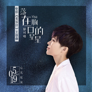

落在胸口的星星
============================

|  |  |
| :--: | :-- |
| [ 落在胸口的星星](https://emumo.xiami.com/album/2102748053) | **艺人**: [郁可唯](../index.md) **语种**: 国语 **唱片公司**: 听见时代 **发行时间**: 2017年05月15日 **专辑类别**: EP, 单曲 **专辑风格**: 国语流行 Mandarin Pop, 电影原声 Film Score **播放数**: 5232372 **收藏数**: 298 **评论数**: 46  |

## 简介

睡不着时想念的人，盛夏光年许过的愿  
夜再晚，花一样会开  
道出女人心事 绽放最美爱情  
《落在胸口的星星》|电影《美容针》主题曲    
  
郁可唯动人情歌 让爱温柔前行  
《落在胸口的星星》|电影《美容针》主题曲  
5月15日正式曝光  
  
“百合”再续“星星”情缘 花期迟开不负真爱  
  
由闫妮、杜天皓主演的治愈系情感喜剧《美容针》将于5月19日与全国观众见面。今日，片方曝光了暖心主题曲《落在胸口的星星》，歌曲由“灵魂歌者”郁可唯走心献唱，歌声婉转深情，直击人心，诉说了一段埋藏在《美容针》里的细腻情思，鼓励女性找回青春意气，勇敢奔赴爱情。影片中，小说《落在胸口的星星》由红极一时的人气作家夏百合（闫妮饰）所著，也正是因为这本小说牵起“百合”与小健（杜天皓饰）的一段奇妙情缘，《落在胸口的星星》成就过去的她，也成全现在的她。而主题曲《落在胸口的星星》，正是以女主的视角展开，即使面对事业的不顺、生活的挑衅，她仍选择迎难而上，继续担负起家庭责任。同时，百合始终对爱情保有无声的希冀，还是那个内心柔软，相信一期一会的“可爱女人”。她不放弃，不辜负，努力在贫瘠的现实里，绽放最美的姿态。“爱是我漫长的孤单 也是我最后的勇敢 情歌说没那么简单 或许也没有你想象的难 ”，用温暖的歌声道出成长记忆，让有相同经历的女性充满力量继续前行。  
  
  
情歌“金三角”再度携手 郁可唯绽放发声  
作为华语乐坛实力女歌手，从《小时代》推广曲《时间煮雨》的一炮而红，到2017年开年献声《大唐荣耀》、《三生三世十里桃花》《择天记》等，郁可唯一直是热门影视歌曲炙手可热的演绎者。本片的主题曲制作和发行公司听见时代为了更好地讲述电影《美容针》中的女主角“少女百合”闫妮矛盾体的多种真实情感，力邀曾合作过《时光正好》的“金三角”制作人金大洲、词人唐恬与郁可唯再度携手，深情抚摸每一位听众心底最柔软的角落。完美演绎了面对事业和家庭，那些把真实的情感深埋心底却对爱情充满憧憬的“可爱女人”心事。郁可唯治愈人心的嗓音以及捕获人心的声音气场，柔情中透着坚韧，歌曲伊始，郁可唯低吟浅唱，“看灯火明了又暗，像遗憾浓了又淡。他借走青春没还，那年星光下的呼喊站在对岸那个女孩，快要和我走散。”极具画面感的歌词搭配郁可唯的动情演唱，似女生低首追忆青葱爱情般呢喃自语。歌曲行至高潮处，“原来梦一直没离开，像落在我胸口的星星，它说亲爱的女孩夜再晚，花一样会开。”梦幻般的倾诉回落关照女孩内心。歌词像女生深夜摊开感情的伤口，而在郁可唯婉转治愈的歌声中，却又将希望慢慢治愈的坚强展现得淋漓尽致。郁可唯也对这首主题曲的演绎感触颇深：”生活中会遇到不同的人，其实每一次都是很奇妙的缘分，也正是因为这样的相遇让我们的人生更精彩，学会珍惜和勇敢。”  
  
  
由万达影视传媒有限公司出品、北京大国文化传播有限公司联合出品，博众未来文化传媒承制的电影《美容针》将于5月19日温情绽放，让我们一起重拾勇气继续在爱里走下去。

## 曲目

- [落在胸口的星星MV电影《美容针》主题曲](./2102748053/8HOsXaf3ea9.md)

## 评论

|  |  |  |
| :-- | :-- | :-- |
|  [虾米用户](https://emumo.xiami.com/u/98372784) 我们从未不认识 2018-05-18 07:49 赞(0) 踩(0) | 
最最最爱的一首歌
 |
|  [虾米用户](https://emumo.xiami.com/u/100199124) 微微风  涌起旧梦 2018-02-26 11:35 赞(0) 踩(0) | 
表白郁可唯
 |
|  [虾米用户](https://emumo.xiami.com/u/2469312) Keep on beli... 2018-01-30 04:15 赞(1) 踩(0) | 
喜欢她唱的&amp;ldquo;独家记忆&amp;rdquo;
 |
|  [虾米用户](https://emumo.xiami.com/u/37947614)  2017-09-08 12:39 赞(0) 踩(0) | 
好听好听
 |
|  [虾米用户](https://emumo.xiami.com/u/30090821) 我还没想好要写什么... 2017-08-05 21:28 赞(0) 踩(0) | 
棒
 |
|  [虾米用户](https://emumo.xiami.com/u/84571136) 唯有音乐不离不弃 2017-07-27 17:09 赞(0) 踩(0) | 
<a href="http://emumo.xiami.com/u/2871" target="_blank" rel="nofollow" name_card="2871">@虾小编</a> 0601 <a href="https://itunes.apple.com/au/album/" target="_blank" rel="nofollow noreferrer noopener">https://itunes.apple.com/au/album/</a>落在胸口的星星-電影-美容針-主題曲/id1239951256?i=1239951273&amp;ign-mpt=uo%3D4
 |
|  [虾米用户](https://emumo.xiami.com/u/36532720) 你好呀…… 秦岚。 2017-07-11 21:57 赞(1) 踩(0) | 
感动到心里
 |
|  [虾米用户](https://emumo.xiami.com/u/306674840)  2017-06-23 10:24 赞(1) 踩(0) | 
拥有自己声音的独特，喜欢
 |
|  [虾米用户](https://emumo.xiami.com/u/51667076) 起风了，唯有努力生存。 2017-06-20 08:50 赞(0) 踩(0) | 
唱的就是郁可唯自己吧
 |
|  [虾米用户](https://emumo.xiami.com/u/44415517) 寻几处好景破星光，觅几句... 2017-06-13 19:26 赞(0) 踩(0) | 
爱是我漫长的孤单，也是我最厚的勇敢
 |
|  [虾米用户](https://emumo.xiami.com/u/231928672) 天真岁月不忍欺 青春荒唐... 2017-06-11 00:16 赞(1) 踩(0) | 
词和曲都很好，郁可唯的歌声没话说，赞
 |
|  [虾米用户](https://emumo.xiami.com/u/45274502)  2017-06-10 23:42 赞(0) 踩(0) | 
棒
 |
|  [虾米用户](https://emumo.xiami.com/u/274545259)  2017-06-09 13:52 赞(0) 踩(0) | 
喜翻可唯
 |
|  [虾米用户](https://emumo.xiami.com/u/8926360) 你.. 就.不要.想起我... 2017-06-09 10:25 赞(1) 踩(0) | 
歌曲由&amp;ldquo;灵魂歌者&amp;rdquo;郁可唯走心献唱，歌声婉转深情，直击人心，诉说了一段埋藏在《美容针》里的细腻情思，鼓励女性找回青春意气，勇敢奔赴爱情。
 |
|  [虾米用户](https://emumo.xiami.com/u/54117184) 惊喜就如梦幻的电影 2017-06-01 13:54 赞(1) 踩(0) | 
甜蜜温暖舒服
 |
|  [虾米用户](https://emumo.xiami.com/u/28574341)  2017-06-01 13:04 赞(0) 踩(0) | 
很喜欢的旋律，少女心事由浅入深！
 |
|  [虾米用户](https://emumo.xiami.com/u/246990007)   2017-05-30 08:36 赞(0) 踩(0) | 
好棒
 |
|  [虾米用户](https://emumo.xiami.com/u/37052869) 你是我一首 唱不完的歌 2017-05-28 00:20 赞(0) 踩(0) | 
好好听⭐⭐
 |
|  [虾米用户](https://emumo.xiami.com/u/244982595)  2017-05-25 17:29 赞(0) 踩(0) | 
好听好听
 |
|  [虾米用户](https://emumo.xiami.com/u/259018467)  2017-05-20 18:33 赞(0) 踩(0) | 
爱你，永远。
 |
|  [虾米用户](https://emumo.xiami.com/u/140105802)   2017-05-20 14:43 赞(1) 踩(0) | 
好听 
 |
|  [虾米用户](https://emumo.xiami.com/u/277884686)  2017-05-19 23:26 赞(2) 踩(0) | 
郁可唯是我的青春
 |
|  [虾米用户](https://emumo.xiami.com/u/293777887)  2017-05-19 16:53 赞(21) 踩(0) | 
郁可唯吐字 气声 都是特色啊
 |
|  [虾米用户](https://emumo.xiami.com/u/253229423)  2017-05-19 09:52 赞(0) 踩(0) | 
郁可唯 你是 星星   
 |
|  [虾米用户](https://emumo.xiami.com/u/54440334)   2017-05-18 17:24 赞(4) 踩(0) | 
郁可唯声线很不错，又稳定，就是缺少一些代表歌曲
 |
|  [虾米用户](https://emumo.xiami.com/u/36962122)  2017-05-17 23:23 赞(2) 踩(0) | 
爱是我漫长的孤单， 也是我最后的勇敢，  歌词非常贴电影， 郁可唯就适合演绎这样风格的歌曲， 非常有感觉！词曲都是上乘之作，郁可唯的又一金曲！
 |
|  [虾米用户](https://emumo.xiami.com/u/240800661)   2017-05-17 22:42 赞(0) 踩(0) | 
哎！听这歌，很想你&amp;hellip;&amp;hellip;
 |
|  [虾米用户](https://emumo.xiami.com/u/178775438) 顺流而下，可见伊人。 2017-05-17 03:14 赞(1) 踩(0) | 
我是搞摄影的，郁可唯的声音和她的曲风套用摄影里的话来说我自认为太&amp;ldquo;沙龙化&amp;rdquo;了。就像那些好看却又缺乏灵魂的照片一样。
 |
|  [虾米用户](https://emumo.xiami.com/u/48695096)   2017-05-16 22:15 赞(1) 踩(0) | 
感觉郁可唯出的歌就是朗朗上口
 |
|  [虾米用户](https://emumo.xiami.com/u/6276944)  噗 2017-05-16 11:17 赞(0) 踩(0) | 
个人觉得郁可唯最大的问题是声音辨识度太低。
 |
|  [虾米用户](https://emumo.xiami.com/u/289770915)  2017-05-16 07:01 赞(4) 踩(0) | 
很好听的声音， 很会唱歌， 可是， 就是没有自己的风格， 又一个给垃圾唱片公司害死的歌手， 其实， 今天会唱歌的人到处都是， 能有灵性，找到自己风格， 还又坚持的下来的， 真是没几个。
 |
| ⇒ |  [虾米用户](https://emumo.xiami.com/u/300638431)  2017-05-30 23:57 赞(0) 踩(0) | 
你听她专辑了吗?她对音乐很有自己的想法，推荐【00:00】和【温水】，质量真的不错
 |
|  [虾米用户](https://emumo.xiami.com/u/3228150)  2017-05-16 04:56 赞(0) 踩(0) | 
真不错！！！
 |
|  [虾米用户](https://emumo.xiami.com/u/53563252) 其实我比你爱我更爱你 2017-05-16 00:25 赞(0) 踩(0) | 
比心 
 |
|  [虾米用户](https://emumo.xiami.com/u/8244559)  2017-05-16 00:09 赞(0) 踩(0) | 
******
 |
|  [虾米用户](https://emumo.xiami.com/u/51722388) 风沙星辰 永远相伴 2017-05-15 22:14 赞(0) 踩(0) | 
就是好听   
 |
|  [虾米用户](https://emumo.xiami.com/u/221918279) 专业听歌户。。。 2017-05-15 20:27 赞(0) 踩(0) | 
喜欢   
 |
|  [虾米用户](https://emumo.xiami.com/u/221918279) 专业听歌户。。。 2017-05-15 20:27 赞(0) 踩(0) | 
好听
 |
|  [虾米用户](https://emumo.xiami.com/u/3385222) 明明不是男神 2017-05-15 19:47 赞(0) 踩(0) | 
情歌说没那么简单，或许也没有你想象的难。
 |
|  [虾米用户](https://emumo.xiami.com/u/124515996)  2017-05-15 17:13 赞(0) 踩(0) | 
赶紧下载
 |
|  [虾米用户](https://emumo.xiami.com/u/68081894) 头像是女朋友。 2017-05-15 13:16 赞(1) 踩(0) | 
郁可唯今年好多影视曲哦
 |
|  [虾米用户](https://emumo.xiami.com/u/248004122)  2017-05-15 13:15 赞(0) 踩(0) | 
超级好听！
 |
|  [虾米用户](https://emumo.xiami.com/u/25795187)  2017-05-15 13:09 赞(0) 踩(0) | 
啦啦啦，前排，表白女神
 |
|  [虾米用户](https://emumo.xiami.com/u/37136857) 原谅不美好。 2017-05-15 12:57 赞(0) 踩(0) | 
郁可唯 灵魂唱将 
 |
|  [虾米用户](https://emumo.xiami.com/u/272392912) 欧美控 2017-05-15 12:43 赞(0) 踩(0) | 
好棒
 |
|  [虾米用户](https://emumo.xiami.com/u/36253461) 你快乐 所以 我快乐 2017-05-15 11:26 赞(24) 踩(0) | 
郁可唯最看好的歌手，有这个潜力成为华语乐坛下一个林忆莲
 |
