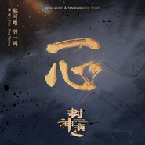

一心
============================

|  |  |
| :--: | :-- |
| [ 一心](https://emumo.xiami.com/album/2104795358) | **艺人**: [郁可唯](../index.md) **语种**: 国语 **唱片公司**: 谭旋音乐工作室 **发行时间**: 2019年04月08日 **专辑类别**: 原声带, 影视音乐 **专辑风格**: 电视原声 Television Music **播放数**: 1150 **收藏数**: 13 **评论数**: 3  |

## 简介

郁可唯、曾一鸣献唱电视剧《封神演义》主题曲《一心》 纵然人生殊途，也要一心守护  
随缘随分出尘林，似水如云一片心。  
这一生一片痴心，怎教殊途而无结果。  
可不论怎样，爱了便无悔。  
郁可唯、曾一鸣倾情献唱电视剧《封神演义》主题曲《一心》  
【希瓜音乐•上海谭旋音乐工作室】制作发行  
【李雪漫 × 谭旋 × 韦国赟】携手助阵，描绘殊途爱情的永恒。  
诺不移 誓不变 聚散也无畏  
用一生 绕一圈  
才后悔 才追悔 才不悔  
你我本殊途，这样的爱情在这个狼烟弥漫的世界根本无法立足。该做的都做了，该发的誓也都发了，这一生，兜兜转转，明争暗斗，好话说尽又能怎样？在这样的状态下，唯有跟随自己的心，守护好自己想保护的东西才能不枉这一遭。如今，一心只对一个人，只能是我对你唯一的誓言了。  
【郁可唯 × 曾一鸣 × 李雪漫 × 谭旋 × 韦国赟】纵然人生殊途，也要一心守护。  
郁可唯、曾一鸣首次共同携手谭旋音乐工作室，为电视剧《封神演义》打造主题曲《一心》。歌曲由李雪漫作词，谭旋作曲，韦国赟编曲。歌词丰富动人，旋律委婉缱绻，用男女对唱形式将男女主的心情描绘，用誓言将今生的缘分道尽。  
该歌曲词曲、录音、录像作品版权均属上海希瓜音乐制作有限公司所有或被授权使用，未经上海希瓜音乐制作有限公司书面授权，严禁以任何方式使用。

## 曲目

- [一心电视剧《封神演义》主题曲](./2104795358/8IQCxffa502.md)

## 评论

|  |  |  |
| :-- | :-- | :-- |
|  [虾米用户](https://emumo.xiami.com/u/404960865) 爱音乐  ，爱生活 2020-03-22 02:55 赞(0) 踩(0) | 
喜欢
 |
|  [虾米用户](https://emumo.xiami.com/u/214670064)  2019-04-30 22:01 赞(0) 踩(0) | 
前几天搜不到，今天搜到无版权
 |
|  [虾米用户](https://emumo.xiami.com/u/75041556) 有趣的灵魂 2019-04-22 10:46 赞(0) 踩(0) | 
版权呢我
 |
