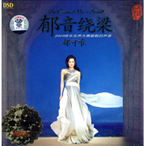

郁音绕梁
============================

|  |  |
| :--: | :-- |
| [ 郁音绕梁](https://emumo.xiami.com/album/351292) | **艺人**: [郁可唯](../index.md) **语种**: 国语 **唱片公司**: 东升文化 **发行时间**: 2009年09月03日 **专辑类别**: 录音室专辑 **专辑风格**: 国语流行 Mandarin Pop **播放数**: 488844 **收藏数**: 405 **评论数**: 47  |

## 简介

2009快乐女声大赛最靓的声音，通透圆润的音色，高超完美的技巧，入情入境，郁品郁香。  
  
她，一次次用歌声震撼着我们的心灵，每一次演绎都令人沉醉其中；  
她，让许多专业音乐人、歌手、文人如获至宝，纷纷在媒体、博客上不吝赞美之词；  
她，舞台上高雅迷人、沉稳大气，生活中搞怪可爱、时尚潮人。  
  
她的歌声直击心灵，感动灵魂；  
她的歌娓娓动听，就像夜莺一般；  
她，就是——灵魂唱将郁可唯。

## 曲目

- [爱很简单](./351292/xLpnAybe2b3.md)
- [爱似烟火](./351292/8GamyZed8bc.md)
- [别太晚回家](./351292/xLpnA01014f.md)
- [爱我别走](./351292/mQ4oLR680eb.md)
- [哭泣的玫瑰](./351292/mQ4oLS6f0d0.md)
- [你走进了她的房间](./351292/mQ4oLTcfef5.md)
- [爱忧伤](./351292/mQ4oLU6a6d8.md)
- [突然的自我](./351292/U56kcp2b01b.md)
- [分手后就不要再回头](./351292/mQ4oLWb52e4.md)
- [稻香](./351292/8Gamzhe4452.md)
- [如果这都不算爱](./351292/mQ4oLY81e8f.md)
- [月半弯](./351292/bqvchF33b534.md)

## 评论

|  |  |  |
| :-- | :-- | :-- |
|  [虾米用户](https://emumo.xiami.com/u/368916693)  2018-06-08 17:14 赞(0) 踩(0) | 
《突然的自我》《如果这都不算爱》。。可惜不能听
 |
|  [虾米用户](https://emumo.xiami.com/u/368916693)  2018-06-08 09:03 赞(0) 踩(0) | 
郁可唯可以 翻唱了两首伍佰的作品  
 |
|  [虾米用户](https://emumo.xiami.com/u/27969771)  2017-11-08 23:41 赞(0) 踩(0) | 
什么时候才能听啊哭唧唧
 |
|  [虾米用户](https://emumo.xiami.com/u/247303800)   2017-03-19 17:38 赞(0) 踩(0) | 
我还以为是我的专辑
 |
|  [虾米用户](https://emumo.xiami.com/u/4268650) 我还没想好要写什么... 2017-03-02 23:50 赞(0) 踩(0) | 
怎么不让听了
 |
|  [虾米用户](https://emumo.xiami.com/u/9404659)  2015-11-30 23:18 赞(1) 踩(0) | 
這封面誤了多少人找到這張好專輯
 |
|  [虾米用户](https://emumo.xiami.com/u/45740265) 暂无签名~到头来，还是一... 2015-03-14 19:18 赞(0) 踩(0) | 
再度聆听
 |
| ⇒ |  [虾米用户](https://emumo.xiami.com/u/49695683)  2015-04-30 01:46 赞(0) 踩(0) | 
ptmt
 |
|  [虾米用户](https://emumo.xiami.com/u/9926785)  2014-10-14 09:46 赞(0) 踩(0) | 
喜欢
 |
|  [虾米用户](https://emumo.xiami.com/u/4019670)   2014-07-31 16:14 赞(0) 踩(0) | 
原来她还有留过长发，我印象里她一直是短发的
 |
|  [虾米用户](https://emumo.xiami.com/u/32752354) gt2008 2014-07-07 13:32 赞(0) 踩(0) | 
声音
 |
|  [虾米用户](https://emumo.xiami.com/u/30916393) 暂无签名~ 2014-07-05 15:37 赞(0) 踩(0) | 
声音好美,静静的
 |
|  [虾米用户](https://emumo.xiami.com/u/25692151)  2014-06-28 16:13 赞(0) 踩(0) | 
好温柔。。。。。。用耳机听，像在耳边说话
 |
|  [虾米用户](https://emumo.xiami.com/u/2735827)  2014-06-26 18:24 赞(0) 踩(0) | 
从这儿开始 唱法和感觉都不一样了 以前太甜了
 |
|  [虾米用户](https://emumo.xiami.com/u/30194592)  2014-06-04 06:48 赞(0) 踩(0) | 
喜欢这版的&amp;lt;月半弯&amp;gt;.
 |
|  [虾米用户](https://emumo.xiami.com/u/33763498)  2014-05-18 14:08 赞(0) 踩(0) | 
太好了！
 |
|  [虾米用户](https://emumo.xiami.com/u/15800398)   2013-08-21 03:40 赞(0) 踩(0) | 
温柔纾缓
 |
|  [虾米用户](https://emumo.xiami.com/u/8366749)  2012-08-22 05:32 赞(0) 踩(0) | 
好聽~
 |
|  [虾米用户](https://emumo.xiami.com/u/7053540)  2012-06-16 08:52 赞(0) 踩(0) | 
以前听过，声音好，会唱歌
 |
|  [虾米用户](https://emumo.xiami.com/u/6474145)  2012-04-03 20:40 赞(0) 踩(0) | 
超喜欢
 |
|  [虾米用户](https://emumo.xiami.com/u/8269057)  2012-03-03 13:43 赞(0) 踩(0) | 
小清新
 |
|  [虾米用户](https://emumo.xiami.com/u/812392) 【封面控】毛驴牌❤小众好... 2012-02-17 13:50 赞(1) 踩(0) | 
哭泣的玫瑰 怎么听起来那么灰主流
 |
|  [虾米用户](https://emumo.xiami.com/u/812392) 【封面控】毛驴牌❤小众好... 2012-02-17 13:35 赞(0) 踩(0) | 
郁可唯翻唱的一张集子，还挺喜欢的！
 |
|  [虾米用户](https://emumo.xiami.com/u/5384053)  2011-08-11 16:49 赞(0) 踩(0) | 
真的好喜欢
 |
|  [虾米用户](https://emumo.xiami.com/u/1515293)  2011-08-03 17:05 赞(0) 踩(0) | 
不错
 |
|  [虾米用户](https://emumo.xiami.com/u/3553362)  2011-07-19 01:18 赞(0) 踩(0) | 
喜欢可唯姐，永远支持你
 |
|  [虾米用户](https://emumo.xiami.com/u/4109571)  2011-06-20 15:06 赞(1) 踩(0) | 
张靓影和郁可唯，当初都不是第一名，看看现在的发展。有实力不怕。
 |
|  [虾米用户](https://emumo.xiami.com/u/4015140)  2011-05-21 18:46 赞(0) 踩(0) | 
顶,郁可唯,加油,永远支持你
 |
|  [虾米用户](https://emumo.xiami.com/u/574193) 不以物喜不以己悲 2011-05-19 18:09 赞(0) 踩(0) | 
这张专辑拖累了郁可唯的入围！唉～～
 |
|  [虾米用户](https://emumo.xiami.com/u/3746513)  2011-04-26 17:18 赞(0) 踩(0) | 
喜欢郁可唯的声音~
 |
|  [虾米用户](https://emumo.xiami.com/u/2568626)   2011-04-20 20:12 赞(0) 踩(0) | 
郁音绕梁~·~。~~。
 |
|  [虾米用户](https://emumo.xiami.com/u/3628572)  2011-04-16 17:21 赞(0) 踩(0) | 
好听！
 |
|  [虾米用户](https://emumo.xiami.com/u/1012114)  2010-07-26 14:34 赞(0) 踩(0) | 
一直都支持郁可唯，呵呵
 |
|  [虾米用户](https://emumo.xiami.com/u/660388)  2010-05-17 09:58 赞(0) 踩(0) | 
竹不如絲，絲不如肉~~
 |
|  [虾米用户](https://emumo.xiami.com/u/429161)   2010-03-10 00:04 赞(0) 踩(0) | 
马克
 |
|  [虾米用户](https://emumo.xiami.com/u/505672)  2010-01-14 09:44 赞(0) 踩(0) | 
怎么才一点点粉丝，歌声很清，好听
 |
|  [虾米用户](https://emumo.xiami.com/u/522205) 一切很美，音為有你﹏ 2009-12-28 09:44 赞(0) 踩(0) | 
真的是她吗 感觉没超女比赛上的真实 声音技巧都无挑剔 就是差点那情绪 那感觉 —— 常人的情绪和感觉 ..
 |
| ⇒ |  [虾米用户](https://emumo.xiami.com/u/649937)  2010-02-23 23:35 赞(0) 踩(0) | 
这是可唯以前发的发烧碟，发烧歌曲的唱法就是这样的。说实话可唯也不喜欢自己出的发烧碟，没办法是朋友推荐去录的
 |
| ⇒ |  [虾米用户](https://emumo.xiami.com/u/522205) 一切很美，音為有你﹏ 2010-02-24 00:36 赞(0) 踩(0) | 
<q><b>June☆S说：</b></q>
 |
| ⇒ |  [虾米用户](https://emumo.xiami.com/u/649937)  2010-02-24 00:44 赞(0) 踩(0) | 
<q><b>然说：</b></q>
 |
| ⇒ |  [虾米用户](https://emumo.xiami.com/u/522205) 一切很美，音為有你﹏ 2010-02-24 00:57 赞(0) 踩(0) | 
<q><b>June☆S说：</b></q>
 |
| ⇒ |  [虾米用户](https://emumo.xiami.com/u/649937)  2010-02-24 01:21 赞(0) 踩(0) | 
<q><b>然说：</b></q>
 |
| ⇒ |  [虾米用户](https://emumo.xiami.com/u/522205) 一切很美，音為有你﹏ 2010-02-24 01:39 赞(0) 踩(0) | 
<q><b>June☆S说：</b></q>
 |
| ⇒ |  [虾米用户](https://emumo.xiami.com/u/687883) MusicTheBest 2011-05-26 14:57 赞(0) 踩(0) | 
通过你的几处发言可以判断出，你就是1SB,鉴定完毕。
 |
| ⇒ |  [虾米用户](https://emumo.xiami.com/u/522205) 一切很美，音為有你﹏ 2011-05-26 23:25 赞(0) 踩(0) | 
<q><b>薄荷蓝说：</b></q>
 |
|  [虾米用户](https://emumo.xiami.com/u/389940)  2009-11-25 17:47 赞(0) 踩(0) | 
很多歌点开变成了另外一首啊~~~~麻烦修复一下。。
 |
|  [虾米用户](https://emumo.xiami.com/u/468753)  2009-10-28 01:31 赞(0) 踩(0) | 
通透圆润的音色，高超完美的技巧，入情入境，郁品郁香。
 |
