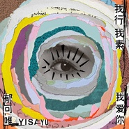

郁可唯
============================

|  |  |
| :--: | :-- |
| [ 郁可唯](https://i.xiami.com/yisa) | **播放数**: 196598432 **粉丝数**: 107345 **评论数**: 1480 **地区**: China 中国大陆 **风格**: 国语流行 Mandarin Pop  |

## 档案

郁可唯 (Yisa Yu)，内地乐坛偶像与实力兼备的人气唱将，滚石唱片内地主力女歌手。2009年湖南卫视快乐女声全国四强，对各种曲风驾驭自如，得到国内外知名音乐人赞赏。郁可唯美音纯净，气质清纯，扎实的唱功、清亮、穿透人灵魂的嗓音让人赞叹，受到众多音乐人的赞美，被誉为“灵魂唱将”。《微加幸福》《失恋事小》三张专辑皆创佳绩，屡屡斩获各音乐颁奖典礼重大奖项。热门曲目：时间煮雨、指望、暖心等。         小档案   中文名：郁可唯    原名：郁英霞   昵称：小郁、小可、可唯    英文名：Yisa Yu   籍贯：四川成都    出生地：四川成都    祖 籍：江苏兴化    生日：1983年10月23日    星座：天秤座    学校：电子科技大学    专业：英语    学历：大学本科    身高：168cm    体重：45kg    才艺：舞蹈，唱歌，词曲创作    粉丝名：郁金香   主要成就：音乐风云榜新人盛典最佳女演唱人、音乐先锋榜内地最受欢迎女歌手、中国娱乐星锐榜最佳女歌手、MusicRadio榜内地年度最佳新人 马来西亚MY Astro海外演绎女歌手、蝉联两届MR榜校园人气女歌手、2011城市之音至尊金榜年度冠军后百度娱乐沸点内地热门新晋女歌手   喜欢歌手：陈绮贞，方大同，BEYONCE等    喜欢食物：海苔，火锅，串串，肥肠，樱桃，西瓜，酸奶等    喜欢颜色：桃红色 (粉红色)   喜爱歌曲：包小柏《神啊 救救我》、申宝峰《嫁给我没有错》、许常德《如果云知道》、李安修《忘情水》    唱片公司：滚石唱片 (2009年12月18日)，华研国际 (2017年11月20日-)   经纪公司：天娱传媒         早年经历    出生于成都的郁可唯在上幼儿园时便开始登台表演。 1997年10月， 郁可唯获得了成都市中学生健美操比赛的第三名。此后，她还参加了人生的第一次唱歌比赛   2001 年 2 月，郁可唯被主持人程前选为北京电视台《欢乐总动员》超级模仿秀选手，并在成都赛区顺利晋级；同年 4 月，郁可唯在《欢乐总动员》 超级模仿秀北京总决赛中获得了比赛的第二名和过关奖；同年 7 月，郁可唯又获得了成都市健美操及健身小姐 ( 先生 ) 锦标赛的第五名；同年 9 月，郁可唯还获得了李玟真情奉献 2001 成都演唱会暨李玟模仿秀的演唱优秀奖    2002 年 12 月，考入成都电子科技大学英语系的郁可唯获得了校友杯校园卡拉 OK 大赛的二等奖。之后，她和两个男生组成乐队，自己则担任主唱，在随后的一段时间里，她们接连获得了蓉城大学生歌手比赛第三名和全国大学生校园歌手大赛金奖的不俗成绩。 2003 年，郁可唯开始在成都的莲花府邸音乐酒吧担任驻唱歌手         演艺经历    2003 年， 20 岁的郁可唯参加了综艺选秀《艺星制造》，并入围到了最终的决赛。 2006 年，郁可唯首次参加了湖南卫视《超级女声》的比赛，并获得了广州唱区 20 强的成绩   2008 年 4 月，郁可唯推出了个人的首张发烧音乐专辑《百乐门》；同年 9 月，郁可唯又推出了第二张发烧专辑《茴香小酒馆》    2009 年 6 月 5 日，郁可唯再一次参加了湖南卫视《快乐女声》海选比赛，并成功晋级全国 20 强； 6 月 26 日参加全国 10 强突围赛，以一首《 Angel 》晋级全国 10 强； 8 月 28 日进入全国 4 强进 3 强比赛的终极 PK 赛，并最终获得了全国总决赛第四名的成绩；同年 9 月，郁可唯还推出了《郁音绕梁》翻唱精选辑；此后，郁可唯签约滚石唱片公司，从而也正式开始了个人的职业歌手生涯   2010 年 5 月，郁可唯发行了个人的首张正式音乐专辑《蓝短裤》，专辑收录了包括悲伤情歌《指望》、甜蜜抒情歌《暖心》在内的十首歌曲，郁可唯也凭借此专辑获得了 MusicRadio 中国 TOP 排行榜的内地最佳新人以及年度金曲奖；同年 12 月，郁可唯参加了在台北小巨蛋举办的快乐天堂滚石 30 演唱会，并在演唱会上独唱了梁静茹的代表作品《宁夏》   2011 年 5 月，郁可唯又参加了快乐天堂滚石 30 北京演唱会，并独唱了陈淑桦的代表曲目《滚滚红尘》；同年，郁可唯还凭借演唱台湾偶像剧《犀利人妻》的插曲《指望》进军台湾歌坛，并连续两个月获得 KKBOX 单曲排行榜冠军；之后，凭借全台湾偶像剧收视冠军《犀利人妻》的影响力，郁可唯演唱的两首插曲《指望》和《暖心》也获得了台湾 KKBOX 数位榜、 ezPeer 点播榜、以及远传 900 来电答铃榜三大音乐排行榜的冠军；同年 4 月 13 日，郁可唯和林凡在台北 Legacy 举办犀利女声庆功演唱会，而随着电视剧《犀利人妻》在全亚洲的播出，郁可唯也将个人的演唱事业拓展到了海外   2012 年，郁可唯发行了第二张个人专辑《微加幸福》，其中的都会体情歌《微加幸福》、《伤不起》、《好朋友只是朋友》三首歌也再次受到台湾偶像剧的青睐，并被选为了偶像剧收视冠军《小资女孩向前冲》的片尾曲和插曲；而其中的《微加幸福》则再次获得了台湾 KKBOX 数位榜、 ezPeer 点播榜、远传 900 来电答铃榜的冠军，并连续获得了 KKBOX 单曲和专辑排行榜的冠军；同年，郁可唯还凭借此专辑的主打歌《伤不起》获得了包括中国歌曲排行榜；东方风云榜；城市之音至尊金榜；中联榜的单曲冠军在内的多个奖项；同年 4 月 28 日，郁可唯参加了此间的少年高晓松作品全国巡回演唱会北京站，并独唱了歌曲《立秋》和《春分》，另外郁可唯还和高晓松合唱了歌曲《一叶知秋》；同年 8 月，郁可唯发行了第三张个人专辑《失恋事小》，并凭借此专辑以及专辑同名主打歌获得了包括中国歌曲排行榜的年度十大金曲； cityfm 城市至尊音乐榜年度冠军后和年度二十大金曲在内的三个奖项。   2013 年，郁可唯凭借专辑《失恋事小》及同名主打歌获得了 Musicradio 音乐之声中国 TOP 排行榜内地年度传媒推荐女歌手和年度最佳单曲奖；随后，郁可唯还为郭敬明执导的电影《小时代》演唱了官方宣传曲《时间煮雨》，并凭借此曲获得了第四届乐视盛典年度电影金曲奖；同年 5 月，郁可唯参加安徽卫视音乐对战节目《我为歌狂》，并与罗中旭、伍思凯、纪敏佳组成蓝队，在经过 12 场比赛的厮杀后，最终蓝队成为《我为歌狂》第一季度的冠军战队   2014 年，郁可唯相继配唱了情感剧《妻子的秘密》的片尾曲《最爱的人》和仙侠剧《古剑奇谭》的片尾曲《远方》；之后，郁可唯又凭借《时间煮雨》获得了十年音乐盛典最热搜索奖；同年 6 月，郁可唯在经过两年的沉淀和准备之后发行了个人的第四张专辑《温水》，并在专辑中尝试了不同于以往的音乐风格，郁可唯则凭借此专辑及主打歌《原谅不美好》获得了城市至尊音乐榜的年度听众最爱女歌手 、空中热播单曲和二十大金曲奖；同年 9 月 8 日，郁可唯又受邀参加了苏州月·中华情 - 中央电视台中秋晚会，并与台湾歌手伍思凯搭档演唱了晚会的主题曲《海上明月》；随后，郁可唯相继在北京和广州举办了其音乐生涯首次《郁可唯自画像个人演唱会》；此外，郁可唯还担任了校园之星全国歌手选拔赛西安分赛区的导师工作   2015 年，郁可唯相继为都市偶像剧《只因单身在一起》配唱了插曲《我们都爱过》；为民国情仇剧《活色生香》配唱了凄婉风格主题曲《恋香》；同年 5 月，郁可唯又凭借专辑《温水》及专辑主打歌《原谅不美好》获得 MusicRadio 中国 TOP 排行榜的六项提名，并最终赢得了内地年度最佳女歌手，内地最佳编曲和年度金曲的三项荣誉；同年 6 月，郁可唯参加了江西卫视金曲互动沙龙秀《超级歌单》，并凭借邓丽君的代表作《情人的关怀》成为第一位入选“超级歌单”大碟的歌手 ；同年 7 月，郁可唯举办了《这些天的一天 - 情歌经典演唱会》；同年 9 月 26 日，郁可唯参加了在成都举行的“全球赏花盛典”，她现场演唱了歌曲《芙蓉花开》，并被授予了“芙蓉大使”的称号；同年 12 月 16 日，郁可唯参加了中国 - 东盟友谊歌会”，而她则作为中方歌手代表演唱了歌曲《绒花》；同年年底，郁可唯还参加了四川卫视“花开天下”新春演唱会，并献唱了包括个人代表作《时间煮雨》在内的多首曲目   2016 年，郁可唯为玄幻传奇剧《青丘狐传说》演唱了主题曲《问明月》；并于随后助阵真人秀节目《燃烧吧少年！》的冲刺赛，分别与两队少年完成“对唱冲刺”；同年 2 月，郁可唯先是参加了江苏卫视猴年春晚，并演唱了道出游子浓浓思乡情的歌曲《月光》；之后，她又参加了央视元宵晚会，并与众多艺人共同演唱了同名真人秀主题曲《叮咯咙咚呛》；同年 3 月 22 日，郁可唯澜沧江 - 湄公河合作首次领导人会议欢迎晚会，并首度使用泰语献唱了民谣《相思河畔》；同年 4 月，郁可唯除了获得“中国时尚自媒体大赏先锋跨界音乐人”奖项外；她还为魔幻剧《半妖倾城》献唱了主题曲《 We are One 》；同年 5 月，郁可唯又为青春剧《柠檬初上》演唱了片尾曲《爱情是青春的旅行》；同年 6 月，她还参加了江苏卫视特别节目《端午金曲捞》，并在现场与原唱者徐怀钰合作演绎歌曲《温习》；随后，郁可唯还受邀出席了上海国际电影节亚洲新人奖颁奖典礼；作为表演嘉宾出席了第 16 届中国电影华表奖颁奖典礼，并与阿卓、贝贝、柏文压轴演唱歌曲《未来中国》；同年 7 月，除了作为评委助阵滚石原创乐团大赛总决赛；她还出席了《诛仙青云志》 仙侠盛典，并现场演绎了“凡瑶”催泪曲《青衣谣》；与此同时，郁可唯还为电影《夏有乔木雅望天堂》献唱了暖心推广曲《时光正好》；9月，她又为谍战剧《麻雀》献唱了推广曲《风中芭蕾》；10月，郁可唯在音乐悬疑竞猜类真人秀《蒙面唱将猜猜猜》节目中以&哈哈一笑很倾城“的形象完成三战，最终在第九期揭面；11月，郁可唯一举获得了华语金曲奖我最喜爱的影视女歌手、专业推介歌曲 (《爱情是青春的旅行》)、最具旅行精神艺人三项荣誉；12月，她还获得了健康榜样颁奖盛典健康榜样年度先锋明星奖；年底，郁可唯正式推出了历时两年雕琢的第五张个人音乐专辑《00:00》，而专辑的概念则是唤醒时间的自由意识，感悟自由时空中的流动与静止，同时也是郁可唯在音乐旅程中的全新起点   2017年，郁可唯相继为青春剧《遇见爱情的利先生》献唱了片头曲《不完整的存在》、为玄幻剧《三生三世十里桃花》献唱了主人公人物曲《思慕》 、为宫廷剧《大唐荣耀》献唱了插曲《夙念》，以及献唱了都市剧《云巅之上》的主题曲《天下无敌》；3月，郁可唯在台北Legacy举办了《00：00自由时间》演唱会，当晚演唱了多首影视原声作品和个人代表曲目；4月，郁可唯获得全球华语榜中榜“最佳舞台表现力”奖项。5月，郁可唯凭借专辑《00:00》获得了全球流行音乐金榜最佳情歌演绎奖和传媒推荐女歌手的荣誉；而与此同时，她还为玄幻剧《择天记》献唱了主人公人物曲《心不由己》；6月，她又为神话剧《上古情歌》献唱了插曲《小小天涯》；与唱作人王铮亮共同演唱了传奇剧《楚乔传》的情感主题曲《星月》；以及，为青春剧《夏至未至》献唱了插曲《未至》；随后，郁可唯又在2016年度MusicRadio中国TOP排行榜颁奖盛典”上获得了“音乐之声个人推荐大奖”；并受邀出席了上海国际电影节电影频道传媒关注单元闭幕式；7月，她还获得了CITYFM城市之音第十届城市至尊音乐榜联盟推崇女歌手，而其演唱的《寂寞更生》则拿下了年度DJ最爱单曲的荣誉；9月，郁可唯开始了个人的音乐剧首秀 ，她在韩红任音乐总监的现代爱情音乐剧《阿尔兹记忆的爱情》中饰演女主角郑雅弦，并在剧中对十四首歌曲进行演绎   2018年3月23日，郁可唯以终极补位歌手的身份在音乐竞技节目《歌手2018》第十期中登场    2019年2月4日，郁可唯首次参加中央广播电视总台春节联欢晚会，并与平安、喻越越共同演唱了歌曲《新的天地》；5月1日，她参加的《“中国梦·劳动美”——五一“心连心”特别节目》在CCTV-1黄金档播出，而其在节目中则与张卫健合作演唱了歌曲《壮志在我胸》；5月3日，郁可唯发行了加入华研国际后的首张音乐专辑《路过人间》，适逢出道第十年，她期待能通过该专辑展现与以往不同的音乐风格，将乐观、勇于挑战的正向人生观完整呈现；8月7日，其参加的中央广播电视总台七夕特别节目《天下有情人》播出，她则与胡夏合唱了节目同名主题曲；9月13日，郁可唯再次参加了中央广播电视总台中秋晚会，并与平安合作演唱了开场曲《明月升》；随后，她发布了亲自词曲创作并担任制作人，献给家乡成都的个人单曲《我的城》；10月31日，郁可唯获得了亚洲新歌榜年度盛典年度突破歌手的荣誉；与胡夏合唱的歌曲《知否知否》还获得了TMEA 盛典十大金曲的奖项；12月19日，郁可唯参加了“濠江情 中国心”庆祝澳门回归20周年文艺晚会，并作为内地青年歌手代表献唱了歌曲《扬帆未来》   2020年1月17日，郁可唯在中央广播总台网络春节联欢晚会上除了与魏大勋等开场歌舞《我的新年新愿》外，还演唱歌曲《夜空中最亮的星》。5月1日，参加央视《中国梦·劳动美——致敬劳动者五·一特别节目》，与平安、杨竹青、霍敬共同献唱战“疫”主题公益歌曲《让爱洒满人间》。   2020年6月3日，综艺《乘风破浪的姐姐》在官方微博公布了第三组嘉宾，郁可唯等加盟       荣誉记录   2019年12月 TMEA盛典年度十大金曲 知否知否 (获奖)   2019年12月 第13届音乐盛典咪咕汇年度十大金曲奖 路过人间 (获奖)   2019年12月 第13届音乐盛典咪咕汇年度十大金曲奖 知否知否 (获奖)   2019年12月第13届音乐盛典咪咕汇年度突破歌手 (获奖)   2019年10月 亚洲新歌榜年度盛典年度突破歌手 (获奖)   2017年12月 Billboard Radio China 年度华语金曲奖 思慕 (获奖)   2017年7月 CITYFM城市之音 第十届“城市至尊音乐榜”联盟推崇女歌手（获奖)   2017年7月 CITYFM城市之音 第十届“城市至尊音乐榜”年度DJ最爱单曲 寂寞更生 (获奖)   2017年6月 2016年度MusicRadio携程旅行“中国TOP排行榜颁奖盛典”“音乐之声推荐大奖-个人” (获奖)   2017年5月 全球流行音乐金榜年度传媒推荐女歌手奖 00:00 (获奖)   2017年5月 全球流行音乐金榜年度最佳情歌演绎奖 00:00 (获奖)   2017年4月 全球华语榜中榜“最佳舞台表现力” (获奖)   2016年1月 华语金曲奖我最喜爱的影视女歌手 (获奖)   2016年11月 华语金曲奖最具旅行精神艺人 (获奖)   2016年11月 华语金曲奖专业推介歌曲 爱情是青春的旅行 (获奖)   2015年8月 MusicRadio音乐之声中国TOP排行榜内地最佳女歌手 温水 (获奖)   2015年8月 MusicRadio音乐之声中国TOP排行榜年度金曲 原谅不美好 (获奖)   2015年6月 第八届城市至尊音乐榜年度听众最爱女歌手 温水 (获奖)   2015年6月 第八届城市至尊音乐榜年度空中热播单曲 原谅不美好 (获奖)   2015年6月 第八届城市至尊音乐榜年度二十大金曲 原谅不美好 (获奖)   2015年5月2015华语金曲奖 (内地) 我最喜爱的女歌手奖 (获奖)   2014年5月 十年音乐盛典最热搜索奖 时间煮雨 (获奖)   2013年12月 第四届乐视盛典年度电影金曲 时间煮雨 (获奖)   2013年7月 cityfm城市至尊音乐榜二十大金曲 失恋事小 (获奖)   2013年7月 cityfm城市至尊音乐榜年度冠军后 失恋事小 (获奖)   2013年5月 全球流行音乐金榜年度20大金曲 失恋事小 (获奖)   2013年5月 加拿大中文电台推崇大奖 失恋事小 (获奖)   2013年4月 第四届马来西亚MY Astro至尊流行榜至尊金曲 失恋事小 (获奖)   2013年4月 Musicradio音乐之声中国TOP排行榜内地年度金曲 失恋事小 (获奖)   2013年4月 第四届马来西亚MY Astro至尊流行榜海外至尊演绎女歌手 (获奖)   2013年4月 Musicradio音乐之声中国TOP排行榜内地年度传媒推荐女歌手 (获奖)   2013年4月 第四届马来西亚MY Astro至尊流行榜进榜最久冠军歌曲 失恋事小 (获奖)   2013年3月 第二十届东方风云榜年度十大金曲奖 失恋事小 (获奖)   2013年1月 音乐先锋榜颁奖礼年度十大金曲 失恋事小 (获奖)   2013年1月 音乐先锋内地最受欢迎女歌手  (获奖)   2012年12月 香港TVB金曲奖国语十大金曲 失恋事小 (获奖)   2012年12月中国歌曲排行榜年度十大金曲 失恋事小 (获奖)   2012年11月 第十二届全球华语歌曲排行榜20大金曲 好朋友只是朋友 (获奖)   2012年4月 第五届城市之音至尊金榜年度冠军单曲 微加幸福 (获奖)   2012年4月 第五届城市之音至尊金榜年度最长寿单曲 伤不起 (获奖)   2012年4月 第五届城市之音至尊金榜年度空中热播单曲 伤不起 (获奖)   2012年4月 Music Radio中国TOP排行榜“内地校园人气女歌手” (获奖)   2012年3月 第三届马来西亚MY ASTRO至尊流行榜至尊电视原创歌曲 指望 (获奖)   2012年3月 第八届中国金唱片奖 “数字音乐新人奖” (获奖)   2012年3月 第三届马来西亚MY ASTRO至尊流行榜“至尊海外大跃进女歌手奖” (获奖)   2012年1月 中国歌曲排行榜北京流行音乐典礼年度金曲 伤不起 (获奖)   2012年1月 第七届KKBOX数位音乐风云榜年度偶像剧音乐 犀利人妻 (获奖)   2011年12月 音乐先锋榜“年度最受欢迎先锋女歌手五强” (获奖)   2011年12月 音乐先锋榜“年度网上最具人气先锋女歌手奖” (获奖)   2011年12月 音乐先锋榜“年度22家电台联颁” 最佳专辑奖 微加幸福 (获奖)   2011年11月第四届音乐风云榜新人盛典“最佳女演唱人” (获奖)   2011年7月 全球流行音乐金榜上半年20大金曲 听你说 (获奖)   2011年6月 第五届中国移动无线音乐盛典咪咕汇年度最畅销K歌金曲 指望 (获奖)   2011年4月 第四届城市之音至尊金榜“年度新人王” (获奖)   2011年4月 第四届城市之音至尊金榜年度听众最爱单曲 指望 (获奖)   2011年4月 MusicRadios音乐之声中国TOP排行榜“内地校园人气女歌手” (获奖)   2011年4月 第四届城市之音至尊金榜年度最长寿单曲 指望  (获奖)   2011年4月 第一届全球流行音乐金榜城市之音电台点播冠军 指望 (获奖)   2011年1月 湖南卫视百度娱乐沸点年度盘点 “最热门内地新晋女歌手” (获奖)   2010年12月 MusicRadios音乐之声DJ推荐2010年度20大华语专辑 蓝短裤 (获奖)   2010年12月 新浪音年度盘点内地乐坛年度新人 (获奖)   2010年12月 新浪音乐2010年度华语唱片最具潜力专辑 蓝短裤 (获奖)   2010年12月 TOM网年度、163年度十大专辑 蓝短裤  (获奖)   2010年12月 百度娱乐沸点·第二季度最热门内地十大金曲 指望 (获奖)   2010年4月 中国星锐榜最佳女歌手 (获奖)   2010年4月 MusicRadio音乐之声中国TOP排行榜“年度金曲” 指望 (获奖)   2009年11月 湖南卫视挑战麦克风第三季特别节目《快女大洗牌》“冠军” (获奖)   2009年8月 湖南卫视快乐女声全国四强 (获奖)

## 专辑

| 名称 | 语种 | 唱片公司 | 发行时间 | 专辑类别 | 专辑风格 |
| :--: | :-- | :-- | :-- | :-- | :-- |
| [ 懂得雨天Through the Rain](./albums/5022296269.md) | 国语 | 华研国际 | 2020年12月25日 | EP, 单曲 | 国语流行 Mandarin Pop |
| [ 再见的，不见的](./albums/5021407035.md) | 国语 | 光线影业 | 2020年09月04日 | EP, 单曲 | 国语流行 Mandarin Pop, 电影原声 Film Score |
| [ 仲夏满天心](./albums/5021379806.md) | 国语 | 光影岁月 | 2020年08月28日 | EP, 单曲 |  |
| [ 镜中人](./albums/5021288833.md) | 国语 | 制作家 | 2020年08月13日 | EP, 单曲 |  |
| [ 顽存童话](./albums/5021166948.md) | 国语 | 希瓜音乐 | 2020年07月28日 | EP, 单曲 |  |
| [ 我行我素我爱你](./albums/5021173414.md) | 国语 | 华研国际 | 2020年07月27日 | EP, 单曲 | 国语流行 Mandarin Pop |
| [ 眠眠](./albums/5021173430.md) | 国语 | 芒果TV | 2020年07月27日 | EP, 单曲 |  |
| [ 情人咒](./albums/5021149956.md) | 国语 | 希瓜音乐 | 2020年06月22日 | EP, 单曲 |  |
| [ 遇见](./albums/2106022152.md) | 国语 | 华研国际 | 2020年02月08日 | EP, 单曲 | 国语流行 Mandarin Pop |
| [ 我的城](./albums/2105262390.md) | 国语 | 华研国际 | 2019年09月19日 | EP, 单曲 | 国语流行 Mandarin Pop |
| [ 何必电影《逗爱熊仁镇》主题曲](./albums/2105232591.md) | 国语 | 奔跑怪物 | 2019年09月09日 | 原声带, 影视音乐 |  |
| [ 小至](./albums/2104865303.md) | 国语 | 谭旋音乐工作室 | 2019年05月13日 | EP, 单曲 | 电视原声 Television Music |
| [ 路过人间Walking by the world](./albums/2104814772.md) | 国语 | 华研国际 | 2019年05月03日 | 录音室专辑 | 国语流行 Mandarin Pop, 电视原声 Television Music, 华语唱作人 Chinese Singer-Songwriter |
| [ 迟爱](./albums/2104803021.md) | 国语 | 太阳动力 | 2019年04月24日 | EP, 单曲 | 电视原声 Television Music |
| [ 记恨Hate](./albums/2104786786.md) | 国语 | 华研国际 | 2019年04月19日 | EP, 单曲 | 国语流行 Mandarin Pop |
| [ 一心](./albums/2104795358.md) | 国语 | 谭旋音乐工作室 | 2019年04月08日 | 原声带, 影视音乐 | 电视原声 Television Music |
| [ 路过人间Walking by the world](./albums/2104723820.md) | 国语 | 华研国际 | 2019年03月28日 | EP, 单曲 | 电视原声 Television Music, 国语流行 Mandarin Pop |
| [ 三十而慄Intersection of 30](./albums/2104655906.md) | 国语 | 华研国际 | 2019年03月08日 | EP, 单曲 | 国语流行 Mandarin Pop |
| [ 阳台上](./albums/2104653895.md) | 国语 | 乐见未来 | 2019年03月06日 | EP, 单曲 | 国语流行 Mandarin Pop |
| [ 天高](./albums/2104653896.md) | 国语 | 谭旋音乐工作室 | 2019年02月14日 | EP, 单曲 | 电视原声 Television Music |
| [ 知否知否](./albums/2104402988.md) | 国语 | 世纪中腾 | 2018年12月22日 | 原声带, 影视音乐 | 国语流行 Mandarin Pop |
| [ 路过人间 (演唱会Live限定版)](./albums/2104363801.md) | 国语 | 华研国际 | 2018年12月07日 | 现场专辑 | 国语流行 Mandarin Pop |
| [ 舜华曲](./albums/2104179031.md) | 国语 | 腾讯游戏 | 2018年11月09日 | EP, 单曲 | 古风 GuFeng Music, 国语流行 Mandarin Pop |
| [ 进化Evolve](./albums/2104122728.md) | 国语 | 华研国际 | 2018年10月19日 | EP, 单曲 | 国语流行 Mandarin Pop |
| [ 像小时候一样](./albums/2103521409.md) | 国语 | 霍尔果斯彩条屋 | 2018年02月09日 | EP, 单曲 | 国语流行 Mandarin Pop |
| [ 诛心泪](./albums/2102796900.md) | 国语 | 谭旋音乐工作室 | 2017年07月15日 | EP, 单曲 | 国语流行 Mandarin Pop |
| [ 落在胸口的星星](./albums/2102748053.md) | 国语 | 听见时代 | 2017年05月15日 | EP, 单曲 | 国语流行 Mandarin Pop, 电影原声 Film Score |
| [ 00:00](./albums/2102654707.md) | 国语 | 滚石唱片 | 2016年12月27日 | 录音室专辑 | 国语流行 Mandarin Pop |
| [ 风中芭蕾](./albums/2100386076.md) | 国语 | 谭旋音乐工作室 | 2016年09月02日 | EP, 单曲 | 国语流行 Mandarin Pop |
| [ 又见到你](./albums/2100375631.md) | 国语 | 滚石唱片 | 2016年08月01日 | EP, 单曲 | 国语流行 Mandarin Pop |
| [ 时光正好](./albums/2100367369.md) | 国语 | 听见时代 | 2016年07月15日 | EP, 单曲 | 国语流行 Mandarin Pop |
| [ 爱情是青春的旅行](./albums/2100327892.md) | 国语 | 福茂唱片 | 2016年05月06日 | EP, 单曲 | 国语流行 Mandarin Pop |
| [ 问明月](./albums/2100260240.md) | 国语 | 滚石唱片 | 2016年01月14日 | EP, 单曲 | 国语流行 Mandarin Pop, 中国风 China-Wave |
| [ 芙蓉花开](./albums/2100208180.md) | 国语 | 宏途世纪 | 2015年09月26日 | EP, 单曲 | 国语流行 Mandarin Pop |
| [ 日月同辉](./albums/2100208138.md) | 国语 | 滚石唱片 | 2015年09月24日 | EP, 单曲 | 国语流行 Mandarin Pop, 中国风 China-Wave |
| [ 温水·郁可唯私人日记](./albums/609035804.md) | 国语 | 滚石唱片 | 2014年08月24日 | 播客 | 国语流行 Mandarin Pop |
| [ 温水](./albums/1501355754.md) | 国语 | 滚石唱片 | 2014年06月25日 | 录音室专辑 | 国语流行 Mandarin Pop, 华语唱作人 Chinese Singer-Songwriter |
| [ 寻龙记](./albums/272992641.md) | 国语 | 滚石唱片 | 2013年07月05日 | EP, 单曲 | 国语流行 Mandarin Pop, 中国风 China-Wave |
| [ 时间煮雨](./albums/5020384603.md) | 其他 | 天娱传媒 | 2013年05月28日 | EP, 单曲 |  |
| [ 失恋事小](./albums/530396.md) | 国语 | 滚石唱片 | 2012年08月23日 | 录音室专辑 | 国语流行 Mandarin Pop, 华语唱作人 Chinese Singer-Songwriter |
| [ 千年一瞬](./albums/499819.md) | 国语 | 滚石唱片 | 2012年02月26日 | EP, 单曲 | 国语流行 Mandarin Pop, 中国风 China-Wave, 古风 GuFeng Music |
| [ 微加幸福](./albums/445047.md) | 国语 | 滚石唱片 | 2011年06月30日 | 录音室专辑 | 国语流行 Mandarin Pop |
| [ 蓝短裤Blue Short Pants](./albums/377354.md) | 国语 | 滚石唱片 | 2010年05月05日 | 录音室专辑 | 国语流行 Mandarin Pop |
| [ 悠悠我心](./albums/368414.md) | 国语 | 中视互动 | 2009年09月29日 | EP, 单曲 | 国语流行 Mandarin Pop |
| [ 郁音绕梁](./albums/351292.md) | 国语 | 东升文化 | 2009年09月03日 | 录音室专辑 | 国语流行 Mandarin Pop |
| [ 茴香小酒馆](./albums/348114.md) | 国语 | 火烈鸟唱片 | 2008年09月17日 | 录音室专辑 | 国语流行 Mandarin Pop |
| [ 百乐门](./albums/348444.md) | 国语 | 火烈鸟唱片 | 2008年04月07日 | 录音室专辑 | 国语流行 Mandarin Pop |

## 评论

|  |  |  |  |
| :-- | :-- | :-- | :-- |
|  [虾米用户](https://emumo.xiami.com/u/65084904)  2021-01-19 00:32 赞(0) 踩(0) | 
这声音听起来很难受，像呼吸困难喘不过气一样
 |
|  [虾米用户](https://emumo.xiami.com/u/245672600) 我还没想好要写什么... 2021-01-05 12:27 赞(1) 踩(0) | 
可唯 我们虾米之外继续相见～
 |
|  [虾米用户](https://emumo.xiami.com/u/40180273) 忠于内心 2020-11-24 15:35 赞(0) 踩(0) | 
期待快一点收录&amp;ldquo;小摩托&amp;rdquo;
 |
|  [虾米用户](https://emumo.xiami.com/u/432900307)  2020-11-15 17:22 赞(0) 踩(0) | 
好喜欢郁可唯哦，从歌再到人，从声音到大长腿。郁可唯，加油
 |
|  [虾米用户](https://emumo.xiami.com/u/199572145)  2020-11-09 15:50 赞(0) 踩(0) | 
声音很好听
 |
|  [虾米用户](https://emumo.xiami.com/u/167891556) 交个朋友可以吗 2020-10-29 13:27 赞(0) 踩(0) | 
祝你快乐，不止生日❤
 |
|  [虾米用户](https://emumo.xiami.com/u/443607999)  2020-10-27 13:57 赞(0) 踩(0) | 
人美声甜，简直不要太迷死人
 |
|  [虾米用户](https://emumo.xiami.com/u/332748220)  2020-10-23 23:22 赞(0) 踩(0) | 
加油，很喜欢喜你 (≧&amp;nabla;≦)ﾉ
 |
|  [虾米用户](https://emumo.xiami.com/u/27428964)  2020-10-23 18:35 赞(0) 踩(0) | 
你的歌百听不厌，生日快乐！ 
 |
|  [虾米用户](https://emumo.xiami.com/u/445250940)  2020-10-23 15:32 赞(0) 踩(0) | 
北鼻，生日快乐，疯狂打call！
 |
|  [虾米用户](https://emumo.xiami.com/u/402738896)  2020-10-23 15:12 赞(0) 踩(0) | 
生日快乐！你的生日跟我母亲是同一天，同时我也很喜欢你的歌曲，再接再厉，就像在浪姐一样，无所畏惧，勇往直前！
 |
|  [虾米用户](https://emumo.xiami.com/u/328309523)  2020-10-23 13:44 赞(0) 踩(0) | 
生日快乐，要开心哈~
 |
|  [虾米用户](https://emumo.xiami.com/u/295333930)  2020-10-23 13:36 赞(0) 踩(0) | 
祝你快乐，不止生日❤
 |
|  [虾米用户](https://emumo.xiami.com/u/41171832)  2020-10-23 13:19 赞(0) 踩(0) | 
改革春风吹满地，新的一年要争气
 |
|  [虾米用户](https://emumo.xiami.com/u/434747858)  2020-10-23 12:52 赞(0) 踩(0) | 
生日快乐！永远爱你！
 |
|  [虾米用户](https://emumo.xiami.com/u/327905340)  2020-10-23 12:19 赞(0) 踩(0) | 
生日快乐！
 |
|  [虾米用户](https://emumo.xiami.com/u/7585304)   2020-10-23 11:30 赞(0) 踩(0) | 
可唯生日快乐！看着她从最初选秀一步步走到现在，也在不断尝试突破界限。祝可唯能hold的曲风越来越多，路越走越宽，事业越来越好！
 |
|  [虾米用户](https://emumo.xiami.com/u/59690012)  2020-10-23 10:25 赞(0) 踩(0) | 
生日快乐！ 
 |
|  [虾米用户](https://emumo.xiami.com/u/277136693)  2020-10-23 10:22 赞(0) 踩(0) | 
生日快樂，Happy birthday to you.
 |
|  [虾米用户](https://emumo.xiami.com/u/201896749) 语嘘嘘 2020-10-23 10:19 赞(0) 踩(0) | 
永远能奉献好的作品
 |
|  [虾米用户](https://emumo.xiami.com/u/26036017) Carry on my ... 2020-10-23 10:16 赞(0) 踩(0) | 
美
 |
|  [虾米用户](https://emumo.xiami.com/u/230803304) 三观正又爱国的成都宝藏男... 2020-10-23 10:06 赞(0) 踩(0) | 
祝郁可唯生日快乐
 |
|  [虾米用户](https://emumo.xiami.com/u/246123757)  2020-10-23 10:05 赞(0) 踩(0) | 
我们可爱的葵宝宝生日快乐！
 |
|  [虾米用户](https://emumo.xiami.com/u/426272961) (:3_\)_ 2020-10-23 10:04 赞(0) 踩(0) | 
I dik&amp;rsquo;t know ehat say about
 |
|  [虾米用户](https://emumo.xiami.com/u/432046979)  2020-10-23 08:59 赞(0) 踩(0) | 
打卡爱豆生日，开心~
 |
|  [虾米用户](https://emumo.xiami.com/u/444939674)  2020-10-23 04:13 赞(0) 踩(0) | 
⏰叮～今天是个特别的日子
 |
|  [虾米用户](https://emumo.xiami.com/u/8337431) 以乐会友 2020-09-18 01:25 赞(0) 踩(0) | 
华语魅力女声20200918.1453
 |
|  [虾米用户](https://emumo.xiami.com/u/441201146) 一个人也蛮好的 2020-09-05 13:13 赞(0) 踩(0) | 
不知道说啥了因为真的很好听超级喜欢
 |
|  [虾米用户](https://emumo.xiami.com/u/357255868)  2020-08-28 21:14 赞(0) 踩(0) | 
还记得19年10月在上海的演唱会悠扬歌声
 |
|  [虾米用户](https://emumo.xiami.com/u/225877608) 我还没想好要写什么... 2020-08-08 23:45 赞(0) 踩(0) | 
浪姐来的，喜欢郁可唯的多变，声音很好听，rap又很飒
 |
|  [虾米用户](https://emumo.xiami.com/u/444218003)  2020-08-02 10:35 赞(0) 踩(0) | 

 |
|  [虾米用户](https://emumo.xiami.com/u/284006603)  2020-07-30 00:43 赞(0) 踩(0) | 
发微信
 |
|  [虾米用户](https://emumo.xiami.com/u/48238619) 我还没想好要写什么... 2020-07-29 09:46 赞(0) 踩(0) | 
霞霞子冲鸭
 |
|  [虾米用户](https://emumo.xiami.com/u/379162683) 我想要记住你们，我想要你... 2020-07-10 15:38 赞(0) 踩(0) | 

 |
|  [虾米用户](https://emumo.xiami.com/u/37640233) 别回味细节 别假设可能/ 2020-07-09 00:39 赞(0) 踩(0) | 
❤
 |
|  [虾米用户](https://emumo.xiami.com/u/35334772)  2020-06-01 22:38 赞(1) 踩(0) | 
歌红人不红 希望有更多的好作品推出
 |
|  [虾米用户](https://emumo.xiami.com/u/405638456)  2020-05-28 14:48 赞(0) 踩(0) | 
一直都喜欢你的歌！
 |
|  [虾米用户](https://emumo.xiami.com/u/358104299) 悲观的唯心存在现实解构虚... 2020-05-25 04:33 赞(0) 踩(0) | 
41291
 |
|  [虾米用户](https://emumo.xiami.com/u/442241926)  2020-04-28 16:17 赞(2) 踩(0) | 
郁可唯是我最喜欢的女歌手，曲风多变，灵动柔情，欢乐，会一直支持，很喜欢那首谍战片主题曲
 |
|  [虾米用户](https://emumo.xiami.com/u/28540045) 我还没想好要写什么... 2020-04-27 08:50 赞(1) 踩(0) | 
好美的声音，太美了。长得也大气，要是将来能有王菲的成就就好了！不过，等待一首大红大紫的好曲子，好曲子。也许正在慢慢走来。
 |
|  [虾米用户](https://emumo.xiami.com/u/44925253) Four_0522 2020-04-24 00:18 赞(3) 踩(0) | 
一直很平稳地发展自己的歌曲  稳得起  喜欢
 |
|  [虾米用户](https://emumo.xiami.com/u/2796166) 最爱莫文蔚..... 2020-04-23 01:11 赞(1) 踩(0) | 
加油&amp;middot;~~~~
 |
|  [虾米用户](https://emumo.xiami.com/u/840552)  2020-03-31 18:18 赞(1) 踩(0) | 
好嗓子。单纯地听她的声音都是一种享受。
 |
|  [虾米用户](https://emumo.xiami.com/u/423584677)  2020-03-06 18:51 赞(2) 踩(0) | 
你是为数不多我觉得有气质的女艺人，继续加油吧
 |
|  [虾米用户](https://emumo.xiami.com/u/434083205)  2020-02-21 13:45 赞(0) 踩(0) | 
一定要听那个CD效果，真是用流媒体体验不到。
 |
|  [虾米用户](https://emumo.xiami.com/u/411851407)  2020-02-06 20:08 赞(2) 踩(0) | 
芒种我一周听了两次奥。
 |
|  [虾米用户](https://emumo.xiami.com/u/411851407)  2020-02-06 20:03 赞(3) 踩(0) | 
有没有《知否知否应是绿肥红瘦》呀！
 |
|  [虾米用户](https://emumo.xiami.com/u/411945973)  2020-01-16 22:03 赞(0) 踩(0) | 
很喜欢听你的歌曲。
 |
|  [虾米用户](https://emumo.xiami.com/u/4952798) 将来的你，一定会感谢现在 2020-01-07 16:52 赞(1) 踩(0) | 
什么时候开演唱会，想去看你的演唱会
 |
|  [虾米用户](https://emumo.xiami.com/u/429813776)  2020-01-04 23:26 赞(0) 踩(0) | 
您好，為何《路过人間》寫得那麽悲觀了？
 |
|  [虾米用户](https://emumo.xiami.com/u/330538643) 不要回头，回头是土 2019-11-17 01:39 赞(2) 踩(0) | 
我可是一个，啊，觉得蔡徐坤也很好看的人（啊，王一博更了【啊啊，王俊凯也是的｛啊啊啊啊啊，所以，以前的，都是的呢→_→｝】）
 |
|  [虾米用户](https://emumo.xiami.com/u/330538643) 不要回头，回头是土 2019-11-17 01:38 赞(1) 踩(0) | 
秋天（这个【或此｛就是这个秋天呢 呢｝】）好多蚊子啊
 |
|  [虾米用户](https://emumo.xiami.com/u/314483310) 唯音乐对我始终忠诚。 2019-11-11 19:56 赞(2) 踩(0) | 
六专六首最佳：《指望》《好朋友只是朋友》《失恋事小》《爱要多现实》《电梯》《路过人间》
 |
|  [虾米用户](https://emumo.xiami.com/u/154976288)   2019-10-27 23:45 赞(1) 踩(0) | 
祖籍虽遥远，但还是很开心是大泰州的^_^
 |
|  [虾米用户](https://emumo.xiami.com/u/8290600)  2019-10-25 18:47 赞(2) 踩(0) | 
为啥还没大红大紫？？太不科学了啊。
 |
|  [虾米用户](https://emumo.xiami.com/u/378860641)  2019-10-23 21:25 赞(1) 踩(0) | 
她的歌声里有着很多故事，让人为之动容
 |
|  [虾米用户](https://emumo.xiami.com/u/31830813) 歌声里有泪有笑。 2019-10-23 12:15 赞(2) 踩(0) | 
期待更多佳作
 |
|  [虾米用户](https://emumo.xiami.com/u/340669968) 穿越之旅 2019-10-23 11:53 赞(2) 踩(0) | 
青春长驻不老传说安康永伴生日快乐
 |
|  [虾米用户](https://emumo.xiami.com/u/49164583)  2019-10-23 11:18 赞(1) 踩(0) | 
无人可替代的声音，唱出了画面感，太喜欢了
 |
|  [虾米用户](https://emumo.xiami.com/u/286453766)  2019-10-23 10:31 赞(1) 踩(0) | 
生日快乐鸭、今天也是我生日   
 |
|  [虾米用户](https://emumo.xiami.com/u/37969230) 我还没想好要写什么... 2019-10-23 10:29 赞(1) 踩(0) | 
生日快乐十年啦 继续快乐地歌唱吧 我一直都在❤
 |
|  [虾米用户](https://emumo.xiami.com/u/364546789) 嘛！这个还差点意思 2019-10-23 10:12 赞(1) 踩(0) | 
生日快乐，虾米音乐的粉丝的祝愿
 |
|  [虾米用户](https://emumo.xiami.com/u/424795666)  2019-10-23 10:01 赞(2) 踩(0) | 
很棒的声音！个性也讨人喜欢，成都人的骄傲！
 |
|  [虾米用户](https://emumo.xiami.com/u/50221158) 去见女朋友 2019-10-23 10:01 赞(1) 踩(0) | 
生日快乐 第一个十年快乐
 |
|  [虾米用户](https://emumo.xiami.com/u/236739894) 我还没想好要写什么... 2019-10-23 10:01 赞(0) 踩(0) | 
生日快乐咩
 |
|  [虾米用户](https://emumo.xiami.com/u/34349860) 音乐最~ 2019-10-12 16:47 赞(1) 踩(0) | 
是10年前超级喜欢的快乐女声~郁可唯，心里的第一名。这么多年还是超级喜欢你的声音，听到就很治愈啊！！！
 |
|  [虾米用户](https://emumo.xiami.com/u/2796166) 最爱莫文蔚..... 2019-09-22 00:50 赞(1) 踩(0) | 
加油！！！！yeah！！！！
 |
|  [虾米用户](https://emumo.xiami.com/u/18039659) 我还没想好要写什么... 2019-08-29 00:53 赞(1) 踩(0) | 
不火就不火好歌声不是拿一时比一世的可以被留住的声音
 |
|  [虾米用户](https://emumo.xiami.com/u/408901622)  2019-08-01 20:07 赞(1) 踩(0) | 
可惜了，没有好歌
 |
| ⇒ |  [虾米用户](https://emumo.xiami.com/u/419089462) 乾坤未定，你我皆是黑马 2019-08-06 16:37 赞(0) 踩(0) | 
路过人间 这首歌真的很惊艳 
 |
|  [虾米用户](https://emumo.xiami.com/u/272426800) 我还没想好要写什么... 2019-07-22 08:13 赞(0) 踩(0) | 
( *£@ )
 |
|  [虾米用户](https://emumo.xiami.com/u/427496879)  2019-07-20 10:52 赞(0) 踩(0) | 
麦子
 |
|  [虾米用户](https://emumo.xiami.com/u/426994302)  2019-07-07 13:55 赞(0) 踩(0) | 
涂涂乐了感觉蔡明剑三
 |
|  [虾米用户](https://emumo.xiami.com/u/426994302)  2019-07-07 13:55 赞(0) 踩(0) | 
土坷垃唱歌
 |
|  [虾米用户](https://emumo.xiami.com/u/426994302)  2019-07-07 13:55 赞(0) 踩(0) | 
太累了吗
 |
|  [虾米用户](https://emumo.xiami.com/u/426994302)  2019-07-07 13:54 赞(0) 踩(0) | 
太快了
 |
|  [虾米用户](https://emumo.xiami.com/u/426994302)  2019-07-07 13:54 赞(0) 踩(0) | 
图裂了！桃了重了修音糖糖
 |
|  [虾米用户](https://emumo.xiami.com/u/426994302)  2019-07-07 13:54 赞(0) 踩(0) | 
突突唉算了j流氓童题
 |
|  [虾米用户](https://emumo.xiami.com/u/426994302)  2019-07-07 13:53 赞(0) 踩(0) | 
涂涂画画剑灵召唤师就不再蔡依林
 |
|  [虾米用户](https://emumo.xiami.com/u/426994302)  2019-07-07 13:53 赞(0) 踩(0) | 
鸭我弄完了
 |
|  [虾米用户](https://emumo.xiami.com/u/426994302)  2019-07-07 13:52 赞(0) 踩(0) | 
jjibujnnbnnjjhjjjjjkkkbijjbikk
 |
|  [虾米用户](https://emumo.xiami.com/u/426994302)  2019-07-07 13:52 赞(0) 踩(0) | 
ghuikbi
 |
|  [虾米用户](https://emumo.xiami.com/u/426994302)  2019-07-07 13:49 赞(0) 踩(0) | 
陶艺剑蔡依林范老师
 |
|  [虾米用户](https://emumo.xiami.com/u/426994302)  2019-07-07 13:49 赞(0) 踩(0) | 
天空之眼剑魂桃花
 |
|  [虾米用户](https://emumo.xiami.com/u/426994302)  2019-07-07 13:49 赞(0) 踩(0) | 
踏踏实实糖糖
 |
|  [虾米用户](https://emumo.xiami.com/u/426994302)  2019-07-07 13:49 赞(0) 踩(0) | 
啦啦啦啦恺撒流水
 |
|  [虾米用户](https://emumo.xiami.com/u/426994302)  2019-07-07 13:49 赞(0) 踩(0) | 
剑灵召唤师
 |
|  [虾米用户](https://emumo.xiami.com/u/426994302)  2019-07-07 13:49 赞(0) 踩(0) | 
来来来我教你v就不会童话流量
 |
|  [虾米用户](https://emumo.xiami.com/u/426994302)  2019-07-07 13:49 赞(0) 踩(0) | 
陶糖唱
 |
|  [虾米用户](https://emumo.xiami.com/u/426994302)  2019-07-07 13:48 赞(0) 踩(0) | 
就不再童装
 |
|  [虾米用户](https://emumo.xiami.com/u/426994302)  2019-07-07 13:48 赞(0) 踩(0) | 
哦哦
 |
|  [虾米用户](https://emumo.xiami.com/u/426958778)  2019-07-06 22:32 赞(0) 踩(0) | 
涂涂画画
 |
|  [虾米用户](https://emumo.xiami.com/u/426958778)  2019-07-06 22:31 赞(0) 踩(0) | 
图腾跑酷童话镇糖葫芦
 |
|  [虾米用户](https://emumo.xiami.com/u/426958778)  2019-07-06 22:31 赞(0) 踩(0) | 
涂涂乐
 |
|  [虾米用户](https://emumo.xiami.com/u/426958778)  2019-07-06 22:31 赞(0) 踩(0) | 
by
 |
|  [虾米用户](https://emumo.xiami.com/u/426958778)  2019-07-06 22:30 赞(0) 踩(0) | 
好好听(ง •̀_•́)งinjn
 |
|  [虾米用户](https://emumo.xiami.com/u/426958778)  2019-07-06 22:30 赞(0) 踩(0) | 
爱你(ɔˆ ³(ˆ⌣ˆc)
 |
|  [虾米用户](https://emumo.xiami.com/u/426958778)  2019-07-06 22:29 赞(0) 踩(0) | 
好听
 |
|  [虾米用户](https://emumo.xiami.com/u/426959398)  2019-07-06 18:22 赞(0) 踩(0) | 
好听
 |
|  [虾米用户](https://emumo.xiami.com/u/426925585)  2019-07-05 22:59 赞(0) 踩(0) | 
虾米只为你一人
 |
|  [虾米用户](https://emumo.xiami.com/u/426925585)  2019-07-05 22:59 赞(0) 踩(0) | 
考虑考虑啊断货哦
 |
|  [虾米用户](https://emumo.xiami.com/u/426925585)  2019-07-05 22:59 赞(0) 踩(0) | 
爱你(ɔˆ ³(ˆ⌣ˆc)邓总马
 |
|  [虾米用户](https://emumo.xiami.com/u/426925585)  2019-07-05 22:59 赞(0) 踩(0) | 
喜欢你
 |
|  [虾米用户](https://emumo.xiami.com/u/419044371)  2019-06-26 14:40 赞(0) 踩(0) | 
郁可唯，加油啊，一直都相信你的能力！
 |
|  [虾米用户](https://emumo.xiami.com/u/285498181) 比吴亦凡差一点的男人 2019-06-16 19:43 赞(1) 踩(0) | 
华语乐坛被掩埋好歌手，可惜也不可惜。
 |
|  [虾米用户](https://emumo.xiami.com/u/37052869) 你是我一首 唱不完的歌 2019-06-15 21:51 赞(0) 踩(0) | 
路过人间整张专辑都好好听
 |
|  [虾米用户](https://emumo.xiami.com/u/170149888)  2019-06-06 19:11 赞(0) 踩(0) | 
好听   赞赞赞    
 |
|  [虾米用户](https://emumo.xiami.com/u/6111337) 我还没想好要写什么... 2019-06-03 13:54 赞(0) 踩(0) | 
有点王菲的影子
 |
|  [虾米用户](https://emumo.xiami.com/u/253148571)  2019-05-29 07:02 赞(0) 踩(0) | 
郁见可唯 一生相随
 |
|  [虾米用户](https://emumo.xiami.com/u/37052869) 你是我一首 唱不完的歌 2019-05-23 12:28 赞(0) 踩(0) | 
郁可唯！
 |
|  [虾米用户](https://emumo.xiami.com/u/7161601) 再见 2019-05-17 18:14 赞(0) 踩(0) | 
艺人相册中没有照片
 |
|  [虾米用户](https://emumo.xiami.com/u/99884832) 我喜欢这样跟着你 无论你... 2019-05-12 14:10 赞(1) 踩(0) | 
喜欢《路过人间》这张砖！！！！！
 |
|  [虾米用户](https://emumo.xiami.com/u/91655342) 我与世界只差一个你 2019-05-12 11:44 赞(0) 踩(0) | 
当之无愧的ost女王
 |
|  [虾米用户](https://emumo.xiami.com/u/327257802)  2019-05-10 16:04 赞(1) 踩(0) | 
抄袭可耻
 |
|  [虾米用户](https://emumo.xiami.com/u/111437296)  2019-05-10 08:00 赞(0) 踩(0) | 
女声唯爱可唯，
 |
|  [虾米用户](https://emumo.xiami.com/u/2796166) 最爱莫文蔚..... 2019-05-10 00:07 赞(1) 踩(0) | 
加油~~~~
 |
|  [虾米用户](https://emumo.xiami.com/u/18074553)  2019-05-08 22:40 赞(1) 踩(0) | 
郁可唯真的很棒！
 |
|  [虾米用户](https://emumo.xiami.com/u/127885890) 明明就遇到爱 2019-05-08 20:49 赞(1) 踩(0) | 
金曲入围    
 |
|  [虾米用户](https://emumo.xiami.com/u/251927848)  2019-05-03 11:43 赞(2) 踩(0) | 
好的 祝贺虾米喜提华研环球版权流失
 |
|  [虾米用户](https://emumo.xiami.com/u/68543844)   2019-05-03 08:30 赞(0) 踩(0) | 
新专辑还没上？
 |
|  [虾米用户](https://emumo.xiami.com/u/364546789) 嘛！这个还差点意思 2019-05-03 07:41 赞(0) 踩(0) | 
福生无量天尊
 |
|  [虾米用户](https://emumo.xiami.com/u/72581556) 梦的孟浪 2019-04-26 21:21 赞(0) 踩(0) | 
喜欢你的唱功，加油
 |
|  [虾米用户](https://emumo.xiami.com/u/348832098)  2019-04-25 19:50 赞(1) 踩(0) | 
发现华研的歌手都是这种灵魂歌手而且不爱炒作
 |
|  [虾米用户](https://emumo.xiami.com/u/272426800) 我还没想好要写什么... 2019-04-22 15:19 赞(0) 踩(0) | 

 |
|  [虾米用户](https://emumo.xiami.com/u/142824606) We are one. 2019-04-17 23:05 赞(0) 踩(0) | 
路过人间啊。
 |
|  [虾米用户](https://emumo.xiami.com/u/100199124) 微微风  涌起旧梦 2019-04-13 02:29 赞(2) 踩(0) | 
我爱你
 |
|  [虾米用户](https://emumo.xiami.com/u/102468990) 郁金香 2019-04-10 09:28 赞(1) 踩(0) | 
《路过人间》《三十而慄》太好听
 |
|  [虾米用户](https://emumo.xiami.com/u/102468990) 郁金香 2019-04-10 09:28 赞(0) 踩(0) | 
天使的嗓音温暖人间
 |
|  [虾米用户](https://emumo.xiami.com/u/42217242)   2019-04-09 12:43 赞(1) 踩(0) | 
真美这声音  
 |
|  [虾米用户](https://emumo.xiami.com/u/368916693)  2019-04-08 20:28 赞(0) 踩(0) | 
就是简介里面一点都没有提到伍佰！  
 |
|  [虾米用户](https://emumo.xiami.com/u/411949197)  2019-04-02 22:21 赞(0) 踩(0) | 
你的声音很特别很甜很清   人也很美！
 |
|  [虾米用户](https://emumo.xiami.com/u/322568125) 怀念. 2019-03-31 20:24 赞(1) 踩(0) | 
听完整张0专辑，没话说，大爱她，还有作曲作词的人.真的很好听.
 |
|  [虾米用户](https://emumo.xiami.com/u/23526312)  2019-03-23 13:01 赞(0) 踩(0) | 
超喜欢你的歌曲喜欢的不要不要的 
 |
|  [虾米用户](https://emumo.xiami.com/u/37969230) 我还没想好要写什么... 2019-03-17 14:51 赞(0) 踩(0) | 
她还在进化 
 |
|  [虾米用户](https://emumo.xiami.com/u/420660033)  2019-03-08 00:52 赞(1) 踩(0) | 
三十而立 加油郁可唯
 |
|  [虾米用户](https://emumo.xiami.com/u/420660033)  2019-03-08 00:52 赞(1) 踩(0) | 
好爱郁可唯啊
 |
|  [虾米用户](https://emumo.xiami.com/u/281510050)  2019-03-07 22:50 赞(0) 踩(0) | 
每首歌都是用心唱用心对待
 |
|  [虾米用户](https://emumo.xiami.com/u/404767928)  2019-03-05 09:48 赞(0) 踩(0) | 
越来越觉得郁可唯唱歌真好
 |
|  [虾米用户](https://emumo.xiami.com/u/410995777)  2019-03-03 07:59 赞(0) 踩(0) | 
我就纳闷那首《指望》，歌词为啥都是“别指望”
 |
|  [虾米用户](https://emumo.xiami.com/u/419814621)  2019-02-23 16:50 赞(0) 踩(0) | 
09年超级喜欢你啊
 |
|  [虾米用户](https://emumo.xiami.com/u/347602013) 初心嘛 2019-02-16 22:17 赞(0) 踩(0) | 
 我见喜欢歌手那儿写的是 陈绮贞  那我们一样哦
 |
|  [虾米用户](https://emumo.xiami.com/u/347602013) 初心嘛 2019-02-16 22:05 赞(0) 踩(0) | 
本来 不怎么听这些歌的 今天看到R先生直播，两个小时，背景歌四首，两首都是郁可唯有所思，有所感我是不是来好好儿听几首再走
 |
| ⇒ |  [虾米用户](https://emumo.xiami.com/u/347602013) 初心嘛 2019-02-16 23:45 赞(0) 踩(0) | 
我好像说错了 另一首是曾轶可
 |
|  [虾米用户](https://emumo.xiami.com/u/303506160) 因为我对你爱的深沉 2019-01-22 08:20 赞(1) 踩(0) | 
嘿呦
 |
|  [虾米用户](https://emumo.xiami.com/u/14339798)   2019-01-18 16:19 赞(2) 踩(0) | 
郁可唯的声音太迷人勒
 |
|  [虾米用户](https://emumo.xiami.com/u/369288739)  2019-01-18 15:29 赞(0) 踩(0) | 
比慧娴姐姐还棒
 |
|  [虾米用户](https://emumo.xiami.com/u/369288739)  2019-01-18 15:24 赞(0) 踩(0) | 
成都风景好吗去翻越去徜徉值得吗
 |
| ⇒ |  [虾米用户](https://emumo.xiami.com/u/369288739)  2019-01-18 15:32 赞(0) 踩(0) | 
说得好吗
 |
|  [虾米用户](https://emumo.xiami.com/u/369288739)  2019-01-18 15:21 赞(1) 踩(0) | 
可唯姐我爱你
 |
|  [虾米用户](https://emumo.xiami.com/u/369288739)  2019-01-18 14:54 赞(0) 踩(0) | 
高兴
 |
|  [虾米用户](https://emumo.xiami.com/u/369288739)  2019-01-18 14:53 赞(0) 踩(0) | 
真好
 |
|  [虾米用户](https://emumo.xiami.com/u/369288739)  2019-01-18 14:52 赞(0) 踩(0) | 
郁可唯真好
 |
|  [虾米用户](https://emumo.xiami.com/u/39426392) 虾米，我爱你 2019-01-16 00:30 赞(0) 踩(0) | 
特别会唱歌
 |
|  [虾米用户](https://emumo.xiami.com/u/277884686)  2019-01-15 22:26 赞(0) 踩(0) | 
爱你可唯
 |
|  [虾米用户](https://emumo.xiami.com/u/4793902) 孤单的时候才知道你真正想... 2019-01-06 14:36 赞(0) 踩(0) | 
注意身体哦
 |
|  [虾米用户](https://emumo.xiami.com/u/9003931) 千淘万漉虽辛苦 2018-12-28 14:11 赞(0) 踩(0) | 
实力派。
 |
|  [虾米用户](https://emumo.xiami.com/u/410295091) 大帅哥 2018-12-23 00:37 赞(0) 踩(0) | 
好听 
 |
|  [虾米用户](https://emumo.xiami.com/u/410295091) 大帅哥 2018-12-23 00:37 赞(0) 踩(0) | 
好听 
 |
|  [虾米用户](https://emumo.xiami.com/u/277884686)  2018-12-15 17:28 赞(0) 踩(0) | 
期待新专辑
 |
|  [虾米用户](https://emumo.xiami.com/u/277884686)  2018-12-15 17:28 赞(0) 踩(0) | 
爱可唯
 |
|  [虾米用户](https://emumo.xiami.com/u/410535113)  2018-12-14 17:14 赞(0) 踩(0) | 
好久没有听到她的音乐了，
 |
|  [虾米用户](https://emumo.xiami.com/u/409952977)  2018-12-11 19:38 赞(0) 踩(0) | 
爵迹《2》
 |
|  [虾米用户](https://emumo.xiami.com/u/36929317) 生死看淡不服就干 2018-12-10 21:43 赞(0) 踩(0) | 
他是不是那个天族公主？？
 |
|  [虾米用户](https://emumo.xiami.com/u/54537467)   2018-12-07 15:55 赞(0) 踩(0) | 
郁可唯
 |
|  [虾米用户](https://emumo.xiami.com/u/293692544) 你敢给我说话吗？我咬你 2018-11-26 05:21 赞(1) 踩(0) | 
好听
 |
|  [虾米用户](https://emumo.xiami.com/u/293692544) 你敢给我说话吗？我咬你 2018-11-23 10:53 赞(1) 踩(0) | 
好听
 |
|  [虾米用户](https://emumo.xiami.com/u/408305986) “很羡慕那些可以从开始一... 2018-11-18 11:20 赞(1) 踩(0) | 
郁可唯，我好喜欢你的
 |
|  [虾米用户](https://emumo.xiami.com/u/353949015)  2018-11-09 16:06 赞(1) 踩(0) | 
喜欢你，请你不要怪我，就是莫莫的喜欢你，没有办法，对不起
 |
|  [虾米用户](https://emumo.xiami.com/u/46879234)   2018-11-09 10:47 赞(2) 踩(0) | 
超喜欢郁可唯～♡
 |
|  [虾米用户](https://emumo.xiami.com/u/283814142) 认识我你很高兴!! 2018-10-26 17:36 赞(2) 踩(0) | 
我是因为她翻唱的《独家记忆》而喜欢她的~声音太美了啊救命！！！在努力的补她其他的歌曲！哎呦，其实很多都胜过《时间煮雨》的，希望其他人也能多听听她别的专辑！特别喜欢《00:00》     
 |
|  [虾米用户](https://emumo.xiami.com/u/355089303) 我来虾米多少天了?！ 2018-10-23 10:49 赞(1) 踩(0) | 
嗨皮波斯带
 |
|  [虾米用户](https://emumo.xiami.com/u/261534875)  2018-10-23 10:13 赞(2) 踩(0) | 
从09年到现在，喜欢郁可唯九年啦...可唯生日快乐呀...还是最喜欢郁可唯一开始几年的歌，现在好多都还朗朗上口呢，希望以后有更多优秀的作品，好声音不应该被埋没，会一直支持可唯的~生日快乐啦  
 |
|  [虾米用户](https://emumo.xiami.com/u/90654324) 一诺七娃兀自哭泣。 2018-10-23 10:09 赞(1) 踩(0) | 
郁女士生日快乐，期待更多好歌。
 |
|  [虾米用户](https://emumo.xiami.com/u/128661970)  2018-10-23 10:05 赞(1) 踩(0) | 
生日快乐永远爱你 女神❤️
 |
|  [虾米用户](https://emumo.xiami.com/u/184734350)   2018-10-23 10:04 赞(1) 踩(0) | 
生日快乐～
 |
|  [虾米用户](https://emumo.xiami.com/u/102468990) 郁金香 2018-10-23 10:01 赞(1) 踩(0) | 
生日快乐我的葵！期待你更多的音乐作品
 |
|  [虾米用户](https://emumo.xiami.com/u/204727520)  2018-10-22 23:05 赞(1) 踩(0) | 
09年的夏天开始喜欢上
 |
|  [虾米用户](https://emumo.xiami.com/u/358737220) 没有梦想，何必远方。 2018-10-20 22:05 赞(2) 踩(0) | 
郁可唯不火真的没道理啊。      听听这歌声，说是天籁之音都不为过。
 |
|  [虾米用户](https://emumo.xiami.com/u/358737220) 没有梦想，何必远方。 2018-10-20 22:03 赞(1) 踩(0) | 
灵魂唱将。    那些所谓的大主播和她根本不是一个档次的。      可惜屌丝都喜欢冯提莫这种会卖萌ớ ₃ờ的。
 |
|  [虾米用户](https://emumo.xiami.com/u/404286182) 冰都化了，只好南下 2018-10-05 06:51 赞(1) 踩(0) | 
是位才女呀。很喜欢她的歌
 |
|  [虾米用户](https://emumo.xiami.com/u/550969) 雞翅如我 2018-10-01 19:39 赞(1) 踩(0) | 
你看，到了华研就没动静了吧（伸手）
 |
|  [虾米用户](https://emumo.xiami.com/u/293692544) 你敢给我说话吗？我咬你 2018-09-07 17:49 赞(1) 踩(0) | 
好听
 |
|  [虾米用户](https://emumo.xiami.com/u/401015737)  2018-08-22 12:37 赞(1) 踩(0) | 
其实我更喜欢你的腿，你看的到 不，哈哈哈哈。
 |
|  [虾米用户](https://emumo.xiami.com/u/356818649)  2018-08-13 11:04 赞(1) 踩(0) | 
选秀节目的成功案例之一
 |
|  [虾米用户](https://emumo.xiami.com/u/34012951)  2018-08-04 04:44 赞(42) 踩(0) | 
每次看那些垃圾影视作品配着这个美丽的声音，觉得不值....... 有没有同感的朋友
 |
| ⇒ |  [虾米用户](https://emumo.xiami.com/u/405183422) 我还没想好要写什么... 2019-10-15 23:40 赞(0) 踩(0) | 
你说的好对
 |
|  [虾米用户](https://emumo.xiami.com/u/34012951)  2018-08-04 04:41 赞(1) 踩(0) | 
希望这个声音能有一首更加隽永的歌， 只为这个声音打造的，唯一的歌。
 |
|  [虾米用户](https://emumo.xiami.com/u/332296081)  2018-07-31 20:03 赞(1) 踩(0) | 
无由听不到
 |
|  [虾米用户](https://emumo.xiami.com/u/359404374)  2018-07-27 11:23 赞(3) 踩(0) | 
你唱歌很好听丫！蛮喜欢你的歌的
 |
|  [虾米用户](https://emumo.xiami.com/u/234962392) 愿我们都能被温柔相待 2018-07-24 14:41 赞(3) 踩(0) | 
歌声很美
 |
|  [虾米用户](https://emumo.xiami.com/u/356890619)  2018-07-01 09:17 赞(4) 踩(0) | 
太好听了，希望她能多出几部好听的作品！加油加油加油！！！！！！                        
 |
|  [虾米用户](https://emumo.xiami.com/u/375583639)  2018-06-14 22:16 赞(3) 踩(0) | 
真正的实力唱将无与伦比！
 |
|  [虾米用户](https://emumo.xiami.com/u/339001666)  2018-06-07 06:12 赞(3) 踩(0) | 
姐姐您不用哪么客气您的音乐好好听  [中国旗帜]
 |
|  [虾米用户](https://emumo.xiami.com/u/40142082) 再见 2018-06-05 22:00 赞(1) 踩(0) | 
我了个去，尽然和我同一天出生！
 |
|  [虾米用户](https://emumo.xiami.com/u/11489663) 只有歌，才能不胫而飞 2018-06-03 11:18 赞(1) 踩(0) | 
多发布些歌在这里
 |
|  [虾米用户](https://emumo.xiami.com/u/36081194) 酷狗音乐，一个有老歌的地... 2018-05-26 13:34 赞(3) 踩(0) | 
滚石的一颗星
 |
|  [虾米用户](https://emumo.xiami.com/u/285342803) 从今天开始爱上音乐 2018-05-07 17:10 赞(1) 踩(0) | 
歌声和人一样美
 |
|  [虾米用户](https://emumo.xiami.com/u/297436427) 问世间贱为何物，自行领悟... 2018-05-07 07:59 赞(1) 踩(0) | 
简介是谁写的，害得我都。。。。
 |
|  [虾米用户](https://emumo.xiami.com/u/359643745)  2018-04-22 22:14 赞(1) 踩(0) | 
好喜欢！！！
 |
|  [虾米用户](https://emumo.xiami.com/u/359649791)  2018-04-22 00:45 赞(3) 踩(0) | 
郁音绕梁，喜欢你的清澈，可爱。期待会有更多好的作品 
 |
|  [虾米用户](https://emumo.xiami.com/u/45723514)  2018-04-15 12:00 赞(1) 踩(0) | 
嗯...想说为什么缺了好几首OST?
 |
|  [虾米用户](https://emumo.xiami.com/u/248010389)   2018-04-12 22:45 赞(1) 踩(0) | 
你好棒
 |
|  [虾米用户](https://emumo.xiami.com/u/355861975)  2018-03-28 21:42 赞(1) 踩(0) | 
祖籍居然是江苏兴化，同为泰州人，也是天秤座，一样身高168，我体重却有55kg 骨架大伤不起
 |
|  [虾米用户](https://emumo.xiami.com/u/47355043)  2018-03-25 09:32 赞(4) 踩(0) | 
其实滚石的几张专辑质量还是挺高的，只是没火
 |
|  [虾米用户](https://emumo.xiami.com/u/287833206) ❤️ 2018-03-20 02:49 赞(1) 踩(0) | 
郁可唯 从在台湾发展为偶象剧演唱的时候就因为被她的歌声吸引之后一直很关注她 歌声很扣人心弦 感觉什么歌只要配上她的歌声绝对是悦耳 前阵子在蒙面秀的节目听她演唱陈小春的独家记忆 简直唤醒了一首好歌 好听到不要不要的 加油郁可唯！
 |
|  [虾米用户](https://emumo.xiami.com/u/320531877)  2018-03-18 08:53 赞(0) 踩(0) | 
远方好听
 |
|  [虾米用户](https://emumo.xiami.com/u/285502700) 别低头皇冠会掉。 2018-03-16 21:03 赞(0) 踩(0) | 
郁可唯
 |
|  [虾米用户](https://emumo.xiami.com/u/36132092)   2018-03-15 04:38 赞(1) 踩(0) | 
唱的好多电视剧插曲都很好听 
 |
|  [虾米用户](https://emumo.xiami.com/u/351434571)  2018-03-13 17:47 赞(1) 踩(0) | 

 |
|  [虾米用户](https://emumo.xiami.com/u/351434571)  2018-03-13 17:46 赞(1) 踩(0) | 
666666
 |
|  [虾米用户](https://emumo.xiami.com/u/331032840)  2018-03-11 10:29 赞(0) 踩(0) | 
郁见可唯 一生相随！
 |
|  [虾米用户](https://emumo.xiami.com/u/88266612)  晚风吹过.. 2018-03-10 14:09 赞(11) 踩(0) | 
终于要上《歌手》了，超期待！实至名归，灵魂唱将。坐等我葵好歌加美腿！  
 |
|  [虾米用户](https://emumo.xiami.com/u/182488740) best wishes ... 2018-03-04 11:01 赞(2) 踩(0) | 
不要再唱影视原声了
 |
|  [虾米用户](https://emumo.xiami.com/u/351434571)  2018-03-03 12:52 赞(1) 踩(0) | 

 |
|  [虾米用户](https://emumo.xiami.com/u/351434571)  2018-03-03 12:51 赞(0) 踩(0) | 
666
 |
|  [虾米用户](https://emumo.xiami.com/u/292097240) 人不轻狂枉少年！ 2018-02-21 18:41 赞(1) 踩(0) | 
可！我和你是老乡尼
 |
|  [虾米用户](https://emumo.xiami.com/u/326677251)  2018-02-12 09:45 赞(0) 踩(0) | 
小可还是长发好看。声音很难找出瑕疵，问明月真好听。
 |
|  [虾米用户](https://emumo.xiami.com/u/348527356)  2018-02-11 07:37 赞(0) 踩(0) | 
真漂亮         
 |
|  [虾米用户](https://emumo.xiami.com/u/37198785) 让故事覆水能收 2018-02-10 17:11 赞(0) 踩(0) | 
爱啊
 |
|  [虾米用户](https://emumo.xiami.com/u/875325)  2018-02-10 14:24 赞(0) 踩(0) | 
还因为签约滚石，所以买了好几个专辑
 |
|  [虾米用户](https://emumo.xiami.com/u/875325)  2018-02-10 14:23 赞(0) 踩(0) | 
漂亮，好听
 |
|  [虾米用户](https://emumo.xiami.com/u/55498534) 独乐乐不如众乐乐 2018-02-09 16:42 赞(1) 踩(0) | 
可唯的声音好有气质
 |
|  [虾米用户](https://emumo.xiami.com/u/48860969)  2018-01-22 22:48 赞(1) 踩(0) | 
内容已删除
 |
| ⇒ |  [虾米用户](https://emumo.xiami.com/u/255988640) 日暮钟旧，梦里双流。 2018-01-31 12:02 赞(0) 踩(0) | 
。。。。。。。
 |
|  [虾米用户](https://emumo.xiami.com/u/155690728) Alone 2017-12-25 17:02 赞(4) 踩(0) | 
嗯 很想郁可唯上歌手
 |
|  [虾米用户](https://emumo.xiami.com/u/307648292) 我这人不懂音乐，所以时而... 2017-12-24 10:53 赞(1) 踩(0) | 
歌声很好听，空灵婉转。
 |
|  [虾米用户](https://emumo.xiami.com/u/40230407)  2017-12-23 18:07 赞(0) 踩(0) | 
葵值得更好的，葵会越来越好的 
 |
|  [虾米用户](https://emumo.xiami.com/u/340358868) 这家伙很聪明什么也没留下... 2017-12-20 20:12 赞(1) 踩(0) | 

 |
|  [虾米用户](https://emumo.xiami.com/u/339917644) 微信小程序-小磨时光 2017-12-14 18:07 赞(0) 踩(0) | 
唯唯真是好会唱歌的
 |
|  [虾米用户](https://emumo.xiami.com/u/339509601) Jonathan 2017-12-11 14:41 赞(1) 踩(0) | 
声音甜美 
 |
|  [虾米用户](https://emumo.xiami.com/u/13739025)   2017-11-20 17:21 赞(1) 踩(0) | 
郁可唯的每一首都非常耐听，越听越喜欢
 |
|  [虾米用户](https://emumo.xiami.com/u/304387114)  2017-11-19 14:23 赞(0) 踩(0) | 
很好听，很喜欢
 |
|  [虾米用户](https://emumo.xiami.com/u/257410547)   2017-11-15 20:11 赞(1) 踩(0) | 
一直默默的创作跟歌唱，很低调的实力女歌手。
 |
|  [虾米用户](https://emumo.xiami.com/u/333715876) 烧完美好青春，换一个老伴... 2017-11-14 12:27 赞(0) 踩(0) | 
多拿点版权吧，专辑大部分听不了，先做好音乐软件的本职工作，在向段子手发展吧，/微笑脸
 |
| ⇒ |  [虾米用户](https://emumo.xiami.com/u/288202501) 淡漠与贪得，悔过又呵斥 2017-11-17 12:36 赞(0) 踩(0) | 
亲，你头像莫名的眼熟
 |
| ⇒ |  [虾米用户](https://emumo.xiami.com/u/288202501) 淡漠与贪得，悔过又呵斥 2017-11-17 12:36 赞(0) 踩(0) | 
同款的
 |
|  [虾米用户](https://emumo.xiami.com/u/334956699)  2017-11-13 15:22 赞(0) 踩(0) | 
八年一直支持
 |
|  [虾米用户](https://emumo.xiami.com/u/98372784) 我们从未不认识 2017-11-09 21:46 赞(0) 踩(0) | 
真的是爱上了这声音
 |
|  [虾米用户](https://emumo.xiami.com/u/309821391)   2017-11-07 18:03 赞(1) 踩(0) | 
好听
 |
|  [虾米用户](https://emumo.xiami.com/u/4992290)  2017-10-30 10:02 赞(3) 踩(0) | 
最近很喜欢的女歌手  声音很好听……
 |
|  [虾米用户](https://emumo.xiami.com/u/1553279) 我还没想好要写什么... 2017-10-30 09:57 赞(3) 踩(0) | 
从犀利人妻认识的，当时还以为是台湾歌手。原来是内地的。歌声真的很好听。
 |
|  [虾米用户](https://emumo.xiami.com/u/192963091)  2017-10-28 00:45 赞(27) 踩(0) | 
郁可唯唱的很好听。    
 |
|  [虾米用户](https://emumo.xiami.com/u/118313516) 不取悦别人 不屈服于别人... 2017-10-28 00:27 赞(3) 踩(0) | 
问明月这首歌真的很好听 郁可唯声音很招人喜欢 喜欢听郁可唯唱古风歌曲 听她的歌很有意境 
 |
|  [虾米用户](https://emumo.xiami.com/u/8929426) 郁可唯首波主动《寂寞更生... 2017-10-28 00:27 赞(2) 踩(0) | 
#郁可唯新专辑0000##郁可唯首波主打寂寞更生# 2016@郁可唯 第五张个人音乐专辑【00:00】首波主打歌曲《寂寞更生》将于<a href="http://t.cn/RfRUUKb" target="_blank" rel="nofollow noreferrer noopener">http://t.cn/RfRUUKb</a>  首发上线！无论寂寞时光如何交替潜行，如可唯所说“不如热恋一刻，让自己没有悔恨”的开阔心境都将让爱不虚此行。
 |
|  [虾米用户](https://emumo.xiami.com/u/8929426) 郁可唯首波主动《寂寞更生... 2017-10-28 00:27 赞(4) 踩(0) | 
#郁可唯新专辑0000##郁可唯首波主打寂寞更生# 2016@郁可唯 第五张个人音乐专辑【00:00】首波主打歌曲《寂寞更生》将于<a href="http://t.cn/RfRUUKb" target="_blank" rel="nofollow noreferrer noopener">http://t.cn/RfRUUKb</a>  首发上线！无论寂寞时光如何交替潜行，如可唯所说“不如热恋一刻，让自己没有悔恨”的开阔心境都将让爱不虚此行。[心][音乐][鼓掌][/cp]
 |
|  [虾米用户](https://emumo.xiami.com/u/37113950)   2017-10-28 00:20 赞(2) 踩(0) | 
郁可唯的歌真心不错很好听。
 |
|  [虾米用户](https://emumo.xiami.com/u/16238672)  2017-10-28 00:19 赞(10) 踩(0) | 
郁可唯唱歌真心好听！真心喜欢
 |
|  [虾米用户](https://emumo.xiami.com/u/649482)  2017-10-27 23:20 赞(0) 踩(0) | 
可以多让中国好歌曲那样的民间制作人跟这个些好声音合作，那样中国的原创音乐就无敌了，可惜现在好像有个怪圈，中国不缺好声音，其实也不缺好原创，但是不知道为什么就是不能完美融合，还是说那些制作商总是迷信那些所谓大牌制作？结果创作出来的都是抄袭？
 |
|  [虾米用户](https://emumo.xiami.com/u/249966942)  2017-10-20 07:42 赞(0) 踩(0) | 
明年一月歌手2，想见你
 |
|  [虾米用户](https://emumo.xiami.com/u/298948030) 中國詩音樂電影创始人作曲... 2017-10-17 22:27 赞(0) 踩(0) | 
你好
 |
|  [虾米用户](https://emumo.xiami.com/u/2152213)  2017-10-16 11:57 赞(1) 踩(0) | 
模仿能力惊人，天赋异禀
 |
|  [虾米用户](https://emumo.xiami.com/u/307324159) 陌上花开暖流年 2017-10-12 22:20 赞(1) 踩(0) | 
听见你的声音便莫名的舒心
 |
|  [虾米用户](https://emumo.xiami.com/u/274545259)  2017-10-06 22:34 赞(1) 踩(0) | 
爱可唯
 |
|  [虾米用户](https://emumo.xiami.com/u/325832664) 爱情 2017-10-06 17:51 赞(1) 踩(0) | 
好听
 |
|  [虾米用户](https://emumo.xiami.com/u/244749873)  2017-10-03 17:34 赞(0) 踩(0) | 
为什么思慕还下不了
 |
|  [虾米用户](https://emumo.xiami.com/u/118056322)  2017-09-24 22:22 赞(0) 踩(0) | 
嘿。又来了。一切安好。
 |
|  [虾米用户](https://emumo.xiami.com/u/326330961) 龙哥dscj 2017-09-23 13:03 赞(1) 踩(0) | 
歌好 
 |
|  [虾米用户](https://emumo.xiami.com/u/285260854) 张依博 2017-09-22 21:11 赞(0) 踩(0) | 
喜欢
 |
|  [虾米用户](https://emumo.xiami.com/u/49219086) 输入签名… 2017-09-19 21:13 赞(3) 踩(0) | 
欢迎加入华研
 |
|  [虾米用户](https://emumo.xiami.com/u/37947614)  2017-09-08 12:42 赞(1) 踩(0) | 
腿美 歌美 
 |
|  [虾米用户](https://emumo.xiami.com/u/323377515)  2017-09-06 23:20 赞(2) 踩(0) | 

 |
|  [虾米用户](https://emumo.xiami.com/u/322184851)  2017-08-30 20:28 赞(3) 踩(0) | 
09年芒果台选秀时就很喜欢yisa，8年前那个八月当她被黄英挤出全国三强是还发帖为其忿忿不平，现在看来是金子还是会发光的，何必那么幼稚为比赛较真儿呢。
 |
| ⇒ |  [虾米用户](https://emumo.xiami.com/u/227364640)  2017-09-20 19:48 赞(0) 踩(0) | 
不是被黄英挤出去的，她被淘汰是被安排好的，黑幕
 |
|  [虾米用户](https://emumo.xiami.com/u/322070588)  2017-08-30 17:10 赞(1) 踩(0) | 
喜欢
 |
|  [虾米用户](https://emumo.xiami.com/u/321504171)  2017-08-25 18:39 赞(3) 踩(0) | 
我非常喜欢你唱的小小天涯郁可唯
 |
|  [虾米用户](https://emumo.xiami.com/u/312058858)  2017-08-24 15:22 赞(1) 踩(0) | 
唱的真好，在梁静茹之后，又听到这么动听的歌
 |
|  [虾米用户](https://emumo.xiami.com/u/74639208) Music is per... 2017-08-22 11:02 赞(2) 踩(0) | 
一个让人温暖的声音
 |
|  [虾米用户](https://emumo.xiami.com/u/301878591)  2017-08-20 20:45 赞(0) 踩(0) | 
喜欢
 |
|  [虾米用户](https://emumo.xiami.com/u/201601797)  2017-08-18 13:39 赞(1) 踩(0) | 
还有就是希望你能多唱一些符合大众口味的歌曲，希望歌曲的制作更细心一些，然后多尝试一下别的曲风，不要在大家眼里永远都是抒情类慢歌女歌手
 |
|  [虾米用户](https://emumo.xiami.com/u/201601797)  2017-08-18 13:32 赞(3) 踩(0) | 
我不希望你有多红，我只希望你能永远唱下去，只可惜这么好的声音一直很难配上好的歌曲，可能制作团队一直不怎么给力吧，导致我现在听的歌曲没有多少觉得把你音色发挥到极致
 |
|  [虾米用户](https://emumo.xiami.com/u/201601797)  2017-08-18 13:21 赞(4) 踩(0) | 
我希望虾米什么时候能把可唯封面点进去的那50张照片换一下，那都是多少年前的照片了啊，而且里面还有一张乱入的黄龄
 |
| ⇒ |  [虾米用户](https://emumo.xiami.com/u/74639208) Music is per... 2017-08-22 11:04 赞(0) 踩(0) | 
哈哈哈哈，还真是，p45
 |
| ⇒ |  [虾米用户](https://emumo.xiami.com/u/274545259)  2017-09-10 18:43 赞(0) 踩(0) | 
同意
 |
|  [虾米用户](https://emumo.xiami.com/u/317062039)  2017-08-16 11:52 赞(1) 踩(0) | 
我是喜欢歌词！歌词里有说我的经历！
 |
|  [虾米用户](https://emumo.xiami.com/u/301869337) 真的喜欢就应该把他当做荣... 2017-08-15 18:43 赞(3) 踩(0) | 
郁可唯唱古风真的很仙很美很好听&amp;hearts;
 |
|  [虾米用户](https://emumo.xiami.com/u/317893641)  2017-08-13 11:27 赞(1) 踩(0) | 
么么哒郁可唯
 |
|  [虾米用户](https://emumo.xiami.com/u/317893641)  2017-08-13 11:27 赞(0) 踩(0) | 
❤️
 |
|  [虾米用户](https://emumo.xiami.com/u/229154530)  2017-08-12 15:31 赞(1) 踩(0) | 
这个女人 
 |
|  [虾米用户](https://emumo.xiami.com/u/140033252)  2017-08-11 11:56 赞(4) 踩(0) | 
这几天听了小唯的几张专辑，以及她去年在蒙面唱将中的表现，自以为对音乐比较挑剔的我，确实被她的声音及对歌唱的控制彻底征服。应该说小唯还是要感谢她的唱片公司滚石，几张专辑从选曲到制作都是高品质，完美地展现了她的声音魅力。希望小唯在音乐道路上继续加油～^O^
 |
|  [虾米用户](https://emumo.xiami.com/u/317986671)  2017-08-09 01:18 赞(149) 踩(0) | 
我是韩国人。她甜美的声线和歌曲的氛围很好,所以正在学习中文。我希望我快点理解歌词。
 |
| ⇒ |  [虾米用户](https://emumo.xiami.com/u/253087954)  2017-09-08 23:12 赞(0) 踩(0) | 
저는 그 여가수의 팬입니다.감사합니다! 그녀의 노래는 정말 듣기 좋습니다. 
 |
| ⇒ |  [虾米用户](https://emumo.xiami.com/u/285260854) 张依博 2017-09-22 21:10 赞(0) 踩(0) | 
<q><b>温水说：</b></q>
 |
| ⇒ |  [虾米用户](https://emumo.xiami.com/u/5852443)   2017-10-17 14:54 赞(0) 踩(0) | 
你好，可以交个朋友吗？
 |
| ⇒ |  [虾米用户](https://emumo.xiami.com/u/14693743)  2017-11-03 15:37 赞(0) 踩(0) | 
能打这么多字已经不错
 |
| ⇒ |  [虾米用户](https://emumo.xiami.com/u/333613561) gkctjv 2017-11-07 19:35 赞(0) 踩(0) | 
？？？？
 |
| ⇒ |  [虾米用户](https://emumo.xiami.com/u/182488740) best wishes ... 2017-12-03 12:57 赞(0) 踩(0) | 
加油
 |
| ⇒ |  [虾米用户](https://emumo.xiami.com/u/339692911)  2017-12-14 14:38 赞(0) 踩(0) | 
音乐无国界，好听的都是大家的精神食粮
 |
| ⇒ |  [虾米用户](https://emumo.xiami.com/u/331017883)  2017-12-18 14:37 赞(0) 踩(0) | 
나도 그래.
 |
| ⇒ |  [虾米用户](https://emumo.xiami.com/u/329469736)  2018-01-11 10:13 赞(0) 踩(0) | 
<q><b>tb2862972_2013说：</b></q>
 |
| ⇒ |  [虾米用户](https://emumo.xiami.com/u/348396998)  2018-02-07 20:03 赞(0) 踩(0) | 

 |
| ⇒ |  [虾米用户](https://emumo.xiami.com/u/351252153)  2018-03-12 01:05 赞(0) 踩(0) | 
会的
 |
| ⇒ |  [虾米用户](https://emumo.xiami.com/u/428354925)  2019-08-09 06:51 赞(0) 踩(0) | 
你是韩国人，我就是神
 |
| ⇒ |  [虾米用户](https://emumo.xiami.com/u/8290600)  2019-10-25 18:49 赞(0) 踩(0) | 
别了，到时候又说是你们韩国的了 
 |
| ⇒ |  [虾米用户](https://emumo.xiami.com/u/330514720) 尤小姐的未婚夫 2020-02-27 23:04 赞(0) 踩(0) | 
现在理解歌词意思了吗？ 
 |
| ⇒ |  [虾米用户](https://emumo.xiami.com/u/402738896)  2020-09-30 11:25 赞(0) 踩(0) | 
基本上唱的是不敢前方万难重重，不顾一切要在一起。希望你在学习中文的路上这首歌能成为你的甜蜜回忆的起点。
 |
|  [虾米用户](https://emumo.xiami.com/u/42799966) 两棵朝圣的树。 2017-08-07 22:09 赞(3) 踩(0) | 
她的声音太美好动听了
 |
|  [虾米用户](https://emumo.xiami.com/u/284748716) 邓丽君和周笔畅的铁杆歌迷 2017-07-31 15:51 赞(3) 踩(0) | 
喜欢她的声音
 |
|  [虾米用户](https://emumo.xiami.com/u/22557181)  2017-07-30 12:27 赞(3) 踩(0) | 
灵魂歌手
 |
|  [虾米用户](https://emumo.xiami.com/u/253087954)  2017-07-29 18:48 赞(2) 踩(0) | 
表白兔子 一直在
 |
|  [虾米用户](https://emumo.xiami.com/u/250222189) ... 2017-07-28 19:02 赞(4) 踩(0) | 
让耳朵怀孕的歌手
 |
|  [虾米用户](https://emumo.xiami.com/u/306974518)  2017-07-28 12:28 赞(0) 踩(0) | 
눈_눈 您的好友【节操君】已下线！
 |
|  [虾米用户](https://emumo.xiami.com/u/306974518)  2017-07-28 12:28 赞(0) 踩(0) | 
        [文字up]
 |
|  [虾米用户](https://emumo.xiami.com/u/297531139)  2017-07-27 13:13 赞(2) 踩(0) | 
太好听了。
 |
|  [虾米用户](https://emumo.xiami.com/u/313412598) 音乐的灵魂守护神，请fe... 2017-07-25 09:45 赞(3) 踩(0) | 
独特的声线， 
 |
|  [虾米用户](https://emumo.xiami.com/u/277884686)  2017-07-21 18:37 赞(1) 踩(0) | 
郁可唯 
 |
|  [虾米用户](https://emumo.xiami.com/u/31616387) 浮生面具三千个，谁人与我... 2017-07-21 13:17 赞(30) 踩(0) | 
从蒙面歌手路转粉，这一季最大的看点就是她和谭晶，当然还有张碧晨，陈冰。声音技巧感情都太赞了    不愧是实力派，第一次知道她声音这么的多变 浑厚又清亮，真正的爱上啦
 |
|  [虾米用户](https://emumo.xiami.com/u/313608765)  2017-07-20 20:51 赞(2) 踩(0) | 
我就不说其他的了，我只说一句：太好听了
 |
|  [虾米用户](https://emumo.xiami.com/u/312074950)  2017-07-20 16:49 赞(0) 踩(0) | 
好听
 |
| ⇒ |  [虾米用户](https://emumo.xiami.com/u/312074950)  2017-08-19 11:07 赞(0) 踩(0) | 
谢谢
 |
| ⇒ |  [虾米用户](https://emumo.xiami.com/u/312074950)  2017-08-19 11:21 赞(0) 踩(0) | 
<q><b>最爱好你的爱说：</b></q>
 |
|  [虾米用户](https://emumo.xiami.com/u/304896641) 我以为…很好 2017-07-19 20:27 赞(3) 踩(0) | 
每一首歌，都像是诉述着一个故事，每一句词，都唱出了一个故事。郁可唯的声音就是有这种魔力，安抚人心，诉说心曲。
 |
|  [虾米用户](https://emumo.xiami.com/u/267678170) 1023 2017-07-11 00:03 赞(1) 踩(0) | 
超好听的声音，
 |
|  [虾米用户](https://emumo.xiami.com/u/45729013)  2017-07-07 09:21 赞(2) 踩(0) | 
爱你的歌不许理由，就爱
 |
|  [虾米用户](https://emumo.xiami.com/u/307237155)  2017-07-06 22:31 赞(1) 踩(0) | 
川妹子我喜欢有点辣的唱功。
 |
|  [虾米用户](https://emumo.xiami.com/u/309416670)   2017-07-06 14:17 赞(0) 踩(0) | 
未至最好听
 |
|  [虾米用户](https://emumo.xiami.com/u/3338260) 网易云ID 荼靡姐 欢迎... 2017-07-06 10:57 赞(3) 踩(0) | 
郁可唯好适合这种古风歌曲啊。
 |
| ⇒ |  [虾米用户](https://emumo.xiami.com/u/255988640) 日暮钟旧，梦里双流。 2017-08-28 20:54 赞(0) 踩(0) | 
我觉得她也应该多唱古风中国风
 |
|  [虾米用户](https://emumo.xiami.com/u/307477538)  2017-06-27 10:12 赞(3) 踩(0) | 
声音独特清亮，每一首歌都有自己的情感，特别喜欢她的声音。真的是个非常棒的歌手
 |
|  [虾米用户](https://emumo.xiami.com/u/124303758)  2017-06-25 16:27 赞(0) 踩(0) | 
喜欢你的歌
 |
|  [虾米用户](https://emumo.xiami.com/u/306446733)   2017-06-23 18:02 赞(0) 踩(0) | 
好听
 |
|  [虾米用户](https://emumo.xiami.com/u/192425522)  2017-06-23 16:06 赞(2) 踩(0) | 
喜欢郁可唯，希望她有更好的发展，应该多尝试不同的曲风，比如电子舞曲，那就酷毙了 
 |
|  [虾米用户](https://emumo.xiami.com/u/265862503)  2017-06-20 10:12 赞(2) 踩(0) | 
都很好听，芙蓉花开喜欢
 |
|  [虾米用户](https://emumo.xiami.com/u/246369521) 我深深的爱着你 就如你深... 2017-06-19 02:04 赞(2) 踩(0) | 
喜欢你
 |
|  [虾米用户](https://emumo.xiami.com/u/3903685)  2017-06-15 17:41 赞(8) 踩(0) | 
为了听她，我才听虾米的，为嘛网易云音乐没有她的其他专辑呀
 |
| ⇒ |  [虾米用户](https://emumo.xiami.com/u/303746446)  2017-06-17 15:51 赞(0) 踩(0) | 
对，我也是
 |
| ⇒ |  [虾米用户](https://emumo.xiami.com/u/274545259)  2017-09-10 18:40 赞(0) 踩(0) | 
虾米独家
 |
|  [虾米用户](https://emumo.xiami.com/u/4131849) 网易云：非人類兔子Agy... 2017-06-11 17:43 赞(0) 踩(0) | 
(˶&amp;oline;᷄ ⁻̫ &amp;oline;᷅˵)
 |
|  [虾米用户](https://emumo.xiami.com/u/8926360) 你.. 就.不要.想起我... 2017-06-11 10:04 赞(97) 踩(0) | 
郁可唯能把别的歌手的曲目演绎成她的独特郁式唱腔法。在演绎每首歌的时候能清楚的听到她的独特吟唱咬字，特别勾人。唱的每首歌能让听众听到心坎里。我特别喜欢她吟唱和诉说式的唱法。她能把歌曲演绎到让人听得感动，闻着心动。她从不会用绯闻来制造新闻，她只想做一名安静认真，在音乐道路上勤勤恳恳的歌手。她就是满满正能量的女人，她就是我最爱的灵魂歌手-郁可唯。
 |
|  [虾米用户](https://emumo.xiami.com/u/302706134)  2017-06-09 00:10 赞(6) 踩(0) | 
郁可唯的声音真的特别好听
 |
|  [虾米用户](https://emumo.xiami.com/u/298952795) 心有灵犀一点通 2017-06-05 03:44 赞(6) 踩(0) | 
喜欢空灵的声音
 |
|  [虾米用户](https://emumo.xiami.com/u/301832110) 往事不回头 未来不将就 2017-06-04 19:02 赞(2) 踩(0) | 
歌非常好听
 |
|  [虾米用户](https://emumo.xiami.com/u/300718635)  2017-06-04 15:02 赞(3) 踩(0) | 
声音太美。
 |
|  [虾米用户](https://emumo.xiami.com/u/300718635)  2017-06-03 18:06 赞(0) 踩(0) | 
好！
 |
|  [虾米用户](https://emumo.xiami.com/u/253025632)  2017-06-03 07:03 赞(4) 踩(0) | 
可唯总有办法唱到我们心里，让我们身临其境，带我们走入可唯领域 
 |
|  [虾米用户](https://emumo.xiami.com/u/37851198) 让所有因果倒流那些最美如... 2017-06-02 16:57 赞(0) 踩(0) | 
打卡
 |
|  [虾米用户](https://emumo.xiami.com/u/266570961) 山有木兮木有枝，心悦君兮... 2017-05-31 16:26 赞(4) 踩(0) | 
很多歌曲都能打动我！希望你继续加油哦！唱更多好听的歌！！
 |
|  [虾米用户](https://emumo.xiami.com/u/43138226) Destructive  2017-05-30 18:44 赞(0) 踩(0) | 
迷一样的相册第一张和后面的活动照片
 |
| ⇒ |  [虾米用户](https://emumo.xiami.com/u/201601797)  2017-08-18 13:25 赞(0) 踩(0) | 
就是，还有一张乱入的黄龄
 |
|  [虾米用户](https://emumo.xiami.com/u/52337626) 听一辈子歌，回忆一辈子？ 2017-05-29 11:31 赞(1) 踩(0) | 
确实，声音听着很舒服。
 |
|  [虾米用户](https://emumo.xiami.com/u/35062303) 一个喜欢唱歌的小女孩 2017-05-28 21:33 赞(2) 踩(0) | 
太喜欢啦！循环在听！
 |
|  [虾米用户](https://emumo.xiami.com/u/9702368)  2017-05-25 15:10 赞(4) 踩(0) | 
好的歌手，歌曲的演绎总是能恰到好处的拿捏情感，音色特质加之情感运细腻，总是听一次就抓住了人的心！
 |
|  [虾米用户](https://emumo.xiami.com/u/40791366) 回头无岸 2017-05-24 16:08 赞(6) 踩(0) | 
这个声音真的很好很好！每一首歌都能让我听的起疙瘩，谢谢你！加油！
 |
|  [虾米用户](https://emumo.xiami.com/u/197816321) - 2017-05-22 13:22 赞(4) 踩(0) | 
快女的时候就饭了，却从三专开始错过了好几年.....回来发现她出了那么多首自作曲，感动啊....
 |
|  [虾米用户](https://emumo.xiami.com/u/9233073) Hugo(雨中的苹果)，... 2017-05-18 00:05 赞(2) 踩(0) | 
运命唯所遇，循环不可寻。不知可唯的名字和这两句诗有没有关系？
 |
|  [虾米用户](https://emumo.xiami.com/u/296636048)  2017-05-17 15:34 赞(1) 踩(0) | 
想要蒙面唱将里，可唯姐戴的&amp;ldquo;嘻哈面具&amp;rdquo;，市面上买不到，又不会建模，不能去3D打印，小伙伴们有办法吗？
 |
|  [虾米用户](https://emumo.xiami.com/u/274314872)  2017-05-15 13:36 赞(4) 踩(0) | 
中  声音真不赖！  感觉都没发挥出真正实力，尝试点不一样的风格会不会更好点呢0..0！
 |
|  [虾米用户](https://emumo.xiami.com/u/100199124) 微微风  涌起旧梦 2017-05-13 14:47 赞(3) 踩(0) | 
世界上最好的郁可唯
 |
|  [虾米用户](https://emumo.xiami.com/u/258572556)  2017-05-08 22:17 赞(66) 踩(0) | 
声音变态的好听，可惜没有像周杰伦那样遇到方文山。遇不到合适创作给她词曲的合适人才。可惜了好声音了。现在的郁可唯几年下来已经奠定了她排在前列的歌手地位了。
 |
| ⇒ |  [虾米用户](https://emumo.xiami.com/u/126555268)  2017-06-13 03:24 赞(0) 踩(0) | 
周杰伦凭是遇到方文山才成就了他的???
 |
| ⇒ |  [虾米用户](https://emumo.xiami.com/u/250968538)  2017-07-05 11:43 赞(0) 踩(0) | 
<q><b>全世界最好的宋威龙说：</b></q>
 |
|  [虾米用户](https://emumo.xiami.com/u/14246466)  2017-05-06 08:05 赞(3) 踩(0) | 
求虾米发力，把可唯的歌都抢到虾米来。
 |
|  [虾米用户](https://emumo.xiami.com/u/274545259)  2017-04-27 16:46 赞(4) 踩(0) | 
郁可唯❤
 |
|  [虾米用户](https://emumo.xiami.com/u/37118708)   2017-04-27 10:55 赞(4) 踩(0) | 
郁可唯太厉害了
 |
|  [虾米用户](https://emumo.xiami.com/u/284722348)  2017-04-26 15:37 赞(2) 踩(0) | 
声音很清澈
 |
|  [虾米用户](https://emumo.xiami.com/u/262304845) 九幽阴灵，诸天神魔。 2017-04-24 13:04 赞(1) 踩(0) | 
好听
 |
|  [虾米用户](https://emumo.xiami.com/u/43139645)  2017-04-23 15:28 赞(0) 踩(0) | 
略带沙哑的声线，清晰完美，简直了！
 |
| ⇒ |  [虾米用户](https://emumo.xiami.com/u/261052937)  2017-04-28 12:37 赞(0) 踩(0) | 
能听出沙哑？
 |
|  [虾米用户](https://emumo.xiami.com/u/100199124) 微微风  涌起旧梦 2017-04-21 13:31 赞(2) 踩(0) | 
郁可唯爱你一辈子
 |
|  [虾米用户](https://emumo.xiami.com/u/290295550)  2017-04-21 13:22 赞(0) 踩(0) | 
挺好
 |
|  [虾米用户](https://emumo.xiami.com/u/235239542)  2017-04-20 21:49 赞(0) 踩(0) | 
妈妈的声音
 |
|  [虾米用户](https://emumo.xiami.com/u/13734699)   2017-04-19 16:57 赞(3) 踩(0) | 
为什么没有《思慕》啊&amp;hellip;
 |
| ⇒ |  [虾米用户](https://emumo.xiami.com/u/100199124) 微微风  涌起旧梦 2017-05-13 14:48 赞(0) 踩(0) | 
可唯影视剧歌曲几乎都在酷狗QQ音乐 专辑歌曲都在虾米喔
 |
| ⇒ |  [虾米用户](https://emumo.xiami.com/u/13734699)   2017-05-13 15:06 赞(0) 踩(0) | 
<q><b>阿日啊kw 说：</b></q>
 |
|  [虾米用户](https://emumo.xiami.com/u/260815149)  2017-04-19 00:01 赞(0) 踩(0) | 
好听
 |
|  [虾米用户](https://emumo.xiami.com/u/289041973)  2017-04-16 14:58 赞(0) 踩(0) | 
非常喜欢这首歌
 |
|  [虾米用户](https://emumo.xiami.com/u/37120888)   2017-04-12 09:59 赞(0) 踩(0) | 
加油
 |
|  [虾米用户](https://emumo.xiami.com/u/272432852) 我跌入花间忘了凡间 2017-04-11 17:58 赞(0) 踩(0) | 
？？。。，，！！&amp;hellip;&amp;hellip;
 |
|  [虾米用户](https://emumo.xiami.com/u/287682580)  2017-04-11 15:28 赞(1) 踩(0) | 
真的很好听
 |
|  [虾米用户](https://emumo.xiami.com/u/253397212) 只做自己的女王！ 2017-04-08 22:20 赞(2) 踩(0) | 
支持，希望能作为歌迷陪小郁姐一起走下去
 |
|  [虾米用户](https://emumo.xiami.com/u/283420192)  2017-04-08 19:47 赞(1) 踩(0) | 
好
 |
|  [虾米用户](https://emumo.xiami.com/u/262355217)  2017-04-08 00:06 赞(2) 踩(0) | 
灵魂歌者 
 |
|  [虾米用户](https://emumo.xiami.com/u/279838990)  2017-04-07 22:50 赞(4) 踩(0) | 
只有你的声音才能让我平静下来，从09年到今天！对你的爱有增无减 
 |
|  [虾米用户](https://emumo.xiami.com/u/277845745)  2017-04-03 10:52 赞(2) 踩(0) | 
喜欢她的声音 
 |
|  [虾米用户](https://emumo.xiami.com/u/285502700) 别低头皇冠会掉。 2017-04-03 08:37 赞(1) 踩(0) | 
郁可唯
 |
|  [虾米用户](https://emumo.xiami.com/u/283692040)  2017-04-02 22:50 赞(0) 踩(0) | 
好听 
 |
|  [虾米用户](https://emumo.xiami.com/u/285502700) 别低头皇冠会掉。 2017-04-02 22:16 赞(1) 踩(0) | 
郁见可唯一生相随
 |
|  [虾米用户](https://emumo.xiami.com/u/277884686)  2017-03-31 22:08 赞(0) 踩(0) | 
《00:00》特别赞!
 |
|  [虾米用户](https://emumo.xiami.com/u/284098642)  2017-03-30 11:58 赞(0) 踩(0) | 
666
 |
|  [虾米用户](https://emumo.xiami.com/u/284416197) 我还没想好要写什么... 2017-03-29 23:51 赞(0) 踩(0) | 
喜欢❤️
 |
|  [虾米用户](https://emumo.xiami.com/u/255386877)  2017-03-27 10:47 赞(1) 踩(0) | 
不错
 |
|  [虾米用户](https://emumo.xiami.com/u/272577855)  2017-03-27 10:36 赞(12) 踩(0) | 
很喜欢郁的歌，她的声音带着一种深入灵魂的魅力，让人不觉陷入故事之中随歌曲而变化情绪。唱功真真的很厉害，喜欢了好多年，希望一直能听见你唱歌，郁，加油！
 |
|  [虾米用户](https://emumo.xiami.com/u/80757614) 所以那些可能都会真的 2017-03-26 17:03 赞(0) 踩(0) | 
加油
 |
|  [虾米用户](https://emumo.xiami.com/u/277156481) 帅，酷 2017-03-26 09:46 赞(0) 踩(0) | 
好听
 |
|  [虾米用户](https://emumo.xiami.com/u/281348488)  2017-03-24 20:35 赞(0) 踩(0) | 
超棒
 |
|  [虾米用户](https://emumo.xiami.com/u/279760238)  2017-03-23 21:08 赞(0) 踩(0) | 
好好听
 |
|  [虾米用户](https://emumo.xiami.com/u/282273778)  2017-03-22 20:23 赞(0) 踩(0) | 
喜欢
 |
|  [虾米用户](https://emumo.xiami.com/u/96593998)   2017-03-22 11:10 赞(7) 踩(0) | 
郁可唯能上一次我是歌手就好了，觉得这么好的声音，人却没有特别红，太可惜
 |
|  [虾米用户](https://emumo.xiami.com/u/282077815)  2017-03-21 16:39 赞(2) 踩(0) | 
歌美人也美
 |
|  [虾米用户](https://emumo.xiami.com/u/281426599)  2017-03-20 12:40 赞(2) 踩(0) | 
声音清脆空灵～唱的古风歌词也美❤️
 |
|  [虾米用户](https://emumo.xiami.com/u/281400045)  2017-03-19 10:22 赞(1) 踩(0) | 
666
 |
|  [虾米用户](https://emumo.xiami.com/u/186611224)  2017-03-16 20:29 赞(2) 踩(0) | 
昨天现场唱的真好
 |
|  [虾米用户](https://emumo.xiami.com/u/280727788)  2017-03-16 10:15 赞(3) 踩(0) | 
一直喜欢郁可唯 她是最棒的
 |
|  [虾米用户](https://emumo.xiami.com/u/231928672) 天真岁月不忍欺 青春荒唐... 2017-03-10 21:04 赞(2) 踩(0) | 
喜欢郁可唯
 |
|  [虾米用户](https://emumo.xiami.com/u/30461357)  2017-03-10 00:31 赞(2) 踩(0) | 
今天，不对，确切的是昨天，去参加了郁可唯的歌友会。很好听，肯定没有录音棚完美，现场总会有瑕疵，比如进晚了，比如破音了，但正是这些不完美才让我觉得真实。尤其是发现进晚了后的小调皮，&amp;ldquo;没关系，我们再来一次&amp;rdquo;。棒棒哒 
 |
| ⇒ |  [虾米用户](https://emumo.xiami.com/u/94673716)   2017-03-10 07:54 赞(0) 踩(0) | 
锦城小伙伴
 |
| ⇒ |  [虾米用户](https://emumo.xiami.com/u/30461357)  2017-03-10 08:39 赞(0) 踩(0) | 
<q><b>x七柠说：</b></q>
 |
| ⇒ |  [虾米用户](https://emumo.xiami.com/u/94673716)   2017-03-10 09:50 赞(0) 踩(0) | 
<q><b>HUHAHA说：</b></q>
 |
| ⇒ |  [虾米用户](https://emumo.xiami.com/u/30461357)  2017-03-10 15:23 赞(0) 踩(0) | 
<q><b>x七柠说：</b></q>
 |
|  [虾米用户](https://emumo.xiami.com/u/278044503)  2017-03-05 15:34 赞(1) 踩(0) | 
喜欢她的问明月
 |
|  [虾米用户](https://emumo.xiami.com/u/254757285)  2017-03-05 10:49 赞(0) 踩(0) | 
  
 |
|  [虾米用户](https://emumo.xiami.com/u/32536879)  2017-03-05 01:41 赞(0) 踩(0) | 

 |
|  [虾米用户](https://emumo.xiami.com/u/196992074)  2017-03-04 08:41 赞(0) 踩(0) | 
哦上午时许
 |
|  [虾米用户](https://emumo.xiami.com/u/257936521)   2017-03-02 21:45 赞(0) 踩(0) | 
我只想听一首歌，为这么必须买一张专辑？
 |
|  [虾米用户](https://emumo.xiami.com/u/103334614) 还记得樱花纷飞的树下的约... 2017-03-02 20:45 赞(1) 踩(0) | 
很喜欢郁可唯的歌，很美   
 |
|  [虾米用户](https://emumo.xiami.com/u/276812463)  2017-02-28 18:33 赞(3) 踩(0) | 
爱你！么么哒！为了你,下载了虾米。
 |
|  [虾米用户](https://emumo.xiami.com/u/37113950)   2017-02-28 17:04 赞(0) 踩(0) | 
好听
 |
|  [虾米用户](https://emumo.xiami.com/u/271192189)  2017-02-20 23:26 赞(0) 踩(0) | 
#郁可唯#
 |
|  [虾米用户](https://emumo.xiami.com/u/271192189)  2017-02-20 23:26 赞(0) 踩(0) | 
支持可唯
 |
|  [虾米用户](https://emumo.xiami.com/u/271192189)  2017-02-20 23:25 赞(2) 踩(0) | 
郁可唯一直脚踏实地的做音乐，一定会越来越好的
 |
| ⇒ |  [虾米用户](https://emumo.xiami.com/u/276812463)  2017-02-28 18:33 赞(0) 踩(0) | 
嗯一定会的.
 |
|  [虾米用户](https://emumo.xiami.com/u/86603700)  2017-02-20 21:33 赞(2) 踩(0) | 
可唯加油～～～
 |
|  [虾米用户](https://emumo.xiami.com/u/42080192) 谢谢你来过我故事里 2017-02-17 15:12 赞(2) 踩(0) | 
  
 |
|  [虾米用户](https://emumo.xiami.com/u/239389494)   2017-02-15 23:49 赞(4) 踩(0) | 
郁可唯，09-17依旧爱你，郁金香永远在
 |
|  [虾米用户](https://emumo.xiami.com/u/99984628)   2017-02-14 13:42 赞(2) 踩(0) | 
郁可唯郁可唯郁可唯郁可唯
 |
|  [虾米用户](https://emumo.xiami.com/u/271402769)  2017-02-13 09:48 赞(0) 踩(0) | 
00:00太好听
 |
|  [虾米用户](https://emumo.xiami.com/u/272357377)   2017-02-10 14:18 赞(0) 踩(0) | 
呵呵呵呵呵，听我说
 |
| ⇒ |  [虾米用户](https://emumo.xiami.com/u/271402769)  2017-02-13 09:45 赞(0) 踩(0) | 
我听说
 |
|  [虾米用户](https://emumo.xiami.com/u/272357377)   2017-02-10 14:18 赞(0) 踩(0) | 
听你说
 |
|  [虾米用户](https://emumo.xiami.com/u/272062900)  2017-02-10 12:30 赞(0) 踩(0) | 
  
 |
|  [虾米用户](https://emumo.xiami.com/u/8943891) 你咋那么可爱？ 2017-02-08 16:45 赞(1) 踩(0) | 
最美女声之一
 |
|  [虾米用户](https://emumo.xiami.com/u/8943891) 你咋那么可爱？ 2017-02-08 16:44 赞(2) 踩(0) | 
郁可唯好美啊
 |
|  [虾米用户](https://emumo.xiami.com/u/266315321)  2017-02-08 16:00 赞(0) 踩(0) | 
只有我觉得这个背景特别像江映蓉吗 
 |
|  [虾米用户](https://emumo.xiami.com/u/200066505)  2017-02-07 20:39 赞(0) 踩(0) | 
可以的
 |
|  [虾米用户](https://emumo.xiami.com/u/99884832) 我喜欢这样跟着你 无论你... 2017-02-07 00:09 赞(1) 踩(0) | 
郁可唯17年一定要加油 鼓起气来
 |
|  [虾米用户](https://emumo.xiami.com/u/271147591) 希望在今后的日子里一天比... 2017-02-06 01:58 赞(1) 踩(0) | 
继续加油哦！看好你 
 |
|  [虾米用户](https://emumo.xiami.com/u/267461615)  2017-02-06 00:12 赞(3) 踩(0) | 
郁可唯！ 
 |
|  [虾米用户](https://emumo.xiami.com/u/81152820) Tulip 2017-01-31 23:02 赞(2) 踩(0) | 
superb voice 
 |
|  [虾米用户](https://emumo.xiami.com/u/245750714)  2017-01-31 22:20 赞(0) 踩(0) | 
老乡，新年快乐！
 |
|  [虾米用户](https://emumo.xiami.com/u/4013988)  2017-01-30 23:20 赞(3) 踩(0) | 
声音动听
 |
|  [虾米用户](https://emumo.xiami.com/u/45298985) Wechat:dqx19... 2017-01-28 14:37 赞(0) 踩(0) | 
+
 |
|  [虾米用户](https://emumo.xiami.com/u/267461615)  2017-01-25 12:38 赞(2) 踩(0) | 
声音好听哭了
 |
|  [虾米用户](https://emumo.xiami.com/u/12395563) 暂无签名~ 2017-01-23 19:04 赞(8) 踩(0) | 
声音太好听啦
 |
|  [虾米用户](https://emumo.xiami.com/u/265399506)  2017-01-21 01:11 赞(4) 踩(0) | 
感觉可唯唱起中国风歌曲听起来更有感觉，更能抓住人的耳朵
 |
|  [虾米用户](https://emumo.xiami.com/u/222132755)  2017-01-20 11:51 赞(2) 踩(0) | 
太好听了，你是我的偶像。            
 |
|  [虾米用户](https://emumo.xiami.com/u/51717970)  2017-01-18 22:07 赞(4) 踩(0) | 
空灵 仙乐飘飘 声翠百灵  …………
 |
|  [虾米用户](https://emumo.xiami.com/u/247158867)  2017-01-18 21:50 赞(1) 踩(0) | 
我爱你啊~
 |
|  [虾米用户](https://emumo.xiami.com/u/33495901) 什么音乐都听，只要能感动... 2017-01-18 08:37 赞(0) 踩(0) | 
怎么有郭静feel.....就差一首成名曲？
 |
|  [虾米用户](https://emumo.xiami.com/u/210575568) 音乐能让迷茫的我重拾初心... 2017-01-17 13:26 赞(0) 踩(0) | 
 加油，
 |
|  [虾米用户](https://emumo.xiami.com/u/249966942)  2017-01-17 00:01 赞(7) 踩(0) | 
一直以来都很支持郁可唯，这次真的被惊艳到了
 |
|  [虾米用户](https://emumo.xiami.com/u/249966942)  2017-01-17 00:01 赞(11) 踩(0) | 
00：00听过《00：00》这张专辑，感觉很棒，非常奇妙
 |
|  [虾米用户](https://emumo.xiami.com/u/9266421) 嘿嘿嘿嘿嘿嘿 2017-01-16 07:43 赞(1) 踩(0) | 
在你喜欢的路上继续坚持吧 
 |
|  [虾米用户](https://emumo.xiami.com/u/99884832) 我喜欢这样跟着你 无论你... 2017-01-10 09:37 赞(2) 踩(0) | 
愿您永远年轻 
 |
|  [虾米用户](https://emumo.xiami.com/u/260680950) 音乐制作人 2017-01-09 19:40 赞(8) 踩(0) | 
挚爱
 |
|  [虾米用户](https://emumo.xiami.com/u/99984628)   2017-01-08 22:59 赞(4) 踩(0) | 
郁可唯郁可唯郁可唯郁可唯郁可唯郁可唯
 |
|  [虾米用户](https://emumo.xiami.com/u/203411615)  2017-01-07 15:07 赞(0) 踩(0) | 
我因一首她的青衣谣 而喜欢上了这首歌的
 |
|  [虾米用户](https://emumo.xiami.com/u/257552175)  2017-01-05 23:57 赞(3) 踩(0) | 
大爱郁可唯
 |
|  [虾米用户](https://emumo.xiami.com/u/124220316)   2017-01-04 15:59 赞(2) 踩(0) | 
谁可以借我下账号啊，我想下载新专辑，卡里没钱了 
 |
|  [虾米用户](https://emumo.xiami.com/u/55686099)   2017-01-03 22:09 赞(2) 踩(0) | 
电梯太赞了
 |
|  [虾米用户](https://emumo.xiami.com/u/258663515)  2017-01-01 17:50 赞(4) 踩(0) | 
从14岁到20岁，你是那个一直用声音带给我温暖和爱的偶像 
 |
|  [虾米用户](https://emumo.xiami.com/u/519)  2017-01-01 14:41 赞(4) 踩(0) | 
难得的好声音
 |
|  [虾米用户](https://emumo.xiami.com/u/37731744) 悦乐 2016-12-31 10:42 赞(2) 踩(0) | 
你的改变我们都看见
 |
|  [虾米用户](https://emumo.xiami.com/u/257849902)  2016-12-30 00:09 赞(3) 踩(0) | 
12.27刚好是我的生日，00:00你好，我也好，望你更好。
 |
|  [虾米用户](https://emumo.xiami.com/u/17516742)  2016-12-28 00:03 赞(2) 踩(0) | 
新专
 |
|  [虾米用户](https://emumo.xiami.com/u/257263114)   2016-12-27 22:22 赞(3) 踩(0) | 
好听死了，这钱花的值 
 |
|  [虾米用户](https://emumo.xiami.com/u/3619853)   2016-12-27 21:34 赞(0) 踩(0) | 
没赶上好时候
 |
|  [虾米用户](https://emumo.xiami.com/u/255912062)  2016-12-27 19:03 赞(7) 踩(0) | 
哈哈一笑郁可唯～
 |
|  [虾米用户](https://emumo.xiami.com/u/25229934)  2016-12-27 16:51 赞(1) 踩(0) | 
好好听啊TAO宝-------店铺-------三金音乐服务体验店
 |
|  [虾米用户](https://emumo.xiami.com/u/805845) Petal 2016-12-27 14:13 赞(14) 踩(0) | 
单从出了这么多影剧金曲来说 郁可唯的歌可以唱出某种需要切实表达的东西 不管是离别、孤寂、情伤。好的主题曲就像餐食里优质的米饭 不是亮丽确实需要的主体 越久越懂得它的难得。
 |
|  [虾米用户](https://emumo.xiami.com/u/257284610)  2016-12-27 12:02 赞(1) 踩(0) | 

 |
|  [虾米用户](https://emumo.xiami.com/u/80979408)  2016-12-27 00:32 赞(2) 踩(0) | 
这唱的都是别人写的吧
 |
| ⇒ |  [虾米用户](https://emumo.xiami.com/u/88266612)  晚风吹过.. 2017-01-03 13:10 赞(0) 踩(0) | 
不全是啊，《温水》有可唯创作地歌曲，温水、唯
 |
| ⇒ |  [虾米用户](https://emumo.xiami.com/u/37182907) 梦在濮间，醒在桑下 2017-01-10 14:50 赞(0) 踩(0) | 
《微加幸福》那张的《为了你》写了词，《失恋事小》那张的《连衣裙》开始词曲，《温水》这张专辑里自己词曲了四首，有兴趣可以去听一下～
 |
|  [虾米用户](https://emumo.xiami.com/u/248102229)  2016-12-26 09:58 赞(4) 踩(0) | 
为你专门用的虾米
 |
|  [虾米用户](https://emumo.xiami.com/u/184658117)  2016-12-21 18:06 赞(1) 踩(0) | 
我只喜欢问明月
 |
|  [虾米用户](https://emumo.xiami.com/u/2523233) 太热 2016-12-20 14:20 赞(4) 踩(0) | 
看到新专辑00:00的封面了……从五张录音室专辑的封面来看，滚石完全没抓住任何重点，也没塑造出什么形象来……明明歌都还不错、包装和宣传的形象完全不符。。惋惜。有的还给人一种非主流和装可爱的感觉，和人们对郁可唯的印象和演唱实力太违和对于封面党来说吸引力也几乎没有……
 |
|  [虾米用户](https://emumo.xiami.com/u/140429738) 这个人很懒，什么都没有写... 2016-12-19 10:10 赞(0) 踩(0) | 
1011 
 |
|  [虾米用户](https://emumo.xiami.com/u/99884832) 我喜欢这样跟着你 无论你... 2016-12-19 08:35 赞(0) 踩(0) | 
喜欢
 |
|  [虾米用户](https://emumo.xiami.com/u/38397211)   2016-12-18 23:58 赞(0) 踩(0) | 
我爱你呀 很感谢很想念有你的夏天～ 
 |
|  [虾米用户](https://emumo.xiami.com/u/247249201)  2016-12-18 11:32 赞(1) 踩(0) | 
好听，好看，好美！
 |
|  [虾米用户](https://emumo.xiami.com/u/248433100) ♥️反反复复。 2016-12-15 11:23 赞(2) 踩(0) | 
真的好听。  
 |
|  [虾米用户](https://emumo.xiami.com/u/68056518) 不是很想做人了 2016-12-15 00:23 赞(3) 踩(0) | 
你是个奇迹
 |
|  [虾米用户](https://emumo.xiami.com/u/99984628)   2016-12-13 13:22 赞(1) 踩(0) | 
可唯，可唯，可唯
 |
|  [虾米用户](https://emumo.xiami.com/u/99984628)   2016-12-12 18:53 赞(2) 踩(0) | 
超实力派女歌手，郁可唯
 |
|  [虾米用户](https://emumo.xiami.com/u/99884832) 我喜欢这样跟着你 无论你... 2016-12-11 20:38 赞(4) 踩(0) | 
真的是绝世好声音
 |
|  [虾米用户](https://emumo.xiami.com/u/140105802)   2016-12-10 20:04 赞(7) 踩(0) | 
听了八年的好声音 
 |
|  [虾米用户](https://emumo.xiami.com/u/21157616) 如果有些歌始终没唱 2016-12-10 17:38 赞(0) 踩(0) | 
1000就是我！
 |
|  [虾米用户](https://emumo.xiami.com/u/21157616) 如果有些歌始终没唱 2016-12-10 17:37 赞(0) 踩(0) | 
999哈哈哈哈哈哈
 |
|  [虾米用户](https://emumo.xiami.com/u/21157616) 如果有些歌始终没唱 2016-12-10 17:37 赞(0) 踩(0) | 
998   
 |
|  [虾米用户](https://emumo.xiami.com/u/21157616) 如果有些歌始终没唱 2016-12-10 17:37 赞(0) 踩(0) | 
期待27号！！！
 |
|  [虾米用户](https://emumo.xiami.com/u/21157616) 如果有些歌始终没唱 2016-12-10 17:37 赞(0) 踩(0) | 
996 
 |
|  [虾米用户](https://emumo.xiami.com/u/21157616) 如果有些歌始终没唱 2016-12-10 17:36 赞(0) 踩(0) | 
哈哈吼厉害
 |
|  [虾米用户](https://emumo.xiami.com/u/21157616) 如果有些歌始终没唱 2016-12-10 17:36 赞(0) 踩(0) | 
994[带墨镜笑]
 |
|  [虾米用户](https://emumo.xiami.com/u/21157616) 如果有些歌始终没唱 2016-12-10 17:36 赞(0) 踩(0) | 
993
 |
|  [虾米用户](https://emumo.xiami.com/u/21157616) 如果有些歌始终没唱 2016-12-10 17:36 赞(0) 踩(0) | 
992
 |
|  [虾米用户](https://emumo.xiami.com/u/202306661)  2016-12-10 16:57 赞(0) 踩(0) | 
So proud of you
 |
|  [虾米用户](https://emumo.xiami.com/u/202306661)  2016-12-10 16:56 赞(2) 踩(0) | 
郁可唯是我学姐，我们还是一个英语老师 
 |
| ⇒ |  [虾米用户](https://emumo.xiami.com/u/195828345) 微博认证:台湾歌手张惠妹 2016-12-14 10:19 赞(0) 踩(0) | 
你哪个学校
 |
| ⇒ |  [虾米用户](https://emumo.xiami.com/u/116004796) 音乐迷 2016-12-14 16:49 赞(0) 踩(0) | 
<q><b>aMEI_feat_阿密特1说：</b></q>
 |
|  [虾米用户](https://emumo.xiami.com/u/185485085)   2016-12-10 14:58 赞(3) 踩(0) | 
滚石后期的歌手都是慢慢的熬，才红起来的
 |
| ⇒ |  [虾米用户](https://emumo.xiami.com/u/257578893)  2017-01-01 22:56 赞(0) 踩(0) | 
可唯一定会红的
 |
|  [虾米用户](https://emumo.xiami.com/u/99984628)   2016-12-10 12:01 赞(1) 踩(0) | 
女神
 |
|  [虾米用户](https://emumo.xiami.com/u/199669612) 这个家伙很聪明什么也没有 2016-12-10 07:36 赞(0) 踩(0) | 
好想在虾米就能听到时间煮雨
 |
|  [虾米用户](https://emumo.xiami.com/u/37182406)  2016-12-10 01:17 赞(1) 踩(0) | 
女神，加油
 |
|  [虾米用户](https://emumo.xiami.com/u/37033939)   2016-12-09 22:08 赞(0) 踩(0) | 
00:00
 |
|  [虾米用户](https://emumo.xiami.com/u/37033939)   2016-12-09 22:05 赞(2) 踩(0) | 
声音美！
 |
|  [虾米用户](https://emumo.xiami.com/u/15417569)  2016-12-09 19:21 赞(1) 踩(0) | 
00：00
 |
|  [虾米用户](https://emumo.xiami.com/u/98855048) 听！ 2016-12-09 14:49 赞(2) 踩(0) | 
吊炸天，不愧是郁可唯！
 |
|  [虾米用户](https://emumo.xiami.com/u/37113456)   2016-12-09 14:35 赞(2) 踩(0) | 
真的太棒了！我的大骄傲！
 |
|  [虾米用户](https://emumo.xiami.com/u/100236826) 整天嘻嘻哈哈看见风儿就起... 2016-12-09 13:31 赞(0) 踩(0) | 
00：00
 |
|  [虾米用户](https://emumo.xiami.com/u/10254207)  2016-12-09 12:40 赞(1) 踩(0) | 
  
 |
|  [虾米用户](https://emumo.xiami.com/u/37052869) 你是我一首 唱不完的歌 2016-12-09 09:59 赞(0) 踩(0) | 
00:00
 |
|  [虾米用户](https://emumo.xiami.com/u/253064411)  2016-12-09 09:38 赞(0) 踩(0) | 
即是终点又是起点。
 |
|  [虾米用户](https://emumo.xiami.com/u/38577571) 嘻嘻 2016-12-09 09:27 赞(1) 踩(0) | 
等五儿子啊!！！！
 |
|  [虾米用户](https://emumo.xiami.com/u/37117779)  2016-12-09 09:06 赞(0) 踩(0) | 
为什么评论还没上千哈哈哈
 |
|  [虾米用户](https://emumo.xiami.com/u/37117779)  2016-12-09 09:06 赞(0) 踩(0) | 
嘻嘻嘻
 |
|  [虾米用户](https://emumo.xiami.com/u/201157508)  2016-12-09 08:57 赞(2) 踩(0) | 
郁可唯郁可唯      
 |
|  [虾米用户](https://emumo.xiami.com/u/201157508)  2016-12-09 08:56 赞(1) 踩(0) | 
预购预购！00:00
 |
|  [虾米用户](https://emumo.xiami.com/u/201157508)  2016-12-09 08:56 赞(0) 踩(0) | 
00:00
 |
|  [虾米用户](https://emumo.xiami.com/u/201157508)  2016-12-09 08:56 赞(1) 踩(0) | 
温水，如你一般。 
 |
|  [虾米用户](https://emumo.xiami.com/u/37713461)  2016-12-07 21:17 赞(0) 踩(0) | 
封面这个发型我最爱，这个时候颜值巅峰啊。
 |
|  [虾米用户](https://emumo.xiami.com/u/99984628)   2016-12-05 13:02 赞(1) 踩(0) | 
超级喜欢郁可唯
 |
|  [虾米用户](https://emumo.xiami.com/u/37441626)   2016-12-05 12:29 赞(1) 踩(0) | 
我葵的没一首歌都会让耳朵怀孕
 |
|  [虾米用户](https://emumo.xiami.com/u/99884832) 我喜欢这样跟着你 无论你... 2016-12-05 10:11 赞(2) 踩(0) | 
就是没有足够好的歌，配得上你的嗓音
 |
|  [虾米用户](https://emumo.xiami.com/u/252022645)  2016-12-04 23:53 赞(0) 踩(0) | 
  
 |
|  [虾米用户](https://emumo.xiami.com/u/16049831) Nothing to l... 2016-12-03 11:52 赞(0) 踩(0) | 
虽然这也是短发 
 |
|  [虾米用户](https://emumo.xiami.com/u/16049831) Nothing to l... 2016-12-03 11:52 赞(1) 踩(0) | 
封面好漂亮啊，跟我印象中的短发太不一样了
 |
|  [虾米用户](https://emumo.xiami.com/u/251647795)  2016-12-02 23:57 赞(2) 踩(0) | 
郁可唯唱的电视剧歌曲都很好听
 |
|  [虾米用户](https://emumo.xiami.com/u/99984628)   2016-12-02 22:58 赞(0) 踩(0) | 
郁可唯
 |
|  [虾米用户](https://emumo.xiami.com/u/231928672) 天真岁月不忍欺 青春荒唐... 2016-12-02 21:06 赞(1) 踩(0) | 
超厉害的歌手
 |
|  [虾米用户](https://emumo.xiami.com/u/99911358) 郁见可唯，一生相随! 2016-12-02 08:46 赞(0) 踩(0) | 
期待新专辑 
 |
|  [虾米用户](https://emumo.xiami.com/u/251439923)  2016-12-02 07:08 赞(2) 踩(0) | 
以前超级女声时代觉得她特傲气，蒙面唱将和林宥嘉的合唱，简直天籁！路转粉！加油   
 |
|  [虾米用户](https://emumo.xiami.com/u/15417569)  2016-11-29 20:09 赞(3) 踩(0) | 
期待第五张专辑《00:00》
 |
|  [虾米用户](https://emumo.xiami.com/u/242331730) 游戏人生。。。 2016-11-29 15:17 赞(1) 踩(0) | 
真心好听。。。
 |
|  [虾米用户](https://emumo.xiami.com/u/38542175)  2016-11-29 15:06 赞(1) 踩(0) | 
声音好好听！
 |
|  [虾米用户](https://emumo.xiami.com/u/86141784) 在音乐的世界里寻找快乐和... 2016-11-28 15:37 赞(3) 踩(0) | 
被大长腿圈粉
 |
|  [虾米用户](https://emumo.xiami.com/u/52568262) 享受生活带来的乐趣，用心... 2016-11-28 06:27 赞(0) 踩(0) | 
  
 |
|  [虾米用户](https://emumo.xiami.com/u/247732378)   2016-11-27 20:17 赞(2) 踩(0) | 
真正有实力的一位女歌手
 |
|  [虾米用户](https://emumo.xiami.com/u/103432656) yisa郁 2016-11-27 17:06 赞(0) 踩(0) | 
哈哈一笑很倾城[带墨镜笑]
 |
|  [虾米用户](https://emumo.xiami.com/u/247951651)  2016-11-24 22:01 赞(0) 踩(0) | 
新歌好棒
 |
|  [虾米用户](https://emumo.xiami.com/u/99984628)   2016-11-22 22:17 赞(0) 踩(0) | 
郁可唯，天后
 |
|  [虾米用户](https://emumo.xiami.com/u/37404174)  2016-11-22 17:58 赞(4) 踩(0) | 
郁可唯，低调的天后，总有一天你会成为华语乐坛最厉害的女歌手！
 |
|  [虾米用户](https://emumo.xiami.com/u/99984628)   2016-11-22 10:26 赞(0) 踩(0) | 
郁可唯
 |
|  [虾米用户](https://emumo.xiami.com/u/10084248) 岂能尽如人意 但求无愧我... 2016-11-21 23:14 赞(0) 踩(0) | 
晚安
 |
|  [虾米用户](https://emumo.xiami.com/u/10084248) 岂能尽如人意 但求无愧我... 2016-11-21 23:13 赞(0) 踩(0) | 
知音难觅
 |
|  [虾米用户](https://emumo.xiami.com/u/10084248) 岂能尽如人意 但求无愧我... 2016-11-21 23:13 赞(3) 踩(0) | 
自己的歌总是不温不火 但每首翻唱都超越原唱
 |
| ⇒ |  [虾米用户](https://emumo.xiami.com/u/10084248) 岂能尽如人意 但求无愧我... 2016-12-19 22:21 赞(0) 踩(0) | 
 
 |
|  [虾米用户](https://emumo.xiami.com/u/118664546) 有一首歌就叫郁可唯 2016-11-21 22:36 赞(0) 踩(0) | 
我爱你❤️
 |
|  [虾米用户](https://emumo.xiami.com/u/248041960)  2016-11-21 21:04 赞(2) 踩(0) | 
倒流太好听，耳朵已经怀孕。
 |
|  [虾米用户](https://emumo.xiami.com/u/37731744) 悦乐 2016-11-21 18:12 赞(0) 踩(0) | 
老婆我爱你
 |
|  [虾米用户](https://emumo.xiami.com/u/245625670)   2016-11-21 17:32 赞(1) 踩(0) | 
一直喜欢的声音
 |
|  [虾米用户](https://emumo.xiami.com/u/99984628)   2016-11-21 16:28 赞(0) 踩(0) | 
爱哭你。   
 |
|  [虾米用户](https://emumo.xiami.com/u/99984628)   2016-11-21 16:27 赞(0) 踩(0) | 
喜欢可唯
 |
|  [虾米用户](https://emumo.xiami.com/u/37120875)   2016-11-21 16:05 赞(1) 踩(0) | 
喜欢
 |
|  [虾米用户](https://emumo.xiami.com/u/99984628)   2016-11-21 15:49 赞(0) 踩(0) | 
999+100000000000000000000
 |
|  [虾米用户](https://emumo.xiami.com/u/248041960)  2016-11-21 15:47 赞(2) 踩(0) | 
情感歌后郁可唯
 |
|  [虾米用户](https://emumo.xiami.com/u/248041960)  2016-11-21 15:47 赞(0) 踩(0) | 
爱可唯，爱天后
 |
|  [虾米用户](https://emumo.xiami.com/u/99984628)   2016-11-21 15:46 赞(0) 踩(0) | 
99999999999999999999
 |
|  [虾米用户](https://emumo.xiami.com/u/99984628)   2016-11-21 15:46 赞(2) 踩(0) | 
天后郁可唯，郁可唯天后
 |
|  [虾米用户](https://emumo.xiami.com/u/52437448)  2016-11-21 15:23 赞(0) 踩(0) | 
听起来咯
 |
|  [虾米用户](https://emumo.xiami.com/u/52437448)  2016-11-21 15:23 赞(0) 踩(0) | 
哈哈
 |
|  [虾米用户](https://emumo.xiami.com/u/51722388) 风沙星辰 永远相伴 2016-11-21 14:14 赞(0) 踩(0) | 
我们哈哈
 |
|  [虾米用户](https://emumo.xiami.com/u/51722388) 风沙星辰 永远相伴 2016-11-21 14:13 赞(0) 踩(0) | 
郁可唯 
 |
|  [虾米用户](https://emumo.xiami.com/u/184734350)   2016-11-21 13:04 赞(0) 踩(0) | 
等专辑买
 |
|  [虾米用户](https://emumo.xiami.com/u/37404174)  2016-11-21 13:00 赞(1) 踩(0) | 
郁可唯情感天后！情感天后！
 |
|  [虾米用户](https://emumo.xiami.com/u/99984628)   2016-11-21 12:45 赞(0) 踩(0) | 
  
 |
|  [虾米用户](https://emumo.xiami.com/u/99984628)   2016-11-21 12:45 赞(0) 踩(0) | 
天后，天后
 |
|  [虾米用户](https://emumo.xiami.com/u/8931993) 注定孤独和烈酒了 2016-11-21 10:46 赞(0) 踩(0) | 
好听
 |
|  [虾米用户](https://emumo.xiami.com/u/99884832) 我喜欢这样跟着你 无论你... 2016-11-21 10:36 赞(0) 踩(0) | 
太喜欢了
 |
|  [虾米用户](https://emumo.xiami.com/u/17506988) 【我喜欢你，是我独家的记... 2016-11-21 09:49 赞(1) 踩(0) | 
❤郁可唯❤郁可唯❤郁可唯❤
 |
|  [虾米用户](https://emumo.xiami.com/u/248008887)  2016-11-21 08:52 赞(0) 踩(0) | 
喜欢我的大唯唯
 |
|  [虾米用户](https://emumo.xiami.com/u/244970929)  2016-11-20 19:29 赞(0) 踩(0) | 
期待倒流
 |
|  [虾米用户](https://emumo.xiami.com/u/38577571) 嘻嘻 2016-11-19 14:31 赞(0) 踩(0) | 
期待新歌，倒流即将上线 
 |
|  [虾米用户](https://emumo.xiami.com/u/99984628)   2016-11-18 22:31 赞(0) 踩(0) | 
倒流
 |
|  [虾米用户](https://emumo.xiami.com/u/99984628)   2016-11-18 22:31 赞(0) 踩(0) | 
期待新专辑
 |
|  [虾米用户](https://emumo.xiami.com/u/99984628)   2016-11-18 22:30 赞(0) 踩(0) | 
郁可唯
 |
|  [虾米用户](https://emumo.xiami.com/u/8929426) 郁可唯首波主动《寂寞更生... 2016-11-18 11:40 赞(0) 踩(0) | 
期待11.21郁可唯2016新专暖身曲倒流
 |
|  [虾米用户](https://emumo.xiami.com/u/103514478)  2016-11-18 09:51 赞(0) 踩(0) | 
声音听起来很舒服很舒服。
 |
|  [虾米用户](https://emumo.xiami.com/u/68081894) 头像是女朋友。 2016-11-17 16:01 赞(0) 踩(0) | 
期待倒流！！！
 |
|  [虾米用户](https://emumo.xiami.com/u/246135391)  2016-11-15 14:46 赞(0) 踩(0) | 
好好听
 |
|  [虾米用户](https://emumo.xiami.com/u/245419062)  2016-11-13 11:08 赞(0) 踩(0) | 
腿玩年
 |
|  [虾米用户](https://emumo.xiami.com/u/14355393) 象宝的小猪包 2016-11-12 16:38 赞(0) 踩(0) | 

 |
|  [虾米用户](https://emumo.xiami.com/u/21157616) 如果有些歌始终没唱 2016-11-10 21:26 赞(1) 踩(0) | 
厉害了我的唯，变成虾米音乐人了！
 |
|  [虾米用户](https://emumo.xiami.com/u/21157616) 如果有些歌始终没唱 2016-11-10 21:16 赞(3) 踩(0) | 
新专辑快来啦！！！11月份新专辑第一首就要和大家见面啦！！！
 |
|  [虾米用户](https://emumo.xiami.com/u/229095356)   2016-11-08 16:15 赞(0) 踩(0) | 
o.o
 |
|  [虾米用户](https://emumo.xiami.com/u/37234684)  2016-10-31 01:20 赞(0) 踩(0) | 
哈哈一笑很倾城 
 |
|  [虾米用户](https://emumo.xiami.com/u/51667076) 起风了，唯有努力生存。 2016-10-23 15:04 赞(0) 踩(0) | 
爱你
 |
|  [虾米用户](https://emumo.xiami.com/u/36253461) 你快乐 所以 我快乐 2016-10-23 10:37 赞(0) 踩(0) | 
生日快乐 么么哒~
 |
|  [虾米用户](https://emumo.xiami.com/u/13012447) 还有多少音乐软件 都来 2016-10-18 09:05 赞(0) 踩(0) | 
 
 |
|  [虾米用户](https://emumo.xiami.com/u/236084349)  2016-10-13 01:36 赞(0) 踩(0) | 
我喜欢你唱的青衣摇
 |
|  [虾米用户](https://emumo.xiami.com/u/1504290)  2016-10-03 14:00 赞(1) 踩(0) | 
她唱的诛仙插曲《青衣谣》也是古风，超好听，但虾米没有……
 |
|  [虾米用户](https://emumo.xiami.com/u/232362228) 哥们儿 2016-10-02 15:23 赞(2) 踩(0) | 
哭::&amp;gt;_&amp;lt;::
 |
|  [虾米用户](https://emumo.xiami.com/u/190635671)  2016-10-01 08:52 赞(0) 踩(0) | 
声音空灵而温暖~风格多变~
 |
|  [虾米用户](https://emumo.xiami.com/u/229931721)  2016-09-25 17:42 赞(0) 踩(0) | 
爱你！！！.
 |
|  [虾米用户](https://emumo.xiami.com/u/28878477) 我还没想好要写什么... 2016-09-07 23:58 赞(0) 踩(0) | 
ost都不错 
 |
|  [虾米用户](https://emumo.xiami.com/u/13752671)  2016-09-02 17:36 赞(0) 踩(0) | 
听听全部的郁可唯
 |
|  [虾米用户](https://emumo.xiami.com/u/81152820) Tulip 2016-09-01 23:26 赞(0) 踩(0) | 

 |
|  [虾米用户](https://emumo.xiami.com/u/208521252)  2016-08-26 22:34 赞(2) 踩(0) | 
她的声音太美了！好可惜没事唱几首歌，这么好听声音希望她可以再出几首歌。如果不多唱几首歌，不是浪费了吗！  
 |
|  [虾米用户](https://emumo.xiami.com/u/99984628)   2016-08-24 21:54 赞(4) 踩(0) | 
现在的艺人都喜欢炒作，而郁可唯就是喜欢简单单纯的唱歌，永远支持你。     
 |
|  [虾米用户](https://emumo.xiami.com/u/99984628)   2016-08-24 21:53 赞(1) 踩(0) | 
郁可唯，喜欢你的低调。
 |
|  [虾米用户](https://emumo.xiami.com/u/54890594) 人生不只有眼前的苟且，还... 2016-08-21 16:11 赞(15) 踩(0) | 
我觉得郁可唯有点可惜了这把好嗓子，公司写不出好歌来适应她，哪怕有一首大火也好，要是能上我是歌手也许会好点
 |
|  [虾米用户](https://emumo.xiami.com/u/50833849) 譬如昨日死 2016-08-21 02:42 赞(18) 踩(0) | 
不出名是因为才华太高调，为人太低调
 |
|  [虾米用户](https://emumo.xiami.com/u/204499549) 这一生最幸运的事就是与你... 2016-08-18 22:48 赞(1) 踩(0) | 
成都的老乡哦！
 |
|  [虾米用户](https://emumo.xiami.com/u/201836668) 楊云漾。 2016-08-17 16:29 赞(0) 踩(0) | 
嗨嗨嗨嗨？ 
 |
|  [虾米用户](https://emumo.xiami.com/u/205404658)  2016-08-09 10:19 赞(2) 踩(0) | 
爱你❤
 |
|  [虾米用户](https://emumo.xiami.com/u/205743810) 郁葵我女神 2016-08-02 13:29 赞(1) 踩(0) | 
女神
 |
|  [虾米用户](https://emumo.xiami.com/u/50096712) 天气一天暖似一天，日子一... 2016-07-30 13:54 赞(1) 踩(0) | 
郁可唯
 |
|  [虾米用户](https://emumo.xiami.com/u/103315928)  2016-07-29 17:51 赞(6) 踩(0) | 
赶脚声音很好唱功很好然而不怎么红，应该是曝光率太低的问题
 |
|  [虾米用户](https://emumo.xiami.com/u/36253461) 你快乐 所以 我快乐 2016-07-25 07:03 赞(1) 踩(0) | 
郁可唯
 |
|  [虾米用户](https://emumo.xiami.com/u/116694760)  2016-07-24 09:46 赞(0) 踩(0) | 
郁可唯。。。
 |
|  [虾米用户](https://emumo.xiami.com/u/6310312)  2016-07-20 14:49 赞(7) 踩(0) | 
那么牛逼的声音，配上没有能力的团队打造，也是可惜
 |
|  [虾米用户](https://emumo.xiami.com/u/188128960)  2016-07-20 12:57 赞(1) 踩(0) | 
很经常把她的歌错以为是梁静茹的，不过都很好听
 |
|  [虾米用户](https://emumo.xiami.com/u/202960806)  2016-07-20 09:33 赞(2) 踩(0) | 
很喜欢郁可维的声音，太美了
 |
|  [虾米用户](https://emumo.xiami.com/u/29659661) 大梦一场的董二千先生 2016-07-18 00:44 赞(7) 踩(0) | 
从指望，到茶汤花散，再到听你说…陪伴了我高考和大学…在我心中可唯就是超级女唱将。加油吧。希望出更多的好歌。不管怎么样。会一直喜欢你 
 |
|  [虾米用户](https://emumo.xiami.com/u/201851749)  2016-07-17 10:12 赞(0) 踩(0) | 
我们一直在
 |
|  [虾米用户](https://emumo.xiami.com/u/99984628)   2016-07-16 12:30 赞(1) 踩(0) | 
这几年总是觉得郁可唯没有唱到适合自己的歌，一把好嗓子就这样让费啦，希望5专辑可以给大家惊喜，加油，永远支持你。    
 |
|  [虾米用户](https://emumo.xiami.com/u/99984628)   2016-07-15 20:43 赞(0) 踩(0) | 
郁可唯
 |
|  [虾米用户](https://emumo.xiami.com/u/72666568)  2016-07-15 18:39 赞(0) 踩(0) | 
都忘记关注了。
 |
|  [虾米用户](https://emumo.xiami.com/u/110283470) 超爱郁可唯 2016-07-15 18:23 赞(2) 踩(0) | 
我愿听你的歌听一辈子
 |
|  [虾米用户](https://emumo.xiami.com/u/70436840)   2016-07-15 17:28 赞(0) 踩(0) | 
兴化人民支持你 
 |
|  [虾米用户](https://emumo.xiami.com/u/99984628)   2016-07-15 13:33 赞(2) 踩(0) | 
郁可唯，天后，这个夏天你又要火啦，你的歌太好听了，你真的为你的郁金香争气，郁金香永远会支持你的。
 |
|  [虾米用户](https://emumo.xiami.com/u/38972962) 这么多年，亲爱的。 2016-07-15 12:57 赞(2) 踩(0) | 
喜欢
 |
|  [虾米用户](https://emumo.xiami.com/u/127317482) 好想继续留在你的世界里.... 2016-06-28 17:46 赞(4) 踩(0) | 
我心中唯一的女歌手
 |
|  [虾米用户](https://emumo.xiami.com/u/15860080) ᐉ 2016-06-27 08:05 赞(0) 踩(0) | 
郁染染
 |
|  [虾米用户](https://emumo.xiami.com/u/37182406)  2016-06-26 16:45 赞(1) 踩(0) | 
女神
 |
|  [虾米用户](https://emumo.xiami.com/u/27983792)  2016-06-20 11:35 赞(4) 踩(0) | 
喜歡的女歌手
 |
|  [虾米用户](https://emumo.xiami.com/u/188411681) 歌能治愈我们的伤痛^_^ 2016-06-14 10:32 赞(1) 踩(0) | 
好听  
 |
|  [虾米用户](https://emumo.xiami.com/u/188411681) 歌能治愈我们的伤痛^_^ 2016-06-14 10:32 赞(0) 踩(0) | 
呵呵
 |
|  [虾米用户](https://emumo.xiami.com/u/182791462)  2016-06-09 16:28 赞(2) 踩(0) | 
喜欢她的声音
 |
|  [虾米用户](https://emumo.xiami.com/u/182791462)  2016-06-09 16:28 赞(2) 踩(0) | 
自从看了 唤醒大咖秀
 |
|  [虾米用户](https://emumo.xiami.com/u/186677821) 伊人~南宫 2016-06-07 21:27 赞(1) 踩(0) | 
    
 |
|  [虾米用户](https://emumo.xiami.com/u/86126308)   2016-06-04 09:52 赞(1) 踩(0) | 
加油女神，声音好好听
 |
|  [虾米用户](https://emumo.xiami.com/u/184511068)  2016-06-03 20:36 赞(1) 踩(0) | 
女神
 |
|  [虾米用户](https://emumo.xiami.com/u/183560730)  2016-05-30 22:17 赞(1) 踩(0) | 
女神加油
 |
|  [虾米用户](https://emumo.xiami.com/u/183560730)  2016-05-30 22:17 赞(0) 踩(0) | 
没有好歌吧
 |
|  [虾米用户](https://emumo.xiami.com/u/99984628)   2016-05-28 15:37 赞(4) 踩(0) | 
郁可唯，天后，女神
 |
|  [虾米用户](https://emumo.xiami.com/u/99984628)   2016-05-26 18:44 赞(1) 踩(0) | 
郁可唯
 |
|  [虾米用户](https://emumo.xiami.com/u/138796052)  2016-05-25 14:29 赞(1) 踩(0) | 
    
 |
|  [虾米用户](https://emumo.xiami.com/u/140206692)   2016-05-23 09:05 赞(2) 踩(0) | 
一首老歌，就是一段记忆哎
 |
|  [虾米用户](https://emumo.xiami.com/u/18340503)  2016-05-23 01:24 赞(0) 踩(0) | 
郁可唯，在你火之前我会一直深爱你
 |
|  [虾米用户](https://emumo.xiami.com/u/10469001)  2016-05-22 21:31 赞(1) 踩(0) | 
在上海一个人奋斗，经常听这首歌，有点淡淡的忧伤，这首歌使我想起了一个人，尽管没有走到一起，但依然会怀念我们那些很美好的记忆，人总是会感激那个在最你失落的时候陪你一起走过风雨的人，感性的我更是如此。
 |
|  [虾米用户](https://emumo.xiami.com/u/176915946)   2016-05-22 20:25 赞(4) 踩(0) | 
郁可唯的歌好好听噢。
 |
|  [虾米用户](https://emumo.xiami.com/u/99984628)   2016-05-12 22:41 赞(32) 踩(0) | 
郁可唯，你的实力有目共睹，你的声音治愈天下人，虽然目前你还不是最红，那是因为你的事业还没有到巅峰期，加油你一定可以红遍大江南北的，多年后你肯定会是乐坛的经典天后，会有一个属于你的位置，永远支持你。           
 |
| ⇒ |  [虾米用户](https://emumo.xiami.com/u/196454867)  2016-07-02 15:40 赞(0) 踩(0) | 
A@~AANZZ！
 |
|  [虾米用户](https://emumo.xiami.com/u/6657467)   2016-05-08 15:12 赞(2) 踩(0) | 
温水整张专辑有王菲的味道～高级了
 |
|  [虾米用户](https://emumo.xiami.com/u/99984628)   2016-05-07 14:07 赞(3) 踩(0) | 
郁可唯，你的实力有目共睹，你的声音治愈天下人，虽然目前你还不是最红，那是因为你的事业还没有到巅峰期，加油你一定可以红遍大江南北的，多年后你肯定会是乐坛的经典天后，会有一个属于你的位置，永远支持你。           
 |
|  [虾米用户](https://emumo.xiami.com/u/99984628)   2016-05-07 13:55 赞(0) 踩(0) | 
郁可唯，华语乐坛治愈系女朋友，永远支持你，爱你。   
 |
|  [虾米用户](https://emumo.xiami.com/u/155729752)  2016-05-06 12:59 赞(2) 踩(0) | 
清新有韵味
 |
|  [虾米用户](https://emumo.xiami.com/u/39895279) 大愛可唯 2016-05-06 07:26 赞(1) 踩(0) | 
野～
 |
| ⇒ |  [虾米用户](https://emumo.xiami.com/u/196454867)  2016-07-02 15:43 赞(0) 踩(0) | 
A啊@S
 |
|  [虾米用户](https://emumo.xiami.com/u/86603700)  2016-05-05 18:43 赞(0) 踩(0) | 
加油加油加油↖(^ω^)↗
 |
|  [虾米用户](https://emumo.xiami.com/u/158478910) 留白。 2016-05-04 15:50 赞(2) 踩(0) | 
真的很好听，希望能出更多好听的歌～
 |
|  [虾米用户](https://emumo.xiami.com/u/37183883)  2016-05-03 19:12 赞(1) 踩(0) | 
#郁可唯# #爱情是青春的旅行#
 |
|  [虾米用户](https://emumo.xiami.com/u/10914849)  2016-04-30 20:45 赞(1) 踩(0) | 
吼吼吼
 |
|  [虾米用户](https://emumo.xiami.com/u/153816788)  2016-04-27 21:46 赞(1) 踩(0) | 
愿兔子早日发专辑
 |
|  [虾米用户](https://emumo.xiami.com/u/12093936)   2016-04-27 14:02 赞(3) 踩(0) | 
喜欢可唯 遇见可唯一生相随
 |
|  [虾米用户](https://emumo.xiami.com/u/3177400) 温和中用力起来 2016-04-25 09:25 赞(8) 踩(0) | 
为什么我觉得那届超女，就这位美女让我觉得朝着歌唱家的方向发展，其余都开始变成娱乐人了。
 |
|  [虾米用户](https://emumo.xiami.com/u/51923564) 想和你默默吃半个西瓜 直... 2016-04-15 12:36 赞(0) 踩(0) | 
啊 
 |
|  [虾米用户](https://emumo.xiami.com/u/21216195) 我还没想好要写什么... 2016-04-14 14:18 赞(14) 踩(0) | 
郁可唯最可贵的地方在：本身并不出彩的歌曲经过她的嗓子，突然变得耐听了许多。
 |
|  [虾米用户](https://emumo.xiami.com/u/139970962)  2016-04-13 13:08 赞(1) 踩(0) | 
天后郁可唯
 |
|  [虾米用户](https://emumo.xiami.com/u/37117779)  2016-04-12 20:55 赞(1) 踩(0) | 
好爱你啊
 |
|  [虾米用户](https://emumo.xiami.com/u/140129370)  2016-04-12 13:58 赞(1) 踩(0) | 
爱你哦郁小兔
 |
|  [虾米用户](https://emumo.xiami.com/u/3073049)   2016-04-12 11:31 赞(0) 踩(0) | 
h
 |
|  [虾米用户](https://emumo.xiami.com/u/38972962) 这么多年，亲爱的。 2016-04-02 23:20 赞(2) 踩(0) | 
期待今年的表现
 |
|  [虾米用户](https://emumo.xiami.com/u/37731744) 悦乐 2016-04-02 22:34 赞(1) 踩(0) | 
灵魂女声
 |
|  [虾米用户](https://emumo.xiami.com/u/130647750)  2016-04-01 11:54 赞(0) 踩(0) | 
好
 |
|  [虾米用户](https://emumo.xiami.com/u/99984628)   2016-03-30 12:28 赞(1) 踩(0) | 
郁可唯会一直唱下去的，会慢慢越唱越红。 
 |
|  [虾米用户](https://emumo.xiami.com/u/39895279) 大愛可唯 2016-03-22 17:32 赞(0) 踩(0) | 
傷不起，指望，微加幸福，絕了 
 |
|  [虾米用户](https://emumo.xiami.com/u/39895279) 大愛可唯 2016-03-22 17:31 赞(0) 踩(0) | 
看郁可唯在台灣那幾首主題曲，好多了
 |
|  [虾米用户](https://emumo.xiami.com/u/110283470) 超爱郁可唯 2016-03-22 08:33 赞(0) 踩(0) | 
我爱你，可唯
 |
|  [虾米用户](https://emumo.xiami.com/u/8269589)  2016-03-17 18:11 赞(2) 踩(0) | 
电子科大毕业电子科大毕业电子科大毕业
 |
|  [虾米用户](https://emumo.xiami.com/u/123508186)  2016-03-17 12:24 赞(2) 踩(0) | 
一直在听，从未停下    
 |
|  [虾米用户](https://emumo.xiami.com/u/116004796) 音乐迷 2016-03-16 23:15 赞(3) 踩(0) | 
郁可唯是钻石，总有一天会大放异彩的
 |
|  [虾米用户](https://emumo.xiami.com/u/100106500) 郁可唯，杨怡 2016-03-15 18:40 赞(3) 踩(0) | 
太爱郁可唯的声音了，美
 |
|  [虾米用户](https://emumo.xiami.com/u/100106500) 郁可唯，杨怡 2016-03-15 18:40 赞(1) 踩(0) | 
灵魂歌手
 |
|  [虾米用户](https://emumo.xiami.com/u/113099492) 未？ 2016-03-13 21:13 赞(0) 踩(0) | 
淘宝大虾虾
 |
|  [虾米用户](https://emumo.xiami.com/u/119678618)  2016-03-09 18:01 赞(2) 踩(0) | 
好歌手
 |
|  [虾米用户](https://emumo.xiami.com/u/99984628)   2016-03-06 23:15 赞(1) 踩(0) | 
我永远是郁可唯的歌迷。
 |
|  [虾米用户](https://emumo.xiami.com/u/120607606) 大葱咂 2016-03-06 18:23 赞(4) 踩(0) | 
好美的声音
 |
|  [虾米用户](https://emumo.xiami.com/u/99984628)   2016-03-06 13:45 赞(2) 踩(0) | 
天后级歌手郁可唯
 |
|  [虾米用户](https://emumo.xiami.com/u/119932516)  2016-03-05 18:40 赞(2) 踩(0) | 
我是百度了好久才找到的，太美了
 |
|  [虾米用户](https://emumo.xiami.com/u/120101200)  2016-03-04 23:28 赞(6) 踩(0) | 
长得好看，唱歌又好听！    
 |
|  [虾米用户](https://emumo.xiami.com/u/70204930) 暂无签名~ 2016-03-03 23:07 赞(3) 踩(0) | 
喜欢问明月
 |
|  [虾米用户](https://emumo.xiami.com/u/119678618)  2016-03-03 16:43 赞(3) 踩(0) | 
太好听了!郁可唯其他歌也很不错惹!貌似版权都归虾米音乐。
 |
| ⇒ |  [虾米用户](https://emumo.xiami.com/u/98855048) 听！ 2016-03-07 22:13 赞(0) 踩(0) | 
是的，滚石的版权都归虾米，郁可唯是滚石的
 |
|  [虾米用户](https://emumo.xiami.com/u/119678618)  2016-03-03 16:37 赞(1) 踩(0) | 
循环了很久
 |
|  [虾米用户](https://emumo.xiami.com/u/119678618)  2016-03-03 16:36 赞(1) 踩(0) | 
好歌手!好声音! 
 |
|  [虾米用户](https://emumo.xiami.com/u/119494394)  2016-03-02 21:45 赞(2) 踩(0) | 
好好听哟
 |
|  [虾米用户](https://emumo.xiami.com/u/118580310)  2016-03-02 18:59 赞(4) 踩(0) | 
唱的很好，我一共听了20多遍
 |
|  [虾米用户](https://emumo.xiami.com/u/119200448) 忽然间 他披着月色入梦来... 2016-03-01 23:09 赞(2) 踩(0) | 
单曲循环了
 |
|  [虾米用户](https://emumo.xiami.com/u/118584386)  2016-03-01 21:12 赞(3) 踩(0) | 
声音特别美
 |
|  [虾米用户](https://emumo.xiami.com/u/118086338)  2016-02-27 14:54 赞(7) 踩(0) | 
唯姐姐，加油，祝你在音乐坛里有更高的声望、荣誉和地位，粉丝撑爆宇宙     ，你是棒得没话说了   
 |
|  [虾米用户](https://emumo.xiami.com/u/37205864)  2016-02-24 10:24 赞(0) 踩(0) | 
沃土泥土大家的土
 |
| ⇒ |  [虾米用户](https://emumo.xiami.com/u/119678618)  2016-03-03 16:38 赞(0) 踩(0) | 
啥意思? 
 |
| ⇒ |  [虾米用户](https://emumo.xiami.com/u/98855048) 听！ 2016-03-07 22:14 赞(0) 踩(0) | 
<q><b>还是大小孩说：</b></q>
 |
|  [虾米用户](https://emumo.xiami.com/u/75913772)  2016-02-22 22:14 赞(1) 踩(0) | 

 |
|  [虾米用户](https://emumo.xiami.com/u/38972962) 这么多年，亲爱的。 2016-02-22 00:24 赞(3) 踩(0) | 
好听的歌曲
 |
|  [虾米用户](https://emumo.xiami.com/u/99984628)   2016-02-20 10:50 赞(8) 踩(0) | 
郁可唯，今后的华语乐坛一定会有你一席之地的。  
 |
|  [虾米用户](https://emumo.xiami.com/u/10365283) 一片江山 2016-02-19 18:42 赞(4) 踩(0) | 
影视作品专业户啊~不过声音的确有穿透力，很清楚，很有自己的韵味，还是很喜欢的。想当年超女，前面几名的，呵呵呵……
 |
|  [虾米用户](https://emumo.xiami.com/u/37130635)   2016-02-18 20:32 赞(4) 踩(0) | 
好喜欢郁可唯啊～
 |
|  [虾米用户](https://emumo.xiami.com/u/47667505) 音乐啊，享受吧 2016-02-14 15:13 赞(0) 踩(0) | 
情人节单身的我 
 |
|  [虾米用户](https://emumo.xiami.com/u/112216978)  2016-02-12 17:30 赞(4) 踩(0) | 
郁可唯  好多影视的主题曲都是她唱的
 |
|  [虾米用户](https://emumo.xiami.com/u/112175788)  2016-02-09 17:12 赞(2) 踩(0) | 
可唯就是可唯，跟谭维维一点都不像啦
 |
|  [虾米用户](https://emumo.xiami.com/u/32025379) 只要我喜欢 2016-02-09 08:42 赞(1) 踩(0) | 
相册真是太不走心了吧
 |
|  [虾米用户](https://emumo.xiami.com/u/18340503)  2016-02-05 07:39 赞(0) 踩(0) | 
竟然没999+
 |
|  [虾米用户](https://emumo.xiami.com/u/5171261) 我还没想好要写什么... 2016-01-28 01:44 赞(2) 踩(0) | 
能不能换一张封面 我进来还以为我瞎了…
 |
|  [虾米用户](https://emumo.xiami.com/u/5171261) 我还没想好要写什么... 2016-01-28 01:44 赞(1) 踩(0) | 
能不能换一张封面……
 |
|  [虾米用户](https://emumo.xiami.com/u/7172511)  2016-01-26 00:54 赞(1) 踩(0) | 
头像怎么像谭维维啊 
 |
|  [虾米用户](https://emumo.xiami.com/u/102583852) 思是如梦。 2016-01-23 19:47 赞(1) 踩(0) | 
一个月，总会有几个晚上要单曲循环你的音乐入睡。
 |
|  [虾米用户](https://emumo.xiami.com/u/100746310)  2016-01-23 13:01 赞(1) 踩(0) | 
我爱你
 |
|  [虾米用户](https://emumo.xiami.com/u/102266506)  2016-01-23 11:34 赞(0) 踩(0) | 

 |
|  [虾米用户](https://emumo.xiami.com/u/48152230)   2016-01-23 09:00 赞(4) 踩(0) | 
我就想知道 我是歌手 郁可唯来不来踢馆
 |
| ⇒ |  [虾米用户](https://emumo.xiami.com/u/98855048) 听！ 2016-01-26 00:15 赞(0) 踩(0) | 
NO 
 |
|  [虾米用户](https://emumo.xiami.com/u/43634362) 蠢事做绝 2016-01-19 23:51 赞(2) 踩(0) | 
好听
 |
|  [虾米用户](https://emumo.xiami.com/u/86861864)  2016-01-19 12:54 赞(1) 踩(0) | 
郁宝，加油。  
 |
|  [虾米用户](https://emumo.xiami.com/u/88829914)  2016-01-19 12:31 赞(13) 踩(0) | 
我是歌手该有她的一席之地
 |
|  [虾米用户](https://emumo.xiami.com/u/32667773)  2016-01-16 15:14 赞(3) 踩(0) | 
她的歌很多好听的啊，为什么没有好听的
 |
|  [虾米用户](https://emumo.xiami.com/u/51690777) 解忧 2016-01-15 23:13 赞(4) 踩(0) | 
郁可唯很赞
 |
|  [虾米用户](https://emumo.xiami.com/u/62429158)  2016-01-15 22:42 赞(2) 踩(0) | 
好声音,
 |
|  [虾米用户](https://emumo.xiami.com/u/37716103)  2016-01-15 21:59 赞(0) 踩(0) | 
我葵~
 |
|  [虾米用户](https://emumo.xiami.com/u/37716103)  2016-01-15 21:58 赞(0) 踩(0) | 
my
 |
|  [虾米用户](https://emumo.xiami.com/u/24558297)  2016-01-15 09:51 赞(1) 踩(0) | 
郁可唯
 |
|  [虾米用户](https://emumo.xiami.com/u/99968710)  2016-01-15 09:17 赞(2) 踩(0) | 
上我是歌手，蒙面歌王，各种真人秀吧，加油可唯
 |
|  [虾米用户](https://emumo.xiami.com/u/80235574) 我就是一个爱做美食的吃货... 2016-01-14 23:11 赞(2) 踩(0) | 
很喜欢她的嗓音
 |
|  [虾米用户](https://emumo.xiami.com/u/22691306)  2016-01-14 22:46 赞(0) 踩(0) | 
快乐富有青春旋律的歌曲，我的同龄人，爱你可可
 |
|  [虾米用户](https://emumo.xiami.com/u/38397211)   2016-01-14 16:55 赞(2) 踩(0) | 
郁可唯超级赞哦～
 |
|  [虾米用户](https://emumo.xiami.com/u/99984628)   2016-01-14 12:33 赞(2) 踩(0) | 
郁可唯，天后级歌手，灵魂歌者。
 |
|  [虾米用户](https://emumo.xiami.com/u/2523233) 太热 2016-01-13 22:33 赞(0) 踩(0) | 
不知道和滚石的合约还有多久？~
 |
|  [虾米用户](https://emumo.xiami.com/u/98855048) 听！ 2016-01-12 23:52 赞(0) 踩(0) | 
还有一天，新歌 
 |
|  [虾米用户](https://emumo.xiami.com/u/9266421) 嘿嘿嘿嘿嘿嘿 2016-01-11 22:53 赞(0) 踩(0) | 
问明月 等～
 |
| ⇒ |  [虾米用户](https://emumo.xiami.com/u/48417225)  2016-04-14 11:10 赞(0) 踩(0) | 
续约了
 |
|  [虾米用户](https://emumo.xiami.com/u/37640233) 别回味细节 别假设可能/ 2016-01-11 13:46 赞(0) 踩(0) | 
爱你 么么哒
 |
|  [虾米用户](https://emumo.xiami.com/u/49523804) 姑娘要好好生活呀 2016-01-09 21:30 赞(0) 踩(0) | 
总感觉她现在的声音有点太醇厚了，是年龄的缘故吗？还有照片是因为p图太用力了  本人还是那样
 |
|  [虾米用户](https://emumo.xiami.com/u/38551984)  2016-01-08 12:16 赞(3) 踩(0) | 
大爱我兔 浴巾撑起来 
 |
|  [虾米用户](https://emumo.xiami.com/u/3908832)  2015-12-27 12:25 赞(4) 踩(0) | 
冬日温暖电台一个女声让我耳朵一软！纯粹的声线，没有做作的诠释，非常棒，再细看歌者叫郁可唯，嗯，以后会关注这个歌者的，这是一个用心唱歌最难得能把心唱出来的好歌者。
 |
|  [虾米用户](https://emumo.xiami.com/u/92981446)  2015-12-19 23:05 赞(3) 踩(0) | 
偶像姓郁
 |
|  [虾米用户](https://emumo.xiami.com/u/454506) 我还没想好要写什么... 2015-12-18 05:29 赞(10) 踩(0) | 
幾乎是現在唯一喜歡又能聽到全部歌的女歌手...
 |
|  [虾米用户](https://emumo.xiami.com/u/90654324) 一诺七娃兀自哭泣。 2015-12-11 21:07 赞(10) 踩(0) | 
随着你的版权来了这里。
 |
|  [虾米用户](https://emumo.xiami.com/u/535568) 我还没想好要写什么... 2015-12-09 00:15 赞(3) 踩(0) | 
为什么拿谭维维的照片当头像。
 |
| ⇒ |  [虾米用户](https://emumo.xiami.com/u/49523804) 姑娘要好好生活呀 2016-01-09 21:26 赞(0) 踩(0) | 
她叫郁可唯，
 |
| ⇒ |  [虾米用户](https://emumo.xiami.com/u/37640233) 别回味细节 别假设可能/ 2016-01-11 13:46 赞(0) 踩(0) | 
是她本人哈
 |
|  [虾米用户](https://emumo.xiami.com/u/9488454)   2015-12-04 11:00 赞(2) 踩(0) | 
为什么要拿江映蓉的照片当头像
 |
|  [虾米用户](https://emumo.xiami.com/u/87674148)  2015-11-30 17:55 赞(3) 踩(0) | 
喜欢茶汤、喜欢指望
 |
|  [虾米用户](https://emumo.xiami.com/u/37160869)  2015-11-26 00:00 赞(0) 踩(0) | 
偶吼吼妞妞，晚安  
 |
|  [虾米用户](https://emumo.xiami.com/u/4900743)  2015-11-25 22:07 赞(0) 踩(0) | 
头像有点像佟丽娅…
 |
|  [虾米用户](https://emumo.xiami.com/u/83457442)   2015-11-16 15:44 赞(3) 踩(0) | 
好美好美的声音！翻唱的比原唱都好听
 |
|  [虾米用户](https://emumo.xiami.com/u/83530730)  2015-11-16 09:55 赞(0) 踩(0) | 
我唯
 |
|  [虾米用户](https://emumo.xiami.com/u/41203664)  2015-11-11 12:54 赞(3) 踩(0) | 
好声音值得聆听~   
 |
|  [虾米用户](https://emumo.xiami.com/u/8929426) 郁可唯首波主动《寂寞更生... 2015-11-07 18:36 赞(0) 踩(0) | 
日月同辉目前最好听
 |
|  [虾米用户](https://emumo.xiami.com/u/48992952) 【音乐教育】 2015-11-07 15:27 赞(1) 踩(0) | 
她的歌都好听
 |
|  [虾米用户](https://emumo.xiami.com/u/37807380) Krystal &Yis... 2015-11-06 23:41 赞(0) 踩(0) | 
霞姐我爱你
 |
|  [虾米用户](https://emumo.xiami.com/u/18130753)   2015-10-24 14:48 赞(3) 踩(0) | 
为她配的新歌都配不上的嗓音。大家可以翻一下09比赛的歌曲 如果云知道 夜太黑 都很赞。现在的歌路其实太大众了 配不上她 唉
 |
|  [虾米用户](https://emumo.xiami.com/u/2847926)  2015-10-18 19:12 赞(0) 踩(0) | 
跟滚石结束合约后，好像沉寂了？
 |
| ⇒ |  [虾米用户](https://emumo.xiami.com/u/37052869) 你是我一首 唱不完的歌 2015-11-04 00:22 赞(0) 踩(0) | 
没有结束合约诶
 |
| ⇒ |  [虾米用户](https://emumo.xiami.com/u/2847926)  2015-11-04 09:05 赞(0) 踩(0) | 
<q><b>tulip说：</b></q>
 |
| ⇒ |  [虾米用户](https://emumo.xiami.com/u/37052869) 你是我一首 唱不完的歌 2015-11-04 22:45 赞(0) 踩(0) | 
<q><b>攸川说：</b></q>
 |
|  [虾米用户](https://emumo.xiami.com/u/1553279) 我还没想好要写什么... 2015-10-14 14:17 赞(2) 踩(0) | 
喜欢她的歌声。
 |
|  [虾米用户](https://emumo.xiami.com/u/12899021)   2015-09-30 09:56 赞(2) 踩(0) | 
因为太爱，所以反而对她格外挑剔
 |
|  [虾米用户](https://emumo.xiami.com/u/54117184) 惊喜就如梦幻的电影 2015-09-27 09:41 赞(3) 踩(0) | 
气质好，声音棒，人很美
 |
|  [虾米用户](https://emumo.xiami.com/u/2523233) 太热 2015-09-26 01:32 赞(1) 踩(0) | 
32歲了耶。。。
 |
|  [虾米用户](https://emumo.xiami.com/u/1796447) 我还没想好要写什么... 2015-09-22 15:17 赞(10) 踩(0) | 
我觉得郁可唯属于那种不会大红大紫的歌手、但是喜欢她的人会一直喜欢她、而且会有越来越多的人喜欢她、歌也是越听越好听的那种类型
 |
|  [虾米用户](https://emumo.xiami.com/u/38218751) 暂无签名~ 2015-09-15 22:25 赞(0) 踩(0) | 
陈升给她作的歌不错！！！
 |
|  [虾米用户](https://emumo.xiami.com/u/38808402)  2015-09-07 17:02 赞(3) 踩(0) | 
本人就很美啦，这封面P得像整了容一样哇
 |
|  [虾米用户](https://emumo.xiami.com/u/5161648) 没错我就是很聪明什么也没... 2015-09-06 09:22 赞(0) 踩(0) | 
这头像 ⊙▽⊙
 |
|  [虾米用户](https://emumo.xiami.com/u/42249759) 杂食 2015-08-27 18:36 赞(3) 踩(0) | 
声音和唱功都无可挑剔。
 |
|  [虾米用户](https://emumo.xiami.com/u/48871008)   2015-08-26 17:03 赞(1) 踩(0) | 
宝宝我爱你
 |
|  [虾米用户](https://emumo.xiami.com/u/40314440)   2015-08-23 09:56 赞(0) 踩(0) | 
相册的照片是怎么了
 |
|  [虾米用户](https://emumo.xiami.com/u/35167460) La vie elle ... 2015-08-20 07:39 赞(2) 踩(0) | 
多多加油 你很棒很棒了 好佩服你执着勇气
 |
|  [虾米用户](https://emumo.xiami.com/u/47600593) 前方的月亮好奇妙 2015-08-12 18:31 赞(2) 踩(0) | 
你任何为人称道的美丽 都不及我第一次遇见你
 |
|  [虾米用户](https://emumo.xiami.com/u/6667459) 杂食动物 2015-08-10 15:01 赞(6) 踩(0) | 
她真的更适合唱偏古风的歌…像那首超冷的悠悠我心…还有和陈升合作的那两首…四专质量也还不错 总之别再唱什么都会情歌了 
 |
|  [虾米用户](https://emumo.xiami.com/u/18117402) 我还没想好要写什么... 2015-08-08 12:24 赞(2) 踩(0) | 
加油！
 |
| ⇒ |  [虾米用户](https://emumo.xiami.com/u/23267578)  2015-08-08 12:25 赞(0) 踩(0) | 
  
 |
|  [虾米用户](https://emumo.xiami.com/u/54353966)  2015-08-03 09:50 赞(9) 踩(0) | 
。莫愁前路满风雷，愈难之事愈可为。
 |
|  [虾米用户](https://emumo.xiami.com/u/54117184) 惊喜就如梦幻的电影 2015-07-31 22:52 赞(2) 踩(0) | 
温润暖心
 |
|  [虾米用户](https://emumo.xiami.com/u/50839768)  2015-07-26 17:26 赞(0) 踩(0) | 
现场不行
 |
| ⇒ |  [虾米用户](https://emumo.xiami.com/u/36253461) 你快乐 所以 我快乐 2015-07-31 18:22 赞(0) 踩(0) | 
 你说什么
 |
|  [虾米用户](https://emumo.xiami.com/u/38640339) 我想好写什么了…… 2015-07-15 16:25 赞(0) 踩(0) | 

 |
|  [虾米用户](https://emumo.xiami.com/u/51923564) 想和你默默吃半个西瓜 直... 2015-06-30 23:18 赞(0) 踩(0) | 
宝宝
 |
|  [虾米用户](https://emumo.xiami.com/u/2288372) 我还没想好要写什么... 2015-06-28 11:34 赞(1) 踩(0) | 
蓝短裤之后= =再无令人惊喜
 |
| ⇒ |  [虾米用户](https://emumo.xiami.com/u/98855048) 听！ 2016-01-10 00:18 赞(0) 踩(0) | 
温水很不错
 |
|  [虾米用户](https://emumo.xiami.com/u/34004303) 欲遁世者先入世。 2015-06-21 01:55 赞(0) 踩(0) | 
感觉这张照片很像宋慧乔。
 |
| ⇒ |  [虾米用户](https://emumo.xiami.com/u/38448194)  2015-07-08 12:41 赞(0) 踩(0) | 
还有那个步步高音乐手机的广告里面的宋慧乔~我一直觉得很像 
 |
|  [虾米用户](https://emumo.xiami.com/u/37616419) 原谅不美好 2015-06-18 18:15 赞(1) 踩(0) | 
喜欢郁可唯
 |
|  [虾米用户](https://emumo.xiami.com/u/48152230)   2015-06-16 18:43 赞(1) 踩(0) | 
郁可唯 去台湾发展发展吧
 |
|  [虾米用户](https://emumo.xiami.com/u/2724370) 王权没有永恒，你将何去何... 2015-05-17 01:16 赞(1) 踩(0) | 
还是升总给写的歌才好听到不行= =
 |
|  [虾米用户](https://emumo.xiami.com/u/50096712) 天气一天暖似一天，日子一... 2015-05-16 07:34 赞(0) 踩(0) | 
好好好
 |
|  [虾米用户](https://emumo.xiami.com/u/49523804) 姑娘要好好生活呀 2015-04-24 13:38 赞(6) 踩(0) | 
声音挺好听的，就是没什么好歌给她唱，可惜了
 |
|  [虾米用户](https://emumo.xiami.com/u/46079338) 请安静倾听，不要说话 2015-04-17 23:18 赞(3) 踩(0) | 
实力
 |
|  [虾米用户](https://emumo.xiami.com/u/37851198) 让所有因果倒流那些最美如... 2015-04-12 16:06 赞(4) 踩(0) | 
郁可唯 
 |
|  [虾米用户](https://emumo.xiami.com/u/36253461) 你快乐 所以 我快乐 2015-03-30 22:07 赞(0) 踩(0) | 
棒
 |
|  [虾米用户](https://emumo.xiami.com/u/13850531) 暂无签名~ 2015-03-08 15:15 赞(4) 踩(0) | 
声音好听↖(^ω^)↗
 |
|  [虾米用户](https://emumo.xiami.com/u/45858317)  2015-03-05 13:24 赞(10) 踩(0) | 
现在很难找到这样安安静静做音乐的人了细水长流也挺好的 加油
 |
|  [虾米用户](https://emumo.xiami.com/u/45858317)  2015-03-05 13:21 赞(3) 踩(0) | 
喜欢了五年的歌手 加油
 |
|  [虾米用户](https://emumo.xiami.com/u/9679091) 暂无签名~ 2015-02-26 22:07 赞(2) 踩(0) | 
发现她的歌都好好听啊 声线也很喜欢
 |
|  [虾米用户](https://emumo.xiami.com/u/6819695) 我还没想好要写什么... 2015-02-17 02:29 赞(3) 踩(0) | 
音色好是因为掌握了气声的精髓，干声其实没那么美，彭佳慧同上，真正的极品底子可以去看94年以前的王菲，后期王也是用气声弥补抽烟带来的声带削损
 |
|  [虾米用户](https://emumo.xiami.com/u/10084248) 岂能尽如人意 但求无愧我... 2015-02-15 09:38 赞(0) 踩(0) | 
换气声有点大
 |
| ⇒ |  [虾米用户](https://emumo.xiami.com/u/11020267) 那就这样吧。 2015-03-04 23:14 赞(0) 踩(0) | 
这个问题听我兔听了这么多年 我兔也一直没改下去 毕竟不是专业学唱歌的... 郁叔叔辅导对换气这里应该是没注意到...反正能听出来也是因为听的太多太认真 外放的话还是没问题的
 |
| ⇒ |  [虾米用户](https://emumo.xiami.com/u/10084248) 岂能尽如人意 但求无愧我... 2015-03-04 23:19 赞(0) 踩(0) | 
<q><b>玄天白羽说：</b></q>
 |
|  [虾米用户](https://emumo.xiami.com/u/10084248) 岂能尽如人意 但求无愧我... 2015-02-15 09:34 赞(0) 踩(0) | 
希望有更多走心的作品
 |
|  [虾米用户](https://emumo.xiami.com/u/10084248) 岂能尽如人意 但求无愧我... 2015-02-15 09:34 赞(0) 踩(0) | 
❤️
 |
|  [虾米用户](https://emumo.xiami.com/u/10084248) 岂能尽如人意 但求无愧我... 2015-02-11 10:43 赞(0) 踩(0) | 
期待更多的原创作品
 |
|  [虾米用户](https://emumo.xiami.com/u/10084248) 岂能尽如人意 但求无愧我... 2015-02-11 10:42 赞(1) 踩(0) | 
喜欢小细嗓
 |
|  [虾米用户](https://emumo.xiami.com/u/10084248) 岂能尽如人意 但求无愧我... 2015-02-11 10:41 赞(2) 踩(0) | 
唱什么像什么 还不失自己的个性
 |
|  [虾米用户](https://emumo.xiami.com/u/10084248) 岂能尽如人意 但求无愧我... 2015-02-11 10:40 赞(3) 踩(0) | 
就喜欢这种吐字方式
 |
|  [虾米用户](https://emumo.xiami.com/u/2288372) 我还没想好要写什么... 2015-02-08 14:36 赞(0) 踩(0) | 
可惜这把嗓子= =
 |
|  [虾米用户](https://emumo.xiami.com/u/46921044) 郁可唯金泰妍。 2015-02-04 15:10 赞(0) 踩(0) | 
好听好听好听
 |
|  [虾米用户](https://emumo.xiami.com/u/6108447) C团鹿乃花碳老织… 2015-02-02 23:22 赞(1) 踩(0) | 
封面没放错照片吗。。
 |
| ⇒ |  [虾米用户](https://emumo.xiami.com/u/46921044) 郁可唯金泰妍。 2015-02-04 15:11 赞(0) 踩(0) | 
没有，就是郁可唯，只不过照片修的太过了。。
 |
| ⇒ |  [虾米用户](https://emumo.xiami.com/u/6108447) C团鹿乃花碳老织… 2015-02-04 16:08 赞(0) 踩(0) | 
<q><b>阿内王将宁km说：</b></q>
 |
|  [虾米用户](https://emumo.xiami.com/u/8508614)  2015-01-29 15:31 赞(0) 踩(0) | 
好听
 |
|  [虾米用户](https://emumo.xiami.com/u/46038864)   2015-01-15 23:58 赞(0) 踩(0) | 
棒
 |
|  [虾米用户](https://emumo.xiami.com/u/1601120) step by step 2015-01-11 13:10 赞(0) 踩(0) | 
不喜欢这种吐字方式。太软了。
 |
|  [虾米用户](https://emumo.xiami.com/u/10577684) BritneyBitch 2015-01-06 12:54 赞(6) 踩(0) | 
兔子快去我歌3踢馆！！！！！
 |
|  [虾米用户](https://emumo.xiami.com/u/45500231)  2014-12-31 21:23 赞(2) 踩(0) | 
很喜欢她的声音
 |
|  [虾米用户](https://emumo.xiami.com/u/10084248) 岂能尽如人意 但求无愧我... 2014-12-29 06:06 赞(2) 踩(0) | 
直击人心的小细嗓
 |
|  [虾米用户](https://emumo.xiami.com/u/43834304)  2014-12-28 10:21 赞(4) 踩(0) | 
前男友爱她的歌，开车时老放。时过境迁，那人那曲…似乎还是昨天。
 |
|  [虾米用户](https://emumo.xiami.com/u/4895664) Mia 2014-12-22 21:46 赞(7) 踩(0) | 
我说呢，没签天娱，果然发展的很好
 |
|  [虾米用户](https://emumo.xiami.com/u/45030407)  2014-12-18 18:39 赞(2) 踩(0) | 
百变女声
 |
|  [虾米用户](https://emumo.xiami.com/u/45010782)  2014-12-18 08:29 赞(3) 踩(0) | 
赋予歌曲灵魂的歌手，i like！！
 |
|  [虾米用户](https://emumo.xiami.com/u/10574739) 只是憧憬还不能满足 2014-12-13 21:33 赞(1) 踩(0) | 
祝福●﹏●
 |
|  [虾米用户](https://emumo.xiami.com/u/1893611)  2014-12-02 13:20 赞(1) 踩(0) | 
果然是台湾的制作才能出这样的作品
 |
|  [虾米用户](https://emumo.xiami.com/u/1151184) 我是我，你已不是你 2014-11-30 20:13 赞(1) 踩(0) | 
因为很像我很爱的那个女人
 |
|  [虾米用户](https://emumo.xiami.com/u/8883106)  2014-11-26 16:48 赞(2) 踩(0) | 
很喜欢她的声音，感觉很舒服
 |
|  [虾米用户](https://emumo.xiami.com/u/34400297)   2014-11-23 11:00 赞(2) 踩(0) | 
单曲循环。原谅不美好。
 |
|  [虾米用户](https://emumo.xiami.com/u/26150922) @ 2014-11-20 14:11 赞(0) 踩(0) | 
wbwm
 |
|  [虾米用户](https://emumo.xiami.com/u/42166588)  2014-11-13 23:04 赞(2) 踩(0) | 
爱郁可唯
 |
|  [虾米用户](https://emumo.xiami.com/u/43634362) 蠢事做绝 2014-11-13 12:14 赞(2) 踩(0) | 
爱你五年了
 |
|  [虾米用户](https://emumo.xiami.com/u/1893611)  2014-11-05 16:18 赞(3) 踩(0) | 
同是超女，唱功其实比那啥春，啥笔好，有唱出感情。
 |
| ⇒ |  [虾米用户](https://emumo.xiami.com/u/6608003)   2014-12-09 21:46 赞(0) 踩(0) | 
确实！
 |
|  [虾米用户](https://emumo.xiami.com/u/19659990) 朗晴 2014-10-30 22:10 赞(2) 踩(0) | 
滚石小公主。
 |
|  [虾米用户](https://emumo.xiami.com/u/18340503)  2014-10-28 23:26 赞(1) 踩(0) | 
真爱好难得
 |
|  [虾米用户](https://emumo.xiami.com/u/32381098) 怦然心动 flipped 2014-10-18 10:58 赞(2) 踩(0) | 
远方和时间煮雨，实在好听
 |
|  [虾米用户](https://emumo.xiami.com/u/42629325) 我是刘惜君的铁粉，欢迎关... 2014-10-16 23:18 赞(0) 踩(0) | 
她的歌听多都会腻！不喜欢！
 |
|  [虾米用户](https://emumo.xiami.com/u/9926785)  2014-10-14 09:43 赞(1) 踩(0) | 
喜欢
 |
|  [虾米用户](https://emumo.xiami.com/u/42145111)  2014-10-07 12:06 赞(2) 踩(0) | 
大爱《远方》《时间煮雨》
 |
|  [虾米用户](https://emumo.xiami.com/u/42072379) 你还是我最爱的人 心里最... 2014-10-05 14:18 赞(0) 踩(0) | 
最爱的人哪去了？
 |
|  [虾米用户](https://emumo.xiami.com/u/27145816) 皮皮乖，小姨妈给你唱儿(... 2014-09-30 10:45 赞(2) 踩(0) | 
我很喜欢的一位歌手！
 |
| ⇒ |  [虾米用户](https://emumo.xiami.com/u/26150922) @ 2014-10-27 15:41 赞(0) 踩(0) | 
R qqq
 |
|  [虾米用户](https://emumo.xiami.com/u/9090801) 朱凯 2014-09-26 22:32 赞(2) 踩(0) | 
我喜欢@郁可唯 ，我是你的郁金香
 |
|  [虾米用户](https://emumo.xiami.com/u/9090801) 朱凯 2014-09-26 22:30 赞(2) 踩(0) | 
我喜欢@郁可唯 你的歌，我是你的郁金香
 |
|  [虾米用户](https://emumo.xiami.com/u/39895279) 大愛可唯 2014-09-26 10:57 赞(0) 踩(0) | 
所有
 |
|  [虾米用户](https://emumo.xiami.com/u/34193500)  2014-09-23 13:53 赞(1) 踩(0) | 
喜欢远方
 |
|  [虾米用户](https://emumo.xiami.com/u/37124552)  2014-09-18 21:05 赞(2) 踩(0) | 
陪伴我成长的榜样兼女神
 |
|  [虾米用户](https://emumo.xiami.com/u/37182966)   2014-09-09 23:19 赞(0) 踩(0) | 
18天
 |
|  [虾米用户](https://emumo.xiami.com/u/40806795)  2014-09-07 23:17 赞(2) 踩(0) | 
挺喜欢她的歌～抚慰躁动……安抚忧伤……
 |
|  [虾米用户](https://emumo.xiami.com/u/12376831) 好像这是叫女流氓(ฅ'ω... 2014-09-01 16:22 赞(3) 踩(0) | 
神音
 |
|  [虾米用户](https://emumo.xiami.com/u/37182966)   2014-08-30 08:07 赞(2) 踩(0) | 
你愿意做温水我们就是保温杯
 |
|  [虾米用户](https://emumo.xiami.com/u/9488454)   2014-08-29 19:46 赞(2) 踩(0) | 
我觉得她才是偶像剧歌姬
 |
|  [虾米用户](https://emumo.xiami.com/u/10323116)  2014-08-29 15:00 赞(0) 踩(0) | 
好歌不少就差好的公司，好的宣传o(︶︿︶)o
 |
|  [虾米用户](https://emumo.xiami.com/u/29679405) into the sky 2014-08-29 10:05 赞(1) 踩(0) | 
内地好的歌手创作人也很多 歌曲不要只局限于好听与不好听
 |
|  [虾米用户](https://emumo.xiami.com/u/31955058) Hello world ... 2014-08-27 17:42 赞(2) 踩(0) | 
good
 |
|  [虾米用户](https://emumo.xiami.com/u/38397211)   2014-08-27 00:17 赞(2) 踩(0) | 
最赞！
 |
|  [虾米用户](https://emumo.xiami.com/u/38397211)   2014-08-27 00:15 赞(2) 踩(0) | 
郁可唯
 |
|  [虾米用户](https://emumo.xiami.com/u/37087809) 郁可唯大本命 2014-08-26 23:59 赞(1) 踩(0) | 
晚安啦
 |
|  [虾米用户](https://emumo.xiami.com/u/37087809) 郁可唯大本命 2014-08-26 23:58 赞(2) 踩(0) | 
棒棒的
 |
|  [虾米用户](https://emumo.xiami.com/u/37087809) 郁可唯大本命 2014-08-26 23:58 赞(2) 踩(0) | 
我女王最棒
 |
|  [虾米用户](https://emumo.xiami.com/u/37087809) 郁可唯大本命 2014-08-26 23:58 赞(2) 踩(0) | 
么么哒
 |
|  [虾米用户](https://emumo.xiami.com/u/37087809) 郁可唯大本命 2014-08-26 23:58 赞(2) 踩(0) | 
love you
 |
|  [虾米用户](https://emumo.xiami.com/u/37887903)  2014-08-25 12:38 赞(1) 踩(0) | 
郁可唯的有些歌很不错。。。。。。只不过。就差一首大家都耳熟的歌曲！！！！！郁可唯，，我要跟你生猴子郁可唯，，我要跟你生猴子郁可唯，，我要跟你生猴子
 |
| ⇒ |  [虾米用户](https://emumo.xiami.com/u/45805291)  2015-01-09 14:16 赞(0) 踩(0) | 
你是大根？上康熙那个？
 |
| ⇒ |  [虾米用户](https://emumo.xiami.com/u/37887903)  2015-01-10 12:15 赞(0) 踩(0) | 
<q><b>soul613说：</b></q>
 |
|  [虾米用户](https://emumo.xiami.com/u/18340503)  2014-08-12 21:02 赞(3) 踩(0) | 
只欠几首大火的歌
 |
|  [虾米用户](https://emumo.xiami.com/u/9016678) 暂无签名~ 2014-08-08 13:45 赞(3) 踩(0) | 
无法不被着迷
 |
|  [虾米用户](https://emumo.xiami.com/u/1807269)  2014-08-04 22:08 赞(4) 踩(0) | 
声线太赞叹^_
 |
|  [虾米用户](https://emumo.xiami.com/u/37117898)  2014-08-01 11:30 赞(3) 踩(0) | 
温水长流，你是最温暖的陪伴。
 |
|  [虾米用户](https://emumo.xiami.com/u/4019670)   2014-07-31 15:20 赞(2) 踩(0) | 
郁可唯是个不错的歌手，但代表作太少了，好歌和好歌手还是相互依存的。《时间煮雨》和《远方》居然不在里面，我很差异
 |
|  [虾米用户](https://emumo.xiami.com/u/1207367)  2014-07-29 13:21 赞(2) 踩(0) | 
舒服的声音
 |
|  [虾米用户](https://emumo.xiami.com/u/39246955)  2014-07-22 20:12 赞(2) 踩(0) | 
时间煮雨爱上你！
 |
|  [虾米用户](https://emumo.xiami.com/u/36053870)  2014-07-20 00:35 赞(4) 踩(0) | 
好想听她唱后会无期 比邓适合
 |
| ⇒ |  [虾米用户](https://emumo.xiami.com/u/18340503)  2014-07-20 15:07 赞(0) 踩(0) | 
同感觉啊，这首歌一出来就觉得给郁可唯唱更合适
 |
|  [虾米用户](https://emumo.xiami.com/u/36053870)  2014-07-20 00:31 赞(0) 踩(0) | 
好限购
 |
|  [虾米用户](https://emumo.xiami.com/u/27141229) 乱活一气 2014-07-14 23:53 赞(1) 踩(0) | 
不知道为什么灵魂之花会排名最后～真的很好听的一首歌
 |
| ⇒ |  [虾米用户](https://emumo.xiami.com/u/6667459) 杂食动物 2014-07-15 18:05 赞(0) 踩(0) | 
+1
 |
| ⇒ |  [虾米用户](https://emumo.xiami.com/u/42964351)  2015-01-19 23:09 赞(0) 踩(0) | 
我也觉得
 |
|  [虾米用户](https://emumo.xiami.com/u/1720629) 音乐无偏见。 2014-07-13 15:32 赞(0) 踩(0) | 
居然31了
 |
| ⇒ |  [虾米用户](https://emumo.xiami.com/u/42629325) 我是刘惜君的铁粉，欢迎关... 2014-10-16 23:17 赞(0) 踩(0) | 
她本来就老了
 |
|  [虾米用户](https://emumo.xiami.com/u/3152596)  2014-07-01 20:11 赞(1) 踩(0) | 
温暖
 |
|  [虾米用户](https://emumo.xiami.com/u/37096546)  2014-07-01 11:37 赞(1) 踩(0) | 
远方 郁可唯
 |
|  [虾米用户](https://emumo.xiami.com/u/12047398) 原谅灰色的天和黯淡的阳光... 2014-06-30 20:06 赞(1) 踩(0) | 
温水一样的陪伴～
 |
|  [虾米用户](https://emumo.xiami.com/u/12047398) 原谅灰色的天和黯淡的阳光... 2014-06-30 20:05 赞(2) 踩(0) | 
温水一样的声音
 |
|  [虾米用户](https://emumo.xiami.com/u/37787638) 暂无签名~ 2014-06-30 16:43 赞(2) 踩(0) | 
自言自语，温水~
 |
|  [虾米用户](https://emumo.xiami.com/u/5642808) 我还没想好要写什么... 2014-06-30 09:56 赞(2) 踩(0) | 
现在都流行自己作词作曲了么……很好～～～
 |
|  [虾米用户](https://emumo.xiami.com/u/18340503)  2014-06-30 09:39 赞(2) 踩(0) | 
不可多得的好声音
 |
|  [虾米用户](https://emumo.xiami.com/u/13850531) 暂无签名~ 2014-06-29 20:19 赞(2) 踩(0) | 
声音好听
 |
|  [虾米用户](https://emumo.xiami.com/u/32203985) 暂无签名~ 2014-06-29 04:14 赞(4) 踩(0) | 
华语女歌手中最喜欢的一位，饱含情感，多久后再听都会动容
 |
|  [虾米用户](https://emumo.xiami.com/u/38550370) 你若不行 没人能行！ 2014-06-29 01:45 赞(3) 踩(0) | 
听着她的歌浮躁的心就会安静下来 是她独有的能力
 |
|  [虾米用户](https://emumo.xiami.com/u/38550370) 你若不行 没人能行！ 2014-06-29 01:44 赞(2) 踩(0) | 
听着她的歌浮躁的心就会变得安静
 |
|  [虾米用户](https://emumo.xiami.com/u/37116634)  2014-06-28 23:47 赞(3) 踩(0) | 
兔子超级厉害
 |
|  [虾米用户](https://emumo.xiami.com/u/38038062)  2014-06-28 22:43 赞(2) 踩(0) | 
很好的歌手，非常喜欢
 |
|  [虾米用户](https://emumo.xiami.com/u/37884950) 暂无签名~ 2014-06-28 17:46 赞(2) 踩(0) | 
棒棒哒美美哒
 |
|  [虾米用户](https://emumo.xiami.com/u/38523750)  2014-06-28 08:19 赞(2) 踩(0) | 
好听
 |
|  [虾米用户](https://emumo.xiami.com/u/38515125)  2014-06-27 20:31 赞(2) 踩(0) | 
很喜欢这张，好听。
 |
|  [虾米用户](https://emumo.xiami.com/u/38504608)  2014-06-27 14:30 赞(2) 踩(0) | 
发现新女声
 |
|  [虾米用户](https://emumo.xiami.com/u/9527575)  2014-06-26 16:44 赞(2) 踩(0) | 
夜太黑  唱出了夜的撫媚與妖嬈…好！
 |
|  [虾米用户](https://emumo.xiami.com/u/38474729)  2014-06-26 15:13 赞(2) 踩(0) | 
你就像温水让我们这些
 |
|  [虾米用户](https://emumo.xiami.com/u/37123989)  2014-06-26 14:51 赞(2) 踩(0) | 
我是郁金香
 |
|  [虾米用户](https://emumo.xiami.com/u/478527) 好想跟衣服在洗衣机里滚 2014-06-26 00:38 赞(1) 踩(0) | 
所以说，学的什么专业，对于唱歌来说真心不重要
 |
|  [虾米用户](https://emumo.xiami.com/u/37961953)  2014-06-25 21:57 赞(2) 踩(0) | 
挺好
 |
|  [虾米用户](https://emumo.xiami.com/u/38448194)  2014-06-25 20:56 赞(1) 踩(0) | 
么么哒^_^
 |
|  [虾米用户](https://emumo.xiami.com/u/38441945) 暂无签名~ 2014-06-25 17:44 赞(1) 踩(0) | 
郁见你唯有你
 |
|  [虾米用户](https://emumo.xiami.com/u/37096546)  2014-06-25 17:17 赞(1) 踩(0) | 
可唯可唯 大有可为！
 |
|  [虾米用户](https://emumo.xiami.com/u/10084248) 岂能尽如人意 但求无愧我... 2014-06-25 17:16 赞(1) 踩(0) | 
就是喜欢郁可唯
 |
|  [虾米用户](https://emumo.xiami.com/u/30788470)  2014-06-25 14:56 赞(1) 踩(0) | 
大爱！
 |
|  [虾米用户](https://emumo.xiami.com/u/1506551) 越美的东西越不可碰 2014-06-25 14:07 赞(11) 踩(0) | 
这是快女里面最牛B的 没有之一 同意点赞
 |
| ⇒ |  [虾米用户](https://emumo.xiami.com/u/37270052)  2014-06-26 12:09 赞(0) 踩(0) | 
對 給你贊
 |
|  [虾米用户](https://emumo.xiami.com/u/37616419) 原谅不美好 2014-06-25 13:28 赞(1) 踩(0) | 
喜欢郁可唯，加油
 |
|  [虾米用户](https://emumo.xiami.com/u/38204906)  2014-06-25 12:25 赞(1) 踩(0) | 
爱
 |
|  [虾米用户](https://emumo.xiami.com/u/37119949) 这么多年 2014-06-25 11:28 赞(0) 踩(0) | 

 |
|  [虾米用户](https://emumo.xiami.com/u/37787638) 暂无签名~ 2014-06-25 10:38 赞(1) 踩(0) | 
大爱可唯
 |
|  [虾米用户](https://emumo.xiami.com/u/7515114)  2014-06-25 10:04 赞(0) 踩(0) | 
十点了，所以温水整专都不见了？
 |
|  [虾米用户](https://emumo.xiami.com/u/18076502) who know me？ 2014-06-24 16:23 赞(0) 踩(0) | 
滚石打算好好捧她了吗？
 |
|  [虾米用户](https://emumo.xiami.com/u/37947614)  2014-06-24 15:51 赞(1) 踩(0) | 
好棒哦  快发新歌
 |
|  [虾米用户](https://emumo.xiami.com/u/37920571) 暂无签名~ 2014-06-23 19:59 赞(1) 踩(0) | 
喜欢
 |
|  [虾米用户](https://emumo.xiami.com/u/13902825) 唇语也绽放似昙花一现 2014-06-22 20:32 赞(1) 踩(0) | 
唱片封面就能感受到变化了
 |
|  [虾米用户](https://emumo.xiami.com/u/7515114)  2014-06-22 16:35 赞(1) 踩(0) | 
温水好棒，根本停不下来！
 |
|  [虾米用户](https://emumo.xiami.com/u/37752412)  2014-06-22 10:50 赞(1) 踩(0) | 
有灵性有悟性
 |
|  [虾米用户](https://emumo.xiami.com/u/36977709) 我每天的努力都在证明我是... 2014-06-21 17:35 赞(2) 踩(0) | 
可唯是我们那的人，真是自学成才，唱功了得，从比赛时就开始关注，期待新专！
 |
|  [虾米用户](https://emumo.xiami.com/u/10084248) 岂能尽如人意 但求无愧我... 2014-06-19 23:57 赞(1) 踩(0) | 
超爱
 |
|  [虾米用户](https://emumo.xiami.com/u/166435) new music ne... 2014-06-19 18:28 赞(0) 踩(0) | 
NO ZUO No die 四不像！
 |
|  [虾米用户](https://emumo.xiami.com/u/2653771) 嘿 2014-06-19 15:09 赞(0) 踩(0) | 
test
 |
|  [虾米用户](https://emumo.xiami.com/u/37426027)  2014-06-19 15:06 赞(0) 踩(0) | 
啊大苏打
 |
|  [虾米用户](https://emumo.xiami.com/u/5784989)   2014-06-19 02:38 赞(1) 踩(0) | 
认真听真的不错诶
 |
|  [虾米用户](https://emumo.xiami.com/u/11206225)  2014-06-18 21:41 赞(1) 踩(0) | 
《温水》有种脱胎换骨的感觉。
 |
|  [虾米用户](https://emumo.xiami.com/u/868146)  2014-06-18 11:33 赞(3) 踩(0) | 
突然留意到的《原谅不美好》，再听《温水》，觉得有种灵气，联想起周迅的《大齐》，期待新专(*∩_∩*)′
 |
|  [虾米用户](https://emumo.xiami.com/u/37715325)  2014-06-18 06:06 赞(1) 踩(0) | 
好听
 |
|  [虾米用户](https://emumo.xiami.com/u/37376154) 新短篇 2014-06-16 19:31 赞(1) 踩(0) | 
微加幸福，偶然听到的，很爱！
 |
|  [虾米用户](https://emumo.xiami.com/u/34989284) 男人就要面对生活的一切 2014-06-16 02:32 赞(2) 踩(0) | 
声音很柔和，有感染力
 |
|  [虾米用户](https://emumo.xiami.com/u/11190269) 暂无签名~ 2014-06-15 18:55 赞(2) 踩(0) | 
她太有天赋了，学成才。
 |
|  [虾米用户](https://emumo.xiami.com/u/37585721) 一直爱兔子 2014-06-15 18:54 赞(1) 踩(0) | 
沃土最棒。。。加油
 |
|  [虾米用户](https://emumo.xiami.com/u/8305765) 人体ETC 2014-06-12 07:06 赞(4) 踩(0) | 
很不错的新生代华语女歌手，别浪费了。庆幸的是加入了滚石，而不是尼玛天娱！
 |
|  [虾米用户](https://emumo.xiami.com/u/10084248) 岂能尽如人意 但求无愧我... 2014-06-11 16:31 赞(0) 踩(0) | 

 |
|  [虾米用户](https://emumo.xiami.com/u/10084248) 岂能尽如人意 但求无愧我... 2014-06-11 16:31 赞(0) 踩(0) | 

 |
|  [虾米用户](https://emumo.xiami.com/u/10084248) 岂能尽如人意 但求无愧我... 2014-06-11 16:31 赞(1) 踩(0) | 
期待四专！❤️
 |
|  [虾米用户](https://emumo.xiami.com/u/10084248) 岂能尽如人意 但求无愧我... 2014-06-11 16:30 赞(1) 踩(0) | 
！
 |
|  [虾米用户](https://emumo.xiami.com/u/10084248) 岂能尽如人意 但求无愧我... 2014-06-11 16:30 赞(1) 踩(0) | 
棒
 |
|  [虾米用户](https://emumo.xiami.com/u/10084248) 岂能尽如人意 但求无愧我... 2014-06-11 16:30 赞(1) 踩(0) | 
最
 |
|  [虾米用户](https://emumo.xiami.com/u/10084248) 岂能尽如人意 但求无愧我... 2014-06-11 16:30 赞(1) 踩(0) | 
妞
 |
|  [虾米用户](https://emumo.xiami.com/u/10084248) 岂能尽如人意 但求无愧我... 2014-06-11 16:30 赞(1) 踩(0) | 
兔
 |
|  [虾米用户](https://emumo.xiami.com/u/10084248) 岂能尽如人意 但求无愧我... 2014-06-11 16:30 赞(1) 踩(0) | 
我
 |
|  [虾米用户](https://emumo.xiami.com/u/37444989)  2014-06-11 02:19 赞(0) 踩(0) | 
郁可唯天津歌迷会哈哈
 |
|  [虾米用户](https://emumo.xiami.com/u/21786664)  2014-06-10 20:27 赞(1) 踩(0) | 
喜欢沃土！！！
 |
|  [虾米用户](https://emumo.xiami.com/u/10084248) 岂能尽如人意 但求无愧我... 2014-06-10 18:20 赞(1) 踩(0) | 
沃土永远都是那么棒
 |
|  [虾米用户](https://emumo.xiami.com/u/620051)  2014-06-10 12:41 赞(1) 踩(0) | 
稀饭
 |
|  [虾米用户](https://emumo.xiami.com/u/37208975)  2014-06-09 11:22 赞(2) 踩(0) | 
喜欢还需要道理？就是一种感觉，跟着心走
 |
|  [虾米用户](https://emumo.xiami.com/u/33181013) 慢 2014-06-09 10:50 赞(1) 踩(0) | 
原谅不美好  很不错
 |
|  [虾米用户](https://emumo.xiami.com/u/34846363) embrace life 2014-06-07 23:30 赞(3) 踩(0) | 
无法不喜欢有想法、有内涵的歌手！
 |
|  [虾米用户](https://emumo.xiami.com/u/8074138) 你好吗 我很好 2014-06-07 21:24 赞(1) 踩(0) | 
快结束了 原谅不美好
 |
|  [虾米用户](https://emumo.xiami.com/u/6159457) 我还没想好要写什么... 2014-06-06 11:45 赞(1) 踩(0) | 
放慢脚步，卸下重担，释放心情，慢慢感受生活的真谛
 |
|  [虾米用户](https://emumo.xiami.com/u/37096546)  2014-06-05 16:08 赞(1) 踩(0) | 
原谅不美好 一切更美好
 |
|  [虾米用户](https://emumo.xiami.com/u/10158168)  2014-06-04 16:40 赞(1) 踩(0) | 
hao zan!
 |
|  [虾米用户](https://emumo.xiami.com/u/37188622)  2014-06-04 15:04 赞(1) 踩(0) | 
简单，好听，温暖。
 |
|  [虾米用户](https://emumo.xiami.com/u/37122623)  2014-06-04 12:47 赞(1) 踩(0) | 
好爱 加油
 |
|  [虾米用户](https://emumo.xiami.com/u/37122623)  2014-06-03 23:57 赞(1) 踩(0) | 
非常喜欢郁老师
 |
|  [虾米用户](https://emumo.xiami.com/u/11781421) 暂无签名~ 2014-06-03 23:03 赞(1) 踩(0) | 
加油。
 |
|  [虾米用户](https://emumo.xiami.com/u/36652205)   2014-06-03 22:34 赞(1) 踩(0) | 
加油
 |
|  [虾米用户](https://emumo.xiami.com/u/2687596)  2014-06-03 22:12 赞(1) 踩(0) | 
似乎 可以 因为 相似
 |
|  [虾米用户](https://emumo.xiami.com/u/32404400)  2014-06-03 17:37 赞(1) 踩(0) | 
最爱的可唯~~~
 |
|  [虾米用户](https://emumo.xiami.com/u/37181928)  2014-06-03 14:38 赞(1) 踩(0) | 
这个声音可以温柔的给你力量
 |
|  [虾米用户](https://emumo.xiami.com/u/37114414)  2014-06-02 01:16 赞(1) 踩(0) | 
加油加油
 |
|  [虾米用户](https://emumo.xiami.com/u/37142606)  2014-05-31 18:13 赞(1) 踩(0) | 
大爱！
 |
|  [虾米用户](https://emumo.xiami.com/u/37096546)  2014-05-31 17:22 赞(1) 踩(0) | 
我就爱她一个
 |
|  [虾米用户](https://emumo.xiami.com/u/37114414)  2014-05-30 23:06 赞(1) 踩(0) | 
好好听啊
 |
|  [虾米用户](https://emumo.xiami.com/u/10274708) 暂无签名~ 2014-05-30 21:41 赞(1) 踩(0) | 
时间煮雨呢
 |
| ⇒ |  [虾米用户](https://emumo.xiami.com/u/6630660) 猜赢涂口红… 2014-06-01 02:56 赞(0) 踩(0) | 
<a href="http://www.xiami.com/song/1771906809" target="_blank" rel="nofollow noreferrer noopener">http://www.xiami.com/song/1771906809</a>
 |
|  [虾米用户](https://emumo.xiami.com/u/37129126) 沉默。 2014-05-30 19:57 赞(1) 踩(0) | 
大爱可唯。非常nice的歌声，nice的人。
 |
|  [虾米用户](https://emumo.xiami.com/u/37127224) 暂无签名~ 2014-05-30 19:49 赞(0) 踩(0) | 
郁可唯  ╮(╯3╰)╭╮(╯3╰)╭╮(╯3╰)╭
 |
|  [虾米用户](https://emumo.xiami.com/u/8074138) 你好吗 我很好 2014-05-30 18:46 赞(0) 踩(0) | 
清澈
 |
|  [虾米用户](https://emumo.xiami.com/u/37126750)  2014-05-30 16:50 赞(0) 踩(0) | 
郁可唯。
 |
|  [虾米用户](https://emumo.xiami.com/u/37122863)  2014-05-30 12:26 赞(0) 踩(0) | 
绝对的好声音 好歌手
 |
|  [虾米用户](https://emumo.xiami.com/u/36962122)  2014-05-30 12:03 赞(0) 踩(0) | 
很有文艺范儿，声音很有质感，期待完整版！
 |
|  [虾米用户](https://emumo.xiami.com/u/7220445)  2014-05-30 11:47 赞(1) 踩(0) | 
灵魂歌者 实力唱将
 |
|  [虾米用户](https://emumo.xiami.com/u/37121769)  2014-05-30 10:59 赞(1) 踩(0) | 
新歌呢，说好的六十秒温水呢
 |
| ⇒ |  [虾米用户](https://emumo.xiami.com/u/37121090)  2014-05-30 11:11 赞(0) 踩(0) | 
有啊！原谅不美好
 |
|  [虾米用户](https://emumo.xiami.com/u/37114825) 暂无签名~ 2014-05-30 10:16 赞(0) 踩(0) | 
咋没歌南？？？？
 |
|  [虾米用户](https://emumo.xiami.com/u/37118331)  2014-05-30 10:03 赞(0) 踩(0) | 
歌呢
 |
|  [虾米用户](https://emumo.xiami.com/u/37118331)  2014-05-30 10:02 赞(0) 踩(0) | 
歌呢
 |
|  [虾米用户](https://emumo.xiami.com/u/37120875)   2014-05-30 09:55 赞(0) 踩(0) | 
等新歌啦
 |
|  [虾米用户](https://emumo.xiami.com/u/37120875)   2014-05-30 09:55 赞(0) 踩(0) | 
拉拉啦啦
 |
|  [虾米用户](https://emumo.xiami.com/u/37120277)  2014-05-30 09:05 赞(1) 踩(0) | 
坐等啦！！
 |
|  [虾米用户](https://emumo.xiami.com/u/37087809) 郁可唯大本命 2014-05-30 08:55 赞(0) 踩(0) | 
期待一个小时零五分后的60秒！！
 |
|  [虾米用户](https://emumo.xiami.com/u/37087809) 郁可唯大本命 2014-05-30 08:53 赞(1) 踩(0) | 
期待新歌期待四专
 |
|  [虾米用户](https://emumo.xiami.com/u/17790592)  2014-05-30 02:44 赞(0) 踩(0) | 
找到了
 |
|  [虾米用户](https://emumo.xiami.com/u/36532720) 你好呀…… 秦岚。 2014-05-30 01:13 赞(0) 踩(0) | 
可唯的四砖啊～  一直听虾米…
 |
|  [虾米用户](https://emumo.xiami.com/u/37118331)  2014-05-30 00:15 赞(0) 踩(0) | 
郁可唯同学。
 |
|  [虾米用户](https://emumo.xiami.com/u/37070639)  2014-05-29 22:27 赞(0) 踩(0) | 
坐等坐等！！果然还是都是为了新歌来的～哈哈
 |
|  [虾米用户](https://emumo.xiami.com/u/37090706)   2014-05-29 21:11 赞(0) 踩(0) | 
啦啦啦啦啦，四专
 |
|  [虾米用户](https://emumo.xiami.com/u/31985505) 暂无签名~ 2014-05-29 20:23 赞(0) 踩(0) | 
见到很多熟悉的面孔*^_^*我很喜欢用虾米的！期待四专！！！
 |
|  [虾米用户](https://emumo.xiami.com/u/37114414)  2014-05-29 19:53 赞(0) 踩(0) | 
为了四专我下载了可是 呢60秒都没听到
 |
|  [虾米用户](https://emumo.xiami.com/u/27141229) 乱活一气 2014-05-29 19:49 赞(0) 踩(0) | 
四专下了虾米还有会员啊哈哈哈
 |
|  [虾米用户](https://emumo.xiami.com/u/37113552)  2014-05-29 18:55 赞(0) 踩(0) | 
完全为了四专下了个虾米 哈哈哈哈哈
 |
|  [虾米用户](https://emumo.xiami.com/u/37113456)   2014-05-29 18:45 赞(0) 踩(0) | 
坐等明天10点，原谅不美好
 |
| ⇒ |  [虾米用户](https://emumo.xiami.com/u/37113614) 啊哈 2014-05-29 19:15 赞(0) 踩(0) | 
怎么看不到首播消息啊
 |
|  [虾米用户](https://emumo.xiami.com/u/37113365)  2014-05-29 18:39 赞(0) 踩(0) | 
哈哈哈！大家都是为了四专下的虾米哈！
 |
|  [虾米用户](https://emumo.xiami.com/u/2867710)  2014-05-28 12:56 赞(0) 踩(0) | 
一定会有更多的五年
 |
|  [虾米用户](https://emumo.xiami.com/u/37086919)  2014-05-28 10:50 赞(0) 踩(0) | 
专门下了个虾米坐等四专！！！
 |
|  [虾米用户](https://emumo.xiami.com/u/36962122)  2014-05-28 03:52 赞(0) 踩(0) | 
我的郁女神，爱你一辈子！！！！
 |
|  [虾米用户](https://emumo.xiami.com/u/37085306) 暂无签名~ 2014-05-27 23:25 赞(0) 踩(0) | 
为了露露女神专门下了这个!就边做作业边等新歌啦!
 |
|  [虾米用户](https://emumo.xiami.com/u/37070639)  2014-05-27 01:02 赞(0) 踩(0) | 
看见这些评论心里暖暖的 女神 加油 我们说好不分离 要一直一直在一起 只要你一直唱 我就会一直听下去 加油～
 |
|  [虾米用户](https://emumo.xiami.com/u/35695348)  2014-05-10 22:40 赞(0) 踩(0) | 
实力实力实力~~~
 |
|  [虾米用户](https://emumo.xiami.com/u/18340503)  2014-05-01 22:41 赞(1) 踩(0) | 
郁可唯，爱死了的声音！她缺的只是机会和好的包装，希望滚石再给点力，可不要浪费了这个难得的好声音！
 |
|  [虾米用户](https://emumo.xiami.com/u/8074138) 你好吗 我很好 2014-05-01 20:45 赞(0) 踩(0) | 
初二到高三 爱你还有好多个五年
 |
|  [虾米用户](https://emumo.xiami.com/u/4701439)  2014-05-01 17:12 赞(0) 踩(0) | 
赞一个╭(╯ε╰)╮
 |
|  [虾米用户](https://emumo.xiami.com/u/14627277) more simple ... 2014-04-30 17:34 赞(0) 踩(0) | 
郁可唯
 |
|  [虾米用户](https://emumo.xiami.com/u/7866645) 任时光匆匆流去 2014-04-20 23:47 赞(1) 踩(0) | 
当时听她在比赛的时候唱了一首《如果云知道》，很惊艳的声音……
 |
| ⇒ |  [虾米用户](https://emumo.xiami.com/u/2119363) 喂！ 2014-04-25 23:54 赞(0) 踩(0) | 
我第一次听郁可唯也是这首歌，然后就在想这个女歌手是谁，唱的太美啦。后来在搜狗上听到她翻唱的《B小调雨后》感觉帅极了。
 |
| ⇒ |  [虾米用户](https://emumo.xiami.com/u/7866645) 任时光匆匆流去 2014-05-20 00:17 赞(0) 踩(0) | 
<q><b>十一说：</b></q>
 |
|  [虾米用户](https://emumo.xiami.com/u/13864947) 假朋友是喂不饱的狗 2014-04-14 21:49 赞(0) 踩(0) | 
露露，我爱你
 |
|  [虾米用户](https://emumo.xiami.com/u/11684144)  2014-04-14 17:09 赞(0) 踩(0) | 
只因为一首指望，爱上了郁可唯
 |
|  [虾米用户](https://emumo.xiami.com/u/2256988)  2014-04-08 19:55 赞(1) 踩(0) | 
声音不错 但合作对象不咋的
 |
|  [虾米用户](https://emumo.xiami.com/u/13850531) 暂无签名~ 2014-03-28 20:34 赞(0) 踩(0) | 
很好听
 |
|  [虾米用户](https://emumo.xiami.com/u/7564661)  2014-03-24 17:58 赞(0) 踩(0) | 
好聽
 |
|  [虾米用户](https://emumo.xiami.com/u/9430725) 当为神所佑 2014-03-14 21:54 赞(0) 踩(0) | 
最喜欢的前三：灵魂之花花树已经与他无关
 |
| ⇒ |  [虾米用户](https://emumo.xiami.com/u/2737024) 不是僵尸号，台湾流行乐爱... 2014-04-29 10:42 赞(0) 踩(0) | 
我也很喜欢花树和灵魂之花！！！
 |
| ⇒ |  [虾米用户](https://emumo.xiami.com/u/9430725) 当为神所佑 2014-04-29 14:22 赞(0) 踩(0) | 
<q><b>为了浏览方便才注册这账号说：</b></q>
 |
|  [虾米用户](https://emumo.xiami.com/u/1988433)  2014-03-14 13:43 赞(0) 踩(0) | 
特别悲伤的日子听到你的歌曲，很暖心。
 |
|  [虾米用户](https://emumo.xiami.com/u/13871028) 人生得失 难以两全 2014-03-07 06:20 赞(0) 踩(0) | 
舒服
 |
|  [虾米用户](https://emumo.xiami.com/u/4241117) 心外无物 2014-02-25 08:49 赞(0) 踩(0) | 
确实没有一青窃唱的好
 |
|  [虾米用户](https://emumo.xiami.com/u/1125489) 啦啦啦~ 我好想你QQ 2014-02-10 12:47 赞(1) 踩(0) | 
喵~~~~ 她声音好赞啊啊啊啊！！！
 |
|  [虾米用户](https://emumo.xiami.com/u/32391521)  2014-02-05 10:58 赞(0) 踩(0) | 
好聽
 |
|  [虾米用户](https://emumo.xiami.com/u/15495340)  2014-01-20 09:20 赞(0) 踩(0) | 
聽著好聽的歌&amp;quot;享受&amp;quot;在此開始
 |
|  [虾米用户](https://emumo.xiami.com/u/5691092) 爱生活 爱音乐 爱影视 2014-01-11 19:16 赞(1) 踩(0) | 
喜欢暖心这首歌
 |
|  [虾米用户](https://emumo.xiami.com/u/5604569)  2013-12-29 11:58 赞(0) 踩(0) | 
ooo
 |
|  [虾米用户](https://emumo.xiami.com/u/23989798)  2013-11-17 21:04 赞(0) 踩(0) | 
好聽,
 |
|  [虾米用户](https://emumo.xiami.com/u/2370328)  2013-11-16 22:57 赞(1) 踩(0) | 
其实郁可唯算是比较有特色的女歌手了 可惜了一副好嗓音 希望早日找到一个好的团队打造吧
 |
|  [虾米用户](https://emumo.xiami.com/u/26212122)  2013-11-06 21:54 赞(0) 踩(0) | 
good
 |
|  [虾米用户](https://emumo.xiami.com/u/7157459)  2013-11-06 14:07 赞(0) 踩(0) | 
曲调是我喜欢的风格
 |
|  [虾米用户](https://emumo.xiami.com/u/24526919)  2013-10-16 15:20 赞(0) 踩(0) | 
怎么说，优美有质感？
 |
|  [虾米用户](https://emumo.xiami.com/u/2555708)  2013-10-13 18:26 赞(0) 踩(0) | 
抄袭抄袭抄袭
 |
|  [虾米用户](https://emumo.xiami.com/u/13949306)  2013-10-01 08:56 赞(0) 踩(0) | 
good
 |
|  [虾米用户](https://emumo.xiami.com/u/20097065) 我还没想好要写什么... 2013-09-27 21:52 赞(0) 踩(0) | 
Good
 |
|  [虾米用户](https://emumo.xiami.com/u/6007379)  2013-09-15 15:51 赞(1) 踩(0) | 
不要再唱电视剧的歌啦 你的位置不该摆在这里。。口水歌谁都能唱 个人觉得是时候换个唱片公司了
 |
|  [虾米用户](https://emumo.xiami.com/u/20205902)  2013-09-08 17:21 赞(0) 踩(0) | 
GOOD JOB...
 |
|  [虾米用户](https://emumo.xiami.com/u/21039851) 武汉美联众邦文化传媒 2013-09-06 11:03 赞(0) 踩(0) | 
不错啊  很清澈
 |
|  [虾米用户](https://emumo.xiami.com/u/12927990) 暂无签名~ 2013-09-05 15:32 赞(0) 踩(0) | 
小清新
 |
|  [虾米用户](https://emumo.xiami.com/u/20468869)  2013-08-30 15:18 赞(0) 踩(0) | 
good
 |
|  [虾米用户](https://emumo.xiami.com/u/1928235)  2013-08-27 12:40 赞(0) 踩(0) | 
温暖的声音
 |
|  [虾米用户](https://emumo.xiami.com/u/6965372)  2013-08-27 08:07 赞(0) 踩(0) | 
我们共同的记忆
 |
|  [虾米用户](https://emumo.xiami.com/u/20356210)  2013-08-26 22:41 赞(1) 踩(0) | 
那介超女最喜欢的就是郁可唯了，太喜欢她的声音。
 |
|  [虾米用户](https://emumo.xiami.com/u/20265614)  2013-08-25 22:10 赞(0) 踩(0) | 
00
 |
|  [虾米用户](https://emumo.xiami.com/u/19072910)  2013-08-24 23:47 赞(0) 踩(0) | 
Nice
 |
|  [虾米用户](https://emumo.xiami.com/u/20182683)  2013-08-24 23:26 赞(0) 踩(0) | 
好聽
 |
|  [虾米用户](https://emumo.xiami.com/u/10756820) 最爱樱音 2013-08-23 10:18 赞(1) 踩(0) | 
声音真心舒服、音色又好，已经好久没听到内地有什么惊艳的歌手了，可惜内地的包装太烂了，好好定位包装一番再多几个大tie就离大红不远了
 |
|  [虾米用户](https://emumo.xiami.com/u/17522189)  2013-08-22 18:43 赞(0) 踩(0) | 
小时代
 |
|  [虾米用户](https://emumo.xiami.com/u/9329370) 暂无签名~ 2013-08-21 22:15 赞(0) 踩(0) | 
优质女声~
 |
|  [虾米用户](https://emumo.xiami.com/u/3803275) Music is mus... 2013-08-21 21:39 赞(0) 踩(0) | 
小清新
 |
|  [虾米用户](https://emumo.xiami.com/u/15981907)  2013-08-19 04:26 赞(0) 踩(0) | 
可唯··有联系··方式吗
 |
|  [虾米用户](https://emumo.xiami.com/u/19384061)  2013-08-15 17:41 赞(0) 踩(0) | 
听听吧
 |
|  [虾米用户](https://emumo.xiami.com/u/19370360)  2013-08-15 15:14 赞(1) 踩(0) | 
她的歌很舒服 入耳 入心~
 |
|  [虾米用户](https://emumo.xiami.com/u/1400806)  2013-08-12 15:48 赞(0) 踩(0) | 
很适合唱古风，惊艳~！
 |
|  [虾米用户](https://emumo.xiami.com/u/19042404) 愿得一人心白首不相离 2013-08-11 19:02 赞(0) 踩(0) | 
幸福难不难
 |
|  [虾米用户](https://emumo.xiami.com/u/10862308) 抄袭者死一户口本 2013-08-10 16:18 赞(0) 踩(0) | 
青窈快来看...
 |
|  [虾米用户](https://emumo.xiami.com/u/18914613) 心动在于音乐 2013-08-10 11:26 赞(0) 踩(0) | 
喜欢她的声音
 |
|  [虾米用户](https://emumo.xiami.com/u/18914613) 心动在于音乐 2013-08-10 11:26 赞(0) 踩(0) | 
喜欢她的声音
 |
|  [虾米用户](https://emumo.xiami.com/u/90632)  2013-08-09 15:28 赞(0) 踩(0) | 
时间煮雨更像是一首诗
 |
|  [虾米用户](https://emumo.xiami.com/u/6055961) 慢慢来比较快，来的快去的... 2013-08-04 10:55 赞(1) 踩(0) | 
就跟她的名字一样，有点忧郁，但很有作为^.^……
 |
|  [虾米用户](https://emumo.xiami.com/u/18209891)  2013-08-02 02:06 赞(0) 踩(0) | 
good
 |
|  [虾米用户](https://emumo.xiami.com/u/3037985)  2013-07-29 19:48 赞(0) 踩(0) | 
很清新的声音
 |
|  [虾米用户](https://emumo.xiami.com/u/8244559)  2013-07-29 16:09 赞(0) 踩(0) | 
******
 |
| ⇒ |  [虾米用户](https://emumo.xiami.com/u/15186157)  2013-08-15 03:45 赞(0) 踩(0) | 
棒子，棒子。。
 |
|  [虾米用户](https://emumo.xiami.com/u/2398174) 暂无签名~ 2013-07-26 04:57 赞(0) 踩(0) | 
声音是真的很好 古风向
 |
|  [虾米用户](https://emumo.xiami.com/u/17793791)  2013-07-21 17:01 赞(0) 踩(0) | 
讚!!!!
 |
|  [虾米用户](https://emumo.xiami.com/u/4803495)  2013-07-16 22:13 赞(1) 踩(0) | 
郁可唯值得更好。。
 |
|  [虾米用户](https://emumo.xiami.com/u/17310958) 心若一动，泪就千行。 2013-07-15 09:20 赞(0) 踩(0) | 
声音好听
 |
|  [虾米用户](https://emumo.xiami.com/u/15886871)  2013-07-14 08:17 赞(0) 踩(0) | 
2013时装 好嗓音
 |
|  [虾米用户](https://emumo.xiami.com/u/6148309) glorious blu... 2013-07-13 10:13 赞(0) 踩(0) | 
好嗓子
 |
|  [虾米用户](https://emumo.xiami.com/u/8417278)  2013-07-11 16:38 赞(0) 踩(0) | 
声音好听，曲子有意境。唯美古典美。
 |
|  [虾米用户](https://emumo.xiami.com/u/17124715)  2013-07-11 14:53 赞(0) 踩(0) | 
喜欢她的嗓音
 |
|  [虾米用户](https://emumo.xiami.com/u/4109571)  2013-07-11 12:14 赞(0) 踩(0) | 
当年的前三名在哪里？
 |
|  [虾米用户](https://emumo.xiami.com/u/8599569)  2013-07-10 19:04 赞(1) 踩(0) | 
穿透力
 |
|  [虾米用户](https://emumo.xiami.com/u/2288372) 我还没想好要写什么... 2013-07-06 23:52 赞(0) 踩(0) | 
第一张全长出来的时候把我惊艳了一下 但大陆那一套加上优质原创者的空缺 我就知道后面会怎么样 我就不该有期待。
 |
|  [虾米用户](https://emumo.xiami.com/u/15402680) 我还没想好要写什么... 2013-07-04 20:16 赞(0) 踩(0) | 
女声
 |
|  [虾米用户](https://emumo.xiami.com/u/3897467) 我还没想好要写什么... 2013-07-01 12:58 赞(290) 踩(0) | 
我觉得郁可唯要是能在台湾发展应该会有很多好作品，很喜欢她的声音，但是吧.................总感觉歌都配不上她的声音..................
 |
| ⇒ |  [虾米用户](https://emumo.xiami.com/u/37086185)  2015-07-29 00:38 赞(0) 踩(0) | 
哈哈哈谢谢
 |
| ⇒ |  [虾米用户](https://emumo.xiami.com/u/277914084) 青松碎云蹁跹，饮风共醉月... 2017-03-10 04:55 赞(0) 踩(0) | 
特别的爱听可唯的声音！谢谢你的温柔
 |
| ⇒ |  [虾米用户](https://emumo.xiami.com/u/254361319)  2017-05-19 18:45 赞(0) 踩(0) | 
57
 |
| ⇒ |  [虾米用户](https://emumo.xiami.com/u/42799966) 两棵朝圣的树。 2017-08-07 22:09 赞(0) 踩(0) | 
是的是的，很多歌配不上她的声音
 |
| ⇒ |  [虾米用户](https://emumo.xiami.com/u/336435482)  2018-03-18 09:58 赞(0) 踩(0) | 
其实她确实算在台湾发展啊 之前签的是滚石 基本上前几张专辑都有搭台剧唱OST 只是毕竟还是大陆市场比较重要 所以事业重心会放在内地 现在新东家是华研 还是台湾的音乐公司 制作班底大可放心 华研做音乐还是很有品质的
 |
| ⇒ |  [虾米用户](https://emumo.xiami.com/u/234962392) 愿我们都能被温柔相待 2018-07-24 14:41 赞(0) 踩(0) | 
嗯呢
 |
| ⇒ |  [虾米用户](https://emumo.xiami.com/u/421906857)  2019-08-28 15:47 赞(0) 踩(0) | 
<q><b>Aom、晴天说：</b></q>
 |
| ⇒ |  [虾米用户](https://emumo.xiami.com/u/144244370)  2020-07-24 02:24 赞(0) 踩(0) | 
思慕，就很有感入感，经常回来看一遍视频
 |
|  [虾米用户](https://emumo.xiami.com/u/5492791)  2013-06-30 13:51 赞(0) 踩(0) | 
.
 |
|  [虾米用户](https://emumo.xiami.com/u/6706632)  2013-06-27 18:49 赞(1) 踩(0) | 
唱到灵魂里
 |
|  [虾米用户](https://emumo.xiami.com/u/6802693)  2013-06-20 23:51 赞(0) 踩(0) | 
好声音
 |
|  [虾米用户](https://emumo.xiami.com/u/16019046)  2013-06-19 08:51 赞(0) 踩(0) | 
……
 |
|  [虾米用户](https://emumo.xiami.com/u/2460296) 行到水窮處 坐看云起時 2013-06-18 08:20 赞(1) 踩(0) | 
质感的声音
 |
|  [虾米用户](https://emumo.xiami.com/u/3442087) Dust To Dust 2013-06-16 11:41 赞(276) 踩(0) | 
可惜了好嗓音，咋没几首好听的歌啊，感觉内地的牛逼作词作曲的貌似稀有动物似的，还是台湾这种地方出人才啊
 |
| ⇒ |  [虾米用户](https://emumo.xiami.com/u/2555708)  2013-10-11 19:39 赞(0) 踩(0) | 
又要老牛多产奶，又让老牛不吃草，没版权，全盗版，做音乐的没饭吃，还有心思做音乐？日本只要是成名一首，版权就够吃一辈子的了，音乐市场可繁荣了，中国行吗？所以不要怪大陆没人才，要怪就该怪盗版和免费吃霸王餐的心态
 |
| ⇒ |  [虾米用户](https://emumo.xiami.com/u/99984628)   2016-01-14 12:36 赞(0) 踩(0) | 
你知道吗？郁可唯唱的歌大部分都是台湾音乐人作的词曲
 |
| ⇒ |  [虾米用户](https://emumo.xiami.com/u/101323820)  2016-07-26 11:09 赞(0) 踩(0) | 

 |
| ⇒ |  [虾米用户](https://emumo.xiami.com/u/168109052)   2017-02-06 18:03 赞(0) 踩(0) | 
呵呵哒，你有毛病吧
 |
| ⇒ |  [虾米用户](https://emumo.xiami.com/u/62035088)  2017-04-13 22:19 赞(0) 踩(0) | 
有吧
 |
| ⇒ |  [虾米用户](https://emumo.xiami.com/u/74639208) Music is per... 2017-06-14 19:21 赞(0) 踩(0) | 
<q><b>说：</b></q>
 |
| ⇒ |  [虾米用户](https://emumo.xiami.com/u/258447809)  2019-07-30 19:07 赞(0) 踩(0) | 
好听的歌有好多呀！你没守都多听几遍试试！很早就习惯她的歌了
 |
| ⇒ |  [虾米用户](https://emumo.xiami.com/u/424795666)  2019-10-23 10:02 赞(0) 踩(0) | 
有很多好听的歌好不好
 |
|  [虾米用户](https://emumo.xiami.com/u/3253206)  2013-06-12 14:47 赞(0) 踩(0) | 
。
 |
|  [虾米用户](https://emumo.xiami.com/u/1309888)  2013-06-11 00:30 赞(0) 踩(0) | 
词填的好，旋律一般
 |
|  [虾米用户](https://emumo.xiami.com/u/15863662) buqiqi 2013-06-07 12:24 赞(0) 踩(0) | 
u
 |
|  [虾米用户](https://emumo.xiami.com/u/4042859)   2013-06-01 12:16 赞(0) 踩(0) | 
值得回忆的歌
 |
|  [虾米用户](https://emumo.xiami.com/u/6388689) 愿我们在到达路的尽头时，... 2013-05-30 14:03 赞(0) 踩(0) | 
声音真是不错。
 |
|  [虾米用户](https://emumo.xiami.com/u/13490557)  2013-05-27 01:30 赞(0) 踩(0) | 
u
 |
|  [虾米用户](https://emumo.xiami.com/u/10381026)  2013-05-25 22:11 赞(0) 踩(0) | 
被蓝短裤引过来的
 |
|  [虾米用户](https://emumo.xiami.com/u/10454454)  2013-05-24 18:36 赞(0) 踩(0) | 
好听
 |
|  [虾米用户](https://emumo.xiami.com/u/15411496)  2013-05-24 16:39 赞(0) 踩(0) | 
想看看 你能走到哪里
 |
|  [虾米用户](https://emumo.xiami.com/u/13522164)  2013-05-17 23:08 赞(0) 踩(0) | 
like
 |
|  [虾米用户](https://emumo.xiami.com/u/15307345)  2013-05-17 15:50 赞(0) 踩(0) | 
蓝短裤~~~
 |
|  [虾米用户](https://emumo.xiami.com/u/14750756)  2013-05-15 23:56 赞(1) 踩(0) | 
空灵的声音
 |
|  [虾米用户](https://emumo.xiami.com/u/13859567)  2013-05-14 05:53 赞(1) 踩(0) | 
听到起鸡皮疙瘩~
 |
|  [虾米用户](https://emumo.xiami.com/u/1211244)  2013-05-12 22:05 赞(0) 踩(0) | 
好听
 |
|  [虾米用户](https://emumo.xiami.com/u/4001904)  2013-05-01 18:03 赞(0) 踩(0) | 
nice
 |
|  [虾米用户](https://emumo.xiami.com/u/2669589)  2013-04-27 20:01 赞(0) 踩(0) | 
很好听
 |
|  [虾米用户](https://emumo.xiami.com/u/2043643) さるくん 2013-04-22 01:53 赞(2) 踩(0) | 
郁可唯的声音能在发声的一瞬间把人紧紧地罩住。
 |
|  [虾米用户](https://emumo.xiami.com/u/13850531) 暂无签名~ 2013-04-19 20:46 赞(0) 踩(0) | 
很好听
 |
|  [虾米用户](https://emumo.xiami.com/u/13312849)  2013-03-30 16:10 赞(0) 踩(0) | 
魅力
 |
|  [虾米用户](https://emumo.xiami.com/u/11403158)  2013-03-18 15:20 赞(0) 踩(0) | 
刘惜君...想到她就犯恶心...虽然郁可唯我也不算很喜欢 但是比起刘 我更宁愿听郁可唯的歌
 |
|  [虾米用户](https://emumo.xiami.com/u/13559314)  2013-03-17 12:04 赞(0) 踩(0) | 
好聽
 |
|  [虾米用户](https://emumo.xiami.com/u/13414935) Angel 2013-03-13 17:05 赞(0) 踩(0) | 
good
 |
|  [虾米用户](https://emumo.xiami.com/u/4109571)  2013-03-10 13:49 赞(0) 踩(0) | 
要加油啊，郁可唯的前几首都是电视剧配套的歌，刘惜君的热门前三比郁可唯的好听啊，可见有没有好歌多重要。而且别把郁可唯的专辑造型弄的这么怪异行不行。。。
 |
|  [虾米用户](https://emumo.xiami.com/u/12736466) mimi 2013-02-18 12:25 赞(0) 踩(0) | 
很好听
 |
|  [虾米用户](https://emumo.xiami.com/u/1684165)  2013-02-17 19:42 赞(0) 踩(0) | 
~
 |
|  [虾米用户](https://emumo.xiami.com/u/12876026)  2013-02-13 23:35 赞(1) 踩(0) | 
清纯，声音悦耳
 |
|  [虾米用户](https://emumo.xiami.com/u/12545660)  2013-02-07 22:01 赞(0) 踩(0) | 
天籁！什么时候能出几首自己的经典曲目就完美了
 |
|  [虾米用户](https://emumo.xiami.com/u/12779964) 暂无签名~ 2013-02-04 15:19 赞(0) 踩(0) | 
好听
 |
|  [虾米用户](https://emumo.xiami.com/u/12702538)  2013-01-26 08:51 赞(1) 踩(0) | 
姑娘唱歌太好听了
 |
|  [虾米用户](https://emumo.xiami.com/u/1733349)  2013-01-19 13:14 赞(1) 踩(0) | 
有親和力
 |
|  [虾米用户](https://emumo.xiami.com/u/4705853)  2013-01-16 15:47 赞(0) 踩(0) | 
好听
 |
|  [虾米用户](https://emumo.xiami.com/u/4375081)  2013-01-06 13:37 赞(0) 踩(0) | 
喜欢她声音
 |
|  [虾米用户](https://emumo.xiami.com/u/11464402)  2012-12-23 22:34 赞(0) 踩(0) | 
加油，加油。加油。
 |
|  [虾米用户](https://emumo.xiami.com/u/11878859) 暂无签名~ 2012-12-23 02:54 赞(0) 踩(0) | 
赞！
 |
|  [虾米用户](https://emumo.xiami.com/u/12013730)  2012-12-20 14:55 赞(1) 踩(0) | 
一如既往爱与喜欢
 |
|  [虾米用户](https://emumo.xiami.com/u/12013730)  2012-12-20 14:54 赞(0) 踩(0) | 
喜欢就是喜欢
 |
|  [虾米用户](https://emumo.xiami.com/u/11052566)  2012-12-13 22:25 赞(1) 踩(0) | 
从五年前就开始喜欢她，也不好说为什么，如果非要说一点什么的话，大概就是她干净的嗓音吧
 |
|  [虾米用户](https://emumo.xiami.com/u/11549391) 虾米新人 2012-11-27 20:59 赞(1) 踩(0) | 
我大四川的好女孩！
 |
|  [虾米用户](https://emumo.xiami.com/u/11286232) SLambo 2012-11-27 19:48 赞(0) 踩(0) | 
喜欢这样干净的声音
 |
|  [虾米用户](https://emumo.xiami.com/u/11519939) to do or not 2012-11-22 22:32 赞(0) 踩(0) | 
j
 |
|  [虾米用户](https://emumo.xiami.com/u/11603957)  2012-11-22 14:15 赞(0) 踩(0) | 
声音很好听，感觉很缠绵，
 |
|  [虾米用户](https://emumo.xiami.com/u/721393)  2012-11-16 00:50 赞(0) 踩(0) | 
纤细的声音
 |
|  [虾米用户](https://emumo.xiami.com/u/7597026)  2012-11-11 16:16 赞(0) 踩(0) | 
******
 |
|  [虾米用户](https://emumo.xiami.com/u/11436766) 喜爱胡编乱造。 2012-11-10 21:50 赞(0) 踩(0) | 
Warm。
 |
|  [虾米用户](https://emumo.xiami.com/u/2294859)  2012-11-09 20:43 赞(0) 踩(0) | 
郁可唯
 |
|  [虾米用户](https://emumo.xiami.com/u/11206355) 大成 2012-11-01 10:59 赞(0) 踩(0) | 
令人想掉淚的歌曲
 |
|  [虾米用户](https://emumo.xiami.com/u/10374242) XXXXXXXXXXXX 2012-10-28 15:57 赞(0) 踩(0) | 
x
 |
|  [虾米用户](https://emumo.xiami.com/u/2429264) 朝闻游子唱离歌,昨夜微霜... 2012-10-27 01:12 赞(0) 踩(0) | 
普通女孩的魅力。。。。。。。
 |
|  [虾米用户](https://emumo.xiami.com/u/2429264) 朝闻游子唱离歌,昨夜微霜... 2012-10-27 01:10 赞(0) 踩(0) | 
普通女孩的魅力。。。。。。。。。。
 |
|  [虾米用户](https://emumo.xiami.com/u/11207732) 人生就是呵呵。 2012-10-26 15:45 赞(0) 踩(0) | 
唱歌特别有味道  酒吧驻唱可能给了她很多历练吧  喜欢~！
 |
|  [虾米用户](https://emumo.xiami.com/u/10036725)  2012-10-24 16:14 赞(0) 踩(0) | 
指望，非常好听！
 |
|  [虾米用户](https://emumo.xiami.com/u/338419)  2012-10-14 22:42 赞(1) 踩(0) | 
声音确实很好
 |
|  [虾米用户](https://emumo.xiami.com/u/7699438)  2012-10-13 01:30 赞(0) 踩(0) | 
超喜欢她！！声音超赞！！
 |
|  [虾米用户](https://emumo.xiami.com/u/1553212) 暂无签名~ 2012-10-10 22:15 赞(1) 踩(0) | 
声音很独特~
 |
|  [虾米用户](https://emumo.xiami.com/u/11001651)  2012-10-10 15:16 赞(0) 踩(0) | 
干净
 |
|  [虾米用户](https://emumo.xiami.com/u/10628595) 很久不听歌 2012-10-03 19:57 赞(0) 踩(0) | 
从超女开始就喜欢她的声音
 |
|  [虾米用户](https://emumo.xiami.com/u/10435106) 听靓歌 2012-10-02 02:38 赞(0) 踩(0) | 
喜欢。
 |
|  [虾米用户](https://emumo.xiami.com/u/1631387) 在多维的音乐国渡里面 研... 2012-09-29 20:08 赞(0) 踩(0) | 
不一样就是有点
 |
|  [虾米用户](https://emumo.xiami.com/u/1896283)  2012-09-21 14:02 赞(0) 踩(0) | 
就是喜欢
 |
|  [虾米用户](https://emumo.xiami.com/u/42347) 寻找无双 2012-09-17 19:05 赞(2) 踩(0) | 
看来滚石功底还在，郁可唯现在应该算是那一届快女里发展最好的。
 |
|  [虾米用户](https://emumo.xiami.com/u/5722092)  2012-09-14 02:26 赞(0) 踩(0) | 
:)
 |
|  [虾米用户](https://emumo.xiami.com/u/10013024)  2012-09-07 23:54 赞(1) 踩(0) | 
喜欢她唱歌时候认真的感觉和声音
 |
|  [虾米用户](https://emumo.xiami.com/u/2139331)  2012-09-06 17:36 赞(0) 踩(0) | 
喜欢
 |
|  [虾米用户](https://emumo.xiami.com/u/10503704)  2012-09-05 09:37 赞(1) 踩(0) | 
喜欢她独特的声音。
 |
|  [虾米用户](https://emumo.xiami.com/u/10034736)  2012-09-04 11:52 赞(0) 踩(0) | 
林凡
 |
|  [虾米用户](https://emumo.xiami.com/u/10485472)  2012-09-03 19:24 赞(0) 踩(0) | 
喜欢
 |
|  [虾米用户](https://emumo.xiami.com/u/10093439) 耳机里流淌着的只有好音乐 2012-08-31 14:03 赞(1) 踩(0) | 
好声音，清澈、透明、细腻、温婉，透过音乐可以打动内心。
 |
|  [虾米用户](https://emumo.xiami.com/u/7127713)  2012-08-31 10:25 赞(0) 踩(0) | 
好嗓子。
 |
|  [虾米用户](https://emumo.xiami.com/u/6884653)  2012-08-30 10:27 赞(0) 踩(0) | 
长路漫漫 今明靠她
 |
|  [虾米用户](https://emumo.xiami.com/u/3445022)  2012-08-27 02:34 赞(0) 踩(0) | 
就是喜欢
 |
|  [虾米用户](https://emumo.xiami.com/u/4412959) fresh steame... 2012-08-25 18:14 赞(0) 踩(0) | 
其實這個姑娘還是挺不錯的，但是可惜是快女出身了，但大陸的唱片行業，不是快女也連個機會都沒有。苦了這些真正會唱歌的人了。
 |
|  [虾米用户](https://emumo.xiami.com/u/7959981) 能够收听到很多很多好听的 2012-08-25 16:10 赞(0) 踩(0) | 
喜欢她的声音，欢快的歌。
 |
|  [虾米用户](https://emumo.xiami.com/u/5719655)  2012-08-24 18:16 赞(0) 踩(0) | 
声音太美，很容易陷入困境
 |
|  [虾米用户](https://emumo.xiami.com/u/2625575) SAUCE CAT英短&... 2012-08-24 09:25 赞(0) 踩(0) | 
中国的歌唱选秀节目里，最喜欢谭维维，其次就是你和张靓颖了
 |
|  [虾米用户](https://emumo.xiami.com/u/2625575) SAUCE CAT英短&... 2012-08-24 09:23 赞(0) 踩(0) | 
才艺里有词曲创作，听了好几首，终于听到了你的作品了《连衣裙》，曲子还不错，作词还需努力，加油
 |
|  [虾米用户](https://emumo.xiami.com/u/2625575) SAUCE CAT英短&... 2012-08-24 09:13 赞(0) 踩(0) | 
额。。。原来你都出了那么多专辑了，时间过得可真快
 |
|  [虾米用户](https://emumo.xiami.com/u/10324091) 习惯了不习惯的讨厌 习惯... 2012-08-22 19:29 赞(0) 踩(0) | 
郁金香
 |
|  [虾米用户](https://emumo.xiami.com/u/10322560) 我还没想好要写什么... 2012-08-22 17:17 赞(0) 踩(0) | 
就是喜欢！
 |
|  [虾米用户](https://emumo.xiami.com/u/10101568)  2012-08-20 19:52 赞(0) 踩(0) | 
清新
 |
|  [虾米用户](https://emumo.xiami.com/u/2746980)  2012-08-18 11:01 赞(0) 踩(0) | 
在台湾市场做出来是不一样，要是这边就不会试听咯
 |
|  [虾米用户](https://emumo.xiami.com/u/10214262)  2012-08-14 20:32 赞(0) 踩(0) | 
声音美
 |
|  [虾米用户](https://emumo.xiami.com/u/650701)  2012-08-12 14:31 赞(0) 踩(0) | 
一个特别的原因是我身在成都
 |
|  [虾米用户](https://emumo.xiami.com/u/8906526)  2012-08-10 08:34 赞(1) 踩(0) | 
这个知性的大女孩，自己的风格开始越来越明显，加油
 |
|  [虾米用户](https://emumo.xiami.com/u/1184114) Missing u…… 2012-08-10 00:23 赞(0) 踩(0) | 
他很喜欢
 |
|  [虾米用户](https://emumo.xiami.com/u/10084248) 岂能尽如人意 但求无愧我... 2012-08-07 17:12 赞(0) 踩(0) | 
泥土，，百遍女生
 |
|  [虾米用户](https://emumo.xiami.com/u/10095055)  2012-08-05 02:25 赞(0) 踩(0) | 
歌好听，唱功很好
 |
|  [虾米用户](https://emumo.xiami.com/u/5145622)  毎日元気に過ごしましょ... 2012-08-01 22:30 赞(1) 踩(0) | 
在她参加快女的时候就挺喜欢她了，唱歌实力真的不是说说的好，不会忘记她那首痒到人心里的《痒》。可唯的声音辨识度很高，非常有特色。新专辑的每一首歌都诠释地非常好。
 |
|  [虾米用户](https://emumo.xiami.com/u/10031922)  2012-07-31 07:22 赞(0) 踩(0) | 
我是郁金香~~~~~~·
 |
|  [虾米用户](https://emumo.xiami.com/u/3525822)  2012-07-29 22:36 赞(1) 踩(0) | 
声音很好听
 |
|  [虾米用户](https://emumo.xiami.com/u/3160594)  2012-07-21 12:45 赞(0) 踩(0) | 
好听
 |
|  [虾米用户](https://emumo.xiami.com/u/9861634)  2012-07-18 15:38 赞(0) 踩(0) | 
很欣赏
 |
|  [虾米用户](https://emumo.xiami.com/u/2661411)  2012-07-14 10:38 赞(0) 踩(0) | 
好朋友只是朋友，还是朋友，不能够占有...声音真有味道
 |
|  [虾米用户](https://emumo.xiami.com/u/9711731) 高峰 2012-07-06 21:42 赞(0) 踩(0) | 
好声音
 |
|  [虾米用户](https://emumo.xiami.com/u/2448371)  2012-07-06 21:38 赞(0) 踩(0) | 
叼
 |
|  [虾米用户](https://emumo.xiami.com/u/1209717)  2012-06-23 10:01 赞(0) 踩(0) | 
..................
 |
|  [虾米用户](https://emumo.xiami.com/u/8179048)  2012-06-10 09:09 赞(0) 踩(0) | 
333333333333333
 |
|  [虾米用户](https://emumo.xiami.com/u/4251328)  2012-06-09 22:00 赞(1) 踩(0) | 
很有特点的声音~
 |
|  [虾米用户](https://emumo.xiami.com/u/3931995)  2012-06-08 15:09 赞(1) 踩(0) | 
猫帝的最爱
 |
|  [虾米用户](https://emumo.xiami.com/u/2347336)  2012-06-05 15:22 赞(0) 踩(0) | 
声音很美~
 |
|  [虾米用户](https://emumo.xiami.com/u/3595920)  2012-05-28 07:14 赞(0) 踩(0) | 
11
 |
|  [虾米用户](https://emumo.xiami.com/u/9173881)  2012-05-14 20:46 赞(0) 踩(0) | 
声音不错
 |
|  [虾米用户](https://emumo.xiami.com/u/3738089)  2012-05-11 02:27 赞(0) 踩(0) | 
灵魂歌者
 |
|  [虾米用户](https://emumo.xiami.com/u/8997047)  2012-05-10 15:23 赞(0) 踩(0) | 
气质女声
 |
|  [虾米用户](https://emumo.xiami.com/u/1552192)  2012-05-03 21:38 赞(0) 踩(0) | 
是多少的新时代想上大学
 |
|  [虾米用户](https://emumo.xiami.com/u/9032491)  2012-04-30 05:20 赞(1) 踩(0) | 
因为可唯的声音很好听还有很美
 |
|  [虾米用户](https://emumo.xiami.com/u/9026847)  2012-04-29 22:24 赞(0) 踩(0) | 
清轻
 |
|  [虾米用户](https://emumo.xiami.com/u/9015727)  2012-04-28 14:57 赞(0) 踩(0) | 
棒
 |
|  [虾米用户](https://emumo.xiami.com/u/2078874)  2012-04-28 12:00 赞(0) 踩(0) | 
声音真的不错~ 就是总打颤。。。
 |
|  [虾米用户](https://emumo.xiami.com/u/2829623) 野蛮生长，不忘初心 2012-04-27 16:48 赞(0) 踩(0) | 
啊哈，真的不错，支持下
 |
|  [虾米用户](https://emumo.xiami.com/u/121510) 一念起 万水千山 2012-04-23 08:29 赞(1) 踩(0) | 
最近迷上她的声音
 |
|  [虾米用户](https://emumo.xiami.com/u/855461)  2012-04-20 15:46 赞(0) 踩(0) | 
好听
 |
|  [虾米用户](https://emumo.xiami.com/u/8929655)  2012-04-20 14:42 赞(0) 踩(0) | 
郁可唯天生歌者赞
 |
|  [虾米用户](https://emumo.xiami.com/u/5414801)  2012-04-17 13:39 赞(0) 踩(0) | 
才睡醒呢 ~ ~
 |
|  [虾米用户](https://emumo.xiami.com/u/517322)  2012-04-12 15:09 赞(0) 踩(0) | 
郁可唯
 |
|  [虾米用户](https://emumo.xiami.com/u/8663219)  2012-04-06 11:21 赞(0) 踩(0) | 
good
 |
|  [虾米用户](https://emumo.xiami.com/u/8540678)  2012-04-01 14:55 赞(0) 踩(0) | 
声音好听，歌唱友情
 |
|  [虾米用户](https://emumo.xiami.com/u/1572895) 变成蓝色 跃入虚空 2012-03-25 17:13 赞(0) 踩(0) | 
好可惜 聲音都浪費了 她的風格應該很《癢》的
 |
|  [虾米用户](https://emumo.xiami.com/u/7485986) 花若盛开，清风自来 2012-03-22 16:00 赞(2) 踩(0) | 
声线很美
 |
|  [虾米用户](https://emumo.xiami.com/u/8518717)  2012-03-22 13:18 赞(2) 踩(0) | 
喜欢她的好声音。
 |
|  [虾米用户](https://emumo.xiami.com/u/5482937)  2012-03-22 12:46 赞(1) 踩(0) | 
赞
 |
|  [虾米用户](https://emumo.xiami.com/u/2434141)  2012-03-16 23:06 赞(389) 踩(0) | 
声音太美了 空灵又美，希望郁可唯多长些古风歌曲啊 这么清亮空灵的声音不唱古风歌曲好浪费啊！！
 |
| ⇒ |  [虾米用户](https://emumo.xiami.com/u/6097551)  2012-09-27 07:05 赞(0) 踩(0) | 
同意！
 |
| ⇒ |  [虾米用户](https://emumo.xiami.com/u/103349348)  2016-01-26 18:56 赞(0) 踩(0) | 
对对对，真的，嗓音很好，唱歌好听。下午有听到一首很特别的歌曲，鹏泊《永远》，今天正能量满满啊，哈哈
 |
| ⇒ |  [虾米用户](https://emumo.xiami.com/u/248117012)  2016-11-22 18:11 赞(0) 踩(0) | 
对，这歌声太美了
 |
| ⇒ |  [虾米用户](https://emumo.xiami.com/u/308543852)  2018-10-10 23:03 赞(0) 踩(0) | 
<q><b>柠檬不该羡慕西瓜甜说：</b></q>
 |
| ⇒ |  [虾米用户](https://emumo.xiami.com/u/404761478)  2019-05-24 19:02 赞(0) 踩(0) | 
<q><b>平凡之路说：</b></q>
 |
| ⇒ |  [虾米用户](https://emumo.xiami.com/u/426994302)  2019-07-07 13:49 赞(0) 踩(0) | 
忑
 |
|  [虾米用户](https://emumo.xiami.com/u/6242010)  2012-03-12 21:26 赞(1) 踩(0) | 
beautiful voice！
 |
|  [虾米用户](https://emumo.xiami.com/u/4701439)  2012-03-11 12:59 赞(1) 踩(0) | 
会唱歌的灵魂女声。
 |
|  [虾米用户](https://emumo.xiami.com/u/8356084)  2012-03-09 13:01 赞(0) 踩(0) | 
老大。
 |
|  [虾米用户](https://emumo.xiami.com/u/8063504)  2012-03-08 16:22 赞(0) 踩(0) | 
歌不错
 |
|  [虾米用户](https://emumo.xiami.com/u/3002042) 音乐是最好的情人……因为... 2012-03-05 12:26 赞(0) 踩(0) | 
听你说。。。
 |
|  [虾米用户](https://emumo.xiami.com/u/4701439)  2012-03-04 17:20 赞(0) 踩(0) | 
大爱！
 |
|  [虾米用户](https://emumo.xiami.com/u/4289875)  2012-03-04 10:47 赞(0) 踩(0) | 
听听
 |
|  [虾米用户](https://emumo.xiami.com/u/8285190)   2012-03-04 09:30 赞(0) 踩(0) | 
i.like.yle.
 |
|  [虾米用户](https://emumo.xiami.com/u/5596799)  2012-02-26 13:57 赞(0) 踩(0) | 
嗯~ 養耳的聲音~~ 好聽~~ ^^
 |
|  [虾米用户](https://emumo.xiami.com/u/2579292)  2012-02-23 21:26 赞(0) 踩(0) | 
原因是一个人
 |
|  [虾米用户](https://emumo.xiami.com/u/8084156)  2012-02-17 19:43 赞(0) 踩(0) | 
超爱！！！
 |
|  [虾米用户](https://emumo.xiami.com/u/4075838)   2012-02-15 18:14 赞(0) 踩(0) | 
！@#￥%……&amp;amp;*（）——
 |
|  [虾米用户](https://emumo.xiami.com/u/4747521) 听音乐就对了。 2012-02-09 15:23 赞(1) 踩(0) | 
她潜力无穷。
 |
|  [虾米用户](https://emumo.xiami.com/u/7974934)  2012-02-09 14:49 赞(1) 踩(0) | 
好腿好声音!
 |
|  [虾米用户](https://emumo.xiami.com/u/1113723) 喵喵喵~~~ 2012-02-06 21:36 赞(1) 踩(0) | 
好希望她红起来
 |
|  [虾米用户](https://emumo.xiami.com/u/3442087) Dust To Dust 2012-02-04 18:35 赞(0) 踩(0) | 
在江苏卫视台曾听过她唱过一首歌，相当好听，可惜记得不歌名了
 |
|  [虾米用户](https://emumo.xiami.com/u/1928235)  2012-02-02 23:06 赞(0) 踩(0) | 
很好听！
 |
|  [虾米用户](https://emumo.xiami.com/u/7880294)  2012-02-02 00:12 赞(0) 踩(0) | 
好声音！
 |
|  [虾米用户](https://emumo.xiami.com/u/312084) 一个人久了，会上瘾的。 2012-01-31 16:31 赞(1) 踩(0) | 
唱功，精分
 |
|  [虾米用户](https://emumo.xiami.com/u/7747188)  2012-01-20 23:23 赞(0) 踩(0) | 
歌声很温暖~w~
 |
|  [虾米用户](https://emumo.xiami.com/u/2299912)  2012-01-19 22:38 赞(1) 踩(0) | 
超好聽!!
 |
|  [虾米用户](https://emumo.xiami.com/u/7551561)  2012-01-17 17:02 赞(0) 踩(0) | 
Nice voice.
 |
|  [虾米用户](https://emumo.xiami.com/u/1134417)  2012-01-06 10:26 赞(0) 踩(0) | 
好听
 |
|  [虾米用户](https://emumo.xiami.com/u/1134417)  2012-01-06 10:26 赞(0) 踩(0) | 
好歌声
 |
|  [虾米用户](https://emumo.xiami.com/u/1901055)  2012-01-05 17:44 赞(0) 踩(0) | 
Like
 |
|  [虾米用户](https://emumo.xiami.com/u/833888)  2012-01-05 14:36 赞(0) 踩(0) | 
实力派歌手~~~
 |
|  [虾米用户](https://emumo.xiami.com/u/7324720)  2012-01-04 09:18 赞(0) 踩(0) | 
好聽
 |
|  [虾米用户](https://emumo.xiami.com/u/4303403)  2012-01-03 08:19 赞(0) 踩(0) | 
喜歡
 |
|  [虾米用户](https://emumo.xiami.com/u/3092031)  2012-01-02 23:25 赞(0) 踩(0) | 
ok
 |
|  [虾米用户](https://emumo.xiami.com/u/714177)  2011-12-28 15:19 赞(1) 踩(0) | 
此生爱
 |
|  [虾米用户](https://emumo.xiami.com/u/6001284)  2011-12-27 14:45 赞(1) 踩(0) | 
好美的声音！
 |
|  [虾米用户](https://emumo.xiami.com/u/3789630) 我还没想好要写什么... 2011-12-26 19:48 赞(0) 踩(0) | 
声音不错
 |
|  [虾米用户](https://emumo.xiami.com/u/7283619)  2011-12-17 19:26 赞(1) 踩(0) | 
喜欢唯唯的声音，喜欢她唱歌，实力啊！
 |
|  [虾米用户](https://emumo.xiami.com/u/23655) 彼岸米拉 2011-12-16 16:09 赞(1) 踩(0) | 
这妞真漂亮.... @ @
 |
|  [虾米用户](https://emumo.xiami.com/u/1194959)  2011-12-11 08:30 赞(0) 踩(0) | 
实力唱将！
 |
|  [虾米用户](https://emumo.xiami.com/u/7086458)  2011-12-03 22:47 赞(1) 踩(0) | 
最爱最爱最爱最爱了。
 |
|  [虾米用户](https://emumo.xiami.com/u/7086458)  2011-12-03 22:46 赞(0) 踩(0) | 
郁可唯。
 |
|  [虾米用户](https://emumo.xiami.com/u/6465227)  2011-12-03 22:29 赞(1) 踩(0) | 
Beautiful womanGood songsReally fascinating!
 |
|  [虾米用户](https://emumo.xiami.com/u/3637019)  2011-12-01 09:40 赞(0) 踩(0) | 
美聲
 |
|  [虾米用户](https://emumo.xiami.com/u/2482024) 向前跑，迎着冷眼和嘲笑。 2011-11-24 23:55 赞(1) 踩(0) | 
最近越来越喜欢她...特别是看过百万大歌星之后...觉得她好可爱啊唱歌好好听啊！
 |
|  [虾米用户](https://emumo.xiami.com/u/6860853)  2011-11-19 17:18 赞(0) 踩(0) | 
清新.治愈系
 |
|  [虾米用户](https://emumo.xiami.com/u/6288841)  2011-11-16 22:03 赞(0) 踩(0) | 
微加幸福
 |
|  [虾米用户](https://emumo.xiami.com/u/1556994)  2011-11-16 10:23 赞(0) 踩(0) | 
声音很甜美
 |
|  [虾米用户](https://emumo.xiami.com/u/4453914)  2011-11-16 00:10 赞(0) 踩(0) | 
好啊
 |
|  [虾米用户](https://emumo.xiami.com/u/6411626)  2011-11-15 17:06 赞(0) 踩(0) | 
干净
 |
|  [虾米用户](https://emumo.xiami.com/u/1338517)  2011-11-11 21:00 赞(0) 踩(0) | 
11、11、11
 |
|  [虾米用户](https://emumo.xiami.com/u/5774635)  2011-11-09 22:45 赞(0) 踩(0) | 
MY LOVE*  很喜歡  :)
 |
|  [虾米用户](https://emumo.xiami.com/u/3726281)  2011-11-08 15:48 赞(0) 踩(0) | 
:)
 |
|  [虾米用户](https://emumo.xiami.com/u/6656202)  2011-11-06 23:04 赞(0) 踩(0) | 
样子清纯
 |
|  [虾米用户](https://emumo.xiami.com/u/3409587)  2011-11-06 18:37 赞(0) 踩(0) | 
又是一位因《犀利人妻》而喜欢上的女歌手，呵呵  《犀》对我的影响还蛮大的，干净小女人声音， 听她的歌好像是在你耳边撒娇的宝贝，宝贝，加油哟，不要怕！ ps：第二个宝贝说的是我自己啦 ！！哈哈
 |
|  [虾米用户](https://emumo.xiami.com/u/4708680)  2011-11-01 14:12 赞(1) 踩(0) | 
真心希望她成为滚石下一个三十周年
 |
|  [虾米用户](https://emumo.xiami.com/u/21142)  2011-10-31 13:42 赞(0) 踩(0) | 
声音不错
 |
|  [虾米用户](https://emumo.xiami.com/u/557536)  2011-10-29 02:28 赞(1) 踩(0) | 
看了滚石三十年演唱会，她的现场表现很不错，有潜力的好声音，用心唱的人，支持。
 |
|  [虾米用户](https://emumo.xiami.com/u/3274373)   2011-10-28 23:07 赞(0) 踩(0) | 
折服 我是她脑残粉
 |
|  [虾米用户](https://emumo.xiami.com/u/6461138)  2011-10-28 15:01 赞(0) 踩(0) | 
好声音
 |
|  [虾米用户](https://emumo.xiami.com/u/5995263)  2011-10-28 12:43 赞(0) 踩(0) | 
伤不起，郁姐
 |
|  [虾米用户](https://emumo.xiami.com/u/3302753) 为什么你总不知道我在想什... 2011-10-28 11:07 赞(0) 踩(0) | 
好听
 |
|  [虾米用户](https://emumo.xiami.com/u/6316919)  2011-10-27 22:21 赞(0) 踩(0) | 
啊
 |
|  [虾米用户](https://emumo.xiami.com/u/6034206)  2011-10-25 21:39 赞(0) 踩(0) | 
最遗憾的就是没去看你的歌友会
 |
|  [虾米用户](https://emumo.xiami.com/u/6143211)  2011-10-24 05:14 赞(0) 踩(0) | 
好声音，只能这么说了
 |
|  [虾米用户](https://emumo.xiami.com/u/6363027) 暂无签名~ 2011-10-23 23:29 赞(1) 踩(0) | 
不知道为什么，超喜欢。
 |
|  [虾米用户](https://emumo.xiami.com/u/742292) 心之憂矣，自貽伊戚。 2011-10-23 18:52 赞(1) 踩(0) | 
不得不承認她的歌總能剛好在我傷口上灑鹽（笑）。
 |
| ⇒ |  [虾米用户](https://emumo.xiami.com/u/690194)  2012-02-07 20:10 赞(0) 踩(0) | 
1 越听越伤心
 |
|  [虾米用户](https://emumo.xiami.com/u/6357650)  2011-10-21 11:26 赞(1) 踩(0) | 
声音特别
 |
|  [虾米用户](https://emumo.xiami.com/u/655105)  2011-10-21 10:08 赞(1) 踩(0) | 
韵味
 |
|  [虾米用户](https://emumo.xiami.com/u/6323308) 念念不忘，必有回响。 2011-10-19 10:17 赞(1) 踩(0) | 
优质女声
 |
|  [虾米用户](https://emumo.xiami.com/u/4335169)  2011-10-19 09:40 赞(0) 踩(0) | 
就是喜欢
 |
|  [虾米用户](https://emumo.xiami.com/u/6319161)  2011-10-18 22:31 赞(0) 踩(0) | 
很好听
 |
|  [虾米用户](https://emumo.xiami.com/u/1979933) 暂无签名~ 2011-10-16 10:07 赞(1) 踩(0) | 
嗓音很好聽
 |
|  [虾米用户](https://emumo.xiami.com/u/2585226)  2011-10-15 18:18 赞(0) 踩(0) | 
好喜欢
 |
|  [虾米用户](https://emumo.xiami.com/u/3306607)  2011-10-13 09:35 赞(0) 踩(0) | 
haoting
 |
|  [虾米用户](https://emumo.xiami.com/u/6196411)  2011-10-10 20:58 赞(1) 踩(0) | 
好听死了
 |
|  [虾米用户](https://emumo.xiami.com/u/6166956)  2011-10-09 14:29 赞(1) 踩(0) | 
我就是喜欢收放自如的声音
 |
|  [虾米用户](https://emumo.xiami.com/u/6034565)  2011-10-08 17:02 赞(1) 踩(0) | 
好声音！
 |
|  [虾米用户](https://emumo.xiami.com/u/5968664)  2011-10-07 09:53 赞(1) 踩(0) | 
天籁
 |
|  [虾米用户](https://emumo.xiami.com/u/6129619)  2011-10-06 10:28 赞(1) 踩(0) | 
喜欢你纯净的好声音！期待你来长春开演唱会，我一定去看！
 |
|  [虾米用户](https://emumo.xiami.com/u/6115584)  2011-10-05 10:41 赞(1) 踩(0) | 
你的歌都很好听~
 |
|  [虾米用户](https://emumo.xiami.com/u/1932627)  2011-10-04 11:21 赞(0) 踩(0) | 
声音很好，但是请不要浪费这把好嗓子去唱烂歌，《伤不起》这种歌也不知道是什么人写的，光听歌名就倒胃口
 |
|  [虾米用户](https://emumo.xiami.com/u/1701282)   2011-10-03 09:55 赞(1) 踩(0) | 
歌声悠扬婉转，很清新
 |
|  [虾米用户](https://emumo.xiami.com/u/6076303)  2011-10-02 15:10 赞(0) 踩(0) | 
可唯你是我的！！
 |
|  [虾米用户](https://emumo.xiami.com/u/5596589)  2011-09-29 13:24 赞(0) 踩(0) | 
喜欢 听你说~~
 |
|  [虾米用户](https://emumo.xiami.com/u/6014597)  2011-09-28 12:05 赞(0) 踩(0) | 
西西
 |
|  [虾米用户](https://emumo.xiami.com/u/5991173)  2011-09-26 22:11 赞(0) 踩(0) | 
舒服~
 |
|  [虾米用户](https://emumo.xiami.com/u/473418)  2011-09-26 10:04 赞(0) 踩(0) | 
很喜欢《听你说》。
 |
|  [虾米用户](https://emumo.xiami.com/u/5951631)  2011-09-26 08:58 赞(1) 踩(0) | 
歌挺好听
 |
|  [虾米用户](https://emumo.xiami.com/u/5890945)  2011-09-22 14:09 赞(0) 踩(0) | 
越听越有味道
 |
|  [虾米用户](https://emumo.xiami.com/u/5919445)  2011-09-21 22:36 赞(0) 踩(0) | 
一首《好朋友只是朋友》挺好听的
 |
|  [虾米用户](https://emumo.xiami.com/u/189334)  2011-09-20 21:40 赞(1) 踩(0) | 
很难得的内地清新女声~~实力派~
 |
|  [虾米用户](https://emumo.xiami.com/u/5708273)  2011-09-18 19:42 赞(0) 踩(0) | 
声音
 |
|  [虾米用户](https://emumo.xiami.com/u/1082722) 泯然众人矣 2011-09-18 16:56 赞(1) 踩(0) | 
温暖的感觉
 |
|  [虾米用户](https://emumo.xiami.com/u/4263350)  2011-09-18 11:16 赞(1) 踩(0) | 
喜欢她声音
 |
|  [虾米用户](https://emumo.xiami.com/u/5709128) #写不了乐评的成叔 2011-09-18 08:21 赞(1) 踩(0) | 
好声音
 |
|  [虾米用户](https://emumo.xiami.com/u/5481125)  2011-09-17 20:34 赞(1) 踩(0) | 
令我感动的声音
 |
|  [虾米用户](https://emumo.xiami.com/u/4328162)  2011-09-16 17:06 赞(1) 踩(0) | 
高雅气质
 |
|  [虾米用户](https://emumo.xiami.com/u/4069503) 我还没想好要写什么... 2011-09-16 08:34 赞(1) 踩(0) | 
音乐能引起共鸣好听
 |
|  [虾米用户](https://emumo.xiami.com/u/5794751)  2011-09-12 09:00 赞(1) 踩(0) | 
喜欢她的声音，好声音。
 |
|  [虾米用户](https://emumo.xiami.com/u/2613451)  2011-09-01 09:59 赞(1) 踩(0) | 
不错的声线
 |
|  [虾米用户](https://emumo.xiami.com/u/1435532) 加油！ 2011-08-29 20:03 赞(1) 踩(0) | 
声音有特色
 |
|  [虾米用户](https://emumo.xiami.com/u/4171047)  2011-08-27 11:20 赞(0) 踩(0) | 
喜欢~
 |
|  [虾米用户](https://emumo.xiami.com/u/5531672)  2011-08-23 19:03 赞(1) 踩(0) | 
爱可唯
 |
|  [虾米用户](https://emumo.xiami.com/u/4478927) I'm Jane Doe... 2011-08-20 09:10 赞(0) 踩(0) | 
郁闷墩，你的唱功是最棒的。
 |
|  [虾米用户](https://emumo.xiami.com/u/4181245)  2011-08-19 16:52 赞(1) 踩(0) | 
好听的声音，听享受的。。。
 |
|  [虾米用户](https://emumo.xiami.com/u/5470389) Cold & Blue 2011-08-19 01:02 赞(1) 踩(0) | 
实力派还有啥好说的=w=
 |
|  [虾米用户](https://emumo.xiami.com/u/1371000)  2011-08-18 06:35 赞(0) 踩(0) | 
就是喜欢
 |
|  [虾米用户](https://emumo.xiami.com/u/5195441)  2011-08-17 11:30 赞(1) 踩(0) | 
喜欢她的声音
 |
|  [虾米用户](https://emumo.xiami.com/u/1113723) 喵喵喵~~~ 2011-08-16 21:29 赞(0) 踩(0) | 
对她期待更多的东西
 |
|  [虾米用户](https://emumo.xiami.com/u/1705074)  2011-08-14 17:22 赞(0) 踩(0) | 
haotian
 |
|  [虾米用户](https://emumo.xiami.com/u/1470741)  2011-08-14 09:37 赞(1) 踩(0) | 
昨天去参加郁可唯在福州的签售会，见到本人了。本人比电视或照片还要漂亮，腿也超漂亮，羡慕。
 |
|  [虾米用户](https://emumo.xiami.com/u/5282353)  2011-08-10 22:47 赞(0) 踩(0) | 
难得的好声音，很喜欢的新人！
 |
|  [虾米用户](https://emumo.xiami.com/u/3539972)  2011-08-10 20:43 赞(1) 踩(0) | 
天籁美声
 |
|  [虾米用户](https://emumo.xiami.com/u/5116614)  2011-08-10 12:11 赞(0) 踩(0) | 
很喜欢很喜欢
 |
|  [虾米用户](https://emumo.xiami.com/u/5200254)  2011-08-10 09:28 赞(0) 踩(0) | 
就是喜欢
 |
|  [虾米用户](https://emumo.xiami.com/u/93321)  2011-08-09 22:57 赞(1) 踩(0) | 
纯、醇
 |
|  [虾米用户](https://emumo.xiami.com/u/5171064)  2011-08-07 17:50 赞(0) 踩(0) | 
就是喜欢呗
 |
|  [虾米用户](https://emumo.xiami.com/u/5022716)  2011-08-06 17:44 赞(0) 踩(0) | 
喜欢,我是郁金香
 |
|  [虾米用户](https://emumo.xiami.com/u/5148997)  2011-08-06 04:53 赞(1) 踩(0) | 
唱歌唱的很有感觉！
 |
|  [虾米用户](https://emumo.xiami.com/u/5132957)  2011-08-04 16:00 赞(0) 踩(0) | 
爱在中国网<a href="http://www.xjwh.nev.cn/" target="_blank" rel="nofollow noreferrer noopener">http://www.xjwh.nev.cn/</a> 爱人我问你宋小金
 |
|  [虾米用户](https://emumo.xiami.com/u/573855) 不要小清新… 2011-08-02 22:39 赞(0) 踩(0) | 
声音特色实在不够明显…很容易被忘记
 |
|  [虾米用户](https://emumo.xiami.com/u/2696160) 暂无签名~ 2011-08-02 17:58 赞(0) 踩(0) | 
偶尔喜欢
 |
|  [虾米用户](https://emumo.xiami.com/u/4114957)  2011-08-02 11:37 赞(0) 踩(0) | 
比赛中的某些突出表现毕竟不能代表实际水平，自己出唱片的时候也不过尔尔。
 |
| ⇒ |  [虾米用户](https://emumo.xiami.com/u/1470741)  2011-08-14 09:41 赞(0) 踩(0) | 
自己出唱片确实和比赛不一样，但与你的看法不同，我认为录影棚里将郁可唯声音里的另一种空灵纯净的特质更加清晰的呈现出来，这是有些吵杂的现场无法做到的。我只能说，有些音乐需要安安静静的聆听。再有就是，比赛时唱的都是经典歌曲，我在想她什么时候也能有一首经典的歌曲呢，《指望》很有希望~
 |
|  [虾米用户](https://emumo.xiami.com/u/5094832)  2011-08-01 18:06 赞(0) 踩(0) | 
好听
 |
|  [虾米用户](https://emumo.xiami.com/u/5094513)  2011-08-01 16:40 赞(0) 踩(0) | 
感觉
 |
|  [虾米用户](https://emumo.xiami.com/u/4109) 暂无签名~ 2011-08-01 11:05 赞(0) 踩(0) | 
收录了好几首静茹的歌，但是又能听到别样的风情。
 |
|  [虾米用户](https://emumo.xiami.com/u/4937704)  2011-07-31 19:50 赞(0) 踩(0) | 
温婉可人
 |
|  [虾米用户](https://emumo.xiami.com/u/1482243)  2011-07-30 17:57 赞(1) 踩(0) | 
有点喜欢她唱歌的那种飘的感觉。
 |
|  [虾米用户](https://emumo.xiami.com/u/4415005)  2011-07-29 17:38 赞(0) 踩(0) | 
1
 |
|  [虾米用户](https://emumo.xiami.com/u/833888)  2011-07-29 10:21 赞(0) 踩(0) | 
很喜欢她的声音。小颤抖
 |
|  [虾米用户](https://emumo.xiami.com/u/38642)  2011-07-28 14:48 赞(0) 踩(0) | 
好听！
 |
|  [虾米用户](https://emumo.xiami.com/u/304664) 我们不要去做一个单纯优秀... 2011-07-27 01:15 赞(0) 踩(0) | 
总有些话还来不及对你说，总有些事还来不及为你做，而你就在这样一再的“来不及”之中离开了…你带走了一切，却让人这样措手不及，甚至连惋惜的时间都不肯怜惜，我知道的…一开始就知道了，因为…我们曾经的永远已经提前结束了…
 |
|  [虾米用户](https://emumo.xiami.com/u/4090616)  2011-07-26 17:26 赞(0) 踩(0) | 
Good.
 |
|  [虾米用户](https://emumo.xiami.com/u/5005217)  2011-07-25 14:02 赞(0) 踩(0) | 
就是喜欢
 |
|  [虾米用户](https://emumo.xiami.com/u/2827039)  2011-07-24 20:15 赞(1) 踩(0) | 
真正难得好音色！
 |
|  [虾米用户](https://emumo.xiami.com/u/4995044)  2011-07-24 07:58 赞(0) 踩(0) | 
好听
 |
|  [虾米用户](https://emumo.xiami.com/u/4957647)  2011-07-22 21:45 赞(0) 踩(0) | 
ii
 |
|  [虾米用户](https://emumo.xiami.com/u/4952210)  2011-07-21 13:21 赞(0) 踩(0) | 
好听
 |
|  [虾米用户](https://emumo.xiami.com/u/1153772)  2011-07-20 20:17 赞(0) 踩(0) | 
《微加幸福》这张专辑 我被 《听你说》和《为了你》这两首歌迷住了！ 希望郁可唯继续加油，出新的专辑， 看好你！
 |
|  [虾米用户](https://emumo.xiami.com/u/4825520)  2011-07-20 16:15 赞(0) 踩(0) | 
舒服
 |
|  [虾米用户](https://emumo.xiami.com/u/1599030)  2011-07-20 16:06 赞(1) 踩(0) | 
有种安静却又坚定的力量
 |
|  [虾米用户](https://emumo.xiami.com/u/3911710)  2011-07-19 20:58 赞(0) 踩(0) | 
喜欢你的声音！
 |
|  [虾米用户](https://emumo.xiami.com/u/2825641)  2011-07-17 13:10 赞(1) 踩(0) | 
有种安静坚定的力量直达心底，能勾起无限回忆，憧憬将来的美好。
 |
|  [虾米用户](https://emumo.xiami.com/u/4868272)  2011-07-16 18:33 赞(1) 踩(0) | 
声音很有特点
 |
|  [虾米用户](https://emumo.xiami.com/u/629851) Koche 2011-07-15 18:25 赞(1) 踩(0) | 
实力派的可唯。。！
 |
|  [虾米用户](https://emumo.xiami.com/u/4847928)  2011-07-15 17:43 赞(1) 踩(0) | 
很有个性的歌手，声音很清亮，很舒服
 |
|  [虾米用户](https://emumo.xiami.com/u/4745601)  2011-07-15 08:37 赞(0) 踩(0) | 
喜欢啦
 |
|  [虾米用户](https://emumo.xiami.com/u/4829992)  2011-07-13 15:34 赞(0) 踩(0) | 
不错不错...
 |
|  [虾米用户](https://emumo.xiami.com/u/4795353) 人情世故要看透 赤子之心... 2011-07-13 14:57 赞(0) 踩(0) | 
~
 |
|  [虾米用户](https://emumo.xiami.com/u/4828035)  2011-07-13 12:08 赞(1) 踩(0) | 
难得的好声音……
 |
|  [虾米用户](https://emumo.xiami.com/u/4249856)  2011-07-12 23:38 赞(0) 踩(0) | 
不解释了
 |
|  [虾米用户](https://emumo.xiami.com/u/4296630)  2011-07-12 10:09 赞(1) 踩(0) | 
最近开始喜欢上她的歌了
 |
|  [虾米用户](https://emumo.xiami.com/u/4812048)  2011-07-11 20:02 赞(0) 踩(0) | 
就是因为喜欢 从一开始参加快女就喜欢了
 |
|  [虾米用户](https://emumo.xiami.com/u/3703329)  2011-07-10 19:46 赞(0) 踩(0) | 
感觉还不错
 |
|  [虾米用户](https://emumo.xiami.com/u/4095464)  2011-07-10 17:21 赞(0) 踩(0) | 
有点邓丽君的味道
 |
|  [虾米用户](https://emumo.xiami.com/u/3842566)  2011-07-10 16:15 赞(0) 踩(0) | 
唱功好
 |
|  [虾米用户](https://emumo.xiami.com/u/4785770)  2011-07-10 12:13 赞(0) 踩(0) | 
声音洪亮
 |
|  [虾米用户](https://emumo.xiami.com/u/2464886)  2011-07-09 22:43 赞(0) 踩(0) | 
偶然发现的好声音，很清新
 |
|  [虾米用户](https://emumo.xiami.com/u/1183035)  2011-07-09 14:28 赞(0) 踩(0) | 
有感觉了
 |
|  [虾米用户](https://emumo.xiami.com/u/4051095)  2011-07-07 17:56 赞(0) 踩(0) | 
好听
 |
|  [虾米用户](https://emumo.xiami.com/u/3971084) Life sucks，m... 2011-07-07 13:57 赞(1) 踩(0) | 
第一次关注她是因为室友在寝室里循环播放她的 指望纯净清新的声线立刻吸引了我
 |
|  [虾米用户](https://emumo.xiami.com/u/4758332)  2011-07-06 21:17 赞(1) 踩(0) | 
真的是天使的声音吗
 |
|  [虾米用户](https://emumo.xiami.com/u/4027667)  2011-07-06 19:47 赞(0) 踩(0) | 
支持！
 |
|  [虾米用户](https://emumo.xiami.com/u/4058023)   2011-07-06 14:44 赞(1) 踩(0) | 
声音空灵，富有穿透力
 |
|  [虾米用户](https://emumo.xiami.com/u/3980047)  2011-07-05 21:22 赞(0) 踩(0) | 
\'温暖\'
 |
|  [虾米用户](https://emumo.xiami.com/u/3935417) 我还没想好要写什么... 2011-07-04 18:23 赞(0) 踩(0) | 
honey难得喜欢的女歌手
 |
|  [虾米用户](https://emumo.xiami.com/u/1674939) 开始素食 2011-07-04 00:07 赞(2) 踩(0) | 
很久没被华语感动了，她算是最年轻的一个...
 |
|  [虾米用户](https://emumo.xiami.com/u/4481766)  2011-07-01 19:01 赞(0) 踩(0) | 
好聽
 |
|  [虾米用户](https://emumo.xiami.com/u/2651216)  2011-07-01 15:33 赞(0) 踩(0) | 
xh
 |
|  [虾米用户](https://emumo.xiami.com/u/3784368) 路越难，回忆越珍贵。 2011-07-01 11:22 赞(0) 踩(0) | 
网速真不给力啊...
 |
|  [虾米用户](https://emumo.xiami.com/u/4694261)  2011-07-01 09:30 赞(1) 踩(0) | 
好听，就是喜欢，没有别的理由
 |
|  [虾米用户](https://emumo.xiami.com/u/1892743)  2011-06-30 12:32 赞(0) 踩(0) | 
天籁之声~
 |
|  [虾米用户](https://emumo.xiami.com/u/3406574)  2011-06-26 13:41 赞(1) 踩(0) | 
好听呀么真好听！
 |
| ⇒ |  [虾米用户](https://emumo.xiami.com/u/3632095)   2011-06-27 12:35 赞(0) 踩(0) | 
我网名也是vivian
 |
| ⇒ |  [虾米用户](https://emumo.xiami.com/u/3430421)  2011-06-27 21:18 赞(0) 踩(0) | 
<q><b>卡尼吉亚说：</b></q>
 |
|  [虾米用户](https://emumo.xiami.com/u/3406574)  2011-06-26 13:40 赞(1) 踩(0) | 
唱得好的，无需多加形容。
 |
|  [虾米用户](https://emumo.xiami.com/u/4415827)  2011-06-25 15:15 赞(0) 踩(0) | 
........
 |
|  [虾米用户](https://emumo.xiami.com/u/4411107) i'll search ... 2011-06-25 10:50 赞(1) 踩(0) | 
声音、重要的是声音
 |
|  [虾米用户](https://emumo.xiami.com/u/844676)  2011-06-23 23:19 赞(1) 踩(0) | 
好声音、舒服
 |
|  [虾米用户](https://emumo.xiami.com/u/1667503)  2011-06-22 12:45 赞(1) 踩(0) | 
感性的嗓音
 |
|  [虾米用户](https://emumo.xiami.com/u/4360212)  2011-06-20 22:36 赞(1) 踩(0) | 
声音可以触动我
 |
|  [虾米用户](https://emumo.xiami.com/u/3234043)  2011-06-20 16:34 赞(0) 踩(0) | 
很喜欢
 |
|  [虾米用户](https://emumo.xiami.com/u/776581)  2011-06-19 21:18 赞(1) 踩(0) | 
气质，身材，嗓音无不秒杀。
 |
|  [虾米用户](https://emumo.xiami.com/u/4300447)  2011-06-17 13:28 赞(0) 踩(0) | 
因为一首歌收藏一个人
 |
|  [虾米用户](https://emumo.xiami.com/u/4236856)  2011-06-16 21:47 赞(1) 踩(0) | 
感性的嗓音
 |
|  [虾米用户](https://emumo.xiami.com/u/875231)  2011-06-15 16:57 赞(1) 踩(0) | 
喜欢她的声音
 |
|  [虾米用户](https://emumo.xiami.com/u/4290597)  2011-06-14 20:10 赞(1) 踩(0) | 
喜欢她的声音
 |
|  [虾米用户](https://emumo.xiami.com/u/3766515)  2011-06-14 17:11 赞(0) 踩(0) | 
好
 |
|  [虾米用户](https://emumo.xiami.com/u/4116357)  2011-06-12 01:48 赞(0) 踩(0) | 
第一次听“指望”真有点错觉以为是李度，一把干净的声音，不错不错！！！
 |
|  [虾米用户](https://emumo.xiami.com/u/4253148)  2011-06-11 16:45 赞(1) 踩(0) | 
这才是真正的歌唱
 |
|  [虾米用户](https://emumo.xiami.com/u/301218) 一瓢江湖~我沉浮 2011-06-11 00:23 赞(0) 踩(0) | 
她有一首“梦回兰若寺”~~~虾米咋没有捏？
 |
|  [虾米用户](https://emumo.xiami.com/u/4206874)  2011-06-07 16:23 赞(0) 踩(0) | 
什么都喜欢呀
 |
|  [虾米用户](https://emumo.xiami.com/u/430368)  2011-06-06 15:44 赞(1) 踩(0) | 
好听
 |
|  [虾米用户](https://emumo.xiami.com/u/4177277)  2011-06-04 20:47 赞(1) 踩(0) | 
爱她!~
 |
|  [虾米用户](https://emumo.xiami.com/u/3848892)  2011-06-02 18:07 赞(1) 踩(0) | 
大有可唯
 |
|  [虾米用户](https://emumo.xiami.com/u/2781286)  2011-05-30 16:22 赞(0) 踩(0) | 
甜美~
 |
|  [虾米用户](https://emumo.xiami.com/u/3982983)  2011-05-28 11:27 赞(1) 踩(0) | 
喜欢她的歌
 |
|  [虾米用户](https://emumo.xiami.com/u/4081753)  2011-05-27 16:03 赞(0) 踩(0) | 
清新
 |
|  [虾米用户](https://emumo.xiami.com/u/4045964)  2011-05-24 11:28 赞(1) 踩(0) | 
值得一听的好声音
 |
|  [虾米用户](https://emumo.xiami.com/u/4031585)  2011-05-22 23:05 赞(1) 踩(0) | 
喜欢她唱歌的感觉
 |
|  [虾米用户](https://emumo.xiami.com/u/1658803) stanwu 2011-05-20 14:30 赞(1) 踩(0) | 
cute, I love her voice such as angel
 |
|  [虾米用户](https://emumo.xiami.com/u/355443) How could I.... 2011-05-20 09:24 赞(0) 踩(0) | 
蛮喜欢她的声音的~
 |
|  [虾米用户](https://emumo.xiami.com/u/3936741)  2011-05-14 18:02 赞(0) 踩(0) | 
爱爱爱爱爱爱
 |
|  [虾米用户](https://emumo.xiami.com/u/3261130)  2011-05-12 20:46 赞(1) 踩(0) | 
就爱她万千姿态
 |
|  [虾米用户](https://emumo.xiami.com/u/3918138)  2011-05-12 18:53 赞(1) 踩(0) | 
特别喜欢
 |
|  [虾米用户](https://emumo.xiami.com/u/3908642)  2011-05-11 19:36 赞(1) 踩(0) | 
喜欢她的声音
 |
|  [虾米用户](https://emumo.xiami.com/u/2133557)  2011-05-09 17:00 赞(1) 踩(0) | 
声音很美～
 |
|  [虾米用户](https://emumo.xiami.com/u/3726064)  2011-05-07 08:39 赞(1) 踩(0) | 
听她的声音能产生让人心灵安静的感觉。\\(^o^)/~
 |
|  [虾米用户](https://emumo.xiami.com/u/3686608) 萨爷本命 2011-05-06 19:24 赞(0) 踩(0) | 
爱她的声音
 |
|  [虾米用户](https://emumo.xiami.com/u/560514)  2011-05-05 00:55 赞(1) 踩(0) | 
大陆难得的好声音，好感觉。
 |
|  [虾米用户](https://emumo.xiami.com/u/429161)   2011-04-29 21:17 赞(0) 踩(0) | 
喜欢
 |
|  [虾米用户](https://emumo.xiami.com/u/3395113)   2011-04-29 16:29 赞(0) 踩(0) | 
支持
 |
|  [虾米用户](https://emumo.xiami.com/u/3710126)  2011-04-23 17:34 赞(0) 踩(0) | 
可愛~
 |
|  [虾米用户](https://emumo.xiami.com/u/3592704)  2011-04-21 11:07 赞(0) 踩(0) | 
不错
 |
|  [虾米用户](https://emumo.xiami.com/u/3214797)  2011-04-15 15:01 赞(0) 踩(0) | 
声音很舒服
 |
|  [虾米用户](https://emumo.xiami.com/u/3468558)  2011-04-14 00:25 赞(0) 踩(0) | 
郁可唯总是不错。配器太用力了。
 |
|  [虾米用户](https://emumo.xiami.com/u/3554660)  2011-04-10 15:39 赞(1) 踩(0) | 
此女子唱功了得，气场强大
 |
|  [虾米用户](https://emumo.xiami.com/u/3530502)  2011-04-08 22:58 赞(1) 踩(0) | 
天籁般的声音和细腻的情感
 |
|  [虾米用户](https://emumo.xiami.com/u/3522437)  2011-04-08 13:38 赞(0) 踩(0) | 
歌真好听
 |
|  [虾米用户](https://emumo.xiami.com/u/2723492)  2011-03-30 09:04 赞(1) 踩(0) | 
声音控制得非常好！
 |
|  [虾米用户](https://emumo.xiami.com/u/1990801)  2011-03-29 22:06 赞(0) 踩(0) | 
梦想纪念日
 |
|  [虾米用户](https://emumo.xiami.com/u/3377351)  2011-03-27 14:12 赞(0) 踩(0) | 
天籁！
 |
|  [虾米用户](https://emumo.xiami.com/u/3358878)  2011-03-26 10:20 赞(0) 踩(0) | 
Bressanon
 |
|  [虾米用户](https://emumo.xiami.com/u/2205119) 新浪微博 止墨湖 欢迎你 2011-03-25 17:50 赞(0) 踩(0) | 
绝好
 |
|  [虾米用户](https://emumo.xiami.com/u/3338430)  2011-03-24 20:00 赞(0) 踩(0) | 
超好听
 |
|  [虾米用户](https://emumo.xiami.com/u/3249327) 一个无趣的人 2011-03-18 13:18 赞(0) 踩(0) | 
不错
 |
|  [虾米用户](https://emumo.xiami.com/u/2990842)  2011-03-16 15:12 赞(0) 踩(0) | 
不错
 |
|  [虾米用户](https://emumo.xiami.com/u/3220469)  2011-03-15 22:11 赞(0) 踩(0) | 
记忆犹新的是那首突然的自我，翻唱的实在有味道···
 |
|  [虾米用户](https://emumo.xiami.com/u/3117026)  2011-03-12 20:13 赞(0) 踩(0) | 
就是喜欢
 |
|  [虾米用户](https://emumo.xiami.com/u/2597660)  2011-03-12 16:00 赞(0) 踩(0) | 
好听~
 |
|  [虾米用户](https://emumo.xiami.com/u/3116322)  2011-03-11 16:54 赞(0) 踩(0) | 
难得超女
 |
|  [虾米用户](https://emumo.xiami.com/u/3135589)  2011-03-09 12:37 赞(0) 踩(0) | 
还好吧  指望  这首歌不错
 |
|  [虾米用户](https://emumo.xiami.com/u/2597811) 我自独行天下 2011-03-04 14:15 赞(0) 踩(0) | 
好声音
 |
|  [虾米用户](https://emumo.xiami.com/u/2436509)  2011-02-27 13:36 赞(0) 踩(0) | 
很温暖的声音
 |
|  [虾米用户](https://emumo.xiami.com/u/2891802)  2011-02-21 18:55 赞(0) 踩(0) | 
可唯可唯我爱你
 |
|  [虾米用户](https://emumo.xiami.com/u/2891802)  2011-02-21 18:54 赞(0) 踩(0) | 
可唯可唯我爱你
 |
|  [虾米用户](https://emumo.xiami.com/u/1134950)  2011-02-16 16:54 赞(0) 踩(0) | 
可爱。声音。。
 |
|  [虾米用户](https://emumo.xiami.com/u/2843546)  2011-02-14 22:32 赞(0) 踩(0) | 
棒极了
 |
|  [虾米用户](https://emumo.xiami.com/u/196704)  2011-02-13 20:34 赞(0) 踩(0) | 
一上网就看到这么欢乐的文章，兄弟我不禁虎躯一震。我以前现在将来都不认识作者自插双目，扶墙而出
 |
|  [虾米用户](https://emumo.xiami.com/u/2811360)  2011-02-12 09:05 赞(0) 踩(0) | 
不错~~
 |
|  [虾米用户](https://emumo.xiami.com/u/1329826)  2011-02-11 14:51 赞(1) 踩(0) | 
她的音色真的很好声线美··
 |
|  [虾米用户](https://emumo.xiami.com/u/565143)  2011-02-10 17:06 赞(0) 踩(0) | 
喜欢
 |
|  [虾米用户](https://emumo.xiami.com/u/2617321)  2011-02-01 10:12 赞(0) 踩(0) | 
声色好
 |
|  [虾米用户](https://emumo.xiami.com/u/2637879)  2011-01-27 10:31 赞(0) 踩(0) | 
很会唱。
 |
|  [虾米用户](https://emumo.xiami.com/u/240051)  2011-01-24 15:18 赞(0) 踩(0) | 
新人新气象
 |
|  [虾米用户](https://emumo.xiami.com/u/2511835)  2011-01-24 10:33 赞(1) 踩(0) | 
声音太好听了
 |
|  [虾米用户](https://emumo.xiami.com/u/2435165)  2011-01-21 06:27 赞(0) 踩(0) | 
新新歌手
 |
|  [虾米用户](https://emumo.xiami.com/u/2544438)  2011-01-20 14:51 赞(1) 踩(0) | 
纯净而骄傲 声音也是有气质的。
 |
|  [虾米用户](https://emumo.xiami.com/u/1504239) ❤肖战X용준형X박형식❤ 2011-01-17 19:10 赞(0) 踩(0) | 
最喜欢的一个超有实力的超女了吧..
 |
|  [虾米用户](https://emumo.xiami.com/u/1090162) 嘿嘿~ 2011-01-14 23:45 赞(0) 踩(0) | 
喜欢她歌唱的音色，神情的状态~
 |
|  [虾米用户](https://emumo.xiami.com/u/1961096) 小娜爱虾米 2011-01-13 13:56 赞(1) 踩(0) | 
爱她的安静，爱她的嗓音，爱她的音乐
 |
|  [虾米用户](https://emumo.xiami.com/u/847270)  2011-01-11 16:55 赞(0) 踩(0) | 
纯净
 |
|  [虾米用户](https://emumo.xiami.com/u/2346131)  2011-01-11 03:35 赞(0) 踩(0) | 
清新飘渺得声音，让你一见倾心
 |
|  [虾米用户](https://emumo.xiami.com/u/2432029)  2011-01-08 20:05 赞(1) 踩(0) | 
纯净的声音,好听
 |
|  [虾米用户](https://emumo.xiami.com/u/2132771)  2010-12-09 20:29 赞(0) 踩(0) | 
喜欢。。。
 |
|  [虾米用户](https://emumo.xiami.com/u/1753031)  2010-10-28 09:55 赞(0) 踩(0) | 
兔子，快点出二专呀。
 |
|  [虾米用户](https://emumo.xiami.com/u/1470741)  2010-10-20 16:30 赞(0) 踩(0) | 
想念可唯，啥时候出二专呢
 |
|  [虾米用户](https://emumo.xiami.com/u/495792)  2010-10-10 20:13 赞(0) 踩(0) | 
嗓子好
 |
|  [虾米用户](https://emumo.xiami.com/u/1113642) 字数太少，不够表述。。。 2010-10-05 14:44 赞(0) 踩(0) | 
给可唯换个头像可好？
 |
|  [虾米用户](https://emumo.xiami.com/u/117835)  2010-09-05 22:36 赞(0) 踩(0) | 
超爱
 |
|  [虾米用户](https://emumo.xiami.com/u/429161)   2010-09-03 00:29 赞(0) 踩(0) | 
好久没来兔子虾米组   大半夜来mark一下
 |
|  [虾米用户](https://emumo.xiami.com/u/927113)  2010-05-26 15:06 赞(0) 踩(0) | 
原来这里也有人在默默的支持着兔子。真好。
 |
|  [虾米用户](https://emumo.xiami.com/u/336196) 暂无签名~ 2010-05-14 18:18 赞(0) 踩(0) | 
不是超爱只是关注
 |
|  [虾米用户](https://emumo.xiami.com/u/500870)  2010-01-27 16:36 赞(0) 踩(0) | 
加入滚石就要努力哦！
 |
|  [虾米用户](https://emumo.xiami.com/u/610880)  2010-01-19 18:59 赞(0) 踩(0) | 
稻香是不是传错了，怎么是爱我别走？
 |
|  [虾米用户](https://emumo.xiami.com/u/534174)  2010-01-13 22:26 赞(0) 踩(0) | 
318可唯就出新专辑咯滚石音乐人强力打造的哦值得期待！~~~~~~~~~~~
 |
| ⇒ |  [虾米用户](https://emumo.xiami.com/u/534174)  2010-05-08 23:13 赞(0) 踩(0) | 
<q><b>说：</b></q>
 |
|  [虾米用户](https://emumo.xiami.com/u/445625)   2009-10-18 18:12 赞(0) 踩(0) | 
喜欢她~~~
 |
|  [虾米用户](https://emumo.xiami.com/u/426060)  2009-10-06 15:52 赞(0) 踩(0) | 
《悠悠我心》已经有8.6M 的Mp3版了，Xiami上没有吗？？
 |
|  [虾米用户](https://emumo.xiami.com/u/354088)  2009-09-11 13:52 赞(0) 踩(0) | 
郁可唯是不是出新专辑了，xiami上还没有啊？？
 |
|  [虾米用户](https://emumo.xiami.com/u/298615) 暂无签名~ 2009-09-06 18:05 赞(0) 踩(0) | 
欢迎加入 郁可唯小组<a href="http://www.douban.com/group/yukewei/" target="_blank" rel="nofollow noreferrer noopener">http://www.douban.com/group/yukewei/</a>
 |
|  [虾米用户](https://emumo.xiami.com/u/102900) ❤你是猴子请来的救兵吗？ 2009-09-04 23:55 赞(0) 踩(0) | 
支持郁可唯
 |
|  [虾米用户](https://emumo.xiami.com/u/71187)  2009-08-31 18:32 赞(0) 踩(0) | 
小郁，我永远爱你
 |
