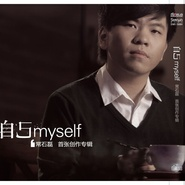

自己常石磊首张创作专辑 / Myself
============================

|  |  |
| :--: | :-- |
| [ 自己常石磊首张创作专辑 / Myself](https://emumo.xiami.com/album/382498) | **艺人**: [常石磊](../index.md) **语种**: 国语 **唱片公司**: 风向乐动 **发行时间**: 2010年04月26日 **专辑类别**: 录音室专辑 **专辑风格**: 国语流行 Mandarin Pop, 华语唱作人 Chinese Singer-Songwriter, 节奏布鲁斯 R&B **播放数**: 1722412 **收藏数**: 994 **评论数**: 145  |

## 简介

《自己》是常石磊首张个人原创专辑，其中收录了11首由著名词作家王平久作词，常石磊作曲、编曲并制作的歌曲，两种艺术气息交相融合创作出这一张不可多得、独具魔力的优秀音乐专辑。 “感觉到什么就写什么”，这是被誉为音乐天才的常石磊用他“纯天然”的自由创作思维对音乐的诠释。音乐是对生活的一种记录方式，每个阶段的生活经历都有它独特的味道，而每种味道都表现了不同时期人的各种情绪，这些情绪像音符一样，高高低低被串联在一起，变成了一首首生活的乐曲。  
  
《自己》这张专辑是以音乐传达一种生活精神，无论是已经过的岁月或是未知的将来，每时每刻都要好好的感受自我，充分的爱自己，爱周围的一切。我们一直在探寻生命的真谛，每个人也都曾不断地思考自己的人生，人生的目的并不重要，重要的是我们现在要以怎样的方式存在。  
  
生命是个漫长的旅途，《自己》里所表现的是不同于传统的音乐专辑形式，包含了多维度的、多元素的音乐风格。以表达爱自己为前提，获得内心的平静、视野的开阔，保有充满希望和积极向上的信念去面对人生的激情。

## 曲目

## 评论

|  |  |  |  |
| :-- | :-- | :-- | :-- |
|  [虾米用户](https://emumo.xiami.com/u/66823378)  2020-02-21 00:09 赞(0) 踩(0) | 

 |
|  [虾米用户](https://emumo.xiami.com/u/85157798) 三鲜，茄子，LESLIE... 2017-11-27 08:42 赞(0) 踩(0) | 
买的实体cd听了不下200遍吧&amp;hellip;
 |
|  [虾米用户](https://emumo.xiami.com/u/510039)  2017-11-02 21:49 赞(0) 踩(0) | 
爱你
 |
|  [虾米用户](https://emumo.xiami.com/u/4247908)  2017-10-27 23:15 赞(1) 踩(0) | 
非常好听，非常耐听，非常优雅。对于常石磊的声线也许需要一定时间的适应过程，但我想适应的结果都是积极的。我觉得终究还是做音乐的态度。期待内地歌手能有与之匹敌的而且是由内地团队完成的作品。
 |
|  [虾米用户](https://emumo.xiami.com/u/100660422) 你好呀。(¦3[▓▓]虾... 2017-10-16 01:19 赞(0) 踩(0) | 
genius！
 |
|  [虾米用户](https://emumo.xiami.com/u/39716998) 如能忘掉渴望，岁月长，衣... 2017-02-06 00:29 赞(1) 踩(0) | 
我们都不应该孤单，泪奔
 |
|  [虾米用户](https://emumo.xiami.com/u/8410494) 今天又苟且了 2016-09-13 14:36 赞(1) 踩(0) | 
才知道《哥哥》这首歌是石头写的，好听！！！
 |
|  [虾米用户](https://emumo.xiami.com/u/42979182)  2016-04-02 12:26 赞(2) 踩(0) | 
又来听第一百零一遍了。。这张专辑是有多耐听啊。。。隔一阵就必须拿来回味
 |
|  [虾米用户](https://emumo.xiami.com/u/8116842)  2016-02-19 11:34 赞(0) 踩(0) | 
我支持您石头
 |
|  [虾米用户](https://emumo.xiami.com/u/42979182)  2015-12-21 15:10 赞(0) 踩(0) | 
这张专辑听了无数遍啦，好喜欢罗！小石头！
 |
|  [虾米用户](https://emumo.xiami.com/u/29357955) 老板，来两斤爱情，打包！ 2015-12-05 10:06 赞(0) 踩(0) | 
希望石头能出更多的好作品  一直特别喜欢他的编曲 想法很独特
 |
|  [虾米用户](https://emumo.xiami.com/u/9775319)  2015-04-14 00:36 赞(0) 踩(0) | 
哦 鼻腔-_-#
 |
|  [虾米用户](https://emumo.xiami.com/u/41770939)  2015-03-21 01:39 赞(3) 踩(0) | 
太爱他的风格和声音
 |
|  [虾米用户](https://emumo.xiami.com/u/1936466) 我要我的音乐。 2015-01-24 10:03 赞(0) 踩(0) | 
我下的被清除了…………
 |
| ⇒ |  [虾米用户](https://emumo.xiami.com/u/18282119) 我就是我，独一无二 2015-01-26 17:20 赞(0) 踩(0) | 
已经换成合格320K了，重新下吧，原来的音频频谱是不行的。
 |
| ⇒ |  [虾米用户](https://emumo.xiami.com/u/1936466) 我要我的音乐。 2015-01-27 20:38 赞(0) 踩(0) | 
<q><b>______说：</b></q>
 |
| ⇒ |  [虾米用户](https://emumo.xiami.com/u/18282119) 我就是我，独一无二 2015-01-27 20:39 赞(0) 踩(0) | 
<q><b>大爱小凉说：</b></q>
 |
|  [虾米用户](https://emumo.xiami.com/u/45615898)  2015-01-03 22:55 赞(0) 踩(0) | 
声音很空灵
 |
|  [虾米用户](https://emumo.xiami.com/u/18706830)  2014-12-28 09:49 赞(0) 踩(0) | 
赞
 |
|  [虾米用户](https://emumo.xiami.com/u/698892)  2014-12-12 10:55 赞(9) 踩(0) | 
这是个内心多么干净和细腻的人啊。
 |
|  [虾米用户](https://emumo.xiami.com/u/7345510) 我真的喜欢吃虾 2014-11-18 22:34 赞(0) 踩(0) | 
他是国内撞脸蓝波1了，之前觉得他像这个像那个，这次居然觉得他像我小舅子！
 |
| ⇒ |  [虾米用户](https://emumo.xiami.com/u/7616503) 暂无签名~ 2015-03-02 00:38 赞(0) 踩(0) | 
他有点撞脸黄国伦
 |
|  [虾米用户](https://emumo.xiami.com/u/2386251)  2014-11-10 16:12 赞(0) 踩(0) | 
搁国内流行乐比，真是极好的五星碟
 |
|  [虾米用户](https://emumo.xiami.com/u/7236969) 冷门女声 ~ 节奏控！ 2014-07-20 15:50 赞(0) 踩(0) | 
爱他~
 |
|  [虾米用户](https://emumo.xiami.com/u/277258) 道生於平和。 2014-07-11 07:32 赞(0) 踩(0) | 
我喜欢那首哥哥
 |
|  [虾米用户](https://emumo.xiami.com/u/30684294) 微博@厉大哥 2014-05-08 21:34 赞(0) 踩(0) | 
很不错哟
 |
|  [虾米用户](https://emumo.xiami.com/u/17036200)  2014-04-25 21:43 赞(1) 踩(0) | 
五星力荐。。最爱《天数》《自己》
 |
|  [虾米用户](https://emumo.xiami.com/u/3829496)  2014-04-13 06:14 赞(0) 踩(0) | 
喜欢
 |
|  [虾米用户](https://emumo.xiami.com/u/10696669)  2014-03-28 12:09 赞(0) 踩(0) | 
石头确实油菜，有几首超爱
 |
|  [虾米用户](https://emumo.xiami.com/u/581269)  2014-02-23 20:11 赞(0) 踩(0) | 
常石磊
 |
|  [虾米用户](https://emumo.xiami.com/u/5765082) 来自第九区 2014-01-21 23:54 赞(0) 踩(0) | 
这个都悠悠的，赶脚不赖啊，先收着，回来再细细品鉴，到底是男还是女。
 |
|  [虾米用户](https://emumo.xiami.com/u/11240103)  2014-01-20 18:16 赞(0) 踩(0) | 
真正用心来抒写音乐的才子。
 |
|  [虾米用户](https://emumo.xiami.com/u/6524479) 我还没想好要写什么... 2014-01-14 01:26 赞(0) 踩(0) | 
纯音乐
 |
|  [虾米用户](https://emumo.xiami.com/u/6524479) 我还没想好要写什么... 2014-01-14 00:45 赞(0) 踩(0) | 
即坚持自己的风格，用用音乐同世界交流！从小我走向大众，常石磊在成长！加油！
 |
|  [虾米用户](https://emumo.xiami.com/u/11297640) ~痕~ 2013-12-14 14:28 赞(0) 踩(0) | 
品静…………
 |
|  [虾米用户](https://emumo.xiami.com/u/23507547)  2013-11-19 21:38 赞(0) 踩(0) | 
真的喜欢！听着他的歌很放松！压力没有了剩下的只是享受 静静的 ......
 |
|  [虾米用户](https://emumo.xiami.com/u/9658228) 波比猴第14支全新单曲“... 2013-07-07 22:30 赞(0) 踩(0) | 
我在哪儿听过这首《哥哥》，想不起来了，上过春晚吗他？
 |
| ⇒ |  [虾米用户](https://emumo.xiami.com/u/1553106)  2013-08-25 13:16 赞(0) 踩(0) | 
2010年北京卫视春晚，王力宏演绎过石头这首《哥哥》
 |
| ⇒ |  [虾米用户](https://emumo.xiami.com/u/9658228) 波比猴第14支全新单曲“... 2013-08-25 20:45 赞(0) 踩(0) | 
<q><b>Roy_Leeˇ说：</b></q>
 |
|  [虾米用户](https://emumo.xiami.com/u/1670431)  2013-06-13 10:01 赞(0) 踩(0) | 
惊讶。。。一流制作！！！
 |
|  [虾米用户](https://emumo.xiami.com/u/13933865)  2013-04-12 23:16 赞(0) 踩(0) | 
用心灵歌唱
 |
|  [虾米用户](https://emumo.xiami.com/u/11402193)  2013-03-21 09:17 赞(0) 踩(0) | 
一种享受
 |
|  [虾米用户](https://emumo.xiami.com/u/3588511)  2013-01-29 18:41 赞(0) 踩(0) | 
非常好听的一张专辑，完全被他的声音和歌曲创意所吸引
 |
|  [虾米用户](https://emumo.xiami.com/u/12426478) 音乐建三观 2013-01-14 18:11 赞(0) 踩(0) | 
虾米里的歌儿太少了因为都是属于“未发布”吧
 |
|  [虾米用户](https://emumo.xiami.com/u/1867917)  2013-01-10 11:37 赞(0) 踩(0) | 
纯净
 |
|  [虾米用户](https://emumo.xiami.com/u/4708664)  2013-01-03 03:58 赞(1) 踩(0) | 
“你不是唱生活，你是唱生命的，你不需要那些烟火气，不需要那种凡人身上的那些所谓的情感，你把它都已经洗掉了，就不要再重新捡回来。就继续歌唱你的生命。“高晓松对常石磊说...(在《水手和小草》唱毕以后)
 |
|  [虾米用户](https://emumo.xiami.com/u/7430893)  2012-12-18 23:20 赞(0) 踩(0) | 
石头的声音很赞！创作能力超强！真如海泉所说，过耳难忘，一听就是常石磊的声音了！
 |
|  [虾米用户](https://emumo.xiami.com/u/3465809)  2012-12-13 15:20 赞(1) 踩(0) | 
石头出品，必属精品。
 |
|  [虾米用户](https://emumo.xiami.com/u/9155667)  2012-12-10 17:56 赞(0) 踩(0) | 
很能打动人心
 |
|  [虾米用户](https://emumo.xiami.com/u/6561508) 沙滚滚但彼此珍重过 2012-11-20 01:43 赞(0) 踩(0) | 
气息 神了！！
 |
|  [虾米用户](https://emumo.xiami.com/u/11376594) 港乐 2012-11-08 16:32 赞(0) 踩(0) | 
11
 |
|  [虾米用户](https://emumo.xiami.com/u/3342890) 音乐是传送门 2012-10-31 02:29 赞(1) 踩(0) | 
石头的歌，是那种能让人低头垂目把心交出来的。石头的表演，是能让人眼中噙满泪花的。每每看他唱歌的神情，一眉一目，亦步亦趋，都让我感动和流泪。
 |
|  [虾米用户](https://emumo.xiami.com/u/1891488)  2012-10-22 21:43 赞(0) 踩(0) | 
情何以堪
 |
|  [虾米用户](https://emumo.xiami.com/u/649800)  2012-10-08 16:47 赞(0) 踩(0) | 
太有个性了。这才叫专辑。
 |
|  [虾米用户](https://emumo.xiami.com/u/3850388)  2012-10-03 20:05 赞(0) 踩(0) | 
好听
 |
|  [虾米用户](https://emumo.xiami.com/u/10499945)  2012-10-03 12:50 赞(0) 踩(0) | 
有滋味的常石磊
 |
|  [虾米用户](https://emumo.xiami.com/u/908450)  2012-09-30 14:33 赞(0) 踩(0) | 
听着 头皮会微微发麻。
 |
|  [虾米用户](https://emumo.xiami.com/u/1830132)  2012-09-21 10:57 赞(0) 踩(0) | 
人生如旅途，将灵魂驻进你的城。尽情地爱，放肆地弛。
 |
|  [虾米用户](https://emumo.xiami.com/u/9293375) 音魂不断，逆天的欲罢不能... 2012-09-16 13:38 赞(0) 踩(0) | 
2012最美的男声！
 |
|  [虾米用户](https://emumo.xiami.com/u/1758857)  2012-09-14 01:15 赞(0) 踩(0) | 
对歌曲的处理，就像分泌出来的胆汁，很伤人的
 |
|  [虾米用户](https://emumo.xiami.com/u/10043008)  2012-09-13 23:09 赞(0) 踩(0) | 
流行艺术歌曲 赞一个
 |
|  [虾米用户](https://emumo.xiami.com/u/10043008)  2012-09-13 23:08 赞(0) 踩(0) | 
轻柔 轻松的述说
 |
|  [虾米用户](https://emumo.xiami.com/u/3620655)  2012-09-12 18:42 赞(0) 踩(0) | 
听到了情感，难能可贵
 |
|  [虾米用户](https://emumo.xiami.com/u/1162639)  2012-09-10 17:15 赞(0) 踩(0) | 
天才的声线,动人的R&amp;amp;B
 |
|  [虾米用户](https://emumo.xiami.com/u/3787007) 念念看破  念念放下 2012-09-07 10:56 赞(0) 踩(0) | 
感动了
 |
|  [虾米用户](https://emumo.xiami.com/u/184436)  2012-09-04 23:34 赞(0) 踩(0) | 
绝对的好声音！！
 |
|  [虾米用户](https://emumo.xiami.com/u/668736) 荒凉 2012-09-04 15:27 赞(0) 踩(0) | 
完美，但是太小众了！
 |
|  [虾米用户](https://emumo.xiami.com/u/5820697) 爱看儿子打篮球⛹ 2012-09-04 14:25 赞(0) 踩(0) | 
很喜欢《哥哥》这首歌，听到这首歌让我想到很多往事。。。。。。
 |
|  [虾米用户](https://emumo.xiami.com/u/3622126)  2012-09-04 05:51 赞(0) 踩(0) | 
音乐精灵
 |
|  [虾米用户](https://emumo.xiami.com/u/8177085)  2012-09-03 10:16 赞(0) 踩(0) | 
天籁之声
 |
|  [虾米用户](https://emumo.xiami.com/u/2000356)  2012-09-02 23:27 赞(0) 踩(0) | 
喜欢极了，揪心揪肺。听到远古又带人到天穹。
 |
|  [虾米用户](https://emumo.xiami.com/u/9727371) 万事皆有原因，各自有各自... 2012-09-02 11:33 赞(0) 踩(0) | 
平静而细腻，给人温暖踏实的感觉
 |
|  [虾米用户](https://emumo.xiami.com/u/10445050) keep eating 2012-08-31 17:54 赞(0) 踩(0) | 
站在歌唱的珠峰上的男人
 |
|  [虾米用户](https://emumo.xiami.com/u/3332404)  2012-08-31 01:31 赞(0) 踩(0) | 
天籁
 |
|  [虾米用户](https://emumo.xiami.com/u/10435192)  2012-08-30 22:50 赞(0) 踩(0) | 
常石磊的歌
 |
|  [虾米用户](https://emumo.xiami.com/u/3586436)  2012-08-28 08:18 赞(0) 踩(0) | 
假音完美，细腻深情，实力创作者～
 |
|  [虾米用户](https://emumo.xiami.com/u/3586436)  2012-08-28 08:18 赞(0) 踩(0) | 
假音完美，细腻深情，实力创作者～
 |
|  [虾米用户](https://emumo.xiami.com/u/1547479)   2012-08-25 21:50 赞(0) 踩(0) | 
石头唱歌怎么这么好听这么好听呢
 |
|  [虾米用户](https://emumo.xiami.com/u/5679575)   2012-08-23 14:00 赞(0) 踩(0) | 
天籁的声音
 |
|  [虾米用户](https://emumo.xiami.com/u/8490483)  2012-08-22 07:58 赞(0) 踩(0) | 
天才,挺你,加油!!
 |
|  [虾米用户](https://emumo.xiami.com/u/10308161) 你不见了,突然 我就乱了 2012-08-21 17:46 赞(0) 踩(0) | 
呵呵  小石头，有味道  够实力
 |
|  [虾米用户](https://emumo.xiami.com/u/7468927)  2012-08-21 12:34 赞(0) 踩(0) | 
很好听，玛丽亚凯莉也可以赞叹下
 |
|  [虾米用户](https://emumo.xiami.com/u/7150897)  2012-08-20 13:43 赞(0) 踩(0) | 
就是喜欢，心灵的抚慰。。。
 |
|  [虾米用户](https://emumo.xiami.com/u/3467)  2012-08-19 19:51 赞(0) 踩(0) | 
还没听，就知道这必定能收藏
 |
|  [虾米用户](https://emumo.xiami.com/u/3467)  2012-08-19 19:50 赞(0) 踩(0) | 
还没听就收藏，我对他有信心！
 |
|  [虾米用户](https://emumo.xiami.com/u/2357772)  2012-08-19 16:16 赞(0) 踩(0) | 
年轻才俊，大有作为
 |
|  [虾米用户](https://emumo.xiami.com/u/1912615)  2012-08-18 08:29 赞(0) 踩(0) | 
风格有点像陶喆，但唱功绝对一流。
 |
|  [虾米用户](https://emumo.xiami.com/u/2913708) 暂无签名~ 2012-08-17 23:50 赞(0) 踩(0) | 
歌曲能唱到这境界，神了~！
 |
|  [虾米用户](https://emumo.xiami.com/u/1912615)  2012-08-17 15:48 赞(0) 踩(0) | 
听的连评委都傻了，很少有歌手唱歌如此用心和动情，更多的是虚情假意，不真实，石头，难能可贵！
 |
|  [虾米用户](https://emumo.xiami.com/u/3169109)  2012-08-17 14:14 赞(0) 踩(0) | 
看过声动亚洲来的，太难以置信了
 |
|  [虾米用户](https://emumo.xiami.com/u/925314) 暂无签名~ 2012-08-17 12:38 赞(0) 踩(0) | 
好声音
 |
|  [虾米用户](https://emumo.xiami.com/u/10249400)  2012-08-17 11:51 赞(0) 踩(0) | 
创作一流唱功一流歌声一流
 |
|  [虾米用户](https://emumo.xiami.com/u/10247486) jiapo 2012-08-17 09:12 赞(0) 踩(0) | 
天籁般的清澈灵泉。。。。。
 |
|  [虾米用户](https://emumo.xiami.com/u/3765954) 装下那片湖 2012-07-27 10:29 赞(0) 踩(0) | 
常石磊是内地少有的优秀歌手
 |
|  [虾米用户](https://emumo.xiami.com/u/6922118) 多还想更多就会失去一切 2012-07-09 23:21 赞(0) 踩(0) | 
最近迷上了常石磊了。
 |
|  [虾米用户](https://emumo.xiami.com/u/1769336) 暂无签名~ 2012-05-19 01:30 赞(0) 踩(0) | 
特别喜欢《我的城》这首，深夜音箱开的低低的，听他唱。。。。
 |
| ⇒ |  [虾米用户](https://emumo.xiami.com/u/8490483)  2012-08-22 14:11 赞(0) 踩(0) | 
同感
 |
|  [虾米用户](https://emumo.xiami.com/u/4182149)  2012-04-06 15:54 赞(1) 踩(0) | 
中国音乐的星星之火。能拿得出手的音乐名片
 |
|  [虾米用户](https://emumo.xiami.com/u/8025798)  2012-03-28 13:57 赞(0) 踩(0) | 
具有魔力的声线。
 |
|  [虾米用户](https://emumo.xiami.com/u/245790)  2012-03-27 08:49 赞(0) 踩(0) | 
因为张敬轩的诸多歌曲，认识并喜欢上了这位才子。话说我们国家才子辈出丫，赶上好时代了，哈哈！
 |
|  [虾米用户](https://emumo.xiami.com/u/347182) 听歌不社交 2012-03-21 15:52 赞(0) 踩(0) | 
华语中比较喜欢的
 |
|  [虾米用户](https://emumo.xiami.com/u/1988731)  2012-02-27 12:45 赞(0) 踩(0) | 
好听
 |
|  [虾米用户](https://emumo.xiami.com/u/2715724)  2012-02-25 12:27 赞(0) 踩(0) | 
曹孟德微博<a href="http://weibo.com/zyn2312068" target="_blank" rel="nofollow noreferrer noopener">http://weibo.com/zyn2312068</a>
 |
|  [虾米用户](https://emumo.xiami.com/u/3363391)  2012-02-22 13:41 赞(0) 踩(0) | 
很安静
 |
|  [虾米用户](https://emumo.xiami.com/u/4044621) :) 2012-02-22 12:21 赞(0) 踩(0) | 
才华横溢，有灵魂的好声音
 |
|  [虾米用户](https://emumo.xiami.com/u/7526920)  2012-01-09 14:13 赞(0) 踩(0) | 
you.will.hear.the.nging
 |
|  [虾米用户](https://emumo.xiami.com/u/720151)  2011-12-03 12:58 赞(0) 踩(0) | 
心依恋，真的非常棒，可惜下载不到
 |
|  [虾米用户](https://emumo.xiami.com/u/6011379)  2011-11-14 17:38 赞(0) 踩(0) | 
******
 |
|  [虾米用户](https://emumo.xiami.com/u/3166437)  2011-11-13 15:00 赞(0) 踩(0) | 
好多好听的，优秀80后
 |
|  [虾米用户](https://emumo.xiami.com/u/6305395)  2011-10-18 17:21 赞(0) 踩(0) | 
喜欢他的个性
 |
|  [虾米用户](https://emumo.xiami.com/u/6301167)  2011-10-17 21:30 赞(0) 踩(0) | 
开始喜欢是听了中央9《当卢浮宫遇上紫禁城》的插曲 心依恋  醇和柔婉的嗓音
 |
|  [虾米用户](https://emumo.xiami.com/u/162655)  2011-10-12 14:06 赞(0) 踩(0) | 
是看了和林忆莲的《枯荣》专访视频上来搜的，支持一个。
 |
|  [虾米用户](https://emumo.xiami.com/u/36029) 微信funnowpie 2011-10-11 14:41 赞(1) 踩(0) | 
内地最看好的音乐人
 |
|  [虾米用户](https://emumo.xiami.com/u/5655997)   2011-09-01 19:01 赞(0) 踩(0) | 
石头~~~ 当然要顶！
 |
|  [虾米用户](https://emumo.xiami.com/u/5655997)   2011-09-01 18:59 赞(0) 踩(0) | 
挚爱！
 |
|  [虾米用户](https://emumo.xiami.com/u/266117) What footpri... 2011-07-26 13:05 赞(0) 踩(0) | 
音乐天才，总有好的感觉融入曲子和歌声之中。
 |
|  [虾米用户](https://emumo.xiami.com/u/4906536)  2011-07-23 02:27 赞(0) 踩(0) | 
百听不厌！！！
 |
|  [虾米用户](https://emumo.xiami.com/u/28979)  2011-07-14 11:23 赞(0) 踩(0) | 
不一样的声音！
 |
|  [虾米用户](https://emumo.xiami.com/u/2864873)  2011-07-11 18:20 赞(0) 踩(0) | 
很棒的专辑 支持
 |
|  [虾米用户](https://emumo.xiami.com/u/966846)   2011-06-18 22:16 赞(0) 踩(0) | 
很棒很棒的创作。我爱常石磊
 |
|  [虾米用户](https://emumo.xiami.com/u/900780)  2011-05-28 15:25 赞(0) 踩(0) | 
喜欢他的山楂树系列  ~
 |
|  [虾米用户](https://emumo.xiami.com/u/3742028)  2011-04-26 09:50 赞(0) 踩(0) | 
用心歌唱
 |
|  [虾米用户](https://emumo.xiami.com/u/1078377) 额！ 2011-04-19 10:09 赞(0) 踩(0) | 
好喜欢的歌声。
 |
|  [虾米用户](https://emumo.xiami.com/u/2544860)  2011-04-07 12:58 赞(0) 踩(0) | 
真正能触及心灵的声音
 |
|  [虾米用户](https://emumo.xiami.com/u/2873765)  2011-03-04 17:53 赞(0) 踩(0) | 
实力派，耐听！
 |
|  [虾米用户](https://emumo.xiami.com/u/1091908) 一切随缘 2011-03-03 15:03 赞(0) 踩(0) | 
思维创作
 |
|  [虾米用户](https://emumo.xiami.com/u/2967977)  2011-02-26 18:08 赞(0) 踩(0) | 
天哪··
 |
|  [虾米用户](https://emumo.xiami.com/u/2966864)  2011-02-26 10:27 赞(0) 踩(0) | 
贴近心的声音······
 |
|  [虾米用户](https://emumo.xiami.com/u/2334752)  2011-02-24 23:52 赞(0) 踩(0) | 
喜欢音乐的人一定要听他的声音，犹如天籁，灵魂飘荡的感觉...................
 |
|  [虾米用户](https://emumo.xiami.com/u/2334752)  2011-02-24 23:52 赞(0) 踩(0) | 
爱上他的声音
 |
|  [虾米用户](https://emumo.xiami.com/u/112208)  2011-02-05 12:29 赞(0) 踩(0) | 
认真唱歌的人不多了。
 |
|  [虾米用户](https://emumo.xiami.com/u/1925228)  2011-01-27 01:32 赞(0) 踩(0) | 
no
 |
|  [虾米用户](https://emumo.xiami.com/u/397803) 暂无签名~ 2011-01-02 15:20 赞(0) 踩(0) | 
很舒服～～～值得听
 |
|  [虾米用户](https://emumo.xiami.com/u/805361)  2010-10-26 15:50 赞(0) 踩(0) | 
石磊终于出专辑了   等得我要死
 |
|  [虾米用户](https://emumo.xiami.com/u/295735) 现实与梦境，我不怀疑 2010-08-13 16:12 赞(0) 踩(0) | 
求石头的《连接》mp3!!!!!!!!!!!!!!!!!!!!!!!!
 |
|  [虾米用户](https://emumo.xiami.com/u/583041) 你怎么能问吃货饿不饿？！ 2010-06-19 16:31 赞(0) 踩(0) | 
貌似最开始知道他是因为财经频道的“环球财经连线”主题曲哎~~那首歌觉得超帅气~
 |
|  [虾米用户](https://emumo.xiami.com/u/262875)  2010-06-19 09:12 赞(0) 踩(0) | 
爆音的问题是这样的，CD出厂的时候估计是厂商压片的问题，都有爆音的现象，所以现在全部都召回去了。
 |
|  [虾米用户](https://emumo.xiami.com/u/101804)  2010-06-07 10:45 赞(0) 踩(0) | 
还没有听，但是真的值得支持，第1次听他的现场是张敬轩的演唱会唱春天，真是好好听，好听过张先生唱得。之后有听他以前的歌和现场，真的很不错，希望以后有好的发展。
 |
|  [虾米用户](https://emumo.xiami.com/u/549223)  2010-06-07 00:35 赞(0) 踩(0) | 
哎~~我对你印象最深的是你在快乐大本营里的超级表现，真的很棒~~呵呵~~你应该来些翻唱些哥，用你的风格，我觉得你唱的那个爱爱爱不完，完美很~~
 |
|  [虾米用户](https://emumo.xiami.com/u/14304) 不安是心理扭曲的激化 2010-06-04 16:56 赞(0) 踩(0) | 
哥哥》也有爆音，虾小编居然说没爆，难不成石头制作时候的问题？这么低级错误不可能犯吧？确实爆了啦！！！
 |
|  [虾米用户](https://emumo.xiami.com/u/14304) 不安是心理扭曲的激化 2010-06-03 10:06 赞(0) 踩(0) | 
第三首爆音，估计得被和谐！
 |
|  [虾米用户](https://emumo.xiami.com/u/14304) 不安是心理扭曲的激化 2010-06-02 15:29 赞(0) 踩(0) | 
如果放下一些些个人因素，我发现他真的是一个非常好的歌手。唱片听了前几首，很不错，加油！！
 |
|  [虾米用户](https://emumo.xiami.com/u/903774)  2010-06-01 10:16 赞(0) 踩(0) | 
第一次聽你的歌.是因為在YY上的一個人介紹的,然後就愛上了他了聲音.那種穿透心靈的感覺.很乾淨.
 |
|  [虾米用户](https://emumo.xiami.com/u/768147)  2010-05-29 21:10 赞(0) 踩(0) | 
希望能继续坚持自己!支持~！
 |
|  [虾米用户](https://emumo.xiami.com/u/768147)  2010-05-29 21:01 赞(0) 踩(0) | 
顶！！！！！！
 |
