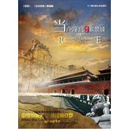

心依恋
============================

|  |  |
| :--: | :-- |
| [ 心依恋](https://emumo.xiami.com/album/514561) | **艺人**: [常石磊](../index.md) **语种**: 国语 **唱片公司**: 风向乐动 **发行时间**: 2011年02月17日 **专辑类别**: EP, 单曲 **专辑风格**:  **播放数**: 82287 **收藏数**: 163 **评论数**: 43  |

## 简介

一次不可错过的艺术盛宴；两部精典《故宫》、《台北故宫》的姊妹篇；三方强强联手出品 良友SMG中央新影；四年时光探索东西方文明对话；五度进入卢浮宫全面纪录世界级艺术经典；上百位艺术大师的心路历程。   
  
中法两国合作拍摄的大型纪录片《当卢浮宫遇见紫禁城》共12集，每集40分钟，分别演绎古代中亚、埃及、希腊、罗马以及中世纪文艺复兴等不同时空背景下的东西方艺术演进历史，穿插各领域专家学者的最新评析，同时也呈现了卢浮宫和故宫依托宫殿建筑设立博物馆的精妙构思与创意。   
  
而作为本片主题曲的《心依恋》更是收到了广大观众的热烈欢迎。   
  
《心依恋》的曲调悠远绵长，歌者的声音沧桑空灵。使人仿佛在暮春的早晨，享受着霏霏的毛雨默然洒在脸上；又恍如新鲜的微风吹动我的衣袂的，使人沉醉，让人安宁。一经播出，美妙的声音就迷倒了众多的观众。

## 曲目

## 评论

|  |  |  |
| :-- | :-- | :-- |
|  [虾米用户](https://emumo.xiami.com/u/7556018) 别笑的像个魔王 2017-06-13 14:57 赞(0) 踩(0) | 
常石磊的歌无论好坏都想听一下下
 |
|  [虾米用户](https://emumo.xiami.com/u/200627078)   2016-08-11 20:21 赞(1) 踩(0) | 
打动人心，历史的厚重与柔情，纪录片拍得非常好
 |
|  [虾米用户](https://emumo.xiami.com/u/3680060) 我还没想好要写什么... 2015-09-20 13:54 赞(0) 踩(0) | 
朱青生
 |
|  [虾米用户](https://emumo.xiami.com/u/55386896)  2015-08-17 17:33 赞(0) 踩(0) | 
心 如风尚待吹起
 |
|  [虾米用户](https://emumo.xiami.com/u/13022251) WHY NOT ~ 2015-03-22 13:38 赞(0) 踩(0) | 
化了
 |
|  [虾米用户](https://emumo.xiami.com/u/23784508)  2015-02-20 15:37 赞(0) 踩(0) | 
哪有小提琴的版本呀？
 |
|  [虾米用户](https://emumo.xiami.com/u/42231534)  2015-02-12 14:11 赞(0) 踩(0) | 
favorite for long time
 |
|  [虾米用户](https://emumo.xiami.com/u/18706830)  2014-12-28 10:08 赞(0) 踩(0) | 
赞
 |
|  [虾米用户](https://emumo.xiami.com/u/675950) 三观正(/ω＼) 2014-11-11 22:33 赞(1) 踩(0) | 
好听，感动
 |
|  [虾米用户](https://emumo.xiami.com/u/6393241)  2014-06-22 05:06 赞(1) 踩(0) | 
由小提琴演奏的主旋律也很好听，如果把管弦乐版一起发出就好了。歌曲风格，和「台北故宫」的主题曲的「爱延续」差不多
 |
| ⇒ |  [虾米用户](https://emumo.xiami.com/u/32364473) 暂无签名~ 2014-10-25 01:47 赞(0) 踩(0) | 
也一直喜欢这首爱的延续，石头的这首唱的美极了
 |
|  [虾米用户](https://emumo.xiami.com/u/31482010)   2014-06-17 15:24 赞(0) 踩(0) | 
好美的一首歌……
 |
| ⇒ |  [虾米用户](https://emumo.xiami.com/u/905240) 做你手心里最爱的猪 2014-07-16 09:24 赞(0) 踩(0) | 
一直很喜欢
 |
|  [虾米用户](https://emumo.xiami.com/u/11134673)  2014-06-08 18:04 赞(0) 踩(0) | 
历史画影缓缓呈现，感动随心！
 |
|  [虾米用户](https://emumo.xiami.com/u/7953757)  2014-06-05 21:23 赞(0) 踩(0) | 
词曲唱俱佳！王之一！常石磊！
 |
|  [虾米用户](https://emumo.xiami.com/u/7953757)  2014-06-05 21:21 赞(0) 踩(0) | 
汗！都几年了才出！
 |
|  [虾米用户](https://emumo.xiami.com/u/18085239) 暂无签名~ 2014-05-27 09:42 赞(0) 踩(0) | 
惊艳
 |
|  [虾米用户](https://emumo.xiami.com/u/5026326) 爱唱歌的孩子都是好孩子～ 2014-05-26 17:29 赞(0) 踩(0) | 
太喜欢他的声音~
 |
|  [虾米用户](https://emumo.xiami.com/u/577862)  2014-05-22 11:24 赞(0) 踩(0) | 
终于出了，好感动
 |
|  [虾米用户](https://emumo.xiami.com/u/3088517) 遇见未来 2014-05-20 08:36 赞(0) 踩(0) | 
最喜欢的石头的一首
 |
|  [虾米用户](https://emumo.xiami.com/u/892282)  2014-05-20 08:24 赞(0) 踩(0) | 
赞
 |
|  [虾米用户](https://emumo.xiami.com/u/30684294) 微博@厉大哥 2014-05-19 21:13 赞(0) 踩(0) | 
卧槽，新的！
 |
|  [虾米用户](https://emumo.xiami.com/u/450276) 我本渔樵孟诸野 一生自是... 2014-05-19 20:33 赞(0) 踩(0) | 
當故宮遇見盧浮宮，當倪贊遇見達芬奇
 |
|  [虾米用户](https://emumo.xiami.com/u/2971389) 幸福=效用／欲望 2014-05-19 20:22 赞(0) 踩(0) | 
盼星星盼月亮终于出现了
 |
|  [虾米用户](https://emumo.xiami.com/u/3938103)  2014-05-19 18:35 赞(0) 踩(0) | 
终于出了！！等了好久！
 |
|  [虾米用户](https://emumo.xiami.com/u/12832061) 行善沒有條件 2014-05-19 18:01 赞(0) 踩(0) | 
謝謝發佈
 |
|  [虾米用户](https://emumo.xiami.com/u/4323514) 凡所有相，皆是虚妄 2014-05-19 17:38 赞(0) 踩(0) | 
听听看~~
 |
|  [虾米用户](https://emumo.xiami.com/u/5406161)  2014-05-04 11:22 赞(0) 踩(0) | 
快发布啦～～好期待！
 |
|  [虾米用户](https://emumo.xiami.com/u/22937080)  2014-02-28 23:56 赞(0) 踩(0) | 
good
 |
|  [虾米用户](https://emumo.xiami.com/u/4198959) 有你陪伴真好。 2013-12-29 11:21 赞(0) 踩(0) | 
中西方文化相遇，并不是互相吞并，因彼此相依，对望深沉，百年如一却也难舍难分离。好听！
 |
|  [虾米用户](https://emumo.xiami.com/u/7286437)  2013-06-17 11:27 赞(0) 踩(0) | 
被那词、被那曲，莫名地感动。
 |
|  [虾米用户](https://emumo.xiami.com/u/2442913)  2013-05-02 14:11 赞(0) 踩(0) | 
非常好听的歌！
 |
|  [虾米用户](https://emumo.xiami.com/u/1301603) 音乐是一场快乐的酒宴。 2013-03-26 20:56 赞(0) 踩(0) | 
94，怎么还木有
 |
|  [虾米用户](https://emumo.xiami.com/u/5910487)   2013-01-08 14:05 赞(0) 踩(0) | 
竟然没有啊…哭…………
 |
|  [虾米用户](https://emumo.xiami.com/u/10520047) 谢茹辛 2013-01-04 11:42 赞(0) 踩(0) | 
这么好听的音乐，为啥还不能发布？
 |
|  [虾米用户](https://emumo.xiami.com/u/7059088)  2012-12-24 13:00 赞(0) 踩(0) | 
这首歌超赞！！
 |
|  [虾米用户](https://emumo.xiami.com/u/11195033)  2012-11-23 18:58 赞(0) 踩(0) | 
很好听
 |
|  [虾米用户](https://emumo.xiami.com/u/1709119)  2012-09-27 12:10 赞(0) 踩(0) | 
这首歌居然也是石头操刀的！！！
 |
|  [虾米用户](https://emumo.xiami.com/u/9559211)  2012-08-25 15:45 赞(0) 踩(0) | 
...........
 |
|  [虾米用户](https://emumo.xiami.com/u/9673190) Dreams 2012-08-22 00:22 赞(0) 踩(0) | 
喜欢 !!
 |
|  [虾米用户](https://emumo.xiami.com/u/2791760)  2012-08-18 20:29 赞(0) 踩(0) | 
等啊等……超好听！！！
 |
|  [虾米用户](https://emumo.xiami.com/u/9394483)  2012-07-07 17:15 赞(0) 踩(0) | 
休美無限
 |
|  [虾米用户](https://emumo.xiami.com/u/561304)  2012-05-26 21:09 赞(0) 踩(0) | 
尤其喜欢最后面那段小提琴
 |
