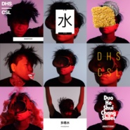
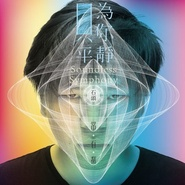
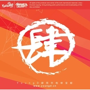
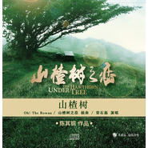
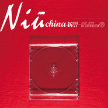

常石磊
============================

|  |  |
| :--: | :-- |
| [ 常石磊](https://i.xiami.com/changshilei) | **地区**: China 中国大陆 **风格**: 流行灵魂乐 Pop Soul, 国语流行 Mandarin Pop, 华语唱作人 Chinese Singer-Songwriter **播放数**: 12268643 **粉丝数**: 23092 **评论数**: 549  |

## 档案

常石磊  知名音乐制作人 北京奥运会音乐制作团队核心成员，第24届台湾金曲奖“最佳编曲人” “最佳专辑制作人”。 歌曲代表作：《我和你》、《High 歌》、《北京祝福你》、《青春》、《哥哥》、《连接》 影视剧代表作：《山楂树》、电影归来主题曲《跟着你 到天边》、《出塞曲》、《爱长久》

## 专辑

| 名称 | 语种 | 唱片公司 | 发行时间 | 专辑类别 | 专辑风格 |
| :--: | :-- | :-- | :-- | :-- | :-- |
| [ 萌宝](./albums/2104967999.md) | 国语 | 风向乐动 | 2019年05月01日 | EP, 单曲 |  |
| [ 多喝水](./albums/2103940324.md) | 国语 | 风向乐动 | 2018年08月20日 | EP, 单曲 | 国语流行 Mandarin Pop |
| [ 我要给的爱](./albums/2103708753.md) | 国语 | 风向乐动 | 2018年05月15日 | EP, 单曲 | 国语流行 Mandarin Pop |
| [ 我要给的爱 (小天地版)](./albums/2103708644.md) | 国语 | 风向乐动 | 2018年05月15日 | EP, 单曲 | 国语流行 Mandarin Pop |
| [ 遇见你](./albums/2103659338.md) | 国语 | 完美青春OST | 2018年04月02日 | EP, 单曲 | 国语流行 Mandarin Pop |
| [ 只为你平静 (小天地版)Soundless Symphony (Little Uniserse Version)](./albums/2102935659.md) | 国语 | 风向乐动 | 2017年11月16日 | EP, 单曲 |  |
| [ 只为你平静Soundless Symphony](./albums/2102935623.md) | 国语 | 风向乐动 | 2017年11月16日 | EP, 单曲 |  |
| [ 老爸](./albums/2102800711.md) | 国语 | 完美青春OST | 2017年07月21日 | EP, 单曲 | 国语流行 Mandarin Pop, 中国风 China-Wave |
| [ 我我](./albums/2102659572.md) | 国语 | 乐视影业 | 2016年12月05日 | EP, 单曲 | 国语流行 Mandarin Pop |
| [ 这里的黎明静悄悄](./albums/2100179860.md) | 国语 | 英爵文化 | 2015年08月18日 | EP, 单曲 | 国语流行 Mandarin Pop |
| [ 爱长久](./albums/133756641.md) | 国语 | 风向乐动 | 2015年06月08日 | EP, 单曲 | 国语流行 Mandarin Pop |
| [ 问道](./albums/220773071.md) | 国语 | 独立发行 | 2015年01月09日 | EP, 单曲 | 国语流行 Mandarin Pop, 中国风 China-Wave |
| [ High歌](./albums/420794196.md) | 国语 | 独立发行 | 2014年12月31日 | 精选集 | 国语流行 Mandarin Pop |
| [ 敢爱](./albums/419257201.md) | 国语 | 深圳卫视 | 2014年12月23日 | EP, 单曲 | 国语流行 Mandarin Pop |
| [ 美丽北京](./albums/217418457.md) | 国语 | 百纳娱乐 | 2014年12月01日 | EP, 单曲 | 国语流行 Mandarin Pop |
| [ 只为美好](./albums/714116078.md) | 国语 | 风向乐动 | 2014年10月24日 | EP, 单曲 |  |
| [ 世界等我出发](./albums/1107815001.md) | 国语 | 风向乐动 | 2014年06月03日 | EP, 单曲 | 国语流行 Mandarin Pop |
| [ 为梦痴狂](./albums/1410959716.md) | 国语 | 索尼音乐娱乐 | 2013年07月26日 | EP, 单曲 |  |
| [ 永恒的童话](./albums/1507816759.md) | 国语 | 风向乐动 | 2013年07月09日 | EP, 单曲 | 国语流行 Mandarin Pop |
| [ 我们都不应该孤单](./albums/567288.md) | 国语 | 风向乐动 | 2012年12月14日 | EP, 单曲 |  |
| [ 北京祝福你](./albums/526922.md) | 国语 | 风向乐动, 北京奥运城市发展促进会 | 2012年07月27日 | EP, 单曲 |  |
| [ 天地鉴](./albums/505742.md) | 国语 | 风向乐动 | 2012年03月29日 | EP, 单曲 |  |
| [ 肆](./albums/439885.md) | 国语 | YoungD网络电台 | 2011年04月27日 | EP, 单曲 |  |
| [ 心依恋](./albums/514561.md) | 国语 | 风向乐动 | 2011年02月17日 | EP, 单曲 |  |
| [ 常石磊网络演唱会](./albums/416036.md) | 国语 | 风向乐动 | 2010年10月25日 | 现场专辑 |  |
| [ 山楂树](./albums/446171.md) | 国语 | 风向乐动 | 2010年09月10日 | EP, 单曲 |  |
| [ 爱心](./albums/1173271995.md) | 国语 | 风向乐动 | 2010年06月23日 | EP, 单曲 |  |
| [ 自己常石磊首张创作专辑 / Myself](./albums/382498.md) | 国语 | 风向乐动 | 2010年04月26日 | 录音室专辑 | 国语流行 Mandarin Pop, 华语唱作人 Chinese Singer-Songwriter, 节奏布鲁斯 R&B |
| [ Niu China 新中国1949-2009 80后的红色经典](./albums/342155.md) | 国语 | 风向乐动 | 2009年08月07日 | 录音室专辑 | 红歌 Red Song, 流行灵魂乐 Pop Soul, 节奏布鲁斯 R&B |
| [ 在悉尼等我Waiting For Me In Sydney](./albums/894697764.md) | 国语 | 中国电视剧制作中心 | 2006年05月15日 | EP, 单曲 |  |

## 评论

|  |  |  |
| :-- | :-- | :-- |
|  [虾米用户](https://emumo.xiami.com/u/432440840)  2020-06-21 13:12 赞(0) 踩(0) | 
&amp;ldquo;老爸&amp;rdquo;每次听都被触动！超爱...
 |
|  [虾米用户](https://emumo.xiami.com/u/50240141)  2020-05-06 11:27 赞(2) 踩(0) | 
从王菲的义演听到你，认识你太晚了，说一声不好意思。听到你的人间，眼泪一下子止不住哗哗地流。
 |
|  [虾米用户](https://emumo.xiami.com/u/400244560)  2020-03-27 22:05 赞(0) 踩(0) | 
我真的爱他的声音
 |
|  [虾米用户](https://emumo.xiami.com/u/276944698) 不要自我设限..... 2020-02-24 22:19 赞(0) 踩(0) | 

 |
|  [虾米用户](https://emumo.xiami.com/u/6115847) TBA 2020-02-04 16:15 赞(0) 踩(0) | 
常老师真的是天才 歇一歇为什么下架了555
 |
|  [虾米用户](https://emumo.xiami.com/u/426513187) 音乐是桥梁 2019-12-27 10:52 赞(0) 踩(0) | 
总算找到歌词大家了，真想近距离听你聊创作灵感，你真棒！
 |
|  [虾米用户](https://emumo.xiami.com/u/230761831) rose,charm&l... 2019-08-17 09:40 赞(0) 踩(0) | 
喜欢啊。
 |
|  [虾米用户](https://emumo.xiami.com/u/42485783) 我还没想好要写什么... 2019-06-05 08:25 赞(0) 踩(0) | 
那么多歌都没，日
 |
|  [虾米用户](https://emumo.xiami.com/u/1418202)  江山共老 2019-05-08 18:37 赞(1) 踩(0) | 
作曲作詞真的有一手
 |
|  [虾米用户](https://emumo.xiami.com/u/89312654) Forget 2019-04-29 17:41 赞(3) 踩(0) | 
我想成为音乐制作人第一个榜样就是石磊老师，不为别的，石磊老师的音乐是用心写出来的
 |
|  [虾米用户](https://emumo.xiami.com/u/360211069)  2019-01-05 03:26 赞(2) 踩(0) | 
来给常石磊点个赞。
 |
|  [虾米用户](https://emumo.xiami.com/u/35183867) 音乐不是命题作文~ 2018-12-30 17:19 赞(7) 踩(0) | 
听了林忆莲的新专辑《0》，对你的作词作曲编曲制作后期能力水平佩服的五体投地！
 |
|  [虾米用户](https://emumo.xiami.com/u/3640281) 奔向自由的明天……或者后... 2018-12-12 21:17 赞(2) 踩(0) | 
这么有才，怎么就不火呢？！
 |
|  [虾米用户](https://emumo.xiami.com/u/22313373) 金易 2018-11-09 12:52 赞(9) 踩(0) | 
高晓松说，我们唱歌，作词作曲，编曲都不如常石磊，还做在台上做评委
 |
|  [虾米用户](https://emumo.xiami.com/u/355362916)  2018-09-10 04:21 赞(0) 踩(0) | 
非常好听 
 |
|  [虾米用户](https://emumo.xiami.com/u/526266) 我不能强迫自己天天签到，... 2018-08-08 14:41 赞(0) 踩(0) | 
路转粉的要过来看一下~
 |
|  [虾米用户](https://emumo.xiami.com/u/48625164) “你一定喝过洋酒，你一定... 2018-07-25 01:30 赞(1) 踩(0) | 
脑补我同学和你一起编曲作音乐的时候
 |
|  [虾米用户](https://emumo.xiami.com/u/339191478)   2018-07-21 23:57 赞(0) 踩(0) | 
:-)
 |
|  [虾米用户](https://emumo.xiami.com/u/300382990)  2018-06-24 07:34 赞(0) 踩(0) | 
为什么天地鉴没有版权 
 |
|  [虾米用户](https://emumo.xiami.com/u/185848040) 伪善的人来了又走 只顾吃... 2018-06-23 18:17 赞(0) 踩(0) | 
样子和胡彦斌好像
 |
|  [虾米用户](https://emumo.xiami.com/u/49959840) 无聊人 2018-06-08 02:22 赞(0) 踩(0) | 
❤️
 |
|  [虾米用户](https://emumo.xiami.com/u/335623648) 静静的听，细细的品！ 2018-05-06 22:50 赞(0) 踩(0) | 
期待着&amp;hellip;&amp;hellip;象&amp;lt;老爸》一样的好歌
 |
|  [虾米用户](https://emumo.xiami.com/u/348423476)  2018-05-06 13:03 赞(0) 踩(0) | 
怎么可唱的这么膈应人
 |
|  [虾米用户](https://emumo.xiami.com/u/31911569) 口味专一患者 2018-05-03 17:01 赞(1) 踩(0) | 
年少时听过的常石磊 加油！
 |
|  [虾米用户](https://emumo.xiami.com/u/279214985) 谢谢，爱你，再见 2018-04-16 16:13 赞(0) 踩(0) | 
想听《永恒的童话》
 |
|  [虾米用户](https://emumo.xiami.com/u/320191865)  2018-04-06 08:37 赞(0) 踩(0) | 
难听
 |
|  [虾米用户](https://emumo.xiami.com/u/85008772)  2018-02-08 00:45 赞(0) 踩(0) | 
喜欢你
 |
|  [虾米用户](https://emumo.xiami.com/u/298022288)  2018-01-21 10:14 赞(1) 踩(0) | 
最喜欢你的high歌
 |
|  [虾米用户](https://emumo.xiami.com/u/212779692) 痛苦而温暖，缠绵又孤独。 2018-01-15 00:33 赞(3) 踩(0) | 
真的超喜欢他的天地鉴，曲子简直绝了
 |
|  [虾米用户](https://emumo.xiami.com/u/15479317) 金奖冷场王 音乐懒乞丐 2017-12-05 01:19 赞(1) 踩(0) | 
妖怪 
 |
|  [虾米用户](https://emumo.xiami.com/u/330587372) 我还没想好要写什么... 2017-11-13 13:40 赞(2) 踩(0) | 
很喜欢你为山楂树之恋唱的几首歌，听之潸然泪下，加油~
 |
|  [虾米用户](https://emumo.xiami.com/u/287912054)  2017-11-07 12:51 赞(4) 踩(0) | 
还有一点，别在改编别人的歌了，他们的歌本来就不好听，改来改去也不会变好，不要误了自己好声音
 |
|  [虾米用户](https://emumo.xiami.com/u/287912054)  2017-11-07 12:46 赞(0) 踩(0) | 
石头加油，做自己，你是nb11111112222333333
 |
|  [虾米用户](https://emumo.xiami.com/u/287912054)  2017-11-07 12:43 赞(2) 踩(0) | 
太强了，这才是真正的音乐人，那个些评委没有资格评论你，声音和你一比，它们都是屁
 |
|  [虾米用户](https://emumo.xiami.com/u/9956974) 暂无签名~ 2017-10-28 22:39 赞(1) 踩(0) | 
真是好有才啊
 |
|  [虾米用户](https://emumo.xiami.com/u/4141869)  2017-10-28 00:32 赞(0) 踩(0) | 
听小猪的来凑凑热闹。
 |
|  [虾米用户](https://emumo.xiami.com/u/237413)  2017-10-27 23:15 赞(3) 踩(0) | 
这几天在追看《金砖之国》，这部纪录片拍得挺棒的！常石磊的主题曲《天地为鉴》也非常棒！为这部央视的大牌纪录片增添了大气回荡！
 |
|  [虾米用户](https://emumo.xiami.com/u/6922118) 多还想更多就会失去一切 2017-10-27 23:14 赞(1) 踩(0) | 
不经意听到《我的城》，简直是惊讶！那么平缓的音乐，那么细腻的声音，我还以为是佛乐呢。
 |
|  [虾米用户](https://emumo.xiami.com/u/298948030) 中國詩音樂電影创始人作曲... 2017-10-17 22:06 赞(0) 踩(0) | 
你好
 |
|  [虾米用户](https://emumo.xiami.com/u/324941290)  2017-10-16 14:55 赞(0) 踩(0) | 
喜欢的不多的创作歌手！迷人的男生空灵歌手！
 |
|  [虾米用户](https://emumo.xiami.com/u/192668003) 我还没想好要写什么... 2017-10-04 17:52 赞(2) 踩(0) | 
常石磊的歌是清流潺潺，宁静安好。他的古风歌是听过的最接近自然与人的心灵的
 |
|  [虾米用户](https://emumo.xiami.com/u/186063059)  2017-08-28 12:06 赞(2) 踩(0) | 
支持你 
 |
|  [虾米用户](https://emumo.xiami.com/u/11539729) 我还没想好要写什么... 2017-08-23 20:57 赞(0) 踩(0) | 
Just like the style.
 |
|  [虾米用户](https://emumo.xiami.com/u/83893196) 我还没想好要写什么... 2017-08-19 18:33 赞(0) 踩(0) | 

 |
|  [虾米用户](https://emumo.xiami.com/u/31337884)  2017-07-27 22:05 赞(0) 踩(0) | 
歌曲好听
 |
|  [虾米用户](https://emumo.xiami.com/u/312818799)  2017-07-27 14:41 赞(1) 踩(0) | 
看看
 |
|  [虾米用户](https://emumo.xiami.com/u/8512002) 我还没想好要写什么...... 2017-07-14 16:28 赞(1) 踩(0) | 
他编的曲还是黄龄这样的女声唱更迷人啊~
 |
|  [虾米用户](https://emumo.xiami.com/u/52034644) 身体会跳舞 2017-07-08 00:52 赞(0) 踩(0) | 
闭上双眼 让我们一起享受这美妙的一刻
 |
|  [虾米用户](https://emumo.xiami.com/u/308530339)  2017-07-05 13:09 赞(0) 踩(0) | 
人才
 |
|  [虾米用户](https://emumo.xiami.com/u/308530339)  2017-07-05 13:08 赞(0) 踩(0) | 
不一般啊，厉害
 |
|  [虾米用户](https://emumo.xiami.com/u/189288642)  2017-05-25 02:17 赞(0) 踩(0) | 
发错了，谁谁谁 
 |
|  [虾米用户](https://emumo.xiami.com/u/189288642)  2017-05-25 02:16 赞(0) 踩(0) | 
你是最棒！  中国风你做到极致，那什么睡睡睡，都算啥！
 |
|  [虾米用户](https://emumo.xiami.com/u/42536980)  2017-05-18 15:21 赞(0) 踩(0) | 
声音太美了，很棒！
 |
|  [虾米用户](https://emumo.xiami.com/u/805845) Petal 2017-05-03 17:15 赞(16) 踩(0) | 
作为一个歌者，请从声音去认识他，说其他的都是浮夸。
 |
|  [虾米用户](https://emumo.xiami.com/u/35509231) 提灯天后  策马小僧 2017-05-03 16:55 赞(3) 踩(0) | 
&amp;ldquo;永恒的童话&amp;rdquo;是第一首完整听完的常石磊的歌。以前听歌的时候，我虽然在心里劝自己，要真正放下偏见，对除了歌以外一切东西的偏见，只听。但还是失败了。认识他是在各种综艺舞台上，觉得人丑又浮夸，改编的歌简直离经叛道，咬字也扭曲，完全为博出位不择手段的一个人。听这首歌是在不知道谁唱的情况下，听过大半来翻作者。可能录音棚里和现实中他确实是这种气质吧，可能他真的不适合综艺舞台的氛围。现在只感觉，真的好险，我差点就错失里这么好的一位歌者。
 |
|  [虾米用户](https://emumo.xiami.com/u/259184288)  2017-04-27 19:53 赞(5) 踩(0) | 
总感觉是胡彦斌亲兄弟
 |
|  [虾米用户](https://emumo.xiami.com/u/288197899) 略略略 2017-04-23 17:35 赞(2) 踩(0) | 
有些人根本不需要长相为自己加分
 |
|  [虾米用户](https://emumo.xiami.com/u/19122308) 疲倦。 2017-04-22 18:00 赞(26) 踩(0) | 
他根本不需要鹿晗那张脸
 |
|  [虾米用户](https://emumo.xiami.com/u/42878230)  2017-04-21 16:50 赞(0) 踩(0) | 
加油！
 |
|  [虾米用户](https://emumo.xiami.com/u/1995528)  2017-04-15 03:13 赞(2) 踩(0) | 
一听钟情，发现&amp;ldquo;新&amp;rdquo;音乐人
 |
|  [虾米用户](https://emumo.xiami.com/u/288040417) 查無此人，唯有风尘 2017-04-13 16:27 赞(4) 踩(0) | 
当初梦想星搭档听你唱歌之后，就迷上了你的歌声。很舒服，很干净，很超凡脱俗
 |
|  [虾米用户](https://emumo.xiami.com/u/10993790) 爱音乐，爱绮贞！ 2017-03-20 16:53 赞(2) 踩(0) | 
灵魂乐歌手
 |
|  [虾米用户](https://emumo.xiami.com/u/228828635) 比生活更重要的是生活方式... 2017-03-09 21:11 赞(3) 踩(0) | 
我们都不应该孤单，恍然如梦单曲3年
 |
|  [虾米用户](https://emumo.xiami.com/u/249002305)  2017-02-14 20:32 赞(0) 踩(0) | 
听你歌好多年了，就是学不会 ，很喜欢你的唱歌风格！
 |
|  [虾米用户](https://emumo.xiami.com/u/2028843) 拔掉电源，立地成folk 2017-01-25 21:21 赞(0) 踩(0) | 
胖版胡彦斌
 |
| ⇒ |  [虾米用户](https://emumo.xiami.com/u/272137916)  2017-03-11 14:31 赞(0) 踩(0) | 
胡很瘦吗！！！
 |
|  [虾米用户](https://emumo.xiami.com/u/262586996)  2017-01-18 09:48 赞(3) 踩(0) | 
真的特别喜欢常石磊的作品！
 |
|  [虾米用户](https://emumo.xiami.com/u/236814501)  2016-12-09 00:21 赞(0) 踩(0) | 
加油，总有一天她們会 认可你的   
 |
|  [虾米用户](https://emumo.xiami.com/u/27423797)   2016-10-07 20:18 赞(3) 踩(0) | 
创造力强，水平比点评的人所谓的评委都强n倍，但是脸长的这样，声音又要走妖媚风，实在是先入为主，没法真心喜欢你唱歌，你写的歌还是交给别的歌手吧。做幕后发挥自己最长处！
 |
| ⇒ |  [虾米用户](https://emumo.xiami.com/u/42551936) 、、、 2016-12-06 17:38 赞(0) 踩(0) | 
如果他有鹿晗那张脸，会多么成功
 |
| ⇒ |  [虾米用户](https://emumo.xiami.com/u/12728433) 蓝联机票全国谈生意 2017-04-21 14:09 赞(0) 踩(0) | 
<q><b>Milo D说：</b></q>
 |
|  [虾米用户](https://emumo.xiami.com/u/8410494) 今天又苟且了 2016-09-13 14:35 赞(1) 踩(0) | 
创作力！！！
 |
|  [虾米用户](https://emumo.xiami.com/u/60812340)  2016-09-08 05:14 赞(2) 踩(0) | 
我的城，单曲循环
 |
|  [虾米用户](https://emumo.xiami.com/u/30436314)  2016-08-08 21:22 赞(1) 踩(0) | 
男的女的？
 |
|  [虾米用户](https://emumo.xiami.com/u/2925892) ？ 2016-08-04 12:40 赞(1) 踩(0) | 
喜欢在深夜里单曲循环你的歌 
 |
|  [虾米用户](https://emumo.xiami.com/u/122688364) 生在愤坑，长在赤圈；挣脱 2016-07-17 00:09 赞(1) 踩(0) | 
SB12
 |
|  [虾米用户](https://emumo.xiami.com/u/52025432)  2016-07-15 13:10 赞(2) 踩(0) | 
才华横溢，音色迷人，风华正茂，金曲众多。
 |
|  [虾米用户](https://emumo.xiami.com/u/196359017)  2016-07-03 13:01 赞(1) 踩(0) | 
你就是第一
 |
|  [虾米用户](https://emumo.xiami.com/u/3566813) 菩萨，祝您身体健康！34... 2016-07-01 20:31 赞(0) 踩(0) | 
抱歉才来关注     
 |
|  [虾米用户](https://emumo.xiami.com/u/38492545) 无论如何，爱音乐 2016-06-30 11:24 赞(0) 踩(0) | 
鬼才
 |
|  [虾米用户](https://emumo.xiami.com/u/3840283)  2016-06-13 14:35 赞(2) 踩(0) | 
A面的常石磊：我们都不应该孤单(悦耳平和) B面的常石磊：爱爱爱爱，high歌(刺激怪异) C面的常石磊：恰好，I still believe(炫技难度) 崔健在中国之星一直想要的是刺激怪异一面的常石磊。
 |
|  [虾米用户](https://emumo.xiami.com/u/17080629)  2016-05-08 08:56 赞(1) 踩(0) | 
音乐丰富细腻喜欢
 |
|  [虾米用户](https://emumo.xiami.com/u/2024517) 潮流易逝，风格永存。 2016-04-17 00:39 赞(0) 踩(0) | 
你说你是哥哥我是弟 你要为我遮风挡住雨
 |
|  [虾米用户](https://emumo.xiami.com/u/33049242) 爱音乐爱生活 2016-04-06 22:29 赞(0) 踩(0) | 
声音好特别
 |
|  [虾米用户](https://emumo.xiami.com/u/37087360) thecutestcut... 2016-02-09 02:28 赞(0) 踩(0) | 

 |
|  [虾米用户](https://emumo.xiami.com/u/14872942) 意志奇怪的猫 2016-02-06 01:15 赞(4) 踩(0) | 
明明唱的这么好··格莱美评审团的点评都是独一无二的。可见这俩老美完全是被你惊艳住了~~为什么这样都能被比下去？而且还是最不该把你比下去的人！！！和谭维维比是心服口服~但是孙楠，绝对不服！！！
 |
|  [虾米用户](https://emumo.xiami.com/u/1332648) www.181.fm 哟... 2016-01-31 23:32 赞(12) 踩(0) | 
mj love！ 彻底征服打动了我，真正走心表达，内在的，真实的，自然的！ 
 |
|  [虾米用户](https://emumo.xiami.com/u/11913286) 斗战圣皇 2016-01-31 01:43 赞(0) 踩(0) | 
石头
 |
|  [虾米用户](https://emumo.xiami.com/u/837092) 燈筑清凉臺，卧看云踟躇。... 2016-01-30 22:54 赞(1) 踩(0) | 
心疼你啊！这样音乐素养的人，高出这个舞台其他人那么多！还是被淘汰！---中国之星
 |
|  [虾米用户](https://emumo.xiami.com/u/44561281)  2016-01-26 10:38 赞(4) 踩(0) | 
看了中国之星，才发现常石磊好厉害，才华横溢，综合素质较许多同辈高了几个段位啊。
 |
|  [虾米用户](https://emumo.xiami.com/u/17013788) 微博同名 2016-01-20 12:35 赞(38) 踩(0) | 
才华面前还需要颜值吗？
 |
|  [虾米用户](https://emumo.xiami.com/u/90513206)  2016-01-05 22:45 赞(0) 踩(0) | 
仰慕山楂树之恋，看了电影，失望，想睡觉，歌也跟没吃饭一样，
 |
|  [虾米用户](https://emumo.xiami.com/u/1160232) 精神调剂品 2015-12-24 19:27 赞(2) 踩(0) | 
厉害！音乐界的东方不败
 |
|  [虾米用户](https://emumo.xiami.com/u/51663673)  2015-12-24 13:08 赞(1) 踩(0) | 
爱爱爱爱
 |
|  [虾米用户](https://emumo.xiami.com/u/5429478) 唯有音乐和亲情不可遗落！ 2015-12-16 10:10 赞(3) 踩(0) | 
才子。
 |
|  [虾米用户](https://emumo.xiami.com/u/49129949)  2015-12-10 12:13 赞(3) 踩(0) | 
好厲害，才子啊
 |
|  [虾米用户](https://emumo.xiami.com/u/1937372) 趾：染缘易就 2015-12-01 08:09 赞(2) 踩(0) | 
细腻
 |
|  [虾米用户](https://emumo.xiami.com/u/2487947)  2015-11-25 19:18 赞(1) 踩(0) | 
想起当年的郭峰
 |
|  [虾米用户](https://emumo.xiami.com/u/10831951)  2015-11-02 06:21 赞(0) 踩(0) | 
艹，好听！
 |
|  [虾米用户](https://emumo.xiami.com/u/76538270)  2015-10-25 18:04 赞(3) 踩(0) | 
疯狂的喜欢石头的每首歌
 |
|  [虾米用户](https://emumo.xiami.com/u/2208847)  2015-10-24 04:45 赞(4) 踩(0) | 
才气横溢
 |
|  [虾米用户](https://emumo.xiami.com/u/3260451) ‖   ‖       ... 2015-09-29 16:22 赞(0) 踩(0) | 
大神我来看你了
 |
|  [虾米用户](https://emumo.xiami.com/u/7236969) 冷门女声 ~ 节奏控！ 2015-09-22 23:43 赞(9) 踩(0) | 
人不可貌相,海水绝不可以斗量！
 |
|  [虾米用户](https://emumo.xiami.com/u/11247299) swag time 2015-09-20 15:01 赞(1) 踩(0) | 
一听就会无法收场 会静静的听 跟着节拍蠕动 舒服死～
 |
|  [虾米用户](https://emumo.xiami.com/u/30853055) 1024。 2015-09-18 22:29 赞(0) 踩(0) | 
怎么没有“老爸”这歌？
 |
|  [虾米用户](https://emumo.xiami.com/u/20470280) 暂无签名~ 2015-08-31 11:17 赞(1) 踩(0) | 
霍尊的恰好的作词作曲 天哪
 |
|  [虾米用户](https://emumo.xiami.com/u/56210762)   2015-08-21 15:19 赞(3) 踩(0) | 
听一遍就更爱你一点，谢谢你用你的音乐治愈了我
 |
|  [虾米用户](https://emumo.xiami.com/u/3997808) beethoven is... 2015-08-15 18:14 赞(3) 踩(0) | 
你用实力证明了娘炮也是可以唱好歌的。太励志了。
 |
|  [虾米用户](https://emumo.xiami.com/u/8096482)   2015-08-10 15:39 赞(1) 踩(0) | 
常石磊，可以跟方大同对半开了...
 |
|  [虾米用户](https://emumo.xiami.com/u/39448785) yoooo这里一杯水 2015-08-08 11:47 赞(4) 踩(0) | 
第一次听你的演唱，实在声动亚洲听到你唱的小草，不知道为什么就流泪了qwq本来是冲着尊少去看的声动亚洲，但是不知道为什么同时也喜欢上了你和你的声音(๑´ω`๑)
 |
|  [虾米用户](https://emumo.xiami.com/u/32588000) 我还没想好要写什么... 2015-07-20 18:34 赞(1) 踩(0) | 
现在华语乐坛里所有不流于芭乐的歌几乎都是他做的。。常石磊真的好厉害
 |
|  [虾米用户](https://emumo.xiami.com/u/319590) 暂无签名~ 2015-06-17 21:20 赞(2) 踩(0) | 
值得倾听，关注的歌手和歌曲。有才就是这么简单。
 |
|  [虾米用户](https://emumo.xiami.com/u/34221341) 原子预言乐队贝斯手 2015-06-07 15:14 赞(26) 踩(0) | 
中国最牛逼的编曲之一。
 |
|  [虾米用户](https://emumo.xiami.com/u/781485)  2015-06-06 00:17 赞(0) 踩(0) | 
有才
 |
|  [虾米用户](https://emumo.xiami.com/u/31327629)   2015-05-25 16:26 赞(2) 踩(0) | 
石头属于爱的人爱死 讨厌的人讨厌死
 |
|  [虾米用户](https://emumo.xiami.com/u/6115847) TBA 2015-05-20 21:55 赞(0) 踩(0) | 
为什么没有 老爸 这首真是绝了
 |
|  [虾米用户](https://emumo.xiami.com/u/5983325)  2015-05-17 18:26 赞(0) 踩(0) | 
喜欢他独特的声线，深情的演绎
 |
|  [虾米用户](https://emumo.xiami.com/u/5983325)  2015-05-17 18:26 赞(0) 踩(0) | 
喜欢他独特的声线，深情的演绎
 |
|  [虾米用户](https://emumo.xiami.com/u/8730582)   2015-04-13 10:18 赞(1) 踩(0) | 
石头太有才了。。。
 |
|  [虾米用户](https://emumo.xiami.com/u/941310) 我还没想好要写什么... 2015-03-27 09:46 赞(0) 踩(0) | 
咋这么像黄渤……
 |
|  [虾米用户](https://emumo.xiami.com/u/9882024) 直到你发现  我 （再也... 2015-03-18 23:17 赞(0) 踩(0) | 
四个石头
 |
|  [虾米用户](https://emumo.xiami.com/u/3355782)  2015-03-17 15:20 赞(0) 踩(0) | 
原来石头是会唱歌的o(╯□╰)o我是通过盖亚知道石头的
 |
|  [虾米用户](https://emumo.xiami.com/u/10919921) 爷瞎许的诺言 2015-03-13 22:51 赞(1) 踩(0) | 
石头啊石头 做自己吧
 |
|  [虾米用户](https://emumo.xiami.com/u/9613869) 我本善良 2015-03-01 13:09 赞(1) 踩(0) | 
创作很好·
 |
|  [虾米用户](https://emumo.xiami.com/u/47393306)  2015-02-17 18:37 赞(4) 踩(0) | 
这才是唱功，高！
 |
|  [虾米用户](https://emumo.xiami.com/u/3566813) 菩萨，祝您身体健康！34... 2015-02-12 12:32 赞(1) 踩(0) | 
想必有些人知道奥运歌曲  我和你，那年08年，认识了这个唱功了得的歌手，只是当时处于原创的原因，没有更多的关注。 昨晚听    问道   ，一下被抓住，看来必须要关注啦。
 |
|  [虾米用户](https://emumo.xiami.com/u/6148309) glorious blu... 2015-02-06 13:20 赞(0) 踩(0) | 
以后判断歌手不能再看脸了(╯‵□′)╯︵┻━┻
 |
|  [虾米用户](https://emumo.xiami.com/u/8147) 人生如狗 东奔西走 2015-02-01 19:19 赞(3) 踩(0) | 
求上我是歌手踢馆
 |
| ⇒ |  [虾米用户](https://emumo.xiami.com/u/51663673)  2015-12-24 12:59 赞(0) 踩(0) | 
他去的话！唱功，创作，改编绝对是一流！但有一点！高音他这声线估计不是很适合！不过我也期待他去我是歌手 他的歌10年到现在没换过！
 |
|  [虾米用户](https://emumo.xiami.com/u/9055059) 前卫电子技术死 2015-01-30 00:52 赞(0) 踩(0) | 
好棒哦……路人转粉！！！
 |
|  [虾米用户](https://emumo.xiami.com/u/5069124)  2015-01-27 16:29 赞(0) 踩(0) | 
小石头的超级脑残粉。。。永远支持你！
 |
|  [虾米用户](https://emumo.xiami.com/u/31175373)  2015-01-25 22:27 赞(0) 踩(0) | 
自己那张专辑呢？
 |
| ⇒ |  [虾米用户](https://emumo.xiami.com/u/6630660) 猜赢涂口红… 2015-03-13 15:13 赞(0) 踩(0) | 
在啊~<a href="http://www.xiami.com/album/382498" target="_blank" rel="nofollow noreferrer noopener">http://www.xiami.com/album/382498</a>
 |
| ⇒ |  [虾米用户](https://emumo.xiami.com/u/31175373)  2015-03-15 00:12 赞(0) 踩(0) | 
<q><b>哈哈哈哈哈哈哈哈哈哈哈皮说：</b></q>
 |
|  [虾米用户](https://emumo.xiami.com/u/5120818) 你是智智智全面发展的三好... 2015-01-23 23:10 赞(0) 踩(0) | 
脸不好，声音好
 |
|  [虾米用户](https://emumo.xiami.com/u/1846864)   2015-01-21 23:06 赞(0) 踩(0) | 
anyway 我喜欢他哈哈～
 |
|  [虾米用户](https://emumo.xiami.com/u/992977) 一直在寻找 2015-01-17 15:58 赞(0) 踩(0) | 
周末下午，单曲循环《哥哥》
 |
|  [虾米用户](https://emumo.xiami.com/u/3045190)  2015-01-15 20:36 赞(0) 踩(0) | 
独一无二，超爱。
 |
|  [虾米用户](https://emumo.xiami.com/u/11820365)  2015-01-10 20:18 赞(0) 踩(0) | 
不知道为什么老觉得唱歌方式怪怪的，谢欢不起来。
 |
|  [虾米用户](https://emumo.xiami.com/u/23844697)  2015-01-09 20:40 赞(0) 踩(0) | 
深情有想法
 |
|  [虾米用户](https://emumo.xiami.com/u/40552100)   2015-01-09 19:00 赞(0) 踩(0) | 
今天才到这儿转，翻着评论翻着翻着都能笑出来^_^这夸的～加油！WE LOVE YOU！
 |
|  [虾米用户](https://emumo.xiami.com/u/43958821)  2014-12-24 23:23 赞(2) 踩(0) | 
常石磊的《连接》 好听！超有感觉得，有木有？！！
 |
|  [虾米用户](https://emumo.xiami.com/u/24030470)  2014-12-20 19:09 赞(4) 踩(0) | 
实力华语唱作人，支持
 |
|  [虾米用户](https://emumo.xiami.com/u/7866200)  2014-12-07 22:14 赞(1) 踩(0) | 
你说你是哥哥我是弟 你要为我遮风挡住雨 再难的路也要在一起 一心找到人生的的路基
 |
|  [虾米用户](https://emumo.xiami.com/u/10033971)  2014-12-02 12:34 赞(2) 踩(0) | 
很舒服的声音。
 |
|  [虾米用户](https://emumo.xiami.com/u/4163880)  2014-11-22 01:33 赞(1) 踩(0) | 
超棒…… 可是不得不说看到动图之后发现此人好基= = 破坏想象啦讨厌(╯‵□′)╯︵┻━┻
 |
|  [虾米用户](https://emumo.xiami.com/u/34916918) 河流 2014-11-20 21:23 赞(2) 踩(0) | 
宝马广告歌，live free哪里能下到？？？
 |
|  [虾米用户](https://emumo.xiami.com/u/11021647)  2014-11-20 14:46 赞(1) 踩(0) | 
果然老王的NC粉
 |
|  [虾米用户](https://emumo.xiami.com/u/6862427) better me 2014-11-19 00:26 赞(1) 踩(0) | 
才子
 |
|  [虾米用户](https://emumo.xiami.com/u/18706830)  2014-11-18 18:42 赞(3) 踩(0) | 
常石磊，全才，膜拜！
 |
|  [虾米用户](https://emumo.xiami.com/u/2518551)  2014-11-15 00:25 赞(1) 踩(0) | 
深情
 |
|  [虾米用户](https://emumo.xiami.com/u/8528849) 暂无签名~ 2014-11-14 19:25 赞(3) 踩(0) | 
快点发专辑！
 |
|  [虾米用户](https://emumo.xiami.com/u/43591721)  2014-11-12 00:15 赞(2) 踩(0) | 
我唯一的男神！
 |
|  [虾米用户](https://emumo.xiami.com/u/3798186) 我家门前有大海 2014-11-02 06:28 赞(3) 踩(0) | 
编曲能力已经在新生代歌手中难有敌手，外加神一样的live，功底十分了得
 |
| ⇒ |  [虾米用户](https://emumo.xiami.com/u/40436926) 暂无签名~ 2014-11-23 17:39 赞(0) 踩(0) | 
哈哈你也喜欢石头和owl city？~~同好！
 |
| ⇒ |  [虾米用户](https://emumo.xiami.com/u/3798186) 我家门前有大海 2014-11-23 18:43 赞(0) 踩(0) | 
<q><b> 潘达╭(╯ε╰)╮说：</b></q>
 |
|  [虾米用户](https://emumo.xiami.com/u/4839926) 朝生善意，夕可成林 2014-10-30 08:14 赞(2) 踩(0) | 
听他的歌。 仿若前世的我， 是一缕丝蛇， 随音骚动着...
 |
|  [虾米用户](https://emumo.xiami.com/u/11906267)  2014-10-30 01:59 赞(0) 踩(0) | 
多点天地鉴啊
 |
|  [虾米用户](https://emumo.xiami.com/u/6862427) better me 2014-10-29 01:08 赞(0) 踩(0) | 
才子
 |
|  [虾米用户](https://emumo.xiami.com/u/43002471)  2014-10-26 23:29 赞(0) 踩(0) | 
舒服的男声~~~
 |
|  [虾米用户](https://emumo.xiami.com/u/1730251)  2014-10-26 22:16 赞(0) 踩(0) | 
石头终于来虾米了！！！把豆瓣的歌一起都传来这里呀，就不用那么麻烦了
 |
|  [虾米用户](https://emumo.xiami.com/u/2880357)  2014-10-26 19:16 赞(0) 踩(0) | 
只为美好点评：好好唱你的苦情歌，没事瞎唱什么R&amp;amp;B!!!
 |
|  [虾米用户](https://emumo.xiami.com/u/37130982) Electronicer 2014-10-25 01:00 赞(0) 踩(0) | 
在音乐上任何方面都是技术流
 |
|  [虾米用户](https://emumo.xiami.com/u/36646226) 粉丝多也许是我有魅力吧 2014-10-24 19:04 赞(15) 踩(0) | 
好歌别给那个谁，火风儿子  自己唱  ❤
 |
|  [虾米用户](https://emumo.xiami.com/u/852192) 噢噢噢噢噢噢噢噢 2014-10-24 15:32 赞(1) 踩(0) | 
终于从豆瓣走出来了。但走出来之后往往很容易被商业同化。
 |
|  [虾米用户](https://emumo.xiami.com/u/13610419) Be myself. 2014-10-24 15:30 赞(0) 踩(0) | 
石头石头~
 |
|  [虾米用户](https://emumo.xiami.com/u/3840283)  2014-10-24 10:53 赞(8) 踩(0) | 
常石磊应该有能力做好声音的导师。他的感觉就和美国好声音第七季的Pharrell一样，制作加创作全能，通过林忆莲盖亚那张专辑更是得了金曲奖最佳制作人。可能唯一一点阻碍在于年龄和资历，不过英国好声音也请了Jessie J做导师，Jessie J也很年轻。
 |
|  [虾米用户](https://emumo.xiami.com/u/6409521)  2014-10-22 09:14 赞(6) 踩(0) | 
认识他是因为财经频道新闻之后的音乐  很神奇
 |
| ⇒ |  [虾米用户](https://emumo.xiami.com/u/7293726) 爱茶茶，爱注会 2014-10-26 10:11 赞(0) 踩(0) | 
哈哈，和我一样，当时被天地鉴惊呆了
 |
| ⇒ |  [虾米用户](https://emumo.xiami.com/u/6409521)  2014-10-26 11:16 赞(0) 踩(0) | 
<q><b>zyh19836说：</b></q>
 |
| ⇒ |  [虾米用户](https://emumo.xiami.com/u/7293726) 爱茶茶，爱注会 2014-10-27 21:02 赞(0) 踩(0) | 
<q><b>夏木说：</b></q>
 |
|  [虾米用户](https://emumo.xiami.com/u/3845059)  2014-10-16 21:32 赞(1) 踩(0) | 
《音乐爱我》真的听出仙味。啥时候把豆瓣的都搬过来吧。
 |
|  [虾米用户](https://emumo.xiami.com/u/8528849) 暂无签名~ 2014-10-16 15:34 赞(0) 踩(0) | 
我来了！
 |
|  [虾米用户](https://emumo.xiami.com/u/1192824) （づ￣3￣）づ╭❤～ 2014-10-14 19:09 赞(0) 踩(0) | 
石头最棒，爱你的每一首创作和你的细腻独树一帜的唱腔，当代歌坛的标杆人物之一
 |
|  [虾米用户](https://emumo.xiami.com/u/42518349)  2014-10-14 13:23 赞(0) 踩(0) | 
最喜欢啦
 |
|  [虾米用户](https://emumo.xiami.com/u/18635396) 做自己喜欢的音乐 ： 2014-10-14 12:29 赞(1) 踩(0) | 
石头，太棒了~！
 |
|  [虾米用户](https://emumo.xiami.com/u/28016011) 何事惊慌 2014-10-04 23:08 赞(4) 踩(0) | 
你们去搜常石磊的那首《心依恋》，紫禁城遇上卢浮宫纪录片的片尾曲，特别好听！朱青生作词！
 |
|  [虾米用户](https://emumo.xiami.com/u/41814251)  2014-09-29 00:57 赞(2) 踩(0) | 
流水一般  这种感觉好
 |
|  [虾米用户](https://emumo.xiami.com/u/41050053)  2014-09-20 09:56 赞(0) 踩(0) | 
太有才华了！
 |
|  [虾米用户](https://emumo.xiami.com/u/38729656)  2014-09-15 22:46 赞(1) 踩(0) | 
希望还能再和石头的歌声还有才华一起，很多年很多年。喝水~~
 |
|  [虾米用户](https://emumo.xiami.com/u/15934597) 我还能说什么呢？？ 2014-09-11 18:35 赞(1) 踩(0) | 
我又想起了石头唱雪莲花和彼岸花时的样子
 |
| ⇒ |  [虾米用户](https://emumo.xiami.com/u/51663673)  2015-12-24 13:03 赞(0) 踩(0) | 
在哪找的？我怎么没听过！求赐歌名
 |
| ⇒ |  [虾米用户](https://emumo.xiami.com/u/15934597) 我还能说什么呢？？ 2015-12-25 06:15 赞(0) 踩(0) | 
<q><b>隐于世    似最初说：</b></q>
 |
|  [虾米用户](https://emumo.xiami.com/u/3333020) peace is lie 2014-09-09 18:42 赞(0) 踩(0) | 
红不起来或许真的是因为脸。
 |
|  [虾米用户](https://emumo.xiami.com/u/39191194)   2014-09-02 04:13 赞(2) 踩(0) | 
很喜欢这首《哥哥》。
 |
|  [虾米用户](https://emumo.xiami.com/u/6935949) 我已经想好写什么了，你帮... 2014-08-29 18:00 赞(3) 踩(0) | 
太仙儿了！全才啊！大师级人物！
 |
|  [虾米用户](https://emumo.xiami.com/u/40397473) 白天和黑夜只交替没交换 2014-08-25 16:39 赞(1) 踩(0) | 
国内最好的流行音乐唱作人，没有之一
 |
|  [虾米用户](https://emumo.xiami.com/u/1029601) 带我去远方 2014-08-24 21:53 赞(2) 踩(0) | 
石头，关注你很久了，从08年奥运会的《我和你》一直到现在。你的歌声真的太动听。谢谢你的歌声。
 |
|  [虾米用户](https://emumo.xiami.com/u/39860530) 暂无签名~ 2014-08-09 22:26 赞(1) 踩(0) | 
声音好好听
 |
|  [虾米用户](https://emumo.xiami.com/u/4154583) 我还没想好要写什么... 2014-08-09 16:33 赞(2) 踩(0) | 
有才
 |
|  [虾米用户](https://emumo.xiami.com/u/1623909) 我还没想好要写什么... 2014-07-29 18:43 赞(1) 踩(0) | 
喜欢！！
 |
|  [虾米用户](https://emumo.xiami.com/u/34391167) 无常即有常，无需介怀。 2014-07-27 04:30 赞(2) 踩(0) | 
很有才华。
 |
|  [虾米用户](https://emumo.xiami.com/u/1354288) 都好 都爱 不买 2014-07-09 16:42 赞(2) 踩(0) | 
我连洗澡都抓紧时间循环你的曲子。我们支持你，加油。
 |
|  [虾米用户](https://emumo.xiami.com/u/821)  2014-07-09 00:31 赞(2) 踩(0) | 
I Still Believe
 |
|  [虾米用户](https://emumo.xiami.com/u/9074882) 暂无签名~ 2014-06-28 08:41 赞(0) 踩(0) | 
怎么没有老爸这首歌啊
 |
|  [虾米用户](https://emumo.xiami.com/u/37951218)  2014-06-26 22:36 赞(2) 踩(0) | 
全能才子
 |
|  [虾米用户](https://emumo.xiami.com/u/38440660)  2014-06-25 16:48 赞(0) 踩(0) | 
好听
 |
|  [虾米用户](https://emumo.xiami.com/u/409961) 是我是我还是我 2014-06-22 21:17 赞(0) 踩(0) | 
昨天去爱唱，刚好石头从直播室里走掉，错过了呢，好可惜。 喜欢石头安静的唱歌，最喜欢的歌是音乐爱我。
 |
| ⇒ |  [虾米用户](https://emumo.xiami.com/u/11788514)   2014-07-27 00:09 赞(0) 踩(0) | 
石头去哪个直播室的0 0
 |
|  [虾米用户](https://emumo.xiami.com/u/9996658) 我喜欢你喜欢我 2014-06-21 11:44 赞(2) 踩(0) | 
很独特，很动人
 |
|  [虾米用户](https://emumo.xiami.com/u/37444404)  2014-06-21 02:06 赞(2) 踩(0) | 
才华横溢
 |
|  [虾米用户](https://emumo.xiami.com/u/5546469)  2014-06-20 22:32 赞(0) 踩(0) | 
喜欢的声音
 |
|  [虾米用户](https://emumo.xiami.com/u/37746279)  2014-06-18 22:16 赞(0) 踩(0) | 
我爱你！
 |
|  [虾米用户](https://emumo.xiami.com/u/37740788) 越过谎言去拥抱你 2014-06-18 20:31 赞(1) 踩(0) | 
有创意
 |
|  [虾米用户](https://emumo.xiami.com/u/13716519)  2014-06-17 13:58 赞(1) 踩(0) | 
极具渲染力的声音 叙事性和表达力非常强 伴奏简单纯净 爱就一个字~
 |
|  [虾米用户](https://emumo.xiami.com/u/35437637)   2014-06-14 08:13 赞(1) 踩(0) | 
歌曲有一种舒服和空灵的感觉
 |
|  [虾米用户](https://emumo.xiami.com/u/805845) Petal 2014-06-11 13:49 赞(1) 踩(0) | 
很不错
 |
|  [虾米用户](https://emumo.xiami.com/u/620051)  2014-06-10 12:12 赞(1) 踩(0) | 
有才酷哥
 |
|  [虾米用户](https://emumo.xiami.com/u/1668224)  2014-06-08 12:12 赞(0) 踩(0) | 
神人，不解释
 |
|  [虾米用户](https://emumo.xiami.com/u/10547530) 生于白昼，隐与黑夜。 2014-06-07 22:13 赞(1) 踩(0) | 
才华毋庸置疑。
 |
|  [虾米用户](https://emumo.xiami.com/u/3749751) 白天是夜晚的仆从 2014-05-31 18:51 赞(0) 踩(0) | 
歌好听 ～·就是有点娘～··
 |
|  [虾米用户](https://emumo.xiami.com/u/11858614)  2014-05-31 16:29 赞(0) 踩(0) | 
怎么没有 《对他说》 啊？
 |
|  [虾米用户](https://emumo.xiami.com/u/933399) 原来我还是我。 2014-05-28 22:23 赞(0) 踩(0) | 
改风格
 |
|  [虾米用户](https://emumo.xiami.com/u/16406605)   2014-05-26 21:44 赞(0) 踩(0) | 
因为爱啊
 |
|  [虾米用户](https://emumo.xiami.com/u/31625797) 好好活着 2014-05-26 00:28 赞(2) 踩(0) | 
跟着你到天边，几个歌手唱的就是他好！
 |
|  [虾米用户](https://emumo.xiami.com/u/34953999)  2014-05-24 16:01 赞(0) 踩(0) | 
有才
 |
|  [虾米用户](https://emumo.xiami.com/u/33570603)  2014-05-23 23:33 赞(0) 踩(0) | 
人才
 |
|  [虾米用户](https://emumo.xiami.com/u/36787128)  2014-05-23 12:09 赞(33) 踩(0) | 
全新《归来》主题曲《跟着你 到天边》上线！
 |
| ⇒ |  [虾米用户](https://emumo.xiami.com/u/4992350)  2014-05-23 20:54 赞(0) 踩(0) | 
最佳版本
 |
|  [虾米用户](https://emumo.xiami.com/u/4992350)  2014-05-20 23:43 赞(0) 踩(0) | 
石头终于入驻虾米音乐人了，撒花
 |
|  [虾米用户](https://emumo.xiami.com/u/5795672) 暂无签名~ 2014-05-20 16:57 赞(0) 踩(0) | 
纪录片片尾曲的那两首 感触cry
 |
|  [虾米用户](https://emumo.xiami.com/u/517905)  2014-05-06 03:10 赞(0) 踩(0) | 
空灵，静心，soul
 |
| ⇒ |  [虾米用户](https://emumo.xiami.com/u/51663673)  2015-12-24 13:04 赞(0) 踩(0) | 
同感
 |
|  [虾米用户](https://emumo.xiami.com/u/3829496)  2014-04-28 15:50 赞(1) 踩(0) | 
喜欢
 |
|  [虾米用户](https://emumo.xiami.com/u/17036200)  2014-04-16 01:28 赞(0) 踩(0) | 
就是爱啊。。爱哪有什么道理呢？
 |
|  [虾米用户](https://emumo.xiami.com/u/7953757)  2014-04-09 09:40 赞(0) 踩(0) | 
喜欢～期待石头的新专！！
 |
|  [虾米用户](https://emumo.xiami.com/u/33436646)  2014-04-02 23:12 赞(0) 踩(0) | 
石头的歌挺不错的，很有自己的风格
 |
|  [虾米用户](https://emumo.xiami.com/u/3039855)  2014-03-27 23:59 赞(0) 踩(0) | 
牛逼！
 |
|  [虾米用户](https://emumo.xiami.com/u/15934597) 我还能说什么呢？？ 2014-02-22 20:43 赞(0) 踩(0) | 
应该多传点歌到这里，还是虾米做得专业，这里的歌只有一面，不够立体
 |
|  [虾米用户](https://emumo.xiami.com/u/2847916)  2014-02-14 09:17 赞(1) 踩(0) | 
高亢宽广畅通无阻的音域，像mariah carey真假声不断变换修饰的洛可可式技巧，依托律动的节奏在听觉上变化花样做出层次，细节和阴柔处理很好
 |
|  [虾米用户](https://emumo.xiami.com/u/2407025)  2014-01-26 16:13 赞(0) 踩(0) | 
才华横溢~~
 |
|  [虾米用户](https://emumo.xiami.com/u/3368720)  2014-01-09 20:56 赞(3) 踩(0) | 
这么做作又感觉不到做作的人
 |
|  [虾米用户](https://emumo.xiami.com/u/29893737)  2013-12-30 22:50 赞(0) 踩(0) | 
嗓音独特
 |
|  [虾米用户](https://emumo.xiami.com/u/4844440)  2013-12-17 22:56 赞(0) 踩(0) | 
没有理由
 |
|  [虾米用户](https://emumo.xiami.com/u/1844047)  2013-12-14 01:28 赞(0) 踩(0) | 
喜欢常石磊的人也喜欢三宝这个还好理解，喜欢黄绮珊……我就不懂了……
 |
|  [虾米用户](https://emumo.xiami.com/u/1182761) 松任谷由实的迷弟 2013-12-13 22:08 赞(0) 踩(0) | 
《梦在想我》<a href="http://t.cn/zj8PJkx" target="_blank" rel="nofollow noreferrer noopener">http://t.cn/zj8PJkx</a> 好好听！！！期待虾米快点有
 |
|  [虾米用户](https://emumo.xiami.com/u/1182761) 松任谷由实的迷弟 2013-12-05 16:35 赞(2) 踩(0) | 
和萨顶顶合唱的《新贵妃醉酒》+《当爱已成往事》我听了好多遍，顶顶一出声唱得我肝儿颤~~ ：<a href="http://tv.cntv.cn/video/VSET100167143265/74b46402f67940ae9a89f1082ecd7e97" target="_blank" rel="nofollow noreferrer noopener">http://tv.cntv.cn/video/VSET100167143265/74b46402f67940ae9a89f1082ecd7e97</a>
 |
| ⇒ |  [虾米用户](https://emumo.xiami.com/u/29854422)  2014-02-20 23:59 赞(0) 踩(0) | 
石头就是个妖啊！！顶顶就是魔啊！！绝配啊！！好听到爆啊！！
 |
|  [虾米用户](https://emumo.xiami.com/u/205735) 芒果的体型能变成黄瓜的么 2013-11-13 09:07 赞(1) 踩(0) | 
小守推荐了love inside，我滴个乖哟，骨头酥掉了。
 |
|  [虾米用户](https://emumo.xiami.com/u/572626) 不能让好的被埋没，也不能... 2013-11-10 11:01 赞(0) 踩(0) | 
同性恋
 |
| ⇒ |  [虾米用户](https://emumo.xiami.com/u/205735) 芒果的体型能变成黄瓜的么 2013-11-13 09:06 赞(0) 踩(0) | 
好多同志都才华横溢滴~。
 |
| ⇒ |  [虾米用户](https://emumo.xiami.com/u/1182761) 松任谷由实的迷弟 2013-12-05 16:35 赞(0) 踩(0) | 
和萨顶顶合唱的《新贵妃醉酒》+《当爱已成往事》我听了好多遍，顶顶一出声唱得我肝儿颤~~ ：<a href="http://tv.cntv.cn/video/VSET100167143265/74b46402f67940ae9a89f1082ecd7e97" target="_blank" rel="nofollow noreferrer noopener">http://tv.cntv.cn/video/VSET100167143265/74b46402f67940ae9a89f1082ecd7e97</a>
 |
| ⇒ |  [虾米用户](https://emumo.xiami.com/u/572626) 不能让好的被埋没，也不能... 2013-12-06 10:45 赞(0) 踩(0) | 
<q><b>tlmgt说：</b></q>
 |
| ⇒ |  [虾米用户](https://emumo.xiami.com/u/1182761) 松任谷由实的迷弟 2013-12-07 03:15 赞(0) 踩(0) | 
<q><b>诗人二胖子（腐烂）说：</b></q>
 |
| ⇒ |  [虾米用户](https://emumo.xiami.com/u/5184976) 我恨你 2013-12-08 14:02 赞(0) 踩(0) | 
<q><b>饭巴斯腾说：</b></q>
 |
| ⇒ |  [虾米用户](https://emumo.xiami.com/u/14607746) 我还没想好要写什么... 2013-12-13 18:06 赞(0) 踩(0) | 
<q><b>澤飛爾说：</b></q>
 |
| ⇒ |  [虾米用户](https://emumo.xiami.com/u/13574676)  2014-01-10 15:28 赞(0) 踩(0) | 
是同志吗？那真是太好了。
 |
| ⇒ |  [虾米用户](https://emumo.xiami.com/u/6983749)  2017-10-28 00:32 赞(0) 踩(0) | 
<q><b>澤飛爾说：</b></q>
 |
| ⇒ |  [虾米用户](https://emumo.xiami.com/u/5184976) 我恨你 2017-10-28 00:32 赞(0) 踩(0) | 
<q><b>崔晨说：</b></q>
 |
|  [虾米用户](https://emumo.xiami.com/u/4973097)  2013-11-06 23:23 赞(0) 踩(0) | 
《我的梦》常石磊和袁娅维演唱的，就是央视6套“我的电影梦”里的，有这首歌吗？
 |
|  [虾米用户](https://emumo.xiami.com/u/17490321) 无限畅想 2013-11-02 17:33 赞(1) 踩(0) | 
作词的人换一换，建议
 |
|  [虾米用户](https://emumo.xiami.com/u/15811196) 辛苦时躲进音乐的世界，防... 2013-10-20 20:36 赞(66) 踩(0) | 
声音和唱法都好仙，美
 |
| ⇒ |  [虾米用户](https://emumo.xiami.com/u/6747531)  2014-08-11 15:38 赞(0) 踩(0) | 
同好!
 |
|  [虾米用户](https://emumo.xiami.com/u/1721718) headbanger 2013-10-07 09:50 赞(1) 踩(0) | 
胡彦斌加强版
 |
| ⇒ |  [虾米用户](https://emumo.xiami.com/u/2982338) 我多想和你一样臭不要脸 2013-10-12 04:57 赞(0) 踩(0) | 
哈哈哈，确实有点
 |
|  [虾米用户](https://emumo.xiami.com/u/9094413)   2013-10-03 23:13 赞(1) 踩(0) | 
声音很好，但是总觉得对歌的演绎不那么真诚
 |
|  [虾米用户](https://emumo.xiami.com/u/22444099)  2013-09-21 00:43 赞(1) 踩(0) | 
love his voice
 |
|  [虾米用户](https://emumo.xiami.com/u/2430298)  2013-09-18 18:12 赞(0) 踩(0) | 
直达心底
 |
|  [虾米用户](https://emumo.xiami.com/u/9301821) 专注花心20年 2013-09-07 11:13 赞(1) 踩(0) | 
依然没有那首连接。。。难道版权让CCAV2给买了？
 |
|  [虾米用户](https://emumo.xiami.com/u/4855774) 笑嘻嘻 2013-08-30 02:53 赞(0) 踩(0) | 
\(^o^)/~
 |
|  [虾米用户](https://emumo.xiami.com/u/5992727)  2013-08-26 10:45 赞(0) 踩(0) | 
实在是太棒太有才华的音乐人
 |
|  [虾米用户](https://emumo.xiami.com/u/4855774) 笑嘻嘻 2013-08-24 08:43 赞(0) 踩(0) | 
h\(^o^)/~
 |
|  [虾米用户](https://emumo.xiami.com/u/2772247) d(˙_˙)b 2013-08-15 17:49 赞(0) 踩(0) | 
希望能有环球财经连线那首歌&amp;gt;&amp;lt;
 |
| ⇒ |  [虾米用户](https://emumo.xiami.com/u/5846015)  2013-10-17 13:25 赞(0) 踩(0) | 
同求啊，虾米的档案里竟然是“连线”？
 |
|  [虾米用户](https://emumo.xiami.com/u/18706830)  2013-08-13 00:06 赞(0) 踩(0) | 
反正常石磊的歌是最对我口味的，百听不腻。
 |
|  [虾米用户](https://emumo.xiami.com/u/2202598)  2013-08-01 03:10 赞(2) 踩(0) | 
绝对的一个做事，做事，做事的人。他的执着，坚持，专注，他的一颗感恩，博爱，纯真的心。顶着被别人各种不理解，各种批判，义无反顾的追求自己的梦想。用心听他的歌，能感受到生命的流动，大爱！
 |
|  [虾米用户](https://emumo.xiami.com/u/2982338) 我多想和你一样臭不要脸 2013-07-17 22:31 赞(0) 踩(0) | 
恭喜石头金曲奖凯旋而归
 |
|  [虾米用户](https://emumo.xiami.com/u/117465)  2013-07-13 15:23 赞(0) 踩(0) | 
一听就喜欢上了。。。上一次有这种感觉是听李健。。。
 |
|  [虾米用户](https://emumo.xiami.com/u/2527832) 超越生命 解放自由 2013-07-12 21:39 赞(0) 踩(0) | 
麻痹,常石磊什么人物这么牛逼,大家都在传?!这么当年的胡彦斌嘛!
 |
|  [虾米用户](https://emumo.xiami.com/u/705643) 纯音最高 2013-07-11 22:49 赞(0) 踩(0) | 
用心作曲用心唱歌，做人真诚，音乐有嚼头
 |
|  [虾米用户](https://emumo.xiami.com/u/9641418) 音乐飞扬生命飞扬 2013-07-10 22:27 赞(0) 踩(0) | 
第一次听到，就感到被震撼了。
 |
|  [虾米用户](https://emumo.xiami.com/u/4225569) 上窮碧落下黃泉 2013-07-08 00:55 赞(1) 踩(0) | 
有才的死骚包
 |
|  [虾米用户](https://emumo.xiami.com/u/1241827)  2013-07-07 19:45 赞(1) 踩(0) | 
金曲獎最佳編曲得獎感言非常與眾不同...... 大家平時要多喝水. 哈...
 |
| ⇒ |  [虾米用户](https://emumo.xiami.com/u/9658228) 波比猴第14支全新单曲“... 2013-07-07 22:21 赞(0) 踩(0) | 
感谢“陪审团”～
 |
|  [虾米用户](https://emumo.xiami.com/u/15206762)  2013-06-21 20:12 赞(0) 踩(0) | 
牛人
 |
|  [虾米用户](https://emumo.xiami.com/u/686355)  2013-05-27 23:21 赞(3) 踩(0) | 
我觉得你不只是在唱歌而已，你带给我们超乎了音乐感官，它更像是一件艺术品，就像在欣赏一件艺术品，你的每一首“艺术作品”都是经过你精心的独一无二的设计，感恩你带给我们的感动。。。生命与音乐的感动。。。
 |
|  [虾米用户](https://emumo.xiami.com/u/12753204)  2013-05-26 13:10 赞(0) 踩(0) | 
石头~
 |
|  [虾米用户](https://emumo.xiami.com/u/3446392)  2013-05-15 10:19 赞(0) 踩(0) | 
有特色的声音
 |
|  [虾米用户](https://emumo.xiami.com/u/9879127)  2013-05-14 20:29 赞(2) 踩(0) | 
喜欢你的鼻音 喜欢你有点小胖 喜欢你家就是录音棚 喜欢你没音乐不能活
 |
|  [虾米用户](https://emumo.xiami.com/u/5009537)  2013-05-06 13:33 赞(0) 踩(0) | 
常听常 乐在其中
 |
|  [虾米用户](https://emumo.xiami.com/u/1306664) 人生苦短 再来一碗 2013-03-10 19:33 赞(2) 踩(0) | 
唱作俱佳，真实可爱。如果说当今的华语乐坛像一潭死水的话，那石头兄就是那为数不多的一泓清泉！
 |
|  [虾米用户](https://emumo.xiami.com/u/13076908) 有音乐 心有魂了 2013-03-10 09:28 赞(1) 踩(0) | 
中国少有的　　　我喜欢　　　实力说话
 |
|  [虾米用户](https://emumo.xiami.com/u/13284751)  2013-02-28 15:30 赞(0) 踩(0) | 
好听！
 |
|  [虾米用户](https://emumo.xiami.com/u/8624983) 我以前的评论都好孩子气啊 2013-02-25 18:56 赞(0) 踩(0) | 
山楂树~~~
 |
|  [虾米用户](https://emumo.xiami.com/u/7032137)  2013-02-24 12:05 赞(1) 踩(0) | 
独一无二的声音，独一无二的曲子；有个性，有潜质，有才气，中国缺少这样的歌手！
 |
|  [虾米用户](https://emumo.xiami.com/u/2462347) 愿爱永生 2013-02-22 02:28 赞(3) 踩(0) | 
常大仙唱歌更像是哼唧，哼哼唧唧，就哼到我的心里，喜怒哀乐，风情婉转。
 |
|  [虾米用户](https://emumo.xiami.com/u/12791546) 完美 2013-01-31 01:35 赞(0) 踩(0) | 
强人
 |
|  [虾米用户](https://emumo.xiami.com/u/6874564)  2013-01-26 22:59 赞(0) 踩(0) | 
常大神
 |
|  [虾米用户](https://emumo.xiami.com/u/1976753)  2013-01-24 20:49 赞(1) 踩(0) | 
炫技常
 |
|  [虾米用户](https://emumo.xiami.com/u/5034309)  2013-01-23 09:49 赞(0) 踩(0) | 
太喜欢了
 |
|  [虾米用户](https://emumo.xiami.com/u/12426478) 音乐建三观 2013-01-14 18:03 赞(0) 踩(0) | 
有点儿意思
 |
|  [虾米用户](https://emumo.xiami.com/u/9500573)  2013-01-12 14:01 赞(0) 踩(0) | 
人才！
 |
|  [虾米用户](https://emumo.xiami.com/u/6546497) 我播着叔的歌但假装不在听 2013-01-07 16:50 赞(0) 踩(0) | 
诠释精确，掌控力奇强！
 |
|  [虾米用户](https://emumo.xiami.com/u/12238670) 喜欢石头！ 2013-01-03 13:42 赞(0) 踩(0) | 
最爱石头
 |
|  [虾米用户](https://emumo.xiami.com/u/4708664)  2013-01-03 03:54 赞(152) 踩(0) | 
“你不是唱生活，你是唱生命的，你不需要那些烟火气，不需要那种凡人身上的那些所谓的情感，你把它都已经洗掉了，就不要再重新捡回来。就继续歌唱你的生命。“高晓松对常石磊说...(在《水手和小草》唱毕以后)
 |
| ⇒ |  [虾米用户](https://emumo.xiami.com/u/196359017)  2016-07-03 13:01 赞(0) 踩(0) | 
就是喜欢你d
 |
|  [虾米用户](https://emumo.xiami.com/u/9744072)  2013-01-02 15:01 赞(0) 踩(0) | 
有底子，有嗓子，有脑子，有胆子！ 这块石头，还用赌吗！ 赞！
 |
|  [虾米用户](https://emumo.xiami.com/u/1386277) 发乎于情，止乎于情 2012-12-29 20:10 赞(0) 踩(0) | 
额   为什么觉得有点用力过度·······
 |
|  [虾米用户](https://emumo.xiami.com/u/7154807) 身行万里半天下，眼高四海 2012-12-28 20:17 赞(0) 踩(0) | 
难得的磁性男声
 |
|  [虾米用户](https://emumo.xiami.com/u/1548545)  2012-12-28 17:23 赞(0) 踩(0) | 
有才
 |
|  [虾米用户](https://emumo.xiami.com/u/11085924) 村庄还好 2012-12-28 13:45 赞(0) 踩(0) | 
魅力男声,常石磊
 |
|  [虾米用户](https://emumo.xiami.com/u/4199844)  2012-12-26 22:35 赞(1) 踩(0) | 
不觉得他长得丑，唱歌时候很认真，很可爱。作品独一无二。
 |
|  [虾米用户](https://emumo.xiami.com/u/3128962)  2012-12-22 20:59 赞(0) 踩(0) | 
音乐在 只因为爱
 |
|  [虾米用户](https://emumo.xiami.com/u/8096482)   2012-12-19 09:47 赞(1) 踩(0) | 
你是未来中国内地灵魂乐的希望
 |
|  [虾米用户](https://emumo.xiami.com/u/8096482)   2012-12-19 09:47 赞(0) 踩(0) | 
方大同SOLO出神入化变化多端，不要拿他跟周杰伦比，不同类型，伤和气，当今乐坛，未来能与之抗行的我想只有常石磊兄弟，大家多听听常石磊的现场SOLO，保证令你经验，他跟方大同不相伯仲
 |
|  [虾米用户](https://emumo.xiami.com/u/764415)  2012-12-18 12:02 赞(0) 踩(0) | 
样子特别 声音特别 是个神人啊！
 |
|  [虾米用户](https://emumo.xiami.com/u/4422152)   2012-12-17 15:16 赞(0) 踩(0) | 
蛮好的
 |
|  [虾米用户](https://emumo.xiami.com/u/157336) 苏蕾伊 2012-12-17 12:38 赞(0) 踩(0) | 
无以伦比~
 |
|  [虾米用户](https://emumo.xiami.com/u/11952768) 自然 2012-12-17 12:17 赞(0) 踩(0) | 
才华横溢的音乐人。
 |
|  [虾米用户](https://emumo.xiami.com/u/154667) 再见，谢谢所有的鱼 2012-12-16 17:46 赞(0) 踩(0) | 
赞！一万个好评！！
 |
|  [虾米用户](https://emumo.xiami.com/u/30705) 我还没想好要写什么... 2012-12-10 22:45 赞(0) 踩(0) | 
这么多人说他卖弄，说他做作，但是他就是独一无二的常石磊啊……他在玩音乐，管你喜不喜欢……
 |
|  [虾米用户](https://emumo.xiami.com/u/11749274)  2012-12-02 01:40 赞(0) 踩(0) | 
人与音乐融为一体就是这样吧
 |
|  [虾米用户](https://emumo.xiami.com/u/4774098)  2012-12-01 20:13 赞(1) 踩(0) | 
那天竟然听到校园电台在放你的歌，顿时觉得DJ好有水准~
 |
|  [虾米用户](https://emumo.xiami.com/u/11733462) 我还没想好要写什么... 2012-12-01 04:13 赞(0) 踩(0) | 
灵魂声响。
 |
|  [虾米用户](https://emumo.xiami.com/u/2641247) 音乐如水 2012-11-27 08:37 赞(0) 踩(0) | 
特别的音色。
 |
|  [虾米用户](https://emumo.xiami.com/u/10862914) 唯一的朋友 2012-11-24 20:34 赞(0) 踩(0) | 
非凡人所能比肩的了
 |
|  [虾米用户](https://emumo.xiami.com/u/3078046)  2012-11-23 12:56 赞(0) 踩(0) | 
神啊！！！！
 |
|  [虾米用户](https://emumo.xiami.com/u/3078046)  2012-11-23 12:55 赞(0) 踩(0) | 
这种超越地球人的才能和歌喉！
 |
|  [虾米用户](https://emumo.xiami.com/u/4926807) 你会变成这样都是我害的 2012-11-22 23:13 赞(330) 踩(0) | 
让潘玮柏和陆川点评你，和水准差你几截的歌手同台，我都为你心疼
 |
| ⇒ |  [虾米用户](https://emumo.xiami.com/u/31175373)  2015-03-31 18:19 赞(0) 踩(0) | 
我觉得他即便现在有些成绩，也没把自己放在神坛的位置上下不来，还算是个双脚落地的歌手～我唱了我的创作，你交流下你们的感受而已，这样的心态更可爱些 
 |
| ⇒ |  [虾米用户](https://emumo.xiami.com/u/85507078)  2016-03-21 11:32 赞(0) 踩(0) | 
说得好
 |
| ⇒ |  [虾米用户](https://emumo.xiami.com/u/113283024)  2017-08-01 22:17 赞(0) 踩(0) | 
石头加油
 |
|  [虾米用户](https://emumo.xiami.com/u/4926807) 你会变成这样都是我害的 2012-11-22 23:05 赞(2) 踩(0) | 
这么有才就别年年参加走向春晚了，你不需要，真的
 |
|  [虾米用户](https://emumo.xiami.com/u/3051939)  2012-11-20 12:37 赞(0) 踩(0) | 
很真的中国声音
 |
|  [虾米用户](https://emumo.xiami.com/u/11551081)  2012-11-18 20:18 赞(0) 踩(0) | 
因为爱所以喜欢死了
 |
|  [虾米用户](https://emumo.xiami.com/u/8346602)  2012-11-17 23:56 赞(0) 踩(0) | 
山楂树
 |
|  [虾米用户](https://emumo.xiami.com/u/11436766) 喜爱胡编乱造。 2012-11-10 21:23 赞(0) 踩(0) | 
大神。
 |
|  [虾米用户](https://emumo.xiami.com/u/11363188) 有缘无缘一切随缘 2012-11-05 15:36 赞(0) 踩(0) | 
因为是他所以喜欢
 |
|  [虾米用户](https://emumo.xiami.com/u/4395157)  2012-11-05 00:02 赞(0) 踩(0) | 
12点过了，听你的歌。。。
 |
|  [虾米用户](https://emumo.xiami.com/u/2641396)  2012-11-02 23:14 赞(0) 踩(0) | 
中国最好的制作人之一
 |
|  [虾米用户](https://emumo.xiami.com/u/4305290)  2012-11-02 22:39 赞(0) 踩(0) | 
声音好好听！
 |
|  [虾米用户](https://emumo.xiami.com/u/11277390)  2012-10-31 15:25 赞(0) 踩(0) | 
一朵奇葩
 |
|  [虾米用户](https://emumo.xiami.com/u/10197661) 耳朵醒着呢。 2012-10-25 20:50 赞(0) 踩(0) | 
溫暖。
 |
|  [虾米用户](https://emumo.xiami.com/u/6689411)  2012-10-20 10:14 赞(0) 踩(0) | 
棒死了你！！！
 |
|  [虾米用户](https://emumo.xiami.com/u/1639830) 孤独旅伴 2012-10-19 21:29 赞(1) 踩(0) | 
声动亚洲有常石磊之时 完全秒杀好声音 真是棒到随和
 |
|  [虾米用户](https://emumo.xiami.com/u/8838608) Showtime 2012-10-19 20:27 赞(0) 踩(0) | 
常石磊，华人音乐奇葩！
 |
|  [虾米用户](https://emumo.xiami.com/u/8585652)  2012-10-13 14:53 赞(0) 踩(0) | 
细腻 丰富 饱满
 |
|  [虾米用户](https://emumo.xiami.com/u/8508999)  2012-10-11 23:21 赞(0) 踩(0) | 
能把歌唱出自己的味道
 |
|  [虾米用户](https://emumo.xiami.com/u/5657949) 少吃点 2012-10-11 17:47 赞(0) 踩(0) | 
很艺术的调子配上独特的嗓子，嗲
 |
|  [虾米用户](https://emumo.xiami.com/u/2117208) hello 2012-10-10 17:07 赞(0) 踩(0) | 
常听常新
 |
|  [虾米用户](https://emumo.xiami.com/u/2305772)  2012-10-09 20:04 赞(0) 踩(0) | 
悟道了的音乐人~
 |
|  [虾米用户](https://emumo.xiami.com/u/372478)  2012-10-05 22:12 赞(0) 踩(0) | 
独特的声音，独特的音乐
 |
|  [虾米用户](https://emumo.xiami.com/u/10920765)  2012-10-04 12:22 赞(1) 踩(0) | 
让人卸下一切的旋律，让人如梦如醉的声音。
 |
|  [虾米用户](https://emumo.xiami.com/u/9769033) 音乐是神奇的，美妙的！ 2012-10-03 19:13 赞(0) 踩(0) | 
音乐才子
 |
|  [虾米用户](https://emumo.xiami.com/u/7133174) 我还没想好要写什么... 2012-10-03 16:11 赞(0) 踩(0) | 
蒙古族出生于广东省广州市……
 |
|  [虾米用户](https://emumo.xiami.com/u/6105675) 我还没想好要写什么... 2012-10-03 11:04 赞(0) 踩(0) | 
美妙
 |
|  [虾米用户](https://emumo.xiami.com/u/1738117)  2012-10-02 21:23 赞(0) 踩(0) | 
鬼才
 |
|  [虾米用户](https://emumo.xiami.com/u/295735) 现实与梦境，我不怀疑 2012-09-30 21:40 赞(0) 踩(0) | 
靠  high歌是石头写的 膜拜
 |
|  [虾米用户](https://emumo.xiami.com/u/908450)  2012-09-30 14:18 赞(0) 踩(0) | 
声线像磁石，甫开口就能把你吸引。沉稳，安静。安抚。
 |
|  [虾米用户](https://emumo.xiami.com/u/3080534)  2012-09-30 00:12 赞(0) 踩(0) | 
原来音乐还可以这样。
 |
|  [虾米用户](https://emumo.xiami.com/u/10851049)  2012-09-29 15:50 赞(0) 踩(0) | 
无敌！妖孽！
 |
|  [虾米用户](https://emumo.xiami.com/u/236954) 我还没想好要写什么... 2012-09-29 04:39 赞(0) 踩(0) | 
妖娆销魂
 |
|  [虾米用户](https://emumo.xiami.com/u/4732811)  2012-09-27 22:25 赞(0) 踩(0) | 
因为《盖亚》认识了常石磊，他对音乐的诚意触碰了我的灵魂！感谢你的出现唤醒了我们的耳朵！
 |
|  [虾米用户](https://emumo.xiami.com/u/2887762)  2012-09-27 20:40 赞(0) 踩(0) | 
就是喜欢
 |
|  [虾米用户](https://emumo.xiami.com/u/10795188)   2012-09-25 22:24 赞(0) 踩(0) | 
喜欢不需要理由
 |
|  [虾米用户](https://emumo.xiami.com/u/6456931)  2012-09-25 16:53 赞(0) 踩(0) | 
声音！喜欢！！
 |
|  [虾米用户](https://emumo.xiami.com/u/8150574)  2012-09-24 20:08 赞(0) 踩(0) | 
心的空间 我的城。。。。。。。。。。。。。
 |
|  [虾米用户](https://emumo.xiami.com/u/1373288)  2012-09-24 12:39 赞(0) 踩(0) | 
朋友推荐。
 |
|  [虾米用户](https://emumo.xiami.com/u/10705559)  2012-09-21 17:38 赞(0) 踩(0) | 
就是喜欢
 |
|  [虾米用户](https://emumo.xiami.com/u/7567001)  2012-09-21 01:29 赞(0) 踩(0) | 
為嘛木有夢旅人
 |
|  [虾米用户](https://emumo.xiami.com/u/1870445)   2012-09-21 01:18 赞(0) 踩(0) | 
妖人
 |
|  [虾米用户](https://emumo.xiami.com/u/7427740)  2012-09-19 11:15 赞(0) 踩(0) | 
我心中的神
 |
|  [虾米用户](https://emumo.xiami.com/u/2650313)  2012-09-18 02:06 赞(0) 踩(0) | 
清晰，干净
 |
|  [虾米用户](https://emumo.xiami.com/u/9293375) 音魂不断，逆天的欲罢不能... 2012-09-16 13:23 赞(0) 踩(0) | 
2012最美的男声！
 |
|  [虾米用户](https://emumo.xiami.com/u/7279816) 不需要写什么 2012-09-15 10:16 赞(0) 踩(0) | 
奇妙的嗓子，奇怪的咬字
 |
|  [虾米用户](https://emumo.xiami.com/u/3915920)  2012-09-14 15:54 赞(1) 踩(0) | 
在常石磊这，音乐有了更多的可能，喜欢这样单纯做音乐的人
 |
|  [虾米用户](https://emumo.xiami.com/u/7402157) 你先让我躺一会 2012-09-14 02:54 赞(0) 踩(0) | 
平静寂寞的声音
 |
|  [虾米用户](https://emumo.xiami.com/u/4004627) 好奇的心，在路上 2012-09-13 23:47 赞(0) 踩(0) | 
就是喜欢
 |
|  [虾米用户](https://emumo.xiami.com/u/1513798)  2012-09-13 22:47 赞(0) 踩(0) | 
太猛了这哥们
 |
|  [虾米用户](https://emumo.xiami.com/u/722882)  2012-09-13 18:37 赞(0) 踩(0) | 
不错！
 |
|  [虾米用户](https://emumo.xiami.com/u/2204677)  2012-09-13 10:57 赞(0) 踩(0) | 
好听
 |
|  [虾米用户](https://emumo.xiami.com/u/151447)  2012-09-12 16:15 赞(0) 踩(0) | 
神仙一般的唱功，超凡脱俗...
 |
|  [虾米用户](https://emumo.xiami.com/u/10568234) 懒家伙 2012-09-11 12:44 赞(0) 踩(0) | 
音乐天才。
 |
|  [虾米用户](https://emumo.xiami.com/u/1372679)  2012-09-09 13:21 赞(0) 踩(0) | 
真的是，很喜欢石头这个人，打心眼里喜欢，这个人
 |
|  [虾米用户](https://emumo.xiami.com/u/1745739)  2012-09-08 09:16 赞(0) 踩(0) | 
碉堡了
 |
|  [虾米用户](https://emumo.xiami.com/u/6424197) 听乐听的 2012-09-07 02:52 赞(0) 踩(0) | 
喜欢不需要理由。要说道理就是喜欢。
 |
|  [虾米用户](https://emumo.xiami.com/u/2188492) 我敢跟你说孤独 2012-09-04 20:16 赞(0) 踩(0) | 
平静
 |
|  [虾米用户](https://emumo.xiami.com/u/10253049) 隽女其姝 2012-09-03 17:37 赞(0) 踩(0) | 
舒服，随性
 |
|  [虾米用户](https://emumo.xiami.com/u/6240484)  2012-09-03 14:17 赞(0) 踩(0) | 
唱歌跟神仙似地
 |
|  [虾米用户](https://emumo.xiami.com/u/10474903)  2012-09-02 20:46 赞(0) 踩(0) | 
心中的传奇
 |
|  [虾米用户](https://emumo.xiami.com/u/865636)  2012-09-02 15:26 赞(0) 踩(0) | 
安静
 |
|  [虾米用户](https://emumo.xiami.com/u/5829170)  2012-09-01 15:16 赞(0) 踩(0) | 
很特别的声音~
 |
|  [虾米用户](https://emumo.xiami.com/u/547986)  2012-08-31 19:15 赞(0) 踩(0) | 
石头！
 |
|  [虾米用户](https://emumo.xiami.com/u/8252595)  2012-08-31 16:31 赞(0) 踩(0) | 
神人，不用多说
 |
|  [虾米用户](https://emumo.xiami.com/u/3765954) 装下那片湖 2012-08-31 16:31 赞(0) 踩(0) | 
专心在中国做音乐，是不浮华的歌手，真正的
 |
|  [虾米用户](https://emumo.xiami.com/u/7134760)  2012-08-31 00:47 赞(0) 踩(0) | 
我的最爱
 |
|  [虾米用户](https://emumo.xiami.com/u/925314) 暂无签名~ 2012-08-30 14:17 赞(0) 踩(0) | 
牛人
 |
|  [虾米用户](https://emumo.xiami.com/u/785570)  2012-08-30 13:45 赞(0) 踩(0) | 
太干净的声音
 |
|  [虾米用户](https://emumo.xiami.com/u/212016) 生死有命，富贵在天。 2012-08-30 01:41 赞(0) 踩(0) | 
奇才啊！
 |
|  [虾米用户](https://emumo.xiami.com/u/4871428)  2012-08-29 23:36 赞(0) 踩(0) | 
宁静，不仅仅是让心宁静，更多的是让情绪通过泪水得以宣泄。治愈。
 |
|  [虾米用户](https://emumo.xiami.com/u/10133829)  2012-08-25 14:09 赞(0) 踩(0) | 
爱ing
 |
|  [虾米用户](https://emumo.xiami.com/u/5684996)  2012-08-25 10:09 赞(0) 踩(0) | 
驾轻就熟，形影流水。华语流行歌坛少有的奇才。
 |
|  [虾米用户](https://emumo.xiami.com/u/9844089)  2012-08-25 01:25 赞(0) 踩(0) | 
唱功是很逆天，但有些歌唱得不显得太花哨了吗
 |
|  [虾米用户](https://emumo.xiami.com/u/4983014)  2012-08-24 09:37 赞(0) 踩(0) | 
灵魂音乐
 |
|  [虾米用户](https://emumo.xiami.com/u/8659024)  2012-08-23 15:52 赞(0) 踩(0) | 
感动
 |
|  [虾米用户](https://emumo.xiami.com/u/5185563)  2012-08-23 14:22 赞(0) 踩(0) | 
中国好声音，哈哈。
 |
|  [虾米用户](https://emumo.xiami.com/u/2208838) 愿我永生 2012-08-23 12:59 赞(0) 踩(0) | 
厉害了，真的厉害了。有深度，有影响力的年轻一辈
 |
|  [虾米用户](https://emumo.xiami.com/u/342999)  2012-08-22 23:35 赞(0) 踩(0) | 
常石磊
 |
|  [虾米用户](https://emumo.xiami.com/u/6208908)  2012-08-22 19:20 赞(0) 踩(0) | 
声音温暖。
 |
|  [虾米用户](https://emumo.xiami.com/u/1334147)  2012-08-22 11:04 赞(0) 踩(0) | 
顶礼膜拜，原来怎么没有注意他呢。
 |
|  [虾米用户](https://emumo.xiami.com/u/4712596)  2012-08-22 08:28 赞(0) 踩(0) | 
歌唱居然可以如此打动人心。
 |
|  [虾米用户](https://emumo.xiami.com/u/10181461)  2012-08-21 20:07 赞(0) 踩(0) | 
~~
 |
|  [虾米用户](https://emumo.xiami.com/u/9257808)  2012-08-20 12:41 赞(0) 踩(0) | 
zan
 |
|  [虾米用户](https://emumo.xiami.com/u/1451)  2012-08-19 23:11 赞(0) 踩(0) | 
这哥们逆天了~~
 |
|  [虾米用户](https://emumo.xiami.com/u/6122303)  2012-08-19 15:00 赞(0) 踩(0) | 
全能歌手
 |
|  [虾米用户](https://emumo.xiami.com/u/118518) 有缘再见了 小虾米 2012-08-19 12:42 赞(0) 踩(0) | 
超级喜欢他的《连接》~
 |
|  [虾米用户](https://emumo.xiami.com/u/626275)  2012-08-19 00:33 赞(0) 踩(0) | 
被《I STILL BELIEVE》 震撼到了，又被《哥哥》雷到了。
 |
|  [虾米用户](https://emumo.xiami.com/u/925375)  2012-08-18 22:37 赞(0) 踩(0) | 
来跪拜的~
 |
|  [虾米用户](https://emumo.xiami.com/u/1163055)  2012-08-18 21:20 赞(0) 踩(0) | 
唱英文歌比中文歌好听
 |
|  [虾米用户](https://emumo.xiami.com/u/828199)  2012-08-18 20:07 赞(0) 踩(0) | 
他是国内长大的么，若是，那真是少见的非ABC却能唱出英文歌洋味的歌手。香港很多歌手都做不到
 |
|  [虾米用户](https://emumo.xiami.com/u/9382666) ``(｡◕ˇ_ˇ◕｡)` 2012-08-18 16:57 赞(0) 踩(0) | 
逆天的存在``(｡◕ˇ_ˇ◕｡)``
 |
|  [虾米用户](https://emumo.xiami.com/u/7751869)  2012-08-18 13:40 赞(0) 踩(0) | 
实力派！
 |
|  [虾米用户](https://emumo.xiami.com/u/9972521)  2012-08-18 01:39 赞(0) 踩(0) | 
特棒。。。。。。。
 |
|  [虾米用户](https://emumo.xiami.com/u/981812)  2012-08-17 23:34 赞(0) 踩(0) | 
创作才是生命线
 |
|  [虾米用户](https://emumo.xiami.com/u/5640512)  2012-08-17 21:47 赞(0) 踩(0) | 
灵魂
 |
|  [虾米用户](https://emumo.xiami.com/u/5640512)  2012-08-17 21:46 赞(0) 踩(0) | 
灵魂乐
 |
|  [虾米用户](https://emumo.xiami.com/u/5158833)  2012-08-17 21:20 赞(0) 踩(0) | 
说实话录音反而没有现场来得 动听震撼
 |
|  [虾米用户](https://emumo.xiami.com/u/2752183)  2012-08-17 20:21 赞(0) 踩(0) | 
发现金矿了
 |
|  [虾米用户](https://emumo.xiami.com/u/10256051)  2012-08-17 20:18 赞(0) 踩(0) | 
111
 |
|  [虾米用户](https://emumo.xiami.com/u/7155858)  2012-08-17 16:31 赞(0) 踩(0) | 
沉静
 |
|  [虾米用户](https://emumo.xiami.com/u/5937177)  2012-08-17 16:17 赞(0) 踩(0) | 
天才
 |
|  [虾米用户](https://emumo.xiami.com/u/402103)   2012-08-17 16:12 赞(0) 踩(0) | 
昨晚看电视才认识，真的很出色，少见80后这么会唱歌的， 个人感觉他唱歌的感觉有点像刘欢
 |
|  [虾米用户](https://emumo.xiami.com/u/6274844)  2012-08-17 15:52 赞(0) 踩(0) | 
BRAVO!
 |
|  [虾米用户](https://emumo.xiami.com/u/1545527) 努力生活并保持自我就是最... 2012-08-17 13:43 赞(0) 踩(0) | 
中国骄傲
 |
|  [虾米用户](https://emumo.xiami.com/u/920831)  2012-08-17 12:06 赞(0) 踩(0) | 
ai
 |
|  [虾米用户](https://emumo.xiami.com/u/9258755)  2012-08-17 10:49 赞(0) 踩(0) | 
唱得真好
 |
|  [虾米用户](https://emumo.xiami.com/u/8352979) 我的意中人是个盖世英雄。 2012-08-17 00:48 赞(0) 踩(0) | 
天籁不解释。
 |
|  [虾米用户](https://emumo.xiami.com/u/7429256)  2012-08-15 18:14 赞(0) 踩(0) | 
天籁声音
 |
|  [虾米用户](https://emumo.xiami.com/u/959976)  2012-08-12 13:06 赞(0) 踩(0) | 
很可以的！我大爱！
 |
|  [虾米用户](https://emumo.xiami.com/u/959976)  2012-08-12 11:32 赞(0) 踩(0) | 
那么出色的歌者，竟然今天才听到。
 |
|  [虾米用户](https://emumo.xiami.com/u/1400380)  2012-08-03 21:59 赞(0) 踩(0) | 
非常干净的声音，非常才华早就非凡！
 |
|  [虾米用户](https://emumo.xiami.com/u/1980716)  2012-07-31 00:43 赞(0) 踩(0) | 
干净的声音
 |
|  [虾米用户](https://emumo.xiami.com/u/1664435)  2012-07-28 20:46 赞(0) 踩(0) | 
啊啊 啊  我好喜欢他的声音！！命中命中命中！！！！！
 |
|  [虾米用户](https://emumo.xiami.com/u/2787488)  2012-07-22 20:17 赞(0) 踩(0) | 
真的很好听的声音啊
 |
|  [虾米用户](https://emumo.xiami.com/u/1000925) 其实我是那谁谁谁。 2012-07-15 22:22 赞(0) 踩(0) | 
石头~！！ 想当年..../心心眼~
 |
|  [虾米用户](https://emumo.xiami.com/u/64696) 新浪微博@破产美剧迷 2012-07-11 14:47 赞(0) 踩(0) | 
他就是声音太细腻了，其实作曲很不错。
 |
|  [虾米用户](https://emumo.xiami.com/u/9599643) 37年 2012-06-26 21:15 赞(0) 踩(0) | 
另一个更动听的胡彦斌。
 |
|  [虾米用户](https://emumo.xiami.com/u/9587760)  2012-06-25 20:31 赞(0) 踩(0) | 
听
 |
|  [虾米用户](https://emumo.xiami.com/u/2267172)  2012-06-24 07:11 赞(0) 踩(0) | 
喜欢他超细腻的音色
 |
|  [虾米用户](https://emumo.xiami.com/u/4372461)  2012-06-18 20:34 赞(0) 踩(0) | 
真好听的声音
 |
|  [虾米用户](https://emumo.xiami.com/u/1478870)  2012-05-30 01:04 赞(0) 踩(0) | 
用心唱歌的石头，支持你
 |
|  [虾米用户](https://emumo.xiami.com/u/166390)  2012-05-29 22:46 赞(0) 踩(0) | 
以前只知道这个名字经常看到，今天才发现他声音很好听
 |
|  [虾米用户](https://emumo.xiami.com/u/374450) GAME MAKER！！ 2012-05-17 17:16 赞(0) 踩(0) | 
小石头，哥哥
 |
|  [虾米用户](https://emumo.xiami.com/u/7465328)  2012-04-21 22:58 赞(0) 踩(0) | 
很低调！非常喜欢！
 |
|  [虾米用户](https://emumo.xiami.com/u/8814916)  2012-04-15 14:08 赞(0) 踩(0) | 
音乐才子
 |
|  [虾米用户](https://emumo.xiami.com/u/3160169) 反方向的鐘 2012-04-12 21:19 赞(0) 踩(0) | 
等天地鉴 +1
 |
|  [虾米用户](https://emumo.xiami.com/u/3329724)  2012-04-11 15:48 赞(0) 踩(0) | 
就是在等天地鉴
 |
|  [虾米用户](https://emumo.xiami.com/u/7556018) 别笑的像个魔王 2012-04-07 23:32 赞(0) 踩(0) | 
幕后些的明星哦 不错的音乐气质
 |
|  [虾米用户](https://emumo.xiami.com/u/7235033)  2012-03-31 14:44 赞(0) 踩(0) | 
大爱
 |
|  [虾米用户](https://emumo.xiami.com/u/2885836) 音乐将我带离当下 2012-03-29 21:31 赞(0) 踩(0) | 
用心歌唱
 |
|  [虾米用户](https://emumo.xiami.com/u/3547794)  2012-03-18 21:28 赞(0) 踩(0) | 
有才啊
 |
|  [虾米用户](https://emumo.xiami.com/u/3120091)  2012-03-16 16:54 赞(0) 踩(0) | 
天籁声音
 |
|  [虾米用户](https://emumo.xiami.com/u/347182) 听歌不社交 2012-03-16 13:35 赞(0) 踩(0) | 
清新
 |
|  [虾米用户](https://emumo.xiami.com/u/951100) 头像出自某MV 2012-02-29 23:23 赞(0) 踩(0) | 
这首最难听的虾米找不到<a href="http://www.56.com/u49/v_NjQwODgzMjY.html" target="_blank" rel="nofollow noreferrer noopener">http://www.56.com/u49/v_NjQwODgzMjY.html</a>
 |
| ⇒ |  [虾米用户](https://emumo.xiami.com/u/2719893)  2012-03-04 23:35 赞(0) 踩(0) | 
就是啊  我也在找这首歌
 |
| ⇒ |  [虾米用户](https://emumo.xiami.com/u/679024)  2012-04-27 12:56 赞(0) 踩(0) | 
多好听啊……
 |
|  [虾米用户](https://emumo.xiami.com/u/657374)  2012-02-29 22:20 赞(0) 踩(0) | 
十分的纯美洁净~奇葩啊，为什么少人关注呢
 |
|  [虾米用户](https://emumo.xiami.com/u/4161796)  2012-02-24 23:59 赞(0) 踩(0) | 
常石磊
 |
|  [虾米用户](https://emumo.xiami.com/u/8134860) 回忆青春，怀念经典歌曲 2012-02-24 18:22 赞(0) 踩(0) | 
很喜欢的一首哥哥，震撼心灵情感的那一根筋。
 |
|  [虾米用户](https://emumo.xiami.com/u/4044621) :) 2012-02-22 11:27 赞(0) 踩(0) | 
有灵气
 |
|  [虾米用户](https://emumo.xiami.com/u/6910194)  2012-02-12 12:55 赞(0) 踩(0) | 
秒杀
 |
|  [虾米用户](https://emumo.xiami.com/u/1773657)  2012-02-04 20:52 赞(0) 踩(0) | 
嗓音很特别，很迷人。
 |
|  [虾米用户](https://emumo.xiami.com/u/2012510)  2012-01-30 13:57 赞(0) 踩(0) | 
才子
 |
|  [虾米用户](https://emumo.xiami.com/u/4202727)  2012-01-17 15:47 赞(0) 踩(0) | 
especially
 |
|  [虾米用户](https://emumo.xiami.com/u/4926807) 你会变成这样都是我害的 2012-01-14 17:32 赞(0) 踩(0) | 
各种风格都能驾驭的神人，大爱
 |
|  [虾米用户](https://emumo.xiami.com/u/3183736)  2012-01-07 11:11 赞(0) 踩(0) | 
支持中音乐
 |
|  [虾米用户](https://emumo.xiami.com/u/7526920)  2012-01-04 19:34 赞(0) 踩(0) | 
还说不上来为什么
 |
|  [虾米用户](https://emumo.xiami.com/u/407660) 再也瘦不下来了好忧桑。 2011-12-29 23:12 赞(0) 踩(0) | 
这声音真适合一个人的时候静静听
 |
| ⇒ |  [虾米用户](https://emumo.xiami.com/u/10920765)  2012-10-04 12:45 赞(0) 踩(0) | 
就是啊，一个人，静静的，让人放下一切，接受洗礼。
 |
|  [虾米用户](https://emumo.xiami.com/u/2200683)  2011-12-20 15:54 赞(0) 踩(0) | 
然後找到你 Angle
 |
|  [虾米用户](https://emumo.xiami.com/u/3189831)  2011-12-14 21:45 赞(0) 踩(0) | 
石头，爱你
 |
|  [虾米用户](https://emumo.xiami.com/u/6188536)  2011-11-30 14:44 赞(0) 踩(0) | 
好安静的音乐，勾魂
 |
|  [虾米用户](https://emumo.xiami.com/u/1181249)  2011-11-28 17:37 赞(0) 踩(0) | 
声音真特别啊
 |
|  [虾米用户](https://emumo.xiami.com/u/6711690)  2011-11-10 11:43 赞(0) 踩(0) | 
超喜欢常石磊的歌，百听不厌。很经典，很耐听，超爱！我也想做石头子。
 |
|  [虾米用户](https://emumo.xiami.com/u/6662295)  2011-11-07 10:57 赞(0) 踩(0) | 
- -
 |
|  [虾米用户](https://emumo.xiami.com/u/4188701)   2011-11-05 11:35 赞(0) 踩(0) | 
才子，年青，个性，融合世界和中国
 |
|  [虾米用户](https://emumo.xiami.com/u/3051939)  2011-11-01 18:15 赞(0) 踩(0) | 
唱得让人感动！
 |
|  [虾米用户](https://emumo.xiami.com/u/6241240)  2011-10-27 20:35 赞(0) 踩(0) | 
就是喜欢
 |
|  [虾米用户](https://emumo.xiami.com/u/36029) ½ 2011-10-13 23:40 赞(0) 踩(0) | 
石头 加油！
 |
|  [虾米用户](https://emumo.xiami.com/u/1695886)  2011-10-11 10:32 赞(0) 踩(0) | 
声音非常好听。歌也好听。
 |
|  [虾米用户](https://emumo.xiami.com/u/1732132) 天空之下 云之上 2011-09-27 14:11 赞(0) 踩(0) | 
就是喜欢
 |
|  [虾米用户](https://emumo.xiami.com/u/1410353) 我还没想好要写什么... 2011-09-13 01:45 赞(0) 踩(0) | 
豆瓣上歌好多=v=
 |
|  [虾米用户](https://emumo.xiami.com/u/1020922) 让我看下签名是显示在哪儿 2011-09-08 21:49 赞(0) 踩(0) | 
诗一样，画一般
 |
|  [虾米用户](https://emumo.xiami.com/u/5655997)   2011-09-01 19:06 赞(0) 踩(0) | 
好东西
 |
|  [虾米用户](https://emumo.xiami.com/u/5653962)  2011-08-31 22:36 赞(0) 踩(0) | 
干净 天籁
 |
|  [虾米用户](https://emumo.xiami.com/u/5487689)  2011-08-19 17:58 赞(0) 踩(0) | 
看上去随和,点评非常专业到位,音乐更是出众
 |
|  [虾米用户](https://emumo.xiami.com/u/3367770)  2011-08-11 13:11 赞(0) 踩(0) | 
非常喜欢那首《常常》
 |
|  [虾米用户](https://emumo.xiami.com/u/2589087)   2011-07-31 19:32 赞(0) 踩(0) | 
好声音
 |
|  [虾米用户](https://emumo.xiami.com/u/866737) 旋律是记忆的手段 2011-07-16 17:52 赞(0) 踩(0) | 
第一次听到他的声音是在豆瓣电台，‘你快乐所以我快乐’，一开始以为是王若琳（汗..），一看，不认识，觉得还蛮好听，但一直没找到能下载地址，于是刻意记了一下名字，当时在想这人是男的女的，如今终于真相了.....
 |
|  [虾米用户](https://emumo.xiami.com/u/2864873)  2011-07-11 18:42 赞(0) 踩(0) | 
内地版的周杰伦 支持国产
 |
|  [虾米用户](https://emumo.xiami.com/u/2676854)  2011-07-02 16:30 赞(0) 踩(0) | 
奇才
 |
|  [虾米用户](https://emumo.xiami.com/u/1275955)  2011-06-28 15:01 赞(0) 踩(0) | 
COOL
 |
|  [虾米用户](https://emumo.xiami.com/u/738912)  2011-06-21 22:11 赞(0) 踩(0) | 
喜欢那首明天晴天.可惜这里没有.
 |
|  [虾米用户](https://emumo.xiami.com/u/295735) 现实与梦境，我不怀疑 2011-06-19 10:25 赞(0) 踩(0) | 
绝对够得100个金曲奖最佳新人奖！！！
 |
|  [虾米用户](https://emumo.xiami.com/u/3345383)   2011-06-17 15:40 赞(0) 踩(0) | 
什么叫还行。。他要是叫还行。可能就没有几个行了
 |
|  [虾米用户](https://emumo.xiami.com/u/3876748)  2011-06-10 06:20 赞(0) 踩(0) | 
还行
 |
|  [虾米用户](https://emumo.xiami.com/u/4134275)  2011-06-08 00:17 赞(0) 踩(0) | 
耐听的声音
 |
|  [虾米用户](https://emumo.xiami.com/u/2666685)  2011-05-23 19:41 赞(0) 踩(0) | 
同学推荐的
 |
|  [虾米用户](https://emumo.xiami.com/u/3891031)  2011-05-13 14:28 赞(0) 踩(0) | 
talented
 |
|  [虾米用户](https://emumo.xiami.com/u/3451625)  2011-05-06 15:50 赞(0) 踩(0) | 
独特的音乐演绎，很舒坦，喜欢
 |
|  [虾米用户](https://emumo.xiami.com/u/3451625)  2011-04-30 19:18 赞(0) 踩(0) | 
独特的经典演绎，80后支持。。。
 |
|  [虾米用户](https://emumo.xiami.com/u/3395113)   2011-04-24 22:54 赞(0) 踩(0) | 
支持
 |
|  [虾米用户](https://emumo.xiami.com/u/3713579)  2011-04-23 22:53 赞(0) 踩(0) | 
他歌声富有空灵感。
 |
|  [虾米用户](https://emumo.xiami.com/u/391355)  2011-04-12 10:50 赞(0) 踩(0) | 
为什么喜欢？因为没有理由不喜欢！
 |
|  [虾米用户](https://emumo.xiami.com/u/1256518)  2011-04-04 21:54 赞(0) 踩(0) | 
从“听妈妈讲那过去的事”而知，唱的有独到的韵味
 |
|  [虾米用户](https://emumo.xiami.com/u/3401865)  2011-03-29 22:45 赞(0) 踩(0) | 
喜欢的国内歌手
 |
|  [虾米用户](https://emumo.xiami.com/u/597774) 钢铁小豆 2011-03-23 22:15 赞(0) 踩(0) | 
虽然他长得其貌不扬，但是他唱的歌真的很好听呢，很有个性！还有，我很喜欢“石头”这个艺名。
 |
|  [虾米用户](https://emumo.xiami.com/u/3267448)  2011-03-22 19:14 赞(0) 踩(0) | 
他哪里走我哪里跟
 |
|  [虾米用户](https://emumo.xiami.com/u/657374)  2011-03-10 10:55 赞(0) 踩(0) | 
太吸引人了。
 |
|  [虾米用户](https://emumo.xiami.com/u/657374)  2011-03-10 10:53 赞(0) 踩(0) | 
找了你好久。这么好的声音。哈哈
 |
|  [虾米用户](https://emumo.xiami.com/u/1017000)  2011-03-08 23:33 赞(0) 踩(0) | 
绝对实力派
 |
|  [虾米用户](https://emumo.xiami.com/u/1674157)  2011-03-01 11:32 赞(0) 踩(0) | 
杰出的学院派，心与音乐重叠的音乐人
 |
|  [虾米用户](https://emumo.xiami.com/u/38135)   2011-02-26 18:35 赞(0) 踩(0) | 
长得这么屎，怎么唱歌这么好听，震惊了。。。
 |
| ⇒ |  [虾米用户](https://emumo.xiami.com/u/657374)  2017-10-27 23:59 赞(0) 踩(0) | 
长得这么屎~~~哈哈。
 |
|  [虾米用户](https://emumo.xiami.com/u/1847657)  2011-02-26 12:14 赞(0) 踩(0) | 
不知道我什么品味，反正突然喜欢这个台风相当雷人的非地球区歌手。。。偶不管了   总之一个那么热爱音乐的疯人  他就是收买我了~哈哈哈（和朋友们分享下  嗯嗯）
 |
|  [虾米用户](https://emumo.xiami.com/u/2765536)  2011-02-25 08:24 赞(0) 踩(0) | 
喜欢
 |
|  [虾米用户](https://emumo.xiami.com/u/48021)  2011-02-22 22:07 赞(0) 踩(0) | 
如果没记错，奥运作曲的陈其纲原是推荐他唱这首主题歌的，求证啊，同学们。
 |
|  [虾米用户](https://emumo.xiami.com/u/2525832)  2011-02-21 17:35 赞(0) 踩(0) | 
我也是看了《当卢浮宫遇见紫禁城》后开始关注他的，好嗓子
 |
|  [虾米用户](https://emumo.xiami.com/u/484303)  2011-02-19 23:26 赞(0) 踩(0) | 
他唱的《当卢浮宫遇见紫禁城》主题曲《心依恋》非常棒！
 |
| ⇒ |  [虾米用户](https://emumo.xiami.com/u/3009245)  2011-03-05 19:07 赞(0) 踩(0) | 
哈哈 我也是 握爪~ 可是为什么在虾米找不到这首歌
 |
|  [虾米用户](https://emumo.xiami.com/u/2763699)  2011-02-16 21:37 赞(0) 踩(0) | 
******
 |
|  [虾米用户](https://emumo.xiami.com/u/72011)  2011-02-16 14:32 赞(0) 踩(0) | 
听到傻掉。。。
 |
|  [虾米用户](https://emumo.xiami.com/u/1887456)  2011-02-16 07:59 赞(0) 踩(0) | 
清音天才
 |
|  [虾米用户](https://emumo.xiami.com/u/2247452) 只要想起一生中后悔的事 ... 2011-02-09 15:24 赞(0) 踩(0) | 
汉语的巴萨诺瓦，好神奇
 |
|  [虾米用户](https://emumo.xiami.com/u/2759391) 我还没想好要写什么... 2011-02-07 17:28 赞(0) 踩(0) | 
无比美妙的声音~~~！！  强大的唱功~~~！！  超棒的编曲~~~！！
 |
|  [虾米用户](https://emumo.xiami.com/u/2759391) 我还没想好要写什么... 2011-02-07 17:27 赞(0) 踩(0) | 
O(∩_∩)O
 |
|  [虾米用户](https://emumo.xiami.com/u/1688318)  2011-01-31 21:10 赞(0) 踩(0) | 
声音柔美
 |
|  [虾米用户](https://emumo.xiami.com/u/2400999) minimoer 2011-01-30 15:51 赞(0) 踩(0) | 
此男很丑但唱歌好听到没朋友！……
 |
|  [虾米用户](https://emumo.xiami.com/u/2667796)   2011-01-29 17:37 赞(0) 踩(0) | 
干净，尤其喜欢翻唱的曲目
 |
|  [虾米用户](https://emumo.xiami.com/u/2667796)   2011-01-29 17:36 赞(0) 踩(0) | 
干净
 |
|  [虾米用户](https://emumo.xiami.com/u/1925228)  2011-01-26 22:07 赞(0) 踩(0) | 
no
 |
|  [虾米用户](https://emumo.xiami.com/u/2196614)  2011-01-18 01:40 赞(0) 踩(0) | 
喜欢,没的说
 |
|  [虾米用户](https://emumo.xiami.com/u/481816)  2011-01-13 19:07 赞(0) 踩(0) | 
听的鸡皮疙瘩一身的声音
 |
|  [虾米用户](https://emumo.xiami.com/u/1271795)  2011-01-12 11:59 赞(0) 踩(0) | 
石头现场超棒~绝对实力~人也超级真诚，可爱的性格
 |
|  [虾米用户](https://emumo.xiami.com/u/2468302)  2011-01-12 11:01 赞(0) 踩(0) | 
声音很空灵
 |
|  [虾米用户](https://emumo.xiami.com/u/26185) 爱好:日剧日影J-pop 2010-09-23 23:59 赞(0) 踩(0) | 
想听山楂树之恋的片尾曲
 |
|  [虾米用户](https://emumo.xiami.com/u/643531)  2010-09-22 09:19 赞(0) 踩(0) | 
很奇怪~ 不是很喜欢他的嗓音~却着实的被他的歌打动了~
 |
|  [虾米用户](https://emumo.xiami.com/u/257653) 便是粉身碎骨却要活这一次 2010-09-20 16:35 赞(0) 踩(0) | 
长得太寒碜了
 |
| ⇒ |  [虾米用户](https://emumo.xiami.com/u/399449)  2010-12-13 21:02 赞(0) 踩(0) | 
你要是长怎么寒碜也能唱那么好也行.....
 |
| ⇒ |  [虾米用户](https://emumo.xiami.com/u/399449)  2010-12-13 21:15 赞(0) 踩(0) | 
你要是长的寒蝉能唱怎么棒我也买你专辑...........
 |
| ⇒ |  [虾米用户](https://emumo.xiami.com/u/1540089)  2010-12-13 23:33 赞(0) 踩(0) | 
你一典型路人，
 |
|  [虾米用户](https://emumo.xiami.com/u/479774)  2010-08-30 14:48 赞(0) 踩(0) | 
要是有《连接》完整版传上来就好了哇~~~
 |
| ⇒ |  [虾米用户](https://emumo.xiami.com/u/5846015)  2013-10-17 13:36 赞(0) 踩(0) | 
这里有个一般音质的<a href="http://yun.baidu.com/share/link?shareid=3931681607&amp;amp;uk=1779125532&amp;amp;third=0" target="_blank" rel="nofollow noreferrer noopener">http://yun.baidu.com/share/link?shareid=3931681607&amp;amp;uk=1779125532&amp;amp;third=0</a>
 |
|  [虾米用户](https://emumo.xiami.com/u/295735) 现实与梦境，我不怀疑 2010-08-13 11:16 赞(0) 踩(0) | 
channel V经常放《我的城》 顶起！！！！！！！！！！！！！！！！！
 |
|  [虾米用户](https://emumo.xiami.com/u/672488) 偶尔上来听听歌的懒人 2010-07-29 18:10 赞(0) 踩(0) | 
很能写的...
 |
|  [虾米用户](https://emumo.xiami.com/u/199757)  2010-05-31 04:25 赞(0) 踩(0) | 
另类的柔美嗓音，但是谈不上喜欢
 |
|  [虾米用户](https://emumo.xiami.com/u/111051)  2010-04-26 14:11 赞(0) 踩(0) | 
我爱你 中国 太赞了
 |
|  [虾米用户](https://emumo.xiami.com/u/181325) kakeimenxinn 2009-12-23 21:11 赞(0) 踩(0) | 
觉得有点古调
 |
|  [虾米用户](https://emumo.xiami.com/u/101804)  2009-11-17 10:32 赞(0) 踩(0) | 
我也爱～特别他的春天，现场真是无得顶啊～～实力到晕。
 |
