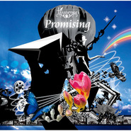

Promising
============================

|  |  |
| :--: | :-- |
| [ Promising](https://emumo.xiami.com/album/350159) | **艺人**: [tsunenori a.k.a Marukabis](../index.md) **语种**: 其他 **唱片公司**: Libyus Music **发行时间**: 2009年08月26日 **专辑类别**: 录音室专辑 **专辑风格**: 爵士说唱 Jazz Rap **播放数**: 1785473 **收藏数**: 1379 **评论数**: 88  |

## 简介

Hip Hopのみならず、JAZZY、ハウス、オーガニック、クラシックなど様々なシーンで話題となった衝撃のデビューアルバム""Landscape""に続くセカンドアルバム。  

## 曲目

## 评论

|  |  |  |  |
| :-- | :-- | :-- | :-- |
|  [虾米用户](https://emumo.xiami.com/u/10232777) 中了音乐的毒，已无药可救 2020-06-23 10:35 赞(0) 踩(0) | 
浪漫的极致
 |
|  [虾米用户](https://emumo.xiami.com/u/189921932)  2020-03-25 07:59 赞(0) 踩(0) | 

 |
|  [虾米用户](https://emumo.xiami.com/u/189921932)  2020-03-25 07:59 赞(0) 踩(0) | 

 |
|  [虾米用户](https://emumo.xiami.com/u/52056952) 人生即是到來、相遇、陪伴... 2019-11-06 23:00 赞(0) 踩(0) | 
\(๑╹◡╹๑)ﾉ♬
 |
|  [虾米用户](https://emumo.xiami.com/u/375210039)  2018-07-03 19:52 赞(0) 踩(0) | 

 |
|  [虾米用户](https://emumo.xiami.com/u/11335971) 无止境的音符冲击 2018-02-04 12:29 赞(0) 踩(0) | 
或许这就是随风潜入夜，润物细无声的最好诠释吧
 |
|  [虾米用户](https://emumo.xiami.com/u/20177386) 感谢一切美好的遇见❤️ 2018-01-27 11:15 赞(0) 踩(0) | 

 |
|  [虾米用户](https://emumo.xiami.com/u/9411631)  2017-11-14 23:29 赞(0) 踩(0) | 
来回味下Coastline，但是想把整张专辑都来一遍
 |
|  [虾米用户](https://emumo.xiami.com/u/11278437)  2017-10-28 00:05 赞(0) 踩(0) | 
太好听了 神了  好听到我快嗝屁了 我听了这么多音乐 这是目前为止我听过的最好听的专辑了  每一首都狠好听  我又要开心好一段时间了  谢谢tsunenori   谢谢  我又要乘着音乐去飞翔好一段时间喽  哈哈哈
 |
|  [虾米用户](https://emumo.xiami.com/u/5169131) 我还没想好要写什么... 2017-06-18 14:33 赞(0) 踩(0) | 
回归JAZZhiphop，最近的节奏完全不对，是时候改变一下自己，回归到原来的节奏
 |
|  [虾米用户](https://emumo.xiami.com/u/805845) Petal 2017-04-06 15:00 赞(0) 踩(0) | 
神专
 |
|  [虾米用户](https://emumo.xiami.com/u/1171396) 以前办不到的事情，未来也... 2016-12-30 19:45 赞(0) 踩(0) | 
0,0
 |
|  [虾米用户](https://emumo.xiami.com/u/49653842)   2016-08-31 00:56 赞(0) 踩(0) | 
半夜听歌，越听越饿(¬_¬)
 |
|  [虾米用户](https://emumo.xiami.com/u/11657142) inner peace 2016-02-22 18:08 赞(1) 踩(0) | 
intro前几秒那轻轻的钢琴声感觉把我带到了校园美好时光。
 |
|  [虾米用户](https://emumo.xiami.com/u/10269120) nothing 2015-12-29 21:51 赞(0) 踩(0) | 

 |
|  [虾米用户](https://emumo.xiami.com/u/7322777) ∮ 2015-12-01 20:19 赞(0) 踩(0) | 
...A....
 |
|  [虾米用户](https://emumo.xiami.com/u/11278437)  2015-11-25 15:02 赞(0) 踩(0) | 
太喜欢了 我目前为止最喜欢的一张专辑 每一首都那么牛 好听到要嗝屁啊啊啊啊啊啊啊啊啊
 |
|  [虾米用户](https://emumo.xiami.com/u/40042198)  2015-11-19 05:50 赞(1) 踩(0) | 
最神的seek居然试听量最低……
 |
| ⇒ |  [虾米用户](https://emumo.xiami.com/u/11278437)  2015-11-25 15:26 赞(0) 踩(0) | 
每一个都狠好听 SEEK不例外
 |
|  [虾米用户](https://emumo.xiami.com/u/30617820) 窝列大窝列大哟 2015-10-02 21:19 赞(0) 踩(0) | 
➿
 |
|  [虾米用户](https://emumo.xiami.com/u/30617820) 窝列大窝列大哟 2015-10-02 21:18 赞(0) 踩(0) | 
➿
 |
|  [虾米用户](https://emumo.xiami.com/u/45736248) 再累也有一首音乐能够懂你 2015-07-25 12:39 赞(0) 踩(0) | 
。
 |
|  [虾米用户](https://emumo.xiami.com/u/39788841)  . 2015-05-24 17:59 赞(0) 踩(0) | 
一直忘了给这张Lium
 |
|  [虾米用户](https://emumo.xiami.com/u/6049347)  2015-05-09 16:58 赞(0) 踩(0) | 
薰麻推荐得听啊，尤其是第六首，推荐给睡前听的 贴心~\(≧▽≦)/~
 |
|  [虾米用户](https://emumo.xiami.com/u/2867165) 喜欢听音乐，有好听的音乐... 2015-05-01 15:03 赞(0) 踩(0) | 
好听
 |
|  [虾米用户](https://emumo.xiami.com/u/3989487)  2015-04-27 21:01 赞(0) 踩(0) | 
好
 |
|  [虾米用户](https://emumo.xiami.com/u/4087806) 爸爸差点信了你的鬼话 2015-04-10 15:48 赞(1) 踩(0) | 
我往coastline里加了风声和名族女声，听了简直要嗝屁
 |
| ⇒ |  [虾米用户](https://emumo.xiami.com/u/11278437)  2017-10-28 00:05 赞(0) 踩(0) | 
哈哈哈 好听得简直要嗝屁
 |
|  [虾米用户](https://emumo.xiami.com/u/2752891)  2015-01-25 16:32 赞(0) 踩(0) | 
整张都很棒
 |
|  [虾米用户](https://emumo.xiami.com/u/14091078) 我还没想好要写什么... 2014-12-07 23:48 赞(0) 踩(0) | 
Asunaro
 |
|  [虾米用户](https://emumo.xiami.com/u/36422175)  2014-11-03 14:49 赞(0) 踩(0) | 
首首好听~
 |
|  [虾米用户](https://emumo.xiami.com/u/34906590) 这家伙很聪明,什么活口都... 2014-07-24 17:09 赞(0) 踩(0) | 
我喜欢
 |
|  [虾米用户](https://emumo.xiami.com/u/10391931) 暂无签名~ 2014-06-22 09:51 赞(0) 踩(0) | 
很清澈的感觉
 |
|  [虾米用户](https://emumo.xiami.com/u/35283093) 五月 2014-05-14 01:48 赞(0) 踩(0) | 
Fantastic Music
 |
|  [虾米用户](https://emumo.xiami.com/u/2383665) 难过时，别忘了音乐的救赎 2014-04-09 18:33 赞(0) 踩(0) | 
关于心灵，还是给它一杯午后茶吧！当代中国人少有的一种纯净。
 |
|  [虾米用户](https://emumo.xiami.com/u/23721413) Love Mix 2014-04-08 01:07 赞(0) 踩(0) | 
听完心情舒畅
 |
|  [虾米用户](https://emumo.xiami.com/u/2999336)  2014-01-27 17:56 赞(0) 踩(0) | 
留着有时间听
 |
|  [虾米用户](https://emumo.xiami.com/u/9162240)  2014-01-25 10:33 赞(0) 踩(0) | 
日本人に生まれてよかった。
 |
|  [虾米用户](https://emumo.xiami.com/u/6616655) 对声音要求越来越高 2013-12-30 22:13 赞(0) 踩(0) | 
intro真实好听到再来一炮！
 |
|  [虾米用户](https://emumo.xiami.com/u/3357007)  2013-12-19 14:47 赞(0) 踩(0) | 
简单，适合我。
 |
|  [虾米用户](https://emumo.xiami.com/u/3316779) 单身 2013-12-18 22:57 赞(0) 踩(0) | 
09年的tsunenori~~
 |
|  [虾米用户](https://emumo.xiami.com/u/22280762) 我还没想好要写什么... 2013-12-06 16:43 赞(0) 踩(0) | 
、
 |
|  [虾米用户](https://emumo.xiami.com/u/8183273)   2013-11-15 21:09 赞(0) 踩(0) | 
一张专辑里有几首特别喜欢能够单曲循环、有几首还不错，这就值得收藏了
 |
|  [虾米用户](https://emumo.xiami.com/u/6075569)   2013-11-10 16:33 赞(0) 踩(0) | 
太喜欢！！！
 |
|  [虾米用户](https://emumo.xiami.com/u/18915444) 暂无签名~ 2013-10-17 02:04 赞(0) 踩(0) | 
河野倫徳
 |
|  [虾米用户](https://emumo.xiami.com/u/1638792) 我们将不负所活… 2013-10-05 17:12 赞(0) 踩(0) | 
牛叉闪闪
 |
|  [虾米用户](https://emumo.xiami.com/u/1638792) 我们将不负所活… 2013-10-05 17:11 赞(0) 踩(0) | 
Coastline  这歌听到泪点了    好神奇的旋律
 |
|  [虾米用户](https://emumo.xiami.com/u/15644840)  2013-10-03 16:47 赞(0) 踩(0) | 
听了一首以后去听整张，果然整张都很美。
 |
|  [虾米用户](https://emumo.xiami.com/u/785416)  2013-06-10 12:39 赞(0) 踩(0) | 
恰好
 |
|  [虾米用户](https://emumo.xiami.com/u/12515769) 暂无签名~ 2013-05-12 09:50 赞(0) 踩(0) | 
好听
 |
|  [虾米用户](https://emumo.xiami.com/u/9427370)  2013-03-22 20:58 赞(0) 踩(0) | 
宁静
 |
|  [虾米用户](https://emumo.xiami.com/u/5068880) 为我施与音乐的魔法 2013-02-20 12:45 赞(0) 踩(0) | 
很美~~
 |
|  [虾米用户](https://emumo.xiami.com/u/10544845)  2013-02-12 13:02 赞(0) 踩(0) | 
coastline  神作
 |
|  [虾米用户](https://emumo.xiami.com/u/7049347)  2013-02-01 12:58 赞(0) 踩(0) | 
good
 |
|  [虾米用户](https://emumo.xiami.com/u/4787503) All we are i... 2013-01-18 22:52 赞(0) 踩(0) | 
真棒！
 |
|  [虾米用户](https://emumo.xiami.com/u/829111) ŐωŐ不暴露自己！ 2013-01-06 11:55 赞(0) 踩(0) | 
Jazz-Rap~没有高潮~但是整个曲子  缓缓道来~很适合 独自出行  带着耳麦   畅游在自己的世界中~
 |
|  [虾米用户](https://emumo.xiami.com/u/9668098)  2012-12-17 22:27 赞(0) 踩(0) | 
很棒的曲风~
 |
|  [虾米用户](https://emumo.xiami.com/u/1095311) 夜幕让城市模糊而完美 2012-10-16 21:02 赞(0) 踩(0) | 
爵士说唱，呵呵我对于这种定义很是不能理解，但 也说不好象什么，过 很好听
 |
|  [虾米用户](https://emumo.xiami.com/u/3853899) 我还没想好要写什么... 2012-10-10 21:34 赞(0) 踩(0) | 
真心不错，听着很舒心
 |
|  [虾米用户](https://emumo.xiami.com/u/4457196) 呀 2012-09-25 05:42 赞(0) 踩(0) | 
喜欢这种曲风，没有很隆重的节奏但点到即止，很舒服
 |
|  [虾米用户](https://emumo.xiami.com/u/7101525) 暂无签名~ 2012-09-17 01:21 赞(0) 踩(0) | 
耐听啊，真适合在路上听
 |
|  [虾米用户](https://emumo.xiami.com/u/59415)  2012-09-15 10:02 赞(0) 踩(0) | 
稀饭无理由
 |
|  [虾米用户](https://emumo.xiami.com/u/5982457)  2012-05-23 15:03 赞(1) 踩(0) | 
好的音乐就像一场盛宴。绽放耳内朵朵乐蕾，调动和接应心灵各样感受和情绪，无论是天然共鸣还是人工激发，这愉悦滋味真真妙不可言~~叫做人类的生物请为了具有能欣赏这般美好的力量颤抖地哭泣吧！
 |
|  [虾米用户](https://emumo.xiami.com/u/9201200)  2012-05-17 14:50 赞(0) 踩(0) | 
感动震撼喧嚣的世界这样的音乐不多了摒弃浮躁着1身轻装
 |
|  [虾米用户](https://emumo.xiami.com/u/8414922)  2012-04-20 13:52 赞(0) 踩(0) | 
尝尝！！！
 |
|  [虾米用户](https://emumo.xiami.com/u/2069500)  2012-03-16 01:21 赞(8) 踩(0) | 
My dear Flora,everything&amp;#039;s gonna be alright. ：)
 |
|  [虾米用户](https://emumo.xiami.com/u/3812689)  2012-03-04 23:30 赞(0) 踩(0) | 
Coastline--耳语海岸
 |
|  [虾米用户](https://emumo.xiami.com/u/7448595)  2012-02-14 17:59 赞(0) 踩(0) | 
比较电，但是很肉麻。
 |
|  [虾米用户](https://emumo.xiami.com/u/1650506)  2012-02-01 12:50 赞(0) 踩(0) | 
Brand New Surf Emerge
 |
|  [虾米用户](https://emumo.xiami.com/u/7843461)  2012-01-30 09:33 赞(0) 踩(0) | 
很好听咧
 |
|  [虾米用户](https://emumo.xiami.com/u/1396206) 聆听月升 2012-01-12 16:29 赞(0) 踩(0) | 
确实不甜不腻，多了一份温情，每一轨都让人着迷
 |
|  [虾米用户](https://emumo.xiami.com/u/1396206) 聆听月升 2012-01-09 20:11 赞(0) 踩(0) | 
这张是320的，太好了
 |
| ⇒ |  [虾米用户](https://emumo.xiami.com/u/1815096) 新世纪 2012-01-15 19:35 赞(0) 踩(0) | 
这张被你收藏了，我看见了，还不错啊。我听过了。
 |
|  [虾米用户](https://emumo.xiami.com/u/5170986) 从小耍流氓，长大风清扬 2012-01-08 12:06 赞(0) 踩(0) | 
Coastline ,缓慢的递进序曲拉开遐想序幕，空灵的钢琴带入正式的节奏，颇有DJ okawari的韵味，之后的效果器鼓点又带有Nomak的诗意~行云流水。
 |
|  [虾米用户](https://emumo.xiami.com/u/2750725) Imagination.... 2011-10-27 00:52 赞(0) 踩(0) | 
难得的好制作，啥也不说了~
 |
|  [虾米用户](https://emumo.xiami.com/u/318040) 旋律如血奔流不息 2011-09-02 14:24 赞(0) 踩(0) | 
很棒的纯音乐
 |
|  [虾米用户](https://emumo.xiami.com/u/1740682)  2011-08-26 02:49 赞(0) 踩(0) | 
太喜欢了
 |
|  [虾米用户](https://emumo.xiami.com/u/5022533)  2011-08-25 14:23 赞(0) 踩(0) | 
nice
 |
|  [虾米用户](https://emumo.xiami.com/u/1161126)  2011-08-08 20:08 赞(0) 踩(0) | 
vevy good
 |
|  [虾米用户](https://emumo.xiami.com/u/574235)  2011-08-07 20:27 赞(0) 踩(0) | 
多了份抒情，少了份纷扰...
 |
|  [虾米用户](https://emumo.xiami.com/u/4347301) 只爱你 2011-07-14 23:38 赞(0) 踩(0) | 
just like
 |
|  [虾米用户](https://emumo.xiami.com/u/1661453)   2011-06-24 12:58 赞(0) 踩(0) | 
总有些音乐 让你听到泪流满面 即使什么言语都没有。
 |
|  [虾米用户](https://emumo.xiami.com/u/3561693)  2011-06-22 22:47 赞(0) 踩(0) | 
继叶加后，我喜欢的另一个日本大叔
 |
|  [虾米用户](https://emumo.xiami.com/u/1052461) @blinK4sy- 2011-04-30 15:03 赞(0) 踩(0) | 
Surf Emergy
 |
|  [虾米用户](https://emumo.xiami.com/u/3081765) 暂无签名~ 2011-04-26 23:27 赞(0) 踩(0) | 
没有理由不喜欢啊。。那种悠扬
 |
|  [虾米用户](https://emumo.xiami.com/u/876509)  2011-03-13 21:06 赞(0) 踩(0) | 
不甜不腻的东方
 |
|  [虾米用户](https://emumo.xiami.com/u/2603908)  2011-01-24 21:07 赞(0) 踩(0) | 
大爱
 |
|  [虾米用户](https://emumo.xiami.com/u/2561361)  2011-01-21 04:53 赞(0) 踩(0) | 
就是好
 |
