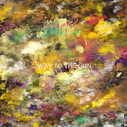
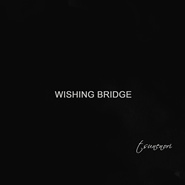
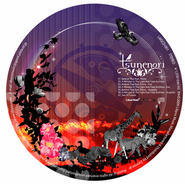
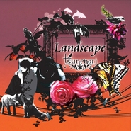

tsunenori a.k.a Marukabis
============================

|  |  |
| :--: | :-- |
| [ tsunenori a.k.a Marukabis](https://i.xiami.com/marukabis) | **地区**: Japan 日本 **风格**: 流行 Pop, 电子 Electronic, 轻音乐 Easy Listening, 自然新世纪 Nature New Age **播放数**: 11779994 **粉丝数**: 14365 **评论数**: 578  |

## 档案

tsunenori 又名 Marukabis 
1983年出生，北九州出身的作曲家兼音乐人。 
如同画家绘制画作、摄影家拍摄作品一样，Tsunenori又名Marukabis用音符描写，表现了景色与季节、心境与回忆，让人仿佛能看到画面，拨动人们感情的琴弦。那对于旋律的感觉以及编曲能力是无人能及的。 
2008年，在推出了DJ OKAWARI等美景音乐人的Libyus Music公司，他们用第一张《Landscape》专辑横空出世，以Tsunenori的名义先后发行了《Promising》《FANTASTIC JOURNEY》两张专辑。 
2017年他们开始专注于自己进行音乐活动，并且将艺名改为Marukabis。同时发行了仅收录了新曲的《THE FIRST CHAPTER》，以及收录了将至今所有发售过的曲子重新录制并且改编的曲子的《THE SECOND CHAPTER》两张专辑。 
省去了先入为主的观念，以及给予音乐附加价值的一切附加物，靠声音本身的魅力从日本将自己的优质音乐发散至世界是他们的目标。 
2018年4月，万众期待的中国公演将在万代南梦宫上海文化中心-未来剧场进行。

## 专辑

| 名称 | 语种 | 唱片公司 | 发行时间 | 专辑类别 | 专辑风格 |
| :--: | :-- | :-- | :-- | :-- | :-- |
| [ Way to the Sun - Single](./albums/2102689455.md) | 英语 | Tsunenori | 2016年03月02日 | EP, 单曲 |  |
| [ Home](./albums/2100384521.md) | 其他 | Tsunenori | 2016年02月21日 | EP, 单曲 |  |
| [ Black Is Beautiful](./albums/2100277178.md) | 日语 | Tsunenori | 2016年02月14日 | EP, 单曲 |  |
| [ The Swan Song - Single](./albums/2100277176.md) | 日语 | Tsunenori | 2016年02月12日 | EP, 单曲 |  |
| [ View of the Ocean](./albums/2100252046.md) | 日语 | Self-Released | 2015年12月24日 | EP, 单曲 |  |
| [ Wishing Bridge](./albums/2100247936.md) | 日语 | Tsunenori | 2015年12月11日 | EP, 单曲 |  |
| [ Another Perfect Day](./albums/2100240966.md) | 日语 | Self-Released | 2015年10月31日 | EP, 单曲 |  |
| [ FANTASTIC JOURNEY](./albums/1431657803.md) | 日语 | Tsunenori | 2015年05月13日 | 录音室专辑 | 爵士说唱 Jazz Rap |
| [ Next School](./albums/504274.md) | 日语 | UNIVERSAL J | 2012年03月28日 | EP, 单曲 |  |
| [ Believe That feat. Pismo](./albums/465728.md) | 日语 | Libyus Music | 2009年11月17日 | EP, 单曲 | 爵士说唱 Jazz Rap |
| [ Promising](./albums/350159.md) | 其他 | Libyus Music | 2009年08月26日 | 录音室专辑 | 爵士说唱 Jazz Rap |
| [ Landscape](./albums/342163.md) | 日语 | Libyus Music | 2008年08月27日 | 录音室专辑 | 爵士说唱 Jazz Rap |

## 评论

|  |  |  |
| :-- | :-- | :-- |
|  [虾米用户](https://emumo.xiami.com/u/4230706)  2021-01-10 21:10 赞(0) 踩(0) | 
大爷的   虾米先玩球去了。狗日的阿里！坑完一个挨一个！下个就是优酷 饿了么！
 |
|  [虾米用户](https://emumo.xiami.com/u/41021627) Breathturn 2020-10-04 11:08 赞(0) 踩(0) | 
喊我
 |
|  [虾米用户](https://emumo.xiami.com/u/41021627) Breathturn 2020-10-04 11:08 赞(1) 踩(0) | 
有演出我一定要去啊
 |
|  [虾米用户](https://emumo.xiami.com/u/933157) 泥豪啊同志！ 2020-09-16 23:40 赞(0) 踩(0) | 
已
 |
|  [虾米用户](https://emumo.xiami.com/u/44370436)  2020-04-25 23:30 赞(0) 踩(0) | 
有没有你的数字专辑？这虾米的MP3音质太差了！
 |
|  [虾米用户](https://emumo.xiami.com/u/342719794)  2020-04-22 14:50 赞(0) 踩(0) | 
道理我都懂，听到有千与千寻的旋律怎么说。。。
 |
|  [虾米用户](https://emumo.xiami.com/u/303594537)  绝笔不是00后 2020-04-09 20:54 赞(0) 踩(0) | 
日风，韩风，国风（可能在这种音乐风格里，进入得晚了，就不能说是自己的风格了，但没关系，格调还是有区别的。） 更不要褒贬不一，每个人喜好都不一样 这几种风格很容易界定，听得出来。 但又不好界定，时间年代，以及作者的经历、心境，都会影响到每首曲风。
 |
|  [虾米用户](https://emumo.xiami.com/u/45507669) 好像不太个性 2020-02-06 20:19 赞(0) 踩(0) | 
怎么知道什么时候来中国演出呢
 |
|  [虾米用户](https://emumo.xiami.com/u/40603098) You can’t ho... 2019-11-26 08:37 赞(0) 踩(0) | 

 |
|  [虾米用户](https://emumo.xiami.com/u/356763773) 我还没想好要写什么... 2019-10-11 12:07 赞(0) 踩(0) | 
。
 |
|  [虾米用户](https://emumo.xiami.com/u/340903899) 我还没想好要写什么... 2019-09-10 11:23 赞(0) 踩(0) | 
，
 |
|  [虾米用户](https://emumo.xiami.com/u/42963872) 我还没想好要写什么... 2019-07-12 07:28 赞(0) 踩(0) | 
.
 |
|  [虾米用户](https://emumo.xiami.com/u/408061766)  2019-06-27 22:00 赞(0) 踩(0) | 
我关注错了
 |
|  [虾米用户](https://emumo.xiami.com/u/5169131) 我还没想好要写什么... 2019-06-02 09:52 赞(1) 踩(0) | 
代表着10年前的记忆，最优美的音乐莫过于此吧
 |
|  [虾米用户](https://emumo.xiami.com/u/7046344)  2019-04-27 01:45 赞(0) 踩(0) | 
又想你了来看看
 |
|  [虾米用户](https://emumo.xiami.com/u/52056952) 人生即是到來、相遇、陪伴... 2019-04-19 12:37 赞(0) 踩(0) | 
(๑・ω-)～♥”
 |
|  [虾米用户](https://emumo.xiami.com/u/346165752)  2019-03-28 19:38 赞(0) 踩(0) | 

 |
|  [虾米用户](https://emumo.xiami.com/u/40587864)   2018-11-10 08:17 赞(0) 踩(0) | 
日本人总能创造出这种清脆悦耳，而又带有几分忧郁的曲子。
 |
|  [虾米用户](https://emumo.xiami.com/u/314060151) 我是天蝎座 2018-10-25 15:01 赞(0) 踩(0) | 
好的音乐大家都喜欢!
 |
|  [虾米用户](https://emumo.xiami.com/u/3552342) 孤独一人 照顾星辰 2018-10-02 22:00 赞(0) 踩(0) | 
收！
 |
|  [虾米用户](https://emumo.xiami.com/u/122096236) hey 我们一起去旅行吧... 2018-07-30 20:06 赞(0) 踩(0) | 
他的音乐真的很有画面感
 |
|  [虾米用户](https://emumo.xiami.com/u/66823378)  2018-07-21 00:47 赞(0) 踩(0) | 

 |
|  [虾米用户](https://emumo.xiami.com/u/6121035) from here to... 2018-07-15 12:10 赞(0) 踩(0) | 
Promising&amp;amp;Landscape，ほんとに大好き
 |
|  [虾米用户](https://emumo.xiami.com/u/375210039)  2018-07-03 09:37 赞(0) 踩(0) | 

 |
|  [虾米用户](https://emumo.xiami.com/u/246261693)  2018-05-05 13:57 赞(0) 踩(0) | 
an avenue简直太赞了
 |
|  [虾米用户](https://emumo.xiami.com/u/3197383) 生活中碰到知音的几率是零 2018-04-26 07:02 赞(0) 踩(0) | 
登录上海了 
 |
|  [虾米用户](https://emumo.xiami.com/u/8959580) 拜拜各位 2018-04-25 17:22 赞(0) 踩(0) | 
照片很帅
 |
|  [虾米用户](https://emumo.xiami.com/u/10125577) 原来你也在这里 2018-04-14 22:34 赞(3) 踩(0) | 
今晚看了首秀Alive，值了
 |
|  [虾米用户](https://emumo.xiami.com/u/32056965) stay gold. 2018-04-14 00:56 赞(2) 踩(0) | 
今天
 |
|  [虾米用户](https://emumo.xiami.com/u/1115247) @Nebula_7293 2018-04-13 21:35 赞(0) 踩(0) | 
／
 |
|  [虾米用户](https://emumo.xiami.com/u/8959580) 拜拜各位 2018-04-13 18:59 赞(26) 踩(0) | 
今天在下榻的酒店遇见tsunenori本人！简直是奇妙的缘分！期待明天的演出！
 |
| ⇒ |  [虾米用户](https://emumo.xiami.com/u/32056965) stay gold. 2018-04-14 00:56 赞(0) 踩(0) | 
哇！！我也明天去看，他住在哪儿的呀 
 |
| ⇒ |  [虾米用户](https://emumo.xiami.com/u/8959580) 拜拜各位 2018-04-14 19:21 赞(0) 踩(0) | 
<q><b>Ocean 337说：</b></q>
 |
| ⇒ |  [虾米用户](https://emumo.xiami.com/u/246261693)  2018-05-05 13:56 赞(0) 踩(0) | 
太幸运了你
 |
| ⇒ |  [虾米用户](https://emumo.xiami.com/u/40174618) 以梦为马 2018-06-08 02:49 赞(0) 踩(0) | 
真人帅吗 
 |
| ⇒ |  [虾米用户](https://emumo.xiami.com/u/615653)  2019-01-06 15:01 赞(0) 踩(0) | 
靠。。
 |
|  [虾米用户](https://emumo.xiami.com/u/344092974)   2018-04-12 10:40 赞(24) 踩(0) | 
中国的乐迷们，大家好！我是Marukabis。可能大家耳熟能详的是tsunenori这个名字。这周末，将初次来到上海举办首次演出。以tsunenori这个名义最初在2008年发行了CD，10年的岁月里程将在上海的live现场验证。很感谢能有这次机会。这次是新曲与旧曲的结合演绎。期待与大家在现场见面！  【Bad News呈现】Fuseland in Shanghai治愈系人气日系爵士嘻哈tsunenori a.k.a. Marukabis 2018 首次中国专场演出4月14日（周六）万代南梦宫上海文化中心 未来剧场
 |
| ⇒ |  [虾米用户](https://emumo.xiami.com/u/32056965) stay gold. 2018-04-14 00:57 赞(0) 踩(0) | 
期待！
 |
| ⇒ |  [虾米用户](https://emumo.xiami.com/u/49655313) 除了再见还可以说些什么呢 2018-12-07 19:28 赞(0) 踩(0) | 
请考虑西安吧！拜托了！
 |
| ⇒ |  [虾米用户](https://emumo.xiami.com/u/856551) 虾米活下去 用户指责什么... 2019-07-07 23:51 赞(0) 踩(0) | 
请尝试更多次来中国巡演吧！ plz come China make tour more often. We Love You！
 |
| ⇒ |  [虾米用户](https://emumo.xiami.com/u/247610881) 面对我前面的人群，我得穿... 2019-09-21 19:11 赞(0) 踩(0) | 
<q><b>浮游说：</b></q>
 |
| ⇒ |  [虾米用户](https://emumo.xiami.com/u/434748132)  2019-12-27 02:25 赞(0) 踩(0) | 
特别喜欢这首曲子
 |
|  [虾米用户](https://emumo.xiami.com/u/329866439) 喜欢一个人不应该单相思，... 2018-03-31 20:41 赞(1) 踩(0) | 
崇拜崇拜，感觉真的太有故事了(･ิ&amp;piv;･ิ)っ&amp;hearts;笔芯
 |
|  [虾米用户](https://emumo.xiami.com/u/487232) 直到光芒带走我们 2018-03-16 22:54 赞(0) 踩(0) | 
上海站有一起的么，只想找一个伴～
 |
|  [虾米用户](https://emumo.xiami.com/u/4401950)  2018-03-14 19:02 赞(0) 踩(0) | 
要来中国了
 |
|  [虾米用户](https://emumo.xiami.com/u/344092974)   2018-02-16 22:39 赞(32) 踩(0) | 
上海ライブの詳細が決まりました改名がなかなか広まらないのでしばらくはa.k.a表記に。  【Bad News呈现】Fuseland in Shanghai 治愈系人气日系爵士嘻哈tsunenori a.k.a Marukabis 2018 首次中国专场演出 4月14日（周六）万代南梦宫上海文化中心 未来剧场 公演详情&amp;amp;购票：<a href="https://www.showstart.com/event/44865" target="_blank" rel="nofollow noreferrer noopener">https://www.showstart.com/event/44865</a>
 |
|  [虾米用户](https://emumo.xiami.com/u/321225568)  2018-02-15 15:43 赞(1) 踩(0) | 
我不能去，我还是个学生，而且我家也离那远 
 |
|  [虾米用户](https://emumo.xiami.com/u/155947) 一期一会 2018-02-09 07:53 赞(0) 踩(0) | 
巡演求出北京站 
 |
|  [虾米用户](https://emumo.xiami.com/u/5604492) ‪‪♬✧訂閱號：Morn... 2018-02-07 16:43 赞(0) 踩(0) | 
收到
 |
|  [虾米用户](https://emumo.xiami.com/u/2354958)  2018-02-07 15:16 赞(1) 踩(0) | 
3。4月的演出。爆炸啊
 |
|  [虾米用户](https://emumo.xiami.com/u/14091078) 我还没想好要写什么... 2018-02-02 00:15 赞(1) 踩(0) | 
治愈系人气日系爵士嘻哈 tsunenori 2018 首次中国专场演出  演出时间：04 月 14 日 20:00-22:00 艺人： tsunenori a.k.a Marukabis / Kotaro Shimazaki 场地： 上海 万代南梦宫上海文化中心 2F 未来剧场  <a href="https://www.showstart.com/event/44865" target="_blank" rel="nofollow noreferrer noopener">https://www.showstart.com/event/44865</a>
 |
|  [虾米用户](https://emumo.xiami.com/u/9486114) 倾东海以为酒 2018-01-29 22:45 赞(1) 踩(0) | 
你要来中国啦
 |
|  [虾米用户](https://emumo.xiami.com/u/5990820)  2018-01-29 14:17 赞(1) 踩(0) | 
4月14日 上海南梦宫中国首演
 |
|  [虾米用户](https://emumo.xiami.com/u/307925926)  2018-01-27 20:52 赞(0) 踩(0) | 
挺好
 |
|  [虾米用户](https://emumo.xiami.com/u/50443023) 网易云：生唐___ 2018-01-18 15:01 赞(0) 踩(0) | 
w
 |
|  [虾米用户](https://emumo.xiami.com/u/251843784) 那么  唱得都是我的心水 2017-12-30 00:11 赞(0) 踩(0) | 
好舒服
 |
|  [虾米用户](https://emumo.xiami.com/u/36537308) 重的都留在這 2017-12-17 10:08 赞(0) 踩(0) | 
Seek
 |
|  [虾米用户](https://emumo.xiami.com/u/40587864)   2017-11-28 22:58 赞(0) 踩(0) | 
大师，膜拜
 |
|  [虾米用户](https://emumo.xiami.com/u/221695408) 我还没想好要写什么... 2017-11-15 20:10 赞(0) 踩(0) | 
♪
 |
|  [虾米用户](https://emumo.xiami.com/u/19818763)  2017-10-16 22:19 赞(14) 踩(0) | 
河野今年开了新马甲：マルカビス(Marukabis)，旧马甲：ツネノリ(tsunenori) 目前已经弃坑。 目前以Marukabis的名义发了两张专辑(均为之前已经发行的旧曲精选)，并有部分新曲以单曲的方式进行了发售 希望虾米能即使更新一下作者资料，并跟进资源。
 |
|  [虾米用户](https://emumo.xiami.com/u/174896296) 小众？？？ 2017-09-20 12:21 赞(0) 踩(0) | 
我觉得很ok
 |
|  [虾米用户](https://emumo.xiami.com/u/279135481)  2017-09-07 00:23 赞(0) 踩(0) | 
日本作曲家
 |
|  [虾米用户](https://emumo.xiami.com/u/6652575) mbz2006 2017-09-06 20:17 赞(0) 踩(0) | 
ok
 |
|  [虾米用户](https://emumo.xiami.com/u/7723663)  2017-07-30 17:17 赞(0) 踩(0) | 
舒缓
 |
|  [虾米用户](https://emumo.xiami.com/u/39466220) Nine Billion... 2017-07-29 16:18 赞(3) 踩(0) | 
高中到现在&amp;hellip;感觉只听jazzhihop ，还有后摇了
 |
|  [虾米用户](https://emumo.xiami.com/u/5854459) 潮牌https://dw... 2017-07-16 07:45 赞(2) 踩(0) | 
看得见风景的音乐~              清凉嗨~
 |
|  [虾米用户](https://emumo.xiami.com/u/52056952) 人生即是到來、相遇、陪伴... 2017-06-27 14:06 赞(0) 踩(0) | 

 |
|  [虾米用户](https://emumo.xiami.com/u/9327494) http://www.x... 2017-05-31 08:23 赞(1) 踩(0) | 
View of the Ocean
 |
|  [虾米用户](https://emumo.xiami.com/u/33917570)  美好总会遇见美好~ 2017-05-20 17:28 赞(0) 踩(0) | 
想念日风jazz hiphop带给我的世界，想念她，那个世界中属于我的主角&amp;hellip;&amp;hellip;
 |
|  [虾米用户](https://emumo.xiami.com/u/279842598) Motvation wr... 2017-04-24 19:32 赞(2) 踩(0) | 
你告诉我这是说唱？ 
 |
|  [虾米用户](https://emumo.xiami.com/u/10959976) 醉与春风舞，飘然在云中 2017-04-22 21:18 赞(1) 踩(0) | 
好美的音乐，闻一闻，清新入心！日本居然会有如此作曲家，天降奇才啊
 |
|  [虾米用户](https://emumo.xiami.com/u/21240974)  2017-04-17 09:59 赞(1) 踩(0) | 
舒缓,纯音乐,
 |
|  [虾米用户](https://emumo.xiami.com/u/36106622) 动感节奏大师 2017-03-22 11:26 赞(4) 踩(0) | 
怎么就是日本的呢 郁闷...
 |
| ⇒ |  [虾米用户](https://emumo.xiami.com/u/284797503)  2017-04-08 09:27 赞(0) 踩(0) | 
艺术无国界
 |
| ⇒ |  [虾米用户](https://emumo.xiami.com/u/6635175) 洗车 上秋名山！ 2017-05-24 00:28 赞(0) 踩(0) | 
日本此类型的艺术家多如牛毛
 |
| ⇒ |  [虾米用户](https://emumo.xiami.com/u/36892387) 土土哥 2018-02-08 11:01 赞(0) 踩(0) | 
日本的怎么了。。
 |
|  [虾米用户](https://emumo.xiami.com/u/597569) 何必故作姿态 2017-03-11 22:58 赞(0) 踩(0) | 
sc上又新专辑试听，不过冷饭略多
 |
| ⇒ |  [虾米用户](https://emumo.xiami.com/u/3643353) 虾米要关闭了，难说再见！... 2017-03-12 09:27 赞(0) 踩(0) | 
我听好几首都改编了。等我传上来
 |
| ⇒ |  [虾米用户](https://emumo.xiami.com/u/805845) Petal 2017-04-06 15:00 赞(0) 踩(0) | 
<q><b>笛在月明楼说：</b></q>
 |
|  [虾米用户](https://emumo.xiami.com/u/1700002) V5_ORZZZZZ 2017-03-11 11:32 赞(1) 踩(0) | 
改名Marukabis归来666666666666666666666666666666 666666666666666666666666666666 6666666
 |
|  [虾米用户](https://emumo.xiami.com/u/1643164) 阳光淌过手心天空笑了笑！ 2017-02-07 16:53 赞(0) 踩(0) | 
喜欢~_~
 |
|  [虾米用户](https://emumo.xiami.com/u/52682108) 我还没想好要写什么... 2017-01-10 00:33 赞(0) 踩(0) | 
～
 |
|  [虾米用户](https://emumo.xiami.com/u/1171396) 以前办不到的事情，未来也... 2016-12-30 19:44 赞(0) 踩(0) | 
0,0
 |
|  [虾米用户](https://emumo.xiami.com/u/5978228)  2016-12-19 20:30 赞(1) 踩(0) | 
感觉2003比continue the voyage好听些
 |
|  [虾米用户](https://emumo.xiami.com/u/45500621) 我还没想好要写什么... 2016-12-01 18:18 赞(0) 踩(0) | 
太棒了
 |
|  [虾米用户](https://emumo.xiami.com/u/9552584) 人生太短，也太长。 2016-11-21 14:15 赞(2) 踩(0) | 
View of the Ocean 超好听！笛声出来整个世界都安静了。没在热门里感觉有必要推荐一下
 |
|  [虾米用户](https://emumo.xiami.com/u/37334254) Voracity / ✝... 2016-11-05 12:54 赞(0) 踩(0) | 

 |
|  [虾米用户](https://emumo.xiami.com/u/47172744) 慢慢学乐理 2016-11-04 21:51 赞(1) 踩(0) | 
卧槽(#ﾟДﾟ)贵州的广告给他付版权费了吗？
 |
|  [虾米用户](https://emumo.xiami.com/u/25398465) 夜夜梦魂牵绕……未能眠… 2016-09-22 14:53 赞(0) 踩(0) | 
Tsunenori,Jazz-hiphop纯音乐,纯音电子,舒缓,
 |
|  [虾米用户](https://emumo.xiami.com/u/85148548)  2016-08-27 19:31 赞(0) 踩(0) | 
太太太喜欢了
 |
|  [虾米用户](https://emumo.xiami.com/u/36208991)   2016-08-17 02:14 赞(0) 踩(0) | 
ฅ⃛
 |
|  [虾米用户](https://emumo.xiami.com/u/341091) 偶爱我们呢~ 2016-07-28 16:00 赞(0) 踩(0) | 
我记得我明明收藏了的……虾米是怎么了……
 |
|  [虾米用户](https://emumo.xiami.com/u/191714402)   2016-07-11 16:51 赞(0) 踩(0) | 
  
 |
|  [虾米用户](https://emumo.xiami.com/u/28436653)  2016-06-24 11:19 赞(0) 踩(0) | 
会稽山
 |
|  [虾米用户](https://emumo.xiami.com/u/44261645) 我还没想好要写什么... 2016-06-23 14:07 赞(0) 踩(0) | 

 |
|  [虾米用户](https://emumo.xiami.com/u/49075538) 爱笑 简单 清澈 温暖而... 2016-04-29 15:08 赞(0) 踩(0) | 
喵
 |
|  [虾米用户](https://emumo.xiami.com/u/1565983) 配乐大师门下走狗。 2016-03-22 11:14 赞(1) 踩(0) | 
古典与现代的完美结合
 |
|  [虾米用户](https://emumo.xiami.com/u/2033372) 没什么比合适的音乐更好 2016-03-13 23:34 赞(0) 踩(0) | 
听他的音乐真的快爱上作曲家了
 |
|  [虾米用户](https://emumo.xiami.com/u/566414)  2016-03-06 21:13 赞(0) 踩(0) | 
相当可以
 |
|  [虾米用户](https://emumo.xiami.com/u/612955)  2016-03-01 19:18 赞(2) 踩(0) | 
电台随机到的，好好听！！&amp;gt;0&amp;lt;氛围好迷人！酣畅淋漓！听到美好的音乐就在想象是怎样灵动清澈的内心世界才能创造出这样美好的音乐啊～～～～～
 |
|  [虾米用户](https://emumo.xiami.com/u/6995928) ∪ 2016-02-29 00:15 赞(1) 踩(0) | 
爵士嘻哈。。。是这个样子？
 |
|  [虾米用户](https://emumo.xiami.com/u/39283380) 踏碎梦想，再重新组合。 2016-02-23 16:27 赞(0) 踩(0) | 
梦回盛唐
 |
|  [虾米用户](https://emumo.xiami.com/u/93706890) 我还没想好要写什么... 2016-02-12 15:30 赞(1) 踩(0) | 
完全因为2003喜欢上了1
 |
|  [虾米用户](https://emumo.xiami.com/u/28946659)   2016-01-19 17:31 赞(0) 踩(0) | 

 |
|  [虾米用户](https://emumo.xiami.com/u/94132816)  2016-01-19 17:28 赞(0) 踩(0) | 
waa
 |
|  [虾米用户](https://emumo.xiami.com/u/28946659)   2016-01-12 14:00 赞(0) 踩(0) | 
散步
 |
|  [虾米用户](https://emumo.xiami.com/u/417223) 应见未见，如此之多 2016-01-08 21:10 赞(0) 踩(0) | 
有没有人听过他的moment，好久之前听的好棒但虾米上好像没有啊  
 |
|  [虾米用户](https://emumo.xiami.com/u/5169131) 我还没想好要写什么... 2015-12-31 23:47 赞(0) 踩(0) | 
  
 |
|  [虾米用户](https://emumo.xiami.com/u/89126536) 天空还是海洋？ 2015-12-30 09:25 赞(1) 踩(0) | 
与ROMANTIC PRODUCTION风格相似
 |
|  [虾米用户](https://emumo.xiami.com/u/10347207) 花落知多少 2015-12-19 20:02 赞(0) 踩(0) | 
艾玛，好听
 |
|  [虾米用户](https://emumo.xiami.com/u/90677214) 音乐的天堂 2015-12-16 17:51 赞(0) 踩(0) | 
神的地方
 |
|  [虾米用户](https://emumo.xiami.com/u/5826453) 唯音乐与爱不可辜负 2015-12-11 21:03 赞(2) 踩(0) | 
okawari之后就是你了 tsunenori
 |
|  [虾米用户](https://emumo.xiami.com/u/7322777) ∮ 2015-12-01 20:19 赞(0) 踩(0) | 
...A....
 |
|  [虾米用户](https://emumo.xiami.com/u/8131645)  2015-11-30 16:37 赞(0) 踩(0) | 
好心情
 |
|  [虾米用户](https://emumo.xiami.com/u/13722326)  2015-11-23 16:51 赞(0) 踩(0) | 
日系配乐
 |
|  [虾米用户](https://emumo.xiami.com/u/2106285) 原来我不懂欣赏，我只是看... 2015-11-08 22:32 赞(0) 踩(0) | 
听着对胃口
 |
|  [虾米用户](https://emumo.xiami.com/u/52056952) 人生即是到來、相遇、陪伴... 2015-10-30 09:24 赞(0) 踩(0) | 
第五张帅
 |
|  [虾米用户](https://emumo.xiami.com/u/48788587) 水瓶女 2015-10-25 15:39 赞(0) 踩(0) | 
”灵魂之乐”当推日系爵士嘻哈
 |
|  [虾米用户](https://emumo.xiami.com/u/67109486) 雪之女王 2015-10-22 00:09 赞(0) 踩(0) | 
好听
 |
|  [虾米用户](https://emumo.xiami.com/u/45336092)  2015-10-09 21:16 赞(0) 踩(0) | 
诚如档案所言
 |
|  [虾米用户](https://emumo.xiami.com/u/36953267) 此去经年。 2015-09-30 18:14 赞(1) 踩(0) | 
我爱封面
 |
|  [虾米用户](https://emumo.xiami.com/u/8538056) Absolutely 2015-09-22 20:46 赞(0) 踩(0) | 
2003
 |
|  [虾米用户](https://emumo.xiami.com/u/37098145) 这个家伙太蠢了不会留下什... 2015-09-01 04:37 赞(1) 踩(0) | 
wk
 |
|  [虾米用户](https://emumo.xiami.com/u/1094811) 感谢陪伴 2015-08-12 16:58 赞(4) 踩(0) | 
就是因为有这些音乐的存在，我才离不开虾米 
 |
|  [虾米用户](https://emumo.xiami.com/u/39788841)  . 2015-08-06 13:15 赞(1) 踩(0) | 
艺人信息里为什么要把“日”写成“曰”〒_〒
 |
|  [虾米用户](https://emumo.xiami.com/u/45736248) 再累也有一首音乐能够懂你 2015-07-25 12:40 赞(3) 踩(0) | 
你无法否认日本
 |
|  [虾米用户](https://emumo.xiami.com/u/3097798) 爱二次元，二次元赛高 2015-07-19 00:37 赞(1) 踩(0) | 
日本的音乐辨识度总是这么高。。
 |
|  [虾米用户](https://emumo.xiami.com/u/8128176) 好好活着 2015-07-15 13:44 赞(0) 踩(0) | 
新专辑
 |
|  [虾米用户](https://emumo.xiami.com/u/9025912) 不是本人 2015-05-24 12:57 赞(1) 踩(0) | 
收，收，收！
 |
|  [虾米用户](https://emumo.xiami.com/u/7579251)  2015-05-16 22:15 赞(0) 踩(0) | 
空灵
 |
|  [虾米用户](https://emumo.xiami.com/u/9730064) 纯音党 2015-05-16 19:08 赞(0) 踩(0) | 
An Avenue
 |
|  [虾米用户](https://emumo.xiami.com/u/5169131) 我还没想好要写什么... 2015-05-15 21:58 赞(3) 踩(0) | 
男神多年之后的新作终于到来,感觉又回到了高中,时光如梭啊,接下来的心愿就是OKAWARI能再发一张了
 |
|  [虾米用户](https://emumo.xiami.com/u/34323138) Listening is... 2015-05-14 17:04 赞(0) 踩(0) | 
2015-5-13  新专已发
 |
|  [虾米用户](https://emumo.xiami.com/u/597569) 何必故作姿态 2015-05-11 15:52 赞(0) 踩(0) | 
很久没新东西了
 |
|  [虾米用户](https://emumo.xiami.com/u/6049347)  2015-05-09 16:52 赞(0) 踩(0) | 
Kaoru桑推荐23333
 |
|  [虾米用户](https://emumo.xiami.com/u/2425529)  2015-05-08 21:47 赞(0) 踩(0) | 
2003
 |
|  [虾米用户](https://emumo.xiami.com/u/20862728) 柯男 2015-05-06 13:34 赞(0) 踩(0) | 
(●—●)
 |
|  [虾米用户](https://emumo.xiami.com/u/16816739) 你是猴子派来的还是大师兄 2015-04-28 20:00 赞(0) 踩(0) | 
舒缓，自然
 |
|  [虾米用户](https://emumo.xiami.com/u/10895210)  2015-04-24 18:52 赞(0) 踩(0) | 
喜欢JAZZ -HIP HOP的请加 306843736 群主听的很广哦一定能在这找到喜欢的音乐
 |
|  [虾米用户](https://emumo.xiami.com/u/7757466) 只想好好当个垃圾✓ 2015-04-23 22:07 赞(1) 踩(0) | 
☣
 |
|  [虾米用户](https://emumo.xiami.com/u/33953474)  2015-04-20 13:51 赞(0) 踩(0) | 
很赞呐
 |
|  [虾米用户](https://emumo.xiami.com/u/42021985) 生命力内流之人的轻诉 2015-04-13 21:01 赞(0) 踩(0) | 
少了几多歌 好想听diamond sea
 |
|  [虾米用户](https://emumo.xiami.com/u/42683499) Moon Flow 2015-03-29 10:05 赞(0) 踩(0) | 
好好好
 |
|  [虾米用户](https://emumo.xiami.com/u/22917778) = =+ 2015-03-24 22:13 赞(0) 踩(0) | 
2003真的很好听
 |
|  [虾米用户](https://emumo.xiami.com/u/11846479) ai 2015-03-23 00:02 赞(0) 踩(0) | 
最好听的不是第一首
 |
|  [虾米用户](https://emumo.xiami.com/u/48133991)  2015-03-14 20:15 赞(0) 踩(0) | 
声音
 |
|  [虾米用户](https://emumo.xiami.com/u/44368575)   2015-03-09 12:15 赞(0) 踩(0) | 
。
 |
|  [虾米用户](https://emumo.xiami.com/u/7008200) 过自己的生活，听爱听的歌 2015-03-08 16:06 赞(0) 踩(0) | 
喜欢！耳朵的享受
 |
|  [虾米用户](https://emumo.xiami.com/u/1447767)  2015-02-26 17:28 赞(1) 踩(0) | 
为毛霓虹国的 Jazz Hip Hop做得这么好？
 |
|  [虾米用户](https://emumo.xiami.com/u/13194141) 看到的给我来个联络方式。... 2015-02-22 04:02 赞(0) 踩(0) | 
♭ ♪ ♬ collect again
 |
|  [虾米用户](https://emumo.xiami.com/u/22018627)  2015-02-18 10:36 赞(0) 踩(0) | 
他的歌都非常地令人着迷，非常好听，很喜欢。
 |
|  [虾米用户](https://emumo.xiami.com/u/10035026) dubstep hous... 2015-02-16 01:30 赞(0) 踩(0) | 
好美啊。想象出离别画面的感觉
 |
|  [虾米用户](https://emumo.xiami.com/u/3643353) 虾米要关闭了，难说再见！... 2015-02-07 15:38 赞(1) 踩(0) | 
tsunenori 最新歌曲第一首    <a href="http://www.tudou.com/programs/view/9ClCww-F-ag/" target="_blank" rel="nofollow noreferrer noopener">http://www.tudou.com/programs/view/9ClCww-F-ag/</a>  第二首<a href="http://www.tudou.com/programs/view/y2h55RvHr6Y/" target="_blank" rel="nofollow noreferrer noopener">http://www.tudou.com/programs/view/y2h55RvHr6Y/</a>  第三首<a href="http://www.tudou.com/programs/view/HU3vRrVKRXM/" target="_blank" rel="nofollow noreferrer noopener">http://www.tudou.com/programs/view/HU3vRrVKRXM/</a>
 |
| ⇒ |  [虾米用户](https://emumo.xiami.com/u/37651993) Ar 2015-02-25 15:52 赞(0) 踩(0) | 
转码往上传么，
 |
| ⇒ |  [虾米用户](https://emumo.xiami.com/u/3643353) 虾米要关闭了，难说再见！... 2015-02-25 18:48 赞(0) 踩(0) | 
<q><b>伶丶说：</b></q>
 |
| ⇒ |  [虾米用户](https://emumo.xiami.com/u/11643877) 姑且听之 2015-03-20 12:47 赞(0) 踩(0) | 
鲁能兄这些是从youtube上找到的么
 |
| ⇒ |  [虾米用户](https://emumo.xiami.com/u/3643353) 虾米要关闭了，难说再见！... 2015-03-20 12:49 赞(0) 踩(0) | 
<q><b>嘬腮怪人说：</b></q>
 |
| ⇒ |  [虾米用户](https://emumo.xiami.com/u/11643877) 姑且听之 2015-03-20 12:49 赞(0) 踩(0) | 
<q><b>笛在月明楼说：</b></q>
 |
| ⇒ |  [虾米用户](https://emumo.xiami.com/u/3643353) 虾米要关闭了，难说再见！... 2015-03-20 12:50 赞(0) 踩(0) | 
<q><b>嘬腮怪人说：</b></q>
 |
| ⇒ |  [虾米用户](https://emumo.xiami.com/u/5052969) . 2015-03-20 17:55 赞(0) 踩(0) | 
<q><b>笛在月明楼说：</b></q>
 |
|  [虾米用户](https://emumo.xiami.com/u/44511491) 爱动漫、纯音、音游、东方... 2015-01-30 21:18 赞(0) 踩(0) | 
好听～
 |
|  [虾米用户](https://emumo.xiami.com/u/39788841)  . 2015-01-27 19:00 赞(0) 踩(0) | 
留名
 |
|  [虾米用户](https://emumo.xiami.com/u/34323138) Listening is... 2015-01-07 22:46 赞(0) 踩(0) | 
他真的  太棒了
 |
|  [虾米用户](https://emumo.xiami.com/u/41033772) 。 2014-12-22 22:39 赞(0) 踩(0) | 
~
 |
|  [虾米用户](https://emumo.xiami.com/u/38890260) 哪管什么风格，唯我所享。... 2014-12-07 16:17 赞(1) 踩(0) | 
脱离世俗大众，远离时尚潮流，唯有自我偏爱喜好，听属于自己的独特。 谢谢你，伟大的音乐人。
 |
|  [虾米用户](https://emumo.xiami.com/u/32461398) 曾在云上浮想联翩如今也终... 2014-12-04 20:07 赞(0) 踩(0) | 
！！
 |
|  [虾米用户](https://emumo.xiami.com/u/5169131) 我还没想好要写什么... 2014-11-21 21:49 赞(0) 踩(0) | 
赞死了
 |
|  [虾米用户](https://emumo.xiami.com/u/1576815) 행복해야해 2014-11-19 15:12 赞(0) 踩(0) | 
haoxihuan
 |
|  [虾米用户](https://emumo.xiami.com/u/5662640) 失落 2014-11-10 20:33 赞(0) 踩(0) | 
tsunenori
 |
|  [虾米用户](https://emumo.xiami.com/u/14494009)  2014-11-10 17:38 赞(0) 踩(0) | 
hip-hop融合电音钢琴
 |
|  [虾米用户](https://emumo.xiami.com/u/10387896) 暂无签名~ 2014-10-12 18:15 赞(0) 踩(0) | 
QAQ为什么听得好想哭
 |
|  [虾米用户](https://emumo.xiami.com/u/3560664)  2014-10-12 01:20 赞(1) 踩(0) | 
能做这么好的音乐，他的心灵一定很纯净吧
 |
|  [虾米用户](https://emumo.xiami.com/u/39155989) 冷光~ 2014-10-07 14:32 赞(0) 踩(0) | 
小清新风格。
 |
|  [虾米用户](https://emumo.xiami.com/u/5592586)  2014-10-07 02:54 赞(0) 踩(0) | 
jazz hiphop推荐
 |
|  [虾米用户](https://emumo.xiami.com/u/29197411) 我还没想好要写什么... 2014-10-06 19:51 赞(0) 踩(0) | 
好有东方特色。。一直以来不喜欢日本的音乐，没想到还是有好听的
 |
|  [虾米用户](https://emumo.xiami.com/u/38199671) 我还没想好要写什么... 2014-10-03 18:21 赞(1) 踩(0) | 
为什么好听的都是日本人弄出来的，太强悍了
 |
|  [虾米用户](https://emumo.xiami.com/u/38199671) 我还没想好要写什么... 2014-10-03 18:18 赞(0) 踩(0) | 
地方v是点
 |
|  [虾米用户](https://emumo.xiami.com/u/8770112) 我生下来就已经死了~ 2014-10-02 13:23 赞(0) 踩(0) | 
收了
 |
|  [虾米用户](https://emumo.xiami.com/u/39603292)  2014-09-29 23:07 赞(0) 踩(0) | 
喜欢所有的  是所有的  听他的歌  三年了
 |
|  [虾米用户](https://emumo.xiami.com/u/5475815)  2014-09-28 10:53 赞(0) 踩(0) | 
清新空灵平衡
 |
|  [虾米用户](https://emumo.xiami.com/u/12876004) ` 2014-09-26 12:41 赞(0) 踩(0) | 
来的好晚0.0
 |
|  [虾米用户](https://emumo.xiami.com/u/6121035) from here to... 2014-09-26 02:05 赞(0) 踩(0) | 
終於就快能買到了，灰常感謝
 |
|  [虾米用户](https://emumo.xiami.com/u/736893) 身为橘子就要饱满多汁 2014-09-22 11:12 赞(0) 踩(0) | 
好听
 |
|  [虾米用户](https://emumo.xiami.com/u/6121035) from here to... 2014-09-20 01:58 赞(0) 踩(0) | 
請問tsunenori的專輯在哪裡可以買到
 |
|  [虾米用户](https://emumo.xiami.com/u/4871260) 暂无签名~ 2014-09-13 21:16 赞(0) 踩(0) | 
个人认为seek应该与continue the voyage和2003一个排名
 |
|  [虾米用户](https://emumo.xiami.com/u/7382610) 谁的等待 恰逢花开 2014-09-10 18:59 赞(0) 踩(0) | 
好
 |
|  [虾米用户](https://emumo.xiami.com/u/19569594) 。。。。 2014-08-20 09:13 赞(0) 踩(0) | 
很好听所以立刻收藏
 |
|  [虾米用户](https://emumo.xiami.com/u/6111570) 我想请你吃雪糕 2014-08-18 18:30 赞(1) 踩(0) | 
さよならさよなら  评论貌似有预言吧- -
 |
|  [虾米用户](https://emumo.xiami.com/u/6923787)  2014-08-15 14:13 赞(0) 踩(0) | 
dj
 |
|  [虾米用户](https://emumo.xiami.com/u/39869324) 青春是一场说走就走的旅行 2014-08-12 12:01 赞(0) 踩(0) | 
刚听，很值得细细品味！
 |
|  [虾米用户](https://emumo.xiami.com/u/3530854)  2014-08-09 22:57 赞(0) 踩(0) | 
不错不错
 |
|  [虾米用户](https://emumo.xiami.com/u/26437910) breathing 2014-08-04 22:07 赞(0) 踩(0) | 
好厉害的编曲！
 |
|  [虾米用户](https://emumo.xiami.com/u/34906590) 这家伙很聪明,什么活口都... 2014-07-24 11:03 赞(0) 踩(0) | 
要是中国音乐有那么好就好了
 |
|  [虾米用户](https://emumo.xiami.com/u/35633205) 雪花飘落之冬，与之邂逅 2014-07-22 16:33 赞(0) 踩(0) | 
赞
 |
|  [虾米用户](https://emumo.xiami.com/u/6763057) 逍遙；解脫！ 2014-07-08 19:19 赞(0) 踩(0) | 
喜歡!
 |
|  [虾米用户](https://emumo.xiami.com/u/13106000) 相似度为零 2014-07-06 08:51 赞(0) 踩(0) | 
!!
 |
|  [虾米用户](https://emumo.xiami.com/u/7276973) 社会主义的蛀虫 2014-06-10 23:12 赞(0) 踩(0) | 
....
 |
|  [虾米用户](https://emumo.xiami.com/u/10039350)   2014-06-09 22:00 赞(1) 踩(0) | 
jazz hip hop都快成日本音乐代名词了
 |
| ⇒ |  [虾米用户](https://emumo.xiami.com/u/10387896) 暂无签名~ 2014-10-12 18:17 赞(0) 踩(0) | 
JAZZ HIPHOP是小众音乐吖不可能代表繁杂的日本音乐的_(:3」∠)_
 |
|  [虾米用户](https://emumo.xiami.com/u/11157355) 榕树长青 2014-06-08 19:54 赞(0) 踩(0) | 
不容错过！
 |
|  [虾米用户](https://emumo.xiami.com/u/990478) 「但愿人长久」 2014-05-30 12:56 赞(0) 踩(0) | 
丰富的感觉
 |
|  [虾米用户](https://emumo.xiami.com/u/4386541)  2014-05-21 21:43 赞(1) 踩(0) | 
旋律丰富，悦耳，很享受。
 |
|  [虾米用户](https://emumo.xiami.com/u/2761108)  2014-05-21 19:24 赞(0) 踩(0) | 
想找什么一定翻出来看!!!!!!!
 |
|  [虾米用户](https://emumo.xiami.com/u/5691092) 爱生活 爱音乐 爱影视 2014-05-19 15:13 赞(0) 踩(0) | 
收藏之
 |
|  [虾米用户](https://emumo.xiami.com/u/26216573)   2014-05-18 22:54 赞(0) 踩(0) | 
very good
 |
|  [虾米用户](https://emumo.xiami.com/u/36690849) |元気| 2014-05-17 02:24 赞(0) 踩(0) | 
同DJ OKAWARI
 |
|  [虾米用户](https://emumo.xiami.com/u/29230195) Gubba nub nu... 2014-05-11 16:01 赞(0) 踩(0) | 
am7
 |
|  [虾米用户](https://emumo.xiami.com/u/35501762)  2014-05-11 08:25 赞(0) 踩(0) | 
nice
 |
|  [虾米用户](https://emumo.xiami.com/u/269414)  2014-05-05 17:31 赞(1) 踩(0) | 
日本这种风格要烂大街惹
 |
|  [虾米用户](https://emumo.xiami.com/u/2764643)  2014-05-03 20:14 赞(0) 踩(0) | 
不过最近这种调调太滥了说～～
 |
|  [虾米用户](https://emumo.xiami.com/u/35823024) 瓦片儿家的 2014-04-25 02:00 赞(0) 踩(0) | 
Jazz-hiphop,Tsunenori,
 |
|  [虾米用户](https://emumo.xiami.com/u/12433286)  2014-04-17 19:18 赞(2) 踩(0) | 
不得不说日本艺人的音乐真的很好
 |
|  [虾米用户](https://emumo.xiami.com/u/9668098)  2014-04-16 18:36 赞(0) 踩(0) | 
很清新，适合旅行听~
 |
|  [虾米用户](https://emumo.xiami.com/u/12331655) 沐月 2014-04-06 22:48 赞(0) 踩(0) | 
细雨潸云空悠扬
 |
| ⇒ |  [虾米用户](https://emumo.xiami.com/u/16154244)  2014-06-29 21:43 赞(0) 踩(0) | 
好棒！
 |
|  [虾米用户](https://emumo.xiami.com/u/3639023)  2014-03-31 11:38 赞(0) 踩(0) | 
简单的，像是被涂上了梦想的颜色
 |
|  [虾米用户](https://emumo.xiami.com/u/6740808) 我还没想好要写什么... 2014-03-24 19:19 赞(0) 踩(0) | 
太好听！
 |
|  [虾米用户](https://emumo.xiami.com/u/20651598)  2014-03-18 22:23 赞(1) 踩(0) | 
coastline
 |
|  [虾米用户](https://emumo.xiami.com/u/21167852) 不能吃太胖喔,不然会被杀... 2014-03-15 11:30 赞(0) 踩(0) | 
听多米时听到，在虾米收藏掉
 |
|  [虾米用户](https://emumo.xiami.com/u/32245425)  2014-03-13 12:26 赞(0) 踩(0) | 
找到你了
 |
|  [虾米用户](https://emumo.xiami.com/u/15828620)   2014-03-12 14:56 赞(0) 踩(0) | 
完美地将嘻哈以及曰本古典融合创造出忧郁、怀旧的旋律美感，并借助钢琴的理性清澈、长笛的悠扬婉转、小提琴的哀怨缠绵以及打击乐器的韵律性通过全新的编配构建出华美悠扬的乐章，适当的加入少量的自然声效，流转着清新自然的韵味，笛子的效果也在很大程度上促进了音乐的连贯性与一致性。
 |
|  [虾米用户](https://emumo.xiami.com/u/1770027)  2014-03-05 11:27 赞(0) 踩(0) | 
浓郁的JP风格
 |
|  [虾米用户](https://emumo.xiami.com/u/72869) 我有宠物啦~きらら！ 2014-02-26 20:40 赞(1) 踩(0) | 
画图的时候做BGM最好不过了。中板的速度，听着不哀怨也不兴奋。 但是这种编曲手法以及演奏方式，难道不是应该归为New Age Music里的吗？
 |
| ⇒ |  [虾米用户](https://emumo.xiami.com/u/9753451) •••••• 2014-03-13 09:29 赞(0) 踩(0) | 
<q><b>De_kleine_Pr说：</b></q>
 |
| ⇒ |  [虾米用户](https://emumo.xiami.com/u/8589018) 这家伙很聪明什么也没留下... 2014-08-27 23:01 赞(0) 踩(0) | 
<q><b>De_kleine_Pr说：</b></q>
 |
| ⇒ |  [虾米用户](https://emumo.xiami.com/u/7297679) 欢迎各位客官光临本小店 ... 2017-10-28 00:16 赞(0) 踩(0) | 
虽然hiphop编曲也用到采样和loop，不过我非常同意你也看法。Tsunenori的作品时而大气磅礴，时而温婉动人，曲子的风格没有多少Jazz元素，更多蕴含的一种东方的美感。怎么听怎么像New Age,但新世纪大多又比较平淡，而电子部分则是有Ambient的感觉，因此不好分类，个人认为归于Jazz-hiphop实际上有误。
 |
|  [虾米用户](https://emumo.xiami.com/u/7669921)  2014-02-25 23:47 赞(1) 踩(0) | 
听到股间大降水
 |
|  [虾米用户](https://emumo.xiami.com/u/33020606) * 2014-02-21 17:37 赞(0) 踩(0) | 
fvf
 |
|  [虾米用户](https://emumo.xiami.com/u/5709437) 声优控，OST控 2014-02-05 23:02 赞(0) 踩(0) | 
和风
 |
|  [虾米用户](https://emumo.xiami.com/u/2307526) 连接比特与像素的造梦师！ 2014-01-24 11:04 赞(0) 踩(0) | 
Asunaro!
 |
|  [虾米用户](https://emumo.xiami.com/u/14035460) 为艺术而艺术 2014-01-20 09:29 赞(0) 踩(0) | 
有种激励人心和带一丝忧伤的风格
 |
|  [虾米用户](https://emumo.xiami.com/u/30473237) 不忘初心，方得始终 2014-01-19 21:50 赞(0) 踩(0) | 
很适合我的节奏。
 |
|  [虾米用户](https://emumo.xiami.com/u/10822658)  2014-01-01 20:09 赞(0) 踩(0) | 
越来越喜欢上日系轻音乐了
 |
|  [虾米用户](https://emumo.xiami.com/u/14359698)  2013-12-24 20:31 赞(0) 踩(0) | 
安静的作曲家
 |
|  [虾米用户](https://emumo.xiami.com/u/17712900) 与音乐同行 2013-12-15 18:38 赞(0) 踩(0) | 
123
 |
|  [虾米用户](https://emumo.xiami.com/u/5907257)  2013-12-11 13:46 赞(0) 踩(0) | 
like
 |
|  [虾米用户](https://emumo.xiami.com/u/22280762) 我还没想好要写什么... 2013-12-06 16:44 赞(0) 踩(0) | 
，
 |
|  [虾米用户](https://emumo.xiami.com/u/28497358)  2013-11-30 11:19 赞(0) 踩(0) | 
2003,听到心里莫名其妙的伤感
 |
|  [虾米用户](https://emumo.xiami.com/u/18712510)   2013-11-22 00:46 赞(0) 踩(0) | 
good
 |
|  [虾米用户](https://emumo.xiami.com/u/4038543) 生命不息，工口不止。 2013-11-21 22:49 赞(0) 踩(0) | 
32个赞！
 |
|  [虾米用户](https://emumo.xiami.com/u/7251963) 暂无签名~ 2013-10-31 12:42 赞(0) 踩(0) | 
绵密的风雅，清澈如山风。
 |
|  [虾米用户](https://emumo.xiami.com/u/1772319)   2013-10-18 20:03 赞(0) 踩(0) | 
jazz
 |
|  [虾米用户](https://emumo.xiami.com/u/13790314) 音乐---治病，致命.. 2013-10-17 20:00 赞(3) 踩(0) | 
他的《威風堂々》，非常好听，收录在《心花~Cohana Oriental Classics》里，喜欢 Jazz Hip-Hop 的朋友可别错过了那张合辑哟 ,,,
 |
|  [虾米用户](https://emumo.xiami.com/u/23955772)  2013-10-14 12:43 赞(0) 踩(0) | 
纯音乐
 |
|  [虾米用户](https://emumo.xiami.com/u/9338387) 我还没想好要写什么... 2013-10-13 11:23 赞(0) 踩(0) | 
写意从唯美开始
 |
|  [虾米用户](https://emumo.xiami.com/u/71311) 我还没想好要写什么... 2013-10-13 00:09 赞(0) 踩(0) | 
bgm系列
 |
|  [虾米用户](https://emumo.xiami.com/u/7814661)  2013-10-12 23:15 赞(0) 踩(0) | 
结合自然清新风的Jazz如此的好,奇才
 |
|  [虾米用户](https://emumo.xiami.com/u/19091124) 只愿做闲鸭蛋~ 2013-10-09 13:09 赞(0) 踩(0) | 
喜欢呢
 |
|  [虾米用户](https://emumo.xiami.com/u/323591) 曾因醉酒鞭名马 生怕情多... 2013-09-25 12:30 赞(0) 踩(0) | 
不错
 |
|  [虾米用户](https://emumo.xiami.com/u/757621)  2013-09-04 20:32 赞(1) 踩(0) | 
这2003··一入耳就好像心里开花了似得！棒啊
 |
|  [虾米用户](https://emumo.xiami.com/u/12046583)  2013-08-30 17:27 赞(0) 踩(0) | 
清新自然，特别是长笛的悠扬婉转，心情舒畅了不少。很庆幸能听到这么美的音乐啊
 |
|  [虾米用户](https://emumo.xiami.com/u/19792432)  2013-08-28 23:46 赞(0) 踩(0) | 
偶然听了Continue the Voyage,觉得很感动，先收了，稍后慢慢听~
 |
|  [虾米用户](https://emumo.xiami.com/u/4980164)  2013-08-26 06:47 赞(2) 踩(0) | 
神曲2003~~~
 |
|  [虾米用户](https://emumo.xiami.com/u/9640472) 蓝白色手表，黑金色手表，... 2013-08-24 23:09 赞(0) 踩(0) | 
头像挺好看的~
 |
|  [虾米用户](https://emumo.xiami.com/u/11322918)  2013-08-03 23:08 赞(0) 踩(0) | 
好听咯
 |
|  [虾米用户](https://emumo.xiami.com/u/9944996)  2013-08-01 23:41 赞(2) 踩(0) | 
心目中的NO.1  2003有望要超过continue
 |
|  [虾米用户](https://emumo.xiami.com/u/16105641)  2013-07-18 17:20 赞(0) 踩(0) | 
日系小清新
 |
|  [虾米用户](https://emumo.xiami.com/u/455081)  2013-07-16 19:31 赞(0) 踩(0) | 
夏日中的一缕清风
 |
|  [虾米用户](https://emumo.xiami.com/u/16529031) 暂无签名~ 2013-07-16 18:21 赞(0) 踩(0) | 
Jazz-hiphop
 |
|  [虾米用户](https://emumo.xiami.com/u/972193) 我还没想好要写什么... 2013-07-14 12:43 赞(0) 踩(0) | 
m
 |
|  [虾米用户](https://emumo.xiami.com/u/10163720)  2013-07-12 12:04 赞(0) 踩(0) | 
日本
 |
|  [虾米用户](https://emumo.xiami.com/u/16938865)  2013-07-09 21:58 赞(1) 踩(0) | 
有一种偏执叫做单曲循环、
 |
|  [虾米用户](https://emumo.xiami.com/u/17016004)  2013-07-09 11:42 赞(0) 踩(0) | 
安静的力量
 |
|  [虾米用户](https://emumo.xiami.com/u/16827799) Sometimes 2013-07-05 10:16 赞(0) 踩(0) | 
曲风清新
 |
|  [虾米用户](https://emumo.xiami.com/u/12664751)  2013-06-27 00:32 赞(0) 踩(0) | 
借此推荐 July的音乐。
 |
|  [虾米用户](https://emumo.xiami.com/u/12664751)  2013-06-27 00:27 赞(1) 踩(0) | 
调子、旋律、空灵般回荡。每当一个人时，这样的音乐总是将我带到另一个时空。一切都那么是淡雅、随意、自然。好似不加修饰，但冥冥之中又像随着音符安排好一样。如果会有一个人陪着我一起感受着美妙的幻境，那又会是何种景象？也许这样的音乐只属于一个人，又也许只有一个人才能听见这样的音乐...
 |
|  [虾米用户](https://emumo.xiami.com/u/15326603) 颜语 2013-06-19 00:33 赞(0) 踩(0) | 
好听
 |
|  [虾米用户](https://emumo.xiami.com/u/4152727) 心无挂碍 2013-06-17 14:15 赞(4) 踩(0) | 
五声音阶，流淌在每一个人东亚人的血液里，怎么听都悦耳。要做传承中国韵味的音乐，先听听日本人怎么搞的吧！
 |
|  [虾米用户](https://emumo.xiami.com/u/6107268)  2013-06-16 20:23 赞(0) 踩(0) | 
舒缓
 |
|  [虾米用户](https://emumo.xiami.com/u/7982477) 属于你我的极品音乐 2013-06-15 15:03 赞(0) 踩(0) | 
收藏了
 |
|  [虾米用户](https://emumo.xiami.com/u/15887542)  2013-06-07 13:46 赞(0) 踩(0) | 
喜爱日本风的轻音乐
 |
|  [虾米用户](https://emumo.xiami.com/u/4701256)  2013-06-04 15:59 赞(0) 踩(0) | 
放松一下
 |
|  [虾米用户](https://emumo.xiami.com/u/5715030)  2013-06-04 09:58 赞(0) 踩(0) | 
有一种与国相似的传统美,节奏明快, 通俗
 |
|  [虾米用户](https://emumo.xiami.com/u/9350896)  2013-05-31 13:11 赞(1) 踩(0) | 
jazzhop? Fusion? Rap? Folks? All of the above? yes!
 |
|  [虾米用户](https://emumo.xiami.com/u/13148487) 你的世界，但愿都好 2013-05-31 13:07 赞(0) 踩(0) | 
喜欢
 |
|  [虾米用户](https://emumo.xiami.com/u/5724972)  2013-05-29 12:41 赞(0) 踩(0) | 
xihuan
 |
|  [虾米用户](https://emumo.xiami.com/u/10458128) 暂无签名~ 2013-05-20 21:02 赞(4) 踩(0) | 
味儿太他妈正了 能有一个喜欢你所喜欢的音乐能听出你讲话的笑点在哪儿的男人就嫁了吧！！
 |
|  [虾米用户](https://emumo.xiami.com/u/13369321) N/A 2013-05-19 21:59 赞(0) 踩(0) | 
喜欢这调调
 |
|  [虾米用户](https://emumo.xiami.com/u/14059614)  2013-05-19 21:49 赞(0) 踩(0) | 
优雅的旋律
 |
|  [虾米用户](https://emumo.xiami.com/u/12515769) 暂无签名~ 2013-05-12 09:46 赞(0) 踩(0) | 
喜欢这感觉！！
 |
|  [虾米用户](https://emumo.xiami.com/u/5635490) 再见，谢谢你们的鱼. 2013-05-10 15:24 赞(0) 踩(0) | 
哇.... ......我怎么才知道tsunenori!!!!??????
 |
|  [虾米用户](https://emumo.xiami.com/u/14164009)  2013-05-07 13:33 赞(0) 踩(0) | 
风格合胃口
 |
|  [虾米用户](https://emumo.xiami.com/u/10399110) 我还没想好要写什么... 2013-05-06 15:02 赞(0) 踩(0) | 
好吧我承认我着迷了~
 |
|  [虾米用户](https://emumo.xiami.com/u/6867102)  2013-04-30 22:02 赞(1) 踩(0) | 
似乎是站在原野之上，感受着风吹来的气息，
 |
|  [虾米用户](https://emumo.xiami.com/u/2827441) 簦帶伱旳菿來。 2013-04-29 23:56 赞(0) 踩(0) | 
好听
 |
|  [虾米用户](https://emumo.xiami.com/u/10493578) ¸¸.•*¨*•♫♪¸¸ 2013-04-29 13:05 赞(0) 踩(0) | 
好优美︿(￣︶￣)︽(￣︶￣)︿
 |
|  [虾米用户](https://emumo.xiami.com/u/706923)  2013-04-27 15:43 赞(0) 踩(0) | 
Good combo
 |
|  [虾米用户](https://emumo.xiami.com/u/2323710)  2013-04-25 13:51 赞(0) 踩(0) | 
收了！丰富的感受。
 |
|  [虾米用户](https://emumo.xiami.com/u/11456616)  2013-04-18 23:19 赞(0) 踩(0) | 
好听轻音乐
 |
|  [虾米用户](https://emumo.xiami.com/u/2348790) 2❤18 2013-04-15 08:56 赞(0) 踩(0) | 
优美系
 |
|  [虾米用户](https://emumo.xiami.com/u/1027076) ＾＾ 2013-04-12 00:50 赞(0) 踩(0) | 
想起DJ OKAWARI
 |
|  [虾米用户](https://emumo.xiami.com/u/8856820) 野生的 2013-04-10 15:57 赞(0) 踩(0) | 
音乐
 |
|  [虾米用户](https://emumo.xiami.com/u/13848768)  2013-04-09 16:08 赞(0) 踩(0) | 
喜欢
 |
|  [虾米用户](https://emumo.xiami.com/u/11883189) Sorting out 2013-04-09 12:12 赞(0) 踩(0) | 
2003非常有代表性~~~
 |
|  [虾米用户](https://emumo.xiami.com/u/9231290) 静若瘫痪,动如癫痫 2013-04-06 18:53 赞(0) 踩(0) | 
日系轻电音,Jazz-hiphop
 |
|  [虾米用户](https://emumo.xiami.com/u/3616828)  2013-04-03 13:04 赞(0) 踩(0) | 
Like
 |
|  [虾米用户](https://emumo.xiami.com/u/9061401) Hell Yeah 2013-04-01 18:43 赞(0) 踩(0) | 
好听！
 |
|  [虾米用户](https://emumo.xiami.com/u/13691928) 我的目标是没有蛀牙。 2013-03-27 15:25 赞(0) 踩(0) | 
....................
 |
|  [虾米用户](https://emumo.xiami.com/u/11322918)  2013-03-27 10:06 赞(0) 踩(0) | 
日轻音乐
 |
|  [虾米用户](https://emumo.xiami.com/u/13414935) Angel 2013-03-26 09:20 赞(0) 踩(0) | 
good
 |
|  [虾米用户](https://emumo.xiami.com/u/12357992)   2013-03-24 12:41 赞(0) 踩(0) | 
自然风格
 |
|  [虾米用户](https://emumo.xiami.com/u/13562858)  2013-03-21 19:08 赞(0) 踩(0) | 
Tsunenori是来自曰本福冈県的作曲家，完美地将嘻哈以及曰本古典融合创造出忧郁、怀旧的旋律美感，并借助钢琴的理性清澈、长笛的悠扬婉转、小提琴的哀怨缠绵以及打击乐器的韵律性通过全新的编配构建出华美
 |
|  [虾米用户](https://emumo.xiami.com/u/10331164)  2013-03-21 13:04 赞(0) 踩(0) | 
开始接触日本的轻音乐就是虾米，现在发现还有这么多日式风格的好听的东西，希望有更多的推荐
 |
|  [虾米用户](https://emumo.xiami.com/u/13612054)  2013-03-20 18:49 赞(0) 踩(0) | 
好听
 |
|  [虾米用户](https://emumo.xiami.com/u/13414935) Angel 2013-03-13 21:56 赞(0) 踩(0) | 
good
 |
|  [虾米用户](https://emumo.xiami.com/u/2154370) 松岛枫过 2013-03-10 21:48 赞(0) 踩(0) | 
莫西莫西！呦西！
 |
|  [虾米用户](https://emumo.xiami.com/u/9574988) 去不了的远方，音乐都可以... 2013-03-04 22:12 赞(0) 踩(0) | 
真的太好听了！
 |
|  [虾米用户](https://emumo.xiami.com/u/7419416)   2013-03-03 16:20 赞(0) 踩(0) | 
纯电子么。。。？？？
 |
|  [虾米用户](https://emumo.xiami.com/u/13311318)  2013-03-01 18:38 赞(0) 踩(0) | 
超喜欢Infancy,第一次被音乐陶醉，为什么国音没有这么有味道的呢。。。。。
 |
|  [虾米用户](https://emumo.xiami.com/u/2711464)  2013-02-22 15:17 赞(0) 踩(0) | 
Mist cleaner
 |
|  [虾米用户](https://emumo.xiami.com/u/7676929) Shanon 2013-02-17 17:53 赞(0) 踩(0) | 
Continue The Voyage 刚听我就震撼了
 |
|  [虾米用户](https://emumo.xiami.com/u/5986360)  2013-02-17 17:00 赞(0) 踩(0) | 
感觉
 |
|  [虾米用户](https://emumo.xiami.com/u/5600594)  2013-02-16 20:37 赞(0) 踩(0) | 
Tsunenori,
 |
|  [虾米用户](https://emumo.xiami.com/u/9486114) 倾东海以为酒 2013-02-15 23:46 赞(0) 踩(0) | 
深入人心的歌曲
 |
|  [虾米用户](https://emumo.xiami.com/u/932063)  2013-02-13 00:01 赞(0) 踩(0) | 
smell the armoa of  tridition in a pub
 |
|  [虾米用户](https://emumo.xiami.com/u/10544845)  2013-02-09 23:28 赞(0) 踩(0) | 
come  for  coastline
 |
|  [虾米用户](https://emumo.xiami.com/u/8518287)  2013-02-08 21:55 赞(0) 踩(0) | 
清澈入心.
 |
|  [虾米用户](https://emumo.xiami.com/u/10301497) Under moon 2013-02-05 14:50 赞(1) 踩(0) | 
Tsunenori完美地将嘻哈以及曰本古典融合创造出忧郁、怀旧的旋律美感，并借助钢琴的理性清澈、长笛的悠扬婉转、小提琴的哀怨缠绵以及打击乐器的韵律性通过全新的编配构建出华美悠扬的乐章，适当的加入少量的自然声效，流转着清新自然的韵味.
 |
|  [虾米用户](https://emumo.xiami.com/u/5025896) who love who... 2013-02-05 00:54 赞(0) 踩(0) | 
good
 |
|  [虾米用户](https://emumo.xiami.com/u/5629549)  2013-02-02 00:29 赞(0) 踩(0) | 
质朴而独特
 |
|  [虾米用户](https://emumo.xiami.com/u/5393750) 26：27 2013-01-29 21:26 赞(2) 踩(0) | 
对日本人无好感 但一首an avenue让我忍不住收藏 给自己开脱 音乐无国界
 |
|  [虾米用户](https://emumo.xiami.com/u/11713033) 为赋新词强说愁 2013-01-27 13:48 赞(0) 踩(0) | 
好听
 |
|  [虾米用户](https://emumo.xiami.com/u/9261161) 音乐里流动 2013-01-26 17:10 赞(0) 踩(0) | 
恋上了~
 |
|  [虾米用户](https://emumo.xiami.com/u/8272077) 我在梦里行走！双脚也不会... 2013-01-26 17:03 赞(0) 踩(0) | 
020010
 |
|  [虾米用户](https://emumo.xiami.com/u/12684749)  2013-01-25 18:17 赞(0) 踩(0) | 
喜欢这种感觉
 |
|  [虾米用户](https://emumo.xiami.com/u/12674660)  2013-01-25 17:25 赞(0) 踩(0) | 
Tsunenori!
 |
|  [虾米用户](https://emumo.xiami.com/u/12008552) 跟着感觉走 2013-01-24 21:25 赞(0) 踩(0) | 
轻音乐
 |
|  [虾米用户](https://emumo.xiami.com/u/6269886)  2013-01-24 18:47 赞(0) 踩(0) | 
好听爆了
 |
|  [虾米用户](https://emumo.xiami.com/u/434744) Who？ 2013-01-22 19:43 赞(0) 踩(0) | 
很棒的轻音乐 和DJ OKAWARI 给人感觉一样
 |
|  [虾米用户](https://emumo.xiami.com/u/11357316) 暂无签名~ 2013-01-22 11:36 赞(0) 踩(0) | 
喜欢
 |
|  [虾米用户](https://emumo.xiami.com/u/5035461)  2013-01-14 14:22 赞(0) 踩(0) | 
奇闻
 |
|  [虾米用户](https://emumo.xiami.com/u/12051188)  2013-01-13 21:54 赞(0) 踩(0) | 
......
 |
|  [虾米用户](https://emumo.xiami.com/u/10346722)  2013-01-13 18:06 赞(0) 踩(0) | 
轻音乐还是偏日风
 |
| ⇒ |  [虾米用户](https://emumo.xiami.com/u/1855935) 瞎说 2013-01-26 11:59 赞(0) 踩(0) | 
是的是的~
 |
|  [虾米用户](https://emumo.xiami.com/u/10226362)  2013-01-12 16:28 赞(0) 踩(0) | 
amd！
 |
|  [虾米用户](https://emumo.xiami.com/u/11223408)  2013-01-09 15:38 赞(0) 踩(0) | 
好听
 |
|  [虾米用户](https://emumo.xiami.com/u/9525778)  2013-01-08 21:02 赞(0) 踩(0) | 
音樂旋律好美
 |
|  [虾米用户](https://emumo.xiami.com/u/2415665) さくら 咲け 2013-01-06 16:21 赞(0) 踩(0) | 
好评!!!  安静的声音  推荐!!
 |
|  [虾米用户](https://emumo.xiami.com/u/6924843) 这个战场血流成河，但除了... 2013-01-03 14:57 赞(0) 踩(0) | 
不解释。
 |
|  [虾米用户](https://emumo.xiami.com/u/519940) 淡泊以明志 宁静以致远 2013-01-02 21:16 赞(0) 踩(0) | 
清新自然，淡淡忧郁~
 |
|  [虾米用户](https://emumo.xiami.com/u/9327494) http://www.x... 2012-12-26 19:35 赞(0) 踩(0) | 
love
 |
|  [虾米用户](https://emumo.xiami.com/u/544925) 暂无签名~ 2012-12-22 22:42 赞(0) 踩(0) | 
与众不同！
 |
|  [虾米用户](https://emumo.xiami.com/u/11840594) 我爱虾米 2012-12-20 22:34 赞(0) 踩(0) | 
my taste~
 |
|  [虾米用户](https://emumo.xiami.com/u/11840594) 我爱虾米 2012-12-20 21:58 赞(0) 踩(0) | 
来自曰本福冈県的作曲家，完美地将嘻哈以及曰本古典融合创造出忧郁、怀旧的旋律美感，并借助钢琴的理性清澈、长笛的悠扬婉转、小提琴的哀怨缠绵以及打击乐器的韵律性通过全新的编配构建出华美悠扬的乐章，散发着缕缕的乐之清香，象细雨彤云般天边的熏风，轻抚着人的思绪，涤荡着人的心灵。----good~~！
 |
|  [虾米用户](https://emumo.xiami.com/u/11840594) 我爱虾米 2012-12-20 21:53 赞(0) 踩(0) | 
の
 |
|  [虾米用户](https://emumo.xiami.com/u/9327494) http://www.x... 2012-12-16 15:41 赞(0) 踩(0) | 
+2
 |
|  [虾米用户](https://emumo.xiami.com/u/1174925)  2012-12-13 12:50 赞(0) 踩(0) | 
民族的就是世界的！simimase!
 |
|  [虾米用户](https://emumo.xiami.com/u/6468215)  2012-12-12 20:48 赞(0) 踩(0) | 
纯音 jazz rap，日风扫荡
 |
|  [虾米用户](https://emumo.xiami.com/u/7313308)  2012-12-12 00:53 赞(0) 踩(0) | 
自然气息
 |
|  [虾米用户](https://emumo.xiami.com/u/8022395)  2012-12-08 23:15 赞(0) 踩(0) | 
Jazz-hiphop,Tsunenori
 |
|  [虾米用户](https://emumo.xiami.com/u/5898794)  2012-12-03 10:17 赞(0) 踩(0) | 
好听爆了！！！！
 |
|  [虾米用户](https://emumo.xiami.com/u/3539614)  每天都在精分 2012-11-30 23:22 赞(0) 踩(0) | 
Jazz-HipHop
 |
|  [虾米用户](https://emumo.xiami.com/u/9576825)  2012-11-30 20:57 赞(0) 踩(0) | 
******
 |
|  [虾米用户](https://emumo.xiami.com/u/1589928) JowiezFeat 2012-11-28 20:49 赞(0) 踩(0) | 
爵士POP太赞，加上迷幻和电子的融合，卧槽鼻血有木有
 |
|  [虾米用户](https://emumo.xiami.com/u/10345511)  2012-11-26 17:39 赞(0) 踩(0) | 
风格。
 |
|  [虾米用户](https://emumo.xiami.com/u/3606998)   2012-11-23 18:31 赞(0) 踩(0) | 
好听
 |
|  [虾米用户](https://emumo.xiami.com/u/6140481)  2012-11-18 11:52 赞(0) 踩(0) | 
好难讲！工作时候唔错噶选择！
 |
|  [虾米用户](https://emumo.xiami.com/u/1700002) V5_ORZZZZZ 2012-11-15 13:21 赞(0) 踩(0) | 
大神~必须顶~~
 |
|  [虾米用户](https://emumo.xiami.com/u/874481)  2012-11-15 09:41 赞(0) 踩(0) | 
日系NEW AGE的标杆
 |
|  [虾米用户](https://emumo.xiami.com/u/2379328)  2012-11-07 17:38 赞(0) 踩(0) | 
喜欢，小清新
 |
| ⇒ |  [虾米用户](https://emumo.xiami.com/u/10231881) 天天UP~~!~~ 2012-11-11 12:17 赞(0) 踩(0) | 
这feel！不只是小清新了！大清新~呵呵!!!!
 |
| ⇒ |  [虾米用户](https://emumo.xiami.com/u/2021985) 聆听月亮之语 2012-12-03 09:20 赞(0) 踩(0) | 
<q><b>°R、ay梵s说：</b></q>
 |
|  [虾米用户](https://emumo.xiami.com/u/8831612)  2012-11-01 14:38 赞(0) 踩(0) | 
good
 |
|  [虾米用户](https://emumo.xiami.com/u/9076669)  2012-10-31 12:54 赞(0) 踩(0) | 
太好听了。
 |
|  [虾米用户](https://emumo.xiami.com/u/2435062)   2012-10-30 13:14 赞(0) 踩(0) | 
Tsunenori
 |
|  [虾米用户](https://emumo.xiami.com/u/5487745) 因为好奇，所以神秘。 2012-10-25 13:02 赞(0) 踩(0) | 
最近在单曲循环Backlight， Continue The Voyage ，2003。 钢琴的理性清澈、长笛的悠扬婉转再加上少量的自然声效以及打击乐器的韵律性，造出了忧郁，怀旧的旋律美感，太让我喜欢了。
 |
|  [虾米用户](https://emumo.xiami.com/u/11179281)  2012-10-24 11:53 赞(0) 踩(0) | 
soul
 |
|  [虾米用户](https://emumo.xiami.com/u/3574586) 人生就是一個萃取的過程 2012-10-23 16:34 赞(0) 踩(0) | 
u got what i need. so im here
 |
|  [虾米用户](https://emumo.xiami.com/u/2804005) 　　　NO GODS O... 2012-10-23 06:13 赞(0) 踩(0) | 
2003年的第一场雪  比以往时候来的更早一些     是这么唱吗？
 |
|  [虾米用户](https://emumo.xiami.com/u/8381449)  2012-10-23 04:00 赞(0) 踩(0) | 
怪我
 |
|  [虾米用户](https://emumo.xiami.com/u/3390562)  2012-10-21 21:58 赞(0) 踩(0) | 
2003 太bug了
 |
|  [虾米用户](https://emumo.xiami.com/u/11121356)  2012-10-20 01:23 赞(0) 踩(0) | 
好舒心
 |
|  [虾米用户](https://emumo.xiami.com/u/155947) 一期一会 2012-10-19 23:33 赞(0) 踩(0) | 
伯克利音乐学院老师的说
 |
|  [虾米用户](https://emumo.xiami.com/u/3983997)  2012-10-19 23:20 赞(0) 踩(0) | 
很纯 很静 一种与世无争的感觉
 |
|  [虾米用户](https://emumo.xiami.com/u/8623672)  2012-10-15 18:50 赞(0) 踩(0) | 
舒服
 |
|  [虾米用户](https://emumo.xiami.com/u/2237975) Dead inside.... 2012-10-14 20:47 赞(0) 踩(0) | 
不错的风格融合。
 |
|  [虾米用户](https://emumo.xiami.com/u/4767698)  2012-10-09 22:13 赞(0) 踩(0) | 
这里我只想说音乐不分国界，不及政治，就像学问一样···
 |
|  [虾米用户](https://emumo.xiami.com/u/10231881) 天天UP~~!~~ 2012-10-07 15:14 赞(0) 踩(0) | 
好曲不封国界~！
 |
|  [虾米用户](https://emumo.xiami.com/u/5737300)  2012-10-06 11:36 赞(0) 踩(0) | 
123
 |
|  [虾米用户](https://emumo.xiami.com/u/8755422)  2012-10-04 21:29 赞(0) 踩(0) | 
有节奏感，MIX电子，钢琴，非常不错
 |
|  [虾米用户](https://emumo.xiami.com/u/4067718) 我还没想好要写什么... 2012-10-03 13:33 赞(0) 踩(0) | 
音乐治我心.
 |
|  [虾米用户](https://emumo.xiami.com/u/3602668) 老板，来两斤music！ 2012-10-03 04:55 赞(0) 踩(0) | 
宁静  舒服！
 |
|  [虾米用户](https://emumo.xiami.com/u/7940156) Nothing. 2012-10-01 09:46 赞(0) 踩(0) | 
被治愈的感觉
 |
|  [虾米用户](https://emumo.xiami.com/u/631932)   2012-09-25 20:54 赞(0) 踩(0) | 
我喜欢的纯音乐作曲家
 |
|  [虾米用户](https://emumo.xiami.com/u/11464)  2012-09-25 20:42 赞(0) 踩(0) | 
日本 古典融合
 |
|  [虾米用户](https://emumo.xiami.com/u/4980164)  2012-09-24 15:29 赞(0) 踩(0) | 
最喜欢2003感觉这曲子太棒了 有灵魂啊
 |
|  [虾米用户](https://emumo.xiami.com/u/8175775)  2012-09-22 11:27 赞(0) 踩(0) | 
霓虹金的古风做的真好
 |
|  [虾米用户](https://emumo.xiami.com/u/2911749)  2012-09-16 19:58 赞(0) 踩(0) | 
好好 听
 |
|  [虾米用户](https://emumo.xiami.com/u/10497479)  2012-09-08 11:08 赞(0) 踩(0) | 
开始·日系
 |
|  [虾米用户](https://emumo.xiami.com/u/9222294)  2012-09-07 14:04 赞(0) 踩(0) | 
深邃
 |
|  [虾米用户](https://emumo.xiami.com/u/10492306) 一点浩然气，千里快哉风 2012-09-04 11:17 赞(0) 踩(0) | 
。。。。
 |
|  [虾米用户](https://emumo.xiami.com/u/2445055) 爱音乐、爱生活。 2012-09-03 22:15 赞(0) 踩(0) | 
听起来肿是那么舒坦。。。
 |
|  [虾米用户](https://emumo.xiami.com/u/9842933)  2012-08-21 08:38 赞(0) 踩(0) | 
曰本福冈県的作曲家，完美地将嘻哈以及曰本古典融合创造出忧郁、怀旧的旋律美感，并借助钢琴的理性清澈、长笛的悠扬婉转、小提琴的哀怨缠绵以及打击乐器的韵律性通过全新的编配构建出华美悠扬的乐章，适当的加入少量的自然声效，流转着清新自然的韵味，笛子的效果也在很大程度上促进了连贯性与一致性
 |
|  [虾米用户](https://emumo.xiami.com/u/10295423) 乃以生存的音乐 2012-08-20 18:38 赞(0) 踩(0) | 
nice
 |
|  [虾米用户](https://emumo.xiami.com/u/1323958)  2012-08-20 17:38 赞(0) 踩(0) | 
很喜欢~很不错~很不赖~！
 |
|  [虾米用户](https://emumo.xiami.com/u/10193946)  2012-08-13 11:46 赞(0) 踩(0) | 
舒缓的腔调。
 |
|  [虾米用户](https://emumo.xiami.com/u/6785991) 單車說：小寶石鑲滿的深藍... 2012-08-05 15:16 赞(0) 踩(0) | 
a
 |
|  [虾米用户](https://emumo.xiami.com/u/1271736) Kanade 2012-08-02 18:25 赞(0) 踩(0) | 
喜欢这种风格
 |
|  [虾米用户](https://emumo.xiami.com/u/9973419) lalalala~~ 2012-08-01 20:14 赞(0) 踩(0) | 
jazz
 |
|  [虾米用户](https://emumo.xiami.com/u/10018340) perfect 2012-07-30 09:56 赞(0) 踩(0) | 
音乐风格很喜欢
 |
|  [虾米用户](https://emumo.xiami.com/u/9977372)  2012-07-27 18:13 赞(0) 踩(0) | 
塞高!
 |
|  [虾米用户](https://emumo.xiami.com/u/687193) 自由 2012-07-22 00:49 赞(0) 踩(0) | 
不错~
 |
|  [虾米用户](https://emumo.xiami.com/u/597569) 何必故作姿态 2012-07-19 20:43 赞(0) 踩(0) | 
我倒觉得Coastline是最无敌的
 |
|  [虾米用户](https://emumo.xiami.com/u/9275787) Be Real. 2012-07-15 23:30 赞(0) 踩(0) | 
Relax and Pure!
 |
|  [虾米用户](https://emumo.xiami.com/u/9812055)  2012-07-14 22:56 赞(0) 踩(0) | 
享受享受。。
 |
|  [虾米用户](https://emumo.xiami.com/u/8169622) 资深懒人党一枚 2012-07-13 19:55 赞(0) 踩(0) | 
每次听tsunenori的音乐都会有种想要私奔去远方的伪文艺式冲动。
 |
|  [虾米用户](https://emumo.xiami.com/u/9737375) 我爱的纯音乐，你在哪里？ 2012-07-13 17:13 赞(0) 踩(0) | 
美啊
 |
|  [虾米用户](https://emumo.xiami.com/u/7693572) 嗷 2012-07-12 00:26 赞(0) 踩(0) | 
Jazz-hiphop
 |
|  [虾米用户](https://emumo.xiami.com/u/6121541) 暂无签名~ 2012-07-09 16:14 赞(0) 踩(0) | 
收藏~~
 |
|  [虾米用户](https://emumo.xiami.com/u/8059451) 我还没想好要写什么... 2012-07-05 10:00 赞(0) 踩(0) | 
轻快，舒服，总之就系好听啦！
 |
|  [虾米用户](https://emumo.xiami.com/u/5842669)  2012-07-02 16:28 赞(0) 踩(0) | 
不同的音乐种类能够融合的很好 古典和hiphop
 |
|  [虾米用户](https://emumo.xiami.com/u/9539173)  2012-06-24 11:45 赞(0) 踩(0) | 
给力啊
 |
|  [虾米用户](https://emumo.xiami.com/u/7397321) 随遇而安 2012-06-22 22:20 赞(78) 踩(0) | 
2003无敌好~~
 |
|  [虾米用户](https://emumo.xiami.com/u/4830466)  2012-06-22 21:20 赞(0) 踩(0) | 
治癒系純樂
 |
|  [虾米用户](https://emumo.xiami.com/u/8089221) ずっと 忘れずに 進むの 2012-06-22 16:26 赞(0) 踩(0) | 
优美、jazz-hiphop
 |
|  [虾米用户](https://emumo.xiami.com/u/9225033)  2012-06-21 23:10 赞(0) 踩(0) | 
古典乐器和rap的结合真好。声线也不错
 |
|  [虾米用户](https://emumo.xiami.com/u/9225033)  2012-06-21 23:09 赞(0) 踩(0) | 
古典乐器很rap的结合真好
 |
|  [虾米用户](https://emumo.xiami.com/u/6398805)  2012-06-19 15:44 赞(0) 踩(0) | 
特别
 |
|  [虾米用户](https://emumo.xiami.com/u/4289523)  2012-06-19 10:24 赞(0) 踩(0) | 
WA
 |
|  [虾米用户](https://emumo.xiami.com/u/4289523)  2012-06-19 10:21 赞(0) 踩(0) | 
爱丫
 |
|  [虾米用户](https://emumo.xiami.com/u/2689520)  2012-06-18 22:04 赞(0) 踩(0) | 
wonderful
 |
|  [虾米用户](https://emumo.xiami.com/u/2595798)  2012-06-15 03:09 赞(0) 踩(0) | 
瞬间就爱上了
 |
|  [虾米用户](https://emumo.xiami.com/u/8058857) 未聞花の名を、子供の遊び 2012-06-03 11:38 赞(0) 踩(0) | 
身感优清2003
 |
|  [虾米用户](https://emumo.xiami.com/u/91117)  2012-06-03 10:49 赞(0) 踩(0) | 
轻柔
 |
|  [虾米用户](https://emumo.xiami.com/u/5556735) =。= 2012-05-28 21:31 赞(0) 踩(0) | 
蓝蓝
 |
|  [虾米用户](https://emumo.xiami.com/u/8697915)  2012-05-26 16:41 赞(0) 踩(0) | 
听这个估计能打通任督二脉了
 |
|  [虾米用户](https://emumo.xiami.com/u/9281130)  2012-05-25 23:18 赞(0) 踩(0) | 
还好
 |
|  [虾米用户](https://emumo.xiami.com/u/8348856) 静言思之 2012-05-23 15:17 赞(0) 踩(0) | 
tt
 |
|  [虾米用户](https://emumo.xiami.com/u/8748915) Jazzy Fallin... 2012-05-23 15:05 赞(0) 踩(0) | 
喜欢这样柔美而力量的节奏
 |
|  [虾米用户](https://emumo.xiami.com/u/5275136)  2012-05-22 20:34 赞(0) 踩(0) | 
喜欢
 |
|  [虾米用户](https://emumo.xiami.com/u/1137473) 我还没想好要写什么... 2012-05-10 17:15 赞(0) 踩(0) | 
又一个  现代+古典的好作品~。。 喜欢的不得了
 |
|  [虾米用户](https://emumo.xiami.com/u/6874472) ॐ मणिपद्मे ह... 2012-05-08 09:15 赞(0) 踩(0) | 
和风电音。
 |
|  [虾米用户](https://emumo.xiami.com/u/6015266)  2012-05-07 15:27 赞(0) 踩(0) | 
Continue The Voyage  曲子很熟悉有木有
 |
|  [虾米用户](https://emumo.xiami.com/u/3939264)  2012-05-04 23:47 赞(0) 踩(0) | 
日本的艺人
 |
|  [虾米用户](https://emumo.xiami.com/u/8169622) 资深懒人党一枚 2012-05-03 23:31 赞(0) 踩(0) | 
和Robert de Boron不一样风格的Jazz-Hiphop。祝你福如东海寿比南山，还能胸口碎大石~！ @小东ex
 |
|  [虾米用户](https://emumo.xiami.com/u/9062300)  2012-05-03 21:58 赞(0) 踩(0) | 
jp0p也不错啊
 |
|  [虾米用户](https://emumo.xiami.com/u/6779504)  2012-05-02 16:35 赞(0) 踩(0) | 
喜欢不解释~听了自然爱上你~
 |
|  [虾米用户](https://emumo.xiami.com/u/8083776)  2012-04-30 11:07 赞(0) 踩(0) | 
好听
 |
|  [虾米用户](https://emumo.xiami.com/u/9018138)  2012-04-29 21:39 赞(0) 踩(0) | 
f0nd0f1t
 |
|  [虾米用户](https://emumo.xiami.com/u/5834247) none 2012-04-18 09:37 赞(0) 踩(0) | 
2003.an avenue
 |
|  [虾米用户](https://emumo.xiami.com/u/5834247) none 2012-04-18 09:35 赞(0) 踩(0) | 
an anvenue
 |
|  [虾米用户](https://emumo.xiami.com/u/659567) 爱音乐，爱生活，爱身边人 2012-04-17 14:11 赞(0) 踩(0) | 
能使内心平静
 |
|  [虾米用户](https://emumo.xiami.com/u/4462001)  2012-04-15 19:18 赞(0) 踩(0) | 
绿色心情
 |
|  [虾米用户](https://emumo.xiami.com/u/8093080)  2012-04-10 13:36 赞(0) 踩(0) | 
喜欢啊~
 |
|  [虾米用户](https://emumo.xiami.com/u/6476743)  2012-04-10 08:26 赞(0) 踩(0) | 
infancy GOODJOB!
 |
|  [虾米用户](https://emumo.xiami.com/u/8769521)  2012-04-07 01:26 赞(0) 踩(0) | 
非常好听偶然间听到决定一定要全部收藏
 |
|  [虾米用户](https://emumo.xiami.com/u/2659823) 人間發電所 2012-03-29 20:42 赞(45) 踩(0) | 
自然唯美空灵系~哟西~
 |
|  [虾米用户](https://emumo.xiami.com/u/6116433)  2012-03-29 18:15 赞(0) 踩(0) | 
so nice~
 |
|  [虾米用户](https://emumo.xiami.com/u/7162634) 开心就好！ 2012-03-29 17:35 赞(0) 踩(0) | 
好听
 |
|  [虾米用户](https://emumo.xiami.com/u/7033135) 独乐乐?众乐乐?都乐! 2012-03-28 17:56 赞(0) 踩(0) | 
就好这口啊~
 |
|  [虾米用户](https://emumo.xiami.com/u/7494818)  2012-03-25 12:36 赞(0) 踩(0) | 
古典吧
 |
|  [虾米用户](https://emumo.xiami.com/u/2409310) ¯﹃¯ 2012-03-23 09:08 赞(0) 踩(0) | 
wow
 |
|  [虾米用户](https://emumo.xiami.com/u/2716719)  2012-03-21 19:44 赞(158) 踩(0) | 
越来越觉得自己轻音的品味偏日风了。或者说日风更合我胃口...
 |
| ⇒ |  [虾米用户](https://emumo.xiami.com/u/9180302) 夜月孤高挂，冰风刺骨寒。 2012-05-16 15:25 赞(0) 踩(0) | 
东方文化音乐都是相通的不过日系确实更好的继承了
 |
| ⇒ |  [虾米用户](https://emumo.xiami.com/u/3197383) 生活中碰到知音的几率是零 2012-08-14 12:38 赞(0) 踩(0) | 
真蛋疼啊，小鬼子那么BT的民族，居然能搞出这么好的音乐来。
 |
| ⇒ |  [虾米用户](https://emumo.xiami.com/u/1855935) 瞎说 2013-01-26 11:59 赞(0) 踩(0) | 
本来就是呢
 |
| ⇒ |  [虾米用户](https://emumo.xiami.com/u/2458573)  2015-01-15 00:16 赞(0) 踩(0) | 
和风
 |
| ⇒ |  [虾米用户](https://emumo.xiami.com/u/4230706)  2016-11-28 16:11 赞(0) 踩(0) | 
日本将Jazz Hip-hop这个风格的纯音乐  做到了极致！这阵子搜了好多  真他妈好听！
 |
| ⇒ |  [虾米用户](https://emumo.xiami.com/u/434748132)  2019-12-27 02:26 赞(0) 踩(0) | 
<q><b>SONY说：</b></q>
 |
| ⇒ |  [虾米用户](https://emumo.xiami.com/u/316223151) 菩提本无树 2020-09-07 12:44 赞(0) 踩(0) | 
<q><b>沉默的汉堡说：</b></q>
 |
| ⇒ |  [虾米用户](https://emumo.xiami.com/u/316502674) 在最后陪着你吧，我的虾米 2020-11-12 18:56 赞(0) 踩(0) | 
<q><b>沉默的汉堡说：</b></q>
 |
|  [虾米用户](https://emumo.xiami.com/u/3183870) 听见自己的声音 2012-03-21 19:20 赞(0) 踩(0) | 
好听
 |
|  [虾米用户](https://emumo.xiami.com/u/7460144)  2012-03-20 03:11 赞(0) 踩(0) | 
惊艳
 |
|  [虾米用户](https://emumo.xiami.com/u/8209360)  2012-03-19 22:44 赞(0) 踩(0) | 
好听
 |
|  [虾米用户](https://emumo.xiami.com/u/3242182)  2012-03-19 22:31 赞(0) 踩(0) | 
美丽的音乐
 |
|  [虾米用户](https://emumo.xiami.com/u/8137450) 静静地品一杯香茗，在午后 2012-03-15 22:51 赞(0) 踩(0) | 
赞！！
 |
|  [虾米用户](https://emumo.xiami.com/u/8251170) 沧海浮游~！ 2012-03-09 14:49 赞(0) 踩(0) | 
这样的音乐，真好听。
 |
|  [虾米用户](https://emumo.xiami.com/u/7923751)  2012-03-05 11:58 赞(0) 踩(0) | 
japanese classic-hiphop
 |
|  [虾米用户](https://emumo.xiami.com/u/3812689)  2012-03-04 21:04 赞(0) 踩(0) | 
如此优美的音乐，灵感来自何处？
 |
|  [虾米用户](https://emumo.xiami.com/u/7271246)  2012-03-04 11:00 赞(0) 踩(0) | 
like~
 |
|  [虾米用户](https://emumo.xiami.com/u/1102958)  2012-03-03 17:17 赞(0) 踩(0) | 
喜欢
 |
|  [虾米用户](https://emumo.xiami.com/u/3895037)  2012-03-02 21:43 赞(0) 踩(0) | 
他的好多首音乐都让我有惊艳之感
 |
|  [虾米用户](https://emumo.xiami.com/u/8239948)  2012-02-29 23:40 赞(0) 踩(0) | 
能听听吧
 |
|  [虾米用户](https://emumo.xiami.com/u/7898972)  2012-02-26 18:02 赞(0) 踩(0) | 
2003！秒杀！
 |
|  [虾米用户](https://emumo.xiami.com/u/6138213)  2012-02-25 22:23 赞(0) 踩(0) | 
心灵平静
 |
|  [虾米用户](https://emumo.xiami.com/u/8067550)  2012-02-22 12:14 赞(0) 踩(0) | 
喜欢infancy 2003 和 Continue The Voyage...
 |
|  [虾米用户](https://emumo.xiami.com/u/2463996)  2012-02-13 20:15 赞(0) 踩(0) | 
不错的音乐
 |
|  [虾米用户](https://emumo.xiami.com/u/2401958) 静以修身，俭以养德；淡泊... 2012-02-13 13:33 赞(0) 踩(0) | 
不错的声音~
 |
|  [虾米用户](https://emumo.xiami.com/u/7046344)  2012-02-13 08:48 赞(0) 踩(0) | 
他们的曲子都很空灵啊 continue the voyage ,  backlight
 |
|  [虾米用户](https://emumo.xiami.com/u/7943863)  2012-02-06 22:53 赞(0) 踩(0) | 
比较喜欢古风的歌曲，曲子很轻盈舒畅。
 |
|  [虾米用户](https://emumo.xiami.com/u/7823501)  2012-02-05 11:45 赞(0) 踩(0) | 
HIPHOP 轻音乐
 |
|  [虾米用户](https://emumo.xiami.com/u/7200035)  2012-02-04 14:59 赞(0) 踩(0) | 
，，，，
 |
|  [虾米用户](https://emumo.xiami.com/u/5712347)  2012-02-04 14:09 赞(0) 踩(0) | 
tsunenori
 |
|  [虾米用户](https://emumo.xiami.com/u/7905613)  2012-02-03 23:48 赞(0) 踩(0) | 
fifa
 |
|  [虾米用户](https://emumo.xiami.com/u/7843461)  2012-01-30 09:32 赞(0) 踩(0) | 
好音乐
 |
|  [虾米用户](https://emumo.xiami.com/u/4159123)  2012-01-23 19:16 赞(0) 踩(0) | 
tsunenori
 |
|  [虾米用户](https://emumo.xiami.com/u/2116854)  2012-01-23 13:05 赞(0) 踩(0) | 
好听。。。动感。。smoothy.... great!
 |
|  [虾米用户](https://emumo.xiami.com/u/451700) ㊙️ 2012-01-21 20:01 赞(0) 踩(0) | 
日本人才创作得出这种感觉的音乐吧？
 |
|  [虾米用户](https://emumo.xiami.com/u/7160387)  2012-01-11 17:00 赞(0) 踩(0) | 
大爱DJ Okawari
 |
|  [虾米用户](https://emumo.xiami.com/u/7619194)  2012-01-11 12:51 赞(0) 踩(0) | 
還挺不錯,順耳!
 |
|  [虾米用户](https://emumo.xiami.com/u/3389418)  2012-01-11 01:16 赞(0) 踩(0) | 
大爱
 |
|  [虾米用户](https://emumo.xiami.com/u/7598344)  2012-01-10 15:22 赞(0) 踩(0) | 
真是好喜欢虾米的歌啊
 |
|  [虾米用户](https://emumo.xiami.com/u/2032646)  2012-01-03 15:29 赞(0) 踩(0) | 
JAZZ -POP  古风
 |
|  [虾米用户](https://emumo.xiami.com/u/3806830)  2011-12-29 22:19 赞(0) 踩(0) | 
空灵的极致
 |
|  [虾米用户](https://emumo.xiami.com/u/5848714)  2011-12-19 16:28 赞(0) 踩(0) | 
古风 走心
 |
|  [虾米用户](https://emumo.xiami.com/u/1618910) 踏实做事，克服自己局限。 2011-12-04 18:35 赞(0) 踩(0) | 
有古典的味道
 |
|  [虾米用户](https://emumo.xiami.com/u/2277553) 我还没想好要写什么... 2011-11-27 19:40 赞(0) 踩(0) | 
很感人的音乐
 |
|  [虾米用户](https://emumo.xiami.com/u/6092269)  2011-11-24 00:13 赞(0) 踩(0) | 
还是Jazz Hip-Hop，理所当然的收藏咯。
 |
|  [虾米用户](https://emumo.xiami.com/u/836064)  2011-11-23 09:40 赞(0) 踩(0) | 
闭上眼眼前就会浮现出画面呢~
 |
|  [虾米用户](https://emumo.xiami.com/u/6515082)  2011-11-19 16:49 赞(0) 踩(0) | 
mi piace 2003
 |
|  [虾米用户](https://emumo.xiami.com/u/782874)   2011-11-11 21:30 赞(0) 踩(0) | 
赞
 |
|  [虾米用户](https://emumo.xiami.com/u/155947) 一期一会 2011-11-08 05:06 赞(0) 踩(0) | 
Tsunenori
 |
|  [虾米用户](https://emumo.xiami.com/u/1236894)  2011-10-31 21:58 赞(0) 踩(0) | 
很有画面感的轻音乐……
 |
|  [虾米用户](https://emumo.xiami.com/u/888557)  2011-10-31 14:08 赞(0) 踩(0) | 
放松
 |
|  [虾米用户](https://emumo.xiami.com/u/5169131) 我还没想好要写什么... 2011-10-30 12:41 赞(0) 踩(0) | 
为什么现在不出新专辑了啊？？？？？？？？？？？？？？？
 |
|  [虾米用户](https://emumo.xiami.com/u/2371163)  ^-^)ﾉ☆.｡･:*... 2011-10-30 11:23 赞(0) 踩(0) | 
嘻哈及曰本古典融合创造出忧郁、怀旧的旋律美感。荡漾着人的心灵
 |
|  [虾米用户](https://emumo.xiami.com/u/742851) 笑看各路小众狗 2011-10-30 09:41 赞(0) 踩(0) | 
好美的曲！鲜亮的东方色彩！
 |
|  [虾米用户](https://emumo.xiami.com/u/381447)  2011-10-10 21:03 赞(0) 踩(0) | 
让人沉醉！
 |
|  [虾米用户](https://emumo.xiami.com/u/4360417)  2011-10-09 19:08 赞(0) 踩(0) | 
好听的音乐
 |
|  [虾米用户](https://emumo.xiami.com/u/5474374)  2011-10-08 17:14 赞(0) 踩(0) | 
tsunenori
 |
|  [虾米用户](https://emumo.xiami.com/u/6116892)  2011-10-05 21:51 赞(0) 踩(0) | 
舒心。。。
 |
|  [虾米用户](https://emumo.xiami.com/u/268490)  2011-09-28 17:40 赞(0) 踩(0) | 
怀旧~~
 |
|  [虾米用户](https://emumo.xiami.com/u/5478037)  2011-09-27 23:27 赞(0) 踩(0) | 
JAZZ 也，正到爆声
 |
|  [虾米用户](https://emumo.xiami.com/u/5478037)  2011-09-27 23:24 赞(0) 踩(0) | 
超正点，这样的制作人我太喜欢了！！！
 |
|  [虾米用户](https://emumo.xiami.com/u/2440393) 我还没想好要写什么... 2011-09-22 19:14 赞(0) 踩(0) | 
Continue The Voyage真村
 |
|  [虾米用户](https://emumo.xiami.com/u/1639830) 孤独旅伴 2011-09-16 22:28 赞(0) 踩(0) | 
nice~
 |
|  [虾米用户](https://emumo.xiami.com/u/4200514)  2011-09-11 18:36 赞(0) 踩(0) | 
来，让古日本的风吹吹现在。
 |
|  [虾米用户](https://emumo.xiami.com/u/2457053) 這傢伙非常調皮什麼都沒留 2011-09-10 13:55 赞(0) 踩(0) | 
看封面、应该不错。
 |
|  [虾米用户](https://emumo.xiami.com/u/856551) 虾米活下去 用户指责什么... 2011-09-08 19:35 赞(0) 踩(0) | 
这也有一张Landscape，高品质！
 |
|  [虾米用户](https://emumo.xiami.com/u/5169131) 我还没想好要写什么... 2011-08-29 09:02 赞(0) 踩(0) | 
大爱
 |
|  [虾米用户](https://emumo.xiami.com/u/5169131) 我还没想好要写什么... 2011-08-29 09:02 赞(0) 踩(0) | 
恒通我喜欢啊
 |
|  [虾米用户](https://emumo.xiami.com/u/4106794) 我还没想好要写什么... 2011-08-27 19:46 赞(0) 踩(0) | 
好曲风
 |
|  [虾米用户](https://emumo.xiami.com/u/2217263)  2011-08-27 18:54 赞(0) 踩(0) | 
第三首没RAP更好
 |
|  [虾米用户](https://emumo.xiami.com/u/5549386) 谦谦君子 温润如玉 2011-08-26 23:16 赞(0) 踩(0) | 
澄澈
 |
|  [虾米用户](https://emumo.xiami.com/u/1740682)  2011-08-25 10:24 赞(0) 踩(0) | 
太喜欢了
 |
|  [虾米用户](https://emumo.xiami.com/u/5170986) 从小耍流氓，长大风清扬 2011-08-21 17:19 赞(0) 踩(0) | 
爵士
 |
|  [虾米用户](https://emumo.xiami.com/u/2863100) 前尘湮灭,化作乌有. 2011-08-19 09:46 赞(0) 踩(0) | 
旋律
 |
|  [虾米用户](https://emumo.xiami.com/u/3971084) Life sucks，m... 2011-07-21 23:15 赞(0) 踩(0) | 
只要听就好了...
 |
|  [虾米用户](https://emumo.xiami.com/u/3564346)  2011-07-21 11:54 赞(0) 踩(0) | 
舒服的感觉，嘻哈与古典的完美融合，我喜欢的风格
 |
|  [虾米用户](https://emumo.xiami.com/u/246720) 感谢一路陪伴，2Ever... 2011-07-17 19:48 赞(0) 踩(0) | 
绝世黑炮留名
 |
|  [虾米用户](https://emumo.xiami.com/u/4790502)  2011-07-10 22:25 赞(0) 踩(0) | 
大师~小道来了，来仰慕大师的神作Continue The Voyage 附带2003
 |
|  [虾米用户](https://emumo.xiami.com/u/608799)  2011-07-08 22:41 赞(0) 踩(0) | 
乐感很不错
 |
|  [虾米用户](https://emumo.xiami.com/u/64072)  2011-06-11 05:46 赞(0) 踩(0) | 
2003
 |
|  [虾米用户](https://emumo.xiami.com/u/939118) 杀心伺机而动 2011-06-10 11:51 赞(0) 踩(0) | 
夏天听听防止中暑。
 |
| ⇒ |  [虾米用户](https://emumo.xiami.com/u/4152621)  2011-08-21 13:07 赞(0) 踩(0) | 
哈哈，真逗
 |
|  [虾米用户](https://emumo.xiami.com/u/939118) 杀心伺机而动 2011-06-10 11:49 赞(0) 踩(0) | 
电子古典？嘻哈古典？随便了。
 |
|  [虾米用户](https://emumo.xiami.com/u/3496718) idle space 2011-06-08 21:45 赞(0) 踩(0) | 
喜欢2003
 |
|  [虾米用户](https://emumo.xiami.com/u/2762619)  2011-05-27 05:22 赞(0) 踩(0) | 
******
 |
|  [虾米用户](https://emumo.xiami.com/u/527931)  2011-05-15 15:12 赞(0) 踩(0) | 
迎着温润微咸的海风
 |
|  [虾米用户](https://emumo.xiami.com/u/3080279)  2011-05-13 18:53 赞(0) 踩(0) | 
听
 |
|  [虾米用户](https://emumo.xiami.com/u/1052461) @blinK4sy- 2011-04-30 15:02 赞(0) 踩(0) | 
全才..
 |
|  [虾米用户](https://emumo.xiami.com/u/3026652) 休憩就找歌 2011-04-18 03:59 赞(0) 踩(0) | 
不用虾米币也能下载啊..能试听就能下载啊...
 |
| ⇒ |  [虾米用户](https://emumo.xiami.com/u/6257937)  2011-10-20 00:09 赞(0) 踩(0) | 
音质不好
 |
|  [虾米用户](https://emumo.xiami.com/u/1648675)  2011-04-07 12:28 赞(0) 踩(0) | 
5 stars
 |
|  [虾米用户](https://emumo.xiami.com/u/1363705)  2011-04-03 12:56 赞(0) 踩(0) | 
真的很好听
 |
|  [虾米用户](https://emumo.xiami.com/u/1363705)  2011-04-03 12:54 赞(0) 踩(0) | 
好听啊~
 |
|  [虾米用户](https://emumo.xiami.com/u/3257034)  2011-03-19 23:09 赞(0) 踩(0) | 
很叼
 |
|  [虾米用户](https://emumo.xiami.com/u/3225609)  2011-03-16 11:48 赞(0) 踩(0) | 
like
 |
|  [虾米用户](https://emumo.xiami.com/u/862299)  2011-03-14 01:18 赞(0) 踩(0) | 
一首backlight让我记住了他……萧传给我的第一首
 |
|  [虾米用户](https://emumo.xiami.com/u/1052461) @blinK4sy- 2011-03-13 02:11 赞(0) 踩(0) | 
S.
 |
|  [虾米用户](https://emumo.xiami.com/u/543734) 音乐魔力，生命动力！ 2011-03-08 10:18 赞(0) 踩(0) | 
强烈推荐，非常成功的编曲
 |
|  [虾米用户](https://emumo.xiami.com/u/543734) 音乐魔力，生命动力！ 2011-03-08 10:16 赞(0) 踩(0) | 
很棒的爵士+韵律，强烈推荐
 |
|  [虾米用户](https://emumo.xiami.com/u/1372136)  2011-02-24 16:29 赞(0) 踩(0) | 
纯净的电子，让我想起那樱花般的时光
 |
|  [虾米用户](https://emumo.xiami.com/u/2880480)  2011-02-19 20:31 赞(0) 踩(0) | 
进来不后悔
 |
|  [虾米用户](https://emumo.xiami.com/u/2880480)  2011-02-19 20:31 赞(0) 踩(0) | 
音乐的旋律，节奏配合都恰如其分
 |
|  [虾米用户](https://emumo.xiami.com/u/2828808)  2011-02-13 17:54 赞(0) 踩(0) | 
感觉很棒
 |
|  [虾米用户](https://emumo.xiami.com/u/2828808)  2011-02-13 17:53 赞(0) 踩(0) | 
像介绍说的那样，感觉很好
 |
|  [虾米用户](https://emumo.xiami.com/u/567768) 受伤护士 2011-02-06 21:03 赞(0) 踩(0) | 
好
 |
|  [虾米用户](https://emumo.xiami.com/u/634523)  2011-01-30 00:59 赞(0) 踩(0) | 
大爱
 |
|  [虾米用户](https://emumo.xiami.com/u/2214567)  2011-01-27 04:42 赞(0) 踩(0) | 
GOOD
 |
|  [虾米用户](https://emumo.xiami.com/u/2214567)  2011-01-27 04:42 赞(0) 踩(0) | 
GOOD
 |
|  [虾米用户](https://emumo.xiami.com/u/2594786)  2011-01-24 00:35 赞(0) 踩(0) | 
完美地将嘻哈以及日本古典融合创造出忧郁、怀旧的旋律美感，并借助钢琴的理性清澈、长笛的悠扬婉转、小提琴的哀怨缠绵以及打击乐器的韵律性通过全新的编配构建出华美悠扬的乐章，适当的加入少量的自然声效，流转着清新自然的韵味。
 |
|  [虾米用户](https://emumo.xiami.com/u/2594786)  2011-01-24 00:35 赞(0) 踩(0) | 
完美地将嘻哈以及日本古典融合创造出忧郁、怀旧的旋律美感，并借助钢琴的理性清澈、长笛的悠扬婉转、小提琴的哀怨缠绵以及打击乐器的韵律性通过全新的编配构建出华美悠扬的乐章，适当的加入少量的自然声效，流转着清新自然的韵味。
 |
|  [虾米用户](https://emumo.xiami.com/u/1052461) @blinK4sy- 2011-01-17 20:03 赞(0) 踩(0) | 
Tsunenori是来自曰本福冈県的作曲家，完美地将嘻哈以及曰本古典融合创造出忧郁、怀旧的旋律美感，并借助钢琴的理性清澈、长笛的悠扬婉转、小提琴的哀怨缠绵以及打击乐器的韵律性通过全新的编配构建出华美悠扬的乐章，适当的加入少量的自然声效，与
 |
|  [虾米用户](https://emumo.xiami.com/u/1052461) @blinK4sy- 2011-01-17 20:02 赞(0) 踩(0) | 
Tsunenori是来自曰本福冈県的作曲家，完美地将嘻哈以及曰本古典融合创造出忧郁、怀旧的旋律美感，并借助钢琴的理性清澈、长笛的悠扬婉转、小提琴的哀怨缠绵以及打击乐器的韵律性通过全新的编配构建出华美悠扬的乐章，适当的加入少量的自然声效，与
 |
|  [虾米用户](https://emumo.xiami.com/u/1052461) @blinK4sy- 2011-01-17 19:58 赞(0) 踩(0) | 
Tsunenori是来自曰本福冈県的作曲家，完美地将嘻哈以及曰本古典融合创造出忧郁、怀旧的旋律美感，并借助钢琴的理性清澈、长笛的悠扬婉转、小提琴的哀怨缠绵以及打击乐器的韵律性通过全新的编配构建出华美悠扬的乐章，适当的加入少量的自然声效，流转着清新自然的韵味，笛子的效果也在很大程度上促进了音乐的连贯性与一致性，散发着缕缕的乐之清香，象细雨彤云般天边的熏风，轻抚着人的思绪，涤荡着人的心灵。音乐在保持住旋律的平衡感以及闲适感的同时，还拓展了音乐多层次的感观享受。
 |
|  [虾米用户](https://emumo.xiami.com/u/1495255) 时间是炸弹 2010-12-30 11:24 赞(0) 踩(0) | 
哎，又是日本人的啊。。。额，应该这样想，音乐无国界的哈，好东西就应该值得关注。
 |
|  [虾米用户](https://emumo.xiami.com/u/1747498)  2010-11-19 21:38 赞(0) 踩(0) | 
睡前音乐啊 嘻嘻
 |
|  [虾米用户](https://emumo.xiami.com/u/579986)  2010-11-11 13:08 赞(0) 踩(0) | 
很不错的newage..
 |
|  [虾米用户](https://emumo.xiami.com/u/1675535)  2010-11-11 11:58 赞(0) 踩(0) | 
大家好，新同学哈！
 |
|  [虾米用户](https://emumo.xiami.com/u/1705276)  2010-10-21 21:08 赞(0) 踩(0) | 
第二首2003绝赞啊
 |
|  [虾米用户](https://emumo.xiami.com/u/1359469)  2010-08-22 11:18 赞(0) 踩(0) | 
开心，加入虾米，做一个爱音乐的小虾米
 |
|  [虾米用户](https://emumo.xiami.com/u/595846)  2010-08-10 10:54 赞(0) 踩(0) | 
第一首我听了很多遍，多好的旋律啊！！
 |
| ⇒ |  [虾米用户](https://emumo.xiami.com/u/1495255) 时间是炸弹 2011-01-02 22:30 赞(0) 踩(0) | 
Ｍｅ　Ｔｏｏ．
 |
| ⇒ |  [虾米用户](https://emumo.xiami.com/u/7397321) 随遇而安 2012-06-22 22:26 赞(0) 踩(0) | 
<q><b>夢漸改说：</b></q>
 |
| ⇒ |  [虾米用户](https://emumo.xiami.com/u/1495255) 时间是炸弹 2012-06-22 22:28 赞(0) 踩(0) | 
<q><b>Jimmy说：</b></q>
 |
|  [虾米用户](https://emumo.xiami.com/u/1012869)  2010-07-13 23:48 赞(0) 踩(0) | 
心灵的抚慰
 |
|  [虾米用户](https://emumo.xiami.com/u/649811)  2010-04-22 09:54 赞(0) 踩(0) | 
Brand New Surf Emerge 带我来这里的。 第一次听到这曲子，心里好像被清洗了一遍 就反反复复听了十来遍
 |
