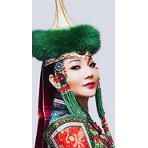

芍药谷
============================

|  |  |
| :--: | :-- |
| [ 芍药谷](https://emumo.xiami.com/album/2105710696) | **艺人**: [奥云格日乐](../index.md) **语种**: 国语 **唱片公司**: 独立发行 **发行时间**: 2020年01月10日 **专辑类别**: 录音室专辑 **专辑风格**: 国语流行 Mandarin Pop **播放数**: 594 **收藏数**: 1 **评论数**: 0  |

## 简介

在霍林河境内，距霍林河二百华里之外的乌拉盖草原，电影《狼图腾》外景地附近。有一个到处长满了野生芍药的山谷，故而取名《芍药谷》。端午节前后的二十几天里，正是芍药盛开的时节，满山谷花事阑阑，芬芳袭人。各种野也开得特别烂漫，芍药自然更是绚丽。这里的芍药花分两种，一种白的，一种粉的。白的琼莹如雪，粉的灿若朝云。一簇簇，一片片，令人目不暇接。最可人的是那些含苞欲放的蓓蕾，似含羞的处子，腼腆地浅笑着向赏花人致意。整个山谷方圆足有十里，芍药密集的地方远远望去，那成片的芍药花白茫茫的，好像夜空中的星云。人们徜徉在翠谷之间，仿佛在画中遨游。放眼望去满谷尽是赏花人，人们穿得比花还鲜艳。整个山谷皆是笑脸与笑声。。。

## 曲目

## 评论

|  |  |  |  |
| :-- | :-- | :-- | :-- |
