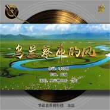

奥云格日乐
============================

|  |  |
| :--: | :-- |
| [ 奥云格日乐](https://i.xiami.com/aygrl) | **地区**: China 中国大陆 **风格**: 国语流行 Mandarin Pop, 艺术流行 Art Pop, 独立流行 Indie Pop **播放数**: 2094825 **粉丝数**: 366 **评论数**: 21  |

## 档案

奥云格日乐，原名于海燕，中国歌剧舞剧院独唱演员、“传奇女中音”歌唱家、国家二级演员，毕业于中国音乐学院歌剧系，2000年就职于中国歌剧舞剧院。 
作为中国歌剧舞剧院的独唱演员，在全国各地进行演出几千场之多，并随团出访美国，法国、比利时、卢森堡、加拿大、澳大利亚、韩国和日本等国。并先后参加了歌剧《图兰朵》《狐狸父子》《拉美莫尔的露琪亚》《弥赛亚》《阿依达》《罗密欧与朱丽叶》《杨贵妃》《刘邦大帝》以及贝多芬《第九交响乐》和马勒《第八交响曲》等等多部中外歌剧、交响曲及大型剧目的排练和演出。原创大型音乐剧《花木兰》中饰演13岁花木棣、歌剧《瑶姬的传说》饰演大姐（2003年10月在香港艺术节演出）、歌剧《八女投江》饰演胡秀芝，2011版歌剧《白毛女》中饰演黄母。

## 专辑

| 名称 | 语种 | 唱片公司 | 发行时间 | 专辑类别 | 专辑风格 |
| :--: | :-- | :-- | :-- | :-- | :-- |
| [ 草原上的马兰花](./albums/5021089249.md) | 国语 | 咕噜文化 | 2020年07月11日 | EP, 单曲 | 世界音乐 World Music |
| [ 乌兰察布的风](./albums/5020899599.md) | 国语 | 三咖文化 | 2020年06月15日 | EP, 单曲 | 国语流行 Mandarin Pop |
| [ 信赖](./albums/2420338893.md) | 国语 | 独立发行 | 2020年03月01日 | EP, 单曲 | 国语流行 Mandarin Pop, 成人时代 Adult Contemporary |
| [ 草原之夜](./albums/2105710588.md) | 国语 | 独立发行 | 2020年01月10日 | 录音室专辑 | 国语流行 Mandarin Pop |
| [ 一对对鸳鸯水上漂](./albums/2105710595.md) | 国语 | 独立发行 | 2020年01月10日 | 录音室专辑 | 国语流行 Mandarin Pop |
| [ 草原恋歌奥云格日乐《草原恋歌》](./albums/2105710281.md) | 国语 | 独立发行 | 2020年01月10日 | 录音室专辑 | 国语流行 Mandarin Pop |
| [ 情梦大草原](./albums/2105710290.md) | 国语 | 独立发行 | 2020年01月10日 | 录音室专辑 | 国语流行 Mandarin Pop |
| [ 菩提](./albums/2105710441.md) | 国语 | 独立发行 | 2020年01月10日 | 录音室专辑 | 国语流行 Mandarin Pop |
| [ 芍药谷](./albums/2105710696.md) | 国语 | 独立发行 | 2020年01月10日 | 录音室专辑 | 国语流行 Mandarin Pop |
| [ 鸿雁湖](./albums/2105710334.md) | 国语 | 独立发行 | 2020年01月10日 | 录音室专辑 | 国语流行 Mandarin Pop |
| [ 娘](./albums/2105710450.md) | 国语 | 独立发行 | 2020年01月10日 | 录音室专辑 | 国语流行 Mandarin Pop |
| [ 我的草原情郎](./albums/2105710358.md) | 国语 | 独立发行 | 2020年01月10日 | 录音室专辑 | 国语流行 Mandarin Pop |
| [ 赞佛偈](./albums/2105710367.md) | 国语 | 独立发行 | 2020年01月10日 | 录音室专辑 | 国语流行 Mandarin Pop |
| [ 且听草原](./albums/2105710282.md) | 国语 | 独立发行 | 2020年01月10日 | 录音室专辑 | 国语流行 Mandarin Pop |
| [ 金色的阿妈奥云格日乐《金色的阿妈》](./albums/2105710280.md) | 国语 | 独立发行 | 2020年01月10日 | 录音室专辑 | 国语流行 Mandarin Pop |
| [ 修禅](./albums/2105710436.md) | 国语 | 独立发行 | 2020年01月10日 | 录音室专辑 | 国语流行 Mandarin Pop |
| [ 天下谁人不识筠](./albums/2105710324.md) | 国语 | 独立发行 | 2020年01月10日 | 录音室专辑 | 国语流行 Mandarin Pop |
| [ 忏悔偈](./albums/2105710426.md) | 国语 | 独立发行 | 2020年01月10日 | 录音室专辑 | 国语流行 Mandarin Pop |
| [ 出家偈](./albums/2105710433.md) | 国语 | 独立发行 | 2020年01月10日 | 录音室专辑 | 国语流行 Mandarin Pop |
| [ 阿妈的味道](./albums/2105710326.md) | 国语 | 独立发行 | 2020年01月10日 | 录音室专辑 | 国语流行 Mandarin Pop |
| [ 兹莫格尼](./albums/2105710327.md) | 国语 | 独立发行 | 2020年01月10日 | 录音室专辑 | 国语流行 Mandarin Pop |
| [ 神州花开](./albums/2105710323.md) | 国语 | 独立发行 | 2020年01月10日 | 录音室专辑 | 国语流行 Mandarin Pop |
| [ 天堂的摇篮](./albums/2105322220.md) | 国语 | 雨陌文化 | 2019年10月10日 | EP, 单曲 |  |
| [ 天下谁人不识筠](./albums/2105288636.md) | 国语 | 悦声无限 | 2019年09月27日 | EP, 单曲 |  |
| [ 神州花开](./albums/2105160936.md) | 国语 | 悦声无限 | 2019年08月19日 | EP, 单曲 |  |
| [ 佛心向善](./albums/2104968779.md) | 国语 | 音瀚文化 | 2019年07月01日 | EP, 单曲 | 国语流行 Mandarin Pop |
| [ 清晨的风](./albums/2104680080.md) | 国语 | 三咖音乐 | 2019年03月18日 | EP, 单曲 | 国语流行 Mandarin Pop |
| [ 奥云美丽的草原我的家](./albums/2104053790.md) | 国语 | 北京悦声无限传媒 | 2018年09月26日 | 现场专辑 | 中国传统民歌 Chinese Traditional Folk, 中国风 China-Wave |
| [ 老家](./albums/2103926669.md) | 国语 | 悦声无限 | 2018年08月16日 | EP, 单曲 | 传统流行 Traditional Pop, 国语流行 Mandarin Pop, 艺术流行 Art Pop |
| [ 窗花](./albums/2103926695.md) | 国语 | 独立发行 | 2018年08月16日 | EP, 单曲 | 国语流行 Mandarin Pop |
| [ 裸心](./albums/2103517438.md) | 国语 | 悦声无限 | 2018年02月06日 | EP, 单曲 |  |
| [ 神奇大鲵湾](./albums/2103517445.md) | 国语 | 悦声无限 | 2018年02月06日 | EP, 单曲 |  |
| [ 天下大同](./albums/2103433117.md) | 国语 | 北京悦声无限传媒 | 2017年12月25日 | EP, 单曲 |  |
| [ 天下大同（原创）演唱：奥云格日乐/海霞/高山](./albums/2102975938.md) | 国语 | 北京悦声无限传媒 | 2017年12月17日 | EP, 单曲 | 国语流行 Mandarin Pop, 独立流行 Indie Pop, 成人时代 Adult Contemporary |
| [ 如果有一天](./albums/2102777677.md) | 国语 | 悦声无限 | 2017年07月04日 | EP, 单曲 | 国语流行 Mandarin Pop |
| [ 我要嫁给蒙古人](./albums/2102777684.md) | 国语 | 悦声无限 | 2017年07月04日 | EP, 单曲 |  |
| [ 草原天堂](./albums/2102738452.md) | 国语 | 悦声无限 | 2017年04月26日 | EP, 单曲 | 国语流行 Mandarin Pop |
| [ 跟着扎西去西藏](./albums/2102738456.md) | 国语 | 悦声无限 | 2017年04月26日 | EP, 单曲 |  |
| [ 清晨](./albums/2100354229.md) | 国语 | 维音唱片 | 2016年06月12日 | EP, 单曲 |  |
| [ 天籁之•爱](./albums/305929857.md) | 国语 | 悦声无限 | 2014年07月17日 | 录音室专辑 |  |
| [ 花湖·草原](./albums/342541.md) | 国语 | 火烈鸟唱片 | 2008年03月21日 | 录音室专辑 |  |

## 评论

|  |  |  |
| :-- | :-- | :-- |
|  [虾米用户](https://emumo.xiami.com/u/358104299) 悲观的唯心存在现实解构虚... 2021-01-04 10:20 赞(0) 踩(0) | 
45235
 |
|  [虾米用户](https://emumo.xiami.com/u/7417068) 邂逅 2020-02-26 22:13 赞(0) 踩(0) | 
人美歌靓 嗓音宽厚 舞姿翩翩 私以为 学院技巧看似无懈可击 却也洗去了草原的质朴粗犷 与土地颇有些隔膜了
 |
|  [虾米用户](https://emumo.xiami.com/u/411271073)  2020-02-19 15:49 赞(1) 踩(0) | 
一首天边的阿妈已经征服了我，你是我们心中的骄傲！
 |
|  [虾米用户](https://emumo.xiami.com/u/424049862) 老实念佛。 2020-01-28 11:28 赞(1) 踩(0) | 
要亘古长存，不要一朝风月。
 |
|  [虾米用户](https://emumo.xiami.com/u/424049862) 老实念佛。 2020-01-28 11:27 赞(1) 踩(0) | 
我喜欢草原风。每一种音乐都有她的特质。适合自己的就是好的
 |
|  [虾米用户](https://emumo.xiami.com/u/300157804)  2019-04-07 16:52 赞(1) 踩(0) | 
我为你点赞
 |
|  [虾米用户](https://emumo.xiami.com/u/300157804)  2019-04-07 16:52 赞(1) 踩(0) | 
歌声美，我你点赞。
 |
|  [虾米用户](https://emumo.xiami.com/u/331602162) 道武以来，战胜攻取，未尝... 2018-11-02 11:24 赞(0) 踩(0) | 
叫这名字的怎么会是汉族?
 |
|  [虾米用户](https://emumo.xiami.com/u/8337431) 以乐会友 2018-10-07 06:57 赞(0) 踩(0) | 
12
 |
|  [虾米用户](https://emumo.xiami.com/u/279994026)  2018-06-19 12:57 赞(0) 踩(0) | 
声音带有磁性太好听了
 |
|  [虾米用户](https://emumo.xiami.com/u/8337431) 以乐会友 2018-03-31 18:34 赞(0) 踩(0) | 
魅力女中音10
 |
| ⇒ |  [虾米用户](https://emumo.xiami.com/u/73003900)  2018-11-03 11:22 赞(0) 踩(0) | 
******
 |
|  [虾米用户](https://emumo.xiami.com/u/297188058)  2018-01-19 10:10 赞(1) 踩(0) | 
我最爱的歌手，一次就深深的记住了她，听她的歌声仿佛进入了宽阔的草原。有一种美丽，那就是奥云格日乐-于海燕！我爱你！
 |
|  [虾米用户](https://emumo.xiami.com/u/271169707) 找个爱人的啊 2018-01-13 12:23 赞(0) 踩(0) | 
好听
 |
|  [虾米用户](https://emumo.xiami.com/u/19942005)  2017-09-17 07:53 赞(0) 踩(0) | 
歌声犹如蒙古草原般宽厚慈祥
 |
| ⇒ |  [虾米用户](https://emumo.xiami.com/u/50653607) 中国歌剧舞剧院女中音 2017-12-10 23:20 赞(0) 踩(0) | 
谢谢您   
 |
|  [虾米用户](https://emumo.xiami.com/u/298260266)  2017-08-27 09:34 赞(0) 踩(0) | 
我喜欢听草原歌曲，更喜欢你的歌声 
 |
| ⇒ |  [虾米用户](https://emumo.xiami.com/u/50653607) 中国歌剧舞剧院女中音 2017-12-10 23:19 赞(0) 踩(0) | 
谢谢您支持！
 |
|  [虾米用户](https://emumo.xiami.com/u/11290779) 你猜我是谁 2013-03-21 15:25 赞(2) 踩(0) | 
人美歌也美
 |
| ⇒ |  [虾米用户](https://emumo.xiami.com/u/50653607) 中国歌剧舞剧院女中音 2017-12-10 23:20 赞(0) 踩(0) | 
  
 |
|  [虾米用户](https://emumo.xiami.com/u/11290779) 你猜我是谁 2013-03-21 15:24 赞(2) 踩(0) | 
人美歌声美啊
 |
