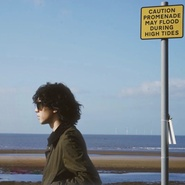
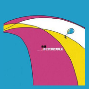

宋捷
============================

|  |  |
| :--: | :-- |
| [ 宋捷](https://i.xiami.com/songjie) | **地区**: China 中国大陆 **风格**: 华语唱作人 Chinese Singer-Songwriter, 流行 Pop, 独立电子乐 Indietronica **播放数**: 8805348 **粉丝数**: 4431 **评论数**: 172  |

## 档案

宋 捷 
生日： 1985 2 28

## 专辑

| 名称 | 语种 | 唱片公司 | 发行时间 | 专辑类别 | 专辑风格 |
| :--: | :-- | :-- | :-- | :-- | :-- |
| [ 关于](./albums/5020796421.md) | 国语 | 独立发行 | 2020年06月04日 | EP, 单曲 | 国语流行 Mandarin Pop |
| [ 悠长假日](./albums/2108336001.md) | 国语 | 独立发行 | 2020年04月13日 | EP, 单曲 | 国语流行 Mandarin Pop |
| [ Alive](./albums/2105262361.md) | 纯音乐 | 独立发行 | 2019年09月22日 | EP, 单曲 |  |
| [ 《诠释》](./albums/2102741800.md) | 国语 | 独立发行 | 2017年05月02日 | EP, 单曲 | 独立电子乐 Indietronica, 自由即兴 Free Improvisation, 独立摇滚 Indie Rock |
| [ 在小时候的黄昏见](./albums/344463.md) | 国语 | 独立发行 | 2009年08月22日 | EP, 单曲 |  |

## 评论

|  |  |  |
| :-- | :-- | :-- |
|  [虾米用户](https://emumo.xiami.com/u/88293982) 杜绝是非 2020-10-15 10:01 赞(0) 踩(0) | 
翻精选评论的时候，发现竟然是几年前的了 虾米是我的音乐树洞，很少跟别人分享，就像喜欢宋老师一样ahhh 地铁上、走路时一直会开到最大声，去思考宋老师当时是什么样的状态写的这首歌，甚至去思考每一个旋律的合理性，就像是去围观一朵花开的姿态，在想盘腿坐在海边时宋老师给我弹这首歌的话，我会以什么样的眼神注视着夕阳 害！不愧是我！希望宋老师开心真的爱你还有你的歌xixi
 |
|  [虾米用户](https://emumo.xiami.com/u/88293982) 杜绝是非 2020-10-15 10:01 赞(0) 踩(0) | 
翻精选评论的时候，发现竟然是几年前的了 虾米是我的音乐树洞，很少跟别人分享，就像喜欢宋老师一样ahhh 地铁上、走路时一直会开到最大声，去思考宋老师当时是什么样的状态写的这首歌，甚至去思考每一个旋律的合理性，就像是去围观一朵花开的姿态，在想盘腿坐在海边时宋老师给我弹这首歌的话，我会以什么样的眼神注视着夕阳 害！不愧是我！希望宋老师开心真的爱你还有你的歌xixi
 |
|  [虾米用户](https://emumo.xiami.com/u/239878318) 我还没想好要写什么... 2020-09-27 19:48 赞(0) 踩(0) | 
喜欢
 |
|  [虾米用户](https://emumo.xiami.com/u/561819) 自律 2020-08-24 23:02 赞(0) 踩(0) | 
太哈这一型儿的了
 |
|  [虾米用户](https://emumo.xiami.com/u/2796166) 最爱莫文蔚..... 2020-08-05 00:54 赞(0) 踩(0) | 
加油YA！~ 喜欢~喜欢
 |
|  [虾米用户](https://emumo.xiami.com/u/2796166) 最爱莫文蔚..... 2020-08-05 00:54 赞(0) 踩(0) | 
加油YA！~ 喜欢~喜欢
 |
|  [虾米用户](https://emumo.xiami.com/u/412092051) 外向孤独癖者 2020-06-27 16:19 赞(1) 踩(0) | 
因宋捷而很爱痛仰
 |
|  [虾米用户](https://emumo.xiami.com/u/52415194) ♬♩♫♪♡ 2020-05-10 22:44 赞(1) 踩(0) | 

 |
|  [虾米用户](https://emumo.xiami.com/u/3661266) 这个世界上最懂我的人，恐... 2020-05-07 15:26 赞(2) 踩(0) | 
这歌居然是痛仰吉他唱的，涨姿势了。
 |
|  [虾米用户](https://emumo.xiami.com/u/358104299) 悲观的唯心存在现实解构虚... 2020-04-25 11:30 赞(1) 踩(0) | 
40792
 |
|  [虾米用户](https://emumo.xiami.com/u/427130910)  2020-04-16 15:44 赞(1) 踩(0) | 
好听
 |
|  [虾米用户](https://emumo.xiami.com/u/13111079) 有缘再见 2019-09-13 05:00 赞(0) 踩(0) | 
✔︎
 |
|  [虾米用户](https://emumo.xiami.com/u/207468536) 我还没想好要写什么... 2019-08-11 19:18 赞(0) 踩(0) | 
捷哥
 |
|  [虾米用户](https://emumo.xiami.com/u/324140615)  2019-08-02 01:13 赞(1) 踩(0) | 
我要去大理啦，开心认识你，听你的歌
 |
|  [虾米用户](https://emumo.xiami.com/u/297765015) 你来了啊 2019-07-21 16:28 赞(1) 踩(0) | 
我爱你啊
 |
|  [虾米用户](https://emumo.xiami.com/u/4145368) 拜拜虾米 可+我扣扣音药 2019-07-08 18:48 赞(0) 踩(0) | 
嘻嘻 宋捷
 |
|  [虾米用户](https://emumo.xiami.com/u/10994142) 睡前梦游故事 2019-06-04 00:50 赞(2) 踩(0) | 
我说这名字突然的熟悉，刚看完乐队的夏天痛仰的表演，原来是痛仰的吉他手 
 |
|  [虾米用户](https://emumo.xiami.com/u/242022847) 你当独立且自由。  2019-05-22 18:45 赞(0) 踩(0) | 
《我们还会在一起漫步》了解到宋捷，早一天生日2.27
 |
|  [虾米用户](https://emumo.xiami.com/u/261314523) 爱音乐就是爱生活 2019-04-22 22:25 赞(1) 踩(0) | 
歌收藏了很久了，一直很喜欢，很能引起我的共鸣，很舒服的感觉 今天偶然打开主页 我我。。气质爱了
 |
|  [虾米用户](https://emumo.xiami.com/u/242496586) 善听 2019-04-03 23:18 赞(1) 踩(0) | 
期待下一张专辑
 |
|  [虾米用户](https://emumo.xiami.com/u/411442983)  2019-03-29 04:06 赞(0) 踩(0) | 
加油兄弟
 |
|  [虾米用户](https://emumo.xiami.com/u/3914288)  2019-02-26 01:00 赞(0) 踩(0) | 
那年那时那人
 |
|  [虾米用户](https://emumo.xiami.com/u/303506160) 因为我对你爱的深沉 2018-12-06 07:25 赞(1) 踩(0) | 
嘿呦
 |
|  [虾米用户](https://emumo.xiami.com/u/2394327)  2018-11-25 05:10 赞(0) 踩(0) | 
咹。。。。。。你来重庆的话，我们喝喝酒酒，作为音乐这种意思形态的始终，我向你发出邀请
 |
|  [虾米用户](https://emumo.xiami.com/u/310952262) 后来 2018-11-08 19:13 赞(0) 踩(0) | 
表白宋捷  
 |
|  [虾米用户](https://emumo.xiami.com/u/289967) 你还好吗？ 2018-08-18 03:22 赞(0) 踩(0) | 
想你。念你。
 |
|  [虾米用户](https://emumo.xiami.com/u/303506160) 因为我对你爱的深沉 2018-07-18 00:48 赞(1) 踩(0) | 
嘿呦
 |
|  [虾米用户](https://emumo.xiami.com/u/8556678) 蓝天永远在白云之上 2017-10-28 00:35 赞(2) 踩(0) | 
轻松自由得好像骑着单车穿梭在原野里。。
 |
|  [虾米用户](https://emumo.xiami.com/u/293255910) 喜欢听歌的我期待着你..... 2017-05-11 16:09 赞(1) 踩(0) | 
我听这歌是丽江小倩唱的
 |
|  [虾米用户](https://emumo.xiami.com/u/14004084) 你好 2017-04-06 23:57 赞(1) 踩(0) | 
原来是你写的歌 
 |
|  [虾米用户](https://emumo.xiami.com/u/49141193) loading… 2017-02-28 12:37 赞(0) 踩(0) | 
生日快乐
 |
|  [虾米用户](https://emumo.xiami.com/u/24711605) 于是转身向大海走去！ 2017-02-16 16:11 赞(2) 踩(0) | 
因为痛仰而认识的宋捷，很棒
 |
|  [虾米用户](https://emumo.xiami.com/u/260406848) 心之所向 2017-01-08 15:45 赞(13) 踩(0) | 
和宋捷拥抱过一次就真的爱上他了 是真实地爱上他 我要去北京找他 我想离他近一点
 |
|  [虾米用户](https://emumo.xiami.com/u/32824512) 阴凉潮湿晦暗 回到无人洞... 2016-10-15 15:56 赞(4) 踩(0) | 
一直忘不了痛仰纪录片里宋捷在海边弹着吉他唱着不再让你孤单
 |
| ⇒ |  [虾米用户](https://emumo.xiami.com/u/400680551)  2020-04-04 22:17 赞(0) 踩(0) | 
还有纪录片
 |
|  [虾米用户](https://emumo.xiami.com/u/40096090)   2016-07-24 20:37 赞(4) 踩(0) | 
那次在音乐节做志愿者，痛仰刚到后台就要上舞台，宋捷一人走过，我们在聊天，旁边姑娘轻轻喊了一声“宋捷”，然后宋捷回头腼腆微笑，一瞬间我觉得有些惊艳。我是只听歌不太关注乐队成员的人，这个名字很耳熟，那一瞬间我觉得人的气质是一种很特别的存在。痛仰全程演出我站在台下，很熟悉的歌，高虎忘情地跑到了音箱上面，宋捷不是很噪，但是却很吸引人。
 |
| ⇒ |  [虾米用户](https://emumo.xiami.com/u/6077290)   2017-08-02 02:30 赞(0) 踩(0) | 
明珠？
 |
| ⇒ |  [虾米用户](https://emumo.xiami.com/u/40096090)   2017-08-02 08:20 赞(0) 踩(0) | 
<q><b>tony管说：</b></q>
 |
|  [虾米用户](https://emumo.xiami.com/u/3039978) 我一直 2016-06-02 15:41 赞(0) 踩(0) | 
你那首歌曲《不再》怎么在豆瓣删掉了
 |
|  [虾米用户](https://emumo.xiami.com/u/30791786)   2016-03-13 11:18 赞(0) 踩(0) | 
自从听到我会想起你 就再也没有删掉过。 虽然一点都不了解你  依然喜欢你。
 |
|  [虾米用户](https://emumo.xiami.com/u/13835502)  2016-02-18 03:02 赞(0) 踩(0) | 
很喜欢民谣
 |
|  [虾米用户](https://emumo.xiami.com/u/14667161) 两眼无神 脑空白 2016-01-12 13:28 赞(0) 踩(0) | 
背包
 |
|  [虾米用户](https://emumo.xiami.com/u/49141193) loading… 2015-12-28 23:17 赞(0) 踩(0) | 
宋捷嫁我
 |
|  [虾米用户](https://emumo.xiami.com/u/33831409) 日子很好没有烦恼！ 2015-12-28 21:16 赞(0) 踩(0) | 
爪
 |
|  [虾米用户](https://emumo.xiami.com/u/48831197) That‘s all m... 2015-12-16 08:43 赞(2) 踩(0) | 
宋捷娶我！
 |
|  [虾米用户](https://emumo.xiami.com/u/49141193) loading… 2015-12-13 12:53 赞(0) 踩(0) | 

 |
|  [虾米用户](https://emumo.xiami.com/u/5773974) (⊙o⊙) 2015-10-19 10:38 赞(3) 踩(0) | 
听了以后有没有回家扫吉他的冲动~~
 |
|  [虾米用户](https://emumo.xiami.com/u/44078341) 暂无签名~ 2015-10-18 12:31 赞(0) 踩(0) | 
希望你快乐 你想的要的都实现
 |
|  [虾米用户](https://emumo.xiami.com/u/2791514) 此处禁言 2015-10-07 13:24 赞(18) 踩(0) | 
痛仰因宋捷而不同
 |
| ⇒ |  [虾米用户](https://emumo.xiami.com/u/2791514) 此处禁言 2019-07-28 23:54 赞(0) 踩(0) | 
终于要在大众面前放光了
 |
|  [虾米用户](https://emumo.xiami.com/u/10003889) 暂无签名~ 2015-09-14 23:03 赞(0) 踩(0) | 
第一次知道他别的作品也很棒。
 |
| ⇒ |  [虾米用户](https://emumo.xiami.com/u/67667774) 我还没想好要写什么... 2015-09-18 05:27 赞(0) 踩(0) | 
好
 |
|  [虾米用户](https://emumo.xiami.com/u/51957189) 我还没想好要写什么... 2015-08-19 12:54 赞(0) 踩(0) | 
希望你能参与到痛仰的创作中 你比高虎有才
 |
|  [虾米用户](https://emumo.xiami.com/u/6590687) 招一个贝斯和鼓手和合成器 2015-08-19 01:05 赞(2) 踩(0) | 
没想到宋老师这么屌。。。
 |
|  [虾米用户](https://emumo.xiami.com/u/2534139) 金牛男：朋友们，非常感谢... 2015-08-07 15:14 赞(2) 踩(0) | 
2号，塘沽步行街，一男一女双吉他在街头演唱了这首歌，女孩子唱的很好，声线很适合这首歌。我是第一次听这首歌（最早评论可见到2010年，都已经5年了），欢快的旋律，青春愿景式的诉说，带着对年轻、爱恋、岁月的怀念，一听就是怀着音乐梦想在路上艰难前行的原创音乐人的作品。可惜他们总是缺少足够的资金，足够的宣传，导致一代又一代的优秀原创音乐人悄无声响地埋没在当前娱乐至死的泥潭中。中国这么大，从来不缺出类拔萃的人才，因此，我非常支持虾米寻光计划、中国好歌曲，虽然它们可能也不太能改变什么，但是至少给他们一点点希望，支持他们胸怀点点星火梦想，努力而依然艰难地走在追求音乐的道路上！
 |
|  [虾米用户](https://emumo.xiami.com/u/50484027) 龙神道乐队 坛酒吧 Te... 2015-06-01 10:11 赞(3) 踩(0) | 
怀念小时候的阳光 往后的的世界没有尽头 怀念儿时的伙伴，来来去去 @宋捷_意识联盟
 |
| ⇒ |  [虾米用户](https://emumo.xiami.com/u/67667774) 我还没想好要写什么... 2015-09-18 05:14 赞(0) 踩(0) | 
来来去去  将这一切都留在心底 @宋捷_意识联盟
 |
|  [虾米用户](https://emumo.xiami.com/u/4185269)   2015-05-11 02:21 赞(0) 踩(0) | 
嘿。 
 |
|  [虾米用户](https://emumo.xiami.com/u/48029961) Sonf F 2015-03-27 01:20 赞(0) 踩(0) | 
太帅了！
 |
|  [虾米用户](https://emumo.xiami.com/u/15971892)   2015-03-25 15:29 赞(0) 踩(0) | 
你也可以是触手可及的温暖
 |
|  [虾米用户](https://emumo.xiami.com/u/33944435)   2015-03-22 10:16 赞(0) 踩(0) | 
听不懂
 |
|  [虾米用户](https://emumo.xiami.com/u/7145381) 我还没想好要写什么... 2015-03-15 00:49 赞(1) 踩(0) | 
今天又看见你了。在张狂的痛仰里显得特别腼腆！
 |
|  [虾米用户](https://emumo.xiami.com/u/3531256) 倾听一切 2015-01-01 18:42 赞(22) 踩(0) | 
偶然在电台里又听到【我会想起你】，晃神的间隙又回到了2014的夏天，我总是焦虑地东奔西跑，在这座城市做着无所谓的工作，写没人会读到的诗，听几千首歌，看过于丰盛琐碎的风景变幻。夏天总会有想去的地方与想见的人，阳光、幼虫、潮水、黄色的植物，我觉察着年轻的生活好像充满了隐喻，于是精力旺盛地追逐美好却也虚妄的事物。“真的永远无法和你在一起，但我会微笑着想起远方的你”；元旦来了，马年终究也如白驹过隙，2014年过去了，我很怀念她。2015年1月1日18:42:55
 |
|  [虾米用户](https://emumo.xiami.com/u/10398451)  2014-12-24 10:25 赞(0) 踩(0) | 
好听
 |
|  [虾米用户](https://emumo.xiami.com/u/7012981) 声音中的故事 2014-12-17 13:20 赞(0) 踩(0) | 
我只能够唱歌给你听……
 |
|  [虾米用户](https://emumo.xiami.com/u/43187566) 暂无签名~ 2014-11-29 23:57 赞(0) 踩(0) | 
哈哈，摇滚之路总能发现很多好音乐
 |
|  [虾米用户](https://emumo.xiami.com/u/101322) 不怎么听歌了 2014-11-16 21:19 赞(0) 踩(0) | 
新专辑什么时候出 两年了都
 |
| ⇒ |  [虾米用户](https://emumo.xiami.com/u/13775224)  2014-12-28 17:08 赞(0) 踩(0) | 
明年！
 |
| ⇒ |  [虾米用户](https://emumo.xiami.com/u/101322) 不怎么听歌了 2014-12-28 18:04 赞(0) 踩(0) | 
<q><b>葵说：</b></q>
 |
| ⇒ |  [虾米用户](https://emumo.xiami.com/u/13775224)  2014-12-28 18:05 赞(0) 踩(0) | 
<q><b>冷血老头盔说：</b></q>
 |
|  [虾米用户](https://emumo.xiami.com/u/842675)  2014-11-13 01:02 赞(0) 踩(0) | 
喜欢喜欢喜欢，今天还拍了合照，好开心啊！
 |
|  [虾米用户](https://emumo.xiami.com/u/29596918) 音乐，是最最有效的止疼片... 2014-11-13 00:24 赞(0) 踩(0) | 
今天晚上拍了一整晚你在兰州的现场演出…自始至终镜头里只有你…感谢你给的拨片…永远支持你，你是最棒的。
 |
|  [虾米用户](https://emumo.xiami.com/u/1386954) 僵尸世界大战 2014-11-08 23:11 赞(0) 踩(0) | 
什么时候来虾米的。。。
 |
|  [虾米用户](https://emumo.xiami.com/u/544638)  2014-10-05 01:35 赞(0) 踩(0) | 
1
 |
|  [虾米用户](https://emumo.xiami.com/u/13487886) 飞已间时 2014-09-11 00:08 赞(0) 踩(0) | 
求教吉他高手 《我会·你》这曲子里面的吉他运用的大量手指滑铉 出的音到底是有什么讲究么 好多单曲吉他伴奏都有出现明明感觉很刺耳为什么会大量采用  求教求教啊
 |
| ⇒ |  [虾米用户](https://emumo.xiami.com/u/6811452) 清醒与隐藏 2014-09-14 15:57 赞(0) 踩(0) | 
没讲究 你多想了 就是换和弦的时候留下的痕迹 这样比较原声
 |
| ⇒ |  [虾米用户](https://emumo.xiami.com/u/13487886) 飞已间时 2014-09-14 20:18 赞(0) 踩(0) | 
<q><b>A ken说：</b></q>
 |
| ⇒ |  [虾米用户](https://emumo.xiami.com/u/6811452) 清醒与隐藏 2014-09-20 16:10 赞(0) 踩(0) | 
<q><b>儿仙说：</b></q>
 |
| ⇒ |  [虾米用户](https://emumo.xiami.com/u/13487886) 飞已间时 2014-09-21 19:36 赞(0) 踩(0) | 
<q><b>A ken说：</b></q>
 |
| ⇒ |  [虾米用户](https://emumo.xiami.com/u/13975572) 我还没想好要写什么... 2014-11-12 15:36 赞(0) 踩(0) | 
适当加一些小拇指.
 |
|  [虾米用户](https://emumo.xiami.com/u/10857184)  2014-09-10 01:20 赞(0) 踩(0) | 
口水歌，简直了。
 |
|  [虾米用户](https://emumo.xiami.com/u/9772553) I'm not the ... 2014-09-08 00:52 赞(0) 踩(0) | 
第一次听到我会想起你是丽江小倩唱的，各有各味道～
 |
|  [虾米用户](https://emumo.xiami.com/u/39200711) a   little  ... 2014-09-07 17:43 赞(0) 踩(0) | 
我也是
 |
|  [虾米用户](https://emumo.xiami.com/u/37813612)  2014-08-27 23:25 赞(0) 踩(0) | 
爱大理爱痛仰爱滑板
 |
|  [虾米用户](https://emumo.xiami.com/u/586854)  2014-08-08 08:56 赞(0) 踩(0) | 
我会微笑想起远方的你。
 |
|  [虾米用户](https://emumo.xiami.com/u/10994142) 睡前梦游故事 2014-08-07 22:24 赞(0) 踩(0) | 
好听！
 |
|  [虾米用户](https://emumo.xiami.com/u/5394112) Follow him  2014-06-21 22:01 赞(0) 踩(0) | 
他的声音 总会让人想起大学的校园。单纯 美好 有梦想！
 |
|  [虾米用户](https://emumo.xiami.com/u/11812378)  2014-06-13 13:22 赞(0) 踩(0) | 
单车在经过田野 你轻轻唱
 |
|  [虾米用户](https://emumo.xiami.com/u/8052883)  2014-05-30 15:27 赞(0) 踩(0) | 
看到歌词无限感慨，我是老了吗？
 |
|  [虾米用户](https://emumo.xiami.com/u/19824221) 暂无签名~ 2014-05-23 18:24 赞(0) 踩(0) | 
你说你喜欢宋捷
 |
|  [虾米用户](https://emumo.xiami.com/u/33014028)  2014-05-13 13:17 赞(0) 踩(0) | 
！我会想起你
 |
|  [虾米用户](https://emumo.xiami.com/u/16396825) do you ? 2014-05-06 10:32 赞(0) 踩(0) | 
0.0
 |
|  [虾米用户](https://emumo.xiami.com/u/35698412) 水霧 2014-04-28 02:53 赞(0) 踩(0) | 
不喜欢就别唧唧歪歪的
 |
|  [虾米用户](https://emumo.xiami.com/u/3559064) 我只看着你，不留下遗憾！ 2014-03-25 23:07 赞(1) 踩(0) | 
蛮好听的
 |
|  [虾米用户](https://emumo.xiami.com/u/33711745)  2014-03-12 21:14 赞(0) 踩(0) | 
喜欢他的理由一是因为音乐，二是因为滑板。不过我是小鱼板党~~~~
 |
|  [虾米用户](https://emumo.xiami.com/u/3779422) 我就是爱音乐 2014-03-09 23:34 赞(0) 踩(0) | 
简简单单的旋律，简简单单的声音，唱出了我内心的一种感觉，就是一种感觉，一种感觉。。。
 |
|  [虾米用户](https://emumo.xiami.com/u/3382052) 嘴上笑嘻嘻 2013-12-05 18:07 赞(0) 踩(0) | 
好怀念云南，怀念苍山洱海。。虽然只去了几天
 |
|  [虾米用户](https://emumo.xiami.com/u/3597209) 网易云: 人该有故乡的善... 2013-12-03 14:49 赞(0) 踩(0) | 
我是出生在大理 听到开头的苍山洱海 然后就无限循环了
 |
|  [虾米用户](https://emumo.xiami.com/u/7809994) 云 2013-11-26 09:51 赞(0) 踩(0) | 
多好
 |
|  [虾米用户](https://emumo.xiami.com/u/1136399)  2013-11-08 15:53 赞(0) 踩(0) | 
宋捷
 |
|  [虾米用户](https://emumo.xiami.com/u/699637) yep 2013-11-06 10:44 赞(0) 踩(0) | 
太烂了。感觉像是大学生。跟痛仰完全不是一路的。
 |
| ⇒ |  [虾米用户](https://emumo.xiami.com/u/30200345)  2013-12-21 13:14 赞(0) 踩(0) | 
╮(╯_╰)╭
 |
| ⇒ |  [虾米用户](https://emumo.xiami.com/u/9680466)  2014-04-18 10:10 赞(0) 踩(0) | 
一黑黑俩，别拿痛仰当优越啊哥们
 |
| ⇒ |  [虾米用户](https://emumo.xiami.com/u/798436) 暂无签名~ 2014-11-16 11:07 赞(0) 踩(0) | 
<q><b>bingmujun说：</b></q>
 |
| ⇒ |  [虾米用户](https://emumo.xiami.com/u/699637) yep 2014-12-06 23:31 赞(0) 踩(0) | 
<q><b>ALEX SAX说：</b></q>
 |
| ⇒ |  [虾米用户](https://emumo.xiami.com/u/34272626) 我还没想好要写什么... 2015-01-27 00:39 赞(0) 踩(0) | 
<q><b>bingmujun说：</b></q>
 |
| ⇒ |  [虾米用户](https://emumo.xiami.com/u/699637) yep 2017-10-27 23:25 赞(0) 踩(0) | 
<q><b>没有说：</b></q>
 |
|  [虾米用户](https://emumo.xiami.com/u/11407549)  2013-08-28 12:57 赞(0) 踩(0) | 
我会想起你
 |
|  [虾米用户](https://emumo.xiami.com/u/30529) broken 2013-08-20 23:33 赞(0) 踩(0) | 
很柔软 到心里
 |
|  [虾米用户](https://emumo.xiami.com/u/10164309)  2013-08-03 20:09 赞(0) 踩(0) | 
喜欢没道理
 |
|  [虾米用户](https://emumo.xiami.com/u/18065886) MZL 2013-07-27 10:16 赞(0) 踩(0) | 
青春
 |
|  [虾米用户](https://emumo.xiami.com/u/9079353) 氓之嗤嗤 2013-07-22 19:28 赞(0) 踩(0) | 
好声音
 |
|  [虾米用户](https://emumo.xiami.com/u/17784982)  2013-07-21 14:06 赞(0) 踩(0) | 
热爱中国摇滚
 |
|  [虾米用户](https://emumo.xiami.com/u/10265366)  2013-07-12 00:19 赞(0) 踩(0) | 
宋捷的脑残粉真多啊明明是炫酷的摇滚乐手但我也是脑残粉不好意思
 |
|  [虾米用户](https://emumo.xiami.com/u/9158801)  2013-05-31 22:23 赞(0) 踩(0) | 
就是喜欢
 |
|  [虾米用户](https://emumo.xiami.com/u/2710593) In the Absen... 2013-05-15 11:31 赞(0) 踩(0) | 
痛仰吉他手
 |
|  [虾米用户](https://emumo.xiami.com/u/1851285) Cirnellë 2013-05-01 09:28 赞(19) 踩(0) | 
内容已删除
 |
| ⇒ |  [虾米用户](https://emumo.xiami.com/u/692995)  2013-07-03 11:44 赞(0) 踩(0) | 
5.1大理，洱海音乐节。这首歌响起的时候，激动死了！
 |
| ⇒ |  [虾米用户](https://emumo.xiami.com/u/1851285) Cirnellë 2013-07-16 22:31 赞(0) 踩(0) | 
<q><b>板栗说：</b></q>
 |
|  [虾米用户](https://emumo.xiami.com/u/337132)  2013-04-19 21:19 赞(0) 踩(0) | 
每一首歌的歌词都很让人感动，以及旋律。
 |
|  [虾米用户](https://emumo.xiami.com/u/10890284) 多吃多干 2013-04-18 19:39 赞(0) 踩(0) | 
加油
 |
|  [虾米用户](https://emumo.xiami.com/u/13554802)  2013-03-17 00:00 赞(0) 踩(0) | 
够帅气！
 |
|  [虾米用户](https://emumo.xiami.com/u/154641) 然后青天在上，星日朗朗 2013-02-12 10:33 赞(0) 踩(0) | 
痛仰里边最具文艺气质的
 |
|  [虾米用户](https://emumo.xiami.com/u/38164) 钻石牌钻石型钻石牙刷。 2013-02-09 09:42 赞(16) 踩(0) | 
555555555555555555555555555555555555555555555555555555555555 5555555我是傻逼
 |
| ⇒ |  [虾米用户](https://emumo.xiami.com/u/101322) 不怎么听歌了 2014-04-17 16:50 赞(0) 踩(0) | 
哈哈哈哈哈哈
 |
|  [虾米用户](https://emumo.xiami.com/u/10706398) 2012-9-24 2012-12-21 14:19 赞(0) 踩(0) | 
痛仰的人果然不一样。。
 |
|  [虾米用户](https://emumo.xiami.com/u/11677424) 克己 慎独 2012-12-10 22:54 赞(0) 踩(0) | 
会一直一直喜欢你支持你
 |
|  [虾米用户](https://emumo.xiami.com/u/6631790) 宁为地狱之主，不为天堂之... 2012-11-09 21:59 赞(0) 踩(0) | 
^_^
 |
|  [虾米用户](https://emumo.xiami.com/u/1330086)  2012-11-08 19:22 赞(0) 踩(0) | 
歌太温柔。
 |
|  [虾米用户](https://emumo.xiami.com/u/11042459)  2012-10-13 17:56 赞(0) 踩(0) | 
第一眼见到，就是很喜欢宋捷
 |
|  [虾米用户](https://emumo.xiami.com/u/9047880)  2012-09-24 16:34 赞(0) 踩(0) | 
这次的夏天和从前不太一样
 |
|  [虾米用户](https://emumo.xiami.com/u/5434262) 暂无签名~ 2012-09-22 14:30 赞(0) 踩(0) | 
明儿见宋捷~
 |
|  [虾米用户](https://emumo.xiami.com/u/829156) 一夕成环 夕夕都成玦 2012-09-22 10:44 赞(0) 踩(0) | 
昨晚痛仰现场听了宋捷唱这歌，真是，好嗨森。
 |
| ⇒ |  [虾米用户](https://emumo.xiami.com/u/791240)  2012-09-22 11:58 赞(0) 踩(0) | 
我也在现场，我会想起你，真心好听
 |
|  [虾米用户](https://emumo.xiami.com/u/5434262) 暂无签名~ 2012-08-30 13:15 赞(0) 踩(0) | 
我怎么早点没想到单独搜宋捷是可以的！！！！！好爱他啊！！！！
 |
|  [虾米用户](https://emumo.xiami.com/u/7454611) 暂无签名~ 2012-08-18 20:47 赞(0) 踩(0) | 
今天才知道。。孤陋寡闻了。
 |
|  [虾米用户](https://emumo.xiami.com/u/10093583) Zoomgoal 2012-08-17 11:50 赞(0) 踩(0) | 
痛仰吉他手宋捷！才子啊
 |
|  [虾米用户](https://emumo.xiami.com/u/9111854)  2012-05-08 12:00 赞(0) 踩(0) | 
爱啊
 |
|  [虾米用户](https://emumo.xiami.com/u/5093813)  2012-05-02 11:01 赞(0) 踩(0) | 
头巾双鱼男
 |
|  [虾米用户](https://emumo.xiami.com/u/8500792)  2012-04-11 13:38 赞(0) 踩(0) | 
如果我是女孩！我也会爱上他！丫真我着迷！
 |
|  [虾米用户](https://emumo.xiami.com/u/500443)  2012-03-30 22:47 赞(0) 踩(0) | 
原来小倩的那首诗出自这里  很喜欢的风格
 |
|  [虾米用户](https://emumo.xiami.com/u/746612)  2012-03-28 23:34 赞(0) 踩(0) | 
痛仰噶吉他手！！超掂！！
 |
|  [虾米用户](https://emumo.xiami.com/u/478527) 好想跟衣服在洗衣机里滚 2012-03-23 18:15 赞(0) 踩(0) | 
痛仰的吉他手+1 没想到他那么小啊
 |
|  [虾米用户](https://emumo.xiami.com/u/2595353) 微笑，给你 2012-03-18 11:52 赞(0) 踩(0) | 
心中的旋律
 |
|  [虾米用户](https://emumo.xiami.com/u/886551)  2012-02-09 11:18 赞(0) 踩(0) | 
我就说这人怎么这么眼熟~~ 痛仰的吉他手啊。
 |
|  [虾米用户](https://emumo.xiami.com/u/155947) 一期一会 2012-01-06 15:11 赞(0) 踩(0) | 
痛仰的吉他手居然如此小清新
 |
|  [虾米用户](https://emumo.xiami.com/u/321006)  2012-01-03 09:38 赞(0) 踩(0) | 
想告诉你，她现在很好。很惊讶的在这里听到你给她写的歌。
 |
| ⇒ |  [虾米用户](https://emumo.xiami.com/u/155947) 一期一会 2012-01-06 15:28 赞(0) 踩(0) | 
搬个板凳过来听故事
 |
|  [虾米用户](https://emumo.xiami.com/u/1281471)  2011-12-24 22:54 赞(0) 踩(0) | 
喜欢！
 |
|  [虾米用户](https://emumo.xiami.com/u/3429862) fusion fissi... 2011-12-11 12:53 赞(0) 踩(0) | 
说好的个人演出呢呢呢呢呢呢.....
 |
|  [虾米用户](https://emumo.xiami.com/u/179136)  2011-12-01 13:23 赞(0) 踩(0) | 
·····痛仰啊。。
 |
|  [虾米用户](https://emumo.xiami.com/u/4754817) 马 2011-11-06 22:08 赞(0) 踩(0) | 
觉得他好
 |
|  [虾米用户](https://emumo.xiami.com/u/6631790) 宁为地狱之主，不为天堂之... 2011-11-06 19:16 赞(0) 踩(0) | 
喜欢的话要什么理由。
 |
|  [虾米用户](https://emumo.xiami.com/u/6369503)  2011-10-22 20:24 赞(0) 踩(0) | 
感动
 |
|  [虾米用户](https://emumo.xiami.com/u/2287033) 岁月如歌 2011-10-16 23:32 赞(0) 踩(0) | 
淡淡的感动
 |
|  [虾米用户](https://emumo.xiami.com/u/309814)  2011-10-11 15:20 赞(1) 踩(0) | 
我喜欢你喜欢你喜欢你喜欢你喜欢你喜欢你喜欢你喜欢你喜欢你喜欢你喜欢你喜欢你喜欢你喜欢你喜欢你喜欢你喜欢你喜欢你喜欢你喜欢喜欢你喜欢你喜欢你喜欢你喜欢你喜欢你喜欢你喜欢你喜欢你喜欢你喜欢你喜欢你喜欢你喜欢你喜欢你喜欢你喜欢你喜欢你喜欢你喜欢你喜欢你喜欢你喜欢你喜欢你喜欢你喜欢你喜欢你你喜欢你喜欢你喜欢你
 |
|  [虾米用户](https://emumo.xiami.com/u/3902158) what? 2011-10-02 01:15 赞(0) 踩(0) | 
在小时候的黄昏见！
 |
|  [虾米用户](https://emumo.xiami.com/u/3905471)  2011-09-26 09:40 赞(0) 踩(0) | 
宋捷真的太文艺了
 |
|  [虾米用户](https://emumo.xiami.com/u/4028716)  2011-09-23 22:49 赞(0) 踩(0) | 
安静 随性的你和音乐
 |
|  [虾米用户](https://emumo.xiami.com/u/3429862) fusion fissi... 2011-09-14 21:30 赞(0) 踩(0) | 
头像是脏辫儿的时候咩 有范儿
 |
|  [虾米用户](https://emumo.xiami.com/u/2583939)  2011-09-12 04:00 赞(0) 踩(0) | 
民谣
 |
|  [虾米用户](https://emumo.xiami.com/u/635773)  2011-09-03 14:04 赞(0) 踩(0) | 
那是我们一起走过..无论经历多少沧桑，心底总还有一篇温柔
 |
|  [虾米用户](https://emumo.xiami.com/u/2201327)  2011-08-31 17:38 赞(0) 踩(0) | 
爱爱爱
 |
|  [虾米用户](https://emumo.xiami.com/u/1052461) @blinK4sy- 2011-06-16 00:38 赞(0) 踩(0) | 
有点蛋疼..
 |
|  [虾米用户](https://emumo.xiami.com/u/2055268)  2011-06-14 16:31 赞(0) 踩(0) | 
不喜欢声音。可能是并不爱沧桑的声线。但是旋律太美。前奏间奏失了魂魄
 |
|  [虾米用户](https://emumo.xiami.com/u/3799137) 我还没想好要写什么... 2011-06-12 10:23 赞(0) 踩(0) | 
好
 |
|  [虾米用户](https://emumo.xiami.com/u/3308177)  2011-06-10 21:59 赞(0) 踩(0) | 
我最爱
 |
|  [虾米用户](https://emumo.xiami.com/u/4085099)  2011-05-28 18:33 赞(0) 踩(0) | 
换个头像啊！宋捷~这么帅的锅为啥弄张这样的照片~！
 |
|  [虾米用户](https://emumo.xiami.com/u/3395113)   2011-04-29 07:10 赞(0) 踩(0) | 
一般
 |
|  [虾米用户](https://emumo.xiami.com/u/3000325)  2011-04-23 13:23 赞(0) 踩(0) | 
怪大叔
 |
|  [虾米用户](https://emumo.xiami.com/u/1217867)  2011-03-09 17:09 赞(0) 踩(0) | 
明天的电话里依然是我想你
 |
|  [虾米用户](https://emumo.xiami.com/u/752597)  2010-06-11 09:19 赞(0) 踩(0) | 
苍山洱海旁 你在我身边
 |
|  [虾米用户](https://emumo.xiami.com/u/592695)   2010-02-16 19:15 赞(0) 踩(0) | 
想的蛋疼的吧。
 |
