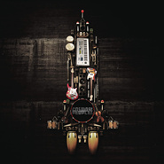

宇宙人 同名专辑
============================

|  |  |
| :--: | :-- |
| [ 宇宙人 同名专辑](https://emumo.xiami.com/album/345761) | **艺人**: [宇宙人](../index.md) **语种**: 国语 **唱片公司**: 相信音乐 **发行时间**: 2009年09月04日 **专辑类别**: 录音室专辑 **专辑风格**: 国语流行 Mandarin Pop **播放数**: 783766 **收藏数**: 713 **评论数**: 67  |

## 简介

“大家好，我们是宇宙人！”   
他们是全宇宙最天的乐团 他们的音乐是从天外飞来的 也是从心脏发射的   
他们的脸在后面 他们的歌在里面   
  
【宇宙人来啰】   
2004年的暑假 那是一个炎热到想裸体在日本逛街的暑假 所以我和一位同学去大阪 看一个叫Dancers Delight的舞蹈比赛 那时刚好正值雅典奥运 我们晚上在民宿的乐趣就是吹冷气看奥运的田径项目 记得是男子400跨栏的试跑 当所有选手到齐时 我们看到一位选手的服装跟别人很不一样 他叫Felix Sanchez 他每次要起跑之前 都会将手上的一个手环打开 那个手环一打开上面的一颗颗LED小灯泡就会绕着发光 除了很帅，完全看不出有什么作用 最酷的是 他在跑完之后还对镜头做出很酷的动作 而且还是第一名!! 这实在太…宇宙了 所以 他给了我们第一首歌的灵感 更造成我们团名的由来!! 宇宙人   
  
【关于宇宙人】（小玉）   
真的，宇宙人来了。 他们可能还不是台湾第一天团，但他们绝对是全宇宙最天的团。 他们真的很天，他们很天真，他们很天才。 他们用跳跃的逻辑思考，把不相干的东西，不搭轧的事物，巧妙重组，创造出一种让人想说真他X屌的全新感觉。他们很OLD FASHIONED，他们也很NEW FASHIONED。如果你要定义他们，他们会问你为什么要定义他们，因为他们就是宇宙人啊，要怎么定义？   
每个人的身体都是一个宇宙，那里头住着宇宙人。所以，他们的音乐不是来自外星，而是来自内心。那些旋律、节奏和词句的灵感，像是从天外飞来的，其实是从心脏发射的。你觉得很酷，觉得很想笑，那是因为，他们唱在你的心坎上。   
宇宙人是百分之百的创作乐团。对他们来说，创作并不局限于音乐，他们还喜欢从事发明，在生活中取材，发明各式各样新奇的东西来对抗无聊，虽然，他们发明的东西都很无聊…但是没办法，他们说，不创作手就痒，不发明头会痛。   
其实，每个人的心里，都有很宇宙人的那一块。真的不要再分什么地球人、外星人了，我们都是宇宙人。这股宇宙人的旋风，即将展开。   
  
【宇宙人的风格】   
宇宙人未改组前是以混杂的音乐风格为主、有Funk、Fusion、Emo、Psycho、Blues、Rock。改组之后更喜爱表现Funk、Acid Jazz的律动以及希望能包含前两项创造更新的感觉，并加入电子、Human Beatbox等元素增添丰富性。   
歌词部分多由亲身经历的生活故事出发，把当下我们觉得有趣的感受直接说出来，从单纯叫大家跳舞的内容，到赞美爱人的情歌，乃至于讨乏高中校长的”暴政”…等等题材，都在我们歌词描写的范围，未来我们也将会尝试更多的主题，因为宇宙人关心的事物是没有任何设限的！！！！！   
俗话说的好，你给宇宙人双手、宇宙人给你Disco；由此可知宇宙人强烈希望大家都可以浸淫在他们音乐的流动里!!   
  
不要再分什么地球人、外星人，我们都是宇宙人  
你听，这些音乐不是来自外星，而是来自内心  
2009.9.4 宇宙人同名专辑正式发售  
  
★大家好！我们是宇宙人  
“一句3秒的话就能给人一个领悟 但是绝对不是这句话这只是自我介绍而已”  
“简单的九字真言 贯彻整张专辑 每天念一遍 健康身体不会变”  
“其实听起来像 大阿好 我们是宇宙人”  
★核尔蒙爆炸  
“以为青春炸完就没了 没想到原子弹还有一颗”  
“夏天的美女总是让我裤裆的荷尔蒙爆炸”  
“紧凑的乐器就像啄木鸟 不给你耳朵喘息的机会 敲打着踩小碎步冲刺的青春”  
“如果对青春还有憧憬 那就再放一次这首歌吧！”  
★要去高雄  
“男：我明天要出差 女：要小心喔 旁白：你们两个心里绝对不是这样想的！”  
“如果你今天要去新竹 千万不要听这首歌 因为你会一路开心到高雄”  
“听这首歌的好处  
1.在风景呆板的高速公路上为您增添乐趣  
2.在不断有人超车的同时给您好心情  
3.在长途的车程之中给您一个可以做点头运动的节奏”  
“异乡的邂逅总是浪漫 之后的事情总是太短暂”  
★夜来夜香  
“神祕的篱笆后面到底住着甚么女孩散发着甚么神祕的香味”  
“最简单的节奏泄露最强劲的韵律感 好似你咬了一根薯条 里面却塞着香蕉佐油条”  
“我的心脏急速压缩舒张到底是因为这首歌还是你的香味”  
“不管中文标不标准 这首歌名都不会念错”  
★悲情男子  
“来自异国的男子 身后背着一把琴 齿缝流出的可能是一段旋律 也可能是一个女子的名字 提琴手拉弓 是我看错了吗 他和他的琴在高兴地跳着笨拙华尔兹”  
★背琴男子  
“假如有人问我的烦忧 我不忍说出你的名字”–烦忧 戴望舒  
“最孤单的人 可以吐出最巨大的叹气声”  
“即使是悲伤 我也要使劲全力地跳 跳到小指扭到 我才肯放心地哭”  
“吉他就是一个被烈酒烧伤喉咙的老人 钢琴就是一个音准很差的酒吧歌手 贝斯就是一个有很会讲大道理的大胡子乞丐 鼓就是一个怀才不遇口袋有烟不抽的年轻人 四个人组了一个乐团--悲情男子”  
★太空警察  
“假如有人问我的名字 我就说罗勃费来德”  
“好像回到了70年代 穿起我的紧身裤跃入舞池!!”  
“承继伟大乐手的反动性格对剥夺自由的统治者之叫嚣”  
“如果有一部正义的电影 太空警察就会是他的主题曲”  
“只要大声求救 我马上就会出现 但如果是因为我的帅气而需要求救 那就没办法了”  
★花花  
“艳丽的花瓣装饰浓香的花蜜 于是男人都变成了工蜂”  
“年度最佳推倒情歌”  
“植物性的歌名 动物性的歌词”  
“最不希望女生和花扯上的关系应该就是花钱”  
“放这首歌的时候请注意身边有没有异性 如果你是个害羞的人”  
★摔角选手  
“记忆中输的最惨的一次 对手就是我女朋友”  
“猪木和朱木炎都强烈推荐的硬汉情歌”  
“摔角也是一种爱的表现 只是比赛场地没有枕头和烛光”  
“听完这首歌之后 就会想要买一件紧身裤试试看 不过我建议先在床上摔就好”  
★Hey  
“你的脚还是活的吧 动一下阿！！！！！！”  
“大家都有跳舞的权利 或许下次你要拔蟑螂的脚之前可以先想一下这件事”  
“如果妳不会讲英文 我会很高兴这首歌是你学会讲的第一个英文字”  
“这大概是宇宙人最容易参与的歌了”  
“你只要会喊Hey 你就有这场派对的门票了”  
“宇宙大舞厅必备开场歌”  
★Sorry 女孩  
“会后悔才是人阿 你有听过蚂蚁因为偷吃饼干道歉吗”  
“轻快的节奏应该是在笑 但是过来人知道你在苦笑”  
★你来  
“宇宙人也有抒情歌 听起来却像输情歌”  
“我想这就是淡淡的忧伤 在路边吃担担面的时候突然想起”  
★Sofa So Good  
“宇宙人也想进军时尚界”  
“有的时候沙发比床还好睡 象是失恋阿 喝醉阿 看电视之类的”   
  
【宇宙人乐团简介】   
键盘、主唱／小玉 （林忠谕）   
结他／阿奎 （陈奎言）   
低音结他／A达 （陈威达）   
鼓／魏胖 （魏鸿柏）   
团长／宇宙人   
  
我们是在2004年9月的玩家练团室师大店发迹，于月底正式成立、都是由同一个高中的朋友毕业之后所组成。组成翌年就于垦丁春呐表演并之后每年都会去参与这个活动，除了春天呐喊还有在海洋音乐祭、啾虎祭、台大好无聊艺术祭、台大杜鹃花节街头走唱、花莲洄澜异音音乐祭、硬地音乐节。也曾经在不同的表演场地如台北的阿帕808、河岸留言、The Wall、Fuzz、2F咖啡馆、台大回廊咖啡、地下社会、Luxy及台中老诺表演过。   
  
宇宙人的创团二人组为主唱小玉以及吉他手阿奎，两人高中时就对放客音乐充满热情，高中毕业后小玉和阿奎就在阿奎家用beat box和funky吉他即兴弹奏一些音乐，结果出奇的好，一首一首歌合作出默契来，宇宙人就这样成形了，是为第一代宇宙人。之后宇宙人的团员有过两次调整，现任的贝斯手为A达，鼓手为魏胖，是为第三代宇宙人。

## 曲目

## 评论

|  |  |  |
| :-- | :-- | :-- |
|  [虾米用户](https://emumo.xiami.com/u/2123377) 我还没想好要写什么... 2020-12-22 19:58 赞(0) 踩(0) | 
初中时超级爱听的专辑，现在听编曲真的超级棒
 |
|  [虾米用户](https://emumo.xiami.com/u/43492923) 行到水穷我才开始害怕，夕... 2020-05-26 16:37 赞(0) 踩(0) | 
-
 |
|  [虾米用户](https://emumo.xiami.com/u/100067126) 其实你爱我是谁，多少种表... 2019-11-27 10:21 赞(0) 踩(0) | 
这种态度真的很nice～
 |
|  [虾米用户](https://emumo.xiami.com/u/5485858)  2019-07-19 17:03 赞(0) 踩(0) | 
不完美，但是耳目一新，这还不够吗
 |
|  [虾米用户](https://emumo.xiami.com/u/5094751) 咔咻哒 2019-06-06 20:48 赞(0) 踩(0) | 
回听下 首首都有惊喜啊！
 |
|  [虾米用户](https://emumo.xiami.com/u/82381998) 我还没想好要写什么... 2019-06-03 13:26 赞(1) 踩(0) | 
地球漫步认识，再把所有专辑听完，最后才感受到最宇宙的是第一张
 |
| ⇒ |  [虾米用户](https://emumo.xiami.com/u/5094751) 咔咻哒 2019-06-06 20:54 赞(0) 踩(0) | 
这张最宇宙！边听边看专辑介绍 每人一句的描述 更有意思欸！
 |
|  [虾米用户](https://emumo.xiami.com/u/4333960) 暂无签名~ 2018-12-29 17:15 赞(0) 踩(0) | 
真的很赞这张专辑
 |
|  [虾米用户](https://emumo.xiami.com/u/274944198) 三军可夺帅也，匹夫不可夺... 2018-08-30 16:04 赞(0) 踩(0) | 
喜欢啊哈哈哈
 |
|  [虾米用户](https://emumo.xiami.com/u/54302732) 就像一个多鸟的夏天 2018-07-04 17:58 赞(1) 踩(0) | 
在台湾收了实体砖(̿▀̿̿Ĺ̯̿̿▀̿ ̿)̄ 超级可爱
 |
|  [虾米用户](https://emumo.xiami.com/u/55347319) 全都不要。 2018-06-23 12:14 赞(1) 踩(0) | 
喜欢了好久的宇宙人居然火了。我还有这张专辑呢！
 |
|  [虾米用户](https://emumo.xiami.com/u/80939426) 签名  2018-06-06 13:51 赞(2) 踩(0) | 
感觉很少听到像宇宙人这样Funk感很强的华语乐队耶，欢迎怼我，我要拓宽耳界
 |
|  [虾米用户](https://emumo.xiami.com/u/3080840) Music comple... 2018-04-07 14:38 赞(5) 踩(0) | 
天马行空的funky music，满到溢出的荷尔蒙，横空出世的宇宙人！
 |
|  [虾米用户](https://emumo.xiami.com/u/82381998) 我还没想好要写什么... 2018-02-25 21:37 赞(4) 踩(0) | 
爱上这专辑的感觉像是突然发现在你身边很久的那女孩竟然这么可爱
 |
|  [虾米用户](https://emumo.xiami.com/u/13189533)  2017-11-28 23:04 赞(9) 踩(0) | 
常常反复拿出来听的一张专辑 原来的宇宙这几年有人离队 到现在在的这三位 非常喜欢歌里玩各种同音文字游戏 其实后面几张都很好 就是始终放不下这张专辑
 |
|  [虾米用户](https://emumo.xiami.com/u/8748022) 不去制约被制约没有习惯 2017-07-02 22:02 赞(7) 踩(0) | 
后出的专辑入的坑，但始终会最喜欢第一张专辑，这是什么鬼规律 
 |
|  [虾米用户](https://emumo.xiami.com/u/175115058)  2017-01-14 20:30 赞(1) 踩(0) | 
第一首歌曲呢
 |
|  [虾米用户](https://emumo.xiami.com/u/84779848) Back to life... 2016-10-27 19:47 赞(3) 踩(0) | 
专辑简介好可爱哈哈
 |
|  [虾米用户](https://emumo.xiami.com/u/1065860) 一生悬命。 2016-09-30 21:02 赞(1) 踩(0) | 
世界永远不缺青春洋溢的乐队呢。
 |
|  [虾米用户](https://emumo.xiami.com/u/195214684) live like we... 2016-07-07 11:19 赞(2) 踩(0) | 
卢广仲附体了啊
 |
|  [虾米用户](https://emumo.xiami.com/u/117674872) 我还没想好要写什么... 2016-04-06 13:06 赞(2) 踩(0) | 
哪首歌好听求推荐
 |
|  [虾米用户](https://emumo.xiami.com/u/2130908) 我还没想好要写什么... 2016-03-16 14:45 赞(2) 踩(0) | 
回想起初中时在ktv点了首太空警察 朋友们用关怀傻子的眼神看向我 大家可以去欣赏一下mv蛤蛤
 |
| ⇒ |  [虾米用户](https://emumo.xiami.com/u/35275661)  2017-09-12 14:09 赞(0) 踩(0) | 
关怀傻子的眼神。。。
 |
|  [虾米用户](https://emumo.xiami.com/u/6607787)  2015-12-04 11:15 赞(3) 踩(0) | 
喜欢啊！至少听过30遍了
 |
|  [虾米用户](https://emumo.xiami.com/u/2512277) 噢，乖！ 2015-10-12 13:19 赞(2) 踩(0) | 
还是第一张好听呀~~~摔角选手莫名动人~~~
 |
|  [虾米用户](https://emumo.xiami.com/u/50855153)   2015-06-16 14:33 赞(2) 踩(0) | 
就是要这样放肆
 |
|  [虾米用户](https://emumo.xiami.com/u/2123377) 我还没想好要写什么... 2014-06-27 23:30 赞(0) 踩(0) | 
回忆一下。。。
 |
|  [虾米用户](https://emumo.xiami.com/u/15408376) i am potted 2014-03-15 16:57 赞(2) 踩(0) | 
蛇精病好喜欢！！！好开心！
 |
|  [虾米用户](https://emumo.xiami.com/u/541980)  2013-05-09 19:37 赞(3) 踩(0) | 
相信出品好品质~还是喜欢第一张专辑放肆的态度，哈哈~
 |
|  [虾米用户](https://emumo.xiami.com/u/4062479)  2013-05-05 08:16 赞(1) 踩(0) | 
大学时代还挺喜欢听的专辑……
 |
|  [虾米用户](https://emumo.xiami.com/u/4874548)  2013-04-02 22:23 赞(2) 踩(0) | 
k起来超爽的，可惜卡拉ok店收录的不多。。。
 |
|  [虾米用户](https://emumo.xiami.com/u/8091626)  2012-12-08 14:05 赞(2) 踩(0) | 
呜呜
 |
|  [虾米用户](https://emumo.xiami.com/u/4044621) :) 2012-11-09 02:05 赞(1) 踩(0) | 
小队长组乐队了？！
 |
| ⇒ |  [虾米用户](https://emumo.xiami.com/u/660968) 一起去狗带 2012-11-17 12:43 赞(0) 踩(0) | 
→ →不是小队长
 |
| ⇒ |  [虾米用户](https://emumo.xiami.com/u/4044621) :) 2012-11-17 19:04 赞(0) 踩(0) | 
<q><b>顾里晓无城猫说：</b></q>
 |
| ⇒ |  [虾米用户](https://emumo.xiami.com/u/660968) 一起去狗带 2012-11-18 00:54 赞(0) 踩(0) | 
<q><b>KJsnowyowl说：</b></q>
 |
|  [虾米用户](https://emumo.xiami.com/u/1884670)  2012-10-15 14:18 赞(1) 踩(0) | 
小清新
 |
|  [虾米用户](https://emumo.xiami.com/u/9057963) 无音乐不生活 2012-10-14 12:56 赞(0) 踩(0) | 
我是清新宇宙人
 |
|  [虾米用户](https://emumo.xiami.com/u/9057963) 无音乐不生活 2012-10-14 12:54 赞(2) 踩(0) | 
另一种清新小节奏
 |
|  [虾米用户](https://emumo.xiami.com/u/6090413) Top it with ... 2012-10-13 20:06 赞(0) 踩(0) | 
奇怪的力量，可以让我忘记烦恼
 |
|  [虾米用户](https://emumo.xiami.com/u/6090413) Top it with ... 2012-10-13 19:56 赞(1) 踩(0) | 
花花是首好可爱的歌，听得我摇摆起来，烦恼全无~
 |
|  [虾米用户](https://emumo.xiami.com/u/10661190) 不要對自己太好 2012-10-11 11:58 赞(1) 踩(0) | 
節奏明快
 |
|  [虾米用户](https://emumo.xiami.com/u/17401) 喂 你好 ~ 2012-10-05 16:55 赞(0) 踩(0) | 
好像不错。
 |
|  [虾米用户](https://emumo.xiami.com/u/5000964) oooooOH 2012-09-21 23:08 赞(1) 踩(0) | 
旺福？
 |
|  [虾米用户](https://emumo.xiami.com/u/3682903) 我还没想好要写什么... 2012-09-12 09:24 赞(2) 踩(0) | 
和旺福一样 是那种无论何时听了都会心情舒畅的调调
 |
|  [虾米用户](https://emumo.xiami.com/u/6272889)  2012-04-10 02:27 赞(24) 踩(0) | 
中国少有的真正在玩音乐的团队
 |
| ⇒ |  [虾米用户](https://emumo.xiami.com/u/3863682) 20秒的勇气 2019-06-20 13:54 赞(0) 踩(0) | 
有 有很多 只是中国内地没有好土壤 太难了对于搞乐队的来说
 |
|  [虾米用户](https://emumo.xiami.com/u/7057559)  2011-12-08 21:12 赞(1) 踩(0) | 
宇宙人音樂很好啊！看不見那裡有賣
 |
|  [虾米用户](https://emumo.xiami.com/u/5745794) 最遥远的距离 2011-10-30 15:52 赞(0) 踩(0) | 
宇宙人
 |
|  [虾米用户](https://emumo.xiami.com/u/5745794) 最遥远的距离 2011-10-30 15:51 赞(0) 踩(0) | 
喜欢，就支持，，，
 |
|  [虾米用户](https://emumo.xiami.com/u/363126) ★~★ 2011-10-19 15:05 赞(0) 踩(0) | 
小号卢广仲，但似乎还要可爱！！
 |
|  [虾米用户](https://emumo.xiami.com/u/642025)  2011-10-06 12:08 赞(0) 踩(0) | 
很边缘，很好听。
 |
|  [虾米用户](https://emumo.xiami.com/u/3847145) 春虫虫当 2011-10-03 19:31 赞(0) 踩(0) | 
太喜欢了！
 |
|  [虾米用户](https://emumo.xiami.com/u/5702527)  2011-09-04 16:42 赞(0) 踩(0) | 
有趣。
 |
|  [虾米用户](https://emumo.xiami.com/u/1027949)  2010-09-05 18:48 赞(0) 踩(0) | 
宇宙人耶.... 很久以前在春吶看過一次... 不過那時候曲風跟現在很不一樣... 比較punk 現在有點funky... 還有點像盧廣仲
 |
|  [虾米用户](https://emumo.xiami.com/u/1289002)  2010-08-19 18:29 赞(2) 踩(0) | 
繼糯米糰後最Funky的樂團
 |
|  [虾米用户](https://emumo.xiami.com/u/637038)  2010-08-09 22:58 赞(2) 踩(0) | 
原来唱的是“要去高雄”，我一直听成“高手高手”，搜来搜去都搜不到这首叫“高手”的歌
 |
|  [虾米用户](https://emumo.xiami.com/u/805022)  2010-06-30 19:38 赞(0) 踩(0) | 
就你在这自言自语
 |
|  [虾米用户](https://emumo.xiami.com/u/425346) 我还没想好要写什么... 2010-06-22 23:24 赞(1) 踩(0) | 
主唱兼键盘手－小玉 经历：旺福乐团演唱会乐手、卢广仲台北香港演唱会乐手
 |
| ⇒ |  [虾米用户](https://emumo.xiami.com/u/805022)  2010-06-30 19:38 赞(0) 踩(0) | 
忘了 要点回复
 |
|  [虾米用户](https://emumo.xiami.com/u/425346) 我还没想好要写什么... 2010-06-22 23:19 赞(0) 踩(0) | 
哇 ，以为是卢广仲····
 |
|  [虾米用户](https://emumo.xiami.com/u/706874)  2010-06-14 22:29 赞(1) 踩(0) | 
主唱声音很像卢广仲啊！
 |
|  [虾米用户](https://emumo.xiami.com/u/107388) 灯火棋倦，饮醉沉眠 2010-05-24 20:03 赞(0) 踩(0) | 
Hey 和 摔角选手 的音乐也是反的.  -,-!
 |
|  [虾米用户](https://emumo.xiami.com/u/107388) 灯火棋倦，饮醉沉眠 2010-05-11 00:05 赞(0) 踩(0) | 
太空警察和悲情男子反了...
 |
|  [虾米用户](https://emumo.xiami.com/u/159369) 10 2010-02-19 19:44 赞(2) 踩(0) | 
支持新的有想法的乐队，独立，还带ACID JAZZ，很不错的开始，期待第二章专辑~~！！！
 |
|  [虾米用户](https://emumo.xiami.com/u/56853)  2009-10-31 13:02 赞(2) 踩(0) | 
好像卢广仲。可爱的外表下其实他们的歌很有自己的思想。
 |
|  [虾米用户](https://emumo.xiami.com/u/54518)  2009-10-30 08:15 赞(1) 踩(0) | 
2009年度最具创意的新乐队 已经在向苏打绿发起了最严厉的挑战
 |
