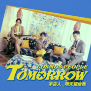
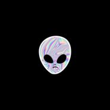
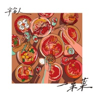
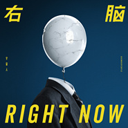
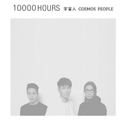
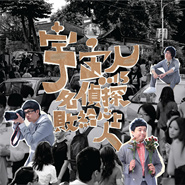

宇宙人
============================

|  |  |
| :--: | :-- |
| [ 宇宙人](https://i.xiami.com/cosmospeople) | **播放数**: 22678293 **粉丝数**: 23777 **评论数**: 540 **地区**: Taiwan, PRC 中国台湾 **风格**: 灵魂乐 Soul, 放克 Funk  |

## 档案

你！有没有脑啊？有，但只有右脑喔。  老是挥着逻辑那张严肃的大旗，手都酸啦！ 只敢沿着理性一路笔直走下去，是没办法看到曲折漫步的风光呀！ 现在，一起摔破左脑的铜墙铁壁， 让右脑的情骚如溏心，自自在在流淌出来吧  。   宇宙人《我們的探險計劃》巡迴中： 
06/15 廈門 @ Real Live 
06/16 深圳 @ B10现场 
06/17 廣州 @ MAO LIVEHOUSE 
06/21 北京 @ 愚公移山 
06/22 杭州 @ MAO LIVEHOUSE 
06/24 上海 @ MODERNSKY LAB 
購票：#秀动网 
07/01 香港 @ Music Zone 
香港購票：#Cityline 
09/01 新加坡 @ Livehouse the Pavilion 
新加坡購票：#KKTIX 
09/02 馬來西亞 @ Live Fact 
宇宙人第四张全创作专辑 不适用任何逻辑 除了用耳朵听，你可以用眼睛、用膝盖、用下半身 当然如果你想，还可以用心用力听 宇宙人这次只用右脑对你说话 它说： 嘿！别再躲在理性的背后了，快出来面对 勇敢抛出你的直觉，和这个世界直球对决  10/6 抗议理智 废除左脑 『右脑RIGHT NOW!』  「大家好，我们是宇宙人」        大家好，我是主唱小玉    大家好，我是吉他手阿奎    大家好，我是贝斯手方Q    大家好，我们是宇宙人        ---------       音乐，是我们的语言   放克，是我们的血液        从台下只有两位观众到站上万人舞台   我们凭的是一万小时的坚持    现在我们邀请你   一起加入这场派对        请告诉你的朋友们   宇 宙 人来了！      ----------------------------------------------------------------------     宇宙人（英语：Cosmospeople）是一组来自台湾的乐团，成员共有三人。团员有小玉（主唱）、阿奎（吉他手）、方Q（贝斯手）。        宇宙人发迹于2004年9月底的玩家练团室师大店。成员都是由台北市的建国中学毕业生组成，隔年参加于垦丁的春天呐喊音乐祭，受到广大好评，之后乐团开始频繁活动。目前是台湾新生代乐团中人气窜升最快的乐团之一，历经小巨蛋、Neo Studio、美国德州SXSW音乐节等海内外大大小小演出，擅长用独特的放克舞曲带动全场气氛。       团名由来 2004年的暑假，正值雅典奥运会期间，宇宙人主唱小玉和一位热爱街舞的好友前往日本参加一场街舞盛会，饭店里的电视播放著奥运男子跨栏项目的决赛，有一位选手深深地吸引了他们。这位选手叫做Félix Sánchez，多米尼加籍的选手，他在赛前热身时点亮了手上炫丽的LED发光手环，并跳起自创舞步，完全沉浸在自己的宇宙里，厉害的是，最后他还拿下了该项目的金牌荣耀。这个令人赞叹的表现，让他们蹦出了一个绝妙形容词：“这个人好宇宙！”，并且开始模仿起了这位选手的奇特舞步。          几个月后，主唱小玉和高中好友吉他手阿奎组了一个以舞曲风为主的乐团，开始创作歌曲，并积极参加各式各样的表演，因为报名演出需要团名，他们说：“那就叫宇宙人好了”，从此，宇宙人诞生。      风格： 宇宙人未改组前是以混杂的音乐风格为主、有Funk、Fusion、Emo、Psycho、Blues、Rock。改组之后更喜爱表现Funk、Acid Jazz的律动以及希望能包含前两项创造更新的感觉，并加入电子、Human Beatbox等元素增添丰富性。          歌词部分多由亲身经历的生活故事出发，把当下我们觉得有趣的感受直接说出来，从单纯叫大家跳舞的内容，到赞美爱人的情歌，乃至于讨乏高中校长的"暴政"…等等题材，都在我们歌词描写的范围，未来我们也将会尝试更多的主题，因为宇 宙人关心的事物是没有任何设限的！！！！！ 俗话说的好，你给宇宙人双手、宇宙人给你Disco；由此可知宇宙人强烈希望大家都可以浸淫在他们音乐的流动里!!         团员简介：    主唱兼键盘手：小玉    生日：1月2日    专长：Keyboard，BBOX，编曲    个性：善良    兴趣：观察身边的事物    喜欢的音乐：Pharrell Wylliams，蔡健雅，Earth, Wind & Fire    梦想：让更多人喜欢宇宙人的音乐        吉他手：阿奎    生日：4月10日    专长：吉他    个性：Try to be cool    兴趣：吉他编曲，公路旅行    喜欢的音乐：Jimi Hendrix，Michael Jackson，Prince    梦想：八十岁仍是宇宙人的成员        贝斯手：方Q    生日：12月17日    专长：烹饪    个性：过度乐天    兴趣：学习新事物    喜欢的音乐：Jazz, Funk    梦想：在外太空演奏          专辑作品：    《宇宙人同名专辑》 发行日期：2009.9.4    《001.5名侦探败给心上人》 发行日期：2010.9.3    《地球漫步》发行日期2012.10.05    《一万小时10,000 HOURS》发行日期2015.06    《不简单》EP 发行日期2016.04       『右脑RIGHT NOW!』2017.10.06 
p.p1 {margin: 0.0px 0.0px 0.0px 0.0px; line-height: 19.0px; font: 13.0px 'Helvetica Neue'}宇宙人《我們的探險計劃》巡迴中--

## 专辑

| 名称 | 语种 | 唱片公司 | 发行时间 | 专辑类别 | 专辑风格 |
| :--: | :-- | :-- | :-- | :-- | :-- |
| [ 你的宇宙YOUNIVERSE YOUSB 宇宙人第一次登陆台北小巨蛋 万人现场全纪录 Audio Live](./albums/5022253556.md) | 国语 | 相信音乐 | 2020年12月21日 | 现场专辑 |  |
| [ 明天留给我Tomorrow](./albums/5022068012.md) | 国语 | 相信音乐 | 2020年11月26日 | EP, 单曲 | 国语流行 Mandarin Pop, 流行灵魂乐 Pop Soul |
| [ 宇宙探险记](./albums/5022463047.md) | 国语 |  | 2020年08月21日 | 录音室专辑 |  |
| [ 先这样](./albums/5021331751.md) | 国语 | 相信音乐 | 2020年08月18日 | EP, 单曲 | 流行摇滚 Pop Rock |
| [ 你的宇宙](./albums/2105448344.md) | 国语 | 相信音乐 | 2019年11月15日 | EP, 单曲 |  |
| [ 陪我玩](./albums/2104867332.md) | 国语 | 相信音乐 | 2019年05月14日 | EP, 单曲 | 国语流行 Mandarin Pop |
| [ 现在就让我飞](./albums/2104814572.md) | 国语 | 相信音乐 | 2019年03月07日 | EP, 单曲 | 国语流行 Mandarin Pop |
| [ 一桌菜](./albums/2108273714.md) | 国语 | 相信音乐 | 2019年01月31日 | EP, 单曲 | 国语流行 Mandarin Pop |
| [ 拿下这一场](./albums/2103624722.md) | 国语 | 相信音乐 | 2018年03月19日 | EP, 单曲 | 国语流行 Mandarin Pop |
| [ 想入非非](./albums/2103484319.md) | 国语 | 任意門娛樂股份有限公司 RYM Entertainment Co., Ltd. | 2017年12月20日 | EP, 单曲 |  |
| [ 右脑Right Now](./albums/2102866987.md) | 国语 | 相信音乐 | 2017年10月06日 | 录音室专辑 | 国语流行 Mandarin Pop |
| [ 不简单](./albums/2100313928.md) | 国语 | 相信音乐 | 2016年04月15日 | EP, 单曲 | 国语流行 Mandarin Pop |
| [ 一万小时10,000 HOURS](./albums/1827872840.md) | 国语 | 相信音乐 | 2015年06月03日 | 录音室专辑 | 国语流行 Mandarin Pop |
| [ 地球漫步](./albums/536676.md) | 国语 | 相信音乐 | 2012年10月05日 | 录音室专辑 | 国语流行 Mandarin Pop |
| [ 001.5名侦探败给心上人](./albums/400176.md) | 国语 | 相信音乐 | 2010年09月03日 | 录音室专辑 | 国语流行 Mandarin Pop |
| [ 宇宙人 同名专辑](./albums/345761.md) | 国语 | 相信音乐 | 2009年09月04日 | 录音室专辑 | 国语流行 Mandarin Pop |

## 评论

|  |  |  |  |
| :-- | :-- | :-- | :-- |
|  [虾米用户](https://emumo.xiami.com/u/9062060) 此生没拿一个亿来爱虾米是... 2021-01-28 22:26 赞(0) 踩(0) | 
爱
 |
|  [虾米用户](https://emumo.xiami.com/u/358104299) 悲观的唯心存在现实解构虚... 2021-01-13 05:44 赞(0) 踩(0) | 
20972
 |
|  [虾米用户](https://emumo.xiami.com/u/41634598) 片，biubiubiu~ 2021-01-10 12:08 赞(0) 踩(0) | 
在最最最难受与自卑的学生时代，在虾米上认识的宇宙人，喜欢上宇宙人，追了几年的live现场，感谢虾米，对于用了6年多的虾米来说，爷青结，对于宇宙人来说，希望能在其他平台上和你们见面，网易云音乐就算了，真的不要去网易云音乐啊  
 |
|  [虾米用户](https://emumo.xiami.com/u/12949773)   2021-01-07 23:27 赞(1) 踩(0) | 
再见了虾米，再见了我在虾米最钟情的人！
 |
|  [虾米用户](https://emumo.xiami.com/u/251036091) 五月天的超狂热粉丝 2021-01-04 23:38 赞(0) 踩(0) | 
为什么突然间大部分歌都没版权了，虾米是真的要凉了吗
 |
|  [虾米用户](https://emumo.xiami.com/u/29845054) 休息追剧看小说玩游戏出游... 2021-01-04 18:55 赞(0) 踩(0) | 
搞啥，突然间这么多歌不能听 
 |
|  [虾米用户](https://emumo.xiami.com/u/425107816)  2021-01-02 22:49 赞(0) 踩(0) | 
怎么没版权了 
 |
|  [虾米用户](https://emumo.xiami.com/u/176932058)  2020-11-24 20:40 赞(0) 踩(0) | 
印象最深的还是五月天北京场演唱会的暖场，他们唱了一首 现在就让我走 ，挺好听的，可惜周围的人都不认识他们
 |
|  [虾米用户](https://emumo.xiami.com/u/44993903) 85 2020-11-10 21:06 赞(0) 踩(0) | 
你说气不气，没上节目之前所有歌都可以听，上节目以后没有一首可以听
 |
|  [虾米用户](https://emumo.xiami.com/u/125618102)   2020-10-10 23:55 赞(1) 踩(0) | 
你们该火
 |
|  [虾米用户](https://emumo.xiami.com/u/38682619) 纯真 2020-08-13 19:54 赞(0) 踩(0) | 
加油啊宇宙人等你们新专辑
 |
|  [虾米用户](https://emumo.xiami.com/u/379162683) 我想要记住你们，我想要你... 2020-07-16 17:25 赞(0) 踩(0) | 

 |
|  [虾米用户](https://emumo.xiami.com/u/43492923) 行到水穷我才开始害怕，夕... 2020-05-26 16:38 赞(1) 踩(0) | 
-
 |
|  [虾米用户](https://emumo.xiami.com/u/34182751) 再见了朋友们 我们网易云... 2020-03-14 01:25 赞(0) 踩(0) | 
？
 |
|  [虾米用户](https://emumo.xiami.com/u/284365575)   2020-01-02 17:07 赞(2) 踩(0) | 
宇宙人  大概  就是我 最喜欢的 乐队 了吧
 |
| ⇒ |  [虾米用户](https://emumo.xiami.com/u/95269814) 植物在生长，小鸟在飞翔，... 2020-02-05 12:46 赞(0) 踩(0) | 
最近入坑嘴哥乐团，台湾乐队不要太惊喜！
 |
|  [虾米用户](https://emumo.xiami.com/u/36357718) 我还没想好要写什么... 2020-01-01 21:08 赞(0) 踩(0) | 
愛你們
 |
|  [虾米用户](https://emumo.xiami.com/u/96775922) 天真有邪 2019-11-03 03:15 赞(0) 踩(0) | 
昨天的长沙场真棒！
 |
|  [虾米用户](https://emumo.xiami.com/u/245578001)  2019-10-20 22:34 赞(0) 踩(0) | 
第521! 
 |
|  [虾米用户](https://emumo.xiami.com/u/347776396) 勿施于人 2019-10-08 09:32 赞(0) 踩(0) | 
你绝对喜欢刘恋！
 |
|  [虾米用户](https://emumo.xiami.com/u/9062060) 此生没拿一个亿来爱虾米是... 2019-10-08 00:29 赞(0) 踩(0) | 
好听！
 |
|  [虾米用户](https://emumo.xiami.com/u/9062060) 此生没拿一个亿来爱虾米是... 2019-10-08 00:29 赞(0) 踩(0) | 
加油
 |
|  [虾米用户](https://emumo.xiami.com/u/311120643) 嘘…… 2019-08-23 17:42 赞(0) 踩(0) | 
为什么不是只有左脑啊？
 |
|  [虾米用户](https://emumo.xiami.com/u/58843476) :) 2019-08-22 12:02 赞(0) 踩(0) | 
&amp;小玉
 |
|  [虾米用户](https://emumo.xiami.com/u/188902054) born in 2002 2019-08-20 21:57 赞(1) 踩(0) | 
你这家伙搞黄色！！
 |
| ⇒ |  [虾米用户](https://emumo.xiami.com/u/285852432) 在五月的天逆风飞翔，我不... 2020-01-09 09:48 赞(0) 踩(0) | 
hhhhh
 |
|  [虾米用户](https://emumo.xiami.com/u/24667214)   2019-08-18 22:31 赞(0) 踩(0) | 
see you in shanghai!
 |
|  [虾米用户](https://emumo.xiami.com/u/49655313) 除了再见还可以说些什么呢 2019-08-18 11:58 赞(0) 踩(0) | 
西安西安西安西安西安西安(●°u°●)​ 」
 |
|  [虾米用户](https://emumo.xiami.com/u/11462388) 我还没想好要写什么... 2019-08-10 13:14 赞(0) 踩(0) | 
啊啊啊 才发现深圳的过啦 啥时候再来啊
 |
|  [虾米用户](https://emumo.xiami.com/u/9062060) 此生没拿一个亿来爱虾米是... 2019-08-07 21:42 赞(2) 踩(0) | 
诶嘿上海见
 |
|  [虾米用户](https://emumo.xiami.com/u/425346) 我还没想好要写什么... 2019-07-22 11:35 赞(1) 踩(0) | 
这期的歌没有选好
 |
|  [虾米用户](https://emumo.xiami.com/u/9082947) My shine has... 2019-07-20 22:56 赞(1) 踩(0) | 
好喜欢一万小时的啊
 |
|  [虾米用户](https://emumo.xiami.com/u/215379991) 簽名不重要重要的是你聽什... 2019-07-17 07:44 赞(0) 踩(0) | 
ﻌﻌﻌ❤︎
 |
|  [虾米用户](https://emumo.xiami.com/u/4327773) 我还没想好要写什么... 2019-07-13 11:05 赞(0) 踩(0) | 
方q方q
 |
|  [虾米用户](https://emumo.xiami.com/u/405021632)  2019-07-09 19:14 赞(1) 踩(0) | 
好拽啊，喜欢！
 |
|  [虾米用户](https://emumo.xiami.com/u/41309501) 虾米音乐 要一直努力呀 2019-07-09 08:56 赞(2) 踩(0) | 
bass有点吊啊
 |
|  [虾米用户](https://emumo.xiami.com/u/285852432) 在五月的天逆风飞翔，我不... 2019-07-06 23:39 赞(1) 踩(0) | 
嗷嗷，原先想看那个综艺的，看了其他地方的评价还有这里的评论，嗯，看来可以省下时间来看其他的东西了(๑‾ ꇴ ‾๑)宇宙人加油吖，我努力去见你们(ฅ&gt;ω&lt;*ฅ)
 |
|  [虾米用户](https://emumo.xiami.com/u/95994546)   2019-07-02 17:33 赞(0) 踩(0) | 
我也是冲宇宙人才看节目的，一开始在想五月天为什么不参加，现在明白了，宇宙人就是代表五月天来参加的 
 |
|  [虾米用户](https://emumo.xiami.com/u/72148316)  2019-06-21 23:21 赞(2) 踩(0) | 
大家快去给他们投票啊 重返乐队的夏天 着急得快哭了
 |
|  [虾米用户](https://emumo.xiami.com/u/95657346) 许多事情都有选择 2019-06-12 23:35 赞(0) 踩(0) | 
初中的时候听了悲情男子 很长时间过去了 再与宇宙人相遇 依然很喜欢
 |
|  [虾米用户](https://emumo.xiami.com/u/3425063) Lo bueno nun... 2019-06-12 11:39 赞(1) 踩(0) | 
最近几天一直在听，真好听
 |
|  [虾米用户](https://emumo.xiami.com/u/45695293) 愿仍有每天。 2019-06-11 08:08 赞(0) 踩(0) | 
耶宇宙人 cosmos people
 |
|  [虾米用户](https://emumo.xiami.com/u/4826129)  2019-06-06 20:50 赞(1) 踩(0) | 
那位bass手太棒啦
 |
|  [虾米用户](https://emumo.xiami.com/u/12986463)  2019-06-04 14:39 赞(4) 踩(0) | 
我是冲宇宙人才看节目的，结果还没开始就结束了，不知道是不是节目剪辑，莫名其妙。。下期能不能给捞回来啊，捞不回来不想看了
 |
|  [虾米用户](https://emumo.xiami.com/u/43031293) 嗨皮嗨皮～～ 2019-06-02 09:02 赞(6) 踩(0) | 
节目里“科普”朋克时嘉宾们说的话，笑死我了，任何曲风我都可以说是“以年轻的心来解构老世界”。玩音乐的人谁的心不年轻啊？没了年轻的心都败给现实不搞音乐了好嘛？有说“词简单是朋克的一种特点”（大意是这个意思），我都震惊了。词简单的歌在其他曲风里也很普遍，不能算一种曲风的独有特点，创作人想说的话都在音乐里了，词简单没关系。词简单、意不够，就用曲和表演来凑，如果词曲表演都不行，那就不行，千万别推给曲风（朋克就这样云云）。专门做音乐的人不适合当科普知识的老师，也许想表达的很多，但说出来的却很浅了。毕竟这个节目并不是科普节目，即使不讲这些，也没啥，但若决定要讲，那就好好讲，误人子弟就不对了。
 |
|  [虾米用户](https://emumo.xiami.com/u/43031293) 嗨皮嗨皮～～ 2019-06-02 08:39 赞(2) 踩(0) | 
另外，我觉得每个乐队都是独一无二的，没有可比性，只有对不对味儿、喜不喜欢的说法。朋克里还有十几二十几种的小分类呢，即使所有的乐队都选朋克为主曲风，那也有十几二十几种的差别，即使相同种类，也会因为词曲、表演等因素，出现千变万化的样貌，怎么会有可比性呢？
 |
|  [虾米用户](https://emumo.xiami.com/u/43031293) 嗨皮嗨皮～～ 2019-06-02 08:34 赞(15) 踩(0) | 
期待新歌！乐队的夏天过来的～节目里的表演太赞啦！！！看节目真的不过瘾，剪辑太讨厌了，一会儿切到观众一会儿切到嘉宾，有的还要掐断插几句感想，我就想问就差这几分钟吗？表演那么嗨都看不够，需要另剪入别的“炒（毁）气氛”嘛？节目开头说，把镜头多留给乐队，然后一期下来，只有几个乐队的表演是完整演完的，太影响体验了！即使纯享版也是这样，看乐队全身心投入的表演看得正嗨，镜头一下怼人脸上了，要不就切到观众投票的手了……这真的算纯享版吗？谁在乎观众嘉宾长啥样、投没投票啊，只想看表演！说多都是泪，下次你们开巡演，我一定要去现场感受下！
 |
|  [虾米用户](https://emumo.xiami.com/u/51586444) ‍再見 2019-06-01 21:45 赞(2) 踩(0) | 
嘻嘻今年的巡演一定要去
 |
|  [虾米用户](https://emumo.xiami.com/u/139492392)   2019-05-25 22:30 赞(1) 踩(0) | 
要加油啊！
 |
|  [虾米用户](https://emumo.xiami.com/u/346492287) 虾米不要离开我！ 2019-05-20 21:18 赞(3) 踩(0) | 
看来是要爆红了
 |
|  [虾米用户](https://emumo.xiami.com/u/45673840)   2019-05-19 11:42 赞(1) 踩(0) | 
很不错很不错，这是我第二天成为歌迷！
 |
|  [虾米用户](https://emumo.xiami.com/u/411058641) 取之不尽 用之不竭 2019-05-13 11:54 赞(4) 踩(0) | 
什么时候飞回宇宙啊 带我逃离地球吧
 |
|  [虾米用户](https://emumo.xiami.com/u/44743196) 听虾米记得收藏～ 2019-05-09 19:20 赞(2) 踩(0) | 
听你们的歌莫名兴奋
 |
|  [虾米用户](https://emumo.xiami.com/u/328083087) hug 2019-04-28 09:34 赞(2) 踩(0) | 
真可爱啊
 |
|  [虾米用户](https://emumo.xiami.com/u/246689266)  2019-04-22 21:56 赞(1) 踩(0) | 
;-)
 |
|  [虾米用户](https://emumo.xiami.com/u/32258060)  2019-04-21 10:20 赞(1) 踩(0) | 
果然tx有钱就是爷
 |
|  [虾米用户](https://emumo.xiami.com/u/5586779) be nice,be c... 2019-04-12 12:43 赞(1) 踩(0) | 
好听
 |
|  [虾米用户](https://emumo.xiami.com/u/407353071) 无所事事事务所所长 2019-03-05 23:13 赞(3) 踩(0) | 
想听现场
 |
|  [虾米用户](https://emumo.xiami.com/u/175278550) 私は安本丹です 2019-02-10 11:07 赞(2) 踩(0) | 
一桌菜是不打算在虾米上线了吗……
 |
|  [虾米用户](https://emumo.xiami.com/u/311385991)  2019-02-08 15:57 赞(0) 踩(0) | 
什么时候能有演唱会呢
 |
| ⇒ |  [虾米用户](https://emumo.xiami.com/u/41634598) 片，biubiubiu~ 2019-02-19 11:07 赞(0) 踩(0) | 
每年都有，去年在内地是6月份。
 |
|  [虾米用户](https://emumo.xiami.com/u/246689266)  2019-02-05 23:04 赞(0) 踩(0) | 
哎呦喂⊙∀⊙！
 |
|  [虾米用户](https://emumo.xiami.com/u/247849455) 我还没想好要写什么... 2019-02-05 00:50 赞(1) 踩(0) | 
想听一桌菜发现虾米没有…
 |
|  [虾米用户](https://emumo.xiami.com/u/406563052) “心里的叹息听说会变成雨... 2019-01-30 00:35 赞(4) 踩(0) | 
宝藏乐队呢!!!为你们疯狂打call！（超大声说）对于歌荒的我来说简直是快乐喷泉呀!!!(♡˙︶˙♡)
 |
|  [虾米用户](https://emumo.xiami.com/u/41634598) 片，biubiubiu~ 2019-01-20 20:11 赞(1) 踩(0) | 
啊 ~什么时候发新专呢~~
 |
|  [虾米用户](https://emumo.xiami.com/u/325630430) 我还没想好要写什么... 2018-12-19 13:47 赞(1) 踩(0) | 
为什么突然就听不了了啊   
 |
| ⇒ |  [虾米用户](https://emumo.xiami.com/u/250716051) 我是牛奶又是西瓜 2018-12-19 14:06 赞(0) 踩(0) | 
對呀！！！發生什麼事了？一早起來發現都不能聽…好崩潰｡ﾟ(ﾟ´Д｀ﾟ)ﾟ｡
 |
|  [虾米用户](https://emumo.xiami.com/u/12365954) 我还没想好要写什么... 2018-12-04 19:28 赞(0) 踩(0) | 
真滴太喜欢了再多打几个喜欢喜欢喜欢喜欢
 |
|  [虾米用户](https://emumo.xiami.com/u/55067802) εїз 2018-12-02 17:59 赞(0) 踩(0) | 

 |
|  [虾米用户](https://emumo.xiami.com/u/48874735) 这家伙很笨什么也没留下… 2018-11-22 23:37 赞(0) 踩(0) | 
唉真的好喜欢啊。
 |
|  [虾米用户](https://emumo.xiami.com/u/48874735) 这家伙很笨什么也没留下… 2018-11-19 15:51 赞(12) 踩(0) | 
有多喜欢呢？大概也就这么喜欢吧。（比手势从这端到那端）
 |
|  [虾米用户](https://emumo.xiami.com/u/83736930)  2018-11-12 16:18 赞(1) 踩(0) | 
宝藏男孩！！太好听了吧
 |
|  [虾米用户](https://emumo.xiami.com/u/102598316)  2018-10-19 11:13 赞(0) 踩(0) | 
spotify上面还是可以听的
 |
|  [虾米用户](https://emumo.xiami.com/u/38753085) 在学bass；啥都听听；... 2018-10-16 08:57 赞(0) 踩(0) | 
回来了 
 |
|  [虾米用户](https://emumo.xiami.com/u/274944198) 三军可夺帅也，匹夫不可夺... 2018-10-15 21:43 赞(0) 踩(0) | 
虾米最棒
 |
|  [虾米用户](https://emumo.xiami.com/u/317978671) 与众不曈 2018-10-13 20:43 赞(0) 踩(0) | 
为么突然下架？？
 |
|  [虾米用户](https://emumo.xiami.com/u/38753085) 在学bass；啥都听听；... 2018-10-13 19:01 赞(1) 踩(0) | 
卧槽为什么下架了 昨天还好好的
 |
|  [虾米用户](https://emumo.xiami.com/u/37549639) 请尽情来打搅我吧 2018-10-13 15:55 赞(1) 踩(0) | 
下架了
 |
|  [虾米用户](https://emumo.xiami.com/u/262844435) spring  2018-10-10 23:32 赞(1) 踩(0) | 
歌荒的我发现了宇宙人这个宝藏乐队真的太开心了！每一首都好听！！喜欢！！！
 |
|  [虾米用户](https://emumo.xiami.com/u/284730651) 欢迎光临 我的宇宙✨ 2018-10-06 14:08 赞(0) 踩(0) | 
等冬巡 双手都给你们！
 |
|  [虾米用户](https://emumo.xiami.com/u/85848010) 不知何时又会再忆起 2018-10-02 19:38 赞(1) 踩(0) | 
我喜欢小玉啊啊啊啊啊啊～
 |
|  [虾米用户](https://emumo.xiami.com/u/43980668) 我在想我是什麼 2018-09-15 02:04 赞(0) 踩(0) | 
你说那你想做什么
 |
|  [虾米用户](https://emumo.xiami.com/u/325763180) 我还没想好要写什么... 2018-09-13 15:57 赞(0) 踩(0) | 

 |
|  [虾米用户](https://emumo.xiami.com/u/251036091) 五月天的超狂热粉丝 2018-08-30 17:31 赞(1) 踩(0) | 
跟团跑的那个胖胖的鼓手是谁呀，没有进入编制内哦
 |
|  [虾米用户](https://emumo.xiami.com/u/354181908) kiss 2018-08-28 13:21 赞(0) 踩(0) | 
九月一号来新加坡嘛！！！我去
 |
|  [虾米用户](https://emumo.xiami.com/u/274944198) 三军可夺帅也，匹夫不可夺... 2018-08-28 12:05 赞(0) 踩(0) | 
五月天演唱会发现的，回去再看现场，加油宇宙人  
 |
|  [虾米用户](https://emumo.xiami.com/u/9597157) ， 2018-08-25 22:45 赞(0) 踩(0) | 
爱你们 现场合影啦~
 |
|  [虾米用户](https://emumo.xiami.com/u/29684859) 一尘不染 2018-08-25 21:11 赞(1) 踩(0) | 
现场赞！
 |
|  [虾米用户](https://emumo.xiami.com/u/204351522)  2018-08-19 23:58 赞(0) 踩(0) | 
太好听了  
 |
|  [虾米用户](https://emumo.xiami.com/u/96107010) 正因为未知才能源源不断前... 2018-08-12 13:12 赞(0) 踩(0) | 
襄阳场的你们帅爆了 
 |
|  [虾米用户](https://emumo.xiami.com/u/401132696)  2018-08-10 23:39 赞(1) 踩(0) | 
因为一首《淹没》开始喜欢宇宙人
 |
|  [虾米用户](https://emumo.xiami.com/u/120734118)  2018-07-26 14:13 赞(1) 踩(0) | 
7.25上海分公司来的
 |
|  [虾米用户](https://emumo.xiami.com/u/378774264) 通过一个人的音乐列表了解... 2018-07-17 07:24 赞(1) 踩(0) | 
喜欢喜欢
 |
|  [虾米用户](https://emumo.xiami.com/u/242820153) 在一起讀書的人並沒有在一... 2018-07-04 17:13 赞(1) 踩(0) | 
然后 我们在对方的梦醒过来
 |
|  [虾米用户](https://emumo.xiami.com/u/8939226) 我还没想好要写什么... 2018-07-02 17:04 赞(0) 踩(0) | 
<a href="https://v.youku.com/v_show/id_XMzY0ODQyMjUxMg==.html?spm=a2h0k.11417342.soresults.dtitle" target="_blank" rel="nofollow noreferrer noopener">https://v.youku.com/v_show/id_XMzY0ODQyMjUxMg==.html?spm=a2h0k.11417342.soresults.dtitle</a>  日常安利好听死了啊啊啊啊
 |
|  [虾米用户](https://emumo.xiami.com/u/352605352) 每天数着日子还是过着人生 2018-07-01 02:34 赞(2) 踩(0) | 
冬天在杭州等你们！要来哦 
 |
|  [虾米用户](https://emumo.xiami.com/u/8939226) 我还没想好要写什么... 2018-06-29 18:05 赞(0) 踩(0) | 
<a href="https://www.bilibili.com/video/av11472518?spm_id_from=333.338.__bofqi.20" target="_blank" rel="nofollow noreferrer noopener">https://www.bilibili.com/video/av11472518?spm_id_from=333.338.__bofqi.20</a> 好赞啊啊啊啊啊听了一个下午编曲不能更赞唉我可以循环到天荒地老
 |
|  [虾米用户](https://emumo.xiami.com/u/349807562) 想要很多很多朋友 2018-06-25 17:12 赞(2) 踩(0) | 
下次去KTV我要唱爆全场
 |
|  [虾米用户](https://emumo.xiami.com/u/651086) 一些…还有一些 2018-06-24 22:04 赞(1) 踩(0) | 
上海演唱会好棒呀
 |
|  [虾米用户](https://emumo.xiami.com/u/5549216) 是认真的。 2018-06-23 00:30 赞(2) 踩(0) | 
有朋友去了今天的MAO吗 想问问塑料小卡片是每个人都有吗？ 谁在我的帽子里放了两张小卡片。。。  真的好惊喜 谢谢
 |
|  [虾米用户](https://emumo.xiami.com/u/12386772) JC / ᴰᴱˢᴵᴳᴺᴱ... 2018-06-22 17:40 赞(1) 踩(0) | 
JIN WAN &amp;gt; HANG ZHOU &amp;gt; ❤
 |
|  [虾米用户](https://emumo.xiami.com/u/50334380) 你 来自哪颗星 2018-06-22 01:24 赞(2) 踩(0) | 
今天去晚啦 没买到专辑 有点遗憾 不是因为五月天也不是因为卢广仲 宇宙人就是宇宙人 愚公移山真的热疯 冬天也热 不过墙面上投影的影子真的超帅 其实北京还是有蛮多新的live house 下次再见 多带点专辑 
 |
|  [虾米用户](https://emumo.xiami.com/u/235189395) 我还没想好要写什么... 2018-06-17 15:32 赞(0) 踩(0) | 
今晚见(๑╹◡╹)ﾉ&amp;quot;&amp;quot;&amp;quot;
 |
|  [虾米用户](https://emumo.xiami.com/u/285049473) 剛拿起酒杯想和你碰杯 才... 2018-06-17 13:57 赞(0) 踩(0) | 
～
 |
|  [虾米用户](https://emumo.xiami.com/u/68705748) 偶然与巧合 2018-06-16 16:45 赞(1) 踩(0) | 
我們明天廣州見！
 |
|  [虾米用户](https://emumo.xiami.com/u/5781253) 想见你 2018-06-16 07:25 赞(0) 踩(0) | 
加油
 |
|  [虾米用户](https://emumo.xiami.com/u/1143360) 到头来 还是感谢虾米一切... 2018-06-12 17:37 赞(0) 踩(0) | 
我听听
 |
|  [虾米用户](https://emumo.xiami.com/u/252489525)  2018-06-10 21:37 赞(0) 踩(0) | 
加油＾０＾~
 |
|  [虾米用户](https://emumo.xiami.com/u/344411066) 我还没想好要写什么... 2018-06-09 22:31 赞(0) 踩(0) | 
6.16深圳见顺便有没有深圳滴小伙伴可以一起
 |
|  [虾米用户](https://emumo.xiami.com/u/15136244) 我还没想好要写什么... 2018-06-09 19:05 赞(1) 踩(0) | 
今年怎么不来成都了呢 
 |
|  [虾米用户](https://emumo.xiami.com/u/169817526)   2018-06-05 23:56 赞(0) 踩(0) | 
6.15厦门见！
 |
|  [虾米用户](https://emumo.xiami.com/u/45856156) 深呼吸我 2018-06-05 22:11 赞(0) 踩(0) | 
初夏耶 永远的 
 |
|  [虾米用户](https://emumo.xiami.com/u/833591) 我还没想好要写什么... 2018-05-31 09:44 赞(4) 踩(0) | 
说实话比他们老大五月天强太多了，初听像卢广仲，久后非常有自己的特色，主要是国人玩popfunk的乐队太少了，凸显了他们的独特性，期待看一次他们的live
 |
| ⇒ |  [虾米用户](https://emumo.xiami.com/u/8939226) 我还没想好要写什么... 2018-06-22 01:25 赞(0) 踩(0) | 
编曲不能更赞呀
 |
| ⇒ |  [虾米用户](https://emumo.xiami.com/u/221534882) 要等你先开口 那冬天才会... 2018-07-21 23:01 赞(0) 踩(0) | 
为什么你们这些人赞美一个人的时候总是要踩一下别人？？？素质呢
 |
| ⇒ |  [虾米用户](https://emumo.xiami.com/u/205195976) 暂时想不到什么矫情的话。 2019-08-02 08:50 赞(0) 踩(0) | 
毫无疑问，踩一捧一的烂人都是辣鸡
 |
|  [虾米用户](https://emumo.xiami.com/u/101342636)  2018-05-08 21:28 赞(0) 踩(0) | 
支持你们！
 |
|  [虾米用户](https://emumo.xiami.com/u/8527949) it'Pop 2018-04-28 17:31 赞(2) 踩(0) | 
变成树  用叶子接吻女主 应该是 长颈鹿lol
 |
|  [虾米用户](https://emumo.xiami.com/u/38464881) 总有人正年轻着 2018-04-23 19:48 赞(1) 踩(0) | 
加油呀 厦门场？等你们哦
 |
|  [虾米用户](https://emumo.xiami.com/u/13664684)   2018-04-12 22:28 赞(0) 踩(0) | 
今年巡演，我在深圳等你们～～～
 |
| ⇒ |  [虾米用户](https://emumo.xiami.com/u/8939226) 我还没想好要写什么... 2018-05-08 17:41 赞(0) 踩(0) | 
已买票
 |
|  [虾米用户](https://emumo.xiami.com/u/357340067)  2018-04-10 12:12 赞(0) 踩(0) | 
喜欢喜欢 自从在苏州听了这首歌 猝不及防的喜欢
 |
|  [虾米用户](https://emumo.xiami.com/u/89128184) WoW 2018-04-08 13:09 赞(2) 踩(0) | 
苏州场开场嘉宾 
 |
|  [虾米用户](https://emumo.xiami.com/u/9829468) 我还没想好要写什么... 2018-03-21 18:58 赞(2) 踩(0) | 
偶尔机遇下，听了《右脑》这张专辑的歌，太喜欢小玉的少年音！！太可爱了，歌词有时候丧丧的，好喜欢《不用大脑》和《淹没》   等待18年的巡演！
 |
|  [虾米用户](https://emumo.xiami.com/u/284525025)  2018-03-07 14:14 赞(2) 踩(0) | 
我只能往前没有后路退
 |
|  [虾米用户](https://emumo.xiami.com/u/104395674) 我还没想好要写什么... 2018-03-02 22:48 赞(0) 踩(0) | 
像三个gay
 |
| ⇒ |  [虾米用户](https://emumo.xiami.com/u/197683351) 听听着开心的歌 2018-08-11 22:20 赞(0) 踩(0) | 

 |
| ⇒ |  [虾米用户](https://emumo.xiami.com/u/104395674) 我还没想好要写什么... 2018-08-12 14:26 赞(0) 踩(0) | 
<q><b>表姐的表妹说：</b></q>
 |
| ⇒ |  [虾米用户](https://emumo.xiami.com/u/197683351) 听听着开心的歌 2019-08-02 14:50 赞(0) 踩(0) | 
<q><b>leoyoungyoun说：</b></q>
 |
|  [虾米用户](https://emumo.xiami.com/u/3140019) 天马行空 2018-02-23 23:56 赞(0) 踩(0) | 
新封面好看
 |
|  [虾米用户](https://emumo.xiami.com/u/35029452) 我还没想好要写什么... 2018-02-23 00:04 赞(0) 踩(0) | 
认识你们的第三天，疯狂着迷啦～
 |
|  [虾米用户](https://emumo.xiami.com/u/203846684) 喜欢虾米的理由：有vip... 2018-02-21 11:27 赞(3) 踩(0) | 
被五月天安利来的！！
 |
|  [虾米用户](https://emumo.xiami.com/u/154734994) 生命常有缺憾，幸好音乐能... 2018-02-19 16:26 赞(0) 踩(0) | 
 
 |
|  [虾米用户](https://emumo.xiami.com/u/36446193)   2018-02-16 23:42 赞(0) 踩(0) | 
爱您们！希望您们开三万人个唱！
 |
|  [虾米用户](https://emumo.xiami.com/u/84529344)  2018-02-04 11:04 赞(0) 踩(0) | 
喜欢喜欢喜欢
 |
|  [虾米用户](https://emumo.xiami.com/u/44126265) 透明 2018-01-19 00:18 赞(0) 踩(0) | 
400！ah~
 |
|  [虾米用户](https://emumo.xiami.com/u/118503728)  2018-01-02 21:58 赞(0) 踩(0) | 
偶然听了心向夏天，觉得太好听了，果断关注 
 |
|  [虾米用户](https://emumo.xiami.com/u/46091154) 我还没想好要写什么... 2017-12-24 14:04 赞(0) 踩(0) | 
喜欢喜欢  
 |
|  [虾米用户](https://emumo.xiami.com/u/50022244) Say Somethin... 2017-12-22 13:00 赞(0) 踩(0) | 
好听❤
 |
|  [虾米用户](https://emumo.xiami.com/u/2163639) 可能要暴露 2017-12-20 17:33 赞(0) 踩(0) | 
很棒喔 
 |
|  [虾米用户](https://emumo.xiami.com/u/338110416)  2017-12-16 12:04 赞(0) 踩(0) | 
宇宙人的歌都很棒
 |
|  [虾米用户](https://emumo.xiami.com/u/335127247) 虾米更懂我 2017-12-11 20:10 赞(0) 踩(0) | 
越来越喜欢了，每次新专辑都能带来新的东西
 |
|  [虾米用户](https://emumo.xiami.com/u/125156460) 梦想是做个女侠 2017-12-04 22:35 赞(0) 踩(0) | 
超级棒，全部听了一遍。
 |
|  [虾米用户](https://emumo.xiami.com/u/284736858)  2017-11-26 19:02 赞(1) 踩(0) | 
这个乐队真的还不错诶
 |
|  [虾米用户](https://emumo.xiami.com/u/42725114) ThistheshitI... 2017-11-24 00:39 赞(0) 踩(0) | 

 |
|  [虾米用户](https://emumo.xiami.com/u/203631198) 我还没想好要写什么... 2017-11-17 13:52 赞(0) 踩(0) | 
超棒✔
 |
|  [虾米用户](https://emumo.xiami.com/u/334566702)  2017-11-15 10:52 赞(1) 踩(0) | 
那年在台大艺术季看到宇宙人的现唱表演 好high 当场被圈粉   期待更多作品呢
 |
|  [虾米用户](https://emumo.xiami.com/u/4869044) 朋友们再见啦：），祝你们... 2017-11-05 21:22 赞(0) 踩(0) | 
这叫灵魂乐？
 |
|  [虾米用户](https://emumo.xiami.com/u/4869044) 朋友们再见啦：），祝你们... 2017-11-05 21:22 赞(0) 踩(0) | 
这叫灵魂乐？
 |
|  [虾米用户](https://emumo.xiami.com/u/49655313) 除了再见还可以说些什么呢 2017-11-05 17:33 赞(0) 踩(0) | 
西安等你们啊～
 |
|  [虾米用户](https://emumo.xiami.com/u/2899322)  2017-11-03 21:22 赞(0) 踩(0) | 
敲喜欢～
 |
|  [虾米用户](https://emumo.xiami.com/u/4811886) 夕阳爱好者。 2017-10-27 15:04 赞(1) 踩(0) | 
真的以为是卢广仲 （笑cry
 |
|  [虾米用户](https://emumo.xiami.com/u/258786912)  2017-10-24 03:22 赞(3) 踩(0) | 
很喜欢你们，欢迎来广州！！！
 |
|  [虾米用户](https://emumo.xiami.com/u/112418522)  2017-10-23 23:45 赞(1) 踩(0) | 
主唱还不错的说，今天听新歌玩接电话的时候觉得主唱在MV里还挺帅的……
 |
|  [虾米用户](https://emumo.xiami.com/u/229490650) 就像他在游戏中所追求的排... 2017-10-23 01:10 赞(1) 踩(0) | 
差不多四年了吧，从《一起去跑步》开始，很不错的乐队。
 |
|  [虾米用户](https://emumo.xiami.com/u/228058588)  2017-10-21 17:17 赞(4) 踩(0) | 
五月天的忠粉们，难道不应该为支持五月天MV的乐团打个关注吗。
 |
|  [虾米用户](https://emumo.xiami.com/u/28493255) 404 2017-10-19 22:21 赞(2) 踩(0) | 
声音很好听
 |
|  [虾米用户](https://emumo.xiami.com/u/92415060) Dream on 2017-10-14 23:20 赞(1) 踩(0) | 
台湾小哥哥
 |
|  [虾米用户](https://emumo.xiami.com/u/282731677) 当你变成了深渊，当你变成... 2017-10-13 00:04 赞(2) 踩(0) | 
很厉害的乐团，加油呀
 |
|  [虾米用户](https://emumo.xiami.com/u/73084708) 来日方长 2017-10-12 16:11 赞(10) 踩(0) | 
调调很带感
 |
|  [虾米用户](https://emumo.xiami.com/u/230028672) 你给我一个秘密 让我触摸... 2017-10-10 22:24 赞(1) 踩(0) | 
加油！
 |
|  [虾米用户](https://emumo.xiami.com/u/230028672) 你给我一个秘密 让我触摸... 2017-10-10 22:24 赞(1) 踩(0) | 
很喜欢 淹没
 |
|  [虾米用户](https://emumo.xiami.com/u/328628605)  2017-10-10 08:39 赞(3) 踩(0) | 
來南京!
 |
|  [虾米用户](https://emumo.xiami.com/u/47485586) 1% 2017-10-09 02:55 赞(1) 踩(0) | 
太空警察真的牛逼
 |
|  [虾米用户](https://emumo.xiami.com/u/1521374)  2017-10-08 00:34 赞(2) 踩(0) | 
有張震嶽剛出道時的純粹和清新。
 |
|  [虾米用户](https://emumo.xiami.com/u/321535722) 终有一天，我会穿着婚纱，... 2017-10-07 10:27 赞(2) 踩(0) | 
超喜欢
 |
|  [虾米用户](https://emumo.xiami.com/u/58941790) 一路向前！加油！ 2017-10-06 10:38 赞(0) 踩(0) | 
超级喜欢
 |
|  [虾米用户](https://emumo.xiami.com/u/324630081)  2017-10-02 12:52 赞(0) 踩(0) | 
特别好听
 |
|  [虾米用户](https://emumo.xiami.com/u/261332301) 我还没想好要写什么... 2017-10-01 00:48 赞(39) 踩(0) | 
五月天的迷弟迷妹呢？
 |
| ⇒ |  [虾米用户](https://emumo.xiami.com/u/286389380) 冷冷清清的风风火火 2017-10-02 13:10 赞(0) 踩(0) | 
这里呢 
 |
| ⇒ |  [虾米用户](https://emumo.xiami.com/u/96387280) 活着其实很 2018-04-22 14:23 赞(0) 踩(0) | 
这里这里
 |
| ⇒ |  [虾米用户](https://emumo.xiami.com/u/285049473) 剛拿起酒杯想和你碰杯 才... 2018-06-17 13:57 赞(0) 踩(0) | 
这里！
 |
| ⇒ |  [虾米用户](https://emumo.xiami.com/u/204351522)  2018-08-19 23:59 赞(0) 踩(0) | 
这里这里
 |
|  [虾米用户](https://emumo.xiami.com/u/224311874) 简简单单 2017-09-16 22:04 赞(1) 踩(0) | 
有没有微博呀
 |
| ⇒ |  [虾米用户](https://emumo.xiami.com/u/7341630)  2017-09-28 23:00 赞(0) 踩(0) | 
有微博的 啊
 |
| ⇒ |  [虾米用户](https://emumo.xiami.com/u/224311874) 简简单单 2017-09-29 00:22 赞(0) 踩(0) | 
<q><b>夏小小的鱼说：</b></q>
 |
|  [虾米用户](https://emumo.xiami.com/u/82381998) 我还没想好要写什么... 2017-09-11 00:15 赞(1) 踩(0) | 
怎么会这么柔软，想要融化，想要拥抱
 |
|  [虾米用户](https://emumo.xiami.com/u/100989864) Enjoy my tim... 2017-09-07 16:25 赞(2) 踩(0) | 
确实乍一听确实像卢广仲的感觉，但后来却是能感觉到比卢的声音更加像海绵般的温温软，新发现一个好乐队，&amp;ang;(｀&amp;omega;&amp;acute;*)敬礼 表示支持！
 |
|  [虾米用户](https://emumo.xiami.com/u/284275151) 我还没想好要写什么... 2017-09-06 23:20 赞(0) 踩(0) | 
挺喜欢的，第一次听就很喜欢
 |
|  [虾米用户](https://emumo.xiami.com/u/292548108)  2017-09-02 17:18 赞(0) 踩(0) | 
喜欢的一批
 |
|  [虾米用户](https://emumo.xiami.com/u/21216195) 我还没想好要写什么... 2017-08-20 03:15 赞(0) 踩(0) | 
听&amp;rdquo;宇宙人&amp;ldquo;时感觉一下子回到校园里那种无忧无虑的生活。
 |
|  [虾米用户](https://emumo.xiami.com/u/284229347)  2017-08-17 22:22 赞(0) 踩(0) | 
在一个心情不好的夜晚发现了你们的歌，于是我的心情好了
 |
|  [虾米用户](https://emumo.xiami.com/u/284730651) 欢迎光临 我的宇宙✨ 2017-08-15 21:03 赞(0) 踩(0) | 
歌都很耐听很有感觉 
 |
|  [虾米用户](https://emumo.xiami.com/u/319231030)  2017-08-14 15:52 赞(4) 踩(0) | 
因为宇宙人下载的虾米：）
 |
|  [虾米用户](https://emumo.xiami.com/u/620314)   2017-07-23 18:57 赞(0) 踩(0) | 
下次巡演，一定来看！
 |
|  [虾米用户](https://emumo.xiami.com/u/35421487)   2017-07-16 22:53 赞(1) 踩(0) | 
你们的歌好棒哦，无意间听到心情都好起来。好好听！
 |
|  [虾米用户](https://emumo.xiami.com/u/620314)   2017-07-14 08:01 赞(0) 踩(0) | 
宇宙人你们超棒的！请继续努力！辛苦了！
 |
|  [虾米用户](https://emumo.xiami.com/u/285044358)   2017-07-12 13:26 赞(0) 踩(0) | 
喜欢，一直支持～很遗憾这次没到现场去听，武汉的小伙伴无比期待你们能来武汉巡演呢～   
 |
|  [虾米用户](https://emumo.xiami.com/u/201024038)  2017-07-10 15:54 赞(0) 踩(0) | 
什么时候来杭州
 |
|  [虾米用户](https://emumo.xiami.com/u/3725242) 不听音乐会死 | 微信公... 2017-07-09 11:32 赞(0) 踩(0) | 
啊啊啊错过了你们的巡演，哭了！明年还会来吗？
 |
|  [虾米用户](https://emumo.xiami.com/u/309507373)  2017-07-03 21:44 赞(0) 踩(0) | 
1
 |
|  [虾米用户](https://emumo.xiami.com/u/26391343)  2017-06-30 11:55 赞(0) 踩(0) | 
一万小时是不是有点DAFT PUNK的风格元素？！ .......
 |
|  [虾米用户](https://emumo.xiami.com/u/29344206) 我在尋找也在迷失 2017-06-26 13:55 赞(3) 踩(0) | 
當時b10在場的舉手 我先來
 |
|  [虾米用户](https://emumo.xiami.com/u/10427633)   2017-06-26 11:53 赞(0) 踩(0) | 
啊啊啊啊刚好错过，演出怎么都挨着这么近，北京场再来一次吧，(&amp;bull;͈˽&amp;bull;͈)
 |
|  [虾米用户](https://emumo.xiami.com/u/82494) 最后一个月啦，十年虾米老... 2017-06-19 15:13 赞(1) 踩(0) | 
没有武汉&amp;hellip;&amp;hellip;
 |
|  [虾米用户](https://emumo.xiami.com/u/61577070)   2017-06-19 02:35 赞(0) 踩(0) | 
听了mao的现场觉得被圈粉了&amp;zwj;♀️
 |
|  [虾米用户](https://emumo.xiami.com/u/113395806)   2017-06-18 16:10 赞(0) 踩(0) | 
今晚就可以看到小玉、学长和阿奎啦！
 |
| ⇒ |  [虾米用户](https://emumo.xiami.com/u/2695140) “她往月亮去” 2017-06-18 23:44 赞(0) 踩(0) | 
我今晚也去了诶！
 |
| ⇒ |  [虾米用户](https://emumo.xiami.com/u/113395806)   2017-06-19 08:28 赞(0) 踩(0) | 
<q><b>一口甜水面说：</b></q>
 |
|  [虾米用户](https://emumo.xiami.com/u/36413983) 我还没想好要写什么... 2017-06-18 00:52 赞(0) 踩(0) | 
明天来杭州咯 Mao见！
 |
|  [虾米用户](https://emumo.xiami.com/u/37568307) Be your own ... 2017-06-17 14:21 赞(0) 踩(0) | 
想知道巡演有哪几首歌呀？
 |
| ⇒ |  [虾米用户](https://emumo.xiami.com/u/47177542) 我还没想好要写什么... 2017-06-20 11:08 赞(0) 踩(0) | 
好像是15首的样子？
 |
|  [虾米用户](https://emumo.xiami.com/u/43151254)   2017-06-14 17:56 赞(0) 踩(0) | 
这是funk？？？
 |
|  [虾米用户](https://emumo.xiami.com/u/1418202)  江山共老 2017-06-14 12:36 赞(0) 踩(0) | 
  深圳場見
 |
|  [虾米用户](https://emumo.xiami.com/u/111956298)   2017-06-13 01:49 赞(0) 踩(0) | 
好听不假，但是哪首歌是灵魂orfunk了。。这标签。。
 |
| ⇒ |  [虾米用户](https://emumo.xiami.com/u/111956298)   2017-06-13 09:49 赞(0) 踩(0) | 
我收回，比较热的那几首歌没听出来，多听一些还是有funk的
 |
|  [虾米用户](https://emumo.xiami.com/u/10362446) 浊酒残灯 2017-06-12 06:02 赞(0) 踩(0) | 
加油 第一次接触是想把你拍成一场电影   而后隔了很久  期间好像还听了另一首 不过突然想不起 一万小时算是一个不错的突破 加油！
 |
|  [虾米用户](https://emumo.xiami.com/u/69008474)   2017-06-11 19:31 赞(1) 踩(0) | 
有没有一起去北京场的
 |
| ⇒ |  [虾米用户](https://emumo.xiami.com/u/111956298)   2017-06-13 01:49 赞(0) 踩(0) | 
有
 |
|  [虾米用户](https://emumo.xiami.com/u/8094301) Bye bye wx n... 2017-06-10 10:24 赞(0) 踩(0) | 
广州出票一张！没空去！
 |
|  [虾米用户](https://emumo.xiami.com/u/25815015) 我还没想好要写什么... 2017-06-03 14:49 赞(2) 踩(0) | 
质问，为什么不来武汉？？中部地区为什么总是被排挤！
 |
| ⇒ |  [虾米用户](https://emumo.xiami.com/u/113395806)   2017-06-18 16:11 赞(0) 踩(0) | 
硬生生绕过了武汉
 |
|  [虾米用户](https://emumo.xiami.com/u/35167460) La vie elle ... 2017-05-30 06:48 赞(1) 踩(0) | 
苏州嗷呜嗷呜，买票
 |
| ⇒ |  [虾米用户](https://emumo.xiami.com/u/5032297) 心之所向 就是最好的生活 2017-06-03 00:20 赞(0) 踩(0) | 
在哪里购票 
 |
| ⇒ |  [虾米用户](https://emumo.xiami.com/u/35167460) La vie elle ... 2017-06-03 01:37 赞(0) 踩(0) | 
<q><b>大头说：</b></q>
 |
| ⇒ |  [虾米用户](https://emumo.xiami.com/u/5032297) 心之所向 就是最好的生活 2017-06-03 15:05 赞(0) 踩(0) | 
<q><b>培根水田芥说：</b></q>
 |
| ⇒ |  [虾米用户](https://emumo.xiami.com/u/35167460) La vie elle ... 2017-06-04 00:16 赞(0) 踩(0) | 
<q><b>大头说：</b></q>
 |
| ⇒ |  [虾米用户](https://emumo.xiami.com/u/4419421)   2017-06-05 22:42 赞(0) 踩(0) | 
<q><b>大头说：</b></q>
 |
| ⇒ |  [虾米用户](https://emumo.xiami.com/u/5032297) 心之所向 就是最好的生活 2017-06-06 09:36 赞(0) 踩(0) | 
<q><b>阿子ing说：</b></q>
 |
|  [虾米用户](https://emumo.xiami.com/u/12464012) 这个世界太疯狂 2017-05-27 11:44 赞(1) 踩(0) | 
主唱声音真的好像卢广仲。。哈哈，不过我还是喜欢！干嘛不来我这里！
 |
|  [虾米用户](https://emumo.xiami.com/u/41634598) 片，biubiubiu~ 2017-05-26 17:51 赞(1) 踩(0) | 
上海！！！！！！！！！
 |
|  [虾米用户](https://emumo.xiami.com/u/5032297) 心之所向 就是最好的生活 2017-05-26 10:51 赞(1) 踩(0) | 
为什么不来武汉？？每天夜跑都是听你们的一起去跑步，发现可以很有耐力&amp;hellip;&amp;hellip;
 |
| ⇒ |  [虾米用户](https://emumo.xiami.com/u/25815015) 我还没想好要写什么... 2017-06-03 14:50 赞(0) 踩(0) | 
没错。就是不来武汉，被排挤的中部地区
 |
| ⇒ |  [虾米用户](https://emumo.xiami.com/u/35167460) La vie elle ... 2017-06-04 00:17 赞(0) 踩(0) | 
<q><b>milo_ne说：</b></q>
 |
| ⇒ |  [虾米用户](https://emumo.xiami.com/u/25815015) 我还没想好要写什么... 2017-06-04 00:24 赞(0) 踩(0) | 
<q><b>培根水田芥说：</b></q>
 |
| ⇒ |  [虾米用户](https://emumo.xiami.com/u/35167460) La vie elle ... 2017-06-04 00:33 赞(0) 踩(0) | 
<q><b>milo_ne说：</b></q>
 |
| ⇒ |  [虾米用户](https://emumo.xiami.com/u/35167460) La vie elle ... 2017-06-04 00:35 赞(0) 踩(0) | 
<q><b>milo_ne说：</b></q>
 |
| ⇒ |  [虾米用户](https://emumo.xiami.com/u/35167460) La vie elle ... 2017-06-04 00:36 赞(0) 踩(0) | 
<q><b>milo_ne说：</b></q>
 |
|  [虾米用户](https://emumo.xiami.com/u/29125787) 我还没想好要写什么... 2017-05-25 23:24 赞(0) 踩(0) | 

 |
|  [虾米用户](https://emumo.xiami.com/u/88413188) 喜欢循环播放的环保少年 2017-05-25 16:01 赞(0) 踩(0) | 
诶，广州有一起的吗 
 |
|  [虾米用户](https://emumo.xiami.com/u/28794047) ✨ 2017-05-25 15:45 赞(0) 踩(0) | 
来重庆啊！回不了成都的我哭晕。。
 |
|  [虾米用户](https://emumo.xiami.com/u/292987447)  2017-05-22 21:00 赞(0) 踩(0) | 
可以，加油
 |
|  [虾米用户](https://emumo.xiami.com/u/71574698)  2017-05-18 23:05 赞(0) 踩(0) | 
杭州6.18  有一起的吗
 |
| ⇒ |  [虾米用户](https://emumo.xiami.com/u/47382407)  2017-05-22 01:08 赞(0) 踩(0) | 
有
 |
| ⇒ |  [虾米用户](https://emumo.xiami.com/u/234300445) 健健康康快快樂樂了 2017-05-25 15:41 赞(0) 踩(0) | 
有啊！！！！
 |
|  [虾米用户](https://emumo.xiami.com/u/247653106) 水母，我们一起去抓海绵宝... 2017-05-18 12:54 赞(0) 踩(0) | 
我从西华来
 |
| ⇒ |  [虾米用户](https://emumo.xiami.com/u/49851282)  2017-05-25 08:37 赞(0) 踩(0) | 
西华大学？
 |
|  [虾米用户](https://emumo.xiami.com/u/70292024)   2017-05-16 00:05 赞(0) 踩(0) | 
来了
 |
|  [虾米用户](https://emumo.xiami.com/u/2099217) 我还没想好要写什么... 2017-05-13 01:24 赞(1) 踩(0) | 
北京6.14的演出，想找个伴，有意向的私信喔 
 |
|  [虾米用户](https://emumo.xiami.com/u/92550792) 简介害羞咯 2017-05-10 10:43 赞(0) 踩(0) | 
大家好！这里是！宇宙人！我在杭州等你们咯！
 |
|  [虾米用户](https://emumo.xiami.com/u/275006318)  2017-05-07 17:30 赞(1) 踩(0) | 
咪豆圈粉，你们超棒！
 |
|  [虾米用户](https://emumo.xiami.com/u/125160690) 呱！ 2017-05-05 21:54 赞(0) 踩(0) | 
宇宙人晚安
 |
|  [虾米用户](https://emumo.xiami.com/u/293288736)  2017-05-02 16:57 赞(1) 踩(0) | 
哇在咪豆被圈粉，希望可以再次遇到宇宙人 
 |
|  [虾米用户](https://emumo.xiami.com/u/272401651) 五大三粗的小鲜肉 2017-05-02 10:32 赞(0) 踩(0) | 
因为我们是一家人
 |
|  [虾米用户](https://emumo.xiami.com/u/19684099)  2017-04-28 22:03 赞(2) 踩(0) | 
去咪豆的小伙伴约起来
 |
|  [虾米用户](https://emumo.xiami.com/u/25548816)  2017-04-28 10:00 赞(0) 踩(0) | 
不如去看看音乐人介绍吧大家 
 |
|  [虾米用户](https://emumo.xiami.com/u/32258060)  2017-04-21 23:32 赞(0) 踩(0) | 
还是以前的风格好听
 |
|  [虾米用户](https://emumo.xiami.com/u/186996300)  2017-04-19 10:39 赞(0) 踩(0) | 
好听
 |
|  [虾米用户](https://emumo.xiami.com/u/186811841)   2017-04-16 22:22 赞(2) 踩(0) | 
一万个小时 好听到起鸡皮疙瘩 我要推荐给所有人 必须戴耳机听 必须戴耳机呀
 |
|  [虾米用户](https://emumo.xiami.com/u/12549626) *City-pop 2017-04-16 09:46 赞(1) 踩(0) | 
公告是啥时候的巡演呀  下次再来广州吧
 |
| ⇒ |  [虾米用户](https://emumo.xiami.com/u/47177542) 我还没想好要写什么... 2017-05-14 09:26 赞(0) 踩(0) | 
有新巡演哦，可以去他们微博上看到。
 |
| ⇒ |  [虾米用户](https://emumo.xiami.com/u/8094301) Bye bye wx n... 2017-06-10 10:24 赞(0) 踩(0) | 
出票一张呜呜呜
 |
|  [虾米用户](https://emumo.xiami.com/u/2438243)   2017-04-15 11:38 赞(0) 踩(0) | 
期待新的巡演
 |
|  [虾米用户](https://emumo.xiami.com/u/49748006) Fly me to th... 2017-04-12 17:19 赞(0) 踩(0) | 
。
 |
|  [虾米用户](https://emumo.xiami.com/u/238030730) 我还没想好要写什么... 2017-04-02 00:40 赞(0) 踩(0) | 
关注，，
 |
|  [虾米用户](https://emumo.xiami.com/u/2718342) 我決定快樂起來 我今天就... 2017-03-23 21:41 赞(1) 踩(0) | 
真高興聽到你們嗄：）相見恨晚
 |
|  [虾米用户](https://emumo.xiami.com/u/2899322)  2017-02-20 17:52 赞(4) 踩(0) | 
卢广仲+郭顶+方大同？
 |
|  [虾米用户](https://emumo.xiami.com/u/44140680) 旅途愉快 2017-02-17 06:49 赞(0) 踩(0) | 
⚫
 |
|  [虾米用户](https://emumo.xiami.com/u/237649456) 稻草人远走撒哈拉 加拿大... 2017-02-16 20:14 赞(0) 踩(0) | 
我们都是宇宙人
 |
|  [虾米用户](https://emumo.xiami.com/u/29125787) 我还没想好要写什么... 2017-02-12 22:25 赞(0) 踩(0) | 

 |
|  [虾米用户](https://emumo.xiami.com/u/23537273) 祝你愉快 2017-02-09 11:14 赞(0) 踩(0) | 

 |
|  [虾米用户](https://emumo.xiami.com/u/85928852) 穷极一生 追求快乐 2017-02-03 21:10 赞(0) 踩(0) | 
啊好喜欢
 |
|  [虾米用户](https://emumo.xiami.com/u/40543579)   2017-01-21 16:42 赞(0) 踩(0) | 
好酷哦
 |
|  [虾米用户](https://emumo.xiami.com/u/192021095) 我还没想好要写什么... 2017-01-14 10:51 赞(3) 踩(0) | 
17年最好的惊喜 是遇到了你们 
 |
|  [虾米用户](https://emumo.xiami.com/u/98934608) 空想家. 2017-01-02 11:30 赞(1) 踩(0) | 
啊呀呀好喜歡方Q的說 
 |
|  [虾米用户](https://emumo.xiami.com/u/236761927) 要成为理想的自己。一定要 2016-11-29 00:24 赞(0) 踩(0) | 
其实不能说像什么卢广仲   明明三个人在一起有出彩的样子   很好  就这样一直下去 
 |
|  [虾米用户](https://emumo.xiami.com/u/86903254)   2016-11-23 13:30 赞(0) 踩(0) | 
好听
 |
|  [虾米用户](https://emumo.xiami.com/u/103460464) 我还没想好要写什么... 2016-11-21 12:08 赞(0) 踩(0) | 
加油～^ ^
 |
|  [虾米用户](https://emumo.xiami.com/u/47491624) 你要告别了 /  你会快... 2016-11-13 18:30 赞(1) 踩(0) | 
特别好特别好！加油加油！
 |
|  [虾米用户](https://emumo.xiami.com/u/3335757)   2016-11-05 21:14 赞(6) 踩(0) | 
卢广仲个屁，我是最讨厌卢广仲那种音乐的人却很喜欢这个乐队，完全天差地别的音乐风格，这么复杂的编曲居然说像卢广仲
 |
| ⇒ |  [虾米用户](https://emumo.xiami.com/u/13608792) 世界要你考取功名 但真诚... 2016-11-16 15:15 赞(0) 踩(0) | 
我也最讨厌那种喜欢这个就得踩一下那个的人  人家就说音色像卢广仲怎么就戳中您的玻璃心了
 |
| ⇒ |  [虾米用户](https://emumo.xiami.com/u/11225504) 活捉一只朴灿烈耶 2016-12-15 22:29 赞(0) 踩(0) | 
<q><b>周末水手说：</b></q>
 |
| ⇒ |  [虾米用户](https://emumo.xiami.com/u/3335757)   2017-03-24 17:25 赞(0) 踩(0) | 
<q><b>周末水手说：</b></q>
 |
| ⇒ |  [虾米用户](https://emumo.xiami.com/u/254088877)  2017-10-27 23:00 赞(0) 踩(0) | 
<q><b>帅逼青年吕大力说：</b></q>
 |
| ⇒ |  [虾米用户](https://emumo.xiami.com/u/205195976) 暂时想不到什么矫情的话。 2019-08-02 08:53 赞(0) 踩(0) | 
什么玻璃心啊？踩一捧一您就显得很尊重了吗？？？
 |
|  [虾米用户](https://emumo.xiami.com/u/1728532)   2016-10-28 19:57 赞(0) 踩(0) | 
真的好听死了啦…
 |
|  [虾米用户](https://emumo.xiami.com/u/5093359) 。 2016-10-27 22:41 赞(0) 踩(0) | 
-
 |
|  [虾米用户](https://emumo.xiami.com/u/225508988) 无法无天 2016-10-20 16:13 赞(0) 踩(0) | 
还不错，努力
 |
|  [虾米用户](https://emumo.xiami.com/u/155462684) on the way 2016-10-18 23:37 赞(0) 踩(0) | 
好听 听了好开心
 |
|  [虾米用户](https://emumo.xiami.com/u/96070458) 放纵自己的狂野 找寻自己... 2016-10-17 14:16 赞(53) 踩(0) | 
感谢你们给五月天开场～以后你们也可以像他们那样开巡演全场粉丝合唱！
 |
|  [虾米用户](https://emumo.xiami.com/u/97398894) 也许放弃掉一些，活得更轻... 2016-10-16 21:24 赞(2) 踩(0) | 
9.10五月天演唱会热场嘉宾，挺不错的
 |
|  [虾米用户](https://emumo.xiami.com/u/219847876) 话不投机莫再提 2016-10-11 21:38 赞(1) 踩(0) | 
10.5演唱会宇宙人开场然后路转粉
 |
|  [虾米用户](https://emumo.xiami.com/u/32483258)  一起去看演唱会吧 2016-10-09 16:15 赞(2) 踩(0) | 
五月天上海演唱会10.4开场出现宇宙人我还以为走错地方了 
 |
|  [虾米用户](https://emumo.xiami.com/u/2433636) 肚子 2016-10-08 09:11 赞(2) 踩(0) | 
在五月天演唱会暖场听到的宇宙人 很不错 加油啊 会一直关注你们的
 |
|  [虾米用户](https://emumo.xiami.com/u/41309501) 虾米音乐 要一直努力呀 2016-10-08 01:37 赞(0) 踩(0) | 
台湾的？气息太重了
 |
|  [虾米用户](https://emumo.xiami.com/u/233884244) 你所浪费的今天，是昨天死... 2016-10-07 12:54 赞(2) 踩(0) | 
去听五月天演唱会的时候爱上你们这个歌的，我还找了很久的。声音真的好温柔呀！好好听 
 |
| ⇒ |  [虾米用户](https://emumo.xiami.com/u/225508988) 无法无天 2016-10-20 16:13 赞(0) 踩(0) | 
我也是
 |
|  [虾米用户](https://emumo.xiami.com/u/37195695) ★冷静中，请稍候… 2016-10-05 16:48 赞(0) 踩(0) | 
      
 |
|  [虾米用户](https://emumo.xiami.com/u/169370406) 五迷～ 2016-10-02 16:00 赞(1) 踩(0) | 
因为五月天南京演唱会喜欢上他们的歌 很好听，现场感超棒的！好嗨～
 |
|  [虾米用户](https://emumo.xiami.com/u/8364854) 我还没想好要写什么... 2016-09-30 23:17 赞(0) 踩(0) | 
什么时候出新专辑啊？产能太少啦。。。。
 |
|  [虾米用户](https://emumo.xiami.com/u/2288372) 我还没想好要写什么... 2016-09-28 09:18 赞(0) 踩(0) | 
原来方q是张凯婷老师诶= =
 |
|  [虾米用户](https://emumo.xiami.com/u/117116908)  2016-09-27 10:09 赞(0) 踩(0) | 
一万小时赞！
 |
|  [虾米用户](https://emumo.xiami.com/u/118040670)   2016-09-27 00:25 赞(0) 踩(0) | 
funk版卢广仲 
 |
|  [虾米用户](https://emumo.xiami.com/u/6486536)   2016-09-25 03:16 赞(0) 踩(0) | 
深圳站23号暖场的歌是啥？
 |
| ⇒ |  [虾米用户](https://emumo.xiami.com/u/45384663) 自由而嚣张的温柔 2016-09-25 15:50 赞(0) 踩(0) | 
那你呢 往前 一起去跑步
 |
|  [虾米用户](https://emumo.xiami.com/u/6081586) 不停止休息的耳膜  聋掉... 2016-09-23 12:13 赞(0) 踩(0) | 
可以哦
 |
|  [虾米用户](https://emumo.xiami.com/u/5132011) 我繼續  你要隨意 2016-09-22 16:16 赞(0) 踩(0) | 
今晚見！！
 |
|  [虾米用户](https://emumo.xiami.com/u/124071972) 山海风光无限 我的心里只... 2016-09-21 15:16 赞(0) 踩(0) | 
被你的情绪淹没
 |
|  [虾米用户](https://emumo.xiami.com/u/48874735) 这家伙很笨什么也没留下… 2016-09-21 12:34 赞(1) 踩(0) | 
淹没真的不要太好听。
 |
|  [虾米用户](https://emumo.xiami.com/u/204412530) Just Rock It... 2016-09-15 11:26 赞(2) 踩(0) | 
第一次听到他们的歌，在五月天成都站，回来搜了专辑，挺好听的
 |
|  [虾米用户](https://emumo.xiami.com/u/461761) 我还没想好要写什么... 2016-09-12 13:40 赞(0) 踩(0) | 
随便岁岁
 |
|  [虾米用户](https://emumo.xiami.com/u/7399498) I remain in ... 2016-09-07 03:56 赞(0) 踩(0) | 
如果我在广州就可以去了但是想一想跟谁去好呢我姐姐吧.
 |
| ⇒ |  [虾米用户](https://emumo.xiami.com/u/12495473)   2016-09-25 19:46 赞(0) 踩(0) | 
我
 |
|  [虾米用户](https://emumo.xiami.com/u/3846066)   2016-09-04 23:42 赞(0) 踩(0) | 
没有北京？？？？！！！！！！
 |
|  [虾米用户](https://emumo.xiami.com/u/49543480) 叫我 星人. 2016-08-21 23:36 赞(0) 踩(0) | 
九月广州见
 |
|  [虾米用户](https://emumo.xiami.com/u/201391232) 最快的方法是先抱抱 2016-08-21 12:42 赞(0) 踩(0) | 
让我吸收这一切
 |
|  [虾米用户](https://emumo.xiami.com/u/51766223) 我还没想好要写什么... 2016-08-19 19:35 赞(0) 踩(0) | 
终于来厦门了。可是是周三。想逃晚自习去。
 |
|  [虾米用户](https://emumo.xiami.com/u/36838118) 我們的探險計劃巡迴中 C... 2016-08-19 16:13 赞(3) 踩(0) | 
内容已删除
 |
| ⇒ |  [虾米用户](https://emumo.xiami.com/u/51753976)  2016-08-19 16:32 赞(0) 踩(0) | 
厦门见~
 |
| ⇒ |  [虾米用户](https://emumo.xiami.com/u/16316554) 永远卡！ 2016-08-19 16:52 赞(0) 踩(0) | 
上海出发杭州见，有人么
 |
| ⇒ |  [虾米用户](https://emumo.xiami.com/u/50872968) 一生活一场五月天 2016-09-09 10:32 赞(0) 踩(0) | 
北京呢 
 |
|  [虾米用户](https://emumo.xiami.com/u/209890914) 你想变成什么颜色 2016-08-15 14:18 赞(0) 踩(0) | 
曲风超像我广仲！
 |
|  [虾米用户](https://emumo.xiami.com/u/51766223) 我还没想好要写什么... 2016-08-10 17:56 赞(0) 踩(0) | 
昨天在书店居然看到了一万小时的专辑真的开心到飞起٩( *´﹀`* )۶♬*゜越来越爱你们 
 |
|  [虾米用户](https://emumo.xiami.com/u/47089316)  2016-07-26 17:27 赞(0) 踩(0) | 
听了无数遍的 浪费一整天 和 想把你拍成一部电影 每一次听都还是会心动。。
 |
|  [虾米用户](https://emumo.xiami.com/u/49349901)  2016-07-17 15:39 赞(2) 踩(0) | 
不要再说lgz.了！我们在听宇宙人！
 |
|  [虾米用户](https://emumo.xiami.com/u/13911932) 暂冇签名~ 2016-07-11 12:21 赞(0) 踩(0) | 

 |
|  [虾米用户](https://emumo.xiami.com/u/118903510)   2016-07-05 14:48 赞(0) 踩(0) | 
温暖的水流
 |
|  [虾米用户](https://emumo.xiami.com/u/11156371)  2016-07-04 00:14 赞(0) 踩(0) | 
一万小时太赞
 |
|  [虾米用户](https://emumo.xiami.com/u/3496718) idle space 2016-06-28 00:09 赞(0) 踩(0) | 
挺不错的乐队~~~~
 |
|  [虾米用户](https://emumo.xiami.com/u/3496718) idle space 2016-06-28 00:09 赞(0) 踩(0) | 
挺不错的乐队~~~~
 |
|  [虾米用户](https://emumo.xiami.com/u/19684099)  2016-06-25 23:37 赞(0) 踩(0) | 
最佳乐团虽然是意料中的败给苏打绿  还是小伤心 
 |
|  [虾米用户](https://emumo.xiami.com/u/15812462) 最后一个月，不想告别 2016-06-25 22:21 赞(0) 踩(0) | 
好听！
 |
|  [虾米用户](https://emumo.xiami.com/u/62561370) 艾格~~ 2016-06-24 23:31 赞(1) 踩(0) | 
3分钟就被圈粉了~
 |
|  [虾米用户](https://emumo.xiami.com/u/48439442)   2016-06-24 20:02 赞(0) 踩(0) | 
卤猫
 |
|  [虾米用户](https://emumo.xiami.com/u/13691875) 谁的感叹 偶然合拍 2016-06-23 21:02 赞(0) 踩(0) | 
宇宙人，被一万小时圈粉
 |
|  [虾米用户](https://emumo.xiami.com/u/70191022)   2016-06-13 22:44 赞(0) 踩(0) | 
好听 纯粹的好听
 |
|  [虾米用户](https://emumo.xiami.com/u/35226319)   2016-06-09 17:52 赞(1) 踩(0) | 
淹没百听不厌
 |
|  [虾米用户](https://emumo.xiami.com/u/45298985) Wechat:dqx19... 2016-05-29 19:01 赞(1) 踩(0) | 
+
 |
|  [虾米用户](https://emumo.xiami.com/u/54760384) 我们一起，造个天地 2016-05-20 14:21 赞(0) 踩(0) | 
要不要写词的
 |
|  [虾米用户](https://emumo.xiami.com/u/8091626)  2016-05-17 01:24 赞(2) 踩(0) | 
生气！！！！到现在看到这种评论都生气！！！有毛病！！！瞎说还能热评！！
 |
|  [虾米用户](https://emumo.xiami.com/u/8091626)  2016-05-17 01:23 赞(35) 踩(0) | 
无语 整天说模仿卢广仲 曲风差这么大还模仿卢广仲 ？！有没有一点点常识 胡求瞎评
 |
|  [虾米用户](https://emumo.xiami.com/u/124714654)   2016-05-05 00:59 赞(0) 踩(0) | 
一万小时！！！
 |
|  [虾米用户](https://emumo.xiami.com/u/31174439) 面朝大海，春暖发呆。ヽ(... 2016-04-30 07:09 赞(0) 踩(0) | 
∠( ᐛ 」∠)＿原来不止我一个人觉得主唱声音像卢广仲。
 |
|  [虾米用户](https://emumo.xiami.com/u/144564060) 金振宇+李胜勋+宋闵浩+... 2016-04-26 19:09 赞(0) 踩(0) | 
好好听
 |
|  [虾米用户](https://emumo.xiami.com/u/40643154)  2016-04-24 22:43 赞(2) 踩(0) | 
编曲有些INDIE，轻松又稳当
 |
|  [虾米用户](https://emumo.xiami.com/u/48211350) 已弃虾米，勿扰 2016-04-18 20:17 赞(1) 踩(0) | 
词不行
 |
|  [虾米用户](https://emumo.xiami.com/u/32171141) 著名自我剧场表演者 2016-04-15 23:37 赞(0) 踩(0) | 
喜欢
 |
|  [虾米用户](https://emumo.xiami.com/u/82494) 最后一个月啦，十年虾米老... 2016-04-07 09:27 赞(0) 踩(0) | 
好巧，我也喜欢地风火。但是，资料里的球风火是什么鬼？哈哈哈哈
 |
|  [虾米用户](https://emumo.xiami.com/u/40024038)  2016-04-06 10:25 赞(0) 踩(0) | 
第一感觉以为广仲出新歌了
 |
|  [虾米用户](https://emumo.xiami.com/u/8226204) ≡ 2016-04-02 21:52 赞(0) 踩(0) | 
耳熟
 |
|  [虾米用户](https://emumo.xiami.com/u/1219018) 你好，我叫谢有君。估计大... 2016-04-02 10:38 赞(0) 踩(0) | 
我爱你们！
 |
|  [虾米用户](https://emumo.xiami.com/u/2130908) 我还没想好要写什么... 2016-03-18 12:03 赞(1) 踩(0) | 
宇宙人兼小队长脑残粉参上!
 |
|  [虾米用户](https://emumo.xiami.com/u/2102304) yohoo 2016-03-15 19:20 赞(1) 踩(0) | 
淹没
 |
|  [虾米用户](https://emumo.xiami.com/u/3483984) 音樂是我最後的庇護所。 2016-03-07 17:45 赞(0) 踩(0) | 
好听
 |
|  [虾米用户](https://emumo.xiami.com/u/49994639) All For 张艺兴 2016-03-02 20:24 赞(0) 踩(0) | 
  
 |
|  [虾米用户](https://emumo.xiami.com/u/38864755) haha hoho 2016-02-27 18:11 赞(1) 踩(0) | 
大部分歌都好喜欢，独一无二的宇宙人，赞一万次!!!!!!!
 |
|  [虾米用户](https://emumo.xiami.com/u/106348182)  2016-02-16 20:49 赞(0) 踩(0) | 
听一首，路人转粉
 |
|  [虾米用户](https://emumo.xiami.com/u/90830230)  2016-02-12 22:24 赞(0) 踩(0) | 

 |
|  [虾米用户](https://emumo.xiami.com/u/51766223) 我还没想好要写什么... 2016-02-04 19:26 赞(0) 踩(0) | 
只听一首歌就喜欢上óò不需要理由就是缘分  加油！！！
 |
|  [虾米用户](https://emumo.xiami.com/u/49349901)  2016-01-28 19:16 赞(3) 踩(0) | 
自动屏蔽那三个字的名字，他们只是宇宙人！来自第180条评论。
 |
|  [虾米用户](https://emumo.xiami.com/u/10183109) 我一直假装自己是个学霸… 2016-01-07 21:55 赞(1) 踩(0) | 
留爪，第6458位粉丝。
 |
|  [虾米用户](https://emumo.xiami.com/u/35225282)   2015-12-29 10:10 赞(0) 踩(0) | 
喜欢上一首歌一个人只要3s钟~
 |
|  [虾米用户](https://emumo.xiami.com/u/29119620) 夜幕海岸線/藍色大門後/... 2015-12-26 16:48 赞(0) 踩(0) | 
好吧。不像不像不像卢广仲。
 |
|  [虾米用户](https://emumo.xiami.com/u/67734552)  2015-12-25 14:21 赞(0) 踩(0) | 
好喜欢你们的歌！！funk好赞！！加油！！！！
 |
|  [虾米用户](https://emumo.xiami.com/u/4795452) 黑色玻璃里有你想要的样子 2015-12-13 11:37 赞(0) 踩(0) | 
男孩子可爱起来真的是让人毫无办法
 |
|  [虾米用户](https://emumo.xiami.com/u/3135699)  2015-12-11 13:49 赞(0) 踩(0) | 
为了听你们专门下了虾米，加油
 |
|  [虾米用户](https://emumo.xiami.com/u/90449662)  2015-12-11 00:35 赞(0) 踩(0) | 
成都信息工程大学  真心喜欢你们。
 |
|  [虾米用户](https://emumo.xiami.com/u/10948556)   2015-12-01 22:30 赞(0) 踩(0) | 
真是好青年乐队啊
 |
|  [虾米用户](https://emumo.xiami.com/u/55042814) my darling s... 2015-11-29 21:09 赞(0) 踩(0) | 

 |
|  [虾米用户](https://emumo.xiami.com/u/1219018) 你好，我叫谢有君。估计大... 2015-11-21 10:19 赞(1) 踩(0) | 
我表示一点都不卢广仲·······求别说············
 |
|  [虾米用户](https://emumo.xiami.com/u/47249918) 月球上的人 2015-11-09 20:32 赞(0) 踩(0) | 
一万小时
 |
|  [虾米用户](https://emumo.xiami.com/u/783753) 我还没想好要写什么... 2015-10-23 10:29 赞(0) 踩(0) | 
真的很赞，乍一听还以为是卢广仲组队呢
 |
|  [虾米用户](https://emumo.xiami.com/u/8433395) poper 2015-10-16 10:36 赞(2) 踩(0) | 
原来不是只有我一个人觉得主张声音和咬字像卢广仲啊
 |
|  [虾米用户](https://emumo.xiami.com/u/47177542) 我还没想好要写什么... 2015-09-23 19:55 赞(0) 踩(0) | 
可以听听其他哒，真的很棒！
 |
|  [虾米用户](https://emumo.xiami.com/u/1746372) 我懷疑你懷疑我不懷好意 2015-09-04 15:01 赞(2) 踩(0) | 
那时在摩登天空音乐节看八十八颗芭乐籽演出，介绍到鼓手说是宇宙人的鼓手，特别喜欢，酷毙了
 |
|  [虾米用户](https://emumo.xiami.com/u/9202292) 音乐疯吃货 2015-08-26 11:54 赞(2) 踩(0) | 
高三毕业那年的夏天多亏有你。
 |
|  [虾米用户](https://emumo.xiami.com/u/55277805)   2015-08-19 09:41 赞(0) 踩(0) | 
虽然现在还没有被大众熟知，但是宇宙人，有很多朋友支持你啊！！！你们的音乐真的很特别！
 |
|  [虾米用户](https://emumo.xiami.com/u/2030423)  2015-08-14 08:49 赞(0) 踩(0) | 
额……真的不得不说，太像卢广仲了……都快分不清了
 |
|  [虾米用户](https://emumo.xiami.com/u/11419390) I miss you,D... 2015-08-07 02:45 赞(0) 踩(0) | 
一起走！
 |
|  [虾米用户](https://emumo.xiami.com/u/11419390) I miss you,D... 2015-08-07 02:45 赞(0) 踩(0) | 
一起走！
 |
|  [虾米用户](https://emumo.xiami.com/u/2987526) no Romeo 2015-07-27 16:15 赞(1) 踩(0) | 
主唱吐字方式  跟卢广仲略像啊
 |
|  [虾米用户](https://emumo.xiami.com/u/52178784)  2015-07-25 02:03 赞(0) 踩(0) | 
赞
 |
|  [虾米用户](https://emumo.xiami.com/u/8644183) 我还没想好要写什么... 2015-07-24 00:54 赞(0) 踩(0) | 
真是想把阿奎推倒！要死了要死了
 |
|  [虾米用户](https://emumo.xiami.com/u/1574713) 暂无签名~ 2015-07-20 16:15 赞(0) 踩(0) | 
流行就流行 怎么就soul了？怎么就funk了？。。。
 |
|  [虾米用户](https://emumo.xiami.com/u/52639700)  2015-07-16 14:50 赞(0) 踩(0) | 
那你呢
 |
|  [虾米用户](https://emumo.xiami.com/u/2986256) 进阶听歌 2015-07-12 23:38 赞(0) 踩(0) | 
宇宙人宇宙人宇宙人宇宙人宇宙人宇宙人宇宙人宇宙人宇宙人宇宙人宇宙人宇宙人宇宙人宇宙人宇宙人宇宙人宇宙人人人人人人人人人人人
 |
|  [虾米用户](https://emumo.xiami.com/u/51759030)    你曾是少年‖ 2015-07-03 17:42 赞(1) 踩(0) | 
第一次听到这个乐团的歌，感觉挺不错的！一万小时很好听！还有那你呢
 |
|  [虾米用户](https://emumo.xiami.com/u/9026935) 路，还是那条路，只是每天... 2015-06-30 12:47 赞(0) 踩(0) | 
请问，你们见到过外星人不呵呵
 |
|  [虾米用户](https://emumo.xiami.com/u/41194349)  2015-06-19 21:41 赞(0) 踩(0) | 
你們很棒哦，要加油 
 |
|  [虾米用户](https://emumo.xiami.com/u/49796318)   2015-06-13 01:34 赞(0) 踩(0) | 
喜欢那你呢  往前  一万小时  淹没，还有，一起去跑步！哈哈
 |
|  [虾米用户](https://emumo.xiami.com/u/47426768) 知道风里有诗句 不知道你 2015-06-07 17:40 赞(0) 踩(0) | 
花花
 |
|  [虾米用户](https://emumo.xiami.com/u/7581453) 我还没想好要写什么... 2015-06-07 17:17 赞(0) 踩(0) | 
求贝斯手联系方式！ 
 |
|  [虾米用户](https://emumo.xiami.com/u/1695352) 我还没想好要写什么... 2015-06-06 00:14 赞(2) 踩(0) | 
淹没 超级好听～
 |
|  [虾米用户](https://emumo.xiami.com/u/46827478) Will u be so... 2015-06-05 17:26 赞(0) 踩(0) | 
听了特别快乐
 |
|  [虾米用户](https://emumo.xiami.com/u/15275403) you can find... 2015-06-05 14:32 赞(0) 踩(0) | 
年轻
 |
|  [虾米用户](https://emumo.xiami.com/u/9589589) Light on 2015-06-04 03:12 赞(1) 踩(0) | 
比五月天强多了
 |
|  [虾米用户](https://emumo.xiami.com/u/15884825) ( ͡° ͜ʖ ͡°)✧ 2015-06-03 21:12 赞(0) 踩(0) | 
不错，收藏
 |
|  [虾米用户](https://emumo.xiami.com/u/1155429)  2015-06-03 20:26 赞(0) 踩(0) | 
喜欢
 |
|  [虾米用户](https://emumo.xiami.com/u/3865748)   2015-06-03 19:35 赞(0) 踩(0) | 
电波女与青春男..
 |
|  [虾米用户](https://emumo.xiami.com/u/50031268)  2015-05-30 20:04 赞(0) 踩(0) | 
good
 |
|  [虾米用户](https://emumo.xiami.com/u/1390607) 雨水却在不知名的清晨 纷... 2015-05-08 22:07 赞(0) 踩(0) | 
刚刚台大的艺术季开幕式他们上台表演了 live很赞！虽然之前没有听过 可是立马就跟着high起来爱上了！&amp;gt;_&amp;lt;
 |
|  [虾米用户](https://emumo.xiami.com/u/16526005) 杰米醉汉渴死 2015-04-29 14:16 赞(0) 踩(0) | 
有没有实体专辑？想买
 |
|  [虾米用户](https://emumo.xiami.com/u/37302613) 我还没想好要写什么... 2015-04-04 23:41 赞(0) 踩(0) | 
聲音特別盧廣仲的 feel不過真的好舒服哈哈哈哈哈
 |
|  [虾米用户](https://emumo.xiami.com/u/7564818)  2015-04-04 23:35 赞(0) 踩(0) | 
月全食的今晚，我写着毕业论文的文献综述——最后的收尾，看到阿信的微博分享——三位不搭飞行器的宇宙人在某年，用双脚爬上喜马拉雅山，用双手带会《往前》这一新作。好的东西值得等待，譬如工作，感受到勇气。
 |
|  [虾米用户](https://emumo.xiami.com/u/3630288) 不想再听难过的歌 2015-04-04 22:54 赞(0) 踩(0) | 
虽然阿信在推。。可是月食的夜晚 我不觉得新歌好听吖
 |
|  [虾米用户](https://emumo.xiami.com/u/20) 自由爱恨，只因荣幸 2015-04-01 14:20 赞(0) 踩(0) | 
求新砖啊！！！！！！！！！人呢人呢人呢
 |
|  [虾米用户](https://emumo.xiami.com/u/3783511)  2015-03-22 11:41 赞(0) 踩(0) | 
快发新砖 等不及了
 |
|  [虾米用户](https://emumo.xiami.com/u/35901494) biubiubiu～ 2015-03-20 20:57 赞(0) 踩(0) | 
要发新专了！期待！！
 |
|  [虾米用户](https://emumo.xiami.com/u/460880) 有声读物 2015-02-09 14:43 赞(0) 踩(0) | 
嗷嗷嗷啊啊啊嘤……T////T
 |
|  [虾米用户](https://emumo.xiami.com/u/12004977) 唉 2015-01-31 21:00 赞(0) 踩(0) | 
终于回来了。。
 |
|  [虾米用户](https://emumo.xiami.com/u/82494) 最后一个月啦，十年虾米老... 2015-01-19 16:58 赞(0) 踩(0) | 
浓浓的旺福既视感
 |
|  [虾米用户](https://emumo.xiami.com/u/4333960) 暂无签名~ 2015-01-07 14:05 赞(0) 踩(0) | 
相信音乐又回来啦
 |
|  [虾米用户](https://emumo.xiami.com/u/36503624) 任性，暂不签名 2015-01-03 19:57 赞(0) 踩(0) | 
歌终于变多了。(,,•ε•,,)
 |
| ⇒ |  [虾米用户](https://emumo.xiami.com/u/5403324)  2015-01-08 12:17 赞(0) 踩(0) | 
是呀是呀
 |
|  [虾米用户](https://emumo.xiami.com/u/2527832) 超越生命 解放自由 2014-12-18 16:49 赞(0) 踩(0) | 
虾米真可笑，都入驻音乐人了，竟然不能听？！
 |
|  [虾米用户](https://emumo.xiami.com/u/5516532) 我还没想好要写什么... 2014-11-18 15:57 赞(0) 踩(0) | 
为什么听不了了啦呜呜呜呜呜呜
 |
|  [虾米用户](https://emumo.xiami.com/u/12495250) I'd be safe ... 2014-11-17 10:28 赞(0) 踩(0) | 
为什么突然下架了？？
 |
|  [虾米用户](https://emumo.xiami.com/u/15791792)  2014-11-03 23:05 赞(0) 踩(0) | 
为什么没了！！
 |
|  [虾米用户](https://emumo.xiami.com/u/6523750)  2014-09-15 09:52 赞(0) 踩(0) | 
為什麼沒有宇宙人的歌了……T_T
 |
|  [虾米用户](https://emumo.xiami.com/u/9232806)   2014-09-03 00:23 赞(0) 踩(0) | 
卧槽宇宙人怎么又在虾米下架了啊还能愉快地听歌吗？
 |
|  [虾米用户](https://emumo.xiami.com/u/3203465)  2014-08-21 11:06 赞(0) 踩(0) | 
为什么下架。。。还能不能愉快的一起听歌了啊、。
 |
|  [虾米用户](https://emumo.xiami.com/u/7168542) 耶 2014-08-16 23:52 赞(0) 踩(0) | 
一起去跑步没有了！！！！都不愿意跑步了！
 |
|  [虾米用户](https://emumo.xiami.com/u/9391790) 为你，千千万万遍。 2014-08-11 23:23 赞(0) 踩(0) | 
为甚下架了???
 |
|  [虾米用户](https://emumo.xiami.com/u/4333960) 暂无签名~ 2014-07-28 14:32 赞(0) 踩(0) | 
为什么又不能听了？
 |
|  [虾米用户](https://emumo.xiami.com/u/12004977) 唉 2014-07-25 20:23 赞(0) 踩(0) | 
下架了好多
 |
|  [虾米用户](https://emumo.xiami.com/u/543400)  2014-07-10 21:31 赞(0) 踩(0) | 
这几首demo也太赞了
 |
|  [虾米用户](https://emumo.xiami.com/u/16526005) 杰米醉汉渴死 2014-06-20 10:08 赞(1) 踩(0) | 

 |
|  [虾米用户](https://emumo.xiami.com/u/4419421)   2014-06-15 00:44 赞(3) 踩(0) | 
拜托宇宙人2004就组团了吧。。烦看到说人家学卢广仲！
 |
|  [虾米用户](https://emumo.xiami.com/u/6959648) 这个聪明可爱又调皮还有一... 2014-06-09 15:28 赞(85) 踩(0) | 
才不像卢广仲  听起来比卢广仲要温柔多了！！！  想听 cant  get u out of my head (｡・`ω´･)
 |
| ⇒ |  [虾米用户](https://emumo.xiami.com/u/5739325) 看学长笑得多开心呀 2016-10-01 15:07 赞(0) 踩(0) | 
哼！我们广仲也不差 
 |
|  [虾米用户](https://emumo.xiami.com/u/37130982) Electronicer 2014-06-06 02:34 赞(2) 踩(0) | 
提醒：在唱腔和创作方面大部分都是很明显的，不要成为第二个别人，要做自己，让别人一听就知道是你的。
 |
| ⇒ |  [虾米用户](https://emumo.xiami.com/u/37130982) Electronicer 2014-06-06 02:36 赞(0) 踩(0) | 
别人提及你们大多都会是：“你有听过那个很像XXX的乐队吗”，都会带有别人。如果这是你们所期望的效果那忽略我吧。
 |
|  [虾米用户](https://emumo.xiami.com/u/11317694) 透明的你和我 2014-06-04 20:58 赞(1) 踩(0) | 
好像卢广仲啊
 |
|  [虾米用户](https://emumo.xiami.com/u/4333960) 暂无签名~ 2014-05-31 17:56 赞(1) 踩(0) | 
不行了........demo都这么好听~~~~~~~~~~醉了~
 |
|  [虾米用户](https://emumo.xiami.com/u/2527832) 超越生命 解放自由 2014-05-28 20:42 赞(1) 踩(0) | 
就这样入住了
 |
|  [虾米用户](https://emumo.xiami.com/u/3547187) 无他，听音乐而已。 2014-05-28 19:07 赞(1) 踩(0) | 
哈哈哈哈作为卢队死忠有N瞬间以为是队长唱的歌
 |
|  [虾米用户](https://emumo.xiami.com/u/37069946)  2014-05-27 00:01 赞(1) 踩(0) | 
有感觉
 |
|  [虾米用户](https://emumo.xiami.com/u/36838118) 我們的探險計劃巡迴中 C... 2014-05-23 01:52 赞(458) 踩(0) | 
我刚入驻了虾米音乐人，欢迎大家来我的个人主页，收听我的最新音乐
 |
| ⇒ |  [虾米用户](https://emumo.xiami.com/u/163856)  2014-05-30 15:25 赞(0) 踩(0) | 
終於來了！！
 |
| ⇒ |  [虾米用户](https://emumo.xiami.com/u/3664900)  2015-07-04 06:49 赞(0) 踩(0) | 
看了康熙，唱歌真好听，支持！~
 |
| ⇒ |  [虾米用户](https://emumo.xiami.com/u/1608878) 幸好有虾米让我懂音乐 2016-06-17 07:16 赞(0) 踩(0) | 
关注你们好久了 你们的音乐真的很棒
 |
| ⇒ |  [虾米用户](https://emumo.xiami.com/u/16316554) 永远卡！ 2016-08-22 05:46 赞(0) 踩(0) | 
为什么没有上海     
 |
| ⇒ |  [虾米用户](https://emumo.xiami.com/u/218814954)   2016-09-24 10:29 赞(0) 踩(0) | 
你们是最棒的   
 |
| ⇒ |  [虾米用户](https://emumo.xiami.com/u/238335438)  2017-08-17 23:31 赞(0) 踩(0) | 
加油哦
 |
| ⇒ |  [虾米用户](https://emumo.xiami.com/u/292548108)  2017-09-02 02:42 赞(0) 踩(0) | 
喜欢喜欢
 |
| ⇒ |  [虾米用户](https://emumo.xiami.com/u/273975688) 不要去恨你不理解的事情 2017-09-04 01:06 赞(0) 踩(0) | 
今晚听了你们的第二首歌！爱上你们！一定要听你们的live！加油加油奥！
 |
| ⇒ |  [虾米用户](https://emumo.xiami.com/u/209409)  2017-10-12 20:27 赞(0) 踩(0) | 
想看live
 |
| ⇒ |  [虾米用户](https://emumo.xiami.com/u/52154404) *五月天脑残粉 2018-01-06 16:13 赞(0) 踩(0) | 
嘻嘻其实你们超级棒
 |
| ⇒ |  [虾米用户](https://emumo.xiami.com/u/175879522)  2018-01-18 12:57 赞(0) 踩(0) | 
加油宇宙人！
 |
| ⇒ |  [虾米用户](https://emumo.xiami.com/u/279404054)  2018-10-05 08:22 赞(0) 踩(0) | 
and then we will have a little time with him to go over there for some lunch so he could just take care in
 |
| ⇒ |  [虾米用户](https://emumo.xiami.com/u/23944726)   2019-07-22 15:12 赞(0) 踩(0) | 
好听好听好听！！！
 |
|  [虾米用户](https://emumo.xiami.com/u/3783511)  2014-05-21 22:42 赞(0) 踩(0) | 
啥时候发新砖 上一张超好听的来 再来一个宇宙环游吧
 |
|  [虾米用户](https://emumo.xiami.com/u/1270333) 无目的的快乐 2014-04-22 17:40 赞(0) 踩(0) | 
主唱是卢广仲的小表弟咩。。。
 |
|  [虾米用户](https://emumo.xiami.com/u/34977)   2013-12-12 22:54 赞(0) 踩(0) | 
好爱 相见恨晚！
 |
|  [虾米用户](https://emumo.xiami.com/u/657980)  2013-11-17 22:50 赞(0) 踩(0) | 
i love funk
 |
|  [虾米用户](https://emumo.xiami.com/u/5150148)  2013-11-13 09:26 赞(47) 踩(0) | 
一听，咦，宇宙人，卢广仲组的乐团？
 |
|  [虾米用户](https://emumo.xiami.com/u/9883799)  2013-11-11 22:37 赞(0) 踩(0) | 
主唱真的蛮卢广仲
 |
|  [虾米用户](https://emumo.xiami.com/u/78794)   2013-11-05 18:16 赞(1) 踩(0) | 
队长风格。。。
 |
|  [虾米用户](https://emumo.xiami.com/u/13260666)  2013-10-12 10:43 赞(0) 踩(0) | 
Pop
 |
|  [虾米用户](https://emumo.xiami.com/u/5132011) 我繼續  你要隨意 2013-09-13 13:03 赞(0) 踩(0) | 
去年聽了幾首還以為是盧廣仲唱的 聲音超像的喔 原來主唱宇宙玉 擔任過小隊長港台地區LIVE的樂手 越近越像麼還不錯喔喔喔喔喔~~ 但也自成一派！
 |
|  [虾米用户](https://emumo.xiami.com/u/8846157)   2013-08-31 11:23 赞(0) 踩(0) | 
很会玩音乐的几个人。
 |
|  [虾米用户](https://emumo.xiami.com/u/9303877)  2013-08-25 17:21 赞(0) 踩(0) | 
大智若鱼：）
 |
|  [虾米用户](https://emumo.xiami.com/u/9832289)  2013-08-21 10:26 赞(0) 踩(0) | 
宇宙人点亮小宇宙~
 |
|  [虾米用户](https://emumo.xiami.com/u/5453927) 你这么可爱 下不了手 2013-08-05 15:19 赞(0) 踩(0) | 
主唱挺卢广仲的
 |
|  [虾米用户](https://emumo.xiami.com/u/2318360) 沉浸在每一秒的惊喜里 2013-07-30 10:43 赞(0) 踩(0) | 
要哭了。 A.M.A.Z.I.N.G.
 |
|  [虾米用户](https://emumo.xiami.com/u/2318360) 沉浸在每一秒的惊喜里 2013-07-30 10:42 赞(0) 踩(0) | 
are you fucking kidding me they are literally the best band in taiwan.
 |
|  [虾米用户](https://emumo.xiami.com/u/2205419)  2013-07-24 17:18 赞(0) 踩(0) | 
声音有点像卢广仲诶尤其咬字！
 |
|  [虾米用户](https://emumo.xiami.com/u/16621015)  2013-07-08 00:12 赞(0) 踩(0) | 
GOOD!
 |
|  [虾米用户](https://emumo.xiami.com/u/2043189)  2013-06-30 16:41 赞(0) 踩(0) | 
青春节奏
 |
|  [虾米用户](https://emumo.xiami.com/u/4339336)  2013-06-03 15:55 赞(0) 踩(0) | 
听着很舒服
 |
|  [虾米用户](https://emumo.xiami.com/u/1183035)  2013-05-29 22:48 赞(0) 踩(0) | 
奥特曼快跑，宇宙人来了！！！
 |
|  [虾米用户](https://emumo.xiami.com/u/11341970)  2013-05-15 22:39 赞(0) 踩(0) | 
声音有点像小队长。。不过小队长比较可爱！
 |
|  [虾米用户](https://emumo.xiami.com/u/13913132) 不听歌会不善良 2013-04-12 16:52 赞(0) 踩(0) | 
主唱声音和部分唱腔好像小队长啊~
 |
|  [虾米用户](https://emumo.xiami.com/u/2625798)  2013-04-05 09:39 赞(0) 踩(0) | 
台湾
 |
|  [虾米用户](https://emumo.xiami.com/u/6182077)  2013-03-13 17:19 赞(0) 踩(0) | 
就是這個
 |
|  [虾米用户](https://emumo.xiami.com/u/13311085) 2826 2013-03-02 00:26 赞(0) 踩(0) | 
ㄏ哈...五月天真行..能有這些弟子兵..很寶!
 |
|  [虾米用户](https://emumo.xiami.com/u/12904148)  2013-02-13 22:53 赞(0) 踩(0) | 
宇宙人超棒啊~~~~
 |
|  [虾米用户](https://emumo.xiami.com/u/12904148)  2013-02-13 22:52 赞(0) 踩(0) | 
大愛
 |
|  [虾米用户](https://emumo.xiami.com/u/985282)  2013-02-11 21:59 赞(0) 踩(0) | 
哈哈，一首歌就够了
 |
|  [虾米用户](https://emumo.xiami.com/u/8872464)  2013-02-04 21:09 赞(0) 踩(0) | 
就是为了听他们的“要去高雄”
 |
|  [虾米用户](https://emumo.xiami.com/u/115850)   2013-01-23 13:07 赞(0) 踩(0) | 
就看了一期小燕之夜感觉《我讨厌你》好可爱，结果这个组合真的超可爱诶。听完会很开心哟~~~~~ @Hhmaddy
 |
|  [虾米用户](https://emumo.xiami.com/u/3547187) 无他，听音乐而已。 2013-01-16 10:03 赞(0) 踩(0) | 
还让我想到了轻音少女KON了哈哈哈哈哈
 |
|  [虾米用户](https://emumo.xiami.com/u/3547187) 无他，听音乐而已。 2013-01-16 10:02 赞(0) 踩(0) | 
好喜欢这个乐团！！！！！
 |
|  [虾米用户](https://emumo.xiami.com/u/3547187) 无他，听音乐而已。 2013-01-16 10:01 赞(0) 踩(0) | 
听踢踢他的时候，主场的声音真的好像队长呢！
 |
|  [虾米用户](https://emumo.xiami.com/u/12255683)  2013-01-05 16:05 赞(0) 踩(0) | 
有趣 清新
 |
|  [虾米用户](https://emumo.xiami.com/u/1524205)  2012-12-17 11:57 赞(0) 踩(0) | 
突然发现一个非常清新的乐队~~好喜欢~
 |
|  [虾米用户](https://emumo.xiami.com/u/258986) 我还没想好要写什么... 2012-12-03 12:11 赞(0) 踩(0) | 
听着真舒服
 |
|  [虾米用户](https://emumo.xiami.com/u/5756604) FXXKINGCRAZY 2012-11-26 13:22 赞(0) 踩(0) | 
好喜欢这种温柔的声音呐~
 |
|  [虾米用户](https://emumo.xiami.com/u/11614959) 為了廢土上的人們與自己播... 2012-11-23 09:48 赞(0) 踩(0) | 
十分好笑！去年萬聖趴實在是太好笑了
 |
|  [虾米用户](https://emumo.xiami.com/u/1303475)  2012-11-17 23:39 赞(0) 踩(0) | 
台~
 |
|  [虾米用户](https://emumo.xiami.com/u/660968) 一起去狗带 2012-11-16 04:45 赞(0) 踩(0) | 
比小队长更轻一些，小队长偏rock~而且还不怎么玩电子~都是吉他加身~
 |
|  [虾米用户](https://emumo.xiami.com/u/3744444)  2012-11-14 00:36 赞(0) 踩(0) | 
果然是乐队版卢广仲哇……囧……不过好喜欢！~
 |
|  [虾米用户](https://emumo.xiami.com/u/6302263)  2012-11-07 18:54 赞(0) 踩(0) | 
曲风很不错....
 |
|  [虾米用户](https://emumo.xiami.com/u/11071963)  2012-11-07 13:08 赞(0) 踩(0) | 
..
 |
|  [虾米用户](https://emumo.xiami.com/u/3078328) 像吃了朵过敏的花 2012-11-04 15:54 赞(0) 踩(0) | 
恩恩，很好听诶~~
 |
|  [虾米用户](https://emumo.xiami.com/u/9297677) ：） 2012-11-01 23:07 赞(1) 踩(0) | 
我觉得宇宙人才是相音最棒的后辈！不靠师兄靠自己努力打拼。有诚意的音乐。
 |
|  [虾米用户](https://emumo.xiami.com/u/378748)  2012-10-30 10:35 赞(0) 踩(0) | 
乍一听以为队长
 |
|  [虾米用户](https://emumo.xiami.com/u/6413083)  2012-10-24 01:18 赞(0) 踩(0) | 
宇宙人,
 |
|  [虾米用户](https://emumo.xiami.com/u/699617)  2012-10-21 23:31 赞(0) 踩(0) | 
清新 很特別的歌
 |
|  [虾米用户](https://emumo.xiami.com/u/9004080)  2012-10-17 14:51 赞(0) 踩(0) | 
卢广仲 傻傻分不清楚。。。
 |
|  [虾米用户](https://emumo.xiami.com/u/10398215) 我还没想好要写什么... 2012-10-15 09:32 赞(0) 踩(0) | 
随便听听
 |
|  [虾米用户](https://emumo.xiami.com/u/4438) 黄小爬 2012-10-14 01:07 赞(0) 踩(0) | 
乐队卢广仲 听了心情超级好
 |
|  [虾米用户](https://emumo.xiami.com/u/6090413) Top it with ... 2012-10-13 19:33 赞(0) 踩(0) | 
不俗的清新《想把你拍成一部电影》
 |
|  [虾米用户](https://emumo.xiami.com/u/1216780) Don't Panic! 2012-10-13 16:28 赞(0) 踩(0) | 
因为被卢广仲先入为主所以总觉得小玉是卢广仲上身= =不过还真是挺好听的 ╭(╯3╰)╮
 |
|  [虾米用户](https://emumo.xiami.com/u/2713536)  2012-10-12 15:24 赞(0) 踩(0) | 
太像了卢广仲了！！！
 |
|  [虾米用户](https://emumo.xiami.com/u/633978)  2012-10-12 11:21 赞(0) 踩(0) | 
毫无痛痒
 |
|  [虾米用户](https://emumo.xiami.com/u/4901803)  2012-10-12 11:04 赞(0) 踩(0) | 
康熙知道他们的第一首歌，感觉很台湾，很轻快舒服
 |
|  [虾米用户](https://emumo.xiami.com/u/9) 不来都得死 2012-10-11 13:28 赞(1) 踩(0) | 
卢广仲乐队版，哈哈
 |
|  [虾米用户](https://emumo.xiami.com/u/2519364) 我还没想好要写什么... 2012-10-10 23:07 赞(0) 踩(0) | 
我是看康熙来听听的。。。。是有点像小队长的声音了
 |
|  [虾米用户](https://emumo.xiami.com/u/2086658)  2012-10-10 22:36 赞(0) 踩(0) | 
是有卢广仲在吗？对这个乐队还不熟悉
 |
|  [虾米用户](https://emumo.xiami.com/u/3468270)  2012-10-10 09:26 赞(0) 踩(0) | 
卢广仲乐队版?
 |
| ⇒ |  [虾米用户](https://emumo.xiami.com/u/1937372) 趾：染缘易就 2012-10-10 09:33 赞(0) 踩(0) | 
是啊，就Mr. 和陈奕迅
 |
|  [虾米用户](https://emumo.xiami.com/u/4012881)  2012-10-09 21:20 赞(0) 踩(0) | 
赞！！
 |
|  [虾米用户](https://emumo.xiami.com/u/10930926)  2012-10-06 12:22 赞(0) 踩(0) | 
有廣仲的fu~很可愛的團體
 |
|  [虾米用户](https://emumo.xiami.com/u/68376)   2012-09-21 13:11 赞(1) 踩(0) | 
在康熙看到 然后来听 蛮好的乐队哎
 |
|  [虾米用户](https://emumo.xiami.com/u/3783511)  2012-09-09 22:44 赞(0) 踩(0) | 
终于要出新砖咯 一起去跑步和神秘河流 爆好听 万分期待~
 |
|  [虾米用户](https://emumo.xiami.com/u/594644)  2012-08-30 12:32 赞(1) 踩(0) | 
主唱声音要不要那么象卢广仲。。。。
 |
|  [虾米用户](https://emumo.xiami.com/u/3670865) 我还没想好要写什么... 2012-08-16 20:35 赞(0) 踩(0) | 
10月5日推出第二張全創作專輯《地球漫步》
 |
|  [虾米用户](https://emumo.xiami.com/u/3473549)   2012-08-13 16:17 赞(0) 踩(0) | 
终于要出新专辑啦~ 喜欢宇宙人！
 |
|  [虾米用户](https://emumo.xiami.com/u/1071046)  2012-08-10 22:10 赞(0) 踩(0) | 
天大的好消息！宇宙人第二张全创作专辑002『地球漫步』！8月13日开始预购！10月5日正式发行！大家一定要多多支持！
 |
|  [虾米用户](https://emumo.xiami.com/u/9022324)  2012-07-14 05:48 赞(0) 踩(0) | 
sorry女孩听得人最少啊...其实这首也很赞！推荐刚刚和不喜欢的人分手的一身轻松的人听！（怎么感觉好绕~）
 |
|  [虾米用户](https://emumo.xiami.com/u/9022324)  2012-07-14 05:07 赞(0) 踩(0) | 
方Q好Q~~~~~
 |
|  [虾米用户](https://emumo.xiami.com/u/9022324)  2012-07-14 05:05 赞(0) 踩(0) | 
那个贴mayday标签在宇宙人上的是怎么想的= =
 |
|  [虾米用户](https://emumo.xiami.com/u/5601405)  2012-05-20 20:44 赞(0) 踩(0) | 
真的很像卢广仲！！！！！！！！
 |
|  [虾米用户](https://emumo.xiami.com/u/322116) 不吃不喝就听歌 2012-05-19 18:23 赞(0) 踩(0) | 
乐队版卢广仲嘛。
 |
|  [虾米用户](https://emumo.xiami.com/u/8832351)  2012-04-30 04:55 赞(0) 踩(0) | 
花花~
 |
|  [虾米用户](https://emumo.xiami.com/u/1146346) 我还没想好要写什么... 2012-04-06 22:19 赞(0) 踩(0) | 
真他×屌
 |
|  [虾米用户](https://emumo.xiami.com/u/8091626)  2012-02-18 20:03 赞(1) 踩(0) | 
换人啦 ！！！之前是 魏胖 A达退团  ！方Q（贝斯） 唐肥（鼓）入团！
 |
|  [虾米用户](https://emumo.xiami.com/u/8091626)  2012-02-18 20:00 赞(0) 踩(0) | 
十分赞！
 |
|  [虾米用户](https://emumo.xiami.com/u/2527832) 超越生命 解放自由 2012-02-05 22:47 赞(0) 踩(0) | 
聽宇宙人的有幾個不知道盧廣仲的?!不要覺得他們怪,在音樂里沒有歧視!有的只有只有直面的單純和最正面能量!!!
 |
|  [虾米用户](https://emumo.xiami.com/u/1236030)  2011-09-02 23:24 赞(0) 踩(0) | 
听完会飞的一张专辑，要去高雄，开心的飞起来了。
 |
|  [虾米用户](https://emumo.xiami.com/u/243150)  2011-08-27 18:38 赞(0) 踩(0) | 
和卢广仲是什么关系？
 |
| ⇒ |  [虾米用户](https://emumo.xiami.com/u/5994611)  2011-10-08 00:48 赞(0) 踩(0) | 
风格比较像 funk jazz
 |
|  [虾米用户](https://emumo.xiami.com/u/900647)  2011-07-25 21:23 赞(0) 踩(0) | 
聽了就心情好的一個團體
 |
|  [虾米用户](https://emumo.xiami.com/u/3591946)   2011-06-06 10:25 赞(0) 踩(0) | 
刷夜的时候常听宇宙人 提神凹
 |
|  [虾米用户](https://emumo.xiami.com/u/4190487)  2011-06-05 22:49 赞(0) 踩(0) | 
洗翻~
 |
|  [虾米用户](https://emumo.xiami.com/u/4190487)  2011-06-05 22:18 赞(0) 踩(0) | 
宇宙人！！！我的爱！！！！
 |
|  [虾米用户](https://emumo.xiami.com/u/3372307)  2011-05-13 21:31 赞(0) 踩(0) | 
棒棒
 |
|  [虾米用户](https://emumo.xiami.com/u/3605559)  2011-04-14 19:41 赞(0) 踩(0) | 
很喜欢那个小短腿打架子鼓的那个。Q的很~！
 |
| ⇒ |  [虾米用户](https://emumo.xiami.com/u/9022324)  2012-07-14 05:50 赞(0) 踩(0) | 
鼓手魏胖退伍后“因生涯規劃宣布退團”。不过现在的鼓手也是个小胖子~叫唐小胖。哈哈
 |
|  [虾米用户](https://emumo.xiami.com/u/196704)  2011-02-14 19:51 赞(0) 踩(0) | 
一上网就看到这么欢乐的文章，兄弟我不禁虎躯一震。我以前现在将来都不认识作者自插双目，扶墙而出
 |
|  [虾米用户](https://emumo.xiami.com/u/2778081) 认真研究每一种曲风 2011-02-14 15:56 赞(0) 踩(0) | 
很像广仲！！！
 |
| ⇒ |  [虾米用户](https://emumo.xiami.com/u/294340) ( ..缓冲☮)))) 2011-06-29 19:40 赞(0) 踩(0) | 
我也觉得！！！！！
 |
|  [虾米用户](https://emumo.xiami.com/u/190390)  2011-01-22 21:29 赞(0) 踩(0) | 
So, it\'s funk?
 |
|  [虾米用户](https://emumo.xiami.com/u/1863741)  2010-12-23 23:43 赞(0) 踩(0) | 
不错啊 很新浪潮啊
 |
|  [虾米用户](https://emumo.xiami.com/u/425346) 我还没想好要写什么... 2010-06-22 23:21 赞(0) 踩(0) | 
真的，宇宙人来了。他们可能还不是台湾第一天团，但他们绝对是全宇宙最天的团。囧
 |
|  [虾米用户](https://emumo.xiami.com/u/979409) 竟然用虾米这么这么久了 2010-06-07 18:52 赞(0) 踩(0) | 
廷廷 你是天才
 |
|  [虾米用户](https://emumo.xiami.com/u/979409) 竟然用虾米这么这么久了 2010-06-07 18:42 赞(0) 踩(0) | 
相信音乐的各位扪都是很有特色的，要继续加油
 |
|  [虾米用户](https://emumo.xiami.com/u/159369) 10 2010-02-19 19:42 赞(0) 踩(0) | 
很棒的组合！！支持新，支持创新！！
 |
|  [虾米用户](https://emumo.xiami.com/u/7786)  2009-10-13 20:50 赞(0) 踩(0) | 
好棒~\(≧▽≦)/~
 |
|  [虾米用户](https://emumo.xiami.com/u/277501)  2009-09-25 21:55 赞(0) 踩(0) | 
很喜欢
 |
