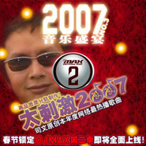

司文
============================

|  |  |
| :--: | :-- |
| [ 司文](https://i.xiami.com/siwenmusic) | **地区**: China 中国大陆 **风格**: 流行 Pop **播放数**: 4067723 **粉丝数**: 318 **评论数**: 11  |

## 档案

艺名：司文 
性别：男 
身高： 181cm 
体重：73 Kg 
血型：B型 
学历：本科 
毕业学校：北京工商大学 
职业：歌手 音乐制作人 词曲作者 CEO 
签约公司：东方传韵 
因为创作多首脍炙人口的光棍系列歌曲，被誉为“光棍代言人 
主要歌曲作品： 
《太刺激2007》《再见你一面》《光棍好苦》《我是草根我怕谁》《神啊,求求你啦》《完美老公》《光棍快乐》《老婆你是最好》《女光棍之歌》等 
主要彩铃作品： 
《我崩溃了》《光棍很酷》《不接你的电话我无所谓》《当我孤单我会想起你》《回来我的钱》《新猪八戒背媳妇》《这个世界你最好》等 
最新作品： 
《伤心的泪止不住》《寂寞黑金鱼》《嘻哈中国风》（太刺激2009）《美丽的春天》等 
个人简历： 
1995年 进入迷笛音乐学校学习MIDI制作 
2000年 创作歌曲《挡不住的诱惑》，参加我的中国芯歌曲评选活动进入决赛。并为此接受了MTV天籁村节目的专访 
2001年 创作歌曲《为谁在等候》被知名歌手金学锋购买版权2年 
2002年 为方正电脑公司创作企业歌曲〈超越未来〉，在方正电脑公司引起极大轰动。后邀请著名音乐人捞仔任监制，并亲自演唱了该歌曲 
2003年 为云南会泽烟厂创作企业歌曲《翠竹迎风》并担任制作人 
2004－2005年 跟随韩国音乐制作人学习MIDI编曲 
2005年春节创作歌曲仙女，被网友制作成FLASH参加北京电视台动画春晚，后在观众投票评选活动中进入3甲。并在4月份的颁奖典礼中获得特别大奖最佳歌曲奖 
2005年4月 应邀参加北京音乐台主办的大型节目“彩铃SHOW”大型演出活动，受到现场“铃迷”的热烈欢迎 
2005年5月接受青岛文艺台直播采访，节目中介绍了自己的音乐历程及作品《仙女》。节目播出后引起强烈凡响 
2005年5月 接受搜狐在线IT频道的网络直播专访，介绍自己的音乐及彩铃。并现场演唱了作品《仙女》，受到现场嘉宾和网友的一致好评 
2005年6月 参加了由中央人民广播电台，重庆电视台等主办的世界环境日“爱一滴水”公益演出活动 
2005年7月 龙之乐单曲CD推出，收录了仙女，为谁在等候，精彩铃05几首作品。并相继接受山西，青岛，大连，内蒙，湖北多家电台的直播访问 
2005年8月9日，司文作为嘉宾参加了互联星空游戏大赛新闻发布会，并现场演唱了本次大赛的主题曲。 
2005年8月13日，司文受邀参加了光线传煤推出的我爱12郎节目，在节目中演唱了黑金鱼，不接你的电话我无所谓，光棍好苦，当我孤单我会想起你几首歌曲和彩铃，受到现场观众和工作人员的一致好评。 
2006年2月 授予koook音乐网将2005年最受喜爱的网络歌手，参加2006年新浪网络春晚拍摄 
2006年3月15 参与今年“3?15”的主题宣传活动,现进行“我们的心愿”征集活动，作品 快拨打3.15 
2006年4月21日 创作完美老公 接受中央人民广播电台采访 
2006年4月，参与大型公益歌曲《给你我的爱》歌曲录制和mv拍摄 
2006年5月 作品 我是草根我怕谁 受到广大网民一致好评!并登上摆渡动画排行榜第一名 
2006年5月 参加龙乐明星俱乐部校园行活动――河北师范大学，受到学生追捧 
2006年6月 彩铃作品 《崩溃 》被中国移动 评为 “ 全年最受欢迎彩铃“作品称号，并成为著名彩铃节目《彩铃乐翻天》排行榜的常青树。而后又被话剧《开心麻花》指定用作剧中台词 
2006年7月参加了在南京举行的“网络风云会”活动 
2006年9月12日和16日，在内蒙成功举办2场歌友会，受到上万歌迷的追捧 
2006年9月底，参加浙江网络音乐节开幕式的大型演出，获得中国网络音乐十佳歌手奖，同时,光棍好苦获得网络十佳歌曲奖 
2006年10－12月，相继在山西，内蒙等地举办了5场歌友会，到场歌迷数万 
2007年1月，创作《太刺激2007》，迅速火爆网络，并受邀在北京电视台举办的娱乐大典上演唱该歌曲，成为07年伊始网络上最火爆的歌曲，受到千万网友的喜爱 
2007年3－5月，在河北秦皇岛等地举办多场歌友会 
2007年5月，太刺激2007被著名游戏公司盛大网络制成游戏上线 
2007年6月,太刺激2007被网友相继制作成  (无敌广告版) 
相继被sina,tom等各大网站首页推荐 
2007年9月 司文参加天津电视台通讯时空节目专访，讲述自己的音乐历程 
2007年10月25日，司文受邀参加《鲁豫有约》，并现场演唱光棍好苦，光棍快乐 
2007年11月，接受上海壹周报采访，之后壹周报大篇幅对司文的音乐历程进行报道 
2007年11月11日,光棍代言人司文重磅推出 >,被各大网站争相转载 
2007年12月24日 内蒙锡盟成功举办歌友会 
2008年1月 司文携酷兔兔团队获得无线音乐盛典最个性作品荣誉 
2008年1月 客串新浪播客春晚主持人 
2008年2月 出版歌曲专辑《太崩溃》收录十首创作歌曲 
2008年3月，创作并演唱 奥运歌曲《太刺激2008》《中国加油》《红色的火》 
2008年5月，创作歌曲《亲爱的妈妈》成为母亲节最热门歌曲制作一 
2008年6月，创作并演唱赈灾歌曲《我要爱》受到众多网络喜欢 
2008年8月，创作歌曲《逛北京》《宝宝唱奥运》为北京奥运呐喊助威 
2008年11月，创作歌曲《我不丑啊人也不坏》《女光棍之歌》均成为光棍节热门歌曲

## 专辑

| 名称 | 语种 | 唱片公司 | 发行时间 | 专辑类别 | 专辑风格 |
| :--: | :-- | :-- | :-- | :-- | :-- |
| [ 光棍好苦（吉他版）光棍之歌](./albums/2105408826.md) | 国语 |  | 2019年11月01日 | 录音室专辑 |  |
| [ 爱你个头（新版）](./albums/2105311636.md) | 国语 |  | 2019年10月05日 | 录音室专辑 | 流行 Pop, 嘻哈 Hip-Hop |
| [ 司文热歌精选](./albums/2103749426.md) | 国语 | 东方传韵 | 2018年06月13日 | 录音室专辑 | 流行 Pop |
| [ 那些记忆](./albums/2103738839.md) | 国语 | 东方传韵 | 2018年06月07日 | 录音室专辑 | 民谣 Folk |
| [ 风里雨里我在等你对唱情歌](./albums/2102804465.md) | 国语 | 东方传韵 | 2017年07月28日 | EP, 单曲 | 流行 Pop |
| [ 爱情那么美却让我心碎情歌对唱](./albums/2102782852.md) | 国语 | 东方传韵 | 2017年07月10日 | EP, 单曲 | 流行 Pop |
| [ 我不想情人节一个人过](./albums/2102782687.md) | 国语 | 东方传韵 | 2017年07月08日 | EP, 单曲 | 流行 Pop |
| [ 英雄](./albums/574060.md) | 国语 | 龙乐唱片 | 2013年01月01日 | EP, 单曲 |  |
| [ 尘缘如梦](./albums/559506.md) | 国语 | 东方传韵 | 2012年11月28日 | 录音室专辑 | 流行 Pop |
| [ 有种东西叫爱情](./albums/453389.md) | 国语 | 东方传韵 | 2010年04月16日 | 录音室专辑 |  |
| [ 太寂寞](./albums/453390.md) | 国语 | 东方传韵 | 2010年01月25日 | EP, 单曲 |  |
| [ 在我心里从此永远有个你](./albums/348295.md) | 国语 | 东方传韵 | 2009年09月21日 | EP, 单曲 | 流行 Pop |
| [ 司文 单曲集](./albums/2105007531.md) | 国语 | 龙乐世纪 | 2008年01月01日 | 录音室专辑 |  |
| [ 太刺激2007](./albums/993988775.md) | 国语 | 东方传韵 | 2007年03月24日 | EP, 单曲 | 流行 Pop |
| [ 司文的专辑](./albums/5022635039.md) | 其他 |  | 不详 |  |  |

## 评论

|  |  |  |
| :-- | :-- | :-- |
|  [虾米用户](https://emumo.xiami.com/u/358104299) 悲观的唯心存在现实解构虚... 2020-04-25 11:14 赞(0) 踩(0) | 
40779
 |
|  [虾米用户](https://emumo.xiami.com/u/410770456)  2018-12-19 00:55 赞(0) 踩(0) | 
好听  
 |
|  [虾米用户](https://emumo.xiami.com/u/342857862)  2018-08-30 04:15 赞(1) 踩(0) | 
好听 非常喜欢老师的歌 
 |
|  [虾米用户](https://emumo.xiami.com/u/366731602)  2018-06-21 21:33 赞(1) 踩(0) | 
好听啊
 |
|  [虾米用户](https://emumo.xiami.com/u/311180851)  2017-07-10 17:31 赞(3) 踩(0) | 
我刚入驻了虾米音乐人，欢迎大家来我的个人主页，收听我的最新音乐
 |
|  [虾米用户](https://emumo.xiami.com/u/198948445)  2016-07-09 09:34 赞(0) 踩(0) | 
好听
 |
|  [虾米用户](https://emumo.xiami.com/u/85177246)  2015-12-28 17:49 赞(0) 踩(0) | 
好听
 |
|  [虾米用户](https://emumo.xiami.com/u/4400366) 再也不见 2015-11-10 23:41 赞(0) 踩(0) | 
囍
 |
|  [虾米用户](https://emumo.xiami.com/u/5587261) Architect 2015-08-28 13:47 赞(0) 踩(0) | 
发自内心
 |
|  [虾米用户](https://emumo.xiami.com/u/688148)  2012-11-11 11:29 赞(1) 踩(0) | 
靠，今儿听还真是应景儿！！
 |
|  [虾米用户](https://emumo.xiami.com/u/1674939) 开始素食 2012-08-10 11:13 赞(0) 踩(0) | 
CG- -#
 |
